# 使用 RNNs 进行辅助绘图

在前一章中，我们介绍了构建一个简单的绘图应用程序的过程，该应用程序会尝试推断用户正在绘制的内容，并根据最可能的预测类别向用户提供替代方案；这个应用程序的目的是通过提供由微软的 Bing 图像搜索获得的完成草图来提高绘图任务的效率，而不是花费时间纠结于细节。

在本章中，我们将重新审视这个应用程序，但将探讨一种推断用户正在绘制的内容的替代方法。在这个过程中，我们将接触新的数据类型和机器学习模型。遵循熟悉的格式，我们首先将回顾任务，探索数据和模型，然后在一个游乐场中逐步构建所需的功能，最后将其迁移到我们的应用程序中。让我们开始吧。

# 辅助绘图

在本节中，我们将简要介绍本章的项目以及我们的目标。回顾前一章，我们描述了一个能够预测用户试图绘制的图像的应用程序，并根据预测的分类（如帆船）检索相似图像。基于这个预测，应用程序会搜索并下载该类别的图像。下载后，它会根据与用户草图相似度进行排序。然后，它会向用户展示排序后的替代方案，用户可以用草图进行交换。

完成的项目如下所示：

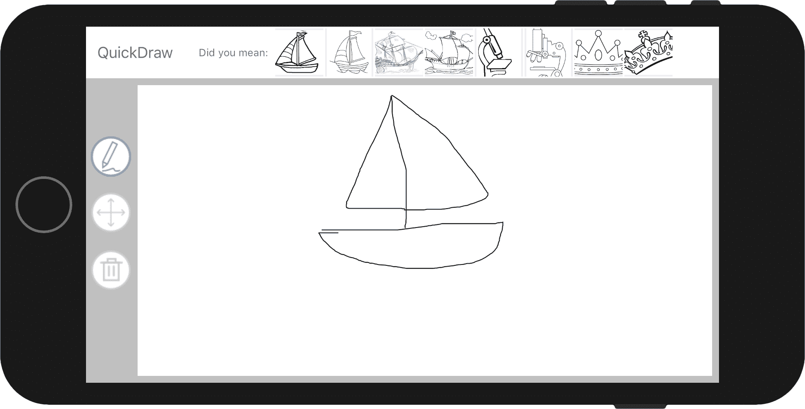

用于执行此分类的模型基于**卷积神经网络**（**CNN**），这是一种非常适合理解图像的神经网络类型，因为它能够找到局部模式并在这些较低层次模式的基础上构建更复杂和有趣的模式。我们利用这些高级模式，将它们作为排序下载图像的基础，使得那些在风格上与用户草图更相似的图像会首先显示出来。我们通过比较使用单词作为特征（单词类似于我们的高级模式）和距离公式来计算相似度，来推理这种工作的原理。

但我们的方法存在一些开销；为了进行准确的分类，我们需要完成大量的草图，还需要使用内存和 CPU 周期将图像光栅化，然后才能将其输入到我们的模型中。在本章中，我们将使用一种不依赖于像素作为特征，而是使用绘制它所用的**笔触序列**作为特征的替代方法。你可能有无数个理由想要这样做，包括：

+   数据或更大数据集的可访问性

+   预测准确性的潜在改进

+   生成能力，即能够预测和生成下一组笔触

但在这里，它为我们提供了探索一种本质上编码相同内容的数据类型——草图的机会。让我们在下一节中进一步探讨，我们将介绍在这个项目中将使用的数据集和模型。

# 绘图分类的循环神经网络

本章使用的模型是在谷歌的 AI 实验 *Quick**, Draw!* 中使用的数据集上训练的。

*Quick, Draw!* 是一款游戏，玩家被挑战绘制一个给定的物体，看看计算机是否能识别它；以下展示了数据的一个摘录：

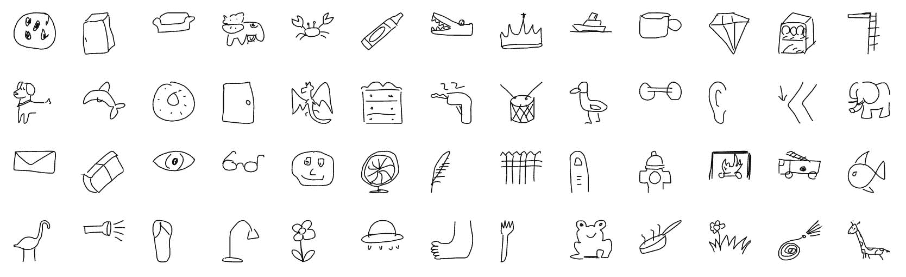

这种技术是从手写识别（谷歌翻译）的工作中受到启发的，在那里，团队不是将整个图像作为一个整体来看待，而是与描述字符如何绘制的特征数据一起工作。这在下图中得到了说明：

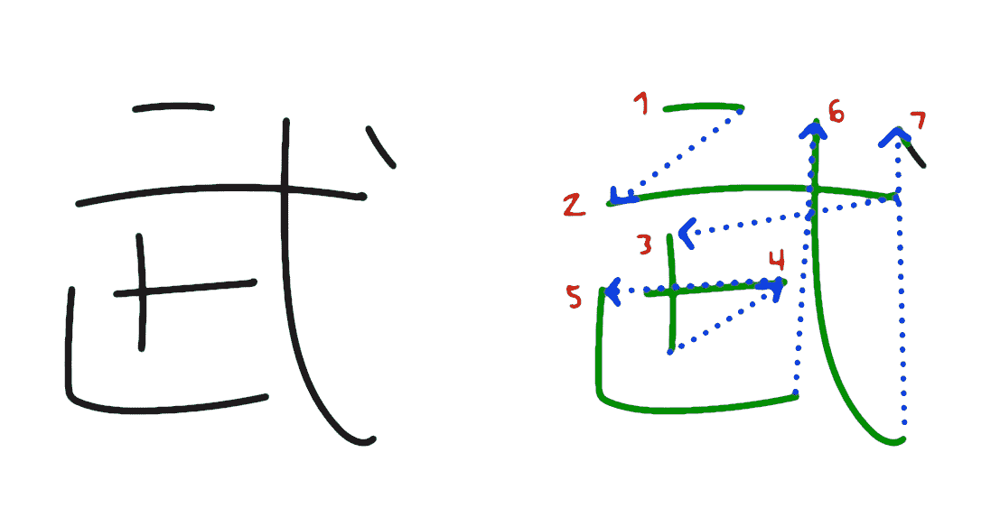

来源：[`experiments.withgoogle.com/ai/quick-draw`](https://experiments.withgoogle.com/ai/quick-draw)

这里的假设是，人们绘制某些类型物体时存在某种一致的规律；但要发现这些规律，我们需要大量的数据，而这些数据我们确实拥有。数据集包括从 *Quick, Draw!* 游戏玩家那里巧妙获得的超过 5000 万个绘图，涵盖了 345 个类别。每个样本都由带时间戳的向量和关联元数据描述，这些元数据说明了玩家所在的国家和用户请求的类别。您可以从官方网站了解更多关于数据集的信息：[`github.com/googlecreativelab/quickdraw-dataset`](https://github.com/googlecreativelab/quickdraw-dataset)。

为了使数据集和训练变得可管理，我们的模型只在 345 个类别中的 172 个类别上进行了训练，但用于创建和训练模型的 Notebook 供那些想要深入了解细节的人使用。为了更好地理解数据，让我们看一下单个样本，如下所示：

```py
{
    "key_id":"5891796615823360",
    "word":"nose",
    "countrycode":"AE",
    "timestamp":"2017-03-01 20:41:36.70725 UTC",
    "recognized":true,
    "drawing":[[[129,128,129,129,130,130,131,132,132,133,133,133,133,...]]]
 }
```

草图的细节被分解成一系列的笔触，每个笔触由一个包含 `x`、`y` 位置和 `timestamp` 的三维数组描述，这些构成了笔触的路径：

```py
[
    [ // First stroke
    [x0, x1, x2, x3, ...],
    [y0, y1, y2, y3, ...],
    [t0, t1, t2, t3, ...]
 ],
    [ // Second stroke
    [x0, x1, x2, x3, ...],
    [y0, y1, y2, y3, ...],
    [t0, t1, t2, t3, ...]
 ],
    ... // Additional strokes
 ]
```

如前所述，这是一个来自 **原始数据集** 的示例，*Quick, Draw!* 背后的团队发布了许多数据变体，从原始样本到预处理和压缩版本。我们主要对探索原始和简化版本感兴趣：前者因为它是我们拥有的最接近用户获取数据的表示，后者因为它被用来训练模型。

**剧透**：本章的大部分内容都涉及用户输入的预处理。

原始和简化版本都将每个类别存储在单独的文件中，文件格式为 NDJSON。

NDJSON 文件格式，即换行分隔的 JSON，是一种方便的格式，用于存储和流式传输可能逐条记录处理的结构化数据。正如其名所示，它将多个 JSON 格式的对象存储在单行中。在我们的情况下，这意味着每个样本都存储为一个单独的对象，由换行符分隔；你可以在[`ndjson.org`](http://ndjson.org)了解更多关于该格式的信息。

你可能会想知道原始版本和简化版本之间的区别是什么。当我们构建此应用程序所需的预处理功能时，我们将详细介绍这些细节，但正如其名所示，简化版本通过删除任何不必要的点以及应用某种程度的标准化来降低每个笔触的复杂性——这是处理任何数据时的典型要求，以便使样本更具可比性。

现在我们对我们处理的数据有了更好的理解，让我们转向如何从这些序列中学习，通过简要讨论本章使用的模型细节来建立一些直觉。

在前面的章节中，我们看到了许多例子，说明了卷积神经网络（CNNs）如何从局部的二维块中学习有用的模式，这些模式本身可以进一步从原始像素抽象出更具描述力的东西。鉴于我们对图像的理解并非由独立的像素组成，而是一系列与相邻像素相关的像素集合，这些像素集合反过来描述了物体的各个部分，这一点相当直观。在第一章《机器学习简介》中，我们介绍了一种**循环神经网络**（**RNN**），它是构建用于语言翻译的**序列到序列**（**Seq2Seq**）模型的主要组成部分，并看到了其记忆能力使其非常适合顺序数据，其中顺序很重要。正如之前所强调的，我们的给定样本由笔触序列组成；循环神经网络是学习对草图进行分类的合适候选者。

作为快速回顾，循环神经网络（RNNs）通过一个反馈循环实现了一种**选择性记忆**，这个反馈循环在训练过程中进行调整；从图解上看，如下所示：

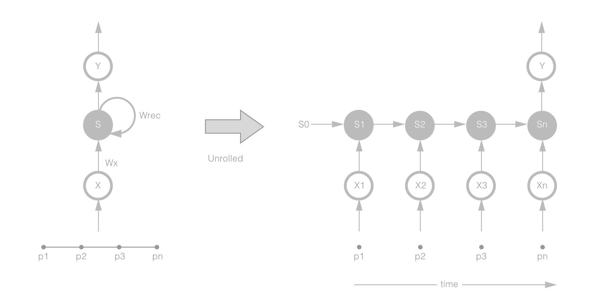

左边是实际的网络，右边是在四个时间步上展开的相同网络。随着草图笔触的点被输入，它们被层权重与当前状态相乘，然后被反馈回网络并/或输出。在训练过程中，这种反馈允许网络学习有序序列的模式。我们可以将这些循环层堆叠起来，就像我们在 CNN 中做的那样，以学习更复杂和抽象的模式。

但递归层并不是从序列数据中学习模式的唯一方法。如果你将 CNN 的概念推广为能够在任何维度上学习局部模式（而不仅仅是两个维度），那么你就可以看到我们如何可以使用 1D 卷积层来实现与递归层类似的效果。在那里，类似于 2D 卷积层，我们在序列中学习 1D 核（将时间视为空间维度）以找到局部模式来表示我们的数据。使用卷积层的优势是它的计算成本远低于其对应层，这使得它非常适合处理器和功率受限的设备，如手机。它还有其能够学习独立于顺序的模式的能力，类似于 2D 核对位置的不变性。在此图中，我们说明了 1D 卷积层如何作用于输入数据：

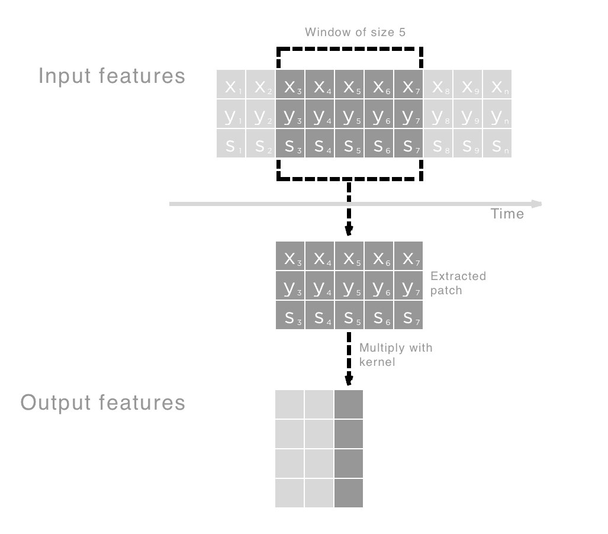

在这个上下文中，笔触（局部于窗口大小）将独立于它们在序列中的位置而被学习，并将输出紧凑的表示，然后我们可以将其输入到 RNN 中，从这些笔触中学习有序序列（而不是从原始点中学习）。直观地，你可以将我们的模型视为最初学习垂直和水平等笔触（独立于时间），然后在后续的由 RNN 组成的层中学习从这些笔触的有序序列中更高阶的模式，如形状。以下图说明了这个概念：

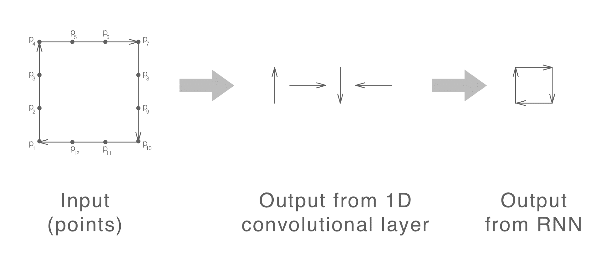

在左侧，我们有输入到模型中的原始点。中间部分显示了 1D 卷积层如何从这些点中学习局部模式，以笔触的形式。最后，在右侧，我们有后续的 RNN 从这些笔触的序列中学习顺序敏感的模式。

在介绍模型之前，还有一个概念需要介绍，但在这样做之前，我想让你快速思考一下你如何画一个正方形。你是按顺时针方向画还是按逆时针方向画？

在本节中，我想简要介绍的最后一种概念是双向层；双向层试图使我们的网络对先前的问题不变。我们之前讨论了 RNN 对顺序的敏感性，这正是它们在这里有用的原因，但正如我希望已经强调的，我们的草图可能是按相反的顺序绘制的。为了解决这个问题，我们可以使用双向层，正如其名称所暗示的，它以两个方向（按时间顺序和逆时间顺序）处理输入序列，然后合并它们的表示。通过从两个方向处理序列，我们的模型可以变得对绘制方向有一定的不变性。

我们现在已经介绍了用于此模型的所有构建块；以下图显示了整个模型：

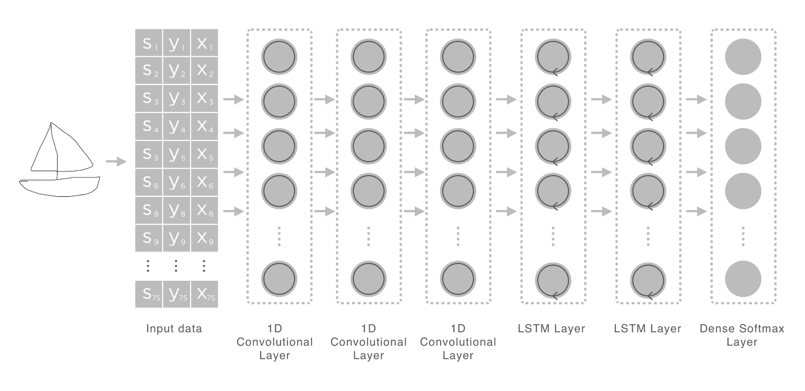

提醒一下，这本书主要关注与 Core ML 相关的机器学习应用。因此，我们不会深入探讨这个（或任何）模型的细节，但会涵盖足够的内容，以便您能够直观地理解模型的工作原理，以便您使用和进一步探索。

如前所述，我们的模型由一系列一维卷积层组成，这些层输入到一个**长短期记忆**（**LSTM**）堆栈中，这是一个循环神经网络（RNN）的实现，然后输入到一个全连接层，在那里我们做出预测。这个模型在 172 个类别上进行了训练，每个类别使用 10,000 个训练样本和 1,000 个验证样本。经过 16 个 epoch 后，模型在训练和验证数据上达到了大约 78%的准确率，如下所示：

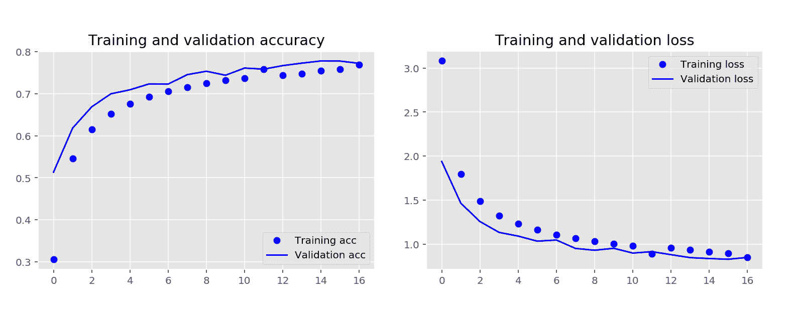

我们现在有了我们的模型，但只是匆匆浏览了我们实际上输入到模型中的内容。在下一节中，我们将讨论我们的模型是用什么进行训练的（因此期望什么）并实现所需的函数来准备它。

# 输入数据和预处理

在本节中，我们将实现预处理功能，以将我们的原始用户输入转换为模型所期望的格式。我们将在操场项目中构建此功能，然后在下一节中将其迁移到我们的项目中。

如果您还没有这样做，请从配套的仓库中拉取最新的代码[`github.com/PacktPublishing/Machine-Learning-with-Core-ML`](https://github.com/PacktPublishing/Machine-Learning-with-Core-ML)。下载后，导航到目录`Chapter8/Start/`并打开操场项目`ExploringQuickDrawData.playground`。一旦加载，您将看到本章的操场，如下所示：

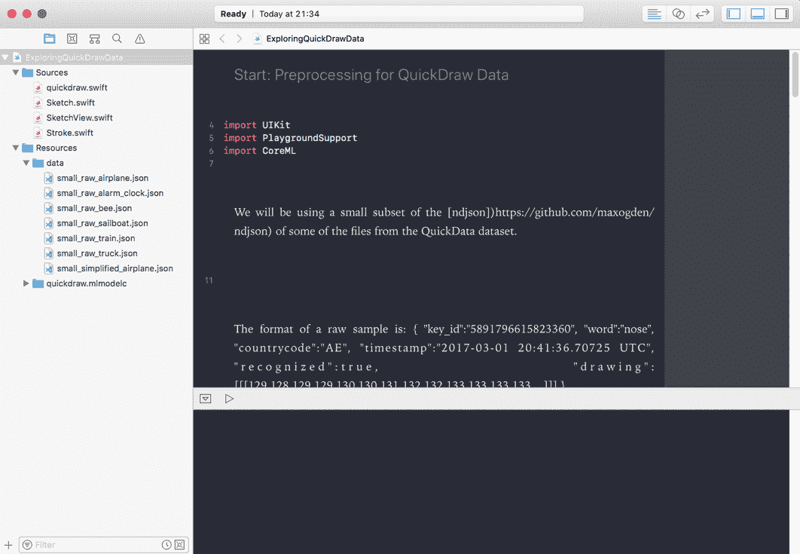

操场包括一些原始*Quick, Draw!*数据集的样本，一个简化的提取，以及我们在上一章中创建的编译模型和支持类，用于表示草图（`Stroke.swift`，`Sketch.swift`）和渲染它（`SketchView.swift`）。本节的目标将是更好地理解在将数据输入模型之前所需的预处理；这样做时，我们将扩展我们现有的类以封装此功能。

在我们继续前进之前，让我们先回顾一下现有的代码；如果您向下滚动打开的源文件，您将看到`createFromJSON`和`drawSketch`方法。前者接受一个 JSON 对象（我们的样本保存的格式）并返回一个强类型对象：`StrokeSketch`。提醒一下，每个样本由以下内容组成：

+   `key_id`: 唯一标识符

+   `word`: 类别标签

+   `countrycode`: 样本抽取的国家代码

+   `timestamp`: 样本创建的时间戳

+   `recognized`: 一个标志，表示草图是否当前被识别

+   `drawing`：一个多维数组，由*x*，*y*坐标的数组组成，以及自点创建以来经过的时间

`StrokeSketch`将单词映射到标签属性，并将*x*，*y*坐标映射到笔触点。我们丢弃其他所有内容，因为在分类中认为它没有用，并且我们的模型也没有使用。`drawSketch`方法是一个实用方法，它在创建`SketchView`实例以渲染缩放和居中的草图之前处理缩放和居中。

最后一块代码预加载 JSON 文件，并通过字典`loadedJSON`使它们可用，其中键是相关文件名，值是加载的 JSON 对象。

让我们先看看数据，比较原始样本和简化样本；将以下代码添加到您的游乐场中：

```py
if let rJson = loadedJSON["small_raw_airplane"],
    let sJson = loadedJSON["small_simplified_airplane"]{

    if let rSketch = StrokeSketch.createFromJSON(json: rJson[0] as?   [String:Any]),
        let sSketch = StrokeSketch.createFromJSON(json: sJson[0] as? [String:Any]){
        drawSketch(sketch: rSketch)
        drawSketch(sketch: sSketch)
    }

    if let rSketch = StrokeSketch.createFromJSON(json: rJson[1] as? [String:Any]),
        let sSketch = StrokeSketch.createFromJSON(json: sJson[1] as? [String:Any]){
        drawSketch(sketch: rSketch)
        drawSketch(sketch: sSketch)
    }
}
```

在前面的代码片段中，我们只是获取我们加载的 JSON 文件的引用，并将索引 0 和 1 的样本传递给我们的`createFromJSON`文件，它将返回它们的`StrokeSketch`表示。然后我们继续将其传递给`drawSketch`方法以创建渲染视图。运行后，您可以通过单击位于方法`drawSketch`同一行的右侧面板上的眼睛图标来预览每个草图。以下图像展示了两个输出并排比较：

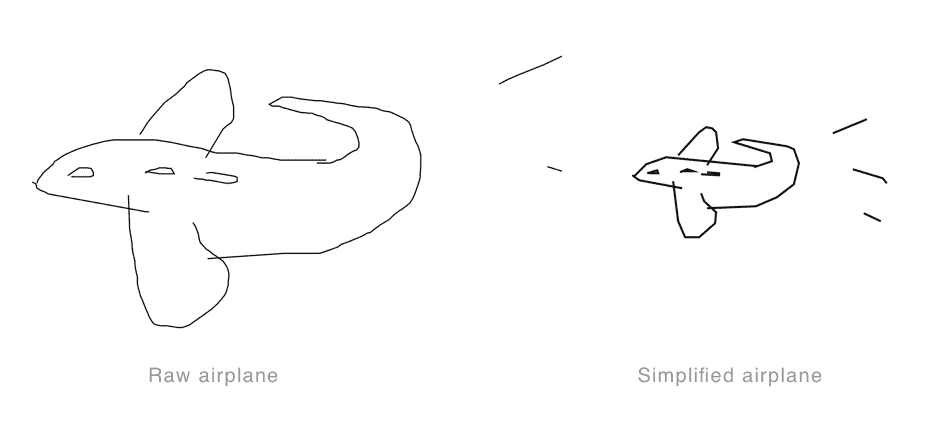

从原始数据集和简化数据集的样本中可以看到的主要差异在前面的图中。原始样本要大得多，也更平滑。从之前的图像中不明显的是，简化样本位于左上角，而原始样本由原始和绝对位置上的点组成（回想一下，我们的`drawSketch`方法在需要时重新缩放并居中草图）。

提醒一下，原始样本类似于我们期望从用户那里接收到的输入，而另一方面，我们的模型是在简化数据集的样本上训练的。因此，我们需要执行与将原始数据转换为简化对应物相同的预处理步骤，在将数据输入我们的模型之前。这些步骤在数据存储库[`github.com/googlecreativelab/quickdraw-dataset`](https://github.com/googlecreativelab/quickdraw-dataset)中描述如下，这是我们将在我们的游乐场中实现的内容：

+   将绘图对齐到左上角，使其最小值为零

+   将绘图均匀缩放，使其最大值为 255

+   使用一像素间距对所有笔触进行重采样

+   使用 2.0 的 epsilon 值，使用 Ramer-Douglas-Peucker 算法简化所有笔触

Ramer-Douglas-Peucker 算法接受由线段（笔画）组成的曲线，并找到具有更少点的更简单曲线。您可以在以下链接中了解更多关于该算法的信息：[`en.wikipedia.org/wiki/Ramer-Douglas-Peucker_algorithm`](https://en.wikipedia.org/wiki/Ramer-Douglas-Peucker_algorithm).

这些步骤背后的原理应该是相当直观的，并且从显示飞机两个草图的图中可以突出显示。也就是说，飞机应该对其在屏幕上的实际位置不变，并且对比例不变。简化笔画使得我们的模型更容易学习，因为它有助于确保我们只捕获显著特征。

首先，创建您的`StrokeSketch`类的扩展，并像下面所示地创建`simplify`方法的占位符：

```py
public func simplify() -> StrokeSketch{
    let copy = self.copy() as! StrokeSketch     
}
```

我们将修改实例的副本，这就是为什么我们首先创建一个副本。接下来，我们想要计算将草图缩放到最大高度和/或宽度为 255，同时尊重其宽高比所需的比例因子；将以下代码添加到您的`simplify`方法中，它正是这样做的：

```py
let minPoint = copy.minPoint
let maxPoint = copy.maxPoint
let scale = CGPoint(x: maxPoint.x-minPoint.x, y:maxPoint.y-minPoint.y)

var width : CGFloat = 255.0
var height : CGFloat = 255.0

// adjust aspect ratio
if scale.x > scale.y{
    height *= scale.y/scale.x
} else{
    width *= scale.y/scale.x
} 
```

对于每个维度（`宽度`和`高度`），我们已经计算了确保我们的草图被缩放到`255`维度的所需比例。现在我们需要将此应用于`StrokeSketch`类持有的每个笔画相关的每个点；当我们遍历每个点时，将草图对齐到左上角（`x= 0`，`y = 0`）作为所需的预处理步骤也是有意义的。我们可以通过减去每个维度的最小值来实现这一点。将以下代码附加到您的`simplify`方法中来完成此操作：

```py
for i in 0..<copy.strokes.count{
    copy.strokes[i].points = copy.strokes[i].points.map({ (pt) -> CGPoint in
        let x : CGFloat = CGFloat(Int(((pt.x - minPoint.x)/scale.x) * width))
        let y : CGFloat = CGFloat(Int(((pt.y - minPoint.y)/scale.y) * height))        
        return CGPoint(x:x, y:y)
    })
}   
```

我们的最后一步是使用 Ramer-Douglas-Peucker 算法简化曲线；为此，我们将使`Stroke`负责实现细节，并将任务委托给那里。将以下代码添加到您的`StrokeSketch`扩展中的`simplify`方法中：

```py
copy.strokes = copy.strokes.map({ (stroke) -> Stroke in
    return stroke.simplify()
})

return copy
```

Ramer-Douglas-Peucker 算法递归遍历曲线，最初从第一个和最后一个点开始，找到离这个线段最远的点。如果这个点比给定的阈值近，那么可以丢弃当前标记为保留的任何点，但如果这个点比我们的阈值大，那么这个点必须保留。然后算法递归地调用自身，使用第一个点和最远点以及最远点和最后一个点。遍历整个曲线后，结果是只包含之前描述的标记为保留的点的简化曲线。这个过程在以下图中总结：

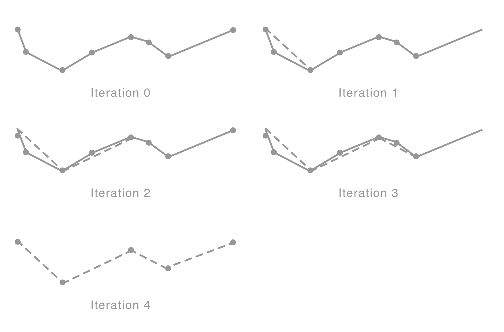

让我们从扩展`CGPoint`结构以包括一个计算给定直线上的点距离的方法开始；将此代码添加到您的游乐场中：

```py
public extension CGPoint{

    public static func getSquareSegmentDistance(p0:CGPoint,
                                                p1:CGPoint,
                                                p2:CGPoint) -> CGFloat{
        let x0 = p0.x, y0 = p0.y
        var x1 = p1.x, y1 = p1.y
        let x2 = p2.x, y2 = p2.y
        var dx = x2 - x1
        var dy = y2 - y1

        if dx != 0.0 && dy != 0.0{
            let numerator = (x0 - x1)
                * dx + (y0 - y1)
                * dy
            let denom = dx * dx + dy * dy
            let t = numerator / denom

            if t > 1.0{
                x1 = x2
                y1 = y2
            } else{
                x1 += dx * t
                y1 += dy * t
            }
        }

        dx = x0 - x1
        dy = y0 - y1

        return dx * dx + dy * dy
    }
} 
```

在这里，我们向`CGPoint`结构中添加了一个静态方法；它计算给定一条线（这是我们之前描述的比较阈值以简化线条的值）的点的垂直距离。接下来，我们将实现描述中的递归方法，它将用于通过测试和丢弃低于阈值的任何点来构建曲线。如前所述，我们将此功能封装在`Stroke`类本身中，所以我们首先通过创建扩展的占位符开始：

```py
public extension Stroke{
}
```

现在，在扩展中添加递归方法：

```py
func simplifyDPStep(points:[CGPoint], first:Int, last:Int,
                    tolerance:CGFloat, simplified: inout [CGPoint]){

    var maxSqDistance = tolerance
    var index = 0

    for i in first + 1..<last{
        let sqDist = CGPoint.getSquareSegmentDistance(
            p0: points[i],
            p1: points[first],
            p2: points[last])

        if sqDist > maxSqDistance {
            maxSqDistance = sqDist
            index = i
        }
    }

    if maxSqDistance > tolerance{
        if index - first > 1 {
            simplifyDPStep(points: points,
                           first: first,
                           last: index,
                           tolerance: tolerance,
                           simplified: &simplified)
        }

        simplified.append(points[index])

        if last - index > 1{
            simplifyDPStep(points: points,
                           first: index,
                           last: last,
                           tolerance: tolerance,
                           simplified: &simplified)
        }
    }
} 
```

这大部分应该很容易理解，因为它是对描述的算法的直接实现。我们首先找到最远的距离，它必须大于我们的阈值；否则，该点将被忽略。我们将该点添加到要保留的点数组中，然后将线段的每个端点传递给我们的递归方法，直到我们遍历整个曲线。

我们需要实现的最后一个方法是负责启动此过程的那个方法，我们也将将其封装在我们的`Stroke`扩展中；所以请继续并添加以下方法到你的扩展中：

```py
public func simplify(epsilon:CGFloat=3.0) -> Stroke{

    var simplified: [CGPoint] = [self.points.first!]

    self.simplifyDPStep(points: self.points,
                        first: 0, last: self.points.count-1,
                        tolerance: epsilon * epsilon,
                        simplified: &simplified)

    simplified.append(self.points.last!)

    let copy = self.copy() as! Stroke
    copy.points = simplified

    return copy
}
```

`simplify`方法简单地（请原谅这个双关语）创建了一个包含简化曲线点的数组，添加第一个点，然后启动我们刚刚实现的递归方法。然后，当曲线被遍历后，它最终添加最后一个点，并在返回简化点的`Stroke`之前完成。

到目前为止，我们已经实现了将原始输入转换为简化形式所需的功能，正如在*Quick, Draw!*仓库中指定的那样。让我们通过比较我们的简化原始草图与现有简化草图来验证我们的工作。将以下代码添加到你的游乐场中：

```py
  if let rJson = loadedJSON["small_raw_airplane"],
    let sJson = loadedJSON["small_simplified_airplane"]{

    if let rSketch = StrokeSketch.createFromJSON(json: rJson[2] as? [String:Any]),
        let sSketch = StrokeSketch.createFromJSON(json: sJson[2] as? [String:Any]){
        drawSketch(sketch: rSketch)
        drawSketch(sketch: sSketch)
        drawSketch(sketch: rSketch.simplify())
    }
}
```

如前所述，你可以点击右侧面板中每个`drawSketch`调用内的眼睛图标来预览每个草图。第一个是从原始数据集中的草图，第二个是从简化数据集中，第三个是使用我们的简化实现，使用原始数据集的样本。如果一切按计划进行，你应该会看到以下类似的内容：

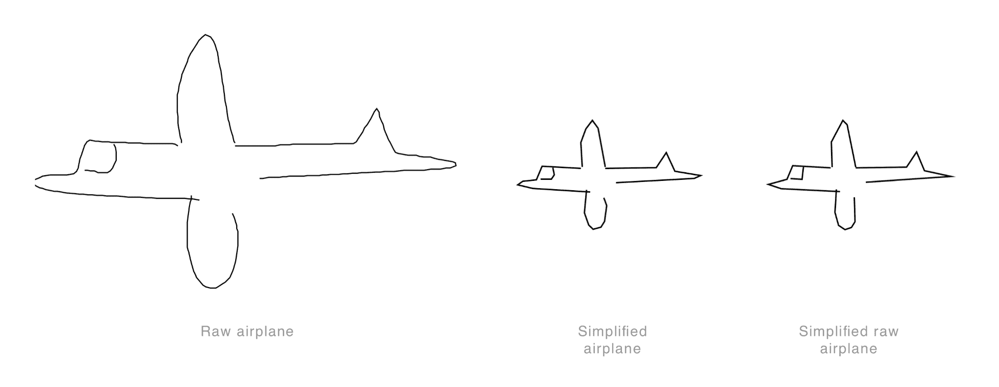

仔细观察，我们的简化版本看起来比简化数据集的样本更具侵略性，但我们可以通过调整阈值轻松地调整这一点。然而，从所有目的来看，目前这已经足够了。到目前为止，我们已经拥有了简化数据集所需的功能，将其转换成类似于训练数据集的形式。但在将数据输入模型之前，我们还有更多的预处理要做；现在就让我们开始，先快速讨论一下我们的模型期望的是什么。

我们的模型期望每个样本具有三个维度；点位置*(x, y)*和一个标志位，表示该点是否为其相关笔画的最后一个点。拥有这个标志位的原因是我们传递了一个固定长度的序列，大小为 75。也就是说，每个草图要么被截断以挤入这个序列，要么用前导零填充以填满它。使用标志位是一种添加上下文的方式，指示它是否是笔画的结束（记住我们的序列代表我们的草图，我们的草图由许多笔画组成）。

然后，像往常一样，我们将输入归一化到*0.0 - 1.0*的范围内，以避免在训练过程中由于权重过大而导致模型波动。最后的调整是将我们的绝对值转换为增量，这当你这么想的时候很有道理。第一个原因是，我们希望我们的模型对每个点的实际位置不变；也就是说，我们可以并排绘制相同的草图，理想情况下，我们希望这些被分类为同一类。在前一章中，我们通过使用在像素数据范围和位置上操作的 CNN 实现了这一点，就像我们现在所做的那样。使用增量而不是绝对值的第二个原因是，增量比绝对位置携带更多的有用信息，即方向。在实现这一点后，我们将准备好测试我们的模型，让我们开始吧；首先添加以下扩展和方法，它将负责这个预处理步骤：

```py
extension StrokeSketch{

    public static func preprocess(_ sketch:StrokeSketch)
        -> MLMultiArray?{
        let arrayLen = NSNumber(value:75 * 3) 

        guard let array = try? MLMultiArray(shape: [arrayLen],
                                            dataType: .double)
            else{ return nil }

        let simplifiedSketch = sketch.simplify()

    }
}     
```

在这里，我们通过扩展将静态方法`preprocess`添加到`StrokeSketch`类中；在这个方法中，我们首先设置将传递给我们的模型的缓冲区。这个缓冲区的大小需要适合完整的序列，这可以通过简单地乘以序列长度（`75`）和维度数（`3`）来计算。然后我们调用`StrokeSketch`实例上的`simplify`以获得简化的草图，确保它与我们训练模型的数据非常相似。

接下来，我们将对每一笔的每个点进行迭代，对点进行归一化，并确定标志位的值（一个表示笔画的结束；否则为 0）。将以下代码添加到您的`preprocess`方法中：

```py
let minPoint = simplifiedSketch.minPoint
let maxPoint = simplifiedSketch.maxPoint
let scale = CGPoint(x: maxPoint.x-minPoint.x,
                    y:maxPoint.y-minPoint.y)

var data = Array<Double>()

for i in 0..<simplifiedSketch.strokes.count{
    for j in 0..<simplifiedSketch.strokes[i].points.count{
        let point = simplifiedSketch.strokes[i].points[j]
        let x = (point.x-minPoint.x)/scale.x
        let y = (point.y-minPoint.y)/scale.y
        let z = j == simplifiedSketch.strokes[i].points.count-1
            ? 1 : 0

        data.append(Double(x))
        data.append(Double(y))
        data.append(Double(z))
    }
```

我们首先获取最小值和最大值，我们将使用这些值来归一化每个点（使用方程*x^i−min(x)/max(x)−min(x)*，其中*x[i]*是一个单独的点，*x*代表该笔画内的所有点）。然后我们创建一个临时位置来存储数据，在迭代所有我们的点、归一化每个点并确定标志位的值，如之前所述之前。

现在，我们想要计算每个点的增量，并最终移除最后一个点，因为我们无法计算它的增量；将以下内容添加到您的`preprocess`方法中：

```py
let dataStride : Int = 3
for i in stride(from: dataStride, to:data.count, by: dataStride){
    data[i - dataStride] = data[i] - data[i - dataStride] 
    data[i - (dataStride-1)] = data[i+1] - data[i - (dataStride-1)] 
    data[i - (dataStride-2)] = data[i+2] 
}

data.removeLast(3)
```

之前的代码应该是自解释的；唯一值得强调的显著点是，我们现在处理的是一个展平的数组，因此我们在遍历数据时需要使用`3`的步长。

需要添加的最后一段代码！我们需要确保我们的数组等于 75 个样本（即我们的序列长度，也就是长度为 225 的数组）。我们可以通过截断数组（如果太大）或填充它（如果太小）来实现这一点。我们可以在从我们的临时数组`data`复制数据到我们将传递给模型的缓冲区`array`时轻松完成此操作。在这里，我们首先计算起始索引，然后遍历整个序列，如果当前索引已经超过起始索引，则复制数据，否则用零填充。将以下片段添加到完成您的`preprocess`方法：

```py
var dataIdx : Int = 0
let startAddingIdx = max(array.count-data.count, 0)

for i in 0..<array.count{
    if i >= startAddingIdx{
        array[i] = NSNumber(value:data[dataIdx])
        dataIdx = dataIdx + 1
    } else{
        array[i] = NSNumber(value:0)
    }
}

return array
```

我们的`preprocess`方法现在已经完成，我们准备测试我们的模型。我们将首先实例化我们的模型（包含在游乐场中），然后输入我们之前使用过的飞机样本，在测试其他类别之前进行测试。将以下代码添加到您的游乐场中：

```py
let model = quickdraw()

if let json = loadedJSON["small_raw_airplane"]{
    if let sketch = StrokeSketch.createFromJSON(json: json[0] as? [String:Any]){
        if let x = StrokeSketch.preprocess(sketch){
            if let predictions = try? model.prediction(input:quickdrawInput(strokeSeq:x)){
                print("Class label \(predictions.classLabel)")
                print("Class label probability/confidence \(predictions.classLabelProbs["airplane"] ?? 0)")
            }
        }
    }
}
```

如果一切顺利，您的游乐场将在控制台输出以下内容：

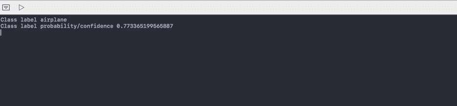

它已经预测了飞机类别，并且相当自信地预测了（概率约为 77%）。在我们将代码迁移到我们的应用程序之前，让我们测试一些其他类别；我们将首先实现一个处理所有前期工作的方法，然后传递一些样本以执行推理。将以下方法添加到您的游乐场中，它将负责在将样本传递给模型进行预测之前获取和预处理样本，然后以包含最可能类别和概率的格式化字符串返回结果：

```py
func makePrediction(key:String, index:Int) -> String{
    if let json = loadedJSON[key]{
        if let sketch = StrokeSketch.createFromJSON(
            json: json[index] as? [String:Any]){
            if let x = StrokeSketch.preprocess(sketch){
                if let predictions = try? model.prediction(input:quickdrawInput(strokeSeq:x)){
                    return "\(predictions.classLabel) \(predictions.classLabelProbs[predictions.classLabel] ?? 0)"
                }
            }
        }
    }

    return "None"
}
```

现在大部分工作已经完成，我们只剩下令人紧张的测试任务，即测试我们的预处理实现和模型是否足够能够预测我们传递的样本。让我们对每个类别进行测试；将以下代码添加到您的游乐场中：

```py
print(makePrediction(key: "small_raw_airplane", index: 0))
print(makePrediction(key: "small_raw_alarm_clock", index: 1))
print(makePrediction(key: "small_raw_bee", index: 2))
print(makePrediction(key: "small_raw_sailboat", index: 3))
print(makePrediction(key: "small_raw_train", index: 4))
print(makePrediction(key: "small_raw_truck", index: 5))
print(makePrediction(key: "small_simplified_airplane", index: 0))
```

这些输出的截图如下所示：

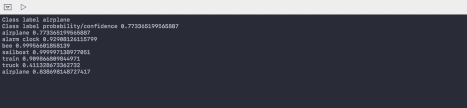

不错！我们成功预测了所有类别，尽管卡车只给出了 41%的概率。而且有趣的是，我们的简化飞机样本被赋予了更高的概率（84%），而其来自原始数据集的对应样本的概率为 77%。

出于好奇，让我们看看我们要求模型预测的卡车样本：

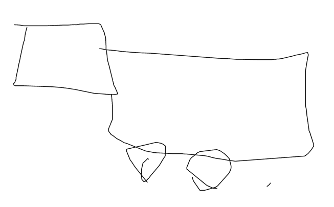

尽管对艺术家表示敬意，但我很难从这个草图预测出一辆卡车，所以完全归功于我们的模型。

我们现在已经将我们的模型暴露于各种类别中，并且我们能够正确预测每一个类别，这意味着我们的预处理代码已经满意地实现了。我们现在准备将我们的代码迁移到我们的应用程序中，但在这样做之前，还有一个最后的实验。让我们思考一下我们的模型是如何被训练的，以及它将在应用程序的上下文中如何被使用。模型是在用户绘制草图时产生的序列（即笔触）上训练的。这正是用户将如何与我们的应用程序互动；他们将通过一系列（或序列）的笔触来绘制某物；每次他们完成一笔，我们都想尝试预测他们试图绘制的内容。让我们通过逐步构建一个样本笔触，并在每次添加后续笔触后进行预测，来模拟这种行为，以评估模型在更真实的环境中的表现。将以下代码添加到您的游乐场中：

```py
if let json = loadedJSON["small_raw_bee"]{
    if let sketch = StrokeSketch.createFromJSON(json: json[2] as? [String:Any]){
        let strokeCount = sketch.strokes.count
        print("\(sketch.label ?? "" ) sketch has \(strokeCount) strokes")

        for i in (0..<strokeCount-1).reversed(){
            let copyOfSketch = sketch.copy() as! StrokeSketch
            copyOfSketch.strokes.removeLast(i)
            if let x = StrokeSketch.preprocess(copyOfSketch){
                if let predictions = try? model.prediction(input:quickdrawInput(strokeSeq:x)){
                    let label = predictions.classLabel
                    let probability = String(format: "%.2f", predictions.classLabelProbs[predictions.classLabel] ?? 0)

                    print("Guessing \(label) with probability of \(probability) using \(copyOfSketch.strokes.count) strokes")
                }
            }
        }
    }
} 
```

这里没有引入任何新内容；我们只是在加载一个草图，像之前讨论的那样，逐笔慢慢构建，并将部分草图传递给我们的模型进行推理。以下是结果，以及它们对应的草图，以提供更多上下文：

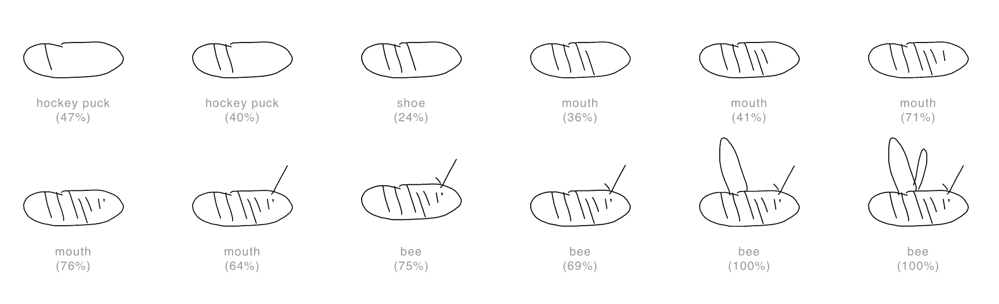

所有的合理预测，可能揭示了许多人如何绘制**冰球**、**嘴巴**和**蜜蜂**。现在，对我们实现的结果感到满意后，让我们继续到下一部分，我们将迁移这段代码，并看看我们如何在运行时获取和编译模型。

# 将所有这些整合在一起

如果您还没有做，请从配套的仓库中拉取最新的代码：[`github.com/packtpublishing/machine-learning-with-core-ml`](https://github.com/packtpublishing/machine-learning-with-core-ml)。下载后，导航到目录`Chapter8/Start/QuickDrawRNN`并打开项目`QuickDrawRNN.xcodeproj`。一旦加载，您将看到一个您应该很熟悉的项目，因为它几乎是我们之前章节中构建的项目的一个复制品。因此，我这里不会详细说明，但您可以自由地通过快速浏览上一章来刷新您的记忆。

我更想花些时间强调我认为设计和构建人与机器学习系统之间界面最重要的一个方面。让我们从这里开始，然后继续将我们的代码从游乐场项目迁移过来。

我认为 Quick, Draw!是一个很好的例子，它突出了任何机器学习系统界面设计师的主要责任。让它脱颖而出的不是使它对缩放和转换不变的巧妙预处理。也不是它能够有效学习复杂序列的复杂架构，而是用来捕获训练数据的机制。我们在创建智能系统时面临的一个主要障碍是获取（足够的）干净和标记的数据，我们可以用这些数据来训练我们的模型。"Quick, Draw!"通过，我假设，故意成为一个通过引人入胜的游戏界面来捕获和标记数据的工具——足够吸引人，足以激励大量用户生成足够数量的标记数据。尽管一些草图可能值得怀疑，但草图的数量本身稀释了这些异常值。

问题的关键在于机器学习系统不是静态的，我们应该设计机会让用户在适用的情况下纠正系统，并捕获新的数据，无论是隐式地（在用户同意的情况下）还是显式地。在用户和系统之间允许一定程度的透明度，并允许用户在模型错误时进行纠正，这不仅为我们提供了改进模型的新数据，而且——同样重要的是——帮助用户构建一个有用的系统心理模型。因此，它围绕我们系统的可用性建立了一些直觉，这有助于他们正确使用它。

在我们的示例项目中，我们可以轻松地展示预测并提供用户纠正模型的方法。但为了确保本章简洁，我们只看看我们如何获得一个更新的模型，通常（记住 Core ML 适合推理而不是训练），我们会在设备上对其进行训练。在这种情况下，你会上传数据到中央服务器，并在可用时获取更新的模型。如前所述，这里我们将探讨后者：我们如何获得更新的模型。让我们看看。

之前我提到过，并暗示过，你通常会上传新的训练数据并在设备上训练你的模型。当然，这并不是唯一的选择，使用用户的个人数据在设备上调整模型进行训练也是合理的。在本地训练的优势是隐私和低延迟，但它的缺点是会削弱集体智慧，即从集体行为中改进模型。谷歌提出了一种巧妙的解决方案，确保了隐私并允许协作。在一篇题为“*联邦学习：无需集中训练数据的协同机器学习*”的帖子中，他们描述了一种在设备上使用个性化数据本地训练的技术，然后将调整后的模型仅上传到服务器，服务器会平均来自众人的权重，在更新中央模型之前。我鼓励你阅读这篇帖子，[`research.googleblog.com/2017/04/federated-learning-collaborative.html`](https://research.googleblog.com/2017/04/federated-learning-collaborative.html)。

正如你在使用 Core ML 时可能已经预料到的，大部分工作不是与框架接口，而是它之前和之后的活动。编译和实例化一个模型只需两行代码，如下所示：

```py
let compiledUrl = try MLModel.compileModel(at: modelUrl)
let model = try MLModel(contentsOf: compiledUrl)
```

其中`modelUrl`是本地存储的`.mlmodel`文件的 URL。将其传递给`compileModel`将返回`.mlmodelc`文件。这可以用来初始化`MLModel`的一个实例，它提供了与你的应用程序捆绑的模型相同的功能。

下载和编译是耗时的。因此，你不仅想在主线程之外做这件事，还想避免执行不必要的任务；也就是说，本地缓存，并在需要时才更新。现在让我们实现这个功能；点击左侧面板上的`QueryFacade.swift`文件，将其带到主编辑窗口的焦点。然后向`QueryFacade`类添加一个新的扩展，我们将在这里添加负责下载和编译模型的代码。

我们的首要任务是测试我们是否需要下载模型。我们通过简单地检查我们是否有模型以及我们的模型是否被认为是最近的来做到这一点。我们将使用`NSUserDefaults`来跟踪编译模型的存储位置以及最后一次更新的时间戳。将以下代码添加到负责检查我们是否需要下载模型的`QueryFacade`扩展中：

```py
private var SyncTimestampKey : String{
    get{
        return "model_sync_timestamp"
    }
}

private var ModelUrlKey : String{
    get{
        return "model_url"
    }
}

private var isModelStale : Bool{
    get{
        if let modelUrl = UserDefaults.standard.string(
            forKey: self.ModelUrlKey){
            if !FileManager.default.fileExists(atPath: modelUrl){
                return true
            }
        }

        let daysToUpdate : Int = 10
        let lastUpdated = Date(timestamp:UserDefaults.standard.integer(forKey: SyncTimestampKey))

        guard let numberOfDaysSinceUpdate = NSCalendar.current.dateComponents([.day], from: lastUpdated, to: Date()).day else{
            fatalError("Failed to calculated elapsed days since the model was updated")
        }
        return numberOfDaysSinceUpdate >= daysToUpdate
    }
}
```

如前所述，我们首先检查模型是否存在，如果存在，则测试自模型上次更新以来过去了多少天，并将这个测试与一些任意阈值进行比较，我们认为模型已经过时。

我们接下来要实现的方法将负责下载模型（`.mlmodel` 文件）；这对大多数 iOS 开发者来说应该很熟悉，唯一值得注意的是代码中使用了一个信号量来使任务同步，因为调用此方法的方法将在主线程上运行。将以下代码附加到你的 `QueryFacade` 扩展中：

```py
private func downloadModel() -> URL?{
    guard let modelUrl = URL(
        string:"https://github.com/joshnewnham/MachineLearningWithCoreML/blob/master/CoreMLModels/Chapter8/quickdraw.mlmodel?raw=true") else{
            fatalError("Invalid URL")
    }

    var tempUrl : URL?

    let sessionConfig = URLSessionConfiguration.default
    let session = URLSession(configuration: sessionConfig)

    let request = URLRequest(url:modelUrl)

 let semaphore = DispatchSemaphore(value: 0)

    let task = session.downloadTask(with: request) { (tempLocalUrl, response, error) in
        if let tempLocalUrl = tempLocalUrl, error == nil {
            tempUrl = tempLocalUrl
        } else {
            fatalError("Error downloading model \(String(describing: error?.localizedDescription))")
        }

 semaphore.signal()
    }
    task.resume()
 _ = semaphore.wait(timeout: .distantFuture)

    return tempUrl
}
```

我已经突出显示了与使此任务同步相关的语句；本质上，调用 `semaphore.wait(timeout: .distantFuture)` 将保持当前线程，直到通过 `semaphore.signal()` 信号通知它继续。如果成功，此方法将返回已下载文件的本地 URL。

我们最后一个任务是把这些所有东西结合起来；我们接下来要实现的方法将在 `QueryFacade` 实例化时被调用（我们将在之后添加）。它将负责检查是否需要下载模型，如果需要，则继续下载和编译，并实例化一个实例变量 `model`，我们可以使用它来进行推理。将最后的代码片段附加到你的 `QueryFacade` 扩展中：

```py
private func syncModel(){
    queryQueue.async {

        if self.isModelStale{
            guard let tempModelUrl = self.downloadModel() else{
                return
            }

            guard let compiledUrl = try? MLModel.compileModel(
                at: tempModelUrl) else{
                fatalError("Failed to compile model")
            }

            let appSupportDirectory = try! FileManager.default.url(
                for: .applicationSupportDirectory,
                in: .userDomainMask,
                appropriateFor: compiledUrl,
                create: true)

            let permanentUrl = appSupportDirectory.appendingPathComponent(
                compiledUrl.lastPathComponent)
            do {
                if FileManager.default.fileExists(
                    atPath: permanentUrl.absoluteString) {
                    _ = try FileManager.default.replaceItemAt(
                        permanentUrl,
                        withItemAt: compiledUrl)
                } else {
                    try FileManager.default.copyItem(
                        at: compiledUrl,
                        to: permanentUrl)
                }
            } catch {
                fatalError("Error during copy: \(error.localizedDescription)")
            }

            UserDefaults.standard.set(Date.timestamp,
                                      forKey: self.SyncTimestampKey)
            UserDefaults.standard.set(permanentUrl.absoluteString,
                                      forKey:self.ModelUrlKey)
        }

        guard let modelUrl = URL(
            string:UserDefaults.standard.string(forKey: self.ModelUrlKey) ?? "")
            else{
            fatalError("Invalid model Url")
        }

        self.model = try? MLModel(contentsOf: modelUrl)
    }
}
```

我们首先检查是否需要下载模型，如果是，则继续下载和编译它：

```py
guard let tempModelUrl = self.downloadModel() else{
    return
}

guard let compiledUrl = try? MLModel.compileModel(
    at: tempModelUrl) else{
    fatalError("Failed to compile model")
}
```

为了避免不必要地执行此步骤，我们随后将详细信息永久保存到某个地方，设置模型的位置和当前时间戳到 `NSUserDefaults`：

```py
let appSupportDirectory = try! FileManager.default.url(
    for: .applicationSupportDirectory,
    in: .userDomainMask,
    appropriateFor: compiledUrl,
    create: true)

let permanentUrl = appSupportDirectory.appendingPathComponent(
    compiledUrl.lastPathComponent)
do {
    if FileManager.default.fileExists(
        atPath: permanentUrl.absoluteString) {
        _ = try FileManager.default.replaceItemAt(
            permanentUrl,
            withItemAt: compiledUrl)
    } else {
        try FileManager.default.copyItem(
            at: compiledUrl,
            to: permanentUrl)
    }
} catch {
    fatalError("Error during copy: \(error.localizedDescription)")
}

UserDefaults.standard.set(Date.timestamp,
                          forKey: self.SyncTimestampKey)
UserDefaults.standard.set(permanentUrl.absoluteString,
                          forKey:self.ModelUrlKey)
```

最后，我们将创建并分配一个 `MLModel` 实例给我们的实例变量 `model`。最后一个任务是更新 `QueryFacade` 类的构造函数，以便在实例化时启动此过程；使用以下代码更新 `QueryFacade` 的 `init` 方法：

```py
init() {
    syncModel()
}
```

在这个阶段，我们的模型已经准备好进行推理；我们的下一个任务是迁移我们在游乐场中开发的代码到我们的项目中，并将它们全部连接起来。鉴于我们已经在本章的第一部分讨论了细节，我将在这里跳过具体内容，而是为了方便和完整性包括添加的内容。

让我们从对 `CGPoint` 结构的扩展开始；在你的项目中添加一个新的 Swift 文件，命名为 `CGPointRNNExtension.swift`，并在其中添加以下代码：

```py
extension CGPoint{
    public static func getSquareSegmentDistance(
        p0:CGPoint,
        p1:CGPoint,
        p2:CGPoint) -> CGFloat{
        let x0 = p0.x, y0 = p0.y
        var x1 = p1.x, y1 = p1.y
        let x2 = p2.x, y2 = p2.y
        var dx = x2 - x1
        var dy = y2 - y1

        if dx != 0.0 && dy != 0.0{
            let numerator = (x0 - x1) * dx + (y0 - y1) * dy
            let denom = dx * dx + dy * dy
            let t = numerator / denom

            if t > 1.0{
                x1 = x2
                y1 = y2
            } else{
                x1 += dx * t
                y1 += dy * t
            }
        }

        dx = x0 - x1
        dy = y0 - y1

        return dx * dx + dy * dy
    }
}
```

接下来，在你的项目中添加另一个新的 Swift 文件，命名为 `StrokeRNNExtension.swift`，并添加以下代码：

```py
extension Stroke{

    public func simplify(epsilon:CGFloat=3.0) -> Stroke{

        var simplified: [CGPoint] = [self.points.first!]

        self.simplifyDPStep(points: self.points,
                            first: 0, last: self.points.count-1,
                            tolerance: epsilon * epsilon,
                            simplified: &simplified)

        simplified.append(self.points.last!)

        let copy = self.copy() as! Stroke
        copy.points = simplified

        return copy
    }

    func simplifyDPStep(points:[CGPoint],
                        first:Int,
                        last:Int,
                        tolerance:CGFloat,
                        simplified: inout [CGPoint]){

        var maxSqDistance = tolerance
        var index = 0

        for i in first + 1..<last{
            let sqDist = CGPoint.getSquareSegmentDistance(
                p0: points[i],
                p1: points[first],
                p2: points[last])

            if sqDist > maxSqDistance {
                maxSqDistance = sqDist
                index = i
            }
        }

        if maxSqDistance > tolerance{
            if index - first > 1 {
                simplifyDPStep(points: points,
                               first: first,
                               last: index,
                               tolerance: tolerance,
                               simplified: &simplified)
            }

            simplified.append(points[index])

            if last - index > 1{
                simplifyDPStep(points: points,
                               first: index,
                               last: last,
                               tolerance: tolerance,
                               simplified: &simplified)
            }
        }
    }
}
```

最后，我们将添加几个在游乐场中实现的方法到我们的 `StrokeSketch` 类中，以处理所需的预处理；首先添加一个新的 `.swift` 文件，命名为 `StrokeSketchExtension.swift`，并按照以下方式定义扩展：

```py
import UIKit
import CoreML

extension StrokeSketch{

}
```

接下来，我们将复制并粘贴 `simplify` 方法，我们将在游乐场中按如下方式实现它：

```py
public func simplify() -> StrokeSketch{
    let copy = self.copy() as! StrokeSketch
    copy.scale = 1.0

    let minPoint = copy.minPoint
    let maxPoint = copy.maxPoint
    let scale = CGPoint(x: maxPoint.x-minPoint.x,
                        y:maxPoint.y-minPoint.y)

    var width : CGFloat = 255.0
    var height : CGFloat = 255.0

    if scale.x > scale.y{
        height *= scale.y/scale.x
    } else{
        width *= scale.y/scale.x
    }

    // for each point, subtract the min and divide by the max
    for i in 0..<copy.strokes.count{
        copy.strokes[i].points = copy.strokes[i].points.map({
            (pt) -> CGPoint in
            let x : CGFloat = CGFloat(
                Int(((pt.x - minPoint.x)/scale.x) * width)
            )
            let y : CGFloat = CGFloat(
                Int(((pt.y - minPoint.y)/scale.y) * height)
            )

            return CGPoint(x:x, y:y)
        })
    }

    copy.strokes = copy.strokes.map({ (stroke) -> Stroke in
        return stroke.simplify()
    })

    return copy
}
```

作为提醒，此方法负责对一系列笔迹进行预处理，如前所述。接下来，我们在 `StrokeSketch` 扩展中添加我们的静态方法 `preprocess`，它接受一个 `StrokeSketch` 实例，并负责将其简化状态放入我们可以传递给模型进行推理的数据结构中：

```py
public static func preprocess(_ sketch:StrokeSketch)
    -> MLMultiArray?{
    let arrayLen = NSNumber(value:75 * 3) 

    let simplifiedSketch = sketch.simplify()

    guard let array = try? MLMultiArray(shape: [arrayLen],
                                        dataType: .double)
        else{ return nil }

    let minPoint = simplifiedSketch.minPoint
    let maxPoint = simplifiedSketch.maxPoint
    let scale = CGPoint(x: maxPoint.x-minPoint.x,
                        y:maxPoint.y-minPoint.y)

    var data = Array<Double>()
    for i in 0..<simplifiedSketch.strokes.count{
        for j in 0..<simplifiedSketch.strokes[i].points.count{
            let point = simplifiedSketch.strokes[i].points[j]
            let x = (point.x-minPoint.x)/scale.x
            let y = (point.y-minPoint.y)/scale.y
            let z = j == simplifiedSketch.strokes[i].points.count-1 ?
                1 : 0

            data.append(Double(x))
            data.append(Double(y))
            data.append(Double(z))
        }
    }

    let dataStride : Int = 3
    for i in stride(from: dataStride, to:data.count, by: dataStride){
        data[i - dataStride] = data[i] - data[i - dataStride] 
        data[i - (dataStride-1)] = data[i+1] - data[i - (dataStride-1)] 
        data[i - (dataStride-2)] = data[i+2] // EOS
    }

    data.removeLast(3)

    var dataIdx : Int = 0
    let startAddingIdx = max(array.count-data.count, 0)

    for i in 0..<array.count{
        if i >= startAddingIdx{
            array[i] = NSNumber(value:data[dataIdx])
            dataIdx = dataIdx + 1
        } else{
            array[i] = NSNumber(value:0)
        }
    }

    return array
}
```

如果有任何内容看起来不熟悉，我鼓励你重新阅读前面的章节，在那里我们深入探讨了这些方法的作用细节（以及原因）。

现在我们有了模型和预处理输入的功能；我们的最后一项任务是把这些都整合起来。回到 `QueryFacade` 类，找到 `classifySketch` 方法。作为一个提醒，这个方法是通过 `queryCurrentSketch` 调用的，而 `queryCurrentSketch` 又会在用户完成一笔画时被触发。该方法预期返回一个包含类别和概率对的字典，然后用于搜索和下载最可能类别的相关绘画。在这个阶段，这只是一个使用我们之前完成的工作的问题，只有一个小的注意事项。如果你还记得前面的章节，当我们把模型导入到项目中时，Xcode 会方便地为我们模型的输入和输出生成一个强类型包装器。在运行时下载和导入的一个缺点是我们放弃了这些生成的包装器，不得不手动完成。

从后往前，在做出预测之后，我们期望返回一个 `MLFeatureProvider` 的实例，它有一个名为 `featureValue` 的方法。这个方法为给定的输出键（`classLabelProbs`）返回一个 `MLFeatureValue` 的实例。返回的 `MLFeatureValue` 实例暴露了模型在推理期间设置的属性；这里我们感兴趣的是类型为 `[String:Double]` 的 `dictionaryValue` 属性（类别及其相关的概率）。

显然，为了获得这个输出，我们需要在我们的模型上调用 `predict` 方法，该模型期望一个符合我们之前提到的 `MLFeatureProvider` 协议的实例。鉴于在大多数情况下，你将能够访问和了解模型，生成这个包装器最简单的方法是导入模型并提取生成的输入，这正是我们将要做的。

在配套的仓库 [`github.com/packtpublishing/machine-learning-with-core-ml`](https://github.com/packtpublishing/machine-learning-with-core-ml) 中找到文件 `CoreMLModels/Chapter8/quickdraw.mlmodel`，并将其拖入你的项目中，就像我们在前面的章节中所做的那样。一旦导入，从左侧面板中选择它，然后在模型类部分点击箭头按钮，如图所示：

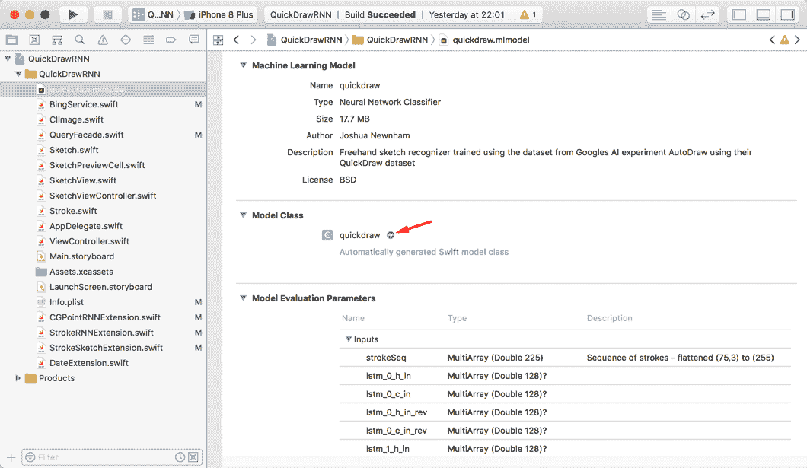

这将打开生成的类；找到类 `quickdrawInput` 并将其复制粘贴到你的 `QueryFacade.swift` 文件中，确保它位于 `QueryFacade` 类（或扩展）之外。因为我们只关心 `strokeSeq` 输入，我们可以移除所有其他变量；清理后，你将得到如下所示的内容：

```py
class quickdrawInput : MLFeatureProvider {

    var strokeSeq: MLMultiArray

    var featureNames: Set<String> {
        get {
            return ["strokeSeq"]
        }
    }

    func featureValue(for featureName: String) -> MLFeatureValue? {
        if (featureName == "strokeSeq") {
            return MLFeatureValue(multiArray: strokeSeq)
        }
        return nil
    }

    init(strokeSeq: MLMultiArray) {
        self.strokeSeq = strokeSeq
    }
}
```

我们终于准备好进行推理了；回到 `QueryFacade` 类中的 `classifySketch` 方法，并添加以下代码：

```py
if let strokeSketch = sketch as? StrokeSketch, let
    x = StrokeSketch.preprocess(strokeSketch){

    if let modelOutput = try! model?.prediction(from:quickdrawInput(strokeSeq:x)){
        if let classPredictions = modelOutput.featureValue(
            for: "classLabelProbs")?.dictionaryValue as? [String:Double]{

            let sortedClassPredictions = classPredictions.sorted(
                by: { (kvp1, kvp2) -> Bool in
                kvp1.value > kvp2.value
            })

            return sortedClassPredictions
        }
    }
}

return nil
```

毫无疑问，其中大部分对你来说都很熟悉；我们首先通过本章开头实现的`preprocess`方法提取特征。一旦我们获得了这些特征，我们就将它们包装在`quickdrawInput`的一个实例中，然后再将它们传递给模型的`prediction`方法进行推理。如果成功，我们将返回输出，然后我们继续提取适当输出，如前所述。最后，我们在返回给调用者之前对结果进行排序。

完成这些后，你现在处于一个很好的测试位置。构建并部署到模拟器或设备上，如果一切按计划进行，你应该能够测试你模式（或绘制，取决于你如何看待它）的准确性：

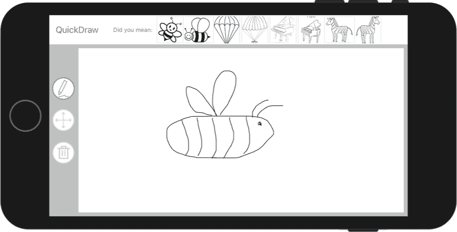

让我们通过回顾我们已经涵盖的内容来结束本章。

# 摘要

在本章中，我们回顾了一个先前的问题（草图识别），但使用了不同的数据集和不同的方法。之前，我们使用 CNN 来解决这个问题，但在这章中，我们识别了数据收集的细微差别，这反过来又使我们能够采用不同的方法使用 RNN。像往常一样，大部分努力都花在为模型准备数据上。这样做突出了我们可以用来使数据对缩放和转换不变的技术，以及减少输入细节（通过简化）以帮助我们的模型更容易找到模式的有用性。

最后，我们强调了为机器学习系统设计界面的重要方面，即添加一层透明度和控制层，以帮助用户构建一个有用的心理模型，并通过显式的用户反馈（如更正）来改进模型。

让我们继续我们的机器学习应用之旅，深入下一章，我们将探讨我们的最终视觉应用：图像分割。
