# 第九章：使用 CNN 进行对象分割

在本书的各个章节中，我们看到了各种机器学习模型，每个模型都逐渐增强了它们的感知能力。我的意思是，我们首先接触到的模型能够对图像中存在的单个对象进行分类。然后是能够不仅对多个对象进行分类，还能对它们相应的边界框进行分类的模型。在本章中，我们通过引入语义分割继续这一进程，也就是说，能够将每个像素分配到特定的类别，如下面的图所示：

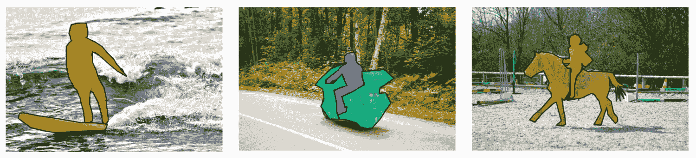

来源：http://cocodataset.org/#explore

这使得对场景的理解更加深入，因此，为更易于理解的界面和服务提供了机会。但这并不是本章的重点。在本章中，我们将使用语义分割来创建一个图像效果应用程序，以此展示不完美的预测。我们将利用这一点来激发对设计构建机器学习（或人工智能）界面最重要的一个方面——处理模型的不确定或错误结果的讨论。

到本章结束时，你将：

+   对语义分割的理解

+   建立了对如何实现（学习）的直观理解

+   通过构建动作镜头照片效果应用程序，学习了如何以新颖的方式应用于现实生活应用

+   对处理机器学习模型产生的概率结果有了欣赏和认识

让我们先更好地理解语义分割是什么，以及它是如何实现的直观理解。

# 像素分类

如我们之前所讨论的，执行语义分割的模型所期望的输出是一个图像，其中每个像素都被分配了其最可能的类别标签（甚至是一个特定类别的实例）。在整个本书中，我们也看到了深度神经网络层学习在检测到满足特定特征的相应输入时被激活的特征。我们可以使用称为**类别激活图**（**CAMs**）的技术来可视化这些激活。输出产生了一个输入图像上类别激活的热图；热图由与特定类别相关的分数矩阵组成，本质上为我们提供了一个空间图，显示了输入区域如何强烈地激活指定的类别。以下图显示了为猫类别的一个 CAM 可视化输出。在这里，你可以看到热图描绘了模型认为对这个类别重要的特征（以及区域）：

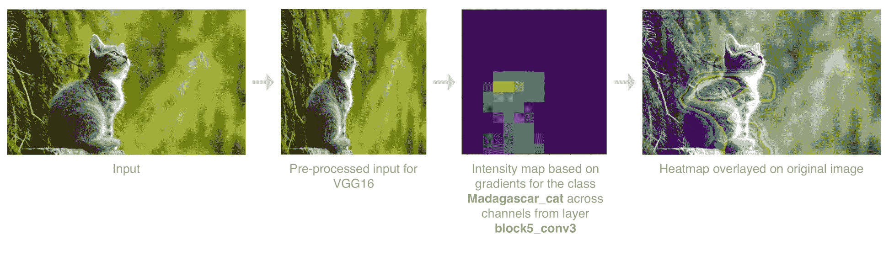

前面的图是使用 R. Selvaraju 在论文《Grad-CAM：通过基于梯度的定位从深度网络中获取视觉解释》中描述的实现生成的。方法是取卷积层的输出特征图，并按类别的梯度为该特征图中的每个通道加权。有关其工作原理的更多详细信息，请参阅原始论文：[`arxiv.org/abs/1610.02391`](https://arxiv.org/abs/1610.02391)。

早期对语义分割的尝试使用了略微修改的分类模型，如 VGG 和 Alexnet，但它们只能产生粗略的近似。这可以从前面的图中看出，这主要是因为网络使用了重复的池化层，这导致了空间信息的丢失。

U-Net 是解决这一问题的架构之一；它由一个**编码器**和一个**解码器**组成，并在两者之间添加了**捷径**以保留空间信息。由 O. Ronneberger、P. Fischer 和 T. Brox 于 2015 年发布，用于生物医学图像分割，由于其有效性和性能，它已成为分割的首选架构之一。以下图显示了本章我们将使用的修改后的 U-Net：

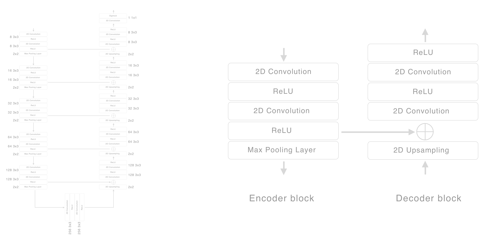

U-Net 是用于语义分割的众多架构之一。Sasank Chilamkurthy 的文章《2017 年深度学习语义分割指南》提供了一个关于最流行架构的精彩概述和比较，可在[`blog.qure.ai/notes/semantic-segmentation-deep-learning-review`](http://blog.qure.ai/notes/semantic-segmentation-deep-learning-review)找到。有关 U-Net 的更多详细信息，请参阅前面提到的原始论文。它可在[`arxiv.org/pdf/1505.04597.pdf`](https://arxiv.org/pdf/1505.04597.pdf)找到。

在前面的图中左侧，我们有本章项目使用的完整网络，而在右侧，我们有网络编码器和解码器部分使用的块提取。作为提醒，本书的重点是应用机器学习，而不是模型本身的细节。因此，我们不会深入探讨细节，但有一些有趣且有用的事情值得指出。

第一个是网络的一般结构；它由一个编码器和一个解码器组成。编码器的角色是捕捉上下文。解码器的任务是使用这个上下文和来自相应快捷方式的特征，将其理解投影到像素空间，以获得密集和精确的分类。通常的做法是使用训练好的分类模型（如 VGG16）的架构和权重来启动编码器。这不仅加快了训练速度，而且很可能会提高性能，因为它带来了对训练过的图像的深度（有意为之）理解，这通常来自更大的数据集。

另一个值得强调的点是在编码器和解码器之间的快捷方式。如前所述，它们用于在最大池化下采样之前保留从每个编码块输出的卷积层的空间信息。这些信息用于帮助模型进行精确定位。

这是这本书中第一次看到上采样层。正如其名所示，这是一种将你的图像（或特征图）上采样到更高分辨率的技巧。其中一种最简单的方法是使用我们用于图像上采样的相同技术，即，将输入缩放到期望的大小，并使用插值方法（如双线性插值）计算每个点的值。

最后，我想引起你的注意，即模型的输入和输出。模型期望输入一个 448 x 448 的彩色图像，并输出一个 448 x 448 x 1（单通道）矩阵。如果你检查架构，你会注意到最后一层是 sigmoid 激活，其中 sigmoid 函数通常用于二元分类，这正是我们在这里所做的事情。通常，你会对语义分割任务执行多类分类，在这种情况下，你会将 sigmoid 激活替换为 softmax 激活。在介绍语义分割时常用到的例子是自动驾驶汽车的场景理解。以下是从剑桥大学基于运动的分割和识别数据集中标记的场景示例，其中每种颜色代表一个不同的类别：

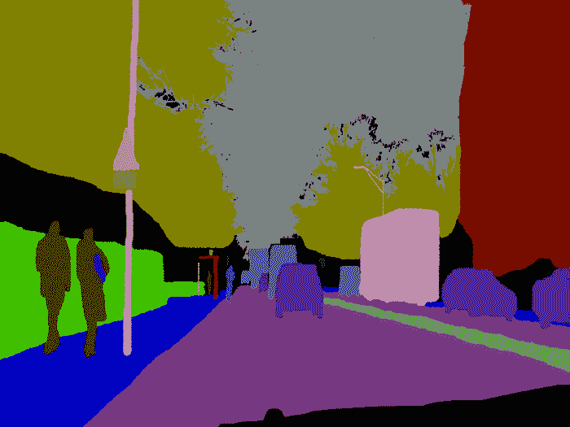

来源：http://mi.eng.cam.ac.uk/research/projects/VideoRec/CamVid/

但在这个例子中，一个二元分类器就足够了，这一点在我们深入了解项目细节时会变得明显。然而，我想在这里强调它，因为架构只需通过将最后一层与 softmax 激活交换并更改损失函数，就可以扩展到多类分类。

因此，你已经看到了我们将在这章中使用的架构。现在让我们看看我们将如何使用它以及用于训练模型的数据。

# 驱动所需效果的数据——动作镜头

现在是介绍本章中想要创建的摄影效果的好时机。据我所知，这种效果被称为**动作快照**。它本质上是一张静态照片，展示了某人（或某物）在运动中，可能最好用一张图片来展示——就像这里展示的这张一样：

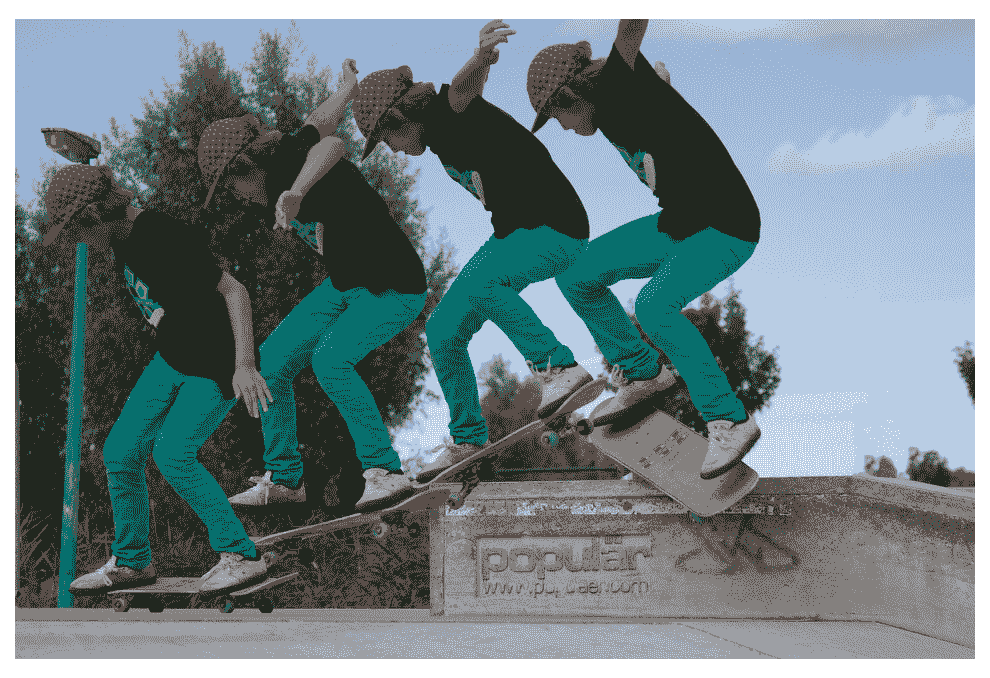

如前所述，本章中使用的模型执行的是二元（或单类别）分类。使用二元分类器而不是多类别分类器的这种简化，是由仅从背景中分割人物的预期用途所驱动的。与任何软件项目一样，您应该努力在可能的情况下保持简单。

为了提取人物，我们需要一个模型来学习如何识别人物及其相关的像素。为此，我们需要一个包含人物图像及其相应像素标记图像的数据集——而且数量要很多。与用于分类的数据集相比，用于对象分割的数据集并不常见，也不那么庞大。考虑到标记此类数据集所需的额外努力，这是可以理解的。一些常见的对象分割数据集，以及在本章中考虑的数据集包括：

+   **PASCAL VOC**：一个包含 20 个类别、9,993 个标记图像的数据集。您可以在[`host.robots.ox.ac.uk/pascal/VOC/voc2012/index.html`](http://host.robots.ox.ac.uk/pascal/VOC/voc2012/index.html)找到该数据集。

+   **来自马萨诸塞大学阿默斯特分校的 Labeled Faces in the Wild (LFW)**：一个包含 2,927 个面部图像的数据集。每个图像都有头发、皮肤和背景的标记（三个类别）。您可以在[`vis-www.cs.umass.edu/lfw/part_labels/`](http://vis-www.cs.umass.edu/lfw/part_labels/)找到该数据集。

+   **Common Objects in Context (COCO)数据集**：一个涵盖所有与计算机视觉相关内容的流行数据集，包括分割。其分割数据集包含大约 80 个类别、200,000 个标记图像。这是我们在本节中将使用并简要探讨的数据集。您可以在[`cocodataset.org/#home`](http://cocodataset.org/#home)找到该数据集。

+   虽然本项目没有考虑，但值得了解的是剑桥大学的**Cambridge-driving Labeled Video Database**（**CamVid**）。从其名称可以看出，该数据集由汽车摄像头的视频流帧组成——对于任何想要训练自己的自动驾驶汽车的人来说都是理想的。您可以在[`mi.eng.cam.ac.uk/research/projects/VideoRec/CamVid/`](http://mi.eng.cam.ac.uk/research/projects/VideoRec/CamVid/)找到该数据集。

在这里列出数据集可能是多余的，但语义分割是一个如此激动人心的机会，具有巨大的潜力，我希望在这里列出这些数据集能鼓励您探索和实验其新的应用。

幸运的是，COCO 的 13+ GB 数据集包含许多标记的人物图像，并有一个方便的 API 来轻松查找相关图像。对于本章，使用了 COCO 的 API 来查找所有包含人物的图像。然后，进一步过滤这些图像，只保留那些包含一个或两个人物且其面积占图像 20%到 70%的图像，丢弃那些人物太小或太大的图像。对于这些图像中的每一个，都获取了每个人的轮廓，然后用于创建二值掩码，这成为了我们训练的标签。以下图示了单个图像的此过程：

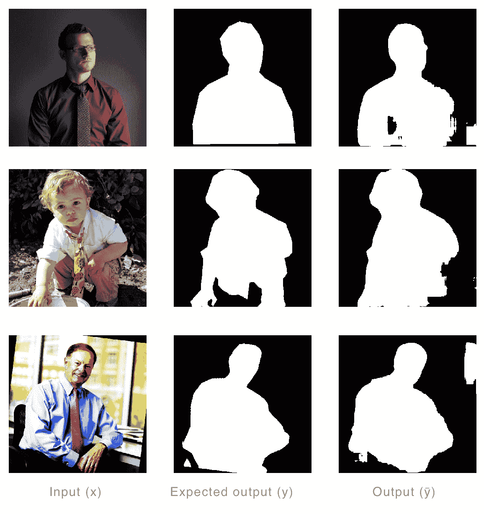

来源：COCO 数据集（http://cocodataset.org）

下面是一些动作图像的例子，其中模型能够足够地分割出图像中的人物：

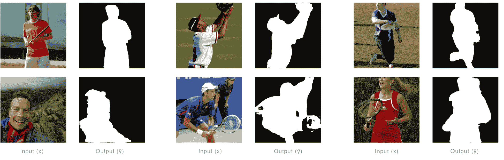

最后，这里有一些，许多中的几个，动作图像的例子，其中模型不太成功：

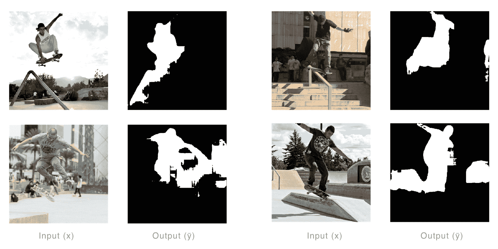

我们已经涵盖了模型和训练数据，并检查了模型的输出。现在是时候将我们的注意力转向本章的应用程序了，我们将在下一节开始着手处理。

# 构建照片效果应用程序

在本节中，我们将简要地查看应用程序，并突出一些有趣的代码片段，省略大部分内容，因为它们已经在之前的章节中讨论过了。如引言中所述，这个例子是为了提供一个案例研究，以便在后面的章节中讨论构建智能界面和服务时可以使用的广泛策略。

如果您还没有做，请从随附的仓库[`github.com/packtpublishing/machine-learning-with-core-ml`](https://github.com/packtpublishing/machine-learning-with-core-ml)下载最新的代码。下载完成后，导航到`Chapter9/Start/`目录并打开项目`ActionShot.xcodeproj`。

如前所述，本章的示例是一个照片效果应用。在其中，用户可以拍摄一个*动作快照*，应用会从帧中提取每个人，并将他们合成到最终帧中，如图所示：

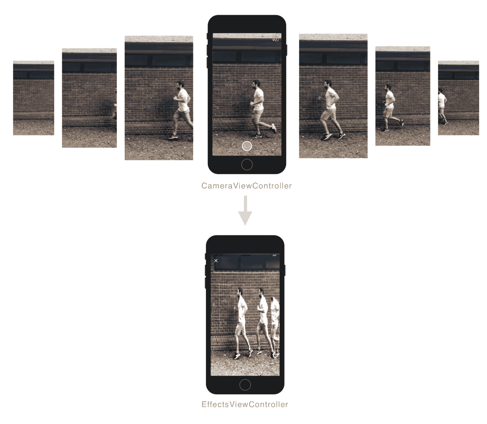

该应用由两个视图控制器组成；一个负责捕获帧，另一个负责展示合成图像。处理工作再次委托给了`ImageProcessor`类，这也是我们将从该角度审查这个项目的视角。

`ImageProcessor`既是接收器也是处理器；通过接收器我指的是它是一个从`CameraViewController`接收捕获的帧并将其保存在内存中以供处理的类。让我们看看代码的样子；从左侧面板选择`ImageProcessor.swift`将源代码聚焦。让我们看看有什么存在；最初特别关注处理接收到的帧的属性和方法，然后继续到它们的处理。

在文件顶部，你会注意到已经声明了一个协议，该协议由`EffectViewController`实现；它用于广播任务的进度：

```py
protocol ImageProcessorDelegate : class{

    func onImageProcessorFinishedProcessingFrame(
        status:Int, processedFrames:Int, framesRemaining:Int)

    func onImageProcessorFinishedComposition(
        status:Int, image:CIImage?)
}
```

第一个回调`onImageProcessorFinishedProcessingFrame`用于通知代理帧逐帧处理的进度，而另一个回调`onImageProcessorFinishedComposition`则用于在最终图像创建完成后通知代理。这些离散的回调故意分开，因为处理已经被分解为分割和合成。分割负责使用我们的模型分割每一帧，而合成则负责使用处理过的（分割的）帧生成最终图像。这种结构也在类的布局中得到了体现，类被分解为四个部分，本节我们将遵循的流程。

第一部分声明了所有变量。第二部分实现了在捕获过程中检索帧的属性和方法。第三部分包含处理帧的所有方法，通过`onImageProcessorFinishedProcessingFrame`回调通知代理。最后一部分，我们将最关注的部分，包含生成最终图像的方法，即合成帧。让我们先看看第一部分，以了解可用的变量，如下面的代码片段所示：

```py
class ImageProcessor{

    weak var delegate : ImageProcessorDelegate?

    lazy var model : VNCoreMLModel = {
        do{
            let model = try VNCoreMLModel(
                for: small_unet().model
            )
            return model
        } catch{
            fatalError("Failed to create VNCoreMLModel")
        }
    }()    

    var minMaskArea:CGFloat = 0.005
    var targetSize = CGSize(width: 448, height: 448)
    let lock = NSLock()
    var frames = [CIImage]()
    var processedImages = [CIImage]()
    var processedMasks = [CIImage]()
    private var _processingImage = false

    init(){

    }
}
```

没有什么特别之处。我们首先声明一个属性，它将我们的模型包装在一个`VNCoreMLModel`实例中，这样我们就可以利用 Vision 框架的预处理功能。然后，我们声明一系列变量来处理存储帧和处理；我们使用一个`NSLock`实例来避免不同的线程读取过时的属性值。

以下代码片段和`ImageProcessor`类的一部分包括处理检索和释放捕获帧的变量和方法：

```py
extension ImageProcessor{

    var isProcessingImage : Bool{
        get{
            self.lock.lock()
            defer {
                self.lock.unlock()
            }
            return _processingImage
        }
        set(value){
            self.lock.lock()
            _processingImage = value
            self.lock.unlock()
        }
    }

    var isFrameAvailable : Bool{
        get{
            self.lock.lock()
            let frameAvailable =
                    self.frames.count > 0
            self.lock.unlock()
            return frameAvailable
        }
    }

    public func addFrame(frame:CIImage){
        self.lock.lock()
        self.frames.append(frame)
        self.lock.unlock()
    }

    public func getNextFrame() -> CIImage?{
        self.lock.lock()
        let frame = self.frames.removeFirst()
        self.lock.unlock()
        return frame
    }

    public func reset(){
        self.lock.lock()
        self.frames.removeAll()
        self.processedImages.removeAll()
        self.processedMasks.removeAll()
        self.lock.unlock()
    }
}
```

虽然相当冗长，但应该都是不言自明的；可能唯一值得特别指出的是`addFrame`方法，该方法在相机捕获每个帧时都会被调用。为了说明一切是如何联系在一起的，以下图表展示了捕获帧时的总体流程：

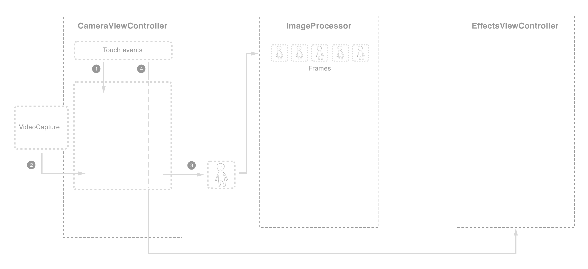

流程的细节将在以下几点中介绍：

1.  尽管在`CameraViewController`的生命周期内持续捕获帧，但只有在用户点击（并按住）动作按钮后，这些帧才会被传递给`ImageProcessor`

1.  在这段时间内，每个捕获的帧（以限制的速率—目前为每秒 10 帧）都会传递给`CameraViewController`

1.  然后，它使用前面显示的`addFrame`方法将帧传递给`ImageProcessor`

1.  当用户从动作按钮抬起手指时，捕获停止，完成后，将实例化并展示`EffectsViewController`，同时传递一个包含捕获帧引用的`ImageProcessor`引用

`ImageProcessor`类的下一部分负责处理这些图像中的每一个；这是通过`processFrames`方法启动的，该方法由`EffectsViewController`在加载后调用。这部分有更多的代码，但其中大部分应该对你来说都很熟悉，因为这是我们在这本书的许多项目中使用的样板代码。让我们首先检查以下片段中的`processFrames`方法：

本章的其余部分，除非另有说明，所有剩余的代码都假定为`ImageProcessor`类内部；也就是说，将省略类和类扩展声明，以便使代码更容易阅读。

```py
public func processFrames(){
    if !self.isProcessingImage{
        DispatchQueue.global(qos: .background).async {
            self.processesingNextFrame()
        }
    }
}
```

此方法简单地调度`processingNextFrame`方法到后台线程。当使用 Core ML 进行推理时这是强制性的，而且在执行计算密集型任务时也是良好的实践，以避免锁定用户界面。让我们继续追踪，通过检查`processingNextFrame`方法以及负责返回`VNCoreMLRequest`实例的方法，后者在以下代码片段中显示：

```py
func getRequest() -> VNCoreMLRequest{
    let request = VNCoreMLRequest(
        model: self.model,
        completionHandler: { [weak self] request, error in
            self?.processRequest(for: request, error: error)
    })
    request.imageCropAndScaleOption = .centerCrop
    return request
}

func processesingNextFrame(){
    self.isProcessingImage = true

    guard let nextFrame = self.getNextFrame() else{
        self.isProcessingImage = false
        return
    }

    var ox : CGFloat = 0
    var oy : CGFloat = 0
    let frameSize = min(nextFrame.extent.width, nextFrame.extent.height)
    if nextFrame.extent.width > nextFrame.extent.height{
        ox = (nextFrame.extent.width - nextFrame.extent.height)/2
    } else if nextFrame.extent.width < nextFrame.extent.height{
        oy = (nextFrame.extent.height - nextFrame.extent.width)/2
    }
    guard let frame = nextFrame
        .crop(rect: CGRect(x: ox,
                           y: oy,
                           width: frameSize,
                           height: frameSize))?
        .resize(size: targetSize) else{
            self.isProcessingImage = false
            return
    }

    self.processedImages.append(frame)
    let handler = VNImageRequestHandler(ciImage: frame)

    do {
        try handler.perform([self.getRequest()])
    } catch {
        print("Failed to perform classification.\n\(error.localizedDescription)")
        self.isProcessingImage = false
        return
    }
}
```

我们首先将属性`isProcessingImage`设置为`true`，并检查我们是否有帧要处理，否则提前退出方法。

以下内容可能看起来有些反直觉（因为确实如此）；从前几章中我们了解到`VNCoreMLRequest`处理了图像裁剪的预处理任务。那么，为什么我们在这里要手动处理呢？原因更多在于使代码更简洁和满足出版截止日期。在这个例子中，最终图像是通过调整大小的帧合成的，以避免对模型输出的缩放和偏移，这留作你的练习。因此，在这里，我们执行这个操作，并将结果持久化存储在`processedImages`数组中，以便在最终阶段使用。最后，我们执行请求，传入图像，一旦完成，调用我们的`processRequest`方法，传入模型的结果。

继续我们的追踪，现在我们将检查`processRequest`方法；由于这个方法相当长，我们将将其分解成块，从上到下工作：

```py
func processRequest(for request:VNRequest, error: Error?){
    self.lock.lock()
    let framesReaminingCount = self.frames.count
    let processedFramesCount = self.processedImages.count
    self.lock.unlock()

 ...
}
```

我们首先获取最新的计数，这些计数将在此方法完成或失败时广播给代理。说到这一点，以下代码块验证是否返回了类型为`[VNPixelBufferObservation]`的结果，否则通知代理并返回，如下面的代码片段所示：

```py
 func processRequest(for request:VNRequest, error: Error?){
 ... 

    guard let results = request.results,
        let pixelBufferObservations = results as? [VNPixelBufferObservation],
        pixelBufferObservations.count > 0 else {
            print("ImageProcessor", #function, "ERROR:",
                  String(describing: error?.localizedDescription))

            self.isProcessingImage = false

            DispatchQueue.main.async {
                self.delegate?.onImageProcessorFinishedProcessingFrame(
                    status: -1,
                    processedFrames: processedFramesCount,
                    framesRemaining: framesReaminingCount)
            }
            return
    }

 ...
}
```

参考我们的结果（`CVBufferPixel`），我们的下一个任务是创建一个`CIImage`实例，传入缓冲区并请求将颜色空间设置为灰度，以确保创建单通道图像。然后，我们将将其添加到下面的代码片段中`processedMasks`数组：

```py
func processRequest(for request:VNRequest, error: Error?){
 ...

 let options = [
 kCIImageColorSpace:CGColorSpaceCreateDeviceGray()
 ] as [String:Any]

    let ciImage = CIImage(
        cvPixelBuffer: pixelBufferObservations[0].pixelBuffer,
        options: options)

    self.processedMasks.append(ciImage)

 ...
}
```

只剩下两件事要做！我们通知代理我们已经完成了一帧，并继续处理下一帧（如果有的话）：

```py
func processRequest(for request:VNRequest, error: Error?){
 ... 

    DispatchQueue.main.async {
        self.delegate?.onImageProcessorFinishedProcessingFrame(
            status: 1,
            processedFrames: processedFramesCount,
            framesRemaining: framesReaminingCount)
    }

    if self.isFrameAvailable{
        self.processesingNextFrame()
    } else{
        self.isProcessingImage = false
    }
}
```

这标志着我们`ImageProcessor`的第三部分结束；到目前为止，我们有两个数组，包含调整大小的捕获帧和模型生成的分割图像。在继续到这个类的最后部分之前，让我们从鸟瞰图的角度回顾一下我们刚才所做的工作，如图流图所示：

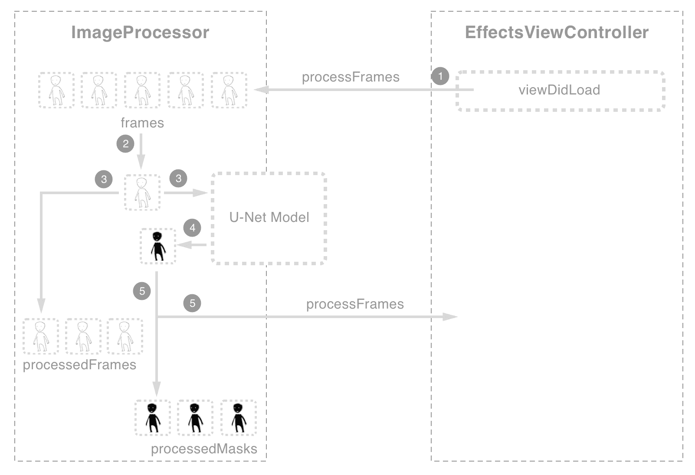

流程的细节如下所示：

1.  如前图所示，一旦加载了`EffectsViewController`，就会启动处理过程，这会启动后台线程来处理捕获到的每一帧

1.  每一帧首先被调整大小和裁剪，以匹配模型的输出

1.  然后，它被添加到`processedFrames`数组中，并传递给我们的模型进行干扰（分割）

1.  一旦模型返回结果，我们实例化一个单色的`CIImage`实例

1.  此实例存储在`processedMasks`数组中，并通知代理进度

当所有帧都处理完毕时会发生什么？这是我们计划在下一部分回答的，我们将讨论创建效果的详细方法。首先，让我们讨论这个过程是如何开始的。

一旦代理（`EffectsViewController`）收到回调，使用`onImageProcessorFinishedProcessingFrame`，其中所有帧都已处理，它就调用 ImageProcessor 中的`compositeFrames`方法来开始创建效果的过程。让我们回顾一下这部分`ImageProcessor`类中的现有代码：

```py
func compositeFrames(){

    var selectedIndicies = self.getIndiciesOfBestFrames()
    if selectedIndicies.count == 0{
        DispatchQueue.main.async {
            self.delegate?.onImageProcessorFinishedComposition(
                status: -1,
                image: self.processedImages.last!)
        }
        return
    }

    var finalImage = self.processedImages[selectedIndicies.last!]
    selectedIndicies.removeLast() 
    // TODO Composite final image using segments from intermediate frames
    DispatchQueue.main.async {
        self.delegate?.onImageProcessorFinishedComposition(
            status: 1,
            image: finalImage)
    }
}

func getIndiciesOfBestFrames() -> [Int]{
 // TODO; find best frames for the sequence i.e. avoid excessive overlapping
 return (0..<self.processedMasks.count).map({ (i) -> Int in
 return i
 })
}

func getDominantDirection() -> CGPoint{
 var dir = CGPoint(x: 0, y: 0)
 // TODO detected dominate direction
 return dir
}
```

我已经将重要的/有趣的部分加粗，本质上是我们将要实现的部分，但在编写更多代码之前，让我们回顾一下我们目前拥有的内容（就处理过的图像而言）以及创建我们效果的方法。

在这个阶段，我们有一个`processedFrames`数组，其中包含捕获图像的调整大小和裁剪版本，还有一个名为`processedMasks`的数组，包含来自我们的分割模型的单通道图像。以下图示了这些示例：

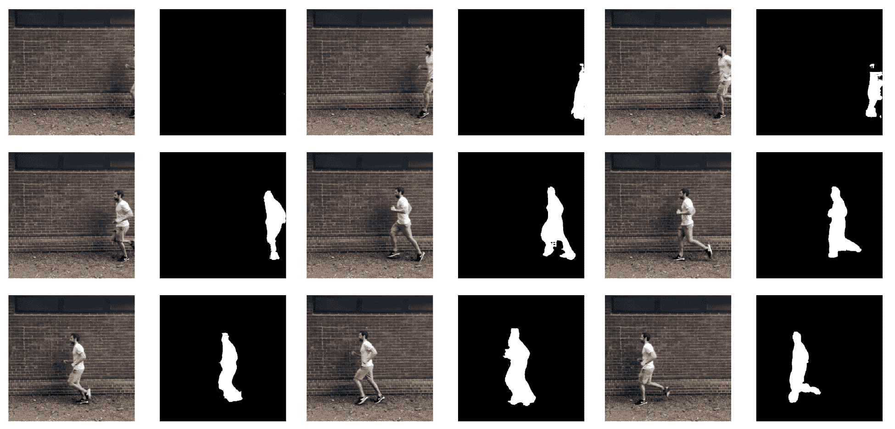

如果我们像现在这样合成每个帧，我们最终会得到很多不需要的伪影和过多的重叠。一种方法可能是调整已经处理（以及可能捕获）的帧，即跳过每*n*帧以分散帧。这种方法的问题在于它假设所有主题将以相同的速度移动；为了解决这个问题，你需要将这种调整暴露给用户进行手动调整（这是一种合理的方法）。我们将采取的方法是提取每个帧的边界框，并使用这些帧的位移和相对重叠来确定何时插入帧以及何时跳过帧。

为了计算边界框，我们只需扫描图像的每条边上的每一行，即从**顶部到底部**，以确定物体的顶部。然后，我们**从底部到顶部**做同样的事情，以确定物体的底部。同样，我们在水平轴上做同样的事情，以下图示了这一点：

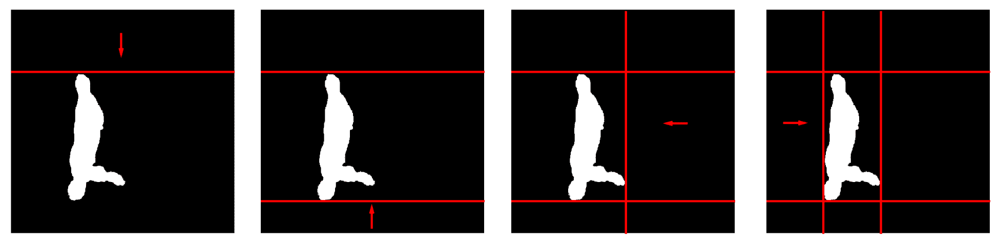

即使有边界框，我们仍然需要确定在插入帧之前物体应该移动多远。为了确定这一点，我们首先确定主导方向，这是通过找到分割物体的第一帧和最后一帧之间的方向来计算的。然后，这被用来确定比较位移的轴；也就是说，如果主导方向在水平轴上（如前图所示），那么我们测量沿*x*轴的位移，忽略*y*轴。然后，我们简单地测量帧之间的距离与一些预定的阈值，以决定是否合成帧或忽略它。以下图示了这一点：

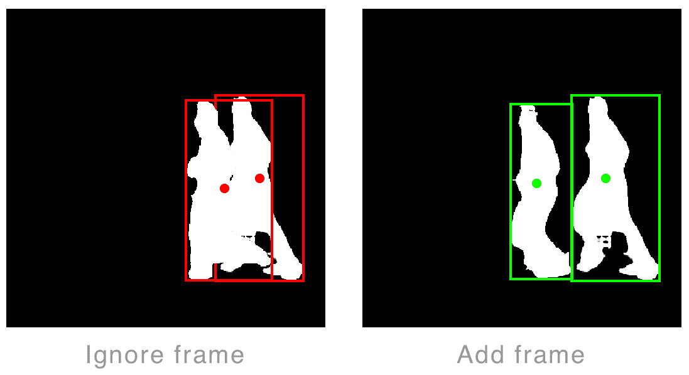

让我们看看代码中的样子，从确定主导方向开始。将以下代码添加到`getDominantDirection`方法中：

```py
var dir = CGPoint(x: 0, y: 0)

var startCenter : CGPoint?
var endCenter : CGPoint?

// Find startCenter
for i in 0..<self.processedMasks.count{
    let mask = self.processedMasks[i]

    guard let maskBB = mask.getContentBoundingBox(),
    (maskBB.width * maskBB.height) >=
        (mask.extent.width * mask.extent.height) * self.minMaskArea
    else {
        continue
    }

    startCenter = maskBB.center
    break
}

// Find endCenter
for i in (0..<self.processedMasks.count).reversed(){
    let mask = self.processedMasks[i]

    guard let maskBB = mask.getContentBoundingBox(),
    (maskBB.width * maskBB.height) >=
        (mask.extent.width * mask.extent.height) * self.minMaskArea
    else {
        continue
    }

    endCenter = maskBB.center
    break
}

if let startCenter = startCenter, let endCenter = endCenter, startCenter != endCenter{
    dir = (startCenter - endCenter).normalised
}

return dir
```

如前所述，我们首先找到我们序列帧的开始和结束的边界框，并使用它们的中心来计算主导方向。

这里省略了`CIImage`方法的`getContentBoundingBox`实现，但可以在`CIImage+Extension.swift`文件中找到相应的源代码。

有了主导方向，我们现在可以继续确定要包含哪些帧以及要忽略哪些帧。我们将在`ImageProcessor`类的`getIndiciesOfBestFrames`方法中实现这一点，该方法遍历所有帧，测量重叠并忽略那些不满足特定阈值的帧。该方法返回一个索引数组，这些索引满足这个阈值，可以合成到最终图像上。将以下代码添加到`getIndiciesOfBestFrames`方法中：

```py
var selectedIndicies = [Int]()
var previousBoundingBox : CGRect?
let dir = self.getDominateDirection()

for i in (0..<self.processedMasks.count).reversed(){
    let mask = self.processedMasks[i]
   guard let maskBB = mask.getContentBoundingBox(),
        maskBB.width < mask.extent.width * 0.7,
        maskBB.height < mask.extent.height * 0.7 else {
        continue
    }

    if previousBoundingBox == nil{
        previousBoundingBox = maskBB
        selectedIndicies.append(i)
    } else{
        let distance = abs(dir.x) >= abs(dir.y)
            ? abs(previousBoundingBox!.center.x - maskBB.center.x)
            : abs(previousBoundingBox!.center.y - maskBB.center.y)
        let bounds = abs(dir.x) >= abs(dir.y)
            ? (previousBoundingBox!.width + maskBB.width) / 4.0
            : (previousBoundingBox!.height + maskBB.height) / 4.0

        if distance > bounds * 0.5{
            previousBoundingBox = maskBB
            selectedIndicies.append(i)
        }
    }

}

return selectedIndicies.reversed()
```

我们首先获取主导方向，如前所述，然后按逆序（因为假设用户的 heroshot 是最后一帧）遍历我们的帧序列。对于每个帧，我们获取边界框，如果它是第一个要检查的帧，我们将其分配给变量`previousBoundingBox`。这将用于比较后续的边界框（并更新为最新的包含帧）。如果`previousBoundingBox`不为空，则根据主导方向计算两者之间的位移，如下面的代码片段所示：

```py
let distance = abs(dir.x) >= abs(dir.y)
    ? abs(previousBoundingBox!.center.x - maskBB.center.x)
    : abs(previousBoundingBox!.center.y - maskBB.center.y) 
```

然后，我们计算分离两个对象所需的最小长度，这是通过相对轴的合并大小除以 2 来计算的。这给我们一个距离，是合并帧的一半，如下面的代码片段所示：

```py
let bounds = abs(dir.x) >= abs(dir.y)
    ? (previousBoundingBox!.width + maskBB.width) / 2.0
    : (previousBoundingBox!.height + maskBB.height) / 2.0
```

然后，我们将距离与边界以及阈值进行比较，如果距离满足这个阈值，就继续将帧添加到当前索引中：

```py
if distance > bounds * 0.15{
    previousBoundingBox = maskBB
    selectedIndicies.append(i)
}
```

返回到`compositeFrames`方法，我们现在准备合成选定的帧。为了实现这一点，我们将利用`CoreImages`过滤器；但在这样做之前，让我们快速回顾一下我们到底想实现什么。

对于每个选定的（处理过的）图像和掩码对，我们希望裁剪出图像并将其叠加到最终图像上。为了提高效果，我们将应用逐渐增加的 alpha 值，使得接近最终帧的帧将具有接近 1.0 的不透明度，而远离最终帧的帧将逐渐变得透明；这将给我们一个渐变的拖尾效果。这个过程在以下图中进行了总结：

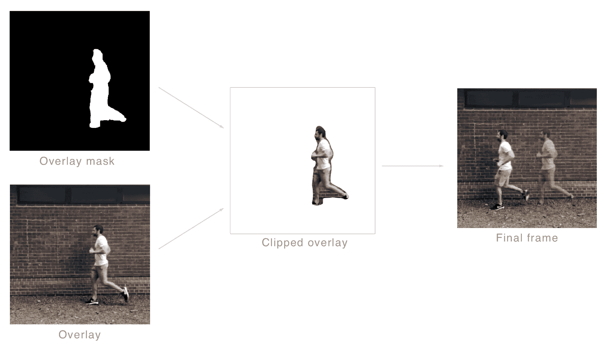

让我们通过首先实现过滤器将这个想法转化为代码。如前所述，我们将传递内核输出图像、叠加图像及其相应的掩码和一个 alpha 值。在`ImageProcessor`类的顶部附近，添加以下代码：

```py
lazy var compositeKernel : CIColorKernel? = {
    let kernelString = """
        kernel vec4 compositeFilter(
            __sample image,
            __sample overlay,
            __sample overlay_mask,
            float alpha){
            float overlayStrength = 0.0;

            if(overlay_mask.r > 0.0){
                overlayStrength = 1.0;
            }

            overlayStrength *= alpha;

            return vec4(image.rgb * (1.0-overlayStrength), 1.0)
                + vec4(overlay.rgb * (overlayStrength), 1.0);
        }
    """
    return CIColorKernel(source:kernelString)
}()
```

在之前，我们已经实现了`CIColorKernel`，正如所讨论的那样，它负责将所有我们的帧组合到最终图像中。我们首先测试掩码的值，如果它是 1.0，我们分配强度 1.0（这意味着我们想要用叠加的颜色替换最终图像中该位置的颜色）。否则，我们分配 0，忽略它。然后，我们将强度与传递给我们的内核的混合参数相乘。最后，我们使用语句`vec4(image.rgb * (1.0-overlayStrength), 1.0) + vec4(overlay.rgb * (overlayStrength), 1.0)`计算并返回最终颜色。现在我们的过滤器已经实现，让我们返回`compositeFrames`方法并投入使用。在`compositeFrames`中，将注释`// TODO 使用中间帧的段来组合最终图像`替换为以下代码：

```py
let alphaStep : CGFloat = 1.0 / CGFloat(selectedIndicies.count)

for i in selectedIndicies{
    let image = self.processedImages[i]
    let mask = self.processedMasks[i]

    let extent = image.extent
    let alpha = CGFloat(i + 1) * alphaStep
    let arguments = [finalImage, image, mask, min(alpha, 1.0)] as [Any]
    if let compositeFrame = self.compositeKernel?.apply(extent: extent, arguments: arguments){
        finalImage = compositeFrame
    }
}
```

大部分内容应该都是不言自明的；我们首先计算一个 alpha 步长，它将被用来在接近最终帧时逐步增加不透明度。然后，我们遍历所有选定的帧，应用我们在前面的片段中实现的过滤器，组合我们的最终图像。

完成这些工作后，我们现在已经完成了这一方法以及本章的编码。做得好！是时候测试一下了；构建并运行项目，看看你的辛勤工作是如何付诸实践的。以下是一个周末公园访问的结果：

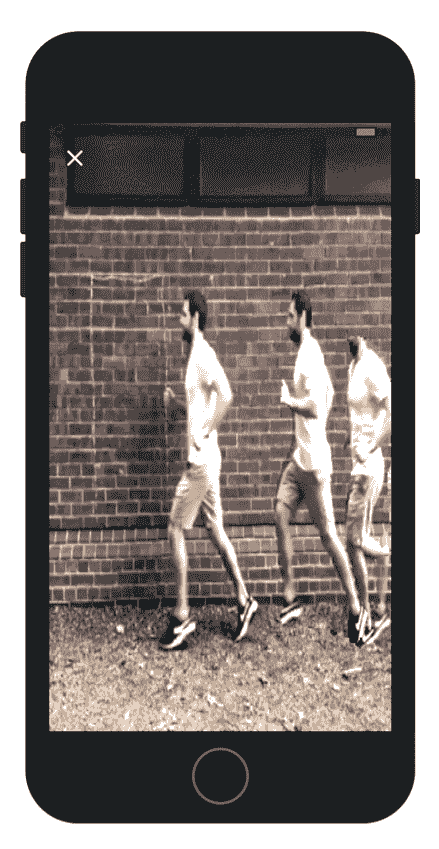

在结束本章之前，让我们简要讨论一下与机器学习模型一起工作时的一些策略。

# 与概率结果一起工作

正如本章开头所提到的，并在上一节中亲身体验到的那样，与机器学习模型一起工作需要一套新的技术和策略来处理不确定性。所采取的方法将是特定领域的，但有一些值得记住的广泛策略，这就是我们将在本章的示例项目中讨论的内容。

# 改进模型

第一点是改进模型。当然，根据模型和数据集的来源，可能会有局限性，但理解模型可以如何改进是很重要的，因为其输出直接关联到用户体验的质量。

在这个项目的背景下，我们可以使用现有的预训练图像分类器作为编码器来增强模型，如前所述。这不仅加快了训练速度，提供了更多的迭代机会，而且很可能会通过让模型从更全面的数据集中转移现有知识来提高性能。

另一个是调整模型训练所使用的数据集。一个简单的、相关的例子是，任何用户手持物体（已被标记）的图像都可以看到模型如何被改进。以下图中的例子就是这样，吉他被从人身上裁剪出来：

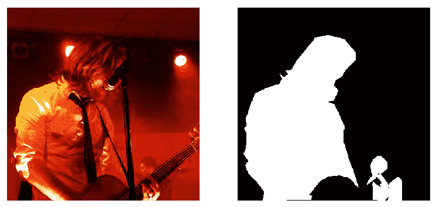

你如何处理这个问题取决于你模型期望的特性。在本章所展示的应用程序背景下，进行多类分类，包括人们通常持有的物体，或者将它们包含在掩码中，是有意义的。

另一种常见的技术是**数据增强**。这是指你人工调整图像（输入），以增加数据集的方差，或者甚至调整它以使其更符合你特定用例的数据。一些增强的例子包括模糊（在处理快速移动的物体时很有用）、旋转、添加随机噪声、颜色调整——本质上任何在现实世界中可能遇到的图像处理效果。

当然，还有许多其他技术和工具可以改进模型和数据；在这里，我们的意图只是强调主要领域，而不是深入细节。

# 在约束中设计

这在某种程度上是不可避免的，而且我们设计智能界面的方式仍处于初级阶段。也就是说，你向用户暴露多少透明度？你如何有效地帮助他们构建一个有用的心理模型，而不会分散他们的注意力或失去最初使用模型时的便利性？但在这里，我仅仅是指在设计体验中的约束条件，以提高模型成功的可能性。一个很好的例子，尽管与主题稍有不相关，就是家用机器人和洗碗机。尽管它没有机器人特性，但忠诚的洗碗机可以被认为是第一代用于家庭任务的机器人，就像《杰森一家》中的 Rosie。然而，与 Rosie 不同的是，我们还没有能够让洗碗机适应我们的环境。因此，我们为洗碗机调整了环境，也就是说，我们将其封装在一个箱子环境中，而不是使用我们习惯的现有厨房水槽。

一种简单的方法是让用户意识到如何获得最佳结果；在这个例子中，这可能仅仅是通过要求他们使用墙壁作为背景。这些提示可以在使用前提供，也可以在出现性能不佳的迹象时提供（或者两者都有）。自动检测性能不佳的一种方法是对边界框及其质心进行测量，并将其与预期的质心进行比较，如图所示：

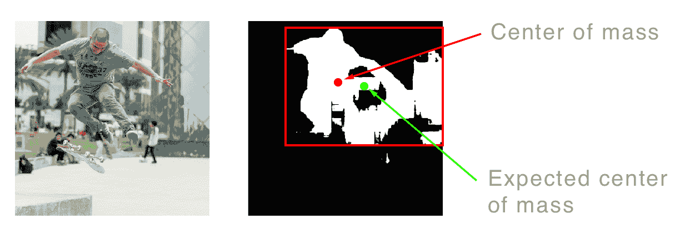

这就自然引出了下一个策略：嵌入启发式方法。

# 嵌入启发式方法

启发式方法本质上是在你的脑海中编码规则以解决特定任务，通常通过一个返回分数的函数来实现。这用于对一组替代方案进行排序。在上一节“在设计约束中”，我们看到了如何使用质心和边界框来确定分割图像中像素的分布情况。这反过来可以用来对每个帧进行排序，优先考虑那些质心靠近边界框中心的帧。我们还实现了一种启发式方法，在确定保留哪些帧和忽略哪些帧时，通过测量重叠来实现。

启发式方法可以是一个强大的盟友，但请注意确保你推导出的启发式方法能够很好地泛化到你的问题上，就像你期望一个好的模型那样。此外，还要注意使用它们所带来的额外计算成本。

# 后处理和集成技术

可以借鉴图像处理、计算机视觉和计算机图形学中的技术来提高输出质量以及检测能力。例如，一个典型的图像处理任务是执行开闭形态学操作。这种组合通常用于去除二值图像中的噪声和填充小孔。另一个我们可以从计算机视觉中借鉴的有用的后处理任务是流域，这是一种将图像视为地形图的分割技术，其中变化的强度定义了脊和填充（或分割）的边界。

另一个用于后处理的工具是另一个模型。你对 YOLO（用于对象检测）很熟悉。我们可以将其应用于获取对象的预测边界，然后我们可以使用这些边界来细化我们的分割。另一个模型，也是用于此任务的模型，是**条件随机字段**（**CRF**），它能够平滑我们的掩模边缘。

从图像处理、计算机视觉和计算机图形学等领域有大量的技术可供选择，我强烈建议你探索每个领域以构建你的工具集。

如果你刚开始接触计算机视觉，我推荐 T. Morris 的《计算机视觉与图像处理》和 J. Parker 的《图像处理和计算机视觉算法》这两本书，作为对这个领域的实用介绍。

# 人工辅助

有时包含人类在调整模型输出中是不可避免的，甚至可能是期望的。在这些情况下，模型被用来辅助用户而不是完全自动化任务。本章项目中可能采用的一些方法包括以下内容：

+   提供一个中间步骤，让用户可以整理掩模。我的意思是允许用户擦除被错误分类或用户不想要的掩模部分。

+   向用户展示一系列帧，并让他们选择用于合成的帧。

+   向用户展示最终合成图像的不同变体，并让他们选择最具吸引力的一个。

另一个相关的概念是引入人机交互的机器学习。当模型对其预测没有信心时，会有人类介入，并将分类和/或纠正的责任转交给用户。用户的修改将被存储并用于训练模型以改进性能。在这个例子中，我们可以让用户（或众包这个任务）分割图像，并在重新训练模型时使用这些数据。最终，在获得足够的数据后，模型将提高其在使用环境中相关的性能。

希望这一节强调了在处理机器模型时处理不确定性的重要性，并提供了足够的跳板，以便您可以从这里概述的角度来设计智能应用程序。现在，让我们通过回顾我们已经涵盖的内容来结束这一章。

# 摘要

在本章中，我们介绍了语义分割的概念，这是一种使我们的应用程序对照片和视频有更高感知理解的方法。它通过训练一个模型将每个像素分配到特定的类别来实现。为此，一个流行的架构是 U-Net，它通过保留空间信息，通过连接卷积层，实现了高精度的定位。然后我们回顾了用于训练的数据以及模型的某些示例输出，包括突出模型局限性的示例。

我们看到了如何通过创建一个图像效果应用程序来使用这个模型，其中分割的图像被用来从一系列帧中剪取人物并将它们组合在一起以创建动作镜头。但这只是语义分割应用的一个例子；它通常用于机器人、安全监控和工厂质量保证等领域，仅举几个例子。它还可以如何应用，取决于你。

在最后一节中，我们花了一些时间讨论处理模型时的策略，特别是它们的概率性（或不确定性水平）输出，以提高用户体验。

这是我们应用机器学习的最后一个例子。在下一章，也就是最后一章中，我们将转换方向，通过 Create ML 的帮助介绍如何构建自己的模型。让我们开始吧。
