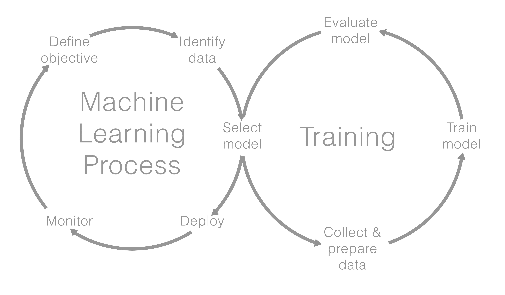
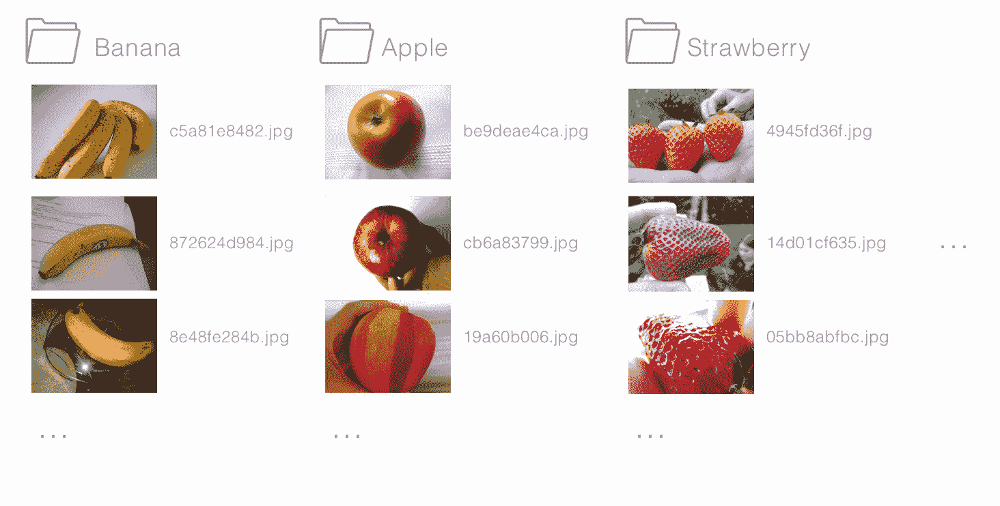
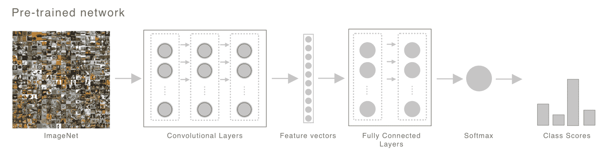
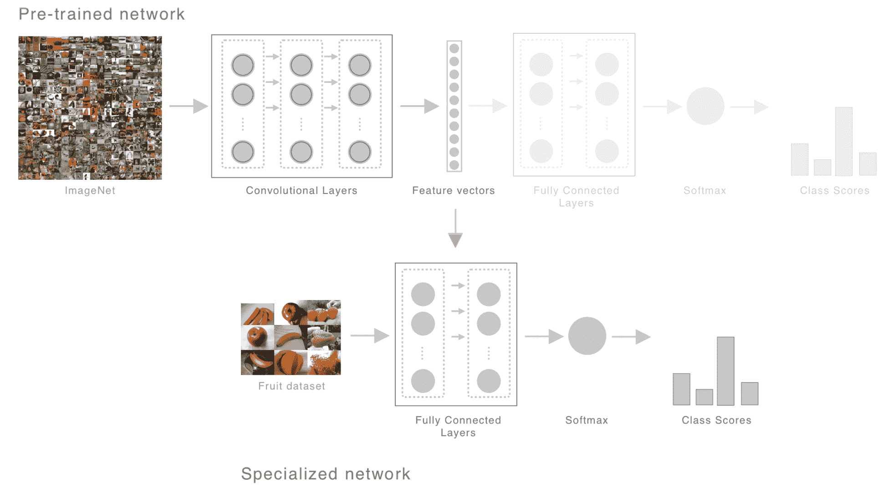
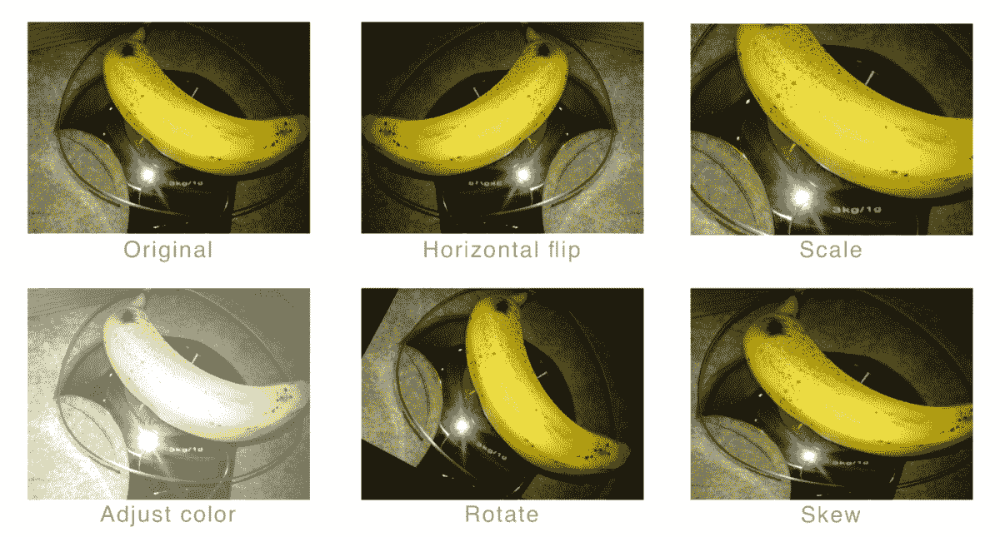
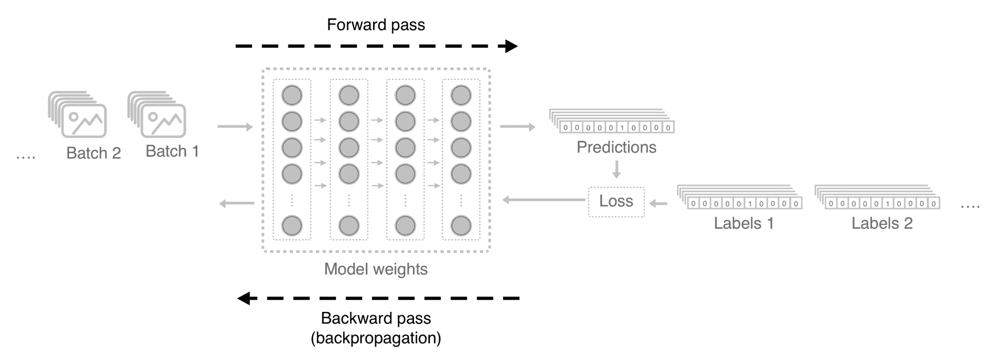
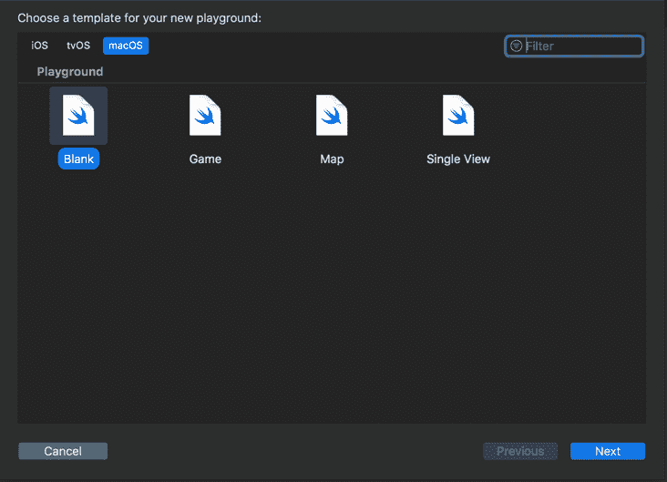
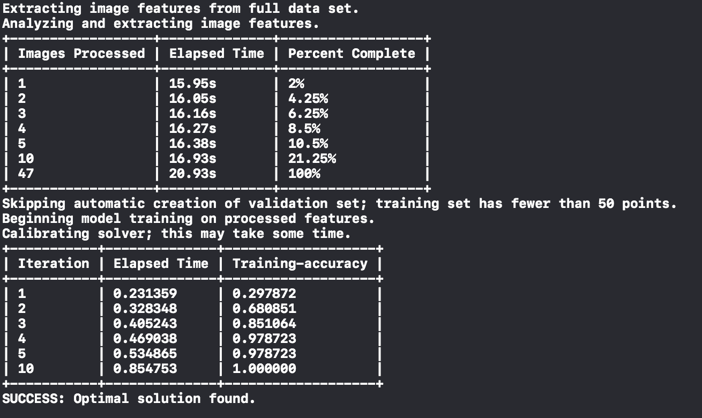
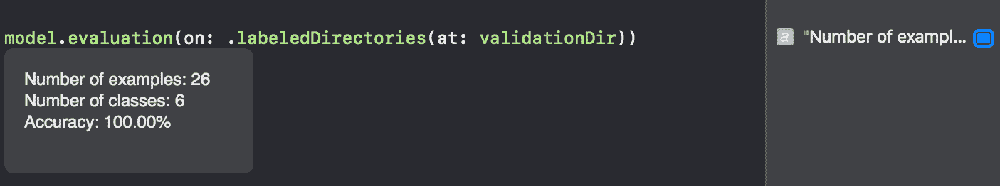
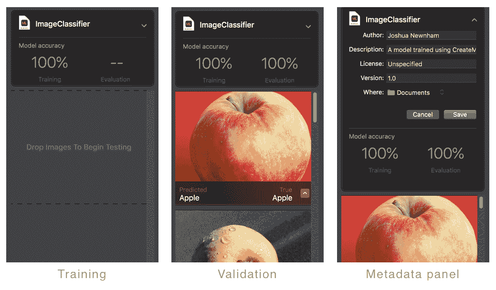

# 第十章：Create ML 简介

这本书的目的是探索在 iPhone 上应用机器学习的方法，特别是关注计算机视觉任务。即使这个焦点很窄，我们也只是触及了目前可能性的表面。但，希望我们已经涵盖了足够的内容来激发您的兴趣，并提供了足够的直觉来帮助您在构建智能应用的过程中理解机器学习模型的细节。

本章旨在通过介绍**Create ML**，一个与 Core ML 2 一同发布的工具，该工具提供了一种使用自定义数据创建一些常见模型的方法，来继续这一旅程。尽管我们只提供了高级介绍，特别是关于计算机视觉，但这仍然应该足以帮助您在自己的应用中使用它。

到本章结束时，您将：

+   修订了机器学习工作流程

+   认识到将数据分为训练集和验证集的重要性

+   使用 Create ML 创建自定义图像分类器

+   看过其他工具和框架以继续您的旅程

让我们从回顾典型的机器学习工作流程开始。

# 典型的工作流程

就像任何项目一样，您在进入过程时对您要构建的内容（问题）有一些了解。您对此了解得越清楚，您就越有能力解决它。

在理解了您要做什么之后（在构建机器学习模型的背景下），您的下一个问题（或任务）是“我需要什么数据？”这包括探索可用的数据以及您可能需要自己生成哪些数据。

一旦您理解了您要做什么以及您需要什么数据，您的下一个问题/任务就是决定需要什么算法（或模型）。这显然取决于您的任务和您拥有的数据；在某些情况下，您可能需要创建自己的模型，但更常见的情况是，您将可以使用一个合适的模型，或者至少是一个可以与您自己的数据一起使用的架构。以下表格显示了典型的计算机视觉任务及其相关的机器学习对应物：

| **任务** | **机器学习算法** |
| --- | --- |
| 标注图像 | 图像分类 |
| 识别多个对象及其位置 | 目标检测和语义分割 |
| 找到相似图像 | 图像相似度 |
| 创建风格化的图像 | 风格迁移 |

下一步是训练您的模型；通常，这是一个迭代的过程，需要大量的微调，直到您有一个在未训练过的数据上足够好地完成其任务的模型。

最后，在训练好模型后，您可以在您的应用中部署和使用您的模型。这个过程在以下图中总结：



之前的图表是对过程的过度简化；通常，工作流程是更循环的，在训练、选择和调整模型之间有多个迭代。同时运行多个模型（和模型参数）也是常见的。

为了使本章的概念更加具体，让我们以一个假设的简报为例，即必须构建一个有趣的应用程序来帮助幼儿学习水果的名称。你和你的团队已经提出了一个概念，即让幼儿通过使用设备的摄像头找到特定的水果。当幼儿正确地使用设备识别出水果时，他们会获得积分。现在我们的任务已经定义，让我们讨论我们需要哪些数据。

# 准备数据

对于我们的任务，我们需要一组标注好的水果照片。如您从第一章，“机器学习简介”中回忆的那样，这类机器学习问题被称为**监督学习**。我们需要我们的模型接收一张图片并返回它认为图片所代表的标签，也称为**多类分类**。

开始收集水果照片。创建 ML 允许以多种方式组织你的数据，但我发现按照以下方式在文件夹中组织是最容易的：



来源：http://www.image-net.org/

在这里，我们已经将我们的数据组织成文件夹，文件夹名称用作其内容的标签。另一种方法是给每张图片标注，例如，特定类别的每个实例都有一个后缀数字，例如 `banana.0.jpg`，`banana.1.jpg`，依此类推。或者，您可以简单地传递一个包含标签及其相关图像 URL 列表的字典。

在这个阶段，你可能想知道你应该获取多少张图片。苹果公司建议每个类别至少需要 10 张图片，但你通常希望收集尽可能多的图片，以帮助模型通过确保它在训练期间看到很多变化来泛化。同时，尽可能获取与模型将要使用的真实数据尽可能接近的图片也很重要（在现实世界中）。这是因为模型不会根据它学到的内容产生偏见。它只是学习它需要学习的内容。也就是说，如果你的苹果示例都是红色苹果，背景为白色，那么你的模型很可能会学会将这些颜色与苹果联系起来，每次它看到这些颜色时，它都会预测该图像包含苹果。

如前所述，苹果公司建议至少需要 10 张图片；这应该让你感到有些惊讶。通常，当谈论训练深度神经网络时，你期望数据集很大，非常大。例如，用于训练图像分类器的一个标准数据集是 ImageNet。这个数据集包含超过 1400 万张图片；这也是秘密的一部分。正如我们在整本书中讨论的那样，CNN 的层学习如何从图像中提取有意义特征，然后它们使用这些特征来推断图像的类别。对于像我们的水果分类器这样的专用分类器，一个常见的做法是借鉴在数百万张图片上训练的模型的这些学习成果，并使用它提取的特征来训练我们较小的数据集上的分类器——这种技术被称为**迁移学习**。

下面的两个图提供了这个过程的说明性示例，第一个图显示了一个在大数据集上训练的网络，第二个图则使用它所学的知识来训练一个更专业的数据集：



我们对卷积层学习的特征向量感兴趣；你可以将其视为其对输入图像理解的编码。这是我们想要用来训练我们自己的分类器，如下图中所示：



采用这种方法，我们无需学习如何提取特征，只需训练一个全连接网络的权重以进行分类，利用先前网络提取有意义特征的能力。Create ML 使用这种技术为其图像分类器服务。使用驻留在设备上并已针对超过 1,000 个类别进行训练的预训练模型意味着我们只需训练一个相对较小的网络进行分类。这是通过使用预训练网络提供的特征来完成的。这不仅使我们能够从较小的数据集中学习，而且减少了训练所需的时间。

Create ML 提供的另一个功能，并且代表我们进行有效的小数据集训练的是一种称为数据增强的技术。数据增强简单来说就是通过在训练过程中对每个图像应用一系列随机变换来增加数据集的方差，例如水平翻转图像。目标是，在训练时间，你的模型将看到许多图像的变体，以提高你的模型泛化的能力，也就是说，学习对它之前未见过的数据有意义的特征。以下图展示了数据增强通常执行的一些变换：



Create ML 提供的另一个便利之处是，它处理了与图像一起工作时所需的典型预处理任务，例如裁剪和调整大小。它们通常具有固定大小的输入和输出，需要您显式地预处理图像以匹配模型，或者使用 Vision 框架来为您处理这些任务。Create ML 建立在 Vision 之上的额外后果是，它处理了您在训练模型时通常需要手动执行的大量管道。

在我们继续创建和训练模型之前，还有一个重要的话题我想强调；这与平衡数据集或不平衡数据集的影响有关。平衡数据集指的是每个类都有相同数量的示例；也就是说，您避免在您每个类中的示例数量之间有大的差异。这为什么很重要？为了回答这个问题，让我们提醒一下模型是如何训练的以及它学到了什么。以下图示了训练过程，其中训练是对给定输入进行推理（前向传递）的迭代过程。然后，对模型的权重进行小调整，以便它们减少预测值和预期值（损失）之间的任何差异：



另一种说法是，过度暴露一个类将主导调整权重的这个过程，使得权重将更好地适应它们自己的类而不是其他类。这在批量训练时尤其如此，因为错误通常是批集中所有样本的平均值。所以，如果您的模型能够有效地预测主导类，它很可能会实现合理的损失，并且无法为其他类学习到任何有用的东西。

在这个阶段，我们已经知道我们想要实现的目标，拥有我们的平衡训练集，并且知道我们需要什么机器学习任务；我们现在准备好构建和训练我们的模型了。

# 创建和训练模型

感谢苹果工程师们的巨大努力，创建常见机器学习模型的过程极其简单，无疑将在接下来的几个月内引发一波新的智能应用浪潮。

在本节中，您将看到我们如何使用 Create ML 创建一个图像分类器，这将展示其有多么简单。

使用 Xcode Playground 可以访问 Create ML，因此这是一个很好的开始地方。打开 Xcode 并创建一个新的 Playground，确保您选择 macOS 作为平台，如图所示：



一旦进入 Playground，按照以下方式导入`CreateML`和`Foundation`：

```py
import CreateML
import Foundation
```

接下来，创建一个指向包含您的训练数据目录的`URL`：

```py
let trainingDir = URL(fileURLWithPath: "/<PATH TO DIRECTORY WITH TRAINING DATA>")
```

剩下的唯一事情就是创建我们模型的实例，传入我们训练数据的路径（我确实说过这非常简单）：

```py
let model = try MLImageClassifier(
    trainingData: .labeledDirectories(at: trainingDir))
```

Create ML 为您提供了提供自定义标签字典及其相关文件的灵活性，或者通过`MLImageClassifier.DataSource`的便利性。这可以是类组织到相应文件夹中的分层目录结构，`MLImageClassifier.DataSource.labeledDirectories`（如我们在本例中所做的那样），或者每个文件都根据其相关类命名的结构，`MLImageClassifier.DataSource.labeledFiles`。

一旦模型实例化，它将开始训练。一旦完成，它将输出在您的训练集上达到的准确率到控制台，如下面的截图所示：



我们几乎完成了；这告诉我们我们的模型很好地拟合了我们的训练数据，但它并没有告诉我们它将如何泛化，也就是说，它将如何在新未见过的图像上工作。深度神经网络记住它们的训练数据，这通常被称为过拟合。为了避免过拟合，并因此更有可能在现实世界中产生可用的东西，通常将数据分成三个桶。第一个桶用于训练模型。第二个桶，称为验证数据，在训练期间使用（通常在每个迭代/周期结束时）来查看模型泛化的程度。它还提供了有关模型何时开始过拟合的线索（当训练准确率和验证准确率开始偏离时）。最后一个桶只在您对模型在验证数据上的表现满意后使用，这是模型实际工作效果的决定因素；这个桶被称为测试数据。

您为验证和测试保留了多少数据？对于浅层学习者来说，通常有一个 70/20/10（训练、验证和测试）的分割。但深度学习通常意味着大数据集，在这种情况下，为验证和测试保留的数据可能过多。因此，答案实际上取决于您有多少数据以及数据的类型。

因此，在我们部署模型之前，我们将在训练期间未见过的数据集上评估它。再次提醒，为您的每个类别收集相等数量的数据，并在完成后返回此处。

如我们之前所做的那样，创建一个指向包含您的验证数据的目录的 URL：

```py
let validationDir = URL(fileURLWithPath: "/<PATH TO DIRECTORY WITH VALIDATION DATA>")
```

现在只需在模型上调用`evaluation`即可，如下所示：

```py
model.evaluation(on: .labeledDirectories(at: validationDir))
```

这将在我们的每个验证样本上执行推理，并报告准确率，您可以通过快速查看访问：



对于我们的验证准确率感到满意后，我们现在准备导出我们的模型，但在我们这样做之前，让我们对一个单独的图像进行预测。

您可以通过调用模型实例的 `prediction` 方法（如果您有多个样本要执行推理，则为 `predictions`）轻松完成此操作，如下面的代码片段所示：

```py
let strawberryUrl = URL(
    fileURLWithPath: "/<PATH TO STRAWBERRY>")

print(try model.prediction(from: strawberryUrl)) 
```

如果一切顺利，那么 `Strawberry` 应该会输出到您的控制台。现在，对我们模型有了信心，是时候导出它了。

根据 Create ML 的本质，导出只是一行代码：

```py
try model.write(toFile: "<PATH TO FILE>")
```

从这里，只需将 Core ML 模型导入到您的项目中即可，正如我们在本书中多次看到的。

我们几乎结束了对 Create ML 的简要介绍；但在我们继续之前，我想快速强调一些事情，首先是模型参数。

# 模型参数

在上一节中，我提到了数据增强对于小型数据集的有用性。那么，您如何在训练期间使用它呢？选项通过 `MLImageClassifier.ModelParameters` 结构暴露给您，您可以在实例化分类器时传递其实例。其中一个参数是 `OptionSet` `CreateML.MLImageClassifier.ImageAugmentationOptions`，它允许您打开和关闭各种增强技术。

`MLImageClassifier.ModelParameters` 还允许您指定最大迭代次数、特征提取的版本和验证数据。您可以在官方网页上了解更多信息：[`developer.apple.com/documentation/create_ml/mlimageclassifier/modelparameters`](https://developer.apple.com/documentation/create_ml/mlimageclassifier/modelparameters)。

# 模型元数据

当与 第五章 中的 Core ML 工具包和 第六章 中的 *使用风格迁移创建艺术* 一起工作时，我们将 Keras 模型转换为 Core ML，我们看到了如何显式设置元数据，这在 Xcode 中显示。Create ML 通过在导出模型时传递 `MLModelMetadata` 的实例来提供显式设置这些数据的方法。它提供了我们在使用 Core ML 工具包时看到的全部元数据，如名称、描述等。

# 替代工作流程（图形化）

在进入下一节之前，最后一点！在本章中，我们已经通过编程的方式创建、训练和验证了一个模型。Create ML 提供了一种替代方案，在这里，您可以使用图形界面来构建模型，而不是使用代码。这可以通过 `CreateMLUI` 库访问，您只需创建一个 `MLImageClassifierBuilder` 的实例并调用其 `showInLiveView` 方法：

```py
import CreateMLUI

let builder = MLImageClassifierBuilder()
builder.showInLiveView()
```

一旦运行，您将在实时视图中看到一个小部件，它允许您通过拖放训练和验证示例来简单地训练模型。以下图显示了训练和验证后的此小部件以及输入元数据的面板：



这部分、这一章和这本书的内容到此结束。我们将以一些总结性的思考结束，包括一些其他工具的列表，以帮助您在创建更智能的应用程序的道路上。

# 总结性思考

这个工具通过允许任何（有能力的人）创建自定义模型，实际上使机器学习民主化，但简单性和表达性之间总是存在权衡。因此，这里有一份简短的工具列表，您可能想要探索：

+   **Turi create**：来自 2016 年被苹果公司收购的公司；它提供了与 Core ML 的紧密集成，使得部署和定制模型变得容易。它还提供了一套更全面的机器学习模型，如风格转换和分割。您可以在[`github.com/apple/turicreate`](https://github.com/apple/turicreate)了解更多关于 Turi create 的信息。

+   **IBM Watson Services for Core ML**：IBM Watson 是 IBM 的 AI 平台，提供了一系列常见的机器学习模型作为服务。他们最近通过 Core ML 模型提供了一些这些服务，允许您的应用程序在离线时也能利用 IBM Watson 的服务。

+   **ML Kit**：谷歌在 2018 年初宣布了 ML Kit，作为一个平台，用于常见的机器学习任务，如图像标注和光学字符识别。该平台还负责模型分发，包括自定义模型。

+   **TensorFlowLite**：TensorFlow 流行机器学习框架的轻量级版本。与 Core ML 类似，它支持设备端推理。

这些只是将机器学习集成到您应用程序中的一些选项，所有这些在未来的几年里都可能显著增长。但是，正如我们在整本书中看到的，机器学习算法只是方程的一部分；数据是推动体验的因素，所以我鼓励您寻找并尝试新的数据集，看看您能利用这里学到的知识创造出什么样的独特体验。

机器学习正在以惊人的速度发展。Arxiv 网站是研究人员发布论文的流行仓库；只需监测这个网站一周以上，您就会对发表的论文数量和取得的进步感到惊讶和兴奋。

但是，目前研究界和行业从业者之间存在差距，这在一定程度上促使我写这本书。我希望您在这本书的页面上所读到的内容已经给您足够关于深度神经网络的直觉，更重要的是，激发了对您继续探索和实验的足够的好奇心和兴奋感。正如我在本章开头提到的，我们刚刚触及了目前存在和可能的表面，更不用说 12 个月后的情况了。

因此，请把这看作是邀请或挑战，加入我一起创造下一代应用程序。我期待看到您创造出的成果！

# 概述

在本章中，我们介绍了 Create ML，这是一个使训练和部署常见机器学习模型变得极其简单的工具。我们看到了如何使用极少的示例和极少的代码创建一个图像分类器。我们讨论了这是如何通过使用迁移学习来实现的，然后介绍了一些关于您的训练数据以及将其分割用于验证和测试的重要性的注意事项。
