# 第四章：线性和逻辑回归

通过使用共同特征对相似信息进行分组后，我们获得了洞察力，现在是时候稍微更数学化，开始寻找一种方法来使用一个独特的函数来描述数据，该函数将压缩大量信息，并允许我们预测未来的结果，假设数据样本保持其先前的属性。

在本章中，我们将涵盖以下主题：

+   线性回归的逐步实现

+   多项式回归

+   逻辑回归及其实现

+   Softmax 回归

# 回归分析

本章将从解释一般原则开始。那么，让我们提出一个基本问题：什么是回归？*

在所有考虑因素之前，回归基本上是一个**统计过程**。正如我们在介绍部分所看到的，回归将涉及一组具有特定概率分布的数据。总之，我们有一组需要特征化的数据。

在回归的情况下，我们特别寻找哪些元素？我们希望确定自变量和因变量之间的关系，该关系能够最佳地调整到提供的数据。当我们找到描述变量之间的这种函数时，它将被称为**回归函数**。

有大量函数类型可供我们帮助建模当前数据，最常见的例子是线性、多项式和对数。

这些技术旨在确定一个目标函数，在我们的情况下，它将输出函数的有限个未知最优参数，称为**参数回归**技术。

# 回归的应用

回归通常用于预测未来的变量值，并且它是数据分析项目中初始数据建模的一个非常常用的技术，但它也可以用于优化流程，找到相关但分散的数据之间的共同点。

在这里，我们将列出回归分析的一些可能的应用：

+   在社会科学中，预测各种指标的未来的值，例如失业率和人口

+   在经济学中，预测未来的通货膨胀率、利率和类似指标

+   在地球科学中，为了预测未来的现象，例如臭氧层的厚度

+   帮助正常企业仪表盘的所有元素，添加生产吞吐量、收入、支出等的概率估计

+   证明两种现象之间的依赖性和相关性

+   在反应实验中找到成分的最优组合

+   最小化风险投资组合

+   理解一家公司的销售额对广告支出变化的敏感度

+   看看股票价格如何受到利率变化的影响

# 定量变量与定性变量

在日常数据工作中，我们遇到的所有元素并不都是相同的，因此它们需要根据其特性进行特殊处理。我们可以通过以下标准将数据类型划分为定量数据和定性数据变量，以识别问题变量是否适当：

+   **定量变量**：在物理变量或测量的领域中，我们通常处理实数或定性变量，因为最重要的是我们测量的数量。在这个组中，我们有有序变量，即当我们在一个活动中处理顺序和排名时。这两种变量类型都属于定量变量类别。

+   **定性变量**：另一方面，我们有显示样本属于哪个类别的测量。这不能以数量的方式表达；它通常被分配一个标签、标记或分类值，代表样本所属的组。我们称这些变量为定性变量。

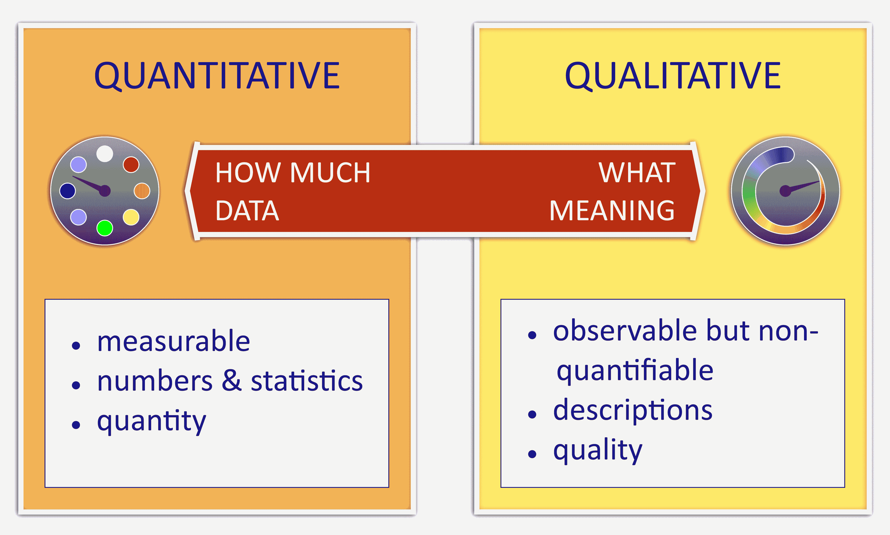

针对定量和定性分析差异的参考表

现在我们来探讨哪些类型的变量适合应用于回归问题。

明确的答案是定量变量，因为数据分布的建模只能通过我们用来检测这些变量之间规律对应关系的函数来完成，而不是基于类别或元素类型。回归需要一个连续的输出变量，而这只有定量指标才能满足。

对于定性变量，我们将数据分配给分类问题，因为它的定义本身就是寻找非数字标签或标记来分配给样本。这是分类的任务，我们将在下一章中看到。

# 线性回归

因此，现在是时候开始使用我们数据中最简单但仍然非常有用的抽象——线性回归函数了。

在线性回归中，我们试图找到一个线性方程，它最小化了数据点与模型线之间的距离。模型函数具有以下形式：

y[i] = ßx[i] + α + ε[i]

在这里，*α* 是模型的截距，*ß* 是模型线的斜率。变量 *x* 通常被称为自变量，而 *y* 被称为因变量，但它们也可以被称为回归变量和响应变量。

ε[i] 变量是一个非常有趣的元素，它是样本 *i* 到回归线的误差或距离。

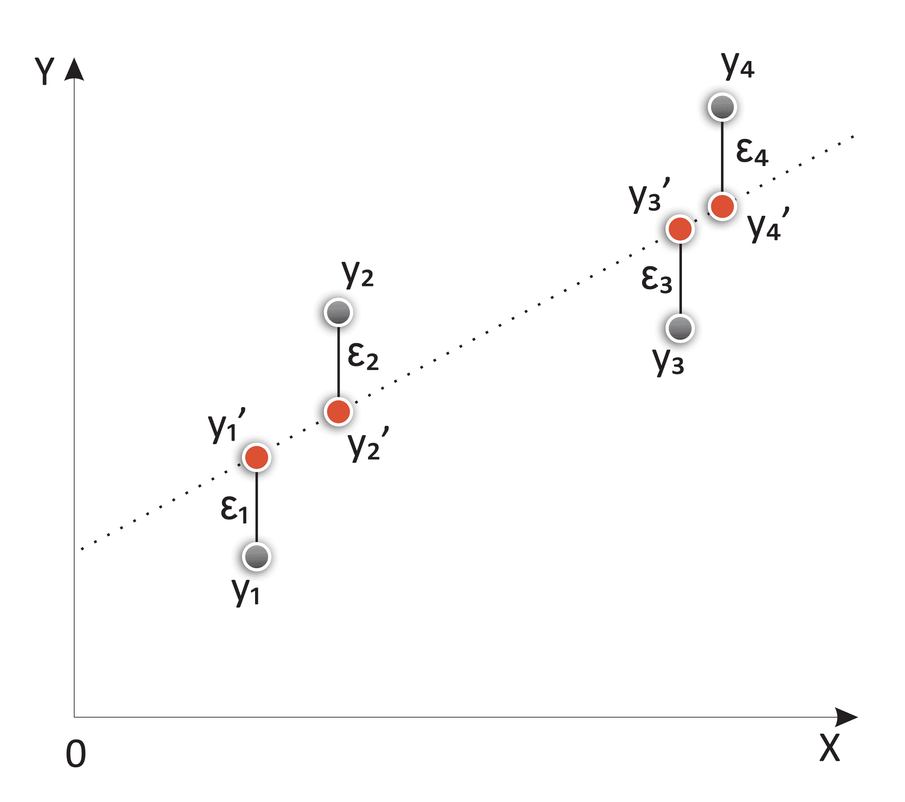

回归线组成部分的描述，包括原始元素、估计的元素（红色）和误差（ε）

所有这些距离的集合，以称为 *成本* 函数的形式计算，作为求解过程的结果，将给出未知参数的值，这些值最小化了成本。让我们开始工作吧。

# 成本函数的确定

与所有机器学习技术一样，学习过程依赖于一个最小化损失函数，它告诉我们当我们预测一个结果时，我们处于学习的哪个阶段，我们的预测是正确还是错误。

线性回归中最常用的成本函数被称为 *最小二乘法*。

让我们定义这个成本函数，为了简化，我们考虑一个二维回归，其中我们有一个数字元组的列表 *(x[0], y[0])*, *(x[1], y[1])* ... *(x[n], y[n])* 以及要找到的值，即 *β[0]* 和 *β[1]*。在这种情况下，最小二乘成本函数可以定义为以下：

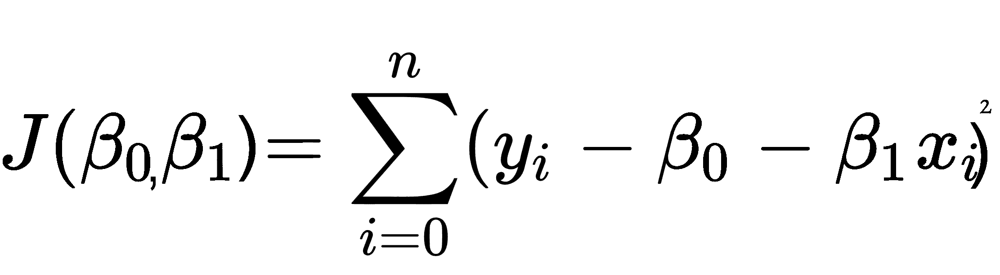

线性方程的最小二乘函数，使用标准变量β[0]和β[1]，这些将在下一节中使用

对每个元素的求和给出一个唯一的全局数，这给出了所有值（y[i]）与我们的理想回归线（β[0] + β1*x*[i]）中相应点的总差异的全局概念。

这个操作的原理非常清晰：

+   求和给我们一个唯一的全局数

+   模型-实际点之间的差异给出了距离或 L1 误差

+   将其平方后，我们得到一个正数，这也会以非线性的方式惩罚距离，超过一个误差限制，因此我们犯的错误越多，我们越愿意增加我们的惩罚率

另一种表述方式是，这个过程最小化了平方残差的和，残差是我们从数据集中得到的价值与模型计算出的预期价值之间的差异，对于相同的输入值。

# 最小化误差的多种方法

最小二乘误差函数有几种得到解的方法：

+   解析方法

+   使用协方差和相关性值

+   对于机器学习方法家族来说，最熟悉的方式——梯度下降法

# 解析方法

解析方法采用几种线性代数技术，以便得到精确的解。

我们以非常简洁的方式介绍这项技术，因为它与我们在这本书中回顾的机器学习技术没有直接关系。我们介绍它是为了完整性。

首先，我们以矩阵形式表示误差：

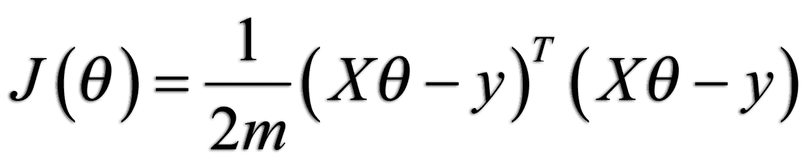

线性回归方程的矩阵形式的规范形式

在这里，*J* 是成本函数，具有以下解析解：

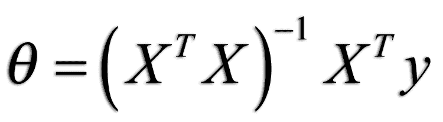

线性回归矩阵形式的解析解

# 解析方法的优缺点

考虑到我们可以给出一个简单且确定性的表示，使用线性代数技术来计算最小误差解法是一个更简单的方法，因此在进行操作后不需要额外的猜测。

但这种方法可能存在一些问题：

+   首先，矩阵求逆和乘法是非常计算密集的操作。它们通常有大约 *O(n²)* 到 *O(n³)* 的下限，因此当样本数量增加时，问题可能变得难以处理。

+   此外，根据实现方式，这种直接方法也可能具有有限的精度，因为我们通常可以使用当前硬件浮点容量的限制。

# 协方差/相关方法

现在是时候介绍一种新的方法来估计回归线的系数了，在这个过程中，我们将学习额外的统计度量，如协方差和相关性，这些也将帮助我们第一次分析数据集并得出初步结论。

# 协方差

**协方差**是一个统计术语，可以规范地定义为以下内容：

一对随机变量之间系统关系的度量，其中一个变量的变化由另一个变量等效的变化所抵消。

协方差可以取从 -∞ 到 +∞ 的任何值，其中负值表示负相关关系，而正值表示正相关关系。它还确定了变量之间的线性关系。

因此，当值为零时，表示没有直接的线性关系，值倾向于形成类似团块状的分布。

协方差不受度量单位的影响，也就是说，当改变单位时，两个变量之间关系的强度不会改变。然而，协方差值会改变。它有以下公式，需要每个轴的平均值作为先决条件：


# 相关系数

记得我们描述变量标准化过程时吗？我们通过减去平均值并使用数据集的标准差进行缩放来使变量居中，以下公式：

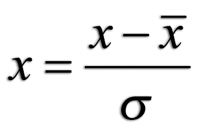

数据标准化操作的解析形式

这将是我们的分析起点，我们将沿着每个轴扩展，使用相关值。

相关系值决定了两个或更多随机变量协同移动的程度。在研究两个变量时，如果观察到其中一个变量的移动与另一个变量等效的移动一致，则称这些变量是相关的，确切的相关值由以下公式给出：

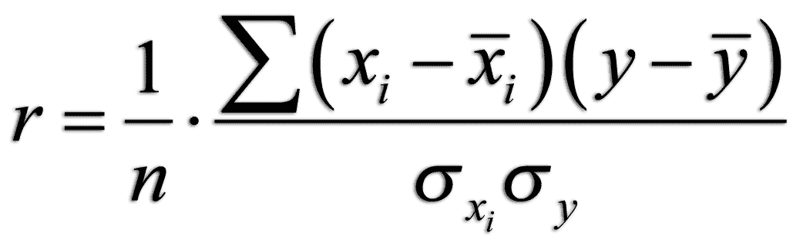

相关性的规范定义

作为基于真实值的度量标准，它可以是两种类型，正或负。当两个变量朝同一方向移动时，变量是正相关的或直接相关的。当两个变量朝相反方向移动时，相关性是负的或逆的。

相关系数的值介于*-1*到*+1*之间，其中接近*+1*的值表示强烈的正相关，而接近*-1*的值是强烈负相关的指标：

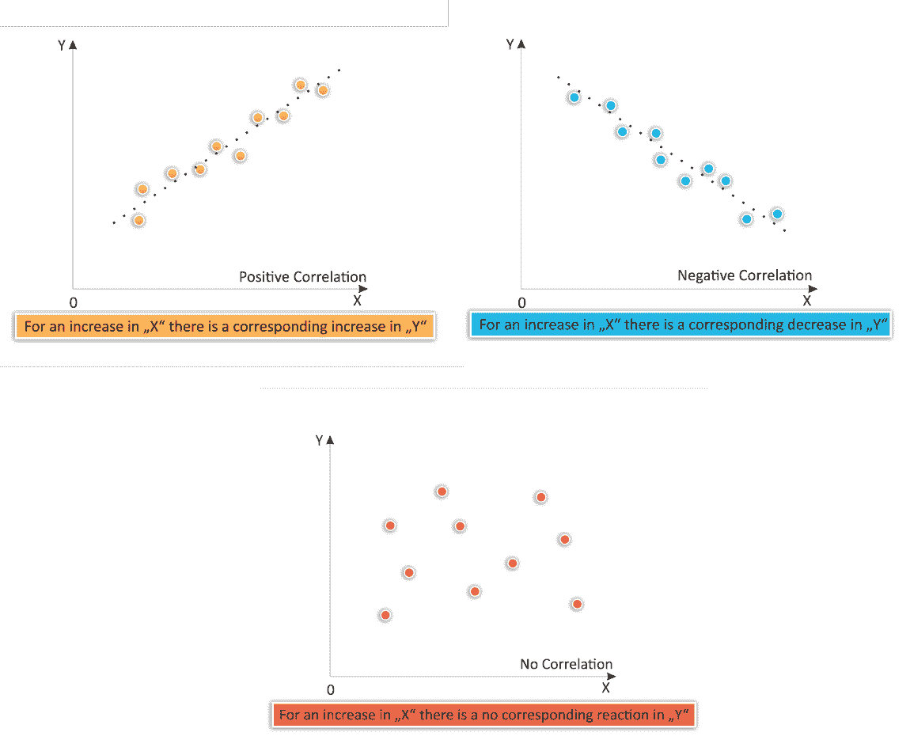

样本分布如何影响相关值的图形描述

有其他测量相关性的方法。在这本书中，我们将主要讨论线性相关性。还有研究非线性相关性的其他方法，这些方法不会在本书中介绍。

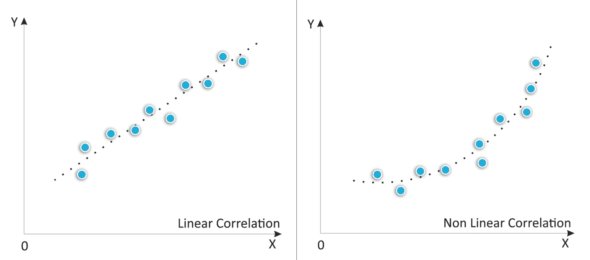

线性相关性和非线性相关性度量之间的差异描述

在本章的实践练习中，你将找到线性协方差和相关的实现。

# 使用协方差和相关性搜索斜率和截距

正如我们一开始就知道的，我们需要找到以下形式的表示底层数据的直线方程：

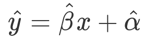

线性方程的近似定义

由于我们知道这条线穿过所有点的平均值，我们可以估计截距，唯一未知的是估计的斜率：


截距的导出定义

斜率表示因变量变化与自变量变化的比值。在这种情况下，我们处理的是数据的变化，而不是坐标之间的绝对差异。

由于数据是非均匀的，我们将斜率定义为与因变量协变的自变量方差的比率：

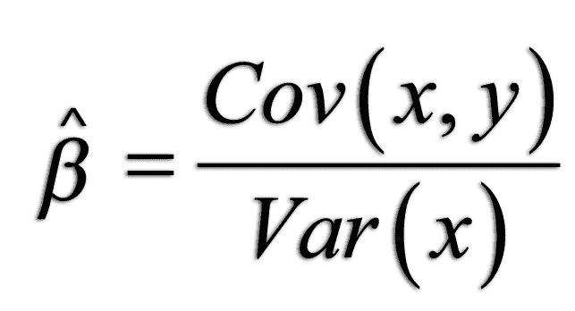

估计斜率系数

恰好，如果我们绘制的数据看起来像圆形云，我们的斜率将变为*零*，这表明*x 和 y*的变化之间没有因果关系，以下形式表示：


估计斜率系数的展开形式

应用我们之前展示的公式，我们最终可以将估计回归线的斜率表达式简化为以下表达式：

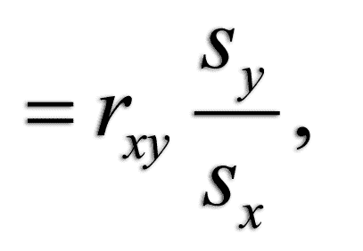

斜率系数的最终形式

在这里，*S[y]*是*y*的标准差，而*S[x]*是*x*的标准差。

在方程中剩余元素的帮助下，我们可以简单地根据直线将到达均值数据点的知识推导出截距：


近似截距系数的最终形式

因此，我们已经完成了两种初步回归形式的非常简化的表达，这也为我们留下了许多分析元素。现在，是时候介绍当前机器学习技术的明星了，你作为从业者肯定会在许多项目中使用，称为**梯度下降**。

# 梯度下降

是时候讨论将带我们进入现代机器学习核心的方法了。这里解释的方法将被用于许多更复杂的模型，以类似的方式使用，难度增加，但原理相同。

# 一些直观的背景

为了介绍梯度下降，我们首先来看我们的目标——将线函数拟合到一组提供的数据。那么我们有哪些元素呢？

+   一个模型函数

+   一个误差函数

我们还可以得到的一个元素是所有可能误差的表示，对于任何参数组合。那会很好，对吧？但看看这样一个函数在只有一个简单直线作为解的问题中的样子。这个曲线代表的是 *z= x² + y²*，它遵循最小二乘误差函数的形式：

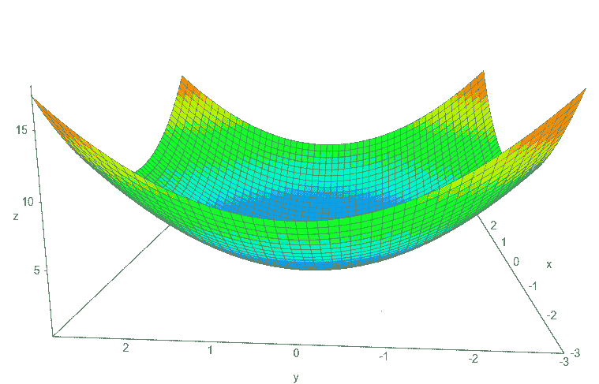

在两个变量的情况下，最小二乘误差曲面。在线性回归的情况下，它们是斜率和交点

如你所见，计算每个线参数的所有可能结果会消耗太多的 CPU 时间。但我们有一个优势：我们知道这种曲线的表面是**凸**的（这超出了本书的范围），所以它大致看起来像一个碗，并且有一个唯一的最低值（如前一个文件夹中所示）。这将避免我们定位看似最小但实际上只是表面上的波峰的问题。

# 梯度下降循环

因此，是时候寻找一种方法来收敛到函数的最小值，只知道我在曲面上的位置，以及可能是我站立在曲面上的点的梯度：

+   从一个随机位置开始（记住，我们对曲面一无所知）

+   寻找最大变化的方向（因为函数是凸的，我们知道它会引导我们到最小值）

+   沿着误差表面朝那个方向前进，与误差量成比例

+   将下一步的起点调整到我们着陆的曲面上的新点，并重复这个过程

这种方法允许我们以迭代的方式，在有限的时间内发现我们值最小化的路径，与暴力方法相比。

对于两个参数和最小二乘函数的过程是这样的：

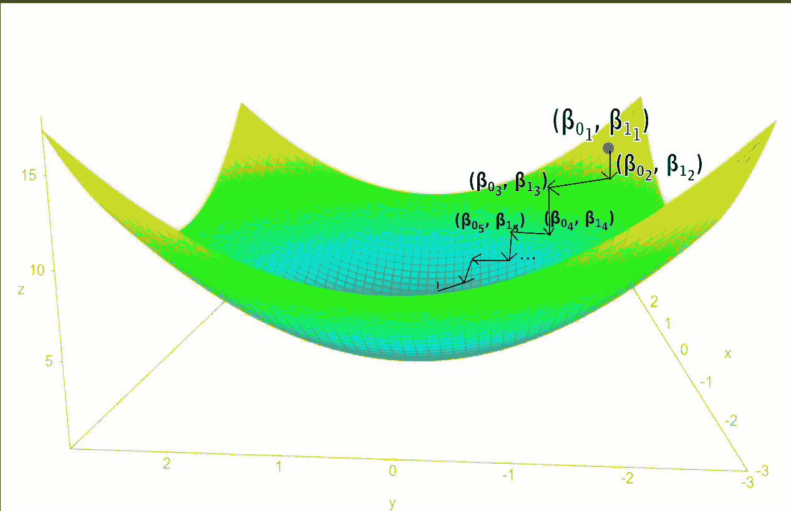

梯度下降算法的描述，从起始的高误差点开始，沿着最大变化的方向下降

这让我们对在正常设置下，当我们使用和选择良好且适当的初始参数时，过程是如何工作的有一个概念。

在接下来的章节中，我们将更详细地介绍梯度下降的过程，包括选择不同的元素（我们将称之为超参数）如何改变过程的行为。

# 正式化我们的概念

现在，让我们回顾一下我们过程的数学方面，这样我们就有了一个参考，在将它们用于实践之前，了解所有涉及的各个部分。

我们方程的元素如下：

+   线性函数变量，*β*[*0*] 和 *β[1]*

+   样本集中的样本数量，*m*

+   样本集中的不同元素，*x^((i))* 和 *y^((i))*

让我们从我们的误差函数 *J* 开始，它在前面几节中被称为最小二乘函数。为了实用性，我们将在方程的开始处添加 1/2m 项，如下所示：

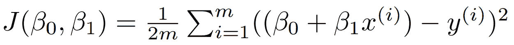

最小二乘误差函数

让我们引入一个新的运算符，这是所有后续工作的基础，即梯度。

为了构建这个概念，我们有以下内容：

+   一个或多个独立变量的函数

+   对于所有独立变量的函数的偏导数

如我们目前所知，如何计算偏导数，因此我们只需说梯度是一个包含所有已提到的偏导数的向量；在我们的情况下，它将如下所示：

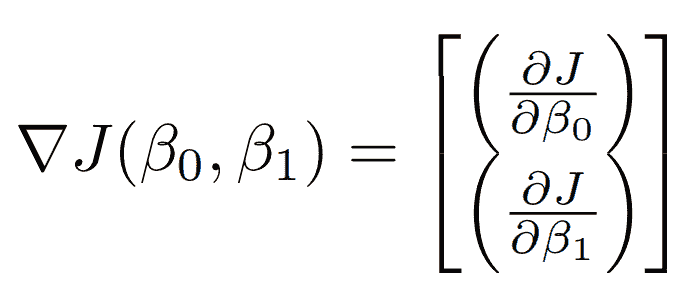

误差函数的梯度

这样的运算符的目的是什么？如果我们能够计算它，它将给出整个函数在单一点上变化的方向。

首先，我们计算偏导数。你可以尝试推导它；基本上，它使用求导平方表达式的链式法则，然后乘以原始表达式。

在方程的第二部分，我们通过模型函数 *h[a]* 的名称简化线性函数：

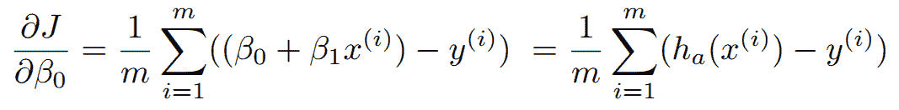

对于 β[1] 变量的误差函数的偏导数

在 β[1] 的情况下，我们得到 *x^((i))* 元素的附加因子，因为 *β[1]x*^(*(i)* 的导数是 *x^((i))*：

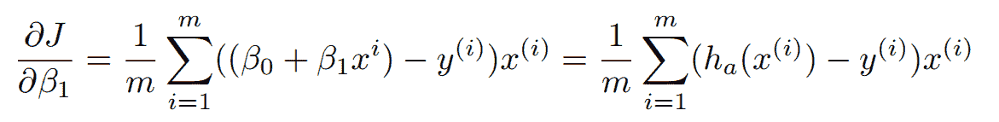

对于 β[1] 变量的误差函数的偏导数

现在我们引入递归表达式，它将在迭代且条件满足的情况下提供一组参数，以收敛的方式减少总误差。

这里，我们引入一个非常重要的元素：步长，命名为 α。它的目的是什么？它将允许我们调整我们在每一步中前进的距离。我们将发现，如果没有选择正确数量的幂，可能会导致灾难性的后果，包括误差发散到无穷大。

注意，第二个公式只有微小的差异，就是乘以当前的 *x* 值：

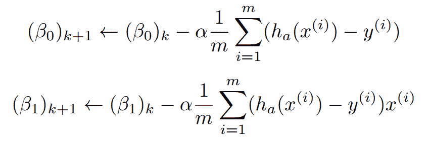

模型函数的递归方程

因此，我们准备出发了！现在我们只需添加一点数学调味料，以便产生算法的更紧凑表示。现在让我们以向量形式表示未知数，这样所有的表达式都将作为一个整体来表示：

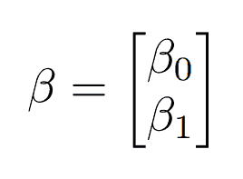

β 的向量表示

使用这个新的表达式，我们的递归步骤可以用这个简单且易于记忆的表达式来表示：

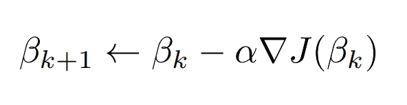

梯度下降递归的向量表示

# 将递归表示为过程

寻找最小误差的整个方法可以交替地用流程图表示，这样我们就可以将所有元素放在同一个地方，并理解如果我们暂时不考虑相对复杂的分析机制，它看起来是多么简单：

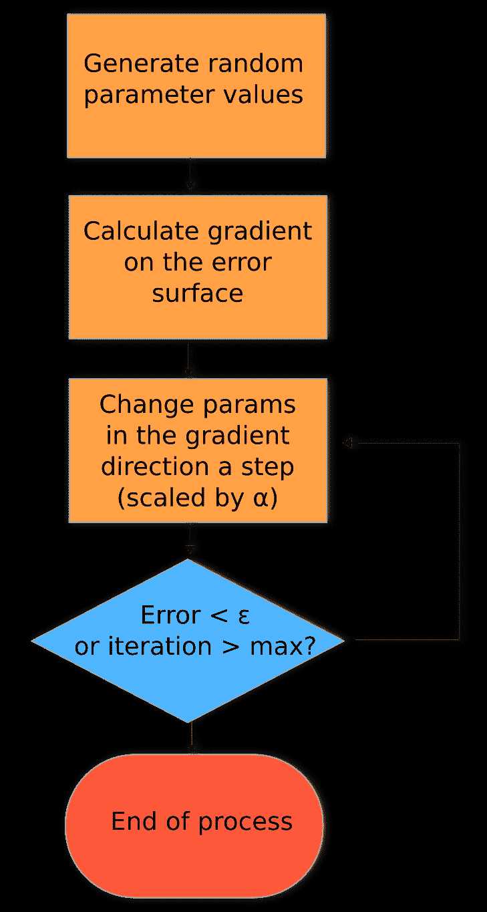

梯度下降方法的流程图。注意其简单的构建模块，没有考虑到它所涉及的微妙数学。

因此，有了这个关于梯度下降过程的最后程序性视角，我们准备继续本章更实用的部分。我们希望您喜欢这段寻找答案的旅程：我们如何以简单的方式表示我们的数据？请放心，在接下来的章节中，我们将使用更强大的工具。

# 实用性 - 新方法的新工具

在本节中，我们将介绍一个新库，它将帮助我们处理协方差和相关性，尤其是在数据可视化领域。

**Seaborn** 是什么？

Seaborn 是一个用于在 Python 中创建吸引人且信息丰富的统计图形的库。此外，它还提供了非常有用的多元分析原语，这将帮助您决定是否以及如何将确定回归分析应用于您的数据。

Seaborn 提供的一些功能如下：

+   几种非常高质量的内置主题

+   选择调色板以制作美丽图表的工具，这些图表可以揭示数据中的模式

+   用于可视化单变量和双变量分布或比较数据子集之间分布的重要函数

+   适合并可视化不同类型独立和依赖变量的线性回归模型的可视化工具

+   当用最小参数集调用时尝试做些有用的事情的绘图函数；它们通过额外的参数暴露出许多可定制的选项

一个重要的附加功能是，由于 Seaborn 使用 matplotlib，可以使用这些工具进一步调整图形，并使用 matplotlib 的任何后端进行渲染。

现在让我们探索 Seaborn 将带来的最有用的实用工具。

# 用于变量探索的有用图表 - 对数图

在数据探索阶段，我们可以拥有的最有用的度量之一是数据集中所有特征的交互关系的图形表示，并以直观的方式发现联合变化：

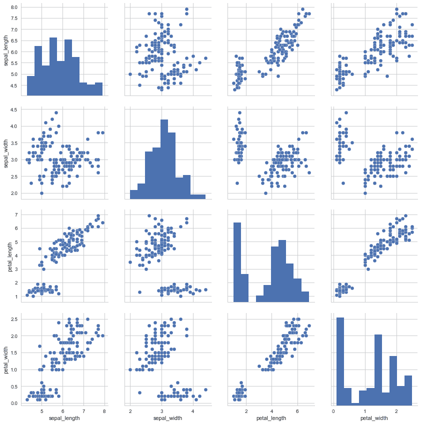

Iris 数据集中变量的对图

# 相关性图

相关性图允许我们以更简洁的方式总结变量之间的依赖关系，因为它使用颜色板显示了变量对之间的直接相关性。对角线值当然是 1，因为所有变量都与自身具有最大相关性：

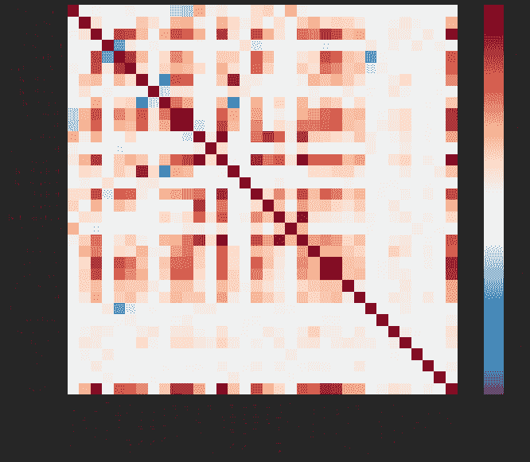

旧金山住房数据集的相关性图

# 数据探索和线性回归实践

在本节中，我们将开始使用最著名的*玩具*数据集之一，对其进行探索，并选择一个维度来学习如何为其值构建线性回归模型。

让我们先导入所有库（`scikit-learn`、`seaborn`和`matplotlib`）；Seaborn 的一个优秀特性是它能够定义非常专业的样式设置。在这种情况下，我们将使用`whitegrid`样式：

```py
import numpy as np from sklearn import datasets import seaborn.apionly as sns %matplotlib inline import matplotlib.pyplot as plt sns.set(style='whitegrid', context='notebook')
```

# Iris 数据集

是时候加载*Iris*数据集了。这是最著名的传统数据集之一。你会在许多书籍和出版物中找到它。鉴于数据的好性质，它对分类和回归示例非常有用。Iris 数据集([`archive.ics.uci.edu/ml/datasets/Iris`](https://archive.ics.uci.edu/ml/datasets/Iris))包含三种鸢尾花类型各 50 条记录，总共有 150 行，分布在五个字段中。每一行都是以下测量值：

+   花萼长度（单位：厘米）

+   花萼宽度（单位：厘米）

+   花瓣长度（单位：厘米）

+   花瓣宽度（单位：厘米）

最后一个字段是花的类型（*setosa*、*versicolor*或*virginica*）。让我们使用`load_dataset`方法从数据集中创建一个值矩阵：

```py
iris2 = sns.load_dataset('iris')
```

为了理解变量之间的依赖关系，我们将实现协方差操作。它将接收两个数组作为参数，并返回`covariance(x,y)`值：

```py
def covariance (X, Y):
    xhat=np.mean(X)
    yhat=np.mean(Y)
    epsilon=0
    for x,y in zip (X,Y):
        epsilon=epsilon+(x-xhat)*(y-yhat)
    return epsilon/(len(X)-1)
```

让我们尝试一下实现的功能，并将其与 NumPy 函数进行比较。请注意，我们计算了`cov(a,b)`，而 NumPy 生成了一个包含所有组合`cov(a,a)`、`cov(a,b)`的矩阵，因此我们的结果应该等于该矩阵的`(1,0)`和`(0,1)`值：

```py
print (covariance ([1,3,4], [1,0,2]))
print (np.cov([1,3,4], [1,0,2]))

0.5
[[ 2.33333333  0.5       ]
 [ 0.5         1\.        ]]
```

在对之前定义的关联函数进行最小测试后，接收两个数组，例如`covariance`，并使用它们来获取最终值：

```py
def correlation (X, Y):
    return (covariance(X,Y)/(np.std(X,  ddof=1)*np.std(Y,  ddof=1))) ##We have to indicate ddof=1 the unbiased std
```

让我们用两个样本数组测试这个函数，并将其与 NumPy 的相关矩阵的`(0,1)`和`(1,0)`值进行比较：

```py
print (correlation ([1,1,4,3], [1,0,2,2]))
print (np.corrcoef ([1,1,4,3], [1,0,2,2]))

0.870388279778
[[ 1\.          0.87038828]
 [ 0.87038828  1\.        ]]
```

# 使用 Seaborn 对对图获得直观想法

在开始解决问题时，获取所有可能变量组合的图形表示是一个非常不错的想法。

Seaborn 的`pairplot`函数提供了所有变量对的一个完整的图形摘要，以散点图的形式表示，并在矩阵对角线上表示单变量分布。

让我们看看这种图表类型如何显示所有变量的依赖关系，并尝试寻找线性关系作为测试回归方法的基础：

```py
sns.pairplot(iris2, size=3.0)
<seaborn.axisgrid.PairGrid at 0x7f8a2a30e828>

```


数据集中所有变量的对数图。

让我们选择两个变量，从我们的初步分析来看，它们具有线性依赖的性质。它们是`petal_width`和`petal_length`：

```py
X=iris2['petal_width']
Y=iris2['petal_length']
```

现在我们来看看这个变量组合，它显示出明显的线性趋势：

```py
plt.scatter(X,Y)
```

这是所选变量的表示，在一个散点图类型中：

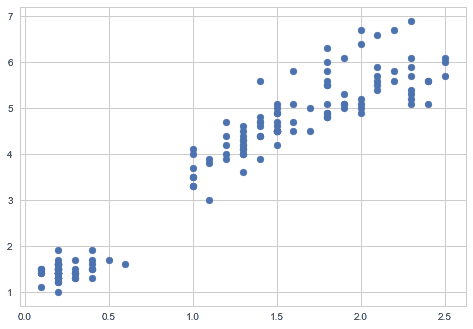

这是我们将尝试用我们的线性预测函数建模的当前数据分布。

# 创建预测函数

首先，让我们定义一个函数，它将以线性函数的形式抽象地表示建模数据，形式为*y=beta*x+alpha*：

```py
def predict(alpha, beta, x_i):
    return beta * x_i + alpha
```

# 定义误差函数

现在，是时候定义一个函数，它将显示在训练过程中预测值与预期输出之间的差异。正如我们将在下一章中深入解释的，我们有两个主要的选择：测量值之间的绝对差异（或 L1），或者测量差异平方的变体（或 L2）。让我们定义两种版本，包括第一个公式在第二个公式中：

```py
def error(alpha, beta, x_i, y_i): #L1
    return y_i - predict(alpha, beta, x_i)

def sum_sq_e(alpha, beta, x, y): #L2
    return sum(error(alpha, beta, x_i, y_i) ** 2
               for x_i, y_i in zip(x, y))
```

# 相关性拟合

现在，我们将定义一个函数来实现相关性方法，以找到回归的参数：

```py
def correlation_fit(x, y):
    beta = correlation(x, y) * np.std(y, ddof=1) / np.std(x,ddof=1)
    alpha = np.mean(y) - beta * np.mean(x)
    return alpha, beta
```

然后运行拟合函数并打印猜测的参数：

```py
alpha, beta = correlation_fit(X, Y)
print(alpha)
print(beta)

1.08355803285
2.22994049512
```

现在我们将绘制回归线与数据，以直观地显示解决方案的适当性：

```py
plt.scatter(X,Y)
xr=np.arange(0,3.5)
plt.plot(xr,(xr*beta)+alpha)
```

这是我们将使用最近计算出的斜率和截距得到的最终图：

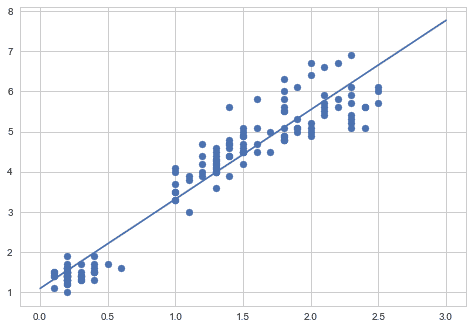

最终回归线。

# 多项式回归以及欠拟合和过拟合的介绍

在寻找模型时，我们寻找的主要特征之一是使用简单的函数表达式进行泛化的能力。当我们增加模型的复杂性时，我们可能会构建一个对训练数据很好的模型，但对于那个特定数据子集来说可能过于优化。

另一方面，欠拟合适用于模型过于简单的情况，例如这个案例，可以用一个简单的线性模型很好地表示。

在下面的例子中，我们将使用 scikit-learn 库来搜索更高阶的多项式，以使用越来越复杂的度数来拟合传入的数据。

超出二次函数的正常阈值，我们将看到函数如何拟合数据的每一个细节，但当我们将数据外推时，超出正常范围之外的值显然超出了范围：

```py
from sklearn.linear_model import Ridge
from sklearn.preprocessing import PolynomialFeatures
from sklearn.pipeline import make_pipeline

ix=iris2['petal_width']
iy=iris2['petal_length']

# generate points used to represent the fitted function 
x_plot = np.linspace(0, 2.6, 100)

# create matrix versions of these arrays
X = ix[:, np.newaxis]
X_plot = x_plot[:, np.newaxis]

plt.scatter(ix, iy, s=30, marker='o', label="training points")

for count, degree in enumerate([3, 6, 20]):
    model = make_pipeline(PolynomialFeatures(degree), Ridge())
    model.fit(X, iy)
    y_plot = model.predict(X_plot)
    plt.plot(x_plot, y_plot, label="degree %d" % degree)

plt.legend(loc='upper left')
plt.show()
```

合并图显示了不同的多项式系数如何以不同的方式描述数据总体。20 次方的多项式清楚地显示了它如何完美地调整训练数据集，在已知值之后，它几乎以惊人的方式发散，违背了为未来数据泛化的目标。

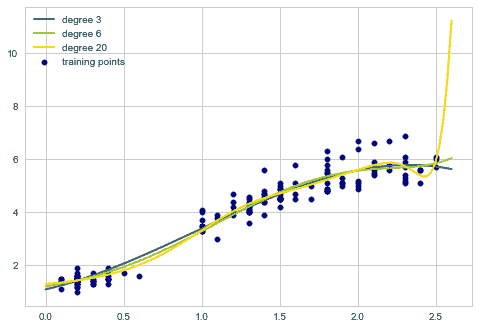

初始数据集的曲线拟合，使用递增值的多项式。

# 实践中的线性回归和梯度下降

现在，我们第一次在实践中使用梯度下降技术！我们现在正在练习的概念将在本书的其余部分为我们提供良好的服务。让我们首先导入必备的库，就像往常一样。我们将使用 NumPy 进行数值处理，以及 Seaborn 和 matplotlib 进行表示：

```py
import numpy as np
import seaborn as sns
%matplotlib inline
import matplotlib.pyplot as plt
sns.set(style='whitegrid', context='notebook')
```

损失函数将是我们了解我们做得如何的指南。正如我们在理论部分所看到的，将使用最小二乘法。

你可以在前面的章节中回顾*J*或损失函数的定义和属性。

因此，这个`least_squares`函数将接收当前回归线的参数，即*b[0]*和*b[1]*，以及数据元素来衡量我们对现实表示的好坏：

```py
def least_squares(b0, b1, points):
    totalError = 0
    N=float(len(points))
    for x,y in points:
        totalError += (y - (b1 * x + b0)) ** 2
    return totalError / 2.*N
```

在这里，我们将定义递归的每一步。作为参数，我们将接收当前的*b*[0]和*b*[1]，用于训练模型的点，以及学习率。在`step_gradient`函数的第 5 行，我们看到计算了两个梯度，然后我们创建了`new_b0`和`new_b1`变量，通过学习率按误差方向更新它们的值。在最后一行，我们在所有点都用于梯度后返回更新的值和当前误差水平：

```py
def step_gradient(b0_current, b1_current, points, learningRate):
    b0_gradient = 0
    b1_gradient = 0
    N = float(len(points))
    for x,y in points:
        b0_gradient += (1/N) * (y - ((b1_current * x) + b0_current))
        b1_gradient += (1/N) * x * (y - ((b1_current * x) + b0_current))
    new_b0 = b0_current + (learningRate * b0_gradient)
    new_b1 = b1_current + (learningRate * b1_gradient)
    return [new_b0, new_b1, least_squares(new_b0, new_b1, points)]
```

然后，我们定义一个函数，将在模型外部运行完整的训练，这样我们就可以在一个地方检查所有参数的组合。这个函数将初始化参数，并将重复梯度步骤固定次数：

```py
def run_gradient_descent(points, starting_b0, starting_b1, learning_rate, num_iterations):
    b0 = starting_b0
    b1 = starting_b1
    slope=[]
    intersect=[]
    error=[]
    for i in range(num_iterations):
        b0, b1 , e= step_gradient(b0, b1, np.array(points), learning_rate)
        slope.append(b1)
        intersect.append(b0)
        error.append(e)
    return [b0, b1, e, slope, intersect,error]
```

当收敛速度很高时，这个过程可能会证明效率低下，浪费宝贵的 CPU 迭代次数。一个更聪明的停止条件将包括添加一个可接受的误差值，这将停止迭代。

好吧，是时候尝试我们的模型了！让我们再次加载 Iris 数据集，作为参考，并检查我们结果的正误。我们将使用`petal_width`和`petal_length`参数，我们已经看到并决定它们是线性回归的良好候选者。NumPy 的`dstack`命令允许我们将两列合并，我们将它们转换为列表以删除列标题。唯一的缺点是生成的列表有一个未使用的额外维度，我们使用`[0]`索引选择器来丢弃它：

```py
iris = sns.load_dataset('iris')
X=iris['petal_width'].tolist()
Y=iris['petal_length'].tolist()
points=np.dstack((X,Y))[0]
```

因此，让我们尝试我们的模型，使用看起来很好的初始参数，`0.0001`的学习率，初始参数在`0`，以及`1000`次迭代；看看它的表现如何：

```py
learning_rate = 0.0001
initial_b0 = 0 
initial_b1 = 0 
num_iterations = 1000
[b0, b1, e, slope, intersect, error] = run_gradient_descent(points, initial_b0, initial_b1, learning_rate, num_iterations)

plt.figure(figsize=(7,5))
plt.scatter(X,Y)
xr=np.arange(0,3.5)
plt.plot(xr,(xr*b1)+b0);
plt.title('Regression, alpha=0.001, initial values=(0,0), it=1000');
```

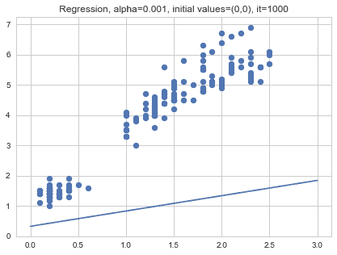

嗯，这不好；显然，我们还没有达到那里。让我们看看训练过程中的错误发生了什么：

```py
plt.figure(figsize=(7,5))
xr=np.arange(0,1000)
plt.plot(xr,np.array(error).transpose());
plt.title('Error for 1000 iterations');
```

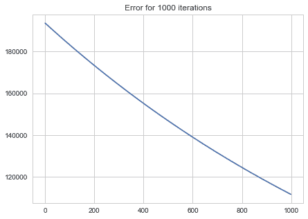

这个过程看起来似乎在起作用，但有点慢。也许我们可以尝试将步长增加 10 倍，看看它是否快速收敛？让我们检查一下：

```py
learning_rate = 0.001 #Last one was 0.0001
initial_b0 = 0 
initial_b1 = 0 
num_iterations = 1000
[b0, b1, e, slope, intersect, error] = run_gradient_descent(points, initial_b0, initial_b1, learning_rate, num_iterations)
plt.figure(figsize=(7,5))
xr=np.arange(0,1000)
plt.plot(xr,np.array(error).transpose());
plt.title('Error for 1000 iterations, increased step by tenfold');

```

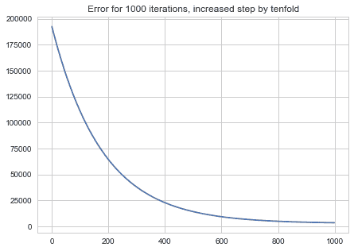

这比之前好多了！过程收敛得更快。让我们看看现在回归线的样子：

```py
plt.figure(figsize=(7,5))
plt.scatter(X,Y)
xr=np.arange(0,3.5)
plt.plot(xr,(xr*b1)+b0);
plt.title('Regression, alpha=0.01, initial values=(0,0), it=1000');
```

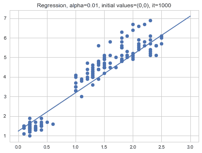

是的！看起来好多了。我们可能会认为我们已经完成了，但开发者总是希望更快。让我们看看如果我们想要更快，比如用巨大的步长`2`，会发生什么：

```py
learning_rate = 0.85 #LAst one was 0.0001
initial_b0 = 0 
initial_b1 = 0 
num_iterations = 1000
[b0, b1, e, slope, intersect, error] = run_gradient_descent(points, initial_b0, initial_b1, learning_rate, num_iterations)
plt.figure(figsize=(7,5))
xr=np.arange(0,1000)
plt.plot(xr,np.array(error).transpose());
plt.title('Error for 1000 iterations, big step');
```

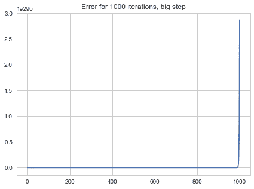

这是一个糟糕的举动；正如你所见，错误最终变成了无穷大！这里发生了什么？简单来说，我们采取的步骤太过激进，以至于我们并没有像之前描述的那样切割那个想象中的碗，而是在表面跳跃，随着迭代的进行，我们开始无法控制地累积错误。另一个可以采取的措施是改进我们的种子值，正如你所见，它从`0`开始。这在一般情况下对这个技术来说是一个非常糟糕的想法，尤其是在你处理未归一化的数据时。这里有更多原因，你可以在更高级的文献中找到。所以，让我们尝试在伪随机位置初始化参数，以便让代码示例中的图形保持一致，看看会发生什么：

```py
learning_rate = 0.001 #Same as last time
initial_b0 = 0.8 #pseudo random value
initial_b1 = 1.5 #pseudo random value
num_iterations = 1000
[b0, b1, e, slope, intersect, error] = run_gradient_descent(points, initial_b0, initial_b1, learning_rate, num_iterations)
plt.figure(figsize=(7,5))
xr=np.arange(0,1000)
plt.plot(xr,np.array(error).transpose());
plt.title('Error for 1000 iterations, step 0.001, random initial parameter values');
```

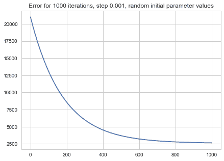

正如你所见，即使你有相同的粗略错误率，初始错误值也减少了十倍（从 2e5 到 2e4）。现在让我们尝试一种最终的技术来改进基于输入值归一化的参数收敛。正如你在第二章，“学习过程”中所学到的，它包括对数据进行中心化和缩放。这个操作对数据有什么影响？使用图形图像，当数据未归一化时，错误表面往往很浅，值波动很大。归一化将那些数据转换成一个更深层次的表面，有更明确的梯度指向中心：

```py
learning_rate = 0.001 #Same as last time
initial_b0 = 0.8 #pseudo random value
initial_b1 = 1.5 #pseudo random value
num_iterations = 1000
x_mean =np.mean(points[:,0])
y_mean = np.mean(points[:,1])
x_std = np.std(points[:,0])
y_std = np.std(points[:,1])

X_normalized = (points[:,0] - x_mean)/x_std
Y_normalized = (points[:,1] - y_mean)/y_std

plt.figure(figsize=(7,5))
plt.scatter(X_normalized,Y_normalized)

<matplotlib.collections.PathCollection at 0x7f9cad8f4240>
```

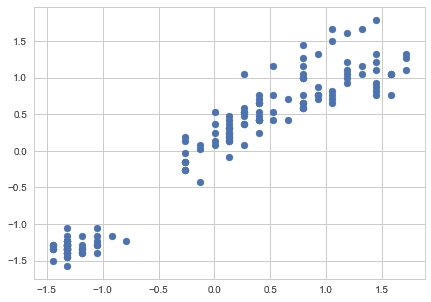

现在我们有了这组干净整洁的数据，让我们再次尝试使用最后的慢收敛参数，看看错误最小化速度会发生什么：

```py
points=np.dstack((X_normalized,Y_normalized))[0]
learning_rate = 0.001 #Same as last time
initial_b0 = 0.8 #pseudo random value
initial_b1 = 1.5 #pseudo random value
num_iterations = 1000
[b0, b1, e, slope, intersect, error] = run_gradient_descent(points, initial_b0, initial_b1, learning_rate, num_iterations)
plt.figure(figsize=(7,5))
xr=np.arange(0,1000)
```

```py
plt.plot(xr,np.array(error).transpose());
plt.title('Error for 1000 iterations, step 0.001, random initial parameter values, normalized initial values');
```

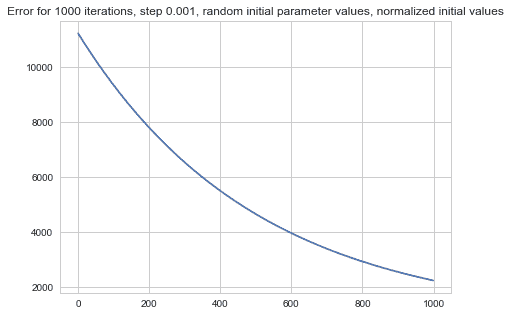

确实是一个非常好的起点！仅仅通过归一化数据，我们就将初始错误值减少了一半，经过 1,000 次迭代后，错误下降了 20%。我们唯一要记住的是，在得到结果后，我们需要去归一化，以便保持初始的尺度和数据中心。所以，关于梯度下降就到这里。我们将在下一章中重新讨论它，以面对新的挑战。

# 逻辑回归

本书的方法之一是概括。在第一章中，我们从现实世界的简单表示开始，因此也开始了对信息结构进行分组或预测的简单标准。

在回顾了主要用于预测遵循建模线性函数的实值的线性回归之后，我们将进一步探讨其推广，这将使我们能够从先前拟合的线性函数开始，分离二元结果（表示一个样本属于一个类别）。因此，让我们开始这项技术，它将在本书的几乎所有后续章节中具有基本用途。

# 线性回归和逻辑回归的问题域

为了直观地理解逻辑回归的问题域，我们将使用图形表示。

在第一部分，我们展示了线性拟合函数，这是整个模型构建过程的主要目标，底部是目标数据分布。正如你清楚地看到的，数据现在是二元的，一个样本属于一个或另一个选项，中间没有其他东西。此外，我们还看到建模函数是一种新型；我们稍后将命名并研究其特性。你可能想知道这与线性函数有什么关系？好吧，正如我们稍后将会看到的，它将位于那个 s 形函数内部，适应其形状。

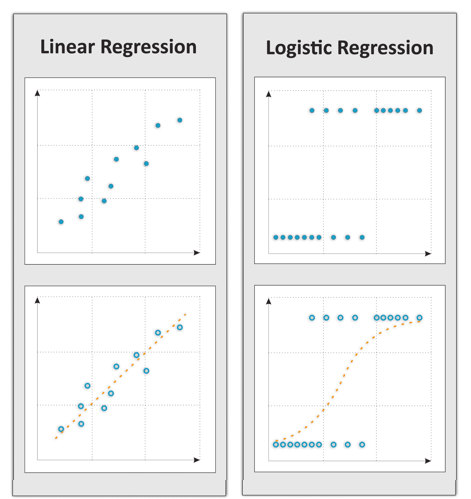

简化的数据分布描述，其中应用了线性或逻辑回归。

总结来说，线性回归可以想象为一个不断增长值的连续体。另一个领域是输出可以根据 *x* 值具有两个不同值的领域。在图像中显示的特定情况下，我们可以看到随着自变量的增加，向一个可能结果的趋势变得明显，而 sigmoid 函数使我们能够从两个在时间上没有明显分离的输出之间过渡，这给我们提供了一个在非发生/发生区域重叠区的估计概率。

在某种程度上，术语有些令人困惑，因为我们正在进行回归，得到的是一个连续值，但现实中，最终目标是构建一个对离散变量分类问题的预测。

关键在于理解我们将获得一个项目属于一个类别的概率，而不是一个完全离散的值。

# 逻辑函数的前身——对数几率函数

在我们研究逻辑函数之前，我们将回顾其基础函数，即对数几率函数，它赋予它一些更一般的特性。

本质上，当我们谈论对数几率函数时，我们是在处理随机变量 *p* 的函数；更具体地说，是与伯努利分布相对应的函数。

# 链接函数

由于我们正在尝试构建一个**广义线性模型**，我们希望从一个线性函数开始，并从因变量获得一个映射到概率分布。

由于我们模型的输出类型是二进制的，通常选择的分布是伯努利分布，而链接函数，倾向于逻辑函数，是**logit 函数**。

# Logit 函数

我们可以使用的可能变量之一是几率的自然对数，即 *p* 等于 1。这个函数被称为 logit 函数：

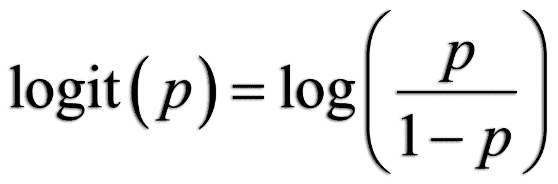

我们也可以称 logit 函数为对数几率函数，因为我们正在计算给定概率 *p* 的对数几率 *(p/1-p)*。

# Logit 函数的性质

因此，正如我们可以直观推断的那样，我们用独立变量的组合替换 *x*，无论它们的值如何，并用任何从负无穷大到无穷大的出现替换 *x*。我们将响应缩放到 *0* 到 *1* 之间。

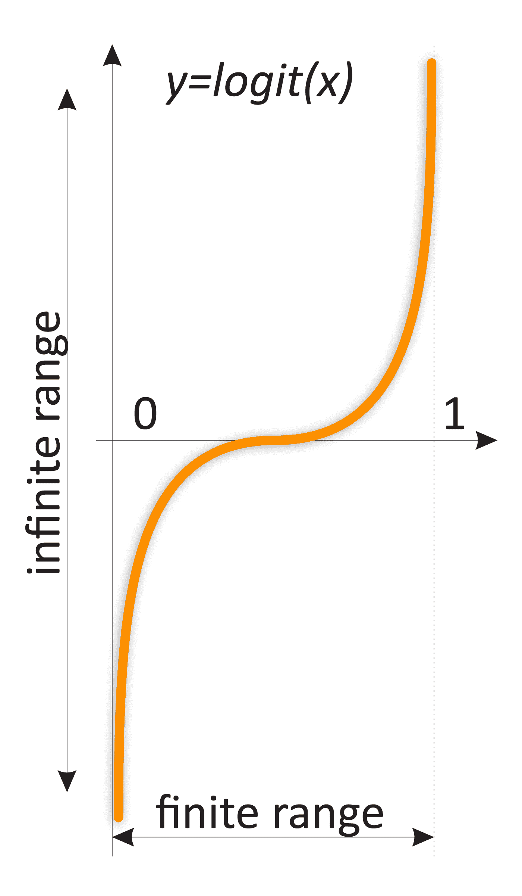

Logit 函数的主要范围特性的描述

# Logit 逆函数的重要性

假设我们计算 logit 函数的逆。logit 的简单逆变换将给出以下表达式：

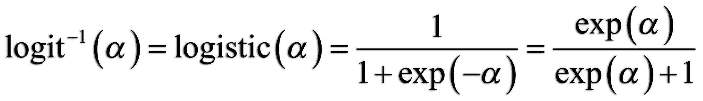

Logit 函数的解析定义

这个函数就是 Sigmoid 函数。

# Sigmoid 或逻辑函数

逻辑函数将代表我们在新的回归任务中要表示的二进制选项。逻辑函数定义为如下（为了清晰起见，将自变量从 α 改为 *t*）：

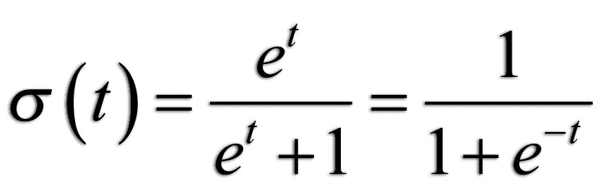

你将在以下章节中找到这个新图形很常见，因为它将被非常频繁地用作神经网络和其他应用的激活函数。在以下图中，你可以找到 Sigmoid 函数的图形表示：

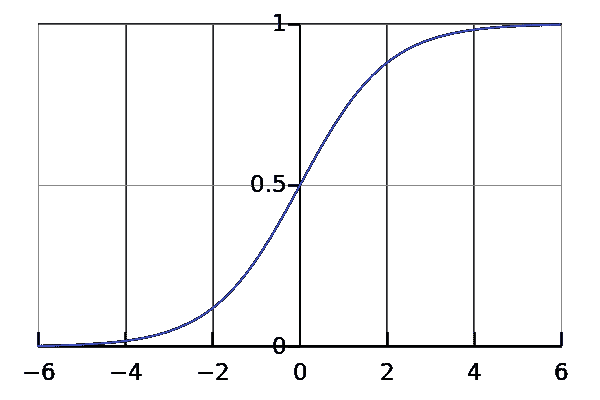标准 Sigmoid

我们如何解释并给这个函数赋予意义以用于我们的建模任务？这个方程的正常解释是 *t* 代表一个简单的自变量，但我们将改进这个模型，假设 *t* 是单个解释变量 *x* 的线性函数（*t* 是多个解释变量的线性组合的情况类似处理），如下所示：

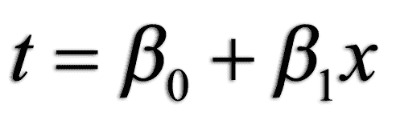

因此，我们可以再次从原始的 logit 方程开始：

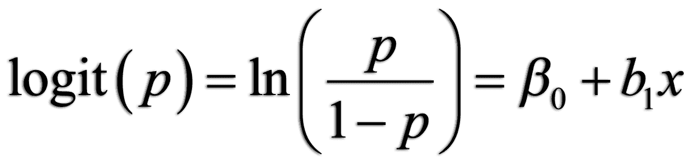

我们将到达回归方程，该方程将给出以下方程的回归概率：

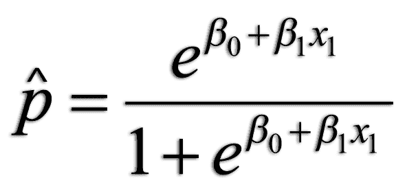

注意，*p*（帽）表示一个估计概率。什么将给我们一个如何接近解的度量？当然，一个精心选择的损失函数！

以下图像显示了从可能的无限结果域到最终被减少到 *[0,1]* 范围的映射，其中 *p* 是表示事件发生的概率。这在一个简单的方案中显示，这是 logit 函数的结构和域转换（从线性到由 Sigmoid 模型的概率）：

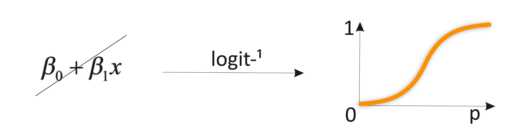

线性方程的 logit 的函数映射，结果是一个 sigmoid 曲线

哪些变化将影响线性函数的参数？它们是那些将改变 sigmoid 函数的中心斜率和从零的位移的值，从而使它更精确地减少回归值与实际数据点之间的误差。

# 逻辑函数的性质

函数空间中的每一条曲线都可以用它可以应用到的可能目标来描述。在逻辑函数的情况下，它们如下所示：

+   根据一个或多个独立变量建模事件 *p* 的概率。例如，根据先前资格获得奖项的概率

+   估计（这是回归部分）与事件不发生的可能性相关的特定观测值的 *p*。

+   使用二元响应预测独立变量变化的影响。

+   通过计算一个项目属于特定类的概率来对观测值进行分类。

# 多类应用 - softmax 回归

到目前为止，我们只对只有两个类别的情况进行分类，或者用概率语言来说，是事件发生的概率 *p*。但这个逻辑回归也可以方便地推广到许多类的情况。

正如我们之前看到的，在逻辑回归中，我们假设标签是二元的 (*y(i)∈{0,1}*)，但 softmax 回归允许我们处理 *y(i)∈{1,…,K}*，其中 *K* 是类别的数量，标签 *y* 可以取 *K* 个不同的值，而不仅仅是两个。

给定一个测试输入 *x*，我们想要估计对于每个 *k=1,…,K* 的值，*P(y=k|x)* 的概率。softmax 回归将使这个输出成为一个 *K*-维向量（其元素之和为 1），从而给出我们的 *K* 个估计概率：

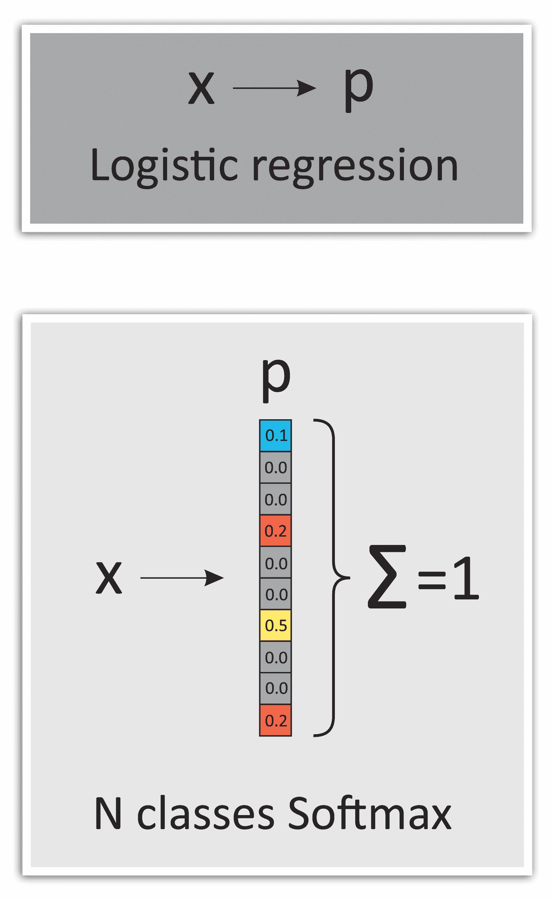

单变量逻辑回归结果与 N 类 softmax 回归的比较

# 实际示例 - 使用逻辑回归进行心脏病建模

是时候借助非常有用的逻辑回归来解决一个实际示例了。在这个第一个练习中，我们将基于人口年龄预测患有冠状动脉心脏病的概率。这是一个经典问题，将是理解这类回归分析的良好开端。

# CHDAGE 数据集

对于第一个简单的例子，我们将使用一个非常简单且经常研究的数据集，该数据集发表在《应用逻辑回归》中，由 David W. Hosmer, Jr.、Stanley Lemeshow 和**Rodney X. Sturdivant**所著。我们列出 100 个受试者的年龄（`AGE`）和是否存在显著**冠心病**（**CHD**）的证据，在一个假设的心脏病风险因素研究中。表格还包含一个标识变量（`ID`）和一个年龄组变量（`AGEGRP`）。

结果变量是`CHD`，用`0`表示`CHD`不存在，或用`1`表示它在个体中存在。一般来说，可以使用任何两个值，但我们发现使用零和一最为方便。我们将这个数据集称为`CHDAGE`数据。

# 数据集格式

`CHDAGE`数据集是一个两列的 CSV 文件，我们将从外部仓库下载它。在第一章中，我们使用了原生的 TensorFlow 方法来读取数据集。在这一章中，我们将使用一个互补且流行的库来获取数据。新增这一部分的原因是，鉴于数据集只有 100 个元组，直接读取一行是实用的，而且我们还可以从 pandas 库中免费获得简单但强大的分析方法。

在这个项目的第一阶段，我们将开始加载`CHDAGE`数据集的一个实例。然后我们将打印关于数据的关键统计数据，接着进行预处理。在绘制了一些数据图表之后，我们将构建一个由激活函数组成的模型，该激活函数将是一个 softmax 函数，对于它变成标准逻辑回归的特殊情况，即当只有两个类别（疾病的有无）时。

让我们先导入所需的库：

```py
import numpy as np
import pandas as pd
from sklearn import datasets
from sklearn import linear_model
import seaborn.apionly as sns
%matplotlib inline
import matplotlib.pyplot as plt
sns.set(style='whitegrid', context='notebook')
```

让我们使用 pandas 的`read_csv`函数从 CSV 原始文件中读取数据集，并使用 matplotlib 的散点函数绘制数据分布。正如我们所看到的，通过年份，确实存在一种与随着年龄增长而出现的冠心病相关的模式：

```py
df = pd.read_csv("data/CHD.csv", header=0)
plt.figure() # Create a new figure
plt.axis ([0,70,-0.2,1.2])
plt.title('Original data')
plt.scatter(df['age'],df['chd']) #Plot a scatter draw of the random datapoints
```

这是原始数据的当前图表：

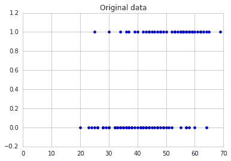

现在，我们将使用 scikit-learn 的逻辑回归对象创建一个逻辑回归模型，然后调用`fit`函数，该函数将创建一个 sigmoid 函数，以最小化我们的训练数据的预测误差：

```py
logistic = linear_model.LogisticRegression(C=1e5)
logistic.fit(df['age'].reshape(100,1),df['chd'].reshape(100,1))

LogisticRegression(C=100000.0, class_weight=None, dual=False,
          fit_intercept=True, intercept_scaling=1, max_iter=100,
          multi_class='ovr', n_jobs=1, penalty='l2', random_state=None,
          solver='liblinear', tol=0.0001, verbose=0, warm_start=False)
```

现在是展示结果的时候了。在这里，我们将从 10 岁到 90 岁生成一个线性空间，包含 100 个细分。

对于域的每个样本，我们将展示发生概率（1）和不发生概率（0，或前一个值的逆）。 

此外，我们还将展示预测结果以及原始数据点，这样我们就可以在单个图形中匹配所有元素：

```py
x_plot = np.linspace(10, 90, 100)
oneprob=[]
zeroprob=[]
predict=[]
plt.figure(figsize=(10,10))
for i in x_plot:
    oneprob.append (logistic.predict_proba(i)[0][1]);
    zeroprob.append (logistic.predict_proba(i)[0][0]);
    predict.append (logistic.predict(i)[0]);

plt.plot(x_plot, oneprob);
plt.plot(x_plot, zeroprob)
plt.plot(x_plot, predict);
plt.scatter(df['age'],df['chd'])
```

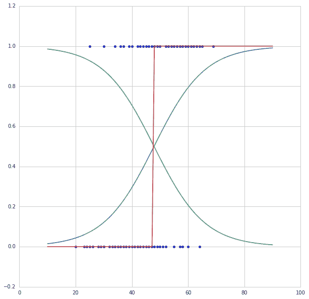

原始数据分布、建模逻辑曲线及其逆函数的同步绘图

# 摘要

在本章中，我们回顾了使用简单和确定性的函数来建模数据的主要方法。

在下一章中，我们将使用更复杂的模型，这些模型可以达到更高的复杂性，处理更高级的抽象，并且对于最近出现的各种各样的大量数据集非常有用，从简单的**前馈网络**开始。

# 参考文献

高尔顿，弗朗西斯，"*遗传身高的回归到中等水平*"。《大不列颠及爱尔兰人类学学会杂志》第 15 卷（1886 年）：246-263。

沃克，斯特罗瑟·H.，和大卫·B.邓肯，"*将事件概率作为几个独立变量的函数进行估计*"。《生物计量学》第 54 卷第 1-2 期（1967 年）：167-179。

科克斯，大卫·R，"*二元序列的回归分析*"。《皇家统计学会会刊。方法系列》（1958 年）：215-242。
