# 第六章：卷积神经网络

好吧，现在事情变得有趣了！我们的模型现在可以学习更复杂的函数，我们现在准备进行一次关于更现代且出人意料的有效的模型的奇妙之旅

在堆叠层神经元成为提高模型的最流行解决方案之后，出现了更丰富节点的创新想法，始于基于人类视觉的模型。它们最初只是研究主题，随着图像数据集和更多处理能力的出现，它们使研究人员在分类挑战中几乎达到人类的准确性，我们现在准备在我们的项目中利用这种力量。

本章我们将涵盖以下主题：

+   卷积神经网络的起源

+   离散卷积的简单实现

+   其他操作类型：池化、dropout

+   迁移学习

# 卷积神经网络的起源

**卷积神经网络**（**CNNs**）有一个遥远的起源。它们在多层感知器得到完善的同时发展起来，第一个具体的例子是**新认知机**。

新认知机是一个分层、多层的**人工神经网络**（**ANN**），由福岛教授在 1980 年的一篇论文中引入，并具有以下主要特点：

+   自组织

+   对输入的偏移和变形具有容忍性

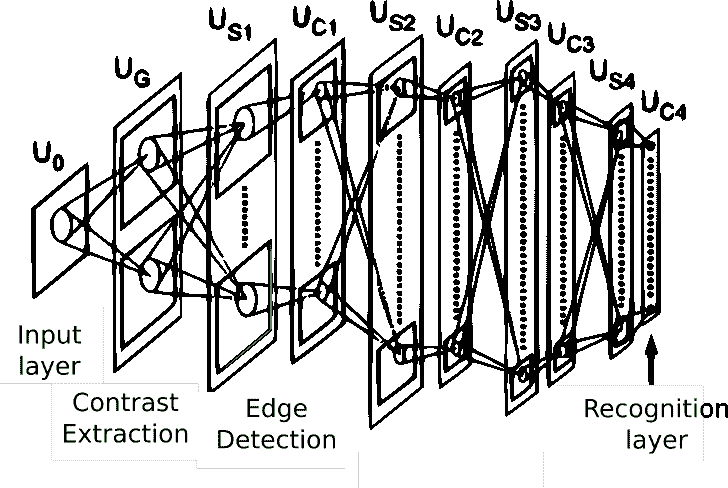

这个原始想法在 1986 年的原始反向传播论文的书籍版本中再次出现，并在 1988 年被用于语音识别中的时间信号。

设计在 1998 年得到了改进，一篇由 Ian LeCun*、* *梯度学习应用于文档识别*的论文提出了 LeNet-5 网络，这是一种用于分类手写数字的架构。该模型与当时其他现有模型相比，性能有所提高，特别是在 SVM（当时最有效的操作之一）的几个变体上。

然后，2003 年出现了该论文的推广，“*用于图像解释的分层神经网络*”。但总的来说，几乎所有核都遵循原始想法，直到现在。

# 卷积入门

为了理解卷积，我们将从研究卷积算子的起源开始，然后我们将解释这个概念是如何应用于信息的。

卷积基本上是两个函数之间的操作，连续或离散，在实践中，它通过另一个函数过滤其中一个的效果。

它在众多领域中有许多用途，特别是在数字信号处理中，它是塑造和过滤音频、图像的首选工具，甚至在概率论中也有应用，它代表两个独立随机变量的和。

这些滤波能力与机器学习有什么关系呢？答案是，通过滤波器，我们将能够构建能够强调或隐藏输入中某些特征的网络节点（根据滤波器的定义），这样我们就可以构建用于检测所有特征的自动定制检测器，这些检测器可以用来检测特定的模式。我们将在接下来的章节中更详细地介绍这一点；现在，让我们回顾该操作的正式定义及其计算摘要。

# 连续卷积

卷积作为运算最早是在 18 世纪由 d'Alembert 在微分学初步发展期间创造的。该操作的常见定义如下：

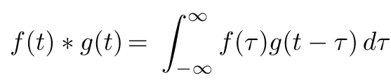

如果我们尝试描述应用该操作所需的步骤以及它是如何结合两个函数的，我们可以以下列详细方式表达涉及的数学运算：

+   翻转信号：这是变量的 (*-τ*) 部分

+   平移它：这是由 *t* 的求和因子给出的 *g(τ)*

+   乘以它：*f* 和 **g** 的乘积

+   对结果曲线进行积分：这是不太直观的部分，因为每个瞬时值都是积分的结果

为了理解所有涉及的步骤，让我们直观地表示出两个函数在确定点 *t*[*0*] 之间计算卷积的所有步骤，*f* 和 *g*：


这种对卷积规则的直观近似也适用于函数的离散领域，这是我们实际工作的真实领域。因此，让我们首先定义它。

# 离散卷积

即使在有用的情况下，我们工作的领域无疑是数字化的，因此我们需要将这个操作转换到离散域。两个离散函数 *f* 和 *g* 的卷积操作是将原始积分转换为以下形式的等效求和：

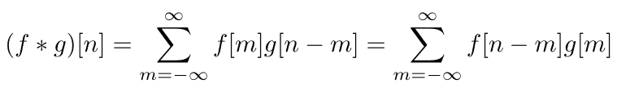

这个原始定义可以应用于任意数量的维度上的函数。特别是，我们将处理二维图像，因为这是许多应用领域的领域，我们将在本章中进一步描述。 

现在是学习我们通常应用卷积算子方式的时候了，这种方式是通过核来实现的。

# 核和卷积

在解决离散域中的实际问题时，我们通常有有限维度的二维函数（例如，可能是一个图像），我们希望通过另一个图像对其进行过滤。滤波器开发学科研究将不同类型的滤波器通过卷积应用于各种类别时产生的影响。最常用的函数类型是每维两个到五个元素，其余元素为 0 值。这些代表滤波函数的小矩阵被称为**核**。

卷积操作从*n*维矩阵（通常是一个表示图像的 2D 矩阵）的第一个元素开始，与核的所有元素相乘，将矩阵的中心元素应用于我们正在乘以的特定值，然后按照核的维度应用剩余的因子。在图像的情况下，最终结果是一个等效图像，其中某些元素（例如，线条和边缘）被突出显示，而其他元素（例如，在模糊的情况下）则被隐藏。

在以下示例中，您将看到如何将特定的 3 x 3 核应用于特定的图像元素。这以扫描模式重复应用于矩阵的所有元素：

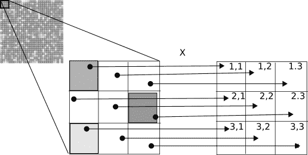

在应用核时，还需要考虑一些额外的元素，特别是步长和填充，这些元素完成了适应特殊应用案例的规格。让我们来看看步长和填充。

# 步长和填充

在应用卷积操作时，可以对过程应用的一种变化是改变核的位移单位。这个参数可以按维度指定，称为**步长**。在以下图像中，我们展示了步长应用的一些示例。在第三种情况下，我们看到一个不兼容的步长，因为核不能应用于最后一步。根据库的不同，这种类型的警告可以被忽略：


在应用核时，另一个重要的事实是，核越大，图像/矩阵边缘不接收答案的单位就越多，因为我们需要覆盖整个核。为了应对这种情况，**填充**参数将在图像上添加一个指定宽度的边框，以便核能够均匀地应用于边缘像素/元素。这里是对填充参数的图形描述：

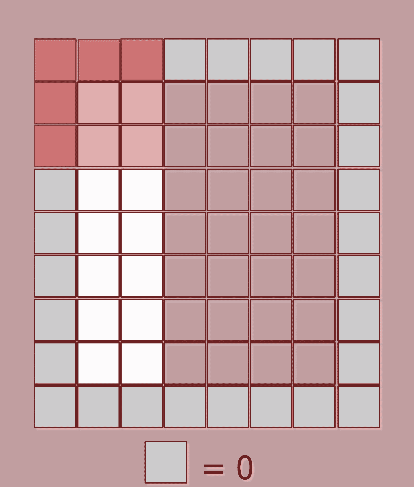

在描述了卷积的基本概念之后，让我们通过一个实际例子来实现卷积，看看它如何应用于真实图像，并对其效果有一个直观的认识。

# 在一个例子中实现 2D 离散卷积操作

为了理解离散卷积操作的机制，让我们对这个概念进行简单的直观实现，并将其应用于具有不同类型核的样本图像。让我们导入所需的库。由于我们将以尽可能清晰的方式实现算法，我们将只使用最必要的库，例如 NumPy：

```py
import matplotlib.pyplot as plt
import imageio
import numpy as np
```

使用`imageio`包的`imread`方法，让我们读取图像（作为三个相等的通道导入，因为它为灰度图）。然后我们切分第一个通道，将其转换为浮点数，并使用 matplotlib 显示：

```py
arr = imageio.imread("b.bmp") [:,:,0].astype(np.float)
plt.imshow(arr, cmap=plt.get_cmap('binary_r'))
plt.show()
```

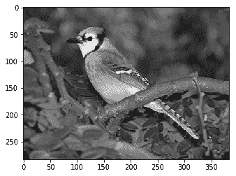

现在是定义内核卷积操作的时候了。正如我们之前所做的那样，我们将简化 3 x 3 内核上的操作，以便更好地理解边界条件。`apply3x3kernel`将在图像的所有元素上应用内核，返回一个等效的新图像。请注意，为了简单起见，我们将内核限制为 3 x 3，因此图像的 1 像素边界不会有一个新值，因为我们没有考虑填充：

```py
class ConvolutionalOperation:
    def apply3x3kernel(self, image, kernel):  # Simple 3x3 kernel operation
        newimage=np.array(image)
        for m in range(1,image.shape[0]-2):
            for n in range(1,image.shape[1]-2):
                newelement = 0
                for i in range(0, 3):
                    for j in range(0, 3):
                        newelement = newelement + image[m - 1 + i][n - 1+ 
                        j]*kernel[i][j]
                newimage[m][n] = newelement
        return (newimage)
```

正如我们在前面的章节中看到的，不同的内核配置突出了原始图像的不同元素和属性，构建的过滤器在经过许多个训练周期后可以专门处理非常高级的特征，例如眼睛、耳朵和门。在这里，我们将生成一个以名称为键、内核系数按 3 x 3 数组排列的内核字典。`模糊`过滤器相当于计算 3 x 3 点邻域的平均值，`恒等`简单地返回像素值，`拉普拉斯`是一个经典的导数过滤器，突出显示边界，然后两个`索贝尔`过滤器将在第一种情况下标记水平边缘，在第二种情况下标记垂直边缘：

```py
kernels = {"Blur":[[1./16., 1./8., 1./16.], [1./8., 1./4., 1./8.], [1./16., 1./8., 1./16.]]
           ,"Identity":[[0, 0, 0], [0., 1., 0.], [0., 0., 0.]]
           ,"Laplacian":[[1., 2., 1.], [0., 0., 0.], [-1., -2., -1.]]
           ,"Left Sobel":[[1., 0., -1.], [2., 0., -2.], [1., 0., -1.]]
           ,"Upper Sobel":[[1., 2., 1.], [0., 0., 0.], [-1., -2., -1.]]}
```

让我们生成一个`ConvolutionalOperation`对象，并生成一个比较内核图形图表，以查看它们如何比较：

```py
conv = ConvolutionalOperation()
plt.figure(figsize=(30,30))
fig, axs = plt.subplots(figsize=(30,30))
j=1
for key,value in kernels.items():
    axs = fig.add_subplot(3,2,j)
    out = conv.apply3x3kernel(arr, value)
    plt.imshow(out, cmap=plt.get_cmap('binary_r'))
    j=j+1
plt.show()

<matplotlib.figure.Figure at 0x7fd6a710a208>
```

在最终图像中，你可以清楚地看到我们的内核如何在图像上检测到几个高细节特征——在第一个中，你看到的是未更改的图像，因为我们使用了单位内核，然后是拉普拉斯边缘检测器、左侧边界检测器、顶部边界检测器，然后是模糊操作器：

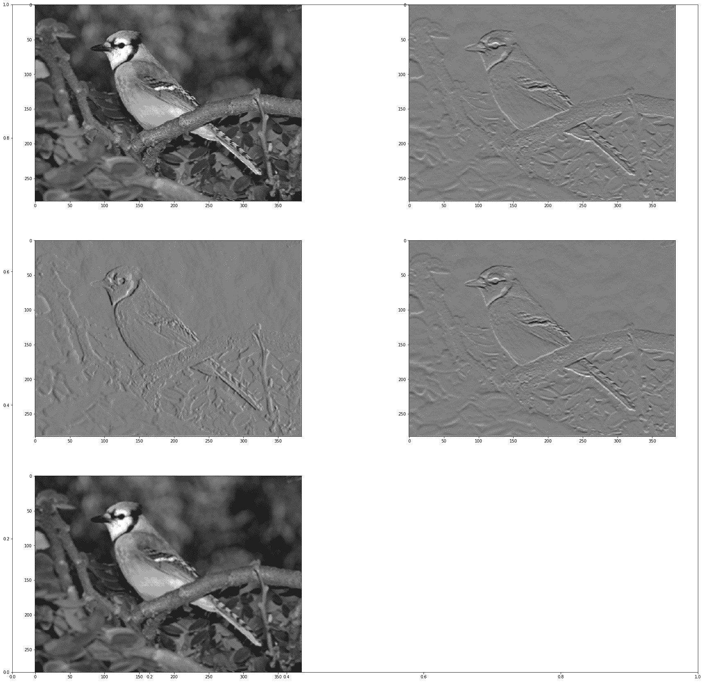

在回顾了连续和离散域上卷积操作的主要特征之后，我们可以得出结论，基本上，卷积内核突出或隐藏模式。根据训练的或（在我们的例子中）手动设置的参数，我们可以开始发现图像中的许多元素，例如不同维度的方向和边缘。我们还可以通过模糊内核覆盖一些不需要的细节或异常值，例如。此外，通过堆叠卷积层，我们甚至可以突出更高阶的复合元素，如眼睛或耳朵。

这种卷积神经网络的特征是它们相对于先前数据处理技术的优势：我们可以非常灵活地确定某个数据集的主要组成部分，并将进一步样本表示为这些基本构建块的组合。

现在是查看另一种通常与前者结合使用的层的时刻——池化层。

# 子采样操作（池化）

子采样操作包括应用一个核（尺寸可变）并通过将图像分成*m*n 块并取代表该块的元素来减少输入维度的扩展，从而通过某个确定的因子降低图像分辨率。在 2 x 2 核的情况下，图像大小将减半。最著名的操作是最大（max pool）、平均（avg pool）和最小（min pool）池化。

以下图像展示了如何应用一个 2 x 2 `maxpool`核，应用于一个单通道 16 x 16 矩阵。它只是保持它所覆盖的内部区域的最大值：

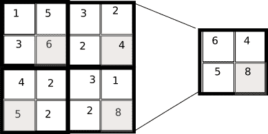

现在我们已经看到了这个简单的机制，让我们问问自己，它的主要目的是什么？子采样层的主要目的与卷积层相关：在保留最重要的信息元素的同时，减少信息和复杂性的数量和复杂性。换句话说，它们构建了底层信息的**紧凑表示**。

现在是时候编写一个简单的池化算子了。与卷积算子相比，编写起来要简单得多，而且更直接，在这种情况下，我们只将实现最大池化，它选择 4 x 4 邻域中最亮的像素并将其投影到最终图像：

```py
class PoolingOperation:
    def apply2x2pooling(self, image, stride):  # Simple 2x2 kernel operation
        newimage=np.zeros((int(image.shape[0]/2),int(image.shape[1]/2)),np.float32)
        for m in range(1,image.shape[0]-2,2):
            for n in range(1,image.shape[1]-2,2):
                newimage[int(m/2),int(n/2)] = np.max(image[m:m+2,n:n+2])
        return (newimage)
```

让我们应用新创建的池化操作，正如你所见，最终图像的分辨率要粗糙得多，而且总体上细节更亮：

```py
plt.figure(figsize=(30,30))
pool=PoolingOperation()
fig, axs = plt.subplots(figsize=(20,10))
axs = fig.add_subplot(1,2,1)
plt.imshow(arr, cmap=plt.get_cmap('binary_r'))
out=pool.apply2x2pooling(arr,1)
axs = fig.add_subplot(1,2,2)
plt.imshow(out, cmap=plt.get_cmap('binary_r'))
plt.show()
```

你可以看到差异，尽管它们很微妙。最终图像的精度较低，所选像素作为环境中的最大值，产生了一个更亮的图像：

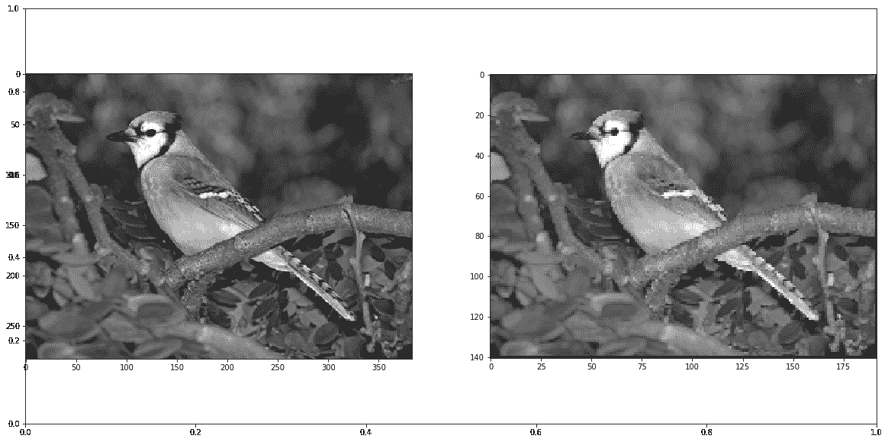

# 使用 dropout 操作提高效率

正如我们在前面的章节中观察到的，过拟合是每个模型的潜在问题。这种情况也适用于神经网络，数据可以在训练集上做得很好，但在测试集上却不行，这使得它对泛化没有用。

因此，在 2012 年，由 Geoffrey Hinton 领导的一个团队发表了一篇论文，其中描述了 dropout 操作。其操作很简单：

+   选择一个随机的节点数量（所选节点与总数之比是一个参数）

+   所选权重的值被重置为零，从而在后续层中使之前连接的同伴无效

# dropout 层的优势

这种方法的主要优势是它防止了同一层中所有神经元同步优化它们的权重。这种在随机组中进行的适应，防止了所有神经元收敛到同一个目标，从而解耦了权重。

对于 dropout 的应用，还发现了一个第二性质，即隐藏单元的激活变得稀疏，这也是一个期望的特性。

在下面的图中，我们展示了原始的、全连接的多层神经网络及其相关的具有 dropout 功能的网络：

>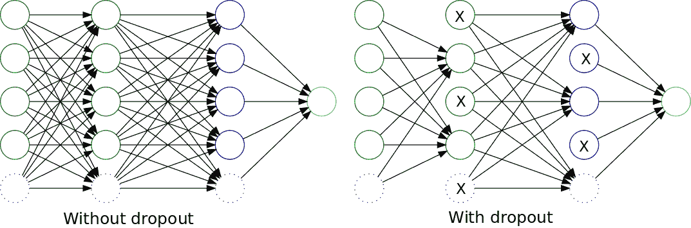

# 深度神经网络

现在我们有了丰富的层数，是时候开始了解神经网络架构随时间演变的历程了。从 2012 年开始，一系列新的、越来越强大的层组合迅速出现，并且势头不可阻挡。这一套架构采用了**深度学习**这一术语，我们可以大致将其定义为至少包含三个层的复杂神经网络架构。它们还倾向于包含比**单层感知器**更先进的层，如卷积层。

# 随时间演变的深度卷积网络架构

深度学习架构可以追溯到 20 年前，并在很大程度上由解决人类视觉问题的挑战所引导。让我们来看看主要的深度学习架构及其主要构建块，然后我们可以为我们的目的重用它们。

# Lenet 5

正如我们在卷积神经网络的历史介绍中所见，卷积层是在 20 世纪 80 年代发现的。但直到 1990 年代末，可用的技术还不够强大，无法构建复杂的层组合。

大约在 1998 年，在贝尔实验室，在研究手写数字解码的过程中，伊恩·李飞飞提出了一种新的方法——结合卷积、池化和全连接层来解决识别手写数字的问题。

在这个时候，SVM 和其他更多数学定义的问题被或多或少地成功应用，CNNs 的基本论文表明神经网络可以与当时最先进的方法相比拟地表现良好。

在下面的图中，展示了该架构的所有层，它接收一个 28 x 28 像素的灰度图像作为输入，并返回一个包含每个字符概率的 10 元素向量：

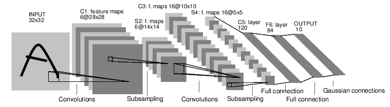

# Alexnet

几年后，尽管李飞飞将神经网络应用于其他任务，如人脸和物体识别，但可用结构化数据和原始处理能力的指数级增长使得团队得以扩大规模，并将模型调整到几年前被认为不可能的程度。

促进该领域创新的一个因素是图像识别基准**Imagenet**的可用性，它包含数百万张按类别组织的物体图像。

从 2012 年开始，每年都会举办**大规模视觉识别挑战赛（LSVRC**），这有助于研究人员在网络配置上进行创新，每年都取得了更好的成果。

由 Alex Krizhevsky 开发的 **AlexNet** 是第一个赢得这一挑战的深度卷积网络，并为未来的几年设定了先例。它由一个与 Lenet-5 结构相似的模型组成，但其卷积层的深度达到数百个单位，总参数数量达到数百万。

在接下来的挑战中，牛津大学的 **Visual Geometry Group (VGG)** 出现了一个强大的竞争者，其 VGG 模型。

# VGG 模型

VGG 网络架构的主要特点是它将卷积核的大小减少到简单的 3 x 3 矩阵，并将它们按序列组合，这与之前的竞争者不同，它们的核尺寸较大（高达 11 x 11）。

反讽的是，一系列小的卷积权重加起来却是一个非常大的参数数量（达到数百万级别），因此它必须通过多种措施进行限制。

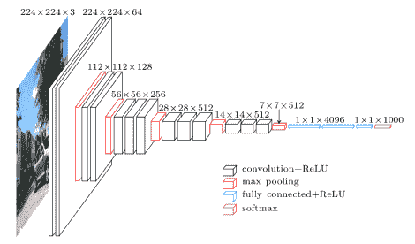

# GoogLeNet 和 Inception 模型

**GoogLeNet** 是在 2014 年赢得 LSVRC 的神经网络架构，是大型 IT 公司系列中第一个真正成功的尝试，自 2014 年以来，这一系列主要被拥有巨额预算的公司赢得。

GoogLeNet 基本上是九个连锁 Inception 模块的深度组合，几乎没有修改。以下图示中展示了这些 Inception 模块，它们是由微小的卷积块组成，并穿插着一个 3 x 3 的最大池化节点：


即使具有这样的复杂性，GoogLeNet 仍然设法减少了所需的参数数量（与两年前发布的 AlexNet 相比，从 6000 万减少到 1100 万），并提高了准确性（与 AlexNet 相比，误差从 16.4% 降至 6.7%）。此外，Inception 模块的重复使用允许敏捷的实验。

但这并不是这个架构的最后一个版本；不久之后，就创建了一个 Inception 模块的第二个版本，具有以下特点。

# 批归一化的 Inception V2 和 V3

2015 年 12 月，随着论文 *Rethinking the Inception Architecture for Computer Vision* 的发布，谷歌研究发布了 Inception 架构的新版本。

**内部协方差偏移问题**

原始 GoogLeNet 的一个主要问题是训练不稳定。正如我们之前看到的，输入归一化基本上是将所有输入值中心化，并将其值除以标准差，以便为反向传播的梯度提供一个良好的基线。

在大规模数据集的训练过程中发生的情况是，在多个训练示例之后，不同的值振荡开始放大均值参数值，就像在共振现象中一样。这种现象被称为**协方差偏移**。

为了减轻这一点，解决方案是对原始输入值以及每一层的输出值进行归一化，避免在它们开始偏离平均值之前出现在层之间的不稳定性。

除了批量归一化之外，还有许多增量添加到 V2 中：

+   将卷积的数量减少到最大 3 x 3

+   增加网络的总体深度

+   在每一层上使用宽度增加技术来改善特征组合

+   卷积分解

Inception V3 基本上在相同的架构上实现了所有提出的创新，并添加了批量归一化到网络的辅助分类器中。

在下面的图中，我们表示新的架构。注意卷积单元的减小尺寸：

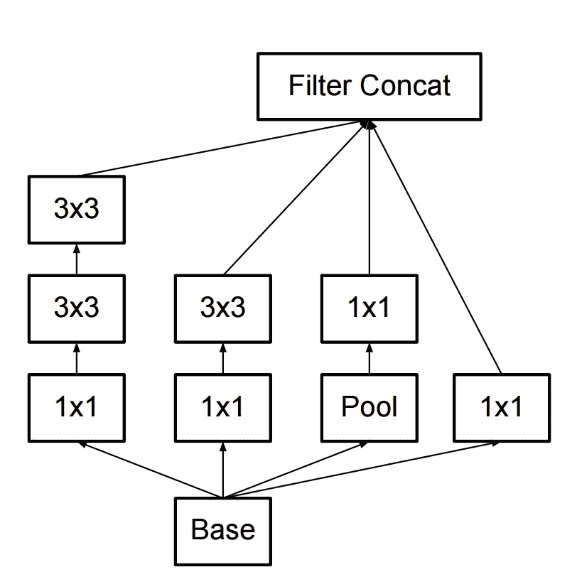

到了 2015 年底，这一系列架构的最后一次基本改进来自另一家公司，微软，以**ResNets**的形式。

# 残差网络（ResNet）

这种新的架构出现在 2015 年 12 月（或多或少与 Inception V3 同时），它有一个简单但新颖的想法——不仅应该使用每个构成层的输出，而且架构还应该将层的输出与原始输入相结合。

在下面的图中，我们观察到 ResNet 模块的一个简化视图。它清楚地显示了卷积系列结束时的求和操作，以及最后的 ReLU 操作：

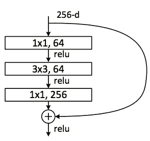

模块的卷积部分包括从 256 个值减少到 64 个值的特征减少，一个 3 x 3 的滤波层保持特征数量，以及一个将 1 x 1 层从 64 x 256 个值增加特征的层。最初，它跨越了 100 多个层，但在最近的发展中，ResNet 也被用于少于 30 层的深度，但具有更宽的分布。

既然我们已经看到了近年来主要发展的概述，让我们直接进入研究人员为 CNNs 发现的几种主要应用类型。

# CNN 深层解决的问题类型

CNN 在过去被用来解决各种各样的问题。以下是主要问题类型的回顾，以及对其架构的简要参考：

+   分类

+   检测

+   分割

# 分类

如我们之前所见，分类模型将图像或其他类型的输入作为参数，返回一个数组，其元素数量与可能类别的数量相同，每个都有一个相应的概率。

这种解决方案的正常架构是一个复杂的卷积和池化层的组合，最后是一个逻辑层，显示任何预训练类别的概率。

# 检测

检测增加了一层复杂性，因为它需要猜测图像中一个或多个相关元素的位置，然后尝试对每个这些信息元素进行分类。

对于这个任务，解决个体本地化问题的常见策略是将分类和回归问题结合起来——一个（分类）用于对象的类别，剩下的一个（回归）用于确定检测到的对象的坐标——然后将损失合并为一个共同的损失。

对于多个元素，第一步是确定感兴趣区域的数量，寻找图像中统计上显示出属于同一对象的信息块的地方，然后只对检测到的区域应用分类算法，寻找概率高的阳性案例。

# 分割

分割增加了额外的复杂性，因为模型必须在图像中定位元素并标记所有定位对象的精确形状，如下面的插图所示：

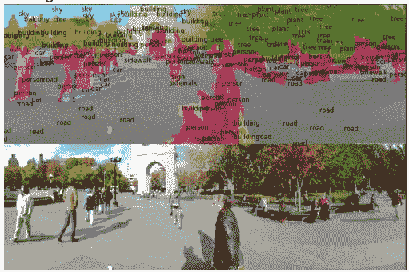

对于这个任务，最常见的方法是实现顺序下采样和上采样操作，仅使用每个像素的可能结果数量恢复高分辨率图像，这些结果标记了该元素的类别编号。

# 使用 Keras 部署深度神经网络

在这个练习中，我们将生成 Keras 应用程序库提供的先前描述的 Inception 模型的实例。首先，我们将导入所有必需的库，包括 Keras 模型处理、图像预处理库、用于优化变量的梯度下降以及几个 Inception 实用工具。此外，我们将使用 OpenCV 库调整新的输入图像，以及常见的 NumPy 和 matplotlib 库：

```py
from keras.models import Model
from keras.preprocessing import image
from keras.optimizers import SGD
from keras.applications.inception_v3 import InceptionV3, decode_predictions, preprocess_input

import matplotlib.pyplot as plt
import numpy as np
import cv2

Using TensorFlow backend.
```

Keras 使得加载模型变得非常简单。你只需要调用`InceptionV3`类的新实例，然后我们将基于**随机梯度下降**分配一个优化器，以及用于损失的类别交叉熵，这对于图像分类问题非常适合：

```py
model=InceptionV3()
model.compile(optimizer=SGD(), loss='categorical_crossentropy')
```

现在模型已加载到内存中，是时候使用`cv`库加载和调整照片了，然后我们调用 Keras 应用程序的预处理输入，这将归一化值：

```py
# resize into VGG16 trained images' format
im = cv2.resize(cv2.imread('blue_jay.jpg'), (299, 299))
im = np.expand_dims(im, axis=0)
im = im /255.
im = im - 0.5
im =  im * 2
plt.figure (figsize=(10,10))
plt.imshow(im[0], cmap=plt.get_cmap('binary_r'))
plt.show()
```

这是图像归一化后的样子——注意我们的图像结构理解是如何改变的，但从模型的角度来看，这是让模型收敛的最佳方式：

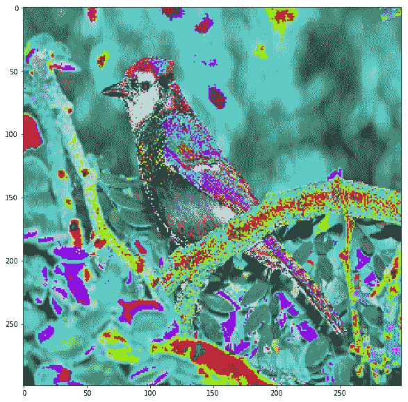

现在我们将调用模型的`predict`方法，这将显示神经网络最后一层的输出结果，一个包含每个类别概率的数组。`decode_predictions`方法读取一个字典，其中所有类别编号作为索引，类别名称作为值，因此它提供了检测到的项目分类的名称，而不是数字：

```py
out = model.predict(im)
print('Predicted:', decode_predictions(out, top=3)[0])
print (np.argmax(out))

Predicted: [('n01530575', 'brambling', 0.18225007), ('n01824575', 'coucal', 0.13728797), ('n01560419', 'bulbul', 0.048493069)]
10
```

如您所见，通过这种方法，我们从一系列类似鸟类中得到了一个非常近似的预测。对输入图像和模型本身的进一步调整可能导致更精确的答案，因为蓝松鸦是包含在 1,000 个可能类别中的类别之一。

# 使用 Quiver 探索卷积模型

在这个实际例子中，我们将借助 Keras 库和 Quiver 加载我们之前研究过的一个模型（在这个例子中，是 `Vgg19`）。然后我们将观察架构的不同阶段，以及不同层如何通过一定的输入工作。

# 使用 Quiver 探索卷积网络

**Quiver** ([`github.com/keplr-io/quiver`](https://github.com/keplr-io/quiver)) 是一个最近且非常方便的工具，用于在 Keras 的帮助下探索模型。它创建了一个可以被现代网络浏览器访问的服务器，并允许可视化模型的结构以及从输入层到最终预测的输入图像的评估。

以下代码片段将创建一个 `VGG16` 模型实例，然后我们将允许 Quiver 读取当前目录中的所有图像，并启动一个网络应用，允许我们与模型及其参数进行交互：

```py
from keras.models import Model
from keras.preprocessing import image
from keras.optimizers import SGD
from keras.applications.vgg16 import VGG16
import keras.applications as apps

model=apps.vgg16.VGG16()

from quiver_engine.server import launch
launch(model,input_folder=".") 
```

然后脚本将下载 `VGG16` 模型权重（你需要一个好的连接，因为它有几百兆字节）。然后它将模型加载到内存中，并创建一个监听 5000 端口的服务器。

Keras 库下载的模型权重已经用 Imagenet 进行了彻底的训练，因此它已经准备好在我们的数据集的 1,000 个类别上获得非常好的准确率。

在下面的截图中，我们看到加载网络应用索引页面后的第一个屏幕。在左侧，显示了网络架构的交互式图形表示。在中心右侧，你可以选择当前目录中的一张图片，应用将自动将其作为输入，并打印出输入的最可能五种结果。

截图还显示了第一个网络层，它基本上由三个矩阵组成，代表原始图像的红、绿和蓝成分：

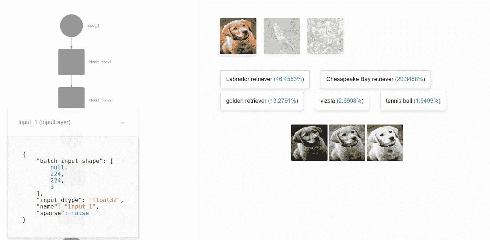

然后，当我们深入到模型层时，我们遇到了第一个卷积层。在这里，我们可以看到这个阶段主要突出高级特征，就像我们用 3x3 滤波器设置的那样，例如不同的边缘类型、亮度和对比度：

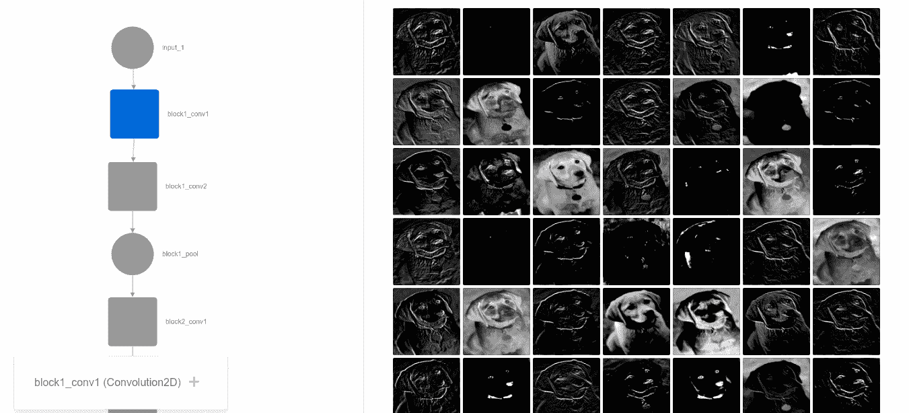

让我们再前进一点。现在我们可以看到一个不专注于全局特征的中间层。相反，我们看到它已经训练了中间特征，例如不同的纹理集、角度或特征集，如眼睛和鼻子：

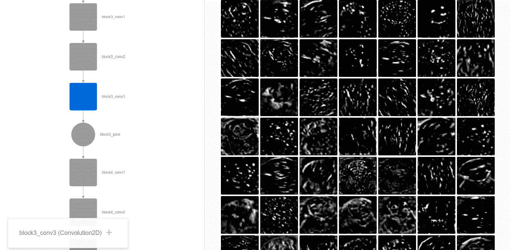

当到达最后的卷积层时，真正抽象的概念出现了。这一阶段展示了我们现在训练的模型是多么的强大，因为我们现在看到的是没有任何有用（对我们来说）意义的突出元素。这些新的抽象类别将在一些全连接层之后，导致最终的解决方案，这是一个包含 1,000 个元素的数组，具有浮点概率值，是 ImageNet 中每个类别的概率值：

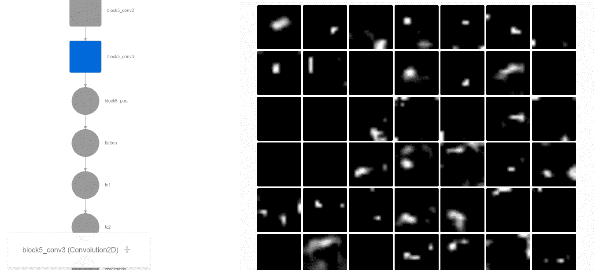

我们希望您能够探索不同的示例和层的输出，并尝试发现它们如何突出不同类别图像的不同特征。

现在是时候着手研究一种新的机器学习类型了，这种类型包括将先前训练好的网络应用于解决新的问题类型。这被称为**迁移学习**。

# 实现迁移学习

在这个例子中，我们将实现之前看到的一个例子，用预训练卷积神经网络的最后阶段替换，并为一组新元素训练最后阶段，应用于分类。它有以下优点：

+   它建立在图像分类任务中已证明有效的模型之上

+   它减少了训练时间，因为我们能够以可能需要数周计算能力才能达到的精度重用系数。

数据集类别将是来自 flower17 数据集的两种不同的花卉类型。这是一个包含每个类别 80 个图像的 17 类别花卉数据集。选择的花是英国的一些常见花卉。图像具有大范围、姿态和光照变化，而且同一类别内也存在图像的大范围变化和与其他类别的相似性。在这种情况下，我们将收集前两个类别（水仙花和紫菀），并在预训练的 VGG16 网络上构建一个分类器。

首先，我们将进行图像数据增强，因为图像的数量可能不足以抽象出每个物种的所有元素。让我们首先导入所有必需的库，包括应用、预处理、检查点模型和相关对象，以便我们保存中间步骤，以及`cv2`和`NumPy`库用于图像处理和数值基础操作：

```py
from keras import applications
from keras.preprocessing.image import ImageDataGenerator
from keras import optimizers
from keras.models import Sequential, Model 
from keras.layers import Dropout, Flatten, Dense, GlobalAveragePooling2D
from keras import backend as k 
from keras.callbacks import ModelCheckpoint, LearningRateScheduler, TensorBoard, EarlyStopping
from keras.models import load_model
from keras.applications.vgg16 import VGG16, decode_predictions,preprocess_input
import cv2
import numpy as np

Using TensorFlow backend.
```

在本节中，我们将定义所有影响输入、数据源和训练参数的变量：

```py
img_width, img_height = 224, 224
train_data_dir = "train"
validation_data_dir = "validation"
nb_train_samples = 300
nb_validation_samples = 100 
batch_size = 16
epochs = 50
```

现在我们将调用 VGG16 预训练模型，不包括顶部的平坦层：

```py
model = applications.VGG16(weights = "imagenet", include_top=False, input_shape = (img_width, img_height, 3))

# Freeze the layers which you don't want to train. Here I am freezing the first 5 layers.
for layer in model.layers[:5]:
    layer.trainable = False

#Adding custom Layers 
x = model.output
x = Flatten()(x)
x = Dense(1024, activation="relu")(x)
x = Dropout(0.5)(x)
x = Dense(1024, activation="relu")(x)
predictions = Dense(2, activation="softmax")(x)

# creating the final model 
model_final = Model(input = model.input, output = predictions)
```

现在是时候编译模型并为训练和测试数据集创建图像数据增强对象了：

```py
# compile the model 
model_final.compile(loss = "categorical_crossentropy", optimizer = optimizers.SGD(lr=0.0001, momentum=0.9), metrics=["accuracy"])

# Initiate the train and test generators with data Augumentation 
train_datagen = ImageDataGenerator(
rescale = 1./255,
horizontal_flip = True,
fill_mode = "nearest",
zoom_range = 0.3,
width_shift_range = 0.3,
height_shift_range=0.3,
rotation_range=30)

test_datagen = ImageDataGenerator(
rescale = 1./255,
horizontal_flip = True,
fill_mode = "nearest",
zoom_range = 0.3,
width_shift_range = 0.3,
height_shift_range=0.3,
rotation_range=30)
```

现在我们将生成新的增强数据：

```py
train_generator = train_datagen.flow_from_directory(
train_data_dir,
target_size = (img_height, img_width),
batch_size = batch_size, 
class_mode = "categorical")

validation_generator = test_datagen.flow_from_directory(
validation_data_dir,
target_size = (img_height, img_width),
class_mode = "categorical")

# Save the model according to the conditions  
checkpoint = ModelCheckpoint("vgg16_1.h5", monitor='val_acc', verbose=1, save_best_only=True, save_weights_only=False, mode='auto', period=1)
early = EarlyStopping(monitor='val_acc', min_delta=0, patience=10, verbose=1, mode='auto')

Found 120 images belonging to 2 classes.
Found 40 images belonging to 2 classes.
```

是时候为模型拟合新的最终层了：

```py
model_final.fit_generator(
train_generator,
samples_per_epoch = nb_train_samples,
nb_epoch = epochs,
validation_data = validation_generator,
nb_val_samples = nb_validation_samples,
callbacks = [checkpoint, early])

Epoch 1/50
288/300 [===========================>..] - ETA: 2s - loss: 0.7809 - acc: 0.5000

/usr/local/lib/python3.5/dist-packages/Keras-1.2.2-py3.5.egg/keras/engine/training.py:1573: UserWarning: Epoch comprised more than `samples_per_epoch` samples, which might affect learning results. Set `samples_per_epoch` correctly to avoid this warning.
  warnings.warn('Epoch comprised more than '

Epoch 00000: val_acc improved from -inf to 0.63393, saving model to vgg16_1.h5
304/300 [==============================] - 59s - loss: 0.7802 - acc: 0.4934 - val_loss: 0.6314 - val_acc: 0.6339
Epoch 2/50
296/300 [============================>.] - ETA: 0s - loss: 0.6133 - acc: 0.6385Epoch 00001: val_acc improved from 0.63393 to 0.80833, saving model to vgg16_1.h5
312/300 [===============================] - 45s - loss: 0.6114 - acc: 0.6378 - val_loss: 0.5351 - val_acc: 0.8083
Epoch 3/50
288/300 [===========================>..] - ETA: 0s - loss: 0.4862 - acc: 0.7986Epoch 00002: val_acc improved from 0.80833 to 0.85833, saving model to vgg16_1.h5
304/300 [==============================] - 50s - loss: 0.4825 - acc: 0.8059 - val_loss: 0.4359 - val_acc: 0.8583
Epoch 4/50
296/300 [============================>.] - ETA: 0s - loss: 0.3524 - acc: 0.8581Epoch 00003: val_acc improved from 0.85833 to 0.86667, saving model to vgg16_1.h5
312/300 [===============================] - 48s - loss: 0.3523 - acc: 0.8590 - val_loss: 0.3194 - val_acc: 0.8667
Epoch 5/50
288/300 [===========================>..] - ETA: 0s - loss: 0.2056 - acc: 0.9549Epoch 00004: val_acc improved from 0.86667 to 0.89167, saving model to vgg16_1.h5
304/300 [==============================] - 45s - loss: 0.2014 - acc: 0.9539 - val_loss: 0.2488 - val_acc: 0.8917
Epoch 6/50
296/300 [============================>.] - ETA: 0s - loss: 0.1832 - acc: 0.9561Epoch 00005: val_acc did not improve
312/300 [===============================] - 17s - loss: 0.1821 - acc: 0.9551 - val_loss: 0.2537 - val_acc: 0.8917
Epoch 7/50
288/300 [===========================>..] - ETA: 0s - loss: 0.0853 - acc: 0.9792Epoch 00006: val_acc improved from 0.89167 to 0.94167, saving model to vgg16_1.h5
304/300 [==============================] - 48s - loss: 0.0840 - acc: 0.9803 - val_loss: 0.1537 - val_acc: 0.9417
Epoch 8/50
296/300 [============================>.] - ETA: 0s - loss: 0.0776 - acc: 0.9764Epoch 00007: val_acc did not improve
312/300 [===============================] - 17s - loss: 0.0770 - acc: 0.9776 - val_loss: 0.1354 - val_acc: 0.9417
Epoch 9/50
296/300 [============================>.] - ETA: 0s - loss: 0.0751 - acc: 0.9865Epoch 00008: val_acc did not improve
312/300 [===============================] - 17s - loss: 0.0719 - acc: 0.9872 - val_loss: 0.1565 - val_acc: 0.9250
Epoch 10/50
288/300 [===========================>..] - ETA: 0s - loss: 0.0465 - acc: 0.9931Epoch 00009: val_acc did not improve
304/300 [==============================] - 16s - loss: 0.0484 - acc: 0.9901 - val_loss: 0.2148 - val_acc: 0.9167
Epoch 11/50
296/300 [============================>.] - ETA: 0s - loss: 0.0602 - acc: 0.9764Epoch 00010: val_acc did not improve
312/300 [===============================] - 17s - loss: 0.0634 - acc: 0.9744 - val_loss: 0.1759 - val_acc: 0.9333
Epoch 12/50
288/300 [===========================>..] - ETA: 0s - loss: 0.0305 - acc: 0.9931
```

现在我们用一朵水仙花图像来试一试。让我们测试分类器的输出，它应该输出一个接近`[1.,0.]`的数组，表示第一个选项的概率非常高：

```py
im = cv2.resize(cv2.imread('test/gaff2.jpg'), (img_width, img_height))
im = np.expand_dims(im, axis=0).astype(np.float32)
im=preprocess_input(im)

out = model_final.predict(im)

print (out)
print (np.argmax(out))

[[  1.00000000e+00   1.35796010e-13]]
0
```

因此，对于这类花朵，我们有一个非常明确的答案。你可以用新的图像进行实验，并用裁剪或扭曲的图像，甚至是相关类别的图像来测试模型，以检验其准确度水平。

# 参考文献

+   Fukushima, Kunihiko 和 Sei Miyake, *新认知机：一种用于视觉模式识别机制的自我组织神经网络模型.* 神经网络中的竞争与合作。Springer, Berlin, Heidelberg, 1982. 267-285.

+   LeCun, Yann 等人. *将基于梯度的学习方法应用于文档识别.* IEEE 86.11 (1998): 2278-2324.

+   Krizhevsky, Alex，Ilya Sutskever 和 Geoffrey E. Hinton，*使用深度卷积神经网络进行 ImageNet 分类.* 神经信息处理系统进展，2012.

+   Hinton, Geoffrey E. 等人, *通过防止特征检测器的共适应来改进神经网络.* arXiv 预印本 arXiv:1207.0580 (2012).

+   Simonyan, Karen 和 Andrew Zisserman, *用于大规模图像识别的非常深的卷积神经网络.* arXiv 预印本 arXiv:1409.1556 (2014).

+   Srivastava, Nitish 等人. *Dropout：一种防止神经网络过拟合的简单方法.* 机器学习研究杂志 15.1 (2014): 1929-1958.

+   Szegedy, Christian 等人, *重新思考计算机视觉中的 Inception 架构.* IEEE 计算机视觉和模式识别会议论文集，2016.

+   He, Kaiming 等人, *用于图像识别的深度残差学习.* IEEE 计算机视觉和模式识别会议论文集，2016.

+   Chollet, François, *Xception: 深度学习中的深度可分离卷积.* arXiv 预印本 arXiv:1610.02357 (2016).

# 摘要

本章提供了对媒体每天展示的令人惊叹的新应用中负责的一项技术的深刻见解。此外，通过提供的实际示例，你甚至能够创建新的定制解决方案。

由于我们的模型不足以解决非常复杂的问题，在下一章中，我们的范围将进一步扩大，将时间维度添加到我们泛化所包含的元素集中。
