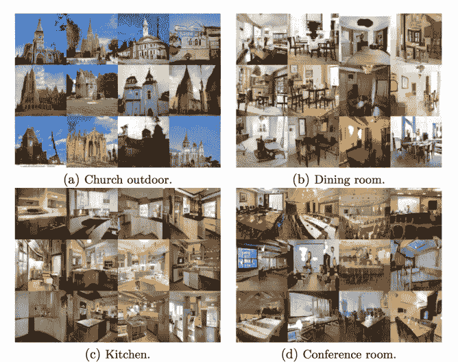
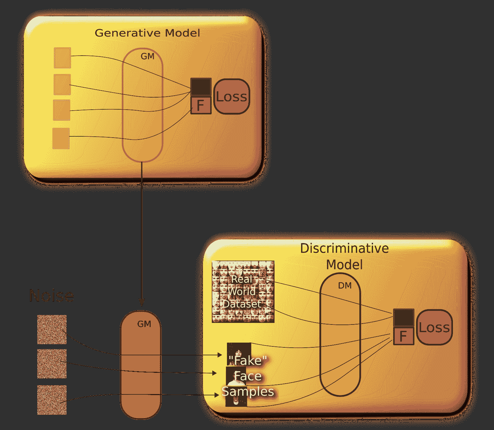
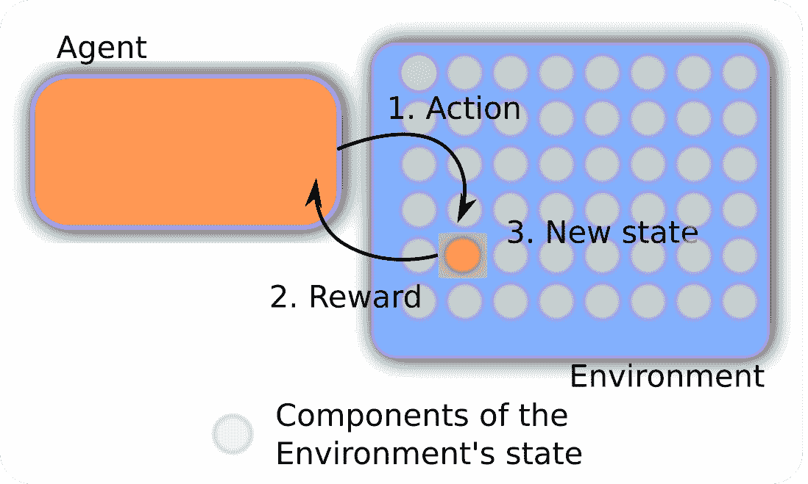
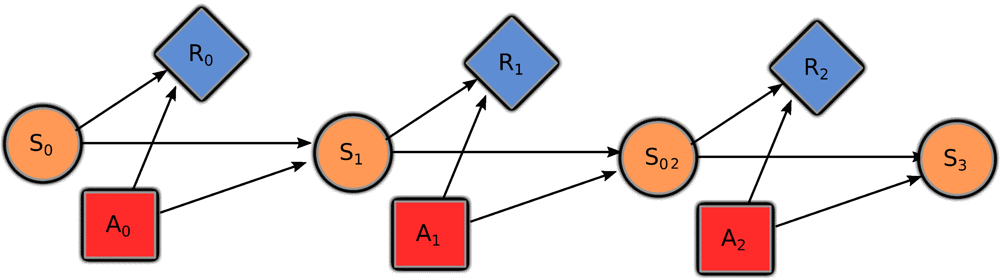
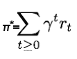
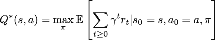
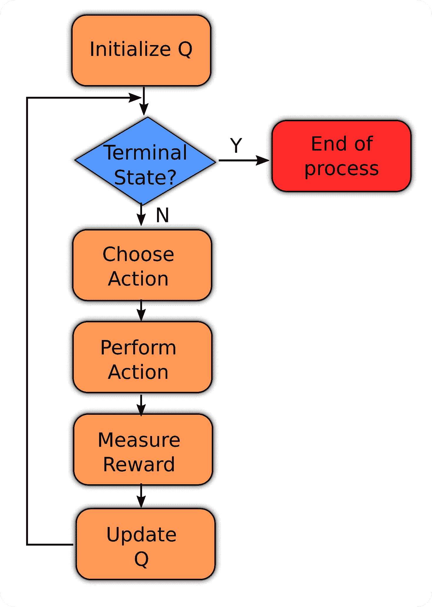

# 近期模型和发展

在前几章中，我们探讨了机器学习模型的大量训练机制，从简单的传递机制开始，如众所周知的前馈神经网络。然后我们查看了一个更复杂且与现实世界相关的机制，接受一个确定的输入序列作为训练输入，即**循环神经网络**（**RNNs**）。

现在是时候看看两个最近结合了现实世界其他方面的参与者了。在第一种情况下，我们不仅有一个优化其模型的单一网络，还有一个参与者，他们将相互改进各自的结果。这是**生成对抗网络**（**GANs**）的情况。

在第二种情况下，我们将讨论一种不同类型的模型，它将尝试确定最大化奖励的最佳步骤集：**强化学习**。

# GANs

GANs 是一种新的无监督学习模型，是过去十年中为数不多的颠覆性模型之一。它们有两个模型在迭代过程中相互竞争和改进。

该架构最初基于监督学习和博弈论，其主要目标是基本学会从同一类别的原始数据集中生成真实样本。

值得注意的是，关于 GAN 的研究数量几乎呈指数级增长，如下面的图表所示：



LSGAN 创建的模型

另一个非常有趣的例子是使用**即插即用生成网络（PPGN**）进行类条件图像采样，以填充真实 227 x 227 图像中的 100 x 100 缺失像素。

以下截图比较了 PPGN 变体和等效的 Photoshop 图像完成效果：


PPGN 生成的火山样本

以下截图说明了视觉概念的向量算术过程。它允许使用代表图像中对象的操作数，并可以在特征空间中添加或删除它们：

映射到某些期望输出类别标签(*y*)的函数。在概率论术语中，它学习输入数据的条件分布*P(y|x*)。它区分两个（或更多）不同的数据类别——例如，一个训练后输出 1 的卷积神经网络，给定人脸图像时输出 1，否则输出 0。

+   **判别器**：这个模型的任务是区分来自真实数据和生成器生成的虚假数据。每个模型都会试图打败对方（生成器的目标是欺骗判别器，判别器的目标是不要被生成器欺骗）：



GAN 的训练过程

更正式地说，生成器试图同时学习输入数据和标签的联合概率，即*P(x, y)*。因此，它也可以用于其他目的，例如创建可能的新*(x, y)*样本。它对数据的类别一无所知。相反，它的目的是生成符合训练数据分布的新数据。

在一般情况下，生成器和判别器都是神经网络，并且它们交替训练。它们各自的目标可以表示为一个我们可以通过梯度下降进行优化的损失函数。

最终结果是两个模型同时改进；生成器产生更好的图像，判别器在判断生成的样本是否为假样本方面变得更好。在实践中，最终结果是产生真正优秀和逼真的新样本（例如，自然环境的随机图片）的模型。

**总结，GANs 的主要收获是：**

+   GANs 是使用监督学习来近似不可处理的成本函数的生成模型

+   GANs 可以模拟许多成本函数，包括用于最大似然估计的那个

+   在高维、连续、非凸游戏中找到纳什均衡是一个重要的未解研究问题

+   GANs 是 PPGNs 的关键组成部分，能够从不同的图像类别生成引人注目的高分辨率样本

# 强化学习

强化学习是一个最近重新出现的领域，它在控制、寻找游戏和情境问题的解决方案等领域变得更加流行，在这些领域中，需要执行多个步骤来解决一个问题。

强化学习的一个正式定义如下：

“强化学习是代理必须通过与动态环境进行试错交互来学习行为所面临的问题。”（Kaelbling 等人，1996 年）。

为了有一个参考框架来解决问题类型，我们将首先回到 20 世纪 50 年代发展起来的一个数学概念，称为**马尔可夫决策过程**。

# 马尔可夫决策过程

在解释强化学习技术之前，我们将解释我们将用它们解决的问题类型。

当谈论强化学习时，我们想要优化马尔可夫决策过程的问题。它由一个数学模型组成，有助于在部分结果随机、部分受代理控制的决策情境中进行决策。

该模型的主要元素是一个**代理**、一个**环境**和一个**状态**，如下面的图所示：



强化学习过程的简化方案

代理可以执行某些动作（例如将桨向左或向右移动）。这些动作有时会导致奖励 *r[t]*，这可以是正的或负的（例如得分的增加或减少）。动作会改变环境，并可能导致新的状态 *s[t+1]*，其中代理可以执行另一个动作 *a[t+1]*。状态、动作和奖励的集合，以及从一个状态转换到另一个状态的规则，共同构成了马尔可夫决策过程。

# 决策元素

为了理解这个问题，让我们将自己置于问题解决环境中，并查看主要元素：

+   状态的集合

+   要采取的动作是从一个地方移动到另一个地方

+   奖励函数是表示边的值

+   策略是完成任务的方式

+   折扣因子，它决定了未来奖励的重要性

与传统的监督学习和无监督学习形式相比，主要区别在于计算奖励所需的时间，在强化学习中不是瞬时的；它是在一系列步骤之后到来的。

因此，下一个状态取决于当前状态和决策者的动作，状态不依赖于所有先前状态（它没有记忆），因此它符合马尔可夫属性。

由于这是一个马尔可夫决策过程，状态 *s[t+1]* 的概率只取决于当前状态 *s[t]* 和动作 *a[t]*：



展开式强化机制

整个过程的目标是生成一个策略 *P*，以最大化奖励。训练样本是元组，*<s, a, r>*。

# 优化马尔可夫过程

强化学习是代理与环境之间的迭代交互。在每个时间步发生以下情况：

+   处于某个状态时，决策者可以选择在该状态下可用的任何动作

+   在下一个时间步，过程通过随机移动到新状态并给予决策者相应的奖励来响应

+   过程进入其新状态的概率受所选动作的影响，这种影响以状态转换函数的形式出现

# 基本 RL 技术：Q 学习

最著名的强化学习技术之一，也是我们将在示例中实现的技术，是**Q 学习**。

Q 学习可用于在有限马尔可夫决策过程中找到任何给定状态的最佳动作。Q 学习试图最大化表示在状态*s*执行动作*a*时最大折现未来奖励的 Q 函数的值。

一旦我们知道了 Q 函数，状态*s*中的最佳动作*a*就是具有最高 Q 值的动作。然后我们可以定义一个策略π*(s)*，它给出任何状态的最佳动作，如下所示：



我们可以用下一个点的 Q 函数（*s[t+1]*, *a[t+1]*, *r[t+1]*, *s[t+2]*)来定义转换点（*s[t]*, *a[t]*, *r[t]*, *s[t+1]*）的 Q 函数，类似于我们处理总折现未来奖励的方式。这个方程被称为**Q 学习的贝尔曼方程**：



在实践中，我们可以将 Q 函数视为一个查找表（称为**Q 表**），其中状态（用*s*表示）是行，动作（用*a*表示）是列，而元素（用*Q(s, a)*表示）是在给定行的状态下采取给定列的动作所获得的奖励。在任何状态下采取的最佳动作是具有最高奖励的动作：

```py
initialize Q-table Q
observe initial state s
while (! game_finished):
 select and perform action a
 get reward r 
   advance to state s'
 Q(s, a) = Q(s, a) + α(r + γ max_a' Q(s', a') - Q(s, a))
 s = s'
```

你会意识到该算法基本上是在贝尔曼方程上进行随机梯度下降，通过状态空间（或剧集）回传奖励，并在许多试验（或时代）上平均。在这里，`α`是学习率，它决定了先前 Q 值和折现后的新最大 Q 值之间差异的多少应该被纳入。

我们可以用以下流程图来表示这个过程：



# 参考文献

+   贝尔曼，理查德，*马尔可夫决策过程*。数学与力学杂志（1957 年）：679-684。

+   凯尔布林，莱斯利·帕克，迈克尔·L·利特曼，和安德鲁·W·摩尔，*强化学习：综述*。人工智能研究杂志 4（1996 年）：237-285。

+   古德费洛，伊恩，等人，*生成对抗网络，神经信息处理系统进展*，2014 年

+   拉德福德，亚历克，卢克·梅茨，和索乌米特·奇塔拉，*使用深度卷积生成对抗网络进行无监督表示学习*。arXiv 预印本 arXiv:1511.06434（2015 年）。

+   伊索拉，菲利普，等人，*条件对抗网络进行图像到图像的翻译*。arXiv 预印本 arXiv:1611.07004（2016 年）。

+   Mao, Xudong, et al., *最小二乘生成对抗网络*。arXiv 预印本 ArXiv:1611.04076 (2016)。

+   Eghbal-Zadeh, Hamid, 和 Gerhard Widmer, *生成对抗网络的似然估计*。arXiv 预印本 arXiv:1707.07530 (2017)。

+   Nguyen, Anh, et al., *即插即用生成网络：潜在空间中条件迭代生成图像*。arXiv 预印本 arXiv:1612.00005 (2016)。

# 摘要

在本章中，我们回顾了最近出现的最重要和最具创新性的两种架构。每天都有新的生成和强化模型以创新的方式被应用，无论是从已知类别的选择中生成可行的新元素，甚至是在策略游戏中战胜专业玩家。

在下一章中，我们将提供精确的说明，以便您可以使用和修改提供的代码，更好地理解您在整本书中学到的不同概念。
