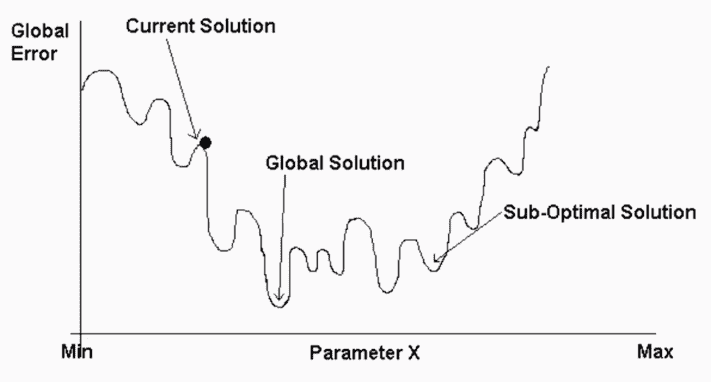
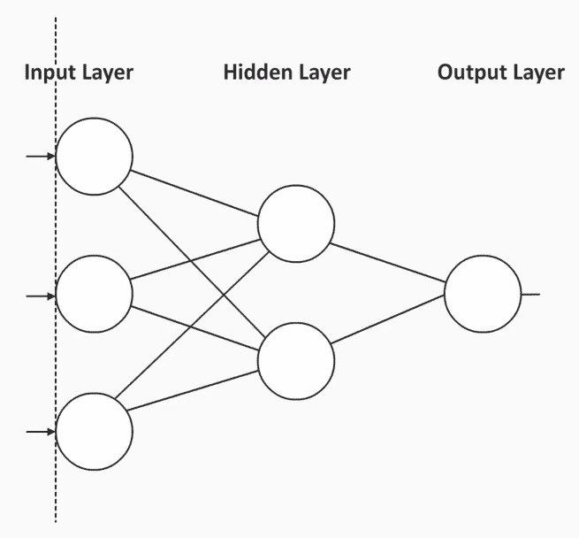
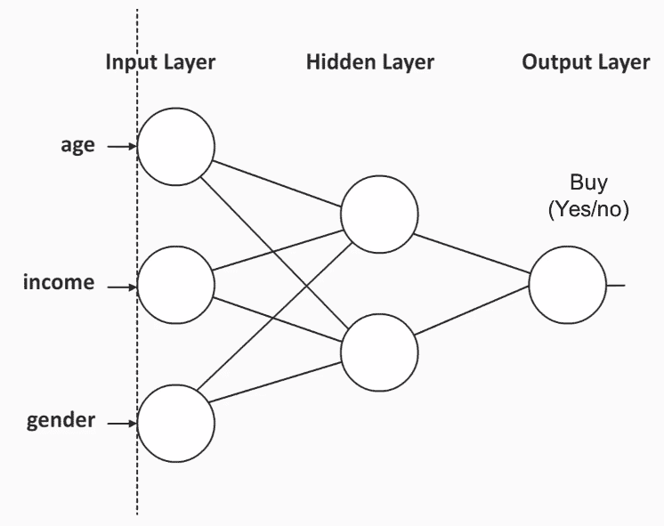
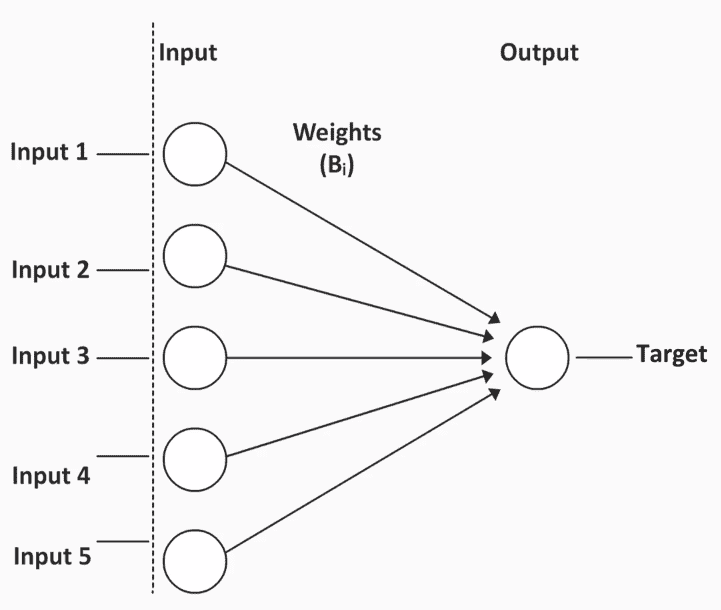
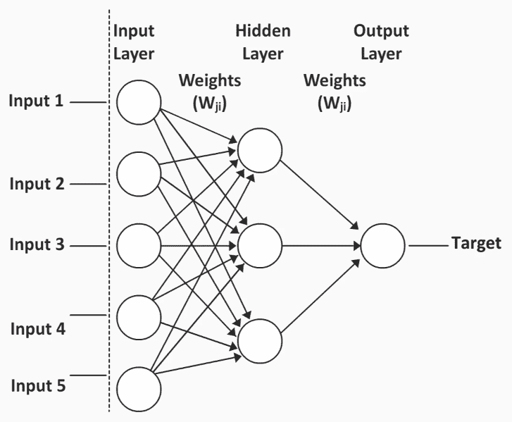
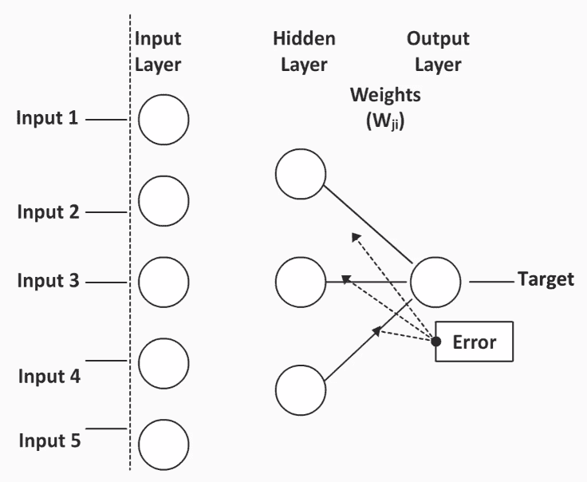
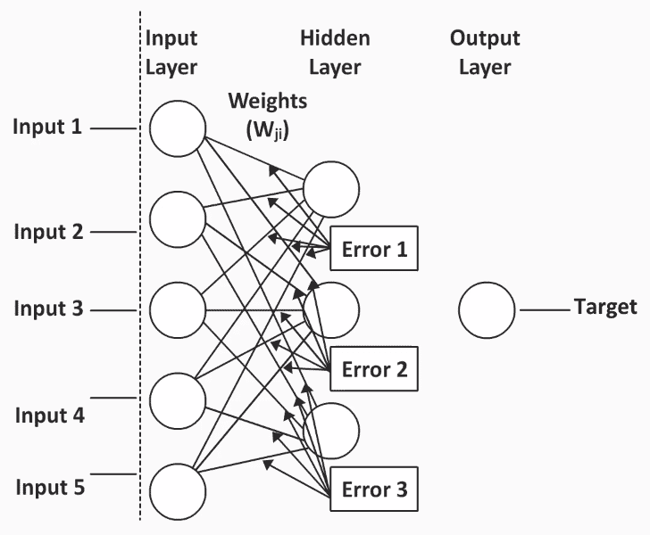

# 第一章：介绍机器学习预测模型

大部分数据挖掘机会都涉及机器学习，这些机会通常伴随着更大的经济回报。本章将为你提供将机器学习的力量带入数据挖掘工作的基本知识。在本章中，我们将讨论机器学习模型的特点，并查看一些这些模型的示例。

以下是我们将在本章中涉及的主题：

+   机器学习预测模型的特点

+   机器学习预测模型的类型

+   与神经网络一起工作

+   一个示例神经网络模型

# 机器学习预测模型的特点

了解机器学习预测模型的特点将有助于你理解它们与任何统计模型或决策树模型相比的优势和局限性。

让我们了解一下机器学习预测模型的一些特点：

+   **优化以学习复杂模式**：机器学习模型被设计成优化以学习复杂模式。与统计模型或决策树模型相比，当数据中存在非常复杂的模式时，预测模型在这一点上表现得尤为出色。

+   **考虑交互和非线性关系**：机器学习预测模型可以比决策树模型更好地考虑数据中的交互和非线性关系。

+   **假设很少**：这些模型之所以强大，是因为它们有很少的假设。它们也可以用于不同类型的数据。

+   **黑盒模型的解释并不简单**：预测模型是黑盒模型，这是预测机器学习模型的一个缺点，因为这意味着解释并不简单。这意味着，如果我们最终构建了许多不同的方程并将它们组合起来，就很难确切地看到每个变量是如何相互作用并影响输出变量的。因此，预测机器学习模型在预测准确性方面非常出色，但它们在理解预测背后的机制方面并不那么好。

如果你想要预测某件事，这些模型做得相当不错，并且具有惊人的准确性。但如果你想知道为什么会有这样的预测，如果你希望对实施进行一些更改以避免特定的预测，那么要解析出来将会很困难。

# 机器学习预测模型的类型

以下是一些不同的机器学习预测模型类型：

+   神经网络

+   支持向量机

+   随机森林

+   简单贝叶斯算法

+   梯度提升算法

+   K 最近邻

+   自学习响应模型

我们不会涵盖所有这些，但我们将关注一个非常有趣的模型——神经网络。在接下来的章节中，我们将深入了解神经网络是什么。 

# 与神经网络一起工作

神经网络最初是为了尝试理解大脑如何运作而开发的。最初它们被用于神经科学和语言学领域。

在这些领域，研究人员注意到环境中发生了某些事情（输入），个体处理了信息（在大脑中），然后以某种方式做出反应（输出）。

因此，神经网络或神经网络的背后理念是它们将充当大脑，就像一个黑盒。然后我们必须尝试弄清楚发生了什么，以便可以将发现应用于实践。

# 神经网络的优点

以下是使用神经网络的优点：

+   **适用于许多类型的问题**：它们与您可能遇到的许多复杂问题都兼容得很好。

+   **泛化能力很好**：准确的泛化是一个非常重要的特性。

+   **它们非常普遍**：神经网络在当今世界非常普遍，并且它们被轻松接受并用于现实世界的问题。

+   **关于它们了解很多**：由于神经网络获得了广泛的流行，因此在不同的领域进行了大量研究并成功实施，因此关于神经网络的信息很多。

+   **与非聚类数据兼容性良好**：当您拥有非聚类数据时，神经网络可以在几种情况下使用，例如数据本身非常复杂，您有很多交互，或者您有非线性关系；在这种情况下，神经网络无疑是强大且非常稳健的解决方案。

# 神经网络的缺点

优秀的模型是以一些缺点为代价的：

+   **训练需要时间**：神经网络确实需要很长时间来训练；它们通常比线性回归模型或决策树模型慢，因为这些基本上只是对数据进行一次遍历，而神经网络实际上要经过许多次迭代。

+   **最佳方案不保证**：您不能保证找到最佳方案。这也意味着，除了运行单个神经网络多次迭代外，您还需要使用不同的起始点多次运行它，以便尝试接近最佳方案。

+   **黑盒**：正如我们之前讨论的，很难弄清楚是什么导致了特定的输出以及如何做到这一点。

# 表示错误

在构建我们的神经网络时，我们的实际目标是构建最佳可能的解决方案，而不是陷入次优方案。我们需要多次运行神经网络。

以这个错误图为例：

这是一个表示不同解决方案中错误数量的图表。**全局解**是最佳可能的解决方案，并且确实是最佳的。**次优解**是一个终止、陷入困境且不再改进的解决方案，但它并不是真正的最佳解决方案。

# 神经网络模型的类型

有多种类型的神经网络可供我们使用；在本节中，我们将深入了解这些。

# 多层感知器

最常见的类型被称为**多层感知器模型**。这个神经网络模型由圆圈表示的神经元组成，如下面的图所示。这些神经元被组织成层：

每个多层感知器模型至少有三个层：

+   **输入层**：这一层包含我们数据中的所有预测因子。

+   **输出层**：这将包括结果变量，也称为**因变量**或**目标变量**。

+   **隐藏层**：这是你最大化神经网络功能的地方。在这个层也可以创建非线性关系，并且所有复杂的交互都在这里进行。你可以有多个这样的隐藏层。

你也会在先前的图中注意到，同一层的每个神经元都与下一层的每个神经元相连。这形成了连接，并且每条连接线都会有一个与之相关的权重。这些权重将在模型中形成不同的方程。

# 为什么权重很重要？

权重之所以重要，有几个原因。首先，因为同一层的所有神经元都与下一层的每个神经元相连，这意味着层之间是相连的。这也意味着与许多其他模型不同，神经网络模型不会丢弃任何预测因子。例如，你可能开始时有 20 个预测因子，这 20 个预测因子将被保留。权重重要的第二个原因是它们提供了关于每个预测因子对预测的影响或重要性的信息。正如稍后所示，这些权重最初是随机的，然而通过多次迭代，权重被修改以提供有意义的信息。

# 多层感知器模型的示例表示

在这里，我们将查看一个多层感知器模型的示例。我们将尝试根据个人的**年龄**、**收入**和**性别**预测一个特定商品的潜在买家。

例如，考虑以下内容：

如你所见，我们的输入预测因子，即**输入层**，是**年龄**、**收入**和**性别**。形成我们**输出层**的因变量是**购买**，这将决定某人是否购买了产品。有一个隐藏层，输入预测因子在这里结合。

为了更好地理解神经网络模型背后的情况，让我们看看线性回归模型。

# 线性回归模型

让我们用一个例子来理解线性回归模型。

考虑以下：

在线性回归中，**输入层**中的每个输入预测器通过单个连接权重与结果字段相连，也称为**系数**，这些系数通过数据的一次遍历来估计。系数的数量将与预测器的数量相等。这意味着每个预测器都将有一个与之相关的系数。

每个输入预测器都直接与**目标**连接，并以其特定的系数作为权重。因此，我们可以很容易地看到输入预测器中一个单位的变化对结果变量或**目标**的影响。这种类型的连接使得确定每个预测器对目标变量以及方程的影响变得容易。

# 一个示例神经网络模型

让我们用一个例子来更详细地了解神经网络：

注意，**输入层**中的每个神经元都与**隐藏层**中的每个神经元相连，例如，**输入 1**与**隐藏层**中的第一个、第二个甚至第三个神经元相连。这意味着将有三个不同的权重，这些权重将是三个不同方程的一部分。

这就是在这个例子中发生的事情：

+   **隐藏层**位于**输入层**和**输出层**之间。

+   **隐藏层**允许有更复杂的模型，具有非线性关系。

+   有很多方程，所以单个预测器对结果变量的影响是通过多种路径发生的。

+   权重的解释不会是直接的。

+   权重对应于变量重要性；它们最初将是随机的，然后将通过一系列不同的迭代并基于迭代的反馈而改变。然后它们将具有与变量重要性相关的真实含义。

因此，让我们继续看看这些权重是如何确定的，以及我们如何形成一个功能性的神经网络。

# 前向传播反向传播

**前向传播反向传播**是一种我们可以预测诸如权重和神经网络最终结果的方法。

根据这种方法，预测上发生以下迭代：

+   如果预测是正确的，与之相关的权重将得到加强。想象一下神经网络说：“嘿，你知道什么，我们为第一个预测器的这个方程的第一部分使用了 0.75 的权重，并且得到了正确的预测；这可能是一个好的起点。”

+   假设预测是不正确的；错误被反馈或反向传播到模型中，以便修改权重或权重系数，如图所示：

这种反向传播不仅会在**隐藏层**和**目标层**之间发生，还会向**输入层**发生：

当这些迭代正在进行时，我们实际上正在通过每次错误传播使我们的神经网络越来越好。现在的连接使神经网络能够学习数据中的不同模式。

因此，与任何线性回归或决策树模型不同，神经网络试图学习数据中的模式。如果给它足够的时间来学习这些模式，神经网络结合其经验，将更好地理解和预测，极大地提高准确率。

# 模型训练伦理

当你在训练神经网络模型时，永远不要用整个数据集来训练模型。我们需要保留一些数据用于测试目的。这将使我们能够测试神经网络是否能够将训练数据集中学到的知识应用到新数据上。

我们希望神经网络能够很好地泛化到新数据，并捕捉不同类型数据的共性，而不仅仅是那些会使它样本特定的细微差别。相反，我们希望结果能够被转换到新数据上。在模型训练完成后，可以使用模型的经验来预测新数据。

# 摘要

我希望你现在对机器学习预测模型已经清楚，并且理解了基本概念。在本章中，我们了解了机器学习预测模型的特点，并了解了一些不同类型。这些概念是进一步章节的垫脚石。我们还查看了一个基本神经网络模型的示例。在下一章中，我们将在数据集上实现一个实时神经网络，你还将被介绍到支持向量机及其实现。
