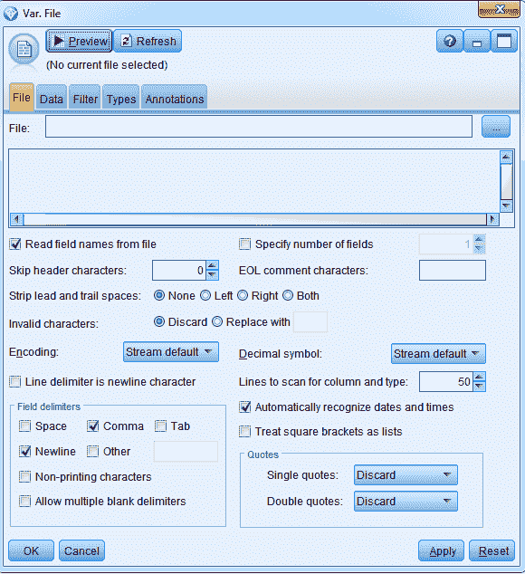
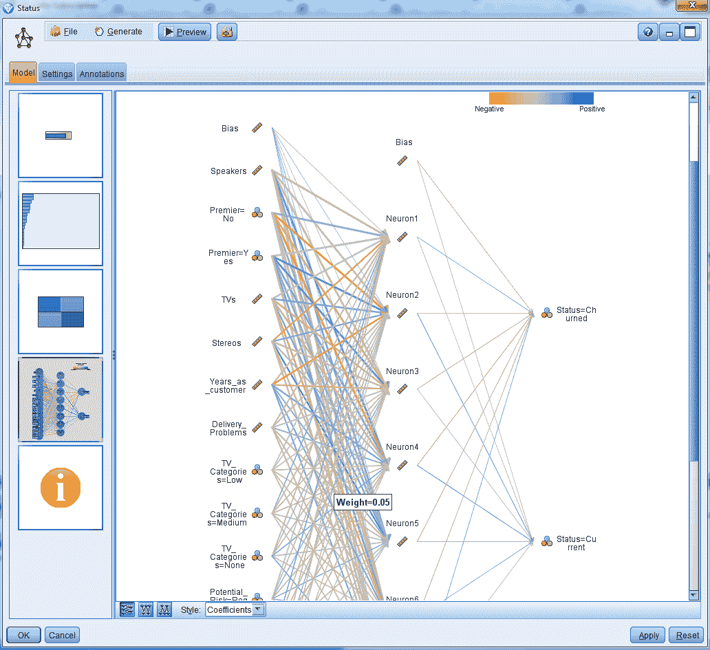

# 开始学习机器学习

在上一章中，我们了解了机器学习预测模型是什么，并对其工作原理形成了基本理解。在本章中，我们将展示神经网络模型的工作原理，并继续介绍另一种类型的模型，即（**支持向量机**）。

**支持向量机**模型。

本章将涵盖以下主题：

+   展示神经网络

+   支持向量机

+   展示支持向量机

# 展示神经网络

让我们通过一个神经网络的实战例子来跳转。我们使用的软件是 IBM 提供的 SPSS Modeler，但您也可以自由使用任何数据挖掘软件包。

# 运行神经网络模型

为了运行我们的第一个神经网络，我们需要引入我们将要使用的数据，如果您使用 IBM SPSS Modeler，可以按照以下步骤操作：

1.  使用**变量文件**节点获取数据，并将其拖拽到画布上：

1.  将数据集附加到源节点：

点击文件框右侧的三点菜单，导航到您的数据；这里我们使用`Electronics_Data`：

点击**打开**。

1.  切换到**类型**选项卡，检查数据是否正确读取：

点击**读取值**按钮；在弹出的提示中点击**确定**，您将看到以下内容：

看起来数据读取正确。

1.  我们将不会使用第一个变量**ID**，因此我们将将其测量设置为**无类型**：

1.  现在让我们指定我们的**状态**目标变量，并将其**角色**设置为**目标**：

现在，Modeler 知道**状态**是它将要预测的变量。它将使用其他字段来预测结果变量。

1.  查看您已添加的数据；为此，请转到画布底部的**输出**调色板：

将源节点`Electronics_Data`连接到输出表节点：

1.  通过点击画布上播放图标旁边的**运行选择**（五角星图标）按钮来运行流：

您将看到以下数据：

因此，我们有一个包含**19 个字段和 5,003 条记录**的表格，这意味着如果我们消除目标字段和未使用的 ID 字段，我们在这个数据集中有 17 个预测器。我们将预测状态字段，以检查我们是否失去了或保留了客户，这基于人们购买的商品数量、总收入、他们是否使用了折扣、他们支付商品的方式、位置以及其他附加的客户特征。关闭此窗口以继续。

1.  在开始构建任何模型之前，请确保将数据集拆分为`训练`和`测试`数据集，以便复制结果并验证我们构建的模型的一致性。为此，请转到**字段操作**面板并将源节点连接到**分区**节点：

此**分区**节点将创建数据集的两个版本：

因此，数据集中的`50`将用于训练，其余的`50`将分别用于测试数据集。点击**确定**。

1.  现在，我们将构建我们的模型。为此，转到**建模**面板，并单击两次**分区**节点和**神经网络**模型：

因此，您可以看到，**状态**，神经网络将要预测的变量，已经被捕获，并将为它构建一个神经网络。

1.  点击**神经网络**统计节点以查看神经网络的详细信息：

您可以看到有一个目标变量，我们的 17 个**预测器**由神经网络指定。**预测器**可以是任何字段类型：连续的、分类的或任何其他类型。您也可以选择不包含这些**预测器**中的某些。

1.  点击**构建选项**选项卡：

1.  这些问题是为了了解您想用模型做什么，您是想构建一个新模型还是继续训练现有的模型。您可以选择任何目标；在我们的例子中，我们将创建一个标准模型，我们将在后面的章节中讨论其他选项。

1.  您可以通过点击**构建选项**下的**基本**选项卡来查看您希望构建的模型类型：

如您所见，我们有两种选择，即我们在本章前面看到的**多层感知器（MLP）模型**，以及**径向基函数（RBF）模型**。当您有诸如聚类预测器之类的对象时，RBFs 更受欢迎，但就我们的例子而言，多层感知器模型是最好的选择。隐藏层选项允许您指定模型中所需的隐藏层数量。目前，我们将选择**自动计算单元数量**。因此，模型将自动为我们计算隐藏层的数量。

1.  转到**购物规则**标签页：

我们的模式将经历多次迭代，并且当它不再改进时将停止；然而，它也可以因为其他原因而停止。例如，它可以在经过一定时间后停止，默认情况下，如截图所示，设置为`15`分钟，但您可以更改此设置。您还可以让模型在经过一定数量的迭代后停止，或者您可以告诉模型一旦达到一定水平的准确性就停止。因此，这些都是您可以停止运行模型的其他方式。

1.  点击**集成**标签页：

此选项使我们能够构建多个模型版本；让我们保持默认值。

1.  转到**高级**标签页：

我们知道，如果您让神经网络运行足够长的时间，它最终会学习到数据中的模式。这可能会是一个不希望的特性，因为我们不希望利用偶然性，因此我们希望保留一些数据，并且我们可以使用此选项设置每个迭代保留数据的值——在这种情况下，训练数据集中的`30.0`在每次迭代中被保留。

关于随机种子，正如我们所知，我们将多次运行我们的模型（以找到全局解而不是陷入次优解），并且我们可以生成随机种子。每次您点击生成按钮时，您都会得到一个不同的随机种子（或起始点）。

此外，神经网络不处理缺失值；它们需要完整的数据，并且您可以使用**高级**标签页中的**预测器中的缺失值**选项选择对缺失值进行什么操作：

+   +   **删除列表**：如果任何一个变量有缺失信息，整个案例将从模型中删除。

    +   **填充缺失值**：在这种情况下，存在缺失值，这些值将被模型默认值替换，因此您将无法控制模型如何处理它们。因此，我的建议是在开始构建模型之前就替换缺失值。

1.  转到**模型选项**标签页：

模型将自动为您或计算预测的重要性。它会告诉您哪些字段在模型中是最重要的。就模型将要提供的内容而言，它将提供一个预测，并且它还将提供一个对该预测的置信度分数。通常，您应该看到预测值的概率；这是最有用的。

您也可以要求获取从下一个最可能的结果预测的类别的概率增加。如果您愿意，您还可以为所有不同的类别获取预测概率。

倾向得分最终变得非常有用，我们稍后会讨论它们。

1.  点击**运行**来运行模型。现在模型已经构建完成：

让我们看看我们发现了什么。

# 解释结果

要查看结果，点击在模型构建后自动添加的**状态**生成的模型。

测试数据集需要以下观察结果。让我们详细了解它们：

1.  您将看到一个**模型摘要**：

您可以看到我们的目标是；我们知道我们运行了一个多层感知器模型，然后它提供了模型停止的原因信息，您可以看到它停止是因为错误无法进一步降低。基本上，这意味着模型不再改进，我们有一个隐藏层，这个隐藏层有七个神经元。我们还可以看到在训练数据集中整体准确率约为**79%**。

1.  点击右侧的下一个标签页，即**预测重要性**标签页：

这为您提供了关于预测变量重要性的信息。因此，您可以观察到哪些预测变量是最重要的，并且对预测贡献很大。这显示了最重要的预测变量。在我们的案例中，**演讲者**预测变量位居榜首。要查看更多预测变量的重要性，只需将刻度向左拖动即可。

1.  **状态分类**是我们的下一个观察结果：

在这里，我们可以看到我们如何准确地预测训练数据集中两个组中的每一个；注意正确预测的整体百分比。您甚至可以从底部的**样式**标签页切换到细胞计数视图。

1.  让我们再向下一点，点击下一个标签页：

这显示给我们实际的神经网络模型。我们正在预测变量状态；我们有一个隐藏层，这个隐藏层有七个神经元，这就是我们在这里可以看到的。您可以看到每个预测变量到隐藏层中神经元的连接。

您还可以将**样式**从**效果**切换到**系数**：

线条越粗，该方程中的预测变量就越重要，您甚至可以看到系数。

1.  点击最后一个图标以获取此信息：

这只是告诉我们哪个字段是我们的目标字段，哪些是我们的预测变量。

关闭窗口，现在我们将看到关于我们的训练数据集的信息。为此，将我们拥有的模型连接到**表格**图标：

您还可以运行表格节点：

这里，您将有两个新的字段，**$N-Status**，预测字段，以及**$NC-Status**，对该预测的置信度。这里，我们有训练数据集以及测试数据集的数据。

# 分析模型的准确性

让我们分析模型的准确性：

1.  为了检查整体模型的准确性，请转到**输出**调色板并将您的模型连接到**分析**节点：

1.  点击**分析**节点并检查**巧合矩阵（对于符号目标）**：

**巧合矩阵（对于符号目标）**被检查以提供关于模型准确性的分解的额外信息。

1.  点击**运行**，您可以在训练和测试数据集中看到整体准确性：

记得我们之前在查看模型摘要时看到了相同的准确性结果，大约是 79%。与训练数据集相比，测试数据集的准确性略有下降，但这不应有很大影响。两个数据集之间的准确性差异可以在 5%以内，这样模型就足够可靠了。

因此，我们的训练数据和测试数据非常相似，这意味着我们已经构建了一个一致且可靠的模型，我们可以信赖它！

如果您查看分析中的**$N-Status**置信矩阵部分，您可以看到在训练数据集中，我们正确预测了**790**个已**流失**的客户和**1,146**个当前客户。在测试数据集中，我们正确预测了**745**个已**流失**的客户和**1,231**个当前客户。

# 测试数据集上的模型性能

由于我们将多次运行神经网络模型，创建几个显示所发现内容的表格是个好主意：

您还可以创建一个基于模型中使用的种子的前 10 个预测因子的表格：

为了评估您模型的性能，您可以像我们之前多次做的那样重新运行模型，并在每次运行时检查模型的准确性。您甚至可以用不同的种子和不同的起点来运行它。因此，获得的结果会有所不同，但相当相似。如您所知，我们多次重新运行模型以找到最佳解决方案。

为了检查结果的一致性，您可以在每次重新运行模型时以这种方式扩展您的模型性能表：

在这些模型中，你可以选择最有意义的模型。例如，正如你所见，最后一个种子为 5000 的条目具有最高的整体准确率。它在预测流失客户方面也具有最高的准确率。但在预测当前客户方面准确率最低。因此，你可以确定对你最重要的解决方案，并据此选择最佳模型。

每次重新运行时，前 10 个预测因子也会随着结果的微小变化而变化。每次运行模型时，你可以记录前 10 个预测因子，并扩展你之前创建的前 10 个预测因子表：

正如你所见，许多预测因子继续是最重要的，例如首要预测因子，而有些预测因子只出现一次或两次——例如，**员工数量**预测因子。这类列出前 10 个预测因子的表格也可以帮助你选择所需的模型。你还可以利用这些信息创建一个新版本模型，其中你不想使用最初使用的预测因子，而只想使用那些作为前十个中最常见的预测因子或任何在前十个中出现的预测因子。

由于我们已经在减少预测因子的数量，这不仅会简化对模型的了解，而且最终会创建一个比某些情况下更简单的模型，这实际上可能更准确，因为你正在去除那些其他预测因子可能带来的额外噪声。

# 支持向量机

**支持向量机（SVMs**）模型是为了预测分类和连续结果而构建的，当有多个预测因子时尤其出色。它们是为了解决线性模型无法分离结果字段类别等难以预测的情况而开发的。它们也像黑盒一样工作，隐藏了预测结果中的复杂工作。让我们深入了解 SVM 是如何工作的。

# 与支持向量机（SVM）一起工作

假设，例如，有一种数据无法使用如图所示的单一线条进行分离：

将这些形状视为不同类型的数据。正如你所见，我们无法仅通过在它们之间画一条线来分离数据簇。但如果用复杂的曲线，如圆形，而不是直线，就可以轻松完成区分的任务，就像图中所展示的那样。

支持向量机（SVM）的主要任务是将原始数据从这种复杂空间转换到另一个空间，在这个空间中，分离数据点的函数要简单得多。这项任务被称为**核变换**。

# 核变换

**核函数**是一个数学函数，它将数据转换。之所以称为**SVM**，是因为向量形成了不同数据组之间的边界，如图所示：

因此，我们在下面放置了圆圈，在上面放置了正方形，边界是向量。这些向量边界正在分隔两组。向量是那些充当组之间边界的案例。

因此，在这个阶段，我们可以有几个解决方案：

这表明我们不再需要圆形或复杂的曲线来分隔数据组。

# 但最佳解决方案是什么？

我们最终需要找到最佳解决方案。最佳解决方案将是最大化组间分离度，同时平衡对新数据函数可能过拟合的权衡。这个新数据包括一个权重因子或正则化因子，它向函数添加惩罚，以最大化向量之间的间隔同时最小化误差，如图所示：

# 核函数类型

在**SPSS Modeler**中，有四种不同的核函数类型：

+   **线性**：一个简单的函数，适用于很少的非线性关系

+   **多项式**：一个更复杂的函数，适用于某些非线性关系

+   **RBF（径向基函数）**：类似于工作良好的循环神经网络（RNN），适用于非线性关系

+   **Sigmoid**：类似于工作良好的两层神经网络，适用于非线性关系

# 展示支持向量机（SVM）

在本节中，我们将运行一个 SVM 模型，看看它是如何工作的。

首先，获取你的数据集，就像为神经网络所做的那样，将数据集分为训练集和测试集，并创建如下场景：

让我们看看如何运行 SVM：

1.  转到**建模**调色板，并将分区节点连接到**SVM**：

1.  转到**专家**选项卡，并在**模式**中选择**专家**选项。记住，无论何时运行**SVM**模型，都必须始终以**专家**模式运行，因为这是一个需要根据模型状态不断更改默认值的模型。**专家**模式将使我们能够在需要时轻松更改值：

让我们详细讨论这些选项：

+   +   当你有分类结果时，可以勾选**追加所有概率**复选框。但，目前让我们保持默认设置。

    +   停止标准也可以更改，尽管你不需要经常修改它。

    +   正则化参数默认设置为`10`，您可以选择从`2`到`10`的任何值。正则化参数的值越高，模型上的过拟合就越多，并且更有可能在训练数据集上获得更好的结果，但在测试数据集上，结果可能会下降。因此，让我们将正则化参数值更改为`5`，因为它是一个中间值，将为我们提供一个在训练和测试数据集上都表现良好的稳定模型。如果您在`5`的值上得到一个稳定的模型，您可以将其增加到`7`，以略微增加过拟合，以获得略微更好的结果。如果您在`5`的值上没有得到一致的结果，那么我们可以将其减少到`3`左右，以尝试减少过拟合。因此，我们将需要根据我们的结果修改正则化参数。

    +   回归精度参数或 epsilon 是一个相当低的值，用于表示误差。我们希望我们的误差低于在此字段中设置的值。此参数仅在存在连续结果字段时才起作用，而我们的数据集并非如此。

    +   我们已经看到了四种类型的核变换；线性是最简单的一种，我们将从这里开始。我们可以首先用线性变换测试模型，如果表现良好，我们可以通过选择任何其他类型的变换来增加复杂性。

这里是我们在**专家**标签页中选择的值的摘要：

1.  点击**分析**标签页。让我们看看这个标签页包括什么：

+   +   我们可以计算此模型的倾向得分；我们将在后面的章节中讨论这一点。

    +   预测变量重要性也可以计算。在这里，对于 SVMs，默认情况下不检查这一点。原因在于，如果您选择此选项来计算预测变量重要性，SVMs 构建模型会花费相当长的时间。您将多次运行此模型，并在其间更改许多参数。最后，当您找到最佳解决方案或理想模型时，您将重新运行模型，那时您就可以检查计算预测变量重要性的选项。这将节省大量时间。

1.  点击**运行**。您将看到一个构建如下模型：

1.  现在，将生成的模型连接到表格中查看结果：

1.  点击**表格**，然后点击**运行**。如果您滚动到末尾，您将在**$S-状态**和**$SP-状态**下找到预测：

您还可以看到，尽管模型是基于测试数据集构建的，但我们已经得到了训练和测试数据集的结果。

1.  您现在可以关闭表格窗口，并点击模型，**状态**，以检查摘要和模型设置。点击**确定**。

当前模型就像一个黑盒。我们不知道我们是如何得到结果以及它是如何预测值的。让我们找出答案。

# 解释结果

正如我们对神经网络模型所做的那样，我们将检查我们构建的模型的准确率。为此，选择**状态**并转到**输出**调色板，然后选择**分析**：

点击**分析**，就像我们之前对神经网络所做的那样，点击**符号目标的一致性矩阵**并点击**运行**；你将得到这个：

因此，我们目前有一个非常一致的模型！

再次，让我们将结果记录在如下表格中：

如你所见，除了为神经网络制作的表格外，我们还有一种我们使用的模型类型，以及获得此模型所使用的正则化参数值。我们得到了一个非常一致的模型，使用线性变换类型，并将正则化参数值设置为**5**。但这也意味着我们可以尝试一个稍微更好的正则化参数值，看看我们是否能得到更好的解决方案。让我们继续寻找更好的解决方案。

# 尝试额外的解决方案

返回到**SVM**模型，**状态**，并点击**专家**选项卡。你可以将正则化参数提高到更高的值，因为模型在`5`时是一致的；这可以视为一个练习。但，相反，我们将为下一次运行更改**核类型**为最复杂的**Sigmoid**类型。不建议更改**偏置**值。但你可以更改**Gamma**以获得更好的结果，你可以在以后实验这些值。现在，我们将它们保持为默认值，并点击**运行**：

点击**分析**选项卡，然后点击**运行**。以下是我们的结果：

模型是一致的，但正如你所看到的，准确率百分比显著低于我们在线性模型中找到的。因此，与线性模型相比，此模型并没有做得更好。这意味着 Sigmoid 类型不起作用。

这使我们得出结论，最适合我们数据集的核变换类型是最简单的线性变换。因为数据本身也不是真的很复杂。但是，你必须多次重新运行模型以验证你的结果。

这里是我对所运行模型的分析：

你现在可以看到哪种类型的核变换以何种方式与每个预测因子一起工作。你可以选择对你来说重要的预测因子，并选择它作为最佳模型。

# 摘要

在本章中，我们学习了如何使用神经网络模型。然后我们继续介绍了 SVM 模型，并演示了 SVM 的工作原理。我们了解了如何处理不同类型的核变换。

在下一章中，我们将更详细地探讨机器学习模型。
