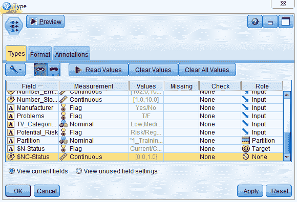
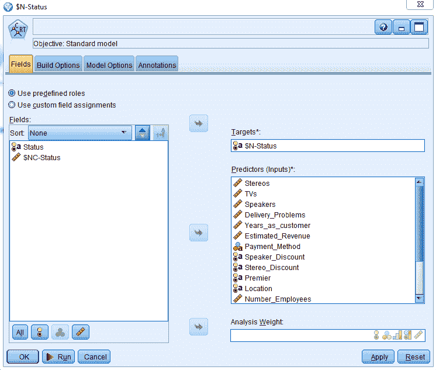

# 理解模型

在本章中，我们将探讨一般模型解释。我们将查看不同类型的预测模型。然后我们将使用各种技术来解释一些机器学习模型。

本章我们将涵盖以下主题：

+   模型的类型

+   使用图表来解释机器学习模型

+   使用统计方法来解释机器学习模型

+   使用决策树来解释机器学习模型

# 模型

有三种不同的预测模型：

+   统计模型

+   决策树模型

+   机器学习模型

# 统计模型

统计模型首先确定模型中最重要的预测因子。统计模型还创建了一个方程，允许您进行预测。例如，正如我们可以在下面的截图中所见，预测方程中的系数已被突出显示：

下面的截图突出了预测当前工资的公式：

在下面的截图中，我们可以看到我们取了变量起始工资的系数，并将其乘以实际起始工资：

现在，我们取教育水平的系数，并将其乘以一个人的教育年限：

我们还需要这个人的**年龄**，这在下面的截图中被突出显示：

我们将所有值与其相应的系数相乘，最后将所有常数相加，从而预测这个人的工资将会是多少。现在这很好。但除此之外，统计模型还允许我们确定每个预测因子单位增加的影响，并且您可以看到这个预测因子对不同的结果变量的影响。

例如，就教育水平而言，我们看到它有一个系数为**298**。这告诉我们，一个人的当前工资会随着这个人额外教育年限的增加而增加 298 美元：

因此，您可以真正看到每个个体独立变量的影响以及它最终如何影响整体预测。

# 决策树模型

正如统计模型一样，决策树模型帮助您确定模型中最重要的预测因子。没有方程，我们无法确定单位增加的影响及其对结果变量的影响。相反，我们将创建规则，通过将数据分割成两个相互排斥的类别来进行预测。

例如，正如您可以在下面的截图中所见，我们有一个变量**Premier**值为**否**的任何人：

如下截图所示，我们有任何三年或三年以下的客户：

我们还有估计收入低于或等于约 400 万的人，如下截图所示：

他们碰巧位于另一个国家，我们预测他们将流失，如下截图所示：

该规则应用于 25 人，该规则的准确率为 100%，如下截图所示。因此，对于所有符合这些标准的客户，我们最终 100%地失去了他们作为客户。

接下来，还有第二个规则，它与第一个规则完全相同。唯一的区别是位置是一个**国家级**客户，你会注意到我们仍在预测将要流失的客户。该规则适用于**47**个人，但该规则的准确率仅为 66%：

现在，乍一看，这些规则可能相当相似，但这就是你必须回去并尝试识别真正发生的事情的地方。

注意，当所有标准都满足，并且我们碰巧有一个国际客户时，我们总是失去他们，但当我们有**国家级**客户时，我们仍然最有可能失去他们，但我们并没有全部失去。你可能想问自己为什么？嗯，也许你可以回到销售代表那里。他们可能会告诉你，他们每季度都会给**国家级**客户打电话，看看他们的情况，而一个电话就成功地保留了一些客户，这样你就不会失去他们。所以，决策树允许你创建不同的规则，这些规则允许你做出预测，然后你可以很好地看到模型的内部运作。

# 机器学习模型

就像统计模型和决策树模型一样，机器学习模型确定模型中最重要的预测因子。

在以下神经网络模型的示例中，我们看到**扬声器**变量是最重要的，其次是**高级**，然后是**电视**：

因此，这些是最重要的预测因子，这就是我们所能得到的一切。我们得不到任何方程或规则。我们甚至不知道关系的方向，例如，我们更有可能保留还是失去购买更多扬声器的客户？我们真的不知道；我们不会从任何机器学习模型中得到这种信息，因为它们都是黑盒子。

因此，在下一节中，我们将看到如何确切地解释机器学习模型的结果。此外，我们还将看到如何使用图表来解释机器学习模型。

# 使用图表来解释机器学习模型

在本节中，我们将了解如何使用图表来解释机器学习模型的结果。具体来说，了解你有什么样的数据非常重要，因为数据类型将决定你可以创建的图表类型。这个图表将帮助你理解机器学习模型的预测中包含了哪些因素。我们还将了解机器学习模型是如何使用这些不同变量进行预测的，并最终将这些预测用于我们的最终解释。

例如，当我们有一个分类变量的结果变量，并且我们的预测变量也是一个分类变量时，我们可以使用条形图或网络图。我们可以使用这两种类型的图表来帮助我们理解机器学习模型是如何进行预测的。以下表格表示数据和图表的组合：

|  | 分类 | 连续 |
| --- | --- | --- |
| 分类 | 条形图/网络图 | 直方图 |
| 连续 | 直方图 | 散点图 |

如前表所示，当我们有一个分类结果变量，但有一个连续的预测变量时，我们可能不得不使用直方图。直方图可以帮助我们直观地理解那些预测背后的情况。

现在我们来看看其他一些可能性。比如说，我们的结果变量实际上是一个连续变量，但我们有一个分类预测变量，所以这里我们可以使用直方图。最后，当我们有一个连续变量的结果变量和一个连续变量的预测变量时，我们可以使用散点图。我们将在接下来的章节中看到相关的例子。

在上一节中，我们构建了一个神经网络模型。让我们看看我们构建的模型：

1.  让我们使用上一章中创建的模型：

1.  将**随机种子**设置为`5000`，然后运行模型

1.  点击新生成的模型，在观察中我们可以看到**Premier**变量是最重要的预测变量，其次是**Years_as_customer**，然后是**Stereos**、**TVs**等等：

现在我们知道了这个模型中最重要的预测变量，但我们不知道这些预测变量是如何被模型使用的。因此，我们将调查它们之间的关系。

有几种方式可以了解模型组件之间的关系。我们可以使用图表或表格。让我们通过几个例子来了解一下：

1.  选择**记录操作**调色板。

1.  将生成的模型连接到**选择**节点。

1.  让我们看看训练数据集的数据。我们将保持测试数据集独立，因为我们将在以后使用这些数据来验证结果。

1.  点击**选择**节点进行编辑。

1.  点击**表达式构建器**：

1.  选择任何变量。例如，选择**分区**变量，选择`=`，以及训练数据集：

1.  这就是表达式将呈现的样子，点击**确定**：

我们只选择了训练数据集中的人员。现在，让我们看看这个模型中实际预测与重要变量之间的关系，以了解这些变量是如何被模型使用的：

1.  前往**图形**调色板，将**选择**节点连接到**分布**节点。**分布**节点基本上是一个柱状图，如下面的截图所示：

1.  编辑**分布**节点。选择**高级**字段：

注意这里只有分类字段可用：

我们选择**高级**变量，因为这是模型中最重要的预测变量，我们将看到这个变量在其预测中的使用情况：

1.  点击叠加按钮：

1.  选择变量**$N-状态**，这是我们实际的预测：

1.  为了使比较更简单，点击通过**颜色**进行归一化：

1.  点击**运行**，你就可以看到这里所做的工作：

注意蓝色与被预测为将要流失的人相关联，红色与被预测为当前客户的人相关联。你还可以看到，我们将**高级**客户与当前客户相关联。那些不是**高级**客户的人我们将其与蓝色相关联，这意味着我们预测他们将流失。

因此，这就是你如何调查分类预测变量和分类结果变量之间的关系。我们可以使用类似柱状图的东西，在这种情况下，在 Modeler 中称为**分布**节点；在其他软件包中可能会称为**柱状图**，但你现在可以看到这两个分类变量之间的关系。让我们使用**网络**节点来查看两个分类变量之间的关系：

1.  下降到**图形**调色板，将**选择**节点连接到**网络**节点：

1.  编辑**网络**节点，你可以将其构建为一个**网络**，这基本上允许我们将许多分类变量放在一起，或者我们可以创建一个**有向网络**，这样那些类别中的所有分类变量都指向一个特定的变量，这正是我们要做的。选择**有向网络**。

1.  点击字段框

1.  添加您的预测，即**$N-Status**变量，添加所有其他分类变量：

1.  以下截图显示了所有选定的标志字段：

1.  添加其他分类字段。选择**Payment_Method**：

1.  按住*Ctrl*键向下滚动并选择**TV_Categories**，然后点击**OK**：

1.  将**线值**设置为**绝对值**，如图所示：

1.  将**线值**设置为**“从”字段/值的百分比**。从这些**预测器**字段中，我们将看到这些值与**结果**字段的关系，然后点击**运行**：

注意，有两条线比其他线略粗：

您可以看到其中一条线值说**Yes**。另一条线值说**No**，它们都与当前和流失字段相关，如下面的输出所示。

让我们看看最粗的**Yes**线：

我们可以看到这一行显示的是，在**Premier**变量上有**Yes**值的人，预测与当前客户相关，然后我们可以看到预测为当前客户的**87%**的人，在**Premier**变量上的值也是**Yes**。

同样，下一条最粗的线将是我们位于**Premier**变量上的那条线。我们有一个**No**的值，这与流失相关，而这个值最终是**80%**：

1.  这是我们查看分类**预测器**和分类**结果**变量之间关系的另一种方式。最强的关系是在**Premier**变量和**结果**变量之间：

1.  让我们看看连续**预测器**和分类**结果**变量之间的关系。要做到这一点，我们将转到**图形**调色板，并将**选择**节点连接到直方图：

1.  编辑**直方图**，在字段框中，选择**TVs**字段。选择**TVs**字段，因为这是模式中最重要的预测因子之一：

1.  在叠加颜色框中，输入预测变量**$N-Status**：

1.  转到**选项**选项卡，点击**按颜色归一化**以使比较更容易，然后点击**运行**：

1.  我们将看到以下结果：

我们可以看到，蓝色与那些我们预测将要失去的客户相关联。红色与那些我们预测将要保留的客户相关联。注意，购买较少**电视**的客户，我们预测大约有 50%的可能性会保留或失去这些客户。基本上，如果我们购买很多**电视**，我们认为我们更有可能失去这些客户。这就是这个变量在模型中被使用的方式，模型描绘的是，如果你不购买很多**电视**，我们保持或失去你作为客户的可能性几乎是相等的，但如果你购买了很多**电视**，我们认为你作为客户的可能性更大。

在这个例子中，我们将查看两个连续变量之间的关系：

让我们使用不同的数据集。引入**变量文件**节点：

1.  编辑此节点并将其链接到数据集。导航到我们的数据集`Bank_Data`的位置，选择文件：

1.  打开数据集。它是一个逗号分隔的文件，如下面的截图所示：

1.  转到**类型**选项卡，点击**读取值**然后选择**确定**。你将看到你的变量：

`salnow`是我们的因变量。因此，确保它是一个目标变量。如果不是，则将其角色更改为目标。将**id**的角色设置为**无**。所有其他变量都将作为当前工资变量的预测变量。点击**确定**

1.  让我们看看我们的结果变量（恰好是一个连续变量）与另一个连续变量（即预测变量）之间的关系。转到**图形**调色板，将源节点连接到**绘图**节点：

**绘图**节点将允许我们创建散点图。所以，让我们编辑**绘图**节点。

1.  在**X 字段**框中，我们将输入我们的预测变量，这里我们将添加教育水平，即一个人拥有的教育年限，在**Y 字段**框中，我们将添加我们的结果变量，即**salnow**，即当前工资：

1.  点击**运行**，我们得到以下图表作为结果：

你可以看到，随着教育年限的增加，当前工资也会增加。我们有一个正的线性关系，这意味着当一个变量增加时，另一个变量也会增加，所以更多的教育最终会导致更高的当前工资，而较少的教育则与较低的当前工资相关。

因此，这是我们表示两个连续变量之间关系的一种方式。在下一节中，我们将看到如何使用统计测试来解释机器学习模型的结果。

# 使用统计来解释机器学习模型

在本节中，我们将使用统计方法来解释机器学习模型的结果。我们讨论了图表以及它们如何使我们能够看到和解释机器学习模型的预测，但我们也可以使用这些图表进行统计检验。看看以下表格：

|  | 分类 | 连续 |
| --- | --- | --- |
| 分类 | 卡方 | 方差分析 |
| 连续 | 方差分析 | 相关系数 |

假设我们有一个分类结果变量和一个分类预测变量，我们可以使用卡方检验。独立性卡方检验将使我们能够查看两个分类变量之间的关系。

此外，如果我们有一个分类结果变量和一个连续预测变量，我们可以使用方差分析来分析方差。如果我们有两个类别进行比较，我们可以使用 t 检验，这将使我们能够解释正在发生的事情。另一方面，如果我们的结果变量是一个连续变量，而我们有一个分类预测变量，我们可以使用方差分析。如果我们想的话，我们也可以使用逻辑回归或判别分析。最后，当我们的两个变量都是连续变量时，我们可以使用相关分析或线性回归。让我们看看一些例子。我们将概述一些这些技术，以便我们可以理解机器学习模型内部的工作原理。

让我们看看一些表格如何帮助我们澄清变量之间的关系，以及这些不同的预测变量是如何被模型使用的。

前往**输出**调色板，将选择节点连接到矩阵节点：

**矩阵**节点将允许我们进行卡方检验，这将帮助我们查看两个分类变量之间的关系。在这种情况下，我们将查看分类预测变量和分类结果变量之间的关系。让我们编辑**矩阵**节点。在**行**字段中，我们将输入我们的预测，即**$N-Status**变量，在**列**字段中，我们将选择模型中的重要预测变量，即**高级**变量：

前往**外观**选项卡，选择列百分比，这意味着我们将得到列百分比，然后点击运行：

我们将得到以下结果：

我们实际上有一个具有统计学意义的**卡方**检验，因此**高级**是模型中的一个重要预测变量。

我们还得到了一些数值信息，这些信息支持我们在之前的图表中看到的内容。我们可以看到，大约**80%**的人，即与**流失**相关的非高级客户，以及大约**87%**的**高级**客户与**当前**客户相关。

这就是模型所做的工作。现在，我们理解了模型中至少有一个变量是如何被使用的。

# 理解连续预测变量与分类结果变量之间的关系

在本节中，我们将查看连续预测变量与分类结果变量之间的关系。为了做到这一点，我们可以运行 t 检验或方差分析，在 Modeler 中也称为**均值**节点：

1.  将**选择**节点从输出调色板连接到**均值**节点：

1.  编辑**均值**节点。在**分组字段**框中，输入预测值，即**$N-Status**变量：

在**测试字段**框中，选择所有连续变量。同时，取消选择实际的置信度：

1.  点击**确定**然后点击**运行**。您将得到以下输出：

我们可以看到，大多数变量最终区分了流失预测和当前客户预测。有一些预测变量并不重要。例如，估计收入在统计上并不显著，员工数量也是如此，但其余的预测变量都非常重要。

现在，我们看到了**均值**。但是，让我们尝试获取更多信息。我们将**视图**从**简单**改为**高级**，我们将得到以下结果：

如您所见，每个这些变量都有相同数量的案例。最重要的预测变量最终变成了**电视**变量，正如我们在以下屏幕截图中所见，这是能够最大程度地区分这些组的一个变量。

例如，看看**电视**字段，我们可以看到，当前客户是我们预测会流失的客户，我们认为我们会失去这些客户，平均购买了 2.4**电视**。这个预测显著高于那些预测会继续作为当前客户的人，他们平均只购买了一台电视。正如我们所见，我们得到了一个具有统计显著性的结果。当涉及到**立体声音响**时，情况相反。您可以看到，我们得到了一个具有统计显著性的结果，然而您可以看到，我们预测会失去的客户平均购买了**13.2**台立体声音响，而那些我们预测会继续作为客户的人平均购买了**16.2**台立体声音响。

我们将要做的最后一件事是查看两个连续变量之间的关系。之前，我们使用散点图来展示两个连续变量之间的关系。在这里，我们将通过计算相关系数来量化这一点：

1.  使用银行数据集，在 Modeler 的**输出**调色板中，将**统计**节点连接到源节点：

1.  编辑**统计**节点，这允许我们在检查框中获取汇总统计信息。点击字段选项并选择当前薪资：

1.  点击**确定**并将当前薪资与其他连续变量进行相关性分析。点击相关性框旁边的箭头并选择尺子图标，这将选择我们所有的连续变量：

1.  按住**Ctrl**键并取消选择**id**：

1.  点击**确定**然后点击**运行**。您将看到以下结果：

如我们所见，当前薪资与起薪的相关性非常高：

记住，相关性值可以从-1 到+1 不等。数值离零越远，关系越强。如果相关性系数为正，这意味着一个变量的值增加时，另一个变量的值也增加。如果相关性系数为负，这意味着一个变量的值增加时，另一个变量的值减少。

注意到起薪和当前薪资之间的相关性非常高，几乎达到 0.9。您还可以看到教育法与当前薪资之间的相关性也很高，达到 0.66。

另一方面，您可以看到，某人在这个特定职位上工作的时间和之前就业的月数与当前薪资的相关性并不大。注意，相关性值实际上非常接近零。

这为我们提供了关于关系的类型的信息，并允许我们量化这些关系。在下一节中，我们将看到如何使用决策树来解释机器学习模型的结果。

# 使用决策树来解释机器学习模型

在本节中，我们将从机器学习模型中提取预测结果，并使用这些预测结果作为我们的结果变量。然后我们将使用原始预测变量来了解发生了什么，即机器学习模型的逻辑。

此前，我们看到了如何使用不同的图表和表格来了解仅一个变量、一个预测变量与结果变量之间的关系，这些信息是有用且重要的。但通常，模型会同时使用许多变量。因此，查看一个预测变量是有用的，但它并不能完全展示出完整的画面。

另一种技术是使用决策树模型来帮助我们理解神经网络模型或任何类型的机器学习模型背后的逻辑。

在这里，我们将从模型中获取预测，并使用该预测作为我们的结果变量。然后，我们将从模型使用的预测因子开始：

1.  前往**字段操作**调色板，并将生成的模型连接到**类型**节点：

1.  编辑**类型**节点，并更改**状态**变量的原始结果的角色。由于我们将将其角色更改为**无**，因此它将不再被包括在我们将要构建的模型中：

1.  稍微向下滚动一点。在这里，**$N-状态**预测不再是仅仅是一个预测或输入；实际上，它将成为**目标**本身。这正是我们要预测的：

在这里，我们试图了解神经网络模型（或任何类型的机器学习模型）的内部。查看模型的预测，并使用它所使用的变量来尝试理解其逻辑。

1.  从那个预测中移除置信值，因为它不是必需的。将其角色更改为**无**并点击**确定**：

在这一点上，我们必须使用另一个模型来了解机器学习模型预测期间发生了什么。我们可以使用统计模型。但是，统计模型对数据的许多要求和假设很多。此外，它们不能很好地处理复杂的交互和非线性关系。

在尝试复制神经网络模型所做的工作方面，决策树模型可能会做得最好：

1.  前往**建模**调色板，选择决策树模型来了解**神经网络**模型背后的情况。将**类型**节点连接到**C&R**树模型：

我们将预测**神经网络**模型的预测。

1.  当你编辑该模型时，你将使用**神经网络**模型最初使用的所有预测因子来理解这些预测背后的情况：

1.  点击**运行**，查看生成的模型：

1.  我们将得到以下结果：

注意，**C&R**模型也认为**总理**变量是模型中最重要的预测因子。**C&R**模型有很多与神经网络模型相同的预测因子，这些预测因子是最重要的。这很重要，因为我们想确保我们理解神经网络模型（或任何机器学习模型）的逻辑。

1.  点击**全部**按钮。

1.  点击**%**按钮，我们可以看到这些预测背后的某些数字：

我们对预测我们的结果变量**状态**不感兴趣。相反，我们试图理解神经网络模型预测背后的推理。

在这里，你可以看到我们正在使用多个变量。看看前面的截图。第一条规则说，如果变量是**高级会员**，你的值为**否**，并且你作为我们的客户不到四年半，你购买的电视数量不超过一台半，你购买的扬声器数量不超过十点五台，我们预测你将失去作为我们的客户。这条规则适用于 41 人，该规则的置信度约为 81%。另一方面，如果所有相同的标准都适用，即你仍然是非高级会员客户，你作为客户的时间不长，你购买的电视数量很少，但你购买了超过 10.5 台的扬声器，我们预测你将是一个当前客户。这条规则适用于 127 人，该规则的置信度是 88%。

现在，我们试图理解神经网络模型可能正在执行的逻辑。这并不完全等同于神经网络模型所做的那样，因为神经网络模型和决策树模型的算法非常不同。我们只是试图理解神经网络模型背后的逻辑。在这种情况下，我们有一整套标准，最终使我们能够同时使用或查看多个变量之间的关系以及它们如何影响预测。这仅仅是你可以用来尝试理解机器学习模型预测背后发生的事情的另一个工具。

# 摘要

在本章中，我们首先探讨了不同类型的预测模型。然后我们使用这些模型来解释机器学习模型。

在下一章中，我们将探讨我们可以用来改进单个模型的不同方法。
