# 第四章：提升个体模型

在本章中，我们将看到如何提升不同的模型，以及如何修改模型选项。我们还将学习如何使用不同的模型，并了解如何通过移除对预测并非真正必要的预测变量来去除噪声。您还将了解如何为模型准备额外的数据，我们将看到如何添加额外的字段。最后，您将看到过采样和欠采样结果变量的不同类别如何使您最终使用的模型更有可能真正理解数据。

本章将涵盖以下主题，以及模型可以如何被提升：

+   修改模型选项

+   使用不同的模型

+   去除噪声

+   进行额外的数据准备

+   平衡数据（过采样/欠采样）

# 修改模型选项

通过修改模型选项来改进模型是提升模型的一种直接方法。我们将通过一个例子来展示如何做到这一点：

1.  我们将创建一个与第二章中相同的 SVM 模型：

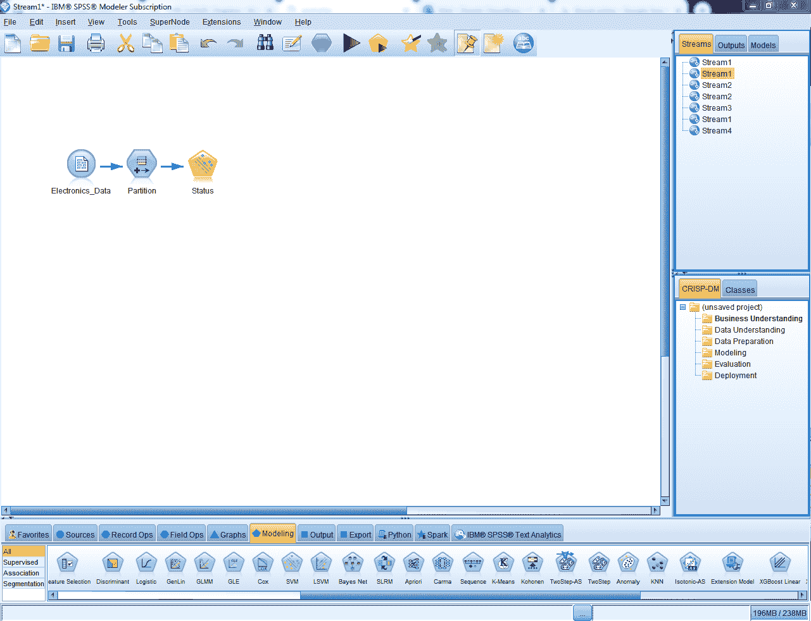

1.  点击状态，转到专家选项卡，并在模式下选择专家。正如我们在第二章“机器学习入门”中看到的，当我们使用 SVM 模型时，我们需要修改它们的设置。将正则化参数更改为 5。然后，在核类型中选择多项式。然后，点击运行。

1.  您将看到一个模型被创建。现在，让我们进行下一步，分析模型。将您的生成模型连接到输出调色板中的分析节点。打开分析节点，选择巧合矩阵（对于符号目标选项）并点击运行。这将是我们获得的结果：

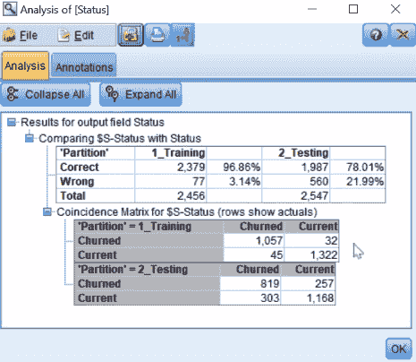

结果清楚地显示，模型并不一致，因为训练集和测试集的准确率百分比之间存在巨大差异。但我们看到的是，测试百分比比我们在第二章“机器学习入门”中获得的线性模型的测试百分比要好，大约为 73%。因此，也许多项式模型可以做得更好，但不是当前的模型，因为它正在利用机会。

现在我们有一个可能更好的模型，我们可以继续修改这个模型的设置。您可以转到 SVM 模型状态，在专家选项卡中，您可以看到度数设置为 3。有可能这个三次函数对于我们拥有的数据来说可能有点复杂。让我们改用一个二次函数。将度数更改为 2 并点击运行。

再次，像我们以前做的那样运行分析，您将找到以下结果：

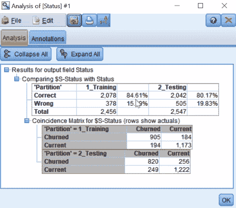

如您所见，两个数据集的准确率百分比之间的差异在 5%以内。因此，我们可以说该模型是一致的。此外，我们还可以看到测试数据集的整体准确率有所提高。

这就是我们通过修改其选项来改进现有模型，以提供具有更高整体准确率和一致性的更好结果的方式。

# 使用不同的模型来提高结果

在上一节中，我们看到了如何通过修改其选项来改进从模型中获得的结果。现在，我们将看到如何通过更改模型本身来提高结果。

每个模型看待数据的方式都不同。它们有自己的算法。这些算法为我们提供了不同的视角来观察数据。有时，仅仅改变观察数据的方式就能给我们带来更好的结果。不同的算法利用数据的独特方面。让我们通过一个例子看看我们如何做到这一点：

1.  带上您的数据，将其分为训练集和测试集。

1.  将“分区”节点连接到建模调色板中的“神经网络”节点：

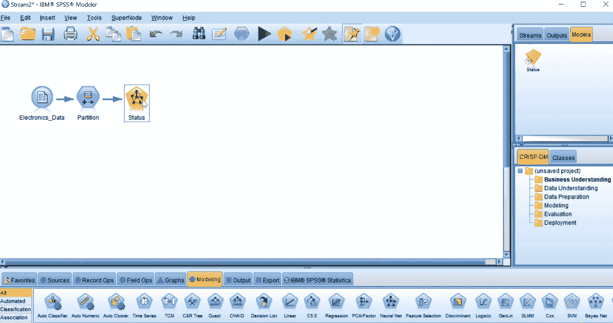

1.  点击“神经网络”节点，然后转到“构建选项”标签页。在这里，转到“高级”选项，只需将随机种子更改为`5000`：

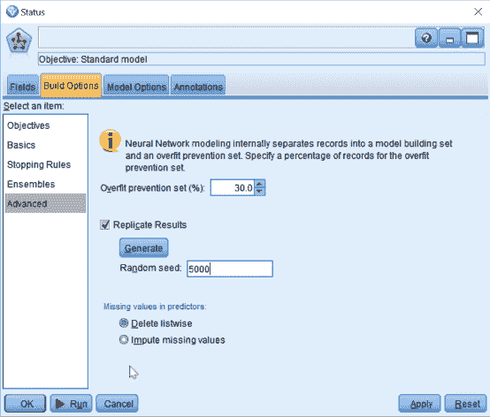

1.  我们保持随机种子为`5000`的原因是，我们使用`5000`作为种子获得了更好的结果，正如您可能从第二章，“机器学习入门”，中回忆的那样，我们在其中演示了一个神经网络。

1.  点击“运行”。

1.  再次，您将不得不分析构建的模型。为此，回想一下我们迄今为止所遵循的步骤。转到输出调色板，将生成的模型节点连接到“分析”节点。使用勾选的巧合矩阵运行“分析”节点。以下将是获得的结果：

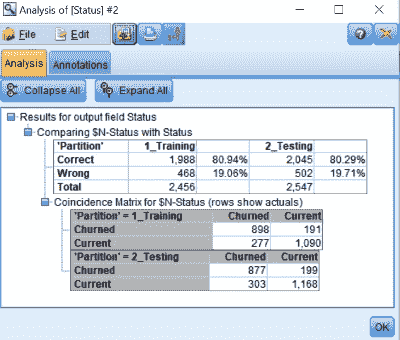

1.  您可以看到，我们的整体准确率约为 80%，以及每个预测的表现。整体准确率与我们使用 SVM 模型时达到的准确率相似。因此，我们可以说 SVM 和神经网络模型在这个数据集上表现同样出色。让我们看看我们如何进一步提高这些结果。

1.  在这个例子中，我们将使用决策树。为了添加决策树节点，选择“分区”节点，并将其从建模调色板中的 C5.0 节点连接：

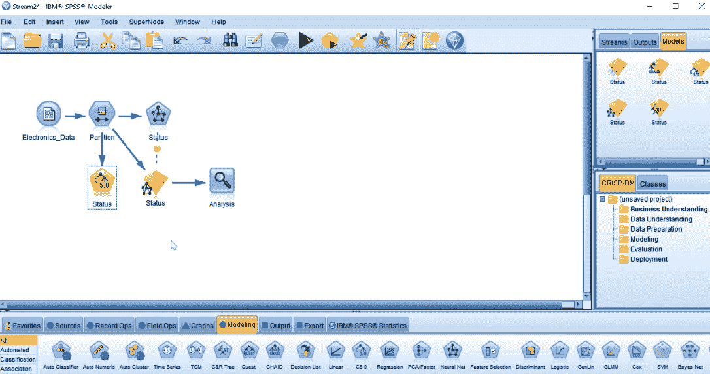

C5.0 模型是一个决策树模型，它从非常不同的角度观察数据。

1.  点击 C5.0 模型节点以构建**C5.0**模型并运行它：

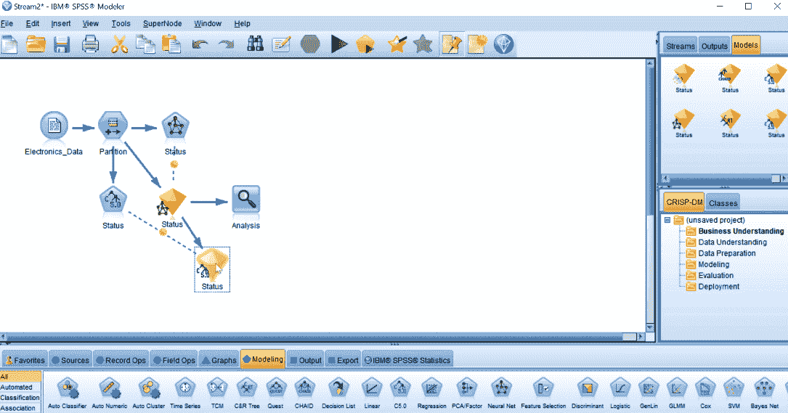

1.  现在，将 C5.0 模型节点连接到神经网络生成的模型节点。

1.  将 C5.0 生成的模型连接到“分析”节点：

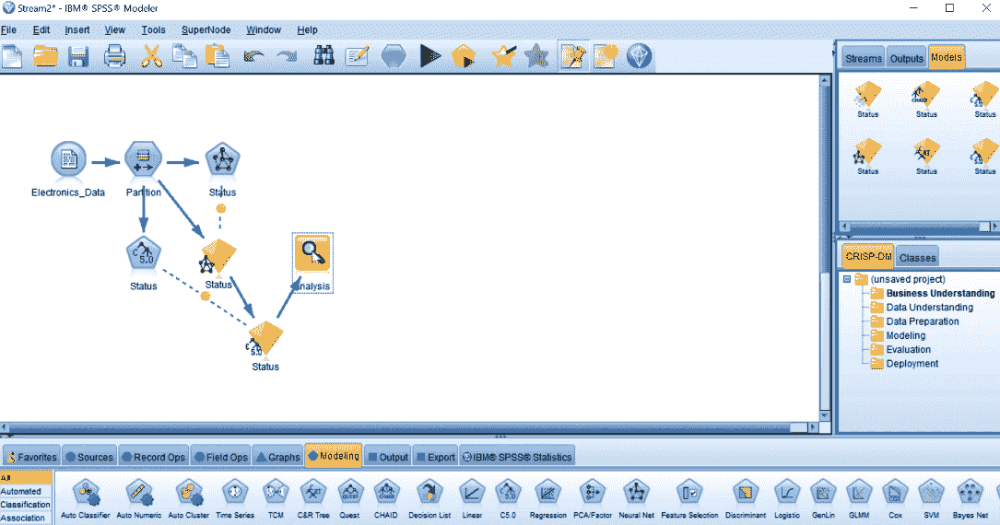

这将使我们能够非常容易地比较结果。

1.  运行分析节点。以下将是获得的结果：

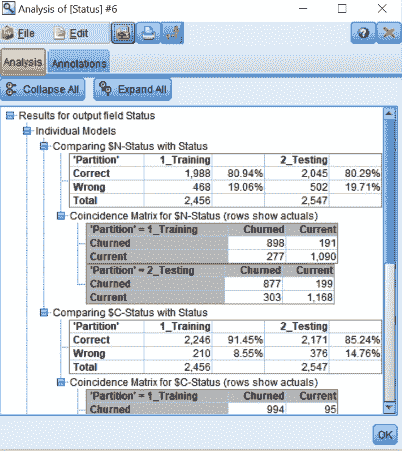

如您所见，使用 C5.0 模型对测试数据集的整体准确率为 85%。这比我们仅使用神经网络模型获得的结果要好得多。我们当然可以通过对 C5.0 模型进行一些修改来进一步提高这一点，我将把它留作您的家庭作业练习。

因此，我们看到了 C5.0 模型略微提高了结果，并在总体准确性和对训练集和测试集的每个预测方面都做得很好。这只是另一种提高模型性能的方法的例子。我们现在将看到去除数据中的噪声如何给我们带来更好的结果。

# 去除噪声以改进模型

让我们关注噪声如何影响结果。噪声不过是缺失数据、异常值或试图用不必要的预测来混淆模型的过多预测因子。

决策树模型由于默认情况下会消除它们不用于预测的预测因子，因此不会因为预测因子太多而产生噪声，这与其他统计和机器学习模型不同。

模型中过多的预测因子会导致以下问题：

+   数据中的额外噪声会影响模型的总体准确性

+   模型变得比应有的复杂得多

+   如果要添加新的数据以进行新的预测，我们需要收集那些不重要且实际上并不需要用于预测的变量的数据，因为我们的模型在某种程度上会使用它们。

如果这些类型的预测因子从模型中清除并消除，这可能会简化模型的理解，并且可能还会给出更好的结果。

# 如何去除噪声

让我们通过一个例子来理解。按照以下步骤操作：

1.  将您的数据划分为训练集和测试集。

1.  将您的分区节点连接到建模面板中的神经网络模型。

1.  选择模型，就像我们一直做的那样，转到“构建选项”选项卡，然后转到“高级选项”，将随机种子更改为`5000`（因为到目前为止这已经给出了最佳结果）。点击运行。

1.  我们之前已经看到过这个模型的准确性。请参考我们在第二章“机器学习入门”中演示神经网络时获取并存储在表中的不同随机种子前 10 个预测因子列表：

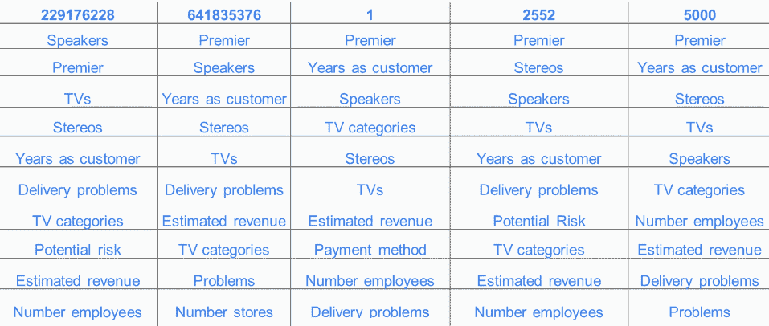

我们现在将去除那些在任何模型中都没有出现或只出现几次的变量。

1.  为了去除变量，我们将创建这个神经网络模型的另一个版本。将分区节点连接到建模面板中的另一个神经网络模型：

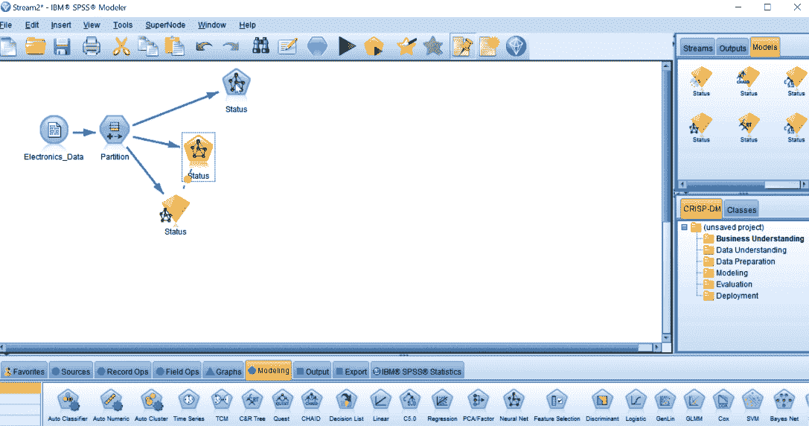

1.  编辑新的神经网络模型：在这里，在字段选项卡中，我们将移除任何模型中未出现在前 10 位列表中的预测因子：

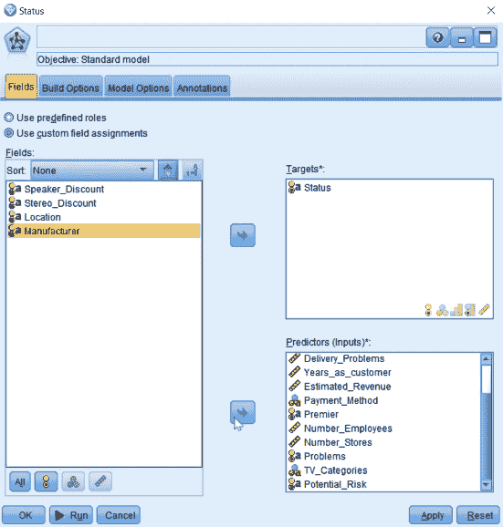

您只需从输入列表中选择预测因子，然后点击指向左侧框的箭头。如果需要，您也可以使用相同的方法恢复它们。这些是未出现在任何模型前 10 位列表中的变量。

1.  我们还将移除在列表中只出现一次或两次的变量：

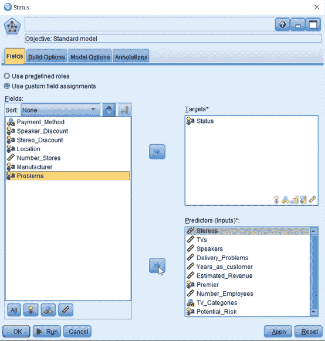

1.  前往构建选项选项卡的高级选项，并将随机种子更改为`5000`。然后点击运行。

1.  将第一个神经网络模型连接到第二个神经网络模型：

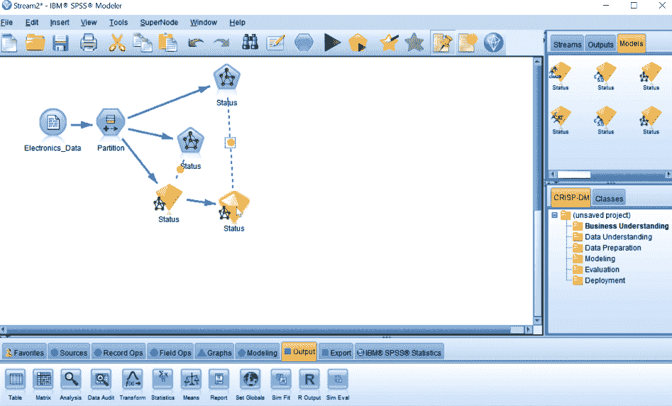

1.  将第二个神经网络模型连接到输出调色板中的分析节点：

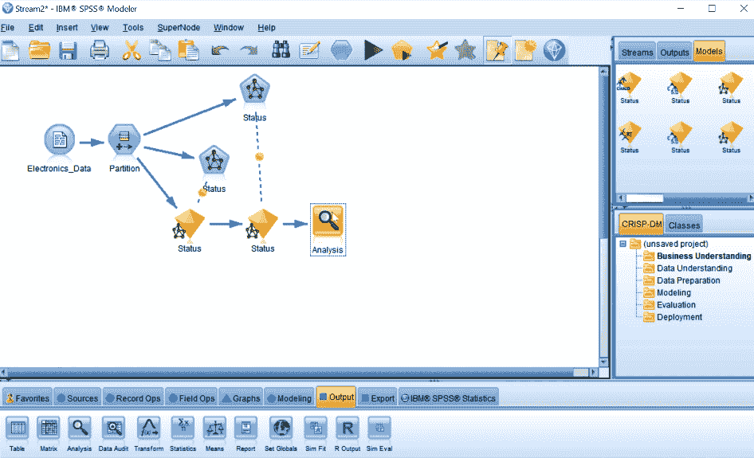

1.  运行分析节点，就像我们一直做的那样。以下将是两个模型的比较分析：

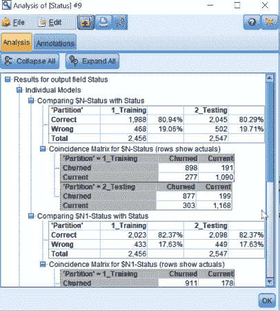

如您所见，第二个模型的测试和训练数据集的整体准确率略高于第一个模型。因此，我们仅通过去除一些不必要的预测因子就提高了 2%的可预测性。如果我们看到模型在预测每个单独类别的工作，去除噪声的模型在这方面也做得很好。

因此，我们探索了另一种提高模型获取结果的方法。我们看到了如何通过去除噪声，通过消除不必要的变量或预测因子来减少变量的数量，可以给我们带来更好的结果。让我们继续看看另一种提高准确性的方法。我们将看到如何准备数据在一定程度上可以给我们带来更好的结果。

# 进行额外的数据准备

在本节中，我们将看到对数据进行额外准备如何使我们能够提取额外的信息。

到目前为止，我们通过修改选项、使用不同的模型、改变观察数据的角度以及去除噪声来改进我们的模型。然而，有时这些技术只会略微提高模型；但如果你能回到数据准备阶段，寻找可以从数据中提取的额外信息，这真的可以在提高准确性方面走得很远。

# 准备数据

按照以下步骤在数据准备阶段准备数据：

1.  获取您的数据并将其分区。

1.  再次运行神经网络模型，随机种子为`5000`。我们将得到大约 80%的准确率。

1.  现在，我们将创建一个新的模型并添加一个额外的预测因子。如果你回到前十个预测因子列表，我们会发现像客户购买的演讲者和电视机的数量这样的预测因子。因此，有一个显示购买项目总数的预测因子是有意义的。

1.  前往字段操作调色板，并将分区节点连接到导出节点：

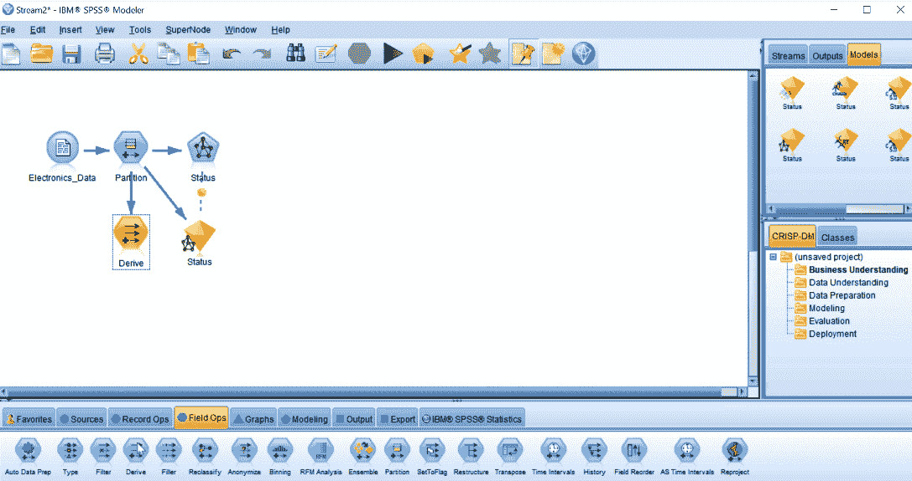

导出节点允许我们创建额外的变量。

1.  编辑导出节点。将导出字段设置为“总项目”，然后点击公式字段右侧的表达式构建器按钮，通过选择感兴趣的预测因子并点击加号按钮来创建一个表达式：

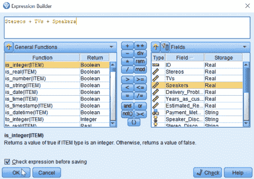

这意味着“总项目”包括立体声、电视和扬声器。你将在公式字段中得到一个表达式，如下所示：

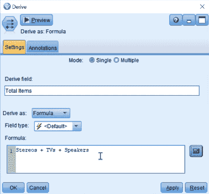

这是用于“总项目”的表达式。点击确定。

1.  我们刚刚创建的变量需要实例化，以便模型能够使用它；为此，从字段操作调色板将总项目节点连接到类型节点：

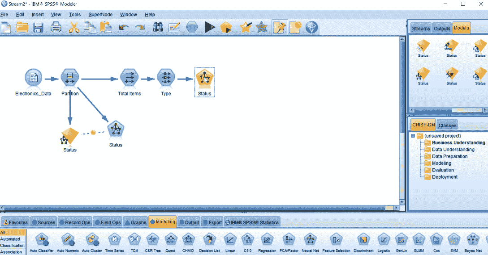

1.  编辑类型节点。点击读取值按钮来读取新变量：

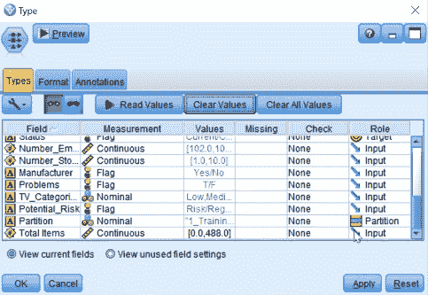

如你所见，“总项目”预测因子现在已被读取，并且它将被计为模型中的输入预测因子。点击确定。

1.  将类型节点连接到建模调色板中的神经网络模型：

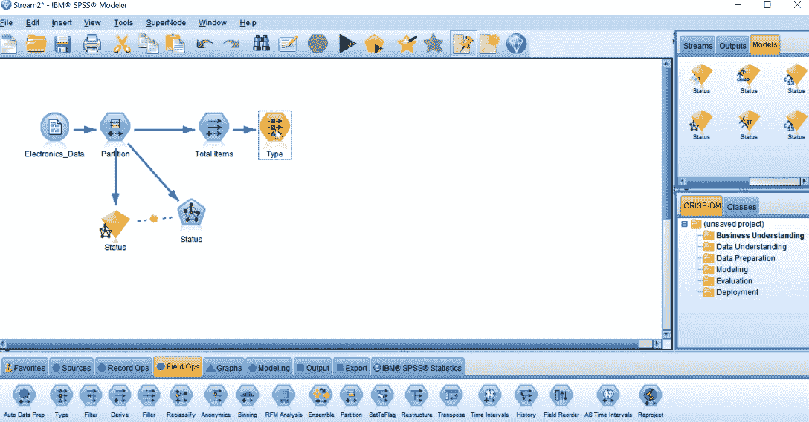

1.  将随机种子设置为`5000`运行神经网络模型。

1.  通过点击新生成的模型查看模型结果。你可以看到“总项目”已经在预测重要性中的前十个预测因子中占有一席之地：

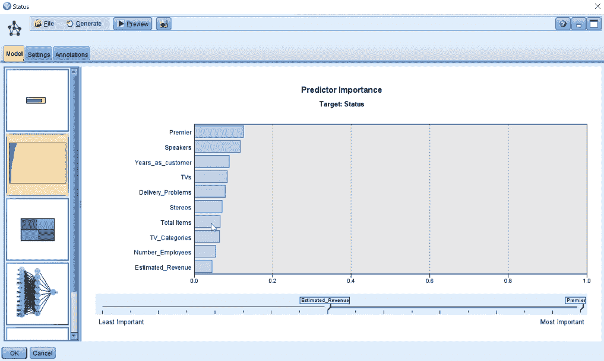

关闭窗口。

1.  我们现在将第一个生成的模型连接到第二个模型：

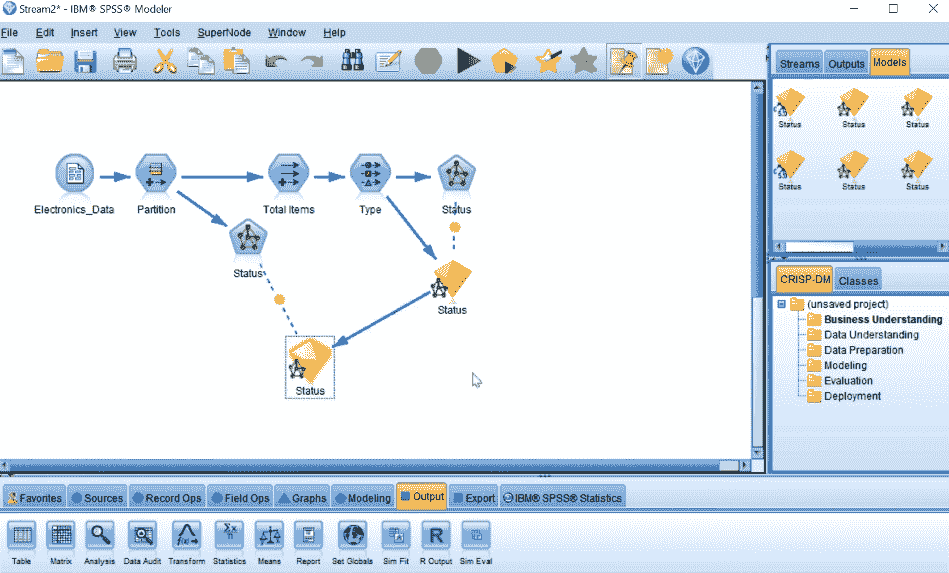

1.  向第一个神经网络模型添加一个分析节点：

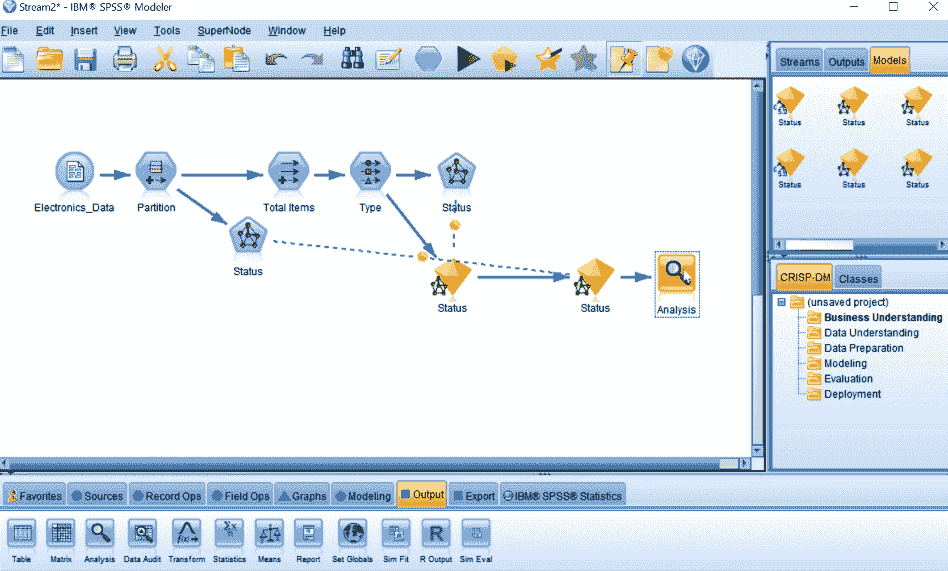

1.  如往常一样运行分析节点。你应该得到以下结果：

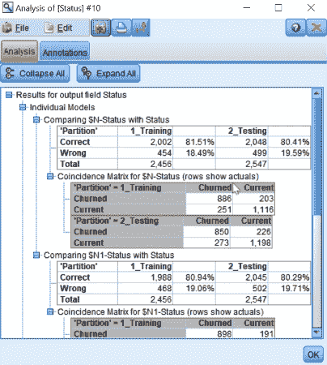

注意，我们得到的准确性略有提高。我们只是向现有模型添加了一个变量。因此，我们可以了解在运行模型之前对数据进行额外准备时，我们的结果会受到怎样的影响。

说到“总项目”如何帮助模型，你可以看到它在预测当前客户方面所做的工作。实际上，我们在预测当前客户字段方面做得更好。因此，这表明我们选择添加的新变量不一定能提高整体模型的准确性，但肯定可以提高一个或多个预测类别的准确性。你可以决定哪个类别对你的要求更重要，并相应地选择一个新变量。我们现在将转向查看采样如何帮助我们提供更好的结果。

# 平衡数据

在本节中，我们将看到如何通过过采样或欠采样结果变量的不同方面来提高我们的准确率。我们将更改我们的数据集来查看这一点。请参阅本书 GitHub 链接提供的“贷款”数据集。

# 平衡数据的需求

为了演示这一点，我们将使用不同的数据集。在画布上选择“变量文件”节点。通过点击文件字段旁边的三个点导航到文件所在位置。然后选择“贷款”数据集：

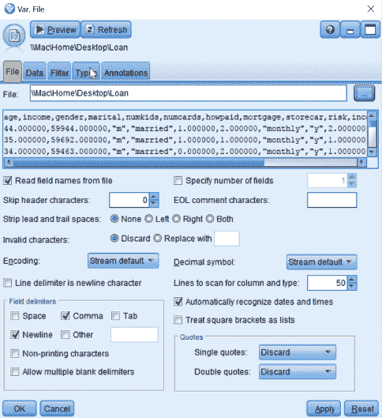

前往“类型”选项卡，将贷款预测变量的角色更改为目标。这是我们将会预测的变量：

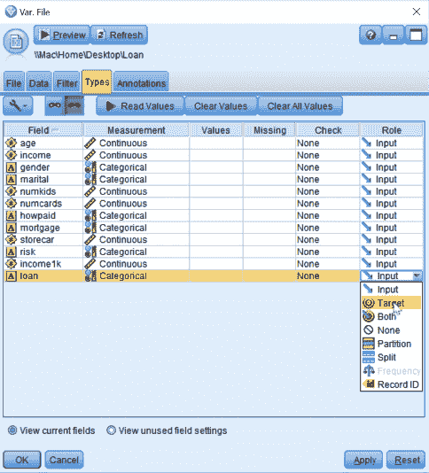

点击读取值。然后，点击确定。在这个例子中，我们正在预测人们是否有贷款。

让我们看看我们的贷款变量的分布；前往图形调色板，并将我们的源节点“贷款”连接到分布节点：

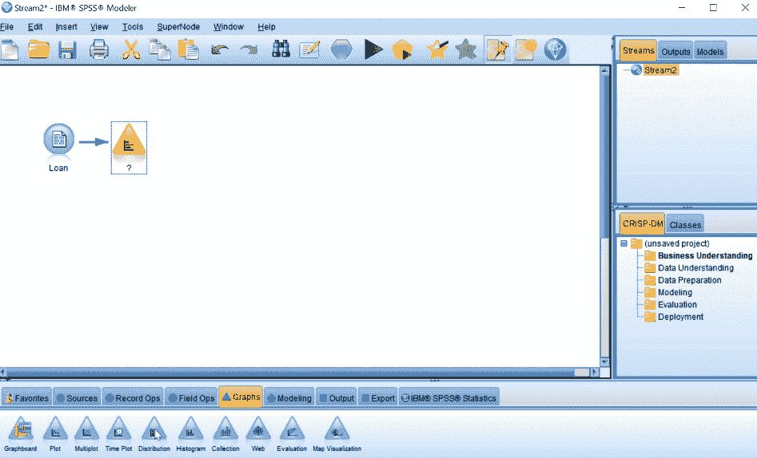

点击分布节点。然后点击字段框旁边的箭头以选择我们的预测变量，我们需要查看其分布，在我们的例子中，是贷款：

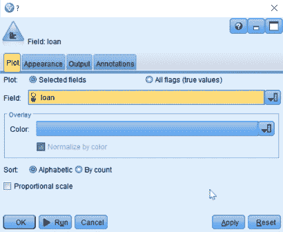

然后，点击运行。你会看到以下分布：

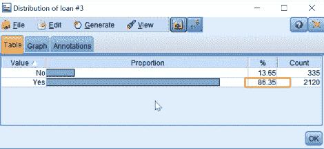

注意，在这个数据集中，86%的人有贷款，而 13%的人没有贷款。在这种情况下，预测没有贷款的人群可能有点困难，因为分布非常不均匀。因此，在这种情况下，我们需要平衡数据。这意味着使每个组的类别大小在某种程度上更加相似。这种数据平衡也被称为过采样或欠采样。

让我们用一个更极端的例子来说明。假设我们正在尝试预测欺诈，并且数据集的分布是 99%的情况是完全合法的，只有 1%的情况是欺诈的。现在，如果我们用这种类型的分布构建模型，通常会发生的情况是模型会预测所有案例都不是欺诈的。这种模型的总体准确率将是 99%，因为 99%的时候它是正确的，但我们真正关心的是预测那些少数欺诈案例。如果我们总是预测我们有好的案例，那么你知道模型本身并不是特别有用，尽管它的总体准确率是 99%。因此，有时模型的总体准确率并不是那么有用。我们真正更关心的是预测每个单个类别的准确率。

在像欺诈检测这样的情况下，如果一组过度代表，或者技术上另一组，即较小的组，代表性不足，模型实际上并没有学习到较小组中存在的模式或特征，这就是为什么我们有时需要过采样或欠采样。

让我们回到我们的例子，并尝试看看我们能用它做什么。

# 实现数据平衡

让我们首先构建一个模型来预测贷款，看看我们发现了什么：

1.  前往字段操作调色板，并将贷款节点连接到分区节点。

1.  将神经网络模型从建模调色板连接到分区节点，并使用默认设置运行神经网络模型：

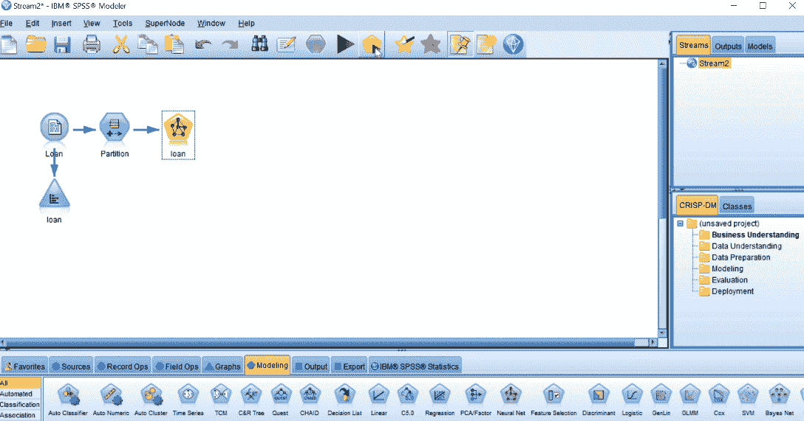

1.  前往输出调色板，并将新生成的节点连接到分析节点。运行分析节点，并勾选巧合矩阵，你将得到以下结果：

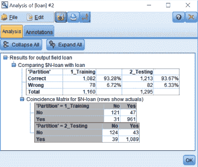

如您所见，模型的总体准确率约为 93%，模型相当一致。让我们看看模型对每个类别的预测效果如何。我们当然预测了“是”组得很好。然而，我们在“否”组上做得并不好。我们可以尝试改进我们预测“否”组的方式。

获得的结果使我们达到一个阶段，我们将不得不对**否**组进行过采样。或者对**是**组进行欠采样。

对于过采样，我们首先需要将数据集划分为训练集和测试集。在这里要记住的一件事是，当我们对数据集进行过采样时，我们不需要在训练集和测试集上都有相同数量的过采样。实际上，我们需要的是在原始分布上评估测试集，因为过采样我们可能会在训练集上表现良好，但在测试集上表现不佳。为了避免这种情况，我们首先必须分离我们的数据。因此，我们首先对训练集数据进行过采样，然后在上面构建模型，最后将其应用于测试集：

1.  前往记录操作调色板，并将分区节点连接到选择节点：

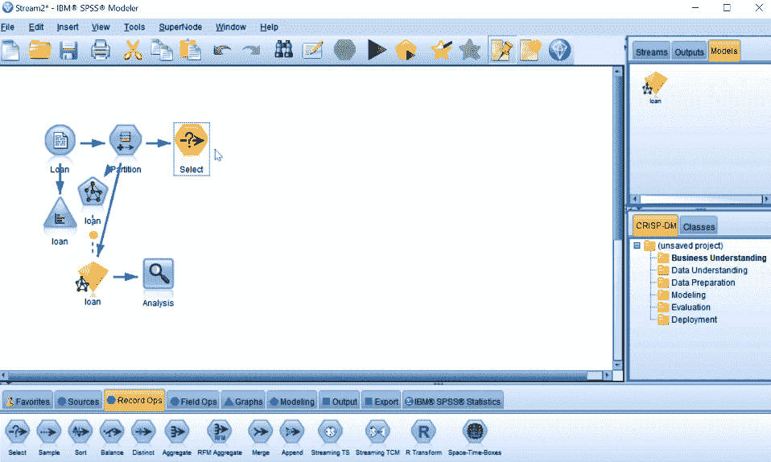

1.  选择选择节点。在这里，我们将只选择训练数据集中的人。我们将执行我们的数据处理，然后对数据进行过采样或欠采样，并得到结果。为此，点击表达式构建器。然后，选择分区变量：

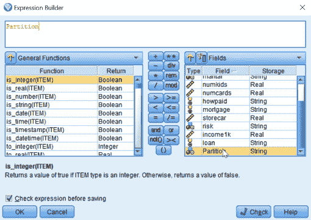

点击等号，然后点击字段值按钮：

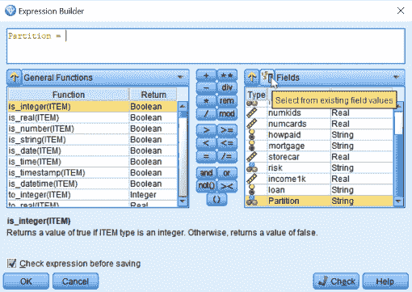

然后，选择训练数据集并点击确定：

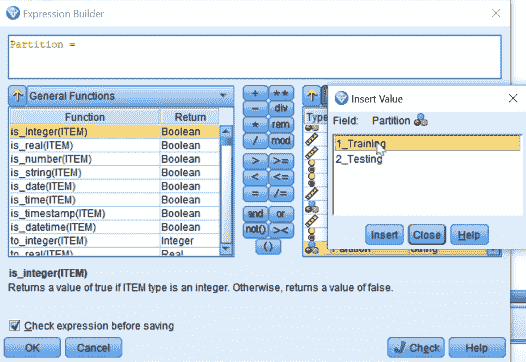

将会打开一个对话框。也在那里点击确定。

1.  将另一个选择节点连接到现有的选择节点：

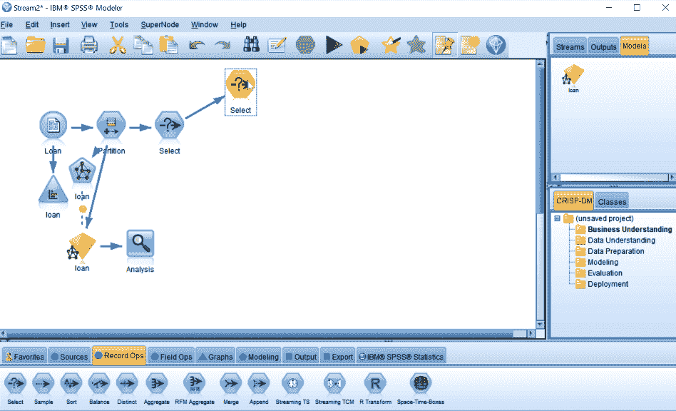

在这个选择节点中，我们将保留值为“否”的人；为此，前往表达式构建器并选择贷款变量，点击等号，然后点击字段值按钮并选择“否”：

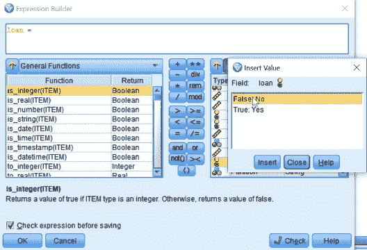

1.  我们将添加另一个与第一个选择节点连接的选择节点：

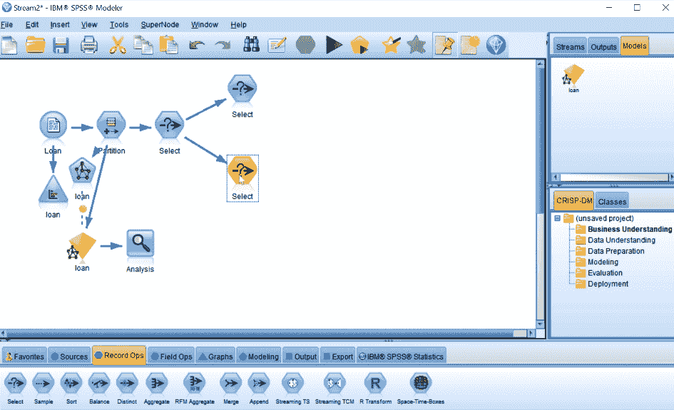

点击表达式构建器。选择 loan 变量，并点击等号。点击字段值按钮并选择 Yes 值。点击 OK。因此，现在我们已选择了所有有贷款的人。这是一个较大的群体，代表性过高。这使我们处于只选择数据集三分之一的状态。

1.  转到 Record Ops 调色板，将 Sample 节点连接到 Yes 组的 Select 节点：

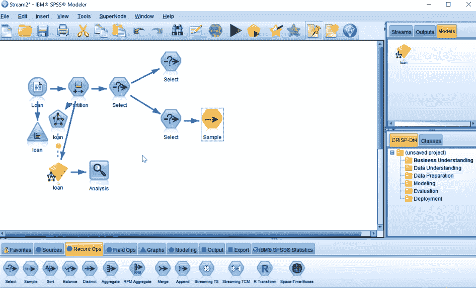

1.  编辑 Sample 节点。选择 Random%以随机选择值，并将值设置为 33%。同时检查可重复分区分配。这将允许我们在为该选择创建模型时每次都选择相同的人。点击 OK：

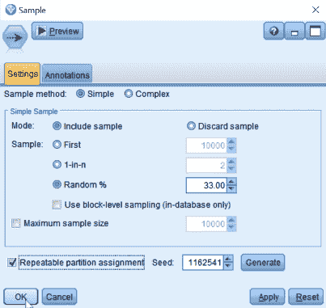

1.  我们必须将这份数据合并并重新整合在一起。为此，将所有人员设置为“否”的 Select 节点连接到 Append 节点。然后右键单击 Sample 节点，选择 connect 将其连接到 Append 节点：

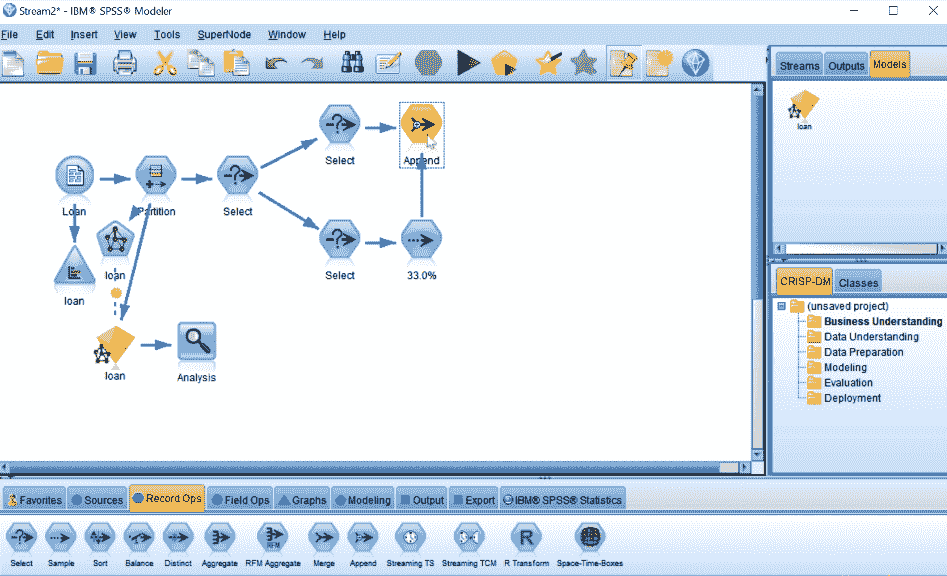

1.  点击 Append 节点，选择 All datasets，然后点击 OK：

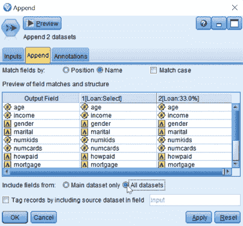

1.  现在检查采样后 Loan 字段的分布情况。为此，转到 Graphs 调色板，将 Append 节点连接到 Distribution 节点：

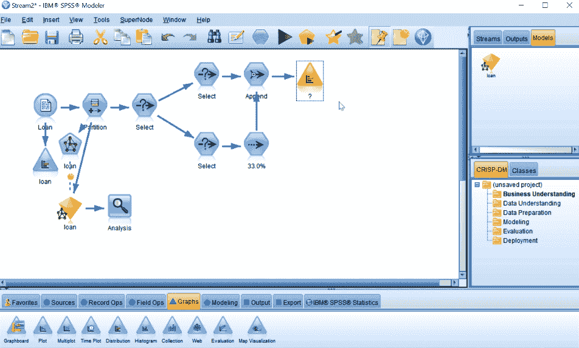

1.  点击 Distribution 节点，转到 Field 框，并选择 loan，就像我们之前做的那样。然后点击 Run。以下是采样后我们获得分布：

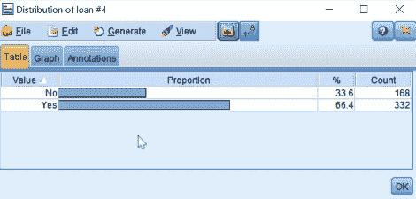

您可以看到 No 组大约占样本的三分之一。

因此，通过下采样 Yes 节点，我们能够看到从 13%的差异。

让我们看看过采样：

1.  现在，将 Append 节点从 Field Ops 调色板连接到 Type 节点。在这里，我们不会使用分区字段。因此，转到 Types 节点，将 Partition 的角色更改为 None。

1.  我们将通过转到建模调色板再次构建我们的模型。将 Type 节点连接到神经网络模型，并在默认设置上运行此配置。

1.  现在，将您生成的第一个模型连接到新生成的模型，并将它们都连接到 Analysis 节点。让我们看看结果：

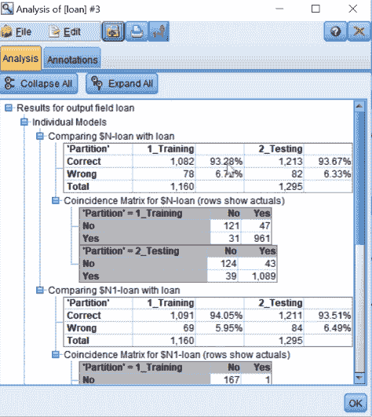

现在，您可以看到我们预测 No 组的效果如何！我们的模型在预测各个模型的准确性方面表现相当不错。因此，我们最终平衡了数据，显然这是以 yes 组中的错误为代价的。但 No 组是我们关注的重点，因为它代表性不足。

# 摘要

本章教我们如何修改可用于增强模型的各个选项。我们还学习了如何添加额外的字段并从这些模型中去除噪声。最后，我们对可用数据进行采样，这有助于我们更好地理解模型。

在下一章，我们将学习如何结合模型并进一步提升它们。
