# 第五章：提高模型的高级方法

首先，我们学习了如何构建模型，然后对其进行了诊断分析。接着，我们确定了模型的准确性，在本章中，我们将扩展我们的模型构建技能。我们将学习如何不将模型视为终点，而是将其视为向前推进以改进模型的起点。基本上，我们将学习如何通过构建多个模型来提高单个模型的性能。我们有几种方法可以实现这一点，我们将在详细讨论它们。

本章将涵盖以下主题。这些也是我们可以提高单个模型的方法：

+   模型合并

+   倾向得分

+   元级建模

+   错误建模

+   提升和袋装

+   连续结果

# 模型合并

模型可以通过多种方式结合。在本节中，我们将逐一探讨每种方法。

# 通过投票合并

让我们用一个例子来理解这种模型合并的方法。

假设我们已经运行了三个模型并创建了一个如下所示的表格：

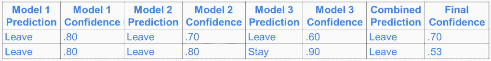

我们有每个模型的置信度和其预测。让我们看看我们如何合并这些模型。

如果我们查看第一行，我们可以看到这些模型中的每一个都预测一个人将要离开。因此，如果我们合并预测，我们仍然预测这个人将要离开。置信度值，或最终置信度，是通过将所有模型的置信度值相加，然后除以模型的总数（在我们的例子中是三个）来获得的。

如果我们查看第二行，我们可以看到其中两个模型预测这个人将要离开；而有一个模型预测这个人将要留下；我们可以推断出合并的预测将是这个人将要离开。在这里，我们通过将预测合并预测的模型的置信度相加，然后除以模型的总数（在我们的例子中是三个），来计算置信度值。因此，第二行的最终置信度值较低。

这是通过投票合并模型，其中只考虑发生多次的预测进行合并。

# 通过最高置信度合并

这是另一种合并模型的方法。例如，考虑以下表格：

在这个例子中，我们不会考虑模型预测的内容；相反，我们只关注高置信度值。如果我们查看第一行，每个模型都预测了“离开”。但模型 1 的置信度最高，因此合并的预测被采纳为“离开”，最终置信度是获得的最高的置信度。

如果我们查看第二行，置信度最高的模型是模型 3，它预测这个人将要留下，因此合并的预测变为“留下”，最终置信度变为最高的置信度。

# 实现合并模型

按照以下步骤查看我们如何组合不同的模型：

1.  在画布上获取 Electronics_Data。

1.  将数据集连接到字段操作面板中的分区节点。

1.  将数据分为训练集和测试集，我们之前已经做过。

1.  将分区节点连接到神经网络模型，并使用随机种子设置为`5000`运行此模型。

1.  我们现在将构建一个**支持向量机**（**SVM**）模型。随着我们朝着组合模型的方向前进，我们将前往分区节点，并从建模面板将其与一个 SVM 模型连接起来。

1.  通过回忆我们在第二章，“机器学习入门”中做出的编辑来运行 SVM 模型。转到专家标签，选择模式为专家。更改正则化参数 C，将其设置为`5`，中间值，并将核类型更改为多项式，因为我们之前使用相同的数据获得了准确且一致模型。还将度值更改为`2`。我们更改这些参数是因为我们在第一次看到此模型演示时获得了适当的结果。第二章，“机器学习入门”。点击运行。

1.  连接生成的 SVM 模型和神经网络模型。

1.  前往输出面板，并将生成的 SVM 模型连接到表格。

1.  使用顶部的运行图标运行表格。您将看到以下内容：

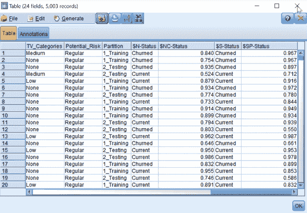

在这里，您可以查看分区节点的结果，神经网络模型的预测，其置信度，甚至 SVM 模型的预测及其置信度。您可以关闭此窗口。

1.  我们现在将通过将 SVM 生成的模型连接到输出面板中的分析节点来分析模型。

1.  编辑分析节点，检查巧合矩阵，并点击运行。您将看到以下结果：

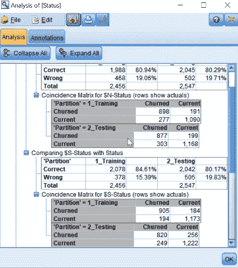

我们可以看到每个模型的表现如何。如果您向下滚动，您可以看到模型在训练数据集中的预测上有 88%的时间达成一致，在测试数据集中大约有 87%的时间达成一致。当这些模型达成一致时，它们实际上在相当多的时间里是正确的。这使我们评估将这两个模型组合的可能性。

我们现在开始将模型进行组合。我们首先将使用模型器进行组合，但也会看看我们如何在模型器之外组合模型。

# 在模型器中组合模型

要在模型器内组合模型，请按照以下步骤操作：

1.  前往 SVM 模型，并从字段操作面板将其连接到集成节点。

1.  让我们编辑 Ensemble 节点。Ensemble 节点知道它正在组合两个模型的结果，因为它在 Ensemble 中显示了两个模型。将 Ensemble 的目标字段选择为右侧下拉按钮中的 Status。如果选中了“过滤掉由 Ensemble 模型生成的字段”，它将过滤掉先前模型中已生成的字段，因此我们将取消选中它。接下来，选择 Ensemble 方法。这是一个我们可以组合模型的方式列表。在这里，我们将选择投票，因为我们已经看到过这个了。我们将在本章后面讨论倾向得分。然后我们必须选择在出现平局时会发生什么；在这里，我们将选择最高置信度，因为我们也看到了这一点，然后点击 OK，如图所示：

1.  让我们看看组合的结果。为此，将 Ensemble 节点连接到分析节点，并点击顶部的运行按钮。以下将是结果：

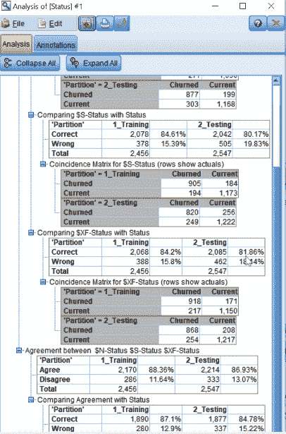

首先，我们有神经网络模型的结果，然后是 SVM 模型的结果，最后我们可以看到组合模型的结果。

我们可以看到在测试数据集中整体准确率为 82%，这意味着略有改进。我们通过组合两个模型将准确率提高了 2%，这是一个很好的起点。让我们看看我们如何从模型器外部组合模型。

# 在模型器外部组合模型

当你使用除 SPSS Modeler 之外的其他数据挖掘软件时，可以使用这种方法。

让我们看看如何做到这一点：

1.  前往字段操作调色板，并将 SVM 生成的模型连接到派生节点。

1.  我们将使用派生节点来创建一个新的字段。我们将编辑此节点并将其命名为`Combined_Prediction`。

1.  将此字段派生为条件。你会看到一个`if-else`条件。

1.  让我们告诉模型器，如果所有模型的预测都相等，那么组合预测将是那个预测本身。为此，让我们在第一个`if`条件中添加一个表达式，即神经网络模型的预测，$N-Status select = SVM 模型的预测，$S-Status；转到`Then`条件，点击表达式构建器并选择，神经网络模型的预测，$N-Status，或者你也可以选择 SVM 模型的预测。

1.  在`Else`条件中写下这个语句：你可以从列表中选择变量名：

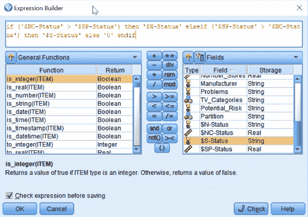

这个声明意味着，如果两个模型的预测不匹配，我们将选择任何模型中的**最高置信度**。如果神经网络模型的预测置信度高于 SVM 模型，那么我们将选择神经网络模型的预测。否则，如果 SVM 模型的预测置信度高于神经网络模型，那么我们将选择 SVM 模型。但是，如果两个条件都不满足，那么我们将放置一个`0`，然后我们必须以`endif`语句结束。点击确定。

1.  将组合预测节点连接到表格模式，让我们看看结果，如下面的截图所示：

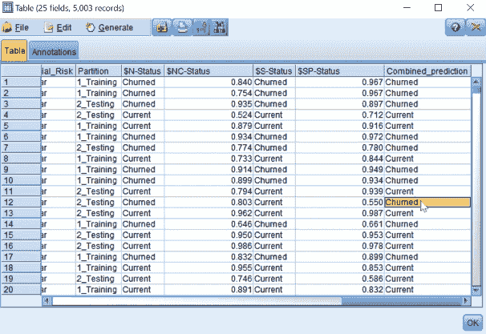

在这里，第 12 行，我们可以看到神经网络预测客户为流失，而 SVM 预测为当前客户，但由于神经网络预测的置信度更高，所以组合预测被选为流失。

1.  你可以分析这个模型，看看自己获得的数据将与我们使用集成节点获得的数据相似。

这就是我们将两个模型结合以提高准确性的方法，我们也看到了如何从两个模型中获得组合结果。你可以尝试使用三个或更多模型。你会对模型结合的效果感到惊讶。现在我们将看到另一种提高模型的高级方法。

# 使用倾向得分

倾向得分非常有用，因为它们告诉你某件事情发生的可能性。模型的置信度值反映了我们对预测的信心，所以高置信度并不能帮助我们确定客户是否会留在公司或离开公司，相反，它表明我们对预测的信心。有时修改置信度值是有帮助的，这样高置信度值意味着预测一个人会离开，而低置信度值则表示一个人会留下。基本上，我们最终创建了一个倾向离开得分，这将有助于我们进行干预，不同的营销努力等等。

以这个表格为例：

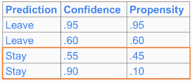

我们有两个离开值和两个停留值，每个值都有我们对这些预测的置信度。在这个例子中，让我们假设我们正在尝试计算失去客户的倾向性。我们将创建一个倾向性分数；这意味着当一个人被预测要离开时，倾向性分数与置信值是同一回事。所以你可以看到，对于第一个人，我们预测他们将离开，由于我们对这个预测有很高的信心，因此倾向性分数相当高。对于第二个人，我们预测他们也将离开，但我们对这个预测的信心并不那么高，因此，我们可以看到倾向性分数也不是那么高。

当预测相反的情况时，如果我们预测第三个人将留下，但我们对这个预测的信心并不很大，实际上我们正在做的是取我们真正想要的相反的置信度值的 1 减去，这最终就是倾向性分数。最后，在最后一个例子中，我们预测一个人将留下。我们对这个预测的信心极高，因此，这个人离开的可能性非常低。

以下图表总结了倾向性公式：

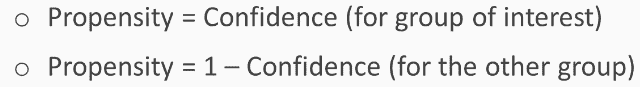

从本质上讲，倾向性分数所做的就是修改置信值，以便您可以查看某事发生的可能性。所以，如果您能将它们都放在某种光谱上，就可以看到，例如，有一些人对他们将要离开的信心程度很高，所以我们可能对此无能为力。我们还有另一组人对他们将要留下的信心程度很高，因此他们离开的倾向性很低。再次强调，我们可能不必过于担心他们，但可能我们需要关注的是中间的人，因为他们不是那么极端的预测，所以我们不能对那些预测有太大的信心。潜在地，我们可以对那组人做些事情。我们可能能够改变他们的想法，或者类似的事情，这就是倾向性分数的用途。

# 倾向性分数的实现

要了解我们如何利用倾向性分数来获得优势，请按照以下步骤操作：

1.  将您的数据集放在画布上，并将其连接到一个分区节点，将数据集分为两部分。

1.  将分区节点连接到建模选项卡中的 Chaid 模型。您可以使用任何模型，但让我们使用这个，因为它也将在我们的下一个示例中使用。

1.  Chaid 将构建一个决策树模型。要编辑，请转到“模型选项”选项卡，其中有一个要求输入倾向得分的部分。有两种类型；原始倾向得分用于训练数据集，调整后的倾向得分用于测试或验证数据集。我们现在将选择原始倾向得分：

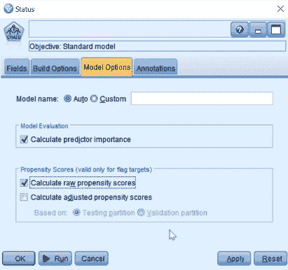

1.  点击“运行”。将生成的模型连接到输出调色板中的表节点，并运行表。观察表，你会看到添加了另一个变量，称为倾向得分。当预测客户将流失时，如果他们的置信度得分低，倾向得分就是我们所期望的*1-置信度*。但对于当前客户，我们有一个与置信度值相似的倾向得分。

1.  如果你想看到这个过程的图形表示，将生成的模型连接到图形调色板中的直方图节点。编辑直方图，在字段框中，并选择倾向得分变量：

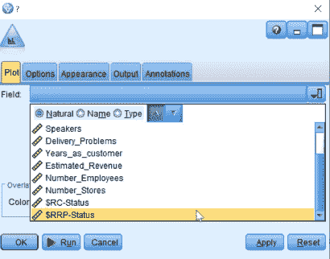

1.  点击“运行”以查看以下内容：

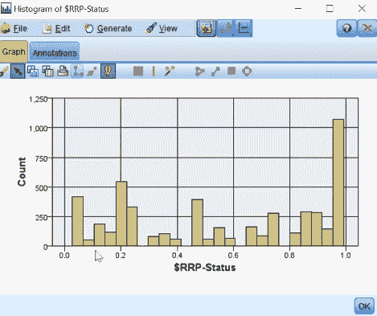

注意，倾向得分将在 0.0 到 1.0 之间变化。但置信度值只有两个值，它们的范围在 0.5 到 1.0 之间。要再次查看，请转到直方图，从“字段”选项中选择置信度变量，然后点击“运行”。你会看到以下内容：

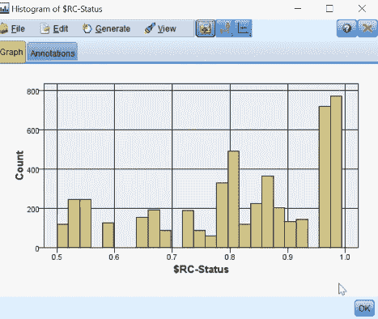

因此，我们将置信度值转换为倾向得分，现在这个倾向得分正在给我们提供关于某人可能继续作为客户的可能性信息。我们本可以反过来做，即寻找客户流失的可能性的倾向得分，但我们只需反转这些得分，它就会为我们创建出相应的结果。无论如何，我们现在可以使用这些倾向得分来做些事情，比如查看哪些客户最有可能流失，或者哪些我们将保留的客户。无论如何你看待这个问题，你知道哪些人很可能流失，因此可能无法对他们做任何事情。那些处于中间状态的人可能不会流失，所以可能需要做更多的工作来尝试保留他们作为客户，并更好地了解他们。

# 元级建模

元级建模是基于另一个模型的预测或结果来构建模型。在之前的例子中，我们看到了如何为我们的**Chaid**模型创建倾向得分。在本节中，我们将看到如何从**Chaid**模型中提取结果并将其输入到神经网络模型中，这将使我们能够改进神经网络模型的结果。

要做到这一点，请按照以下步骤操作：

1.  将分区节点连接到建模调色板中的神经网络节点。

1.  通过在“构建”标签页的高级选项中将随机种子从`5000`更改，运行神经网络模型。现在将生成的 Chaid 模型连接到生成的神经网络模型。

1.  现在，使用分析节点查看这些模型的准确度水平。

1.  你将得到以下结果：

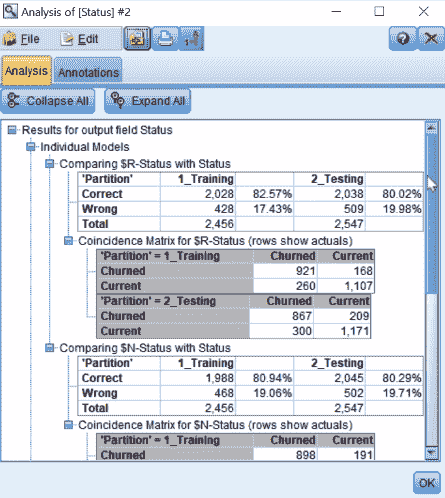

我们可以看到，这两个模型的准确性有些相似，所以现在我们将继续构建不同类型的神经网络模型。

我们将从 Chaid 模型的结果中提取数据，并将其输入到神经网络模型中。然后，神经网络模型将使用这些结果，以及所有其他单个预测因子，尝试捕捉比 Chaid 更多的信息：

1.  右键单击生成的神经网络模型并删除它。

1.  将生成的 Chaid 模型连接到字段操作调色板中的类型节点。

1.  将类型节点编辑框滚动到最底部，并将 Chaid 模型的置信度变量设置为“无”：

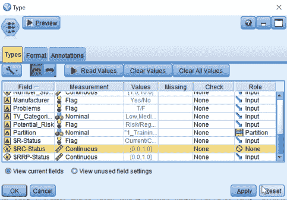

点击“确定”。

1.  将类型节点连接到画布上已有的神经网络模型，并使用随机种子`5000`运行它。

1.  如果你查看新模型的结果，你可以看到最重要的预测因子来自 Chaid 模型的倾向得分：

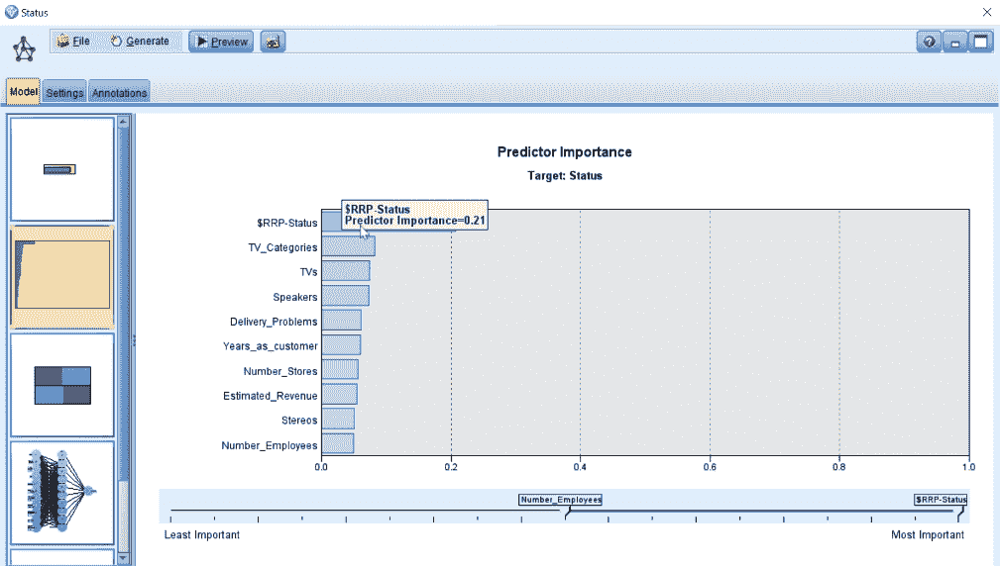

1.  将生成的 Chaid 模型连接到分析节点并运行分析，以获得以下结果：

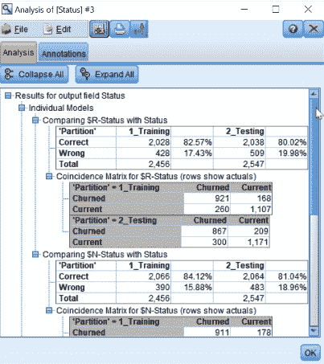

在这个例子中，我们可以看到，在神经网络模型中，如果我们从 Chaid 模型中提供结果，我们的准确性提高了 1%。

# 错误建模

错误建模是元级建模的另一种形式，但在这个案例中，我们将建模预测中存在错误的情况。这样，我们可以提高预测的准确性。通过一个例子，我们将介绍如何进行错误建模。

考虑以下场景，例如：

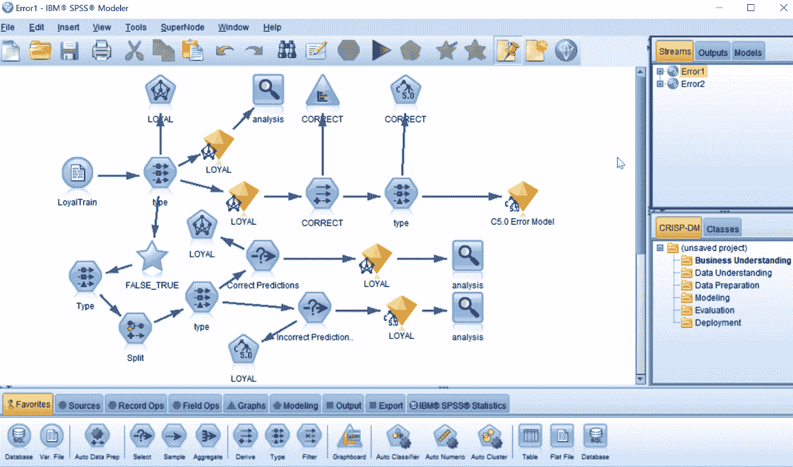

这里，我们有一个名为`LoyalTrain`的数据集。这只是一个训练数据集；我们的测试和验证数据集在另一个地方，我们只将在训练数据集上构建模型。还有一个类型节点和一个神经网络模型，我们在这里预测忠诚变量。运行分析节点查看以下截图所示的结果：

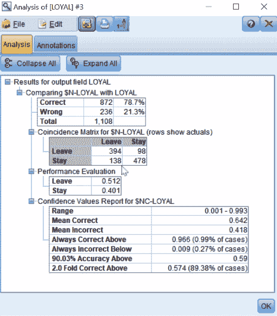

你可以看到，结果变量中有两个类别：人们要么被预测为留下，要么被预测为离开。你还可以看到，在 79%的情况下做出了正确的预测。在 21%的情况下犯了错误。总共犯了 236 个错误。

从这个例子中，你也可以看到，神经网络模型被复制并放置在流的另一部分。还使用一个派生节点创建了一个新的变量，`CORRECT`。让我们看看这里发生了什么，如下面的截图所示：

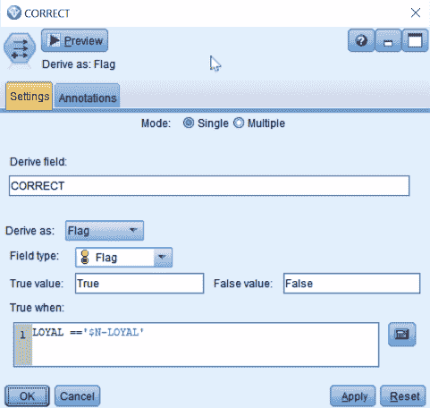

在这里，我们创建了一个新的字段作为`CORRECT`，并保持其值为`True`和`False`。我们在这里告诉模型器，如果它找到一个变量 LOYAL，并且如果它等于 LOYAL 的预测，则该值为 True；否则，为 False。

如果你运行位于其上方的“分布”节点，你将看到以下结果：

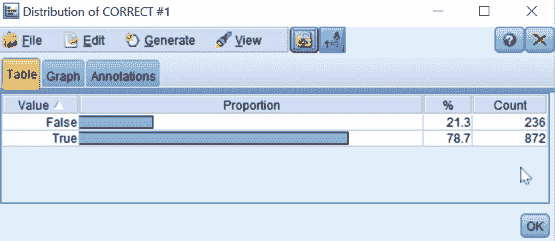

接下来，我们将使用类型节点实例化数据，之后我们可以使用一个以非常不同的方式查看数据的 C5.0 决策树模型。在这里，我们构建了一个 C5.0 模型，试图预测我们得到的是正确还是错误的预测。点击生成的 C5.0 模型以查看其结果，如下截图所示：

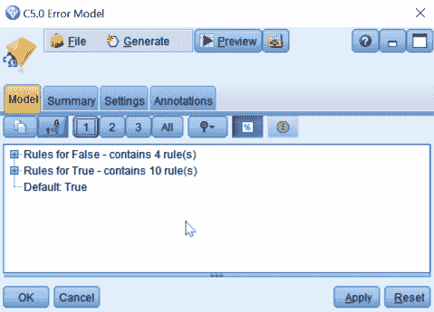

在这个例子中，我们可以看到有 14 行，其中包含 4 条规则用于错误预测，即当我们预测错误时，以及 10 条规则用于正确值，即当我们预测正确时。

你可以展开规则并点击它们上面的**%**符号，以获得以下结果：

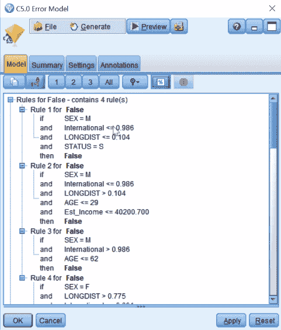

在这个例子中，第一条规则基本上表明，如果你是男性，你使用少于 1 分钟的国外通话时间，少于 1 分钟的长途通话时间，并且你的状态是单身，我们预测我们将有一个 False 的值。如果你想查看数字，请点击%符号，你将看到以下结果：

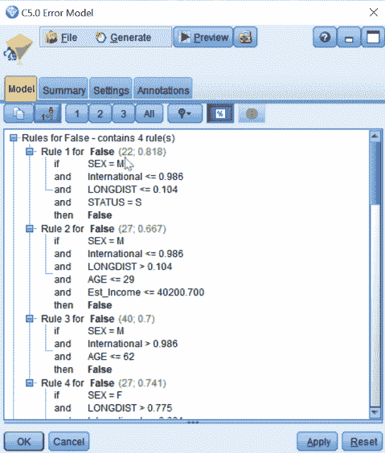

如前一张截图所示，第一条规则有 22 人，与他们相关的预测准确性大约为 82%。

从这个结果中，我们可以看到在预测过程中出现了某些类型的错误。因此，我们可能需要使用另一种类型的模型而不是神经网络模型。为此，点击生成选项并选择规则跟踪节点，如下截图所示：

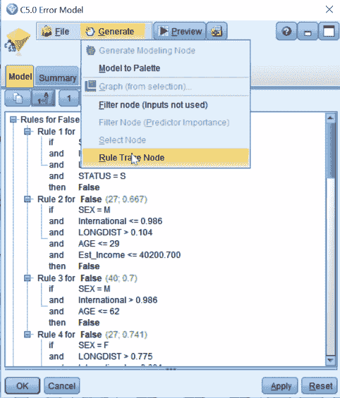

此步骤创建了一个名为 FALSE_TRUE 的节点，你可以在示例场景中看到它作为启动图标。这创建了我们的所有规则。如果你想查看其内部，请点击工具选项卡上的启动+图标，你应该会看到以下结果：

现在我们来看看第一条规则。点击该规则中的表达式构建器，如下截图所示：

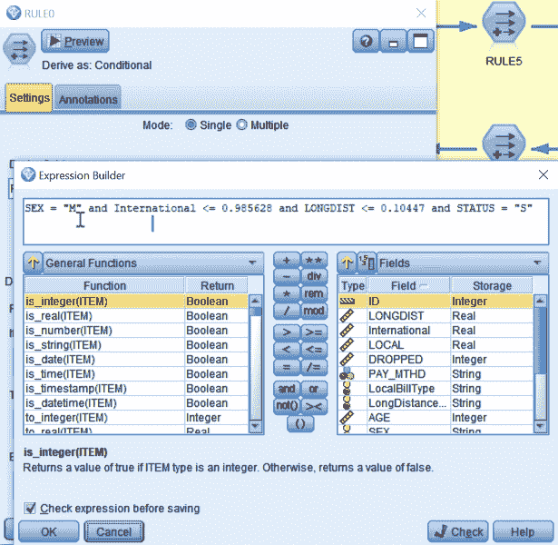

在这里，规则似乎表明，如果你是男性，你使用少于 1 分钟的国外通话时间，少于 1 分钟的长途通话时间，并且你的状态也是单身，我们预测你将有一个 False 的值。你可以看到这个预测的准确性。

使用启动图标返回。在这里，我们有分类节点“分割”。让我们看看我们到目前为止做了什么，如下所示：

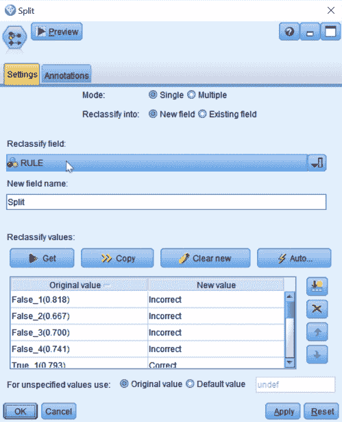

我们选择了变量 RULE 并点击了“获取”，这给我们提供了所有这些不同的原始值，我们将它们重命名为“不正确”，以及所有“True”的值，我们将它们重命名为“正确”，然后我们只有“正确预测”：

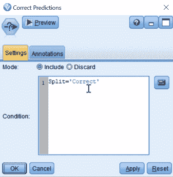

我们现在已经构建了神经网络模型。如果你从“正确预测”中运行生成的神经网络模型的“分析”节点，你应该看到以下结果：

记住，早期模型的总体准确率约为 79%，现在已提高到约 84%。

我们也在类型节点的一个单独字段中为不正确的预测做了同样的事情。让我们看看如下：

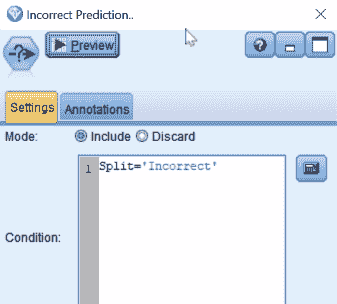

我们为不正确的预测构建了一个 C5.0 模型，让我们看看它的分析，如下所示：

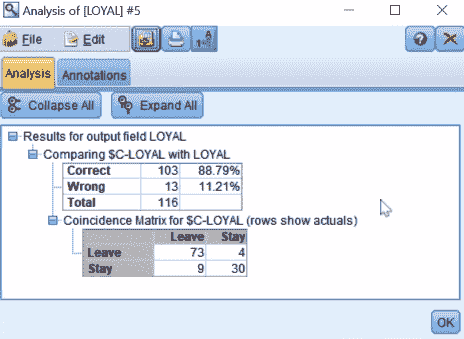

C5.0 模型在预测神经网络模型表现不佳的不正确值方面做得很好；我们现在有 89% 的总体准确率。

让我们总结一下我们在这里做了什么。我们有一个数据集，我们将其分为正确和错误的结果，并分别对每个结果进行建模，以给我们比使用一个模型更少的错误。

现在我们需要结合两个模型的预测。为此，请转到右侧的“流”选项卡中的“错误 2 流”，如下面的截图所示：

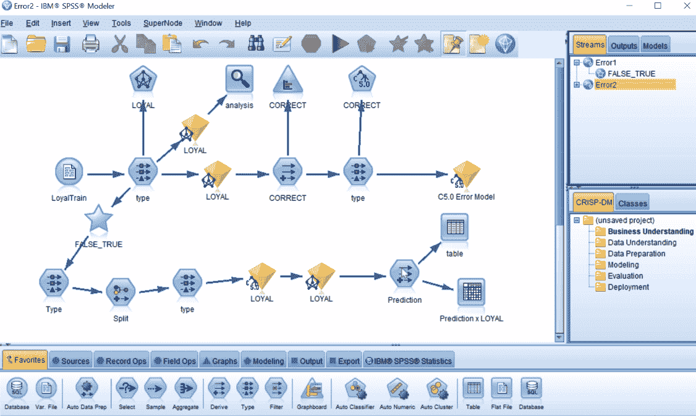

在这里，我们结合了两个模型的预测，并使用了一个派生节点“预测”，如下面的截图所示：

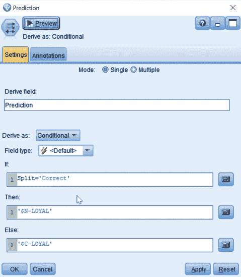

在这里，我们指定如果预测是正确的，则选择神经网络模型的预测。如果预测是不正确的，我们应该选择 C5.0 模型的预测。

然后，添加了矩阵节点后，运行以下操作：

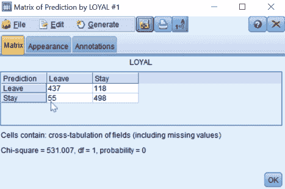

在前面的截图中，我们可以看到我们正确预测了 437 人将离开，有 118 个错误，以及 498 人将留下，只有 55 个错误。这意味着总共有 173 个错误。

我们的原模型犯了 236 个错误，所以我们极大地减少了错误数量。仅仅通过为不同的人群使用两个不同的模型并将它们结合起来，我们就产生了一个包含 63 个更少错误的输出。

这是错误建模。在错误建模中，你可以构建一个模型，看看结果如何，然后决定是否为不同类型的人构建两个或三个模型，因为不能假设一个模型适用于所有人。因此，我们可以构建不同类型的模型，向这些模型提供不同类型的数据，然后最终将每个模型的结果结合起来，生成一个最终预测，这个预测在预测建模方面可能包含更少的错误。

# 提升和袋装

提升背后的想法是通过构建一系列旨在预测先前模型误分类的连续模型，你正在进行一种错误建模。另一方面，袋装是带替换的抽样。使用这种方法，将生成新的训练数据集，其大小与原始数据集相同。在本节的例子中，我们将使用自助抽样。

在这个例子中，我们将了解如何进行提升和袋装，这两种方法都是提高模型性能的方法。

# 提升功能

让我们看看如何按照以下步骤进行提升：

1.  将数据放在画布上并对其进行分区。

1.  为数据创建一个神经网络模型。

1.  以随机种子设置为`5000`运行神经网络模型。

1.  连接一个分析节点并运行它，同时勾选巧合矩阵——你会看到测试准确率为 81%，整体准确率为 80%。

1.  现在，提升神经网络模型。为此，转到神经网络模型并对其进行编辑。在构建选项下转到目标，然后点击增强模型准确性（提升）。提升可以与任何大小的数据集一起使用。这里的想法是我们正在构建一系列连续的模型，这些模型旨在预测先前模型的误分类。所以，基本上，我们最终构建了一个模型。会有一些错误，因此应该构建第二个模型，在这个模型中，第一个模型的错误被赋予更高的权重，以便我们更好地理解它们。然后，当我们构建第二个模型时，将会有错误，所以我们最终构建第三个模型，在这个模型中，第二个模型的错误再次被赋予更高的权重，以便我们试图更好地理解它们，以此类推。无论何时进行提升和袋装，你都必须确保你有训练集和测试集，因为你有很大的机会利用机会，你可能会发现样本特定的信息，因为我们专注于我们在特定样本中发现的错误。我们现在将点击运行。

1.  让我们看看我们生成的模型：

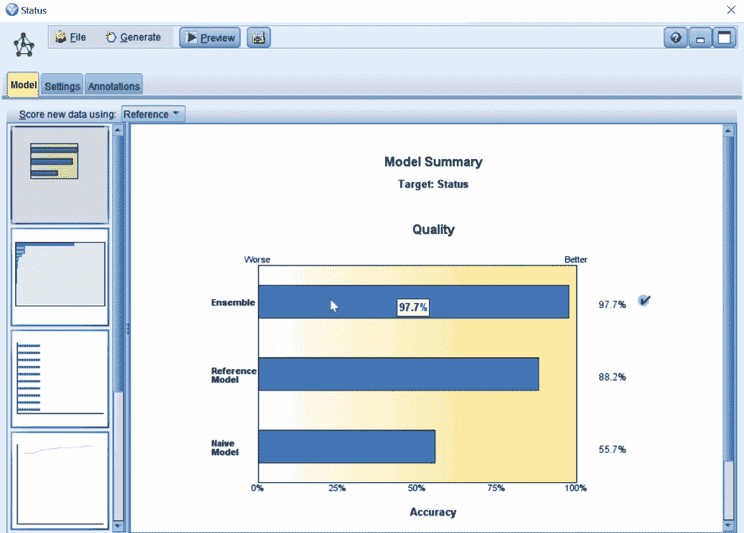

在我们生成的模型中，第一个标签显示的是集成模型的外观：这是结合了我们创建的 10 个模型。你可以看到其整体准确率约为 98%：这是被选为最佳模型的模型。你还可以看到参考模型是什么——那将是第一个构建的模型——然后你可以看到朴素模型，实际上，那根本不是模型，那只是我们预测众数或最常见响应的地方。

1.  让我们下滑到第二个图标：

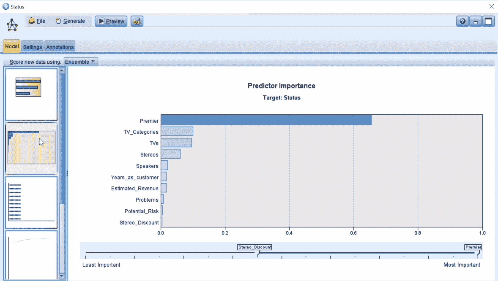

在这里，你可以看到预测因子的重要性。在最终构建的 10 个模型中，我们可以看到“Premier”变量是最重要的预测因子，然后你可以看到其他预测因子的重要性顺序。这与我们通常在一般神经网络模型中看到的信息类似，但这个信息来自我们构建的所有不同模型。

1.  如果我们向下滚动到下一个图标，我们可以看到预测因子频率：

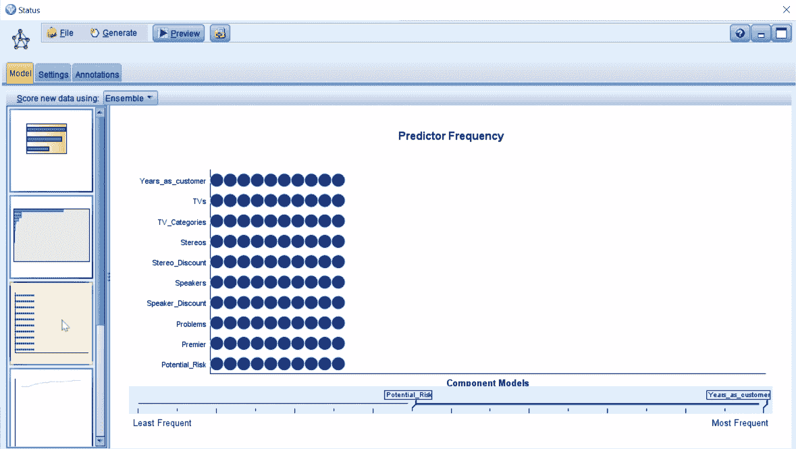

这显示了在模型中每个不同预测因子被使用的频率。对于神经网络模型来说，这并不那么有趣，因为神经网络模型通常不会丢弃预测因子，但如果我们有一个决策树模型，例如，这可能就更有趣一些，因为在那里你会丢弃预测因子。

1.  让我们向下滚动到下一个标签页：

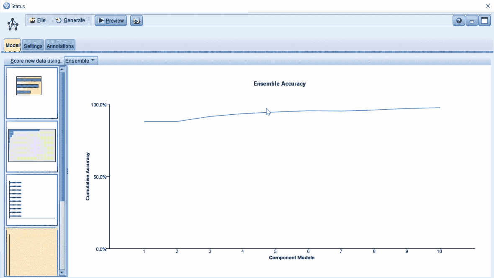

上述截图显示了模型的准确度水平。你可以看到它趋于平稳，在某个点上，改进不再明显。在这种情况下，准确度是逐渐提高的。有时，在某些模型中，你会看到大约五个模型准确度有巨大的跳跃，然后它就稳定了。也许你不必再构建更多的模型。在我们的案例中，我们最终构建了 10 个模型。我们的整体准确度极高。如果我们看到准确度很低，可能是因为我们看到了逐渐的提高，也许我们想要使用 15 个模型而不是 10 个，例如。这就是你将看到这种信息的地方。

1.  让我们再向下滚动一点，看看最后的表格：

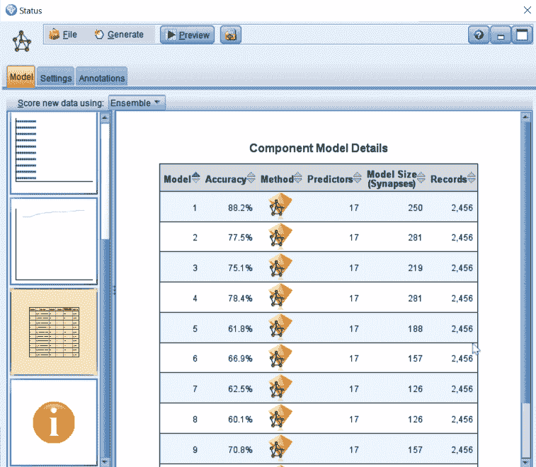

在这里，我们可以看到预测因子的数量，我们还可以看到模型中的案例数量。最后，我们看到突触的数量，这基本上是我们在这个模型中拥有的权重或连接的数量。因此，你可以看到每个单独的模型表现如何。每个模型的新版本都在数据中错误较多的地方赋予更多的权重，这正是这里的理念。

1.  最后运行分析节点，你可以看到对于训练数据集，整体准确度大约为 98%。但在测试数据集中，整体准确度大约为 80%，这是我们真正关心的，即测试数据集。在这种情况下，我们可以看到训练和测试之间存在很大差异，这通常在讨论提升模型时会出现。

确保你得到的结果确实值得，并且它确实比单独运行模型有所改进。在这种情况下，当我们只运行一个模型时，请记住，测试数据集的整体准确率大约在 80%左右；这就是我们在这里看到的情况。所以，在这个特定情况下，提升并没有给我们带来太多好处。在其他情况下，它当然可以，但再次强调，你真的需要能够权衡这一点，在这种情况下，提升似乎对我们来说在这个情况下并不真正值得。

# Bagging

让我们回到神经网络模型，这次我们将进行 Bagging 而不是提升：

1.  转到目标选项卡并选择增强模型稳定性——这是有放回的抽样。当数据集较小或存在异常值时，不要进行 Bagging。Bagging 背后的主要思想是生成新的训练数据集，其大小与原始训练数据集相同，这是通过使用有放回的抽样来实现的。在这种情况下，我们实际上是在进行自助抽样。

1.  点击运行模型。

1.  让我们来看看我们生成的模型。这是我们最终构建的模型：

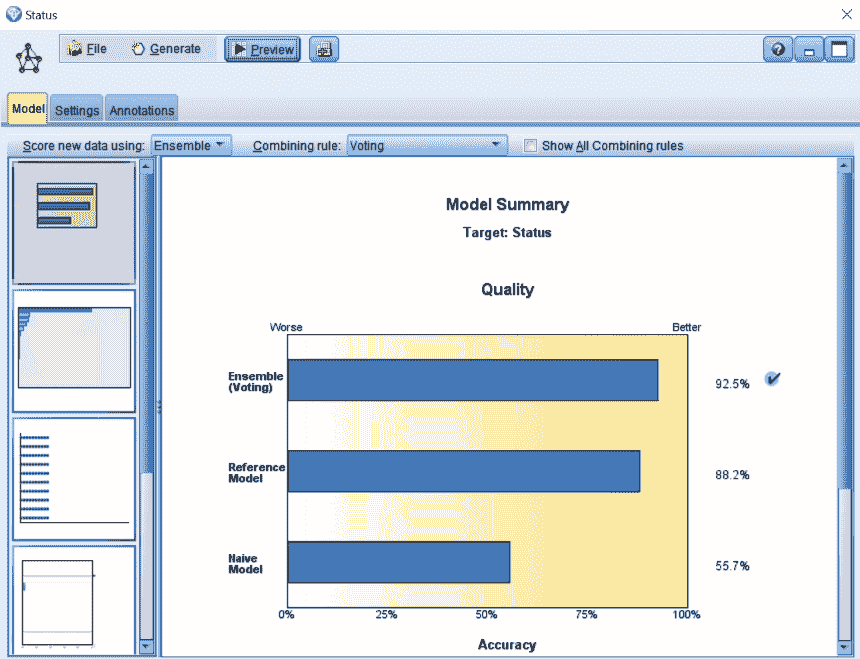

注意，组合规则是通过投票实现的，但我们可以用其他方法来组合模型，实际上，我们可以选择显示所有组合规则。我们不会看到所有模型的详细信息，因为截图与提升树相同。

1.  运行分析节点以获取以下结果：

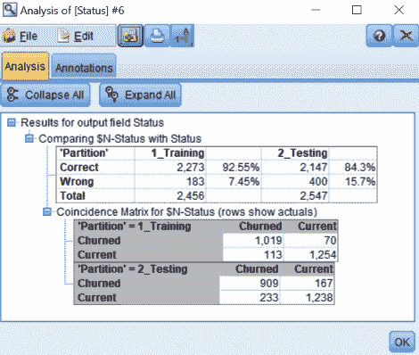

我们可以看到，通过进行 Bagging，我们的准确率提高了 4%。

我们现在将看到如何预测连续结果。

# 预测连续结果

到目前为止，我们一直在谈论分类结果，而大多数这些例子也适用于连续结果，但在这个部分，我们将专门关注连续结果变量。

如我之前提到的，当我们谈论连续结果预测或变量时，这本书中提到的所有内容仍然适用：不过，主要区别将在于我们最终如何组合预测。

在这个例子中，我们可以看到我们构建了三个模型，并且从每个模型中都有预测结果：

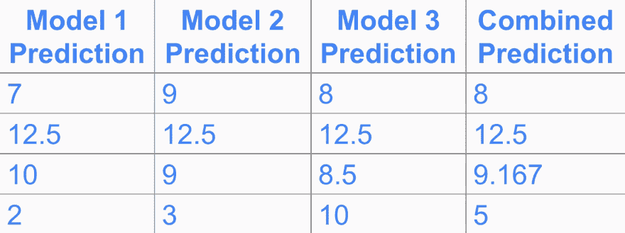

当我们想要合并预测时，我们只是做一个数学平均。这些先前模型的平均值最终成为合并预测，因为我们不是像在具有分类结果变量时那样预测单个类别。相反，我们预测实际的数值，如果我们想从这些不同的模型中合并预测，我们简单地做的就是取这些模型的平均值。例如，在第一行，第一个模型预测的值为 7，下一个模型预测的值为 9，第三个模型预测的值为 8。我们取这些值，将它们加起来，然后除以模型的数量，合并预测最终得到的值是 8。这就是你合并模型的方法。

但是当我们有连续的结果变量时，我们没有置信度值，所以我们不需要担心这些类型模型的实际置信度值。

在这个例子中，我们将使用银行数据集。将其拖到画布上。

让我们看看这些数据看起来是什么样子：

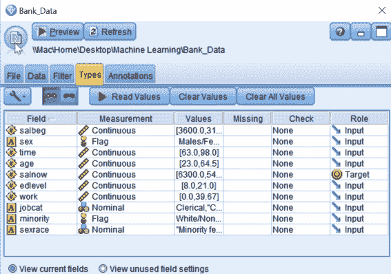

如您所见，有几个字段。我们将预测一个变量，salnow，这是我们基于起始工资、性别、某人在该组织工作的时间、年龄、教育水平、他们来该组织之前工作过的年数、他们所在的职位类别、他们是否来自少数族裔以及种族和性别的交互作用的目标变量。

将数据集分区，然后继续创建一个神经网络模型。使用默认设置运行神经网络模型。查看新生成的模型。

让我们也像以前一样构建 SVM 模型。我们将比较两个模型的预测结果。

这是 SVM 模型的输出：

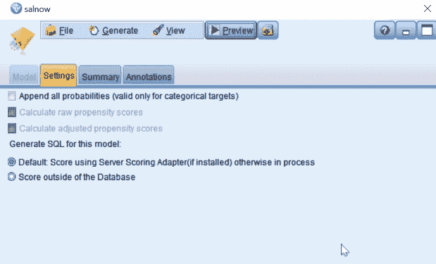

将两个生成的模型连接起来，并将 SVM 模型连接到表格上并运行表格。

滚动到末尾，您可以看到一个分区节点和两个模型的预测。请注意，这些连续结果变量没有置信度值。

这也意味着我们也不会得到这些模型的倾向得分。引入一个分析节点，并将 SVM 模型连接到分析节点并运行它：

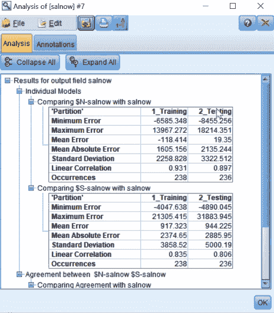

分析与以前我们用分类变量得到的分析略有不同。您可以看到，对于训练集和测试集，都有最小误差和最大误差。模型在预测值过高或过低方面做得最差。

均值误差只是误差的平均值。查看这些模型准确性的最佳方式是查看平均绝对误差。如您所见，与测试数据集相比，训练数据集的值较低。这些值需要相似。您可以看到 SVM 模型的平均绝对值。您还可以看到标准差。这个值需要尽可能小，因为这表明我们在模型中具有更少的变异。另一个标准是相关系数。对于这两个数据集，这个值都极高；这些值必须彼此相似。人们使用线性系数来验证模型的有用性，但有时我们并没有线性关系。因此，在这种情况下，我们将使用平均绝对误差值作为评估模型表现的最佳度量。**发生次数**是每个数据集的案例数量。

现在让我们结合模型：

1.  将最后生成的节点连接到字段操作调色板中的集成节点。

1.  编辑集成节点。取消选择“过滤出”字段并点击确定。

1.  将集成节点连接到已存在的表节点并运行表。

1.  您可以看到来自 SVM、神经网络以及如果我们平均这两个，我们就有综合模型的预测。我们还有我们的标准误差。对于那些不使用模型器的人来说，可以使用派生节点来计算这些模型的平均值并得到综合结果。

1.  要查看结果，将集成节点连接到分析节点并运行它：

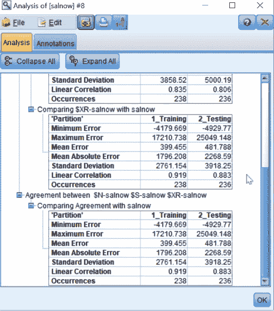

这是一个如何处理连续变量的例子。

# 摘要

在本章中，我们看到了如何对模型进行额外的先进操作以获得更好的结果。希望您对数据如何被提取来训练机器以及我们如何通过在不同类型的数据上训练来创建更好的模型有了更深的理解。
