# *第二章*：启用和操作化

我们刚刚学习了 Elastic ML 的基本功能，它能够实现无监督的自动异常检测和监督数据帧分析。现在，是时候详细了解 Elastic ML 在 Elastic Stack（Elasticsearch 和 Kibana）内部的工作原理了。

本章将重点介绍 Elastic ML 功能的安装（实际上，是启用）以及操作流程的详细讨论，特别是关于异常检测的部分。具体来说，我们将涵盖以下主题：

+   启用 Elastic ML 功能

+   理解操作化

# 技术要求

本章中的信息将使用 v7.10 版本的 Elastic Stack 以及截至 2020 年 11 月的 Elastic Cloud 的 Elasticsearch 服务的工作流程。

# 启用 Elastic ML 功能

在 Elastic Stack 内部启用 Elastic ML 功能的流程，如果你是在自管理集群内操作，与使用 Elastic Cloud 的**Elasticsearch** **服务**（**ESS**）相比，略有不同。简而言之，在自管理集群上，ML 功能通过许可证密钥（无论是商业密钥还是试用密钥）启用。在 ESS 中，需要在集群内配置一个专门的 ML 节点，以便利用 Elastic ML。在接下来的章节中，我们将解释这两种场景下如何实现这一过程。

## 在自管理集群上启用 ML

如果你有一个通过下载 Elastic 的默认 Elasticsearch 和 Kibana 分发（可在[elastic.co/downloads/](http://elastic.co/downloads/)找到）创建的自管理集群，通过许可证密钥启用 Elastic ML 功能非常简单。请确保不要使用不包含 X-Pack 代码库的 Apache 2.0 许可的开源分发版。

与 Elastic Stack 的大部分功能不同，Elastic ML 不是免费的——它需要一个商业（具体来说，是**铂金**级别）许可证。然而，它是开源的，因为源代码在 GitHub 上公开（[github.com/elastic/ml-cpp](http://github.com/elastic/ml-cpp)），用户可以查看代码、提交问题、发表评论，甚至执行拉取请求。但是，Elastic ML 的使用受 Elastic 公司商业协议的约束。

当 Elastic ML 首次发布（在 v5.x 时代）时，它是作为名为**X-Pack**的闭源功能的一部分，需要单独的安装步骤。然而，从版本 6.3 开始，X-Pack 的代码被“开放”([elastic.co/what-is/open-x-pack](http://elastic.co/what-is/open-x-pack))并整合到 Elasticsearch 和 Kibana 的默认分发中。因此，不再需要单独的 X-Pack 安装步骤，只需通过商业许可证（或试用许可证）启用功能。

Elasticsearch 和 Kibana 的安装过程本身超出了本书的范围，但通过遵循 Elastic 网站上的在线文档（可在[elastic.co/guide/](http://elastic.co/guide/)找到）可以轻松完成。

当 Elasticsearch 和 Kibana 启动后，从左侧导航菜单中选择**堆栈**选项，然后选择**许可证管理**。您将看到如下屏幕：

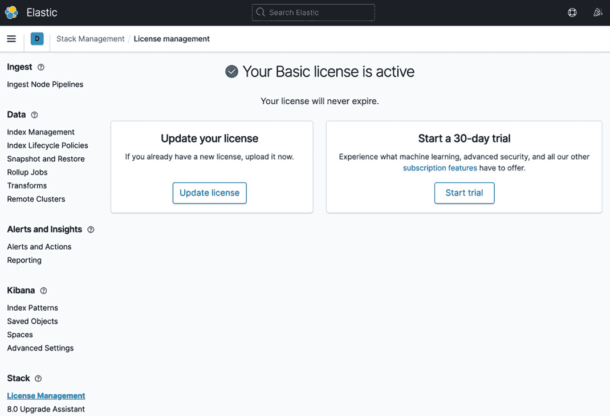

图 2.1 – Kibana 中的许可证管理屏幕

注意，默认情况下，应用的许可证级别是免费的**基本**级别。这使您能够使用一些在 Apache 2.0 许可的开源分发版或第三方服务（如 Amazon Elasticsearch 服务）中找不到的高级功能。有关比较不同许可证级别上存在的功能的实用指南，可以在 Elastic 网站上的[elastic.co/subscriptions](http://elastic.co/subscriptions)找到。

如前所述，Elastic ML 需要铂金级别的许可证。如果您从 Elastic 购买了铂金许可证，您可以通过点击屏幕上的**更新许可证**按钮来应用该许可证，如图 2.1 所示。如果您没有铂金许可证，您可以通过点击**开始我的试用**按钮来启用 Elastic ML 和其他铂金功能（假设您同意许可证条款和条件）：

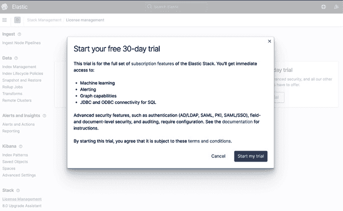

图 2.2 – 开始免费 30 天试用

完成此操作后，许可证屏幕将指示您现在处于 Elastic Stack 铂金功能的活跃试用状态：

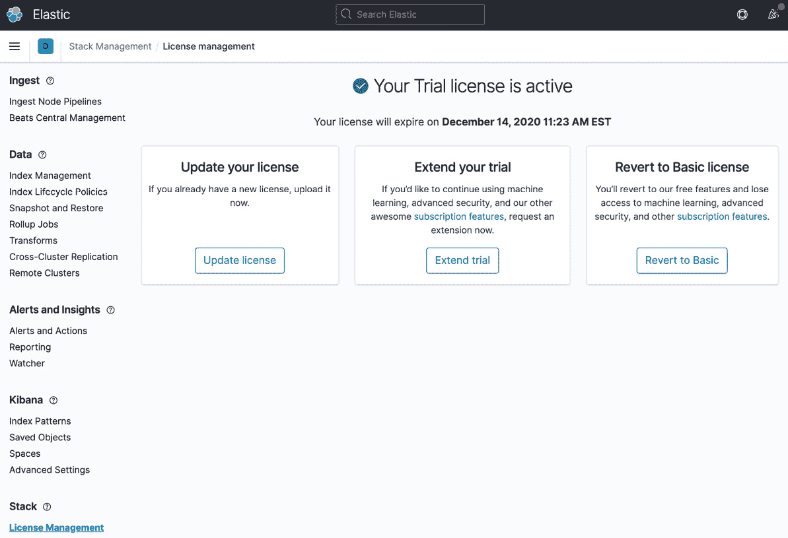

图 2.3 – 试用许可证已激活

完成此操作后，您就可以立即开始使用 Elastic ML。要利用其他铂金功能，还需要进行额外的配置步骤，但这些步骤超出了本书的范围。有关配置这些功能的进一步帮助，请参阅 Elastic 文档。

## 在云中启用 ML – Elasticsearch 服务

如果下载、安装和自行管理 Elastic Stack 不如直接获取作为服务提供的 Elastic Stack 平台有趣，那么请前往 Elastic Cloud ([cloud.elastic.co](http://cloud.elastic.co))并注册免费试用，只需使用您的电子邮件：

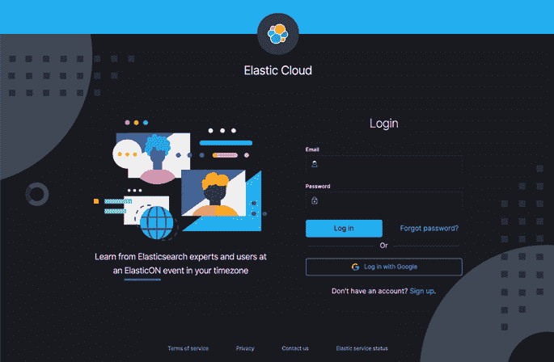

图 2.4 – Elastic Cloud 欢迎屏幕

您可以执行以下步骤：

1.  登录 Elastic Cloud 界面后，您将能够通过点击**开始您的免费试用**按钮来启动免费试用：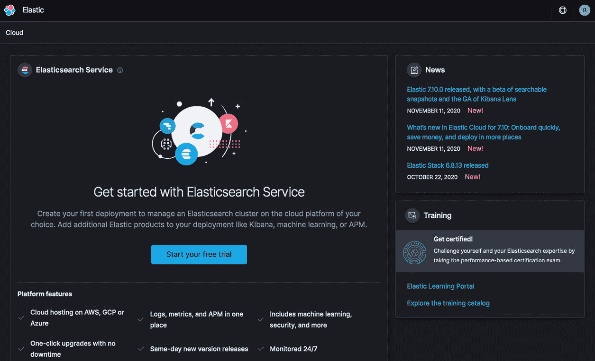

    图 2.5 – Elastic Cloud 主页

    点击按钮后，您将看到您的 ESS 14 天免费试用已开始：

    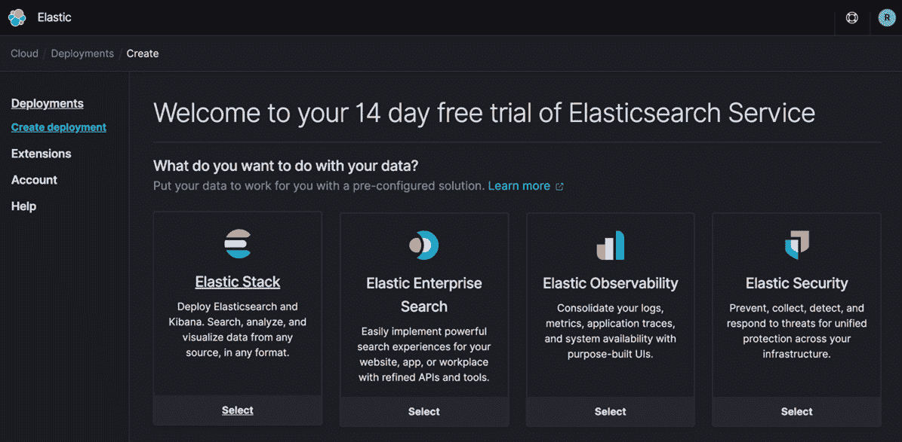

    图 2.6 – Elasticsearch 服务试用已启用

1.  当然，为了尝试 Elastic ML，你首先需要一个配置好的 Elastic Stack 集群。ESS 提供了创建所谓**部署**的几种选项，其中一些是为特定用例定制的。在这个例子中，我们将使用 *图 2.6* 左侧的 **Elastic Stack** 模板，并选择 **I/O 优化**的硬件配置，但请随意在试用期间尝试其他选项：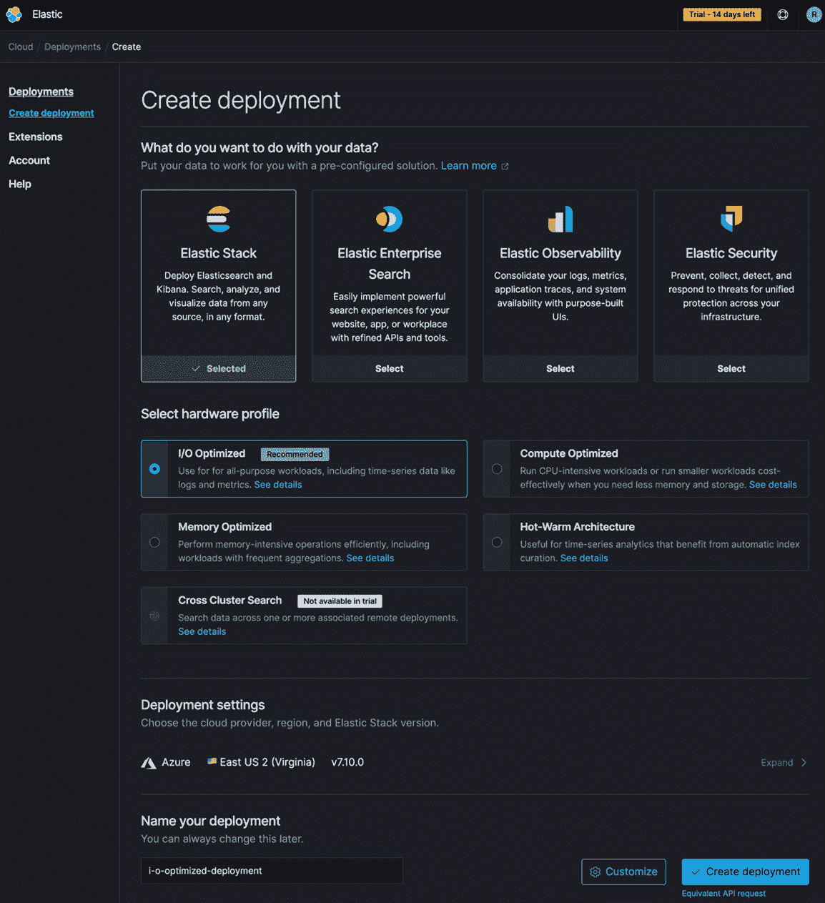

    图 2.7 – 创建 ESS 部署

1.  你还可以选择在哪个云提供商和哪个区域启动你的集群，但最重要的是，如果你想使用 ML 功能，你必须首先通过点击底部右下角的 **自定义** 按钮来启用一个 ML 节点。

1.  点击 **自定义** 按钮，你将看到一个新屏幕，允许你添加一个 ML 节点：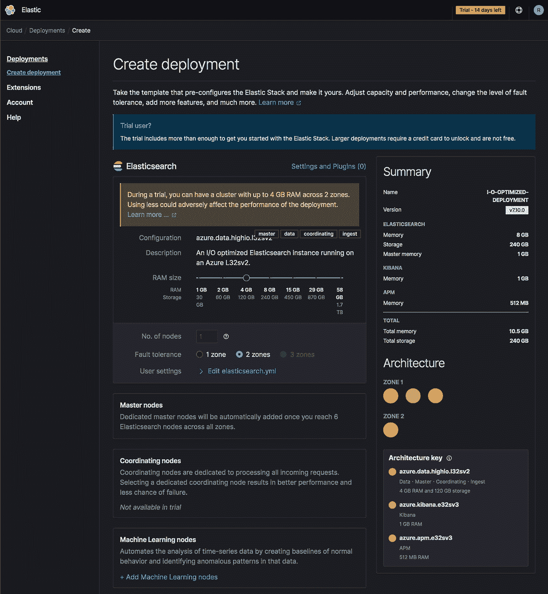

    图 2.8 – 自定义部署以添加 ML 节点

1.  在 *图 2.8* 的底部附近有一个链接，可以 **添加机器学习节点** 到你的集群。点击此链接将显示 ML 节点配置：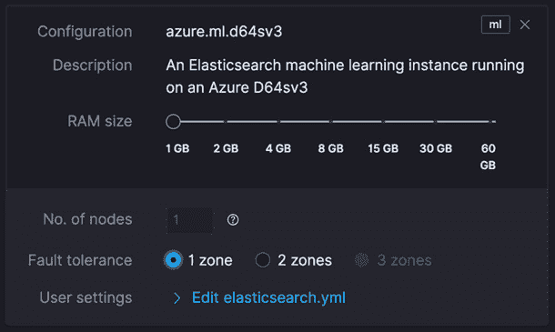

    图 2.9 – 添加 ML 节点(s)

    注意

    在 ESS 的免费 14 天试用期间，你只能添加一个 1 GB 的 ML 节点（在一个或两个可用区）。如果你从免费试用转为付费订阅，显然可以创建更多或更大的 ML 节点。

1.  将 ML 节点添加到配置后，点击 **创建部署** 按钮以启动 ESS 为你创建集群的过程，这可能需要几分钟。在此期间，你将看到你将用于访问集群的默认凭证：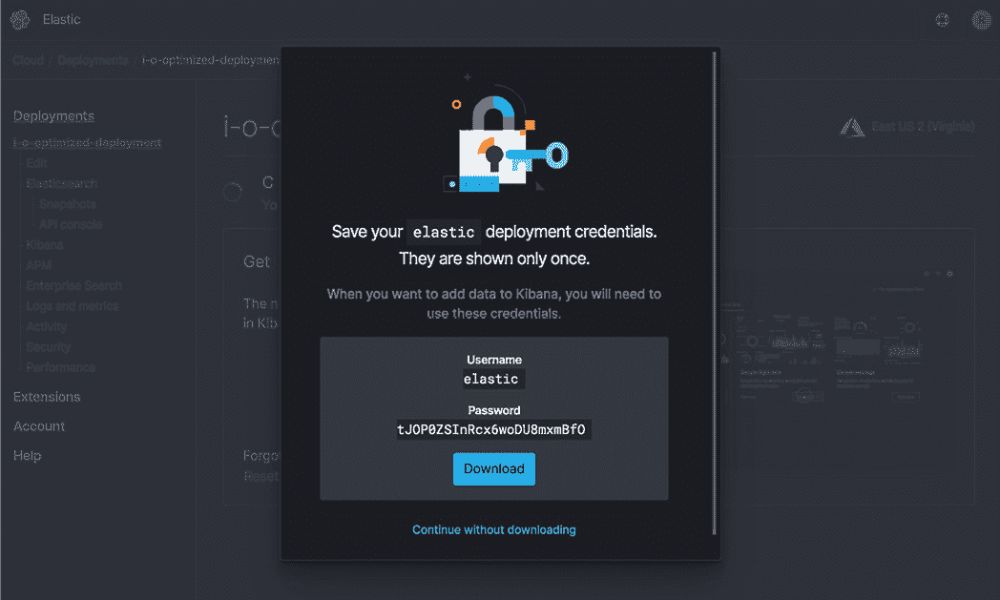

    图 2.10 – 默认分配的凭证

    你可以下载这些凭证以备将来使用。如果你忘记下载它们，不要担心——如果需要，你总是可以在稍后重置密码。

1.  一旦集群如 *图 2.11* 所示启动并运行（通常只需几分钟），你将看到以下部署视图，其中有一个 **打开 Kibana** 按钮允许你启动到你的部署：

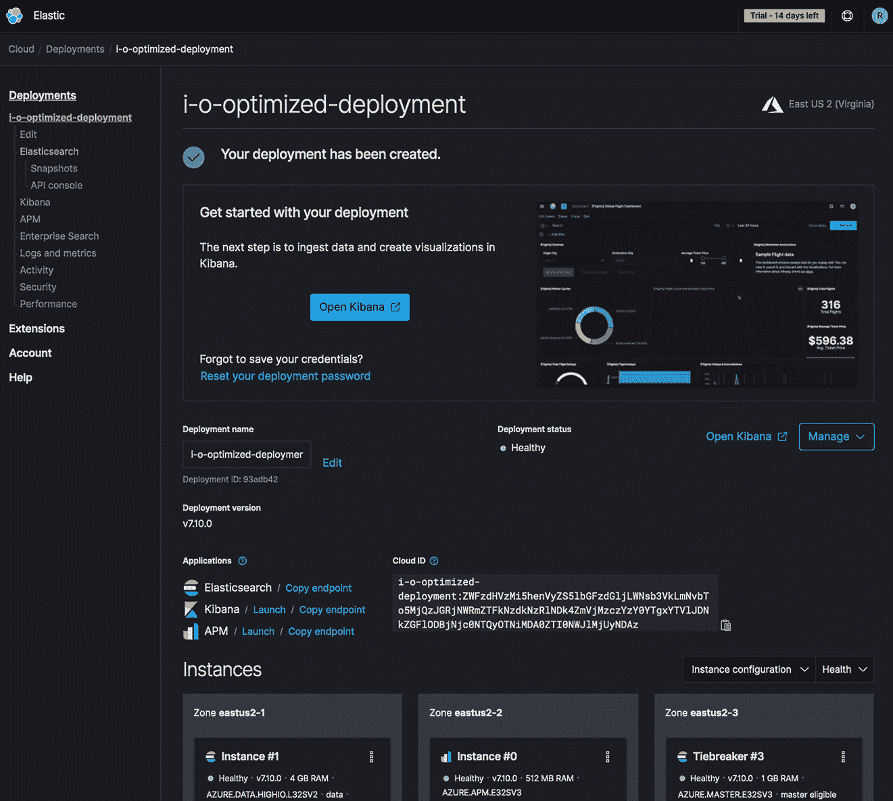

图 2.11 – 部署成功创建

点击 **打开 Kibana** 按钮后，你将自动登录到 Kibana，在那里你将可以直接使用 ML，无需额外的配置步骤。

在这个阶段，从想要使用 Elastic ML 的用户的角度来看，之前展示的自托管配置和 ESS 中创建的设置之间几乎没有区别。然而，一个主要的区别是，在这里 ESS 中的配置将 Elastic ML 始终隔离到同一节点上的`data`、`ingest`和`ml`角色）。我们将在本章后面讨论这个概念。

现在我们已经有一个启用了机器学习的 Elastic Stack，我们正在接近能够开始分析数据，这将在*第三章* *异常检测* 中开始。但首先，让我们了解 Elastic ML 的运营化。

# 理解运营化

在你使用 Elastic ML 的旅程中，在某个时候了解有关 Elastic ML 如何在 Elastic Stack 中运营化的几个关键概念将是有帮助的。这包括有关在集群节点上运行的分析信息以及要由机器学习分析的数据如何检索和处理的详细信息。

注意

在这个部分中，有些概念在你实际开始在一些真实示例上使用 Elastic ML 之前可能并不直观。如果你现在觉得更喜欢浏览（甚至跳过）这一节，稍后再根据一些真实的 Elastic ML 使用经验返回，请不要担心。

## 机器学习节点

首先，由于 Elasticsearch 本质上是分布式多节点解决方案，Elastic Stack 的机器学习功能作为一个遵循许多相同运营概念的本地插件工作，这是很自然的。如文档([elastic.co/guide/en/elasticsearch/reference/current/ml-settings.html](http://elastic.co/guide/en/elasticsearch/reference/current/ml-settings.html))所述，机器学习可以在任何或所有节点上启用，但在生产系统中，最好有专门的机器学习节点。我们在 Elastic Cloud ESS 中看到了这种最佳实践被强制执行——如果想要使用机器学习，用户必须创建专门的机器学习节点。

拥有专门的机器学习节点也有助于优化机器学习所需的具体资源类型。与因索引和搜索而涉及大量磁盘 I/O 负载的数据节点不同，机器学习节点更注重计算和内存密集型。有了这些知识，你可以为专门的机器学习节点适当地配置硬件。

一个需要注意的关键点——机器学习算法不在`autodetect`（用于异常检测）和`data_frame_analyzer`（用于数据框分析）中运行，这可以在进程列表中看到（例如，如果你在 Linux 上运行`ps`命令）。对于每个正在运行的机器学习作业，将有一个进程。在多节点设置中，机器学习将作业分配给每个启用了机器学习的节点以平衡工作负载。

Elastic ML 遵循一个名为`xpack.ml.max_machine_memory_percent`的设置，该设置控制 ML 作业可以使用的系统内存量。此设置的默认值为 30%。限制基于机器的总内存量，而不是当前空闲的内存量。别忘了 Elasticsearch JVM 可能占用高达约 50%的可用机器内存，因此为 ML 保留 30%，剩余 20%用于操作系统和其他辅助进程是谨慎的，尽管是保守的。如果这样做会导致 ML 作业的估计内存使用量超过此设置定义的限制，则不会将作业分配给节点。

虽然没有经验公式来确定专用 ML 节点的大小和数量，但以下是一些好的经验法则：

+   对于最多 10 个数据节点的集群大小，应有一个专用的 ML 节点（如果单个节点不可用，则为高可用性/容错提供两个节点）。

+   对于最多 20 个节点的集群，至少要有两个 ML 节点。

+   对于每个额外的 10 个数据节点，添加一个额外的 ML 节点。

这种保留大约 10-20%的集群容量用于专用 ML 节点的一般方法当然是一个合理的建议，但这并不免除您进行自己的尺寸、特征测试和资源监控的需要。正如我们将在后面的几个章节中看到的那样，您的 ML 任务对资源的需求将极大地取决于正在调用的分析类型以及正在分析的数据的密度和体积。

## 作业

在 Elastic ML 中，作业是工作单元。既有**异常检测**作业，也有**数据帧分析**作业。两者都使用某种类型的数据作为输入，并以新的信息作为输出。可以使用 Kibana 中的 ML UI 创建作业，也可以通过 API 编程创建。它们还需要启用 ML 的节点。

通常，异常检测作业可以作为单次批量分析（在历史数据的一段时间内）运行，或者连续在实时时间序列数据上运行——这些数据由您的 Elastic Stack（或两者）不断索引。实际上，两者都可以。

或者，数据帧分析作业不是连续的——它们是一次性执行，产生输出结果和/或用于后续**推断**的输出模型，这些内容在 9 到 13 章中进行了更深入的讨论。

因此，从实际操作的角度来看，异常检测作业要复杂一些——因为可能同时运行多个作业，执行独立的事情并分析来自不同索引的数据。换句话说，异常检测作业在典型的集群中可能会持续忙碌。

正如我们稍后将更深入地看到的那样，异常检测作业的主要配置元素如下：

+   作业名称/ID

+   分析桶化窗口（即**桶跨度**）

+   获取要分析的原始数据的查询定义和设置（即**数据馈送**）

+   异常检测配置配方（即**检测器**）

理解了工作的概念后，我们接下来将关注时间序列数据的分桶是如何在实时数据分析中成为一个重要的概念。

## 时间序列分析中的数据分桶

在 Elastic ML 的异常检测中，理解输入数据的分桶是一个重要的概念。通过在作业级别设置一个称为`bucket_span`的关键参数，数据馈送（下文将描述）中的输入数据被收集到小批量中进行处理。将桶跨度视为一个预分析聚合间隔——用于分析目的的数据部分聚合的时间窗口。`bucket_span`的持续时间越短，分析越细粒度，但也可能导致数据中存在更多的噪声伪迹。

为了说明，以下图表显示了在三个不同间隔内聚合的相同数据集：

![图 2.12 – 不同时间间隔内相同数据的聚合

![图片 B17040_02_012.jpg]

图 2.12 – 不同时间间隔内相同数据的聚合

注意到，在 5 分钟间隔聚合的版本中看到的突出异常峰值，如果数据是 60 分钟间隔聚合的，由于峰值持续时间短（<2 分钟），几乎会消失。事实上，在这个 60 分钟间隔中，峰值甚至不再显得那么异常。

这是选择`bucket_span`背后的一个实际考虑。一方面，拥有较短的聚合周期是有帮助的，因为它会增加分析的频率（如果存在异常，则减少通知间隔），但使其过于短暂可能会突出数据中你并不真正关心的特征。如果前面数据中显示的短暂峰值对你来说是一个有意义的异常，那么数据的 5 分钟视图就足够了。然而，如果数据中的非常短暂的扰动看起来像是不必要的干扰，那么请避免设置过低的`bucket_span`值。

注意

一些额外的实际考虑可以在 Elastic 的博客上找到：[elastic.co/blog/explaining-the-bucket-span-in-machine-learning-for-elasticsearch](http://elastic.co/blog/explaining-the-bucket-span-in-machine-learning-for-elasticsearch)。

## 将数据馈送到 Elastic ML

异常检测作业显然需要分析数据（以及用于构建和成熟统计模型的数据）。这些数据来自 Elasticsearch 中的时间序列索引。数据馈送是这种数据定期检索（搜索）并呈现给机器学习算法的机制。其配置大部分对用户是隐藏的，除非在 UI 中创建一个高级作业（或通过使用异常检测 API）。然而，了解数据馈送在幕后做什么是很重要的。

与 **Watcher** 中的 **Watch** 输入概念类似，数据源将定期查询一个包含要分析数据的索引模式（或 **已保存的搜索**）。数据源查询数据的频率（以及每次查询多少数据）取决于多个因素：

+   `query`: 实际的查询（以 Elasticsearch DSL 表达）将用于从源索引中检索数据以进行分析。用户可以选择查询源索引中的所有文档，或者选择性地过滤和/或聚合数据。

+   `bucket_span`: 我们已经确定 `bucket_span` 控制当前分析窗口的宽度。因此，数据源的任务是确保桶中充满了按时间顺序排列的数据。因此，你可以看到数据源将向 Elasticsearch 执行日期范围查询。

+   `frequency`: 一个控制原始数据物理查询频率的参数。如果这个值在 2 到 20 分钟之间，`frequency` 将等于 `bucket_span`（即，每 5 分钟查询一次过去 5 分钟的数据）。如果 `bucket_span` 更长，默认情况下，`frequency` 将是一个更小的数字（更频繁），这样就不会期望一次性查询整个长间隔。这对于数据集相当庞大时很有帮助。换句话说，长 `bucket_span` 的间隔将被切割成更小的间隔，仅为了查询的目的。

+   `query_delay`: 这控制数据源查询一个桶跨度值的数据时“现在”之后的时间量。当通过 API 配置作业时，默认值为 60 秒，或者当通过 UI 配置作业时，默认值为 60 秒到 120 秒之间的随机值。因此，当桶跨度值为 5 分钟，`query_delay` 值为 60 秒，在中午 12:01 时，数据源将请求从上午 11:55 到午夜的数据。这个额外的延迟允许在摄入管道中存在延迟，以确保不会因为任何原因的摄入延迟而排除分析中的数据。如果系统检测到异常检测作业由于可能的摄入延迟而缺少数据，可能需要增加系统生成的 `query_delay` 来纠正。

+   `scroll_size`：在大多数情况下，数据源执行到 Elasticsearch 的搜索类型使用滚动 API（[elastic.co/guide/en/elasticsearch/reference/current/scroll-api.html](http://elastic.co/guide/en/elasticsearch/reference/current/scroll-api.html)）。滚动大小定义了数据源每次查询 Elasticsearch 的数据量。例如，如果数据源被设置为每 5 分钟查询一次日志数据，但在典型的 5 分钟窗口中有 100 万事件，滚动这些数据的概念意味着并不是期望在一次巨大的查询中获取所有 100 万事件。相反，它将以`scroll_size`的增量进行多次查询。默认情况下，这个滚动大小保守地设置为 1,000。因此，为了获取 1 百万条记录返回给机器学习，数据源将向 Elasticsearch 请求 1,000 行，共请求 1,000 次。将`scroll_size`增加到 10,000 将减少滚动次数到 100。一般来说，更强大的集群应该能够处理更大的`scroll_size`，从而在整体过程中更加高效。

然而，对于单一指标作业来说，存在一个例外。单一指标作业（在*第三章*，*异常检测*）是一个简单的机器学习作业，它只允许分析一个时间序列指标。在这种情况下，不使用滚动 API 来获取原始数据——相反，数据源将自动创建一个查询聚合（使用`date_histogram`聚合）。这种聚合技术也可以用于任何异常检测作业，但目前需要直接编辑作业的 JSON 配置，并且应该仅限于专家用户使用。

在将数据馈送到 Elastic ML 进行数据框分析作业时，其范式与异常检测不同，因为数据不是连续、实时地馈送到分析中。如何将数据馈送到数据框分析作业的具体细节将在第九章到第十三章中介绍。

现在我们已经对数据如何流入 Elastic ML 进行分析有了更深入的了解，接下来让我们看看一些用于支持 Elastic ML 操作的索引。

## 支持索引

为了 Elastic ML 能够正常运行，存在几个支持索引，它们各自承担特定的功能：

+   `.ml-config`

+   `.ml-state-*`

+   `.ml-notifications-*`

+   `.ml-annotations-*`

+   `.ml-stats-*`

+   `.ml-anomalies-*`

所有这些索引都是**系统索引**（并且大多数是**隐藏索引**），这意味着它们不是旨在被最终用户写入或操作的。然而，了解它们的功能/角色通常很有帮助，所以让我们逐一介绍。

### `.ml-config`

`.ml-config` 索引包含了系统中当前定义的所有机器学习作业的配置信息。该索引中的信息可以被普通用户读取和理解。

### .ml-state-* 

`.ml-state`索引是 Elastic ML 存储有关特定数据集的数据帧分析作业和已学习的异常检测统计模型进度的内部信息的地方，以及额外的物流信息。此索引*不是*旨在让用户理解——它是 ML 的后端算法将在此索引中读取和写入条目。

### .ml-notifications-*

此索引是 Elastic ML 存储出现在`elasticsearch.log`文件中的审计消息的地方。

### .ml-annotations-*

此索引存储与异常检测作业相关的注释记录。这包括用户创建的注释，这些注释可以使用异常检测 UI 定义，但也包括系统创建的注释，例如摄入延迟警告和模型快照通知。

### .ml-stats-*

此索引保留有关数据帧分析作业进度和性能的信息。

### .ml-anomalies-*

`.ml-anomalies-*`索引包含 ML 作业的详细结果。这些索引在利用 ML 算法的输出方面至关重要。ML UI 中显示的所有信息都将由这些结果数据驱动。此外，通过针对这些索引配置查询来实现对异常的主动警报。关于这一点将在*第六章*中详细介绍，*ML 分析的警报*。

既然我们已经知道了 Elastic ML 拥有的和管理系统索引的名称和角色，那么接下来让我们具体看看`.ml-state`和`.ml-anomalies`以及它们如何有助于异常检测作业的运行时编排。

## 异常检测编排

由于异常检测作业可以在实时的时间序列数据上持续运行，因此发生了一个相当复杂的编排。这个过程的一个简化图示在*图 2.13*中显示：

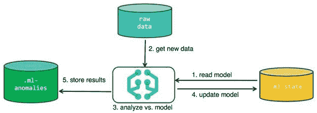

图 2.13 – 异常检测作业操作的简化序列

`autodetect`过程，这是异常检测作业的物理表现，在*图 2.13*中由分析对比模型步骤所表示。`.ml-state`索引偶尔会被`autodetect`过程读取和写入（如下一节所述）。`autodetect`过程的输出（分析的结果）存储在`.ml-anomalies-*`索引中。

通常，上述过程在每个`bucket_span`（除了从`.ml-state`的实际读写操作）中只执行一次。关键点是这种编排使得异常检测作业可以在线（即，不是离线/批量）并且持续学习新摄入的数据。这个过程也由 Elastic ML 自动处理，因此用户不必担心实现这一切所需的复杂物流。

## 异常检测模型快照

如前所述，异常检测模型的“状态”存储在`.ml-state`索引中。然而，它并不是在每个桶跨度中实际读取或写入。相反，模型状态主要保存在`autodetect`进程的内存中，并且仅定期序列化到`.ml-state`。如果异常检测作业被要求在大量历史数据上运行，或者实时运行，那么模型将按以下方式序列化：

+   定期，大约每 3 到 4 小时（或如果明确设置，则由`background_persist_interval`定义的间隔）

+   当异常检测作业被置于**关闭**状态时

由于模型定期序列化，旧的快照会自动在夜间系统维护作业中删除。默认情况下，如果`.ml-state`索引中最新的快照超过 1 天，它们将被删除，但每天的第一张快照除外。此外，所有超过最新快照 10 天的快照都将被删除。如果您想免除特定的快照并无限期地保留它，请使用 Kibana 中的 UI 或更新的模型快照 API 将`retain`设置的值设置为`true`。

可能也很明显，现在保存快照允许用户在操作过程中出现问题时，或出现意外情况时，将作业回滚到之前拍摄的模型快照之一。在*附录*的“技巧与窍门”部分之一，我们将通过一个示例演示如何忽略时间段并将作业回滚到使用模型快照。

# 摘要

总结来说，在本章中，我们涵盖了在自管理的本地 Elastic Stack 和 Elastic Cloud 的 Elasticsearch 服务中启用 Elastic ML 功能的流程。此外，我们还深入了解了与 Elastic Stack 其他部分的深度集成点以及 Elastic ML 从操作角度是如何工作的。

随着我们展望未来的章节，现在的焦点将不再是从概念和背景信息转向实际应用领域。从下一章开始，我们将直接进入 Elastic ML 的全面功能，我们将学习如何配置作业以解决日志分析、指标分析和用户行为分析中的某些实际用例。
