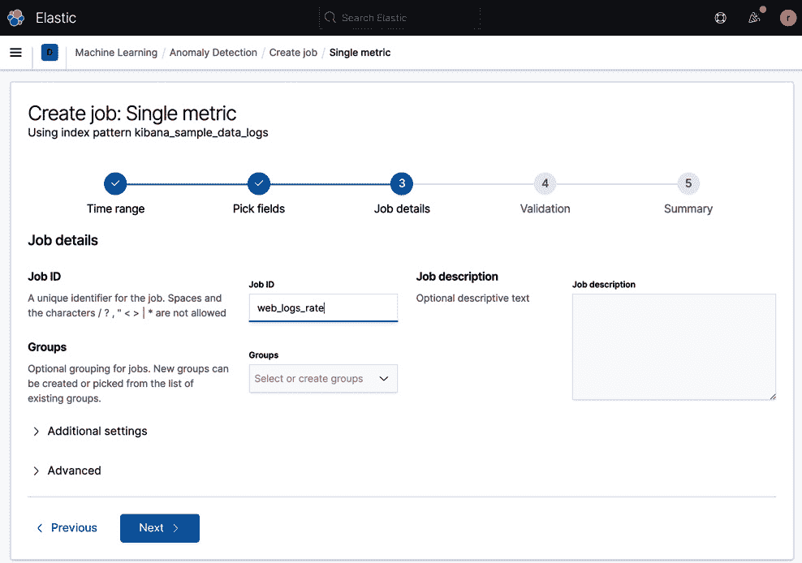
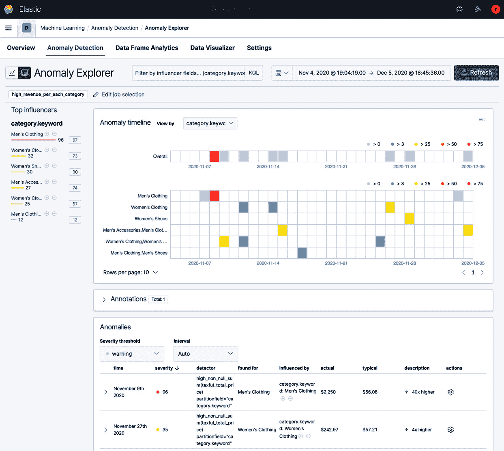

# *第三章*: 异常检测

**异常检测**是 Elastic ML 的原始功能，也是最成熟的，其根源可以追溯到 Prelert 时代（在 2016 年被 Elastic 收购之前）。这项技术稳健、易于使用、功能强大，并且广泛适用于所有时间序列数据的使用案例。

这本内容丰富的章节将专注于使用 Elastic ML 检测文档/事件发生率的异常、罕见事件以及超出预期正常操作的数值。我们将通过一些简单但有效的示例来展示 Elastic ML 的功效及其易用性。

具体来说，我们将涵盖以下内容：

+   Elastic ML 作业类型

+   拆解检测器

+   检测事件率的变化

+   检测指标值的变化

+   理解高级检测器功能

+   沿着分类特征进行拆分分析

+   理解时间序列分析与人口分析的区别

+   非结构化消息的分类分析

+   通过 API 管理 Elastic ML

# 技术要求

本章中的信息基于 v7.10 版本的 Elastic Stack。与所有章节一样，所有示例代码都可以在 GitHub 上找到：[`github.com/PacktPublishing/Machine-Learning-with-Elastic-Stack-Second-Edition.`](https://github.com/PacktPublishing/Machine-Learning-with-Elastic-Stack-Second-Edition )

# Elastic ML 作业类型

当我们开始使用 Elastic ML UI 来配置异常检测作业时，我们会看到有五个不同的作业向导被展示：


图 3.1 – 创建作业 UI 显示不同的配置向导

这些不同配置向导的存在意味着存在不同的“类型”的作业。实际上，实际上只有一个作业类型——只是异常检测作业有许多选项，而且许多向导使配置的某些方面更容易。你可以通过**高级**向导（或 API）完成你可能希望配置的所有内容。实际上，当 Elastic ML 首次在 v5.4 版本中以 beta 版发布时，这就是所有存在的。从那时起，其他向导已经添加，以简化特定用例的可用性。

异常检测作业有许多配置设置，但其中最重要的两个是**分析配置**和**数据源**。

分析配置是作业将检测的异常的配方。它包含一个检测配置（称为**检测器**）以及一些其他设置，例如桶跨度。数据源是 Elasticsearch 将要执行的查询配置，用于检索检测器将要分析的数据。

关于不同的作业向导，以下说法是正确的：

+   使用单一指标向导创建的作业只有一个检测器。它们的数据源包含一个查询和聚合，因此只向机器学习算法发送汇总数据。聚合是自动为您根据向导中的配置参数创建的。作业还使用一个名为`summary_count_field_name`的标志（设置为`doc_count`的值）来表示预期的将是聚合数据（而不是来自源索引的原始数据）。

+   使用多指标向导创建的作业可以有一个或多个检测器。分析还可以通过设置`partition_field_name`（在章节后面描述）来按分类字段拆分。它们的数据源不包含聚合（因为机器学习代码需要看到每个字段值的每个可能实例的所有文档，并将自行进行聚合），因此将完整的 Elasticsearch 文档传递给机器学习算法。

+   使用人口向导创建的作业可以有一个或多个检测器。向导还设置了`over_field_name`（在章节后面描述），表示将使用人口分析。分析还可以通过设置`by_field_name`（在章节后面描述）来按分类字段拆分。它们的数据源不包含聚合，因此将完整的 Elasticsearch 文档传递给机器学习算法。

+   使用分类向导创建的作业只有一个检测器。向导还设置了`categorization_field_name`（在章节后面描述），表示将使用分类分析。分类分析还将`by_field_name`（在章节后面描述）设置为`mlcategory`的值。分析还可以通过设置`partition_field_name`（在章节后面描述）来按分类字段拆分。它们的数据源不包含聚合，因此将完整的 Elasticsearch 文档传递给机器学习算法。

+   使用高级向导创建的作业可以利用所有可用的选项。用户需要知道自己在做什么，并正确配置作业。然而，UI 可以防止用户犯大多数错误。有经验的用户可以专门使用高级向导创建任何异常检测作业。

根据刚才描述的，作业创建的选项可能看起来令人畏惧。但不要担心——一旦我们熟悉了术语并走过了几个示例，你会发现作业配置是非常合理的；随着经验的积累，作业的配置将变得自然而然。让我们继续下一步，分解检测器的组件。

# 解构检测器

异常检测作业的核心是分析配置和检测器。检测器有几个关键组件：

+   **函数**

+   **字段**

+   **分区字段**

+   **按字段**

+   **覆盖字段**

我们将逐一介绍它们，以便完全理解它们。请注意，然而，在接下来的几节中，我们经常会引用作业配置中的实际设置名称，就像我们正在使用高级作业编辑器或 API 一样。尽管完全理解命名法是好的，但随着你通过本章，你也会注意到许多作业配置的细节都被抽象化了，或者比实际的设置名称有更多的“UI 友好”标签。

## 函数

检测器**函数**描述了数据将在分析间隔（桶跨度）内如何聚合或测量。有许多函数，但它们可以被归类为以下几类：


图 3.2 – 检测器函数表

带有星号（`*`）的项目也有高/低单侧变体（如`low_distinct_count`），这允许仅在一个方向上检测异常。

## 字段

检测器中的一些函数需要在数据中操作一个字段。以下是一些例子：

+   `max(bytes)`

+   `mean(products.price)`

+   `high_distinct_count(destination.port)`

因此，该函数直接操作的字段名称简单地称为`field_name`。

## 分配字段

经常会有这样的情况，检测分析需要沿着一个分类字段进行拆分，以便对该字段的所有唯一实例分别进行分析。在这种情况下，`partition`字段（设置称为`partition_field_name`）定义了要拆分的字段。例如，在电子商务中，你可能想查看每个类别的平均收入（男士服装、女士配饰等）。在这种情况下，`category`字段将是`partition`字段。我们将在本章后面探讨分析拆分。

## 分区字段

与`partition`字段类似，`by`字段（设置称为`by_field_name`）是另一种拆分分析的手段，但在如何建模和评分结果方面表现不同。此外，如果使用`rare`或`freq_rare`，则`by`字段是强制性的。关于使用`by`字段进行拆分与使用`partition`字段进行拆分的差异的更多细节将在本章后面讨论。

## 超字段

`over_field_name`)向异常检测算法发出信号，希望进行**总体分析**，其中实体与其同伴进行比较（而不是与自己的过去行为进行比较）。总体分析将在本章后面进行深入讨论。

## “公式”

如果我们要记录一个检测器的所有可能的配置选项，然后创建一个类似于流程图的地图，它将看起来如下：


图 3.3 – 从零开始构建检测器的“公式”

以下是一些关于*图 3.3*中所示图表的注意事项：

+   大写文本是解释，斜体文本是检测器配置设置（`by_field_name`、`partition_field_name`和`over_field_name`简化为`by`、`partition`和`over`）。

+   方括号中的项是可选的（高、低、非零、非空）。

+   只选择一个退出分支（注意`rare`/`freq_rare`中只有一个退出分支，因为`by`是强制性的）。

通过不选择`over`字段，简单地比较某事物与其自身历史记录。

在对检测器结构有全面理解之后，我们现在将进入使用检测器针对不同用例的实用示例。首先，我们将探索允许我们检测事件率随时间变化的计数函数。

检测事件率的变化

有许多重要的用例围绕着事件变化检测的概念。以下是一些例子：

+   在日志文件中突然出现大量错误消息

+   检测在线系统处理的订单数量的突然下降

+   确定对某事物进行访问尝试的突然过多（例如，特定用户 ID 上登录尝试数量的突然增加）

为了我们能够找到异常，我们首先必须有一个机制来理解正常发生率。但是，依赖我们易出错的人类观察和直觉并不总是最容易（或最可靠）的方法。

## 探索计数函数

如*第二章*中所述，*启用和实施*，Elastic ML 作业有一个称为**检测器**的异常检测“配方”。检测器是定义用户想要检测的异常的关键。在检测器中是**函数**，它选择要检测的“特征”。在计数函数的情况下，特征是某事物随时间发生的频率。我们将看到三个主要的计数函数：

+   `count`：计算从原始数据索引查询中得到的桶中文档的数量

+   `high_count`：与`count`相同，但只有当计数高于预期时才会标记异常

+   `low_count`：与`count`相同，但只有当计数低于预期时才会标记异常

我们将看到 Elastic ML 中有许多单侧函数（仅用于检测某一方向上的异常）。此外，重要的是要知道计数函数并不是在计数字段或文档中字段的存不存在；它们只是在索引中随时间计数文档。

为了更直观地了解计数函数的作用，让我们通过 Kibana 内的示例数据来举一个简单的例子：

1.  要启用示例数据，从 Kibana 主屏幕点击**添加数据**按钮（任一位置），如图 3.4 所示：![图 3.4 – 带有添加数据选项的 Kibana 主屏幕

    ![img/B17040_03_004.jpg]

    图 3.4 – 带有添加数据选项的 Kibana 主屏幕

1.  点击**添加数据**后，选择**样本数据**以显示三组数据：

    图 3.5 – 添加样本数据

1.  点击每个部分的三个**添加数据**按钮，将样本数据集加载到你的 Elastic Stack 中。一旦加载完成，我们将通过选择三个横线菜单图标（) 在 Kibana 的左上角以显示应用程序列表，然后选择**机器学习**：

    图 3.6 – 从 Kibana 应用程序菜单中选择机器学习

1.  一旦点击，我们将进入 ML 概览页面，在那里我们可以立即看到我们可以创建我们的第一个异常检测作业。点击**创建作业**按钮，如图 3.7 所示：

    图 3.7 – Elastic Cloud 欢迎屏幕

1.  我们接下来的任务是选择索引模式（带有索引分片图标标记）或一个已保存的搜索（带有放大镜图标标记），其中包含我们想要分析的数据。如果选择了一个已保存的搜索，那么一个之前在 Kibana 的`kibana_sample_data_logs`索引中创建并保存的过滤查询，因为我们希望将那个索引中的每个文档都通过 Elastic ML：

    图 3.8 – 选择 kibana_sample_data_logs 索引进行分析

1.  在下一屏幕上，我们将选择**单个度量**作业向导，因为此时我们只对分析数据的单一方面感兴趣：其随时间的变化计数：

    图 3.9 – 选择单个度量作业

1.  在下一屏幕上，为了跟随这个示例，*你必须选择* **使用完整的 kibana_sample_logs_data** *按钮，以便将样本异常包含在这个数据集中*：

    图 3.10 – 选择使用索引中的所有数据

    注意

    当此演示数据安装时，实际上将大约一半的数据放在过去，另一半放在未来（通过动态修改摄取时间戳）。这样做是为了提供一个机制，使得静态数据在查看“过去一小时”的数据仪表板时看起来像是“实时”的。因此，我们实际上会要求 Elastic ML 分析过去和未来的数据，而通常情况下，未来的数据是无法获得的。为了这个示例，现在暂时放下怀疑，因为我们想展示的异常在数据集的第二部分。

    现在，点击**下一步**按钮以进入配置向导的下一步。

1.  点击**下一步**按钮后，我们需要从**选择字段**下拉框中选择我们想要分析的内容。我们将选择**事件计数（事件率）**，以关注我们的原始目标，即检测在此索引中事件率随时间的变化：

    图 3.11 – 选择事件计数随时间变化作为我们的检测

    注意，查看这个下拉框会显示，根据数据中字段的数据类型，可以进行其他分析。我们将在后续示例中探索这些其他选项。

    点击**下一步**按钮继续，现在保留其他选项为默认值。

1.  现在，我们需要为我们的异常检测工作命名。在`web_logs_rate`中使用：

    图 3.12 – 为异常检测工作命名

    再次，将其他选项保留为默认值，并点击**下一步**按钮。

1.  进行验证步骤以确保分析合理：

    图 3.13 – 工作验证步骤

    点击**下一步**按钮继续。

1.  在这一点上，工作已经准备好创建（注意在*图 3.14*中，一些合理的默认选项，例如**模型内存限制**和**启用模型绘图**，已经为您选择了）：

    图 3.14 – 准备创建的异常检测工作

1.  点击**创建工作**按钮后，您将看到结果动画预览叠加在数据上方，如下所示：

    图 3.15 – 显示工作执行结果的预览

    现在我们点击**查看结果**按钮，以详细了解异常检测工作在数据中发现了什么。

1.  使用主图下方的刮擦器，调整查看区域的定位和宽度，以便放大查看大峰值：


图 3.16 – 显示关键异常的结果

注意

当您放大、缩小和移动时，请注意图表聚合间隔与工作桶跨度（如图 3.16 中圈出所示）的比较。如果您放大到一个更宽的视图，图表聚合间隔可以大于工作桶跨度，使得图表上绘制的异常位置不够精确。

在这里，在*图 3.16*中，我们可以看到事件的大幅上升被标记为两个不同的异常，因为日志中实际看到的 Web 请求数量比预期的高出大约 11 倍（考虑到直到那个时间点之前学习到的数据模型）。你可能注意到图表显示了两个相邻的异常，因为显然事件的上升跨越了多个 15 分钟的桶间隔。你也可能注意到，默认情况下，图表下面的表格中只显示了一个异常。这是因为**间隔**默认设置为**自动**，时间相邻的异常被汇总在一起，只显示最高分。如果**间隔**改为**显示所有**，那么两个异常记录都会列在表格中：


图 3.17 – 设置为显示所有异常

在这个例子中，还有一点需要注意，那就是数据集中较早出现的其他低分异常：


图 3.18 – 多桶异常

关于这些不太明显的异常，有几个关键点需要注意：

+   他们的分数低于我们刚刚调查的大幅波动，因为相对而言，这些并不那么异常，但有趣的是，它们具有显著性。

+   这里的异常是“预期值”的“缺乏”。换句话说，`count`函数将“无数据”解释为 0，如果通常情况下预期事件应该发生，那么这可能是异常的。

+   这些异常不是单个桶的异常，而是**多桶异常**。在 UI 中，多桶异常用不同的符号表示（一个十字而不是一个点）。它们表示实际的单个值可能并不一定是异常的，但在 12 个连续桶的滑动窗口中存在一个趋势。在这里，你可以看到有几个相邻桶出现了一个明显的下滑。

    注意

    关于解释多桶异常的更多信息，请参阅[elastic.co/blog/interpreting-multi-bucket-impact-anomalies-using-elastic-machine-learning-features](http://elastic.co/blog/interpreting-multi-bucket-impact-anomalies-using-elastic-machine-learning-features)上的详细博客文章。

通过这个例子，我们已经看到了`count`函数如何使我们能够轻松地检测到一组明显（和不那么明显）的异常，这些异常与索引中事件（文档）随时间发生的总体发生率有关。让我们继续我们的旅程，通过查看其他基于计数和发生率的函数。

## 其他计数函数

除了我们之前描述的函数之外，还有几个其他计数函数，可以支持更广泛的使用场景。

### 非零计数

非零计数函数（`non_zero_count`、`low_non_zero_count`和`high_non_zero_count`）允许处理基于计数的分析，同时允许在数据可能稀疏且您不希望将数据不存在明确地视为零，而是将其视为空值的情况下进行准确建模——换句话说，一个看起来像以下的时间序列数据集：

```py
4,3,0,0,2,0,5,3,2,0,2,0,0,1,0,4
```

使用`non_zero_count`函数的数据将被解释为以下内容：

```py
   4,3,2,5,3,2,2,1,4
```

将零视为空值在预期到在常规间隔内不存在测量值的情况下是有用的。以下是一些实际例子：

+   每月个人购买的航空机票数量

+   每天服务器重启的次数

+   每小时系统登录尝试的次数

要在作业向导中选择计数函数的非零计数版本，只需在设置期间切换**稀疏数据**选项：


图 3.19 – 添加稀疏数据选项以选择非零计数

我们将在本章后面看到，当我们通过高级作业向导或 API 配置作业时，我们将明确使用函数名（如`high_non_zero_count`）而不是使用更具概念描述的选项切换。

### 独特计数

独特计数函数（`distinct_count`、`low_distinct_count`和`high_distinct_count`）测量唯一性（在`kibana_sample_data_logs`索引的最后一个示例中，`distinct_count(url.keyword)`作为检测器配置，我们会捕捉到相同的时间段异常，但原因不同——不仅请求的整体量很高，正如我们在*图 3.16*中看到的，而且在*图 3.20*中，我们看到请求的 URL 多样性很高）：


图 3.20 – 独特计数检测器示例

在理解基于计数的功能之后，我们现在转向基于度量的功能，这些功能使我们能够分析数据中的数值字段。

# 检测度量值的变化

显然，并非所有从系统中发出的数据都将是有文本或分类性质的——其中大量的是数值数据。检测度量值随时间的变化非常适合用于异常检测，因为正如在*第一章*《IT 机器学习》中提到的，通过静态阈值在数值值上的异常警报的历史范式已经困扰了数十年。让我们一起来探索 Elastic ML 在帮助您检测数据中数值字段变化的功能方面所能提供的一切。

## 度量函数

度量函数在数值字段上操作并返回数值。它们可能是最容易理解的检测器函数。

### 最小值，最大值，平均值，中位数和度量

这些函数确实如您预期的那样工作：它们返回桶跨度内感兴趣字段所有数值观察值的最低值、最高值、平均值/均值和中位数。

`metric` 函数有点独特，因为它实际上只是指定 `min`、`max` 和 `mean` 一起使用的一种简写方式。

应该注意的是，如果数据的频率（例如，来自采样源（如 Metricbeat）的数据）与桶跨度完全匹配，那么每个桶跨度只有一个样本。这意味着感兴趣字段的最低值、最高值、平均值/均值和中位数都是相同的值（即单个观察值本身的值）。因此，如果你想要使用这些函数进行区分，通常最好在每个桶跨度内有多于一个数值样本。

另一个需要注意的事实是，这些指标函数将数据缺失视为 *null*。换句话说，如果你的数据稀疏，并且在某些桶跨度中没有观察到观察值，数据缺失不会“拖累”感兴趣字段的统计数据。这就是为什么基于指标的函数没有“非零”或“非空”对应物。

### varp

`varp` 函数测量一个指标随时间变化的总体方差——其波动性。使用此函数可能适用于寻找字段数值通常应该相当一致的情况，但你希望检测是否有变化。

### 求和与非空求和

`sum` 函数将返回桶跨度内感兴趣字段所有数值观察值的总和。如果你有稀疏数据且不希望将数据缺失视为 *零*，这将不可避免地“拖累”总和的值，请使用“非空”版本。

如果我们在上一个例子中在 `kibana_sample_data_logs` 索引中将 `sum(bytes)` 作为检测器配置，我们会捕捉到相同的时间段异常，但原因不同——我们注意到请求也导致了从网络服务器传输的字节数量增加：


图 3.21 – 求和检测器示例

这完全是有道理的，因为对网络服务器的请求增加将与传输的字节数量增加相关。

现在我们已经欣赏了简单的检测器函数，让我们继续探讨更复杂、更高级的函数。

# 理解高级检测器函数

除了之前提到的检测器函数外，还有一些其他更高级的函数，允许一些非常独特的功能。其中一些函数只有在通过高级作业向导或通过 API 配置 ML 作业时才可用。

## rare

在时间信息流（如日志文件）的上下文中，某事物在统计上稀有（以低频率发生）的概念既直观又难以理解。例如，如果我被要求浏览日志文件并找到一条稀有信息，我可能会倾向于将我看到的第一条新颖信息标记为稀有。但如果我们几乎每条信息都是新颖的怎么办？它们都是稀有的吗？或者什么都不是稀有的？

为了在时间事件流的环境中定义稀有性以使其有用，我们需要同意，将某事物声明为稀有必须考虑其存在的上下文。如果有许多其他常规事物和少量独特事物，那么我们可以认为独特事物是稀有的。如果有许多独特事物，那么我们将认为没有什么事物是稀有的。

在 ML 作业中应用`rare`函数时，需要声明`rare`函数关注的字段。该字段随后被定义为`by_field_name`。`rare`函数的配置在 Elastic ML UI 中没有自己的向导，因此您需要使用高级作业向导来定义它。例如，为了找到引用稀有国家名称的日志条目，将探测器结构设计如下：

![图 3.22 – 稀有探测器示例

![img/B17040_03_022.jpg]

图 3.22 – 稀有探测器示例

这对于查找意外的地理访问（例如，“我们的管理员几乎每天都从纽约和伦敦办公室登录，但从未从莫斯科登录！”）可能很有用。

## 频率稀有

`freq_rare`函数是`rare`的一个专用版本，它寻找导致`by_field_name`出现稀有值的群体成员。例如，您可以定位一个试图访问许多罕见 URL 的特定 IP 地址，这些 URL 在整个客户端 IP 地址群体中通常看不到。这个 IP 地址可能正在以恶意的方式尝试访问网站的隐藏部分，或者可能正在尝试 SQL 注入等攻击。

## 信息含量

`info_content`函数可能是 Elastic ML 工具箱中最专业的探测器函数。它最初被编写为测量文本字符串中**熵**的量（字符的数量和多样性）。这是因为已知在恶意软件中有加密指令和/或有效载荷数据以进行**命令和控制**（**C2**）和数据泄露活动的技术。通过数据的这一特征检测此活动比查看其他特征（如发送的字节数或计数不同的实体）更可靠。

使用的算法将基本上执行以下步骤：

1.  将独特的字符串按字母顺序排序。

1.  将那些独特的字符串连接成一个长字符串。

1.  对那个长字符串执行`gzip`算法以压缩它。

    信息含量是压缩数据的长度。

Elastic SIEM 中的一些 ML 作业使用了`info_content`函数——敬请期待第八章《其他 Elastic Stack 应用中的异常检测》以获取更多详细信息。

## 地理

如果您发现一个地理位置与地球上已学习到的地理位置区域不寻常，那么`lat_long`函数将很有帮助，它接受一个`field_name`参数，该参数是一个范围在-180 到 180（例如，`40.75, -73.99`，纽约市时代广场的坐标）的逗号分隔的数字对。`lat_long`函数还可以在`geo_point`字段、包含点值的`geo_shape`字段或`geo_centroid`聚合上操作。一个示例用例可能是标记一个对于特定用户、交易等来说不正常（可能是有欺诈或恶意）的位置。

## 时间

并非所有事物在时间上都是随机发生的，尤其是涉及人类行为的事物。我们可能在一天或一周的某个可预测的时间吃饭、通勤或登录某些系统。使用`time_of_day`和`time_of_week`函数，您可以检测从学习到的时间常规中的行为变化。如果行为在 24 小时时间框架内是可预测的，那么`time_of_day`更合适。如果常规依赖于一周中的某一天，那么`time_of_week`应该是一个更合理的选项。

注意

不要混淆这些时间函数的使用与异常检测作业中所有检测器的自然时间学习。如第一章《IT 机器学习》中所述，建模的去趋势能力将考虑某事发生的时间。这些函数只是将事件的时间戳建模在一天或一周之内。例如，如果某事每天晚上 2:00 A.M.都会例行发生，该函数将学习到这种事情发生的正常时间是每天的第 7,200 秒。

现在我们已经了解了所有检测函数的整个目录，让我们展望一下，看看我们如何通过拆分由分类字段表示的实体之间的建模来扩展分析的范围。

# 沿分类特征拆分分析

我们已经看到了异常检测作业在揭示单个时间序列数据集中有趣异常方面的力量。然而，分析可以通过分类字段进行拆分，从而在成千上万的独特实体上调用并行分析。

## 设置拆分字段

当使用一些工作向导（例如多指标和人口向导）时，您将看到一个选项来拆分分析：


图 3.23 – 在分类字段上拆分

在这里，*图 3.23*中，使用多度量向导构建针对`kibana_sample_data_ecommerce`索引的作业，我们看到`taxful_total_price`字段上的高总和函数正在按实例分割在名为`category.keyword`的字段上（同时开启**稀疏数据**选项）。换句话说，分析将针对这个电子商务店中的每个商品类别（男装、女装配饰等）进行。如果运行分析并使用异常探索器 UI 检查结果，结果可能看起来像以下这样：



图 3.24 – 分割分析的结果

注意在*图 3.24*中，异常探索视图与我们迄今为止在单度量查看器中看到的不同。异常探索显示了随时间变化的 10 个最异常的类别（我们分割的字段）。注意，并不是每个类别都显示出来，只有具有异常的类别——显然，**男装**类别在 11 月 9 日的收入为$2,250，是最不寻常的（在这个数据集版本中）。我们将学习更多关于理解多度量作业结果的知识，并在*第五章* *解释结果*中广泛使用异常探索器。

## 使用分区和 by_field 分割的区别

作为提醒，当使用多度量向导并调用分割时，`partition_field_name`设置被设置为 UI 中选择的字段值。

然而，当在人口向导中选择分割时，`by_field_name`被选中以分割分析。如果使用高级向导，则可以定义`partition_field_name`和/或`by_field_name`（如果两者都定义，则实际上是一个双重分割）。因此，了解这两个实际上分割分析的设置如何彼此不同将是有帮助的。

如果你想“硬分割”分析，使用`partition_field_name`：

+   通常，所选字段在每个工作项中应具有<10,000 个不同的值，因为需要更多的内存来分区。

+   字段的每个实例就像一个独立变量。

一个分区中异常的评分与其他分区更独立。

如果你想进行“软分割”，使用`by_field_name`：

+   通常，所选字段在每个工作项中应具有<100,000 个不同的值。

+   更适合实体的属性（因变量）。

+   评分考虑其他`by`字段的历史。

让我们深入探讨最后列出的项目——与“历史”相关的其他`by`字段。这究竟意味着什么？

通常，在异常检测工作分析中有一个概念，与实体首次发生的时间相关，我们可以称之为`host:X`或`error_code:Y`，可能存在两种情况：

+   新实体被视为“新颖”的，这本身就很引人注目，并且可能值得将其标记为异常。为此，您需要将“时间的黎明”设定为作业开始的时候。

+   新实体只是数据正常“扩展”的一部分——也许新服务器被添加到混合中，或者新的`product_id`被添加到目录中。在这种情况下，只需开始对该新实体进行建模，不要对它出现而大惊小怪。为此，您需要将“时间的黎明”设定为该实体首次出现的时候。

当使用`by_field_name`分析拆分时，“时间的黎明”是 ML 作业开始的时候，而当使用`partition_field_name`进行拆分时，“时间的黎明”是那个分区首次出现在数据中的时候。因此，如果您在出现“新事物”的情况下以不同方式拆分，您将得到不同的结果。

### 双重拆分是极限吗？

如前所述，在高级作业向导中使用`partition_field_name`和`by_field_name`，您可以有效地实现双重拆分。但是，如果您需要拆分更多，您将不得不依赖其他方法。具体来说，您需要创建一个**脚本字段**，它是两个（或更多）字段的连接。使用脚本字段是*附录*中某个示例中涵盖的内容。

现在我们已经了解了分析拆分的概念，让我们关注异常检测中时间序列分析和人口分析之间的差异。

# 理解时间序列分析 versus 人口分析

我们在*第一章*中学习了《IT 机器学习》，了解到将某事物视为异常实际上有两种有效的方法：

+   是否随着时间的推移，某事物的行为发生了剧烈变化

+   与其他同质群体中的同类相比，某事物是否发生了剧烈的不同

默认情况下，前者（我们将其简单地称为时间序列分析）是检测器配置中未指定`over_field_name`设置时使用的模式。

人口分析在寻找各种重要用例中的异常值时非常有用。例如，我们可能希望在下述场景中找到记录更多（或更少）的机器：

+   不正确的配置更改导致系统或应用程序的日志文件中突然出现更多错误。

+   可能被恶意软件破坏的系统可能实际上被指示在某些情况下抑制日志记录，从而大幅减少日志量。

+   一个失去连接或操作失败的系统，因此其日志量减少。

+   对日志级别设置（从正常改为调试）的更改，原本是无害的，但现在却令人烦恼地使日志占用更多的磁盘空间。

另一种人口分析经常使用的方式是与**用户/实体行为分析**（**EUBA**）相关，其中将实体或人类的行为与他们的同龄人进行比较，可能会揭示以下情况：

+   **自动化用户**：与典型的人类行为或使用模式不同，自动化脚本可能表现出在事件的速度、持续时间和多样性方面看起来相当不同的行为模式。无论是寻找试图收集在线目录中的产品和价格的网络爬虫，还是检测可能在社会媒体上传播虚假信息的机器人，自动识别自动化用户可能是有帮助的。

+   `distinct_count` 函数可以帮助找到间谍。

+   **恶意/滥用用户**：在侦察阶段之后，恶意用户或恶意软件将转向积极造成破坏，并采取主动措施，如拒绝服务、暴力破解或窃取有价值的信息。再次强调，与典型用户相比，恶意和滥用用户在每单位时间的行为量、多样性和强度方面有明显的差异。

找到一个客户比他们的同龄人花费多得多的实际例子。无论你是否在主动调查潜在欺诈的情况下做这件事，或者你是否对增加对最富裕客户的营销感兴趣，你仍然需要找到这些异常值。如果我们使用本章早期添加的`kibana_sample_data_ecommerce`索引，我们可以通过选择`customer_full_name.keyword`字段为`taxful_total_price`字段创建一个群体任务，这是每个个人订单的总收入：


图 3.25 – 用户收入群体分析

执行此任务后，你应该看到以下结果：


图 3.26 – 最大支出者的群体分析结果

在这里，在*图 3.26*中，我们看到最不寻常的用户列表（在这种情况下，每单位时间的最大支出者）主要由名为**Wagdi Shaw**的用户主导，他显然订购了价值 2250 美元的商品。你们中敏锐的人会从早期示例中识别出这个异常——但这次，我们分析的重点是用户，而不是库存类别。

如您所见，人口分析可以非常强大，并且在针对单个实体的用例中得到了广泛的应用。因此，它在安全分析用例中非常有用。现在，让我们转向关注 Elastic ML 的异常检测的一个额外但强大的功能——通过称为分类的过程有效地分析非结构化日志消息的能力。

# 非结构化消息的分类分析

想象一下，你正在通过查看特定的日志文件来排查问题。你看到日志中的一行，看起来如下：

```py
   18/05/2020 15:16:00 DB Not Updated [Master] Table
```

除非你对创建此日志的应用程序的内部工作原理有深入了解，否则你可能不知道这条消息是否重要。数据库被标记为“未更新”可能听起来像是一种负面情况。然而，如果你知道该应用程序例行地每小时写这条消息几百次，那么你自然会意识到这条消息是无害的，可能应该被忽略，因为显然应用程序每天都能正常工作，尽管这条消息被写入日志文件。

显然，问题是人类解释。检查消息文本和阅读一个负面短语（“未更新”）可能会使一个人倾向于认为这条消息值得关注，因为可能存在问题。然而，消息的频率（它例行发生）应该让这个人知道这条消息可能并不重要，因为应用程序正在运行（也就是说，没有报告故障），尽管这些消息被写入日志。

对于日志文件中仅几种类型的消息，人类处理这些信息（评估消息内容/相关性以及随时间的变化频率）可能很困难。想象一下，如果每天有数百万条独特的消息类型以每天数百万条日志行的总速率发生。即使是最有经验的在应用程序内容和搜索/可视化方面的专家，也会发现这既不实际，甚至可能不可能处理。

Elastic ML 通过允许对消息内容的唯一性和相对发生频率进行经验评估的能力来提供帮助。

## 适合分类的消息类型

我们需要对我们定义的消息日志行类型进行一定的严谨性，以适用于这种分析。我们**不考虑**的是完全自由形式的日志行/事件/文档，这些可能是人类创作的结果（电子邮件、推文、评论等）。这类消息在构建和内容上过于随意和多变。

相反，我们将专注于机器生成的消息，这些消息在应用程序遇到不同情况或异常时显然会被发出，从而将它们的构建和内容限制在相对离散的可能性的集合中（理解到消息确实可能有一些可变方面）。例如，让我们看看以下几行应用程序日志：

```py
18/05/2016 15:16:00 S ACME6 DB Not Updated [Master] Table
18/05/2016 15:16:00 S ACME6 REC Not INSERTED [DB TRAN] Table 
18/05/2016 15:16:07 S ACME6 Using: 10.16.1.63!svc_prod#uid=demo;pwd=demo 
18/05/2016 15:16:07 S ACME6 Opening Database = DRIVER={SQL Server};SERVER=10.16.1.63;network=dbmssocn;address=10.16.1.63,1433;DATABASE=svc_prod;uid=demo;pwd=demo;AnsiNPW=No 
18/05/2016 15:16:29 S ACME6 DBMS ERROR : db=10.16.1.63!svc_prod#uid=demo;pwd=demo Err=-11 [Microsoft][ODBC SQL Server Driver][TCP/IP Sockets]General network error. Check your network documentation.
```

在这里，我们可以看到有各种消息，每个消息中的文本都不同，但这里有一些结构。在日期/时间和消息来源的服务器名称（这里为`ACME6`）之后，是消息的实际内容，其中应用程序正在向外界告知当时正在发生的事情——是正在尝试某事还是发生了错误。

## 分类过程使用的算法

为了使日志文件中消息的无序流动变得有序，Elastic ML 将采用一种通过使用字符串相似度聚类算法将相似消息分组在一起的技术。该算法背后的启发式方法大致如下：

+   重点关注（英语）词典中的单词，因为`network`和`address`是词典中的单词，但`dbmssocn`可能是一个可变/变量的字符串）。

+   将不可变的词典单词通过字符串相似度算法（类似于**Levenshtein 距离**）传递，以确定日志行与过去日志行的相似程度。

+   如果当前日志行与现有类别之间的差异很小，那么将现有日志行分组到该类别中。否则，为当前日志行创建一个新类别。

作为简单的例子，考虑以下三条消息：

```py
   Error writing file "foo" on host "acme6"
   Error writing file "bar" on host "acme5"
   Opening database on host "acme7"
```

该算法会将前两条消息聚类到同一个类别中，因为它们会被视为`Error writing file on`类型的消息，而第三条消息将获得其自己的（新）类别。

这些类别的命名很简单：ML 将简单地称它们为`mlcategory N`，其中`N`是一个递增的整数。因此，在这个例子中，前两行将与`mlcategory 1`相关联，而第三行将与`mlcategory 2`相关联。在现实机器日志中，可能由于日志消息的多样性，会有成千上万（甚至数十万）个类别被生成，但可能的类别集合应该是有限的。然而，如果类别的数量开始达到数十万，可能就会明显看出日志消息不是一个受约束的可能消息类型的集合，并且不会是这种分析的好候选。

## 分析类别

现在消息将要被前面描述的算法进行分类，接下来过程的下一步是对其进行分析（使用`count`或`rare`）。在这种情况下，我们不会计算日志行（以及 Elasticsearch 索引中的文档）本身；相反，我们将计算算法输出的不同类别的出现频率。例如，给定前一个部分中的示例日志行，如果它们发生在同一个桶跨度内，分类算法的输出如下：

```py
   mlcategory 1: 2
   mlcategory 2: 1
```

换句话说，在最后一个桶跨度间隔中，出现了两次`Error writing file on`类型的消息和一次`Opening database on host`类型的消息。这些信息最终将由 ML 作业建模，以确定其是否异常。

## 分类作业示例

在 UI 中的分类作业向导中，配置此类作业的过程非常简单。让我们首先假设我们有一个未结构化的日志文件被摄取（例如，GitHub 上`example_data`文件夹中的`secure.log`文件）：

注意

关于如何使用文件可视化器摄取数据的更多信息，请参阅[elastic.co](http://elastic.co/blog/importing-csv-and-log-data-into-elasticsearch-with-file-data-visualizer)上的详细博客文章。

1.  在选择感兴趣的索引和选择分类向导后，然后选择分析的时间范围，我们看到向导将询问我们哪个`@timestamp`和`message`)。因此，`message`字段是我们希望 Elastic ML 进行分类的字段。在这个例子中，我们还将选择**计数**检测器：![图 3.27 – 分类作业配置

    ![图片 B17040_03_027.jpg]

    图 3.27 – 分类作业配置

    注意在*图 3.27*中，对所选类别字段进行了检查，以确保它将产生合理的结果。同时注意，在**示例**部分，你可以通过视觉确认 Elastic ML 专注于日志消息的非可变文本。

1.  一旦确认配置并在向导中启动作业，你将看到结果的预览，这些结果正在被发现和分析：![图 3.28 – 分类作业执行预览

    ![图片 B17040_03_028.jpg]

    图 3.28 – 分类作业执行预览

    注意，在这个简单的例子中，数据中共发现了 23 个类别。当在异常探索器中查看结果时，我们看到这里的顶级异常是`mlcategory`编号 7。

1.  当你点击`Received disconnect`消息时。

1.  通过单击图 3.29 中显示的齿轮图标，我们可以选择**查看示例**，这会将我们带到 Kibana Discover UI，但仅过滤到适当的消息并缩放到相关的时间段：![图 3.30 – 检查分类作业结果中的原始日志行

    ![图片 B17040_03_030.jpg]

    图 3.30 – 检查分类作业结果中的原始日志行

    注意，发现查询栏已自动填充了适当的 KQL 查询，以限制我们的视图仅限于异常的消息类型。

1.  如果我们删除那个查询过滤器，我们将看到这个异常发生时的日志文件中的所有消息，并且我们会看到更大的故事，即有人或某物正在尝试进行大量身份验证：


图 3.31 – 检查异常发生时的所有日志行

正如我们在*图 3.31*中看到的，似乎有大量的使用知名用户名（如`user`、`test`等）的认证尝试。看起来我们只是通过分类就找到了暴力认证尝试！

## 当避免使用分类时

尽管分类非常有用，但它并非没有局限性。具体来说，以下是一些尝试使用分类可能返回较差结果的情况：

+   使用自由形式的文本字段，这些文本很可能是由人类创建的。例如，包括推文、评论、电子邮件和笔记等。

+   对于应该被解析成正确的名称/值对的日志行，例如 Web 访问日志。

+   对于包含大量多行文本的文档。这包括堆栈跟踪、XML 等。

话虽如此，我们可以看到，在分析非结构化文本可能会给人类分析师带来额外负担的情况下，分类仍然可以非常有用。

# 通过 API 管理 Elastic ML

就像 Elastic Stack 中的几乎所有事情一样，ML 也可以通过 API 调用完全自动化——包括作业配置、执行和结果收集。实际上，您在 Kibana UI 中的所有交互都利用了背后的 ML API。例如，如果您想编写自己的 UI，并且有特定的工作流程或可视化需求，您完全可以这样做。

注意

有关异常检测 API 的更多信息，请参阅[elastic.co/guide/en/machine-learning/current/ml-api-quickref.html](http://elastic.co/guide/en/machine-learning/current/ml-api-quickref.html)。Elastic ML 的数据帧分析部分有一个完全独立的 API，将在第九章到第十三章中进行讨论。

我们不会深入到每个 API 调用，但我们想强调一些值得注意的部分。

首先要提到的明显 API 是作业创建 API，它允许创建 ML 作业配置。例如，如果您想重新创建*图 3.25*中显示的种群分析作业，以下调用将创建该作业，我们将称之为`revenue_over_users_api`：

```py
PUT _ml/anomaly_detectors/revenue_over_users_api
{
  "job_id": "revenue_over_users_api",
  "analysis_config": {
    "bucket_span": "15m",
    "detectors": [
      {
        "detector_description": "high_sum(taxful_total_price) over customer_full_name.keyword",
        "function": "high_sum",
        "field_name": "taxful_total_price",
        "over_field_name": "customer_full_name.keyword"
      }
    ],
    "influencers": [
      "customer_full_name.keyword"
    ]
  },
  "data_description":{
         "time_field":"order_date",
         "time_format":"epoch_ms"
      }
}
```

注意，创建作业时`job_id`字段必须是唯一的。

为了为这个作业创建配套的数据源配置，我们会发出这个单独的 API 调用：

```py
PUT _ml/datafeeds/datafeed-revenue_over_users_api
{
  "datafeed_id": "datafeed-revenue_over_users_api",
  "job_id": "revenue_over_users_api",
  "query_delay": "60s",
  "indices": [
    "kibana_sample_data_ecommerce"
  ],
  "query": {
    "bool": {
      "must": [
        {
          "match_all": {}
        }
      ]
    }
  },
  "scroll_size": 1000,
  "chunking_config": {
    "mode": "auto"
  }
}
```

注意，默认的索引查询是`match_all`，这意味着不会进行任何过滤。当然，我们可以在查询块中插入任何有效的 Elasticsearch DSL 来执行自定义过滤或聚合。这个概念将在本书的后续部分进行介绍。

有其他 API 可以用来提取结果或修改 ML 作业的其他操作方面。有关更多信息，请参阅在线文档。

# 摘要

我们已经看到，Elastic ML 可以突出指标和日志消息中的数量、多样性和独特性的变化，包括那些需要先进行一些分类的。此外，我们还展示了当重点更多地放在寻找最不寻常的实体时，人口分析可以成为时间异常检测的一个极其有趣的替代方案。这些技术有助于解决我们之前描述的挑战，在这些挑战中，人类可能难以识别真正不寻常且值得注意和调查的事物。

本章学到的技能将在后续章节中有所帮助，其中我们将看到机器学习如何协助找到复杂 IT 问题的根本原因，识别应用程序性能的放缓，或者当机器学习可以协助识别恶意软件和/或恶意活动时。

在下一章中，我们将看到如何利用异常检测作业构建的表达式时间序列模型来预测数据未来的趋势。
