# *第四章*: 预测

**预测**是 Elastic ML 的时间序列建模的自然扩展。由于在幕后构建了非常表达性的模型，并描述了数据的历史行为，因此可以预测这些信息在时间上的前进，并预测某物在未来某个时间点应该如何表现。

我们将花时间学习预测背后的概念，以及通过一些实际示例进行操作。

具体来说，本章将涵盖以下主题：

+   对比预测与预言

+   预测用例

+   运营预测理论

+   单个时间序列预测

+   查看预测结果

+   多个时间序列预测

# 技术要求

本章中展示的信息和示例与 Elastic Stack 的 v7.11 版本相关。

# 对比预测与预言

*过去的表现并不能预示未来的结果*。这个免责声明是金融公司在引用如共同基金等产品表现时所使用的。但这个免责声明有点自相矛盾，因为过去是我们唯一可以工作的东西。如果构成共同基金的这些公司在过去八个季度中一直有持续的正季度业绩，这能保证他们接下来八个季度也会有正面的业绩组合，并且他们的公开估值会持续上升吗？概率可能支持这种情况，但这可能不是全部的故事。在我们过于乐观地认为 Elastic ML 的预测能力是我们股市发财的关键之前，我们应该对以下关键警告保持现实——总有一些不可控的因素。

金融公司使用上述免责声明的原因是，通常存在一些未知、不可控的因素出现，并且这些因素可能对某物的轨迹产生非常大的影响。例如，政府可能会改变法规或贸易政策，这可能会极大地帮助或阻碍公司的运营和盈利能力，或者可能发生内部欺诈会计丑闻，其中高管密谋伪造公司业绩，这最终变得难以维持并最终导致公司破产。

由于以下原因，这些因素被认为是未知的外部因素：

+   它们超出了实体的控制范围（例如，政府独立于公司的活动制定政策）。

+   它们被隐藏在关于系统的可用信息中（例如，外部投资者在实时情况下只能访问公开的性能报告，而无法了解可能伪造这些性能报告的欺诈活动）。

因此，预测的准确性仅取决于你所拥有的信息和消除或减轻影响预测的外部未知因素的能力。在信息技术（IT）数据的世界中也是如此。如果存在未知的外部因素（例如，有人错误地进行了配置更改、硬件故障等），则可能无法预测趋势或故障。然而，我们可以使用概率分析来给出我们对未来的最佳猜测，除了那些可能的外部因素之外。理解这个注意事项使我们能够在不陷入预言期望的情况下满足一些良好的预测用例。现在，让我们将重点转向如何以实际的方式使用预测。

# 预测用例

在 Elastic ML 的背景下，实际上只有两种——有些相似——的使用场景，人们会使用预测。这些场景在此概述：

+   **价值导向**：这是将时间序列外推到未来，以了解可能的未来值。这类似于回答以下问题：“两个月后我每天将卖出多少个部件？”

+   **时间导向**：这是理解预期值可能达到的时间。这将回答类似以下问题：“我预计在下周达到 80%的利用率吗？”

这两种使用场景之间的差异可能不仅仅是提问方式（如何搜索数据），还包括你如何解释输出。然而，在我们深入探讨如何使用预测功能的一些示例之前，让我们花点时间讨论一下它在逻辑上的工作方式。

# 预测操作理论

首先要认识到，对数据进行预测的行为实际上是对现有异常检测工作的扩展。换句话说，你需要配置一个异常检测工作，并且该工作需要在预测数据之前分析历史数据。这是因为预测过程使用了异常检测工作创建的模型。要预测数据，你需要遵循在其他章节中描述的创建异常检测工作所使用的相同步骤。如果该工作执行过程中生成了异常，你可以忽略它们，如果你的唯一目的是执行预测。一旦工作在历史数据上学习完毕，与该工作关联的模型或模型（如果工作配置为分析来自多个时间序列的数据）就是当前的和最新的，如下面的图所示：


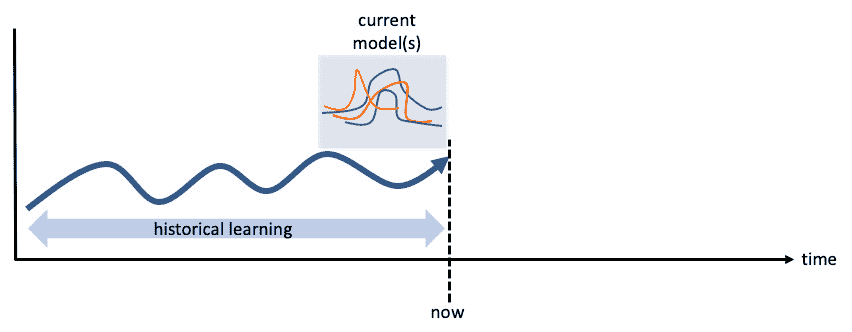

图 4.1 – 从历史学习中获得模型的象征性表示

我们将考虑现在之前的时间作为**历史学习**——模型在真实数据上学习的时间。当用户希望在特定时间调用预测时，会创建模型的一个副本，并使用一个独立的过程来将这些模型外推到“未来”。这个过程与原始模型及其演变并行运行，以避免干扰。以下图表展示了这一过程：

![图 4.2 – 将模型复制用于未来预测的符号表示]

![图片 B17040_04_2.jpg]

![图 4.2 – 将模型复制用于未来预测的符号表示]

预测值将写入与异常检测相同的索引，但作为特殊类型的结果（稍后将有更多细节），并且可以在**用户界面**（**UI**）中查看或通过**应用程序编程接口**（**API**）访问。

重要的是要注意，分析实际真实数据的**机器学习**（**ML**）作业的正常路径将继续（如果它在实时运行），因此经过一段时间后，预测值（在预测时做出的）和到达该时间时的实际值之间可能会有差异，如下面的图表所示：

![图片 B17040_04_3.jpg]

![图 4.3 – 预测误差的符号表示]

![图 4.3 – 预测误差的符号表示]

这种预测误差是可以预见的，但希望它将是微小的。两者之间的差异目前没有被 Elastic ML 使用，但也许在未来它可以向模型提供关于更准确后续预测的信息。当然，也有可能未知的外部因素（如前所述）会导致一定数量的预测误差。

另一种（可能更简单）思考预测不确定性的方法是考虑预测抛硬币的结果。你可以观察一系列之前的抛硬币，但如果你不考虑抛硬币的物理特性（速度、高度、旋转等）并且只依赖于过去观察的结果，那么你永远无法在结果上做出超过 50/50 的预测。此外，Elastic ML 在学习期间可能没有看到行为上完全一致的数据。因此，在数据中存在一定量的噪声的情况下，我们也应该预期预测中存在一定量的变化或不确定性。

用户还可以在其他时间做出多个预测。这些预测将被分别存储，如下面的图表所示：

![图 4.4 – 在不同时间调用多个预测的符号表示]

![图片 B17040_04_4.jpg]

![图 4.4 – 在不同时间调用多个预测的符号表示]

**预测#1**和**预测#2**之间的区别将基于每个预测实例的内部唯一 ID。当我们查看预测结果在索引中的存储方式时，这一点将变得明显。

现在我们对预测过程的物流操作有了基本了解，让我们通过一个例子来了解如何使用 Elastic ML 对单一时间序列进行预测。

# 单一时间序列预测

为了说明预测过程，我们将从一个单一时间序列的数据集开始。虽然这个数据集是通用的，你可以想象它可能代表一个系统性能指标、系统处理的交易数量，甚至销售收入的统计数据。这个数据集的重要之处在于它包含几个不同的基于时间的变化趋势——日趋势、周趋势和整体增长趋势。Elastic ML 将发现所有这三个趋势，并将有效地预测它们到未来。值得注意的是，数据集还包含一些异常值，但（当然）未来的异常值无法预测，因为它们按定义是意外事件。由于我们在这里的讨论纯粹是关于预测，因此我们在构建预测模型时将忽略数据集中发现的任何异常值。

话虽如此，让我们通过使用 GitHub 仓库中的`forecast_example`数据集来举一个例子。一旦下载，数据就可以通过 Elastic ML 的数据可视化器轻松导入到您的 Kibana 中。我们继续如下操作：

1.  要上传示例数据，从 Kibana 主屏幕点击**上传文件**按钮，如下截图所示：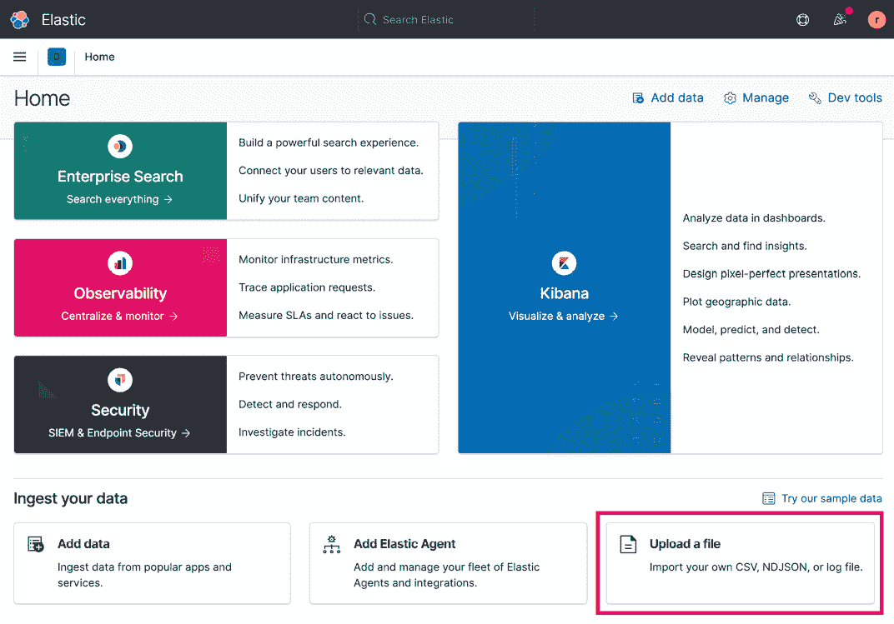

    图 4.5 – 在 Kibana 中上传文件的选项

1.  从您的本地机器中选择`forecast_example.json`文件。数据可视化器将显示文件的前 1000 行，以供您预览文件内容，以及不同字段的分解。这体现在以下截图中：

    图 4.6 – 预览要上传的文件内容

1.  点击**导入**按钮，然后为要上传的数据指定目标索引名称，如下截图所示：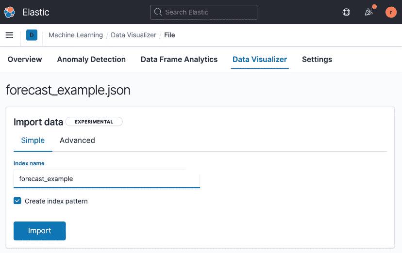

    图 4.7 – 为上传的目标索引命名

1.  为您的目标索引提供一个名称，如果这是您第一次上传，请确保勾选**创建索引模式**选项，然后再次点击**导入**按钮以完成上传。您应该看到上传成功的提示，如下截图所示：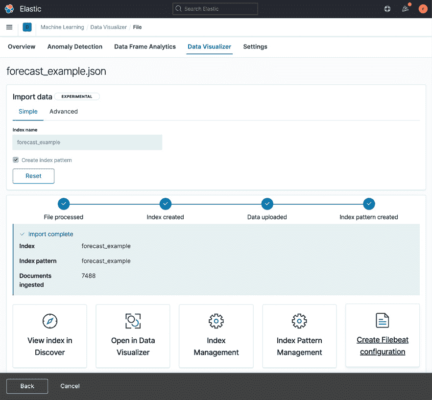

    图 4.8 – 上传完成

1.  数据上传完成后，导航到**机器学习**并创建一个异常检测作业，选择你在上一步中创建的索引模式的索引名称。这在上面的屏幕截图中表示：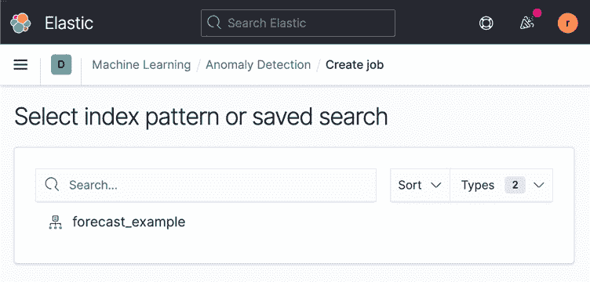

    图 4.9 – 首先创建一个异常检测作业

1.  这个特定的数据集仅包含一个单一的时间序列指标（一个名为`amount`的字段），因此我们将简单地使用**单个指标**作业向导来构建作业，如以下屏幕截图所示：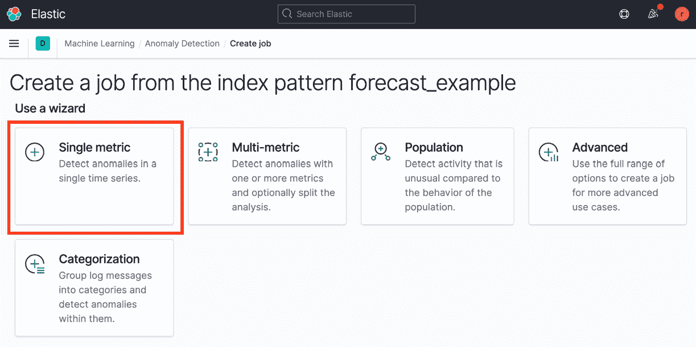

    图 4.10 – 为此数据选择“单个指标作业向导”

1.  在下一屏幕和此示例中，我们只想分析到 2017 年 3 月 1 日 00:00:00.000，以便为我们留下一些数据来比较我们的预测。你可以通过首先点击**使用完整的 forecast_example 数据**按钮，然后手动更改结束日期以匹配以下屏幕截图所示的内容：![图 4.11 – 选择只使用到特定日期的数据    图 4.12 – 选择在时间上对金额字段求和作为我们的检测    图 4.11 – 选择只使用到特定日期的数据    注意    此示例数据集记录了从 2017 年 1 月 31 日到 2017 年 3 月 1 日的数据。尽管这些数据来自过去，我们可以设想一个场景，即我们假装处于那个时间段，并宣布今天的日期是 2017 年 3 月 1 日。因此，我们希望有一个机器学习作业分析 1 月 31 日到“今天”之间的数据，然后使用机器学习预测未来 10 天的数据。我们稍后将看到我们的预测与剩余数据的准确性。如果你的 Kibana 时区设置为本地时间，本章中的日期可能看起来略有不同，因为截图是在将 Kibana 设置为美国东部时区版本的 Kibana 上拍摄的。（**美国**）（**US**）    现在，点击**下一步**按钮以进入配置向导的下一步。1.  点击“金额”字段后，它只是一个随时间变化的数值。这在上面的屏幕截图中表示：

    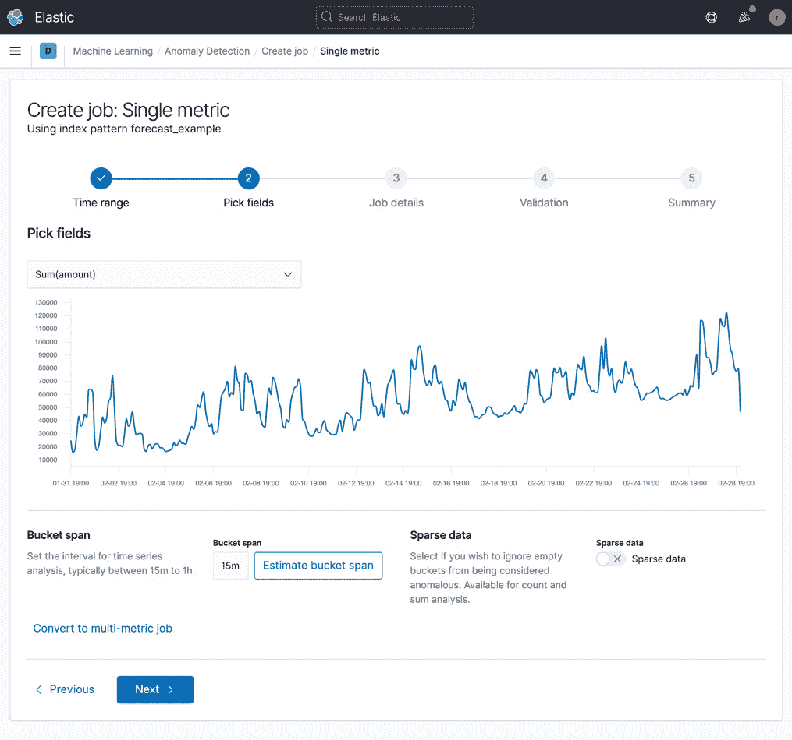

    点击**下一步**按钮继续，暂时保留其他选项为默认设置。

1.  现在，我们需要命名我们的异常检测作业——在`forecast_example`中使用：

    图 4.13 – 命名异常检测作业

    再次，保留其他选项为默认设置，并点击**下一步**按钮。

1.  进行验证步骤以确保一切设置正确，以便分析可以正常工作，如以下屏幕截图所示：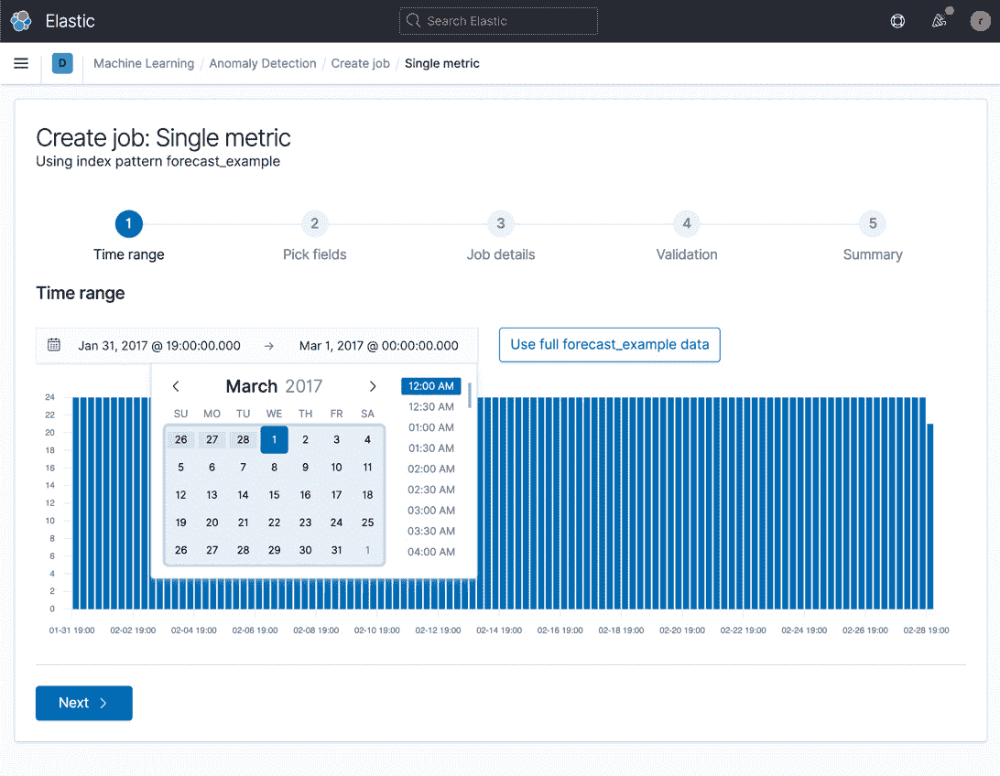

    图 4.14 – 作业验证步骤

    点击**下一步**按钮继续。

1.  在此阶段，工作已准备好创建，如下截图所示：

    图 4.15 – 准备创建的异常检测工作

1.  点击**创建工作**按钮后，您将看到结果动画预览叠加在数据上方，如下述截图所示：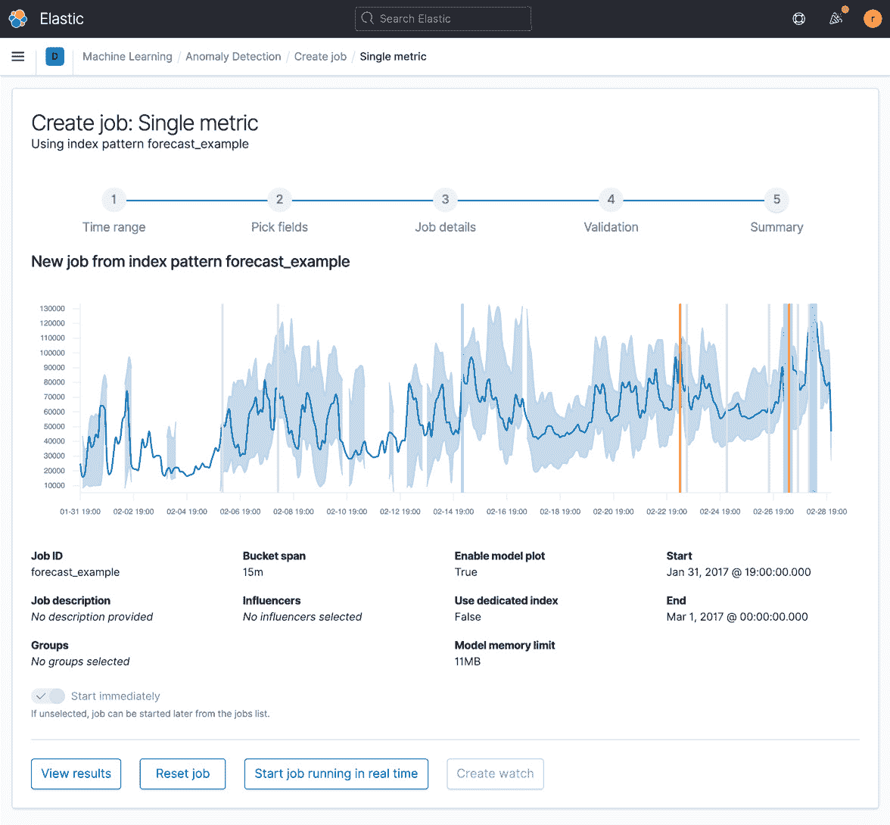

    图 4.16 – 显示作业执行结果预览

    要访问预测功能，我们需要点击**查看结果**按钮，这将带我们到**单指标查看器**。在**单指标查看器**中，我们可以看到整体数据集，并可以欣赏到数据的行为方式及其形状和复杂性；既有日周期成分，也有周周期成分，以及一个逐渐上升的正斜率/趋势，导致数据随时间上升。这在下述截图中有展示：

    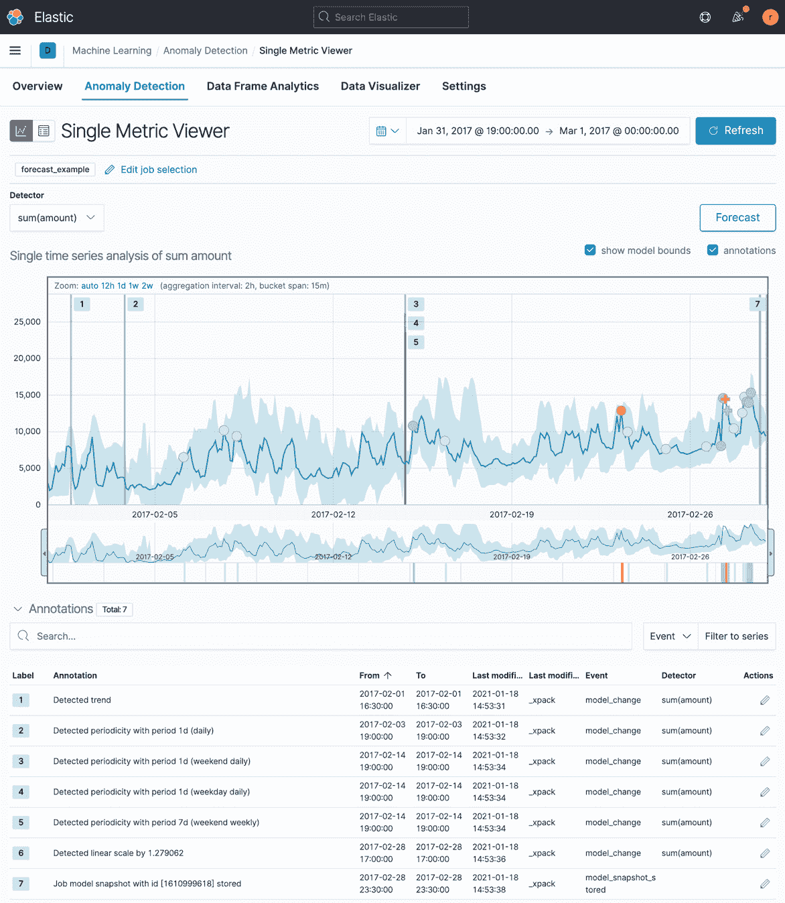

    图 4.17 – 显示注释的结果

    如果我们暴露并探索注释，我们实际上可以看到 Elastic ML 在数据中检测到的不同趋势的确切位置。此外，请记住，尽管我们可能只对在此数据上预测感兴趣，但工作仍会在数据的历史中指出来异常。在这种情况下，如果我们选择，我们可以简单地忽略它们。

1.  要在此数据上调用预测，请点击`10d`），如下述截图所示：

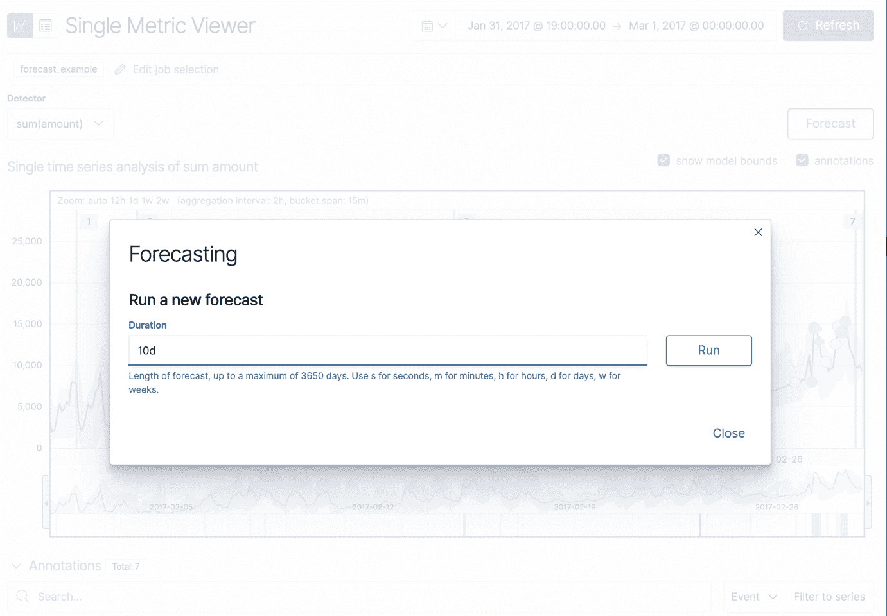

图 4.18 – 启动新的 10 天预测

注意

不应尝试请求比 ML 工作已分析的数据持续时间更长的预测持续时间。换句话说，如果 ML 工作只看到一周的数据，就不要请求两周的预测。至少历史数据与想要预测的数量的比例应该是一对一（理想情况下，历史数据的比例会更高）。最后，提供足够一致的数据来了解主要模式。例如，使用至少三个周期性的模式循环来达到最佳预测效果。

点击*图 4.18*中显示的**运行**按钮后，预测将在后台调用并运行。我们可以几乎立即看到预测结果，如下述截图所示：


图 4.19 – 预测结果

预测/预测区域周围的阴影区域是 95% 置信区间。换句话说，Elastic ML 估计未来值有 95% 的可能性将在这个范围内（同样，只有 2.5% 的可能性未来值将高于或低于置信区间）。目前 95% 的置信区间是一个固定值，用户尚不能设置。

现在我们有了从 UI 创建简单预测的能力，在继续更复杂的示例之前，让我们更深入地探索预测的结果。

# 查看预测结果

现在我们已经运行了一个预测，我们可以更深入地查看预测过程生成的结果。我们可以在 UI 中通过两种方法查看之前创建的预测的结果。第一种方法是点击**单指标查看器**中的**预测**按钮，以显示之前预测的列表，如下所示：


图 4.20 – 在单指标查看器中查看之前创建的预测

或者，您可以在该作业的**预测**选项卡下的**作业管理**页面中查看它们，如下面的截图所示：


图 4.21 – 在作业管理页面查看之前创建的预测

注意

在 Kibana 中构建的预测结果默认寿命为 14 天。之后，预测结果将被永久删除。如果需要不同的过期持续时间，则必须通过`_forecast` API 端点调用预测，这将在稍后讨论，但已在[`www.elastic.co/guide/en/elasticsearch/reference/current/ml-forecast.html`](https://www.elastic.co/guide/en/elasticsearch/reference/current/ml-forecast.html)中记录。

当你在**单指标查看器**中查看预测结果时，注意当你将鼠标悬停在预测数据点上时，一个弹出显示将列出关于该数据点的三个关键信息——预测值、上限值和下限值，如下面的截图所示：

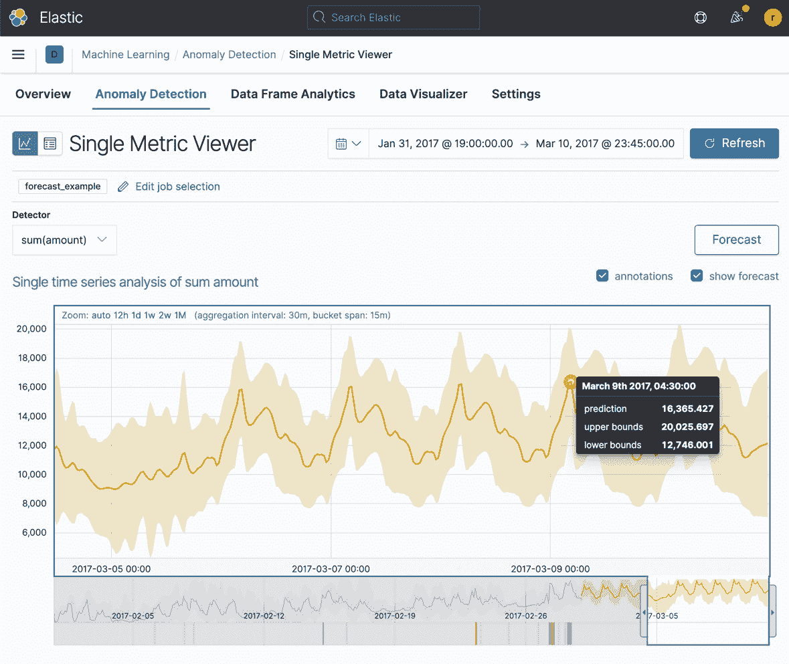

图 4.22 – 预测弹出显示中显示的信息

回想一下，上限和下限定义了一个 95%置信区间的范围。预测值是最有可能的值（概率）。这三个关键值存储在`.ml-anomalies-*`结果索引中，以下列名称：

+   `forecast_prediction`

+   `forecast_upper`

+   `forecast_lower`

在*第五章* *解释结果* 中，我们将学习如何查询`.ml-anomalies-*`索引以定位预测信息，以及我们如何利用这些信息用于其他目的，例如仪表板或警报。

如果我们想看看 Elastic ML 的预测与数据集接下来的 10 天实际数据相比做得如何（记住——机器学习作业的模型还没有真正看到那些天），我们可以回到**作业管理**页面并开始作业的数据馈送以继续并分析剩余的数据。为此，点击右侧菜单中的**启动数据馈送**链接，如图下所示：

![图 4.23 – 从作业管理页面开始数据馈送

![img/B17040_04_23.jpg]

图 4.23 – 从作业管理页面开始数据馈送

一旦弹出对话框，将**搜索开始时间**字段设置为**从 2017-03-01 00:00:00 继续**（或它显示的您本地时区的时间），并将**搜索结束时间**字段指定为 2017 年 3 月 11 日午夜 12:00，如图下所示：

![图 4.24 – 从上次停止的地方继续数据馈送

![img/B17040_04_24.jpg]

图 4.24 – 从上次停止的地方继续数据馈送

完成此操作后，返回作业的**单一度量查看器**，确保您使用 Kibana 时间选择器查看正确的时间范围，然后点击**预测**按钮查看本章前面描述的先前创建的预测。现在您将能够看到预测值叠加在数据实际值上，如图下所示：

![图 4.25 – 将预测与实际数据比较

![img/B17040_04_25.jpg]

图 4.25 – 将预测与实际数据比较

如本章前面所述，Elastic ML 对数据的预测与未来到达的实际值之间将存在轻微的差异。这是因为预测是概率性的，而概率伴随着一定的不确定性。然而，这并不减少预测的有用性。结合主动警报（如*第六章*，*在机器学习分析上进行警报*）中所述），我们可能会被警告有违规的可能性。这种主动通知在用户无法单独跟踪数百或数千个实体时特别有用。在下一节中，我们将看到多度量预测如何使我们能够自动跟踪这些实体。

# 多时间序列预测

要在多个时间序列上调用预测，您只需要一个正在建模多个时间序列的机器学习作业。让我们假设我们有一个分析了按国家划分的 Web 请求的机器学习作业。实际上，使用我们在*第三章*，*异常检测*中使用的内置样本网络日志（`kibana_sample_data_logs`），我们可以轻松创建一个多度量作业，该作业按请求的源国家代码（该字段称为`geo.src`）分割事件计数，如图下所示：

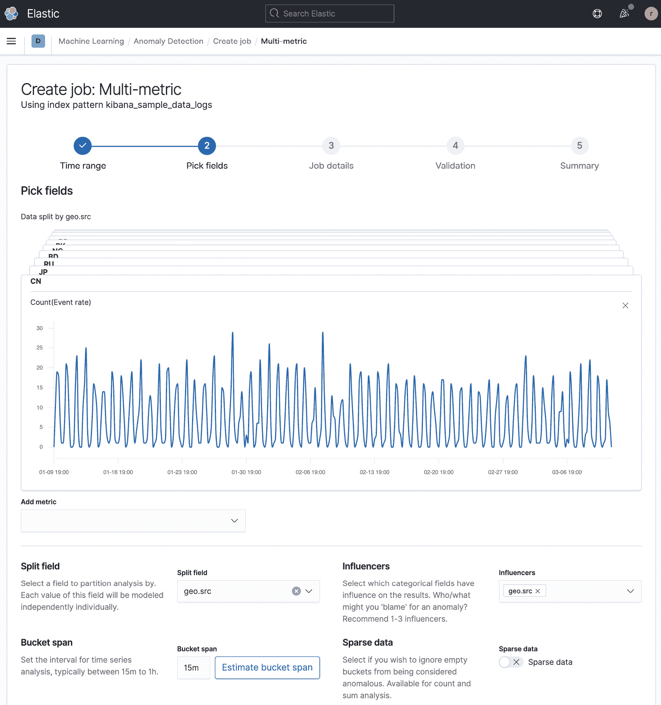

图 4.26 – 创建用于预测的多指标作业

在这个数据集中有 183 个独特的源国家。在创建并运行这个异常检测作业以为所有 183 个国家建立基线模型之后，我们现在可以调用预测。如果我们以与之前相同的方式（通过**单指标查看器**）调用预测，我们可能会错误地认为预测只会为显示的序列执行，如下面的截图所示：

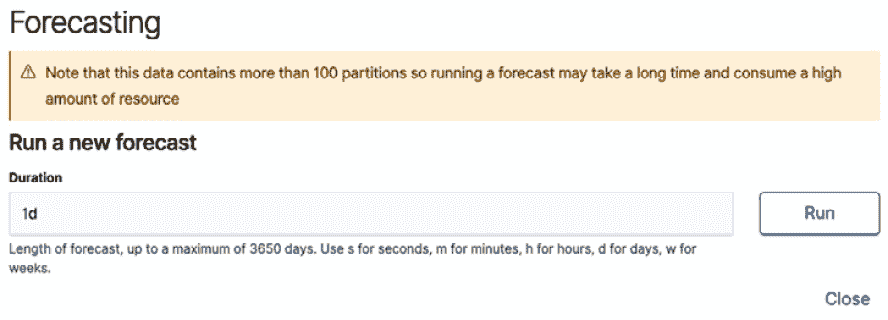

图 4.27 – 从单指标查看器中调用多指标预测

在前面的截图（尽管在弹出窗口后面的褪色背景中可能有点难以看清），我们可以看到为`geo.src`字段选择的国代码是`CN`（中国）。但是，正如**预测**弹出窗口的警告消息所指出的，点击**运行**按钮将调用预测，并将运行作业中所有现有的分区（在这里，它知道有超过 100 个分区）。

或者，我们可以使用`_forecast` API 端点来调用预测。为此，在**开发工具**控制台中，我们可以发出以下请求：

```py
  POST _ml/anomaly_detectors/web_traffic_per_country/_forecast
   {
    “duration”: “1d”
   }
```

注意

在您可以通过 API 调用预测之前，异常检测作业必须处于“打开”状态。

API 调用的即时响应如下：

```py
   {
    “acknowledged” : true,
    “forecast_id” : “ sm7AF3cBpc7Wt6MbTWYg”
}
```

我们的预测请求的结果将可以在**单指标查看器**中查看，或者通过查询结果索引以编程方式获取，这些索引将在*第五章*“解释结果”中描述。使用**单指标查看器**，我们可以通过点击**预测**按钮，选择我们之前运行的预测，然后选择我们选择的国代码，如下面的截图所示：

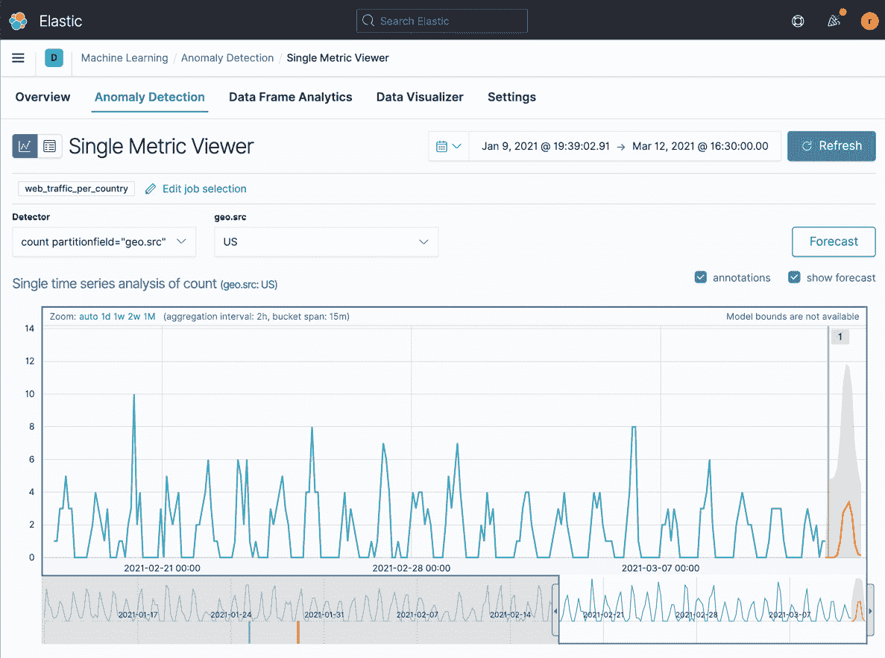

图 4.28 – 从多指标预测中查看单个分区的预测

注意

在 v7.10 版本中，在**单指标查看器**中查看多指标预测的结果并不完全理想。这是因为视图只显示记录了异常的分区。此功能将在 v7.11 版本中添加。

在多个时间序列上进行预测对于容量规划用例可能非常有用，在这些用例中，可能需要分析数百甚至数千个实体，并且预测以查看在不久的将来是否可能发生任何待处理的违规行为。

# 摘要

弹性机器学习（Elastic ML）在异常检测功能之上，还具备一项额外特性：能够将时间序列模型外推到未来，用于预测目的。这一特性涵盖了包括高级入侵检测和容量规划在内的用例，减轻了人们手动绘制图表、跟踪和预测未来趋势的负担，这些趋势是基于过去的行为来预测的。

在下一章中，我们将更深入地探讨异常检测和预测为我们带来的结果，并更好地理解如何利用这些结果来构建仪表板和主动警报。
