# 第八章：其他 Elastic Stack 应用中的异常检测

当本书的第一版两年前编写时，堆栈中还没有其他应用利用 Elastic ML 进行特定领域解决方案的概念。然而，自那时以来，Elastic ML 已经成为特定领域解决方案的异常检测**提供者**，提供用户只需一键即可启用的定制作业配置。

在本章中，我们将探讨 Elastic ML 为各种 Elastic Stack 应用带来的好处：

+   Elastic APM 中的异常检测

+   日志应用中的异常检测

+   指标应用中的异常检测

+   Uptime 应用中的异常检测

+   Elastic Security 应用中的异常检测

# 技术要求

本章信息适用于 Elastic Stack 的 v7.12 版本。

# Elastic APM 中的异常检测

Elastic APM 通过允许用户对其应用程序代码进行仪器化，以获取对单个微服务和事务性能的深入了解，将应用程序监控和性能管理提升到了全新的水平。在复杂环境中，这可能会生成大量测量数据，并可能导致一种潜在的矛盾情况——在这种详细测量水平上获得更高的可观察性，同时可能使分析师难以从结果中筛选出可操作的见解。

幸运的是，Elastic APM 和 Elastic ML 是天作之合。异常检测不仅可以通过无监督机器学习自动适应每种事务类型的独特性能特征，而且可以扩展以处理 APM 可能生成的庞大数据量。

虽然用户始终可以自由地针对任何索引中的任何类型的时间序列数据创建异常检测作业，无论类型如何，但有一个强有力的论据是，简单地提供针对 Elastic APM 数据的预制、开箱即用的作业配置，因为数据格式已经为人所知。

## 启用 APM 的异常检测

为了利用 APM 数据进行异常检测，显然需要收集一些声明的服务的 APM 数据，并且收集到的数据需要存储在可以通过 `apm-*` 索引模式访问的索引中：

1.  如果您尚未在 APM 数据上设置异常检测，您将在屏幕顶部看到一个指示器，告知您它仍然需要设置：![图 8.1 – 当异常检测尚未在 APM 上启用时的指示器

    ![img/B17040_08_1.jpg]

    图 8.1 – 当异常检测尚未在 APM 上启用时的指示器

1.  为了展示异常检测配置将如何，创建了一个简单的*Hello World* Node.js 应用程序，并使用 Elastic APM 进行了配置。此应用程序（称为*myapp*）还标记了`environment`标签为`dev`，以表示该应用程序是开发应用程序（所有这些都是在 Node.js 配置的 APM 代理内完成的）：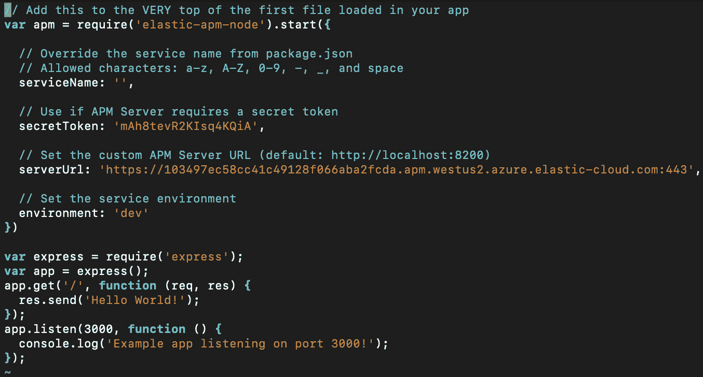

    图 8.2 – 使用 Elastic APM 进行配置的示例 Node.js 应用

1.  在 Elastic APM 内部查看时，服务将如下所示：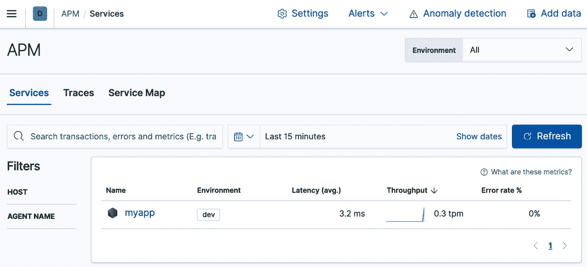

    图 8.3 – 在 Elastic APM UI 中查看的示例 Node.js 应用

1.  要启用此服务的异常检测，只需转到**设置**，点击**异常检测**，然后点击**创建 ML 作业**按钮：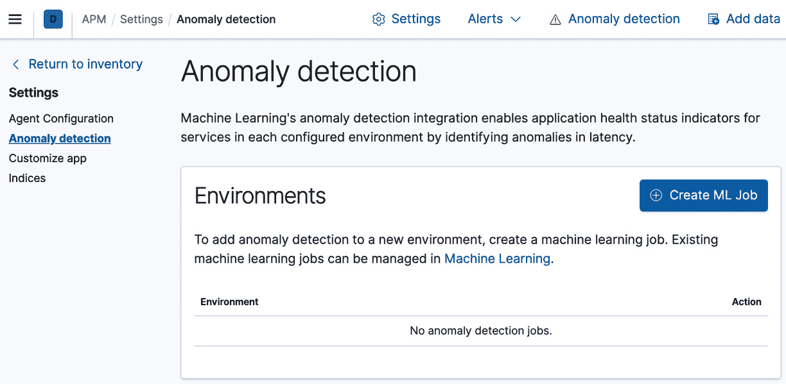

    图 8.4 – 为 APM 数据创建 ML 作业

1.  接下来，指定您想要为该作业构建的环境名称：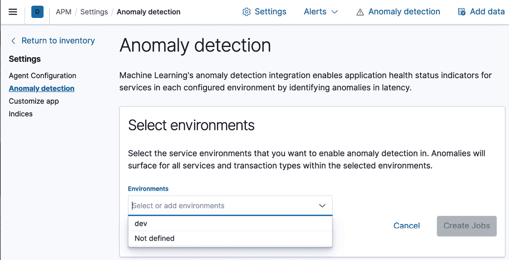

    图 8.5 – 指定构建 ML 作业的环境

1.  在这里，我们将选择**dev**，因为它是我们应用唯一可用的选项。一旦选择并点击**创建作业**按钮，我们将收到确认我们的作业已创建，并在表中列出：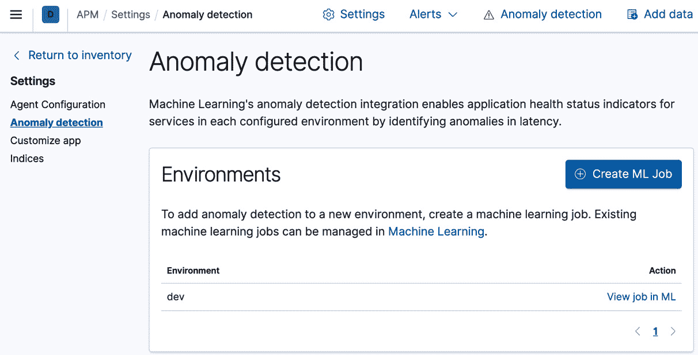

    图 8.6 – APM 中创建的异常检测作业列表

1.  如果我们转到 Elastic ML 应用，查看为我们创建的作业的详细信息，我们将看到以下内容：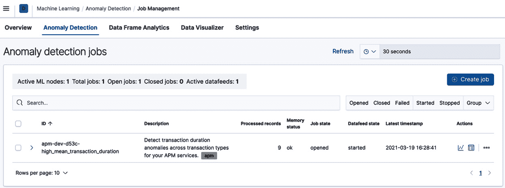

    图 8.7 – ML 中创建的异常检测作业列表

1.  进一步检查，我们可以看到作业的实际检测器配置如下：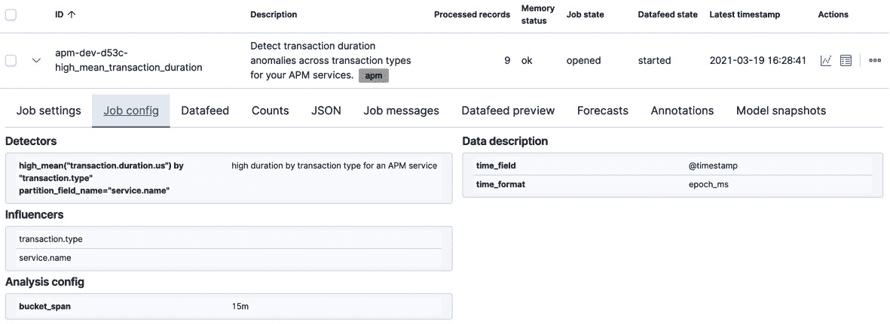

    图 8.8 – APM 作业的检测器配置

    注意，这利用了`transaction.duration.us`字段上的`high_mean`函数，同时在`transaction.type`上分割，并在`service.name`上分区。同时注意，作业的`bucket_span`值为 15 分钟，这可能或可能不是您环境的理想设置。

    注意

    应该注意的是，当使用 APM UI 的此一键方法时，此配置是唯一可能的，因为配置是硬编码的。如果您想自定义或创建自己的配置，您可以从头创建它们，或者可能克隆此作业并设置自己的桶跨度以及/或检测逻辑。

1.  从查询的数据视角来看，我们可以点击我们在 APM UI 设置作业时指示的`"service.environment" : "dev"`。

1.  我们可以点击**数据源预览**选项卡来查看将馈送到 Elastic ML 的此特定作业的观测样本，如图所示：

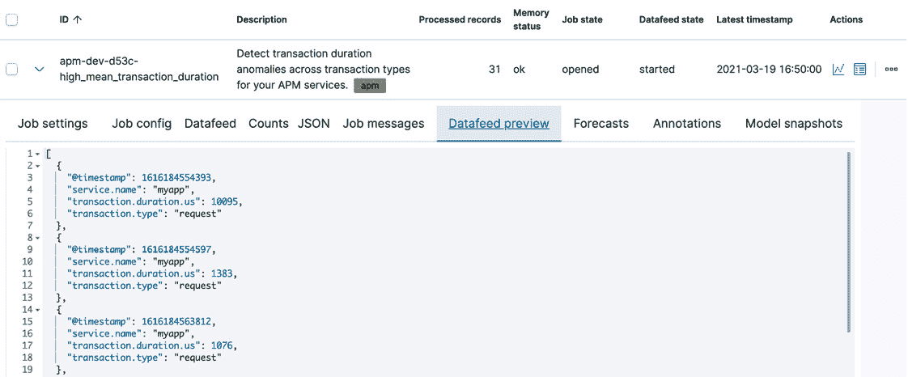

图 8.10 – APM 作业的数据源预览

现在 APM 作业已配置并运行，让我们关注在 APM UI 中异常检测作业结果将如何反映。

## 在 APM UI 中查看异常检测作业结果

除了在 Elastic ML UI 中查看作业结果外，还有三个关键位置在 APM UI 中显示了异常检测作业的结果：

+   **服务概览**：APM UI 中的此视图提供了一个高级健康指标，对应于特定服务的异常检测结果的最高异常分数：

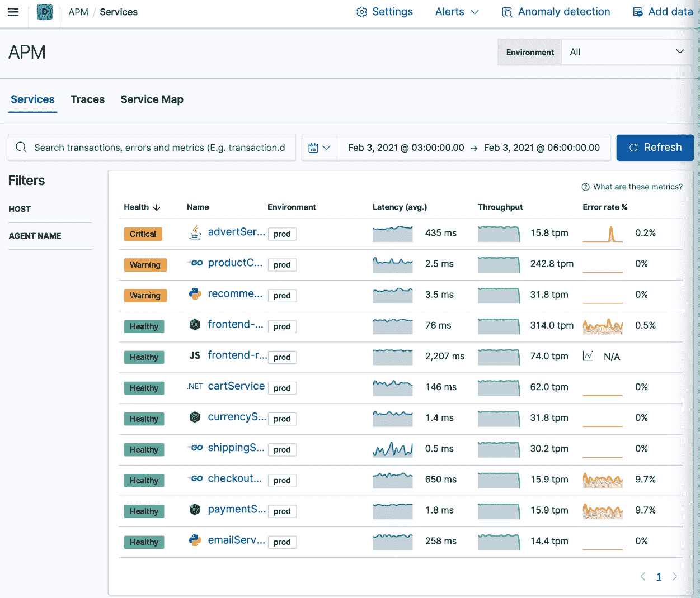

图 8.11 – APM UI 中的服务概览

+   **服务图**：这个动态视图显示了应用程序事务依赖关系，基于特定服务的异常检测结果的最高异常分数进行颜色编码的异常指示器：

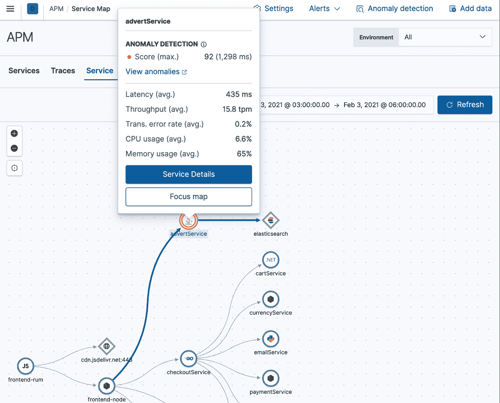

图 8.12 – APM UI 中的服务图

+   **事务持续时间图表**：此图表位于 APM 中的主要**事务**视图下，当特定事务类型的异常分数超过 75 时，显示预期的边界和彩色注释：

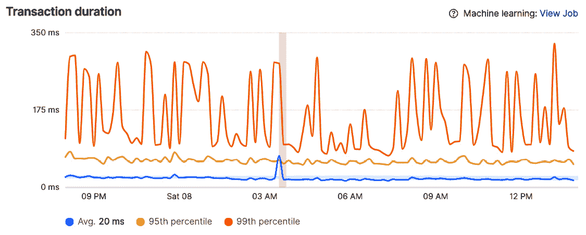

图 8.13 – APM UI 中的事务持续时间图表

这些异常性指示器有助于用户进一步调查并使用 APM 和 ML UI 的深度功能来解决问题。让我们看看一种将 Elastic ML 与 APM 数据集成的更多方法，使用 **数据识别器**。

## 通过数据识别器创建 ML 作业

虽然“数据识别器”不是 Elastic ML 中实际功能的官方营销名称，但它实际上在帮助用户为已识别的数据创建预配置作业时非常有帮助。

注意

预配置的数据识别器作业定义和存储在以下 GitHub 仓库中：[`github.com/elastic/kibana/tree/master/x-pack/plugins/ml/server/models/data_recognizer/modules`](https://github.com/elastic/kibana/tree/master/x-pack/plugins/ml/server/models/data_recognizer/modules)。

实际上，使用识别器创建新作业的工作流程如下：

如果在创建异常检测作业的过程中，为作业输入（索引模式或保存的搜索）选择的数据与预定义识别模块之一已知搜索模式匹配，那么你可以向用户提供创建这些预定义作业之一的能力。我们可以通过使用本章早期提到的简单 Node.js 示例来查看这个示例。我们不是从 APM UI 创建异常检测作业，而是通过 Elastic ML UI 选择`apm-*`索引模式：

+   通过选择索引模式，我们将看到除了正常作业向导外，我们还提供了两个预配置的作业：

![Figure 8.14 – 数据识别器提供的职位

![img/B17040_08_14..jpg]

图 8.14 – 数据识别器提供的职位

+   第一个“APM”作业与我们本章早期从 APM UI 创建的作业类型相同。第二个选项（**APM**：**Node.js**）实际上是一个包含三个作业的集合：

![Figure 8.15 – 数据识别器提供的 Node.js 作业

![img/B17040_08_15..jpg]

图 8.15 – 数据识别器提供的 Node.js 作业

+   第三个是，再次，与我们本章早期从 APM UI 创建的相同类型的职位，但其他两个是独特的。如果源数据被“识别”，向用户提供建议性职位这一概念并不仅限于 APM 数据，你可能在其他情况或用例（如选择样本 Kibana 数据的索引、nginx 数据等）中看到这些建议性职位。

现在我们已经看到了 Elastic ML 是如何嵌入到 APM 应用中的，让我们继续探索，以了解异常检测是如何在日志应用中被利用的。

# 日志应用中的异常检测

Kibana 中的**可观察性**部分内的日志应用提供了与 Discover 应用类似的数据视图。然而，对于那些更喜欢查看日志的**实时尾部**视图的用户，无论数据存储在哪个索引中，都会喜欢日志应用：

![Figure 8.16 – Kibana 的可观察性部分中的日志应用

![img/B17040_08_16..jpg]

图 8.16 – Kibana 的可观察性部分中的日志应用

注意，这里既有**异常**标签页，也有**类别**标签页。让我们首先讨论**类别**部分。

## 日志类别

Elastic ML 的分类能力，最早在*第三章**，异常检测*中展示，以通用方式应用于任何非结构化日志数据的索引。然而，在日志应用中，分类使用了一些对数据更严格的约束。简而言之，数据预期位于`event.dataset`中）。

注意

来自*第七章**，AIOps 和根本原因分析*的日志数据集在此章节的 GitHub 仓库中进行了复制，用于与 Logs 应用一起使用，并增加了`event.dataset`字段。如果您通过 ML 中的文件上传功能导入，请确保将字段名称覆盖为`event.dataset`，而不是默认的`event_dataset`。

可以想象出这种限制背后的原因，因为 Logs 应用正在尝试以模板化的方式为您创建分类作业。因此，它需要确定字段的命名约定。如果这要在 ML 应用中完成，那么情况显然不会是这样，在那里用户负责声明分类字段和消息字段的名称。

如果您配置 Logs 应用以调用分类，那么输出将类似于以下图示，它显示了每个不同的日志类别，按最大异常分数排序：

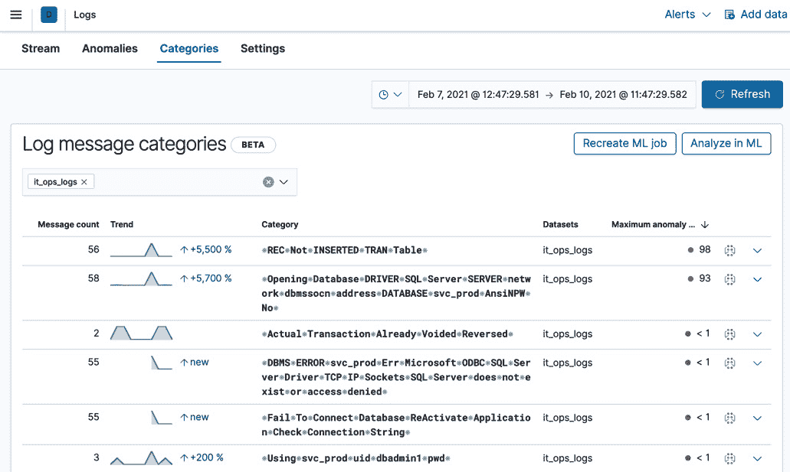

图 8.17 – Logs 应用显示 Elastic ML 的分类结果

用户可以点击**在 ML 中分析**按钮，导航到 ML UI 中的异常检测器进行进一步检查。

## 日志异常

Logs 应用的**异常**部分提供了一个类似于异常检测器的视图：

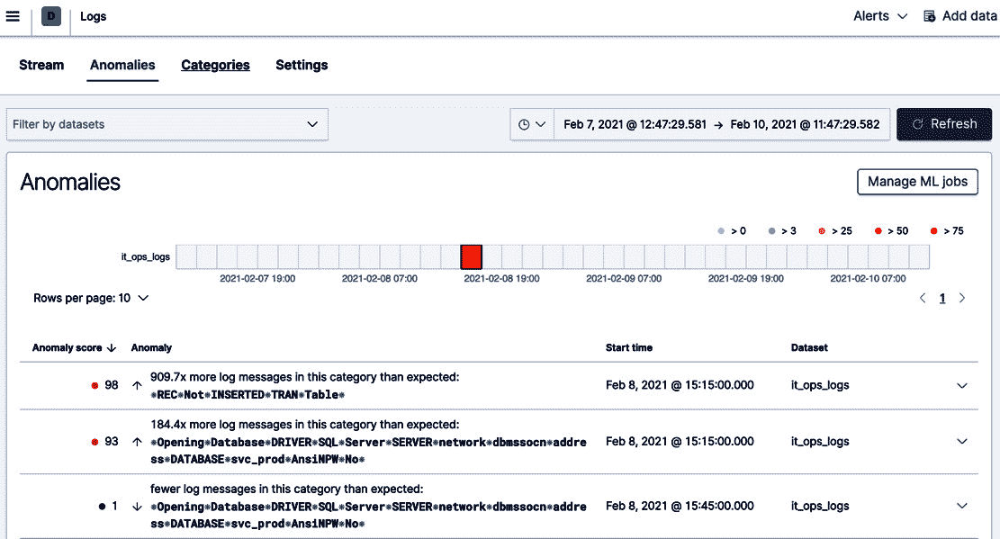

图 8.18 – Logs 应用显示类似于 ML 异常检测器的视图

如果用户点击**管理 ML 作业**按钮，它还允许用户管理异常检测作业：

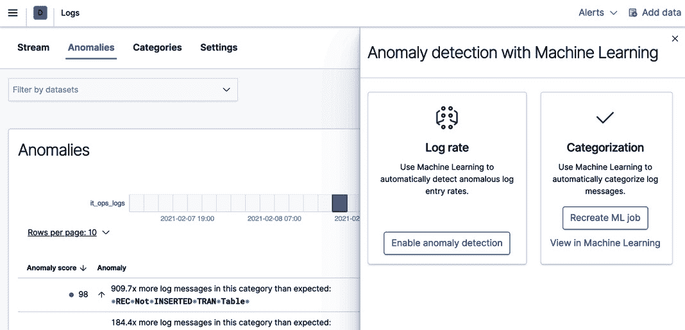

图 8.19 – Logs 应用允许管理 ML 作业

`count`检测器，按`event.dataset`字段分区。

用户应注意，这些 ML 作业可以在此处重新创建，但不能永久删除 – 您必须转到 ML 应用中的异常检测作业管理页面来删除作业。

显然，一个高级用户可能会仅仅在 ML 应用中创建和管理他们的日志异常检测作业。但很棒的是，Logs 应用以一种使功能明显且易于实施的方式展示了 Elastic ML 的能力。让我们继续这一趋势，看看 Elastic ML 在 Metrics 应用中的使用情况。

## Metrics 应用中的异常检测

Metrics 应用也是 Kibana 中**可观察性**部分的组成部分，它允许用户以库存和指标驱动的视图查看他们的数据：

+   在**库存**视图中，用户可以看到监控资源的整体地图。实体，如主机、Pod 或容器，可以组织并筛选以自定义视图 – 包括以下图示中的颜色编码健康量表：

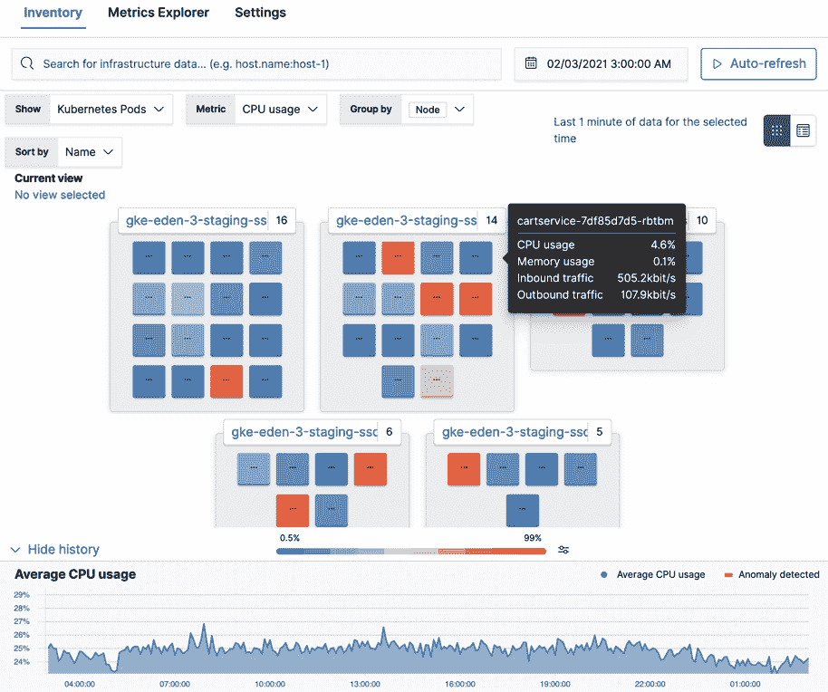

图 8.20 – 指标应用显示库存视图

注意，如果检测到异常，底部面板将显示异常。这是目前在指标应用中查看异常的唯一位置。

+   要通过指标应用启用内置的异常检测作业，请点击顶部的**异常检测**按钮以启用配置飞出窗口：

![图 8.21 – 指标应用显示异常检测作业的管理

![img/B17040_08_21..jpg]

图 8.21 – 指标应用显示异常检测作业的管理

+   例如，如果我们选择为主机启用异常检测，点击相应的**启用**按钮将显示此内容：

![图 8.22 – 指标应用显示主机上的异常检测配置

![img/B17040_08_22..jpg]

图 8.22 – 指标应用显示主机上的异常检测配置

+   注意，如果需要，配置中会提供分区字段。当你点击**启用作业**按钮时，会为你创建三个不同的异常检测作业，你可以在 Elastic ML 的**作业管理**部分查看：

![图 8.23 – 指标应用创建的主机异常检测作业

![img/B17040_08_23..jpg]

图 8.23 – 指标应用创建的主机异常检测作业

+   要设置指标应用显示异常所需的最小异常分数，请转到**设置**选项卡并配置**异常严重程度阈值**设置：

![图 8.24 – 指标应用中的异常严重程度阈值设置

![img/B17040_08_24..jpg]

图 8.24 – 指标应用中的异常严重程度阈值设置

Elastic ML 与指标应用的集成非常简单直接 – 它允许用户快速开始使用异常检测来处理他们的指标数据。现在让我们快速看一下 Uptime 应用中的集成。

# Uptime 应用中的异常检测

Uptime 应用允许通过多种网络协议（包括**HTTP/S**、**TCP**和**ICMP**）对服务的简单可用性和响应时间进行监控：

1.  通常被归类为**合成监控**，Uptime 应用使用心跳从一个或多个位置主动探测网络端点：![图 8.25 – Kibana 中的 Uptime 应用

    ![img/B17040_08_25..jpg]

    图 8.25 – Kibana 中的 Uptime 应用

1.  如果你想要在监控器上启用异常检测，只需点击监控器名称以查看监控器详细信息。在**监控持续时间**面板中，注意**启用异常检测**按钮：![图 8.26 – 启用 Uptime 监控器的异常检测

    ![img/B17040_08_26..jpg]

    图 8.26 – 启用 Uptime 监控器的异常检测

1.  点击**启用异常检测**按钮将在后台创建作业，并允许用户为作业中出现的异常创建警报：![图 8.27 – 在 Uptime 应用中创建异常检测作业的警报

    ![img/B17040_08_27..jpg]

    图 8.27 – 在 Uptime 应用中创建异常检测作业的警报

1.  一旦异常检测作业可用，发现的任何异常也将显示在监控器的详细页面中的**监控持续时间**面板内：

![图 8.28 – Uptime 应用中显示的异常]

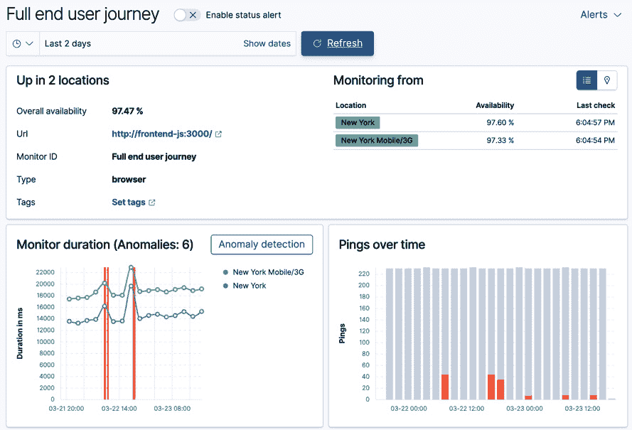

图 8.28 – Uptime 应用中显示的异常

再次强调，Elastic ML 与堆栈中另一个**可观察性**应用的集成使得用户利用复杂的异常检测变得极其简单。但我们也知道，Elastic ML 在人口和罕见分析方面也能做一些有趣的事情。下一节将介绍 ML 与 Elastic SIEM 的集成——让我们开始检测吧！

# Elastic Security 应用中的异常检测

Elastic Security 确实是 Elastic Stack 中一个以目标为导向的应用的精髓。从头开始创建，考虑到安全分析师的工作流程，Elastic Security 应用的全面性足以填满一本整本书。然而，Elastic Security 应用的核心是检测功能，其中用户和 Elastic 创建的规则在满足规则条件时执行以创建警报。正如我们将看到的，Elastic ML 在检测功能中发挥着重要作用。

## 预构建的异常检测作业

Elastic Security 中的大多数检测规则是静态的，但许多规则背后是由预构建的异常检测作业支持的，这些作业在 Elastic Agent 或 Beats 收集的数据上运行，或者符合适用于每种作业类型的应用 ECS 字段的数据。要查看 Elastic 提供的异常检测作业的完整列表，请查看以下 GitHub 仓库中的数据源和作业配置定义：[`github.com/elastic/kibana/tree/7.12/x-pack/plugins/ml/server/models/data_recognizer/modules`](https://github.com/elastic/kibana/tree/7.12/x-pack/plugins/ml/server/models/data_recognizer/modules)。

（您可以在目前占据 7.12 版本号的空白处添加最新发布版本号。）

精明的读者会注意到，许多预构建的作业利用了人口分析或罕见检测器。这些异常检测风格与安全分析师的目标非常一致——找到新颖的行为和/或使用户或实体与众不同的行为，通常与入侵指标有关。

预构建的异常检测作业可在 Elastic Security 的**检测**标签页中查看，并带有 ML 标签：

![图 8.29 – 安全应用检测规则部分的 ML 作业]

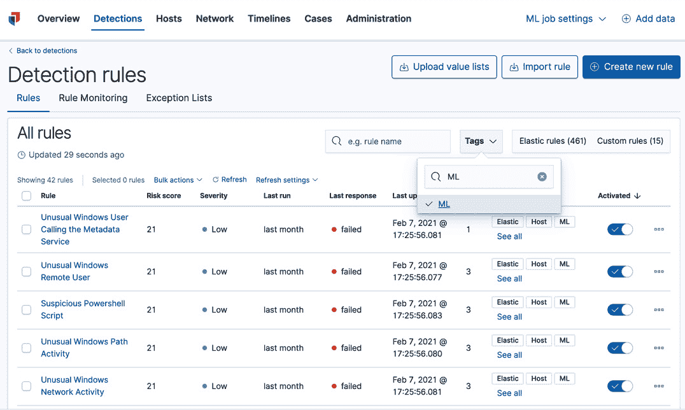

图 8.29 – 安全应用检测规则部分的 ML 作业

点击屏幕右上角的**ML 作业设置**将显示设置列表，用户可以查看库中的所有作业 – 即使是那些不可用的作业（用警告图标标记）：

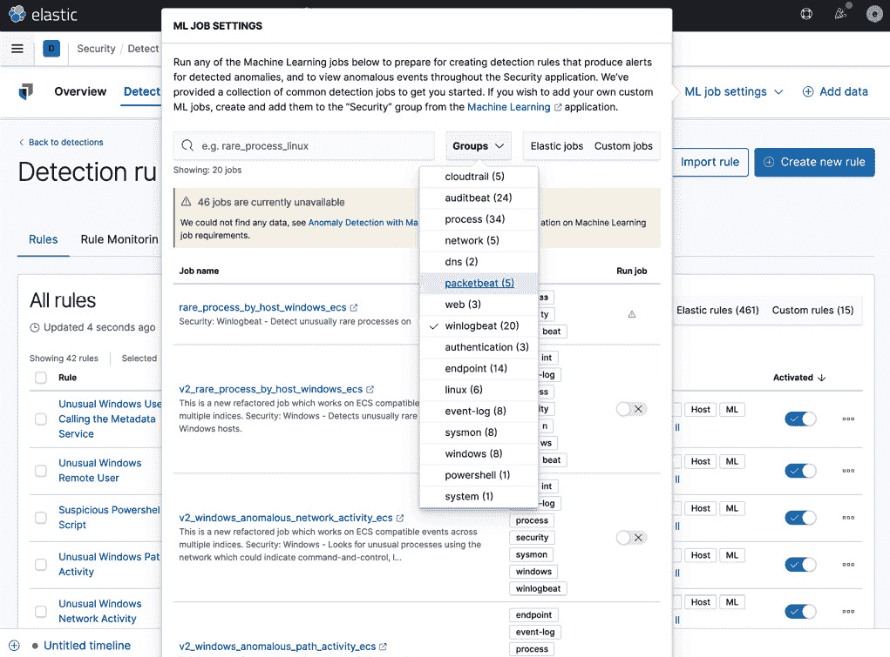

图 8.30 – 安全应用中 ML 作业设置部分的全部作业

如果作业所需的数据尚未在 Elasticsearch 中索引，作业将被标记为不可用。如果作业可用，您可以通过点击切换开关来激活作业，异常检测作业将在后台配置。当然，您始终可以查看在 Elastic ML **作业** **管理** UI 中创建的作业：

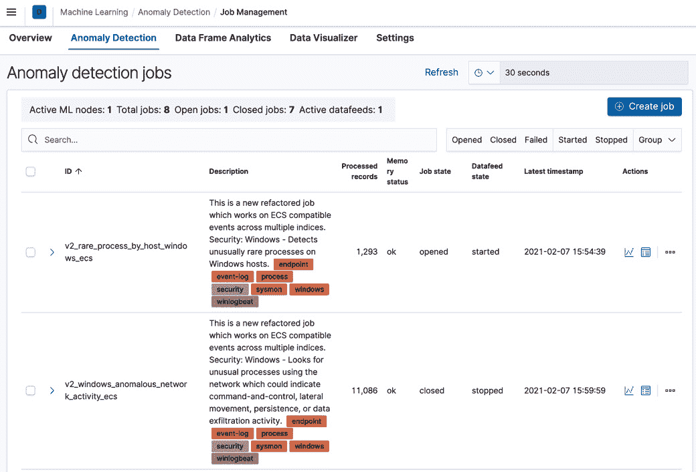

图 8.31 – 安全作为作业管理 UI 中的视图创建的 Elastic ML 作业

现在我们知道了如何启用异常检测作业，是时候看看它们如何为安全应用创建检测警报了。

## 异常检测作业作为检测警报

当我们回到*图 8.28*中显示的**检测**视图时，如果您点击**创建新规则**按钮，我们可以看到我们可以选择**机器学习**作为规则类型：

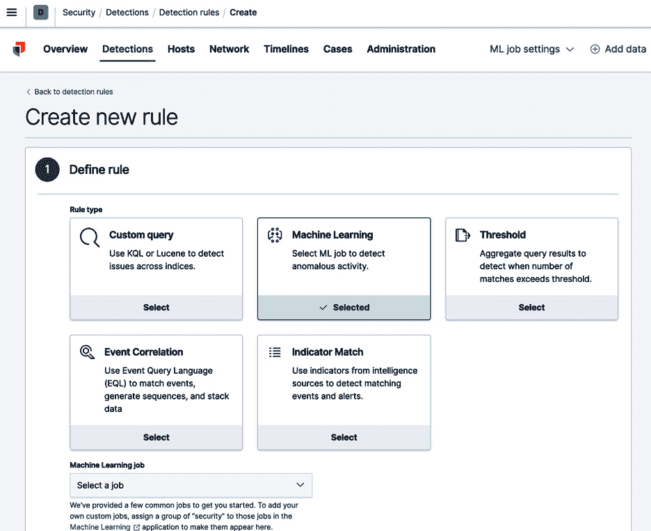

图 8.32 – 创建基于 ML 的检测规则

如果您要通过下拉列表选择特定的机器学习作业，您还将被要求选择需要超过以触发检测警报的**异常分数阈值**值：

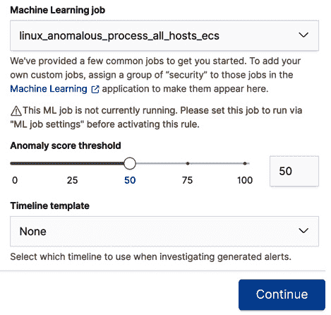

图 8.33 – 选择检测规则的 ML 作业和分数阈值

显然，如果作业当前没有运行，警告将指示需要启动作业。值得注意的是，如果您创建了自己的自定义作业（即，不是使用预构建的作业），但在 Elastic ML 应用中将它分配给名为“安全”的**作业组**，那么这个自定义作业也将是此视图中下拉框中可选的候选之一。检测规则配置的其余部分可以留给读者 – 因为其余部分并不特定于机器学习。

Elastic Security 应用显然严重依赖异常检测来增强传统的静态规则，通过动态的用户/实体行为分析揭示值得调查的显著事件。随着时间的推移，将很有趣地看到机器学习功能如何继续加强这一新兴用例，以及其影响的深度和广度！

# 摘要

Elastic ML 显然已经渗透到 Elastic Stack 中的许多其他应用中，将易于使用的功能带到了用户的手指之间。这证明了 Elastic ML 确实是堆栈本身的核心功能，类似于其他关键堆栈功能，如聚合。

恭喜你，你已经到达了这本书第一部分的终点，希望你现在感觉武装到了牙齿，拥有了关于 Elastic ML 异常检测所需的所有知识。

现在，我们将探索 Elastic ML 的“另一面”——数据帧分析——在这里，你将学习如何将其他机器学习技术（包括基于监督的模型创建和推理）应用到广泛的用例中，以开启新的分析解决方案。
