# 第九章：介绍数据框分析

在本书的第一部分，我们深入探讨了异常检测，这是第一个直接集成到 Elastic Stack 中的机器学习功能。在本章和下一章中，我们将深入研究集成到堆栈中的新机器学习功能。这些包括异常检测，一种用于检测非时间序列索引中异常数据点的创新无监督学习技术，以及两个监督学习功能，分类和回归。

监督学习算法使用标记数据集——例如，描述组织样本各个方面以及组织是否为恶性的数据集——来学习模型。然后，该模型可以用于对先前未见过的数据点（或组织样本，继续我们的例子）进行预测。当预测目标是离散变量或类别，如恶性或非恶性组织样本时，监督学习技术被称为分类。当目标是连续的数值变量，如公寓的销售价格或电力的每小时价格时，监督学习技术被称为回归。这三个新的机器学习功能统称为**数据框分析**。我们将在接下来的章节中更深入地讨论这些内容。

虽然每个功能都解决不同的问题，具有不同的目的，但它们在底层都由一个共同的数据转换技术驱动，即转换技术，它使我们能够将基于事务或流的数据格式转换为基于实体的格式。这种以实体为中心的格式是我们用于数据框分析的许多算法所必需的，因此，在我们深入研究每个新的机器学习功能之前，我们将在本章中深入探讨如何使用转换将我们的数据转换为更适合下游机器学习技术的格式。在这个过程中，我们还将简要介绍嵌入到 Elasticsearch 中的脚本语言 Painless，这对于在 Elastic Stack 中使用机器学习的任何数据科学家或工程师来说都是一款好工具。

在 Elastic Stack 之外，也存在一个丰富的库生态系统，这些库既适用于数据处理，也适用于机器学习。推动这些应用的主要动力之一是 Python。由于其在大数据和数据工程社区中的普遍性，我们在本章的第二部分将专注于使用 Python 与 Elastic Stack 结合，特别关注新的数据科学原生 Elasticsearch 客户端，Eland。在本章中，我们将探讨以下主题：

+   学习使用转换

+   使用 Painless 进行高级转换配置

+   使用 Python 和 Elasticsearch 进行操作

# 技术要求

本章的材料需要 Elasticsearch 版本 7.9 或更高版本以及 Python 3.7 或更高版本。本章所需的代码示例和片段将被添加到书籍 GitHub 仓库的`Chapter 9 - 数据框分析简介`文件夹下([`github.com/PacktPublishing/Machine-Learning-with-Elastic-Stack-Second-Edition/tree/main/Chapter%209%20-%20Introduction%20to%20Data%20Frame%20Analytics`](https://github.com/PacktPublishing/Machine-Learning-with-Elastic-Stack-Second-Edition/tree/main/Chapter%209%20-%20Introduction%20to%20Data%20Frame%20Analytics))。在这些需要特定较新版本 Elasticsearch 的示例中，示例展示之前将提到这一点。

# 学习如何使用转换

在本节中，我们将深入探讨将流或事件数据（如日志）转换为以实体为中心的索引的世界。

## 为什么转换是有用的？

考虑一下通常被摄入到 Elasticsearch 中的最常见数据类型。这些通常是一些记录基于时间或顺序事件的文档，例如，来自 Web 服务器的日志、来自 Web 商店的客户购买、在社交媒体平台上发布的评论等等。

虽然这类数据有助于理解我们的系统随时间的行为，并且非常适合与异常检测等技术一起使用，但在对它们进行某种形式的聚合或转换之前，要使基于流或事件的数据集与**数据框分析**功能协同工作会更困难。例如，考虑一个记录客户购买的电子商务商店。在一年内，每个客户可能有数十或数百笔交易。如果电子商务商店想要找到一种方法来使用异常检测来检测不寻常的客户，他们必须转换每个客户的全部交易数据点，并总结某些关键指标，例如每次购买的平均金额或日历月份的购买次数。在*图 9.1*中，我们有一个简化的插图，描述了从两个客户的电子商务购买中提取交易记录并将其转换为描述这些客户购买的总商品数量的以实体为中心的索引的过程，以及每笔订单的平均价格。

![图 9.1 – 一个说明将电子商务交易转换为以实体为中心的索引过程的图表]

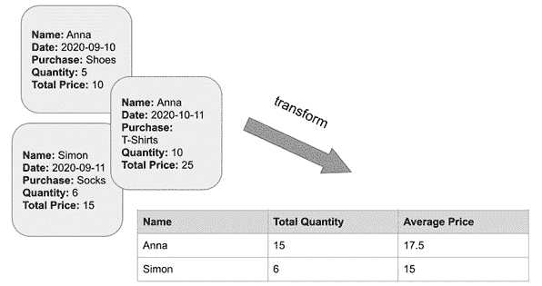

图 9.1 – 一个说明将电子商务交易转换为以实体为中心的索引过程的图表

为了执行 *图 9.1* 中展示的转换，我们必须按客户名字对事务索引中的每个文档进行分组，然后执行两个计算：将每个事务文档中的商品数量加起来得到总数，并为每个客户计算购买的平均价格。手动为成千上万的潜在客户中的每个客户的每笔交易做这件事将会非常困难，这就是 **转换** 发挥作用的地方。

## 转换的解剖结构

虽然我们将会从简单的示例开始我们的转换之旅，但许多实际应用场景可能会很快变得复杂。记住以下两点将有助于你在应用转换到自己的数据项目时保持方向：**数据透视**和**聚合**。

让我们来看看这两个实体如何相互补充，帮助我们将基于流的文档转换为以实体为中心的索引。在我们的客户分析用例中，我们有许多不同的特征来描述每个客户：客户的名字，他们在结账时为每个产品支付的总价，他们购买的商品列表，购买日期，客户的地理位置等等。

我们首先想要选择的是我们将为其构建以实体为中心的索引的实体。让我们从一个非常简单的例子开始，比如说我们的目标是找出在特定时间段内每个客户平均每笔消费的金额以及他们总共花费了多少钱。因此，我们想要为它构建索引的实体 – 我们的 **数据透视** – 是客户的名字。

我们源索引中的大多数客户都与多个交易相关联。因此，如果我们尝试按客户名字对索引进行分组，对于每个客户我们都会有多个文档。为了成功使用这个实体进行数据透视，我们需要决定我们想要将哪些聚合数量（例如，客户每笔订单的平均支付价格）带入我们的以实体为中心的索引中。这将反过来决定我们在转换配置中定义哪些聚合。让我们通过一个实际例子来看看这是如何工作的。

## 使用转换来分析电子商务订单

在本节中，我们将使用 Kibana 电子商务样本数据集来说明上一节中概述的一些基本转换概念：

1.  导入 `kibana_sample_data_ecommerce` 并用数据集填充它。![图 9.2 – 从 Kibana 样本数据面板导入 Sample eCommerce 订单数据集

    ![img/B17040_09_002.jpg]

    图 9.2 – 从 Kibana 样本数据面板导入 Sample eCommerce 订单数据集

1.  通过从左上角的汉堡按钮打开 Kibana 滑出面板菜单，导航到 **堆栈管理**，然后在 **数据** 菜单下点击 **Transforms** 来访问 **Transforms** 向导。

1.  在**kibana_sample_data_ecommerce**索引中，你应该在*图 9.3*所示的面板中选择。你在 Kibana 中显示的源索引可能会根据你的 Elasticsearch 集群中当前可用的索引而有所不同。![Figure 9.3 – For this tutorial, please select kibana_sample_data_ecommerce

    ![img/B17040_09_003.jpg]

    图 9.3 – For this tutorial, please select kibana_sample_data_ecommerce

1.  选择我们的源索引后，`customer_full_name`。![Figure 9.4 – Select the entity you want to pivot your source index by in the Group by menu

    ![img/B17040_09_4.jpg]

    图 9.4 – 在**分组依据**菜单中选择你想要以之旋转源索引的实体

1.  现在我们已经定义了旋转索引的实体，我们将继续到转换构建的下一部分：聚合。在这种情况下，我们感兴趣的是找出客户在每个订单中在电子商务商店花费的平均金额。在每次交易中，交易记录在源索引的文档中，客户支付的总金额存储在字段`taxful_total_price`中。

    因此，我们定义的聚合将作用于这个字段。在**聚合**菜单中，选择**taxful_total_price.avg**。一旦点击了这个选择，该字段将出现在**聚合**下的框中，你将看到如*图 9.5*所示的旋转索引的预览。

    ![Figure 9.5 – A preview of the transformed data is displayed to allow a quick check that everything is configured as desired.

    ![img/B17040_09_5.jpg]

    图 9.5 – 转换数据的预览显示，以便快速检查一切是否按预期配置。

1.  最后，我们将配置最后两个项目：转换作业的 ID 和将包含描述我们旋转实体的文档的目标索引的名称。像*图 9.6*中所示，勾选**创建索引模式**复选框是个好主意，这样你就可以轻松地在**发现**选项卡中导航到目标索引以查看结果。![Figure 9.6 – Each transform needs a transform ID

    ![img/B17040_09_006.jpg]

    图 9.6 – 每个转换都需要一个转换 ID

    转换 ID 将用于识别转换作业和包含由转换作业产生的实体为中心索引的文档的目标索引。

1.  要开始转换作业，记得在完成第 6 步中描述的说明后，在**转换**向导中点击**下一步**，然后点击**创建并启动**。这将启动转换作业并创建以实体为中心的索引。

1.  转换完成后（如果一切顺利，你会看到进度条达到 100%），你可以在**转换**向导的底部点击**发现**按钮，查看你的转换文档。

    如本节开头所述，我们从*图 9.7*中的一个样本文档中看到，转换作业已经将一个以交易为中心的索引（记录了我们电子商务商店中每位客户所做的每次购买）转换成了一个以实体为中心的索引，该索引描述了特定的分析转换（计算客户支付的平均价格），并按客户的完整姓名进行分组。

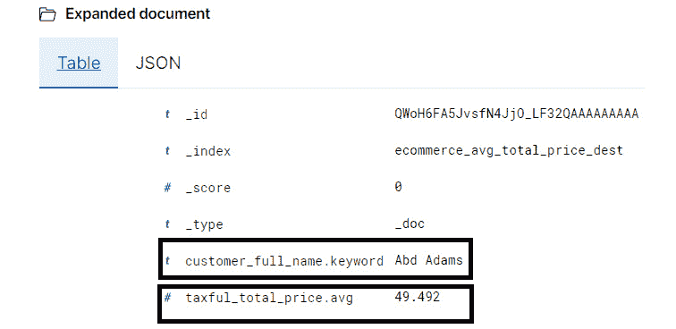

图 9.7 – 转换作业的结果是一个目标索引，其中每个文档描述了每个旋转实体的聚合。在本例中，每位客户支付的含税总价平均值

恭喜您 – 您现在已创建并启动了您的第一个转换作业！尽管它本质上相当简单，但这个基本作业配置是用于更复杂转换的良好构建块，我们将在接下来的章节中探讨。

## 探索更高级的旋转和聚合配置

在上一节中，我们探讨了转换的两个部分：旋转和聚合。在随后的示例中，我们的目标是使用转换在 Kibana 样本电子商务数据集上找到每位客户每笔订单的平均花费金额。为了解决这个问题，我们了解到记录交易的每个文档都有一个名为`customer.full_name`的字段，我们使用这个字段来旋转我们的源索引。我们的聚合是记录客户在订单上花费的总金额的平均值。

然而，并非我们想要对电子商务数据提出的所有问题都适合使用之前讨论过的简单旋转或分组配置。让我们探索一些更高级的旋转配置，这些配置可以通过转换实现，借助一些我们可能想要在电子商务数据集上进行的样本调查。如果您想发现所有可用的旋转配置，请查看此 URL 上的旋转对象 API 文档：[`www.elastic.co/guide/en/elasticsearch/reference/master/put-transform.html`](https://www.elastic.co/guide/en/elasticsearch/reference/master/put-transform.html)。

假设我们想要在我们的数据集中找出每周每笔订单的平均花费金额，以及有多少独特的客户进行了购买。为了回答这些问题，我们需要构建一个新的转换配置：

1.  我们不想通过客户的名称进行旋转，而是想构建一个`order_date`，正如其名称所暗示的，它记录了订单的放置时间。**转换**向导使这变得简单，因为**date_histogram(order_date)**将是**分组**下拉菜单中显示的预配置选项之一。

1.  一旦你在**分组**下拉菜单中选择了**date_histogram(order_date)**，将你的注意力转向面板的右侧，如图 9.8 所示。右侧应该包含用于日期直方图分组间隔的缩写（例如，**1m**表示 1 分钟的间隔）。在我们的例子中，我们想要按周旋转我们的索引，所以我们需要从下拉菜单中选择**1w**。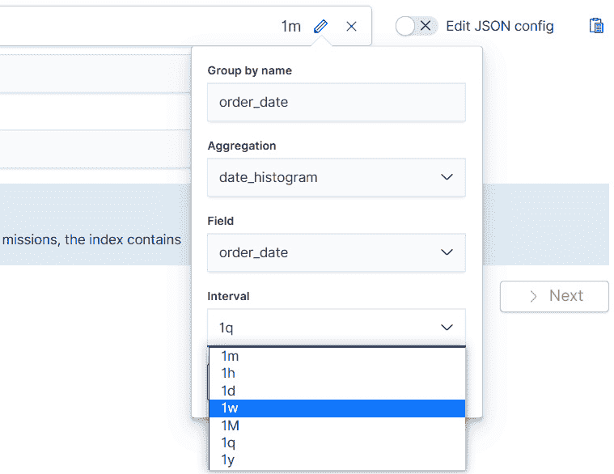

    图 9.8 – 从下拉菜单调整日期直方图的频率

1.  接下来，对于我们的聚合，让我们选择熟悉的**avg(total_taxful_price)**。在我们做出选择后，**转换**向导将显示一个预览，它将显示客户按不同周次订单的平均支付价格，并显示几行样本数据。预览的目的是作为一个检查点。由于转换作业可能非常消耗资源，在这个阶段停下来检查预览，以确保数据已经转换成你想要的格式是很好的。

1.  有时候我们可能希望以不适合简单单层分组配置的方式查询我们的数据，就像我们在前面的步骤中探索的那样。我们可以嵌套分组配置，正如我们马上就会看到的。假设在我们的假设电子商务商店示例中，我们还想看到按周和按地理区域平均花费的金额。

    为了解决这个问题，让我们回到**转换**向导，并添加一个第二个分组字段。在这种情况下，我们想要按**geoip.region_name**分组。和之前一样，向导在我们选择分组字段后会显示转换的预览。和之前的情况一样，花点时间看看预览中显示的行，以确保数据已经按照期望的方式转换。

    小贴士

    点击转换预览表上方的**列**切换按钮以重新排列列的顺序。

    除了创建多个分组配置外，我们还可以向我们的转换中添加多个聚合。假设除了每个客户每周和每个地区平均花费的金额外，我们还想了解在我们商店下单的独特客户数量。让我们看看我们如何将这个聚合添加到我们的转换中。

1.  在`customer.full_name.keyword`)上点击它以选择它。结果聚合将被添加到你的转换配置中，并且预览现在应该显示一个额外的列。

    现在，你可以遵循上一节教程中的步骤为转换分配一个 ID 和目标索引，以及创建和启动作业。这些将留给你作为练习。

在前两节中，我们检查了转换的两个关键组件：旋转和聚合，并进行了两次不同的演练，展示了如何使用简单和高级的旋转和聚合组合来查询我们的数据以获得各种见解。

在跟随第一个转换的过程中，你可能已经注意到在*图 9.6*中，我们没有勾选**连续模式**复选框。我们将在下一节中更深入地探讨在连续模式下运行转换意味着什么。

## 发现批处理和连续转换之间的区别

在上一节中，我们创建的第一个转换很简单，只运行了一次。转换作业读取了配置在`kibana_sample_data_ecommerce`中的源索引`kibana_sample_data_ecommerce`，转换作业运行后发生的任何更改将不会反映在目标索引中的数据中。这种只运行一次的转换被称为**批处理转换**。

在许多实际用例中，如我们虚构的电子商务商店示例，会不断向源索引添加新记录。这意味着我们通过运行转换作业获得以实体为中心的旋转索引几乎会立即过时。一个保持目标索引与源索引同步的解决方案是定期删除目标索引并重新运行批处理转换作业。然而，这并不实用，需要大量的手动工作。这就是**连续转换**介入的地方。

如果我们有一个正在更新的源索引，并且想使用它来创建一个以实体为中心的旋转索引，那么我们必须使用连续转换而不是批处理转换。让我们更详细地探讨连续转换，以了解它们与批处理转换有何不同，以及运行连续转换时应考虑哪些重要的配置参数。

首先，让我们为我们要解决的问题设定场景。假设我们有一个虚构的微博社交媒体平台，用户可以发布简短更新，为更新分配类别，并与其他用户以及预定义的主题互动。可以分享帖子并点赞帖子。每个帖子的统计数据也会被记录。我们已经编写了一些 Python 代码来帮助生成这个数据集。这段代码以及如何运行此代码的说明可以在本书 GitHub 仓库的`第九章 - 数据帧分析简介`文件夹下找到（[`github.com/PacktPublishing/Machine-Learning-with-Elastic-Stack-Second-Edition/tree/main/Chapter%209%20-%20Introduction%20to%20Data%20Frame%20Analytics`](https://github.com/PacktPublishing/Machine-Learning-with-Elastic-Stack-Second-Edition/tree/main/Chapter%209%20-%20Introduction%20to%20Data%20Frame%20Analytics)）。运行生成器后，您将有一个名为`social-media-feed`的索引，其中将包含多个文档。

数据集中的每个文档都记录了用户在社交媒体平台上发布的帖子。为了简洁起见，我们已从文档中省略了帖子的文本。"图 9.9"显示了`social-media-feed`索引中的一个示例文档。

![图 9.9 – 社交媒体信息流索引中的示例文档记录了用户名、帖子提交到平台的时间以及帖子收到的参与度的一些基本统计数据

![img/B17040_09_009.jpg]

图 9.9 – 社交媒体信息流索引中的示例文档记录了用户名、帖子提交到平台的时间以及帖子收到的参与度的一些基本统计数据

在下一节中，我们将看到如何使用这个虚构的社交媒体平台数据集来了解连续变换。

## 使用连续变换分析社交媒体信息流

在本节中，我们将使用之前介绍的数据集来探索连续变换的概念。正如我们在上一节中讨论的，批量变换适用于一次性分析，在这种情况下，我们可能愿意分析在特定时间点的数据集快照，或者我们没有正在变化的数据集。在大多数实际应用中，情况并非如此。日志文件是持续摄入的，许多社交媒体平台全天候活跃，电子商务平台服务于所有时区的客户，因此生成一系列交易数据。这就是连续变换介入的地方。

让我们看看如何使用连续变换分析社交媒体用户收到的平均参与度水平（点赞和分享）：

1.  导航到**变换**向导。在**堆栈管理**页面，在**数据**部分下向左查看，并选择**变换**。

1.  正如我们在前面的章节中所做的那样，让我们首先创建转换。对于源索引，选择 `social-media-feed` 索引模式。这应该会给你一个类似于 *图 9.10* 中的视图。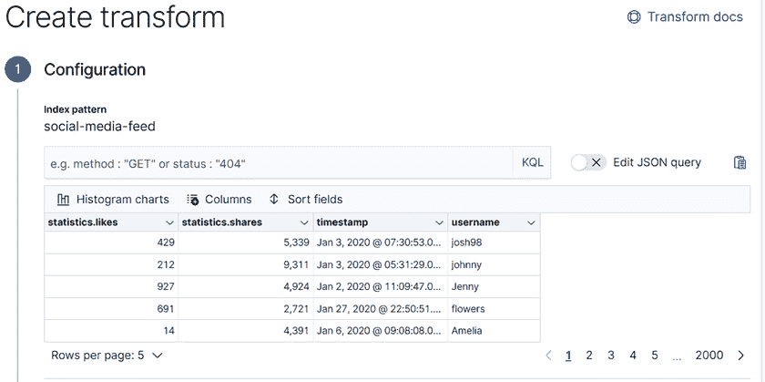

    图 9.10 – 转换向导显示了 social-media-feed 索引的示例

1.  在这种情况下，我们将对计算每个用户名下每篇帖子的参与度指标聚合感兴趣。因此，我们的 **按组** 配置将包括用户名，而我们的聚合将计算每个用户的总点赞和分享数，以及每个用户的平均点赞和分享数以及每个用户发布的总帖数。最终的 **按组** 和 **聚合** 配置应该类似于 *图 9.11*。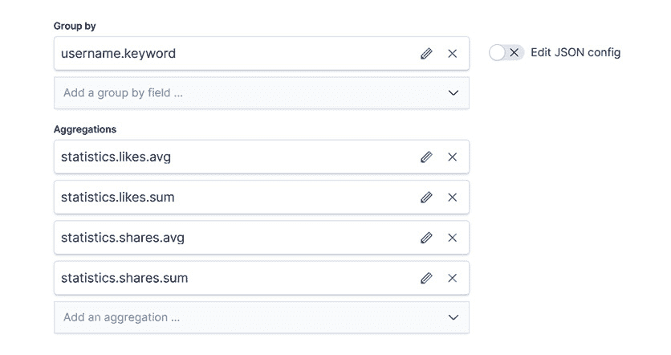

    图 9.11 – 我们连续转换的按组与聚合配置

1.  最后，如 *图 9.12* 所示，勾选 `timestamp`。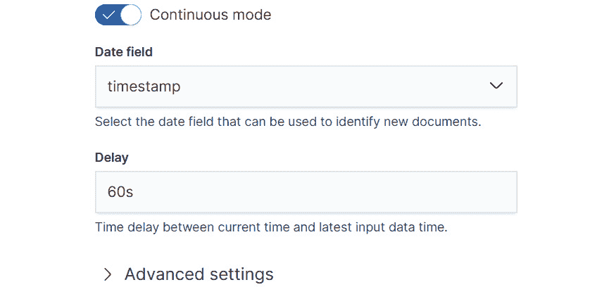

    图 9.12 – 选择连续模式以确保转换过程定期检查源索引并将新文档纳入目标索引

1.  一旦你点击 `social-media-feed` 索引运行。注意作业描述中的连续标签。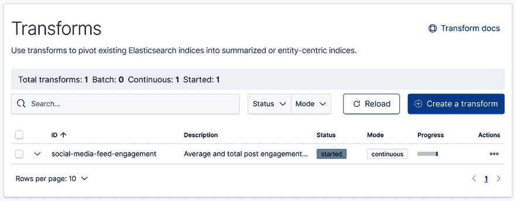

    图 9.13 – 在转换页面上显示的连续转换。注意模式被标记为连续

1.  让我们在索引 `social-media-feed` 中插入一些新帖子，并查看在将新文档添加到转换的源索引后，用户 Carl 的统计数据如何变化。要插入新帖子，打开书籍 GitHub 仓库中的 `chapter9` 的 Kibana `chapter9` 版本，如果你正在跟随，你可以轻松地将它复制并粘贴到自己的 Kibana 开发控制台中：

    ```py
    POST social-media-feed/_doc
    {
        "username": "Carl",
        "statistics": {
          "likes": 320,
          "shares": 8000
        },
        "timestamp": "2021-01-18T23:19:06"
      }
    ```

1.  现在，我们已经将一个新文档添加到源索引 `social-media-feed` 中，我们预计这个文档将被连续转换作业选中并纳入我们的转换目标索引 `social-media-feed-engagement`。*图 9.14* 展示了用户名 Carl 的转换条目。

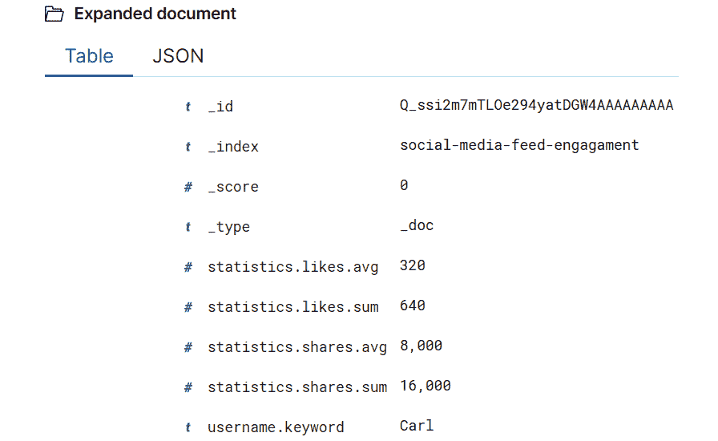

图 9.14 – 连续转换作业的目标索引包含一个新用户名 Carl 的条目，这是我们通过 Kibana 开发控制台手动添加的

以下示例提供了一个非常简化的连续转换工作原理的概述，以及如何使用 Kibana 中可用的**转换向导**创建自己的连续转换。在*第十三章*“推理”中，当我们展示如何结合训练好的机器学习模型、推理和转换时，我们将回到连续转换的主题。

目前，我们将简要地进入**脚本语言 Painless**的世界。虽然转换向导和它提供的许多预构建的**按组**和**聚合**配置足以满足许多常见的数据分析用例，但对于更高级的用户来说，他们可能希望定义自己的聚合。实现这一目标的一种常见方式是借助 Elasticsearch 内嵌的脚本语言 Painless。

在下一节中，我们将简要游览 Painless 的世界，这将为你创建自己的高级转换配置做好准备。

# 使用 Painless 进行高级转换配置

正如我们在许多前面的章节中看到的，内置的交叉和聚合选项允许我们以各种方式分析和查询我们的数据。然而，对于更定制或高级的用例，内置函数可能不够灵活。对于这些用例，我们需要编写自定义的交叉和聚合配置。集成在 Elasticsearch 中的灵活脚本语言**Painless**允许我们做到这一点。

在本节中，我们将介绍 Painless，展示一些在处理 Painless 时有用的工具，然后展示如何将 Painless 应用于创建自定义转换配置。

## 介绍 Painless

Painless 是一种集成在 Elasticsearch 中的脚本语言。我们将从变量、控制流结构、操作和函数的角度来探讨 Painless。这些是帮助你开发自己的自定义脚本来与转换一起使用的基石。现在，让我们直接进入介绍部分。

很可能这本书的许多读者都来自某种编程语言背景。你可能使用 Python 编写过数据清洗脚本，使用 bash 脚本编程 Linux 机器，或者使用 Java 开发企业软件。尽管这些语言在许多方面都有所不同，并且适用于不同的目的，但它们都有共同的构建块，有助于语言的人类读者理解它们。尽管教授编程语言的方法几乎无限，但我们将采取的方法将基于理解以下关于 Painless 的基本主题：变量、操作（如加法、减法和各种布尔测试）、控制流（if-else 构造和 for 循环）和函数。这些是与熟悉其他编程语言的用户相关联的类似概念。除了这些概念之外，我们还将探讨一些特定于 Painless 的方面，例如不同的执行上下文。

当学习一门新的编程语言时，拥有一个可以用来实验语法的游乐场非常重要。幸运的是，随着 Elasticsearch 7.10 版本的推出，**Dev Tools** 应用现在包含新的 **Painless Lab** 游乐场，您可以在其中尝试本章中展示的代码示例，以及您自己编写的任何代码示例。

可以通过导航到如图 9.15 所示的 **Dev Tools** 来访问 Painless 实验室，然后在 **Dev Tools** 页面的顶部菜单中选择 **Painless Lab**。

![图 9.15 – Dev Tools 页面的链接位于 Kibana 侧菜单的下半部分。选择它以访问交互式的 Painless 实验室环境

![img/B17040_09_015.jpg]

图 9.15 – Dev Tools 页面的链接位于 Kibana 侧菜单的下半部分。选择它以访问交互式的 Painless 实验室环境

这将打开如图 9.16 所示的嵌入式 Painless 代码编辑器。

![图 9.16 – Dev Tools 中的无痛苦实验室特色嵌入式代码编辑器。输出窗口显示了代码编辑器中代码的评估结果

![img/B17040_09_016.jpg]

图 9.16 – Dev Tools 中的 Painless 实验室特色嵌入式代码编辑器。输出窗口显示了代码编辑器中代码的评估结果

Painless 实验室中的代码编辑器预先配置了一些示例函数和变量声明，以说明如何使用 Painless 在如图 9.16 所示的 **输出** 窗口中绘制图形。目前，您可以删除此代码，为阅读本章剩余部分时进行的实验腾出空间。

小贴士

Painless 语言的完整规范可在以下网址在线获取：[`www.elastic.co/guide/en/elasticsearch/painless/master/painless-lang-spec.html`](https://www.elastic.co/guide/en/elasticsearch/painless/master/painless-lang-spec.html)。您可以用它作为参考和资源，以获取关于后面涵盖主题的更多信息。

### 变量、运算符和控制流

在编程语言中，我们通常想要做的第一件事就是操作值。为了有效地做到这一点，我们给这些值分配名称或变量。Painless 有类型，并且在一个变量被分配之前，必须声明它的类型。声明变量的语法如下：**type_identifier variable_name ;**.

如何在实际中应用这种语法，在下面的代码块中得到了展示，其中我们声明变量`a`和`b`来存储整数值，变量`my_string`来存储字符串值，以及变量`my_float_array`来存储浮点值数组：

```py
int a;
int b;
String my_string;
float[] my_float_array;
```

到目前为止，这些变量还没有存储任何非 null 值。它们只是初始化，为赋值语句做准备，该语句将为每个变量分配适当的类型值。因此，如果你尝试将前面的代码块复制到 Painless Lab 代码编辑器中，你将在**输出**窗口中看到**null**，如图*图 9.17*所示。

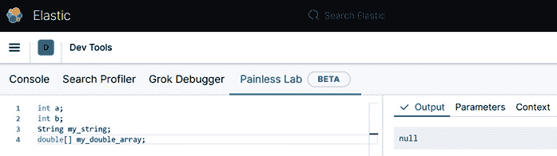

图 9.17 – 在左侧，初始化了各种类型的 Painless 变量。在右侧，输出面板显示 null，因为这些变量尚未分配任何值

重要提示

Painless Lab 代码编辑器只显示最后一条语句的结果。

接下来，让我们给这些变量分配一些值，这样我们就可以用它们做一些有趣的事情。这些赋值在下面的代码块中显示。在前两行中，我们将整数值赋给我们的整型变量`a`和`b`。在第三行中，我们将字符串`"hello world"`赋给字符串变量`my_string`，在最后一行中，我们初始化一个新的包含浮点值的数组：

```py
a = 1;
b = 5;
my_string = "hello world";
my_double_array = new double[] {1.0, 2.0, 2.5};
```

让我们用这些变量做一些有趣的事情来展示 Painless 中可用的运算符。我们只能覆盖其中的一些可用运算符。有关可用运算符的完整列表，请参阅 Painless 语言规范([`www.elastic.co/guide/en/elasticsearch/painless/current/painless-operators.html`](https://www.elastic.co/guide/en/elasticsearch/painless/current/painless-operators.html))。以下代码块展示了基本的数学运算：加法、减法、除法和乘法，以及取模运算或取余数：

```py
int a;
int b;
a = 1;
b = 5;
// Addition 
int addition;
addition = a+b;
// Subtraction 
int subtraction;
subtraction = a-b;
// Multiplication
int multiplication;
multiplication = a*b;
// Integer Division 
int int_division;
int_division = a/b;
// Remainder
int remainder;
remainder = a%b;
```

在 Painless Lab 中亲自尝试这些代码示例，你应该能够看到你评估的结果，就像在*图 9.18*中添加示例所展示的那样。


图 9.18 – 在 Painless 中使用 Painless Lab 代码编辑器和控制台进行加法。在左侧代码编辑器中存储在名为 "addition" 的变量中的结果在右侧的输出选项卡中显示

除了数学运算之外，我们还将探讨 **布尔运算符**。这些运算符对于许多 Painless 脚本和配置以及控制流语句至关重要，我们将在之后进行探讨。

下面的代码片段说明了如何声明一个变量来存储布尔（真/假）值，以及如何使用比较运算符来确定值是小于、大于、小于等于还是大于等于。有关 Painless 中布尔运算符的完整列表，请参阅此处可用的 Painless 规范：[`www.elastic.co/guide/en/elasticsearch/painless/current/painless-operators-boolean.html`](https://www.elastic.co/guide/en/elasticsearch/painless/current/painless-operators-boolean.html)

```py
boolean less_than = 4<5;
boolean greater_than = 4>5;
boolean less_than_or_equal = 4 <=5;
boolean greater_than_or_equal = 4 >= 5;
```

作为练习，将前面的代码块复制到 Painless Lab 代码编辑器中。如果你愿意，可以在 Painless Lab 代码编辑器的最后一行输入变量的名称后跟一个分号，这样就可以在右侧的 **输出** 窗口中打印出变量存储的值，如图 *9.19* 所示。

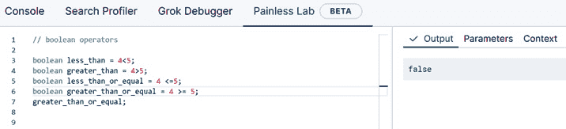

图 9.19 – 在 Painless Lab 代码编辑器中输入变量名后跟一个分号，将在输出选项卡中输出变量的内容

虽然这里展示的布尔运算符在许多数值计算中很有用，但我们可能无法没有等式运算符 `==` 和 `!=` 来编写有效的控制流语句，这两个运算符用于检查两个变量是否相等。以下代码块通过几个实际示例说明了如何使用这些运算符：

```py
// boolean operator for testing for equality
boolean two_equal_strings = "hello" == "hello";
two_equal_strings;
// boolean operator for testing for inequality
boolean not_equal = 5!=6;
not_equal;
```

最后但同样重要的是，在我们对 Painless 中的布尔运算符的探索中，我们将查看一个代码块，展示了如何使用 `instanceof` 运算符，该运算符检查给定变量是否是某个类型的实例，并返回 `true` 或 `false`。当你编写只想在指定类型的变量上操作的 Painless 代码时，这是一个非常有用的运算符：

```py
// boolean operator instanceof tests if a variable is an instance of a type
// the variable is_integer evaluates to true 
int int_number = 5;
boolean is_integer = int_number instanceof int;
is_integer; 
```

在本节的最后部分，让我们看看 Painless 脚本中最重要构建块之一：以下代码块通过一个示例展示了 `if-else` 语句的使用：

```py
int a = 5;
int sum;
if (a < 6){
   sum = a+5;
    }
else {
    sum = a-5;
    }
sum;
```

在前面的代码块中，我们声明了一个整数变量`a`，并将其赋值为整数`5`。然后我们声明另一个整数变量`sum`。这个变量的值将根据`if-else`语句中采取的执行分支而变化。最后，我们看到`if-else`语句首先检查整数变量`a`是否小于 6，如果是，则将`a`和整数 5 相加的结果存储在变量`sum`中。如果不是，则变量`sum`中存储的值是`a`减去 5 的结果。

如果您在 Painless Lab 代码编辑器中输入此代码，`sum`的值为 10（如图*9.20*所示），这是基于之前的分析我们所预期的。

![Figure 9.20 – if-else 语句导致 sum 变量设置为值 10]

![img/B17040_09_020.jpg]

![Figure 9.20 – if-else 语句导致 sum 变量设置为值 10]

最后，我们将看看如何编写`for`循环，这对于使用 Painless 进行各种数据分析和处理任务非常有用。在我们的`for`循环中，我们将遍历一个字符串变量并计算字符串中字母`a`出现的次数。这是一个非常简单的例子，但希望它能帮助您理解语法，以便您可以在自己的例子中应用它：

```py
// initialize the string and the counter variable
String sample_string = "a beautiful day";
int counter = 0;
for (int i=0;i<sample_string.length();i++){
 // get a letter from the string using the substring method
 String letter = sample_string.substring(i, i+1);
 //use an if-statement to check if the current letter being processed is an a
 if (letter=="a") {
 // is yes, increment the counter
 counter++
   }
 }

counter;
```

将此代码示例（可以在 GitHub 仓库 [`github.com/PacktPublishing/Machine-Learning-with-Elastic-Stack-Second-Edition`](https://github.com/PacktPublishing/Machine-Learning-with-Elastic-Stack-Second-Edition) 中的`Chapter 9 - Introduction to Data Frame Analytics`文件夹下找到此书的副本）复制并粘贴到您的 Painless Lab 中，您将看到`counter`变量在`3`，正如我们所预期的，因为字符串“a beautiful day”中有三个“a”字母的出现。

### 函数

现在我们已经涵盖了变量、运算符和控制流语句，让我们暂时将注意力转向**函数**。有时，我们可能会发现自己反复在不同的脚本和配置中编写相同的代码行。在这种情况下，将我们反复使用的代码行打包成一个可重用的代码块，并从我们的 Painless 脚本中通过名称引用它可能更经济。

让我们回到我们编写带有`if`语句的`for`循环来计算给定字符串中字母“a”实例的例子。假设我们想重用这个功能并使其稍微更通用。这是一个将此代码块打包成 Painless 函数的绝佳机会。

在 Painless 中编写函数有三个部分。首先，我们编写函数头，它指定了函数返回值的类型以及函数的名称。这是我们将在脚本或`letterCounter`中使用的内容，如下面的代码块所示：

```py
int letterCounter(){
}
```

函数名前的 `int` 决定了该函数返回值的类型。由于我们感兴趣的是特定字符串中特定字母出现的次数，我们将返回一个整数计数。名称 `letterCounter` 后面的括号将包含函数接受的参数。目前，我们尚未指定任何参数，因此括号之间没有内容。最后，两个大括号表示函数体的位置——这是函数所有逻辑将驻留的地方。

现在我们已经研究了创建基本函数头所需的所有元素，让我们填充函数体（即上节学习 `for` 循环时编写的代码所在的大括号之间的空间）。现在我们的函数看起来应该像以下代码块：

```py
int letterCounter(){
    // initialize the string and the counter variable
    String sample_string = "a beautiful day";
    int counter = 0;
    for (int i=0;i<sample_string.length();i++){
    // get a letter from the string using the substring method
    String letter = sample_string.substring(i, i+1);
    //use an if-statement to check if the current letter being processed is an a
    if (letter=="a") {
    // is yes, increment the counter
    counter++
    }
    }
    return counter;
}
letterCounter();
```

如果你看到函数体的末尾，你会注意到我们 `for` 循环与函数体中的唯一区别是现在我们添加了一个 `return` 语句。这允许我们存储在变量 `counter` 中的感兴趣值返回到调用函数的代码中，这把我们带到了下一个问题。现在我们已经编写了第一个 Painless 函数，并且它做了些有趣的事情，我们如何调用这个函数呢？

在 Painless Lab 环境中，我们只需像 *图 9.21* 所示那样键入 `letterCounter();`。根据我们对这个代码样本之前的分析，这个函数返回的结果是，正如我们所预期的，`3`。

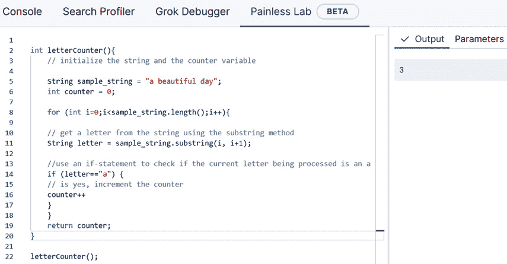

图 9.21 – 样本函数 letterCounter 的定义与在 Painless Lab 环境中调用函数的示例并排显示

现在我们已经有一个可工作的函数了，让我们来谈谈如何使这个函数更加通用，这在处理我们本章讨论的转换，或者将在 *第十三章* “推理”中讨论的各种摄取管道和脚本处理器时，你经常会需要这样做。目前，我们的函数 `letterCounter` 非常具体。它只计算特定字母（字母 a）在特定字符串（短语“a beautiful day”）中出现的次数。

假设为了使这段代码真正有用，我们希望改变短语和被计数的字母。通过函数，我们可以通过最小化代码重复来实现这一点，通过配置 **函数参数**。由于我们希望改变字母和短语，让我们将这两个变成函数参数。更改后，我们的函数定义将如下所示：

```py
int letterCounter(String sample_string, String count_letter){
    // initialize the string and the counter variable
    int counter = 0;
    for (int i=0;i<sample_string.length();i++){
    // get a letter from the string using the substring method
    String letter = sample_string.substring(i, i+1);
    //use an if-statement to check if the current letter being processed is an a
    if (letter==count_letter) {
    // is yes, increment the counter
    counter++
    }
    }
    return counter;
}
```

注意，现在在函数标题的括号中，我们已经定义了两个参数：一个 `sample_string` 参数表示我们想要在其中计算第二个参数 `count_letter` 发生次数的短语。

要调用此函数，我们首先定义新的变量来存储我们的短语（“一个美好的一天”，再次）和我们的感兴趣字母——这次是字母“b”而不是“a”。随后，我们将这两个变量作为以下代码块中所示传递给函数调用：

```py
String phrase = "a beautiful day";
String letter_of_interest = "b";
letterCounter(phrase, letter_of_interest);
```

由于我们感兴趣的短语中只有一个“b”字母的出现，我们预计执行此函数的结果将是 `1`，正如 *图 9.22* 中所示。


图 9.22 – 函数调用的结果显示在右侧的输出面板中

现在你应该已经准备好编写自己的 Painless 代码了！这在*第十三章*“推理”中会很有用，我们将使用高级 Painless 功能来进行特征提取和编写脚本处理器。

# 使用 Python 和 Elasticsearch

近年来，Python 已成为许多数据密集型项目的首选语言。得益于其易于使用的机器学习和数据分析库，许多数据科学家和数据工程师现在正大量依赖 Python 来完成他们的大部分日常操作。因此，在 Elastic Stack 中关于机器学习的讨论如果没有探讨数据分析师如何使用 Python 与 Elastic Stack 一起工作，将是不完整的。

在本节中，我们将探讨三个官方 Python Elasticsearch 客户端，了解它们之间的区别，并讨论何时可能需要使用其中一个而不是另一个。我们将演示如何通过使用 Elasticsearch 客户端来自动化 Elastic Stack ML 的使用。此外，我们将深入了解 **Eland**，这是一个新的数据科学原生客户端，它支持由 Elasticsearch 支持的高效内存数据分析。在探索 Eland 的工作原理后，我们将展示如何将 Eland 与 Jupyter notebooks 结合使用，这是一个开源的交互式数据分析环境，用于分析存储在 Elasticsearch 中的数据。

## Python Elasticsearch 客户端的简要概述

任何使用过 Kibana Dev Tools 控制台与 Elasticsearch 通信的人都知道，大多数操作都是通过 REST API 完成的。你可以通过调用正确的端点并传递正确的参数来插入、更新和删除文档。不出所料，在编写调用这些 REST API 端点的客户端程序时，存在几个抽象级别。低级客户端**elasticsearch-py**（[`elasticsearch-py.readthedocs.io/en/v7.10.1/`](https://elasticsearch-py.readthedocs.io/en/v7.10.1/））为通常通过 Kibana Dev 控制台或能够发送 HTTP 请求的应用程序执行的 REST API 调用提供了一个薄的 Python 包装器。下一个抽象级别由 Elasticsearch DSL 客户端（[https://elasticsearch-dsl.readthedocs.io/en/latest/](https://elasticsearch-dsl.readthedocs.io/en/latest/））捕捉。最后，最抽象的客户端是**Eland**（[https://eland.readthedocs.io/en/7.10.1b1/](https://eland.readthedocs.io/en/7.10.1b1/）），其中数据帧，数据的表格表示，是一个一等公民。在随后的示例中，我们将看到这对于希望使用 Eland 与 Elasticsearch 一起工作的数据科学家意味着什么。

除了可用的 Elasticsearch 客户端外，我们还将花一点时间讨论任何希望使用 Python 和 Elasticsearch 的数据工程师或数据科学家可用的各种执行环境。这反过来又将引导我们介绍 Jupyter 笔记本和整个 Jupyter 生态系统，这对于任何希望使用机器学习和 Elastic Stack 的人来说都是一个需要了解的工具。

执行 Python 程序的第一种，也可能是最熟悉的方法，是将我们的程序逻辑写入文本文件——或脚本——保存为`.py`扩展名以表示它包含 Python 代码，然后使用命令行调用脚本，如图 9.23 所示。


图 9.23 – 使用 Python 的一种方法是，将我们的程序存储在文本文件或脚本中，然后从命令行执行它

第二种方法是使用交互式 Python REPL，如图 9.24 所示。在命令行上调用`python`（或`python3`）将启动一个交互式 Python 环境，我们可以在此环境中编写函数、定义变量并执行各种 Python 代码。虽然这个环境对于小规模或快速实验很有用，但在实践中，在 REPL 环境中进行长期或更大规模的数据分析项目会很困难。因此，对于大多数涉及 Python、数据分析和 Elastic Stack 的项目，首选的环境是某种集成开发环境，它提供代码编辑器以及支持编程和执行的各种工具。

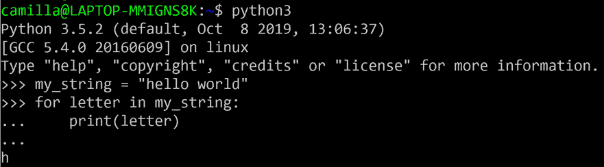

图 9.24 – 展示一个示例 Python 交互式外壳或 REPL 的截图，非常适合在 Python 编程语言中进行快速实验

一个专门为数据分析设计的开发环境是 Jupyter 笔记本，如图*9.25*所示。

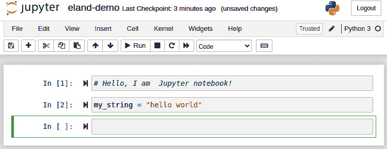

图 9.25 – 一个示例 Jupyter 笔记本

笔记本可以通过中央包管理服务，如`pip`，安装到 Python 环境中，并在命令行中通过输入`jupyter notebook`来启动。启动的环境在浏览器中运行，如 Chrome 或 Firefox，提供了一个可以并排存在代码片段、文本段落、图表和可视化（包括交互式和静态）的环境。许多作者已经比我们在本章中拥有的空间和时间更好地涵盖了 Jupyter Notebook 及其周围的库生态系统，因此我们鼓励那些想要或预期将在数据分析、Elasticsearch 和 Python 交叉领域工作更多的读者查看本章末尾的*进一步阅读*部分中列出的材料。

### 理解 Eland 背后的动机

上一节的读者可能会想知道，*当社区已经有两个客户端可供选择时，为什么还要构建另一个 Elasticsearch Python 客户端的动机是什么？* 此外，*为什么围绕数据框对象的概念构建整个软件库？* 这两个问题的答案可能足以填满一本书，所以这里提供的答案必然会有一些细微差别未被探索。尽管如此，我们希望对于感兴趣的读者，本节中的讨论将提供一些有趣的背景，了解 Eland 是如何产生的以及为什么它围绕数据框的概念进行设计。

尽管 Python 现在似乎是数据分析、机器学习许多领域的支配力量，但这并非一直如此。特别是，在 2010 年代初，生态系统由统计处理语言 R 主导，它有一个非常有用的结构——一个 dataframe 对象，允许用户在类似表格的结构中分析数据行（这个概念无疑对 Excel 用户来说是熟悉的）。大约在同一时间，Wes McKinney 当时在纽约金融公司 AQR Capital 工作，开始开发一个库，使 Python 数据分析师的生活更加轻松。这项工作最终导致了**pandas**的发布，这是一个开源的数据分析库，被成千上万的科学家和数据工程师使用。

使 pandas 变得有用且易于使用的关键特性之一是`DataFrame`对象。类似于 R 对象，这个对象使得以表格方式操作和执行数据分析变得简单直接。尽管 pandas 非常强大，并包含大量内置函数和方法，但当想要分析的数据集太大而无法适应内存时，它开始遇到限制。

在这些情况下，数据分析师通常会从各种数据库中采样数据，例如存储在 Elasticsearch 中的数据，将其导出为平面文件，然后将其读入 Python 进程，以便可以使用 pandas 或其他库进行分析。虽然这种方法确实有效，但如果 pandas 能够直接与数据库接口，工作流程将变得更加流畅。如果我们能够透明地将`DataFrame`对象与 Elasticsearch 接口，那么数据分析师就可以专注于数据分析，而无需担心管理连接和从 Elasticsearch 导出数据？这正是 Eland 的核心理念。希望接下来的章节能够展示这一理念如何在库的设计中具体实现。

### 使用 Eland 迈出第一步

由于 Eland 是一个第三方库，您首先需要安装它，以便您的 Python 安装能够使用它。关于各种操作系统的安装说明可以在本书的 GitHub 仓库中的`第九章 - 数据帧分析简介`部分找到：[`github.com/PacktPublishing/Machine-Learning-with-Elastic-Stack-Second-Edition/tree/main/Chapter%209%20-%20Introduction%20to%20Data%20Frame%20Analytics`](https://github.com/PacktPublishing/Machine-Learning-with-Elastic-Stack-Second-Edition/tree/main/Chapter%209%20-%20Introduction%20to%20Data%20Frame%20Analytics)。我们将假设希望跟随本书本节内容的读者已经按照链接中的说明完成了库的安装。本章中的示例和截图将使用 Jupyter 笔记本环境进行说明，但也可以在独立环境中运行本章中提供的代码示例（例如，从 Python REPL 或 Python 脚本中）。需要 Jupyter 笔记本环境的特定示例将明确标注：

1.  我们必须采取的第一步是导入 Eland 到我们的环境中。在 Python 中，这是通过`import`语句完成的，如*图 9.26*所示。请注意，当使用像 Eland 这样的库时，通常会给库分配一个别名。在*图 9.26*中显示的代码片段中，我们使用`as`关键字将`eland`分配给别名`ed`。这将节省我们未来的输入，因为我们将在访问其对象和方法时多次调用库名称。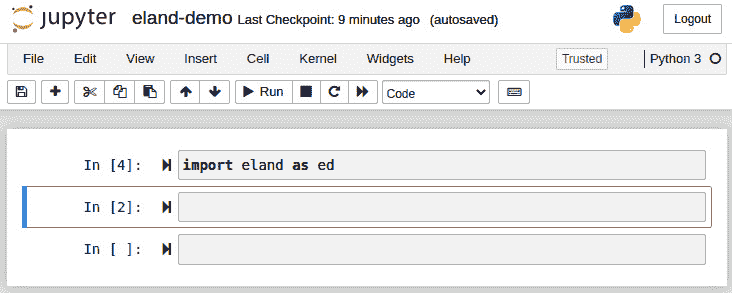

    图 9.26 – 将 Eland 导入笔记本

1.  在将代码导入我们的 Jupyter 笔记本之后，我们可以自由地开始探索。让我们从 Eland 可以做的最基本的事情开始：创建一个 Eland `DataFrame`。要创建 `DataFrame`，我们需要指定两件事：我们 Elasticsearch 集群的 URL（例如，如果我们在本地的默认端口 `9200` 上运行 Elasticsearch，则为 `localhost`）以及包含我们希望分析的数据的 Elasticsearch 索引的名称。这两个参数作为 *图 9.27* 中所示的那样传递给 `DataFrame` 构造函数。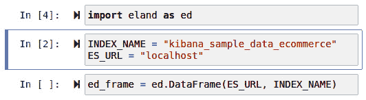

    图 9.27 – 在 Eland 中创建 DataFrame 涉及到 Elasticsearch 集群的 URL 和包含我们希望分析的数据的索引名称

1.  当我们开始检查一个新的数据集时，我们感兴趣做的第一项任务之一是了解数据看起来像什么（通常，查看几行示例就足以了解数据的总体情况）以及数据集的一些一般统计属性。我们可以通过在 Eland `DataFrame` 对象上调用 `head` 方法来学习前者，如图 *图 9.28* 所示。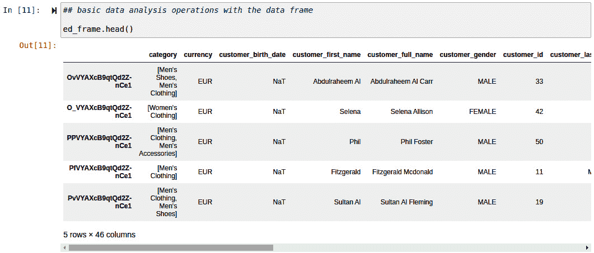

    图 9.28 – 在 Eland DataFrame 对象上调用 head 方法将显示数据集中的前 5 行

1.  另一方面，了解后者是通过调用 `describe` 方法获得的，这对于 pandas 用户来说很熟悉，并在 *图 9.29* 中展示。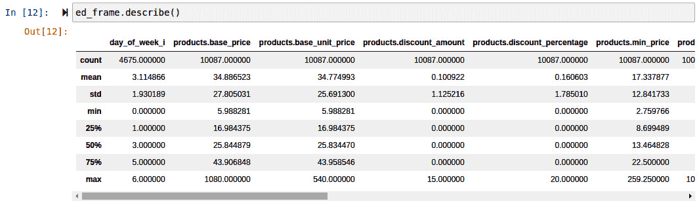

    图 9.29 – "describe" 总结了数据集中数值列的统计属性

1.  除了获得数据集的基本概述外，我们还可以通过使用与字段名称一起的 `get` 命令轻松访问索引中给定字段的单个值，如图 *图 9.30* 所示。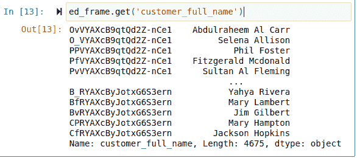

    图 9.30 – 我们可以通过使用 get 方法处理索引中的单个字段值

1.  最后，我们可以使用 `aggregate` 方法在我们的数值列上计算聚合。在 *图 9.31* 中展示的示例中，我们选择了两个数值列 `total_unique_products` 和 `taxful_total_price`，并计算了这些字段在索引中所有文档中的总和、最小值和最大值。

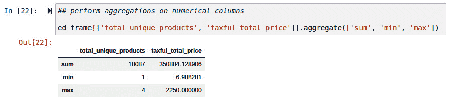

图 9.31 – 在 Eland 中使用 aggregate 方法可以在选定的列上计算聚合

虽然这里展示的步骤相对简单，但我们希望它们展示了如何无缝地将 Elasticsearch、Python 工作以及如 Jupyter Notebook 这样的数据分析环境集成到一个无缝的数据分析工作流程中。我们将在第十三章“推理”中进一步基于这个基础构建 Eland，届时我们将探讨更多高级用例。第十三章。

# 摘要

在本节中，我们涉足数据框分析的世界，这是机器学习和数据转换工具的一个全新分支，它解锁了使用存储在 Elasticsearch 中的数据解决问题的强大方式。除了概述我们将在未来章节中涵盖的新无监督和监督机器学习技术外，我们还研究了三个重要主题：转换、使用 Painless 脚本语言以及 Python 和 Elasticsearch 之间的集成。这些主题将构成我们未来章节工作的基础。

在我们关于转换的阐述中，我们研究了构成转换的两个组件——枢轴和聚合——以及运行转换的两种可能模式：批处理和连续。批处理转换只运行一次，并在特定时间点的源索引快照上生成转换。这对于变化不大的数据集或在需要仅在特定时间点执行数据转换时非常适用。对于许多现实世界的用例，例如日志记录或我们熟悉的电子商务商店示例，被监控和分析的系统是不断变化的。应用程序不断记录其用户的操作，电子商务商店不断记录新的交易。连续转换是分析此类流数据集的首选工具。

虽然我们在示例中展示的**转换**向导中的预配置选项适用于大多数情况，但更高级的用户可能希望配置自己的聚合。为了做到这一点（以及在一般意义上，为了能够执行我们在后续章节中将要讨论的许多更高级的配置），用户需要熟悉嵌入在 Elasticsearch 中的脚本语言 Painless。特别是，我们探讨了如何在 Painless 中声明变量，如何通过操作来操作这些变量，如何使用控制流语句构建更高级的程序，以及最后如何将有用的代码片段打包成函数。所有这些都将有助于我们在后续章节中的探索！

最后但同样重要的是，我们简要介绍了如何使用 Python 分析存储在 Elasticsearch 中的数据。我们查看了两款现有的 Elasticsearch Python 客户端，`elasticsearch-py`和`elasticsearch-dsl`，并阐述了第三个也是最新的客户端 Eland 的开发动机。

在下一节中，我们将深入探讨 Elastic Stack 中新增的三种机器学习方法中的第一种：异常检测。

# 进一步阅读

关于 Jupyter 生态系统，特别是 Jupyter Notebook 的更多信息，请查看 Project Jupyter 的全面文档，链接如下：[`jupyter.org/documentation`](https://jupyter.org/documentation).

如果你刚接触 Python 开发并且想要了解语言生态系统以及可用的各种工具，请查看《Python 漫游指南》，链接如下：[`docs.python-guide.org/`](https://docs.python-guide.org/).

想要了解更多关于 pandas 项目的信息，请参阅官方文档，链接如下：[`pandas.pydata.org/`](https://pandas.pydata.org/).

关于 Painless 内嵌脚本语言的更多信息，请参阅官方的 Painless 语言规范，链接如下：[`www.elastic.co/guide/en/elasticsearch/painless/current/painless-lang-spec.html`](https://www.elastic.co/guide/en/elasticsearch/painless/current/painless-lang-spec.html).
