# *第十章*：异常值检测

在本书的第一部分，我们深入讨论了异常检测，这是一个允许我们以无监督方式检测时间序列数据中异常行为的特性。当我们想要检测我们的某个应用程序在特定时间是否经历了异常延迟，或者我们公司网络上的主机是否传输了异常数量的字节时，这种方法效果很好。

在本章中，我们将了解 Elastic Stack 中的第二个无监督学习特性：异常值检测，它允许我们在非时间序列索引中检测异常实体。异常值检测的一些有趣应用可能包括，例如，检测组织样本中的异常细胞，调查异常房屋或当地房地产市场中的区域，以及检测您计算机上安装的异常二进制文件。

Elastic Stack 中的异常值检测功能基于四种不同的异常值检测技术的集成或分组。其中两种技术基于密度——也就是说，它们试图确定在您的索引中哪些数据点远离数据的大多数——另外两种基于距离——也就是说，它们试图确定哪些点远离所有其他点。虽然，单独来看，这四个算法各有其优势和劣势，但作为一个整体（或分组），它们能够执行稳健的异常值检测。我们将在本章后面讨论每个算法在概念层面上的作用。

除了探索驱动异常值检测的技术之外，我们还将探讨异常值检测与异常检测的区别，如何在 Elasticsearch 中配置异常值检测作业，如何解释异常值检测的结果，以及如何理解哪些特征导致了某个点被宣布为异常值。我们将在本章探讨以下主题：

+   探索异常值检测的工作原理

+   在实践中应用异常值检测

+   使用 Evaluate API 评估异常值检测

+   异常值检测的超参数调整

# 技术要求

本章的材料依赖于使用 Elasticsearch 版本 7.9 或更高版本。本章中的图表是使用 Elasticsearch 7.10 生成的。本章中使用的代码片段和代码示例位于书籍 GitHub 仓库的`chapter10`文件夹中：[`github.com/PacktPublishing/Machine-Learning-with-Elastic-Stack-Second-Edition`](https://github.com/PacktPublishing/Machine-Learning-with-Elastic-Stack-Second-Edition)。

探索异常值检测的工作原理

**异常值检测**可以通过发现哪些点是不同或异常的来对数据集提供洞察，但 Elastic Stack 中的异常值检测是如何工作的呢？为了理解如何构建异常值检测功能，让我们首先从概念上思考你将如何设计算法，然后看看我们的概念想法如何被形式化为构成 Elasticsearch 中异常值检测集合的四个独立算法。

假设我们有一组关于南瓜重量和周长的二维数据集，并且我们希望发现哪些南瓜是这一群体中的异常值（也许我们想利用这些信息来找出它们为何是异常值）。一个很好的第一步是绘制数据，看看是否有任何明显的数据点看起来与其他数据点相距甚远：

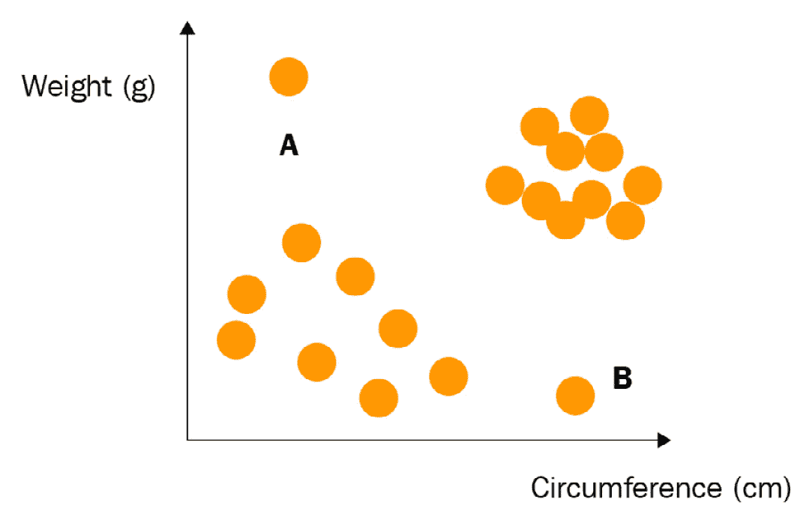

图 10.1 – 点 A 和点 B 似乎是这个数据集中的异常值，因为它们位于数据总体分布之外

人类眼睛在捕捉模式方面非常出色，快速浏览一下*图 10.1*就可以告诉你，点 A 和点 B 看起来像是异常值。是什么内在的直观推理让我们得出这个结论呢？我们的视觉系统告诉我们，从某种意义上说，点 A 和点 B 似乎远离二维空间中另外两个不同的点群。这一观察及其形式化是 Elastic Stack 中使用的异常值检测技术的基础。

## 发现用于异常值检测的四种技术

如前节所述，Elastic Stack 中的异常值检测算法是一个由四种不同的异常值检测技术组成的集合，或分组。这些技术可以进一步细分为两类：**基于距离的技术**和**基于密度的技术**。我们将在接下来的章节中逐一考察它们。

### 基于距离的技术

如前节所述，人类的视觉系统在从二维图像中捕捉异常值方面非常擅长，而我们能够做到这一点的原因在于我们能够捕捉到那些似乎远离数据总体分布的点。这一观察结果正是两种基于距离的技术，即**到第 k 个最近邻的距离**和**到第 k 个最近邻的平均距离**，所试图捕捉的。

假设我们有一个在空间上分布的两维数据集，如图*图 10.2*所示，并且假设我们选择*k*的值为 3。此时，我们只是为了说明目的而选择一个任意低的*k*值。这意味着对于*图 10.2*中的点 A，我们找到第三个最近点并计算点 A 到它的距离（在*图 10.2*中以较粗的箭头标记）。这种方法在简单性方面很出色，但也容易受到噪声的影响。为了使这种方法更加稳健，我们还可以计算**到第 k 个最近邻的平均距离**（如图*图 10.2*所示）：

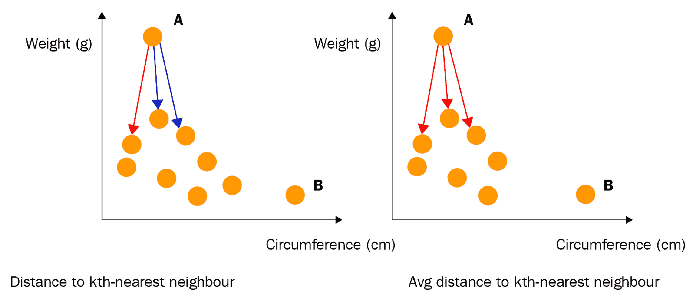

图 10.2 – 点 A 到第 k 个最近邻的距离以及点 A 到第 k 个最近邻的平均距离，当 k=3 时

虽然基于距离的方法在简单性和可解释性方面很出色，但它们无法捕捉数据空间分布中的某些细微差别，特别是每个数据点的邻域是稀疏还是密集。为了捕捉这些属性，我们必须查看基于密度的技术。

### 基于密度的技术

基于距离的方法未能充分捕捉的一个因素是，我们感兴趣点的邻域中点的密度与其邻居周围点的密度的差异。计算一个点的局部异常因子恰好捕捉了这一点：给定点的邻域与其他邻域中的点有多大的不同。

*图 10.3* 展示了当 k=3 时该技术的基本思想。在这种情况下，我们比较点 A 的邻域与其三个最近邻的邻域（如图*图 10.3*中的虚线圆所示）。局部异常因子测量的值为 1 意味着点 A 的邻域与其邻居的邻域相当 – 它既不更稀疏也不更密集。大于 1 的值意味着 A 的邻域比其邻居的邻域更稀疏，它可能是一个异常值。相反，小于 1 的值意味着该点被其邻居密集包围，因此不太可能是异常值：

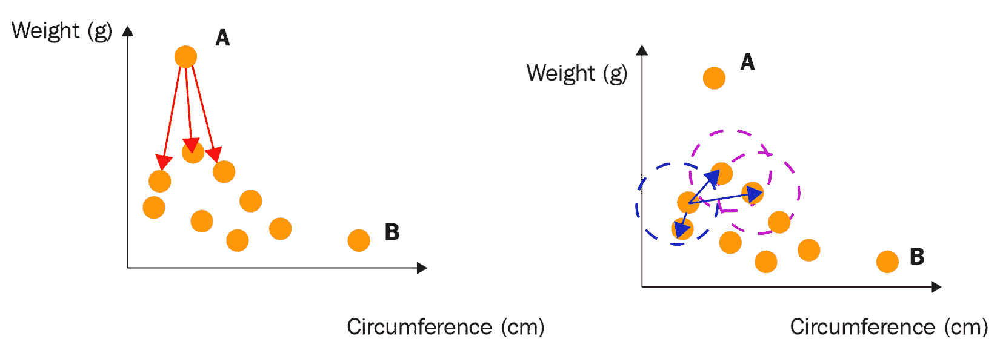

图 10.3 – 局部异常因子比较点 A 的邻域与其第 k 个最近邻的邻域

我们四种方法组合中的最后一种方法是**基于局部距离的异常值因子**（**LDOF**）。与**局部异常因子**（**LOF**）类似，**LDOF**的目标是将给定点 A 的邻域与 A 的邻居的邻域进行比较。在这种情况下，我们计算 A 的第 k 个最近邻的平均距离，对于某个固定的*k*，计算*avg(A)*。然后，对于 A 的第 k 个最近邻中的每一个，我们计算成对距离并取它们的平均值，*avgkk(A)*。

最后，我们检查*avg(A)/avgkk(A)*的比率，看看它接近 1 的程度。如果比率接近 1，这意味着点 A 被其他点的局部密度所包围，因此不太可能是异常值。

分配给每个数据点的最终整体异常值分数是上述四种方法得出的值的组合。该值越接近 1，该点成为异常值的可能性就越大。

有时我们只是想找出数据集中哪些点是异常值，而在其他情况下，我们还想了解为什么异常值检测算法建议某个特定点是异常值。是否存在某个特定的特征或字段值，或者可能是一组值，使得该点变得不寻常？这就是我们将在下一节中讨论的主题。

## 理解特征影响力

让我们暂时回到本章开头提到的虚构南瓜数据集。假设我们正在使用异常值检测分析这个数据集。分析完成后，对于每个南瓜，我们都有一个从 0 到 1 的分数，衡量南瓜的异常性。除了知道分数外，我们还可能对了解哪些特征——南瓜的重量或南瓜的周长——对其异常性做出了贡献感兴趣。

这正是**特征影响力**旨在解决的问题。简而言之，特征影响力将 0 到 1 的分数分配给每个特征（如果我们从通常用来描述 Elasticsearch 文档的词汇来考虑，则是**字段**），该分数描述了该特征在确定数据点是异常值方面的重要性。所有特征的特征影响力分数总和为 1。

让我们借助图 10.4 中的虚构南瓜数据集来更仔细地看看特征影响力。假设我们的异常值检测算法已经确定 A 和 B 是该数据集中的异常值。现在，让我们考虑南瓜重量和南瓜周长在 A 和 B 点上的特征影响力值是如何相对的：

![图 10.4 – 特征影响力分数衡量给定特征在确定数据点异常性方面的影响]

![图片 B17040_10_004.jpg]

![图 10.4 – 特征影响力分数衡量给定特征在确定数据点异常性方面的影响]

南瓜 A 的重量远超出南瓜的正常重量范围，但其周长位于左侧簇南瓜周长值的中部。因此，我们预计南瓜重量的特征影响值对于点 A 会很高，但周长的特征影响值会很低。

现在，让我们来看看异常南瓜 B，情况正好相反。虽然南瓜 B 的重量位于数据集的中段，但南瓜 B 的周长比几乎任何其他数据点都要高。因此，对于南瓜 B，周长的特征影响值将高于重量的值。

### 每个点的特征影响是如何计算的？

在解释这些特征影响分数时，了解计算中具体包含的内容通常很有帮助。让我们暂时回到我们的二维南瓜数据集，以说明计算特征影响所涉及的步骤。我们想要确定的是，特定特征，比如南瓜的重量*X*，对最终异常值分数的影响有多大。尝试量化这种影响的一种自然方式是想象我们根本不包括这个特征在我们的异常值计算中。*图 10.5*展示了在我们的南瓜示例中这会是什么样子。对于每个南瓜数据点，我们将**权重**特征的值投影到一个固定的值 0，并观察每个数据点的异常性变化了多少。

从*图 10.5*中我们可以看出，对于点 A，移除或投影权重值到 0，最终会导致点 A 变成一个内点。因此，我们可以得出结论，`权重`特征对点 A 的不寻常性有重大影响。另一方面，如果我们观察*图 10.5*右侧图中的点 B，我们可以看到，由于将其`权重`特征投影到 0，其不寻常性没有改变。因此，我们可以得出结论，`权重`特征值对点 B 的不寻常性影响不大，因此其特征影响值将较低：

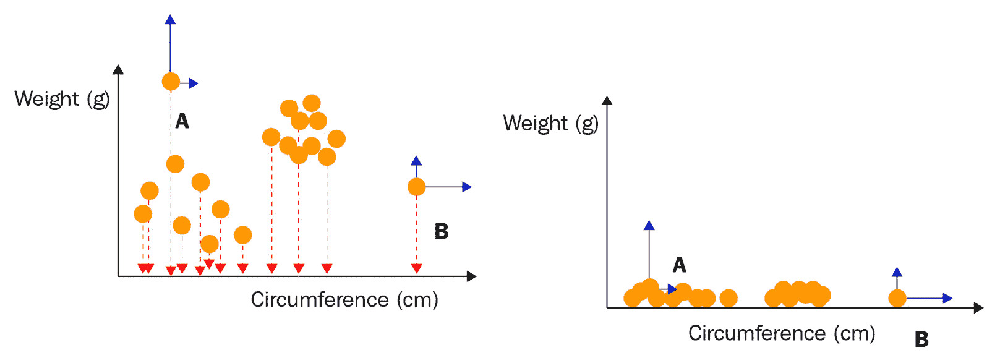

图 10.5 – 通过询问如果将给定特征投影到固定值或移除，给定数据点的异常性将如何变化来计算特征影响

## 异常值检测与异常检测有何不同？

在阅读本章时，你可能已经注意到异常检测和异常检测都是无监督学习方法，它们试图实现一个相似的目标：找到不寻常或异常的数据点。那么一个自然的问题就是询问，*异常检测与异常检测有何不同？* 在本节中，我们将概述并解释这两种方法之间的主要区别。主要观点的总结见*图 10.6*，我们很快就会看到。

### 基于概率模型与基于实例

为了在我们心中更清晰地区分异常检测和异常检测，让我们首先简要地看一下可用的异常检测方法。异常检测功能使我们能够检测基于时间序列数据中的异常特征。它是通过将时间序列分割成离散的时间单元，称为**桶**，然后对桶中的单个值应用检测函数（如平均值或总和）来实现的。然后，每个桶的值被用作概率分布中的单个数据点，该概率分布随着异常检测器看到越来越多的数据而持续更新。在概率分布下发生概率低的桶被标记为异常。

与构建一个追踪数据随时间演变的概率模型不同，异常检测使用一组四种技术——两种基于距离的技术和两种基于密度的技术，这些技术在前面的章节中已有介绍。数据点与数据集中一般数据质量越远，它成为异常值的可能性就越大。对于数据集没有构建概率模型。

### 评分

这两种技术之间的主要差异导致我们在评分上也有差异。在异常检测中，桶的异常性是通过异常检测器从数据中学到的模型下发生的不可能性来确定的。概率越低，桶的异常性就越大。

相反，在异常检测中，我们计算异常分数，而不是概率。异常分数是一个从 0 到 1 的连续度量，它捕捉了给定数据点与整个数据集中一般数据质量距离的汇总度量。正如我们在本章前面所看到的，这个度量是通过四种不同的技术来计算的。异常分数越高，数据点在数据集中的异常或不寻常程度就越高。

### 数据特征

除了评分之外，这两种技术之间的另一个主要区别是它们旨在处理的数据类型。异常检测仅适用于时间序列数据，而异常检测可以用于单维或多维数据集，这些数据集可能包含或不包含基于时间组件。

### 在线与批量

最后，这两种无监督学习技术之间最后一个主要区别是，当新数据被索引时，它们对更新的适应性。熟悉异常检测的用户会知道，这种技术非常适合流数据。一旦新数据桶到达集群并被处理，概率模型就可以更新以反映新数据。

与异常检测不同，离群点检测不能像异常检测那样进行在线更新。如果一组新数据点被摄入源索引，我们必须再次在源索引上重新运行离群点检测作业。原因在于，离群点检测是一种基于实例的方法，它使用数据点的空间和密度分布来确定哪些是正常的，哪些是离群点。任何被摄入源索引的新点都可能改变数据的空间分布，以至于之前被分类为离群点的点将不再是离群点，因此，对新数据的重新评估需要重新计算整个数据集的离群点分数。在以下表格之前添加一个引言句。

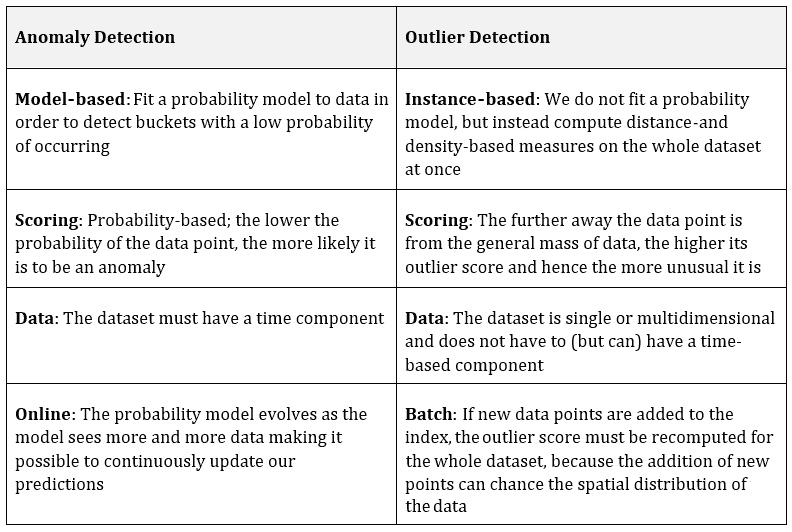

图 10.6 – 异常检测与离群点检测的主要区别概述

# 实际应用离群点检测

在本节中，我们将通过一个使用描述葡萄酒物理化学性质的公共数据集的离群点检测的实际示例来探讨。此数据集可从加州大学欧文分校（UCI）的存储库下载（[`archive.ics.uci.edu/ml/datasets/wine+quality`](https://archive.ics.uci.edu/ml/datasets/wine+quality)）。

葡萄酒数据集由两个 CSV 文件组成：一个描述白葡萄酒的物理化学性质，另一个描述红葡萄酒的性质。在本教程中，我们将重点关注白葡萄酒数据集，但您也可以使用红葡萄酒的数据，因为本章中描述的大多数步骤都适用于两者。

首先，让我们使用 `winequality-white` 将数据集导入我们的 Elasticsearch 集群：

![图 10.7 – 数据可视化工具可在 Kibana 的机器学习应用中找到，便于导入用于实验的小型数据文件]

![图 10.7 – 数据可视化工具可在 Kibana 的机器学习应用中找到，便于导入用于实验的小型数据文件]

图 10.7 – 数据可视化工具可在 Kibana 的机器学习应用中找到，便于导入用于实验的小型数据文件

简单查看 **发现** 选项卡中的数据将显示，每份文档代表一款单独的葡萄酒，并包含有关酒精含量、酸度、pH 值和糖含量等化学测量值的信息，以及由人类品酒师分配的定性评分。我们调查的目标将是使用异常检测来检测哪些葡萄酒在化学成分方面是异常的，然后看看这是否与人类品酒师给出的评分相关。我们的假设是，在化学成分方面不寻常的葡萄酒也将是质量评分方面的异常者。按照以下步骤进行操作以探索这个假设：

1.  让我们从使用如图 *图 10.8* 所示的 **数据帧分析** 向导创建异常检测作业开始：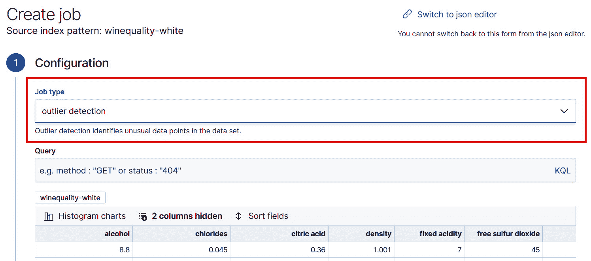

    图 10.8 – 使用数据帧分析向导创建异常检测作业。

1.  因为我们对比较化学成分异常的葡萄酒和评分异常的葡萄酒感兴趣，所以我们将从异常检测作业中排除评分，如图 *图 10.9* 所示：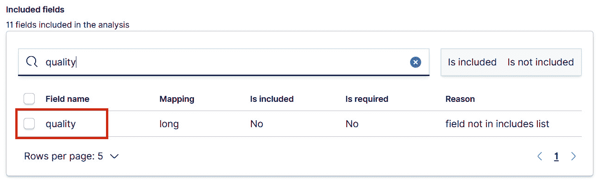

    图 10.9 – 通过取消选中字段名称旁边的框来排除异常检测作业中的评分

1.  我们将使用默认设置配置其余的配置选项。一旦作业完成，我们可以使用 **数据帧分析** 结果查看器检查结果：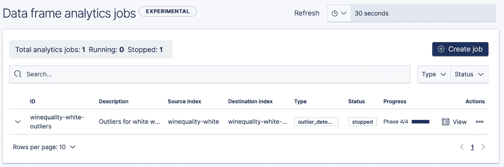

    图 10.10 – 使用数据帧分析作业管理 UI 查看异常检测作业何时完成

1.  `ml.outlier_score` 的视图。异常分数是一个介于 0 和 1 之间的浮点值，它捕捉了给定数据点相对于数据集的异常程度。一个给定点得分越接近 1，它就越异常，反之亦然。

    表格中剩余的列显示了数据集中其他字段选择值的数值。每个单元格根据从 0 到 1 的渐变值着色，这捕捉了特征影响，换句话说，特征在确定数据点异常性方面的重要性。一个给定单元格的蓝色越深，该特征对点异常性的重要性就越大。

    例如，通过查看 *图 10.11* 中的 `ml.outlier_score` 列的值，我们可以看到数据集中最不寻常的四款葡萄酒各自得分为 0.998：

    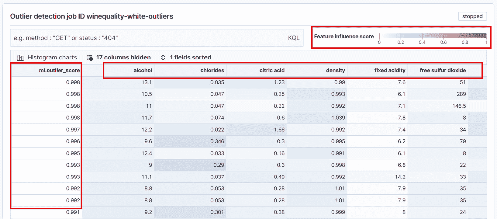

    图 10.11 – 异常检测的结果 UI 显示一个摘要表，捕获每个数据点的异常评分以及一些字段（按字母顺序排序）用特征影响评分着色

    重要提示

    在这个阶段提出的一个有趣的问题是*我们宣布一个点为异常的阈值是多少？*我们是说所有得分高于 0.5 的点都是异常点吗？或者我们设置一个更保守的阈值，只说得分高于 0.9 的点才是异常点？将连续得分设置为阈值的过程，将每个数据点分类为正常或异常，称为二值化，通常是通过结合领域知识和用户的目标来确定的。然而，在有标签的数据集（例如，每个数据点已经用正常/异常的地面真实值标记的数据集）的情况下，可以执行一个稍微更系统的过程来选择阈值。我们将在下一节中回到这个话题，当我们查看评估 API 时。

1.  接下来，让我们回到结果用户界面，看看单元格的阴影，看看我们是否能从中获取一些关于哪些因素使某种葡萄酒不寻常的有趣信息。我们可以在 UI 中切换隐藏列开关，添加所有剩余的特征，以便我们可以看到最顶层异常数据点的特征影响的全貌，如图*图 10.12*所示：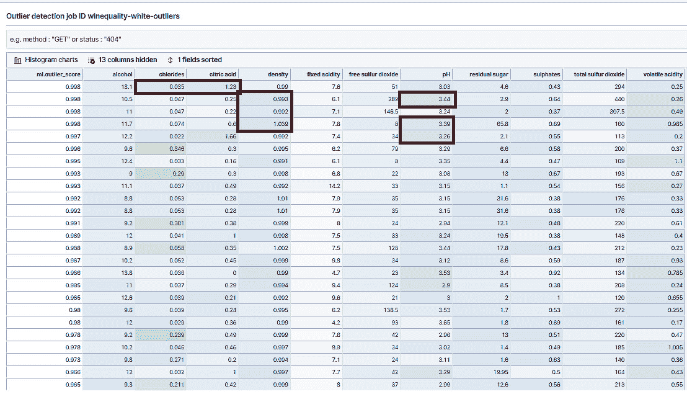

    图 10.12 – 在葡萄酒质量数据集的所有字段中显示的特征影响

    如我们从注释区域中可以看到的，异常葡萄酒因不同的原因而显得不寻常。对于第一个数据点，特征影响得分最高的字段是氯化物和柠檬酸含量，而对于接下来的三个点，似乎最重要的特征是密度和葡萄酒的 pH 值。

1.  最后，我们可以回到本节开头提出的问题。*葡萄酒的不寻常性与人类品酒师分配给它的定量质量评分相关吗？*为了看看我们是否能快速地发现任何相关性，让我们将质量评分添加到数据集中，与异常评分并列（*图 10.13*）：

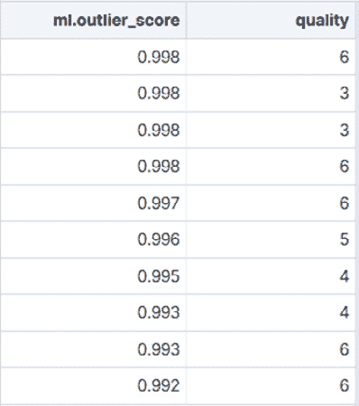

图 10.13 – 按异常评分降序排列的最不寻常的白葡萄酒，以及人类品酒师分配的定性质量评分

如我们所见，前 10 个最异常的白葡萄酒在最佳类别（质量分数为 9）中的得分并不高。相反，它们大多数得分在 3-6 的较低范围内。虽然这并不是决定性的证据，但我们有理由相信，最化学异常的葡萄酒通常不是最好喝的！

# 使用 Evaluate API 评估异常检测

在上一节中，我们提到了用户可能很难知道如何设置异常分数的阈值，以便将数据集中的数据点分组到正常和异常类别中。在本节中，我们将展示如果你有一个标记的数据集，其中每个点都包含记录该点是否为异常的地面真实值，如何处理这个问题。在我们深入实际演示之前，让我们花一点时间来了解一些在评估异常检测算法性能时使用的关键性能指标。

我们可以衡量算法性能的最简单方法之一是计算它正确预测为异常值的数据点的数量；换句话说，就是**真正例**（**TPs**）的数量。此外，我们还想了解**真正例**（**TNs**）的数量：有多少正常数据点被正确预测为正常。通过扩展，我们还想记录异常检测算法犯两种可能错误之一的次数：要么将正常点错误标记为异常（**假正例**（**FPs**）），要么相反（**假反例**（**FNs**））。

这四个度量可以方便地总结在一个称为**混淆矩阵**的表中。一个示例混淆矩阵显示在*图 10.14*中：

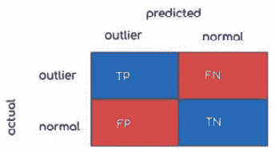

图 10.14 – 显示真正例、真正例、假正例和假反例率的混淆矩阵

以下两个度量，**精确度**和**召回率**，可以建立在前面描述的四个度量之上。

精确度是所有预测为正或异常的点中真正例的比例。另一方面，召回率是所有实际为正的点中真正例的比例。这些量可以用以下方程概括：

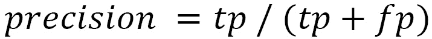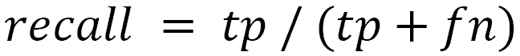

根据前面段落中给出的定义，似乎为了计算真正例、真正例等数量，我们需要将我们的目标索引中的每个点分配一个类别标签。

然而，异常检测作业的结果，正如我们在几个段落之前所描述的，不是一个将每个点分配为异常或正常的二元类别标签，而是一个范围从 0 到 1 的数值异常分数。

当涉及到计算我们所需的指标时，这给我们带来了一个问题，因为我们必须做出决定并指定一个截止点。所有得分高于截止点的都被分配到异常类别，而所有得分低于截止点的都被分配到正常类别。我们将此称为**二值化阈值**。

确定设置此阈值的准确值可能具有挑战性，这让我们回到了本章的原始目标——使用 Evaluate API 来理解不同阈值下的不同性能指标，以便我们可以做出明智的选择。

现在我们来进行一次实际操作，看看我们如何将所学知识应用于实践：

1.  让我们检查我们将用于本节的公共数据集。原始数据集的来源是 UCI 仓库，请参阅此处：[`archive.ics.uci.edu/ml/datasets/Breast+Cancer+Wisconsin+%28Diagnostic%29`](https://archive.ics.uci.edu/ml/datasets/Breast+Cancer+Wisconsin+%28Diagnostic%29)。为了更好地适应本练习的目的，我们略微修改了数据集，创建了一个名为 Outlier 的新字段，该字段记录了给定的数据点是否为异常值。修改后的数据集在一个名为`breast-cancer-wisconsin-outlier.csv`的文件中，可在本书的 GitHub 仓库中下载，请参阅此处 [`github.com/PacktPublishing/Machine-Learning-with-Elastic-Stack-Second-Edition/tree/main/Chapter%2010%20-%20Outlier%20Detection%20Analysis`](https://github.com/PacktPublishing/Machine-Learning-with-Elastic-Stack-Second-Edition/tree/main/Chapter%2010%20-%20Outlier%20Detection%20Analysis)。

    下载此数据集后，您可以使用数据可视化器中的数据导入功能导入数据集。有关数据可视化器和如何导入数据的复习，请参阅应用异常检测实践的章节。

    该数据集描述了从恶性和良性乳腺癌组织中测量的特征，并包含一个**类别**字段，该字段可以取值为 2（良性）或 4（恶性）。在本节的目的上，我们将标记为恶性的数据点视为异常值：

    ![图 10.15 – 数据集中的每个数据点都标记了类别标签。我们将类别标签转换为布尔标签，并存储在名为 Outlier 的新字段中。]

    ![图片 B17040_10_015.jpg]

    图 10.15 – 数据集中的每个数据点都标记了类别标签。我们将类别标签转换为布尔标签，并存储在名为 Outlier 的新字段中。

    在这一点上值得提及的是，Evaluate API ([`www.elastic.co/guide/en/elasticsearch/reference/current/evaluate-dfanalytics.html`](https://www.elastic.co/guide/en/elasticsearch/reference/current/evaluate-dfanalytics.html))，我们将使用它来了解异常检测算法与真实标签的匹配程度，要求真实标签为布尔值 0（表示正常数据点）和 1（表示异常数据点）。因此，我们对原始数据集进行了轻微调整，增加了一个名为 **Outlier** 的额外字段，将 **Class** 字段转换为 Evaluate API 可消费的合适格式。数据集的一个示例文档显示在 *图 10.15* 中。

1.  让我们使用 **Data Frame Analytics** 向导使用此数据集创建一个异常检测作业。我们将排除包含 **Class** 标签的字段、包含真实标签的字段以及样本代码号，如图 *图 10.16* 所示：![Figure 10.16 – 从异常检测作业中排除 Class、Outlier 和 Sample_code_number 字段

    ![img/B17040_10_016.jpg]

    图 10.16 – 从异常检测作业中排除 Class、Outlier 和 Sample_code_number 字段

1.  一旦作业完成，我们可以使用包含异常检测作业结果的目标索引以及 Evaluate API 来计算我们的异常检测算法与真实标签相比的表现如何。

1.  我们将通过 `actual_field` 与 Evaluate API 进行交互。这是包含我们数据真实标签的字段。在我们的例子中，这是名为 **Outlier** 的字段。最后，我们继续定义我们希望 API 为我们返回的指标以及这些指标应该计算的阈值。

    REST API 调用中的参数允许我们指定各种可能的阈值或截止点，用于计算性能指标。在先前的例子中，我们要求 Evaluate API 在三个不同的二值化阈值（0.25、0.5 和 0.75）处返回性能指标值，但同样，我们也可以选择另一组值。

1.  接下来，我们将检查 Evaluate API 返回的结果。响应如下：

    ```py
    {
      "outlier_detection" : {
        "confusion_matrix" : {
          "0.25" : {
            "tp" : 0,
            "fp" : 15,
            "tn" : 429,
            "fn" : 239
          },
          "0.5" : {
            "tp" : 0,
            "fp" : 5,
            "tn" : 439,
            "fn" : 239
          },
          "0.75" : {
            "tp" : 0,
            "fp" : 1,
            "tn" : 443,
            "fn" : 239
          }
        },
        "precision" : {
          "0.25" : 0.0,
          "0.5" : 0.0,
          "0.75" : 0.0
        },
        "recall" : {
          "0.25" : 0.0,
          "0.5" : 0.0,
          "0.75" : 0.0
        }
      }
    }
    ```

    如我们所见，Evaluate API 返回了一个响应，其中每个指标都计算了三次——一次对应于 REST API 调用中指定的每个阈值。

混淆矩阵的不同值表明，在特定数据集方面，异常检测算法表现相当差。没有任何一个阈值产生任何真阳性，这意味着我们无法使用默认设置检测到任何异常。在下一节中，我们将看到如何通过 **超参数调整** 来帮助我们获得更好的异常检测结果。

# 异常检测的超参数调整

对于更高级的用户，**数据帧分析**向导提供了一个配置和调整**超参数**的机会 – 这些是微调异常检测算法工作方式的各种旋钮和开关。可用的超参数在*图 10.17*中显示。例如，我们可以指导异常检测作业仅使用某种类型的异常检测方法而不是集成方法，使用一定数量的最近邻值进行集成计算，并假设数据中有一部分是异常的。

请注意，虽然玩转这些设置以进行实验并了解它们如何影响最终结果是个好主意，但如果您想为生产用例定制这些设置，您应该仔细研究您数据的特点，并了解这些特点将如何与您选择的超参数设置相互作用。有关每个超参数的更多信息，请参阅此处文档[`www.elastic.co/guide/en/elasticsearch/reference/current/put-dfanalytics.html`](https://www.elastic.co/guide/en/elasticsearch/reference/current/put-dfanalytics.html)。

在我们的案例中，我们知道数据集包含大约 30%的恶意样本。因此，我们预期的异常值数量也接近这个比例。我们可以将此配置为**异常比例**的值，并重新运行我们的作业。这如图*10.17*所示：

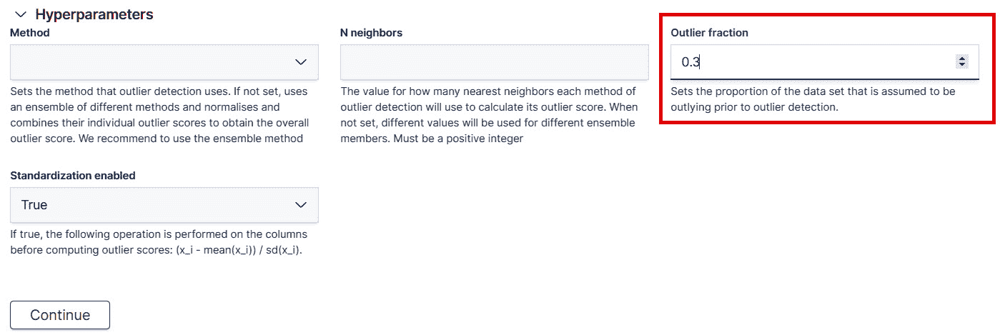

图 10.17 – 通过数据帧分析向导调整超参数，可以微调异常检测作业的行为

让我们使用这个新的超参数重新创建我们的异常检测作业，并将结果与*图 10.17*中的结果进行比较：

1.  按照在*评估异常检测与 Evaluate API 部分*中创建我们的第一个异常检测作业时概述的步骤进行操作，但在*超参数*对话框中调整**异常比例**设置，如图*10.17*所示。创建并运行异常检测作业。

1.  作业运行完成后，我们可以为这个新的结果索引重新运行 Evaluate API 命令。我们使用`breast-cancer-wisconsin-outlier-fraction`作为包含调整超参数作业结果的目标索引的名称。因此，我们新的 Evaluate API 调用如下：

    ```py
    POST _ml/data_frame/_evaluate
    {
      "index": "breast-cancer-wisconsin-outlier-fraction", 
      "evaluation": {
        "outlier_detection": {
          "actual_field": "Outlier", 
          "predicted_probability_field": "ml.outlier_score",
          "metrics" : {
            "confusion_matrix" : {"at": [0.25, 0.5, 0.75]}, 
            "precision" : {"at": [0.25, 0.5, 0.75]}, 
            "recall" : {"at": [0.25, 0.5, 0.75]} 
          }
        }
      }
    }
    ```

1.  让我们看看三个不同阈值下我们的混淆矩阵发生了多少变化。我们从 Evaluate API 收到的响应在这里显示：

    ```py
    {
      "outlier_detection" : {
        "confusion_matrix" : {
          "0.25" : {
            "tp" : 239,
            "fp" : 210,
            "tn" : 234,
            "fn" : 0
          },
          "0.5" : {
            "tp" : 86,
            "fp" : 48,
            "tn" : 396,
            "fn" : 153
          },
          "0.75" : {
            "tp" : 0,
            "fp" : 13,
            "tn" : 431,
            "fn" : 239
          }
        },
        "precision" : {
          "0.25" : 0.532293986636971,
          "0.5" : 0.6417910447761194,
          "0.75" : 0.0
        },
        "recall" : {
          "0.25" : 1.0,
          "0.5" : 0.3598326359832636,
          "0.75" : 0.0
        }
      }
    }
    ```

    从混淆矩阵的值中我们可以看出，我们在检测真正阳性、真正异常值方面做得稍微好一些，但在检测假阴性方面稍微差一些。

将先前异常值检测作业的评估指标与我们创建的“使用 Evaluate API 评估异常值检测”部分中的异常值检测作业进行比较，可以说明超参数选择对异常值检测作业的结果有重大影响。那么，在选择合理的超参数时，你应该如何进行？

在选择超参数时，有许多细微之处和高级主题可以深入研究，但一个好的指导原则是记住过程的迭代性质。从标记数据集开始并使用默认设置（换句话说，在数据帧分析向导的“超参数”对话框中不进行任何调整）尝试结果质量是一个好主意。

默认值通常已经合理选择并测试过多种数据集。如果结果质量不满意，你可以开始制定一个计划来调整和微调各种超参数设置。一个好的第一步是修复已知问题并检查这如何影响结果质量。例如，我们根据以往的经验知道，乳腺癌数据集包含大约 30%或 0.3 的异常值，这使我们能够调整此设置并实现略微更好的真正阳性率。

# 摘要

为了结束本章，让我们回顾一下 Elastic Stack 中第二个无监督学习特征的要点：异常值检测。异常值检测可以用来检测单维或多维数据集中的异常数据点。

该算法基于四个独立的度量：两个基于 k 近邻的距离度量，以及两个基于密度的度量。这些度量的组合捕捉了给定数据点与其邻居以及数据集总体数据质量之间的距离。这种异常性通过一个介于 0 到 1 之间的数值异常值分数来捕捉。给定数据点的分数越接近 1，它在数据集中的异常性就越大。

除了异常值分数之外，对于每个点的每个特征或字段，我们计算一个称为特征影响力的量。对于给定字段的特征影响力越高，该字段对给定点异常性的贡献就越大。这些特征影响力分数可以用来理解为什么某个特定点得到了特定的异常值分数。

与 Elastic Stack 中其他无监督学习功能（异常检测）相比，离群值检测不需要数据具有时间组件或任何类型的时间序列。此外，与异常检测不同，离群值检测不是通过学习概率模型来理解哪些数据点发生的概率较低。相反，它使用基于距离和密度的度量来计算异常性。由于这种方法上的差异，离群值检测无法以在线方式运行，无法在将新数据添加到源索引时即时更新其离群值计算。相反，如果我们希望在将新点添加到索引时预测其异常性，我们必须以批量模式重新运行整个源索引的离群值检测计算。

在下一章中，我们将放下无监督学习方法，深入探索令人兴奋的监督学习世界，从分类开始。
