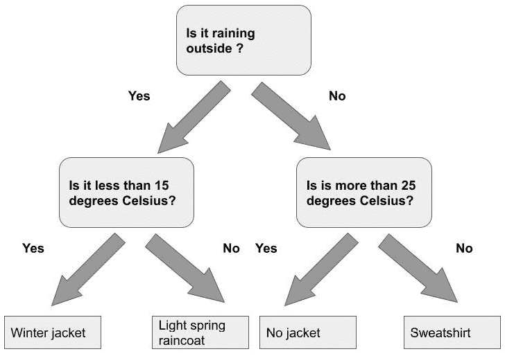
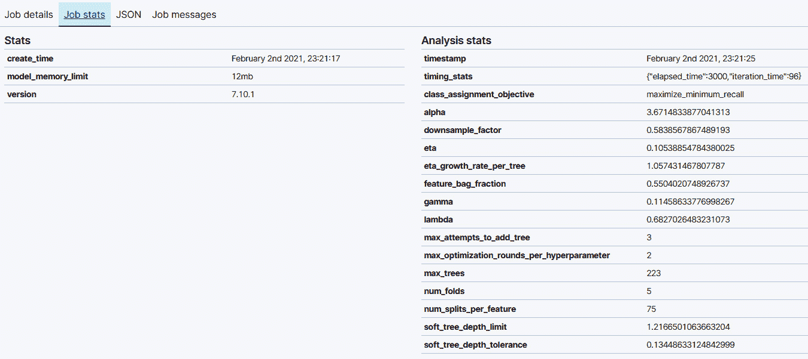

# 第十一章：分类分析

当我们谈论机器学习领域以及具体的机器学习算法类型时，我们往往会提到三种不同类别的算法的分类法：监督学习、无监督学习和强化学习。第三种超出了本书的范围以及当前 Elastic Stack 可用的功能，而第二种在异常检测章节以及之前的离群值检测章节中一直是我们的研究主题。在本章中，我们最终将开始涉足监督学习的世界。Elastic Stack 提供两种监督学习类型：分类和回归。本章将致力于理解前者，而随后的章节将解决后者。

监督学习的目标是接受一个标记的数据集，从中提取模式，将数据集获得的知识编码在我们称之为模型的结构中，然后使用这个训练好的模型对之前未见过的数据实例进行预测。这在分类和回归中都很常见。前者用于预测离散标签或类别，而后者用于连续值。

分类问题无处不在。一位病理学家在观察患者样本时，被要求将每个样本分类为恶性或良性，一位装配线工人观察机器部件时，被要求将每个部件分类为故障或功能正常，一位业务分析师在观察客户流失数据时，试图预测客户是否会续订或取消一项服务的订阅，等等。

了解分类及其在 Elastic Stack 中的工作原理的过程，也会让我们接触到许多其他主题，对这些主题的理解对于任何希望充分利用分类来解决问题的从业者来说都是相关的。这些主题包括特征工程、将数据集划分为训练集和测试集、理解如何衡量分类器的性能以及为什么相同的性能指标在应用于训练集时与应用于测试集时测量的结果不同，如何使用特征重要性来理解每个特征如何贡献到模型分配给数据点的类别标签，以及许多其他将在本章中讨论的内容。

在本章中，我们将涵盖以下主题：

+   分类：从数据到训练好的模型

+   开始使用分类

+   分类内部机制：梯度提升决策树

+   超参数

+   解释结果

# 技术要求

本章内容需要 Elasticsearch 7.9+。示例已使用 Elasticsearch 版本 7.10.1 进行测试，但应适用于任何高于 7.9 版本的 Elasticsearch。请注意，运行本章中的示例需要铂金许可证。如果某个特定示例或部分需要 Elasticsearch 的更高版本，文本中将会提及。

# 分类：从数据到训练模型

从源数据集训练分类模型的过程是一个多步骤的过程，涉及许多步骤。在本节中，我们将从*图 11.1*（图中所示）的角度概述整个过程，该过程从标记的训练数据集开始（*图 11.1*部分 A）。

![图 11.1 – 监督学习过程概述，该过程接受标记数据集并输出训练模型

![img/B17040_11_1.jpg]

图 11.1 – 监督学习过程概述，该过程接受标记数据集并输出训练模型

这个训练数据集通常被分为训练部分，这部分将被输入到训练算法中（*图 11.1*部分 B）。训练算法的输出是一个训练模型（*图 11.1*部分 C）。然后，使用训练模型对测试数据集进行分类（*图 11.1*，部分 D），该测试数据集最初是从整个数据集中分离出来的。模型在测试数据集上的性能被捕获在一系列评估指标中，这些指标可以用来确定模型是否足够泛化，以适应之前未见过的示例。

本章中，我们将进一步阐述这些步骤，通过本章提供的实际操作演示。为了将实际示例与机器学习的更理论方面联系起来，我们还将介绍对监督学习的概念理解。这将引导我们进入关于特征工程——什么是特征以及它们如何影响分类器性能的讨论。最后，我们将探讨如何评估分类器的性能以及如何通过将数据分为训练集和测试集来帮助我们衡量两种不同的性能。

分类模型从数据中学习

机器学习社区中有一个常见的说法，即机器学习分类器是一种从数据中学习的软件工件。软件工件从数据中学习究竟意味着什么呢？一种思考方式是，当模型在看到或经历越来越多的数据时，它越来越擅长进行分类（在分类模型的情况下），这时学习就发生了。但毕竟，机器学习模型不是生物体，那么当我们说模型从数据中学习时，我们究竟指的是什么呢？

这个问题的答案将引导我们到重要的**决策边界**概念。让我们通过一个记录南瓜重量和周长的虚构二维数据集来检验这个概念。假设我们的数据集包含不同变种南瓜的测量值，我们的目标是教会我们的分类模型根据南瓜的重量和周长将南瓜分类到不同的变种中。

如果我们将南瓜数据集绘制在二维空间中，它可能看起来像*图 11.2*。

图 11.2 – 一个虚构的二维数据集，描述了两种不同类型南瓜的周长和重量测量，这些南瓜分别由圆圈和正方形表示

重量位于水平轴上，周长位于垂直轴上。如果一个数据点由一个圆表示，它代表一个第一变种的南瓜。如果由一个正方形表示，它代表另一个变种的南瓜。花点时间看看*图 11.2*中正方形和圆的分布，并想象你需要创建一个简单的规则来区分方形变种南瓜和圆形变种南瓜，并以此方式记录下来，以便当另一个人在以后的时间查看你的绘图时，他们可以使用它来确定他们刚刚测量的新南瓜属于两个变种中的哪一个。

完成这个任务的一个非常简单的方法是检查你面前的二维表示，并用笔画一条线，大致将方形变种与圆形变种分开，例如，如图*11.3*所示。

图 11.3 – 一个决策边界将两个南瓜类别（在二维空间中以数据点表示）彼此分开。

一些数据点最终会落在线的错误一侧，但这只是设计分类器的必然性质——很少的分类最终是完美的！你刚刚记录的是决策边界——一条线或超维平面（如果我们正在处理具有多个变量的数据集），它将一个类别的成员与另一个类别的成员分开。现在，任何想要对新的测量南瓜进行分类的人都可以拿起你的图表，并在图表上绘制他们自己南瓜的测量值，以查看他们的数据点落在决策边界的哪一侧，如图*11.4*所示。

图 11.4 – 由三角形表示的新数据点落在决策边界的右侧，因此很可能是正方形变体的一个部分

这是对分类算法所采取过程的近似概念。它们接受一组训练数据（我们的原始南瓜测量值以及每个测量南瓜所属的变体）并应用各种测试和转换来学习决策边界。从训练数据中学习的过程称为**训练**，这不仅适用于分类算法，也适用于回归算法。这个边界被编码在**训练模型**中，然后可以用来对未来的、之前未见过的数据点进行预测。

从上述虚构的例子中要注意的一点是，我们相当幸运。我们的数据（南瓜重量与南瓜周长的二维图）产生了一幅图，我们可以轻松地画出决策边界，虽然并不完美，但对于大多数数据点来说，结果仍然很好。然而，在现实世界中，很少有数据集会如此整洁地适合机器学习分析，而且正如我们将学到的，我们选择用来表示数据点的属性可以极大地影响数据集的可分离性，从而影响分类模型在其上的表现。

假设我们不是使用南瓜的**特征**重量和周长，而是选择了在南瓜中发现化学化合物 X 的百分比以及生长过程中用于灌溉的水量。在这种情况下，使用这些特征的数据点的二维图（如图 11.5 所示）根本无法画出任何类型的决策边界！

图 11.5 – 这些特征并没有为两个类别提供有意义的分离

正如我们将在下一节中看到的，**特征工程**是一个庞大的主题，也是预处理的主要步骤之一，在开始任何机器学习项目时都应予以考虑，无论是在 Elastic Stack 中还是在其他地方。

## 特征工程

在上一节中，我们通过一个虚构的南瓜数据集说明了决策边界的概念，这是分类器从数据中学习的结果。现在让我们通过一个更现实的例子来探讨下一个主题，即如何选择和操纵特征以便它们适合分类：恶意软件分类。由于几乎每天都有数百万新的恶意软件变种被发布到野外，传统的基于规则的分类方法很难将良性二进制文件与恶意二进制文件区分开来并保持有效性。因为我们处理的是大量数据和各种输入，这些输入无法用僵化的规则来捕捉，因此机器学习为这个问题提供了一个完美的解决方案。我们究竟需要如何预处理训练数据——在这个例子中是恶意和良性二进制文件——以便机器学习算法能够理解它们。这个问题及其答案将我们引向机器学习中的一个子领域，称为特征工程。

特征工程的过程涉及将领域专家对问题的了解应用于训练数据。例如，一个恶意软件分析师可能能够告诉我们，正常二进制文件中的字符串通常比恶意二进制文件中的字符串长，这可以作为区分两者的一个有用特征。作为特征工程过程的一部分，我们随后开发了一种方法来计算训练数据中每个二进制文件的平均字符串长度，并将其用作特征。

最好留出一些时间来了解知识领域专家对问题的了解以及为了实现最先进的结果所使用的特征。这很重要，因为正如我们在上面的虚构南瓜例子中所看到的，特征的选择决定了我们的模型是否能够学会区分两个类别的特征。例如，假设我们训练我们的恶意软件分类模型使用二进制文件的大小（以字节为单位）和二进制文件名称中字母 a 的存在作为特征。如果结果是恶意和良性二进制文件在字节大小上表现出相似性，并且两者名称中都包含字母 a，那么我们得到的分类器将毫无用处，因为它会关注那些在区分恶意二进制文件和良性二进制文件时没有差别的特征。

特征工程通常涉及迭代。我们应该从一个可能产生良好结果的特征的猜测开始，训练一个模型，并在测试集上评估它，然后逐渐添加、减少或操纵特征，直到达到期望的结果质量。在章节的后面部分，我们将探讨如何精确地衡量模型的性能，以及如何使用 Elastic Stack 中的机器学习来实现这一点。

## 评估模型

在本节分类的介绍中，我们将讨论的最后一个主题是评估。我们如何知道我们的模型表现如何？有各种方法可以量化**模型性能**，我们将在本章的后续部分详细探讨这些技术和它们的意义。与衡量模型性能相关的一个重要概念是性能是在什么数据上衡量的。

为了衡量一个模型的表现如何，我们需要使用该模型在标记的数据集上进行预测，以便我们可以将模型预测的类别标签与真实标签进行比较，并计算模型犯了多少错误。这些数据集之一是训练数据，但如果我们使用这些数据来估计模型的表现，我们实际上是在向模型展示我们在训练时使用的数据。虽然这样做会给我们一个很好的**训练误差**估计，但它不会告诉我们模型在预测先前未见过的例子时表现如何。

为了估计模型在模型之前未见过的数据上的表现，我们必须将一部分训练数据留出。这部分数据，也常被称为**测试数据集**，不会用于模型的训练。相反，在训练过程完成后，我们将使用模型在测试数据集上进行预测，并查看测试数据集中有多少数据点被错误分类。这个度量将给我们一个关于模型在预测先前未见过的数据点时表现如何的印象。模型在预测这个数据集时犯的错误数量被称为**泛化误差**。

将几个指标如**准确率**、**精确度**和**召回率**（其中一些我们在*第十章*，*异常检测*中见过）用于衡量这些误差。请参考*第十章*中*使用 Evaluate API 评估异常检测*的部分，以快速回顾基本概念。

我们将在后面的章节中更详细地讨论上述探索的每个想法，但就目前而言，让我们看看这些概念在实际中是如何发挥作用的。我们将使用威斯康星州乳腺癌公共数据集来创建一个示例分类数据帧分析作业。

# 开始进行分类的第一步

在本节中，我们将使用公开的威斯康星州乳腺癌数据集创建一个示例分类作业。原始数据集在此处可用：([`archive.ics.uci.edu/ml/datasets/breast+cancer+wisconsin+(original)`](https://archive.ics.uci.edu/ml/datasets/breast+cancer+wisconsin+(original))). 对于这个练习，我们将使用数据集的一个稍微清洗过的版本，这将消除数据清洗（机器学习项目生命周期中的重要步骤，但不是本书中我们有机会讨论的内容）的需要，并使我们能够专注于创建分类作业的基本知识：

1.  从本书 GitHub 存储库中的“第十一章 - 分类分析”文件夹下载清洗过的数据集文件`breast-cancer-wisconsin-outlier.csv`（[`github.com/PacktPublishing/Machine-Learning-with-Elastic-Stack-Second-Edition/tree/main/Chapter%2011%20-%20Classification%20Analysis`](https://github.com/PacktPublishing/Machine-Learning-with-Elastic-Stack-Second-Edition/tree/main/Chapter%2011%20-%20Classification%20Analysis)），并将其存储在您的本地机器上。在您的 Kibana 实例中，从左侧菜单导航到`Machine` `Learning` 应用程序，并点击**数据可视化器**标签。这将带您进入**文件** **上传器**。点击**上传文件**并选择您下载的 CSV 文件。

    上传成功后（在**发现**下检查您的索引模式，并简要浏览一些文档以确保数据集一切正常），返回到**机器学习**应用程序，而不是选择**数据可视化器**标签，选择**数据帧分析**。这应该会显示类似于*图 11.6*中显示的视图。

    

    图 11.6 – 当前此数据帧分析作业概览为空

1.  点击蓝色**创建作业**按钮。这将带您进入**数据帧分析**向导，它有点类似于我们在*第九章*，“介绍数据帧分析”中介绍的**转换**向导，并允许您轻松创建分类、回归或异常检测作业。在这种情况下，我们将在*图 11.7*中的下拉菜单中选择分类。

    

    图 11.7 – 数据帧分析向导帮助创建三种不同类型的作业。对于我们的当前案例，选择分类

1.  接下来，我们将继续选择因变量。如果您还记得我们之前的讨论，分类的目标是学会预测一个给定的、之前未见过的数据点属于哪个类别。表示这个类别的变量被称为`Class`变量，因此我们从下拉菜单中选择它。

    一旦我们做出选择，向导将显示一个包含和排除字段列表。请注意这里。如果您的数据集中存在名为`Class`的字段。如果样本数量少于 30，则预测为恶性。如果不是，则预测为良性。因此，谨慎行事，提前检查数据，然后删除所有预期不会携带有助于预测因变量的有意义信息的变量是很好的。

    即使表示样本数量的变量不携带这样的代理效应，我们也不期望它能传达很多有助于推断因变量的有意义信息，因此，它只会增加我们任务的内存负担，最好从一开始就排除它。

    如您在*图 11.8*中看到的，我们已经通过取消勾选复选框排除了变量`Sample_code_number`。

    ![图 11.8 – 从分类任务中排除 Sample_code_number 以避免引入代理效应

    ![图片/B17040_11_8.jpg]

    图 11.8 – 从分类任务中排除 Sample_code_number 以避免引入代理效应

1.  在此之后，我们就可以继续配置的下一部分，这涉及到选择**训练百分比**。回想一下，在本节的开头，我们讨论了分类器的性能如何可以在从父数据集派生出的两个不同的数据集上评估：训练数据集和测试数据集。在 Elasticsearch 中手动进行这种拆分可能会很繁琐，尤其是当处理大型数据集时。为了使这个过程更容易，DataFrame Analytics 作业向导包括一个配置选项，允许我们设置我们想要为训练模型保留的数据集比例以及我们想要为测试模型保留的数据集比例。这个数量是通过向导中显示的滑块来设置的，如*图 11.9*所示。![图 11.9 – 训练百分比滑块

    ![图片/B17040_11_9.jpg]

    图 11.9 – 训练百分比滑块

    应该如何确定训练百分比？正如在构建机器学习程序的许多阶段一样，这个答案将很大程度上取决于您数据集的大小以及您是否更关心对训练数据集还是测试数据集的性能进行准确估计。我们将在稍后更详细地讨论这两种性能指标之间的差异，但就目前而言，可以说，模型在测试数据集上的性能为您提供了模型一旦开始应用于先前未见过的示例时的性能估计，因此，在大多数情况下，将一部分数据用于估计模型部署到生产环境后的性能是非常值得的。

    另一个方面是数据集的大小。一般来说，如果你的数据集包含超过 100,000 个文档，开始时使用较小的训练百分比——大约 10%或 15%，然后根据结果的质量进行迭代。

    由于在这种情况下，整个数据集只有不到 700 个文档，我们将训练百分比设置为 60%。

1.  在选择训练百分比后，向导将引导我们进入**附加选项**，如图*图 11.10*所示。我们现在将保留这些默认设置，但将在后续的更高级示例中返回讨论它们。![Figure 11.10 – Additional options for classification Data Frame Analytics jobs

    ![img/B17040_11_10.jpg]

    图 11.10 – Additional options for classification Data Frame Analytics jobs

1.  最后，在点击**继续**后，我们将设置作业 ID，并将其他所有内容保留为默认设置。勾选**立即开始**复选框，最后通过点击**创建**按钮创建并启动作业。

    返回到**数据帧分析**主页面。你应该能在作业管理面板中看到你刚刚创建的作业，如图*图 11.11*所示。

    ![Figure 11.11 – The Data frame analytics job overview panel shows a summary of the current Data frame analytics jobs

    ![img/B17040_11_11.jpg]

    图 11.11 – The Data frame analytics job overview panel shows a summary of the current Data frame analytics jobs

    一旦作业状态显示为**停止**，并且**进度**条显示表明作业的所有阶段都已完成，使用**操作**菜单导航到结果。这是通过在菜单中点击**查看**来实现的。

1.  结果页面显示了大量的信息，这些信息对于理解我们在数据集上训练的分类器表现至关重要。一个示例结果页面如图*图 11.12*所示。

    当你查看这个图表时，注意一下`analyzed_fields`部分，你会看到一个名为`Outlier`的字段。这是我们根据*第十章*，*异常值检测*中的`Class`字段创建的重复字段。这意味着它也是一个使我们的结果看起来比实际情况更好的代理字段。

1.  让我们重新创建一个重复的作业，但排除字段`Outlier`和字段`Sample_code_number`。在这个作业完成后，测试数据集上的新结果看起来像*图 11.14*。

![Figure 11.14 – The confusion matrix displays the results from the classification job after excluding the Outlier variable

![img/B17040_11_14.jpg]

图 11.14 – 混淆矩阵显示了在排除异常值变量后的分类作业结果

如*图 11.14*所示，从结果中我们可以看到，排除`Outlier`变量和`Sample_code_number`变量后，真正阳性率达到了 98%，以及一些假阳性假阴性，这比我们之前完美的分类评分更接近实际情况。

在我们进一步探讨分类问题之前，了解当我们训练分类模型时，Elastic 机器学习堆栈内部到底发生了什么，将是非常有益的。这就是下一节将致力于解决的问题：理解决策树是如何在内部工作的。

# 内部工作原理：梯度提升决策树

对于分类任务，最终目标是解决一个需要我们尝试推断未见数据点属于几个可能类别之一的问题。我们通过使用包含代表性数据点的标记训练数据集，提取允许我们学习决策边界的相关特征，然后将关于这个决策边界的知识编码到分类模型中来实现这一点。然后，该模型对给定数据点属于哪个类别做出**决定**。模型是如何学习做到这一点的？这是我们将在本节中尝试回答的问题。

按照我们在整本书中的习惯，让我们首先从概念上探索人类用来导航一系列复杂决策的工具。许多人在涉及多个可能复杂的因素时，都曾使用过的一个熟悉工具是流程图。*图 11.15*显示了一个示例流程图，人们可能会构建这个流程图，以便在知道当天的天气条件下，决定穿哪种夹克。

图 11.15 – 一个基本的流程图

在每个阶段，流程图都会提出一个问题（例如天气是暖和还是寒冷，或者是否在下雨）并根据我们的回答，将我们引导到流程图的另一部分和一组新问题。最终，通过在流程图中回答问题并遵循流程，我们得出一个决定或类别标签。

作为 Elastic Stack 训练过程的一部分产生的模型，在概念上，做的是非常相似的事情。在机器学习领域，这个算法被称为决策树。尽管 Elastic ML 堆栈中使用的版本比这里描述的要复杂得多，但基本概念是适用的。

让我们更仔细地看看决策树。

## 决策树简介

我们是如何构建决策树的？我们首先通过某个特征和某个阈值将数据集分为两组。我们确定这个特征和这个阈值的方法是查看所有可用的特征（或者如果我们想使用 Elasticsearch 术语，则是字段），然后找到产生最纯分割的那个特征阈值对。我们所说的最纯分割是什么意思？为了理解节点纯度的概念以及它如何影响决策树的构建和随后的决策树对新未见数据点的分类使用，我们必须退后一步，审视整体情况。

如你所回忆，我们的目标是设计一个决策流程图，当我们需要分类一个新未知数据点时可以遍历它。我们在流程图中确定分类的方式是通过查看我们的遍历最终到达的最终节点。在决策树中，这个最终节点被称为叶节点，它由所有在训练数据中由于使用特定特征和特定阈值进行的连续分裂而最终到达那里的数据点组成。由于分类过程通常是不完美的，终端叶节点不可能只包含属于一个类别的数据点，而将是混合的。这种混合的程度可以通过各种度量来量化，称为节点的纯度或叶节点的纯度。只包含一个类别的数据点的叶节点或节点是最纯的。

在决策树中拥有纯节点是非常好的，因为这意味着一旦我们达到了“流程图”中的终端节点，我们可以相当自信地认为我们目前正在尝试分类的数据点属于与终端节点中已有的数据点相同的类别。在实践中，优化纯节点可能会导致决策树过度分裂（毕竟，我们可以通过简单地创建与数据点数量一样多的叶节点来衡量这个指标——这样，每个叶节点将恰好包含一个确切类别的确切数据点，从而具有完美的纯度），因此叶节点总是混合的。

计算叶节点中属于给定类别的数据点的比例，可以给我们一个估计，即我们正在尝试分类的数据点属于该类别的概率。例如，假设我们有一个决策树来将数据点分类到类别 A 和类别 B。其中一个终端节点有 80 个来自类别 A 的示例和 20 个来自类别 B 的示例。在分类过程中，如果我们的新数据点最终到达这个节点，那么它属于类别 A 的概率就是 0.8。

这当然是对实际发生情况的一种简化表示，但应该能帮助你从概念上理解决策树是如何工作的。

## 梯度提升决策树

通常，单个决策树本身不会产生强大的分类器。这就是为什么多年来，数据科学家和机器学习从业者发现，如果结合特殊的训练方案，基于树的分类器可以非常强大。其中一种方案被称为提升。

不深入技术细节，提升的过程是训练一系列决策树，并且每个决策树都会改进前一个决策树。提升过程通过选择前一个决策树分类错误的那些数据点，并重新训练一个新的决策树来改进这些先前分类错误点的分类。

# 超参数

在上一节中，我们概述了决策树是如何构建的。特别是，我们确定确定决策树应该在哪里分裂（换句话说，何时应该向我们的概念流程图添加新路径）的一个标准是查看结果节点的纯度。我们还指出，如果让算法仅以节点纯度为标准构建决策树，将很快导致过度拟合训练数据的树。这些决策树调整得如此之好，以至于它们不仅捕捉了用于分类给定数据点的最显著特征，甚至将数据中的噪声建模为真实信号。因此，虽然这种允许无限制优化特定指标的决策树在训练数据上表现良好，但它既不会在测试数据集上表现良好，也不会很好地泛化到分类先前未见过的数据点，这是训练模型的目标。

为了减轻这些陷阱，从训练数据集生成决策树的训练过程有几个超参数。**超参数**是一种可以旋转和调整的旋钮或高级配置设置，直到找到训练模型的最佳设置。这些旋钮控制着诸如在提升序列中训练的树的数量、每棵树的生长深度、用于训练树的特性数量等等。

数据框分析 API 公开的用于分类的超参数如下：`eta`、`feature_bag_fraction`、`gamma`、`lambda`和`max_trees`。我们将依次查看这些参数，但在深入探讨它们的意义以及它们如何影响从我们的数据集中训练出的决策树之前，让我们花一点时间来讨论**超参数优化**。

如果你是一个高级用户，并且已经使用其他框架训练了**梯度提升树**，你可能对你的特定训练数据集和问题中每个参数的最佳值有一个概念。然而，如果你是从零开始，你如何设置这些值呢？寻找超参数最佳值的系统过程称为超参数优化。在这个过程中，训练数据集被分成组或交叉验证折。为了确保每个交叉验证折代表整个训练数据集，生成这些折的采样过程确保每个交叉验证折中每个类别的成员比例与整个数据集中的比例大致相同。

一旦数据集被分层到这些折中，我们就可以继续进行超参数优化的下一部分。我们有五个超参数，每个都可以取很大的值范围。我们如何设计一个系统性的方法来找到最佳的超参数组合？一个选项是创建一个多维网格，其中网格上的每个点对应于一组特定的超参数值。例如，我们可以有`eta` 0.5，`feature_bag_fraction`为 0.8，`gamma`为 0.7，`lambda`为 0.6，以及`max_trees`为 50。一旦我们选择了这些参数，我们就在 K 个交叉验证折中训练一个模型，同时将 K 个折保留用于测试。然后我们针对同一组参数重复此过程 K 次，以确保每次我们都会留出一个不同的 K 个折用于测试。

然后，我们重复此过程，直到找到在保留的测试集上表现最佳的超参数值组合。正如你可能想象的那样，即使对于少量超参数组合重复此过程，在时间和计算上也可能相当昂贵。因此，在实践中，我们使用各种优化技术来获得足够好的超参数集，同时考虑到计算的成本。

如果你想了解使用超参数优化为你的模型选择了哪些超参数，你可以导航到 Kibana 中的**数据帧分析**页面并点击**管理作业**。这将带你到**数据帧分析**作业管理页面。找到你想要检查的分类作业的 ID，然后在作业 ID 旁边的左侧点击向下箭头。这将显示一个包含作业详细信息的下拉菜单。点击如图 11.17 所示的**工作统计**面板。这将显示关于作业的信息以及分析统计。

图 11.16 – 工作统计面板显示关于分类工作以及由超参数优化确定的超参数的基本信息

最后，在我们关闭本章的这一部分之前，让我们简要地浏览一下前面提到的五个超参数：`eta`、`feature_bag_fraction`、`gamma`、`lambda`和`max_trees`，以了解它们的意义以及它们控制决策树训练过程的哪个方面。在我们深入探讨每个这些参数的含义之前，让我们简要地看看梯度提升决策树是如何构建的。这将有助于在上下文中设定这些超参数的定义，并使每个这些如何影响梯度提升产生的决策树序列的最终形式变得更加清晰。

如您可能从之前的章节中回忆起来，梯度提升决策树的基本构建块是一个简单的决策树。决策树是通过递归地将数据集根据某些特征的阈值划分为越来越小的部分来构建的。例如，如果我们正在对代表各种测量值的鸢尾花数据点进行分类，我们可能会决定根据花瓣长度来分割数据集。所有花瓣长度小于 2 厘米的数据点被分割到左节点，其余的到右节点。我们选择这个特征——在这个例子中是花瓣长度——的方法是遍历数据集中的所有可能特征，并检查使用该特征进行分割产生的节点的纯度。正如您可能想象的那样，在多维数据集中，遍历每个特征并测试使用该特征分割产生的节点纯度可能需要非常长的时间。为了减少所需的计算时间，我们可以选择只测试特征的一部分，而这个比例是由`feature_bag_fraction`参数控制的。

在我们根据训练数据集训练出第一个决策树之后，提升过程要求我们选取第一个决策树错误分类的数据点，并构建一个后续迭代，目的是改进第一个决策树。因此，到这个过程的结束时，我们将有一系列决策树，在某些文献中这也可以称为森林。换句话说，这个森林的增长速度，即最终决策树序列的长度，是由参数`eta`控制的。`eta`的值越小，森林就会越大，而且这个森林对之前未见过的数据点的泛化能力也会越好。

在我们介绍决策树的章节中，我们讨论了当仅优化以适应训练数据集时，树可以生长到完美适应训练数据。虽然这可能听起来很理想，但现实中允许树过度拟合训练数据集将导致最终模型泛化能力差。因此，为了控制单个决策树的生长，我们有两个超参数，`gamma`和`lambda`。`gamma`的值越高，训练过程就越倾向于生成更小的树，这有助于减轻过拟合。与`gamma`类似，`lambda`的值越高，决策树就会越小。

尽管在实践中，你可以始终依赖超参数优化过程来为这些参数中的每一个选择好的值，但在概念层面上至少了解每个参数的含义以及它们如何影响最终训练好的模型是很好的。

# 结果解释

在上一节中，我们探讨了决策树的理论基础，并从概念上了解了它们的构建方式。在本节中，我们将回到本章早期考察的分类示例，并更仔细地查看结果的格式以及如何解释它们。

在本章早期，我们创建了一个训练好的模型来预测给定的乳腺组织样本是恶性还是良性（作为提醒，在这个数据集中恶性用类别 2 表示，良性用类别 4 表示）。该模型的分类结果片段显示在*图 11.18*中。

Figure 11.17 – 威斯康星乳腺癌数据集中一个样本数据点的分类结果

使用这个训练好的模型，我们可以对之前未见过的数据点进行预测。这些预测是什么形式？在最简单的情况下，一个数据点被分配一个类别标签（*图 11.18*中的`ml.Class_prediction`字段展示了这一点的例子）。在我们的示例案例中，这个标签可以取两个值之一：2（恶性）和 4（良性）。

然而，这种对数据点进行分类的方式掩盖了预测过程中的一个问题：我们对预测的信心程度。如果你考虑像日常天气预报这样的事情，你会看到量化与我们的预测相关的不确定性的重要性。一个人可以预测周三有 80%的概率下雨，周四有 16%的概率下雨。这两天都被分配了“雨天”的标签，但你在周三比在周四更不可能忘记带伞。这一切都说明，当我们评估我们的机器学习分类器时，我们不仅关心分配给特定数据点的标签，还关心模型对这个标签的信心程度。在 Elastic Stack 中，有两个度量标准可以衡量我们的分类模型对分配的类别标签的信心程度：类别概率和类别得分。我们将在下面更详细地讨论这两个度量标准。

除了知道模型对给定预测的信心程度外，了解哪些数据点的特征在推动该点分类向某一类而非另一类转变中起到了重要作用，通常非常有用。数据点特征对其预测标签的贡献可以通过其特征重要性值来总结。

### 类别概率

如上所述，仅仅检查机器学习分类器分配给数据点的标签通常是不够的。我们还需要知道分配的概率。在*图 11.18*中，类别 2 和类别 4 的概率显示在`ml.top_classes`字段下的嵌套结构中。从*图 11.18*中我们可以看出，分配给数据点的类别标签是 4，该数据点属于这个类别的概率是 0.814（四舍五入）。模型对此数据点确实属于类别 4 有信心。

### 类别得分

对于许多情况，根据获得更高概率的类别分配类别标签是一个足够好的规则，但并不是所有数据集都适用。例如，对于类别高度不平衡的数据集，更好的选择可能是使用类别得分。这个值在*图 11.18*中记录为`ml.prediction_score`，在类别标签和类别概率的嵌套分解中记录为更精确的`ml.top_classes.class_score`。

类别得分是从类别概率计算得出的，但这种方式会考虑到是否希望最大化准确度或最小化召回率。换句话说，一个人对训练数据集中代表性较弱的类别中的误分类有多大的容忍度。

小贴士

有关如何计算类别得分的详细解释，请参阅此处 Elastic 文档：[`www.elastic.co/guide/en/machine-learning/current/dfa-classification.html#dfa-classification-class-score`](https://www.elastic.co/guide/en/machine-learning/current/dfa-classification.html#dfa-classification-class-score)，以及更详细的说明，请参阅此处的 Jupyter 笔记本：[`github.com/elastic/examples/blob/master/Machine%20Learning/Class%20Assigment%20Objectives/classification-class-assignment-objective.ipynb`](https://github.com/elastic/examples/blob/master/Machine%20Learning/Class%20Assigment%20Objectives/classification-class-assignment-objective.ipynb)。

### 特征重要性

在检查机器学习模型的预测时，我们不仅关心预测的类别标签、该类别标签的概率，以及可能还有类别得分，我们通常还想知道哪些特征导致了模型做出特定的决策。这通过特征重要性来体现。在训练过程中使用的每个字段（在 *使用分类开始您的第一步* 部分的 *分类* 作业配置中选择为 **包含** 的字段）可以分配一个潜在的特征重要性值，但通常我们只想了解最重要的特征，即具有最高特征重要性值的字段。

因此，为了避免将每个机器学习作业的结果写入我们集群的 Elasticsearch 结果索引中造成混乱，**分类**作业配置允许我们选择为每个分类数据点写入的顶级特征重要性值的数量。在 *图 11.19* 中显示的示例中，此配置设置为 4。

图 11.18 – 此配置将为每个文档输出 4 个特征重要性值

一旦分类作业完成，结果索引中的每个文档除了预测类别外，还将包含类别概率分解、类别得分，以及针对给定数据点的四个最高特征重要性值的条目。一个样本数据点的特征重要性值的简略片段显示在 *图 11.20* 中。

图 11.19 – 一个样本数据点的两个特征重要性值

此数据点被分配类别标签 4。在导致此预测标签的特征中，包括此数据点在字段 `Bare_Nuclei` 中的值和它在 `Marginal_Adhesion` 中的值。

除了检查每个数据点的特征重要性值之外，我们还可以检查哪些特征对于整个数据集的分类是显著的。此图表显示在*图 11.21*中，并在数据帧分析结果视图中可用（您可以通过访问数据帧分析作业管理页面，选择您已配置应输出多少特征重要性值的作业，然后点击**查看**来访问此视图）。

![图 11.20 – 整个数据集的总特征重要性值

![img/B17040_11_20.jpg]

图 11.20 – 整个数据集的总特征重要性值

# 摘要

在本章中，我们深入探讨了监督学习。我们考察了监督学习的含义，训练数据在构建模型中扮演的角色，训练监督学习模型的意义，特征是什么以及它们应该如何工程化以获得最佳性能，以及如何评估模型以及各种模型性能指标的含义。

在了解监督学习的基本知识之后，我们更深入地研究了分类，并考察了如何在 Elastic Stack 中创建和运行分类作业，以及如何评估这些作业产生的训练模型。除了查看基本概念，如混淆矩阵之外，我们还考察了在结果看似过于完美时应该持怀疑态度的情况，以及分类结果有时看似完美背后的潜在原因，以及这并不一定意味着底层训练模型有任何优点。

此外，我们还更深入地研究了驱动 Elastic Stack 中分类功能的引擎：梯度提升决策树。为了了解决策树在底层是如何工作的，我们概念性地考察了单个决策树的构建方式，以及我们在决策树上下文中所说的纯度是什么，以及无约束的决策树如何导致训练数据集上的过度拟合和泛化不良的训练模型。为了调整从数据集生长决策树的过程，训练过程暴露了几个高级配置参数或超参数。默认情况下，这些是通过称为超参数优化的过程设置的，但高级用户也可以选择手动调整这些参数。

在本章的最后部分，我们回到了原始的乳腺癌分类数据集，进一步考察了结果格式以及类概率、类得分以及如何使用特征重要性来确定哪些特征导致数据点被分配为某一类而不是另一类。

在下一章中，我们将在此基础上构建，学习如何使用决策树来解决依赖变量不是离散值（如分类情况）而是连续值的问题。

# 进一步阅读

关于如何计算课程分数的更多信息，请参阅本 Jupyter 笔记本中的文本和代码示例：[`github.com/elastic/examples/blob/master/Machine%20Learning/Class%20Assigment%20Objectives/classification-class-assignment-objective.ipynb`](https://github.com/elastic/examples/blob/master/Machine%20Learning/Class%20Assigment%20Objectives/classification-class-assignment-objective.ipynb)。
