# *附录*：异常检测技巧

当我们结束本书的内容时，我们突然想到，还有很多很好的、适合小部分的内容、示例和建议，它们并没有很好地融入其他章节的章节中。因此，在这里为它们提供一个单独的家是有意义的，就在*附录*中。享受这个技巧、窍门和建议的大杂烩！

在*附录*中，以下主题将被涵盖：

+   理解分拆与非分拆工作中的影响者

+   利用单侧函数

+   忽略时间段

+   利用自定义规则和过滤器

+   异常检测工作吞吐量考虑

+   避免过度设计用例

+   在运行时字段上使用异常检测

# 技术要求

本章中的信息将使用存在于 v7.12 的 Elastic Stack。

# 理解分拆与非分拆工作中的影响者

你可能会质疑是否有必要按字段分拆分析，或者仅仅希望使用影响者能够产生识别违规实体的预期效果。

让我们再次提醒自己，影响者与分拆工作目的之间的区别。如果一个实体被异常检测工作识别为影响者，那么它对异常的存在做出了显著贡献。这种决定影响实体的概念与工作是否分拆完全独立。只有当首先发生异常时，一个实体才能被认为对异常有影响。如果没有检测到异常，就没有必要确定是否存在影响者。然而，工作可能或可能不会发现某些异常，这取决于工作是否被分拆成多个时间序列。当分拆工作的时候，你正在为所选分拆字段中的每个实体建模（创建一个单独的分析）。

让我们看看 Elastic ML 开发团队最喜欢的一个演示数据集，称为`farequote`（可在本书的 GitHub 存储库中找到，文件名为`farequote-2021.csv`，并通过 Elastic ML 的文件上传功能轻松上传到**数据可视化器**）。这个数据集来自一个真实客户，该客户运行了一个旅游门户应用程序。应用程序的访问日志记录了当它向第三方航空公司请求航班报价时，中间件被调用的次数。JSON 文档看起来如下：

```py
   {
       "@timestamp": "2021-02-11T23:59:54.000Z",
       "responsetime": 251.573,
       "airline": "FFT"
}
```

每单位时间的事件数对应于正在进行的请求数量，而`responsetime`字段是针对该航空公司的航班报价 Web 服务的单个请求的响应时间。

让我们看看以下案例：

+   **案例 1**：对随时间变化的计数进行分析，没有按航空公司分割，但使用航空公司作为影响因素。你可以使用如下配置的多度量向导来完成此操作：

![图 A.1 – 没有分割但有一个影响因素的工作

![图片 B17040_14_1.jpg]

图 A.1 – 没有分割但有一个影响因素的工作

分析运行后，数据中间出现的峰值（如图 A.1*中的工作配置预览屏幕所示）确实被标记为异常，得分为 27 分，AAL 航空公司被标记为影响因素：

![图 A.2 – 没有分割但发现影响因素的计数工作结果

![图片 B17040_14_2.jpg]

图 A.2 – 没有分割但发现影响因素的计数工作结果

让我们将这个结果与下一个案例中我们看到的结果进行比较。

+   `airline`，并使用`airline`作为影响因素。

    如果我们重复图 A.1*中的配置，但这次选择在`airline`上分割（从而设置`partition_field_name:airline`），我们肯定会看到航空公司 AAL 仍然是异常最不寻常的，并且其异常分数比案例 1 高得多：

![图 A.3 – 使用分割和发现的影响者`airline`的结果

![图片 B17040_14_3.jpg]

图 A.3 – 使用分割和发现的影响者`airline`的计数工作结果

换句话说，当工作分割以单独建模每个航空公司时，AAL 的异常行为更加突出。否则，当所有文档计数混合在一起时，AAL 的异常行为被某种程度上掩盖了。当我们查看下一个两个案例中`responsetime`字段的`分割`与`不分割`的差异时，这一点更加明显。

+   在`airline`上分割的`responsetime`字段。

    在这里，我们看到 AAL 也是关于`responsetime`字段分析的异常最不寻常的航空公司：

![图 A.4 – 使用分割和发现的影响者`airline`的响应时间工作结果

![图片 B17040_14_4.jpg]

图 A.4 – 使用分割和发现的影响者`airline`的响应时间工作结果

现在让我们将这个结果与下一个案例进行比较，在这个案例中，我们不会分割工作。

+   `responsetime`字段，没有分割，但仍然使用`airline`作为影响因素。

    在这种情况下，结果如下：

![图 A.5 – 没有分割但发现影响者的响应时间工作结果

![图片 B17040_14_5.jpg]

图 A.5 – 没有分割但发现影响者的响应时间工作结果

你可以看到我们知道的异常最不寻常的航空公司（AAL）不再被发现。在这种情况下，所有航空公司的响应时间在每个桶跨度内都被平均在一起，因为工作没有分割。现在，最突出的异常（尽管它是在正常水平之上的相对较小的变化）被显示出来，被认为是受`airline=NKS`的影响。然而，这可能是误导性的。你看，`airline=NKS`在此期间有非常稳定的响应时间，但请注意，其正常操作范围比其他组高得多：

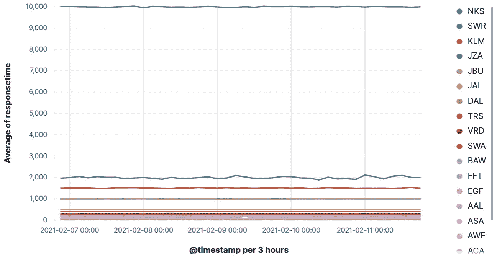

图 A.6 – 每家航空公司的平均响应时间

因此，NKS 对所有航空公司总聚合响应时间的贡献比其他因素更为显著。所以，当然，机器学习将 NKS 识别为最突出的影响因素。

由此可见：这里的教训是，如果你只是简单地依赖影响因素在多个实体的数据集中寻找异常实体，那么你应该深思熟虑。可能更有意义的是独立地对每个实体进行建模！

# 利用单侧函数的优势

许多人意识到单侧函数在机器学习中的有用性，例如`low_count`和`high_mean`，这允许仅在高侧或低侧检测异常。当你只关心收入下降或响应时间峰值时，这很有用。

然而，当你关心两个方向的偏差时，你通常会倾向于只使用常规函数（如`count`或`mean`）。然而，在某些数据集中，使用函数的高版本和低版本作为两个独立的检测器更为优化。你可能会问，为什么这种情况会发生，以及什么条件下会发生？

这种情况有意义的条件是可能的偏差动态范围不对称。换句话说，数据中潜在峰值的大小远大于潜在下降的大小，这可能是由于某个计数或总和不能小于零。让我们看看下面的截图：

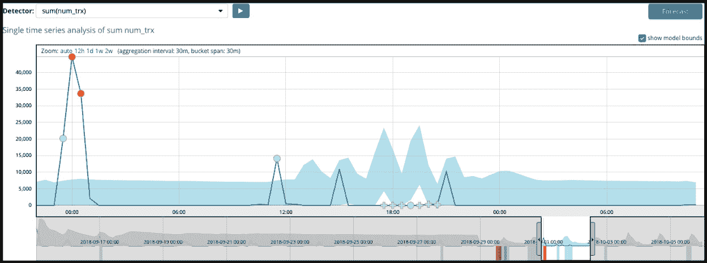

图 A.7 – 使用双向“sum”函数的分析

在这里，双向“求和”函数正确地识别了左侧的临界异常的大峰值，但中间缺少预期的双峰被仅以警告异常识别。再次强调，这是因为，使用双向函数，归一化过程将所有异常一起排序。峰值（因此是不太可能发生的）的幅度远大于 18:00 左右的数据缺失，因此异常评分被相对分配。

然而，如果数据集是用两个独立的检测器分析的，即使用高级作业，即`low_sum(num_trx)`和`high_sum(num_trx)`，那么结果将非常不同。这里是高侧的结果：

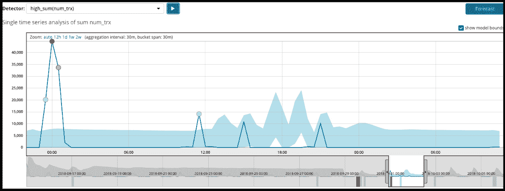

图 A.8 – 使用单侧“high_sum”函数的分析

这里是低侧的结果：

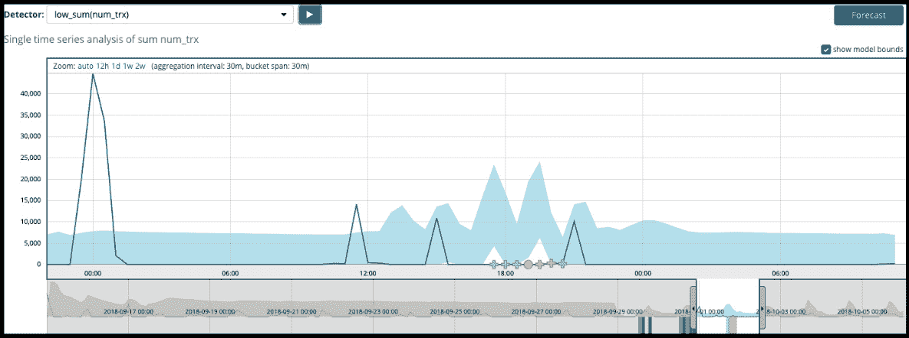

图 A.9 – 使用单侧“low_sum”函数的分析

注意到中间的异常现在被评分得更高（在这个例子中，最高评分为 47 个黄色）。

现在，当两个单边探测器在同一作业中一起运行时，你已经优化了每个探测器的动态范围（因为它们有自己的归一化表）！

# 忽略时间段

经常有人问如何让机器学习（ML）忽略某些事件已经发生的事实。可能是因为预期的维护窗口，或者可能是数据摄取管道中出现了故障，导致数据丢失了几分钟。有几种方法可以让机器学习忽略特定的时间段，为了区分，我们将它们分为两组：

+   已知即将到来的时间段

+   在事后才发现的不寻常的时间窗口

为了说明问题，我们将使用一个单一指标计数作业（来自*图 A.1*）在`farequote`数据集上，该作业在 2 月 9 日的日期上存在异常：

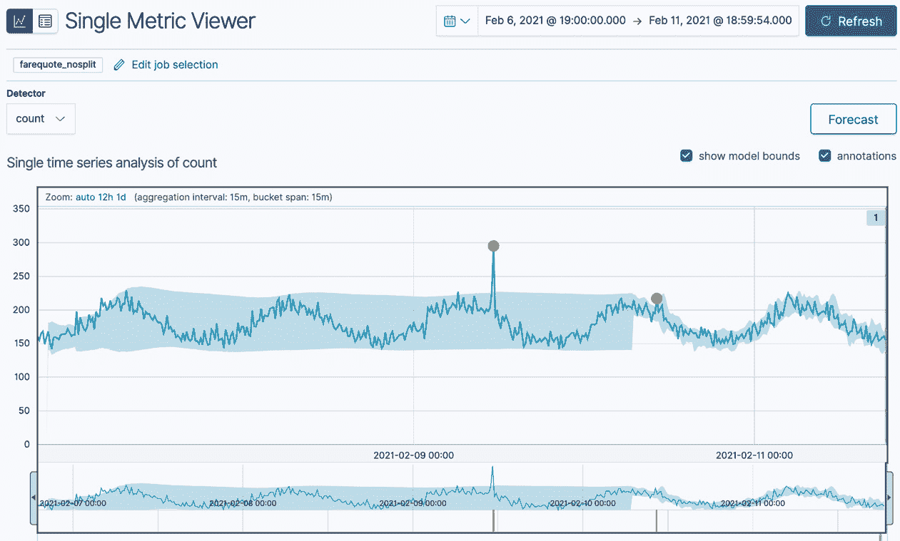

图 A.10 – 对 farequote 数据集的分析，其中包含我们希望忽略的异常情况

现在，让我们探讨我们可以使用不同情况忽略 2 月 9 日异常的方法。

## 忽略即将到来的（已知）时间段

可以使用两种方法来忽略即将到来的时间窗口，如下面的子节所示。一种涉及创建一个特殊的日历事件，另一种则是操纵数据源运行的时间。

### 创建日历事件

你可以通过点击**设置**，然后在**日历**部分下的**创建**来轻松创建一个事件。在这里，我为 2 月 9 日创建了一个日历条目：

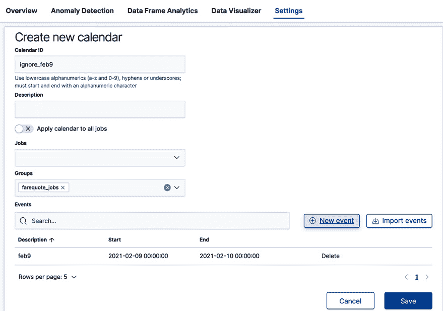

图 A.11 – 创建日历事件以忽略特定的时间段

如果创建了一个新的作业（在这个案例中，属于**farequote_jobs**组，以便遵守这个日历），那么如果作业在数据上运行，2 月 9 日整个一天将被完全忽略：

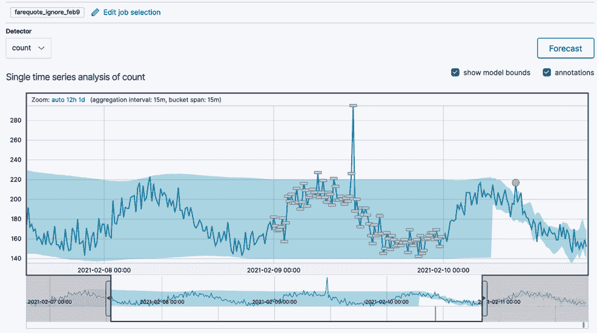

图 A.12 – 通过日历事件来忽略一个时间段

如你所见，整个一天都被屏蔽了，包括异常峰值的时间。

### 停止和启动数据源以忽略所需的时间段

通过在适当的时间停止和重新启动异常检测作业的数据源，你可以在分析中创建一个间隙。在这里，数据源在 2 月 9 日凌晨停止，并在 2 月 10 日凌晨重新启动：

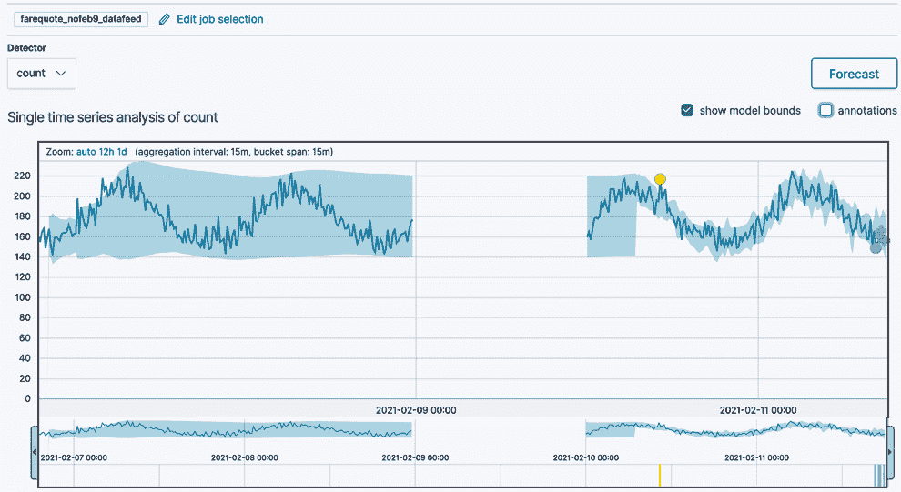

图 A.13 – 通过操纵数据源来忽略一个时间段

就像 2 月 9 日从未发生过一样！现在，让我们讨论一下你可以在事后忽略时间窗口的方法。

## 事后忽略一个意外的时间窗口

要*回到过去*并*忘记*一个时间窗口发生了，我们可以使用两种方法。第一种涉及简单的克隆和重新运行历史数据，第二种涉及使用模型快照。

### 克隆作业并重新运行历史数据

与我们之前看到的类似，导致*图 A.13*，我们可以创建一个新的克隆作业，并仅让数据馈送避免你希望忽略的时间窗口。在窗口开始时停止它，并在窗口结束时恢复它。如果从现有（仍然可用）的历史数据重建模型不是那么繁重，这种方法效果很好。然而，如果你有真正成熟的模型，这些模型封装了从你不再能访问的数据（因为数据已过时并被从你的集群中删除）中获取的数据行为，那么你将需要使用下一节讨论的模型快照技术。

### 将作业还原到先前的模型快照

当不希望或实际上无法在现有历史数据上克隆和重新训练作业时，你可以通过利用运行作业定期获取模型快照的事实来有效地移除一段时间窗口。默认情况下，快照大约每 3 到 4 小时捕获一次。当你创建或更新作业时，你可以更改此间隔（`background_persist_interval`）。

注意

这些快照的保留由几个其他参数（如`daily_model_snapshot_retention_after_days`和`model_snapshot_retention_days`）控制。请参阅 Anomaly Detection API 文档[`www.elastic.co/guide/en/machine-learning/current/ml-api-quickref.html`](https://www.elastic.co/guide/en/machine-learning/current/ml-api-quickref.html)。

将异常检测作业还原到先前快照的基本步骤如下：

1.  如果作业正在运行，请停止作业的数据馈送。

1.  使用[`www.elastic.co/guide/en/elasticsearch/reference/current/ml-get-snapshot.html`](https://www.elastic.co/guide/en/elasticsearch/reference/current/ml-get-snapshot.html)中记录的`get snapshots` API 调用，找到你希望擦除的时间窗口之前最近拍摄的模型快照。

1.  通过点击还原图标 () 将作业还原到该快照，或者如果使用 API，则使用`_revert`命令。在 Kibana UI 中，你将看到如何删除数据以及如何在快照时间之后重新分析历史数据的选项，包括使用**日历**事件屏蔽问题时间段的能力：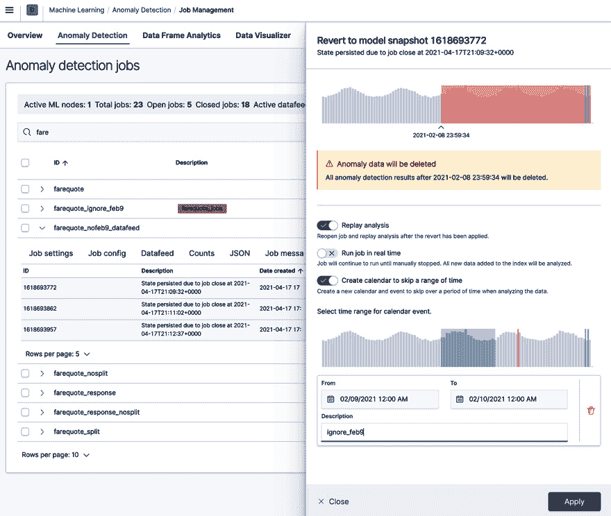

    图 A.15 – 使用屏蔽时间段的能力还原到先前的模型快照

1.  如果需要，在忽略的时间段之后继续实时运行数据馈送。

在所有这些有用的选项中，您可以轻松地确定忽略时间间隔的正确方法，并防止异常检测作业受到问题操作问题或不受欢迎事件的影响。

# 利用自定义规则和过滤器

虽然异常检测作业非常有用，但它们对领域和原始数据的相关性却是无知的。换句话说，无监督的机器学习算法不知道 CPU 利用率增加十倍（例如，从 1% 增加到 10%）可能对应用程序的正常运行并不那么有趣，尽管在统计上可能是异常的/不太可能。同样，异常检测作业对每个分析实体都同等对待，但用户可能希望拒绝某些 IP 地址或用户 ID 的结果，因为用户知道这些实体发现的异常是不希望或不实用的。使用自定义规则和过滤器允许用户将领域知识注入异常检测作业配置中，从而对被认为或标记为异常的内容有相当的控制权——甚至是否将实体首先考虑为建模过程的一部分。

## 创建自定义规则

要定义自定义规则，您可以在作业创建时完成（但仅当使用创建作业 API 时）或使用异常探索器用户界面中的“操作”菜单中的“配置规则”菜单选项在作业揭示了一些异常后进行：

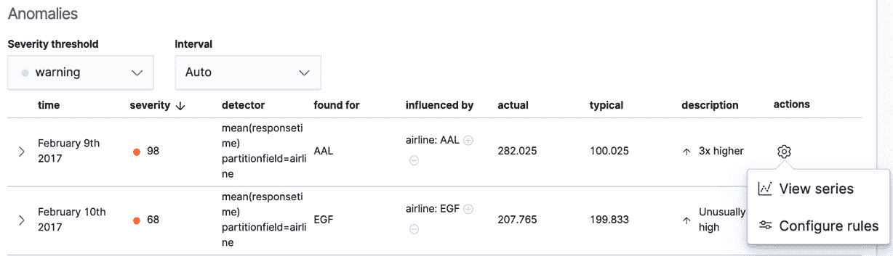

图 A.16 – 异常探索器用户界面中的“配置规则”菜单项

在定义规则时，大多数情况下是自我解释的。在这里，我们可能决定，尽管我们的响应时间异常为 282.025 毫秒（如 *图 A.16* 所示），但这并不那么有趣，我们希望忽略响应时间仍然低于 1 秒（1,000 毫秒）的异常。我们可以定义如下规则：

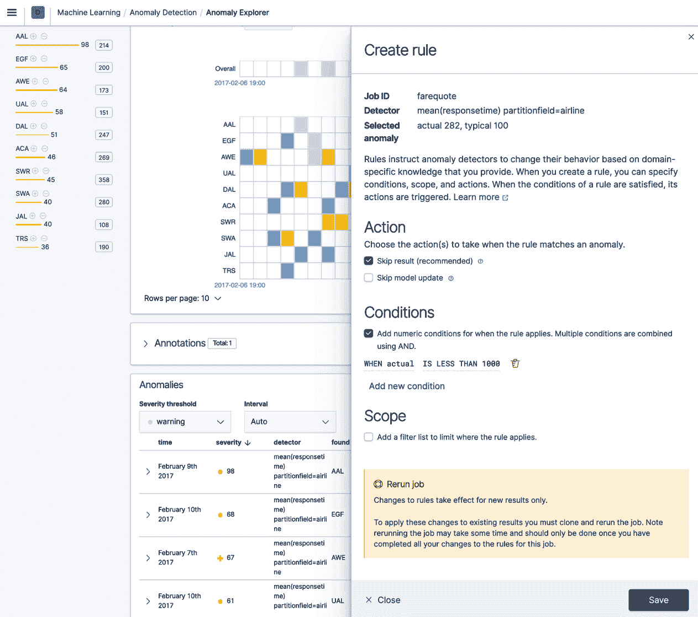

图 A.17 – 创建规则的用户界面

有额外的选项可以排除值用于建模，也可以将规则的适用范围限制在特定的过滤器列表中，以便规则仅适用于特定的实体（例如，仅限于位于特定位置的服务器）。过滤器列表可以在用户界面中的“设置”和“过滤器列表”下定义。

注意，规则定义适用于未来的分析（从规则定义点开始，时间向前推进）且不适用于过去异常。若要让规则适用于过去的异常，您需要克隆现有的作业（一旦定义了规则）然后对历史原始数据重新运行分析。

因此，通过规则和过滤器，用户对最终报告（并警报）为异常的内容有相当大的控制权。这允许在 IT 运营中存在了几十年的传统自下而上的警报创建哲学发生相当大的范式转变。在下一小节中描述了另一种方法。

## 从“自上而下”的警报哲学中受益于自定义规则

如果我们问，“你收集的数据中有多少比例是被关注的？”通常，一个现实的答案可能是小于 10%，甚至可能小于 1%。这种情况的原因是，传统的将数据变得主动的方法是从头开始，然后随着时间的推移建立阈值或基于规则的警报。这可能是一项令人畏惧且/或繁琐的任务，需要事先了解（或至少猜测）每个时间序列的预期行为。然后，一旦配置了警报，可能会有一个长期的调整过程，以平衡警报的敏感性与令人烦恼的误报。此外，也可能存在一些指标，其异常行为无法通过静态阈值捕捉到。

将这个挑战与规模结合起来；如果我每个服务器有 10 个指标，而我有 100 台服务器，那么就有 1,000 个单独的指标。为这些中的每一个创建单独的警报是不切实际的。

然而，针对这些数据创建单个异常检测任务可能不到 1 分钟。弹性机器学习在历史数据上的自学习，这也花费很少的时间，将通过独立适应每个时间序列的自然特征来最小化误报。然而，如果异常检测揭示了我们不关心的事情，我们可以简单地通过自定义规则排除它们。

这种自上而下的方法（覆盖所有内容，然后开始排除不需要的内容）比自下而上的方法（从头开始创建阈值警报）更快，并且为数据提供了更广泛的前瞻性覆盖。

# 异常检测任务吞吐量的考虑

弹性机器学习（Elastic ML）非常出色，毫无疑问非常快且可扩展，但任何异常检测任务每秒处理的事件数量仍将有一个实际的上限，这取决于几个不同的因素：

+   数据可以传递给算法的速度（即查询性能）

+   在给定所需分析的情况下，算法处理数据的速度

对于后者，大部分性能基于以下因素：

+   为分析选择的功能，即 `count` 比较快于 `lat_long`

+   选择的 `bucket_span` 值（较长的桶跨度比较小的桶跨度更快，因为每单位时间内分析的桶更多，这会累积每桶的处理开销，例如写入结果等）

然而，如果你已经定义了分析集并且由于其他原因无法更改，那么除非你富有创意地将数据分割成多个作业，否则你几乎无能为力。这是因为 ML 作业（至少目前）目前与单个 CPU 的分析部分（运行名为 autodetect 的 C++进程）绑定。因此，将数据分割成几个单独的 ML 作业，至少可以充分利用多个 CPU，可能是一个选择。但在那之前，让我们专注于前者，即查询的性能，因为这里有各种各样的可能性：

+   避免进行跨集群搜索以限制网络上的数据传输。

+   调整数据馈送参数以优化性能。

+   使用 Elasticsearch 查询聚合将提取数据的任务分配给更小的 ML 算法集。

第一个似乎是显而易见的。只有当你将分析移得更接近原始数据时，你才能提高性能。

第二个可能需要进行一些实验。有一些参数，例如`scroll_size`，控制每个滚动的大小。默认值为 1,000，对于中等大小的集群，这个值可以安全地增加到 10,000。在不同的滚动大小下进行一些测试，看看它如何影响查询和集群性能。

我认为最后一个对性能的影响最大，但显然，要正确配置 ES 聚合以使其与 ML 正常工作，这有点棘手且容易出错，但还不算太糟糕。有关更多信息，请参阅[`www.elastic.co/guide/en/machine-learning/current/ml-configuring-aggregation.html`](https://www.elastic.co/guide/en/machine-learning/current/ml-configuring-aggregation.html)。使用 ML 聚合的一般缺点是，你将失去访问数据中其他可能作为影响因素的字段。

总的来说，这些都是优化 ML 作业性能时需要考虑的几个方面。

# 避免过度设计用例

我曾经与一个用户合作，我们讨论了异常检测的不同用例。特别是，这位客户正在构建一个托管安全运营中心，作为他们**托管安全服务提供商**（**MSSP**）业务的一部分，因此他们热衷于考虑 ML 可以帮助的用例。

他们的用例的一个高级主题是查看用户的行为并找到意外行为。讨论的一个例子是来自不寻常/罕见位置的登录活动，例如*鲍勃刚刚从乌克兰登录，但他通常不会从那里登录*。

在思考实现过程时，讨论了他们拥有多个客户，每个客户都有多个用户的情况。因此，他们正在考虑如何分割/划分数据，以便为每个客户的每个用户执行`按国家划分的稀有情况`。

我让他们退一步思考，问道：“如果任何人从乌克兰登录，不仅仅是鲍勃，这算不算一个异常？”得到的回答是“是的。”

因此，在这种情况下，没有必要按用户分割分析；也许只需在客户端级别保持分区，并将每个客户端的用户位置汇总到一个观察国家的单一池中。这实际上是一个更好的场景；整体数据更多，而且正如我们所知，`rare`函数在有大量常规数据可供对比新观察时工作得最好。

# 使用运行时字段进行异常检测

在某些情况下，可能有必要分析索引映射中不存在的字段的值，但这些值可以从其他字段的值动态计算得出。这种动态定义字段值的能力已经在 Elasticsearch 中存在了一段时间，被称为**脚本字段**，但从 v7.11 版本开始，脚本字段被一个更新的概念所取代，称为**运行时字段**。简而言之，运行时字段在 Elasticsearch 映射（如果在那里定义）中被视为一等公民，并最终允许用户将运行时字段提升为索引字段。

用户可以在映射中定义运行时字段，也可以只在搜索请求中定义。值得注意的是，在撰写本文时，异常检测作业的数据馈送中对运行时字段的定义没有支持。然而，如果运行时字段在映射中定义，那么异常检测作业可以无缝地利用它们。

注意

更多关于运行时字段的信息，请参阅 Elastic 文档[`www.elastic.co/guide/en/elasticsearch/reference/current/runtime.html`](https://www.elastic.co/guide/en/elasticsearch/reference/current/runtime.html)。

虽然运行时字段的全部细节超出了本书的范围，但重要的是要知道，异常检测作业可以利用这些动态字段，就像它们是正常字段一样。让我们看看一个有趣但人为构造的例子。

假设我们回到*图 A.1*中所示的`farequote`示例，在这个论点中，我们宣布 2 月 9 日对`airline:AAL`来说是一个特殊的日子——可能是黑色星期五或网络星期一的大致等同，或者甚至只是我们知道事情会比正常情况稍微偏离已知量的那一天。我们将构造一个场景，其中我们知道 AAL 将经历可预测的更高响应时间，这可能会比正常情况慢 20%（意味着`responsetime`的测量应该比正常情况高 20%，以毫秒为单位）。我们不想让 2 月 9 日成为 Elastic ML 完全避免的日历事件，我们也不想停止查看 AAL 的数据。我们只是想将响应时间测量值降低 20%，以免影响我们的正常建模和/或警报。我们可以通过运行时字段来实现这一点：

1.  首先要做的是在索引的映射中定义一个新的运行时字段，称为`responsetime_adjusted`：

    ```py
    PUT farequote/_mapping
    {
      "runtime": {
        "responsetime_adjusted": {
          "type": "double",
          "script": {
            "source": "emit(params._source.responsetime * 1.0)"
          }
        }
      }
    }
    ```

    这个字段（目前）将与其他航空公司的`responsetime`字段完全相同，只需通过将字段值乘以常数`1.0`即可实现。

1.  接下来，我们将配置一个作业，使用新的`responsetime_adjusted`字段上的`high_mean`检测器，我们还将对`airline`字段进行拆分分析：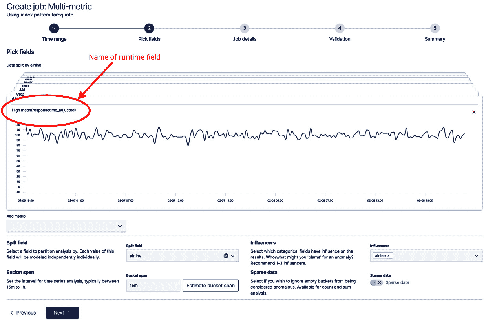

    图 A.18 – 配置作业以分析运行时字段

1.  我们将运行数据馈送到 2 月 9 日的午夜，但在这里停止分析。为了将 AAL 数据的响应时间降低 20%（但不对其他航空公司的数据进行调整），我们将执行以下命令：

    ```py
    PUT farequote/_mapping
    {
      "runtime": {
        "responsetime_adjusted": {
          "type": "double",
          "script": {
            "source": "if(doc['airline'].value.equals('AAL')) {emit(params._source.responsetime * 0.8)} else {emit(params._source.responsetime * 1.0)}"
          }
        }
      }
    }
    ```

1.  接下来，我们将继续作业的数据馈送以分析特殊日子（2 月 9 日，但停止在 2 月 10 日开始前的午夜）。

1.  一旦 2 月 9 日的数据被分析，我们将通过重新调用*步骤 1*中的命令，将 AAL 的数据的响应时间恢复到正常状态。

1.  我们将允许作业继续分析剩余的数据，就像平常一样。

    最终结果是，我们能够成功地将 AAL 的响应时间值降低了 20%（如两个注释之间的低值所示），尽管我们对 AAL 进行了特殊处理，但我们仍然能够捕捉到显著的异常：

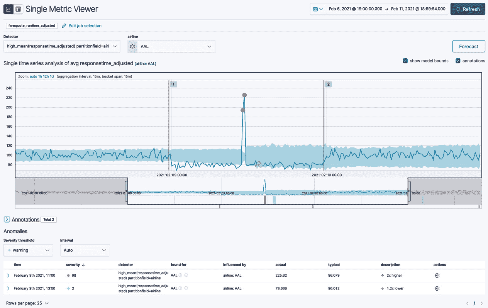

图 A.19 – 分析动态更改的运行时字段的作业结果

这种技术可以在分析过程中动态地对数据进行任何数量的修改，以增强分析或支持对索引默认字段映射中可能不可用的数据方面的分析。

# 摘要

Elastic ML 是一个强大、灵活且易于使用的功能，它将数据科学的权力赋予了非数据科学家，使他们能够深入了解大量数据。在整个这本书中，用户可以利用技术以多种方式解决 IT 领域的现实世界挑战。我们希望您能将在这本书中学到的知识应用于一些您自己的优秀用例。不要担心第一天就解决所有可能的问题——从小处着手，获得一些实际的胜利，随着您获得更多信心，逐渐增加您的使用量。成功会孕育成功！
