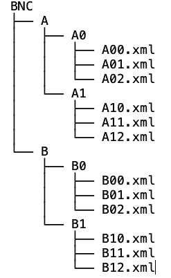
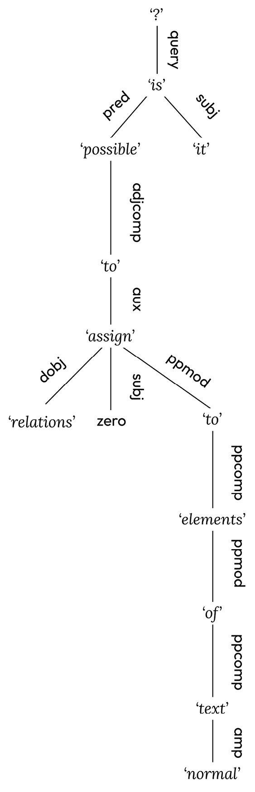
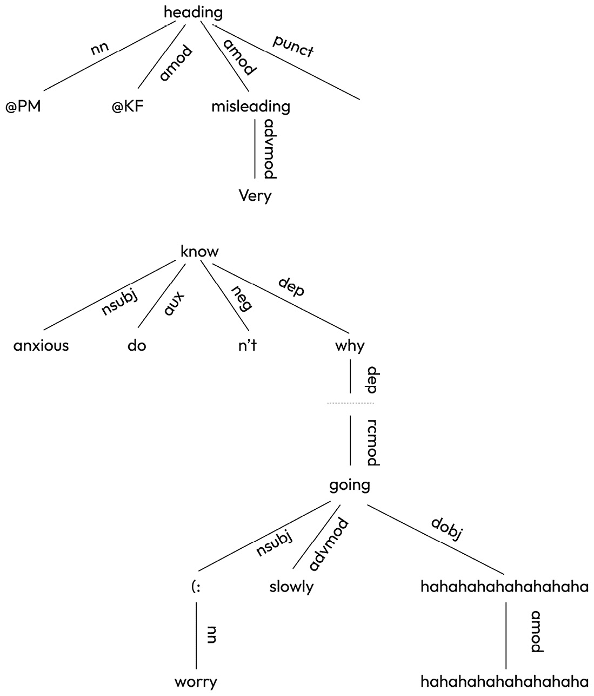
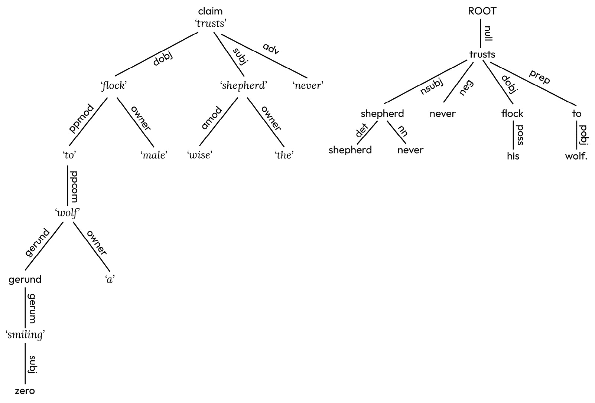
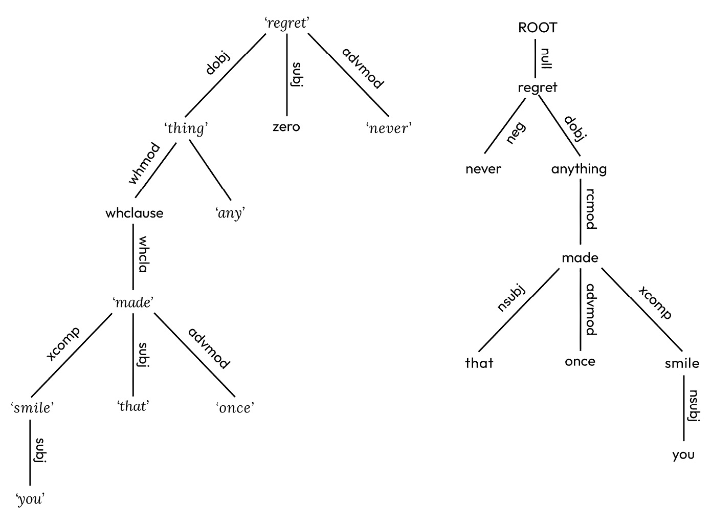
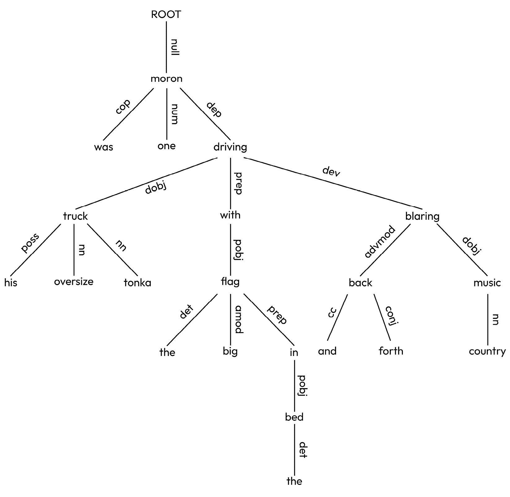
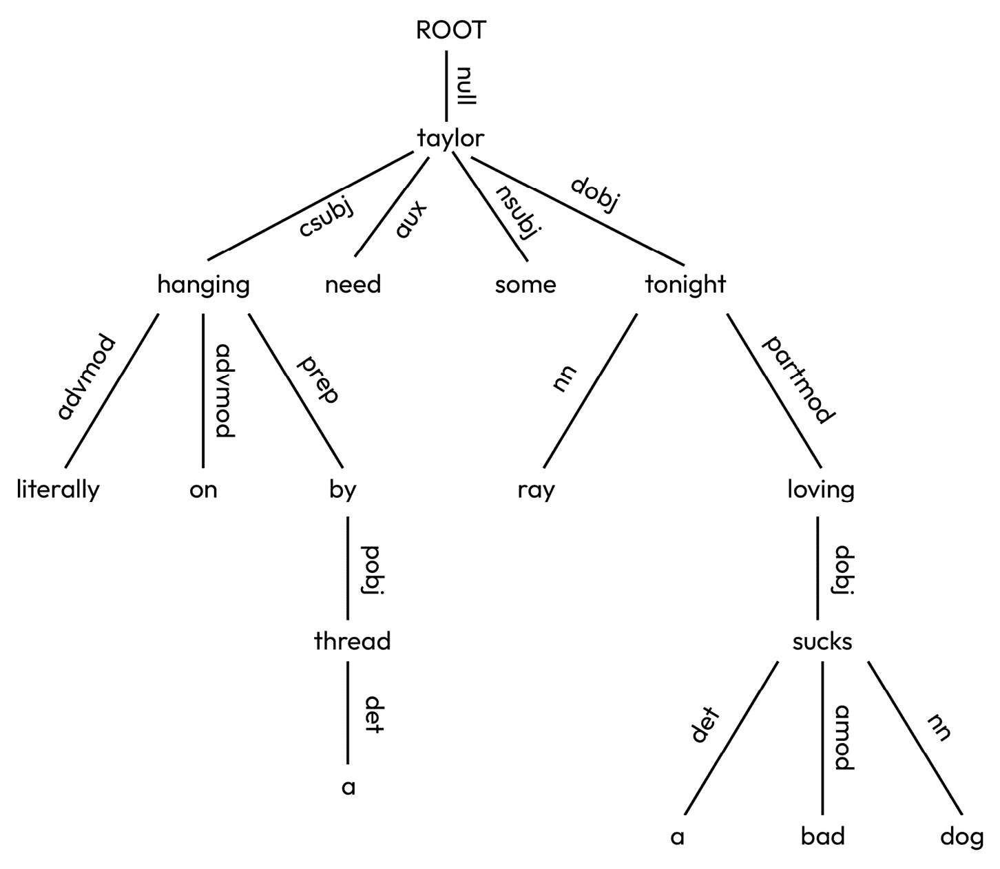

# 4

# 预处理——词干提取、标记和解析

在我们开始为文本分配情感之前，我们必须执行一系列预处理任务，以获取携带我们所需信息的元素。在*第一章*“基础”中，我们简要介绍了通用 NLP 系统的各个组成部分，但没有详细探讨这些组件可能如何实现。在本章中，我们将提供对情感挖掘最有用的工具的草图和部分实现——当我们给出某物的部分实现或代码片段时，完整的实现可以在代码仓库中找到。

我们将详细探讨语言处理管道的早期阶段。用于情感挖掘的最常用的文本往往非常非正式——推文、产品评论等等。这种材料通常语法不规范，包含虚构的词语、拼写错误以及非文本项目，如表情符号、图像和表情符号。标准的解析算法无法处理这类材料，即使它们能够处理，产生的分析结果也非常难以处理：对于“@MarthatheCat Look at that toof! #growl”这样的文本，其解析树会是什么样子呢？我们将包括与标记（这通常仅作为解析的先导有用）和解析相关的材料，但重点将主要放在最低级步骤上——阅读文本（并不像看起来那么简单）、将单词分解成部分，以及识别复合词。

在本章中，我们将涵盖以下主题：

+   读者

+   词素和复合词

+   分词、形态学和词干提取

+   复合词

+   标记和解析

# 读者

在我们能够做任何事情之前，我们需要能够阅读包含文本的文档——特别是预处理算法和情感挖掘算法将使用的训练数据。这些文档分为两类：

+   **预处理算法的训练数据**：我们用于查找单词、将它们分解成更小的单元以及将它们组合成更大组别的算法中，有一些需要训练数据。这可以是原始文本，也可以是带有适当标签的注释文本。在两种情况下，我们都需要大量的数据（对于某些任务，你可能需要数亿个单词，甚至更多），而且使用外部来源的数据通常比自行编译更方便。不幸的是，外部提供的数据并不总是以单一同意的格式出现，因此你需要**读者**来抽象出这些数据的格式和组织细节。以一个简单的例子来说，用于训练程序为文本分配词性的训练数据需要提供已经标记了这些标签的文本。在这里，我们将使用两个著名的语料库进行一些实验：**英国国家语料库（BNC**）和**通用依存关系语料库（UDT**）。BNC 提供具有复杂 XML 类似注释的文本，如下所示：

    ```py
    <w c5=NN1  hw=factsheet  pos= SUBST >FACTSHEET </w>
    ```

    ```py
    <w c5=DTQ  hw=what  pos= PRON >WHAT </w>
    ```

这说明*fact sheet*是一个 NN1，而*what*是一个代词。

UDT 提供以制表符分隔的文件，其中每一行代表一个单词的信息：

```py
1   what    what    PRON    PronType=Int,Rel  0       root    _2   is      be      AUX     Mood=Ind          1       cop     _
```

这说明*what*是一个代词，而*is*是一个助动词。为了使用这些来训练一个标记器，我们必须挖掘我们想要的信息，并将其转换为统一格式。

+   **情感分析算法的训练数据**：几乎所有的将情感分配给文本的方法都使用机器学习算法，因此又需要训练数据。正如在*第二章*“构建和使用数据集”中所述，使用外部提供的数据通常很方便，并且与用于预处理算法的数据一样，这些数据可以以各种格式出现。

训练数据可以以文本文件、以文本文件为叶子的目录树或 SQL 或其他数据库的形式提供。更复杂的是，可能会有非常大量的数据（数亿个条目，甚至数十亿个条目），以至于一次将所有数据放入内存中并不方便。因此，我们首先提供一个读者生成函数，该函数将遍历目录树，直到达到一个名称匹配可选模式的叶子文件，然后使用适当的读者一次返回一个文件中的项目：

```py
def reader(path, dataFileReader, pattern=re.compile('.*')):    if isinstance(pattern, str):
        pattern = re.compile(pattern)
    if isinstance(path, list):
        # If what you're looking at is a list of file names,
        # look inside it and return the things you find there
        for f in path:
            for r in reader(f, dataFileReader, pattern=pattern):
                yield r
    elif os.path.isdir(path):
        # If what you're looking at is a directory,
        # look inside it and return the things you find there
        for f in sorted(os.listdir(path)):
            for r in reader(os.path.join(path, f),
                            dataFileReader, pattern=pattern):
                yield r
    else:
        # If it's a datafile, check that its name matches the pattern
        # and then use the dataFileReader to extract what you want
        if pattern.match(path):
            for r in dataFileReader(path):
                yield r
```

`reader`将返回一个生成器，它会遍历由`path`指定的目录树，直到找到名称与`pattern`匹配的叶文件，然后使用`dataFileReader`遍历给定文件中的数据。我们使用生成器而不是简单的函数，因为语料库可能非常大，一次性将语料库中包含的所有数据读入内存可能变得难以管理。使用生成器的缺点是您只能迭代它一次 – 如果您想巩固使用读者得到的结果，可以使用`list`将它们存储为列表：

```py
>>> r = reader(BNC, BNCWordReader, pattern=r'.*\.xml')>>> l = list(r)
```

这将创建一个用于从**BNC**读取单词的生成器，`r`。BNC 是一个广泛使用的文档集合，尽管它作为训练资源，尤其是测试标记器的资源地位略不清楚，因为绝大多数材料的标签都是由 CLAWS4 标记器程序分配的（Leech 等，1994）。这意味着任何在它上面训练的标记器都将学习 CLAWS4 分配的标签，所以除非这些标签是 100%准确的（它们不是），那么它将不会学习“真实”的标签。尽管如此，它是一个非常有用的资源，并且当然可以用作训练可用的标记器的资源。可以从[`ota.bodleian.ox.ac.uk/repository/xmlui/handle/20.500.12024/2554`](https://ota.bodleian.ox.ac.uk/repository/xmlui/handle/20.500.12024/2554)下载。

然后，我们将这个生成器固化为一个列表，`l`，以便于使用。BNC 包含大约 1.1 亿个单词，这在现代计算机上是一个可管理的数据量，因此将它们存储为单个列表是有意义的。然而，对于更大的语料库，这可能不可行，因此有使用生成器的选项可能是有用的。

BNC 以目录树的形式提供，包含子目录`A`、`B`、…、`K`，它们包含`A0`、`A1`、…、`B0`、`B1`、…，这些目录反过来又包含`A00.xml`、`A01.xml`、…：



图 4.1 – BNC 目录树结构

叶文件包含标题信息，随后是句子，由`<s n=???>...</s>`分隔，组成句子的单词由`<w c5=??? hw=??? pos=???>???</w>`标记。以下是一个示例：

```py
<s n= 1 ><w c5= NN1  hw= factsheet  pos= SUBST >FACTSHEET </w><w c5= DTQ  hw= what  pos= PRON >WHAT </w><w c5= VBZ  hw= be  pos= VERB >IS </w><w c5= NN1  hw= aids  pos= SUBST >AIDS</w><c c5= PUN >?</c></s>
```

要读取 BNC 中的所有单词，我们需要某种东西来挖掘`<w ...>`和`</w>`之间的项目。最简单的方法是使用正则表达式：

```py
BNCWORD = re.compile('<(?P<tagtype>w|c).*?>(?P<form>.*?)\s*</(?P=tagtype)>')Get raw text from BNC leaf files
def BNCWordReader(data):
    for i in BNCWORD.finditer(open(data).read()):
        yield i.group( form )
```

模式查找`<w ...>`或`<c ...>`的实例，然后查找适当的闭合括号，因为 BNC 用`<w ...>`标记单词，用`<c ...>`标记标点符号。我们必须找到两者并确保我们得到正确的闭合括号。

根据对`BNCWordReader`的定义，我们可以像之前一样创建一个读取器，从 BNC 中提取所有原始文本。其他语料库需要不同的模式来提取文本——例如，**宾州阿拉伯语树库**（**PATB**）（这是一个用于训练和测试阿拉伯语 NLP 工具的有用资源。不幸的是，它不是免费的——有关如何获取它的信息，请参阅语言数据联盟([`www.ldc.upenn.edu/`](https://www.ldc.upenn.edu/))——然而，在适当的时候，我们将用它来举例说明）包含看起来像这样的叶文件：

```py
INPUT STRING: فيLOOK-UP WORD: fy
     Comment:
       INDEX: P1W1
* SOLUTION 1: (fiy) [fiy_1] fiy/PREP
     (GLOSS): in
  SOLUTION 2: (fiy~a) [fiy_1] fiy/PREP+ya/PRON_1S
     (GLOSS): in + me
  SOLUTION 3: (fiy) [fiy_2] Viy/ABBREV
     (GLOSS): V.
INPUT STRING: سوسة
LOOK-UP WORD: swsp
     Comment:
       INDEX: P1W2
* SOLUTION 1: (suwsap) [suws_1] suws/NOUN+ap/NSUFF_FEM_SG
     (GLOSS): woodworm:licorice + [fem.sg.]
  SOLUTION 2: (suwsapu) [suws_1] suws/NOUN+ap/NSUFF_FEM_SG+u/CASE_DEF_NOM
     (GLOSS): woodworm:licorice + [fem.sg.] + [def.nom.]
…
```

要从这些内容中提取单词，我们需要一个类似这样的模式：

```py
PATBWordPattern = re.compile("INPUT STRING: (?P<form>\S*)")def PATBWordReader(path):
    for i in PATBWordPattern.finditer(open(path).read()):
        yield i.group( form )
```

当应用于 PATB 时，这将返回以下内容：

```py
... لونغ بيتش ( الولايات المتحدة ) 15-7 ( اف ب
```

由于`BNCWordReader`和`PATBWordReader`之间的相似性，我们本可以简单地定义一个名为`WordReader`的单个函数，它接受一个路径和一个模式，并将模式绑定到所需的形式：

```py
def WordReader(pattern, path):    for i in pattern.finditer(open(path).read()):
        yield i.group( form )
from functools import partial
PATBWordReader = partial(WordReader, PATBWordPattern)
BNCWordReader = partial(WordReader, BNCWordPattern)
```

同样的技术可以应用于从广泛的语料库中提取原始文本，例如 UDT ([`universaldependencies.org/#download`](https://universaldependencies.org/#download))，它为大量语言（目前有 130 种语言，对于常见语言大约有 20 万个单词，而对于其他语言则较少）提供了免费访问标记和解析数据的途径。

同样，情感分配算法的训练数据以各种格式提供。如*第一章*中所述，*基础*，Python 已经提供了一个名为`pandas`的模块，用于管理通用训练数据集的训练集。如果您的训练数据由数据点集合组成，其中数据点是一组`feature:value`对，描述了数据点的属性，以及一个标签说明它属于哪个类别，那么`pandas`非常有用。`pandas`中的基本对象是 DataFrame，它是一组对象的集合，其中每个对象由一组`feature:value`对描述。因此，DataFrame 非常类似于 SQL 表，其中列名是特征名称，一个对象对应于表中的一行；它也非常类似于嵌套的 Python 字典，其中顶层键是特征名称，与这些名称相关联的值是索引-值对。它还非常类似于电子表格，其中顶部行是特征名称，其余行是数据点。DataFrame 可以直接从所有这些格式以及更多格式（包括 SQL 数据库中的表）中读取，并且可以直接写入其中。以下是从存储为 MySQL 数据库的标注推文集合中提取的示例：

```py
mysql> describe sentiments;+-----------+--------------+------+-----+---------+-------+
| Field     | Type         | Null | Key | Default | Extra |
+-----------+--------------+------+-----+---------+-------+
| annotator | int(11)      | YES  |     | NULL    |       |
| tweet     | int(11)      | YES  |     | NULL    |       |
| sentiment | varchar(255) | YES  |     | NULL    |       |
+-----------+--------------+------+-----+---------+-------+
3 rows in set (0.01 sec)
mysql> select * from sentiments where tweet < 3;
+-----------+-------+-----------------------+
| annotator | tweet | sentiment             |
+-----------+-------+-----------------------+
|        19 |     1 | love                  |
|         1 |     1 | anger+dissatisfaction |
|         8 |     1 | anger+dissatisfaction |
|         2 |     2 | love+joy              |
|        19 |     2 | love                  |
|         6 |     2 | love+joy+optimism     |
+-----------+-------+-----------------------
```

`sentiments` 表包含代表注释者 ID 的行，该注释者注释了特定的推文，推文本身的 ID，以及给定注释者分配给它的情绪集合（例如，注释者 8 将愤怒和不满分配给推文 1）。此表可以直接作为 DataFrame 读取，并可以转换为字典、JSON 对象（与字典非常相似），CSV 格式的字符串等：

```py
>>> DB = MySQLdb.connect(db= centement , autocommit=True, charset= UTF8 )>>> cursor = DB.cursor()
>>> data = pandas.read_sql( select * from sentiments where tweet < 3 , DB)
>>> data
   annotator  tweet              sentiment
0         19      1                   love
1          1      1  anger+dissatisfaction
2          8      1  anger+dissatisfaction
3          2      2               love+joy
4         19      2                   love
5          6      2      love+joy+optimism
>>> data.to_json()
'{ annotator :{ 0 :19, 1 :1, 2 :8, 3 :2, 4 :19, 5 :6}, tweet :{ 0 :1, 1 :1, 2 :1, 3 :2, 4 :2, 5 :2}, sentiment :{ 0 : love , 1 : anger+dissatisfaction , 2 : anger+dissatisfaction , 3 : love+joy , 4 : love , 5 : love+joy+optimism }}'
>>> print(data.to_csv())
,annotator,tweet,sentiment
0,19,1,love
1,1,1,anger+dissatisfaction
2,8,1,anger+dissatisfaction
3,2,2,love+joy
4,19,2,love
5,6,2,love+joy+optimism
```

因此，我们不必过于担心实际读取和写入用于训练情绪分类算法的数据——DataFrame 可以从几乎任何合理的格式中读取和写入。尽管如此，我们仍然必须小心我们使用哪些特征以及它们可以有哪些值。例如，前面的 MySQL 数据库引用了推文和注释者的 ID，每个推文的文本保存在单独的表中，并且将每个注释者分配的情绪作为单个复合值存储（例如，爱+快乐+乐观）。完全有可能将推文的文本存储在表中，并且将每个情绪作为一列，如果注释者将此情绪分配给推文，则设置为 1，否则为 0：

```py
ID  Tweet                        anger  sadness  surprise0   2017-En-21441 Worry is a dow     0     1          0
1   2017-En-31535  Whatever you d    0     0          0
2   2017-En-22190  No but that's     0     0          1
3   2017-En-20221  Do you think h    0     0          0
4   2017-En-22180  Rooneys effing    1     0          0
6830  2017-En-21383  @nicky57672 Hi  0     0          0
6831  2017-En-41441  @andreamitchel  0     0          1
6832  2017-En-10886  @isthataspider  0     1          0
6833  2017-En-40662  i wonder how a  0     0          1
6834  2017-En-31003  I'm highly ani  0     0          0
```

在这里，每个推文都有一个明确的 ID，以及在 DataFrame 中的位置；推文本身被包含在内，每个情绪都是单独的列。这里的数据是以 CSV 文件的形式提供的，因此可以直接作为 DataFrame 读取，没有任何问题，但它的呈现方式与之前的一组完全不同。因此，我们需要预处理算法来确保我们使用的数据是以机器学习算法想要的方式组织的。

幸运的是，DataFrame 具有类似数据库的选项，可以用于选择数据和合并表，因此将数据的一种表示方式转换为另一种方式相对直接，但确实需要执行。例如，对于每种情绪只有一个列有优势，而对于所有情绪只有一个列但允许复合情绪也有优势——对于每种情绪只有一个列使得允许单个对象可能具有多种与之相关的情绪变得容易；对于所有情绪只有一个列使得搜索具有相同情绪的推文变得容易。一些资源会提供一种方式，而另一些会提供另一种方式，但几乎任何学习算法都会需要其中一种，因此能够在这两者之间进行转换是必要的。

# 词的部分和复合词

在文本中识别情绪的关键在于构成这些文本的词语。可能对分类词语、找出词语之间的相似性以及了解给定文本中的词语关系很有用，但最重要的是词语本身。如果一个文本包含*爱*和*快乐*这样的词语，那么它很可能具有积极的含义，而如果一个文本包含*恨*和*可怕*这样的词语，那么它很可能具有消极的含义。

如*第一章*中所述，“基础”，然而，确切地指定什么算作一个词可能很困难，因此很难找到构成文本的词语。虽然许多语言的书写系统使用空格来分隔文本，但也有一些语言不会这样做（例如，书面汉语）。即使在语言的书面形式使用空格的情况下，找到我们感兴趣的单元也不总是直接的。存在两个基本问题：

+   词语通常由一个核心词素和几个词缀组成，这些词缀增加了或改变了核心词素的意义。*爱*、*loves*、*loved*、*loving*、*lover*和*lovable*都与一个单一的概念明显相关，尽管它们看起来略有不同。那么，我们是想将它们视为不同的词语，还是视为单一词语的变体？我们是想将*steal*、*stole*和*stolen*视为不同的词语，还是视为同一词语的变体？答案是，有时我们想这样做，有时不想这样做，但当我们想将它们视为同一词语的变体时，我们需要相应的机制来实现。

+   一些由空格分隔的项看起来像是由几个组件组成的：*anything*、*anyone*和*anybody*看起来非常像是由*any*加上*thing*、*one*或*body*组成的——很难想象*anyone could do that*和*any fool could do that*的潜在结构是不同的。值得注意的是，在英语中，口语的重音模式与文本中空格的存在或缺失相匹配——*anyone*在第一个音节/en/上有一个重音，而*any fool*在/en/和/fool/上有重音，所以它们之间有区别，但它们也有相同的结构。

很容易想要通过查看每个由空格分隔的项来处理这个问题，看看它是否由两个（或更多）其他已知单位组成。*股市*和*stockmarket*看起来是同一个词，同样*战场*和*battleground*也是如此，查看它们出现的上下文可以证实这一点：

```py
                         as well as in a stock market                  in share prices in the stock market
                  to the harsher side of stock market life
                          apart from the stock market crash of two
                        There was a huge stockmarket crash in October
           of being replaced in a sudden stockmarket coup
           in the days that followed the stockmarket crash of October
                                     The stockmarket crash of 1987 is
                       was to be a major battle ground between
           of politics as an ideological battle ground and by her
             likely to form the election battle ground
             likely to form the election battle ground
                           surveying the battleground with quiet
      Industry had become an ideological battleground
         of London as a potential savage battleground is confirmed by
          previous evening it had been a battleground for people who
```

然而，也有一些明显的例子表明复合词并不等同于相邻的两个单词。*重量级*是指重量很大的任何东西，而*重量级*几乎总是指拳击手；如果某物正在*研究*，那么有人在研究它，而* understudy*是指当通常表演的人不可用时将填补角色的人：

```py
       an example about lifting a heavy weight and doing a              I was n't lifting a heavy weight
            's roster there was a heavy weight of expectation for the
   half-conscious levels he was a heavy weight upon me of a perhaps
                              the heavyweight boxing champion of the
      up a stirring finale to the heavyweight contest
   of the main contenders for the heavyweight Bath title
a former British and Commonwealth heavyweight boxing champion
  a new sound broadcasting system under study
           many of the plants now under study phase come to fruition '
    to the Brazilian auto workers under study at that particular time
      in Guanxi province has been under study since the 1950s
                      and Jack 's understudy can take over as the maid
   to be considered as an England understudy for the Polish expedition
              His Equity-required understudy received $800 per — 
                         will now understudy all positions along the
```

这对于像中文这样的语言尤为重要，中文没有空格书写，几乎任何字符都可以作为一个独立的单词，但两个或更多字符的序列也可以是单词，通常与单个字符对应的单词联系很少。

这些现象在所有语言中都存在。有些语言有非常复杂的规则来将单词分解成更小的部分，有些大量使用复合词，还有些两者都做。这些例子给出了在英语中这些问题出现的大致情况，但在以下关于使用算法处理这些问题的讨论中，我们将查看其他语言的例子。在下一节“分词、形态学和词干提取”，我们将探讨将单词分解成部分的方法——也就是说，识别单词*recognizing*由两部分组成，*recognize*和*-ing*。在“复合词”这一节中，我们将探讨在复合词非常普遍的语言中识别复合词的方法。

# 分词、形态学和词干提取

我们必须做的第一件事是将输入文本分割成**标记**——这些标记对整个文本所传达的信息有可识别的贡献。标记包括单词，如之前大致描述的那样，但也包括标点符号、数字、货币符号、表情符号等等。考虑以下文本*Mr. Jones bought it for £5.3K!*第一个标记是*Mr.*，这是一个发音为/m i s t uh/的单词，而接下来的几个标记是*Jones*、*bought*、*it*和*for*，然后是货币符号*£*，接着是数字*5.3K*和标点符号*!*。确切地说，哪些被当作标记处理取决于你接下来要做什么（*5.3K*是一个单独的数字，还是两个标记，*5.3*和*K*？），但如果没有将这些文本分割成这样的单位，你几乎无法对文本进行任何操作。

做这件事的最简单方法是通过定义一个正则表达式，其中模式指定了文本应该被分割的方式。考虑前面的句子：我们需要一些用于挑选数字的，一些用于缩写的，一些用于货币符号的，以及一些用于标点符号的。这建议以下模式：

```py
ENGLISHPATTERN = re.compile(r"""(?P<word>(\d+,?)+((\.|:)\d+)?K?|(Mr|Mrs|Dr|Prof|St|Rd)\.?|(A-Za-z_)*[A-Za-z]|n't|\.|\?|,|\$|£|&|:|!|"|-|–|[^a-zA-Z\s]+)""")
```

这种模式的第一个部分表明，一个数字可以由一些数字组成，可能后面跟着一个逗号（以捕获像 120,459 这样的一个百万和二十万四千五百九），然后是一个点和一些更多的数字，最后可能跟着字母 K；第二部分列出了几个通常后面跟着句号的缩写；接下来的两个，`n't`和`(A-Za-z)*[A-Za-z]`相当复杂；`n't`识别*n’t*作为一个标记，而`(A-Za-z)*[A-Za-z]`挑选出不以*n’t*结尾的字母字符序列，因此*hasn’t*和*didn’t*都被识别为两个标记，*has + n’t*和*did + n’t*。接下来的几个只是识别标点符号、货币符号和类似的东西；最后一个识别非字母符号的序列，这对于将表情符号序列作为标记处理很有用。

在英文文本中寻找这种模式的实例会产生如下结果：

```py
>>> tokenise("Mr. Jones bought it for £5.3K!")['Mr.', 'Jones', 'bought', 'it', 'for', '£', '5.3K', '!']
>>> tokenise("My cat is lucky the RSPCA weren't open at 3am last night!!!
#fuming 😡🐱")
['My', 'cat', 'is', 'lucky', 'the', 'RSPCA', 'were', "n't", 'open', 'at', '3', 'am', 'last', 'night', '!', '!', '!', '#', 'fuming', '😡🐱']
```

使用正则表达式进行标记化有两个优点：正则表达式可以非常快地应用，因此大量文本可以非常快地进行标记化（大约是 NLTK 内置的`word_tokenize`的三倍快：这两个输出的唯一主要区别是`tokenise`将诸如*built-in*这样的词视为由三个部分组成，*built*、*-*和*in*，而 NLTK 将它们视为单个复合词，*built-in*）；并且模式是完全自包含的，因此可以很容易地进行更改（例如，如果你更愿意将每个表情符号视为一个单独的标记，只需从`[^a-zA-Z\s]+`中移除`+`，如果你更愿意将*built-in*视为一个单一的复合单位，只需从选项列表中移除`–`），并且也可以很容易地适应其他语言，例如通过替换所需的语言的字符范围，将`[a-z]`替换为该语言使用的 Unicode 字符范围：

```py
ARABICPATTERN = re.compile(r"(?P<word>(\d+,?)+(\.\d+)?|[؟ۼ]+|\.|\?|,|\$|£|&|!|'|\"|\S+)")CHINESEPATTERN =
re.compile(r"(?P<word>(\d+,?)+(\.\d+)?|[一-龥]|.|\?|,|\$|£|&|!|'|\"|)")
```

一旦我们标记了我们的文本，我们很可能会得到一些是同一词根的微小变体——*hating*和*hated*都是*hate*这个词根的版本，并且倾向于携带相同的情感电荷。这一步骤的重要性（和难度）会因语言而异，但几乎所有语言都是由一个词根和一组词缀构成的，找到词根通常有助于诸如情感检测等任务。

显而易见的起点是生成一个词缀列表，并尝试从标记的开始和结束处切掉它们，直到找到一个已知的词根。这要求我们拥有一组词根，这可能是相当困难的。对于英语，我们可以简单地使用 WordNet 中的单词列表。这给我们提供了 15 万个单词，将覆盖大多数情况：

```py
from utilities import *from nltk.corpus import wordnet
PREFIXES = {"", "un", "dis", "re"}
SUFFIXES = {"", "ing", "s", "ed", "en", "er", "est", "ly", "ion"}
PATTERN = re.compile("(?P<form>[a-z]{3,}) (?P<pos>n|v|r|a) ")
def readAllWords():
    return set(wordnet.all_lemma_names())
ALLWORDS = readAllWords()
def stem(form, prefixes=PREFIXES, words=ALLWORDS, suffixes=SUFFIXES):
    for i in range(len(form)):
        if form[:i] in prefixes:
            for j in range(i+1, len(form)+1):
                if form[i:j] in words:
                    if form[j:] in suffixes:
                        yield ("%s-%s+%s"%(form[:i],
                        form[i:j], form[j:])).strip("+-")
ROOTPATTERN = re.compile("^(.*-)?(?P<root>.*?)(\+.*)?$")
def sortstem(w):
    return ROOTPATTERN.match(w).group("root")
def allstems(form, prefixes=PREFIXES, words=ALLWORDS, suffixes=SUFFIXES):
    return sorted(stem(form, prefixes=PREFIXES,
        words=ALLWORDS, suffixes=SUFFIXES), key=sortstem)
```

这将检查标记的前几个字符，以查看它们是否是前缀（允许空前缀），然后查看接下来的几个字符，以查看它们是否是已知单词，然后查看剩余部分，以查看它是否是后缀。将其编写为生成器使得产生多个答案变得容易——例如，如果 `WORDS` 包含 *construct* 和 *reconstruct*，那么 `stem1` 将返回 `['-reconstruct+ing', 're-construct+ing']` 以形成 *reconstructing*。`stem1` 对短词如 *cut* 大约需要 2*10-06 秒，对更长更复杂的案例如 *reconstructing* 大约需要 7*10-06 秒——对于大多数用途来说足够快。

要使用 `stem1`，请使用以下代码：

```py
>>> from chapter4 import stem1>>> stem1.stem("unexpected")
<generator object stem at 0x7f947a418890>
```

`stem1.stem` 是一个生成器，因为分解一个词可能有几种方式。对于 *unexpected*，我们得到三种分析，因为 *expect*、*expected* 和 *unexpected* 都在基本词典中：

```py
>>> list(stem1.stem("unexpected"))['unexpected', 'un-expect+ed', 'un-expected']
```

另一方面，对于 *uneaten*，我们只得到 *un-eat+en*，因为词典中没有将 *eaten* 和 *uneaten* 作为条目：

```py
>>> list(stem1.stem("uneaten"))['un-eat+en']
```

这有点尴尬，因为很难预测词典中会列出哪些派生形式。我们想要的是词根及其词缀，很明显，*expected* 和 *unexpected* 都不是词根形式。你移除的词缀越多，就越接近词根。因此，我们可能会决定使用具有最短词根的输出作为最佳选择：

```py
>>> stem1.allstems("unexpected")['un-expect+ed', 'un-expected', 'unexpected']
```

输出的质量在很大程度上取决于词典的质量：如果它包含自身由更小项目派生的形式，我们将得到如 *unexpected* 的三种分析，如果它不包含某些形式，则不会返回它（WordNet 词典包含大约 150K 个条目，所以如果我们使用它，这种情况不会经常发生！）。

`stem1.stem` 是几个知名工具的基础——例如，NLTK 中的 `morphy` 函数用于分析英语形式和 **标准阿拉伯形态分析器**（**SAMA**）（Buckwalter, T., 2007）。一如既往，有一些复杂性，特别是当添加前缀或后缀时，单词的拼写可能会改变（例如，当你在以 *p* 开头的单词前添加英语否定前缀 *in-* 时，它变成 *im-*，所以 *in-* + *perfect* 变成 *imperfect*，*in-* + *possible* 变成 *impossible*），以及单词可以有多个词缀（例如，法语名词和形容词可以有后缀，一个用于标记性别，一个用于标记数）。我们将在下一两节中探讨这些内容。

## 在拼写变化方面

在许多语言（例如，英语）中，拼写和发音之间的关系相当微妙。特别是，它可以编码关于单词重音的事实，并且当添加前缀和后缀时，它可以以改变的方式做到这一点。例如，“魔法 e”用于标记以长元音结尾的单词——例如，*site* 与 *sit*。然而，当以元音开头的后缀添加到这样的单词时，*e* 会从长元音版本中省略，而短元音版本的最后辅音会被双写：*siting* 与 *sitting*（这仅在根词的最后一个元音既短又重音时发生，*enter* 和 *infer* 分别变为 *entering* 和 *inferring*）。这样的规则往往反映了拼写编码发音的方式（例如，魔法 e 标记前面的元音为长音，而*inferring*中的双辅音标记前面的元音为短音和重音）或者源于发音的实际变化（*im-* 在 *impossible* 中是 *in-* 前缀，但很难说成 *inpossible*（试试看！），所以英语使用者们懒惰地将其改为 *im-*。参见（Chomsky & Halle, 1968）以了解英语中拼写和发音之间关系的详细讨论）。

`morphy` 通过包含所有可能的后缀版本，并在找到匹配项时停止来处理这个问题：

```py
    MORPHOLOGICAL_SUBSTITUTIONS = {        NOUN: [
            ('s', ''),
            ('ses', 's'),
            ('ves', 'f'),
            ('xes', 'x'),
            ('zes', 'z'),
            ('ches', 'ch'),
            ('shes', 'sh'),
            ('men', 'man'),
            ('ies', 'y'),
        ],
        VERB: [
            ('s', ''),
            ('ies', 'y'),
            ('es', 'e'),
            ('es', ''),
            ('ed', 'e'),
            ('ed', ''),
            ('ing', 'e'),
            ('ing', ''),
        ],
        ADJ: [('er', ''), ('est', ''), ('er', 'e'), ('est', 'e')],
        ADV: [],
    }
```

例如，这个表格说明，如果你看到一个以 *s* 结尾的单词，如果你删除 *s*，它可能是一个名词；如果你看到一个以 *ches* 结尾的单词，那么它可能是以 *ch* 结尾的名词形式。这些替换在很多情况下都会有效，但它并不处理像 *hitting* 和 *slipped* 这样的情况。因此，`morphy` 包含一个例外情况的列表（相当长的列表：名词有 2K 个，动词有 2.4K 个），包括这些形式。当然，这会起作用，但它确实需要大量的维护，并且这意味着遵守规则但不在例外列表中的单词将不会被识别（例如，基本单词列表包括 *kit* 作为动词，但不包括 *kitting* 和 *kitted* 作为例外，因此不会识别 *kitted* 在 *he was kitted out with all the latest gear* 中的形式是 *kit*）。

我们可以提供一组在单词拆分时应用的拼写变化，而不是提供多个词缀版本和长列表的例外情况：

```py
SPELLINGRULES = """ee X:(d|n) ==> ee + e X
C y X:ing ==> C ie + X
C X:ly ==> C le + X
i X:e(d|r|st?)|ly ==> y + X
X:((d|g|t)o)|x|s(h|s)|ch es ==> X + s
X0 (?!(?P=X0)) C X1:ed|en|ing ==> X0 C e + X1
C0 V C1 C1 X:e(d|n|r)|ing ==> C0 V C1 + X
C0 V C1 X:(s|$) ==> C0 V C1 + X
"""
```

在这些规则中，左侧是一个要在当前形式中某处匹配的模式，右侧是它可能被重写的方式。`C, C0, C1`, … 将匹配任何辅音，`V, V0, V1`, … 将匹配任何元音，`X, X0, X1`, … 将匹配任何字符，而 `X:(d|n)` 将匹配 `d` 或 `n` 并将 `X` 的值固定为所匹配的任何一个。因此，第一条规则将匹配 *seen* 和 *freed* 并建议将它们重写为 *see+en* 或 *free+ed*，而倒数第二条规则，它寻找一个辅音、一个元音、一个重复的辅音以及 *ed*, *en*, *er* 或 *ing* 中的任何一个，将匹配 *slipping* 和 *kitted* 并建议将它们重写为 *slip+ing* 和 *kit+ed*。

如果我们使用这样的规则，我们可以找到那些结尾已更改但未明确列出它们的词的词根：

```py
>>> from chapter4 import stem2>>> list(stem2.stem("kitted"))
['kit+ed']
```

如前所述，如果我们用它与一个派生形式明确列出为例外情况的词一起使用，那么我们会得到多个版本，但再次强调，使用具有最短根的版本将给我们提供最基础的根版本：

```py
>>> stem2.allstems("hitting")['hit+ing', 'hitting']
```

本书代码库中 `chapter4.stem2` 中 `allstems` 的实现也允许多个词缀，因此我们可以分析像 *unreconstructed* 和 *derestrictions* 这样的词：

```py
>>> stem2.allstems("unreconstructed")['un-re-construct+ed', 'un-reconstruct+ed', 'un-reconstructed', 'unreconstructed']
>>> stem2.allstems("restrictions")
['restrict+ion+s', 'restriction+s', 're-strict+ion+s']
```

这些规则可以编译成一个单一的正规表达式，因此可以非常快速地应用，并将覆盖构成英语单词的语素之间的拼写变化的大多数情况（这种任务中使用正规表达式的方法是由 (Koskiennemi, 1985) 领先提出的）。规则仅在语素的接合处应用，因此可以立即检查重写形式的第一部分是否是一个前缀（如果没有找到根）或一个根（如果到目前为止还没有找到根），因此它们不会导致不合理的多次分割。这种方法导致可以更容易维护的工具，因为你不需要添加所有不能仅通过分割词缀的一些版本来获得的形式作为例外，因此如果你正在处理有大量此类拼写变化的语言，这可能值得考虑。

## 多个和上下文词缀

前面的讨论表明，存在一组固定的词缀，每个词缀都可以附加到一个合适的词根上。即使在英语中，情况也并不那么简单。首先，存在几种不同的过去时结尾，其中一些附加到某些动词上，而另一些则附加到其他动词上。大多数动词使用 *–ed* 作为它们的过去分词，但有些动词，如 *take*，则需要 *–en*：`morphy` 既可以接受 *taked* 也可以接受 *taken* 作为 *take* 的形式，其他 *–en* 动词和完全不规则的例子，如 *thinked* 和 *bringed*，也是如此。其次，有些情况下，一个词可能需要一系列词缀——例如，*unexpectedly* 看起来是由一个前缀 *un-*，一个词根 *expect* 和两个后缀 *-ed* 和 *-ly* 组成的。这两个问题在其他语言中变得更加重要。`morphy` 将 *steal* 作为 *stealed* 的词根返回可能并不重要，因为几乎没有人会写出 *stealed*（同样，它接受 *sliping* 作为 *slip* 的现在分词也不重要，因为没有人会写出 *sliping*）。在其他语言中，未能注意到某些词缀不适合附加到给定的词根上可能会导致错误的解读。同样，英语中多词缀的情况并不多见，当然，多屈折词缀的情况更少（在前面的例子中，*un-*，*-ed* 和 *-ly* 都是派生词缀——*-un* 从一个形容词获得一个新的形容词，*-ed* 在这种情况下从一个动词词根获得一个形容词，*-ly* 从一个形容词获得一个副词）。

再次，这在像法语（以及其他罗曼语族语言）这样的语言中可能更为重要，在这些语言中，名词需要接受一个性别标记和一个数量标记（*noir*，*noire*，*noirs* 和 *noires*），动词需要接受一个时态标记和一个适当的人称标记（*achetais* 作为第一人称单数的过去不定式，*acheterais* 作为第一人称单数的条件式）；以及在像阿拉伯语这样的语言中，一个词可能有可变数量的屈折词缀（例如，现在时态的动词将有一个时态前缀和一个现在时态的人称标记，而过去时态的动词则只有一个过去时态的数量标记）以及许多粘着词缀（直接附加到主要词上的封闭类词）——例如，形式 ويكتبون (wyktbwn) 由一个连词，和/PART (wa)，一个现在时态前缀，ي/IV3MP，一个动词的现在时态形式（ك/VERB_IMP），一个现在时态后缀，ُون/IVSUFF_SUBJ:MP_MOOD:I，以及一个第三人称复数代词，هُم/IVSUFF_DO:3MP，整个短语的意思是 *他们正在写它们*。允许的成分，它们允许出现的顺序，以及词根的形式，这些形式可以随着不同的词缀以及不同类别的名词和动词而变化，都是复杂且至关重要的。

为了捕捉这些现象，我们需要对之前给出的算法进行进一步的修改。我们需要说明每个前缀可以与什么结合，并且我们需要将单词分配到词汇类别中。为了捕捉这一部分，我们必须假设一个词根通常在没有某些前缀的情况下是不完整的——例如，一个英语动词没有时态标记是不完整的，一个法语形容词没有性别标记和数量标记是不完整的，等等。我们将用 `A->B` 来表示缺少后续 `B` 的 `A` 字符——例如，一个英语动词词根是 `V->TNS` 类型，而 `A <-B` 表示缺少前导 `B` 的 `A`。例如，*-ly* 是一个缺少前导形容词的副词，因此它是 `ADV<-ADJ` 类型。基于这个概念，我们可以要求项目必须按照它们被发现的方式进行组合——例如，*sadly*，它由形容词 *sad* 和派生前缀 *-ly* 组成，可以组合，但 *dogly* 不是一个词，因为名词 *dog* 不是 *-ly* 所需要的。因此，标准的英语前缀集合如下：

```py
PREFIXES = fixaffixes(    {"un": "(v->tns)->(v->tns), (a->cmp)->(a->cmp)",
     "re": "(v->tns)->(v->tns)",
     "dis": "(v->tns)->(v->tns)"})
SUFFIXES = fixaffixes(
    {"": "tns, num, cmp",
     "ing": "tns",
     "ed": "tns",
     "s": "tns, num",
     "en": "tns",
     "est": "cmp",
     "ly": "r<-(a->cmp), r<-v",
     "er": "(n->num)<-(v->tns), cmp",,
     "ment": "(n->num)<-(v->tns)"
     "ness": "(n->num)<-(v->tns)"})
```

在这里，名词、动词和形容词的词根被分配了类型 `n->num`、`v->tns` 和 `a->cmp`。现在，分析像 *smaller* 这样的词涉及到将 *small* (`adj->cmp`) 和后缀 *–er* (`cmp`) 结合起来，而 *redevelopments* 的分析则涉及到将 *re-* (`(v->tns)->(v->tns)`) 和 *develop* (`v->tns`) 结合起来，以产生一个新的不带时态的动词 *redevelop*，它也是 `(v->tns)` 类型。现在，我们可以将这个与 *–ment* (`(n->num)<-(v->tns)`) 结合起来，以产生一个新的名词词根 *redevelopment* (`(n->num)`), 最后再与 *-s* (`(num)`) 结合，以产生复数名词 *redevelopments*。如果我们为每种情况选择最佳分析，我们将得到以下结果：

```py
>>> from chapter4 import stem3>>> stem3.allstems("smaller")[0]
('small+er', ['a'])
>>> stem3.allstems("redevelopments")[0]
('re-develop+ment+s', ['n'])
>>> stem3.allstems("unsurprisingly")[0]
('un-surprise+ing++ly', ['r'])
>>> stem3.allstems("unreconstructedly")[0]
('un-re-construct+ed++ly', ['r'])
>>> stem3.allstems("reconstructions")[0]
('re-construct+ion+s', ['n'])
>>> stem3.allstems("unreconstructions")[0]
Traceback (most recent call last):
  File "<stdin>", line 1, in <module>
IndexError: list index out of range
```

注意，*unreconstructions* 会导致错误，因为 *un-*、*re-* 和 *-ion* 前缀不能一起使用——*un-* 从动词产生形容词，所以 *un-re-construct* 是一个形容词，而 *-ion* 必须附加到一个动词词根上。

你能从一个复杂词中移除的元素越多，你越有可能到达一个已知带有情感电荷的词根。如果你能分析出 *disastrously* 是由 *disaster+ous+ly* 组成的，那么你将能够利用 *disaster* 是一个高度负面词汇的事实来检测 *disastrously* 的负面含义；如果你能发现 *enthusiastic* 和 *enthusiastically* 是由 *enthusiast+ic* 和 *enthusiast+ic+al+ly* 组成的，那么这三个词在学习时以及随后应用检测情感的规则时可以被视为相同的。值得注意的是，一些前缀会反转它们所应用词汇的含义——例如，一个出乎意料的事件是一个没有被预期的事件。在理解例如 *undesirable* 是由 *un+desire+able* 组成时，必须考虑到这一点，其中 *desire* 是一个通常具有积极含义的术语，但前缀反转了它的含义，因此暗示包含它的文本将是负面的。

许多其他语言中也会出现类似的现象，词缀要么向基词添加信息，要么改变其意义和/或类别。在许多情况下，例如在罗曼语系中，词根需要多个词缀才能完整。在之前提到的英语例子中，我们看到了一些由多个成分组成的词的例子，但所有这些情况最多只涉及一个屈折词缀和一个或多个派生词缀。

以*noir*这个形容词为例，这就像大多数法语形容词一样，有四种形式——*noir*，*noire*，*noirs*和*noires*。我们可以通过以下方式轻松捕捉这种模式：一个法语形容词词根的类型为`(a->num)->gen`（注意括号——必须首先找到性别标记，只有找到性别标记后，我们才有`a->num`——即形容词寻找数量标记）。现在，假设我们有一组词缀，如下所示：

```py
FSUFFIXES = fixaffixes({    "": "gen, num",
    "s": "num",
    "e": "gen",})
```

通过这种方式，我们可以轻松地分解*noir*的各种形式。我们还需要一套拼写变化规则，因为一些形容词在添加各种后缀时，其形式会发生变化——例如，以*-if*结尾的形容词（如*sportif*，*objectif*）在添加各种后缀后，其阴性形式会变为*–ive*（单数）和*–ives*（复数），因此我们需要如下的拼写规则，该规则说明*–ive*序列可能是由在以*if*结尾的词的末尾添加*-e*而产生的：

```py
FSPELLING = """ive ==> if+e
"""
```

此规则将解释四种形式（*sportif*，*sportive*，*sportifs*和*sportives*），其中*e*标记表明*sportif*和*sportifs*发音时跟随着一个清辅音，而*sportive*和*sportives*发音时跟随着一个浊辅音。

当我们处理动词时，情况会变得相当复杂。以下为规则动词*regarder*的屈折变化表：

|  | **现在时** | **过去时** | **将来时** | **条件时** | **虚拟时** | **虚拟过去时** |
| --- | --- | --- | --- | --- | --- | --- |
| je | regarde | regardais | regarderai | regarderais | regarde | regardasse |
| tu | regardes | regardais | regarderas | regarderais | regardes | regardasses |
| il | regarde | regardait | regardera | regarderait | regarde | regardât |
| nous | regardons | regardions | regarderons | regarderions | regardions | regardassions |
| vous | regardez | regardiez | regarderez | regarderiez | regardiez | regardassiez |
| ils | regardent | regardaient | regarderont | regarderaient | regardent | regardassent |

图 4.2 – “regarder”的屈折变化表

在这个表格中存在一些容易发现的规律——例如，未来和条件形式都包含 *-er* 后缀，以及不完美和条件形式具有相同的人称词缀集。存在相当多的半规律性，它们并不完全适用——例如，虚拟式和不完美虚拟式具有非常相似（但不完全相同）的人称词尾。处理这些半规律性非常困难，所以我们能轻易做到的最好的事情是指定法语动词需要一个情态标记和一个人称标记——也就是说，*regard* 是 `(v->person)->mood` 类型（与形容词的类型一样，这意味着你必须首先提供情态标记，以获得 `(v->person)` 类型的某种东西，然后寻找人称标记）。现在，我们可以提供词缀集合，然后可以使用这些词缀来分析输入文本：

```py
FSUFFIXES = {    "": "gen, num", "s": "num", "e": "gen, person",
    "er": "mood", "": "mood",
    "ez": "person", "ais": "person", "a": "person", "ai": "person",
    "aient": "person", "ait": "person", "as": "person","ât": "person",
    "asse": "person", "asses": "person", "ent": "person", "es": "person",
    "iez": "person", "ions": "person", "ons": "person", "ont": "person",
    }
```

这些词缀可以用来将动词还原到其基本形式——例如，*regardions* 和 *regarderions* 分别变为 *regard+ions* 和 *regard+er+ions*——这样就可以识别同一单词的不同变体。

简单地使用这个表格会导致过度生成，错误地识别，例如，将 *regardere* 识别为 *regard+er+e*。这可能不是很重要，因为人们通常不会写错形式（也许如果他们真的写了，识别它们也是有帮助的，就像之前提到的英语例子中的 *stealed* 和 *sliping*）。更重要的是，不同的动词有不同的词形变化表，需要不同的词缀集：

|  | **现在时** | **过去时** | **将来时** | **条件时** | **虚拟式** | **不完美虚拟式** |
| --- | --- | --- | --- | --- | --- | --- |
| je | faiblis | faiblissais | faiblirai | faiblirais | faiblisse | faiblisse |
| tu | faiblis | faiblissais | faibliras | faiblirais | faiblisses | faiblisses |
| il | faiblit | faiblissait | faiblira | faiblirait | faiblisse | faiblît |
| nous | faiblissons | faiblissions | faiblirons | faiblirions | faiblissions | faiblissions |
| vous | faiblissez | faiblissiez | faiblirez | faibliriez | faiblissiez | faiblissiez |
| ils | faiblissent | faiblissaient | faibliront | faibliraient | faiblissent | faiblissent |

图 4.3 - “faiblir”的词形变化表

在这里，对于 *regard* 而言为空的几个（但不是全部）时态标记现在是 *-iss*，表示未来和条件时态的标记是 *ir*，而一些表示现在时的人称标记是不同的。我们可以将这些添加到我们的表格中（实际上我们必须这样做），但我们还想确保正确的词缀被应用到正确的动词上。

要做到这一点，我们必须能够对单词和词缀说更多，而不仅仅是给它们分配一个单一的原子标签。在英语中，我们希望能够说 *–ly* 附加到分词上，但不附加到时态形式上（例如，*unexpectedly* 和 *unsurprisingly* 是 *un+expect+ed+ly* 和 *un+surprise+ing+ly*，但 *unexpectly* 和 *unsurprisesly* 不是单词）。我们希望能够说 *regard* 是一个 *er* 动词，*faibl* 是一个 *ir* 动词，*er* 动词有一个空的不定式标记，而 *ir* 动词的不定式标记是 *iss*。一般来说，我们希望能够对单词及其词缀说相当详细的事情，并且能够从一方复制信息到另一方（例如，动词词根将从时态词缀那里获得时态和形式）。 

我们可以通过扩展我们的符号来允许特征——也就是说，区分一个单词实例与其他实例的性质。例如，我们可以说 *sleeps* 是 `[hd=v, tense=present, finite=tensed, number=singular, person=third]`，而 *sleeping* 是 `[hd=v, tense=present, finite=participle]`。例如，我们可以将动词的基本形式的描述从 `v->tns` 改为 `v[tense=T, finite=F, number=N, person=P]->tense[tense=T, finite=F, number=N, person=P]` —— 即，一个基本动词不仅仅是需要时态标记的东西；它还将从那个词缀那里继承时态、限定性、数和人称的特征值。那么，动词后缀将如下所示：

```py
SUFFIXES = fixaffixes(    {"": "tense[finite=infinitive]; tense[finite=tensed, tense=present]"
     "ing": "tense[finite=participle, tense=present]",
     "ed": "tense[finite=participle, tense=present, voice=passive];
            tense[tense=past, voice=active]",
     "s": "tense[finite=tensed, tense=present, number=singular,
                 person=third];
     "en": "tense[finite=participle]",
      ...
     "ly": "r<-v[finite=participle, tense=present]",
     ...
})
```

这个代码块说明，给动词词根添加一个空后缀将得到不定式形式或现在时，添加 *-ing* 将得到现在分词，依此类推。

这种一般方法可以用来将法语动词分配到各种类别的 *-er*、*-ir*、*-re* 和不规则形式，以确保阿拉伯语动词的时态和一致标记相互匹配，以及确保处理复杂的派生和屈折词缀序列得当。如果你想找到表面形式的根源并确切地看到它具有哪些属性，你必须做类似的事情。然而，这确实需要付出代价：

+   你必须更多地了解你的词典中的单词，以及更多关于词缀本身的信息。为了了解 *kissed* 可以是 *kiss* 的过去时、过去分词或被动分词，而 *walked* 只能是 *walk* 的过去时或过去分词，你必须知道 *-ed* 后缀的作用，你还必须知道 *walk* 是一个不及物动词，因此没有被动形式。你越想了解表面形式的属性，你就必须越多地了解它的词根以及附着在其上的词缀。这是一项艰巨的工作，可能会使维护词典变得非常困难。这在最广泛使用的阿拉伯语形态分析器的词典中表现得尤为明显，即 SAMA 词典（Buckwalter, T.，2007 年）。SAMA 词典中的一个典型条目看起来像这样：

    ```py
    ;--- Ab(1)
    ```

    ```py
    ;; >ab~-ui_1
    ```

    ```py
    >b (أب) >ab~ (أَبّ) PV_V desire;aspire
    ```

    ```py
    >bb (أبب) >abab (أَبَب) PV_C desire;aspire
    ```

    ```py
    &b (ؤب) &ub~ (ؤُبّ) IV_Vd desire;aspire
    ```

    ```py
    >bb (أبب) >obub (أْبُب) IV_C desire;aspire
    ```

    ```py
    }b (ئب) }ib~ (ئِبّ) IV_Vd desire;aspire
    ```

    ```py
    >bb (أبب) >obib (أْبِب) IV_C desire;aspire
    ```

这个条目包含六个不同的动词变体，其意义类似于欲望。变体的第一部分是省略了重音符号的词根的样子（重音符号是诸如短元音和其他影响单词发音的标记，在书面阿拉伯语中通常省略），第二部分是如果写上重音符号，词根会是什么样子，第三部分是一个标签，指定词根将结合哪些词缀，最后一部分是英语释义。为了向词典添加一个条目，你必须知道所有表面形式的样子以及它们属于哪个类别——例如，词根 &b (ؤب) 是这个单词的 `IV_Vd` 形式。要做到这一点，你必须知道说某物是单词的 `IV_Vd` 形式意味着什么。然后，还有超过 14K 个前缀和近 15k 个后缀，每个都有复杂的标签说明它们附着在哪些词根上。

这是一个极端的例子：英语动词需要五个屈折词缀，可能还有另外十个派生词缀，而法语动词则有大约 250 个屈折词缀。然而，这一点很明确：如果你想得到复杂单词的完整和正确的分解，你需要提供大量关于单词和词缀的信息。（参见 Hoeksema，1985 年，了解更多关于用指定它们需要什么来完成自身的术语来描述单词的内容。）

+   利用这些信息需要比仅仅将表面形式拆分成片段更多的工作，并且可能会显著减慢速度。`morphy`每秒大约处理 150K 个单词，但对于像*unexpectedly*这样的复合词，它做的很少——如果一个这样的词在例外集中，那么它将不被分解而直接返回；如果它不在（例如，*unwarrantedly*），那么它将简单地返回什么也不返回。如果我们使用简单的标签而没有拼写规则，代码仓库中提供的分析器每秒运行 27K 个单词，使用简单的标签和拼写规则时每秒运行 17.2K 个单词，使用复杂标签而没有拼写规则时每秒运行 21.4K 个单词，使用复杂标签和拼写规则时每秒运行 14.7K 个单词，而 SAMA 词库每秒大约运行 9K 个单词。代码仓库中的分析器和 SAMA 词库还提供了给定形式的全部替代分析，而`morphy`只返回它找到的第一个匹配项。

结论很明显：如果你想要将词语彻底还原到它们的根，你必须提供大量关于词类和各个词缀所产生的影响的清晰信息。如果你采取简单的方法，并不太担心准确到达每个形式的核心，也不太担心找出它的确切属性，那么你可以大幅度加快任务的速度，但即使在 14.7K 个单词/秒的速度下，形态分析也不会成为主要的瓶颈。

# 复合词

在上一节中，我们探讨了如何找到复杂单词的根元素。这对于我们的整体任务来说非常重要，因为文本中很大一部分的情感内容仅仅是由词语的选择所决定的。例如，一条像“*我找到你像我爱你一样爱我的喜悦充满了我的内心*”的推文，极有可能被标记为表达**喜悦**和**爱**，而形式*loved*对此的贡献与形式*love*一样大。然而，也可能出现一组单词表达的意思与它们各自表达的意思完全不同——例如，包含短语*greenhouse gases*和*climate change*的推文，比只包含*greenhouse*和*change*的推文更有可能带有负面情绪，而包含短语*crime prevention*的推文，比只包含*crime*或*prevention*的推文更有可能带有正面情绪。

在使用空白字符来分隔标记的语言中，这是一个相当微小的效果，因为这类复合词通常要么不带分隔符，要么带有一个连字符：一只*乌鸦*不仅仅是一只黑色的鸟，一个*温室*既不是房子也不是绿色的。然而，在某些语言中，每个标记可能都是一个单词，每个标记序列也可能是一个单词，没有任何空白字符来标记序列的边界。例如，在中文中，字“酒”和“店”分别意味着*酒*和*店*，但“酒店”这个序列意味着*宾馆*。同样，字“奄”意味着*突然*，但“奄奄”这个序列意味着*死亡*。虽然很容易看出“酒店”和“宾馆”之间的联系，但宾馆不仅仅是卖酒的地方；而要看到“突然-”的合理性几乎是不可能的。

*突然*意味着*死亡*。同样，四个汉字“新”、“冠”、“疫”和“情”，单独来看意味着*新型冠状病毒感染感*，即 COVID-19，但当它们作为一个整体时，却难以预测。此外，关于 COVID-19 的推文比关于*新型冠状病毒感染感*的推文更有可能带有负面情绪。因此，即使没有印刷上的证据，能够检测出这样的复合词也非常重要，尤其是考虑到这些复合词是流动的，新的复合词不断被创造出来（2018 年“新冠疫情”并不意味着 COVID-19！）。

找到这类复合词的关键在于观察复合词的元素比仅仅通过偶然出现的频率要高得多。检测这种关系的标准方法是通过使用**点互信息**（**PMI**）（Fano, r. M., 1961）。这里的想法是，如果两个事件 E1 和 E2 没有关联，那么 E2 紧接着 E1 发生的可能性应该与 E2 紧接着其他事件发生的可能性相同。如果 E1 和 E2 之间没有任何关系，那么 E2 紧接着 E1 发生的可能性是*prob(E1)*prob(E2)*。如果我们发现它们共同出现的频率比这更高，我们就可以得出它们之间有某种联系的结论。如果 E1 和 E2 是单词，我们可以假设如果它们共同出现的频率比预期的高得多，那么它们可能是一个复合词。因此，我们可以计算两个单词的 PMI 为*log(prob(W1+W2)/(prob(W1)*prob(W2))*（取对数可以平滑返回的值，但这对于方法本身不是至关重要的）。

实现这一功能的代码在`chapter4.compounds`中。如果我们将其应用于来自 BNC 的 1000 万个单词的集合，我们将看到至少出现 300 次的前 20 对主要是固定短语，通常是拉丁语（*inter-alia*，*vice-versa*，*ad-hoc*，*status-quo*，和*de-facto*）或技术/医学术语（*溃疡性结肠炎*和*氨基酸*）。以下分数是`(<PMI-score>, <pair>, <freq>)`的形式：

```py
>>> from basics.readers import *>>> from chapter4 import compounds
>>> l = list(reader(BNC, BNCWordReader, pattern=".*/[A-Z\d]*\.xml"))
>>> pmi, pmiTable, words, pairs = compounds.doItAllPMI(l)
111651731 words
760415 distinct words found (111651731 tokens)
Getting pairs
67372 pairs found
Calculating PMI
>>> thresholded = compounds.thresholdpmi(pmi, 300)
>>> printall(thresholded[:20])
(14.880079898248782, 'inter-alia', 306)
(14.10789557602586, 'ulcerative-colitis', 708)
(13.730483221346029, 'vice-versa', 667)
(13.600053898897935, 'gall-bladder', 603)
(13.564948792663655, 'amino-acids', 331)
(13.490100806659854, 'ad-hoc', 485)
(12.956064741908307, 'carbon-dioxide', 976)
(12.935141767901545, 'sq-km', 499)
(12.872023194200782, 'biopsy-specimens', 306)
(12.766406621309034, 'da-da', 499)
(12.55829842681955, 'mentally-handicapped', 564)
(12.46079297927814, 'ethnic-minorities', 336)
(12.328294856503494, 'et-al', 2963)
(12.273447636994682, 'global-warming', 409)
(12.183953515076327, 'bodily-harm', 361)
(12.097267289044826, 'ozone-layer', 320)
(12.083121068394941, 'ha-ha', 665)
(12.01519057467734, 'activating-factor', 311)
(12.005309794347232, 'desktop-publishing', 327)
(11.972306035897368, 'tens-thousands', 341)
```

即使在英语中，像`crime-prevention`和`greenhouse-gases`这样的成对词汇，它们具有高 PMI 分数（我们集合中的中位数成对是`(``5.48, needs-help, 121)`，并且`crime-prevention`和`greenhouse-gases`都在整个集合的前 2%），也可能携带与组成成分相关的不同情感：

```py
>>> pmiTable'crime-prevention'
>>> pmiTable['greenhouse-gases']
(12.322885857554724, 120)
```

因此，即使是对于英语，查看与特别频繁的复合词相关的情感权重可能也是值得的。对于其他语言，这可能更为重要。

# 标记和解析

我们已经花费相当长的时间来观察单个单词——在文本中找到标记，将这些标记分解成更小的元素，观察拼写在词部分之间的边界处如何发生变化，以及考虑由此产生的问题，尤其是在当单词组合成复合词时，不使用空白来分隔标记的语言中，这些问题尤为突出。情感检测任务的一个很大部分依赖于识别带有情感的单词，因此在观察单词时谨慎行事是有意义的。

如*第一章*《基础》所述，对于大多数自然语言处理任务，找到单词之间的关系与找到单词本身一样重要。对于我们的当前任务，即寻找简短的非正式文本的一般情感基调，情况可能并非如此。这里有两个主要问题需要回答：

+   将一组关系分配给单词是否有助于情感检测？

+   是否可能将关系分配给非正式文本的元素？

正常文本被分为句子——也就是说，由标点符号分隔的单词组，这些标点符号描述了单词（或查询单词的描述）。一个结构良好的句子有一个主要动词表示事件或状态，以及一组卫星短语，这些短语要么描述事件或状态的参与者，要么说明它在哪里、何时、如何或为什么发生。考虑第二个问题：如果我们使用基于规则的解析器，我们得到的是类似以下这样的树（树的精确形式将取决于所使用的规则的性质；我们使用的是一个旨在干净处理位置不正确项的解析器（Ramsay, A. M., 1999），但任何基于规则的解析器都会产生类似这样的结果）：



图 4.4 – 基于规则的“是否可能将关系分配给正常文本元素”的解析

这棵树表明，给定的句子是关于存在某种特定可能性的一种查询，即分配关系给正常文本元素的可行性。为了正确理解这个句子，我们必须找到这些关系。

上述树形结构是由基于规则的解析器生成的（Ramsay，A. M.，1999）。如*第一章*中所述，“基础”，当面对不遵循规则的文本时，基于规则的解析器可能会很脆弱，并且它们可能会很慢。鉴于非正式文本在定义上或多或少不太可能遵守正常语言的规则，我们将考虑使用数据驱动的解析器来分析它们。

我们将首先查看从 SEMEVAL 训练数据中随机选择的两个推文：

```py
@PM @KF Very misleading heading.#anxious don't know why #worry (: slowly going #mad hahahahahahahahaha
```

这些推文不遵循正常良好形成的文本规则。它们包含了一些在正常语言中根本不会出现的元素（用户名、标签、表情符号、表情图标），它们包含非标准的标点符号使用，它们非常频繁地没有主要动词，它们包含故意的拼写错误和由重复元素组成的单词（*hahahahahahahahaha*），等等。如果我们尝试使用基于规则的解析器来分析它们，那么我们的解析器将直接失败。如果我们使用一个数据驱动的解析器会怎样呢？（我们使用 NLTK 预训练的 MALT 解析器（Nivre，2006）以及 NLTK 推荐的标记器，但如果选择另一个数据驱动的解析器或不同的标记器，变化非常有限。）

仅使用 MALT 和标准标记器，我们得到了以下树形结构：*“@PM @KF 非常误导性的标题。”* 和 *“#anxious 不知为何 …… #worry (: 慢慢变得 #**mad hahahahahahahahaha*：”



图 4.5 – MALT 对非正式文本的解析

这里有两个问题。第一个问题是标记器和解析器是数据驱动的——也就是说，它们所做的决策是从标记过的语料库中学习的，并且它们所训练的语料库不包含推文中发现的这种非正式文本。其次，并且更为重要的是，非正式文本通常包含混乱在一起的片段，因此不可能以使单个连贯树形结构的方式为这样的文本分配关系。

这些问题中的第一个可以通过标记推文语料库来解决。这当然会很繁琐，但并不比为标准文本语料库做这件事更繁琐。第二个问题在这里再次出现，因为要标记一段文本，你必须有一个关于要使用哪些 POS 标签以及文本元素之间存在哪些关系的潜在理论。如果你假设你只能使用标准的 NN（名词）、VV（动词）、JJ（形容词）、DET（限定词）、IN（介词）、CC（连词）和 PR（介词性短语），那么你无法为推文元素分配正确的标签，因为这些是新的，并且不属于标准类型。而且，如果你假设只能使用标准词语之间的关系，那么你无法为推文项目分配正确的角色，因为它们通常不占据这些角色——表情符号 *(:* 和单词 *hahahahahahahahaha* 不是可以扮演这些角色的东西。因此，如果我们打算标记一组推文来训练一个标记器和解析器，我们就必须提出这类文本结构的理论。构建树库不是一个无理论的活动。提供给标注者的指南，按照定义，是非正式的语法规范，所以除非你有一个清晰的想法，知道诸如标签和表情符号等事物可以扮演什么角色，以及何时，例如，一个表情符号应该被视为对整个推文的评论，何时应该被视为对特定元素的评论，否则就无法构建树库。

推文通常包含结构良好的片段，所以我们可能可以从找到这些片段中获得一些好处：

*永远不要为曾经让你微笑过的事情感到后悔 :) #**积极*

*字面意义上，像一根线一样悬挂着，今晚需要一些泰勒·雷的关爱，爱上一只坏狗真糟糕 #taylorrayholbrook #**受伤 @TRT* 

*有一个白痴驾驶着他的超大型 tonka 卡车，车斗里挂着大旗，来回穿梭，大声播放乡村音乐。* 😐 *#**失望*

*#我学到的道理 聪明的 #牧羊人永远不会将他的羊群托付给一只 #微笑的狼。 #TeamFollowBack #**事实 #智慧之语*

有几件事情是值得一开始就做的。现有的解析器，无论是基于规则的还是数据驱动的，都不会在句子的开头或结尾对标签、用户名、表情符号或表情图标的处理有任何合理的作为，因此我们最好在尝试找到可解析片段之前将这些去除。推文中中间的标签通常附在有意义的词上，所以我们也可以将它们去除。这将给我们以下结果：

*永远不要为曾经让你微笑过的事情感到后悔*

*有一个白痴驾驶着他的超大型 tonka 卡车，车斗里挂着大旗，来回穿梭，大声播放* *乡村音乐*。

*字面意义上，像一根线一样悬挂着，今晚需要一些泰勒·雷的关爱，爱上一只坏狗真糟糕*

*聪明的牧羊人永远不会将他的羊群托付给一只* *微笑的狼*。

这些都包含良好的片段：第一和第四确实是良好的句子，其他两个包含良好的片段。如果我们尝试使用我们的基于规则的标记器解析它们，然后使用 MALT 会怎样呢？

这两个解析器对于这些中的第一和第四个基本上给出了相同的答案（左边的基于规则的解析，右边的 MALT 解析），只是基于规则的解析器将“to a smiling wolf”的连接错误。不能期望任何解析器每次都能正确地连接这样的短语，而且除此之外，根据它们所依据的规则，两者表现得都非常合理：



图 4.6 – 基于“The wise shepherd never trusts his flock to a smiling wolf”的基于规则和 MALT 解析



图 4.7 – 基于“Never regret anything that once made you smile”的基于规则和 MALT 解析

因此，对于这些例子，任何一种方法都足够了。当我们考虑其他情况时，情况变得更加困难。基于规则的解析器无法为“was one moron driving his oversize tonka truck with the big flag in the bed back and forth blaring country music”或“Literally hanging on by a thread need some taylor ray tonight loving a bad dog sucks”产生任何整体分析。这两个句子都太长了，无法处理，因为要探索的选项太多。MALT 为这两种情况都产生了分析：



图 4.8 – “was one moron driving his oversize tonka truck with the big flag in the bed back and forth blaring country music”的 MALT 解析



图 4.9 – “Literally hanging on by a thread need some taylor ray tonight loving a bad dog sucks”的 MALT 解析

第一个是有道理的——将“was”分析为系动词是可疑的，而“back and forth”的连接是错误的，但总的来说，它捕捉了大多数相关关系。第二个是一团糟。第二个的问题在于文本包含几个不连续的元素——“Literally hanging on by a thread, need some taylor ray tonight”和“loving a bad dog sucks”——但是解析器被告知要分析整个文本，因此它分析了整个文本。

对于这个问题，没有什么可以做的。数据驱动解析器通常被设计成鲁棒的，所以即使它们给出的文本完全不符合语法规则，或者包含语法片段但不是一个完整的连贯整体，它们也会返回一个单一的树，而且没有方法可以判断它们返回的树是否存在问题。这几乎是由定义决定的。如果一个文本没有合理的结构——也就是说，不能分配一个合理的解析树——那么一个鲁棒的解析器会分配给它一个不合理的树。另一方面，基于规则的解析器如果文本不遵守它期望遵守的规则，或者太长、太复杂而无法处理，它就会直接失败。

因此，在预处理步骤中包含解析器似乎没有太大意义。基于规则的解析器在面临非正式文本时通常会失败，即使它们被预处理以去除前后非文本项，并执行各种其他简单步骤。数据驱动解析器总是会给出一个答案，但对于不符合正常语言规则的文本，这个答案通常是没有意义的，而且**没有简单的方法可以判断哪些分析是合理的，哪些是不合理的**。如果包含解析器没有意义，那么包含标记器也没有意义，因为标记器的唯一功能是为解析器预处理文本。可能可以使用基于规则的解析器来检查数据驱动解析器的输出——如果数据驱动解析器的输出是合理的，那么使用它来指导基于规则的解析器将使基于规则的解析器能够验证它确实是可接受的，而无需探索大量的死胡同。

然而，一个典型的机器学习算法如何能够利用这样的树，即使它们可以被可靠地找到，这一点非常不清楚。本书的代码库包括了标记推文并在结果上运行数据驱动解析器的代码，一些示例可以在那里进一步探索，但鉴于这些步骤对我们整体目标通常没有太大帮助，我们在这里不会进一步讨论它们。

# 摘要

在本章中，我们探讨了当你尝试通过查看如何将文本分割成标记、如何找到单词的基本组成部分以及如何识别复合词来将一段文本分割成单词时出现的问题。这些都是为非正式文本分配情感的有用步骤。我们还探讨了当我们尝试将下一步骤推进到为构成非正式文本的单词分配语法关系时会发生什么，得出结论认为这是一个极其困难的任务，对我们整体任务提供的相对利益很小。尽管我们相信这一步骤并不那么有用，我们仍然不得不仔细研究这一步骤，因为我们需要了解为什么它如此困难，以及为什么即使是最好的解析器的结果也不能依赖。

# 参考文献

想了解更多关于本章涉及的主题，请参阅以下资源：

+   Buckwalter, T. (2007). *阿拉伯形态分析中的问题*. 阿拉伯计算形态学，23-42.

+   Chomsky, N., & Halle, M. (1968). *英语语音模式*. MIT 出版社.

+   Fano, R. M. (1961). *信息传输：通信的统计理论*. MIT 出版社.

+   Hoeksema, J. (1985). *范畴形态学*. Garland Publishing.

+   Koskiennemi, K. (1985). *用于词形识别和生成的通用两层计算模型*. COLING-84，178-181.

+   Leech, G., Garside, R., & Bryant, M. (1994 年 8 月). *CLAWS4: 英国国家语料库的标注*. 第 15 届国际计算语言学会议（COLING 1994）第一卷。[`aclanthology.org/C94-1103`](https://aclanthology.org/C94-1103)

+   Nivre, J., Hall, J., & Nilsson, J. (2006). *MaltParser: 一种基于数据驱动的依赖句法分析的语言无关系统*. 国际语言资源会议（LREC）论文集，6，2216-2219.

+   Ramsay, A. M. (1999). *使用不连续短语的直接句法分析*. 自然语言工程，5(3)，271-300.

# 第三部分：方法

在本部分，你将了解我们如何进行 EA 任务。我们将讨论各种模型，解释它们的工作原理，并评估结果。

本部分包含以下章节：

+   *第五章*, *情感词典和向量空间模型*

+   *第六章*, *朴素贝叶斯*

+   *第七章*, *支持向量机*

+   *第八章*, *神经网络和深度神经网络*

+   *第九章*, *探索 Transformer*

+   *第十章*, *多分类器*
