# 7

# 支持向量机

在*第六章*中，*朴素贝叶斯*，我们探讨了使用贝叶斯定理来查找与单个推文相关的情绪。那里的结论是，标准的朴素贝叶斯算法对某些数据集效果良好，而对其他数据集效果较差。在接下来的章节中，我们将探讨几种其他算法，看看我们是否能取得任何改进，本章将从众所周知的**支持向量机**（SVM）（Boser 等人，1992）方法开始。

我们将本章开始于对 SVMs 的简要介绍。这种介绍将采用几何方法，这可能比标准的介绍更容易理解。Bennett 和 Bredensteiner（见*参考文献*部分）给出了两个方法等效的详细形式证明——本章的讨论旨在简单地提供对问题的直观理解。然后，我们将向您展示如何使用`sklearn.svm.LinearSVC`实现来处理我们的当前任务。与先前的方法一样，我们将从一个简单应用该方法开始，该方法对某些示例效果良好，但对其他示例效果较差；然后，我们将介绍两种改进方法，以便与多标签数据集一起使用，最后，我们将反思我们获得的结果。

在本章中，我们将涵盖以下主题：

+   SVM 背后的基本思想

+   简单 SVMs 在标准数据集上的应用

+   将 SVM 扩展到覆盖多标签数据集的方法

# SVMs 的几何介绍

假设我们有两个实体组，称为 B 和 R，其中每个实体都由一对数值坐标描述。B 包括坐标为（6.38，-10.62）、（4.29，-8.99）、（8.68，-4.54）等的对象，而 R 包含坐标为（6.50，-3.82）、（7.39，-3.13）、（7.64，-10.02）等的对象（本讨论中使用的示例已从[`scikit-learn.org/stable/modules/svm.xhtml#classification`](https://scikit-learn.org/stable/modules/svm.xhtml#classification)中选取）。将这些点绘制在图上，我们得到以下结果：

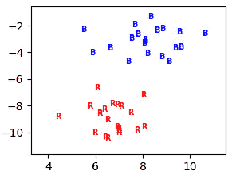

图 7.1 – R 点和 B 点的绘图

看起来你应该能够画一条直线来分隔两组，如果你能这样做，那么你可以用它来决定某个新点是否是 R 或 B 的实例。

对于如此简单的情况，有许多找到这样一条线的方法。一种方法是为两组找到**凸包**（Graham，1972）——即包括它们的 polygons。可视化这种方法的简单方式是，从集合中的最左端点作为起点。然后，你应该从那里选择最顺时针的点，并将其设置为列表中的下一个点，然后再次用那个点做同样的事情，直到你回到起点。

要了解如何从一个给定的起点选择最顺时针的点，请考虑这里显示的两个图表：

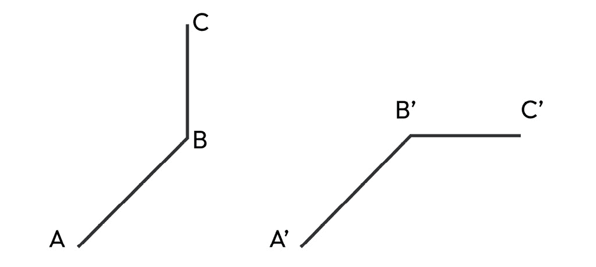

图 7.2 – 逆时针和顺时针转向

在左侧图中，从 A 到 B 的斜率比从 B 到 C 的斜率平缓，这意味着如果你想从 A 到 B 到 C，你到达 B 时必须逆时针转向，这反过来又意味着 C 比 B 更远离 A。在右侧图中，从 A' 到 B' 的斜率比从 B' 到 C' 的斜率更陡，这意味着 C' 比 B' 更远离 A'。因此，为了判断 C 比 B 更远离 A 还是更近，我们需要计算连接它们的线的斜率，并看哪条更陡：从 A 到 C 的线的斜率是 (C[1]-A[1])/(C[0]-A[0])，同样对于连接 A 和 B 的线也是如此，所以如果 (C[1]-A[1])/(C[0]-A[0]) > (B[1]-A[1])/(B[0]-A[0])，则 C 比 B 更远离 A。重新排列这个公式，我们得到 `ccw`，如下所示：

```py
def ccw(a, b, c):    return (b[1]-a[1])*(c[0]-b[0]) < (b[0]-a[0])*(c[1]-b[1])
```

然后，我们可以使用这个算法来找到凸包。我们按点的 *Y* 和 *X* 坐标对点进行排序，这使我们能够找到最低点 `p`（如果有平局，则选择最左边的点）。这个点必须位于凸包上，因此我们将其添加到凸包中。然后，我们从点的列表中选择下一个项目 `q`（如果 `p` 是最后一个点，则回到列表的开始 – 如果 `p` 是 `n`，则 `(p+1)%n` 将为 0，否则为 `p+1`）。现在，我们从 `q` 开始遍历整个点的列表，使用 `ccw` 来判断从 `p` 到 `i` 到 `q` 是否满足之前给出的约束：如果满足，则 `i` 比 `q` 更远离 `p`，因此我们用 `i` 替换 `q`。在这个过程中，我们知道 `q` 是从 `p` 最远离的点，因此我们将其添加到凸包中并继续。

该算法的复杂度为 *o(H*N)*，其中 *H* 是凸包的大小，*N* 是点的总数 – *H* 因为主循环在添加每个迭代一个项目后终止，构建了凸包，*N* 因为在主循环的每次遍历中，我们必须查看每个点以找到最远离的点。在某些情况下，存在更复杂的算法，其效率高于此，但这里给出的算法对于我们的目的来说已经足够高效：

```py
def naiveCH(points):    points.sort()
    p = 0
    hull = []
    while True:
        # Add current point to result
        hull.append(points[p])
        # Pick the next point (or go back to the beginning
        # if p was the last point)
        q = (p + 1) % n
        for i in range(len(points)):
    # If i is more counterclockwise
    # than current q, then update q
           if(ccw(points[p], points[i], points[q])):
                q = i;
    # Now q is the most counterclockwise with respect to p
    # Set p as q for next iteration, so that q is added to 'hull'
          p = q
    # Terminate when you get back to that start and close the loop
          if(p == 0):
              hull.append(points[0])
              break
    return hull
```

下图说明了该算法在我们示例中围绕 B 点集的进展情况：

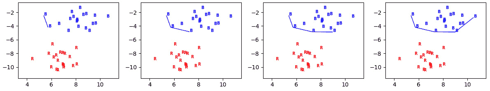

图 7.3 – 为 B 增长凸包

存在更多用于生长船体的有效算法（参见 `scipy.spatial.ConvexHull`：[`docs.scipy.org/doc/scipy/reference/generated/scipy.spatial.ConvexHull.xhtml`](https://docs.scipy.org/doc/scipy/reference/generated/scipy.spatial.ConvexHull.xhtml)），但这个算法易于理解。我们用它来计算 R 和 B 的凸包：

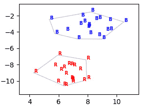

图 7.4 – B 和 R 的凸包

如果有任何线可以分隔 R 和 B（如果它们是**线性可分**的），那么凸包的至少一个段必须是。如果我们选择 B 的凸包上离 R 的凸包上某条边最近的边，我们可以看到它是一个分隔符——所有的 B 项目都在虚线橙色线以上或在其上，同样，所有的 R 项目都在虚线绿色线以下或在其以下：

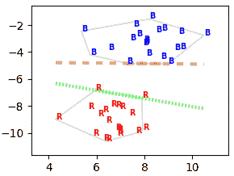

图 7.5 – 作为 R 和 B 候选分隔符的边界段

但它们并不是很好的分隔符。所有刚好低于虚线橙色线的项目都会被分类为 R，即使它们只是刚好低于这条线，因此它们比 R 更接近 B；并且所有刚好高于虚线绿色线的项目都会被分类为 B，即使它们只是刚好高于它。

因此，我们希望找到一种方法来找到一个分隔符，可以适当地处理介于这两条极端线之间的案例。我们可以通过找到一条线（虚线灰色线）从一条段的最接近点到另一条（另一条段）来做到这一点，然后在这条线的中间和垂直于这条线的地方画我们的分隔符（实线黑色线）：

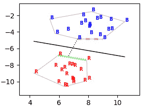

图 7.6 – R 和 B 的最佳分隔符

实线黑色线是一个最佳分隔符，因为它使得两组之间的分离尽可能大：每个组中离线最近的点的距离尽可能大，因此任何落在它上面的未观察到的点将被分配到 B，这是它最好的去处，任何落在它下面的点将被分配到 R。

这正是我们想要的。不幸的是，如果有些点是异常值——也就是说，如果有些 R 点落在 B 点的主体内或有些 B 点落在 R 点的主体内，那么一切都会出错。在以下示例中，我们切换了两个点，使得有一个 B 点位于 R 点的左上角附近，有一个 R 点位于 B 点的底部附近：

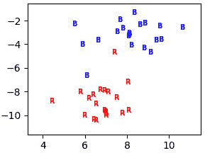

图 7.7 – 一个 R 点和一个 B 点被切换

两组的凸包现在重叠，不能合理地用于寻找分隔符：

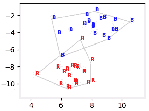

图 7.8 – 带有异常值的凸包

我们可以尝试识别异常值并将它们从其组中排除，例如，通过找到整个组的质量中心，标记为黑色椭圆，如果它离另一个组的质量中心更近，则从其中移除一个点：

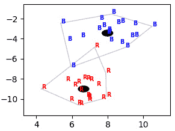

图 7.9 – 两组的重心

很明显，异常点更接近“错误”组的质心，因此可以在尝试找到分隔符时识别并移除它们。如果我们都移除它们，我们就会得到非重叠的凸包。分隔符没有将异常点放在“正确”的一侧，但那时任何直线都无法做到这一点——任何包含异常 R 和其他 R 的直线都必须包含异常 B，反之亦然：

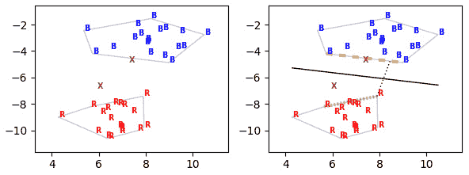

图 7.10 – 忽略两个异常点（棕色 X 被忽略）的非重叠凸包和分隔符

然而，我们也可以通过只忽略其中一个来得到非重叠的凸包：

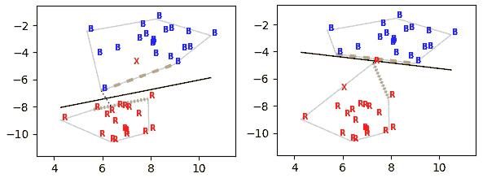

图 7.11 – 忽略 R（左）和 B（右）异常点的非重叠凸包和分隔符

这次，我们在计算凸包时只忽略一个异常点。在每种情况下，我们都得到两个非重叠的凸包和一个分隔符，但这次，我们使用了更多的原始数据点，只有一个点落在线的错误一侧。

哪个更好？在尝试找到分隔符时使用更多的数据点，让更多的数据点落在线的右侧，还是最小化线与两个集合中点之间的总距离？如果我们决定忽略一个点，我们应该选择哪一个（*图 7.11*顶部的分隔符比底部的更好吗）？左下角的 B 点是不是 B 的正常成员，还是它是异常点？如果我们没有 R 的异常点，那么就永远不会有任何理由怀疑这个确实是 B。

我们需要了解每个问题的重要性，然后我们必须优化我们的点选择以获得最佳结果。这使它成为一个优化算法，其中我们通过连续改变点的集合来尝试优化先前给出的标准——包含多少个点，分隔线与最近点有多接近，以及在最一般的情况下，定义分隔线的方程应该是什么（有一些技巧可以允许圆形或曲线分隔线，或者允许分隔线稍微弯曲）。如果分隔线是直的——也就是说，类别是线性可分的——那么对于二维情况，线将有一个如的方程。当我们移动到三维时，分隔线变成一个如的平面。当我们移动到更高的维度时，它变成一个**超平面**，其方程如![<mml:math  ><mml:mi>A</mml:mi><mml:mn>1</mml:mn><mml:mi mathvariant="normal">*</mml:mi><mml:mi>x</mml:mi><mml:mn>1</mml:mn><mml:mo>+</mml:mo><mml:mi>A</mml:mi><mml:mn>2</mml:mn><mml:mi mathvariant="normal">*</mml:mi><mml:mi>x</mml:mi><mml:mn>2</mml:mn><mml:mo>+</mml:mo><mml:mo>.</mml:mo><mml:mo>.</mml:mo><mml:mo>.</mml:mo><mml:mo>+</mml:mo><mml:mi>A</mml:mi><mml:mi>n</mml:mi><mml:mi mathvariant="normal">*</mml:mi><mml:mi>x</mml:mi><mml:mi>n</mml:mi><mml:mo>+</mml:mo><mml:mi>B</mml:mi><mml:mo>=</mml:mo><mml:mn>0</mml:mn><mml:mo>.</mml:mo></mml:math>](img/17.png)

我们用于说明目的的简单程序不足以处理所有这些问题。我们将希望与非常高维的空间一起工作，在大多数情况下，大多数维度都是零。幸运的是，有许多高效的实现可供我们使用。我们将使用来自`sklearn.svm`的 Python `LinearSVC`实现——Python 中还有许多其他实现，但`sklearn`包通常很稳定，并且与其他`sklearn`部分很好地集成，而且`LinearSVC`已知特别适用于大型稀疏线性任务。

# 使用支持向量机进行情感挖掘

我们现在已经看到 SVM 如何通过找到将数据分离成类别的超平面来提供分类器，并看到了即使数据不是线性可分时如何找到这样的超平面的图形解释。现在，我们将探讨如何将 SVM 应用于我们的数据集以找到情感之间的边界，分析它们在单标签和多标签数据集上的行为，并对如何提高多标签数据集上的性能进行初步研究。

## 应用我们的 SVM

与之前的分类器一样，我们可以通过以下初始化代码定义`SVMCLASSIFIERs`类作为`SKLEARNCLASSIFIER`的子类（`useDF`是一个标志，用于决定在构建训练集时是否使用来自*第五章**，情感词典和向量空间模型*的 TF-IDF 算法；`max_iter`设置 SVM 算法应执行的迭代次数的上限——在我们的例子中，分数通常在 2,000 步时收敛，所以我们通常将其作为限制）：

```py
    def __init__(self, train, args={"useDF":True}):        self.readTrainingData(train, args=args)
        # Make an sklearn SVM
        self.clsf = sklearn.svm.LinearSVC(max_iter=2000)
        # Get it to learn from the data
        self.clsf.fit(self.matrix, self.values)
```

这与`NBCLASSIFIERS`的构造函数非常相似——只需使用`readTrainingData`将数据格式化，然后使用`sklearn`实现来构建 SVM。

如同往常，我们首先将此方法应用于我们的标准数据集：

|  | 精确率 | 召回率 | 微平均 F1 | 宏平均 F1 | Jaccard |
| --- | --- | --- | --- | --- | --- |
| **SEM4-EN** | **0.916** | **0.916** | **0.916** | **0.916** | **0.845** |
| SEM11-EN | 0.620 | 0.260 | 0.366 | 0.372 | 0.224 |
| **WASSA-EN** | **0.870** | **0.870** | **0.870** | **0.870** | **0.770** |
| CARER-EN | 0.870 | 0.870 | 0.870 | 0.870 | 0.770 |
| IMDB-EN | 0.848 | 0.848 | 0.848 | 0.848 | 0.736 |
| **SEM4-AR** | **0.679** | **0.679** | **0.679** | **0.679** | **0.514** |
| SEM11-AR | 0.586 | 0.255 | 0.356 | 0.367 | 0.216 |
| KWT.M-AR | 0.781 | 0.767 | 0.774 | 0.778 | 0.631 |
| SEM4-ES | 0.592 | 0.574 | 0.583 | 0.494 | 0.412 |
| SEM11-ES | 0.493 | 0.295 | 0.369 | 0.372 | 0.226 |

图 7.12 – SVM 应用于标准数据集

基本 SVM 为我们带来了迄今为止 WASSA 和两个 SEM4 数据集的最佳分数，对于大多数其他数据集的分数也接近我们迄今为止获得的最佳分数。与之前的算法一样，如果我们使用标准设置，它在多标签问题上的表现非常差，仅仅是因为返回确切一个标签的算法无法处理具有零个或多个标签的项目集。

训练 SVM 比我们迄今为止看到的任何分类器都要长得多。因此，简要地看一下随着训练数据大小的变化，CARER 的准确性和训练时间如何变化是值得的——如果我们发现更多的数据对准确性影响不大，但会使训练时间大大增加，我们可能会决定获取更多数据不值得麻烦。

当我们将准确率（因为没有任何空类，召回率和宏平均及微平均 F 度量值都相同）和 Jaccard 分数与训练集的大小进行对比时，我们发现我们不需要整个数据集——这两个度量值相当快地趋于一致，而且如果有什么的话，性能在一段时间后开始下降：

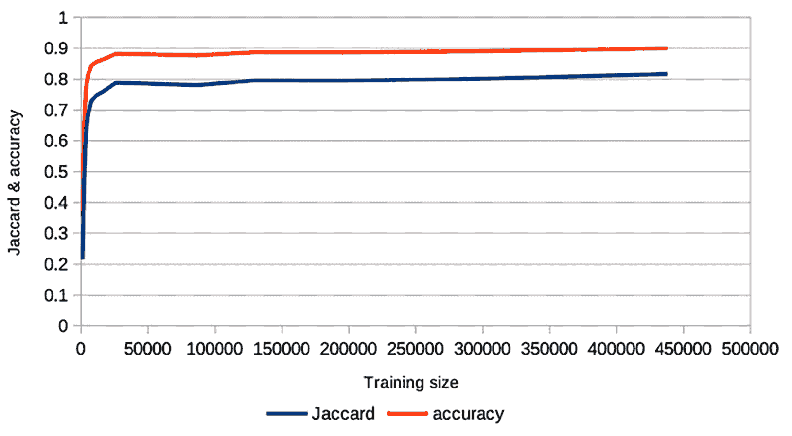

图 7.13 – SVM 的准确率与训练数据大小的关系

在大约 30K 条推文之后性能的下降可能只是噪声，也可能是过拟合的结果——随着机器学习算法看到越来越多的数据，它们可以开始注意到训练数据中特有的东西，而这些东西在测试数据中并不存在。无论如何，性能显著优于我们在*第五章*和*第六章*中看到的所有内容，并且似乎在约 0.89 的准确率和 0.80 的 Jaccard 分数上趋于平稳。

我们还绘制了训练时间与数据大小的关系图，以查看如果我们能获得更多数据，是否可行运行它，时间大致与数据大小呈线性增长（这类问题通常有这种报道）。然而，由于准确率已经在约 40K 时趋于平稳，因此增加更多数据似乎不会产生任何影响：

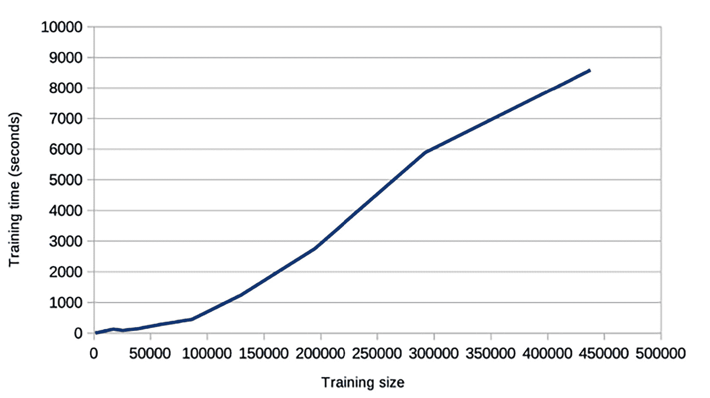

图 7.14 – SVM 的训练时间与数据大小的关系

注意

任何分类器在拥有任何数量的数据后，其准确率都必须在达到 1 之前趋于平稳。大多数可以轻易拟合到如图所示（例如，多项式曲线）的图表中的曲线，随着 X 值的增加而持续增加，因此它们只能是对真实曲线的近似，但它们确实让你对增加训练数据量是否值得有一个印象。

### 对无标签推文和有多个标签的推文数据集进行的实验

为什么标准支持向量机（SVM）在多标签数据集上的表现比大多数其他情况都要差得多？

SVMs（支持向量机）和其他任何标准分类器一样，旨在将每个项目分配到单个类别。训练集中的每个点都有一组特征和标签，学习算法会找出特征和标签之间的联系。将这种方法适应包括某些点没有标签的数据相当直接，只需说有一个额外的标签，比如中性、以上皆非，或者类似的东西，当某个点没有给出标签时使用。这是一种稍微有些人为的方法，因为它意味着分类器找到与没有情绪相关的单词，而实际情况是，这样的点根本没有任何带有情感重量的单词。然而，这通常效果不错，并且可以被纳入标准的 SVM 训练算法（*第六章*，*朴素贝叶斯*中显示的`onehot2value`的定义允许这种情况）。

SEM11 和 KWT.M-AR 示例属于更难、也许更现实的类别问题，其中一条推文可能表达零个或多个情绪。SEM11-EN 测试集中的第二条推文，“我正在做这一切以确保你对我微笑，兄弟”，表达了快乐、爱和乐观这三种情绪，而倒数第二条，“# ThingsIveLearned 聪明的牧羊人永远不会把羊群托付给一个微笑的狼。# TeamFollowBack # fact # wisewords”，与之没有关联的情绪。

由于可能的情绪集合[‘愤怒’，‘期待’，‘厌恶’，‘恐惧’，‘快乐’，‘爱’，‘乐观’，‘悲观’，‘悲伤’，‘惊讶’，‘信任’]，将这些情绪编码为向量是足够的：我们用[0, 0, 0, 0, 1, 1, 1, 0, 0, 0, 0]表示快乐、爱和乐观，用[0, 0, 0, 0, 1, 0, 1, 0, 0, 0, 0]表示没有情绪。*但是这些不是独热编码*，`onehot2value`无法正确处理它们。特别是，它将[0, 0, 0, 0, 1, 1, 1, 0, 0, 0, 0]解释为快乐，因为这是它遇到的第一个非零项。

没有简单的解决办法——SEM11 数据具有多种情绪，而 SVMs 期望单一的情绪。这有两个后果。在训练期间，只会使用与推文相关联的情绪中的一个——如果前面的例子发生在训练期间，它会导致单词*smiling*和*bro*（这是这条推文中唯一的低文档频率单词）与快乐相关联，而不是与爱和乐观相关联，这可能导致较低的精确度和较低的召回率；如果在测试期间发生，那么不可避免地会导致召回率的损失，因为只能返回三个中的一个。这在前面的结果中得到了证实，特别是 SEM11-EN 在*第六章*，*朴素贝叶斯*中，它的召回率很好，但精确度较差。

本章前面关于 SVM 工作原理的插图显示了一个双分类问题——Rs 和 Bs。有两种明显的方法可以处理扩展到多分类问题（如 CARER 和 WASSA 数据集）。假设我们有 Rs、Bs 和 Gs。我们可以训练三个双分类器，一个用于 R 对 B，一个用于 R 对 G，一个用于 B 对 G（**一对多**），然后组合结果；或者，我们可以训练另一组双分类器，一个用于 R 对（B 或 G），一个用于 B 对（R 或 G），一个用于 G 对（R 或 B）（**一对多**）。两者都给出相似的结果，但当有大量类别时，你必须训练 N*(N+1)/2 个分类器（N 为第一个类别与剩余每个类别的组合 + N-1 为第二个类别与剩余每个类别的组合 + ...）用于一对多，但只有 N 用于一对多。例如，对于有六个类别的 CARER，我们不得不训练 21 个分类器并将它们的结果组合起来用于一对多，而对于一对多，我们只需要训练六个分类器并将它们的结果组合起来。

由于所有数据集都有几种可能的输出，我们需要为所有数据集遵循以下策略之一。幸运的是，`sklearn.svm.LinearSVC`会自动（使用一对多）为存在一系列可能标签的问题执行此操作。然而，仅此并不能解决多标签数据集的问题——从几个选项中抽取一个标签的输出与从几个选项中抽取未知数量标签的输出是有区别的。标准的多分类器，它们被组合为一对一或一对多，将解决第一个问题但不会解决第二个问题。

我们有两种方法可以将我们的 SVM 分类器适应这个问题：

+   我们可以遵循与朴素贝叶斯分类器相同的策略，即对每个情感的真实值得分进行训练，并使用阈值来确定推文是否满足每个情感。

+   我们可以训练多个分类器，采用一对多的风格，并简单地接受它们中的每一个的结果。在前面的例子中，如果 R 对（B 或 G）分类器说 R，那么我们接受 R 作为测试案例的一个标签；如果 B 对（R 或 G）说 B，那么我们也接受它**同样**。

我们将在接下来的两个部分中依次探讨这些问题。

## 使用带有阈值的标准 SVM

要使用朴素贝叶斯处理多标签数据集，我们像这样修改了`applyToTweet`：

```py
    def applyToTweet(self, tweet):        tweet = tweets.tweet2sparse(tweet, self)
        # use predict_log_proba
        p = self.clsf.predict_log_proba(tweet)[0]
        # compare to previously defined threshold
        threshold = numpy.log(self.threshold)
        return [1 if i > threshold else 0 for i in p]
```

之前的代码使用了`predict_log_proba`为每个标签返回一个值的事实。在朴素贝叶斯的常规版本中，我们只为每个案例选择得分最高的标签，但使用阈值允许我们选择任意数量的标签，从 0 开始。

这对于 SVM 来说不太适用，因为它们没有名为`predict_log_proba`的方法。它们所拥有的方法是名为`decision_function`的方法，它为每个标签生成一个分数。我们不是将`applyToTweet`的定义改为使用`decision_function`而不是`predict_log_proba`，而是在 SVM 的构造函数中简单地将`predict_log_proba`的值设置为`decision_function`，然后使用`applyToTweet`，就像我们之前做的那样。因此，我们必须调整 SVM 的构造函数，如下所示：

```py
    def __init__(self, train, args={}):        self.readTrainingData(train, args=args)
        # Make an sklearn SVM
        self.clsf = sklearn.svm.LinearSVC(max_iter=2000)
        # Get it to learn from the data
        self.clsf.fit(self.matrix, self.values)
        # Set its version of predict_proba to be its decision_function
        self.clsf.predict_proba = self.clsf.decision_function
        # and set its version of weights to be its coefficients
        self.weights = self.clsf.coef_
```

换句话说，一旦我们制作了底层的 SVM，我们必须设置一些我们将发现有用的标准属性，这些属性在所有`sklearn`分类器中名称并不相同。对于多标签情况的结果如下：

|  | **精确度** | **召回率** | **微观 F1** | **宏观 F1** | **Jaccard** |
| --- | --- | --- | --- | --- | --- |
| SEM11-EN | 0.511 | 0.328 | 0.399 | 0.387 | 0.249 |
| SEM11-AR | 0.521 | 0.290 | 0.373 | 0.361 | 0.229 |
| KWT.M-AR | 0.135 | 0.694 | 0.227 | 0.131 | 0.128 |
| SEM11-ES | 0.434 | 0.338 | 0.380 | 0.361 | 0.235 |

图 7.15 – 使用阈值处理多标签问题的 SVM

SEM11 案例比我们之前查看的简单 SVM 更好，但并不比我们使用早期算法获得的分数更好，而 KWT.M-AR 的分数比简单 SVM 更差。仅仅使用 SVM 为每个标签分配的决策函数值并不能解决多标签数据集的问题。我们将把使用每个标签的值集加上阈值的 SVM 称为 SVM（多）分类器。

## 制作多个 SVM

第二种选择是制作一系列一对多分类器，并接受所有相关分类器成功的标签。关键是依次处理每个标签，并将训练数据中的*N*个标签压缩成两个——一个用于目标标签，一个用于所有其他标签。考虑一个被标记为快乐的推文。这个推文作为向量的表示将是[0, 0, 0, 0, 1, 0, 0, 0, 0, 0, 0]——也就是说，在快乐这一列中有一个 1。如果我们将其压缩为快乐与剩余标签的对立，那么它将输出为[1, 0]——也就是说，在新列中快乐这一列有一个 1，而在非快乐这一列中有一个 0。如果我们将其压缩为愤怒与非愤怒的对立，那么它将是[0, 1]，在新列中愤怒这一列有一个 0，而在非愤怒这一列中有一个 1。如果它被标记为快乐和爱，那么向量将是[0, 0, 0, 0, 1, 1, 0, 0, 0, 0, 0]，压缩后的版本将是[1, 1]：第一列中的 1 因为它确实表达了快乐，第二列中的 1 因为它*也*表达了其他东西。

假设我们有一个向量，`gs`，它代表了一个多标签推文的情感，并且我们想要在`I`列上压缩它。第一列很简单——我们只需将其设置为`gs[i]`。要得到第二列，它代表除了`I`列之外的某些列是否非零，我们使用`numpy.sign(sum(gs[:i]+gs[i+1:]))`：`gs[:i]`和`gs[i+1:]`是其他列。它们的和如果至少有一个非零，则将大于 0，而取其符号，如果和为 0，则符号为 0，如果大于零，则符号为 1。请注意，`gs[i]`和`numpy.sign(sum(gs[:i]+gs[i+1:]))`都可能是`0`，同时它们也可能是`1`：

```py
def squeeze(train, i):# Collapse the Gold Standard for each tweet so that we just
# have two columns, one for emotion[i] in the original and
# one for the rest.
    l = []
    for tweet in train.tweets:
        # now squeeze the Gold Standard value
        gs = tweet.GS
        scores=[gs[i], numpy.sign(sum(gs[:i]+gs[i+1:]))]
        tweet = tweets.TWEET(id=tweet.id, src=tweet.src,
                             text=tweet.text, tf=tweet.tf,
                             scores=scores,
                             tokens=tweet.tokens,
                             args=tweet.ARGS)
        l.append(tweet)
    emotion = train.emotions[i]
    emotions = [emotion, "not %s"%(emotion)]
    return tweets.DATASET(emotions, l, train.df,
                          train.idf, train.ARGS)
```

`MULTISVMCLASSIFIER`的构造函数很简单——只需为每个情感创建一个标准的`SVMCLASSIFIER`。要将其中一个应用于推文，我们必须应用每个标准的，并收集正面的结果。所以，如果训练在快乐与不快乐之间的分类器说某个推文表达了快乐，那么我们就标记这个推文为满足快乐，但我们忽略它关于不快乐的描述，因为不快乐的正分只告诉我们推文也表达了其他某种情感，而我们允许推文表达多种情感：

```py
    def applyToTweet(self, tweet):        k = [0 for i in self.train.emotions]
        for i in self.classifiers:
            c = self.classifiers[i]
            p = c.clsf.predict(tweets.tweet2sparse(tweet, self))[0]
            """
            if classifier i says that this tweet expresses
            the classifier's emotion (i.e. if the underlying
            SVM returns 0) then set the ith column of the
            main classifier to 1
            """
            if p == 0:
                k[i] = 1
        return k
```

这基本上是标准的一个对多个方法来训练具有多个标签的 SVM。关键的区别在于如何组合单个*X*与不-*X*分类器的结果——我们接受*所有*正面的结果，而标准方法只接受一个。

下表是使用 SVM（多）的多标签问题的表的重复，用于比较：

|  | **精确度** | **召回率** | **微观 F1** | **宏观 F1** | **Jaccard** |
| --- | --- | --- | --- | --- | --- |
| SEM11-EN | 0.511 | 0.328 | 0.399 | 0.387 | 0.249 |
| SEM11-AR | 0.521 | 0.290 | 0.373 | 0.361 | 0.229 |
| KWT.M-AR | 0.135 | 0.694 | 0.227 | 0.131 | 0.128 |
| SEM11-ES | 0.434 | 0.338 | 0.380 | 0.361 | 0.235 |

图 7.16 – 多标签数据集，SVM（多）

当我们使用多个 SVM 时，每个标签一个，我们会在每个情况下得到改进，其中 SEM11-EN 的得分目前是最好的：

|  | **精确度** | **召回率** | **微观 F1** | **宏观 F1** | **Jaccard** |
| --- | --- | --- | --- | --- | --- |
| **SEM11-EN** | **0.580** | **0.535** | **0.556** | **0.529** | **0.385** |
| SEM11-AR | 0.531 | 0.485 | 0.507 | 0.478 | 0.340 |
| KWT.M-AR | 0.648 | 0.419 | 0.509 | 0.340 | 0.341 |
| SEM11-ES | 0.498 | 0.368 | 0.423 | 0.378 | 0.268 |

图 7.17 – 多标签数据集，多个 SVM

这比 SVM（多）案例的结果要好，并且是 SEM11-EN 迄今为止最好的结果。对于 SEM11 数据集的 SVM 改进来自于召回率的巨大提升。记住，标准的 SVM 只能对每个数据点返回一个结果，所以当黄金标准包含多个情感时，它的召回率*必须*很差——如果一个推文有三个与之相关的情感，而分类器只报告一个，那么该推文的召回率是 1/3。KWT.M-AR 的改进来自于精度的提升——如果一个推文没有与之相关的情感，这在数据集中很常见，那么标准的 SVM 必须为它产生一个假阳性。

可以对`sklearn.svm.LinearSVC`进行多种调整，我们还可以尝试*第五章**，情感词典和向量空间模型*中的调整方法——例如，使用 IDF 获取特征值，这在整体上产生了一些小的改进。一旦你使用默认值获得了合理的结果，这些方法都值得一试，但尝试各种变体以在给定数据集上获得几个百分点的提升很容易让人沉迷。目前，我们只需注意，即使默认值在数据集中每条推文恰好有一个情感的情况下也能提供良好的结果，对于一些更困难的情况，多 SVM 提供了迄今为止最好的结果。

使用 SVM 可以很容易地被视为从语料库中提取带权重的词典的另一种方式。本章中使用的 SVM 的维度仅仅是词典中的单词，我们可以像*第五章**，情感词典和向量空间模型*中那样进行相同的操作——使用不同的分词器、词干提取和消除不常见的单词。我们在这里不会重复这些变体：从*第五章**，情感词典和向量空间模型*我们知道不同的组合适合不同的数据集，简单地运行所有变体不会告诉我们任何新的东西。然而，值得思考的是 SVM 如何使用它们分配给单个单词的权重。

例如，CARER 数据集的 SVM 具有一个 6 行 74,902 列的系数数组：6 行是因为这个数据集中有六个情感，75K 列是因为有 75K 个不同的单词。如果我们随机挑选一些单词，其中一些与某些情感相关，而一些几乎没有情感意义，我们会看到它们对各种情感的权重反映了我们的直觉：

|  | **anger** | **fear** | **joy** | **love** | **sadness** | **surprise** |
| --- | --- | --- | --- | --- | --- | --- |
| sorrow | -0.033 | -0.233 | 0.014 | 0.026 | 0.119 | 0.068 |
| scared | -0.508 | 1.392 | -1.039 | -0.474 | -0.701 | -0.290 |
| disgust | 1.115 | -0.293 | -0.973 | -0.185 | -0.855 | -0.121 |
| happy | -0.239 | -0.267 | 0.546 | -0.210 | -0.432 | -0.080 |
| 喜爱 | 0.000 | 0.000 | 0.412 | -0.060 | -0.059 | -0.000 |
| 和 | -0.027 | -0.008 | 0.001 | -0.008 | -0.020 | -0.004 |
| 这 | 0.001 | -0.012 | -0.004 | 0.001 | -0.002 | -0.002 |

图 7.18 – 单词与情感之间的关联，使用 SVM 作为分类器，基于 CARER 数据集

*悲伤*与**悲伤**紧密相连，*害怕*与**恐惧**紧密相连，*厌恶*与**愤怒**紧密相连，*快乐*与**喜悦**紧密相连，而*喜爱*与**喜悦**紧密相连（但有趣的是，并不与**爱**相连：单词总是带来惊喜）；中性词并不与任何特定的情感强烈相连。与*第六章**，朴素贝叶斯*中的词典不同之处在于，一些单词也强烈反对某些情感——如果你是*害怕*的，那么你就不是喜悦的，如果你是*快乐*的，那么你就不是愤怒的、恐惧的或悲伤的。

SVMs 使用这些权重进行分类的方式与*第六章**，朴素贝叶斯*相同，即如果你给定一个值向量 V = [v0, v1, ..., vn]和一组系数 C = [w0, w1, ..., wn]，那么检查`V.dot(C)`是否大于某个阈值，这正是我们在*第六章**，朴素贝叶斯*中处理权重时所做的事情（假设 V 和 C 在`sklearn.svm.LinearSVC`中是稀疏数组，这可能是一种相当快速的方式来计算这个和，但它仍然是同一个和）。唯一的区别在于 SVMs 获取权重的方式以及 SVM 可以为单词分配负权重。我们将在*第十章*，*多分类器*中返回处理多标签数据集的方法。现在，我们只需注意，SVMs 和简单的基于词典的方法最终会在相同的特征上使用相同的决策函数，但 SVMs 到达这些特征的权重的方式通常更好，在某些情况下要好得多。

# 摘要

*图 7.17*显示了迄今为止我们看到的最佳分类器，以及每个数据集的 Jaccard 分数：

|  | **LEX** | **CP (未分词)** | **CP (分词)** | **NB (单)** | **NB (多)** | **SVM (单)** | **SVM (多)** | **MULTI-SVM** |
| --- | --- | --- | --- | --- | --- | --- | --- | --- |
| SEM4-EN | 0.497 | 0.593 | 0.593 | 0.775 | 0.778 | *******0.845*** | 0.836 |  |
| SEM11-EN | 0.348 | 0.352 | 0.353 | 0.227 | 0.267 | 0.224 | 0.249 | *******0.385*** |
| WASSA-EN | 0.437 | 0.512 | 0.505 | 0.709 | 0.707 | *******0.770*** | 0.749 |  |
| CARER-EN | 0.350 | 0.414 | 0.395 | 0.776 | 0.774 | 0.770 | *******0.796*** |  |
| IMDB-EN | 0.667 | 0.721 | 0.722 | 0.738 | *******0.740*** | 0.736 | 0.736 |  |
| SEM4-AR | 0.509 | 0.493 | 0.513 | 0.531 | *******0.532*** | 0.514 | 0.494 |  |
| SEM11-AR | *******0.386*** | 0.370 | 0.382 | 0.236 | 0.274 | 0.216 | 0.229 | 0.340 |
| KWT.M-AR | 0.663 | *******0.684*** | 0.666 | 0.494 | 0.507 | 0.631 | 0.128 | 0.341 |
| SEM4-ES | *******0.420*** | 0.191 | 0.177 | 0.360 | 0.331 | 0.412 | 0.336 |  |
| SEM11-ES | 0.271 | 0.276 | *******0.278*** | 0.230 | 0.255 | 0.226 | 0.235 | 0.268 |

图 7.19 – 每个数据集的最佳分类器

如我们所见，不同的分类器与不同的数据集配合得很好。这里的主要教训是，你不应该仅仅接受存在一个最佳的分类算法：进行实验，尝试不同的变体，并亲自看看哪种算法对你的数据效果最好。还值得注意的是，多标签数据集（SEM11-EN、SEM11-AR、SEM11-ES 和 KWT.M-AR）在使用简单的 SVM 时得分非常低，唯一一个多 SVM 获胜的是 SEM11-EN，来自*第五章*的简单算法，*情感词典和向量空间模型*在其他情况下仍然产生最佳得分。

# 参考文献

要了解更多关于本章所涉及的主题，请查看以下资源：

+   Bennett, K. P., & Bredensteiner, E. J. (2000). *Duality and Geometry in SVM Classifiers*. Proceedings of the Seventeenth International Conference on Machine Learning, 57–64.

+   Boser, B. E., Guyon, I. M., & Vapnik, V. N. (1992). *A Training Algorithm for Optimal Margin Classifiers*. Proceedings of the Fifth Annual Workshop on Computational Learning Theory, 144–152\. [`doi.org/10.1145/130385.130401`](https://doi.org/10.1145/130385.130401).

+   Graham, R. L. (1972). *An efficient algorithm for determining the convex hull of a finite planar set*. Information Processing Letters, 1(4), 132–133\. [`doi.org/10.1016/0020-0190(72)90045-2`](https://doi.org/10.1016/0020-0190(72)90045-2).
