# 第八章：神经网络和深度神经网络

在*第七章*中，*支持向量机*，我们了解到**支持向量机**（**SVMs**）可以根据包含的单词对推文进行情感分类。我们还能使用什么仅仅查看现有单词的方法吗？在本章中，我们将考虑使用神经网络来实现这一目的。神经网络是一种通过为节点网络分配权重并传播一组初始值直到达到输出节点来执行计算的方法。输出节点的值将代表计算的结果。当神经网络在 20 世纪 40 年代被引入时，它们被设想为人类大脑执行计算的方式的模型（Hebb，1949 年）（McCulloch & Pitts，1943 年）。这种网络不再被认真视为人类大脑的模型，但有时通过这种方式可以实现的结果可以非常令人印象深刻，尤其是在输入和输出之间的关系难以确定时。一个典型的神经网络有一个**输入层**的节点、一组**隐藏层**和一个**输出层**，通常通过连接同一层或下一层的节点来实现。

我们将首先探讨没有隐藏层的简单神经网络的用途，并研究几个相关参数变化的影响。与第六章和第七章中的算法一样，神经网络的标准应用旨在为每个输入特征集产生一个单一值；然而，正如第六章中提到的朴素贝叶斯算法*第六章*，*朴素贝叶斯*通过为每个潜在的输出标签分配一个分数来实现这一点，因此我们可以轻松地将其适应于一条推文可以具有任意数量标签的情况。到本章结束时，你将清楚地了解神经网络如何执行计算，以及添加隐藏层如何使网络能够计算单隐藏层无法计算的功能。你还将了解它们如何用于为我们数据集中的推文分配标签。

在本章中，我们将涵盖以下主题：

+   单层神经网络及其作为分类器的应用

+   多层神经网络及其作为分类器的应用

# 单层神经网络

通常，一个神经网络由一组节点组成，这些节点按层组织，它们之间有连接。一个**简单神经网络**（**SNN**）仅仅有一个与分类所依据的特征相对应的输入层，以及一个与可能结果相对应的输出层。在最简单的情况下，如果我们只想知道某物是否属于指定的类别，将只有一个输出节点，但在我们的情况下，由于有多个可能的结果，我们将有多个输出节点。一个 SNN 看起来可能如下所示：

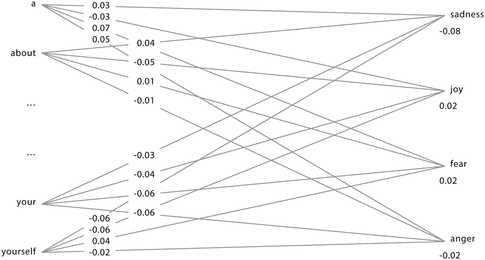

图 8.1 – 单层神经网络，其中输入是单词，输出是情感

节点之间的链接每个都有一个权重，并且不在输入层的每个节点都有一个偏差。权重和偏差本质上与方程中的权重和常数项相同，该方程我们用来定义*第七章*中的*支持向量机*的分隔超平面。

将此类网络应用于需要分类的推文非常简单：只需将推文中每个单词（每个**活动输入节点**）相关的权重相乘，计算这些权重的总和，并将其加到连接节点的偏差上：如果是正的，则将其设置为连接节点的激活；否则，将激活设置为 0。训练此类网络更具挑战性。基本思想是查看输出节点。如果一个输出节点正在执行训练数据所说的操作，那么就没有什么需要做的（毕竟，如果所有输出节点在所有训练数据上都按预期执行，那么分类器就会训练得尽可能好）。如果不是这样，那么进入它的连接中肯定有问题。有两种可能性：节点在应该关闭时打开，或者在应该打开时关闭。假设它在应该关闭时打开。它打开的唯一原因可能是从导致它的活动节点到它的链接上的权重总和大于其阈值，因此为了阻止它打开，这些链接上的权重都应该稍微减小。

同样，如果一个节点在应该开启时关闭，那么进入该节点的活动节点的权重应该略微增加。请注意，在这两种情况下，调整的是来自活动节点的链接——非活动节点不能帮助它们连接的节点开启，因此改变它们链接上的权重没有任何效果。权重应该增加或减少多少，以及何时进行这种变化，对结果的准确性和获得结果所需的时间有重大影响。如果你改变权重太多，这个过程可能无法收敛，或者可能收敛到一个次优配置；如果你改变得太少，那么收敛可能需要非常长的时间。这个过程通过逐渐改变权重来驱动网络重现训练数据，被称为**梯度下降**，反映了目标是在权重和阈值的空间中将网络向下移动以获得最小的总体误差。

在神经网络最初的演示中，这个过程是通过网络**反向传播**的，以便在输出层之前的层的连接上的权重也根据它们对输出的总体贡献进行调整，然后是之前的层，以此类推，直到达到输入层（Rumelhart 等人，1986 年）。对于具有许多隐藏层的网络，这样做可能会非常慢，早期层的变化非常小——有时几乎可以忽略不计。因此，神经网络的用途因此被限制在相当浅的网络，直到人们意识到可以通过训练一个具有 N-1 层的网络，然后添加另一个层并微调得到的网络来训练一个具有 *N* 个隐藏层的网络（Hinton 等人，2006 年）。这意味着你可以通过训练一个没有隐藏层的网络，然后在其输出层之前添加一个新层并重新训练这个网络（它有一个隐藏层），然后在其输出层之前添加另一个新层并重新训练这个网络（它有两个隐藏层），然后添加另一个新层，使用这个新层重新训练（它有三个隐藏层）。这种策略使得基于早期层捕获的泛化假设稳健，从而后来的错误不会对早期层产生重大影响，从而能够训练复杂的网络成为可能。

实现训练算法（一旦网络训练完成，实际应用只有一种方式）的策略有很多，同样，训练算法和将训练好的网络应用于任务的机制也有很多种。对于非常大的数据集，使用可以并行运行的实现可能是个好主意，但我们的数据稀疏性意味着`sklearn.neural_network.MLPClassifier`的实现可以在合理的时间内运行。我们不会尝试每个数据集上所有可能的特征组合。与 SVMs（尤其是）一样，有无数个设置和参数可以调整，很容易陷入尝试各种变体以期望获得几个百分点的改进的希望中。我们将研究一些更显著选择的影响，但我们将主要关注考虑特征的使用方式，而不是训练过程的细节。我们将从考虑一个 SNN（即只有一个输入层和一个输出层的神经网络，如*图 8**.1*所示）开始。

SNN 只是一个作为`SVMCLASSIFIER`子类的`DNNCLASSIFIER`（它们有几个共享属性，我们可以通过这样做来利用）。如果我们指定默认情况下`DNNCLASSIFIER`应该没有隐藏层，那么我们就有了 SNN 的构造函数。初始化代码遵循与其他`SKLEARNCLASSIFIER`（包括`SVMCLASSIFIER`）相同的模式——使用`readTrainingData`读取训练数据并将其放入标准格式，然后调用`sklearn`的分类算法实现并将其拟合到训练数据：

```py
class DNNCLASSIFIER(svmclassifier.SVMCLASSIFIER):    def __init__(self, train=None,
                 args={"hiddenlayers":()}):
       args0 = ARGS({"N":500, "wthreshold":5,
                      "useDF": False,
                      "max_iter":sys.maxsize,
                      "solver":"sgd", "alpha": 1e-5})
       for k in args:
            args0[k] = args[k]
       self.readTrainingData(train, N=args0["N"])
       # making a multi-layer classifier requires a
       # lot of parameters to be set
       self.clsf = MLPClassifier(solver=args["solver"],
                   alpha=args["alpha"],
                   max_iter=args["max_iter"],
                   hidden_layer_sizes=args["hiddenlayers"],
                   random_state=1)
       self.clsf.fit(self.matrix, self.values)
```

我们正在使用来自`sklearn`的`sklearn.neural_network.MLPClassifier`包。这个包接受大量参数，这些参数控制网络的形状以及权重计算和使用的方式。一如既往，我们不会进行实验来观察这些参数的变化如何影响我们任务上的性能。我们的目标是看看基本算法对我们来说效果如何，所以我们将主要使用这些参数的默认值。一旦我们确定了算法在一般情况下效果如何，可能值得调整参数，但由于所有这些算法的性能在很大程度上取决于数据集的性质，这可以留到以后再考虑。

与迄今为止的所有分类器一样，构造函数训练模型：基于 sklearn 的这些分类器，这总是涉及使用`readTrainingData`将数据转换为标准形式，创建指定类型的模型，并调用`self.clsf.fit(self.matrix, self.values)`来训练它。应用训练好的模型涉及应用从抽象`BASECLASSIFIER`类继承的`applyToTweets`方法，如*第五章*中所述，*情感词典和* *向量空间模型*。

在我们的数据集上尝试，我们得到以下结果。（CARER 的结果是通过在 440K 中的 70K 上训练获得的。训练神经网络比其他算法慢得多。我们将在稍后研究训练大小、准确性和时间之间的关系，但到目前为止，只需注意 CARER 数据集上的准确性似乎在 70K 左右开始趋于平稳，因此我们可以用它与其他算法进行比较）：

|  | **精确度** | **召回率** | **微观 F1** | **宏观 F1** | **Jaccard** |
| --- | --- | --- | --- | --- | --- |
| SEM4-EN | 0.902 | 0.902 | 0.902 | 0.902 | 0.822 |
| SEM11-EN | 0.648 | 0.275 | 0.386 | 0.388 | 0.239 |
| **WASSA-EN** | **0.837** | **0.837** | **0.837** | **0.837** | **0.720** |
| **CARER-EN** | **0.901** | **0.901** | **0.901** | **0.901** | **0.820** |
| IMDB-EN | 0.885 | 0.885 | 0.885 | 0.885 | 0.793 |
| SEM4-AR | 0.670 | 0.670 | 0.670 | 0.670 | 0.504 |
| SEM11-AR | 0.596 | 0.260 | 0.362 | 0.370 | 0.221 |
| KWT.M-AR | 0.035 | 0.126 | 0.055 | 0.034 | 0.028 |
| SEM4-ES | 0.541 | 0.472 | 0.504 | 0.409 | 0.337 |
| SEM11-ES | 0.484 | 0.290 | 0.362 | 0.361 | 0.221 |

图 8.2 – 应用于标准数据集的简单神经网络

在前表中，对于两个大型数据集的分数是目前为止最好的，但其他都略差于我们使用朴素贝叶斯和 SVMs 所达到的效果。提高此算法性能的明显方法是使用深度神经网络。深度神经网络已经在许多任务上显示出比简单神经网络（SNNs）更好的性能，因此有理由期待它们在这里也会有所帮助。然而，当你开始使用具有隐藏层的网络时，有大量的选项可以选择，在尝试添加隐藏层之前，查看非隐藏层版本如何处理所提供的数据是值得的。我们是否想要一个大小是输入层一半的隐藏层？我们是否想要 50 个大小为 15 的隐藏层？鉴于训练具有隐藏层的神经网络可能非常缓慢，在我们开始进行任何实验之前，考虑隐藏层想要做什么是一个好主意。

我们将首先研究参数变化的影响，例如训练数据的大小、输入特征的数量和迭代次数。即使是没有任何隐藏层的神经网络训练也可能相当缓慢（参见*图 8.3*），研究训练数据的变化如何影响训练时间和准确性是值得的：如果我们发现有一种方法可以在保持合理性能水平的同时减少训练时间，那么使用这种方法而不是完整的无限制训练集可能是有价值的。

我们可以观察三个明显的事情：

+   准确性和训练时间如何随着训练集的大小变化？

+   准确性和训练时间如何随着输入特征数量（即单词）的变化而变化？

+   准确度和训练时间是如何随着迭代次数变化的？

我们将从观察准确度（以 Jaccard 分数报告）和训练时间如何随着训练集大小变化开始。以下图表展示了 CARER 数据集（我们数据集中最大的一个）的这些数据，其他因素保持不变（仅使用最频繁的 10K 个单词，最多进行 1K 次迭代）：

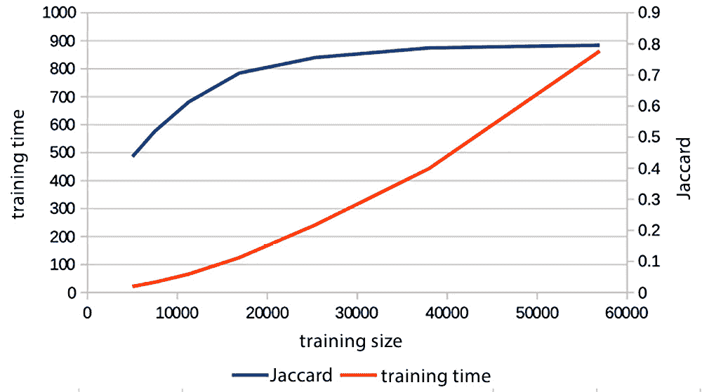

图 8.3 – Jaccard 分数和训练时间（以秒为单位）与 CARER-EN 数据集的训练大小对比

很明显，Jaccard 分数在大约 40K 条推文后趋于平稳，而训练时间似乎呈上升趋势。将曲线拟合到 Jaccard 图上并不容易——多项式曲线不可避免地会开始下降趋势，而对数曲线则不可避免地会在某个点增加到 1 以上——然而，简单的检查应该能给你一个合理的想法，即添加额外数据将停止产生性能的有用提升。

接下来要变化的是字典的大小。由于输入层由推文中出现的单词组成，移除不频繁出现的单词可能会加快速度，而对准确度的影响不大：


图 8.4 – Jaccard 分数和训练时间（以秒为单位）与 CARER-EN 数据集的字典大小对比

CARER-EN 数据集包含 16.7K 个单词，但 Jaccard 分数在大约 1K 到 2K 之间趋于平稳。由于训练时间随着输入特征数量的增加而或多或少呈线性增加，因此检查添加新单词对准确度影响甚微的点是有意义的。

我们可以变化的第三件事是迭代次数。神经网络训练涉及对权重和阈值进行一系列调整，直到无法实现进一步的改进。我们进行的迭代越多，训练时间越长，但准确度往往会在找到最佳结果之前开始趋于平稳。以下图表显示了 SEM4-EN 数据集随着迭代次数增加，训练时间和 Jaccard 分数的变化。在 1,800 次迭代后，该数据集没有进一步的改进，所以我们在这个点停止了绘图。不出所料，训练时间与迭代次数呈线性增长，而 Jaccard 分数在大约 1,400 次迭代时开始趋于平稳：

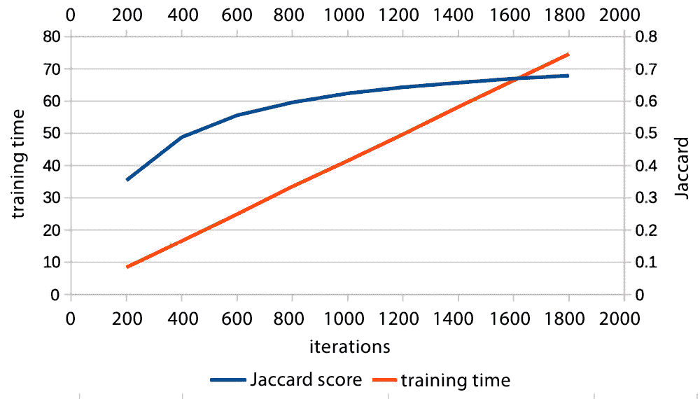

图 8.5 – Jaccard 分数和训练时间与迭代次数对比（SEM4-EN 数据集）

调整训练数据的大小、输入特征的数量和迭代次数会影响分数和训练时间。当你在开发模型并尝试不同的参数组合、设置和预处理步骤时，进行一些初步调查以找到使 Jaccard 分数似乎趋于平稳的这些因素的值无疑是值得的。但最终，你只能咬紧牙关，使用大量的训练数据、大型字典和大量的迭代来训练模型。

# 多层神经网络

我们已经看到，如果我们愿意等待，使用 SNN 至少在某些情况下可以产生比之前任何算法更好的结果。对于许多问题，添加额外的隐藏层可以比只有输入层和输出层的网络产生更好的结果。这能帮助我们当前的任务吗？

SNNs 计算的信息与朴素贝叶斯和 SVMs 计算的信息非常相似。输入节点和输出节点之间的链接携带了关于输入节点（即词汇）与输出节点（即情感）之间相关性有多强的信息，以及偏差大致携带了关于给定输出可能性有多大的信息。以下表格显示了在 CARER 数据集上训练后，几个常见词汇与情感之间的链接：

|  | **愤怒** | **恐惧** | **快乐** | **爱** | **悲伤** | **惊讶** |
| --- | --- | --- | --- | --- | --- | --- |
| 这 | -0.036 | -0.065 | 0.031 | 0.046 | -0.015 | 0.036 |
| 悲伤 | 0.002 | -0.028 | -0.098 | 0.098 | 0.063 | 0.020 |
| 害怕 | -0.356 | 1.792 | -0.683 | -0.283 | -0.562 | 0.057 |
| 快乐 | -0.090 | -0.161 | 0.936 | -0.332 | -0.191 | -0.156 |
| 讨厌 | 0.048 | -0.014 | -0.031 | -0.045 | 0.020 | -0.000 |
| 和 | -0.001 | -0.033 | 0.014 | 0.015 | -0.031 | 0.022 |
| 爱慕 | -0.054 | -0.034 | -0.110 | 0.218 | -0.085 | 0.007 |
| 激怒 | 1.727 | -0.249 | -0.558 | -0.183 | -0.621 | -0.124 |
| 吻 | -0.004 | -0.041 | -0.041 | 0.120 | -0.038 | -0.001 |

图 8.6 – CARER-EN 数据集中词汇与情感之间的联系

以下表格显示了与情感联系最强和最弱的词汇：

| 愤怒 | 愤怒、贪婪、匆忙、怨恨、自私 ... 热情、支持、奇怪、惊人、怪异 |
| --- | --- |
| 恐惧 | 不确定、犹豫、颤抖、不安全、脆弱 ... 惊吓、支持、甜蜜、紧张 |
| 快乐 | 自满、真诚、振奋、快乐、积极 ... 无助、焦虑、怪异、奇怪、压倒 |
| 爱 | 淫荡、同情、温柔、淘气、喜欢 ... 惊人、压倒、讨厌、奇怪、怪异 |
| 悲伤 | 负担、思乡、不安、腐烂、内疚 ... 甜蜜、焦虑、怪异、奇怪 |
| 惊讶 | 印象深刻、震惊、惊讶、好奇、好奇 ... 感觉、做、非常、存在、或 |

图 8.7 – CARER-EN 数据集中每种情感的强度和最弱词汇

给定一组输入词（一条推文！），神经网络计算这些词到每个情绪的链接总和，并将其与阈值进行比较（不同神经网络实现执行的计算略有不同：这里使用的，**修正线性激活**（Fukushima，1969）计算输入和偏差的加权和，但如果是负数则将其设置为零）。这与所有其他算法所做的是非常相似的——SVMs 也计算输入的加权和，但不会将负结果重置为零；基于词典的算法也只计算加权和，但由于没有负权重，总和不可能小于零，因此没有必要重置它们。朴素贝叶斯结合各种观察事件的条件概率来产生一个整体概率。它们共同的特点是单个词 *总是* 对总和做出相同的贡献。这并不总是正确的：

+   有些词的唯一任务就是改变其他词的含义。考虑一下 *happy* 这个词。这个词与 **喜悦** 相关联，而不是与其他任何情绪相关：

|  | **愤怒** | **恐惧** | **喜悦** | **悲伤** |
| --- | --- | --- | --- | --- |
| happy | -0.077 | -0.159 | 0.320 | -0.048 |

图 8.8 – SEM4-EN 中“喜悦”与四种情绪之间的链接

然而，当 *happy* 与 *not* 同时出现在推文中时，并不表达喜悦：

*这有点糟糕，但我的兄弟即将加入警察学院……而我并不高兴。而且我并不是* *唯一一个*.*

*Yay bmth canceled Melbourne show fanpoxytastic just lost a days pay and hotel fees not happy atm # sad #* *angry*

*我刚才被电话保持通话 20 分钟直到我挂断。# 不高兴 # 糟糕的服务 # 不高兴 @ virginmedia 我应该留下来……*

*not* 的存在并不改变这些推文的含义，以至于它们表达的不是喜悦。

并非所有影响其他词含义的词都像 *not* 那样容易识别，尤其是在非正式文本中，缩写词如 *don’t* 和 *can’t* 非常常见，但肯定还有其他词做类似的事情。还应注意，被修饰词的含义可能不会与修饰词相邻。

+   一些单词可以形成复合词，这些复合词表达的意义与单个单词孤立时的意义并不直接相关。我们之前在中文复合词中看到了这一点，但英语单词也可以这样做。使用点互信息来寻找复合词（如*第五章**，情感词典和向量空间模型*），我们发现 *supporting cast* 和 *sweet potatoes* 在 CARER-EN 数据集中比根据单个单词的分布预期出现的频率要高得多——也就是说，这些术语可以被视为复合词。以下表格给出了单个单词的权重，其中 *supporting* 和 *sweet* 都与 **爱** 有强烈的联系，与 **喜悦** 的联系则稍微弱一些。复合词本身并不预期会有这些联系——土豆本身并没有什么特别可爱或喜悦的地方！使用 SNN 或任何早期算法都无法捕捉到这些单词与 *cast* 和 *potatoes* 共现时对包含它们的文本整体情感电荷的不同贡献：

|  | **愤怒** | **恐惧** | **喜悦** | **爱** | **悲伤** | **惊讶** |
| --- | --- | --- | --- | --- | --- | --- |
| 支持性 | -0.183 | -0.154 | 0.220 | 0.515 | -0.319 | -0.043 |
| cast | -0.015 | 0.017 | -0.012 | 0.003 | 0.006 | -0.009 |
| 甜味 | -0.177 | -0.187 | 0.207 | 0.553 | -0.371 | -0.079 |
| 土豆 | -0.009 | 0.003 | 0.004 | 0.003 | -0.020 | -0.019 |

图 8.8 – 可以作为复合词出现的单个单词的权重

+   一些单词纯粹是模糊的，一个解释带有一种情感电荷，另一个解释则带有不同的情感电荷（或没有）。仅通过查看包含该单词的文本，很难检测到一个单词是否模糊，更不用说检测它有多少种解释了，即使你知道一个单词有多少种解释，你仍然必须决定在给定的文本中哪种解释是意图的。因此，推断每种解释的情感电荷并决定哪种解释是意图的几乎是不可行的。然而，在某些情况下，我们可以看到，就像之前的复合词案例一样，两个单词意外地经常共现，在这种情况下，我们可以合理地确信在每个情况下都意图了相同的解释。"Feel like" 和 "looks like" 例如，在 SEM4-EN 数据中比预期的出现频率要高：这两个词都可能具有歧义，不同的含义带有不同的情感电荷。但似乎非常可能，在每个 "feel like" 的出现中，"feel" 和 "like" 的相同解释被意图——实际上，这些短语中 "like" 的解释并不是与 **爱** 紧密相关的那个。 

我们迄今为止看到的所有算法，包括 SNN，都是原子性地处理单个单词的贡献的——它们都为每个单词和每种情绪计算一个分数，然后使用一些相当简单的算术计算来组合这些分数。因此，它们**不能**对这里提出的问题敏感。

在我们的神经网络中添加额外的层将使我们能够处理这些现象。添加层如何使神经网络能够计算 SNN 无法处理的内容的最简单示例是 XOR 函数，其中我们有两个输入，我们希望如果其中一个输入而不是两个都处于激活状态时，得到一个响应。

这不能用 SNN 来完成。我们将通过考虑一组由**爱**、**喜欢**、**仇恨**和**震惊**以及**愤怒**、**快乐**和**惊讶**组成的虚构推文来探讨这一原因，以及 DNN 如何通过考虑这些推文来克服这一限制，如图 8.9 所示：

| **ID** | **tweet** | **joy** | **anger** | **surprise** |
| --- | --- | --- | --- | --- |
| 1 | love | 1 | 0 | 0 |
| 2 | like | 1 | 0 | 0 |
| 3 | love like | 1 | 0 | 0 |
| 4 | hate | 0 | 1 | 0 |
| 5 | shock | 0 | 0 | 1 |
| 6 | love | 1 | 0 | 0 |
| 7 | like | 1 | 0 | 0 |
| 8 | love like | 1 | 1 | 0 |
| 9 | hate | 0 | 1 | 0 |
| 10 | shock | 0 | 0 | 1 |

图 8.9 – 直接的训练数据

如果我们在这些数据上训练一个 SNN，我们将得到以下网络：

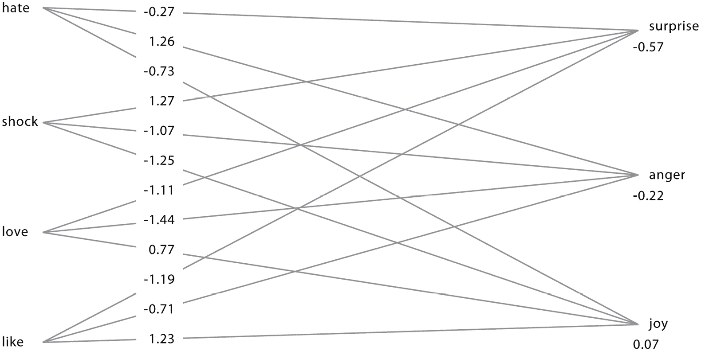

图 8.10 – 用于惊讶、愤怒和快乐的 SNN，以及直接的训练数据

从**仇恨**到**愤怒**的关联最强，从**震惊**到**惊讶**的关联最强，而从**爱**和**喜欢**到**快乐**的关联最强。因此，如果一条推文包含这些词中的任何一个，它将触发相应的情绪。如果一条推文同时包含**爱**和**喜欢**，它也会触发**快乐**，但训练数据并没有说明如果一条推文包含例如**震惊**和**喜欢**或**震惊**和**仇恨**，会发生什么。观察网络，我们可以看到**仇恨**对**愤怒**的投票相当强烈，而**震惊**对**惊讶**的投票大约相同，但**震惊**对**愤怒**的投票远比对**惊讶**的投票要强。因此，总的来说，**震惊**和**仇恨**投票给**惊讶**。这里并没有什么有意义的事情发生：网络是用随机值初始化的，这些随机值溢出到训练数据中未见过的特征配置的随机决策中。

如前所述，我们的 SNN 执行的操作本质上与 SVM 相同：如果一组输入节点与输出节点之间的权重![<mml:math  ><mml:mi>w</mml:mi><mml:mfenced separators="|"><mml:mrow><mml:msub><mml:mrow><mml:mi>N</mml:mi></mml:mrow><mml:mrow><mml:mn>1</mml:mn></mml:mrow></mml:msub><mml:mo>,</mml:mo><mml:mi>O</mml:mi></mml:mrow></mml:mfenced><mml:mo>,</mml:mo><mml:mo>.</mml:mo><mml:mo>.</mml:mo><mml:mo>.</mml:mo><mml:mo>,</mml:mo><mml:mi>w</mml:mi><mml:mfenced separators="|"><mml:mrow><mml:msub><mml:mrow><mml:mi>N</mml:mi></mml:mrow><mml:mrow><mml:mi>k</mml:mi></mml:mrow></mml:msub><mml:mo>,</mml:mo><mml:mi>O</mml:mi></mml:mrow></mml:mfenced></mml:math>](img/21.png)![<mml:math  ><mml:mi>w</mml:mi><mml:mfenced separators="|"><mml:mrow><mml:msub><mml:mrow><mml:mi>N</mml:mi></mml:mrow><mml:mrow><mml:mn>1</mml:mn></mml:mrow></mml:msub><mml:mo>,</mml:mo><mml:mi>O</mml:mi></mml:mrow></mml:mfenced><mml:mo>,</mml:mo><mml:mo>.</mml:mo><mml:mo>.</mml:mo><mml:mo>.</mml:mo><mml:mo>,</mml:mo><mml:mi>w</mml:mi><mml:mfenced separators="|"><mml:mrow><mml:msub><mml:mrow><mml:mi>N</mml:mi></mml:mrow><mml:mrow><mml:mi>k</mml:mi></mml:mrow></mml:msub><mml:mo>,</mml:mo><mml:mi>O</mml:mi></mml:mrow></mml:mfenced></mml:math>](img/22.png)以及输出节点的偏置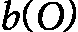，那么如果的输入值为 v(N 1), ..., v(N k)，那么输出节点的激发由![<mml:math  ><mml:mi>v</mml:mi><mml:mfenced separators="|"><mml:mrow><mml:msub><mml:mrow><mml:mi>N</mml:mi></mml:mrow><mml:mrow><mml:mn>1</mml:mn></mml:mrow></mml:msub></mml:mrow></mml:mfenced><mml:mo>×</mml:mo><mml:mi>w</mml:mi><mml:mfenced separators="|"><mml:mrow><mml:msub><mml:mrow><mml:mi>N</mml:mi></mml:mrow><mml:mrow><mml:mn>1</mml:mn></mml:mrow></mml:msub><mml:mo>,</mml:mo><mml:mi>O</mml:mi></mml:mrow></mml:mfenced><mml:mo>+</mml:mo><mml:mo>.</mml:mo><mml:mo>.</mml:mo><mml:mo>.</mml:mo><mml:mo>+</mml:mo><mml:mi>v</mml:mi><mml:mfenced separators="|"><mml:mrow><mml:msub><mml:mrow><mml:mi>N</mml:mi></mml:mrow><mml:mrow><mml:mi>k</mml:mi></mml:mrow></mml:msub></mml:mrow></mml:mfenced><mml:mo>×</mml:mo><mml:mi>w</mml:mi><mml:mfenced separators="|"><mml:mrow><mml:msub><mml:mrow><mml:mi>N</mml:mi></mml:mrow><mml:mrow><mml:mi>k</mml:mi></mml:mrow></mml:msub><mml:mo>,</mml:mo><mml:mi>O</mml:mi></mml:mrow></mml:mfenced><mml:mo>+</mml:mo><mml:mi>b</mml:mi><mml:mfenced separators="|"><mml:mrow><mml:mi>O</mml:mi></mml:mrow></mml:mfenced></mml:math>](img/25.png)![<mml:math  ><mml:mi>v</mml:mi><mml:mfenced separators="|"><mml:mrow><mml:msub><mml:mrow><mml:mi>N</mml:mi></mml:mrow><mml:mrow><mml:mn>1</mml:mn></mml:mrow></mml:msub></mml:mrow></mml:mfenced><mml:mo>×</mml:mo><mml:mi>w</mml:mi><mml:mfenced separators="|"><mml:mrow><mml:msub><mml:mrow><mml:mi>N</mml:mi></mml:mrow><mml:mrow><mml:mn>1</mml:mn></mml:mrow></mml:msub><mml:mo>,</mml:mo><mml:mi>O</mml:mi></mml:mrow></mml:mfenced><mml:mo>+</mml:mo><mml:mo>.</mml:mo><mml:mo>.</mml:mo><mml:mo>.</mml:mo><mml:mo>+</mml:mo><mml:mi>v</mml:mi><mml:mfenced separators="|"><mml:mrow><mml:msub><mml:mrow><mml:mi>N</mml:mi></mml:mrow><mml:mrow><mml:mi>k</mml:mi></mml:mrow></mml:msub></mml:mrow></mml:mfenced><mml:mo>×</mml:mo><mml:mi>w</mml:mi><mml:mfenced separators="|"><mml:mrow><mml:msub><mml:mrow><mml:mi>N</mml:mi></mml:mrow><mml:mrow><mml:mi>k</mml:mi></mml:mrow></mml:msub><mml:mo>,</mml:mo><mml:mi>O</mml:mi></mml:mrow></mml:mfenced><mml:mo>+</mml:mo><mml:mi>b</mml:mi><mml:mfenced separators="|"><mml:mrow><mml:mi>O</mml:mi></mml:mrow></mml:mfenced></mml:math>](img/26.png)决定，如果这个和是负的，输出节点的激发将是，如果是正的，则在一定程度上是正的。![<mml:math  ><mml:mi>v</mml:mi><mml:mfenced separators="|"><mml:mrow><mml:msub><mml:mrow><mml:mi>N</mml:mi></mml:mrow><mml:mrow><mml:mn>1</mml:mn></mml:mrow></mml:msub></mml:mrow></mml:mfenced><mml:mo>×</mml:mo><mml:mi>w</mml:mi><mml:mfenced separators="|"><mml:mrow><mml:msub><mml:mrow><mml:mi>N</mml:mi></mml:mrow><mml:mrow><mml:mn>1</mml:mn></mml:mrow></mml:msub><mml:mo>,</mml:mo><mml:mi>O</mml:mi></mml:mrow></mml:mfenced><mml:mo>+</mml:mo><mml:mo>…</mml:mo><mml:mo>+</mml:mo><mml:mi>v</mml:mi><mml:mfenced separators="|"><mml:mrow><mml:msub><mml:mrow><mml:mi>N</mml:mi></mml:mrow><mml:mrow><mml:mi>k</mml:mi></mml:mrow></mml:msub></mml:mrow></mml:mfenced><mml:mo>×</mml:mo><mml:mi>w</mml:mi><mml:mfenced separators="|"><mml:mrow><mml:msub><mml:mrow><mml:mi>N</mml:mi></mml:mrow><mml:mrow><mml:mi>k</mml:mi></mml:mrow></mml:msub><mml:mo>,</mml:mo><mml:mi>O</mml:mi></mml:mrow></mml:mfenced><mml:mo>+</mml:mo><mml:mi>b</mml:mi><mml:mfenced separators="|"><mml:mrow><mml:mi>O</mml:mi></mml:mrow></mml:mfenced></mml:math>](img/28.png)确定了一个将点分为两类或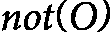的超平面，就像 SVM 中的系数一样。

但这意味着，如果类别不是线性可分的，SNN 就无法进行分类。这里的经典例子是 XOR 函数——也就是说，每个特征单独表示一个特定的类别，但两个特征组合在一起则不表示——即 *XOR(0, 0)=0*，*XOR(0, 1)=1*，*XOR(1, 0)=1*，和 *XOR(1, 1)=0*。画出这个函数并展示它看起来似乎没有线能分开 0 和 1 的情况是很容易的。在 *图 8**.11 中，红色圆圈（位于 (0, 0) 和 (1, 1)）代表 XOR 为 0 的情况，而蓝色钻石（位于 (1, 0) 和 (0, 1)）代表 XOR 为 1 的情况：

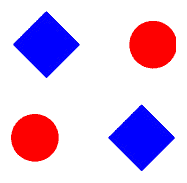

图 8.11 – XOR – 蓝色钻石和红色圆圈无法用直线分开

看起来似乎不可能画出一条线来将蓝色钻石和红色圆圈分开——也就是说，这两个类别看起来似乎不是线性可分的。

对于这个结论的正式证明，假设存在这样一条线。它将有一个类似于 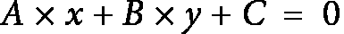 的方程，其中，对于任何位于线上的点，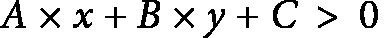 ，而对于任何位于线下的点，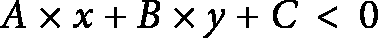 （如果 B 是正数，反之亦然）。

根据我们的四个点，假设红色圆圈都在线以下，蓝色菱形都在线以上，且 B 为正值。那么，对于位于(0, 0)的红色圆圈，我们会有，因为将*x*和*y*都设为 0 会得到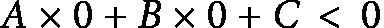)，这使得 C<0。同样地，对于位于(1, 1)的红色圆圈，将*x*和*y*都替换为 1 会得到，对于位于(1, 0)的蓝色菱形，将*x*替换为 1，将*y*替换为 0 会得到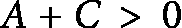，而对于位于(1, 0)的蓝色菱形，我们会得到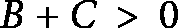。

从  和 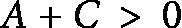，我们得到 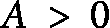，同样从  和 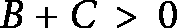，我们得到 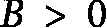。但随后 ，因此由于 ，那么 ，这与观察到的点 (1, 1) 处 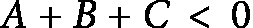 相矛盾。我们确实必须考虑蓝色菱形都在线上方，而红色圆圈都在下方的可能性，或者 B 是负数的可能性，但一个完全相同的论证以同样的方式排除了这些可能性——无法画出一条直线来区分蓝色菱形和红色圆圈。

这对我们任务意味着什么？假设我们调整我们的虚构数据如下：

| **ID** | **tweet** | **joy** | **anger** | **Surprise** |
| --- | --- | --- | --- | --- |
| 1 | love | 1 | 0 | 0 |
| 2 | like | 1 | 0 | 0 |
| 3 | love like | 0 | 1 | 0 |
| 4 | hate | 0 | 1 | 0 |
| 5 | shock | 0 | 0 | 1 |
| 6 | love | 1 | 0 | 0 |
| 7 | like | 1 | 0 | 0 |
| 8 | love like | 0 | 1 | 0 |
| 9 | hate | 0 | 1 | 0 |

图 8.12 – 难以训练的数据

我们唯一做的改变是，我们让包含*爱*和*喜欢*的推文表达**愤怒**而不是**快乐**。这与之前 XOR 的情况非常相似，其中两个特征在单独出现时表达一种情绪，而在一起出现时表达另一种情绪。没有与 XOR 的(0, 0)点完全相同的情况，但在两种特征都不存在的情况下，目标要么是**愤怒**（如果推文只是单词*恨*），要么是**惊讶**（如果推文只是单词*震惊*）——也就是说，当*爱*和*喜欢*都不存在时，推文不表达**快乐**。

当我们在这种数据上训练时，我们会发现 SNN 不能被依赖来找到分配正确情绪的权重。有时它做到了，有时没有。问题不在于没有一组权重可以分配正确的标签。在 90%训练/10%测试的 10 次折叠运行中，在两种情况下找到了正确分割数据的权重，但在另外八次中，分类器将*喜欢*和*爱*都包含的推文分配了错误的情绪。

在这里显示的错误训练的网络中，包含这两个单词的推文的快乐、愤怒和惊讶的分数分别为 0.35、-0.25 和-3.99，快乐是明显的赢家。数据*是*线性可分的，因为正确训练的分类器通过使用由连接权重和偏差定义的超平面将数据正确地分为正确的类别；然而，梯度下降过程很容易陷入局部最小值，在单词推文上做到最好，但无法找到复合词的正确权重：

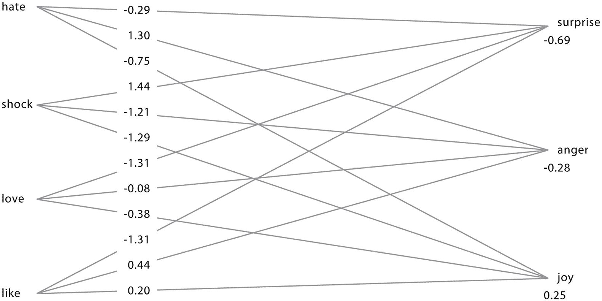

图 8.13 – 正确训练的网络

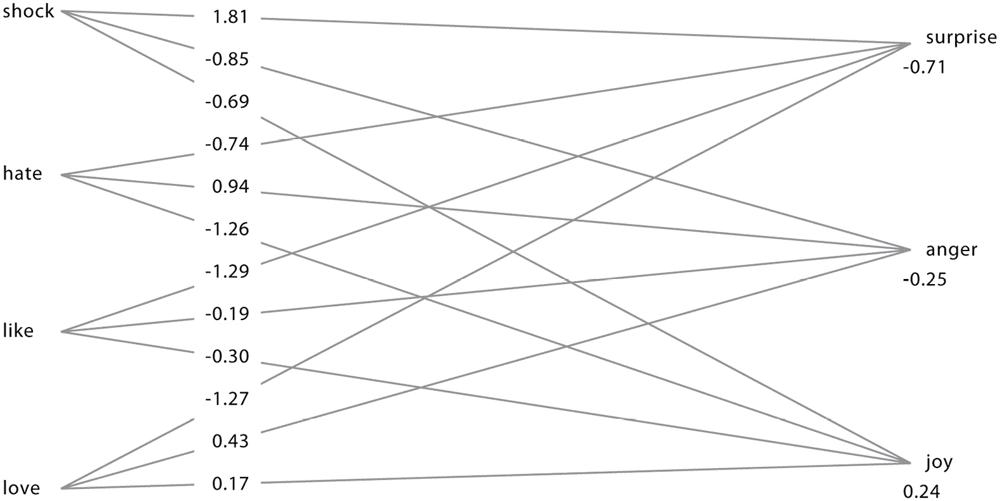

图 8.14 – 错误训练的 SNN

因此，我们有两种类型的问题：

+   如果数据不可线性分离，那么没有任何 SNN 可以正确分类它

+   即使它可以被一组超平面分割，SNN 也容易陷入局部最小值，在大多数数据上做到最好，但无法找到当单词在一起时与单独出现时不同的效果的权重

我们可以通过添加额外的层来解决第一个问题。例如，为了计算异或（XOR），网络中需要一个在两个输入节点都开启时开启，并且对输出节点有负链接的节点。一个简单的前馈网络应该将输入层的节点连接到第一隐藏层的节点，然后第一隐藏层的节点连接到第二隐藏层的节点，依此类推，直到最后一隐藏层的节点连接到输出层的节点。你需要至少一个包含至少三个节点的隐藏层。然而，正如我们所看到的，网络很容易陷入局部最小值，而可以可靠训练以识别异或的最小配置只有一个隐藏层，包含五个节点：

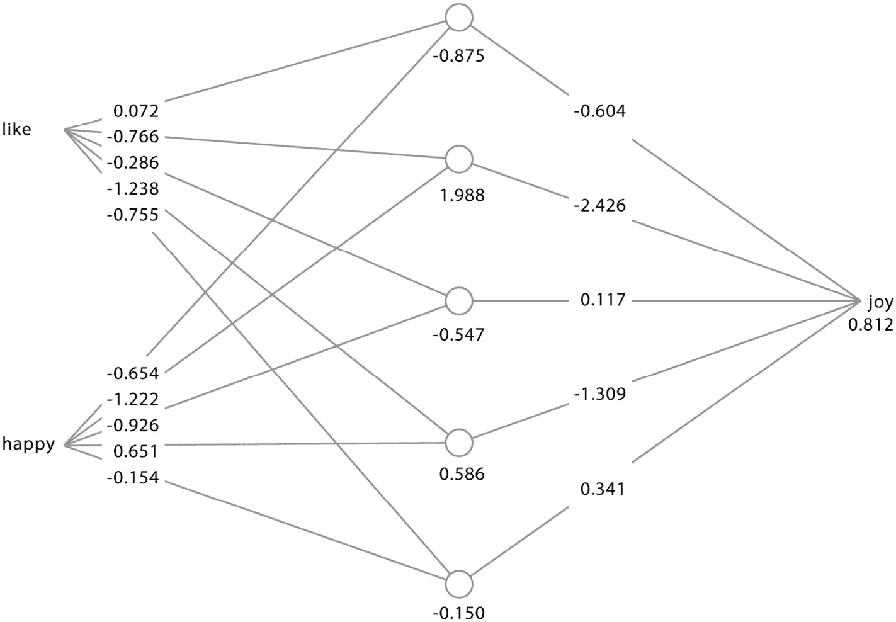

图 8.15 – 训练用于将只包含快乐或喜欢但不包含两者的推文分类为喜悦的深度神经网络

如果*喜欢*是开启的但*快乐*是关闭的，那么第二个隐藏节点将开启，得分为 1.22（即-0.766+1.988），这将传播到输出节点，得分为-2.96（1.22*-2.46）。然后，这将添加到输出节点的偏差中，产生-2.15。如果*快乐*是开启的但*喜欢*不是，那么第二个和第四个隐藏节点将开启，得分分别为 0.76 和 1.23，这将传播到输出节点，第二个隐藏节点为-0.766*0.76（对于第二个隐藏节点）加上-1.309*1.23，当加上输出节点的偏差时，变为-2.66。如果两个输入节点都开启，那么没有隐藏节点会开启，因此输出节点的得分只是其自身的偏差，即 0.81。对于只有一个输出的网络，用于解释最终得分的标准逻辑函数将负数视为开启，正数视为关闭，因此这个网络将只包含*喜欢*或*快乐*的推文分类为表达喜悦，而包含两者的推文则不表达喜悦。

添加隐藏单元将使网络能够识别输入特征的显著组合为非组合性，即组合的效果不仅仅是特征本身的累积效果。我们还可以看到，如果你没有足够的隐藏特征，那么训练过程可能会陷入局部最小值——尽管你**可以**仅使用隐藏层中的三个特征来计算 XOR，但训练这样一个网络来完成这项任务是非常困难的（参见(Minsky & Papert, 1969)对该问题的进一步讨论）。这不仅仅是没有足够的数据，或者没有允许网络训练足够长的时间的问题。具有三个节点的隐藏层的网络会非常快地收敛（大约在 10 或 12 个 epoch 之后），而具有四个节点的网络只需要几百个 epoch。我们还可以添加额外的层——具有两个隐藏层，每个层有四个和三个节点的网络也可以解决这个问题，并且通常比具有一个隐藏层和五个节点的网络收敛得更快：

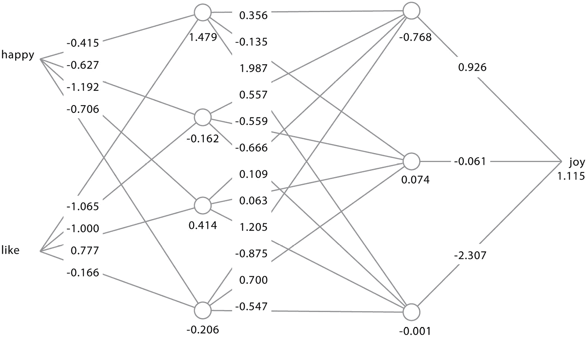

图 8.16 – 解决 XOR 问题的具有两个隐藏层的网络

问题在于，在小网络中随机设置初始权重和偏差几乎总是让你处于搜索空间的一个区域，最终会陷入局部最小值。另一方面，使用较大的网络，几乎总是会产生能够解决问题的新网络，因为将会有节点位于搜索空间的正确部分，可以赋予它们越来越重要的意义，但它们需要更长的时间来训练。因此，关键任务是找到合适的隐藏单元数量。

隐藏单元的作用是在孤立状态下和与其他单词组合时，找到向输出节点输入不同单词的单词。这里的关键参数似乎很可能是输入特征的数量（即数据中的不同单词数量）和输出类别的数量（即情绪的数量）。如果词典中有更多的单词，那么就有更多的单词组合可能，这意味着可能需要更多的隐藏节点。如果输出类别更多，那么就有更多的地方可能需要单词组合来发挥作用。

考虑到我们的数据集的词典中有成千上万的单词，但只有四到十一个情绪，似乎有道理首先研究将隐藏节点数与情绪数相关联的影响。*图 8.17*显示了当我们有一个隐藏层，其节点数是情绪数的 0.5 倍、1 倍或 1.5 倍时会发生什么：

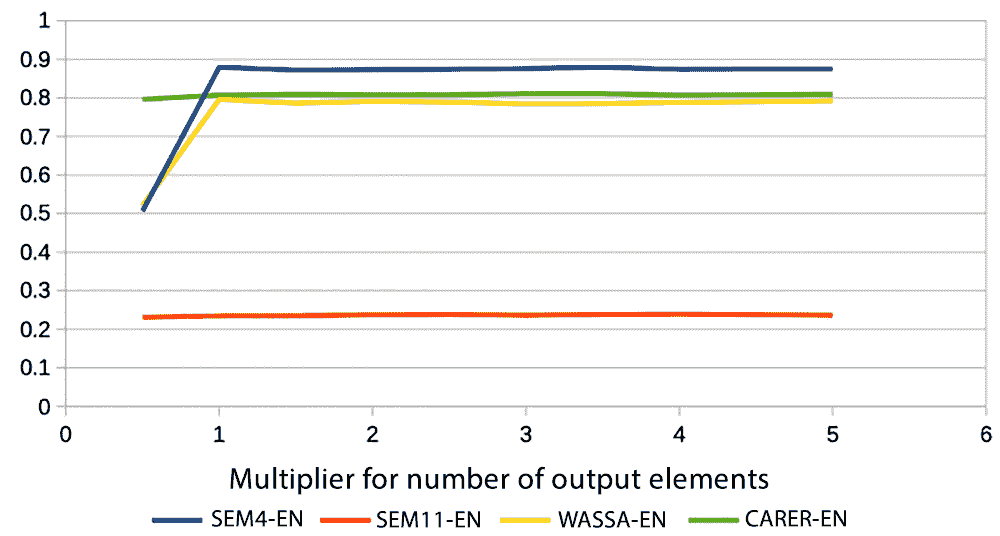

图 8.17 – Jaccard 分数与隐藏节点数的关系 = F*情绪数，F 从 0.5 到 5

对于我们使用 SNN 获得相当好结果的三个数据集，添加一个具有适度节点数量的隐藏层的效果是显著的。为了便于参考，这里重复了原始分数：

|  | **精确率** | **召回率** | **微观 F1** | **宏观 F1** | **Jaccard** |
| --- | --- | --- | --- | --- | --- |
| SEM4-EN | 0.902 | 0.902 | 0.902 | 0.902 | 0.822 |
| SEM11-EN | 0.648 | 0.275 | 0.386 | 0.388 | 0.239 |
| WASSA-EN | 0.837 | 0.837 | 0.837 | 0.837 | 0.720 |
| CARER-EN | 0.901 | 0.901 | 0.901 | 0.901 | 0.820 |

图 8.18 – 应用于标准英语数据集的简单神经网络

CARER-EN 的原始 Jaccard 分数为 0.77，相当于大约 0.87 的准确率；当我们添加一个节点数量是 CARER 中情感数量一半的隐藏层（即，由于 CARER 有六个情感，隐藏层中只有三个节点）时，我们得到了比原始分数更好的分数（Jaccard 0.79，准确率 0.89），然后当我们增加隐藏节点的数量到 6、9、12 时，我们得到了非常渐进的改进，直到分数似乎已经趋于平稳，甚至可能开始过拟合。

与 SEM4-EN 和 WASSA-EN 类似，但更为明显的是，当隐藏层中的节点数量只有情感数量的一半时（即，这两个都是两个节点），分数开始相当低，但一旦隐藏层中的节点数量与情感数量相同，分数就会显著提高，并且对于 SEM4-EN 在 Jaccard 0.875（准确率 0.93）左右趋于平稳，对于 WASSA-EN 在 Jaccard 0.81（准确率 0.9）左右趋于平稳。总的来说，看起来添加一个具有适度节点数量的隐藏层可以在没有隐藏单元的基本神经网络之上产生一些改进，但更多隐藏层或单个具有更多节点的隐藏层的实验表明，这些改进相当有限。这很可能是由于隐藏层寻找非组合性的单词组合。这种有限效果可能有两个原因：

+   简单来说，并不是所有单词的情感权重在它们与特定伙伴共现时都会发生变化

+   在这些组合存在的情况下，它们在数据中的频率不足以改变它们的正常解释

可能是使用更多的训练数据使得使用具有多个或大型隐藏层的网络更加有效，但在数据集规模较小的情况下，这样做的影响相对较小。

# 摘要

在本章中，我们探讨了使用神经网络来识别非正式通讯（如推文）中表达的情感的任务。我们研究了数据集的词汇表如何作为输入层的节点，并考察了与单个单词相关的权重如何反映这些单词的情感意义。我们考虑了没有隐藏层的简单神经网络，以及具有一个隐藏层且节点数量略多于输出节点集的稍微深一点的神经网络——一旦隐藏层包含的节点数量是输出层的 1.5 到 2 倍，神经网络的性能就会趋于平稳，因此似乎没有必要做得更复杂。

对于各种数据集，得分最高的算法如下：

|  | **LEX (****未分词)** | **LEX (****分词)** | **CP (****分词)** | **NB (****多标签)** | **SVM (****单标签)** | **MULTI-SVM** | **SNN (****单标签)** | **DNN** |
| --- | --- | --- | --- | --- | --- | --- | --- | --- |
| SEM4-EN | 0.503 | 0.497 | 0.593 | 0.778 | 0.845 |  | 0.829 | *******0.847*** |
| SEM11-EN | 0.347 | 0.348 | 0.353 | 0.267 | 0.224 | *******0.385*** | 0.242 | 0.246 |
| WASSA-EN | 0.445 | 0.437 | 0.505 | 0.707 | *******0.770*** |  | 0.737 | 0.752 |
| CARER-EN | 0.350 | 0.350 | 0.395 | 0.774 | 0.770 |  | *******0.820*** | 0.804 |
| IMDB-EN | 0.722 | 0.667 | 0.722 | 0.740 | 0.736 |  | *******0.793*** | *******0.793*** |
| SEM4-AR | 0.506 | 0.509 | 0.513 | *******0.532*** | 0.514 |  | 0.504 | 0.444 |
| SEM11-AR | 0.378 | *******0.386*** | 0.382 | 0.274 | 0.216 | 0.340 | 0.221 | 0.207 |
| KWT.M-AR | *******0.687*** | 0.663 | 0.666 | 0.507 | 0.631 | 0.341 | 0.028 | 0.026 |
| SEM4-ES | *******0.425*** | 0.420 | 0.177 | 0.331 | 0.412 |  | 0.337 | 0.343 |
| SEM11-ES | 0.269 | 0.271 | *******0.278*** | 0.255 | 0.226 | 0.268 | 0.221 | 0.222 |

图 8.19 – 目前最佳算法的得分

在 10 个数据集中，神经网络在 4 个数据集上产生了最佳结果，但对于多标签数据集，简单的词汇算法仍然是最好的。一般的教训与第七章末尾的“支持向量机”相同，即你不应该仅仅接受存在一个最佳分类算法：进行实验，尝试不同的变体，并亲自看看什么最适合你的数据。

# 参考文献

要了解更多关于本章涉及的主题，请参阅以下资源：

+   冈山，K. (1969). *通过多层模拟阈值元件网络进行视觉特征提取*. IEEE 系统科学与控制论杂志，5(4)，322–333\. [`doi.org/10.1109/TSSC.1969.300225`](https://doi.org/10.1109/TSSC.1969.300225).

+   赫布，D. O. (1949). *行为组织：一种神经心理理论*. 威廉姆斯出版社。

+   辛顿，G. E.，奥斯因德罗，S.，与 Teh，Y.-W. (2006). *深度信念网的快速学习算法*. 神经计算，18(7)，1527–1554\. [`doi.org/10.1162/neco.2006.18.7.1527`](https://doi.org/10.1162/neco.2006.18.7.1527).

+   McCulloch, W. S., & Pitts, W. (1943). *神经活动中内在思想的逻辑演算*. 数学生物物理学通报, 5(4), 115–133\. [`doi.org/10.1007/BF02478259`](https://doi.org/10.1007/BF02478259).

+   Minsky, M., & Papert, S. (1969). *感知器*. 麻省理工学院出版社.

+   Rumelhart, D. E., Hinton, G. E., & Williams, R. J. (1986). *通过反向传播错误学习表示*. 自然, 323(6088), 533–536\. [`doi.org/10.1038/323533a0`](https://doi.org/10.1038/323533a0).
