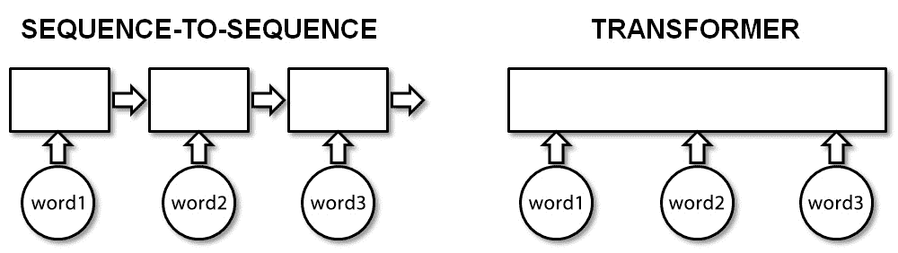
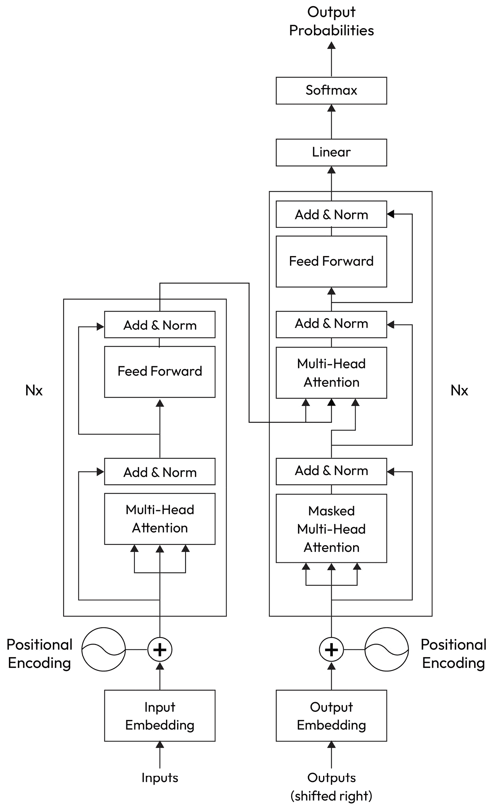

# 9

# 探索 Transformer

**Transformer** 是一种全新的机器学习模型，它彻底改变了人类语言的处理和理解方式。这些模型可以分析大量数据，以前所未有的准确性发现和理解复杂模式，并在诸如翻译、文本摘要和文本生成等任务上产生人类难以获得的见解。

Transformer 强大之处在于它们可以处理大量数据，并从先前示例中学习以做出更好的预测。它们已经“彻底改变”了（有意为之）**NLP**，并在许多 NLP 任务中优于传统方法，迅速成为行业最佳实践。

在本章中，我们将介绍 Transformer，讨论它们的工作原理，并查看一些关键组件。然后，我们将介绍 Hugging Face，并展示它是如何帮助我们完成任务，然后再介绍一些有用的现有 Transformer 模型。我们还将展示如何使用 Hugging Face 实现 two 模型，并使用 Transformer。

本章将演示如何构建 Transformer 模型，同时引导您完成重要步骤，例如将 Google Colab 连接到 Google Drive 以持久保存文件，准备数据，使用自动类，并最终构建可用于分类的模型。

我们将涵盖以下主题：

+   Transformer 简介

+   数据如何在 Transformer 中流动

+   Hugging Face

+   现有模型

+   用于分类的 Transformer

+   实现 Transformer

让我们首先更深入地了解 Transformer，它们的发明者以及它们是如何工作的。

# Transformer 简介

在本章中，我们将简要介绍 Transformer。在语言和 NLP 任务中，上下文起着至关重要的作用——也就是说，要知道一个词的含义，必须考虑关于情况（即上下文）的知识。在 Transformer 出现之前，序列到序列模型被用于许多 NLP 任务。这些模型通过一次预测一个单词来生成输出序列，并将源文本编码以获取上下文知识。然而，语言的问题在于它们是复杂、流动且难以转化为严格的基于规则的结构的。上下文本身也很难追踪，因为它通常位于所需位置（即许多单词、句子或甚至段落）很远的地方。为了解决这个问题，序列到序列模型通过使用具有某种有限形式的记忆的神经网络来工作：



图 9.1 – 序列到序列模型与 Transformer 对比

关于变压器的普遍论文《Attention Is All You Need》由 Vaswani 等人于 2017 年发表。他们提出了一种新的神经网络架构，称为**变压器**，可用于 NLP 任务。从*图 9*.2 中可以看到，变压器有几个组件，包括“编码器”（在左侧），“解码器”（在右侧），以及重复*N*次的注意力和前馈组件块：



图 9.2 – 来自 Vaswani 等人撰写的《Attention Is All You Need》论文。

变压器由编码器和解码器层组成；每个通常有多个相同的实例（例如，原始研究论文中的六个），并且每个都有自己的权重集。在左侧，编码器的任务是转换输入序列为一组连续表示。在右侧，解码器使用编码器的输出以及前一时间步的输出来生成输出序列。架构中的每个堆叠的第一个编码器和解码器都有嵌入层和位置编码作为输入。每个编码器包含一个自注意力层，该层计算不同单词之间的关系，以及一个前馈层。每个解码器也包含一个前馈层，但它有两个自注意力层。最后一个编码器的输出被用作第一个解码器的输入。这些组件结合使变压器架构更快、更高效，并允许它处理更长的序列，使得单词之间的分隔变得无关紧要。因此，该架构可以优于其他更传统的其他方法。

Vaswani 等人描述的变压器架构是为了翻译而创建的。在训练期间，编码器接收一种语言的输入（即句子，例如英语），而解码器接收相同输入（即句子）的预期目标语言（例如法语）。编码器中的注意力层利用输入句子中的每个单词，但编码器是顺序操作的，并且只能关注翻译文本中的单词（即当前正在生成的单词之前的单词）。例如，如果已经预测了翻译目标的前*N*个单词，这些单词将被输入到解码器中，解码器使用编码器的所有输入来预测*N+1*位置的单词。

解码器提供了整个目标句子，但被限制不能使用即将到来的单词。因此，在预测一个单词时，解码器不能参考目标句子中它之后的任何单词。例如，在预测*N*th 个单词时，只有位置*1*到*N-1*的单词可以被注意力层考虑。这个限制对于确保任务对模型来说足够具有挑战性以获得知识至关重要。

# 变换器模型中的数据流动

在本节中，我们将更深入地探讨数据是如何在变换器模型中流动的。理解数据在变换器中的流动方式，以及将原始输入转换为有意义的输出的步骤，对于理解其功能和潜力至关重要。变换器能够高效且有效地对数据中的长距离依赖关系进行建模，使其能够高度捕捉上下文和语义。通过探索变换器内部的数据流动机制，我们将更深入地理解其处理和理解语言的能力。我们首先将查看输入嵌入。

## 输入嵌入

从左侧开始，编码器的输入是源文本中的单词标记。这种文本数据必须使用 GloVe 或 Word2Vec 等方法（以及其他方法）转换为数值表示（根据作者的说法，大小为 512），以便进行转换。

## 位置编码

然后将一个位置元素添加到这些嵌入中。这很重要，因为它允许变换器发现关于单词之间距离和单词顺序的信息。然后，这些信息被传递到第一个编码器块的自注意力层。

注意

位置编码不会改变向量维度。

## 编码器

每个编码器内部都有几个子层：

+   **多头注意力**：这允许变换器同时关注输入序列的不同部分，从而提高其输入处理能力，并使其能够获得更多上下文并做出更明智的决策。这是架构中最重要的部分，也是计算成本最高的部分。当处理输入中的单词时，自注意力将输入中的每个单词与每个其他单词相关联。考虑变换器如何决定哪组权重将产生最佳结果是非常有趣的。目标是使与句子中某些方式相关的单词的注意力值很大，反之亦然。例如，让我们看看这个句子：“*天气非常晴朗*。”

单词*weather*和*sunny*是相关的，因此应该生成较高的关注值；相反，*The*和*was*的关注值应该较小。如前所述，变压器是在嵌入上进行训练的。因此，变压器将从它们中学习，并能够产生所需的向量，以便单词产生与单词相关性的关注值。此外，除了考虑单个含义之外，自注意力机制根据单词的重要性及其与其他单词的关系对输入单词进行不同的加权。这使得它能够处理上述长距离上下文问题，从而在 NLP 任务上实现更好的性能。简而言之，关注值是使用三个矩阵计算的，每个矩阵中的每一行代表一个输入单词。重要的是要注意，这些行中的值是由模型学习的，以便生成所需的输出。让我们依次查看这些重要的矩阵：

+   **查询**：每一行对应于输入单词的嵌入。换句话说，查询词是正在计算关注值的特定单词。

+   **键**：模型正在将其与查询比较的输入文本中的每个单词——即被关注的单词——以计算其对查询词的重要性。

+   **值**：模型试图根据查询和键矩阵之间的比较来生成的信息。键和值矩阵可以是相同的。

给定这些矩阵，通过计算查询和键矩阵的点积来获得关注值。然后使用这些值来加权值矩阵，从而有效地允许模型“学习”输入文本中应该关注的单词。

+   **加和归一化**：这些层由一个残差连接层后面跟一个归一化层组成。就我们的目的而言，重要的是要知道它们有助于解决梯度消失问题并提高模型性能。

+   **前馈神经网络**：这是一个处理注意力向量输入并将它们转换为与输入相同维度的形式的神经网络，可以输入到下一层。这些注意力向量彼此独立；因此，在这个阶段可以使用并行化，而不是像在序列到序列架构中那样按顺序处理它们。

现在让我们继续讨论解码器。

## 解码器

编码器的输出被用作解码器堆栈中每个解码器的第二层的输入。

与编码器类似，掩码多头注意力接受一个输出嵌入和一个位置嵌入。变换器的目标是学习如何根据输入和所需的输出生成输出。

注意

在训练过程中，所需的输出（例如，翻译）被提供给解码器。

一些单词被遮蔽，以便模型可以学习如何预测它们。这些单词在每次迭代中都会改变。解码器会处理这些单词，以及来自编码器的编码表示，以生成目标序列。

然而，在预测过程中，使用一个空序列（带有特殊的**句子开始**（**<SOS>**)标记）。这被转换为一个嵌入；添加位置编码后用作解码器的输入。解码器和其他层的工作方式与之前相同，但输出序列的最后一个单词被用来填充输入序列的第一个空白，因此输入现在是<SOS>和第一个预测的单词。这再次被送入解码器，并重复这个过程，直到句子的结尾。

## 线性层

解码器的输出被用作这个线性层的输入，这是一个简单的全连接神经网络，它生成下一层的向量。

## Softmax 层

Softmax 层将输入转换为概率分布——也就是说，它将一组数字转换为总和为 1 的正面数字，对较高值赋予更高的权重，对较小值赋予较低的权重。

## 输出概率

最后，输出概率是目标单词标记。变压器将这个输出与来自训练数据的目标序列进行比较，并使用它通过反向传播来改进结果。

现在我们已经了解了变压器的工作原理，在下一节中，我们将简要地看看一个组织是如何使基于变压器的模型的实施和实验变得简单，使其对所有用户都易于访问。

# Hugging Face

变压器需要大量的数据才能有效并产生良好的结果。此外，还需要巨大的计算能力和时间；最好的模型通常使用多个 GPU 进行训练，可能需要几天（甚至更长）的时间来完成训练。因此，并不是每个人都能负担得起训练这样的模型，通常这由像谷歌、Facebook 和 OpenAI 这样的大型企业来完成。幸运的是，已经有预训练的模型可供使用。

Hugging Face（以微笑脸和展开双手的 emoji 命名）与变换器、模型和 NLP 同义。Hugging Face ([`huggingface.co`](https://huggingface.co))提供了一个用于发布预训练变换器（和其他）模型的存储库。这些模型可以免费下载并用于广泛的 NLP 任务。此外，如果任务涉及具有独特命名法、术语和特定领域语言的领域，则可以对模型进行“微调”以提高模型在该特定领域的性能。微调是一个使用预训练模型的权重作为起点，并使用新的特定领域数据来更新它们的过程，从而使模型在特定领域任务上表现得更好。除了发布模型外，Hugging Face 还提供了一项服务，允许模型进行微调、训练以及更多操作。

Hugging Face 还提供了一个 Python 库，为 NLP 任务提供了一个高级接口。该库提供了一系列最先进的预训练模型，包括 BERT、GPT、RoBERTa、T5 等（见下一节）。可以使用以下命令进行安装：

```py
pip install transformers
```

除了下载预训练模型外，该库还可以用于下载标记化器。这两者都可以与您的数据集一起使用，以微调分类等任务，以创建最先进的 NLP 系统。

总结来说，Hugging Face 的`transformers`库是一个强大的工具，用于处理 NLP 模型，使得与变换器模型的工作变得简单。它具有直观的设计和广泛的模型选择，非常值得一看。

# 现有模型

驱动于计算、存储和数据容量的提升，变换器在全球范围内掀起了一场风暴。一些更著名的预训练模型包括以下内容：

+   **来自变换器的双向编码器表示** (**BERT**): 由谷歌 AI 团队创建，并在大量的文本数据语料库上进行训练，BERT 考虑了每个单词左右两边的上下文。

+   **高效学习准确分类标记的编码器** (**ELECTRA**): ELECTRA 使用生成器-判别器模型来区分生成的文本和真实文本。生成器被训练生成与真实文本相似的文本，而判别器被训练区分真实文本和生成文本。

+   **生成式预训练变换器 3** (**GPT-3**): 由 OpenAI 开发，并在广泛的互联网文本上进行预训练，GPT-3 拥有 1750 亿个参数，是目前可用的最大模型之一。

+   **NVIDIA 训练的大型变换器模型** (Megatron): 由 NVIDIA 开发，Megatron 可扩展，可以在数百个 GPU 上训练，因此可以使用更大的模型。

+   **鲁棒优化 BERT** (**RoBERTa**): 基于 BERT，RoBERTa 通过使用更大的训练语料库和更多的训练步骤来学习更鲁棒的文字表示，旨在改进 BERT。

+   **文本到文本迁移转换器**（**T5**）：由 Google 开发，T5 将 NLP 问题视为“文本到文本”问题。它在未标记和标记数据上进行了训练，然后针对各种任务进行单独微调。

+   **具有额外长上下文的转换器**（**Transformer-XL**）：该模型引入了一个记忆模块，使得模型能够更好地处理和理解长期依赖关系。

+   **XLNet（广义自回归预训练）**：由 Google 开发，XLNet 从 Transformer-XL 和 BERT 中吸取了最佳元素，并建立了所有输入词之间的依赖关系。

在下一节中，我们将更详细地探讨转换器是如何为我们感兴趣的分类任务进行训练的：灵感来源于 Hugging Face 页面。

# 用于分类的转换器

转换器模型被训练为语言模型。这是一种通过分析人类语言模式来理解和生成人类语言的算法类型。

它们了解语法、句法和语义，并能辨别单词和短语之间的模式和联系。此外，它们可以检测命名实体，如个人、地点和机构，并解释它们被引用的上下文。本质上，转换器模型是一个使用统计模型来分析和生成语言的计算机程序。

语言模型是在大量文本数据上以自监督的方式进行训练的，例如书籍、文章和在线内容，以学习单词和短语之间的模式和关系。用于预训练转换器的流行数据集包括 Common Crawl、Wikipedia 和 BooksCorpus。例如，BERT 总共使用了大约 35 亿个单词进行训练，其中大约 25 亿来自 Wikipedia，大约 10 亿来自 BooksCorpus。这使得模型能够预测在给定单词序列之后出现某个单词或短语的可能性。预训练的大型语言模型的输出通常涉及基于输入文本的预测。模型可能会输出某些单词或短语在句子中接下来使用的概率，预测给定输入词后最可能跟随的词，或者根据输入文本生成整个句子或段落。输出可用于各种目的，如文本生成、翻译、情感分析等。

自监督学习是一种机器学习方法，模型学习从未标记的数据中提取有用的信息，而不需要任何明确的标签或监督。相反，模型是在预测图像缺失部分或重建损坏句子等任务上训练的。因此，这类模型对其训练过的语言有了理解——但仅从统计的角度来看。然而，这种方法在日常任务中缺乏实用性，因此，必须通过使用针对当前任务的人类标注标签的监督微调来定制通用的**预训练**模型。

预训练（即从头开始训练一个模型）需要大量的数据，因此这个过程可能需要数周或数月。然后，在预训练模型上进行微调，因此需要预训练的语言模型来进行微调。本质上，微调是一个进一步训练的步骤，使用适合任务的数据库集。

微调模型通常调整模型预训练层的权重，以更好地适应新的数据集或任务。微调的过程包括初始化预训练层的权重，然后在新的数据集或任务上对整个模型进行训练。在训练过程中，预训练层的权重会随着新添加的层权重一起更新，使模型能够从新的数据集中学习更细微的特征，同时保留从预训练模型中学到的知识。预训练层权重在微调过程中更新的程度取决于新任务的特定情况和可用数据量。在某些情况下，只有新添加层的权重被更新，而在其他情况下，预训练层的权重可能被显著更新。另一种选择是除了最后一层之外的所有层都保持固定，其权重在训练过程中被修改。因此，在微调过程中使用这些技术，并使用较小的学习率，通常会产生性能提升。有时，这伴随着在旧架构之上添加新层，从而保持旧固定权重，只允许新层的权重被改变。

但微调时究竟发生了什么？有各种技术，但一般的想法是，早期层学习与实际任务（例如，分类）无关的通用模式，而后期层学习与任务相关的模式。这种直觉已经被各个研究团队所验证。

注意

在梯度下降计算过程中，每次迭代的步长大小由学习率决定，整体目标是找到损失函数的最小值。

在实际应用中，对于分类任务，我们会下载一个如**BertForSequenceClassification**的模型——这是一个用于句子分类的 BERT 模型，它包含一个线性层。因此，最后一层生成一个概率向量，表示输入序列每个潜在类标签的概率。

简而言之，微调模型使其能够将学习到的特征适应新的任务或数据集，这可能导致性能提升。

在本章前面，我们探讨了模型的各个部分，并看到了模型具有编码器和解码器块。根据任务，这些部分中的每一个都可以单独使用。对于分类任务，建议使用仅编码器模型。更多细节，有一些很好的 Packt 书籍可供参考，例如 Denis Rothman 的《自然语言处理中的变压器》。

在下一节中，我们将使用训练数据集微调模型，在测试数据集上进行一些预测，并评估结果。

# 实现变压器

在本节中，我们将通过代码实现针对单情感和多情感数据集的变压器的实现。我们将使用**Google Colaboratory**（**Colab**），因为它通过提供一个强大的基于云的环境，预装了库和资源，从而简化了变压器的实现。因此，让我们先看看这一点。

## Google Colab

Google Colab 是一个免费的笔记本环境服务，它在云端运行（[`colab.research.google.com`](https://colab.research.google.com)）。使用 Colab 有许多好处；例如，它允许开发者快速开始编程，无需担心设置，它允许与没有正确软件安装的本地用户共享代码，并且它与 GitHub 很好地集成。然而，最大的优势之一是 Google 提供了免费的 GPU 访问。机器学习的核心涉及大量的数学运算——这是 GPU 擅长的。从实际应用的角度来看，即使是具有小型训练数据集的简单模型，GPU 和非 GPU 系统之间的节省时间也可以是数小时（例如，10 分钟与 10 小时相比）。

尽管如此，还有一些注意事项。Colab 是短暂的——换句话说，上传到会话或由会话生成（例如，结果）的文件（例如，数据文件）最终会消失。解决这个问题的方法是上传文件到 Google Drive，并允许 Colab 访问它们。

在 Colab 上的调试也比通过 VS Code 等工具要繁琐一些。它涉及到安装和导入`ipdb`（IPython 启用 Python 调试器）包：

```py
!pip install -Uqq ipdbimport ipdb
```

断点对开发者很有用，这些可以通过代码设置，以使调试器停止：

```py
ipdb.set_trace()
```

我们可以使用命令行参数来控制调试器，如下所示：

+   `c`：继续执行

+   `n`：移动到下一行

+   `r`：继续执行，直到当前函数返回

可以使用以下命令全局关闭调试：

```py
%pdb off
```

也可以使用以下命令全局打开调试：

```py
%pdb on
```

现在我们已经知道了什么是转换器，它是如何工作的，以及如何实现它，让我们使用 Colab 在 Python 中实现一个转换器来分类前几章中介绍的数据集。

## 单一情感数据集

我们将实现两个转换器来满足两种不同类型的数据集。让我们从单一情感任务开始。总的来说，我们将遵循以下步骤：

1.  安装必要的库。

1.  导入必要的库。

1.  提供对 Google Drive 的访问权限。

1.  创建数据集和模型变量。

1.  加载数据集并准备。

1.  标记数据集。

1.  加载用于分类的模型。

1.  设置训练器参数。

1.  训练模型。

1.  使用训练好的模型进行预测。

1.  评估。

对单一情感推文进行分类是一个相对容易的任务，所以让我们从这里开始。

让我们从安装一些库开始：

```py
!pip install datasets!pip install evaluate
!pip install transformers
```

这些库用于轻松访问数据集、评估模型的输出结果以及访问 Hugging Face 上可用的预训练模型。我们现在可以将它们导入到我们的代码中：

```py
import datasetsfrom datasets import load_dataset
from enum import Enum
import evaluate
from evaluate import evaluator
import numpy as np
from sklearn.metrics import jaccard_score
from transformers import (
    AutoModelForSequenceClassification,
    AutoTokenizer,
    Pipeline,
    Trainer,
    TrainingArguments
)
import pandas as pd
from pathlib import Path
from google.colab import drive
```

如前所述，我们希望一次性上传我们的训练和测试文件，并在需要时按需访问它们，因此让我们让 Colab 获取我们的 Google Drive 访问权限，这是文件上传的地方。实际上，其中一些文件已经通过 `datasets` 库可用，但为了现在，我们假设我们想从我们的存储库中访问它们：

```py
drive.mount("/content/gdrive/", force_remount=True)BASE_PATH = "/content/gdrive/MyDrive/PacktBook/Data/C9"
```

注意

您应将 `BASE_PATH` 替换为您自己的路径。

现在，我们应该设置一些事情来使我们的任务更容易。不同的数据集需要不同的参数，因此可以使用 `enum` 来控制代码的执行流程。我们必须命名我们的文件，使文件名包含文件内推文的语言代码（即 `AR`、`ES` 和 `EN`），然后使用 `enum` 和文件名来设置在代码中有用的变量：

```py
class Dataset(Enum):  SEM4_EN=1
  WASSA_EN=2
  CARER_EN=3
  SEM4_AR=4
  SEM4_ES=5
  IMDB_EN=6
```

现在，我们还将设置一个变量，例如 `NUM_LABELS`，以告诉模型有多少个标签。稍后，我们将看到我们不需要这样做：

```py
# set the required dataset hereds = Dataset.SEM4_EN
NUM_LABELS = 4
COLS = 'ID', 'tweet', 'label'
```

现在，我们可以使用 `enum` 来设置一些特定于数据集的变量。这样，当我们想尝试其他数据集时，我们只需要修改 `ds` 变量：

```py
if (ds == Dataset.SEM4_EN):  training_file = "SEM4_EN_train.csv"
  test_file = "SEM4_EN_dev.csv"
elif (ds == Dataset.WASSA_EN):
  training_file = "WASSA_train.csv"
  test_file = "WASSA_dev.csv"
elif(ds == Dataset.CARER_EN):
  training_file = "CARER_EN_train.csv"
  test_file = "CARER_EN_dev.csv"
  NUM_LABELS = 6
elif(ds == Dataset.SEM4_ES):
  training_file = "SEM4_ES_train.csv"
  test_file = "SEM4_ES_dev.csv"
  NUM_LABELS = 5
elif(ds == Dataset.SEM4_AR):
  training_file = "SEM4_AR_train.csv"
  test_file = "SEM4_AR_dev.csv"
elif(ds == Dataset.IMDB_EN):
  NUM_LABELS = 2
  training_file = "IMDB_EN_train.csv"
  test_file = "IMDB_EN_dev.csv"
```

我们还必须设置 `model_name` 以告诉程序使用哪种特定语言的模型：

```py
# select a modelif "_AR_" in training_file:
  model_name = "asafaya/bert-base-arabic"
elif "_EN_" in training_file:
  model_name = "bert-base-cased"
elif "_ES_" in training_file:
  model_name = "dccuchile/bert-base-spanish-wwm-cased"
```

然后，我们可以设置各种文件路径变量：

```py
# add the base pathtraining_file = f"{BASE_PATH}/{training_file}"
test_file = f"{BASE_PATH}/{test_file}"
```

最后，我们必须设置一个名为 `stub` 的变量，我们将用它来保存我们的模型：

```py
# get file name for savingstub = (Path(training_file).stem)
```

Hugging Face 的 `transformers` 库与 `datasets` 库配合得很好。因此，接下来，我们将加载数据文件，删除任何不需要的列，并创建一个 `DatasetDict` 对象，该对象将在管道的后续部分中使用：

```py
def get_tweets_dataset():  data_files = {"train": training_file, "test": test_file}
  ds = datasets.load_dataset("csv", data_files=data_files,
                             delimiter=",",
                             encoding='utf-8')
  ds_columns = ds['train'].column_names
  drop_columns = [x for x in ds_columns if x not in COLS]
  ds = ds.remove_columns(drop_columns)
  dd = datasets.DatasetDict({"train":ds["train"],
                             "test":ds["test"]})
  return dd
dataset = get_tweets_dataset()
```

接下来，我们必须创建一个函数，该函数将存储在`dataset`变量中的训练集和测试集中的推文进行分词。简单来说，分词器的工作是准备数据，使其准备好输入到模型中。它是通过将句子拆分成单词（标记）然后将单词拆分成片段（例如，*flyfishing*会被拆分成*fly*，*fish*和*ing*）来完成的。然后这些标记通过查找表拆分成 ID（数字）。通常，你会使用与你使用的模型关联的分词器。例如，对于`bert-base-cased`模型，你会使用`BertTokenizer`。然而，在下面的代码中，我们使用了名为`AutoTokenizer`的东西。`AutoTokenizer`是一个通用的分词器自动类，它自动从 Hugging Face 分词器库中获取正确的分词器类以及与模型分词器相关的数据。一个自动类是一个通用类，通过自动根据其名称找到预训练模型的架构来简化编码过程。我们只需要为我们的任务选择合适的`AutoModel`。本质上，它们更加灵活，使编程变得稍微简单一些：

```py
tokenizer = AutoTokenizer.from_pretrained(model_name)def tokenise_function(tweets):
    return tokenizer(tweets["tweet"],
                     padding="max_length",
                     truncation=True,
                     max_length = 512)
tokenised_datasets = dataset.map(tokenise_function, batched=True)
```

现在是有趣的部分！我们需要加载一个用于分类的模型。和之前一样，我们可以使用一个专门为句子分类训练的特定 BERT 模型，比如`BertForSequenceClassification`。然而，我们选择使用一个自动类来获取文本分类模型。在这种情况下，由于我们正在对文本进行分类，我们使用了`AutoModelForSequenceClassification`作为`AutoModel`。我们只需提供模型的名称和我们正在处理的标签数量——库会处理其余部分：

```py
model = AutoModelForSequenceClassification.from_pretrained(    model_name,
    num_labels=NUM_LABELS)
training_args = TrainingArguments(output_dir=f"{stub}")
```

我们现在准备训练模型，但首先，我们需要设置一些参数来指定我们希望训练器执行的操作。我们可以通过简单地创建一个`TrainingArguments`实例来实现，告诉它将模型保存在哪里，以及我们希望在每个 epoch 结束时进行评估。这些参数通过`Trainer`传递，包括模型和训练集以及测试集。现在，调用训练并等待结果就变得简单了。注意我们如何保存生成的模型：

```py
training_args = TrainingArguments(    output_dir=f"{stub}",
    evaluation_strategy="epoch")
trainer = Trainer(
    model=model,
    args=training_args,
    train_dataset=tokenised_datasets["train"],
    eval_dataset=tokenised_datasets["test"],
)
trainer.train()
trainer.save_model(stub)
```

如果一切顺利，你应该会看到类似以下的内容（截断）：

```py
The following columns in the training set don't have a corresponding argument in `BertForSequenceClassification.forward` and have been ignored: ID, tweet. If ID, tweet are not expected by `BertForSequenceClassification.forward`,  you can safely ignore this message./usr/local/lib/python3.8/dist-packages/transformers/optimization.py:306: FutureWarning: This implementation of AdamW is deprecated and will be removed in a future version. Use the PyTorch implementation torch.optim.AdamW instead, or set `no_deprecation_warning=True` to disable this warning
  warnings.warn(
***** Running training *****
  Num examples = 3860
  Num Epochs = 3
  Instantaneous batch size per device = 8
  Total train batch size (w. parallel, distributed & accumulation) = 8
  Gradient Accumulation steps = 1
  Total optimization steps = 1449
  Number of trainable parameters = 108313348
 [1449/1449 19:47, Epoch 3/3]
Epoch  Training Loss  Validation Loss
1  No log  0.240059
2  0.555900  0.210987
3  0.208900  0.179072
Training completed. Do not forget to share your model on huggingface.co/models =)
Saving model checkpoint to SEM4_EN_train
Configuration saved in SEM4_EN_train/config.json
Model weights saved in SEM4_EN_train/pytorch_model.bin
```

注意

本章中使用的算法和程序都会随机化数据的一些方面，尤其是网络内部节点的权重初始分配，因此，你在相同数据上运行相同脚本获得的结果可能与文本中的结果略有不同。

现在我们已经对我们的数据集进行了微调的模型，我们可以看到它在我们测试数据集上的表现如何：

```py
predictions = trainer.predict(tokenized_datasets["test"])
```

最后，我们可以设置一个度量字典并遍历它们，边计算边打印：

```py
model_predictions = np.argmax(predictions.predictions,    axis=1)
model_predictions = model_predictions.tolist()
model_references = tokenised_datasets["test"]["label"]
measures = [
              ["precision" , "macro"],
              ["recall" , "macro"],
              ["f1" , "micro"],
              ["f1" , "macro"],
              ["jaccard" , "macro"],
              ["accuracy" , None],
            ]
for measure in measures:
  measure_name = measure[0]
  average = measure[1]
  if measure_name = = "jaccard":
    results = get_jaccard_score(references = model_references,
    predictions = model_predictions,average = average)
  else:
    metric = evaluate.load(measure_name)
    if measure_name=="accuracy":
      results = metric.compute(references = model_references,
      predictions = model_predictions)
    else:
      results = metric.compute(references = model_references,
        predictions = model_predictions, average = average)
  print(measure_name, average, results[measure_name])
```

这将生成类似以下的内容：

```py
precision macro 0.9577305808563304recall macro 0.9592563645499727
f1 micro 0.9576446280991735
f1 macro 0.9576513771741846
jaccard macro 0.9192365565992706
accuracy None 0.9576446280991735
```

模型的结果总结在以下表格中：

| **数据集** | **精确度** | **召回率** | **micro F1** | **macro F1** | **Jaccard** |
| --- | --- | --- | --- | --- | --- |
| SEM4-EN | 0.962 | 0.964 | 0.962 | 0.962 | 0.927 |
| WASSA-EN | 0.855 | 0.861 | 0.855 | 0.856 | 0.753 |
| CARER-EN | 0.881 | 0.921 | 0.927 | 0.896 | 0.816 |
| SEM4-AR | 0.817 | 0.837 | 0.843 | 0.825 | 0.710 |
| SEM4-ES | 0.791 | 0.786 | 0.807 | 0.787 | 0.663 |
| IMDB-EN | 0.905 | 0.905 | 0.905 | 0.905 | 0.826 |

表 9.1 – 单标签数据集基于 transformer 模型的分数

这里的大部分分数都优于我们在这本书早期使用分类器获得的分数，尽管 WASSA-EN 和 CARER-EN 的最佳分类器仍然是单类 SVM。SEM4-AR 和 SEM4-ES 的分数都显著优于之前的分数，这可能是由于预训练模型在寻找根和可能进行消歧方面做得比我们在早期章节中使用的简单词干提取器要好。从复杂的 DNN（如 transformer）中提取中间结果非常困难，因此分析为什么这种类型的某个分类器比另一个分类器表现更好比之前章节中更困难，但似乎这在这些情况下是一个关键因素。

## 多情绪数据集

现在，让我们构建一个用于分类多标签推文的 transformer 模型。大部分代码是相似的，所以我们将不会重新展示，而是专注于多分类问题的有趣部分。我们将遵循以下步骤：

1.  安装必要的库。

1.  导入必要的库。

1.  提供对 Google Drive 的访问权限。

1.  创建数据集变量。

1.  将数据集转换为`DatasetDict`。

1.  加载并准备数据集。

1.  对数据集进行分词。

1.  加载用于分类的模型。

1.  定义度量函数。

1.  设置训练器参数。

1.  训练模型。

1.  评估。

让我们开始吧！

我们必须像以前一样安装和导入库，并且像以前一样允许访问 Google Drive。现在，让我们从在线存储库中获取数据文件。然而，KWT 文件在 Google Drive 中，因此我们需要一些代码来加载并将这些转换为`DatasetDict`对象：

```py
def get_kwt_tweets_dataset(code):  if code == "KWTM":
    training_file = "train-KWT-M.csv"
    test_file = "test-KWT-M.csv"
  else:
    training_file = "train-KWT-U.csv"
    test_file = "test-KWT-U.csv"
  # add the base path
  training_file = f"{BASE_PATH}/{training_file}"
  test_file = f"{BASE_PATH}/{test_file}"
  data_files = {"train": training_file, "validation": test_file}
  ds = datasets.load_dataset("csv", data_files=data_files,
        delimiter=",",encoding='utf-8')
  dd = datasets.DatasetDict(
                            {"train":ds["train"],
                             "validation":ds["validation"]
                            })
  return dd
```

我们的`Dataset`枚举现在也反映了我们正在处理不同的文件，因此让我们使用`enum`来获取正确的数据文件并设置模型：

```py
class Dataset(Enum):  SEM11_AR=1
  SEM11_EN=2
  SEM11_ES=3
  KWT_M_AR=4
  KWT_U_AR=5
ds = Dataset.SEM11_EN
if (ds == Dataset.SEM11_AR):
  dataset = load_dataset("sem_eval_2018_task_1",
    "subtask5.arabic")
  model_name = "asafaya/bert-base-arabic"
elif (ds == Dataset.SEM11_EN):
  dataset = load_dataset("sem_eval_2018_task_1",
    "subtask5.english")
  model_name = "bert-base-cased"
elif(ds == Dataset.SEM11_ES):
  dataset = load_dataset("sem_eval_2018_task_1",
    "subtask5.spanish")
  model_name = "dccuchile/bert-base-spanish-wwm-cased"
elif(ds == Dataset.KWT_M_AR):
  dataset = get_tweets_dataset("KWTM")
  model_name = "asafaya/bert-base-arabic"
elif(ds == Dataset.KWT_U_AR):
  dataset = get_tweets_dataset("KWTU")
  model_name = "asafaya/bert-base-arabic"
```

数据集有三种类型：训练集、测试集和验证集。我们将使用训练集和验证集：

```py
DatasetDict({    train: Dataset({
        features: ['ID', 'Tweet', 'anger', 'anticipation',
        'disgust', 'fear', 'joy', 'love', 'optimism',
        'pessimism', 'sadness', 'surprise', 'trust'],
        num_rows: 6838
    })
    test: Dataset({
        features: ['ID', 'Tweet', 'anger', 'anticipation',
        'disgust', 'fear', 'joy', 'love', 'optimism',
        'pessimism', 'sadness', 'surprise', 'trust'],
        num_rows: 3259
    })
    validation: Dataset({
        features: ['ID', 'Tweet', 'anger', 'anticipation',
        'disgust', 'fear', 'joy', 'love', 'optimism',
        'pessimism', 'sadness', 'surprise', 'trust'],
        num_rows: 886
    })
})
```

注意在第一个例子中，我们必须设置`NUM_LABELS`，而我们不知道实际的标签是什么。在这里，我们将动态确定标签，并创建一些查找表，使我们能够轻松地从情绪到标签以及反之：

```py
Labels = [label for label in dataset[ 'train'].features.keys() if label not in ['ID', 'Tweet']]id2label = {idx:label for idx, label in enumerate(labels)}
label2id = {label:idx for idx, label in enumerate(labels)}
```

以下输出解释了这些看起来是什么样子：

```py
['anger', 'anticipation', 'disgust', 'fear', 'joy', 'love', 'optimism', 'pessimism', 'sadness', 'surprise', 'trust']{0: 'anger', 1: 'anticipation', 2: 'disgust', 3: 'fear', 4: 'joy', 5: 'love', 6: 'optimism', 7: 'pessimism', 8: 'sadness', 9: 'surprise', 10: 'trust'}
{'anger': 0, 'anticipation': 1, 'disgust': 2, 'fear': 3, 'joy': 4, 'love': 5, 'optimism': 6, 'pessimism': 7, 'sadness': 8, 'surprise': 9, 'trust': 10}
```

现在，我们需要对数据集进行分词，就像我们之前做的那样。这里的任务稍微复杂一些，因为我们每个推文都有多个标签，标签被加载为`True`和`False`，而我们需要`0`和`1`来供我们的模型使用。`tokenize_function`一次处理 1000 条推文，像之前一样对推文文本进行分词，并将标签转换为 1s 和 0s 的数组：

```py
tokenizer = AutoTokenizer.from_pretrained(model_name)def tokenise_function(tweets):
  text = tweets["Tweet"]
 encoding = tokenizer(text,
                      padding="max_length",
                      truncation=True,
                      max_length=512)
  labels_batch = {k: tweets[k] for k in tweets.keys() if k in labels}
  labels_matrix = np.zeros((len(text), len(labels)))
  for idx, label in enumerate(labels):
    labels_matrix[:, idx] = labels_batch[label]
  encoding["labels"] = labels_matrix.tolist()
  return encoding
encoded_dataset = dataset.map(tokenise_function,
        batched=True,
        remove_columns = dataset['train'].column_names)
```

在这个例子中，我们使用`pytorch`，因此我们需要设置数据集的格式，使其兼容：

```py
encoded_dataset.set_format("torch")
```

现在，我们可以实例化一个自动类，就像我们之前做的那样。注意我们如何设置`problem_type`以及传递`id-label`和`label-id`映射对象：

```py
model = AutoModelForSequenceClassification.from_pretrained(    model_name,
    problem_type="multi_label_classification",
    num_labels=len(labels),
    id2label=id2label,
    label2id=label2id
    )
```

接下来，我们需要定义一些函数来为我们计算一些度量。因为我们有多个标签，所以我们处理的是概率。因此，我们需要一个阈值来区分情感中的 0 和 1 – 我们现在任意地将这个值设置为`0.5`。在实践中，这需要仔细确定。这些概率通过阈值转换为 0 和 1，并且，就像之前一样，我们利用`scikit-learn`函数为我们做繁重的工作：

```py
def compute_multi_label_metrics(predictions,        labels, threshold=0.5):
    sigmoid = torch.nn.Sigmoid()
    probs = sigmoid(torch.Tensor(predictions))
    y_pred = np.zeros(probs.shape)
    y_pred[np.where(probs >= threshold)] = 1
    y_true = labels
    f1_macro_average = f1_score(y_true=y_true,
                                y_pred=y_pred,
                                average='macro')
    f1_micro_average = f1_score(y_true=y_true,
                                y_pred=y_pred,
                                average='micro')
    accuracy = accuracy_score(y_true, y_pred)
    precision = precision_score(y_true, y_pred,
        average = 'macro')
    recall = recall_score(y_true, y_pred,
        average = 'macro')
    jaccard = jaccard_score(y_true, y_pred,
        average='macro')
    metrics = {
                'precision': precision,
                'recall': recall,
                'f1_micro_average': f1_micro_average,
                'f1_macro_average': f1_macro_average,
                'jaccard': jaccard,
                'accuracy': accuracy
              }
    return metrics
def compute_metrics(p: EvalPrediction):
    if isinstance(p.predictions, tuple):
      preds = p.predictions[0]
    else:
      preds = p.predictions
    result = compute_multi_label_metrics(predictions=preds,
                                         labels=p.label_ids)
    return result
```

我们现在可以设置一些`TrainingArguments`并训练模型：

```py
metric_name = "jaccard"training_args = TrainingArguments(
    model_name,
    evaluation_strategy = "epoch",
    save_strategy = "epoch",
    num_train_epochs = 3,
    load_best_model_at_end = True,
    metric_for_best_model = metric_name,
)
trainer = Trainer(
    model,
    training_args,
    train_dataset=encoded_dataset["train"],
    eval_dataset=encoded_dataset["validation"],
    tokenizer=tokenizer,
    compute_metrics=compute_metrics
)
trainer.train()
```

最后一步是使用我们的度量函数评估结果。注意我们如何将`compute_metrics`函数的名称作为参数传递。这个函数反过来调用`compute_multi_label_metrics`来计算各种度量：

```py
trainer.evaluate()
```

最终结果应该看起来像这样：

```py
{'eval_loss': 0.3063639998435974, 'eval_precision': 0.6944130688122799,
 'eval_recall': 0.4961206747689895,
 'eval_f1_micro_average': 0.7107381546134663,
 'eval_f1_macro_average': 0.539464842236441,
 'eval_jaccard': 0.4181996269238169,
 'eval_accuracy': 0.30242437923250563,
 'eval_runtime': 26.6373,
 'eval_samples_per_second': 33.262,
 'eval_steps_per_second': 4.167,
 'epoch': 3.0}
```

模型的结果总结在下表中：

| **数据集** | **精确度** | **召回率** | **微观 F1** | **宏观 F1** | **Jaccard** |
| --- | --- | --- | --- | --- | --- |
| SEM11-EN | 0.694 | 0.496 | 0.710 | 0.539 | 0.418 |
| SEM11-AR | 0.552 | 0.441 | 0.658 | 0.462 | 0.359 |
| KWT.M-AR | 0.132 | 0.074 | 0.224 | 0.092 | 0.053 |
| SEM11-ES | 0.594 | 0.399 | 0.597 | 0.463 | 0.340 |

表 9.2 – 基于转换器的模型在多类数据集上的得分

再次，对于某些数据集，基于转换器的模型表现更好，但不是所有。值得注意的是，SEM11-AR 之前最好的分类器是来自*第五章*的简单词法模型的词干版本，其 Jaccard 得分为 0.386。对于 SEM11-ES，它是条件概率模型的词干版本，也来自*第五章*，其 Jaccard 得分为 0.278。与单类数据集一样，使用预训练模型可能有助于我们识别和消除歧义，但这次，基础模型在处理多类情况时表现较差。KWT.M-AR 数据集的得分尤其糟糕：使用这里描述的转换器似乎不是处理没有情感归属的大量推文数据集的好方法。

在几个案例中，使用 transformers 产生的结果比之前章节中的分类器更好。以下表格显示了我们在数据集上对一系列分类器的评分（考虑到我们现在已经查看的分类器数量，这个表格只包括至少在一个数据集上表现最好的那些）：

|  | **LEX (unstemmed)** | **LEX (stemmed)** | **SVM (single)** | **SNN (single)** | **Transformers** |
| --- | --- | --- | --- | --- | --- |
| SEM4-EN | 0.503 | 0.497 | 0.845 | 0.829 | 0.927 |
| SEM11-EN | 0.347 | 0.348 | 0.224 | 0.242 | 0.418 |
| WASSA-EN | 0.445 | 0.437 | 0.770 | 0.737 | 0.753 |
| CARER-EN | 0.350 | 0.350 | 0.770 | 0.820 | 0.816 |
| IMDB-EN | 0.722 | 0.667 | 0.736 | 0.793 | 0.826 |
| SEM4-AR | 0.506 | 0.509 | 0.514 | 0.504 | 0.710 |
| SEM11-AR | 0.378 | 0.386 | 0.216 | 0.221 | 0.359 |
| KWT.M-AR | 0.687 | 0.663 | 0.631 | 0.028 | 0.053 |
| SEM4-ES | 0.425 | 0.420 | 0.412 | 0.337 | 0.663 |
| SEM11-ES | 0.269 | 0.271 | 0.226 | 0.221 | 0.340 |

表 9.3 – 标准数据集至今的最佳分数 – Jaccard 分数

使用 transformers 的结果比我们 10 个数据集中任何先前分类器的结果都要好，尽管令人惊讶的是，来自*第五章*“情感词典和向量空间模型”的非常简单的基于词典的分类器对于多类阿拉伯语数据集仍然产生了最佳结果！

仍然存在单情感数据集和多情感数据集之间性能下降的情况。正如之前所说，这可能是由于多种因素的综合作用。多类数据集比其他数据集拥有更多的标签，这也使得任务更加困难，因为错误的空间更大。然而，我们知道多情感分类比单情感分类要困难得多，因为它需要确定文本表达了多少种情感，从零开始向上，而不是仅仅选择得分最高的那个。我们将在*第十章*“多分类器”中更详细地探讨处理这类数据的方法。

一个有趣且自然的问题在这里是，为什么变换器比其他方法表现更好？我们已经看到，自注意力机制如何允许变换器在预测时关注输入序列的不同部分，从而使其能够捕捉重要的长距离依赖关系和上下文信息。这对于稳健的分类非常重要。此外，我们还看到了变换器如何使用多头注意力，这允许它们同时关注输入序列的不同部分，从而使其在捕捉对稳健分类可能重要的不同类型信息方面更加有效。变换器还能处理长输入序列而不会丢失重要信息，这在分类任务中可能比其他任务更有用。最后，正如我们所看到的，变换器是在大量数据集上预训练的。因此，即使在微调之前，它们也已经知道语言的通用表示。这些概念可以以高度有效的方式结合，以创建一个能够产生良好结果的机制。

现在，让我们总结一下本章所学的内容。

# 摘要

变换器在一系列自然语言任务中已被证明非常成功，最近发布的许多聊天机器人已经超越了现有模型，在理解和操纵人类语言的能力上表现出色。在本章中，我们探讨了如何使用变换器为非正式文本分配情感，并调查了它们在各种数据集上执行此任务的效果。我们首先简要地了解了变换器，重点关注变换器的各个组成部分以及数据是如何通过它们的。变换器需要大量的数据才能有效并产生良好的结果，同时还需要大量的计算能力和时间。然后，我们介绍了 Hugging Face，讨论了它的有用之处，并介绍了 Hugging Face 平台上一些更常见的预训练模型，之后转向讨论变换器在分类中的应用。最后，我们展示了如何使用变换器为单情感数据集和多情感数据集编写分类器代码，在讨论结果后结束本章。在下一章中，我们将探讨多分类器。

# 参考文献

若想了解更多本章涉及的主题，请参阅以下资源：

+   Vaswani, A., Shazeer, N., Parmar, N., Uszkoreit, J., Jones, L., Gomez, A. N., Kaiser, Ł. and Polosukhin, I., 2017\. *Attention Is All You Need*. Advances in neural information processing systems, 30.

+   Rothman, D., 2021\. *Transformers for Natural Language Processing: Build innovative deep neural network architectures for NLP with Python, PyTorch, TensorFlow, BERT, RoBERTa, and more*. Packt Publishing Ltd.

+   德夫林，J.，张，M. W.，李，K.，和图托诺瓦，K.，2018\. *Bert：用于语言理解的深度双向转换器的预训练*. arXiv 预印本 arXiv:1810.04805.

+   克拉克，K.，卢昂，M. T.，黎，Q. V.，和曼宁，C. D.，2020\. *Electra：将文本编码器预训练为判别器而不是生成器*. arXiv 预印本 arXiv:2003.10555.

+   布朗，T.，曼，B.，莱德，N.，苏比亚哈，M.，卡普兰，J. D.，达里瓦尔，P.，尼拉卡坦，A.，希亚姆，P.，萨斯特里，G.，阿斯凯尔，A.，和阿加瓦尔，S.，2020\. *语言模型是少样本学习者*. 神经信息处理系统进展，33，pp.1877-1901.

+   肖伊比，M.，帕特瓦里，M.，普里，R.，莱格雷斯利，P.，卡斯珀，J.，和卡坦扎罗，B.，2019\. *Megatron-lm：使用模型并行训练数十亿参数的语言模型*. arXiv 预印本 arXiv:1909.08053.

+   刘，Y.，奥特，M.，高亚尔，N.，杜，J.，乔希，M.，陈，D.，利维，O.，刘易斯，M.，泽特莱莫伊，L.，和斯托扬诺夫，V.，2019\. *RoBERTa：一种鲁棒优化的 BERT 预训练方法*. arXiv 预印本 arXiv:1907.11692.

+   拉费尔，C.，沙泽尔，N.，罗伯茨，A.，李，K.，纳兰，S.，马特纳，M.，周，Y.，李，W.，和刘，P. J.，2020\. *探索统一文本到文本转换器在迁移学习中的极限*. J. Mach. Learn. Res.，21(140)，pp.1-67.

+   戴，Z.，杨，Z.，杨，Y.，卡本内尔，J.，黎，Q. V.，和沙拉胡丁诺夫，R.，2019\. *Transformer-xl：超越固定长度上下文的注意力语言模型*. arXiv 预印本 arXiv:1901.02860.

+   杨，Z.，戴，Z.，杨，Y.，卡本内尔，J.，沙拉胡丁诺夫，R. R.，和黎，Q. V.，2019\. *XLNet：用于语言理解的泛化自回归预训练*. 神经信息处理系统进展，32.
