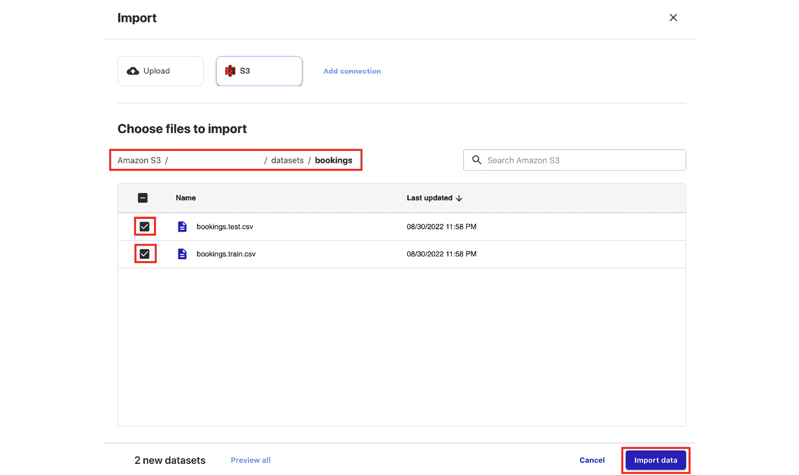

# 第一章：AWS 上的机器学习工程简介

我们大多数人都是通过在笔记本电脑或家用电脑上使用样本数据集训练第一个机器学习模型（**机器学习**，**ML**）来开始我们的机器学习之旅的。事情在需要处理大量数据集并在云中运行我们的机器学习实验之前相对简单。一旦我们需要将我们的训练模型部署到生产级别的推理端点或网络服务器，这也会变得更加具有挑战性。在设计构建机器学习系统时有很多事情要考虑，这些只是数据科学家和机器学习工程师在处理现实需求时面临的一些挑战。话虽如此，我们在云中进行机器学习实验和部署时，必须使用正确的平台，以及正确的一套工具。

在这一点上，你可能想知道为什么我们甚至需要使用云平台来运行我们的工作负载。*难道我们不能自己构建这个平台吗*？也许你可能会想，建立和运营自己的数据中心相对容易。在过去，不同的团队和公司试图在他们的数据中心和本地硬件上设置基础设施。随着时间的推移，这些公司开始将他们的工作负载迁移到云中，因为他们意识到管理和运营数据中心是多么困难和昂贵。一个很好的例子是 *Netflix* 团队，他们将资源迁移到了 **AWS** 云。迁移到云使他们能够更好地扩展，并显著提高了服务可用性。

**亚马逊网络服务**（**AWS**）平台为全球的专业人士和企业提供了大量的服务和功能，可以用来在云中管理不同类型的工作负载。在过去几年中，AWS 宣布并发布了许多服务和功能，这些服务和功能可以用于生产级别的机器学习实验和部署。这是由于全球机器学习工作负载迁移到云中的增加。随着我们阅读本书中的每一章，我们将更好地了解如何使用不同的服务来解决在生产中部署机器学习模型时的挑战。

下面的图表显示了本章的动手实践之旅：


图 1.1 – 本章的动手实践之旅

在本章的入门部分，我们将通过在 AWS 上构建机器学习模型时尝试不同的选项来“湿脚”。如图所示，我们将使用各种 **AutoML** 服务和解决方案来构建可以帮助我们根据可用信息预测酒店预订是否会取消的机器学习模型。我们将首先设置一个 **Cloud9** 环境，这将帮助我们通过浏览器中的 **集成开发环境**（**IDE**）运行我们的代码。在这个环境中，我们将使用名为 **Conditional Generative Adversarial Network** 的 **深度学习** 模型生成一个真实的合成数据集。我们将使用 **AWS CLI** 将此数据集上传到 **Amazon S3**。在 Cloud9 环境中，我们还将安装 **AutoGluon** 并运行一个 **AutoML** 实验，使用合成数据集训练和生成多个模型。最后，我们将使用 **SageMaker Canvas** 和 **SageMaker Autopilot** 在 S3 上运行使用上传数据集的 AutoML 实验。如果你想知道这些术语是什么意思，请继续阅读，我们将在本章中揭示每个术语的奥秘。

本章将涵盖以下主题：

+   机器学习工程师的期望是什么？

+   如何让机器学习工程师充分利用 AWS

+   必要的先决条件

+   准备数据集

+   使用 AutoGluon 进行 AutoML

+   开始使用 SageMaker 和 SageMaker Canvas

+   使用 SageMaker Canvas 进行无代码机器学习

+   使用 SageMaker Autopilot 进行 AutoML

除了使用关键机器学习服务、库和工具进行 AutoML 实验“湿脚”之外，本章入门部分还将帮助我们更好地理解几个与本书后续章节相关的机器学习和机器学习工程概念。考虑到这一点，让我们开始吧！

# 技术要求

在我们开始之前，我们必须有一个 AWS 账户。如果您还没有 AWS 账户，请在此处创建一个账户：[`aws.amazon.com/free/`](https://aws.amazon.com/free/)。一旦账户准备好，您就可以进行下一步了。

每一章的 Jupyter 笔记本、源代码和其他文件都可以在这个书的 GitHub 仓库中找到：[`github.com/PacktPublishing/Machine-Learning-Engineering-on-AWS`](https://github.com/PacktPublishing/Machine-Learning-Engineering-on-AWS).

# 机器学习工程师的期望是什么？

机器学习工程涉及使用机器学习和 **软件工程** 概念和技术来设计、构建和管理生产级机器学习系统，以及管道。在一个致力于构建机器学习应用程序的团队中，**机器学习工程师** 通常被期望构建和运营用于训练和部署模型的机器学习基础设施。在某些情况下，数据科学家可能还需要处理与基础设施相关的要求，特别是在组织内部机器学习工程师和数据科学家的角色和责任没有明确划分的情况下。

当设计和构建机器学习系统和平台时，机器学习工程师应该考虑几个因素。这包括部署的机器学习模型的**质量**，以及所使用的机器学习基础设施的**安全性**、**可扩展性**、**可进化性**、**稳定性**和**总体成本**。在这本书中，我们将讨论实现机器学习工程师不同目标的策略和最佳实践。

机器学习工程师还应该能够使用各种解决方案设计和构建自动化的机器学习工作流程。部署的模型会随着时间的推移而退化，**模型重新训练**对于确保部署的机器学习模型的质量变得至关重要。拥有自动化的机器学习管道有助于实现自动化的模型重新训练和部署。

重要提示

如果你热衷于学习如何在 AWS 上构建定制的机器学习管道，那么你应该查看这本书的最后一部分：*设计和构建端到端 MLOps 管道*。你应该会找到几个章节专门讨论如何在 AWS 上部署复杂的机器学习管道！

# 机器学习工程师如何充分利用 AWS

AWS 平台中有许多服务和功能，机器学习工程师可以选择。已经熟悉使用虚拟机的专业人士可以轻松启动**EC2**实例，并在这些虚拟私有服务器内部使用深度学习框架运行机器学习实验。例如，**AWS Glue**、**Amazon EMR**和**AWS Athena**等服务可以被机器学习工程师和数据工程师用于不同的数据管理和处理需求。一旦机器学习模型需要部署到专用的推理端点，就会有各种选择：


图 1.2 – AWS 机器学习堆栈

如前图所示，数据科学家、开发人员和机器学习工程师可以利用**AWS 机器学习堆栈**中的多个服务和功能。在**AI 服务**下分组的服务可以很容易地被具有最少机器学习经验的开发者使用。要使用这里列出的服务，我们只需要一些与数据工作的经验，以及使用 SDK 和 API 所需的软件开发技能。如果我们想快速构建具有语言翻译、文本到语音和产品推荐等功能的机器学习应用程序，那么我们可以很容易地使用 AI 服务桶下的服务。中间部分是**机器学习服务**及其功能，这些功能有助于解决数据科学家和机器学习工程师更定制的机器学习需求。要使用这里列出的服务和功能，需要对机器学习过程有一个扎实的理解。最外层是**机器学习框架和基础设施**，它提供了最高级别的灵活性和可定制性，因为它包括更高级用例所需的机器学习基础设施和框架支持。

那么，机器学习工程师如何充分利用 AWS 机器学习堆栈呢？随着他们对 AWS 平台中可用的服务、功能和工具越来越熟悉，机器学习工程师设计、构建和管理机器学习系统的能力也会提高。他们可能从 AI 服务开始，快速在 AWS 上构建 AI 应用程序。随着时间的推移，这些机器学习工程师将利用底层两个不同层的服务、功能和基础设施，因为他们越来越擅长处理中级机器学习工程需求。

# 必要的先决条件

在本节中，我们将准备以下内容：

+   Cloud9 环境

+   S3 存储桶

+   将使用深度学习模型生成的合成数据集

让我们开始吧。

## 创建 Cloud9 环境

在虚拟私有服务器内部执行机器学习实验时，更方便的选项之一是使用**AWS Cloud9**服务。AWS Cloud9 允许开发人员、数据科学家和机器学习工程师使用浏览器在开发环境中管理和运行代码。代码存储和执行在 EC2 实例内部，这提供了一个与大多数开发人员相似的环境。

重要提示

建议在运行本书中的示例时使用具有有限权限的**身份和访问管理（IAM**）用户，而不是 root 账户。我们将在*第九章**，安全、治理和合规策略*中详细讨论这一点，以及其他安全最佳实践。如果你刚开始使用 AWS，你可以暂时使用 root 账户。

按照以下步骤创建一个 Cloud9 环境，我们将在此生成合成数据集并运行**AutoGluon AutoML**实验：

1.  在搜索栏中输入`cloud9`。从结果列表中选择**Cloud9**：


图 1.3 – 导航到 Cloud9 控制台

在这里，我们可以看到区域当前设置为`us-west-2`)。请确保您将其更改为您希望创建资源的位置。

1.  接下来，点击**创建环境**。

1.  在`mle-on-aws`)下点击**下一步**。

1.  在**环境类型**下，选择**为环境创建新的 EC2 实例（直接访问）**。对于**实例类型**选择**m5.large**，然后对于**平台**选择**Ubuntu Server (18.04 LTS)**：


图 1.4 – 配置 Cloud9 环境设置

在这里，我们可以看到实例类型还有其他选项。同时，我们将坚持使用**m5.large**，因为它应该足以运行本章的手动解决方案。

1.  对于**节省成本设置**选项，从下拉列表中选择**四小时后**。这意味着运行 Cloud9 环境的服务器将在 4 小时不活动后自动关闭。

1.  在`vpc-abcdefg (默认)`下。对于`subnet-abcdefg | Default in us-west-2a`。

重要提示

建议您使用默认的 VPC，因为网络配置很简单。这将帮助您避免问题，尤其是如果您刚开始使用 VPC。如果在启动 Cloud9 实例时遇到任何与 VPC 相关的问题，您可能需要检查所选子网是否已在 VPC 控制台的路由表配置中配置了互联网访问。您可以使用另一个子网或完全使用新的 VPC 重试启动实例。如果您计划创建新的 VPC，请导航至[`go.aws/3sRSigt`](https://go.aws/3sRSigt)并创建一个**具有单个公共子网的 VPC**。如果这些选项都不起作用，您可能需要在另一个区域启动 Cloud9 实例。我们将在*第九章**，安全、治理和合规策略*中详细讨论**虚拟专用网络**（**VPC**）网络。

1.  点击**下一步**。

1.  在审查页面上，点击**创建环境**。这应该会将您重定向到 Cloud9 环境，该环境可能需要一分钟或更长时间来加载。Cloud9 **IDE**如以下截图所示。这是我们编写代码和运行脚本以及执行工作于本书中一些动手解决方案所需的命令的地方：


图 1.5 – AWS Cloud9 界面

使用这个 IDE 相当简单，因为它看起来非常类似于代码编辑器，如**Visual Studio Code**和**Sublime Text**。如图所示，我们可以在顶部找到**菜单栏**（**A**）。**文件树**可以在左侧找到（**B**）。**编辑器**占据了屏幕中间的大部分区域（**C**）。最后，我们可以在底部找到**终端**（**D**）。

重要提示

如果这是您第一次使用 AWS Cloud9，这里有一个 AWS 提供的 4 分钟入门视频，可以帮助您开始：[`www.youtube.com/watch?v=JDHZOGMMkj8`](https://www.youtube.com/watch?v=JDHZOGMMkj8)。

现在我们已经准备好了 Cloud9 环境，是时候配置更大的存储空间了。

## 增加 Cloud9 的存储空间

当创建 Cloud9 实例时，附加的卷最初只有 10GB 的磁盘空间。鉴于我们将在该实例中运行 ML 实验并安装不同的库和框架，我们需要超过 10GB 的磁盘空间。我们将使用`boto3`库以编程方式调整卷大小。

重要提示

如果这是您第一次使用`boto3`库，它是**AWS SDK for Python**，它为我们提供了一种以编程方式管理我们 AWS 账户中不同 AWS 资源的方法。这是一个服务级别的 SDK，它帮助我们列出、创建、更新和删除 AWS 资源，如 EC2 实例、S3 存储桶和 EBS 卷。

按照以下步骤下载并运行一些脚本，将卷磁盘空间从 10GB 增加到 120GB：

1.  在我们的 Cloud9 环境终端中（屏幕底部的`$`符号之后），运行以下 bash 命令：

    ```py
    wget -O resize_and_reboot.py https://bit.ly/3ea96tW
    ```

这将下载位于[`bit.ly/3ea96tW`](https://bit.ly/3ea96tW)的脚本文件。在这里，我们只是使用了一个 URL 缩短器，它将缩短的链接映射到[`raw.githubusercontent.com/PacktPublishing/Machine-Learning-Engineering-on-AWS/main/chapter01/resize_and_reboot.py`](https://raw.githubusercontent.com/PacktPublishing/Machine-Learning-Engineering-on-AWS/main/chapter01/resize_and_reboot.py)。

重要提示

注意，我们在使用`wget`命令时使用的是大写`O`标志，而不是小写`o`或零（`0`）。

1.  我们刚刚下载的文件里有什么？在我们运行脚本之前，让我们快速检查一下文件。双击文件树（位于屏幕左侧）中的`resize_and_reboot.py`文件，在编辑器窗格中打开 Python 脚本文件。如图所示，`resize_and_reboot.py`脚本有三个主要部分。第一段代码专注于导入运行脚本所需的先决条件。第二段代码专注于使用`boto3`库调整所选 EC2 实例的卷大小。它使用`describe_volumes()`方法获取当前实例的卷 ID，然后使用`modify_volume()`方法将卷大小更新为 120GB。最后一部分涉及一行代码，该代码简单地重启 EC2 实例。此行代码使用`os.system()`方法运行`sudo reboot`shell 命令：


图 1.6 – `resize_and_reboot.py`脚本文件

您可以在本书的 GitHub 仓库中找到`resize_and_reboot.py`脚本文件：[`github.com/PacktPublishing/Machine-Learning-Engineering-on-AWS/blob/main/chapter01/resize_and_reboot.py`](https://github.com/PacktPublishing/Machine-Learning-Engineering-on-AWS/blob/main/chapter01/resize_and_reboot.py)。请注意，为了使此脚本正常工作，必须将`EC2_INSTANCE_ID`环境变量设置为选择正确的目标实例。我们将在运行`resize_and_reboot.py`脚本之前设置此环境变量。

1.  接下来，在终端中运行以下命令：

    ```py
    python3 -m pip install --user --upgrade boto3
    ```

这将使用`pip`升级`boto3`的版本。

重要提示

如果这是您第一次使用`pip`，它是 Python 的包安装程序。它使得使用命令行安装不同的包和库变得方便。

您可以使用`python3 -m pip show boto3`来检查您正在使用的版本。本书假设您正在使用`1.20.26`或更高版本。

1.  剩余的语句专注于从实例元数据服务获取 Cloud9 环境的`instance_id`并将其存储在`EC2_INSTANCE_ID`变量中。让我们在终端中运行以下命令：

    ```py
    TARGET_METADATA_URL=http://169.254.169.254/latest/meta-data/instance-id
    ```

    ```py
    export EC2_INSTANCE_ID=$(curl -s $TARGET_METADATA_URL)
    ```

    ```py
    echo $EC2_INSTANCE_ID
    ```

这应该给我们一个格式类似于`i-01234567890abcdef`的 EC2 实例 ID。

1.  现在我们已经将`EC2_INSTANCE_ID`环境变量设置为适当的值，我们可以运行以下命令：

    ```py
    python3 resize_and_reboot.py
    ```

这将使用`wget`命令运行我们之前下载的 Python 脚本。在用`boto3`执行卷大小调整操作后，脚本将重启实例。当 Cloud9 环境的 EC2 实例正在重启时，您应该在页面顶部看到**正在重新连接…**的通知。

重要提示

实例重启后，您可以自由运行`lsblk`命令。这应该有助于您验证 Cloud9 环境实例的卷已调整为 120GB。

现在我们已成功将卷大小调整为 120GB，我们应该能够在不担心 Cloud9 环境内部磁盘空间问题的前提下，继续处理下一组解决方案。

## 安装 Python 必备组件

按照以下步骤在 Cloud9 环境中安装和更新几个 Python 包：

1.  在我们的 Cloud9 环境终端（屏幕底部的`$`符号之后），运行以下命令以更新`pip`、`setuptools`和`wheel`：

    ```py
    python3 -m pip install -U pip
    ```

    ```py
    python3 -m pip install -U setuptools wheel
    ```

升级这些版本将帮助我们确保其他安装步骤能够顺利执行。本书假设您正在使用以下版本或更高版本：`pip` – `21.3.1`、`setuptools` – `59.6.0`和`wheel` – `0.37.1`。

重要提示

要检查版本，您可以在终端中使用`python3 -m pip show <package>`命令。只需将`<package>`替换为包的名称。例如，可以使用`python3 -m pip show wheel`。如果您想安装特定版本的包，可以使用`python3 -m pip install -U <package>==<version>`。例如，如果您想安装`wheel`版本`0.37.1`，可以运行`python3 -m pip install -U wheel==0.37.1`。

1.  接下来，通过运行以下命令安装`ipython`。**IPython**提供许多实用的工具，帮助专业人士交互式地使用 Python。我们将在*执行第一个 AutoGluon AutoML 实验*部分中看到使用 IPython 有多简单：

    ```py
    python3 -m pip install ipython
    ```

本书假设您正在使用`ipython` – `7.16.2`或更高版本。

1.  现在，让我们安装`ctgan`。CTGAN 允许我们利用**生成对抗网络**（**GAN**）深度学习模型来生成合成数据集。我们将在安装 Python 必备组件后，在*使用深度学习模型生成合成数据集*部分中简要讨论这一点：

    ```py
    python3 -m pip install ctgan==0.5.0
    ```

本书假设您正在使用`ctgan` – `0.5.0`。

重要提示

此步骤可能需要大约 5 到 10 分钟才能完成。在等待期间，让我们谈谈 CTGAN 是什么。**CTGAN**是一个开源库，它使用深度学习来了解现有数据集的特性，并生成一个具有与原始数据集相似列、值和特性的新数据集。有关更多信息，请随时查看其 GitHub 页面：[`github.com/sdv-dev/CTGAN`](https://github.com/sdv-dev/CTGAN)。

1.  最后，通过运行以下命令安装`pandas_profiling`。这使我们能够轻松地为我们的数据集生成一个概要报告，这将有助于我们进行**探索性数据分析**（**EDA**）工作。我们将在生成合成数据集后，在*探索性数据分析*部分看到这一功能：

    ```py
    python3 -m pip install pandas_profiling
    ```

本书假设您正在使用`pandas_profiling` – `3.1.0`或更高版本。

现在我们已经完成了 Python 必备条件的安装，我们可以开始使用深度学习模型生成逼真的合成数据集了！

# 准备数据集

在本章中，我们将构建多个机器学习模型，这些模型将**根据可用信息预测酒店预订是否会取消**。酒店取消给酒店业主和管理者带来了很多问题，因此尝试预测哪些预订会被取消是运用我们的机器学习技能的好方法。

在我们开始进行机器学习实验之前，我们需要一个可以用于训练我们的机器学习模型的数据库。我们将生成一个类似于*Nuno Antonio*、*Ana de Almeida*和*Luis Nunes*的*酒店预订需求*数据集的逼真合成数据集。

合成数据集将包含总共 21 列。以下是一些列的示例：

+   `is_cancelled`: 指示酒店预订是否被取消

+   `lead_time`: [*到达日期*] – [*预订日期*]

+   `adr`: 平均每日房价

+   `adults`: 成人数量

+   `days_in_waiting_list`: 预订在确认前在等待名单上停留的天数

+   `assigned_room_type`: 分配的房间类型

+   `total_of_special_requests`: 客户提出的特殊请求总数

我们不会详细讨论每个字段，但这应该有助于我们了解我们可以使用哪些数据。更多信息，您可以在[`www.kaggle.com/jessemostipak/hotel-booking-demand`](https://www.kaggle.com/jessemostipak/hotel-booking-demand)和[`www.sciencedirect.com/science/article/pii/S2352340918315191`](https://www.sciencedirect.com/science/article/pii/S2352340918315191)找到该数据集的原始版本。

## 使用深度学习模型生成合成数据集

机器学习的一个酷应用就是让一个**深度学习**模型“吸收”现有数据集的特性，并生成一个具有相似字段和特性的新数据集。我们将使用预训练的**生成对抗网络**（**GAN**）模型来生成合成数据集。

重要提示

**生成建模**涉及从输入数据集的值中学习模式，然后使用这些模式生成一个具有相似值的新数据集。GANs 在生成建模中很受欢迎。例如，研究论文已经关注 GANs 如何被用来生成“deepfakes”，即从源数据集中生成逼真的人类图像。

生成和使用合成数据集有很多好处，包括以下内容：

+   能够生成比用于训练模型的原始数据集更大的数据集的能力

+   能够匿名化原始数据集中任何敏感信息的能力

+   在数据生成后能够拥有一个更干净的数据集版本

话虽如此，让我们通过在 Cloud9 环境的终端中运行以下命令来开始生成合成数据集（屏幕底部的 `$` 符号之后）：

1.  从 *安装 Python 先决条件* 部分的我们停止的地方继续，运行以下命令以在当前工作目录中创建一个名为 `tmp` 的空目录：

    ```py
    mkdir -p tmp
    ```

注意，这与 `/tmp` 目录不同。

1.  接下来，让我们使用 `wget` 命令下载 `utils.py` 文件：

    ```py
    wget -O utils.py https://bit.ly/3CN4owx
    ```

`utils.py` 文件包含 `block()` 函数，这将帮助我们阅读和调试脚本生成的日志。

1.  运行以下命令将预构建的 GAN 模型下载到 Cloud9 环境：

    ```py
    wget -O hotel_bookings.gan.pkl https://bit.ly/3CHNQFT
    ```

在这里，我们有一个包含深度学习模型属性的序列化 pickle 文件。

重要提示

存储和加载 ML 模型有多种方式。其中一种选择是使用 **Pickle** 模块将 Python 对象序列化并存储在文件中。该文件可以稍后加载并反序列化为具有类似属性集的 Python 对象。

1.  使用 `touch` 命令创建一个空的 `data_generator.py` 脚本文件：

    ```py
    touch data_generator.py
    ```

重要提示

在继续之前，请确保 `data_generator.py`、`hotel_bookings.gan.pkl` 和 `utils.py` 文件位于同一目录中，以便合成数据生成器脚本能够正常工作。

1.  双击文件树中的 `data_generator.py` 文件（位于 Cloud9 环境的左侧）以在编辑器面板中打开空的 Python 脚本文件。

1.  将以下代码行添加到脚本中，以导入运行脚本所需的先决条件：

    ```py
    from ctgan import CTGANSynthesizer
    ```

    ```py
    from pandas_profiling import ProfileReport
    ```

    ```py
    from utils import block, debug
    ```

1.  接下来，让我们添加以下代码行以加载预训练的 GAN 模型：

    ```py
    with block('LOAD CTGAN'):
    ```

    ```py
        pkl = './hotel_bookings.gan.pkl'
    ```

    ```py
        gan = CTGANSynthesizer.load(pkl)
    ```

    ```py
        print(gan.__dict__)
    ```

1.  在终端中运行以下命令（屏幕底部的 `$` 符号之后）以测试脚本中的初始代码块是否按预期工作：

    ```py
    python3 data_generator.py
    ```

这应该会给我们一组类似于以下截图所示的日志：


图 1.7 – 脚本成功加载的 GAN 模型

在这里，我们可以看到使用 `CTGANSynthesizer.load()` 方法成功加载了预训练的 GAN 模型。我们还可以看到 `block`（来自我们之前下载的 `utils.py` 文件）是如何提高我们日志的可读性的。它只是帮助标记代码块执行的开始和结束，这样我们就可以轻松调试脚本。

1.  让我们回到编辑器面板（我们在这里编辑 `data_generator.py`）并添加以下代码行：

    ```py
    with block('GENERATE SYNTHETIC DATA'):
    ```

    ```py
        synthetic_data = gan.sample(10000)
    ```

    ```py
        print(synthetic_data)
    ```

当我们稍后运行脚本时，这些代码行将生成 `10000` 条记录并将它们存储在 `synthetic_data` 变量中。

1.  接下来，让我们添加以下代码块，它将生成的数据保存到 `tmp` 目录内的 CSV 文件中：

    ```py
    with block('SAVE TO CSV'):
    ```

    ```py
        target_location = "tmp/bookings.all.csv"
    ```

    ```py
        print(target_location)
    ```

    ```py
        synthetic_data.to_csv(
    ```

    ```py
            target_location, 
    ```

    ```py
            index=False
    ```

    ```py
        )
    ```

1.  最后，让我们添加以下几行代码来完成脚本：

    ```py
    with block('GENERATE PROFILE REPORT'):
    ```

    ```py
        profile = ProfileReport(synthetic_data)
    ```

    ```py
        target_location = "tmp/profile-report.xhtml"
    ```

    ```py
        profile.to_file(target_location)
    ```

这段代码将分析合成数据集并生成一个配置报告，以帮助我们分析数据集的特性。

重要提示

你可以在这里找到 `data_generator.py` 文件的副本：[`github.com/PacktPublishing/Machine-Learning-Engineering-on-AWS/blob/main/chapter01/data_generator.py`](https://github.com/PacktPublishing/Machine-Learning-Engineering-on-AWS/blob/main/chapter01/data_generator.py)。

1.  一切准备就绪后，让我们在终端中运行以下命令（屏幕底部的 `$` 符号右侧）：

    ```py
    python3 data_generator.py
    ```

脚本完成应该需要大约一分钟的时间。运行脚本应该会给我们一组类似于以下截图所示的日志：


图 1.8 – 由 data_generator.py 生成的日志

如我们所见，运行 `data_generator.py` 脚本会生成多个日志块，这应该使我们能够轻松阅读和调试脚本运行时的操作。除了加载 CTGAN 模型外，脚本还将使用深度学习模型（`tmp` 目录中的 `tmp/bookings.all.csv`）生成合成数据集（`pandas_profiling`（**C**）。

难道不是很容易吗？在进入下一节之前，请随意使用文件树（位于屏幕底部的 `$` 符号左侧的 Cloud9 环境中）来检查存储在 `tmp` 目录中的生成的文件。

## 探索性数据分析

到目前为止，我们应该有一个包含 `10000` 行的合成数据集。你可能想知道我们的数据看起来像什么。我们的数据集是否包含无效值？我们是否需要担心缺失的记录？在我们进行任何模型训练工作之前，我们必须对我们的数据集有一个很好的理解，因为我们可能需要先清理和处理数据。EDA 是在分析数据集以用于训练机器学习模型之前的关键步骤。有不同方式来分析数据集并生成报告——使用 `pandas_profiling` 是执行 EDA 的更快方式之一。

话虽如此，让我们检查由 `pandas_profiling` Python 库生成的报告。在文件树（位于 Cloud9 环境左侧）中右键单击 `tmp/profile-report.xhtml`，然后从选项列表中选择 **预览**。我们应该找到一个类似于以下报告：


图 1.9 – 生成的报告

报告包含多个部分：**概述**、**变量**、**交互**、**相关性**、**缺失值**和**样本**。在**概述**部分，我们可以找到数据集统计信息和变量类型的快速总结。这包括变量的数量、记录（观测）的数量、缺失单元格的数量、重复行的数量以及其他相关统计信息。在**变量**部分，我们可以找到数据集中每个变量（列）的统计信息和值分布。在**交互**和**相关性**部分，我们可以看到关于数据集中变量潜在关系的不同模式和观察。在**缺失值**部分，我们可以看到是否有需要我们注意的缺失值的列。最后，在**样本**部分，我们可以看到数据集的前 10 行和最后 10 行。

在进入下一节之前，请随意阅读报告。

## 训练-测试集划分

现在我们已经完成了 EDA（探索性数据分析），接下来我们做什么？假设我们的数据是干净的，并且已经准备好进行模型训练，我们是否直接使用生成的 10,000 条记录来训练和构建我们的机器学习模型？在我们训练二元分类器模型之前，我们必须将我们的数据集划分为训练集和测试集：


图 1.10 – 训练-测试集划分

如我们所见，**训练集**用于在训练阶段构建模型并更新其参数。然后，**测试集**用于评估模型在之前未见过的数据上的最终版本。这里没有展示的是**验证集**，它用于在模型训练阶段评估模型以微调**超参数**。在实践中，将数据集划分为训练集、验证集和测试集的比例通常在**60:20:20**左右，其中训练集获得大部分记录。在本章中，我们不再需要将训练集进一步划分为更小的训练集和验证集，因为 AutoML 工具和服务将自动为我们完成这项工作。

重要提示

在继续本节的手动解决方案之前，我们必须了解超参数和参数的概念。`y = m * x`，其中`m`是参数，`x`是单个预测变量，`y`是目标变量。例如，如果我们正在测试取消（`y`）与收入（`x`）之间的关系，那么`m`是定义这种关系的参数。如果`m`为正，随着收入的增加，取消也会增加。如果它是负的，随着收入的增加，取消会减少。另一方面，**超参数**是在模型训练之前可配置的值，这些值会影响我们选择的机器学习模型如何“建模”关系。每个机器学习模型都有自己的超参数集，这取决于使用的算法。一旦我们查看更多示例，这些概念就会更加清晰，例如在*第二章* *AWS 上的机器学习工程*和*第三章* *深度学习容器*。

现在，让我们创建一个脚本，帮助我们执行训练-测试分割：

1.  在我们的 Cloud9 环境的终端中（屏幕底部的`$`符号之后），运行以下命令以创建一个名为`train_test_split.py`的空文件：

    ```py
    touch train_test_split.py
    ```

1.  使用文件树（位于 Cloud9 环境的左侧），双击`train_test_split.py`文件以在编辑器面板中打开文件。

1.  在编辑器面板中，添加以下代码行以导入运行脚本所需的先决条件：

    ```py
    import pandas as pd
    ```

    ```py
    from utils import block, debug
    ```

    ```py
    from sklearn.model_selection import train_test_split
    ```

1.  添加以下代码块，它将读取 CSV 文件的内容并将其存储在`DataFrame`中：

    ```py
    with block('LOAD CSV'):
    ```

    ```py
        generated_df = pd.read_csv('tmp/bookings.all.csv')
    ```

1.  接下来，让我们使用 scikit-learn 中的`train_test_split()`函数将我们生成的数据集划分为训练集和测试集：

    ```py
    with block('TRAIN-TEST SPLIT'):
    ```

    ```py
        train_df, test_df = train_test_split(
    ```

    ```py
            generated_df, 
    ```

    ```py
            test_size=0.3, 
    ```

    ```py
            random_state=0
    ```

    ```py
        )
    ```

    ```py
        print(train_df)
    ```

    ```py
        print(test_df)
    ```

1.  最后，添加以下代码行以将训练集和测试集分别保存到`tmp`目录中的相应 CSV 文件中：

    ```py
    with block('SAVE TO CSVs'):
    ```

    ```py
        train_df.to_csv('tmp/bookings.train.csv', 
    ```

    ```py
                        index=False)
    ```

    ```py
        test_df.to_csv('tmp/bookings.test.csv', 
    ```

    ```py
                       index=False)
    ```

重要提示

你可以在这里找到`train_test_split.py`文件的副本：[`github.com/PacktPublishing/Machine-Learning-Engineering-on-AWS/blob/main/chapter01/train_test_split.py`](https://github.com/PacktPublishing/Machine-Learning-Engineering-on-AWS/blob/main/chapter01/train_test_split.py)。

1.  现在我们已经完成了脚本文件，让我们在终端中运行以下命令（屏幕底部的`$`符号之后）：

    ```py
    python3 train_test_split.py
    ```

这应该会生成一组类似于以下截图所示的日志：


图 1.11 – 训练-测试分割日志

在这里，我们可以看到我们的训练数据集包含 7,000 条记录，而测试集包含 3,000 条记录。

通过这种方式，我们可以将我们的数据集上传到**Amazon S3**。

## 将数据集上传到 Amazon S3

Amazon S3 是 AWS 的对象存储服务，我们可以在其中存储不同类型的文件，例如数据集 CSV 文件和输出工件。在使用 AWS 的不同服务时，需要注意的是，这些服务有时要求输入数据和文件首先存储在 S3 存储桶中，或者存储在另一个服务创建的资源中。

将数据集上传到 S3 应该很简单。继续我们在*训练-测试分割*部分留下的内容，我们将在终端运行以下命令：

1.  在终端运行以下命令。在这里，我们将创建一个新的 S3 存储桶，它将包含我们在本章中使用的数据。请确保将 `<INSERT BUCKET NAME HERE>` 的值替换为一个在所有 AWS 用户中全局唯一的存储桶名称：

    ```py
    BUCKET_NAME="<INSERT BUCKET NAME HERE>"
    ```

    ```py
    aws s3 mb s3://$BUCKET_NAME
    ```

关于 S3 存储桶命名规则的更多信息，请随时查看[`docs.aws.amazon.com/AmazonS3/latest/userguide/bucketnamingrules.xhtml`](https://docs.aws.amazon.com/AmazonS3/latest/userguide/bucketnamingrules.xhtml)。

1.  现在 S3 存储桶已经创建，让我们使用**AWS CLI**上传训练和测试数据集：

    ```py
    S3=s3://$BUCKET_NAME/datasets/bookings
    ```

    ```py
    TRAIN=bookings.train.csv
    ```

    ```py
    TEST=bookings.test.csv
    ```

    ```py
    aws s3 cp tmp/bookings.train.csv $S3/$TRAIN
    ```

    ```py
    aws s3 cp tmp/bookings.test.csv $S3/$TEST
    ```

现在一切准备就绪，我们可以进行激动人心的部分了！是时候我们使用各种解决方案和服务执行多个**AutoML**实验了。

# 使用 AutoGluon 进行 AutoML

之前，我们讨论了什么是**超参数**。在训练和调整机器学习模型时，了解机器学习模型的性能取决于算法、训练数据以及训练模型时使用的超参数配置对我们来说非常重要。其他输入配置参数也可能影响模型的性能，但我们现在将专注于这三个方面。团队不是训练单个模型，而是使用各种超参数配置构建多个模型。超参数配置的变化和调整会影响模型的性能——一些会导致更好的性能，而另一些则会导致更差的表现。尝试所有可能的超参数配置组合需要时间，尤其是如果模型调整过程没有自动化的话。

在过去几年中，几个库、框架和服务使团队能够充分利用 **自动化机器学习**（**AutoML**）来自动化 ML 流程的不同部分。最初，AutoML 工具专注于自动化 **超参数优化**（**HPO**）过程以获得最佳的超参数值组合。在运行训练作业时，我们不需要花费数小时（甚至数天）手动尝试不同的超参数组合，我们只需配置、运行并等待这个自动化程序帮助我们找到最佳的超参数值组合。多年来，几个专注于自动化超参数优化的工具和库可供 ML 实践者使用。过了一段时间，ML 工作流程的其他方面和过程也被自动化并包含在 AutoML 流程中。

对于 AutoML，有几种工具和服务可用，其中最受欢迎的选项之一是 **AutoGluon**。使用 **AutoGluon**，我们可以使用不同的算法训练多个模型，并通过几行代码来评估它们：


图 1.12 – AutoGluon 排行榜 – 使用各种算法训练的模型

与前面截图所示类似，我们还可以使用排行榜比较生成的模型。在本章中，我们将使用 AutoGluon 与表格数据集。然而，重要的是要注意，AutoGluon 也支持为文本和图像数据执行 AutoML 任务。

## 设置和安装 AutoGluon

在使用 AutoGluon 之前，我们需要安装它。安装过程可能需要一分钟或更长时间：

1.  在安装 AutoGluon 之前，请在终端中运行以下命令来安装和更新先决条件：

    ```py
    python3 -m pip install -U "mxnet<2.0.0"
    ```

    ```py
    python3 -m pip install numpy
    ```

    ```py
    python3 -m pip install cython
    ```

    ```py
    python3 -m pip install pyOpenSSL --upgrade
    ```

本书假设您正在使用以下版本或更高版本：`mxnet` – `1.9.0`，`numpy` – `1.19.5`，和 `cython` – `0.29.26`。

1.  接下来，运行以下命令来安装 `autogluon`：

    ```py
    python3 -m pip install autogluon
    ```

本书假设您正在使用 `autogluon` 版本 `0.3.1` 或更高版本。

重要提示

此步骤可能需要大约 5 到 10 分钟才能完成。您可以随意拿一杯咖啡或茶！

在我们的 Cloud9 环境中安装了 AutoGluon 后，让我们开始我们的第一个 AutoGluon AutoML 实验。

## 执行您的第一个 AutoGluon AutoML 实验

如果您已经使用了 `fit()` 和 `predict()`，请按照以下步骤操作：

1.  首先，请在终端中运行以下命令：

    ```py
    ipython
    ```

这将打开 **IPython** **读取-评估-打印循环**（**REPL**）/交互式外壳。我们将像使用 **Python shell** 一样使用它。

1.  在控制台中，键入（或复制）以下代码块。确保在键入关闭括号后按 *Enter*：

    ```py
    from autogluon.tabular import (
    ```

    ```py
        TabularDataset,
    ```

    ```py
        TabularPredictor
    ```

    ```py
    )
    ```

1.  现在，让我们通过运行以下语句将存储在 `bookings.train.csv` 和 `bookings.test.csv` 文件中的合成数据分别加载到 `train_data` 和 `test_data` 变量中：

    ```py
    train_loc = 'tmp/bookings.train.csv'
    ```

    ```py
    test_loc = 'tmp/bookings.test.csv'
    ```

    ```py
    train_data = TabularDataset(train_loc)
    ```

    ```py
    test_data = TabularDataset(test_loc)
    ```

由于 AutoGluon 的父类`TabularDataset`是一个 pandas DataFrame，我们可以在`train_data`和`test_data`上使用不同的方法，如`head()`、`describe()`、`memory_usage()`等。

1.  接下来，运行以下代码行：

    ```py
    label = 'is_cancelled'
    ```

    ```py
    save_path = 'tmp'
    ```

    ```py
    tp = TabularPredictor(label=label, path=save_path)
    ```

    ```py
    predictor = tp.fit(train_data)
    ```

在这里，我们将`is_cancelled`指定为 AutoML 任务的目标变量，并将`tmp`目录指定为生成的模型将被存储的位置。此代码块将使用我们提供的训练数据，使用不同的算法训练多个模型。AutoGluon 将自动检测我们正在处理的是一个二元分类问题，并使用多种机器学习算法生成多个二元分类器模型。

重要提示

在`tmp/models`目录内，我们应该找到`CatBoost`、`ExtraTreesEntr`和`ExtraTreesGini`，以及其他与 AutoML 任务中使用的算法对应的目录。这些目录中的每一个都包含一个`model.pkl`文件，其中包含序列化的模型。为什么我们有多个模型？在幕后，AutoGluon 运行了大量的训练实验，使用各种算法以及不同超参数值的组合，以产生“最佳”模型。使用某种评估指标来选择“最佳”模型，该指标有助于识别哪个模型比其他模型表现更好。例如，如果使用的评估指标是*准确率*，那么准确率为 90%（每 10 次尝试中有 9 次正确）的模型比准确率为 80%（每 10 次尝试中有 8 次正确）的模型“更好”。话虽如此，一旦模型生成并评估完毕，AutoGluon 将简单地选择评估指标值（例如，*准确率*）最高的模型，并将其标记为“最佳模型”。

1.  现在我们已经准备好了“最佳模型”，接下来我们该做什么？下一步是我们使用测试数据集来评估“最佳模型”。换句话说，让我们准备测试数据集以进行推理，通过移除目标标签：

    ```py
    y_test = test_data[label]
    ```

    ```py
    test_data_no_label = test_data.drop(columns=[label])
    ```

1.  一切准备就绪后，让我们使用`predict()`方法来预测提供的测试数据集的`is_cancelled`列值：

    ```py
    y_pred = predictor.predict(test_data_no_label)
    ```

1.  现在我们已经有了实际的*y*值（`y_test`）和预测的*y*值（`y_pred`），让我们快速检查训练模型的性能，通过使用`evaluate_predictions()`方法：

    ```py
    predictor.evaluate_predictions(
    ```

    ```py
        y_true=y_test, 
    ```

    ```py
        y_pred=y_pred, 
    ```

    ```py
        auxiliary_metrics=True
    ```

    ```py
    )
    ```

之前的代码块应该产生类似于以下性能指标值的输出：

```py
{'accuracy': 0.691...,
 'balanced_accuracy': 0.502...,
 'mcc': 0.0158...,
 'f1': 0.0512...,
 'precision': 0.347...,
 'recall': 0.0276...}
```

在这一步，我们使用各种公式比较实际值与目标列预测值之间的接近程度。在这里，训练模型的目的是在未见数据上尽可能少犯错误。更好的模型通常在性能指标如**准确率**、**马修斯相关系数**（**MCC**）和**F1 分数**上得分更高。我们不会在这里详细介绍模型性能指标的工作原理。如有需要，请自由查阅[`bit.ly/3zn2crv`](https://bit.ly/3zn2crv)获取更多信息。

1.  现在我们已经完成了快速实验，让我们退出**IPython** shell：

    ```py
    exit()
    ```

使用 AutoGluon 我们还可以做更多的事情，但这应该有助于我们欣赏使用 AutoGluon 进行 AutoML 实验的简便性。我们还可以使用其他方法，例如`leaderboard()`、`get_model_best()`和`feature_importance()`，如有需要，请自由查阅[`auto.gluon.ai/stable/index.xhtml`](https://auto.gluon.ai/stable/index.xhtml)获取更多信息。

# 开始使用 SageMaker 和 SageMaker Studio

在 AWS 上执行机器学习和机器学习工程时，专业人士应考虑使用**Amazon SageMaker**的一个或多个功能和特性。如果你是第一次了解 SageMaker，它是一个全托管的机器学习服务，有助于显著加快准备、训练、评估和部署机器学习模型的过程。

如果你想知道这些功能是什么，请查看*《如何利用 AWS 的机器学习工程师》*章节中*图 1.2*下标记为**ML 服务**的一些功能。随着我们阅读本书的不同章节，我们将探讨 SageMaker 的几个功能。在此期间，我们将从 SageMaker Studio 开始，因为在我们处理 SageMaker Canvas 和 SageMaker Autopilot 示例之前，我们需要先设置它。

## 使用 SageMaker Studio 进行入门

**SageMaker Studio**为机器学习从业者提供了一个功能丰富的 IDE。SageMaker Studio 的其中一个优点是它与 SageMaker 的其他功能紧密集成，这使我们能够仅通过界面来管理不同的 SageMaker 资源。

为了让我们对它的外观和工作方式有一个良好的了解，让我们继续设置和配置 SageMaker Studio：

1.  在 AWS 控制台的搜索栏中，输入`sagemaker studio`。在**功能**下选择**SageMaker Studio**。

1.  选择**标准设置**，如图下截图所示：


图 1.13 – 设置 SageMaker 域

如我们所见，**标准设置**应该会给我们提供比**快速设置**更多的配置选项来调整。在点击**配置**按钮之前，请确保您使用的是 S3 存储桶和训练及测试数据集所在的相同区域。

1.  在**身份验证**下，选择**AWS 身份和访问管理(IAM)**。在**权限**下的默认执行角色中，选择**创建新角色**。选择**任何 S3 存储桶**。然后，点击**创建角色**。

1.  在`us-west-2a`下)，类似于以下截图所示：


图 1.14 – 网络和存储部分

在这里，我们还已将 SageMaker 域配置为使用默认的 SageMaker 互联网访问，通过选择**仅公共互联网**。在**加密密钥**下，我们选择**无自定义加密**以保持不变。审查配置后，然后点击**下一步**。

重要提示

注意，对于生产环境，最后几步中指定的安全配置需要审查和进一步升级。同时，由于我们处理的是样本数据集，这应该足够了。我们将在*第九章**，安全、治理和合规策略*中详细讨论如何保护环境。

1.  在**工作室设置**下，保持一切不变并点击**下一步**。

1.  类似地，在**常规设置** | **RStudio 工作台**下，点击**提交**。

完成这些步骤后，你应该会看到**准备 SageMaker 域**的加载信息。这一步大约需要 3 到 5 分钟才能完成。完成后，你应该会看到一个通知，表明**SageMaker 域已就绪**。

## 向现有 SageMaker 域添加用户

现在我们已经准备好了**SageMaker 域**，让我们创建一个用户。创建用户很简单，所以让我们开始：

1.  在**SageMaker 域/控制面板**页面，点击**添加用户**。

1.  在**名称**下指定用户名。在**默认执行角色**下，选择你在上一步中创建的执行角色。点击**下一步**。

1.  在**工作室设置** | **SageMaker 项目和 JumpStart**下，点击**下一步**。

1.  在**RStudio 设置** | **Rstudio 工作台**下，点击**提交**。

目前这应该就足够了。在*第九章**，安全、治理和合规策略*中，我们将审查如何改进这里的配置以提高我们环境的安全性。

# 使用 SageMaker Canvas 进行无代码机器学习

在使用更全面的 SageMaker 功能进行 ML 实验和部署之前，让我们首先使用**SageMaker Canvas**构建一个模型。SageMaker Canvas 的一个优点是构建模型和使用它们进行预测不需要编写代码。当然，**SageMaker Autopilot**将提供更强大和灵活的功能集，但 SageMaker Canvas 应该有助于业务分析师、数据科学家和初级 ML 工程师理解 ML 流程并立即开始构建模型。

由于我们的数据集已经上传到 S3 存储桶，我们可以开始构建和训练我们的第一个 SageMaker Canvas 模型：

1.  在**SageMaker 域/控制面板**页面，找到我们刚刚创建的用户所在的行，然后点击**启动应用**。从下拉菜单中选择**Canvas**，如图下所示：


图 1.15 – 启动 SageMaker Canvas

如我们所见，我们可以从**SageMaker 域/控制面板**页面启动 SageMaker Canvas。我们也可以在这里启动 SageMaker Studio，我们将在本章的后面进行操作。

1.  点击**新建模型**：


图 1.16 – SageMaker Canvas 模型页面

在这里，我们有 SageMaker Canvas 的**模型**页面，它应该列出我们已训练的模型。由于我们还没有训练任何东西，我们应该看到**您尚未创建任何模型**的消息。

1.  在`first-model`)中点击**创建**。

1.  当你看到**入门**指南窗口时，点击**跳过介绍**。

1.  在 S3 存储桶的`Amazon S3/<S3 BUCKET>/datasets/bookings`文件夹中点击`booking.train.csv`和`booking.test.csv`文件。



图 1.17 – 选择要导入的文件

选择必要的 CSV 文件，如图中所示，然后点击**导入数据**。

重要提示

注意，如果你在你的账户中有大量的 S3 存储桶，你可能会在“将数据集上传到 S3”部分难以找到我们创建的 S3 存储桶。请随意使用位于右侧、表格上方带有**搜索 Amazon S3**占位符的搜索框。

1.  文件导入完成后，点击包含`bookings.train.csv`的行对应的单选按钮。点击**选择数据集**。

1.  从**目标列**字段的下拉选项列表中选择`is_cancelled`。

1.  接下来，点击**预览模型**（位于**快速构建**按钮下方），如图下所示：


图 1.18 – 构建选项卡

几分钟后，我们应该得到大约 70%的估计准确率。请注意，在这个步骤中，你可能会得到不同的数字。

1.  点击**快速构建**并等待模型准备就绪。

重要提示

此步骤可能需要 15 分钟才能完成。在等待期间，让我们快速讨论**快速构建**和**标准构建**之间的区别。快速构建使用较少的记录进行训练，通常持续 2 到 15 分钟，而标准构建则持续更长的时间——通常大约 2 到 4 小时。重要的是要注意，使用快速构建训练的模型不能在 SageMaker Studio 与其他数据科学家或 ML 工程师共享。另一方面，使用标准构建训练的模型在构建完成后可以共享。

1.  一旦结果可用，您可以通过点击以下截图中的高亮选项卡来打开**评分**选项卡：


图 1.19 – 分析选项卡

我们应该看到一个快速图表，显示用于分析模型的记录数，以及模型做出的正确与错误预测的数量。

重要提示

到目前为止，我们已经构建了一个可以用来预测预订是否会取消的 ML 模型。由于在这个例子中准确率分数只有大约 70%，我们预计模型在 10 次尝试中大约会有 7 次正确答案。在*第十一章**，使用 SageMaker Pipelines 的机器学习管道*中，我们将训练这个模型的改进版本，其准确率分数约为 88%。

1.  一旦我们检查完**分析**选项卡中的不同数字和图表，我们可以通过点击**预测**按钮继续。

1.  点击`bookings.test.csv`并点击**生成预测**。

1.  一旦**状态**列的值设置为**就绪**，将鼠标悬停在行中的**状态**列上，点击 3 个点（在悬停行后出现），然后从选项列表中选择**预览**：


图 1.20 – 批量预测结果

我们应该看到一个值表，类似于前面截图中所显示的。在第一列，我们应该有我们测试数据集每一行的`is_cancelled`字段的预测值。在第二列，我们应该找到预测正确的概率。

重要提示

注意，我们还可以通过点击**预测目标值**下的**单次预测**来使用提供的界面进行单次预测。

1.  最后，让我们登出我们的会话。点击左侧侧边栏中的**账户**图标，然后选择**登出**选项。

重要提示

确保您在使用 SageMaker Canvas 后始终登出当前会话，以避免任何意外费用。有关更多信息，请参阅[`docs.aws.amazon.com/sagemaker/latest/dg/canvas-log-out.xhtml`](https://docs.aws.amazon.com/sagemaker/latest/dg/canvas-log-out.xhtml)。

难道不是很容易吗？现在我们已经对如何使用 SageMaker Canvas 有了很好的了解，让我们使用 SageMaker Autopilot 运行一个 AutoML 实验。

# 使用 SageMaker Autopilot 的 AutoML

**SageMaker Autopilot**允许机器学习从业者构建高质量的机器学习模型，而无需编写一行代码。当然，可以使用 SageMaker Python SDK 编程配置、运行和管理 SageMaker Autopilot 实验，但我们将专注于使用 SageMaker Studio 界面运行 AutoML 实验。在我们配置第一个 Autopilot 实验之前，让我们看看幕后发生了什么：


图 1.21 – 使用 SageMaker Autopilot 的 AutoML

在前面的图中，我们可以看到 SageMaker Autopilot 在运行 AutoML 实验时执行的不同步骤。它从**数据预处理**步骤开始，然后进行**候选模型生成**（管道和算法对）步骤。接着，它继续执行**特征工程**和**模型调优**步骤，这将从不同的模型家族、超参数值和模型性能指标值中产生多个训练模型。具有最佳性能指标值的模型被 Autopilot 作业标记为“最佳模型”。接下来，生成两个报告：**可解释性报告**和**洞察报告**。最后，模型被部署到推理端点。

让我们更深入地了解一下每个步骤中发生的情况：

+   **数据预处理**：数据会自动清理，缺失值会自动填充。

+   **候选定义生成**：生成多个“候选定义”（由数据处理作业和训练作业组成），所有这些都将用于数据集上。

+   **特征工程**：在这里，应用数据转换以执行自动特征工程。

+   **模型调优**：SageMaker 的**自动模型调优**（超参数调优）功能用于使用各种超参数配置值生成多个模型，以找到“最佳模型”。

+   **可解释性报告生成**：使用 SageMaker Clarify（SageMaker 关注 AI **公平性**和**可解释性**的另一个功能）提供的工具生成的模型可解释性报告，利用 SHAP 值帮助解释生成的模型的行为。我们将在*第九章*“安全、治理和合规策略”中稍后更深入地探讨这个话题。

+   **洞察报告生成**：洞察报告包括数据洞察，如标量指标，这些指标有助于我们更好地理解我们的数据集，该报告被生成。

+   **模型部署**：最佳模型被部署到专门的推理端点。在这里，使用目标指标值来确定在模型调优步骤中训练的所有模型中哪个是最佳模型。

重要提示

如果您想知道 AutoML 解决方案是否会完全“取代”数据科学家，那么对您问题的快速回答将是“不会”或“不会很快”。ML 流程的某些特定领域需要数据科学家具备领域知识。AutoML 解决方案有助于提供良好的起点，数据科学家和 ML 从业者可以在其基础上构建。例如，白盒 AutoML 解决方案如 SageMaker Autopilot 可以生成脚本和笔记本，数据科学家和 ML 从业者可以对其进行修改，以产生定制和复杂的数据处理、实验和部署流程和管道。

现在我们对 Autopilot 实验期间发生的事情有了更好的了解，让我们运行我们的第一个 Autopilot 实验：

1.  在**控制面板**页面，点击**启动应用**下拉菜单，从下拉选项列表中选择**Studio**，如图以下截图所示：


图 1.22 – 打开 SageMaker Studio

注意，如果这是您第一次打开**SageMaker Studio**，它可能需要大约 5 分钟才能加载。

重要提示

AWS 定期发布 SageMaker Studio 的更新和升级。为确保您使用的是最新版本，请确保您关闭并更新 SageMaker Studio 和 Studio Apps。更多信息，请访问[`docs.aws.amazon.com/sagemaker/latest/dg/studio-tasks-update.xhtml`](https://docs.aws.amazon.com/sagemaker/latest/dg/studio-tasks-update.xhtml)。

1.  打开**文件**菜单，在**新建**子菜单下点击**实验**：


图 1.23 – 使用文件菜单创建新实验

在这里，**新建**子菜单下有多个选项。我们将在本书的其余部分探索其他选项。

在接下来的步骤中，我们将配置 Autopilot 实验，类似于以下截图所示：


图 1.24 – 配置 Autopilot 实验

在这里，我们可以看到在运行 Autopilot 实验之前可用的不同配置选项。请注意，实际的 Autopilot 实验设置表单只有一列，而不是两列。

1.  指定`first-automl-job`）。

1.  在我们之前通过点击**浏览**上传的`bookings.train.csv`文件下。

1.  在**目标**下拉菜单中，选择**is_cancelled**。点击**下一步：训练方法**。

1.  其他一切保持不变，然后点击**下一步**：**部署和高级设置**。

1.  确保将**自动部署**？配置设置为是。

重要提示

您可以选择将**自动部署**配置设置为**否**，这样 Autopilot 作业就不会创建推理端点。如果您将其设置为**是**，请确保您删除了不使用的推理端点。

1.  在**高级设置**（可选）**> 运行时**下，将**最大候选数**设置为**20**（或者也可以将**最大试验运行时间分钟**和**最大作业运行时间分钟**都设置为**20**）。点击**下一步：审查和创建**。

重要提示

将值设置为`20`意味着 Autopilot 将为这个自动驾驶作业训练和考虑仅 20 个候选模型。当然，我们可以将其设置为更高的数字，这将增加找到具有更高评估指标分数的候选模型（例如，表现更好的模型）的机会。然而，这意味着 Autopilot 的运行时间会更长，因为我们将会运行更多的训练作业。由于我们只是尝试这个功能，所以我们暂时将`20`设置好应该没问题。

1.  审查我们在之前步骤中设置的配置参数，并点击**创建实验**。当询问是否要自动部署最佳模型时，点击**确认**。一旦 AutoML 作业开始，我们应该看到一个类似于以下内容的加载屏幕：


图 1.25 – 等待 AutoML 作业完成

在这里，我们可以看到自动驾驶作业涉及以下步骤：

1.  **预处理**

1.  **生成的候选定义**

1.  **特征工程**

1.  **模型调优**

1.  **生成的可解释性报告**

1.  **生成的洞察报告**

1.  **部署模型**

如果我们将**自动部署**配置设置为**是**，则最佳模型将自动部署到 24/7 运行的推理端点。

重要提示

此步骤可能需要大约 30 分钟到 1 小时才能完成。请随意喝杯咖啡或茶！

大约一个小时后，我们应该会看到一个试验列表，以及由多个训练作业生成的几个模型，如下面的截图所示：


图 1.26 – 自动驾驶作业结果

我们还应该在页面右上角看到两个按钮：**打开候选生成笔记本**和**打开数据探索笔记本**。由于这两个笔记本是在过程早期生成的，我们可能会在实验开始后大约 10 到 15 分钟看到这些按钮出现。

1.  点击**打开候选生成笔记本**和**打开数据探索笔记本**按钮，打开由 SageMaker Autopilot 生成的笔记本：


图 1.27 – 数据探索报告（左）和候选定义笔记本（右）

这里，我们可以看到左侧的**数据探索报告**和右侧的**候选定义笔记本**。**数据探索报告**帮助数据科学家和机器学习工程师识别给定数据集中的问题。它包含一个列分析报告，显示了缺失值的百分比，以及一些计数统计和描述性统计。另一方面，**候选定义笔记本**包含了建议的机器学习算法，以及规定的超参数范围。除此之外，它还包含了在训练步骤开始之前推荐的预处理步骤。

这些生成的笔记本的伟大之处在于，我们可以根据需要修改这些笔记本的某些部分。这使得 SageMaker Autopilot 对初学者来说易于使用，同时仍然允许中级用户自定义 AutoML 过程的某些部分。

重要提示

如果您想了解更多关于 SageMaker Autopilot 的信息，包括 AutoML 实验生成的输出工件，请查看《使用 Amazon SageMaker CookBook 进行机器学习》一书的*第六章*，*SageMaker 训练和调试解决方案*。您应该在那里找到几个侧重于使用**SageMaker Python SDK**编程运行和管理 Autopilot 实验的食谱。

1.  返回包含 Autopilot 作业结果的标签页。在带有**最佳模型**标签的行上右键单击，并在上下文菜单中选择**在模型详情中打开**。这应该会打开一个类似于以下截图所示的页面：


图 1.28 – 模型详情页面

这里，我们可以看到**reserved_room_type、lead_time 和 adr**是影响酒店预订取消机会的最重要特征。

备注

注意，您可能得到的结果与我们本节中的结果不同。

我们还应该在模型详情页面上看到以下信息：

+   问题类型

+   使用的算法

+   输入和输出工件的位置

+   模型指标值

+   训练模型使用的超参数值

重要提示

确保您删除了运行 SageMaker Autopilot 实验后创建的推理端点（s）。要找到正在运行的推理端点，只需导航到[`us-west-2.console.aws.amazon.com/sagemaker/home?region=us-west-2#/endpoints`](https://us-west-2.console.aws.amazon.com/sagemaker/home?region=us-west-2#/endpoints)，并手动删除未使用的资源。请注意，提供的链接假设推理端点已在**俄勒冈州**（**us-west-2**）区域创建。我们现在将跳过使用推理端点进行样本预测的操作。我们将在此之后，包括部署策略，在第*第七章*，*SageMaker 部署解决方案*中介绍。

到目前为止，我们应该已经很好地掌握了如何使用几个 AutoML 解决方案，例如 **AutoGluon**、**SageMaker Canvas** 和 **SageMaker Autopilot**。正如我们在本节的动手解决方案中所看到的，当我们使用 SageMaker Autopilot 来影响最佳模型寻找过程时，我们有相当多的选择。如果我们更习惯于一个选项更少的简单 UI，那么我们可能会选择使用 SageMaker Canvas。如果我们更习惯于通过代码开发和工程 ML 解决方案，那么我们也可以考虑使用 AutoGluon。

# 摘要

在本章中，我们通过在 AWS 上使用各种服务、功能和工具进行了多次 AutoML 实验，开始了我们的学习之旅。这包括在 Cloud9 环境中使用 AutoGluon，以及使用 SageMaker Canvas 和 SageMaker Autopilot 来运行 AutoML 实验。本章中提出的解决方案帮助我们更好地理解了基本的 ML 和 ML 工程概念。我们能够看到 ML 过程中的一些步骤是如何实际操作的，例如 EDA、训练-测试分割、模型训练、评估和预测。

在下一章中，我们将关注 **AWS 深度学习 AMI** 如何帮助加快 ML 实验过程。我们还将更深入地了解 AWS 如何为 EC2 实例定价，以便我们在管理云中运行 ML 工作负载的整体成本时能更好地装备自己。

# 进一步阅读

有关本章涵盖主题的更多信息，请参阅以下资源：

+   《AutoGluon：文本、图像和表格数据的 AutoML》([`auto.gluon.ai/stable/index.xhtml`](https://auto.gluon.ai/stable/index.xhtml))

+   《使用 Amazon SageMaker Autopilot 自动化模型开发》([`docs.aws.amazon.com/sagemaker/latest/dg/autopilot-automate-model-development.xhtml`](https://docs.aws.amazon.com/sagemaker/latest/dg/autopilot-automate-model-development.xhtml))

+   《SageMaker Canvas 定价》([`aws.amazon.com/sagemaker/canvas/pricing/`](https://aws.amazon.com/sagemaker/canvas/pricing/))

+   《使用 Amazon SageMaker 的机器学习食谱》，作者：Joshua Arvin Lat ([`www.amazon.com/Machine-Learning-Amazon-SageMaker-Cookbook/dp/1800567030/`](https://www.amazon.com/Machine-Learning-Amazon-SageMaker-Cookbook/dp/1800567030/))
