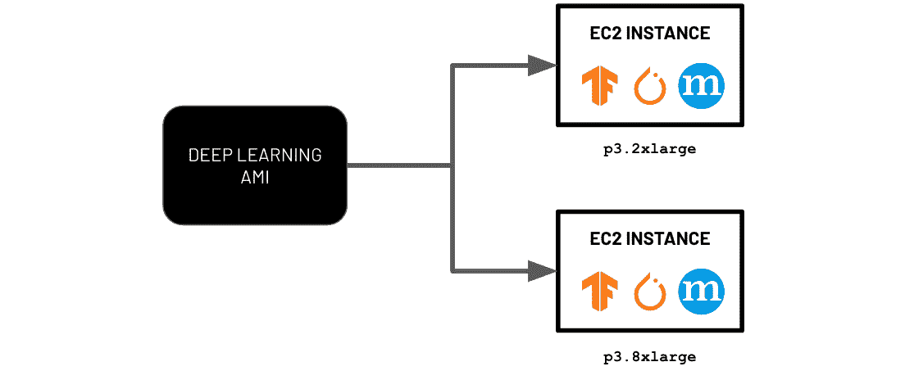
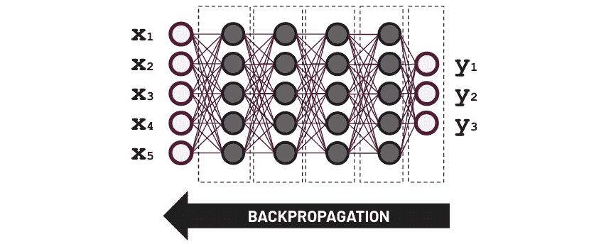

# 深度学习 AMIs

在 *第一章* 的 *基本先决条件* 部分，即 *AWS 机器学习工程简介*，我们可能花费了大约一个小时来设置我们的 Cloud9 环境。在能够着手处理实际的 **机器学习** （**ML**） 需求之前，我们必须花费一些时间安装几个包，以及一些依赖项。除此之外，我们还得确保使用某些包的正确版本，以避免遇到各种问题。如果你认为这很易出错且繁琐，想象一下被分配给一个数据科学团队准备 20 个 ML 环境的任务！让我再重复一遍…… *二十个*！这将花费我们大约 15 到 20 个小时重复做同样的事情。在使用你准备的 ML 环境一周后，数据科学家们随后要求你也在这些环境中安装深度学习框架 **TensorFlow**、**PyTorch** 和 **MXNet**，因为他们将使用这些 ML 框架测试不同的深度学习模型。在这个时候，你可能已经在问自己，“*有没有更好的方法来做这件事？*”。好消息是，有各种方法可以更有效地处理这些类型的需求。其中一种可能的解决方案是利用 **Amazon Machine Images** （**AMIs**），特别是 AWS **深度学习 AMIs** （**DLAMIs**），以显著加快准备 ML 环境的过程。在启动新实例时，这些 AMIs 将作为预配置的模板，包含相关的软件和环境配置。

在 **DLAMIs** 存在之前，机器学习工程师必须在能够运行 AWS 云中的 ML 工作负载之前，花费数小时在 EC2 实例中安装和配置深度学习框架。从头开始手动准备这些 ML 环境的过程既繁琐又易出错。一旦 DLAMIs 可用，数据科学家和机器学习工程师就能直接使用他们偏好的深度学习框架进行 ML 实验。

在本章中，我们将看到使用特定框架的深度学习 AMI 设置 GPU 实例是多么方便。然后，我们将在这个环境中使用 **TensorFlow** 和 **Keras** 训练深度学习模型。一旦训练步骤完成，我们将使用测试数据集评估模型。之后，我们将执行清理步骤并终止 EC2 实例。在本章的结尾，我们还将简要讨论 AWS 对 EC2 实例的定价方式。这将帮助你掌握管理这些实例中运行 ML 工作负载所需的总成本的知识。

话虽如此，在本章中，我们将涵盖以下主题：

+   开始使用 Deep Learning AMIs

+   使用深度学习 AMI 启动 EC2 实例

+   下载示例数据集

+   训练机器学习模型

+   加载和评估模型

+   清理工作

+   理解 AWS 对 EC2 实例的定价方式

本章的动手实践解决方案将帮助你将任何现有的**TensorFlow**、**PyTorch**和**MXNet**脚本和模型迁移到 AWS 云。除了前面提到的成本讨论之外，我们还将讨论一些安全指南和最佳实践，以帮助我们确保我们设置的环境具有良好的初始安全配置。考虑到这些，让我们开始吧！

# 技术要求

在我们开始之前，我们必须有一个网络浏览器（最好是 Chrome 或 Firefox）和一个 AWS 账户，用于本章的动手实践解决方案。确保你有访问你在*第一章*，*AWS 上的机器学习工程简介*中使用的 AWS 账户。

每章使用的 Jupyter 笔记本、源代码和其他文件都可在本书的 GitHub 仓库中找到：[`github.com/PacktPublishing/Machine-Learning-Engineering-on-AWS`](https://github.com/PacktPublishing/Machine-Learning-Engineering-on-AWS)。

# 开始使用 Deep Learning AMIs

在我们讨论 DLAMIs 之前，我们必须对 AMIs 有一个很好的了解。我们可以将 AMI 比作生物体的“DNA”。使用这个类比，生物体会对应并映射到一个或多个 EC2 实例：



图 2.1 – 使用 Deep Learning AMIs 启动 EC2 实例

如果我们使用相同的 AMI（类似于*图 2.1*中所示）启动两个 EC2 实例，那么在实例启动时，这两个实例将具有相同的已安装软件包、框架、工具和操作系统。当然，并非所有内容都需要相同，因为这些实例可能有不同的实例类型、不同的安全组和其他可配置属性。

AMIs 允许工程师轻松地在一致的环境中启动 EC2 实例，而无需花费数小时安装不同的软件包和工具。除了安装步骤之外，这些 EC2 实例在使用特定工作负载之前还需要进行配置和优化。预构建的 AMI，如 DLAMIs，已经预装了流行的深度学习框架，如**TensorFlow**、**PyTorch**和**MXNet**。这意味着数据科学家、开发人员和机器学习工程师可以继续进行机器学习实验和部署，而无需担心安装和设置过程。

如果我们需要准备安装了这些深度学习框架的 20 个 ML 环境，我非常确信这不会花费我们 20 个或更多小时。如果我们使用 DLAMI，可能 2 到 3 个小时就足够完成任务了。*你不相信我吗？* *在下一节中，我们将会这样做!* 当然，我们只会准备一个 ML 环境，而不是 20 个。当在本章中处理实际解决方案时，你将注意到在设置和配置运行 ML 实验所需的先决条件时，速度会有显著提升。

注意

需要注意的是，我们有选择在现有的 AMI 上构建并准备我们自己的定制 AMI。然后，我们可以在启动新的 EC2 实例时使用这些定制 AMI。

# 使用深度学习 AMI 启动 EC2 实例

从 DLAMI 启动 EC2 实例非常简单。一旦我们确定了要使用的 DLAMI，接下来的步骤就主要集中在配置和启动 EC2 实例上。这里有趣的是，我们不仅限于从一个现有的镜像中启动单个实例。在配置阶段，在从 AMI 启动实例之前，需要注意的是，我们可以指定要启动的实例数量（例如，`20`）。这意味着我们不会启动单个实例，而是同时启动 20 个实例。


图 2.2 – 使用 DLAMI 启动 EC2 实例的步骤

我们将把这个部分分为四个部分。如图所示，我们首先将定位到 `p3.2xlarge` 作为实例类型，寻找框架特定的深度学习 AMI。然后，我们将配置实例将使用的安全设置，包括网络安全设置。最后，我们将启动实例，并通过 **EC2 实例连接** 从浏览器连接到它。

## 定位框架特定的 DLAMI

在寻找 AMI 时，我们应该首先检查的地方是 **AWS AMI 目录**。在 AMI 目录中，我们应该找到各种 DLAMI。这些 DLAMI 可以分为多框架 DLAMI 或框架特定 DLAMI。*有什么区别？* 多框架 DLAMI 在单个 AMI 中包含多个框架，例如 **TensorFlow**、**PyTorch** 或 **MXNet**。这允许开发人员、机器学习工程师和数据科学家轻松地进行多个框架的实验和探索。另一方面，框架特定 DLAMI 更适合生产环境，并且只支持单个框架。在本章中，我们将使用框架特定的（TensorFlow）深度学习 AMI。

在接下来的步骤中，我们将导航到 AMI 目录，并使用框架特定的（TensorFlow）深度学习 AMI 来启动实例：

1.  导航到 AWS 管理控制台，然后在搜索栏中输入`ec2`。从结果列表中选择**EC2**：


图 2.3 – 导航到 EC2 控制台

我们应该看到一系列匹配结果，如 **EC2**、**EC2 图像构建器**和**AWS 计算优化器**，类似于 *图 2.2* 中所示。从这个列表中，我们将选择第一个，这将带我们转到 EC2 控制台。

1.  在侧边栏中，找到并点击**镜像**下的**AMI 目录**以导航到**EC2** > **AMI 目录**页面。

1.  接下来，在**AMI 目录**页面内的搜索栏中输入`deep learning ami`。确保按下**Enter**键以搜索与搜索查询相关的相关 AMI：


图 2.4 – 搜索框架特定的深度学习 AMI

如前图所示，我们应该在**快速启动 AMI**下有几项匹配结果。在**AWS Marketplace AMI**和**社区 AMI**下也应有所匹配结果。快速启动 AMI 包括用于关键工作负载的常用 AMI，例如 **Amazon Linux 2** AMI、**Ubuntu Server 20.04 LTS** AMI、**深度学习 AMI**（Amazon Linux 2）AMI 等。AWS Marketplace AMI 包括 AWS 创建的几个 AMI，以及由受信任的第三方来源创建的 AMI。这些应包括 **OpenVPN 访问服务器** AMI、**Kali Linux** AMI 和 **Splunk 企业版** AMI。所有公开可用的 AMI 都可以在**社区 AMI**下找到。

1.  滚动**快速启动 AMI**列表，找到框架特定的深度学习 AMI，如图下所示：


图 2.5 – 定位 TensorFlow DLAMI

在这里，我们选择框架特定的（TensorFlow）深度学习 AMI 用于 **Amazon Linux 2**，因为我们将在本章后面使用 TensorFlow 训练 ML 模型。通过阅读 AMI 的名称和描述来验证选择。然后，点击**选择**按钮。

1.  在上一步点击了**选择**按钮后，向上滚动到页面顶部并点击**使用 AMI 启动实例**按钮，如图下所示：


图 2.6 – 使用 AMI 启动实例

如我们所见，**使用 AMI 启动实例**按钮就在**使用 AMI 创建模板**按钮旁边。

重要提示

使用**AWS 深度学习 AMI**没有额外的费用。这意味着我们只需要考虑与创建的基础设施资源相关的成本。然而，使用其他 AMI 可能并不免费。例如，由其他公司创建的 AMI（在**AWS Marketplace AMI**下提供的列表中）可能每小时收取额外费用。话虽如此，检查使用这些 AMI 启动的基础设施资源之上的任何额外费用是很重要的。

点击**使用 AMI 启动实例**按钮应将您重定向到如图所示的**启动实例**页面：


图 2.7 – 启动实例页面

由于 AWS 定期更新控制台中启动和管理资源的功能，您在执行下一组步骤时可能会看到一些差异。然而，无论您在处理本节时控制台看起来如何，期望的最终配置都将保持不变。

1.  在**名称**字段下的`MLE-CH02-DLAMI`。

在设置**名称**字段值之后，下一步涉及选择我们 EC2 实例所需的目标实例类型。在我们进行选择目标实例类型之前，我们必须简要讨论一下可用的实例类型以及哪些类型的实例适合大规模机器学习工作负载。

## 选择实例类型

在执行深度学习实验时，数据科学家和机器学习工程师通常更倾向于选择 GPU 实例而不是 CPU 实例。**图形处理单元**（**GPU**）可以显著加速深度学习实验，因为 GPU 可以同时处理多个并行计算。由于 GPU 实例通常比 CPU 实例更昂贵，数据科学家和机器学习工程师在处理机器学习需求时通常会使用这两种类型的组合。例如，机器学习从业者可能仅将 GPU 实例的使用限制在训练深度学习模型上。这意味着 CPU 实例将用于部署训练好的模型的推理端点。这在大多数情况下是足够的，并且一旦考虑到成本，这将被视为一个非常实用的举措。


图 2.8 – CPU 实例与 GPU 实例

话虽如此，我们需要确定哪些实例属于 GPU 实例组，哪些实例属于 CPU 实例的范畴。前面的图表显示了一些 GPU 实例的例子，包括`p3.2xlarge`、`dl1.24xlarge`、`g3.4xlarge`、`p2.8xlarge`和`g4ad.8xlarge`。还有其他不在列表中的 GPU 实例类型，但你应该只需通过检查实例家族就能识别这些实例。例如，我们确信`p3.8xlarge`是一个 GPU 实例类型，因为它属于与`p3.2xlarge`实例类型相同的家族。

既然我们已经对 CPU 和 GPU 实例有了更好的了解，让我们继续在实例类型的选项列表中定位并选择`p3.2xlarge`：

1.  在“定位框架特定的 DLAMI”部分我们停止的地方继续，让我们在“实例类型”面板下找到并点击**比较实例类型**链接。这应该会重定向到**比较实例类型**页面，如下面的截图所示：


图 2.9 – 比较实例类型

在这里，我们可以看到不同的实例类型，以及它们对应的规格和每小时成本。

1.  点击搜索字段（带有**过滤实例类型**占位文本）。这应该打开一个选项的下拉列表，如下面的截图所示：


图 2.10 – 使用“过滤实例类型”搜索字段

在选项列表中找到并选择**GPU**。这应该打开**添加 GPU 过滤器**窗口。

1.  在其旁边的文本字段中的`0`上。点击随后的**确认**按钮。

注意

我们应用过的过滤器应该将结果集限制为 GPU 实例。我们应该找到几个加速计算实例家族，例如*P3*、*P2*、*G5*、*G4dn*和*G3*，仅举几个例子。

1.  接下来，让我们点击下面的截图中所突出的**首选项**按钮：


图 2.11 – 打开首选项窗口

这应该打开**首选项**窗口。在**属性列**下，确保**GPU**单选按钮被选中，如下面的截图所示：


图 2.12 – 显示 GPU 属性列

点击随后的**确认**按钮。这应该更新表格列表显示，并显示列表中每种实例类型的 GPU 数量，如下所示：


图 2.13 – 每个实例类型的 GPU

在这里，我们应该看到一种模式，即随着实例类型在同一个实例家族中变得“更大”，GPU 的数量通常会增加。

1.  找到并选择对应于**p3.2xlarge**实例类型的行。注意可用的 GPU 数量，以及**p3.2xlarge**实例类型的每小时成本（按需 Linux 定价）。

1.  之后点击屏幕右下角的**选择实例类型**按钮。

这应该会关闭**比较实例类型**窗口，并返回到**启动实例**页面。

## 确保默认安全配置

当启动 EC2 实例时，我们需要管理安全配置，这将影响实例的访问方式。这包括配置以下内容：

+   **密钥对**：包含用于安全访问实例的凭据的文件（例如，使用 SSH）

+   **虚拟专用云**（**VPC**）：一个逻辑上隔离的虚拟网络，它规定了如何访问资源以及资源之间如何相互通信

+   **安全组**：一个虚拟防火墙，使用基于配置的协议和端口的规则来过滤进出 EC2 实例的流量

话虽如此，在我们启动 EC2 实例之前，让我们先完成剩余的配置参数：

1.  在我们之前在*选择实例类型*部分结束的地方继续，让我们继续创建一个新的密钥对。在**密钥对（登录）**下，找到并点击**创建新的密钥对**。

1.  在`dlami-key`) for `RSA`

1.  `.pem`

1.  点击`.pem`文件到您的本地机器。请注意，我们在这个章节的动手实践中不需要这个`.pem`文件，因为我们稍后将通过**EC2 实例连接**（通过浏览器）使用它来访问实例。

重要提示

永远不要共享下载的密钥文件，因为这是通过 SSH 访问实例所用的。对于生产环境，考虑将非公开实例隐藏在正确配置的 VPC 内部。关于保护我们的机器学习环境有很多要讨论的。我们将在*第九章*中详细讨论安全，*安全、治理和合规策略*。

1.  在`vpc-xxxxxxxx（默认）`下

1.  `启用`

1.  `创建安全组`

1.  在**网络设置**的**入站安全组规则**下，指定一组安全组规则，类似于以下截图中所配置的：


图 2.14 – 入站安全组规则

如您所见，我们将使用以下规则配置新的安全组：

+   `SSH`；`TCP`；`22`；`任何地方` | `0.0.0.0/0`；`SSH` – 允许任何“计算机”例如您的本地机器通过**安全壳**（SSH）协议在端口 22 上连接到 EC2 实例

+   `自定义 TCP`；`TCP`；`6006`；`任何地方` | `0.0.0.0/0`；`Tensorboard` – 允许任何“计算机”例如您的本地机器访问 EC2 实例的 6006 端口（可能运行着**TensorBoard**等应用程序）

+   `自定义 TCP`; `TCP`; `8888`; `任何地方` | `0.0.0.0/0`; `Jupyter` – 允许任何“计算机”例如您的本地机器访问 EC2 实例的 8888 端口（可能运行着如 **Jupyter Notebook** 应用程序之类的应用程序）

一旦您配置了新的安全组，包括 **安全组名称 – 必需** 和 **描述 – 必需** 以及相关的 **入站安全组规则**，您就可以进行下一步操作。

注意

注意，一旦我们需要为生产使用准备设置，这个配置就需要被审查并进一步加固。首先，`0.0.0.0/0`)，因为这个配置允许任何计算机或服务器通过开放的端口访问我们的实例。话虽如此，我们可能只限制本地机器的 IP 地址访问。在此期间，我们现有的配置应该足够用，因为我们将在完成本章后立即删除该实例。

1.  在 **配置存储** 下定位并点击 **添加新卷** 按钮：


图 2.15 – 配置存储设置

在 **1x** 和 **GiB** 之间的文本字段中指定 `35`。类似于前一个屏幕截图中的设置。

我们还可以配置和调整（在 **高级详情** 下）的几个更多选项，但我们将保留默认值不变。

## 使用 EC2 实例连接启动实例并连接到它

有多种方式可以连接到 EC2 实例。之前，我们配置了实例，使其可以通过密钥文件（例如，从您的本地机器的终端）使用 SSH 访问。另一个可能的选项是使用 **EC2 实例连接** 通过浏览器访问实例。我们还可以使用 **会话管理器** 通过 SSH 访问实例。在本节中，我们将使用 EC2 实例连接来访问我们的实例。

在 *确保默认安全配置* 部分我们停止的地方继续，现在让我们启动 EC2 实例并通过浏览器访问它：

1.  一旦您已配置存储设置，请定位并点击屏幕右侧的 **摘要** 下的 **启动实例** 按钮。确保在启动后的一小时内终止此实例，因为这些类型的实例的每小时费用相对于其他实例类型要高一些。您可以在本章的 *清理* 部分查看更多详细信息。

注意

确保在 `1` 中指定的值。技术上，我们可以通过将此值设置为 `20` 一次性启动 20 个实例。然而，我们不想这样做，因为这会非常昂贵且浪费。现在，让我们保持 `1`，这应该足以处理本章中的深度学习实验。

1.  您应该会看到一个成功通知，以及正在启动的资源实例 ID，类似于以下屏幕截图所示：


图 2.16 – 启动成功通知

点击包含实例 ID（`i-xxxxxxxxxxxxxxxxx`）的链接，如图中高亮显示，以导航到`MLE-CH02-DLAMI`，使其出现在实例列表中。

注意

在进行下一步之前，请等待一分钟或两分钟。如果在启动实例时遇到`InsufficientInstanceCapacity`错误，请随意使用不同的`p3`实例。要进一步排除故障，您还可以参考[`aws.amazon.com/premiumsupport/knowledge-center/ec2-insufficient-capacity-errors/`](https://aws.amazon.com/premiumsupport/knowledge-center/ec2-insufficient-capacity-errors/)以获取更多信息。

1.  通过切换以下屏幕截图中的复选框选择实例。之后点击**连接**按钮：


图 2.17 – 直接连接到实例

在这里，我们可以看到有一个选项可以直接使用浏览器连接到实例。

1.  在`AA.BB.CC.DD`到您本地机器上的文本编辑器。请注意，您将获得不同的公网 IP 地址值。我们将在本章后面使用此 IP 地址值来访问`root`并然后点击**连接**：


图 2.18 – EC2 实例连接

这应该会打开一个新标签页，允许我们从浏览器直接运行终端命令。如果您收到**无法连接到您的实例**的错误消息，请在刷新页面或点击**重试**按钮之前等待大约 2 到 3 分钟：


图 2.19 – EC2 实例连接终端

如我们所见，`TensorFlow 2.9.1`和其他实用库已安装在`/usr/local/bin/python3.9`中。请注意，您可能会根据您用于启动实例的 DLAMI 版本获得不同的 TensorFlow 和 Python 版本。

难道不是很容易吗？到这一点，我们现在应该能够使用 TensorFlow 进行深度学习实验，而无需在 EC2 实例内部安装额外的工具和库。

注意

注意，使用 AMI 启动实例的过程可以通过**启动模板**进一步加速，这些模板已经指定了实例配置信息，例如 AMI ID、实例类型、密钥对和安全组。本书不会涵盖启动模板的使用，因此请随意查看以下链接以获取更多详细信息：[`docs.aws.amazon.com/AWSEC2/latest/UserGuide/ec2-launch-templates.xhtml`](https://docs.aws.amazon.com/AWSEC2/latest/UserGuide/ec2-launch-templates.xhtml)。

# 下载示例数据集

在本章的后续部分，我们将使用一个非常简单的合成数据集，该数据集只包含两列 – *x* 和 *y*。在这里，*x* 可能代表对象在 *X* 轴上的相对位置，而 *y* 可能代表同一对象在 *Y* 轴上的位置。以下截图显示了数据的示例：


图 2.20 – 示例数据集

机器学习是关于寻找模式。在本章的后面，我们将构建一个模型，尝试根据 *x* 的值预测 *y* 的值。一旦我们能够构建像这样的简单示例模型，处理包含超过两列的更真实的数据集将会容易得多，就像我们在 *第一章* *AWS 机器学习工程简介* 中处理的那样。

注意

在本书中，我们不会仅限于表格数据和简单的数据集。例如，在 *第六章* *SageMaker 训练和调试解决方案* 中，我们将处理标记的图像数据，并使用 **Amazon SageMaker** 的多个功能和特性构建两个图像分类模型。在 *第七章* *SageMaker 部署解决方案* 中，我们将处理文本数据，并使用各种部署选项部署一个 **自然语言处理** (**NLP**) 模型。

话虽如此，让我们继续在 *启动实例并使用 EC2 实例连接连接到它* 部分中留下的地方，并继续下载我们将用于本章训练深度学习模型的数据库集：

1.  在 `data` 目录下：

    ```py
    mkdir -p data
    ```

1.  使用 `wget` 命令下载训练、验证和测试数据集：

    ```py
    wget https://bit.ly/3h1KBx2 -O data/training_data.csv
    ```

    ```py
    wget https://bit.ly/3gXYM6v -O data/validation_data.csv
    ```

    ```py
    wget https://bit.ly/35aKWem -O data/test_data.csv
    ```

1.  可选地，我们可以使用 `yum` 软件包管理工具安装 `tree` 工具：

    ```py
    yum install tree
    ```

如果这是你第一次遇到 `tree` 命令，它用于以树状结构列出目录和文件。

注意

也可以从 EC2 实例创建一个自定义 AMI。如果我们现在从正在使用的 EC2 实例创建一个自定义 AMI，我们就可以使用以下已安装的内容启动新的 EC2 实例： (1) 从 DLAMI 安装的框架、库和工具，以及 (2) 在创建自定义 AMI 之前安装的 `tree` 工具。

1.  使用 `tree` 命令查看当前目录下的所有文件夹和文件：

    ```py
    tree
    ```

这应该会产生一个类似以下截图所示的树状结构：


图 2.21 – 使用 tree 命令后的结果

在这里，我们可以看到我们已成功使用之前安装的 `wget` 命令下载了 CSV 文件。

1.  现在，让我们验证并检查我们下载的 CSV 文件之一的内容。使用 `head` 命令查看 `training_data.csv` 文件的前几行：

    ```py
    head data/training_data.csv
    ```

这应该会给我们提供*(x,y)*对，类似于以下截图所示：


图 2.22 – training_data.csv 文件的前几行

你也可以使用`head`命令检查`validation_data.csv`和`test_data.csv`的内容。

注意

需要注意的是，在这个例子中，第一列是*y*列。一些机器学习实践者遵循一种惯例，即第一列用作目标列（包含我们希望使用数据集的其他列预测的值的列）。当使用某些算法，如**SageMaker**内置的**XGBoost**和**线性学习器**算法时，假定第一列是目标列。如果你使用自己的自定义脚本来加载数据，你可以遵循任何你喜欢的惯例，因为你对数据的加载和从文件中解释数据的自由度很大。

到现在为止，你可能已经注意到，在这本书中，我们一直在使用干净且预处理过的数据集。在真实的机器学习项目中，你将处理各种问题，如缺失值和重复行等原始数据。在*第五章*，“实用数据处理和分析”中，我们将处理*bookings*数据集的“更脏”版本，并使用各种 AWS 服务和功能，如**AWS Glue DataBrew**和**Amazon SageMaker Data Wrangler**来分析、清理和处理数据。然而，在这一章中，我们将使用“干净”的数据集，因为我们需要专注于使用**TensorFlow**和**Keras**训练深度学习模型。话虽如此，让我们继续生成一个接受*x*作为输入并返回预测*y*值作为输出的模型。

# 训练机器学习模型

在*第一章*，“AWS 上机器学习工程的介绍”中，我们训练了一个二元分类器模型，旨在使用可用信息预测酒店预订是否会取消。在本章中，我们将使用（有意简化的）从*下载示例数据集*中获得的（intentionally simplified）数据集，并训练一个回归模型，该模型将根据*x*的值预测*y*（连续变量）的值。我们将不依赖现成的 AutoML 工具和服务，而是使用自定义脚本：


图 2.23 – 模型生命周期

当编写自定义训练脚本时，我们通常遵循与前面图表中所示类似的顺序。我们首先定义和编译一个模型。之后，我们加载数据并使用它来训练和评估模型。最后，我们将模型序列化并保存到文件中。

注意

模型保存后会发生什么？模型文件可以在推理端点中使用和加载——这是一个使用训练好的机器学习模型进行预测（例如，预测*y*值）的 Web 服务器，给定一组输入值（例如，输入*x*值）。在本章的*加载和评估模型*部分，我们将使用`tf.keras.models`模块中的`load_model()`函数在 Jupyter Notebook 中加载生成的模型文件。然后，我们将使用`predict()`方法使用提供的测试数据集进行样本预测。

在本章中，我们将使用一个脚本文件，该文件使用**TensorFlow**和**Keras**构建**神经网络**模型——一个可以学习输入和输出之间复杂模式的节点互联组。由于我们将在这本书中处理神经网络和深度学习概念，我们必须对以下概念有一个基本了解：

+   **神经元（Neurons**）：这些是神经网络的基本构建块，它们接受并处理输入值以产生输出值。*输出值是如何计算的？*每个通过神经元的输入值都会乘以相关的**权重**值，然后加上一个数值（也称为**偏置**）。随后，将一个称为**激活函数**的非线性函数应用于所得值，从而产生输出。这个非线性函数有助于神经网络学习输入值和输出值之间的复杂模式。我们可以在以下图中看到一个神经元的表示：


图 2.24 – 神经元的表示

在这里，我们可以通过一个包含输入值、相应的权重值、偏置和激活函数的公式来计算*y*的值。换句话说，我们可以将神经元视为一个“数学函数”，将神经网络视为“一串数学函数”，这些函数试图通过不断更新权重和偏置值来映射输入值和输出值。

+   **层（Layers**）：层由位于神经网络特定位置或深度的神经元组成：


图 2.25 – 输入层、输出层和多个隐藏层

在这里，我们可以看到神经网络的各个层次。**输入层**是接收输入值的层，而**输出层**是生成输出值的层。在输入层和输出层之间是称为**隐藏层**的处理层，它们处理和转换从输入层到输出层的数据。（具有一个或两个以上隐藏层的神经网络通常称为**深度神经网络**。）

+   **正向传播**：这指的是从输入层到隐藏层，然后到输出层的正向信息流，以生成输出值。

+   **损失函数**：此函数用于计算预测计算值与实际值之间的偏差。鉴于训练神经网络的目的是生成尽可能接近实际值的预测值，我们应该通过使用如**梯度下降**之类的优化算法来寻找损失函数的最小值（这代表了模型的误差）。

+   **反向传播**：这是根据预测值和实际值之间的差异调整神经网络中权重的过程（这涉及到计算**梯度**或对每一层的权重进行小幅度更新）：



图 2.26 – 反向传播

在这里，我们可以看到反向传播涉及从输出层向输入层传播计算出的误差（并相应地更新权重）。

+   **学习率**：这影响了在训练神经网络时根据损失梯度调整网络中权重的数量。

+   **时代**：这是一个涉及使用整个训练数据集进行一次正向传播和一次反向传播的训练迭代。在每次训练迭代之后，神经网络的权重都会更新，并且期望神经网络在将输入值映射到输出值时表现更好。

注意

我们不会深入探讨深度学习和神经网络的细节。如果您想了解更多关于这些主题的信息，网上有几种书籍可供选择：[`www.amazon.com/Neural-Network/s?k=Neural+Network`](https://www.amazon.com/Neural-Network/s?k=Neural+Network)。

现在我们对神经网络有了更好的了解，我们可以继续训练神经网络模型。在接下来的步骤中，我们将使用自定义脚本来训练一个深度学习模型，该模型使用上一节下载的数据：

1.  首先，让我们使用 `mkdir` 命令创建一个名为 `logs` 的目录：

    ```py
    mkdir -p logs
    ```

1.  接下来，使用 `wget` 命令下载 `train.py` 文件：

    ```py
    wget https://bit.ly/33D0iYC -O train.py
    ```

1.  使用 `tree` 命令快速检查文件和目录结构：

    ```py
    tree
    ```

这应该会生成一个类似以下截图所示的树状结构：


图 2.27 – 使用 tree 命令后的结果

注意，数据和日志目录与 `train.py` 文件处于同一级别。

1.  在运行 `train.py` 文件之前，执行以下命令：

    ```py
    for a in /sys/bus/pci/devices/*; do echo 0 | sudo tee -a $a/numa_node; done
    ```

这将帮助我们避免在列出本章后面的 GPU 设备时出现的**成功从 SysFS 读取 NUMA 节点具有负值 (-1)** 警告信息。

1.  在运行下载的 `train.py` 脚本之前，让我们通过在单独的浏览器标签页中打开 [`github.com/PacktPublishing/Machine-Learning-Engineering-on-AWS/blob/main/chapter02/train.py`](https://github.com/PacktPublishing/Machine-Learning-Engineering-on-AWS/blob/main/chapter02/train.py) 来检查其内容：


图 2.28 – train.py 文件

在前面的屏幕截图中，我们可以看到我们的 `train.py` 脚本执行以下操作：

+   （`prepare_model()` 函数

+   （`load_data()` 函数

+   （**3**）准备 **TensorBoard** 回调对象

+   （`fit()` 方法并传递 `callback` 参数值

+   （`save()` 方法

注意

重要的是要注意，我们 `train.py` 脚本中的 `prepare_model()` 函数执行了 *定义模型* 和 *编译模型* 两个步骤。在此函数中定义的神经网络是一个具有五个层的示例顺序模型。有关更多信息，请随时查看 `prepare_model()` 函数的实现，链接为 [`github.com/PacktPublishing/Machine-Learning-Engineering-on-AWS/blob/main/chapter02/train.py`](https://github.com/PacktPublishing/Machine-Learning-Engineering-on-AWS/blob/main/chapter02/train.py#L24)。

1.  让我们在 EC2 Instance Connect 终端中运行以下命令来开始训练步骤：

    ```py
    python3.9 train.py
    ```

这应该会生成一组日志，类似于以下屏幕截图所示：


图 2.29 – train.py 脚本日志

注意，训练步骤可能需要大约 5 分钟才能完成。一旦 `train.py` 脚本执行完毕，您可以使用 `tree` 命令检查 `logs` 和 `model` 目录下生成的新文件。

注意

这里发生了什么？在这里，我们定义在 `train.py` 中的模型的 `fit()` 方法正在使用设置为 `500` 的周期数（迭代次数）来训练模型。对于每次迭代，我们正在更新神经网络的权重，以最小化实际值和预测值之间的“误差”（例如，使用交叉验证数据）。

1.  接下来，运行以下命令以运行 `tensorBoard` 应用程序，该程序可以帮助可视化和调试机器学习实验：

    ```py
    tensorboard --logdir=logs --bind_all
    ```

1.  打开一个新的浏览器标签页并打开 `http://<IP ADDRESS>:6006`。将 `<IP ADDRESS>` 替换为我们复制到文本编辑器中的公共 IP 地址，在 *使用深度学习 AMI 启动 EC2 实例* 部分中：


图 2.30 – TensorBoard

这应该会加载一个类似于前一个屏幕截图所示的网页应用程序。我们不会深入探讨我们可以用 TensorBoard 做什么，所以请随时查看 [`www.tensorflow.org/tensorboard`](https://www.tensorflow.org/tensorboard) 获取更多信息。

注意

我们如何解释这些图表？如图 2.30 所示，训练和验证损失通常随时间而降低。在第一个图表（顶部），*X*轴对应于 epoch 编号，而*Y*轴显示训练和验证损失。需要注意的是，在这个图表中，训练和验证的“学习曲线”是重叠的，并且随着 epoch 或迭代次数的增加，两者都会继续下降到某个点。需要注意的是，这类图表有助于诊断机器学习模型性能，这在避免诸如**过拟合**（训练模型在训练数据上表现良好，但在未见过的数据上表现不佳）和**欠拟合**（训练模型在训练数据集和未见过的数据上表现不佳）等问题时非常有用。我们不会详细讨论这个问题，所以请随意查看其他机器学习和深度学习资源。

1.  返回到**EC2 实例内容**终端，并使用*Ctrl* + *C*停止正在运行的**TensorBoard**应用程序进程。

在这个阶段，我们应该在`model`目录内拥有训练好的模型的工件。在下一节中，我们将在 Jupyter Notebook 环境中加载并评估这个模型。

# 加载和评估模型

在上一节中，我们使用终端训练了我们的深度学习模型。在进行机器学习实验时，通常更方便使用基于 Web 的交互式环境，如**Jupyter Notebook**。技术上我们可以在终端中运行所有后续的代码块，但为了方便，我们将使用 Jupyter Notebook。

在接下来的步骤中，我们将从命令行启动 Jupyter Notebook。然后，我们将运行几个代码块来加载和评估我们在上一节中训练的机器学习模型。让我们开始吧：

1.  在*训练 ML 模型*部分我们停止的地方继续，让我们在**EC2 实例连接**终端中运行以下命令：

    ```py
    jupyter notebook --allow-root --port 8888 --ip 0.0.0.0
    ```

这应该启动 Jupyter Notebook，并通过端口`8888`使其可访问：


图 2.31 – Jupyter Notebook 令牌

确保复制从运行`jupyter notebook`命令后生成的随机令牌。参考前面的截图，了解如何获取生成的令牌。

1.  打开一个新的浏览器标签页，并打开`http://<IP ADDRESS>:8888`。将`<IP ADDRESS>`替换为我们在*使用深度学习 AMI 启动 EC2 实例*部分复制到文本编辑器的公共 IP 地址：


图 2.32 – 访问 Jupyter Notebook

在这里，我们可以看到在使用**Jupyter Notebook**之前，我们需要输入密码或令牌。只需输入从上一步骤生成的日志中获得的令牌。

重要提示

注意，这个设置尚未准备好在生产环境中使用。有关如何安全地配置 Jupyter Notebook 服务器的信息，请参阅 https://jupyter-notebook.readthedocs.io/en/stable/security.xhtml。我们还将讨论一些提高此设置安全性的策略，详见 *第九章*，*安全、治理和合规策略*。

1.  通过点击 **新建** 并从下拉选项中选择 **Python 3 (ipykernel)** 来创建一个新的笔记本，类似于以下截图所示：


图 2.33 – 创建新的 Jupyter Notebook

这应该打开一个空白笔记本，我们可以在这里运行我们的 Python 代码。

1.  导入 `tensorflow` 然后使用 `list_physical_devices()` 列出实例中的可见 GPU：

    ```py
    import tensorflow as tf
    ```

    ```py
    tf.config.list_physical_devices('GPU')
    ```

这应该返回一个包含单个 `PhysicalDevice` 对象的列表，类似于 `[PhysicalDevice(name='/physical_device:GPU:0',device_type='GPU')]`。

备注

由于我们使用的是 `p3.2xlarge` 实例，前面的代码块返回了一个可见的 GPU 设备。如果我们启动一个 `p3.16xlarge` 实例，我们应该得到 8 个可见 GPU 设备。请注意，我们可以通过并行技术（如 **数据并行**（在每个 GPU 中使用相同的模型，但使用数据集的不同部分进行训练）和 **模型并行**（将模型分成与 GPU 数量相等的几个部分））同时利用多个 GPU 设备来显著减少训练时间。当然，ML 实验脚本需要修改以利用多个 GPU。有关如何在 TensorFlow 中使用 GPU 的更多信息，请查阅以下链接以获取更多详细信息：[`www.tensorflow.org/guide/gpu`](https://www.tensorflow.org/guide/gpu)。

1.  使用 `tf.keras.models.load_model()` 加载模型。使用 `model.summary()` 检查模型：

    ```py
    model = tf.keras.models.load_model('model')
    ```

    ```py
    model.summary()
    ```

这应该生成一个模型摘要，如下面的截图所示：


图 2.34 – 模型摘要

此模型摘要应反映我们在 *训练 ML 模型* 部分准备和训练的模型的属性。

重要备注

确保仅使用 `load_model()` 函数（以及其他类似函数）从可信来源加载 ML 模型。攻击者可以轻松地准备一个带有恶意负载的模型，当加载时，将允许攻击者访问运行 ML 脚本的服务器（例如，通过 **反向 shell**）。有关此主题的更多信息，您可以查看作者关于如何黑客攻击和确保 ML 环境和系统安全的演讲：[`speakerdeck.com/arvslat/pycon-apac-2022-hacking-and-securing-machine-learning-environments-and-systems?slide=21`](https://speakerdeck.com/arvslat/pycon-apac-2022-hacking-and-securing-machine-learning-environments-and-systems?slide=21)。

1.  定义`load_data()`函数，该函数将返回指定文件位置的 CSV 文件的值：

    ```py
    import numpy as np
    ```

    ```py
    def load_data(training_data_location):
    ```

    ```py
        fo = open(training_data_location, "rb")
    ```

    ```py
        result = np.loadtxt(fo, delimiter=",")
    ```

    ```py
        y = result[:, 0]
    ```

    ```py
        x = result[:, 1]
    ```

    ```py
        return (x, y)
    ```

1.  现在，让我们测试加载的模型是否能够根据一组输入值进行预测。使用`load_data()`加载测试数据，并使用`model.predict()`进行一些样本预测：

    ```py
    x, y = load_data("data/test_data.csv")
    ```

    ```py
    predictions = model.predict(x[0:5])
    ```

    ```py
    predictions
    ```

这应该会得到一个浮点数值数组，类似于以下屏幕截图所示：


图 2.35 – 预测结果

在这里，我们有与每个五个输入*x*值对应的预测*y*目标值数组。请注意，这些预测*y*值与从`test_data.csv`文件加载的实际*y*值不同。

1.  使用`model.evaluate()`评估加载的模型：

    ```py
    results = model.evaluate(x, y, batch_size=128)
    ```

    ```py
    results
    ```

这应该给出一个类似于或接近于`2.705784797668457`的值。如果你想知道这个数字的含义，这是预测值与实际值之间距离的数值表示：


图 2.36 – 模型评估的工作原理

在这里，我们可以看到一个回归问题中模型评估工作的例子。首先，评估指标如**均方根误差**（**RMSE**）、**均方误差**（**MSE**）和**平均绝对误差**（**MAE**）在计算单个评估指标值之前，计算实际值和预测值之间的差异。这意味着具有较低 RMSE 值的模型通常比具有较高 RMSE 值的模型犯的错误更少。

到目前为止，你可能会决定构建一个自定义的后端 API，使用前面代码块以及 Python Web 框架，如**Flask**、**Pyramid**或**Django**。然而，你可能首先想检查其他内置解决方案，例如**TensorFlow Serving**（一个用于 TensorFlow 模型的机器学习模型服务系统），它专为生产环境设计。

如果你仔细想想，我们在上一两个部分中已经完成了一个完整的机器学习实验，而无需安装任何额外的库、包或框架（除了可选的`tree`工具）。有了这个，你已经了解了**深度学习 AMI**是多么有用和强大！再次强调，如果我们必须设置 20 个或更多的类似 ML 环境，可能只需不到 2 小时就能完成所有设置和准备。

# 清理

现在我们已经完成了一个端到端的机器学习实验，是时候执行清理步骤以帮助我们管理成本了：

1.  关闭包含**EC2 实例连接**终端会话的浏览器标签页。

1.  导航到使用深度学习 AMI 启动的**EC2 实例**页面。点击**实例状态**以打开下拉选项列表，然后点击**终止实例**：


图 2.37 – 终止实例

如我们所见，还有其他选项可用，例如**停止实例**和**重启实例**。如果你现在不想删除实例，你可能想先停止实例，然后在稍后的日期和时间再启动它。请注意，停止的实例会产生费用，因为当 EC2 实例停止时，附加的 EBS 卷不会被删除。话虽如此，如果没有存储在 EBS 卷中的关键文件，最好是终止实例并删除任何附加的 EBS 卷。

1.  在**终止实例？**窗口中，点击**终止**。这应该会删除 EC2 实例及其附加的卷。

当不再需要时，应关闭、终止或删除未使用的资源以管理和降低成本。随着我们的机器学习和机器学习工程需求需要更多资源，我们将不得不利用几种成本优化策略来管理成本。我们将在下一节讨论其中一些策略。

# 理解 AWS 如何为 EC2 实例定价

在结束本章之前，我们必须对 AWS 在处理 EC2 实例时的定价有一个很好的了解。我们还需要了解架构和设置如何影响在云中运行机器学习工作负载的整体成本。

假设我们最初在俄勒冈地区运行一个`p2.xlarge`实例，全天候运行整整一个月。在这个实例内部，数据科学团队定期运行一个脚本，使用首选的机器学习框架训练深度学习模型。这个训练脚本通常每周运行两次，每次大约 3 小时。由于新数据的可用性时间表不可预测，很难知道何时运行训练脚本以生成新的模型。生成的机器学习模型随后立即部署到 Web API 服务器，该服务器作为同一实例内的推理端点。*根据这些信息，这个设置的成本会是多少？*


图 2.38 – 每月运行一个 p2.xlarge 实例的大致成本

在这里，我们可以看到这个设置的总体成本大约至少为*每月* *$648*。*我们是如何得到这个数字的？* 我们首先查找在俄勒冈地区运行`p2.xlarge`实例每小时的按需成本（使用以下链接作为参考：[`aws.amazon.com/ec2/pricing/on-demand/`](https://aws.amazon.com/ec2/pricing/on-demand/))。在撰写本文时，俄勒冈（`us-west-2`）地区`p2.xlarge`实例每小时的按需成本为*每小时* *$0.90*。由于我们将全天候运行此实例整整一个月，我们需要计算*每月的估计总小时数*。假设我们每月大约有 30 天，我们应大约有*单月 720 小时* – 即`每天 24 小时 x 30 天 = 720 小时`。

注意，我们也可以使用*730.001 小时*作为每月总小时数的更准确值。然而，我们现在将坚持 720 小时以简化事情。下一步是将*EC2 实例的每小时运行成本*（*每小时* *$0.90*）和*每月总小时数*（*每月 720 小时*）相乘。这将给我们提供单个月内运行 EC2 实例的总成本（*$0.90 x 720 = $648*）。

注意

为了简化本节中的计算，我们只考虑使用 EC2 实例的每小时成本。在现实生活中，我们还需要考虑使用其他资源（如 EBS 卷、VPC 资源（NAT 网关）等）相关的成本。为了得到更准确的估计，请确保使用**AWS 定价计算器**：https://calculator.aws/。

过了一段时间，数据科学团队决定在我们已经运行训练脚本和 Web 服务器（推理端点）的同一实例中训练另一个模型。担心他们在同时运行两个训练脚本时可能会遇到性能问题和瓶颈，团队要求将`p2.xlarge`实例升级到`p2.8xlarge`实例。*根据这个信息，新的设置成本会是多少？*


图 2.39 – 每月运行 p2.8xlarge 实例的大致成本

在这里，我们可以看到这个设置的总体成本大约至少为*每月* *$5,184*。*我们是如何得到这个数字的？*我们必须遵循与上一个示例类似的步骤，并查找运行`p2.8xlarge`实例的每小时按需成本。在这里，我们可以看到运行`p2.8xlarge`实例的成本（*每小时* *$7.20*）是运行`p2.xlarge`实例成本（*每小时* *$0.90*）的八倍。话虽如此，我们预计总体成本也将是之前原始设置的八倍。在将`p2.8xlarge`实例的*每小时运行成本*（*每小时* *$7.20*）和*每月总小时数*（*每月 720 小时*）相乘后，我们应该得到单个月内运行`p2.8xlarge`实例的总成本（*$7.20 x 720 = $5,184*）。

## 使用多个较小的实例来降低运行机器学习工作负载的总体成本

到目前为止，你可能想知道是否有更好的方法来设置，以在运行相同的机器学习工作负载的同时显著降低成本。好消息是，有各种方法可以改进我们目前的情况，并将成本从*每月* *$5,184*降低到更小的值，例如*每月* *$86.40*！请注意，这与原始设置的运行成本（*每月* *$648*）相比也小得多。*我们是如何做到这一点的？*

我们需要做的第一件事是利用多个“较小”的实例，而不是单个`p2.8xlarge`实例。一种可能的配置是使用每个训练脚本一个`p2.xlarge`实例（每小时*0.90 美元*）。由于我们正在处理两个训练脚本，我们将有两个`p2.xlarge`实例。除此之外，我们还将使用一个`m6i.large`实例（每小时*0.096 美元*）来托管模型部署的推理端点。由于训练脚本只有在有新数据可用时才会运行（大约每周两次），我们可以让`p2.xlarge`实例只在需要运行训练脚本时运行。这意味着如果我们有大约*每月 720 小时*，与其中一个训练脚本关联的`p2.xlarge`实例总共应该只运行大约*每月 24 小时*（实例大部分时间处于关闭状态）。

注意

*我们是如何得到这个数字的*？由于训练脚本预计每周运行两次，每次大约 3 小时，那么公式将是 `[每次运行 3 小时] x [每周 2 次] x [4 周]`，这将得出 24 小时的结果。这意味着如果这些`p2.xlarge`实例在一个月内总共只运行大约 24 小时，那么每个`p2.xlarge`实例的月费用大约为*每月 21.60 美元*。

即使这些`p2.xlarge`实例大部分时间都是关闭的，我们的机器学习推理端点仍然会在其专用的`m6i.large`实例上 24/7 运行。运行整个月的`m6i.large`实例的费用大约为*每月 69.12 美元*（使用公式`[$0.096 每小时] x [每月 720 小时]`）：


图 2.40 – 使用多个较小的实例以降低整体成本

话虽如此，我们应该能够将整体成本降低到大约*每月 112.32 美元*，这与前面显示的图表相似。*我们是如何得到这个数字的*？我们只是简单地将一个月内运行每个实例的预期成本相加：$21.60 + $21.60 + $69.12 = $112.32。

## 使用即时实例降低训练作业的运行成本

重要的是要注意，我们可以通过利用用于运行训练脚本的`p2.xlarge`实例来进一步降低成本。使用即时实例，我们可以通过利用 AWS 中可用的备用计算能力，将特定 EC2 实例类型的成本降低约 60%至 90%。这意味着在运行`p2.xlarge`实例时，我们可能只需支付*每小时 0.36 美元*，假设我们使用即时实例可以节省大约 60%。*使用即时实例时有什么风险吗*？当使用即时实例时，应用程序运行在这些实例内部可能会被中断！这意味着我们只应该运行那些在意外中断后可以恢复的任务（例如机器学习训练作业）。

注意

我们是如何得到这个数字的？60% 的节省相当于将按需每小时成本（每小时 *$0.90）乘以 0.40。这将给我们 `[$0.90 每小时] x [0.40] = [$0.36 每小时]`。

由于使用按需实例时可能出现中断，因此不建议您将其用于 24/7 运行的 `m6i.large` 实例，其中运行着 Web 服务器（推理端点）：


图 2.41 – 使用按需实例降低训练作业的运行成本

一旦我们为 `p2.xlarge` 实例使用了按需实例，我们就能将整体成本降低到大约 *$86.40 每月*，这与前面图表中的情况相似。再次强调，这个最终值不包括其他成本，以简化计算。然而，正如你所看到的，这个值比运行单个 `p2.8xlarge` 实例的成本（每月 *$5,184*）要小得多。

这不是令人惊叹吗？！我们只是稍微改变了架构，就能将成本从 *$5,184 每月* 降低到 *$86.40 每月*！请注意，还有其他方法可以优化在云中运行机器学习工作负载的整体成本（例如，利用 **计算节省计划**）。本节所学的内容现在应该足够了，因为我们将在本书的下一章继续讨论这类话题。

# 摘要

在本章中，我们能够使用 **深度学习 AMI** 启动一个 EC2 实例。这使我们能够立即拥有一个可以进行机器学习实验的环境，而无需担心安装和设置步骤。然后我们使用 **TensorFlow** 训练和评估我们的深度学习模型来解决回归问题。我们通过简要讨论 AWS 对 EC2 实例的定价方式来结束本章。

在下一章中，我们将重点介绍 **AWS 深度学习容器** 如何显著加快机器学习实验和部署过程。

# 进一步阅读

我们只是触及了使用深度学习 AMI 可以做到的事情的表面。除了拥有预安装框架的便利性外，DLAMIs 还使机器学习工程师能够利用其他优化解决方案，例如 **AWS Inferentia**、**AWS Neuron**、**分布式训练** 和 **弹性布线适配器**。有关更多信息，请随时查看以下资源：

+   *什么是 AWS 深度学习 AMI？* ([`docs.aws.amazon.com/dlami/latest/devguide/what-is-dlami.xhtml`](https://docs.aws.amazon.com/dlami/latest/devguide/what-is-dlami.xhtml))

+   *AWS 定价如何工作* ([`docs.aws.amazon.com/whitepapers/latest/how-aws-pricing-works/how-aws-pricing-works.pdf`](https://docs.aws.amazon.com/whitepapers/latest/how-aws-pricing-works/how-aws-pricing-works.pdf))

+   *弹性布线适配器* ([`docs.aws.amazon.com/dlami/latest/devguide/tutorial-efa.xhtml`](https://docs.aws.amazon.com/dlami/latest/devguide/tutorial-efa.xhtml))
