# 深度学习容器

在*第二章*“*深度学习 AMI*”中，我们使用了**AWS Deep Learning AMI**（**DLAMIs**）在 EC2 实例内设置一个环境，在那里我们可以训练和评估深度学习模型。在本章中，我们将更深入地探讨**AWS Deep Learning Containers**（**DLCs**），它们可以在多个环境和服务中持续运行。此外，我们还将讨论 DLAMIs 和 DLCs 之间的相似之处和不同之处。

本章的动手解决方案侧重于我们如何使用 DLCs（深度学习容器）来解决在云中处理**机器学习**（**ML**）需求时的几个痛点。例如，容器技术如**Docker**允许我们在容器内运行不同类型的应用程序，而无需担心它们的依赖项是否会发生冲突。除此之外，在尝试管理和降低成本时，我们会有更多的选择和解决方案。例如，如果我们使用**AWS Lambda**（一种无服务器计算服务，允许我们运行自定义后端代码）的容器镜像支持来部署我们的深度学习模型到无服务器函数中，我们就能显著降低与 24/7 运行的推理端点相关的基础设施成本。同时，使用无服务器函数，我们只需要关注函数内的自定义代码，因为 AWS 会负责这个函数运行的基础设施。

在前一章中“*理解 AWS EC2 实例定价方式*”部分讨论的场景中，我们能够通过使用`m6i.large`实例，将 24/7 推理端点的运行成本降低到大约*每月 69.12 美元*。重要的是要注意，即使这个推理端点没有收到任何流量，这个值也大致会保持不变。换句话说，我们可能每个月要支付*69.12 美元*，用于可能被低效利用或未使用的资源。如果我们设置一个与生产环境配置相同的预发布环境，这个成本将翻倍，而且几乎可以肯定的是，预发布环境资源将会严重低效。在这个时候，你可能想知道，“我们是否有可能进一步降低这个成本？”好消息是，这是可能的，只要我们能使用正确的一套工具、服务和框架设计出更优的架构。

我们将从这个章节的动手实践部分开始，在一个 DLC 中训练一个 **PyTorch** 模型。这个模型将被上传到一个自定义容器镜像中，然后用于创建一个 **AWS Lambda** 函数。之后，我们将创建一个 **API Gateway** HTTP API，它接受一个 HTTP 请求，并使用包含输入请求数据的事件触发 AWS Lambda 函数。然后，AWS Lambda 函数将加载我们训练的模型以执行机器学习预测。

在本章中，我们将涵盖以下主题：

+   开始使用 AWS 深度学习容器

+   必要的先决条件

+   使用 AWS 深度学习容器训练机器学习模型

+   使用 Lambda 的容器镜像支持进行无服务器机器学习部署

在处理本章的动手解决方案时，我们将涵盖几个 *无服务器* 服务，如 AWS Lambda 和 Amazon API Gateway，这些服务允许我们运行应用程序而无需自己管理基础设施。同时，使用这些资源的成本会根据这些资源的使用情况自动缩放。在一个典型的设置中，我们可能有一个 24/7 运行的 EC2 实例，我们将为运行资源付费，无论是否在使用。使用 AWS Lambda，我们只有在函数代码运行时才需要付费。如果它每月只运行几秒钟，那么我们可能那个月的费用几乎为零！

在考虑这些要点的基础上，让我们从本章的快速介绍开始，了解 AWS DLC 的工作原理。

# 技术要求

在我们开始之前，我们必须准备好以下内容：

+   一个网络浏览器（最好是 Chrome 或 Firefox）

+   访问本书前两章中使用的 AWS 账户

+   访问您在 *第一章* 的 *创建您的 Cloud9 环境* 和 *增加 Cloud9 存储空间* 部分中准备好的 Cloud9 环境

每个章节使用的 Jupyter 笔记本、源代码和其他文件都可在本书的 GitHub 仓库中找到，网址为 https://github.com/PacktPublishing/Machine-Learning-Engineering-on-AWS。

重要提示

建议在运行本书中的示例时，使用具有有限权限的 IAM 用户而不是根账户。我们将在 *第九章* 中详细讨论这一点，*安全、治理和合规策略*。如果您刚开始使用 AWS，您可以在同时使用根账户。

# 开始使用 AWS 深度学习容器

容器允许开发人员、工程师和系统管理员在一致且隔离的环境中运行进程、脚本和应用程序。这种一致性得到保证，因为这些容器是从容器镜像启动的，类似于 EC2 实例是从 **Amazon Machine Images**（**AMIs**）启动的。

需要注意的是，我们可以在一个实例内同时运行不同的隔离容器。这使得工程团队能够充分利用现有实例的计算能力，并运行不同类型的过程和工作负载，类似于以下图所示：

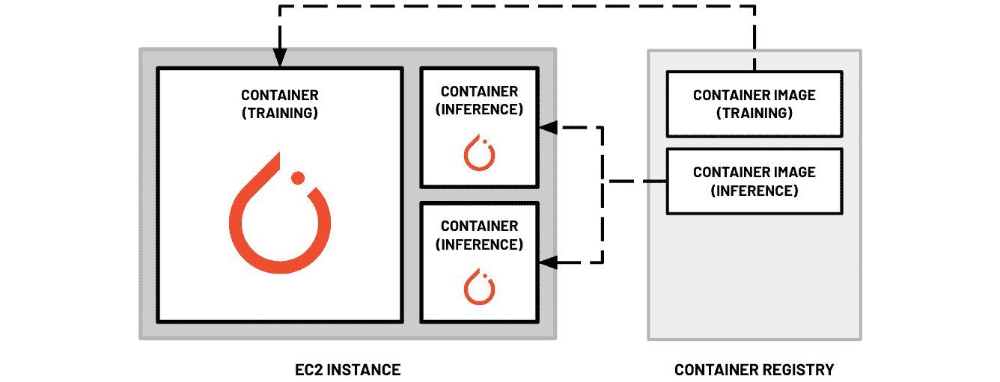

图 3.1 – 在单个 EC2 实例内运行多个容器

可用的最受欢迎的容器管理解决方案之一是 **Docker**。它是一个开源的容器化平台，允许开发者和工程师轻松地构建、运行和管理容器。它涉及使用 **Dockerfile**，这是一个包含如何构建容器镜像的指令的文本文件。然后，这些容器镜像被管理和存储在容器注册库中，以便可以在以后使用。

注意

Docker 镜像用于创建容器。Docker 镜像类似于 ZIP 文件，它打包了运行应用程序所需的一切。当从容器镜像（使用 `docker run` 命令）运行 Docker 容器时，容器就像一个虚拟机，其环境是隔离的，并且与运行容器的服务器分开。

既然我们已经对容器和容器镜像有了更好的了解，那么让我们继续讨论 DLC（深度学习容器）是什么以及它们是如何被用来加速机器学习模型的训练和部署的。使用 AWS DLC 的一个关键好处是，大多数相关的 ML（机器学习）包、框架和库已经预装在容器镜像中。这意味着 ML 工程师和数据科学家不再需要担心安装和配置 ML 框架、库和包。这使他们能够继续准备用于训练和部署他们的深度学习模型的定制脚本。

由于 DLC 镜像是简单的预构建容器镜像，因此它们可以在任何可以使用容器和容器镜像的 AWS 服务中使用。这些 AWS 服务包括 **Amazon EC2**、**Amazon Elastic Container Service**（**ECS**）、**Amazon Elastic Kubernetes Service (EKS**)、**Amazon SageMaker**、**AWS CodeBuild**、**AWS Lambda** 以及更多。

考虑到这些，让我们继续使用 AWS 深度学习容器来训练和部署深度学习模型！

# 必要的先决条件

在本节中，我们将在进行训练步骤之前确保以下先决条件已准备就绪：

1.  我们将准备一个 Cloud9 环境，并确保它已经设置好，以便我们可以训练模型并构建自定义容器镜像。

1.  我们将准备一个训练数据集，该数据集将在训练深度学习模型时使用。

## 准备 Cloud9 环境

在本章的第一部分，我们将在一个 EC2 实例内部运行我们的深度学习容器，类似于以下图中所示：

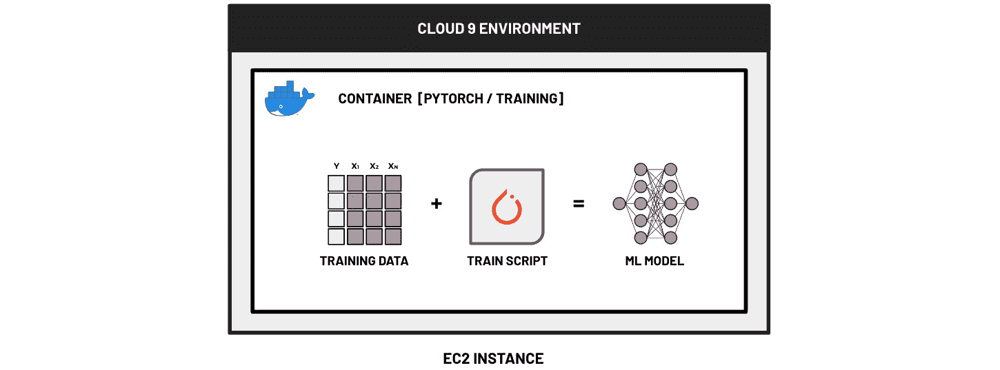

图 3.2 – 在 EC2 实例内运行深度学习容器

这个容器将作为使用**PyTorch**框架的脚本训练机器学习模型的环境。即使 PyTorch 没有安装在 EC2 实例上，训练脚本仍然可以成功运行，因为它将在预安装了 PyTorch 的容器环境中执行。

注意

如果你想知道 PyTorch 是什么，它是最受欢迎的开源机器学习框架之一。你可以访问[`pytorch.org/`](https://pytorch.org/)获取更多信息。

在接下来的步骤中，我们将确保我们的 Cloud9 环境已准备好：

1.  在搜索栏中输入`cloud9`。从结果列表中选择**Cloud9**：

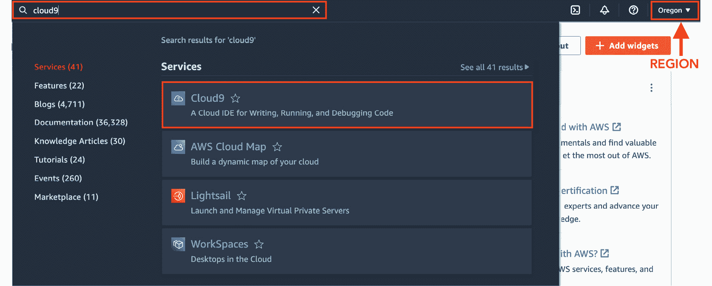

图 3.3 – 导航到 Cloud9 控制台

这里，我们可以看到当前区域设置为`us-west-2`)。请确保将其更改为你在*第一章*“AWS 机器学习工程简介”中创建 Cloud9 实例的位置。

1.  通过点击`us-west-2`)，打开你在*第一章*“AWS 机器学习工程简介”的*创建你的 Cloud9 环境*部分中创建的 Cloud9 环境。

注意

如果你跳过了第一章，确保在继续之前完成该章节的*创建你的 Cloud9 环境*和*增加 Cloud9 存储*部分。

1.  在 Cloud9 环境的终端中，运行以下`bash`命令以创建`ch03`目录：

    ```py
    mkdir -p ch03
    ```

    ```py
    cd ch03
    ```

我们将使用这个目录作为本章的当前工作目录。

现在我们已经准备好了 Cloud9 环境，接下来让我们开始下载训练数据集，以便我们可以训练我们的深度学习模型。

## 下载示例数据集

本章中我们将使用的训练数据集与我们在*第二章*“深度学习 AMIs”中使用的相同数据集。它包含两列，分别对应连续的*x*和*y*变量。在本章的后面部分，我们还将使用这个数据集生成一个回归模型。这个回归模型预计将接受一个输入*x*值并返回一个预测的*y*值。

在接下来的步骤中，我们将下载训练数据集到我们的 Cloud9 环境中：

1.  运行以下命令以创建`data`目录：

    ```py
    mkdir -p data
    ```

1.  接下来，让我们使用`wget`命令下载训练数据 CSV 文件：

    ```py
    wget https://bit.ly/3h1KBx2 -O data/training_data.csv
    ```

1.  使用`head`命令检查我们的训练数据看起来像什么：

    ```py
    head data/training_data.csv
    ```

这应该会给我们提供*(x,y)*对，类似于以下截图所示：


图 3.4 – 训练数据文件 training_data.csv 的前几行

由于我们是在`ch03`目录内开始这一节的，因此需要注意的是`training_data.csv`文件应该位于`ch03/data`目录内。

现在我们已经准备好了先决条件，我们可以继续进行训练步骤。

# 使用 AWS 深度学习容器训练 ML 模型

在这一点上，您可能想知道是什么让深度学习模型与其他 ML 模型不同。深度学习模型是由相互连接的节点组成的网络，它们彼此通信，类似于人类大脑中神经元网络的通信方式。这些模型在网络中使用了多个层，类似于以下图示。更多的层和每层的更多神经元赋予了深度学习模型处理和学习复杂非线性模式和关系的能力：

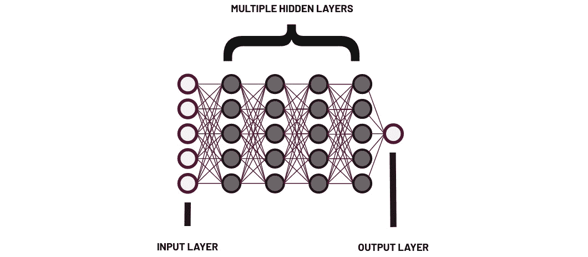

图 3.5 – 深度学习模型

深度学习在**自然语言处理**（**NLP**）、**计算机视觉**和**欺诈检测**等领域有几种实际应用。除此之外，这里还有一些其他的应用和示例：

+   **生成对抗网络**（**GANs**）：这些可以用来从原始数据集中生成真实示例，类似于我们在*第一章*“在 AWS 上介绍机器学习工程”中“使用深度学习模型生成合成数据集”部分所做的那样。

+   **深度强化学习**：这利用深度神经网络和强化学习技术来解决机器人、游戏等行业的复杂问题。

在过去几年中，随着**PyTorch**、**TensorFlow**和**MXNet**等深度学习框架的出现，深度学习模型的训练和部署过程得到了极大的简化。AWS DLCs 通过提供预装了运行这些 ML 框架所需所有内容的容器镜像，进一步加快了这一过程。

注意

您可以在此处查看可用的 DLC 镜像列表：[`github.com/aws/deep-learning-containers/blob/master/available_images.md`](https://github.com/aws/deep-learning-containers/blob/master/available_images.md)。请注意，这些容器镜像根据以下类别进行分类：（1）安装的 ML 框架（**PyTorch**、**TensorFlow**或**MXNet**），（2）作业类型（*训练*或*推理*），以及（3）安装的 Python 版本。

在接下来的步骤中，我们将使用针对训练 PyTorch 模型进行优化的 DLC 镜像：

1.  通过运行以下命令下载`train.py`文件：

    ```py
    wget https://bit.ly/3KcsG3v -O train.py
    ```

在我们继续之前，让我们通过从`File`树中打开它来检查`train.py`文件的内容：


图 3.6 – 从文件树中打开 train.py 文件

我们应该看到一个脚本，它使用存储在 `data` 目录中的训练数据来训练一个深度学习模型。在训练步骤完成后，该模型被保存在 `model` 目录中：

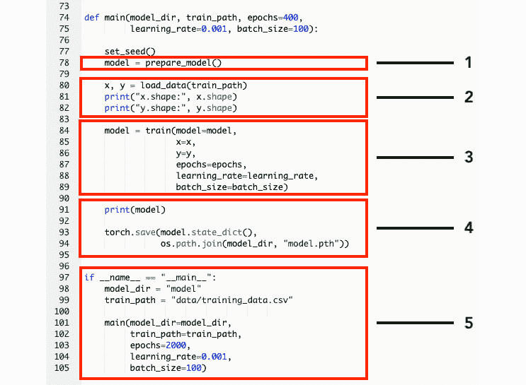

图 3.7 – train.py 脚本文件的 main() 函数

在这里，我们可以看到我们的 `train.py` 脚本的 `main()` 函数执行以下操作：

+   (1) 使用 `prepare_model()` 函数定义模型

+   (2) 使用 `load_data()` 函数加载训练数据

+   (3) 使用 `fit()` 方法执行训练步骤

+   (4) 使用 `torch.save()` 方法保存模型工件

在前面的截图中的最后一块代码简单地运行了 `main()` 函数，如果 `train.py` 被直接作为脚本执行。

注意

你可以在这里找到完整的 `train.py` 脚本：[`github.com/PacktPublishing/Machine-Learning-Engineering-on-AWS/blob/main/chapter03/train.py`](https://github.com/PacktPublishing/Machine-Learning-Engineering-on-AWS/blob/main/chapter03/train.py)。

1.  接下来，使用 `mkdir` 命令创建 `model` 目录：

    ```py
    mkdir -p model
    ```

之后，我们将看到模型输出被保存在这个目录中。

1.  通过运行以下命令安装 `tree` 工具：

    ```py
    sudo apt install tree
    ```

1.  让我们使用我们刚刚安装的 `tree` 工具：

    ```py
    tree
    ```

这应该会产生一个类似以下截图中的树状结构：


图 3.8 – 使用 tree 命令后的结果

重要的是要注意，`train.py` 脚本位于 `ch03` 目录中，`data` 和 `model` 目录也位于此处。

1.  使用 `wget` 命令下载 `train.sh` 文件：

    ```py
    wget https://bit.ly/3Iz7zaV -O train.sh
    ```

如果我们检查 `train.sh` 文件的内容，我们应该看到以下几行：

```py
aws ecr get-login-password --region us-west-2 | docker login --username AWS --password-stdin 763104351884.dkr.ecr.us-west-2.amazonaws.com
TRAINING_IMAGE=763104351884.dkr.ecr.us-west-2.amazonaws.com/pytorch-training:1.8.1-cpu-py36-ubuntu18.04
docker run -it -v `pwd`:/env -w /env $TRAINING_IMAGE python train.py
```

`train.sh` 脚本首先与 **Amazon Elastic Container Registry**（一个完全管理的 Docker 容器注册表，我们可以在这里存储我们的容器镜像）进行身份验证，以便我们能够成功下载训练容器镜像。这个容器镜像已经预装了 *PyTorch 1.8.1* 和 *Python 3.6*。

重要提示

`train.sh` 脚本中的代码假设我们将在运行 Cloud9 环境的 EC2 实例（位于 *俄勒冈* (`us-west-2`) 区域）中运行训练实验。请确保将 `us-west-2` 替换为适当的区域代码。有关此主题的更多信息，请随时查看 https://docs.aws.amazon.com/AWSEC2/latest/UserGuide/using-regions-availability-zones.xhtml。

`docker run` 命令首先下载指定的容器镜像，并使用该镜像创建一个运行中的容器进程。之后，当前工作目录的内容在当前工作目录（`ch03`）通过运行 `docker run` 命令时使用 `-v` 标志挂载到容器中后会被“复制”到容器中。然后我们使用 `-w` 标志将工作目录设置到容器内部我们的文件被挂载的位置（`/env`）。一旦所有步骤完成，`train.py` 脚本将在运行中的容器环境中执行。

注意

查阅 [`docs.docker.com/engine/reference/run/`](https://docs.docker.com/engine/reference/run/) 获取更多关于如何使用 `docker run` 命令的信息。

1.  现在我们对执行 `train.sh` 文件时会发生什么有了更好的了解，让我们使用以下命令运行它：

    ```py
    chmod +x train.sh
    ```

    ```py
    ./train.sh
    ```

这应该会产生一组日志，类似于以下内容：

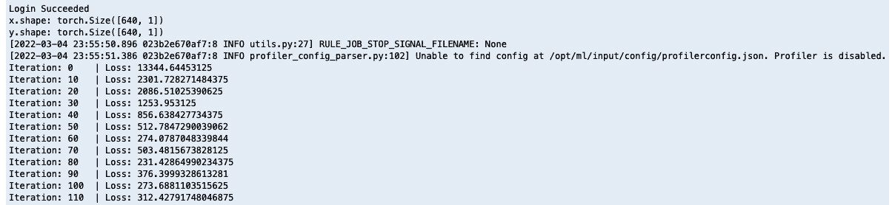

图 3.9 – 运行 train.sh 脚本时生成的日志

在这里，`train.sh` 脚本运行了一个容器，该容器调用了 `train.py`（Python）脚本来训练深度学习模型。在前面的屏幕截图中，我们可以看到 `train.py` 脚本在迭代更新神经网络权重以提高输出模型的质量（即减少每次迭代的损失，以便我们可以最小化错误）时生成的日志。需要注意的是，这个 `train.py` 脚本使用了 **PyTorch** 准备和训练一个使用提供的数据的示例深度学习模型。

这是我们为什么使用已经预装了 *PyTorch 1.8.1* 和 *Python 3.6* 的深度学习容器镜像的原因。

注意

这一步可能需要 5 到 10 分钟才能完成。在等待的时候，不妨来一杯咖啡或茶！

1.  训练脚本运行完成后，让我们使用 `tree` 命令检查 `model` 目录是否包含一个 `model.pth` 文件：

    ```py
    tree
    ```

这应该会产生一个类似以下的树状结构：


图 3.10 – 验证模型是否成功保存

这个 `model.pth` 文件包含我们使用 `train.py` 脚本训练的序列化模型。该文件是在模型训练步骤完成后使用 `torch.save()` 方法创建的。您可以查阅 [`pytorch.org/tutorials/beginner/saving_loading_models.xhtml`](https://pytorch.org/tutorials/beginner/saving_loading_models.xhtml) 获取更多信息。

注意

生成的 `model.pth` 文件允许我们使用模型的参数进行预测（在模型从文件加载后）。例如，如果我们的模型使用一个如 *ax² + bxy + cy² = 0* 的方程，那么 *a*、*b* 和 *c* 的值是模型参数。有了这个，如果我们有 *x*（这是自变量），我们可以轻松地计算 *y* 的值。也就是说，我们可以认为确定 *a*、*b* 和 *c* 是训练阶段的任务，而确定给定 *x*（以及给定 *a*、*b* 和 *c*）的 *y* 是推理阶段的任务。通过加载 `model.pth` 文件，我们可以进入推理阶段，并计算给定输入 *x* 值的预测 *y* 值。

难道不是很简单吗？训练步骤完成后，我们将在下一节进行部署步骤。

# 使用 Lambda 的容器镜像支持进行无服务器 ML 部署

现在我们有了 `model.pth` 文件，我们该如何处理它？答案是简单的：我们将使用一个 **AWS Lambda** 函数和一个 **Amazon API Gateway** HTTP API 在无服务器 API 中部署这个模型，如下面的图所示：

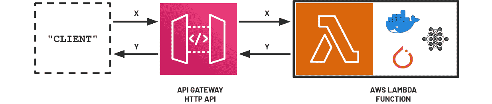

图 3.11 – 使用 API Gateway 和 AWS Lambda 的无服务器 ML 部署

如我们所见，HTTP API 应该能够接受来自“客户端”如移动应用和其他与最终用户交互的 Web 服务器的 **GET** 请求。然后这些请求作为输入事件数据传递给 AWS Lambda 函数。Lambda 函数随后从 `model.pth` 文件中加载模型，并使用它根据输入事件数据中的 *x* 值计算预测的 *y* 值。

## 构建自定义容器镜像

我们的 AWS Lambda 函数代码需要利用 **PyTorch** 函数和实用工具来加载模型。为了使这个设置正常工作，我们将从现有的针对 **PyTorch** 推理需求优化的 DLC 镜像构建一个自定义容器镜像。这个自定义容器镜像将用于我们的 AWS Lambda 函数代码将通过 AWS Lambda 的容器镜像支持运行的环境。

注意

想了解更多关于 AWS Lambda 的容器镜像支持信息，请查看 https://aws.amazon.com/blogs/aws/new-for-aws-lambda-container-image-support/.

重要的是要注意，我们有各种 DLC 镜像可供选择。这些镜像根据它们的作业类型（*训练与推理*）、安装的框架（*PyTorch 与 TensorFlow 与 MXNet 与其他选项*）和安装的 Python 版本（*3.8 与 3.7 与 3.6 与其他选项*）进行分类。由于我们计划在一个可以加载并使用 **PyTorch** 模型进行预测的容器中，因此当构建自定义 Docker 镜像时，我们将选择一个针对 **PyTorch** 推理优化的 DLC 镜像作为基础镜像。

以下步骤专注于从现有的 DLC 镜像构建一个自定义容器镜像：

1.  确保你已经在`ch03`目录内，通过在终端中运行`pwd`命令来检查。

1.  接下来，运行以下命令以下载`dlclambda.zip`并将其内容提取到`ch03`目录中：

    ```py
    wget https://bit.ly/3pt5mGN -O dlclambda.zip
    ```

    ```py
    unzip dlclambda.zip
    ```

此 ZIP 文件包含构建自定义容器镜像所需的文件和脚本。

1.  使用`tree`命令查看`ch03`目录的结构：

    ```py
    tree
    ```

这应该会生成一个类似以下的树状结构：

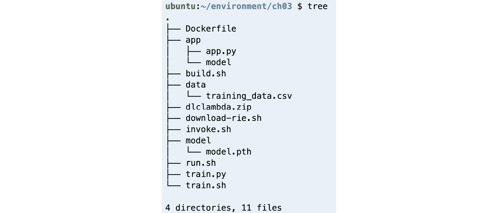

图 3.12 – 执行 tree 命令后的结果

在这里，从`dlclambda.zip`文件中提取了几个新文件：

+   `Dockerfile`

+   `app/app.py`

+   `build.sh`

+   `download-rie.sh`

+   `invoke.sh`

+   `run.sh`

我们将在本章的步骤中详细讨论这些文件。

1.  在文件树中，定位并打开位于`ch03/app`目录内的`app.py`文件：

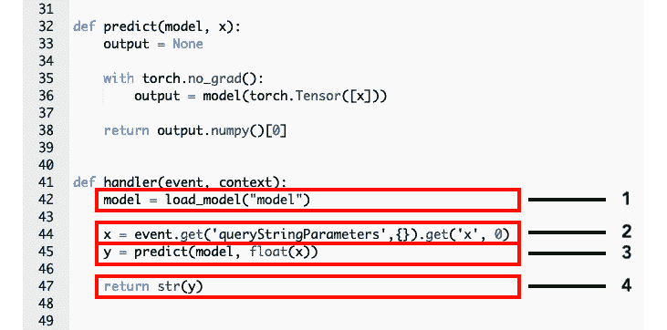

图 3.13 – app.py Lambda 处理程序实现

此文件包含 AWS Lambda 处理程序实现代码，该代码（1）加载模型，（2）从事件数据中提取输入*x*值，（3）使用模型计算预测*y*值，（4）以字符串形式返回输出*y*值。

在本章末尾附近的*完成和测试无服务器 API 设置*部分，我们将设置一个 HTTP API，该 API 通过 URL 查询字符串接受`x`的值（例如，`https://<URL>/predict?x=42`）。一旦请求到来，Lambda 将调用一个包含处理传入请求的代码的处理程序函数。它将加载深度学习模型，并使用它来预测`y`的值，使用*x*的值。

注意

你可以在这里找到完整的`app/app.py`文件：[`github.com/PacktPublishing/Machine-Learning-Engineering-on-AWS/blob/main/chapter03/app/app.py`](https://github.com/PacktPublishing/Machine-Learning-Engineering-on-AWS/blob/main/chapter03/app/app.p).

1.  使用`cp`命令将`model.pth`文件从`model`目录复制到`app/model`目录：

    ```py
    cp model/model.pth app/model/model.pth
    ```

重要提示

确保你只从可信来源加载机器学习模型。在`app/app.py`内部，我们使用`torch.load()`加载模型，这可能被包含恶意有效载荷的攻击者利用。攻击者可以轻松准备一个包含恶意有效载荷的模型，当加载时，会给予攻击者访问你的服务器或运行机器学习脚本的资源（例如，通过**反向 shell**）。有关此主题的更多信息，你可以查看作者关于如何黑客攻击和确保机器学习环境和系统安全的演讲：[`speakerdeck.com/arvslat/pycon-apac-2022-hacking-and-securing-machine-learning-environments-and-systems?slide=8`](https://speakerdeck.com/arvslat/pycon-apac-2022-hacking-and-securing-machine-learning-environments-and-systems?slide=8).

1.  接下来，让我们使用 `chmod` 命令使 `build.sh`、`download-rie.sh`、`invoke.sh` 和 `run.sh` 脚本文件可执行：

    ```py
    chmod +x *.sh
    ```

1.  在运行 `build.sh` 命令之前，让我们使用 `cat` 命令检查脚本的正文：

    ```py
    cat build.sh
    ```

这应该会产生一行代码，类似于以下代码块中的内容：

```py
docker build -t dlclambda .
```

`docker build` 命令使用当前目录中 Dockerfile 中指定的指令构建 Docker 容器镜像。*这是什么意思？* 这意味着我们正在使用目录中的相关文件构建容器镜像，并且我们正在使用 Dockerfile 中的指令安装必要的包。这个过程类似于准备容器的 *DNA*，它可以用来创建具有所需工具和包配置的新容器。

由于我们将 `dlclambda` 作为 `-t` 标志的参数传递，我们的自定义容器镜像在构建过程完成后将具有 `dlclambda:latest` 的名称和标签。请注意，我们可以用特定的版本号（例如，`dlclambda:3`）替换最新标签，但我们现在将坚持使用 `latest` 标签。

注意

如需了解更多关于 `docker build` 命令的信息，请访问 https://docs.docker.com/engine/reference/commandline/build/。

1.  我们还必须检查 Dockerfile 的内容。当我们使用此 Dockerfile 构建容器镜像时会发生什么？

    1.  以下 DLC 镜像被用作构建两个阶段的基镜像：`https://763104351884.dkr.ecr.us-west-2.amazonaws.com/pytorch-inference:1.8.1-cpu-py36-ubuntu18.04`。重要的是要注意，此 Dockerfile 使用 **多阶段构建** 来确保最终容器不包含前一个构建阶段的未使用工件和文件。

    1.  接下来，安装 **Lambda 运行时接口客户端**。这允许任何自定义容器镜像与 AWS Lambda 兼容。

    1.  创建了 `/function` 目录。然后，将 `app/` 目录（位于 Cloud9 环境的 `ch03` 目录内）的内容复制到容器内的 `/function` 目录。

    1.  `ENTRYPOINT` 设置为 `/opt/conda/bin/python -m awslambdaric`。然后 `CMD` 设置为 `app.handler`。`ENTRYPOINT` 和 `CMD` 指令定义了容器启动运行时执行的命令。

注意

单个 Dockerfile 中的 `FROM` 指令。这些 `FROM` 指令中的每一个都对应一个新的构建阶段，其中可以复制前一个阶段的工件和文件。在多阶段构建中，最后一个构建阶段生成最终镜像（理想情况下不包含前一个构建阶段的未使用文件）。

预期的最终输出将是一个可以用来启动容器的容器镜像，类似于以下内容：

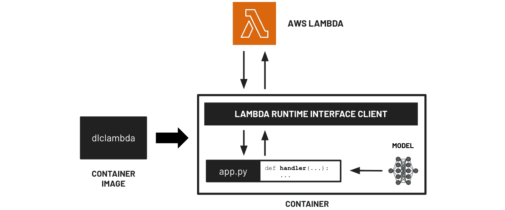

图 3.14 – Lambda 运行时接口客户端

如果这个容器在没有任何额外参数的情况下启动，以下命令将执行：

```py
/opt/conda/bin/python -m awslambdaric app.handler
```

这将运行`app.py`文件中的`handler()`函数来处理 AWS Lambda 事件。然后，`handler()`函数将使用我们在*使用 AWS 深度学习容器训练 ML 模型*部分训练的深度学习模型进行预测。

注意

您可以在以下位置找到 Dockerfile：[`github.com/PacktPublishing/Machine-Learning-Engineering-on-AWS/blob/main/chapter03/Dockerfile`](https://github.com/PacktPublishing/Machine-Learning-Engineering-on-AWS/blob/main/chapter03/Dockerfile)。

在运行`build.sh`脚本之前，请确保将 Dockerfile 中的所有`us-west-2`实例替换为适当的区域代码。

1.  现在，让我们运行`build.sh`脚本：

    ```py
    ./build.sh
    ```

1.  最后，我们需要使用`docker images`命令检查自定义容器镜像的大小是否超过 10 GB：

    ```py
    docker images | grep dlclambda
    ```

我们应该看到`dlclambda`的容器镜像大小为`4.61GB`。需要注意的是，当使用容器镜像为 Lambda 函数时，存在 10 GB 的限制。如果我们要在 AWS Lambda 中使用这些镜像，我们的自定义容器镜像的大小需要低于 10 GB。

到目前为止，我们的自定义容器镜像已经准备好了。下一步是在使用它创建 AWS Lambda 函数之前，在本地测试容器镜像。

## 测试容器镜像

我们可以使用**Lambda 运行时接口模拟器**在本地测试容器镜像。这将帮助我们检查当容器镜像部署到 AWS Lambda 后是否能够正常运行。

在接下来的几个步骤中，我们将下载并使用 Lambda 运行时接口模拟器来检查我们的容器镜像：

1.  使用`cat`命令检查`download-rie.sh`文件的内容：

    ```py
    cat download-rie.sh
    ```

这应该在终端中输出以下代码块：

```py
mkdir -p ~/.aws-lambda-rie && curl -Lo ~/.aws-lambda-rie/aws-lambda-rie \
https://github.com/aws/aws-lambda-runtime-interface-emulator/releases/latest/download/aws-lambda-rie \
&& chmod +x ~/.aws-lambda-rie/aws-lambda-rie
```

`download-rie.sh`脚本简单地下载 Lambda 运行时接口模拟器二进制文件，并使用`chmod`命令使其可执行。

1.  接下来，运行`download-rie.sh`脚本：

    ```py
    sudo ./download-rie.sh
    ```

1.  使用`cat`命令检查`run.sh`文件的内容：

    ```py
    cat run.sh
    ```

我们应该看到一个带有几个参数值的`docker run`命令，类似于以下代码块：

```py
docker run -v ~/.aws-lambda-rie:/aws-lambda -p 9000:8080 --entrypoint /aws-lambda/aws-lambda-rie dlclambda:latest /opt/conda/bin/python -m awslambdaric app.handler
```

让我们快速检查传递给每个标志的参数值：

+   `-v`: `~/.aws-lambda-rie`是一个位于运行中的 Docker 容器之外的目录，需要将其挂载到容器内的`/aws-lambda`（容器内部）。

+   `-p`: 这将容器中的`8080`端口绑定到实例的`9000`端口。

+   `--entrypoint`: 这将覆盖容器启动时默认执行的`ENTRYPOINT`命令。

+   `[IMAGE]`: `dlclambda:latest.`

+   `[COMMAND]` `[ARG…]`: `/opt/conda/bin/python -m awslambdaric app.handler.`

这个`docker run`命令覆盖了默认的`ENTRYPOINT`命令，并使用`aws-lambda-rie`，而不是使用`--entrypoint`标志。这将然后在`http://localhost:9000/2015-03-31/functions/function/invocations`上启动一个本地端点。

注意

关于 `docker run` 命令的更多信息，您可以自由查看 [`docs.docker.com/engine/reference/commandline/run/`](https://docs.docker.com/engine/reference/commandline/run/)。

1.  现在，让我们调用 `run.sh` 脚本：

    ```py
    ./run.sh
    ```

1.  通过单击以下截图所示的加号（**+**）按钮创建一个新的终端标签页：

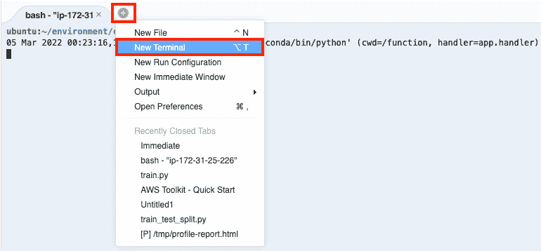

图 3.15 – 创建新的终端标签页

注意，在我们打开 **新终端** 标签页时，`run.sh` 脚本应该保持运行状态。

1.  在 `invoke.sh` 脚本中：

    ```py
    cd ch03
    ```

    ```py
    cat invoke.sh
    ```

这应该会显示 `invoke.sh` 脚本文件中的内容。它应该包含一个单行脚本，类似于以下代码块：

```py
curl -XPOST "http://localhost:9000/2015-03-31/functions/function/invocations" -d '{"queryStringParameters":{"x":42}}'
```

此脚本只是简单地使用 `curl` 命令发送一个包含 `x` 输入值的样本 `POST` 请求到之前由 `run.sh` 脚本启动的本地端点。

1.  现在，让我们运行 `invoke.sh` 脚本：

    ```py
    ./invoke.sh
    ```

这应该会得到接近 `"42.4586"` 的值。您可以在 `invoke.sh` 脚本中自由更改输入 `x` 的值，以查看输出值如何变化。

1.  返回到第一个标签页，并按 *Ctrl* + *C* 停止正在运行的 `run.sh` 脚本。

由于我们能够成功地在自定义容器镜像中使用 **Lambda Runtime Interface Emulator** 调用 `app.py` Lambda 函数处理程序，我们现在可以继续将容器镜像推送到 Amazon ECR，并使用它来创建 AWS Lambda 函数。

## 将容器镜像推送到 Amazon ECR

**Amazon Elastic Container Registry** (**ECR**) 是一个容器注册服务，允许我们存储和管理 Docker 容器镜像。在本节中，我们将创建一个 ECR 仓库，然后将我们的自定义容器镜像推送到这个 ECR 仓库。

让我们先创建一个 ECR 仓库：

1.  在 Cloud9 环境的右上角找到并单击 **共享** 按钮旁边的圆圈，如图所示。从选项列表中选择 **转到仪表板**：

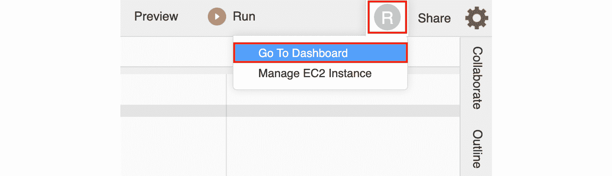

图 3.16 – 导航到 Cloud9 控制台

这应该会打开 Cloud9 控制台，在那里我们可以找到所有创建的 Cloud9 环境。

1.  在搜索栏中输入 `registry`。从结果列表中选择 **Elastic Container Registry**。

1.  在 ECR 控制台页面的右上角找到并单击 **创建仓库** 按钮。

1.  在 `dlclambda` 上）：

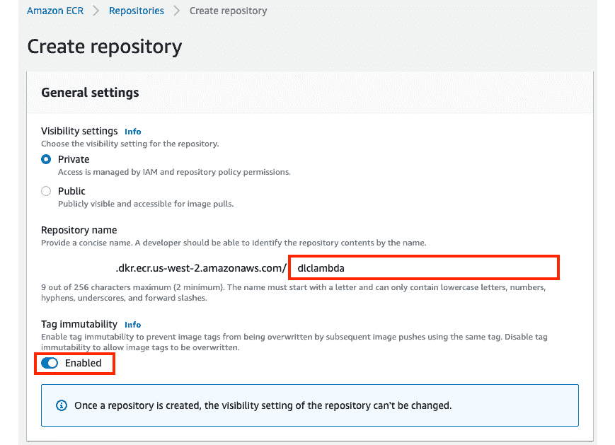

图 3.17 – 创建 ECR 仓库

可选地，您可以选择启用 **标签不可变性**，类似于前面截图所示。这将有助于确保我们不会意外覆盖现有的容器镜像标签。

1.  将页面滚动到最底部，然后单击 **创建仓库**。

1.  我们应该会看到一个成功通知，以及与以下截图类似的 **查看推送命令** 按钮：

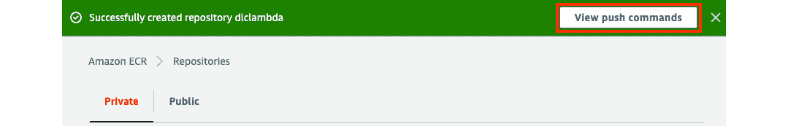

图 3.18 – 查看推送命令

点击 **查看推送命令** 按钮以打开 **<ECR 仓库名称> 的推送命令** 弹出窗口。

1.  在 *步骤 1* 下的灰色框内找到 `bash` 命令。通过点击以下截图中的高亮框按钮，将命令复制到剪贴板：

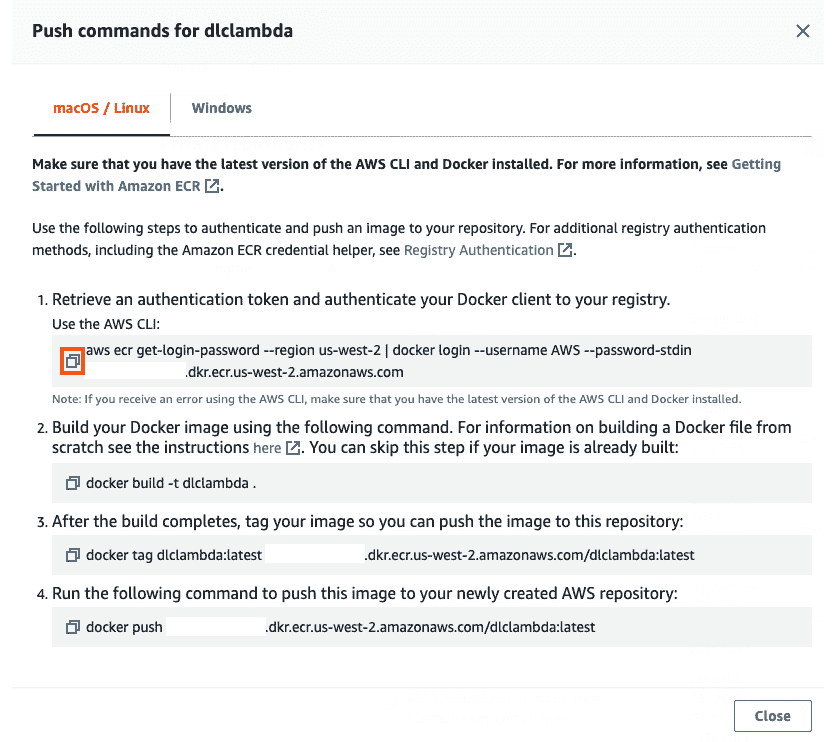

图 3.19 – 推送命令

此命令将用于在我们的 Cloud9 环境中对 Docker 客户端进行认证到 Amazon ECR。这将赋予我们推送和拉取容器镜像到 Amazon ECR 的权限。

1.  返回到 `bash` 命令：

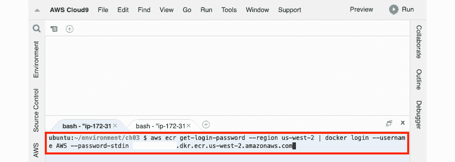

图 3.20 – 运行客户端认证命令

我们应该会得到 **登录成功** 的消息。如果没有这一步，我们就无法从 Amazon ECR 推送和拉取容器镜像。

1.  返回到包含 ECR 推送命令的浏览器标签页，并复制 *步骤 3* 下的命令，如以下截图所示：

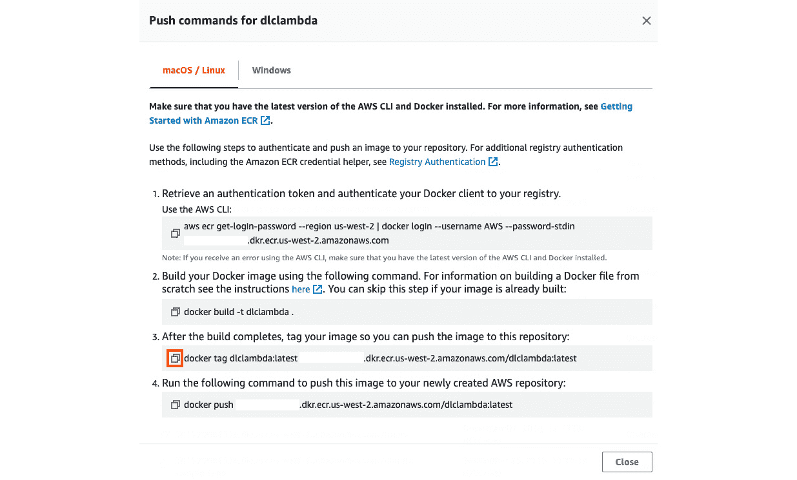

图 3.21 – 复制 docker tag 命令

这次，我们将从 `docker tag` 命令复制 `docker tag` 命令用于创建和映射对 Docker 镜像的命名引用。

备注

`docker tag` 命令用于指定并添加元数据（如名称和版本）到容器镜像。容器镜像仓库存储特定镜像的不同版本，`docker tag` 命令帮助仓库识别在执行 `docker push` 命令时将更新（或上传）哪个版本的镜像。更多信息，请查阅 https://docs.docker.com/engine/reference/commandline/tag/。

1.  在包含 Cloud9 环境的浏览器标签页中，将复制的 `docker tag` 命令粘贴到终端窗口中。找到命令末尾的 `latest` 标签值，并将其替换为 `1`：

    ```py
    docker tag dlclambda:latest <ACCOUNT ID>.dkr.ecr.us-west-2.amazonaws.com/dlclambda:latest
    ```

命令应类似于以下代码块中 `latest` 标签被替换为 `1` 后的内容：

```py
docker tag dlclambda:latest <ACCOUNT ID>.dkr.ecr.us-west-2.amazonaws.com/dlclambda:1
```

确保将 `<ACCOUNT ID>` 值正确设置为所使用的 AWS 账户的账户 ID。您从 `<ACCOUNT ID>` 值设置的 `docker tag` 命令已正确复制。

1.  使用 `docker images` 命令快速检查我们的 Cloud9 环境中的容器镜像：

    ```py
    docker images
    ```

这应该会返回所有容器镜像，包括 `dlclambda` 容器镜像，如下截图所示：

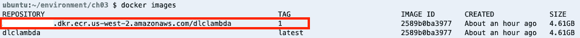

图 3.22 – 运行 docker images 命令

重要的是要注意，前一个截图显示的两个容器镜像标签具有相同的镜像 ID。这意味着它们指向相同的镜像，即使它们有不同的名称和标签。

1.  使用 `docker push` 命令将容器镜像推送到 Amazon ECR 仓库：

    ```py
    docker push <ACCOUNT ID>.dkr.ecr.us-west-2.amazonaws.com/dlclambda:1
    ```

确保将`<ACCOUNT ID>`的值替换为你使用的 AWS 账户的账户 ID。你可以在运行上一步中的`docker images`命令后，检查`.dkr.ecr.us-west-2.amazonaws.com/dlclambda`之前的数值来获取`<ACCOUNT ID>`的值。

注意

注意到镜像标签值是`1`（一个），而不是容器镜像名称和冒号后面的字母*l*。

1.  返回包含 ECR 推送命令的浏览器标签页，并点击**关闭**按钮。

1.  在**私有仓库**列表中找到并点击我们创建的 ECR 仓库的名称（即`dlclambda`）：

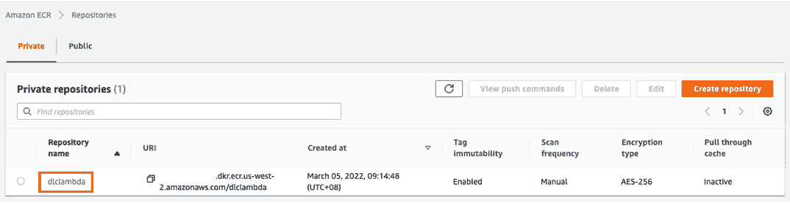

图 3.23 – 私有仓库

这应该会跳转到详情页面，在那里我们可以看到不同的镜像标签，如下面的截图所示：

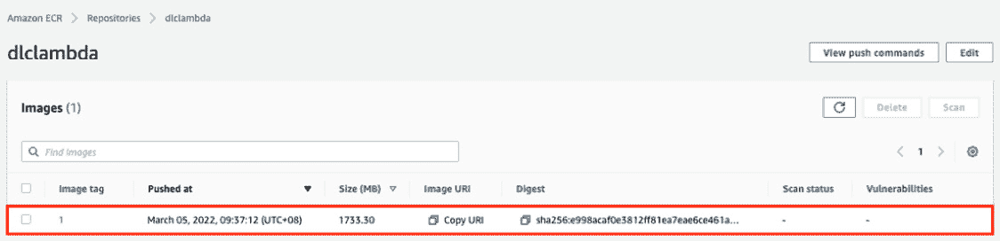

图 3.24 – 仓库详情页

一旦我们的带有指定镜像标签的容器镜像反映在相应的 Amazon ECR 仓库详情页上，我们就可以使用它来创建 AWS Lambda 函数，利用 Lambda 的容器镜像支持。

现在我们自定义的容器镜像已经推送到**Amazon ECR**，我们可以准备和配置无服务器 API 设置！

## 在 AWS Lambda 上运行 ML 预测

**AWS Lambda**是一种无服务器计算服务，允许开发者和工程师在不配置或管理基础设施的情况下运行事件驱动的代码。Lambda 函数可以被来自其他 AWS 服务的资源调用，例如**API Gateway**（一个用于配置和管理 API 的全托管服务）、**Amazon S3**（一个对象存储服务，我们可以上传和下载文件）、**Amazon SQS**（一个全托管的消息队列服务）等。这些函数在具有定义的最大执行时间和最大内存限制的隔离运行环境中执行，类似于以下图表所示：

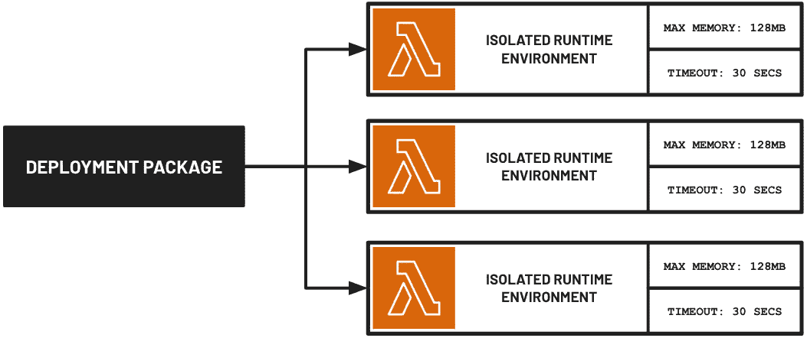

图 3.25 – AWS Lambda 隔离运行环境

部署 Lambda 函数代码及其依赖项有两种方式：

+   使用容器镜像作为部署包。

+   使用`.zip`文件作为部署包

当使用容器镜像作为部署包时，自定义 Lambda 函数代码可以使用容器镜像内部安装和配置的内容。也就是说，如果我们使用从 AWS DLC 构建的自定义容器镜像，我们就能在我们的函数代码中使用安装的 ML 框架（即**PyTorch**），并在 AWS Lambda 执行环境中运行 ML 预测。

现在我们对 AWS Lambda 的容器镜像支持有了更好的理解，让我们继续创建我们的 AWS Lambda 函数：

1.  在搜索栏中输入`lambda`。从结果列表中选择**Lambda**以导航到 AWS Lambda 控制台。

1.  定位并点击页面右上角的 **创建函数** 按钮。

1.  在 `dlclambda` 上）：

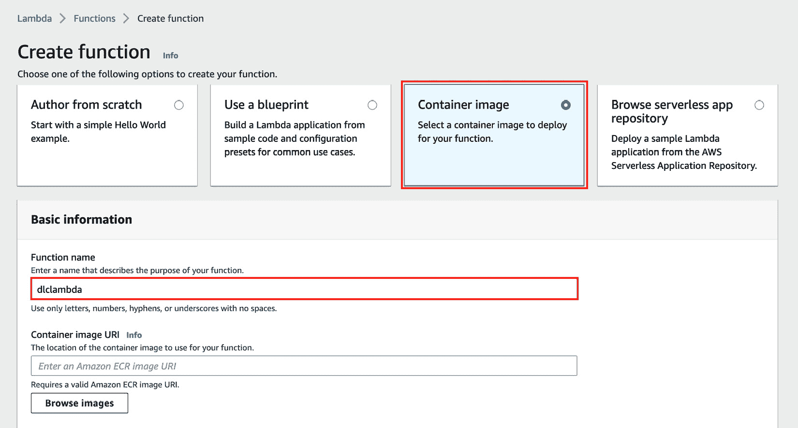

图 3.26 – 使用 AWS Lambda 的容器镜像支持

选择 **容器镜像** 选项意味着我们将使用自定义容器镜像作为部署包。这个部署包预期将包含 Lambda 代码及其依赖项。

1.  在 **容器镜像 URI** 下，点击 **浏览镜像** 按钮。这将打开一个弹出窗口，类似于以下内容：

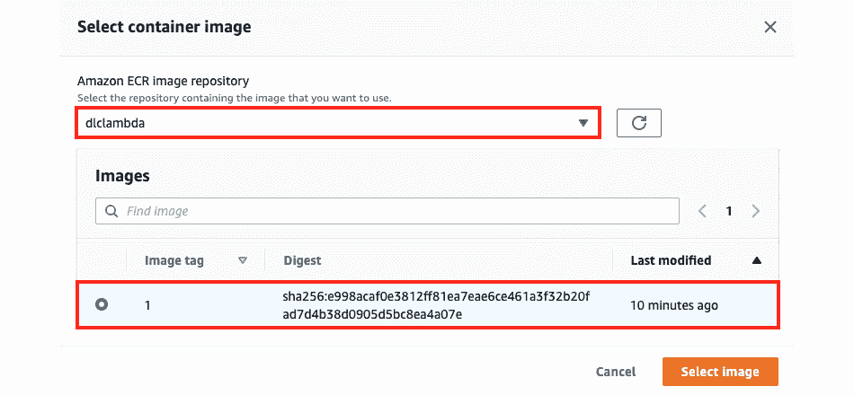

图 3.27 – 选择容器镜像

在 `dlclambda:1` 下）。

1.  点击将用于 Lambda 函数部署包的 `dlclambda` 容器镜像。

1.  然后，点击 **创建函数**。

注意

此步骤可能需要 3 到 5 分钟才能完成。在等待时，不妨喝杯咖啡或茶！

1.  导航到 **配置 > 通用配置** 选项卡并点击 **编辑**：

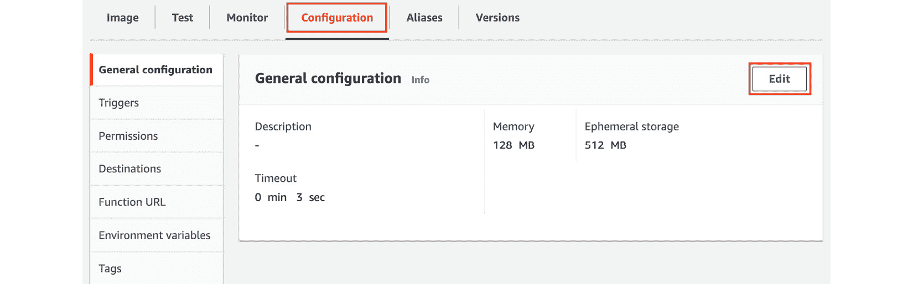

图 3.28 – 编辑通用配置

在这里，我们可以看到 AWS Lambda 函数已配置为默认最大内存限制为 128 MB 和超时时间为 3 秒。如果在执行过程中 Lambda 函数超出一个或多个配置的限制，则会引发错误。

1.  接下来，更新 `10240` MB，因为我们预计我们的 `1` 分钟和 `0` 秒也将如此，因为推理步骤可能需要比默认的 3 秒更长的时间：

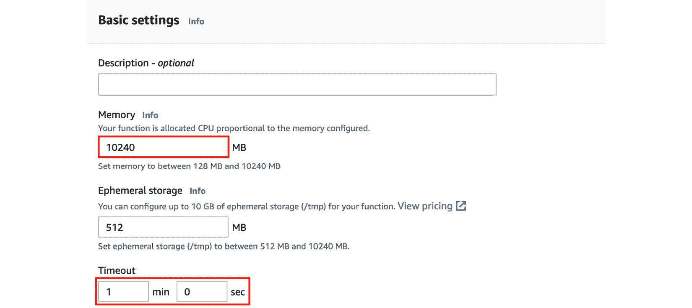

图 3.29 – 修改内存和超时设置

注意，在此处增加内存和超时限制将影响 Lambda 函数可用的计算能力和总运行时间，以及使用此服务运行预测的整体成本。目前，让我们专注于使用当前的**内存**和**超时**配置值来使 **AWS Lambda** 函数工作。一旦我们可以使初始设置运行，我们就可以尝试不同的配置值组合来管理我们设置的性能和成本。

注意

我们可以使用 **AWS Compute Optimizer** 来帮助我们优化 AWS Lambda 函数的整体性能和成本。有关此主题的更多信息，请参阅[`aws.amazon.com/blogs/compute/optimizing-aws-lambda-cost-and-performance-using-aws-compute-optimizer/`](https://aws.amazon.com/blogs/compute/optimizing-aws-lambda-cost-and-performance-using-aws-compute-optimizer/)。

1.  更改后点击 **保存** 按钮。我们应该在应用更改时看到类似于 **正在更新函数 <function name>** 的通知。

1.  导航到 **测试** 选项卡。

1.  在 `test` 下）：

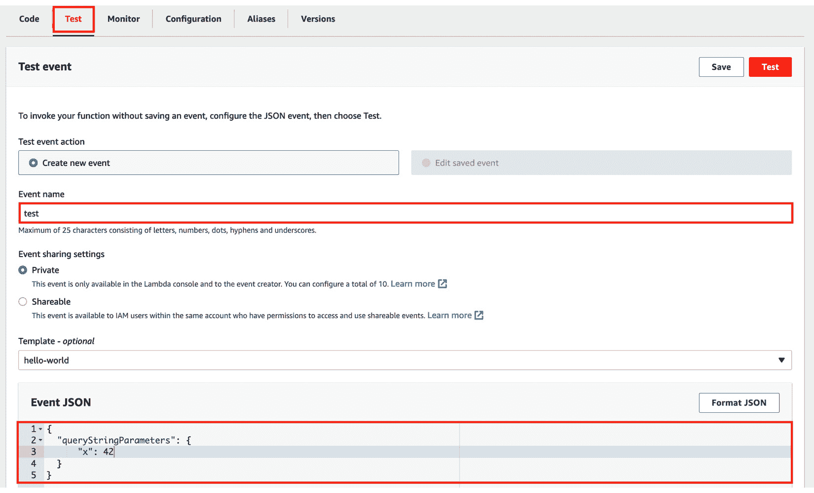

图 3.30 – 配置测试事件

确保在代码编辑器中指定以下测试事件值，类似于前面截图所示：

```py
{
  "queryStringParameters": {
    "x": 42
  }
}
```

当执行测试时，此测试事件值被传递到 AWS Lambda `handler()` 函数的 `event`（第一个）参数。

1.  点击 **保存**。

1.  现在，让我们通过点击 **测试** 按钮来测试我们的设置：

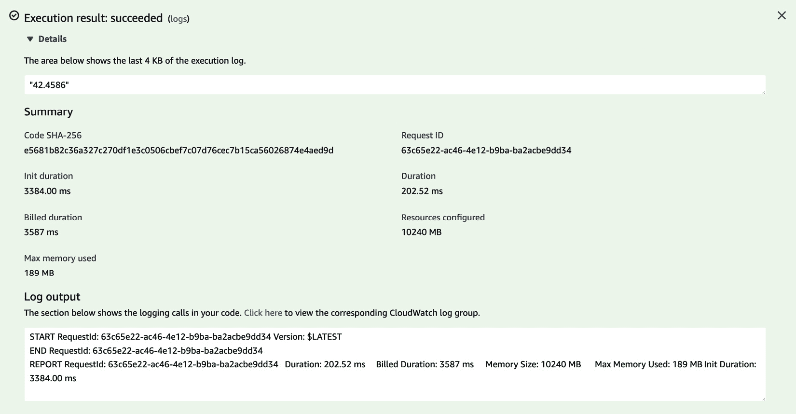

图 3.31 – 执行成功结果

几秒钟后，我们应该看到执行结果成功，类似于前面截图中的结果。

1.  在 `x` 到 `41` 然后点击 `41.481697`) 几乎立即。

重要提示

在 AWS Lambda 函数的首次调用期间，其函数代码的下载和执行环境的准备可能需要几秒钟。这种现象通常被称为 *冷启动*。当它在同一分钟内第二次被调用时（例如），Lambda 函数将立即运行，而无需与冷启动相关的延迟。例如，Lambda 函数可能需要大约 30 到 40 秒才能完成首次调用。之后，所有后续请求都会在 1 秒或更短的时间内完成。由于在首次调用期间准备好的执行环境被冻结并用于后续调用，Lambda 函数的执行速度会显著加快。如果 AWS Lambda 函数在一段时间内没有被调用（例如，大约 10 到 30 分钟的不活动时间），执行环境将被删除，并且下一次函数被调用时需要重新准备。有不同方法来管理这一点并确保 AWS Lambda 函数在没有经历冷启动效果的情况下保持一致的性能。其中一种策略是利用 **预置并发**，这有助于确保函数启动时间的可预测性。有关此主题的更多信息，请参阅 [`aws.amazon.com/blogs/compute/operating-lambda-performance-optimization-part-1/`](https://aws.amazon.com/blogs/compute/operating-lambda-performance-optimization-part-1/)。

在我们的 AWS Lambda 函数准备好执行机器学习预测后，我们可以继续创建将触发我们的 Lambda 函数的无服务器 HTTP API。

## 完成并测试无服务器 API 设置

我们创建的 AWS Lambda 函数需要通过事件源来触发。可能的事件源之一是配置为接收 HTTP 请求的 API Gateway HTTP API。在接收到请求后，HTTP API 将请求数据作为事件传递给 AWS Lambda 函数。一旦 Lambda 函数接收到事件，它将使用深度学习模型进行推理，然后将预测的输出值返回给 HTTP API。之后，HTTP API 将 HTTP 响应返回给请求的资源。

创建 API 网关 HTTP API 有不同的方法。在接下来的几个步骤中，我们将直接从 AWS Lambda 控制台创建此 HTTP API：

1.  定位到 **函数概述** 面板并点击 **添加触发器**：

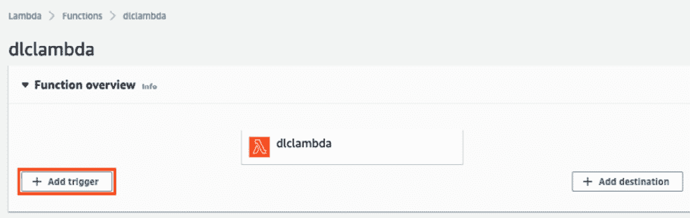

图 3.32 – 添加触发器

**添加触发器**按钮应位于 **函数概述** 面板的左侧，如前一张截图所示。

1.  使用以下触发器配置添加一个新的 AWS Lambda 触发器：

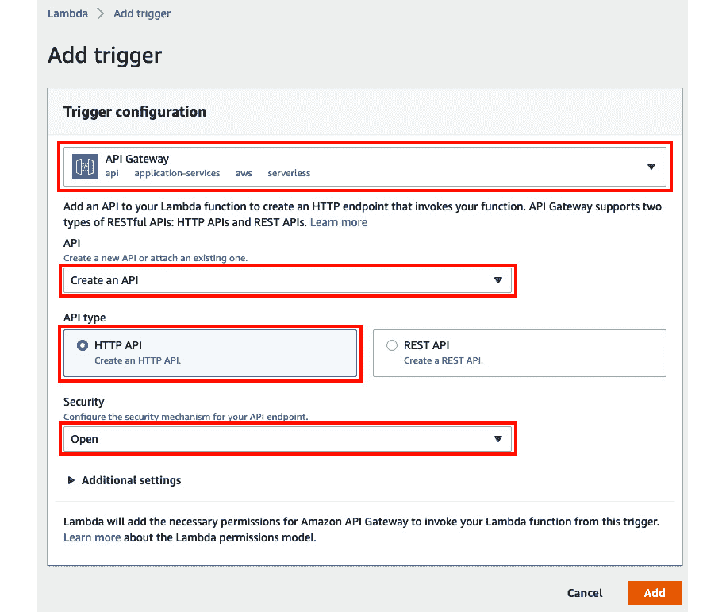

图 3.33 – 触发器配置

这是我们的触发器配置：

+   **选择触发器**：**API 网关**

+   **创建新 API 或使用现有 API**：**创建 API**

+   **API 类型**：**HTTP API**

+   **安全**：**开放**

这将创建并配置一个接受请求并将请求数据作为事件发送到 AWS Lambda 函数的 HTTP API。

重要提示

注意，一旦我们为生产使用配置了设置，此配置需要被安全化。有关此主题的更多信息，请参阅[`docs.aws.amazon.com/apigateway/latest/developerguide/security.xhtml`](https://docs.aws.amazon.com/apigateway/latest/developerguide/security.xhtml)。

1.  完成新触发器的配置后，点击 **添加** 按钮。

1.  在 **触发器** 面板下找到我们刚刚创建的 API 网关触发器。点击 **API 网关** 链接（例如，**dlclambda-API**），它应该会打开一个新标签页。在侧边栏的 **开发** 下，点击 **集成**。在 **dlclambda-API** 的路由下，点击 **ANY**。点击 **管理集成** 然后点击 **编辑**（位于 **集成详细信息** 面板中）。在 **编辑集成** 页面上，将 **高级设置** 下的 **有效载荷格式版本** 的值更新为 **2.0**，类似于 *图 3.34* 中的内容。之后点击 **保存**。

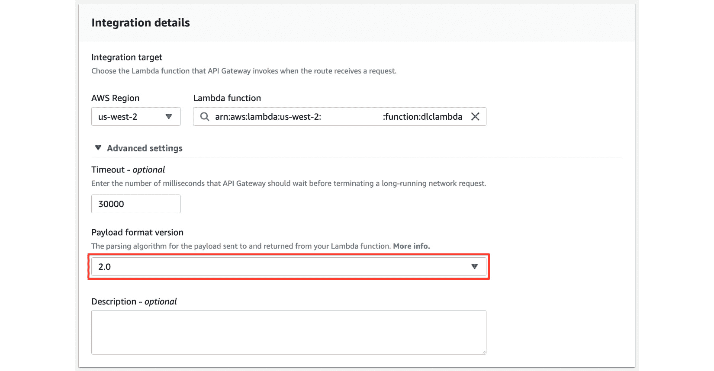

图 3.34 – 更新有效载荷格式版本

更新 URL 中的 `x` 值后，Lambda 函数在执行测试推理时将使用 `0` 作为默认的 `x` 值。

备注

如果在将请求发送到 API 网关端点时未指定 `x` 值，您可能希望触发一个异常。您可以修改 `app.py` 中的 *line 44* 来更改此行为：[`github.com/PacktPublishing/Machine-Learning-Engineering-on-AWS/blob/main/chapter03/app/app.py`](https://github.com/PacktPublishing/Machine-Learning-Engineering-on-AWS/blob/main/chapter03/app/app.py)。

1.  将 `?x=42` 添加到浏览器 URL 的末尾，类似于以下 URL 字符串中的内容：

    ```py
    https://<API ID>.execute-api.us-west-2.amazonaws.com/default/dlclambda?x=42
    ```

确保您按 `42` 作为输入 `x` 值：

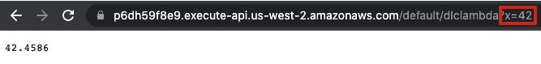

图 3.35 – 测试 API 端点

这应该返回一个接近`42.4586`的值，如图所示。你可以自由地测试不同的`x`值，看看预测的*y*值是如何变化的。

重要提示

确保你在配置和测试 API 设置完成后，删除 AWS Lambda 和 API Gateway 资源。

到目前为止，我们应该为自己感到自豪，因为我们能够成功地在无服务器 API 中使用**AWS Lambda**和**Amazon API Gateway**部署我们的深度学习模型！在 AWS Lambda 容器镜像支持发布之前，使用本章中使用的相同技术栈设置和维护无服务器 ML 推理 API 是相当棘手的。现在我们有了这个初始设置，准备和配置类似的、由 ML 驱动的无服务器 API 应该会更容易。请注意，我们还有创建 Lambda 函数 URL 的选项，以生成 Lambda 函数的唯一 URL 端点。

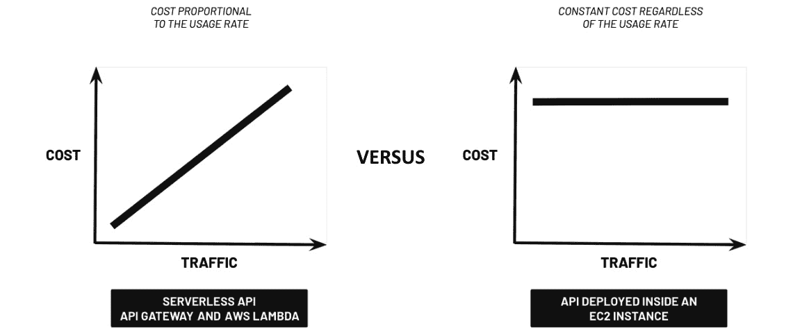

图 3.36 – 无服务器 API 运行成本与在 EC2 实例内部运行的 API 运行成本的比较

在我们结束本章之前，让我们快速检查如果我们使用**AWS Lambda**和**API Gateway**作为 ML 推理端点，成本会是怎样的。如图所示，运行此无服务器 API 的预期成本取决于通过它的流量。这意味着如果没有流量通过 API，成本将是最小的。一旦更多流量通过这个 HTTP API 端点，成本也会逐渐增加。与右侧的图表比较，无论是否通过部署在 EC2 实例内部的 HTTP API 有流量通过，预期成本都将相同。

选择用于你的 API 的架构和设置取决于多种因素。我们不会详细讨论这个话题，所以你可以自由地查看这里可用的资源：[`aws.amazon.com/lambda/resources/`](https://aws.amazon.com/lambda/resources/)。

# 摘要

在本章中，我们能够更深入地了解**AWS 深度学习容器**（**DLCs**）。与**AWS 深度学习 AMI**（**DLAMIs**）类似，AWS DLCs 已经安装了相关的 ML 框架、库和包。这显著加快了构建和部署深度学习模型的过程。同时，容器环境保证一致性，因为这些是从预构建的容器镜像运行的。

DLAMIs 和 DLCs 之间的一个主要区别是，多个 AWS DLCs 可以运行在单个 EC2 实例内部。这些容器也可以用于支持容器的其他 AWS 服务。这些服务包括**AWS Lambda**、**Amazon ECS**、**Amazon EKS**和**Amazon EC2**等。

在本章中，我们能够使用 DLC 训练一个深度学习模型。然后，我们通过 Lambda 的容器镜像支持将该模型部署到 AWS Lambda 函数中。之后，我们测试了 Lambda 函数，以查看它是否能够成功加载深度学习模型进行预测。为了从 HTTP 端点触发此 Lambda 函数，我们创建了一个 API Gateway HTTP API。

在下一章中，我们将重点关注**无服务器数据管理**，并使用各种服务来设置和配置数据仓库和数据湖。我们将使用以下 AWS 服务、功能和特性：**Redshift Serverless**、**AWS Lake Formation**、**AWS Glue**和**Amazon Athena**。

# 进一步阅读

如需了解本章涉及主题的更多信息，请随意查看以下资源：

+   *什么是深度学习容器？* ([`docs.aws.amazon.com/deep-learning-containers/latest/devguide/what-is-dlc.xhtml`](https://docs.aws.amazon.com/deep-learning-containers/latest/devguide/what-is-dlc.xhtml))

+   *Amazon API Gateway 中的安全性* ([`docs.aws.amazon.com/apigateway/latest/developerguide/security.xhtml`](https://docs.aws.amazon.com/apigateway/latest/developerguide/security.xhtml))

+   *AWS Lambda 新增功能 – 容器镜像支持* ([`aws.amazon.com/blogs/aws/new-for-aws-lambda-container-image-support/`](https://aws.amazon.com/blogs/aws/new-for-aws-lambda-container-image-support/))

+   *在 AWS Lambda 中实现无服务器架构时需要避免的问题* ([`aws.amazon.com/blogs/architecture/mistakes-to-avoid-when-implementing-serverless-architecture-with-lambda/`](https://aws.amazon.com/blogs/architecture/mistakes-to-avoid-when-implementing-serverless-architecture-with-lambda/))

# 第二部分：解决数据工程和分析需求

在本节中，读者将学习如何在 AWS 上使用各种解决方案和服务进行数据工程。

本节包括以下章节：

+   *第四章*, *AWS 上的无服务器数据管理*

+   *第五章*, *实用数据处理与分析*
