# AWS 上的无服务器数据管理

企业通常使用收集和存储用户信息以及交易数据的系统。一个很好的例子是一个电子商务初创公司，它有一个网站应用程序，客户可以创建账户并使用信用卡进行在线购买。存储在几个生产数据库中的用户资料、交易数据和购买历史可以用来构建一个 **产品推荐引擎**，这可以帮助建议客户可能想要购买的产品。然而，在分析并使用这些存储数据来训练 **机器学习**（**ML**）模型之前，必须将其合并并连接到一个 **集中式数据存储** 中，以便可以使用各种工具和服务进行转换和处理。对于这些类型的用例，经常使用几种选项，但我们将在本章中关注其中的两个——**数据仓库** 和 **数据湖**。

数据仓库和数据湖在 **数据存储** 和 **数据管理** 方面发挥着至关重要的作用。当生成报告时，没有数据仓库或数据湖的公司可能会直接在运行中的应用程序的数据库中执行查询。这种方法并不可取，因为它可能会降低应用程序的运行性能，甚至导致数据库连接的应用程序出现计划外的停机。这不可避免地会影响销售额，因为客户将无法使用电子商务应用程序在线购买产品。数据仓库和数据湖帮助我们处理和分析来自多个连接到运行应用程序的较小数据库的大量数据。如果您有设置数据仓库或数据湖的经验，那么您可能知道，管理这些类型环境的整体成本、稳定性和性能需要技能、经验和耐心。幸运的是，*无服务器* 服务已经开始提供，帮助我们满足这些类型的需求。

在本章中，我们将重点关注数据管理，并使用各种 *无服务器* 服务来管理和查询我们的数据。我们将首先准备一些先决条件，包括一个新的 IAM 用户、一个 VPC 以及一个用于存储样本数据集的 S3 桶。一旦先决条件准备就绪，我们将设置并配置一个使用 **Redshift Serverless** 的无服务器数据仓库。之后，我们将使用 **AWS Lake Formation**、**AWS Glue** 和 **Amazon Athena** 准备一个无服务器数据湖。

在本章中，我们将涵盖以下主题：

+   开始使用无服务器数据管理

+   准备基本先决条件

+   使用 Amazon Redshift Serverless 进行大规模数据分析

+   设置 Lake Formation

+   使用 Amazon Athena 查询 Amazon S3 中的数据

到目前为止，你可能想知道这些服务是什么以及如何使用这些服务。在继续之前，让我们首先简要讨论一下无服务器数据管理是如何工作的！

# 技术要求

在开始之前，我们必须准备好以下内容：

+   一个网络浏览器（最好是 Chrome 或 Firefox）

+   访问本书前几章中使用的 AWS 账户

每章的 Jupyter 笔记本、源代码和其他文件都可在本书的 GitHub 仓库中找到：[`github.com/PacktPublishing/Machine-Learning-Engineering-on-AWS`](https://github.com/PacktPublishing/Machine-Learning-Engineering-on-AWS)。

# 开始使用无服务器数据管理

几年前，开发人员、数据科学家和机器学习工程师不得不花费数小时甚至数天来设置数据管理和数据工程所需的基础设施。如果需要分析存储在 S3 中的大量数据集，一组数据科学家和机器学习工程师会执行以下一系列步骤：

1.  启动并配置一个 EC2 实例集群。

1.  将数据从 S3 复制到附加到 EC2 实例的卷中。

1.  使用安装在 EC2 实例中的应用程序之一或多个对数据进行查询。

这种方法的一个已知挑战是，配置的资源可能会被低效使用。如果数据查询操作的调度不可预测，那么管理设置的正常运行时间、成本和计算规格将会变得很棘手。除此之外，系统管理员和 DevOps 工程师还需要花费时间来管理集群中安装的应用程序的安全性、稳定性、性能和配置。

现在，利用**无服务器**和托管服务来处理这些类型的场景和用例要实际得多。如图所示，由于我们不再需要担心服务器和基础设施管理，因此我们将有更多时间专注于我们需要做的事情：

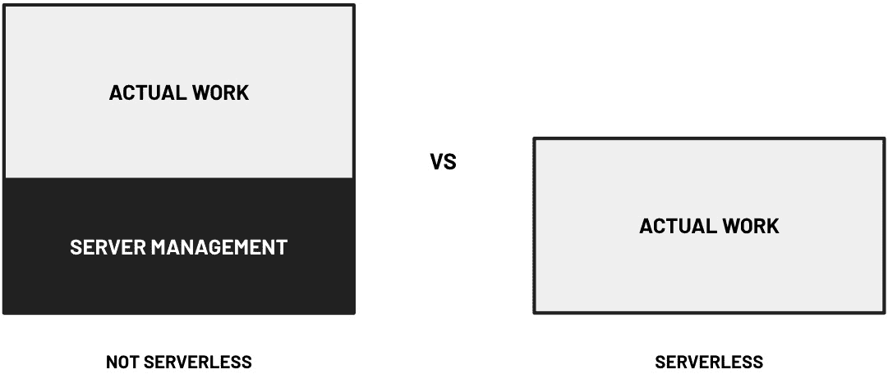

图 4.1 – 无服务器与有服务器

我们所说的“实际工作”是什么意思？以下是一个快速列表，列出了数据分析师、数据科学家和数据工程师在服务器管理之外需要处理的工作：

+   生成图表和报告。

+   分析趋势和模式。

+   检测并解决数据完整性问题。

+   将数据存储与商业智能工具集成。

+   向管理层提供建议。

+   使用数据来训练机器学习模型。

注意

当使用无服务器服务时，我们只为我们使用的部分付费。这意味着我们不会为计算资源未运行时的空闲时间付费。如果我们同时设置了预生产和生产环境，我们可以确信预生产环境只会是生产环境设置成本的一小部分，因为生产环境中的资源预期利用率会更高。

当处理以下*无服务器*数据管理和数据处理需求时，我们可以利用不同的 AWS 服务：

+   **无服务器数据仓库**: Amazon Redshift 无服务器

+   **无服务器数据湖**: AWS Lake Formation、AWS Glue 和 Amazon Athena

+   **无服务器流处理**: Amazon Kinesis、AWS Lambda 和 DynamoDB

+   **无服务器分布式数据处理**: Amazon EMR 无服务器

注意，这仅仅是冰山一角，我们还可以使用更多无服务器服务来满足我们的需求。在本章中，我们将重点关注设置和查询**无服务器数据仓库**和**无服务器数据湖**。在我们继续进行这些操作之前，首先，让我们准备必要的先决条件。

注意

在这一点上，您可能想知道何时使用数据湖，何时使用数据仓库。当查询和处理的数据是关系型且预先定义时，数据仓库是最佳选择。存储在数据仓库中的数据质量预期也较高。话虽如此，数据仓库用作数据的“事实来源”，通常用于涉及批量报告和商业智能的场景。另一方面，当查询和处理的数据涉及来自不同数据源的关系型和非关系型数据时，数据湖是最佳选择。存储在数据湖中的数据可能包括原始数据和清洗数据。此外，数据在数据湖中存储时，您无需在数据捕获期间担心数据结构和模式。最后，数据湖可用于涉及机器学习、预测分析和**探索性数据分析**（**EDA**）的场景。由于数据湖和数据仓库服务于不同的目的，一些组织利用这两种选项来满足他们的数据管理需求。

# 准备必要的先决条件

在本节中，我们将在设置本章中的数据仓库和数据湖之前，确保以下先决条件已准备就绪：

+   在您的本地机器上有一个文本编辑器（例如，VS Code）

+   一个具有创建和管理本章中我们将使用的资源的权限的 IAM 用户

+   一个我们将启动 Redshift 无服务器端点的 VPC

+   一个新的 S3 存储桶，我们将使用 AWS CloudShell 将数据上传到该存储桶

在本章中，我们将创建和管理位于 `us-west-2` 区域的资源。在继续下一步之前，请确保您已设置正确的区域。

## 在您的本地机器上打开文本编辑器

确保您在本地机器上有一个打开的文本编辑器（例如，**VS Code**）。我们将在此章中复制一些字符串值以供后续使用。以下是本章中我们将要复制的值：

+   IAM 登录链接、用户名和密码（*准备必要的先决条件* > *创建 IAM 用户*）

+   VPC ID（*准备必要的先决条件* > *创建新的 VPC*）

+   创建的 IAM 角色名称目前设置为默认角色 (*使用 Amazon Redshift Serverless 进行大规模分析* > *设置 Redshift Serverless 端点*)

+   AWS 账户 ID (*使用 Amazon Redshift Serverless 进行大规模分析* > *将数据卸载到 S3*)

如果您没有安装 VS Code，您可以使用 **TextEdit**、**记事本**、**Notepad++** 或 **GEdit**，具体取决于您在本地计算机上安装了哪些。

## 创建 IAM 用户

重要提示：如果我们直接使用根账户运行查询，我们可能会在 **Redshift Serverless** 中遇到问题。话虽如此，我们将在本节中创建一个 IAM 用户。此 IAM 用户将配置为具有执行本章中所有动手实践所需的适当权限集。

备注

确保在创建新的 IAM 用户时使用根账户。

按照以下步骤从 IAM 控制台创建 IAM 用户：

1.  使用以下截图所示的方式，使用搜索栏导航到 IAM 控制台：

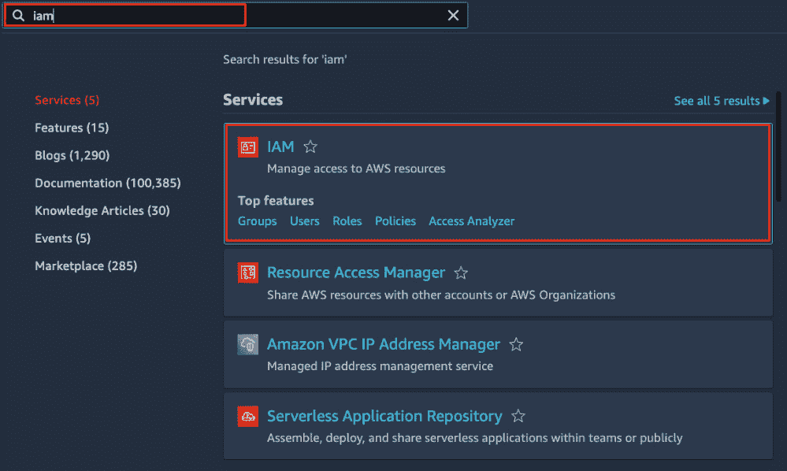

图 4.2 – 导航到 IAM 控制台

在搜索栏中键入 `iam` 后，我们必须从搜索结果列表中选择 **IAM** 服务。

1.  在侧边栏中找到 **访问管理**，然后单击 **用户** 以导航到 **用户** 列表页面。

1.  在屏幕右上角，找到并单击 **添加用户** 按钮。

1.  在 **设置用户详情** 页面上，使用以下截图所示的类似配置添加新用户：

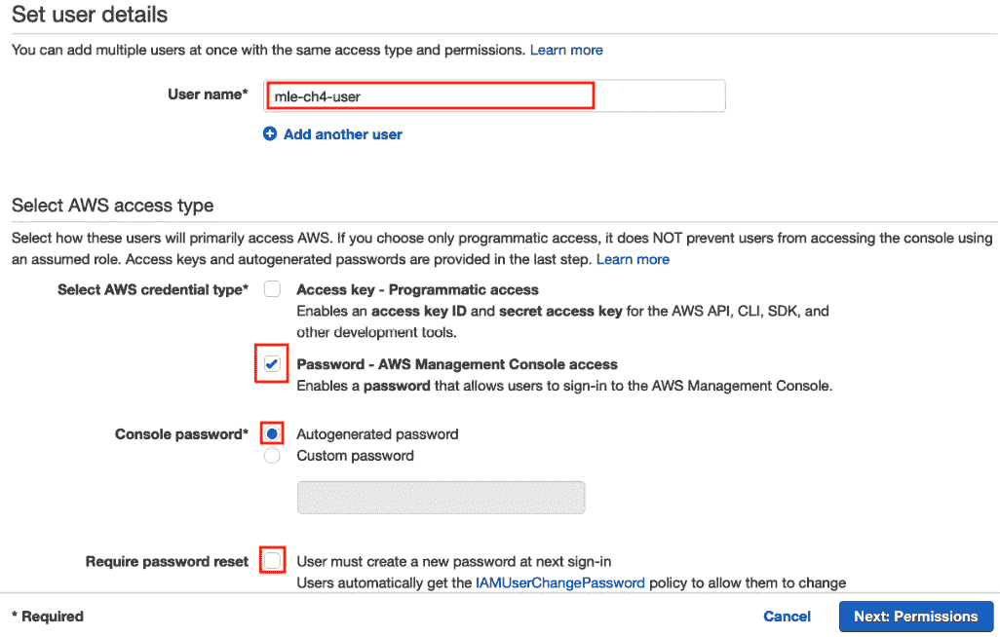

图 4.3 – 创建新的 IAM 用户

在这里，我们将 `mle-ch4-user` 设置为 **用户名** 字段的值。在 **选择 AWS 访问类型** 下，确保在 **选择 AWS 凭据类型** 下勾选了 **密码 – AWS 管理控制台访问** 的复选框。对于 **控制台密码**，我们选择 **自动生成密码**。对于 **要求密码重置**，我们取消勾选 **用户必须在下次登录时创建新密码**。

备注

更安全的配置将涉及在 IAM 用户账户首次用于登录时要求重置密码。然而，在本章中我们将跳过此步骤以减少总步骤数。

1.  点击 **下一步：权限** 按钮。

1.  在 **设置权限** 页面上，选择 **直接附加现有策略**。

1.  使用搜索过滤器查找并勾选以下托管策略的复选框：

    +   **AmazonS3FullAccess**

    +   **AmazonRedshiftFullAccess**

    +   **AmazonVPCFullAccess**

    +   **AWSCloudShellFullAccess**

    +   **AWSGlueConsoleFullAccess**

    +   **AmazonAthenaFullAccess**

    +   **IAMFullAccess**

以下截图是一个示例：

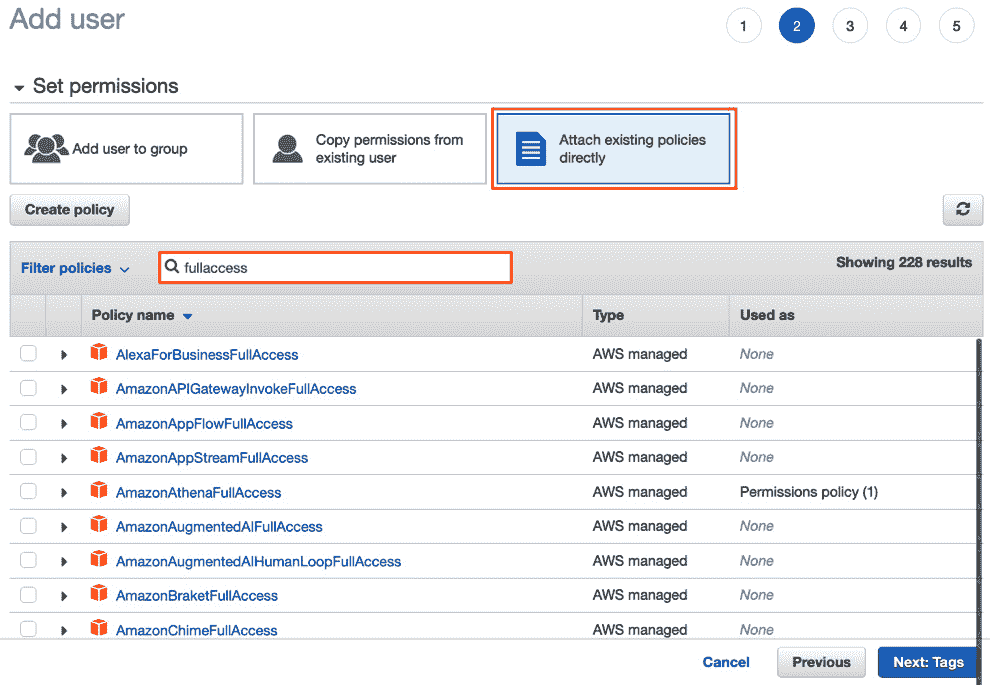

图 4.4 – 直接附加现有策略

这些是由 AWS 准备和管理的策略，以便 AWS 账户用户方便地管理 IAM 权限。

重要提示

注意，本章中我们讨论的权限配置还可以进一步优化。在生产级别的账户中管理 IAM 权限时，请确保你遵循**最小权限原则**。这意味着 IAM 身份应仅拥有执行其任务所需的最小权限集，这涉及到在使用服务时，从特定资源授予特定操作的细粒度访问权限。有关更多信息，请随时查阅*第九章*，*安全、治理和合规策略*。

1.  选择好管理策略后，点击**下一步：标签**按钮。

1.  在**添加标签（可选）**页面，点击**下一步：审查**。

1.  在**审查**页面，点击**创建用户**按钮。

1.  你应该会看到一个成功通知，以及新用户的登录链接和凭证。将登录链接（例如，`https://<account>.signin.aws.amazon.com/console`）、用户名和密码复制到本地机器上的文本编辑器（例如，Visual Studio Code）。之后点击关闭按钮。

重要提示

不要将登录链接、用户名和密码与任何人分享。具有这些凭证的 IAM 用户可以轻松接管整个账户，考虑到我们在创建 IAM 用户时为其配置的权限。

1.  在成功通知中的`mle-ch4-user`)中点击以导航到用户详情页面。

1.  **添加内联策略**，如图所示：

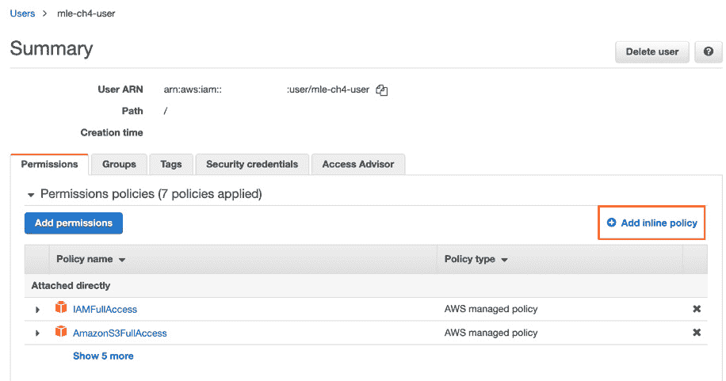

图 4.5 – 添加内联策略

除了直接附加的管理策略外，我们还将附加一个内联策略。我们将在下一步中自定义内联策略中配置的权限。

备注

有关管理策略和内联策略的更多信息，请参阅[`docs.aws.amazon.com/IAM/latest/UserGuide/access_policies_managed-vs-inline.xhtml`](https://docs.aws.amazon.com/IAM/latest/UserGuide/access_policies_managed-vs-inline.xhtml)。

1.  在**创建策略**页面，导航到**JSON**选项卡，如图所示：

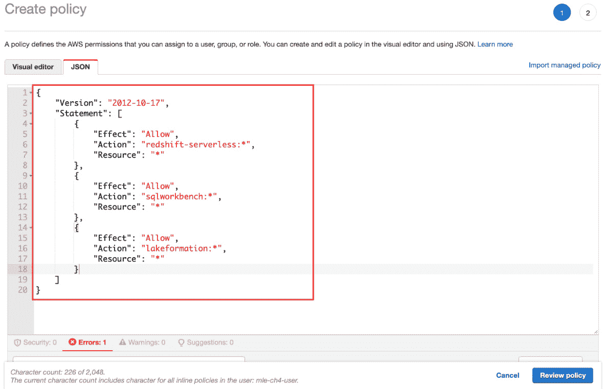

图 4.6 – 使用 JSON 编辑器创建策略

在前一个屏幕截图中突出显示的策略编辑器中，指定以下 JSON 配置：

```py
{
    "Version": "2012-10-17",
    "Statement": [
        {
            "Effect": "Allow",
            "Action": "redshift-serverless:*",
            "Resource": "*"
        },
        {
            "Effect": "Allow",
            "Action": "sqlworkbench:*",
            "Resource": "*"
        },
        {
            "Effect": "Allow",
            "Action": "lakeformation:*",
            "Resource": "*"
        }
    ]
}
```

此策略授予我们的 IAM 用户创建和管理**Redshift Serverless**、**Lake Formation**和**SQL Workbench**（一个 SQL 查询工具）资源的权限。如果没有这个额外的内联策略，我们在本章后面使用 Redshift Serverless 时可能会遇到问题。

备注

您可以在官方 GitHub 仓库中找到此内联策略的副本：[`github.com/PacktPublishing/Machine-Learning-Engineering-on-AWS/blob/main/chapter04/inline-policy`](https://github.com/PacktPublishing/Machine-Learning-Engineering-on-AWS/blob/main/chapter04/inline-policy)。

1.  接下来，点击**审查策略**。

1.  在**Name**字段中输入`custom-inline-policy`作为值。然后，点击**创建策略**。

到目前为止，`mle-ch4-user` IAM 用户应该附加了八项策略：七项 AWS 管理的策略和一项内联策略。此 IAM 用户应有足够的权限执行所有操作和操作，直到本章结束。

接下来，我们将使用我们复制到本地机器文本编辑器中的凭据进行登录，并测试我们是否可以成功登录：

1.  通过以下方式从 AWS 管理控制台会话中注销：

    1.  点击屏幕右上角的您的名字

    1.  点击**注销**按钮

1.  导航到登录链接（格式类似于`https://<account>.signin.aws.amazon.com/console`）。确保将`<account>`替换为您的 AWS 账号 ID 或别名：

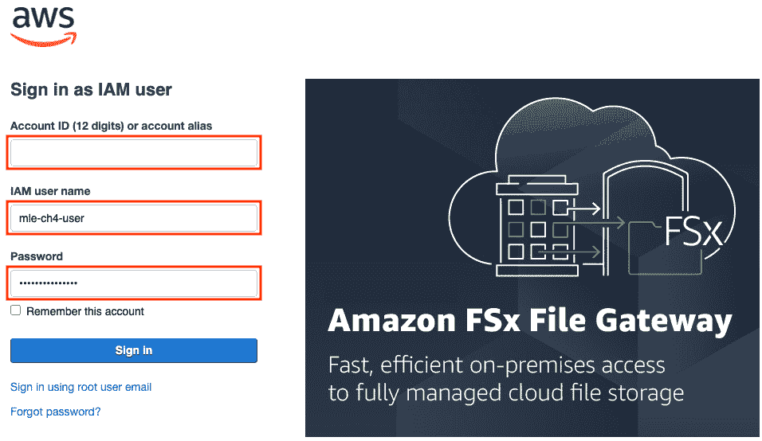

图 4.7 – 以 IAM 用户身份登录

这应该会将您重定向到**以 IAM 用户身份登录**页面，类似于前面的截图。输入**账号 ID**、**IAM 用户名**和**密码**值，然后点击**登录**按钮。

*这不是很容易吗？* 现在我们已成功创建了 IAM 用户，我们可以创建一个新的 VPC。此 VPC 将在我们创建 Redshift Serverless 端点时使用。

## 创建新的 VPC

**Amazon 虚拟私有云**（**VPC**）使我们能够为我们的资源创建和配置隔离的虚拟网络。在本节中，即使我们已经在当前区域中有一个现有的 VPC，我们也将从头开始创建一个新的 VPC。这允许我们的 Redshift Serverless 实例在其自己的隔离网络中启动，这使得网络可以与其他现有的 VPC 分开进行配置和安全性设置。

创建和配置 VPC 有不同的方法。其中一种更快的方法是使用**VPC 向导**，它允许我们在几分钟内设置一个新的 VPC。

重要提示

在继续之前，请确保您已以`mle-ch4-user` IAM 用户身份登录。

按照以下步骤使用**VPC 向导**创建新的 VPC：

1.  使用菜单栏中的区域下拉菜单选择所需区域。在本章中，我们将假设我们将在`us-west-2`区域创建和管理我们的资源。

1.  通过以下方式导航到 VPC 控制台：

    1.  在 AWS 管理控制台的搜索栏中键入`VPC`

    1.  在搜索结果列表下选择**VPC**服务

1.  接下来，点击**启动 VPC 向导/创建 VPC**按钮。这将带您转到**创建 VPC**向导，如下截图所示：

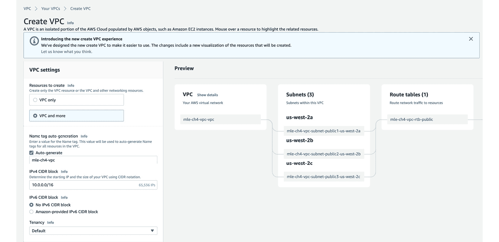

图 4.8 – 创建 VPC 向导

在这里，我们可以看到我们可以通过几个点击来创建和配置相关的 VPC 资源。

注意

您可能想要进一步自定义和确保此 VPC 设置的安全，但这超出了本章的范围。有关更多信息，请参阅 [`docs.aws.amazon.com/vpc/latest/userguide/vpc-security-best-practices.xhtml`](https://docs.aws.amazon.com/vpc/latest/userguide/vpc-security-best-practices.xhtml)。

1.  在 VPC 向导中，除了以下内容外，保持所有设置不变：

    +   `mle-ch4-vpc`

    +   **可用区 (AZ) 数量**：**3**

    +   **公共子网数量**：**3**

    +   **私有子网数量**：**0**

    +   **NAT 网关 ($)**：**无**

1.  一旦您完成 VPC 的配置，请点击页面底部的 **创建 VPC** 按钮。

注意

VPC 创建可能需要大约 1 到 2 分钟才能完成。

1.  点击 **查看 VPC**。

1.  将 VPC ID（例如，`vpc-abcdefghijklmnop`）复制到您本地机器上的编辑器中（例如，Visual Studio Code）。

现在所需的 VPC 资源已创建，我们可以继续进行最后一组先决条件。

## 将数据集上传到 S3

在 *第一章*，*AWS 上的机器学习工程简介*，我们使用 **AWS Cloud9** 环境将样本数据集上传到 **Amazon S3**。在本章中，我们将使用 **AWS CloudShell** 来上传和下载数据到 S3。如果您第一次听说 AWS CloudShell，它是一个基于浏览器的 shell，我们可以运行不同的命令来管理我们的资源。使用 CloudShell，我们可以运行 AWS CLI 命令而无需担心基础设施管理。

重要提示

在继续之前，请确保您正在使用创建 VPC 资源相同的区域。本章假设我们正在使用 `us-west-2` 区域。同时，请确保您已以 `mle-ch4-user` IAM 用户登录。

按照以下步骤使用 CloudShell 和 AWS CLI 将我们的示例数据集上传到 S3：

1.  通过点击以下截图突出显示的按钮导航到 **CloudShell**：

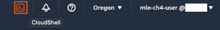

图 4.9 – 启动 CloudShell

您可以在 AWS 管理控制台右上角找到此按钮。您还可以使用搜索栏导航到 CloudShell 控制台。

1.  如果您看到 **欢迎使用 AWS CloudShell** 弹出窗口，请点击 **关闭** 按钮。

注意

`[cloudshell-user@ip-XX-XX-XX-XX ~]$` 可能需要一分钟左右。

1.  在终端控制台（在 **$** 符号之后）运行以下单行 `wget` 命令以下载包含 100,000 个预订记录的 CSV 文件：

    ```py
    wget https://bit.ly/3L6FsRg -O synthetic.bookings.100000.csv
    ```

1.  接下来，使用 `head` 命令检查下载的文件：

    ```py
    head synthetic.bookings.100000.csv
    ```

这应该会生成 CSV 文件的前几行，类似于以下截图所示：

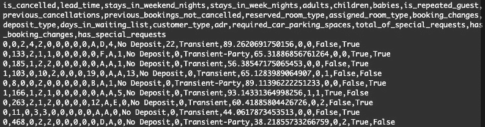

图 4.10 – 使用 head 命令后的结果

如我们所见，`head`命令显示了`synthetic.bookings.100000.csv`文件的第一个 10 行。在这里，我们有了第一行中的 CSV 文件所有列名的标题。

注意，这个数据集与我们用于*第一章*“AWS 机器学习工程简介”中的酒店预订数据集相似。唯一的重大区别是，我们将在本章中使用的 CSV 文件包含 100,000 条记录，因为我们想测试从我们的数据仓库和数据湖查询数据有多快。

1.  使用`aws s3 mb`命令创建一个新的 S3 存储桶。确保用全局唯一的存储桶名称替换`<INSERT BUCKET NAME>` – 一个所有其他 AWS 用户以前从未使用过的 S3 存储桶名称：

    ```py
    BUCKET_NAME=<INSERT BUCKET NAME>
    ```

    ```py
    aws s3 mb s3://$BUCKET_NAME
    ```

关于 S3 存储桶命名规则的更多信息，请参阅[`docs.aws.amazon.com/AmazonS3/latest/userguide/bucketnamingrules.xhtml`](https://docs.aws.amazon.com/AmazonS3/latest/userguide/bucketnamingrules.xhtml)。

重要提示

确保记住在此步骤中创建的存储桶名称。我们将在本章的不同解决方案和示例中使用此 S3 存储桶。

1.  将您创建的 S3 存储桶名称复制到您本地机器上的文本编辑器中。

1.  使用`aws s3 cp`命令上传`synthetic.bookings.100000.csv`文件：

    ```py
    FILE=synthetic.bookings.100000.csv
    ```

    ```py
    aws s3 cp $FILE s3://$BUCKET_NAME/input/$FILE
    ```

现在所有先决条件都已准备就绪，我们可以使用**Redshift Serverless**来加载数据并进行查询。

# 使用 Amazon Redshift Serverless 进行大规模数据分析

数据仓库在数据管理、数据分析和数据工程中发挥着至关重要的作用。数据工程师和机器学习工程师花费时间构建数据仓库，以处理涉及**批量报告**和**商业智能**的项目。

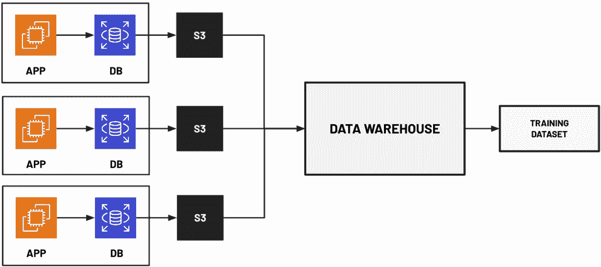

图 4.11 – 数据仓库

如前图所示，数据仓库包含来自不同关系型数据源（如 PostgreSQL 和 MySQL 数据库）的合并数据。它通常在查询数据以进行报告和商业智能需求时作为单一事实来源。在机器学习实验中，数据仓库可以作为清洁数据的来源，我们可以从中提取用于构建和训练机器学习模型的训练集。

注意

在生成报告时，企业和初创公司可能会直接在运行 Web 应用的数据库上执行查询。需要注意的是，这些查询可能会对连接到数据库的 Web 应用造成计划外的停机时间（因为数据库可能会因为处理额外的查询而变得“繁忙”）。为了避免这些类型的场景，建议将应用程序数据库中的数据合并并加载到中央数据仓库中，在那里可以安全地运行查询。这意味着我们可以生成自动报告，并在数据的副本上执行读取查询，而不用担心任何意外的停机时间。

如果您需要在 AWS 上设置数据仓库，Amazon Redshift 是可用的主要选项之一。随着 **Amazon Redshift Serverless** 的宣布，数据工程师和机器学习工程师不再需要担心基础设施管理。与它的非无服务器版本和替代品相比，当数据仓库空闲且未被使用时，无需收费。

## 设置 Redshift Serverless 端点

开始使用并设置 Redshift Serverless 非常简单。我们所需做的只是导航到 Redshift 控制台并创建一个新的 Redshift Serverless 端点。在创建新的 Redshift Serverless 端点时，我们只需关注 VPC 和 IAM 用户，这些我们在本章的 *准备基本先决条件* 部分中已准备就绪。

重要提示

在继续之前，请确保您正在使用创建 S3 存储桶和 VPC 资源相同的区域。本章假设我们正在使用 `us-west-2` 区域。同时，请确保您已以 `mle-ch4-user` IAM 用户登录。

按照以下步骤设置我们的 Redshift Serverless 端点：

1.  在 AWS 管理控制台的搜索栏中导航到 `redshift`，然后从结果列表中选择 **Redshift** 服务。

1.  接下来，点击 **尝试 Amazon Redshift Serverless** 按钮。

1.  在 `自定义设置`

1.  `dev`

1.  **管理员用户凭证** > **自定义管理员用户凭证**: *[未勾选]*

1.  在 **权限** 下，打开 **管理 IAM 角色** 下拉菜单，然后从选项列表中选择 **创建 IAM 角色**。

1.  在 **创建默认 IAM 角色** 弹出窗口中，选择 **任何 S3 存储桶**。

重要提示

注意，一旦我们需要为生产使用配置设置，此配置需要进一步加固。理想情况下，Redshift 应配置为仅访问有限数量的 S3 存储桶。

1.  点击 **创建 IAM 角色作为默认角色** 按钮。

注意

在点击 **创建 IAM 角色作为默认角色** 按钮后，您应该会看到一个类似 **The IAM role AmazonRedshift-CommandsAccessRole-XXXXXXXXXXXXXXX was successfully created and set as the default.** 的通知消息。请确保将当前设置为默认角色的创建 IAM 角色名称复制到您本地机器上的文本编辑器中。

1.  接下来，使用以下配置设置进行 **网络和安全**：

    +   **虚拟专用云 (VPC)**: 通过选择适当的 VPC ID 使用本章中创建的 VPC。

    +   **VPC 安全组**: 使用默认的 VPC 安全组。

    +   **子网**: 在下拉菜单中检查所有可用的子网选项。

1.  点击 **保存配置** 按钮。

注意

此步骤可能需要 3 到 5 分钟才能完成。在您等待设置完成的同时，您应该会看到一个弹出窗口。在此期间，您可以喝杯咖啡或茶！

1.  一旦设置完成，点击 **继续** 按钮以关闭弹出窗口。

*这不是很简单吗？* 到目前为止，您可能担心我们现在设置的**Redshift 无服务器**相关的费用。这里酷的地方是，当我们的无服务器数据仓库空闲时，没有计算能力的费用。请注意，根据存储的数据，我们仍将收取存储费用。一旦您完成本章的动手实践解决方案，请确保删除此设置并执行相关的 AWS 资源清理步骤，以避免任何意外费用。

注意

如需了解有关 Redshift 无服务器计费的信息，请随时查看[`docs.amazonaws.cn/en_us/redshift/latest/mgmt/serverless-billing.xhtml`](https://docs.amazonaws.cn/en_us/redshift/latest/mgmt/serverless-billing.xhtml)。

## 打开 Redshift 查询编辑器 v2

有多种方式可以访问我们已配置和准备好的 Redshift 无服务器端点。其中一种更方便的方式是使用**Redshift 查询编辑器**，我们可以通过我们的网络浏览器访问它。

重要提示

在继续之前，请确保您正在使用创建 S3 存储桶和 VPC 资源相同的区域。本章假设我们正在使用`us-west-2`区域。同时，请确保您已登录为`mle-ch4-user` IAM 用户。

让我们打开 Redshift 查询编辑器，看看我们能用它做什么：

1.  在**无服务器仪表板**区域，点击**查询数据**，如下截图所示：

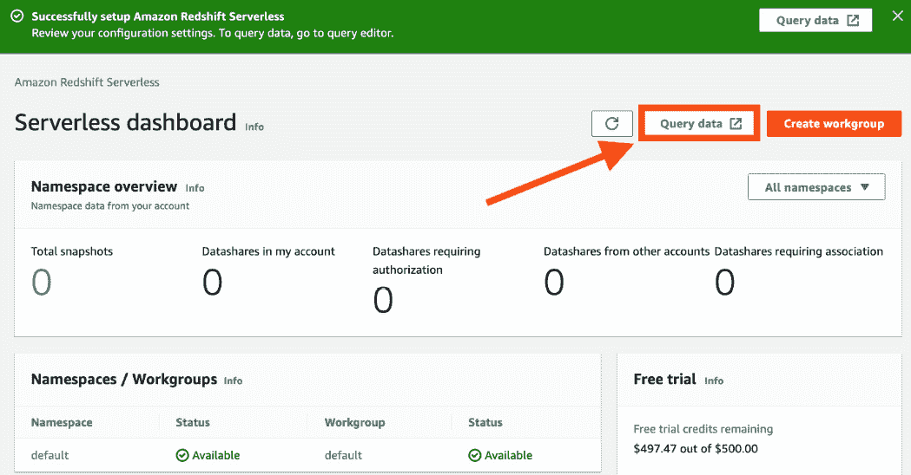

图 4.12 – 在无服务器仪表板中定位查询数据按钮

在这里，我们可以看到**查询数据**按钮位于**无服务器仪表板**页面右上角。点击**查询数据**按钮将打开**Redshift 查询编辑器 v2**服务（在新标签页中），如下截图所示：

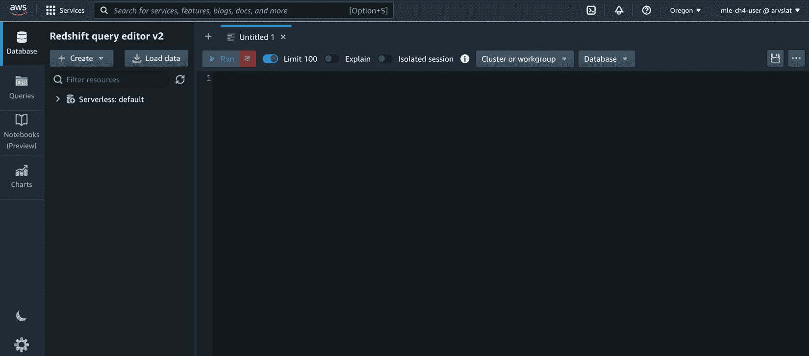

图 4.13 – Redshift 查询编辑器 v2

使用 Redshift 查询编辑器非常简单。我们可以通过左侧边栏中的选项来管理我们的资源，我们可以在右侧的编辑器上运行 SQL 查询。

注意

如果在点击**查询数据**按钮后遇到无法打开 Redshift 查询编辑器 v2 的问题，请确保您的浏览器没有阻止新窗口或弹出窗口的打开。

1.  点击以下截图中所突出显示的**无服务器**连接资源的箭头符号：

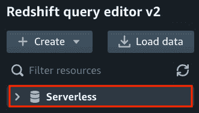

图 4.14 – 连接到无服务器资源

当 Redshift 查询编辑器连接到 Redshift 无服务器端点时，您应该会看到一个**连接到无服务器**的通知。

一旦建立连接，我们就可以继续创建表格。

## 创建表格

在 Amazon Redshift 中创建表格有不同方式。按照以下步骤使用 CSV 文件作为表格架构的参考来创建一个表格：

1.  从官方 GitHub 仓库下载`synthetic.bookings.10.csv`文件到您的本地机器。您可以通过以下链接访问包含 10 个样本行的 CSV 文件：[`raw.githubusercontent.com/PacktPublishing/Machine-Learning-Engineering-on-AWS/main/chapter04/synthetic.bookings.10.csv`](https://raw.githubusercontent.com/PacktPublishing/Machine-Learning-Engineering-on-AWS/main/chapter04/synthetic.bookings.10.csv)。

1.  在**Redshift 查询编辑器 v2**中，点击**+ 创建**下拉菜单，然后从选项列表中选择**表**。

1.  在**创建表格**弹出窗口中，将**架构**下拉菜单值设置为**public**，将**表**字段值设置为**bookings**。

注意

架构用于管理和分组数据库对象和表格。新创建的数据库默认将具有`PUBLIC`架构。在本章中，我们不会创建新的架构，而将简单地使用默认的`PUBLIC`架构。

1.  点击您本地机器上的`synthetic.bookings.10.csv`文件：

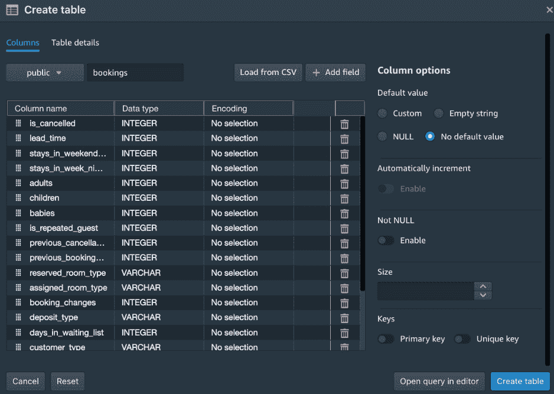

图 4.15 – 从 CSV 加载数据

在这里，我们可以看到**从 CSV 加载数据**选项使用了存储在所选 CSV 文件中的记录来推断列名、数据类型和编码，这些将被用于配置和创建新表格。

1.  点击**创建表格**。你应该会看到一个通知，表明**bookings 表格已成功创建**。

注意，用作创建表格参考的 CSV 文件应该是更大完整数据集的一个子集。在我们的例子中，我们使用了一个包含 10 条记录的 CSV 文件，而原始 CSV 文件有 10 万条记录。

## 从 S3 加载数据

现在我们已经准备好了表格，我们可以将存储在 S3 中的数据加载到我们的表格中。按照以下步骤使用**Redshift 查询编辑器 v2**从 S3 加载数据：

1.  点击**加载数据**按钮（位于**+ 创建**下拉菜单旁边）。应该会出现一个类似于以下窗口的弹出窗口：

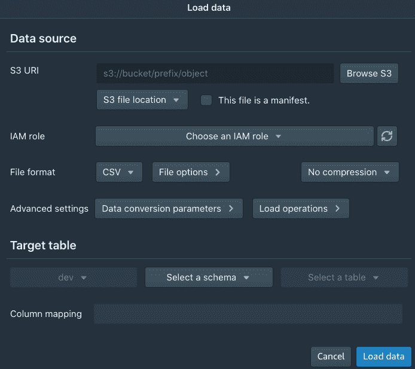

图 4.16 – 从 S3 加载数据

在这里，我们可以看到从 S3 加载数据的不同配置选项。

1.  在**S3 URI**下的**S3 文件位置**下拉菜单中打开，并从可用选项中选择**us-west-2**。

注意

此设置假设我们在执行本章中的动手实践解决方案时使用的是`us-west-2`区域。如果 S3 文件位于另一个区域，请随意更改。

1.  接下来，点击我们在此章创建的 S3 存储桶中的**input**文件夹内的`synthetic.bookings.100000.csv`文件：

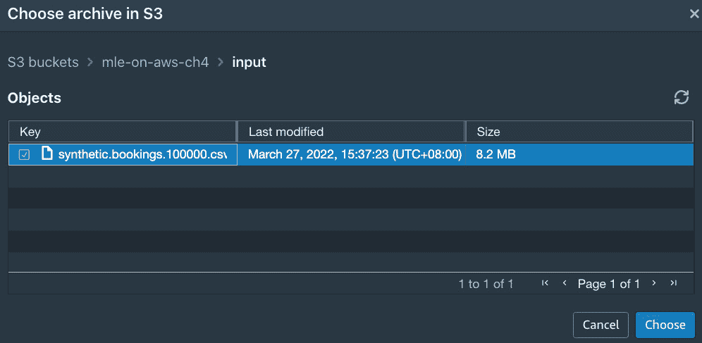

图 4.17 – 在 S3 中选择存档

在选择`synthetic.bookings.100000.csv`文件后，点击**选择**按钮。

1.  打开 **选择 IAM 角色** 下拉菜单，并在 *设置 Redshift Serverless 端点* 部分中选择与你在本地机器上的文本编辑器中复制的 IAM 角色名称相同的 IAM 角色。

注意

如果你无法将 IAM 角色复制到本地机器上的文本编辑器中，你可以打开一个新标签页并导航到 AWS 管理控制台的 `default` **命名空间配置** 页面。你应该在 **安全和加密** 选项卡中找到标记为 **Default** 的 **角色类型** 下的 IAM 角色。

1.  在 **高级设置** 下，点击 **数据转换参数**。确保 **忽略标题行** 复选框被勾选。点击 **完成**。

1.  点击 **选择架构**，然后从下拉选项中选择 **public**。接下来，点击 **选择表**，然后从下拉选项中选择 **bookings**：

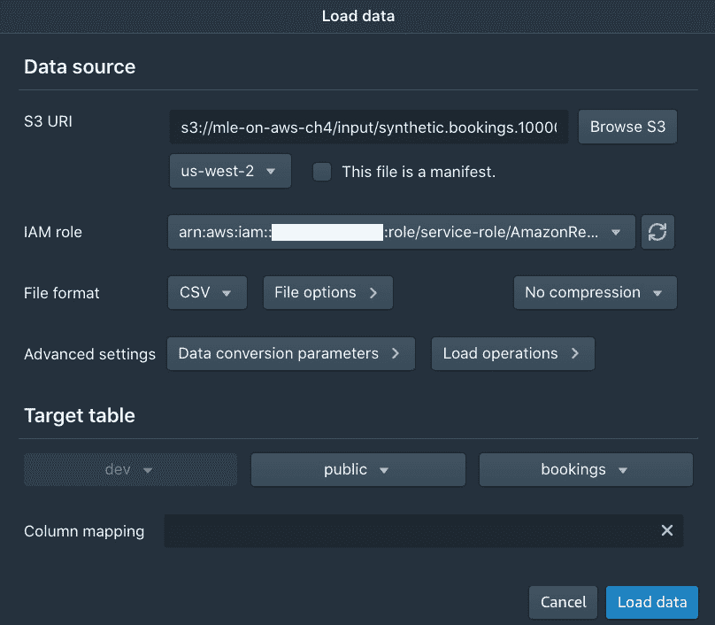

图 4.18 – 从 S3 存储桶加载数据

到目前为止，你应该有一组类似于前面截图所示的配置参数。

1.  点击 **加载数据** 按钮。这将关闭 **加载数据** 窗口并自动运行加载数据操作。

注意

你可以在查询编辑器中运行 `SELECT * FROM sys_load_error_detail;` SQL 语句来排查你可能遇到的任何问题或错误。

最后一步可能需要 1 到 2 分钟才能完成。如果在运行加载数据操作后没有遇到任何问题，你可以继续查询数据库！

## 查询数据库

现在我们已经成功将 CSV 文件从 S3 存储桶加载到我们的 Redshift Serverless 表中，让我们专注于使用 SQL 语句执行查询：

1.  点击位于第一个标签左侧的 **+** 按钮，然后选择 **Notebook**，如图所示：

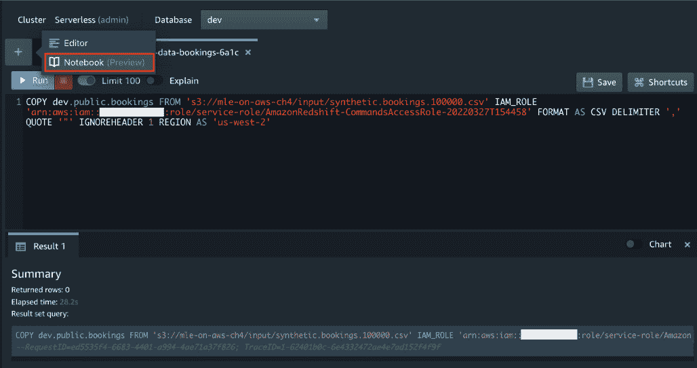

图 4.19 – 创建新的 SQL Notebook

**SQL Notebook** 有助于组织和记录使用 Redshift 查询编辑器运行的多个 SQL 查询的结果。

1.  运行以下 SQL 语句：

    ```py
    SELECT * FROM dev.public.bookings;
    ```

确保点击 **运行** 按钮，如图所示：

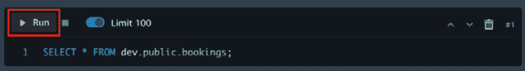

图 4.20 – 运行 SQL 查询

这应该返回一组结果，类似于以下截图所示：

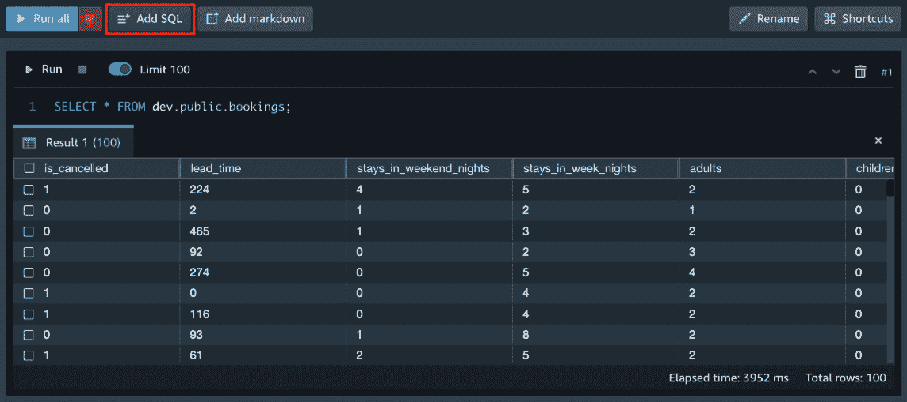

图 4.21 – 添加 SQL 按钮

在这里，运行查询后，我们应该只能得到最多 100 条记录，因为 **限制 100** 复选框被切换为 **开启** 状态。

1.  在之后点击 **添加 SQL** 按钮以在当前结果集下方创建一个新的 SQL 单元格。

1.  接下来，在新 SQL 单元格中运行以下 SQL 语句：

    ```py
    SELECT COUNT(*) FROM dev.public.bookings WHERE is_cancelled = 0;
    ```

运行查询后，我们应该得到 `66987` 作为结果。

重要提示

你可以运行 `SELECT * FROM sys_load_error_detail;` SQL 语句来排查和调试任何问题。

1.  让我们尝试回顾一下客人至少有一次取消记录的已取消预订。换句话说，让我们在新的 SQL 单元格中运行以下 SQL 语句：

    ```py
    SELECT * FROM dev.public.bookings WHERE is_cancelled = 1 AND previous_cancellations > 0;
    ```

1.  让我们回顾一下客人取消的预订，其中等待名单上的天数超过 50 天：

    ```py
    SELECT * FROM dev.public.bookings WHERE is_cancelled = 1 AND days_in_waiting_list > 50;
    ```

1.  注意，我们还可以使用类似以下查询来检查**数据完整性问题**：

    ```py
    SELECT booking_changes, has_booking_changes, * 
    ```

    ```py
    FROM dev.public.bookings 
    ```

    ```py
    WHERE 
    ```

    ```py
    (booking_changes=0 AND has_booking_changes='True') 
    ```

    ```py
    OR 
    ```

    ```py
    (booking_changes>0 AND has_booking_changes='False');
    ```

使用这个查询，我们应该能够列出`booking_changes`列值与`has_booking_changes`列值不匹配的记录。

1.  类似地，我们可以使用以下查询找到其他存在数据完整性问题的记录：

    ```py
    SELECT total_of_special_requests, has_special_requests, * 
    ```

    ```py
    FROM dev.public.bookings 
    ```

    ```py
    WHERE 
    ```

    ```py
    (total_of_special_requests=0 AND has_special_requests='True') 
    ```

    ```py
    OR 
    ```

    ```py
    (total_of_special_requests>0 AND has_special_requests='False');
    ```

使用这个查询，我们应该能够列出`total_of_special_requests`列值与`has_special_requests`列值不匹配的记录。

注意

在使用数据训练 ML 模型之前，应该解决这些类型的数据完整性问题。

1.  我们还可以创建一个包含预计算结果集的物化视图，这有助于加快重复查询：

    ```py
    CREATE MATERIALIZED VIEW data_integrity_issues AS
    ```

    ```py
    SELECT * 
    ```

    ```py
    FROM dev.public.bookings 
    ```

    ```py
    WHERE
    ```

    ```py
    (booking_changes=0 AND has_booking_changes='True') 
    ```

    ```py
    OR 
    ```

    ```py
    (booking_changes>0 AND has_booking_changes='False')
    ```

    ```py
    OR
    ```

    ```py
    (total_of_special_requests=0 AND has_special_requests='True') 
    ```

    ```py
    OR 
    ```

    ```py
    (total_of_special_requests>0 AND has_special_requests='False');
    ```

1.  最后，我们可以使用以下查询查询物化视图中的预计算数据：

    ```py
    SELECT booking_changes, has_booking_changes, total_of_special_requests, has_special_requests FROM data_integrity_issues;
    ```

这应该会给出`total_of_special_requests`列值与`has_special_requests`列值不匹配的记录列表，以及`booking_changes`列值与`has_booking_changes`列值不匹配的记录。

注意

关于这个主题的更多信息，请随时查看[`docs.aws.amazon.com/redshift/latest/dg/materialized-view-overview.xhtml`](https://docs.aws.amazon.com/redshift/latest/dg/materialized-view-overview.xhtml)。

随意运行其他 SQL 查询以探索存储在`bookings`表中的数据。

## 将数据卸载到 S3

最后，我们将复制并卸载数据库中存储在`bookings`表中的数据到 Amazon S3。在这里，我们将配置并使用`UNLOAD`命令并行执行此操作，分割数据，并将数据存储在 S3 的几个文件中。

注意

一旦数据已卸载到 Amazon S3，我们可以使用可以直接从 S3 加载数据的服务、工具和库来对此数据进行其他操作。在我们的案例中，我们将在下一节*设置 Lake Formation*中使用卸载数据文件，并使用**AWS Glue**和**Amazon Athena**来处理数据文件。

按照以下步骤将存储在我们的 Redshift Serverless 表中的数据卸载到 S3 桶中：

1.  在屏幕右上角打开菜单(`mle-ch4-user@<ACCOUNT ALIAS>`)。通过点击以下截图中的高亮框来复制账户 ID。将复制的账户 ID 值保存到本地机器上的文本编辑器中：

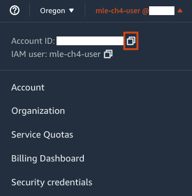

图 4.22 – 复制账户 ID

注意，当复制到本地机器上的文本编辑器时，账户 ID 不应包含破折号。

1.  在**Redshift 查询编辑器 v2**中，点击**添加 SQL**按钮，然后在新的 SQL 单元格中运行以下 SQL 语句：

    ```py
    UNLOAD ('SELECT * FROM dev.public.bookings;') 
    ```

    ```py
    TO 's3://<INSERT BUCKET NAME>/unloaded/'
    ```

    ```py
    IAM_ROLE 'arn:aws:iam::<ACCOUNT ID>:role/service-role/<ROLE NAME>'
    ```

    ```py
    FORMAT AS CSV DELIMITER ',' 
    ```

    ```py
    PARALLEL ON
    ```

    ```py
    HEADER;
    ```

确保您替换以下值：

+   `<INSERT BUCKET NAME>`，其中包含我们在“上传数据集到 S3”部分创建的存储桶名称

+   `<ACCOUNT ID>`，替换为 AWS 账户的账户 ID

+   `<ROLE NAME>`，替换为在“设置 Redshift Serverless 端点”部分复制到您的本地机器文本编辑器中的 IAM 角色名称

由于在运行`UNLOAD`命令时指定了`PARALLEL ON`，这个`UNLOAD`操作将分割存储在`bookings`表中的数据，并并行将这些数据存储在多个文件中。

1.  通过单击以下截图突出显示的按钮导航到**AWS CloudShell**：

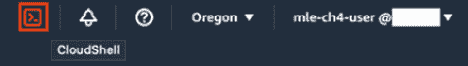

图 4.23 – 启动 CloudShell

我们可以在 AWS 管理控制台右上角找到这个按钮。您也可以使用搜索栏导航到 CloudShell 控制台。

1.  运行以下命令以列出我们 S3 存储桶中`unloaded`文件夹内的文件。确保用我们在“上传数据集到 S3”部分创建的存储桶名称替换`<INSERT BUCKET NAME>`：

    ```py
    BUCKET_NAME=<INSERT BUCKET NAME>
    ```

    ```py
    aws s3 ls s3://$BUCKET_NAME/unloaded/
    ```

1.  使用`tmp`命令将当前工作目录中的所有文件移动到`/tmp`目录：

    ```py
    mv * /tmp
    ```

1.  使用`aws s3 cp`命令下载 S3 存储桶中`unloaded`文件夹内文件的副本：

    ```py
    aws s3 cp s3://$BUCKET_NAME/unloaded/ . --recursive
    ```

1.  使用`ls`命令检查已下载文件的文件名：

    ```py
    ls
    ```

这应该会生成一个文件名列表，类似于以下截图所示：

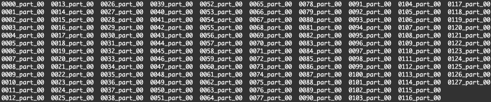

图 4.24 – 使用 ls 命令后的结果

在这里，我们可以看到在“卸载数据到 S3”部分执行的`UNLOAD`操作将`bookings`表的副本分割并存储在几个文件中。

1.  使用`head`命令检查下载的每个文件的几行：

    ```py
    head *
    ```

这应该会生成类似以下输出的结果：

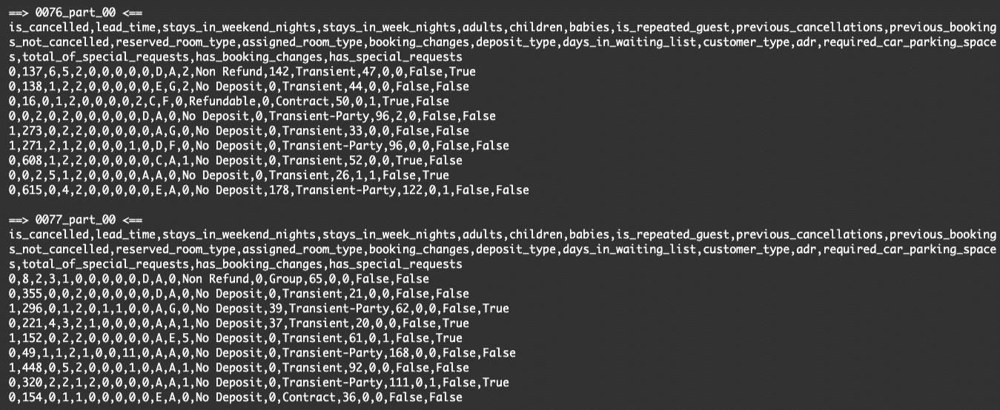

图 4.25 – 使用 head 命令后的结果

在这里，我们可以看到每个输出文件都有一个包含每列对应名称的标题。

现在我们已经将 Redshift 的`bookings`表中的数据卸载到我们的 S3 存储桶中，我们将继续使用 AWS Lake Formation 设置我们的数据湖！

注意

在 Amazon Redshift 和 Amazon Redshift Serverless 中，我们可以使用更多功能。这包括性能调优技术（以显著加快慢查询的速度），**Redshift ML**（我们可以使用它通过 SQL 语句训练和使用 ML 模型进行推理），以及**Redshift Spectrum**（我们可以使用它直接从存储在 S3 存储桶中的文件中查询数据）。这些主题超出了本书的范围，因此请随时查看[`docs.aws.amazon.com/redshift/index.xhtml`](https://docs.aws.amazon.com/redshift/index.xhtml)获取更多信息。

# 设置 Lake Formation

现在，是时候更详细地了解如何在 AWS 上设置我们的无服务器数据湖了！在我们开始之前，让我们定义一下什么是数据湖以及它存储了哪些类型的数据。**数据湖**是一个集中式数据存储，包含来自不同数据源的各种结构化、半结构化和非结构化数据。如图所示，数据可以存储在数据湖中，我们无需担心其结构和格式。在数据湖中存储数据时，我们可以使用各种文件类型，如 JSON、CSV 和 Apache Parquet。除了这些，数据湖可能还包括原始数据和经过处理（清洁）的数据：

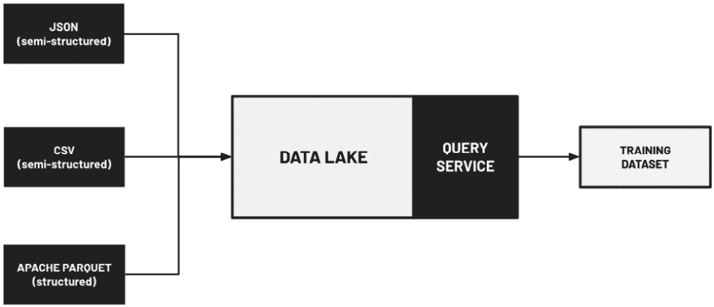

图 4.26 – 开始使用数据湖

机器学习工程师和数据科学家可以使用数据湖作为构建和训练机器学习模型的源数据。由于数据湖中存储的数据可能是原始数据和清洁数据的混合，因此在用于机器学习需求之前，需要进行额外的数据处理、数据清洗和数据转换步骤。

如果您计划在 AWS 中设置和管理数据湖，**AWS Lake Formation** 是最佳选择！AWS Lake Formation 是一种服务，它使用 AWS 上的各种服务（如 **Amazon S3**、**AWS Glue** 和 **Amazon Athena**）来帮助设置和保障数据湖。由于我们正在利用 AWS Lake Formation 的 *无服务器* 服务，因此在设置我们的数据湖时无需担心管理任何服务器。

## 创建数据库

类似于在 Redshift 和其他如 **关系数据库服务**（**RDS**）、**AWS Lake Formation** 数据库中的数据库工作方式，**AWS Lake Formation** 数据库可以包含一个或多个表。然而，在我们创建表之前，我们需要创建一个新的数据库。

重要提示

在继续之前，请确保您正在使用创建 S3 存储桶和 VPC 资源相同的区域。本章假设我们正在使用 `us-west-2` 区域。同时，请确保您已以 `mle-ch4-user` IAM 用户登录。

按照以下步骤在 AWS Lake Formation 中创建一个新的数据库：

1.  通过在 AWS 管理控制台的搜索框中输入 `lake formation` 并从结果列表中选择 **AWS Lake Formation** 来导航到 AWS Lake Formation 控制台。

1.  在 **欢迎使用 Lake Formation** 弹出窗口中，确保 **添加我自己** 复选框是勾选的。点击 **开始** 按钮。

1.  在侧边栏中，找到并点击 **数据目录** 下的 **数据库**。

1.  点击位于 **数据库** 页面右上角的 **创建数据库** 按钮。

1.  在 **名称** 字段中输入 `mle-ch4-db` 作为值。保持其他设置不变，然后点击 **创建数据库** 按钮：

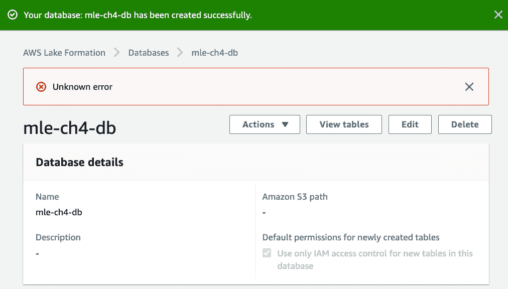

图 4.27 – 创建 Lake Formation 数据库

你应该会看到一个成功通知，表明你的数据库已成功创建。你可以忽略前一个屏幕截图显示的 **未知错误** 消息通知。

注意

**未知错误** 消息很可能是由于当前用于执行操作的 IAM 用户允许的权限有限。

现在我们已经创建了 Lake Formation 数据库，让我们继续使用 AWS Glue 爬虫创建一个表。

## 使用 AWS Glue 爬虫创建表

**AWS Glue** 是一种无服务器 **提取-转换-加载** (**ETL**) 服务，它为数据集成提供了不同的相关组件和能力。在本章中，我们将使用 **AWS Glue** 的一个组件 – **AWS Glue 爬虫**：

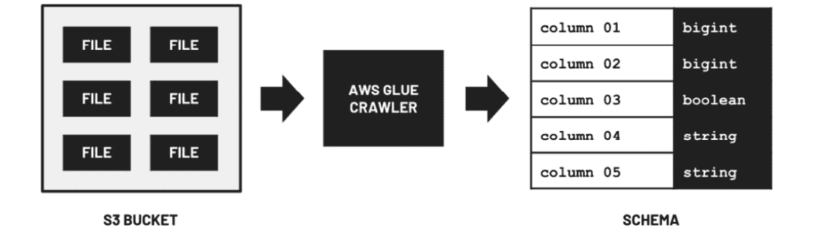

图 4.28 – AWS Glue 爬虫的工作原理

如前图所示，**AWS Glue 爬虫**处理存储在目标数据存储中的文件，然后根据处理文件的结构和内容推断出一个模式。此模式用于在 **AWS Glue 数据目录** 中创建一个表或一组表。然后，这些表可以被如 **Amazon Athena** 这样的服务在直接查询 S3 中的数据时使用。

在这些考虑因素的基础上，让我们继续创建一个 AWS Glue 爬虫：

1.  通过点击侧边栏中的 **表** 导航到 **表** 列表页面。

1.  接下来，点击页面左上角的 **使用爬虫创建表** 按钮。这将在一个新标签页中打开 **AWS Glue 控制台**。

1.  点击以下屏幕截图中所突出显示的 **爬虫**（**旧版**）：

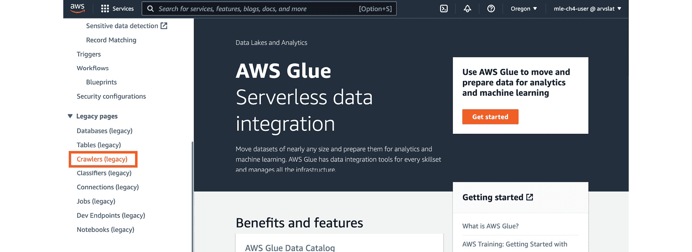

图 4.29 – 导航到爬虫页面

如我们所见，我们可以通过屏幕左侧的侧边栏导航到 **爬虫** 页面。

1.  通过点击 **添加爬虫** 按钮创建一个新的爬虫。

1.  在 **爬虫名称** 字段中输入 `mle-ch4-crawler`。然后，点击 **下一步**。

1.  在 **添加爬虫** > **指定爬虫源类型** 页面上，将 **爬虫源类型** 选择为 **数据存储**。在 **重复爬取 S3 数据存储** 下，选择 **爬取所有文件夹**。然后，点击 **下一步**。

1.  在 **添加爬虫** > **添加数据存储** 页面上，点击文件夹图标以设置 **包含路径** 字段的 S3 路径位置。这将打开 **选择 S3 路径** 弹出窗口，如下所示：

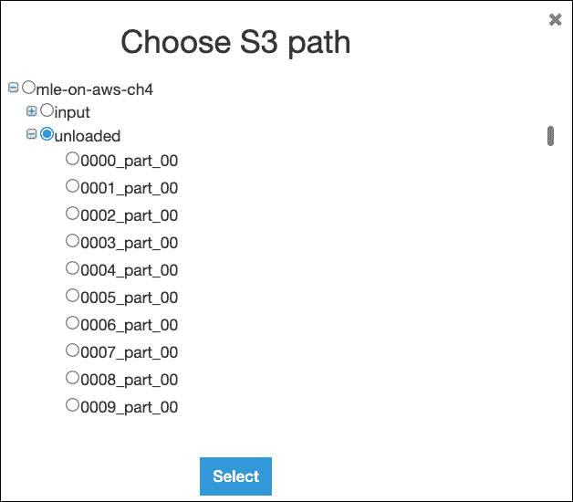

图 4.30 – 选择 S3 路径

在本章 *准备基本先决条件* 部分创建的 S3 存储桶中找到并切换 `unloaded` 文件夹的复选框。之后点击 **选择** 按钮。

重要提示

如果您跳过了本章的**Redshift Serverless 入门**部分，您可以在 S3 存储桶中创建一个空的`未加载`文件夹，然后将`synthetic.bookings.100000.csv`文件上传到`未加载`文件夹。您可以使用 AWS 管理控制台或通过使用 AWS CLI 的 S3 存储桶的`input`文件夹手动完成此操作。

1.  设置`100`。

1.  确保您在**添加数据存储**页面上设置的配置与我们下面的截图中的配置相似，然后再继续：

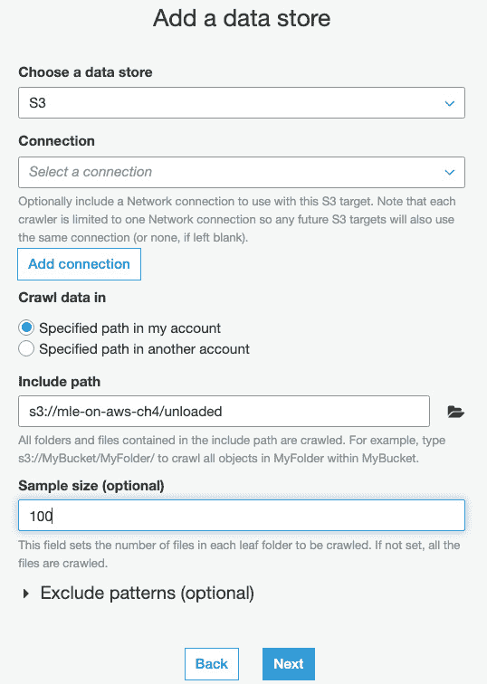

图 4.31 – 添加数据存储

一旦您已审查数据存储配置，请点击**下一步**。

1.  在**添加爬虫**>**添加另一个数据存储**页面上，选择**否**选项。之后点击**下一步**按钮。

1.  在`ch4-iam`作为`AWSGlueServiceRole-ch4-iam`下的输入字段值。之后，点击**下一步**。

1.  在**添加爬虫**>**为此爬虫创建计划**页面上，从**频率**下的下拉选项列表中选择**按需运行**。之后点击**下一步**按钮。

1.  在**添加爬虫**>**配置爬虫的输出**页面上，从**数据库**下的下拉选项列表中选择我们已创建的数据库（例如，**mle-ch4-db**）。之后点击**下一步**按钮。

1.  点击**完成**以使用指定的配置参数创建 AWS Glue 爬虫。

1.  通过导航到**爬虫**页面（新界面/ NOT 旧界面），选择爬虫，然后点击**运行**按钮来运行爬虫：

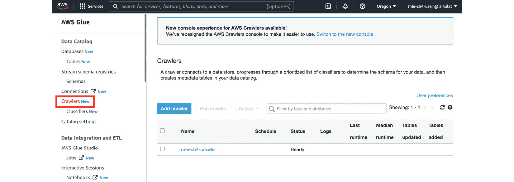

图 4.32 – 导航到爬虫页面

备注

此步骤可能需要 1 到 3 分钟才能完成。

1.  返回到**Lake Formation**控制台（使用搜索框）。

1.  导航到由我们的 AWS Glue 爬虫生成的`未加载`表：

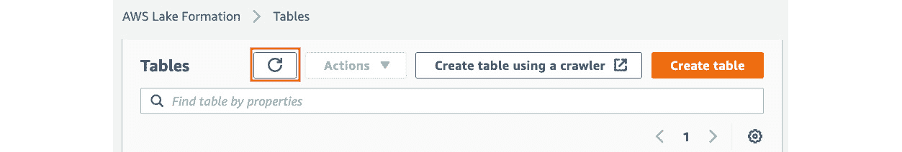

图 4.33 – 刷新表列表页面

在点击刷新按钮后，您应该在表的列表中看到`未加载`表。

1.  点击**未加载**链接以导航到**表详情**页面：

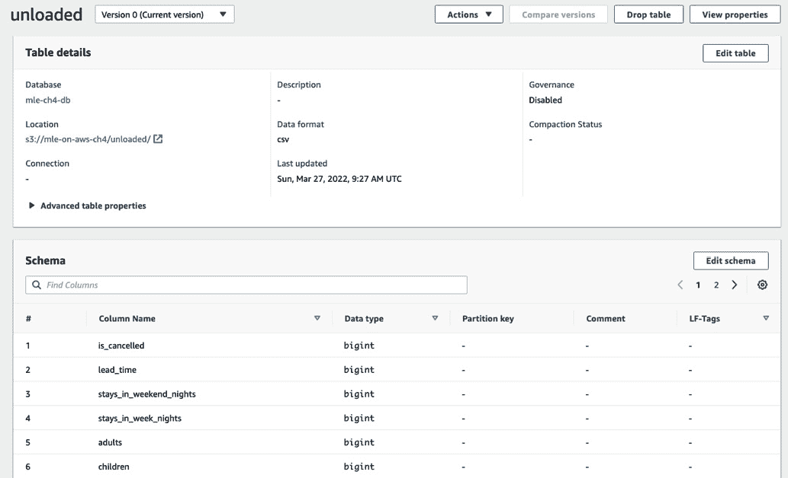

图 4.34 – 表详情和未加载表的模式

如前截图所示，我们应该看到**表详情**和**模式**信息。

1.  打开**操作**下拉菜单，从选项列表中选择**查看数据**。这应该会打开**预览数据**弹出窗口，通知我们将被带到 Athena 控制台。点击**确定**按钮继续。

*这不是很容易吗？* 注意，我们只是刚刚触及了我们可以用**AWS Glue**做到的事情的表面。更多信息，请查看[`docs.aws.amazon.com/glue/latest/dg/what-is-glue.xhtml`](https://docs.aws.amazon.com/glue/latest/dg/what-is-glue.xhtml)。

# 使用 Amazon Athena 查询 Amazon S3 中的数据

**Amazon Athena**是一种无服务器查询服务，允许我们使用 SQL 语句查询存储在 S3 中的文件数据。使用 Amazon Athena，我们无需担心基础设施管理，并且它可以自动扩展以处理我们的查询：

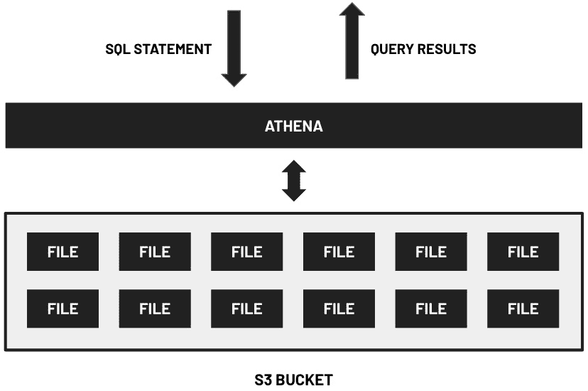

图 4.35 – Amazon Athena 的工作原理

如果您要自行设置，您可能需要设置一个带有**Presto**等应用程序的 EC2 实例集群。此外，您还需要自行管理此 EC2 集群设置的整体成本、安全性、性能和稳定性。

## 设置查询结果位置

如果**在您运行第一个查询之前，您需要在 Amazon S3 中设置查询结果位置**的通知出现在**编辑**页面，这意味着您必须在 Amazon Athena 的**设置**页面进行快速配置更改，以便 Athena 每次查询时都能在指定的 S3 存储桶位置存储查询结果。然后，这些查询结果将在 Athena 控制台的 UI 中显示。

按照以下步骤设置查询结果位置，以便我们的 Amazon Athena 查询将存储在此处：

1.  如果您看到**在您运行第一个查询之前，您需要在 Amazon S3 中设置查询结果位置**的通知，请点击**查看设置**以导航到**设置**页面。否则，您也可以点击**设置**标签页，如下截图所示：

f

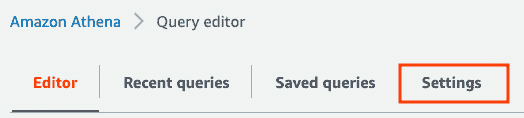

图 4.36 – 导航到设置标签页

1.  点击**查询结果和加密设置**面板右上角的**管理**。

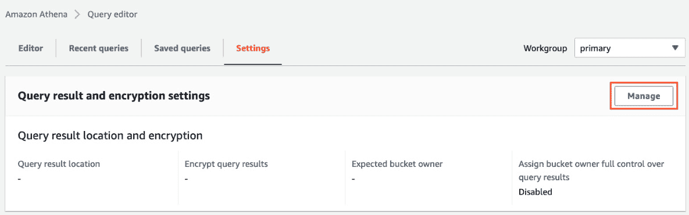

图 4.37 – 管理查询结果和加密设置

1.  在**管理设置**中的**查询结果位置和加密**下，点击**浏览 S3**并定位到本章中创建的 S3 存储桶。打开单选按钮并点击**选择**按钮。

1.  点击**保存**按钮。

现在我们已经完成了 Amazon Athena 查询结果位置的配置，我们可以开始运行我们的查询。

## 使用 Athena 运行 SQL 查询

一切准备就绪后，我们可以开始使用 SQL 语句查询存储在 S3 中的数据。在本节中，我们将检查我们的数据并运行一些查询，以检查是否存在数据完整性问题。

按照以下步骤查询 S3 存储桶中的数据：

1.  通过点击**编辑**标签，返回到**编辑**页面。

1.  在**编辑**标签页中，运行以下查询：

    ```py
    SELECT * FROM "AwsDataCatalog"."mle-ch4-db"."unloaded" limit 10;
    ```

确保您点击**运行**按钮，如下截图所示：

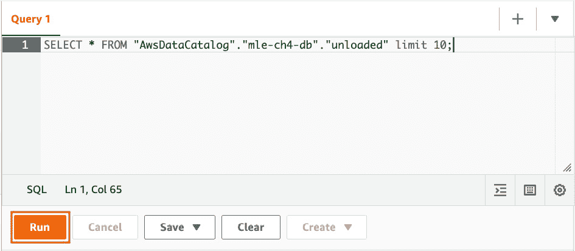

图 4.38 – 运行 SQL 查询

此查询应返回一组类似于以下屏幕截图中的结果。请注意，Amazon Athena 每次运行相同的查询时可能会返回不同的结果集。您可以在查询中添加`ORDER BY`子句，以确保使用相同查询返回的结果的一致性：

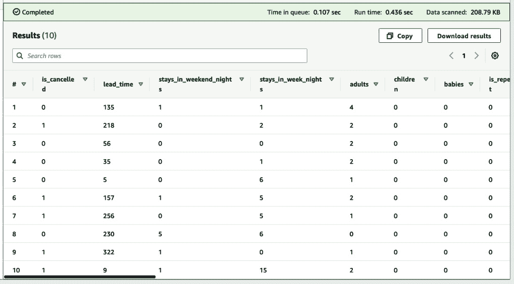

图 4.39 – Athena 查询结果

在这里，我们可以看到我们的查询处理时间不到半秒。如果我们不使用`LIMIT`子句运行相同的查询，运行时间可能会超过一秒。

注意

**性能调优**不属于本书的讨论范围，但您可以自由地查看[`aws.amazon.com/blogs/big-data/top-10-performance-tuning-tips-for-amazon-athena/`](https://aws.amazon.com/blogs/big-data/top-10-performance-tuning-tips-for-amazon-athena/)以获取更多关于此主题的信息。

1.  运行以下查询以计算未取消预订的数量：

    ```py
    SELECT COUNT(*) FROM "AwsDataCatalog"."mle-ch4-db"."unloaded" WHERE is_cancelled=0;
    ```

这应该给出`66987`的结果，这应该与我们之前在*使用 Amazon Redshift Serverless 进行大规模分析*部分执行类似 Redshift Serverless 查询时得到的结果相同。

1.  接下来，让我们列出至少有一次取消记录的客人取消的预订：

    ```py
    SELECT * 
    ```

    ```py
    FROM "AwsDataCatalog"."mle-ch4-db"."unloaded" 
    ```

    ```py
    WHERE is_cancelled=1 AND previous_cancellations > 0 
    ```

    ```py
    LIMIT 100;
    ```

1.  让我们再回顾一下由于等待名单上的天数超过 50 天而被客人取消的预订：

    ```py
    SELECT * 
    ```

    ```py
    FROM "AwsDataCatalog"."mle-ch4-db"."unloaded" 
    ```

    ```py
    WHERE is_cancelled=1 AND days_in_waiting_list > 50 
    ```

    ```py
    LIMIT 100;
    ```

1.  注意，我们还可以使用类似以下查询来检查**数据完整性问题**：

    ```py
    SELECT booking_changes, has_booking_changes, * 
    ```

    ```py
    FROM "AwsDataCatalog"."mle-ch4-db"."unloaded" 
    ```

    ```py
    WHERE 
    ```

    ```py
    (booking_changes=0 AND has_booking_changes=true) 
    ```

    ```py
    OR 
    ```

    ```py
    (booking_changes>0 AND has_booking_changes=false)
    ```

    ```py
    LIMIT 100;
    ```

使用此查询，我们应该能够列出`booking_changes`列值与`has_booking_changes`列值不匹配的记录。

1.  在类似的情况下，我们可以使用以下查询找到其他存在数据完整性问题的记录：

    ```py
    SELECT total_of_special_requests, has_special_requests, *  
    ```

    ```py
    FROM "AwsDataCatalog"."mle-ch4-db"."unloaded" 
    ```

    ```py
    WHERE 
    ```

    ```py
    (total_of_special_requests=0 AND has_special_requests=true) 
    ```

    ```py
    OR 
    ```

    ```py
    (total_of_special_requests>0 AND has_special_requests=false)
    ```

    ```py
    LIMIT 100;
    ```

使用此查询，我们应该能够列出`total_of_special_requests`列值与`has_special_requests`列值不匹配的记录。

1.  我们还可以创建一个可以被未来查询引用的视图：

    ```py
    CREATE OR REPLACE VIEW data_integrity_issues AS
    ```

    ```py
    SELECT * 
    ```

    ```py
    FROM "AwsDataCatalog"."mle-ch4-db"."unloaded" 
    ```

    ```py
    WHERE
    ```

    ```py
    (booking_changes=0 AND has_booking_changes=true) 
    ```

    ```py
    OR 
    ```

    ```py
    (booking_changes>0 AND has_booking_changes=false)
    ```

    ```py
    OR
    ```

    ```py
    (total_of_special_requests=0 AND has_special_requests=true) 
    ```

    ```py
    OR 
    ```

    ```py
    (total_of_special_requests>0 AND has_special_requests=false);
    ```

注意，视图**不**包含任何数据——视图中的查询每次被其他查询引用时都会运行。

1.  话虽如此，让我们运行一个示例查询，该查询引用了我们之前步骤中准备的视图：

    ```py
    SELECT booking_changes, has_booking_changes, 
    ```

    ```py
    total_of_special_requests, has_special_requests 
    ```

    ```py
    FROM data_integrity_issues 
    ```

    ```py
    LIMIT 100;
    ```

这应该给出一个列表，其中包含`total_of_special_requests`列值与`has_special_requests`列值不匹配的记录，以及`booking_changes`列值与`has_booking_changes`列值不匹配的记录。

注意

如果您想知道我们是否可以使用**boto3**（Python 的 AWS SDK）以编程方式在 S3 中查询我们的数据，那么答案是*是的*。我们甚至可以直接在 SQL 语句中使用 Amazon Athena 和 Amazon SageMaker 生成部署的 ML 模型的预测。有关此主题的更多信息，请参阅《Machine Learning with Amazon SageMaker Cookbook》一书的*第四章*，*AWS 上的无服务器数据管理*。您还可以在此处找到如何使用 Python 和 boto3 运行 Athena 和 Athena ML 查询的快速示例：[`bit.ly/36AiPpR`](https://bit.ly/36AiPpR)。

*这不是很容易吗？* 在 AWS 上设置**无服务器数据湖**很容易，只要我们使用正确的工具和服务集。在继续下一章之前，请确保您已审查并删除本章中创建的所有资源。

# 摘要

在本章中，我们能够更深入地了解几个帮助组织实现无服务器数据管理的 AWS 服务。当使用**无服务器**服务时，我们不再需要担心基础设施管理，这有助于我们专注于我们需要做的事情。

我们能够利用**Amazon Redshift Serverless**来准备无服务器数据仓库。我们还能够使用**AWS Lake Formation**、**AWS Glue**和**Amazon Athena**来创建和查询无服务器数据湖中的数据。有了这些**无服务器**服务，我们能够在几分钟内加载数据并进行查询。

# 进一步阅读

关于本章所涉及主题的更多信息，请随意查看以下资源：

+   *您的 VPC 的安全最佳实践* ([`docs.aws.amazon.com/vpc/latest/userguide/vpc-security-best-practices.xhtml`](https://docs.aws.amazon.com/vpc/latest/userguide/vpc-security-best-practices.xhtml))

+   *介绍 Amazon Redshift Serverless* ([`aws.amazon.com/blogs/aws/introducing-amazon-redshift-serverless-run-analytics-at-any-scale-without-having-to-manage-infrastructure/`](https://aws.amazon.com/blogs/aws/introducing-amazon-redshift-serverless-run-analytics-at-any-scale-without-having-to-manage-infrastructure/))

+   *AWS Lake Formation 中的安全措施* ([`docs.aws.amazon.com/lake-formation/latest/dg/security.xhtml`](https://docs.aws.amazon.com/lake-formation/latest/dg/security.xhtml))
