# 实用数据处理和分析

在使用 **机器学习**（**ML**）模型之前，需要先分析、转换和处理数据。在过去，数据科学家和机器学习从业者必须从头开始编写自定义代码，使用各种库、框架和工具（如 **pandas** 和 **PySpark**）来执行所需的分析和处理工作。这些专业人士准备的自定义代码通常需要调整，因为数据处理脚本中编程的步骤的不同变体必须在用于模型训练之前在数据上测试。这占据了机器学习从业者的大量时间，而且由于这是一个手动过程，通常也容易出错。

处理和分析数据的一种更实际的方法是在加载数据、清洗、分析和转换来自不同数据源的原生数据时使用无代码或低代码工具。使用这些类型的工具将显著加快处理过程，因为我们不需要从头编写数据处理脚本。在本章中，我们将使用 **AWS Glue DataBrew** 和 **Amazon SageMaker Data Wrangler** 来加载数据、分析和处理一个示例数据集。在清理、处理和转换数据后，我们将在 **AWS CloudShell** 环境中下载并检查结果。

话虽如此，我们将涵盖以下主题：

+   开始数据处理和分析

+   准备基本先决条件

+   使用 AWS Glue DataBrew 自动化数据准备和分析

+   使用 Amazon SageMaker Data Wrangler 准备机器学习数据

在本章的动手解决方案中工作期间，您会注意到在使用 **AWS Glue DataBrew** 和 **Amazon SageMaker Data Wrangler** 时存在一些相似之处，但当然，您也会注意到一些差异。在我们直接使用和比较这些服务之前，让我们首先就数据处理和分析进行简短讨论。

# 技术要求

在我们开始之前，确保我们准备好了以下内容：

+   一个网络浏览器（最好是 Chrome 或 Firefox）

+   访问书中前四章使用的 AWS 账户

每章使用的 Jupyter 笔记本、源代码和其他文件都存放在这个仓库中：[`github.com/PacktPublishing/Machine-Learning-Engineering-on-AWS`](https://github.com/PacktPublishing/Machine-Learning-Engineering-on-AWS)。

重要提示

确保注销并**不使用**在*第四章*，*AWS 上的无服务器数据管理*中创建的 IAM 用户。在本章中，你应该使用根账户或具有一组权限的新 IAM 用户来创建和管理 **AWS Glue DataBrew**、**Amazon S3**、**AWS CloudShell** 和 **Amazon SageMaker** 资源。在运行本书中的示例时，建议使用具有有限权限的 IAM 用户而不是根账户。我们将在*第九章*，*安全、治理和合规策略*中进一步详细讨论这一点以及其他安全最佳实践。

# 开始数据处理和分析

在上一章中，我们利用数据仓库和数据湖来存储、管理和查询我们的数据。存储在这些数据源中的数据通常必须经过一系列类似于 *图 5.1* 中所示的数据处理和转换步骤，才能用作 ML 实验的训练数据集：

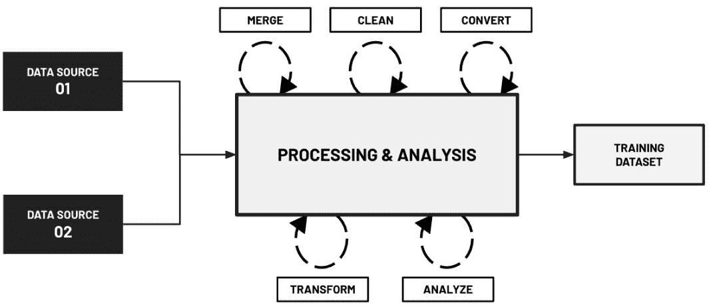

图 5.1 – 数据处理和分析

在 *图 5.1* 中，我们可以看到这些数据处理步骤可能涉及合并不同的数据集，以及使用各种选项和技术进行数据清理、转换、分析和转换。在实践中，数据科学家和 ML 工程师通常花费大量时间清理数据，使其准备好用于 ML 实验的使用。一些专业人士可能习惯于编写和运行定制的 Python 或 R 脚本来执行这项工作。然而，当处理这些类型的要求时，使用无代码或低代码解决方案，如 AWS Glue DataBrew 和 Amazon SageMaker Data Wrangler，可能更为实用。一方面，这些解决方案更易于使用，因为我们不需要担心管理基础设施，也不需要从头编写数据处理脚本。我们还将使用易于使用的可视化界面，这将显著加快工作速度。监控和安全管理也更容易，因为这些功能与以下 AWS 服务集成在一起：

+   **AWS 身份和访问管理**（**IAM**）- 用于控制和限制对 AWS 服务和资源的访问

+   **亚马逊虚拟私有云**（**VPC**）- 用于定义和配置一个逻辑上隔离的网络，该网络决定了资源如何访问以及网络内每个资源如何与其他资源通信。

+   **亚马逊云监控**（**CloudWatch**）- 用于监控资源的性能和管理使用的日志

+   **AWS CloudTrail** – 用于监控和审计账户活动

注意

关于如何使用这些服务来确保和管理 AWS 账户中的资源，更多信息请参阅*第九章*，*安全、治理和合规策略*。

重要的是要注意，AWS 中还有其他选项可以帮助我们在处理和分析数据时。这些包括以下内容：

+   **Amazon Elastic MapReduce**（**EMR**）和**EMR Serverless** – 用于使用 Apache Spark、Apache Hive 和 Presto 等多种开源工具进行大规模分布式数据处理工作负载

+   **Amazon Kinesis** – 用于处理和分析实时流数据

+   **Amazon QuickSight** – 用于启用高级分析和自助式商业智能

+   **AWS 数据管道** – 用于跨各种服务（例如，**Amazon S3**、**Amazon 关系数据库服务**和**Amazon DynamoDB**）处理和移动数据，使用有助于自定义管道资源调度、依赖关系跟踪和错误处理的特性

+   **SageMaker 处理** – 在 SageMaker 管理的 AWS 基础设施上运行自定义数据处理和分析脚本（包括偏差指标和特征重要性计算）

注意，这并不是一个详尽的列表，还有更多服务和功能可以用于这些类型的需求。*使用这些服务的优势是什么？*当处理相对较小的数据集时，在我们的本地机器上执行数据分析和处理可能就足够了。然而，一旦我们需要处理更大的数据集，我们可能需要使用更专业的资源集，这些资源集拥有更多的计算能力，以及允许我们专注于我们需要完成的工作的功能。

备注

我们将在*第九章*“安全、治理和合规策略”中更详细地讨论偏差检测和特征重要性。

在本章中，我们将重点关注 AWS Glue DataBrew 和 Amazon SageMaker Data Wrangler，并展示一些如何在处理和分析数据时使用这些工具的示例。我们将从一个“脏”数据集（包含一些包含无效值的行）开始，并对该数据集执行以下类型的转换、分析和操作：

+   运行一个分析数据集的数据概要作业

+   过滤掉包含无效值的行

+   从现有列创建新列

+   在应用转换后导出结果

一旦包含处理结果的文件已上传到输出位置，我们将通过下载文件并检查是否已应用转换来验证结果。

# 准备必要的先决条件

在本节中，在继续本章的动手解决方案之前，我们将确保以下先决条件已准备就绪：

+   要分析和处理 Parquet 文件

+   将 Parquet 文件上传到的 S3 存储桶

## 下载 Parquet 文件

在本章中，我们将使用与之前章节中使用的类似 `bookings` 数据集。然而，这次源数据存储在一个 Parquet 文件中，并且我们对一些行进行了修改，以便数据集将包含脏数据。因此，让我们将 `synthetic.bookings.dirty.parquet` 文件下载到我们的本地机器上。

您可以在这里找到它：[`github.com/PacktPublishing/Machine-Learning-Engineering-on-AWS/raw/main/chapter05/synthetic.bookings.dirty.parquet`](https://github.com/PacktPublishing/Machine-Learning-Engineering-on-AWS/raw/main/chapter05/synthetic.bookings.dirty.parquet).

注意

注意，使用 Parquet 格式存储数据比使用 CSV 格式存储数据更可取。一旦您需要处理更大的数据集，生成的 Parquet 和 CSV 文件大小的差异就会变得明显。例如，一个 1 GB 的 CSV 文件最终可能只有 300 MB（甚至更少）作为 Parquet 文件！有关此主题的更多信息，请随时查看以下链接：[`parquet.apache.org/docs/`](https://parquet.apache.org/docs/).

在继续操作之前，请确保将 `synthetic.bookings.dirty.parquet` 文件下载到您的本地机器上。

## 准备 S3 存储桶

您可以为本章的动手解决方案创建一个新的 S3 存储桶，或者您可以使用之前章节中创建的现有存储桶。这个 S3 存储桶将用于存储 `synthetic.bookings.dirty.parquet` 源文件以及使用 AWS Glue DataBrew 和 Amazon SageMaker Data Wrangler 运行数据处理和转换步骤后的输出目标结果。

一旦准备就绪，我们就可以使用 AWS Glue DataBrew 来分析和处理我们的数据集。

# 使用 AWS Glue DataBrew 自动化数据准备和分析

AWS Glue DataBrew 是一个无代码的数据准备服务，旨在帮助数据科学家和 ML 工程师清理、准备和转换数据。类似于我们在 *第四章* 中使用的服务，*AWS 上的无服务器数据管理*，Glue DataBrew 也是无服务器的。这意味着当使用此服务进行数据准备、转换和分析时，我们不需要担心基础设施管理。

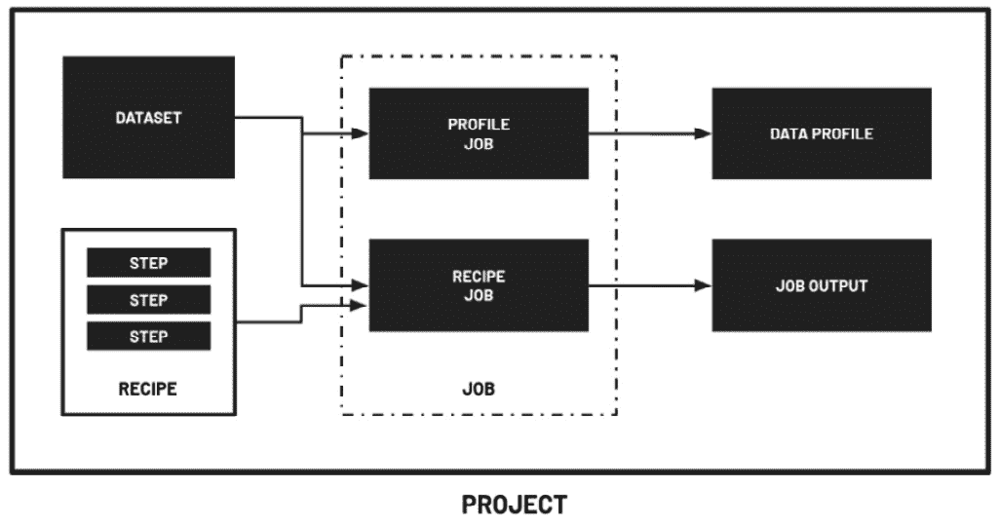

图 5.2 – AWS Glue DataBrew 的核心概念

在 *图 5.2* 中，我们可以看到在使用 AWS Glue DataBrew 时涉及不同的概念和资源。在使用此服务之前，我们需要对这些有一个很好的了解。以下是概念和术语的快速概述：

+   **数据集** – 存储在现有数据源（例如，**Amazon S3**、**Amazon Redshift** 或 **Amazon RDS**）中的数据，或者从本地机器上传到 S3 存储桶。

+   **配方** – 在数据集上执行的数据转换或数据准备步骤的集合。

+   **作业** – 运行某些指令以分析或转换数据集的过程。用于评估数据集的作业称为**分析作业**。另一方面，用于运行一组指令以清理、归一化和转换数据的作业称为**食谱作业**。我们可以使用一个称为**数据血缘**的视图来跟踪数据集所经历的转换步骤，以及作业中配置的源和目标。

+   **数据概要** – 在数据集上运行分析作业后生成的报告。

+   **项目** – 数据、转换步骤和作业的受管理集合。

现在我们已经对概念和术语有了很好的了解，让我们继续创建一个新的数据集。

## 创建新的数据集

在本章的*准备基本先决条件*部分，我们下载了一个 Parquet 文件到本地机器。在接下来的步骤中，我们将通过从本地机器上传这个 Parquet 文件到现有的 Amazon S3 存储桶来创建一个新的数据集：

1.  使用**AWS 管理控制台**的搜索栏导航到**AWS Glue DataBrew**控制台。

重要提示

本章假设我们在使用服务来管理和创建不同类型的资源时使用的是`us-west-2`区域。您可以使用不同的区域，但请确保如果某些资源需要转移到所选区域，则进行任何必要的调整。

1.  通过点击如图 5.3 所示的侧边栏图标，转到**DATASETS**页面：

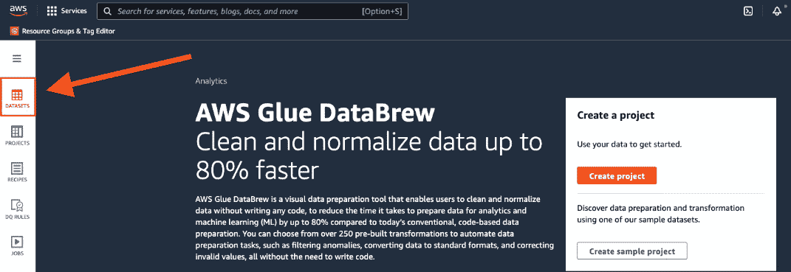

图 5.3 – 导航到 DATASETS 页面

1.  点击**连接到新数据集**。

1.  点击**文件上传**，如图 5.4 所示：

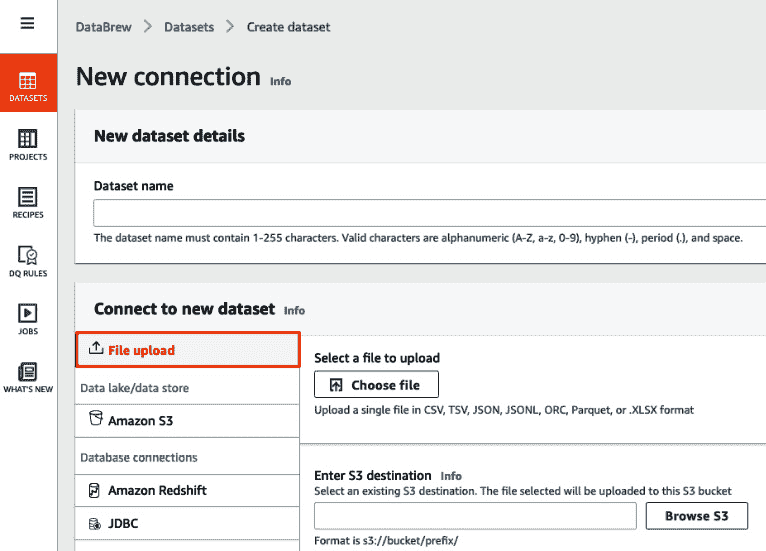

图 5.4 – 定位文件上传选项

注意，有不同方式来加载数据并连接到您的数据集。我们可以使用**AWS Glue 数据目录**连接并加载数据存储在 Amazon Redshift、Amazon RDS 和 AWS Glue 中。

注意

欢迎查看[`docs.aws.amazon.com/databrew/latest/dg/supported-data-connection-sources.xhtml`](https://docs.aws.amazon.com/databrew/latest/dg/supported-data-connection-sources.xhtml)获取更多信息。

1.  将**数据集名称**字段的值指定为`bookings`（在**新数据集详细信息**下）。

1.  在您的本地机器上的`synthetic.bookings.dirty.parquet`文件下。

1.  接下来，在**输入 S3 目标**下找到并点击**浏览 S3**按钮。选择在*准备基本先决条件*部分*第四章*中创建的 S3 存储桶，*AWS 上的无服务器数据管理*。

注意

注意，您本地机器上的`synthetic.bookings.dirty.parquet`文件将被上传到本步骤中选择的 S3 存储桶。当您在本章的动手练习中工作时，您可以创建并使用不同的 S3 存储桶。请随意使用 AWS 管理控制台或通过 AWS CloudShell 使用 AWS CLI 创建一个新的 S3 存储桶。

1.  在**附加配置**下，确保**所选文件类型**字段设置为**PARQUET**。

1.  点击页面右下角的**创建数据集**按钮。

1.  到目前为止，`bookings`数据集已创建，并应如图 5.5 所示出现在数据集列表中：

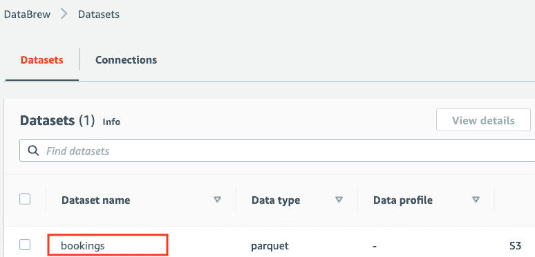

图 5.5 – 导航到数据集预览页面

因此，让我们点击如图 5.5 所示的高亮显示的`bookings`数据集名称。这将带您转到如图 5.6 所示的**数据集预览**页面：

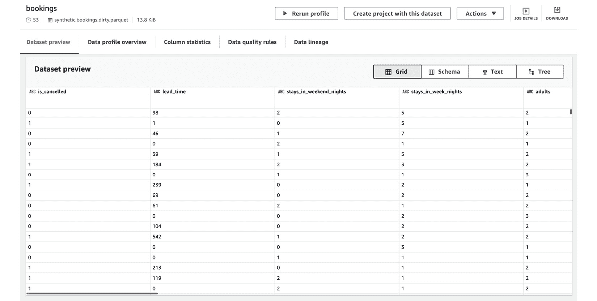

图 5.6 – 数据集预览

请随意通过点击**数据集预览**面板右上角的相应按钮来检查**模式**、**文本**和**树**视图。

现在我们已成功上传 Parquet 文件并创建了一个新的数据集，让我们继续创建并运行一个概要作业来分析数据。

## 创建和运行概要作业

在执行任何数据清洗和数据转换步骤之前，先分析数据并查看数据集中每一列的属性和统计信息是一个好主意。我们不必手动进行此操作，可以使用 AWS Glue DataBrew 的能力为我们自动生成不同的分析报告。我们可以通过运行概要作业自动生成这些报告。

在接下来的步骤中，我们将创建并运行一个概要作业来生成我们上传的数据集的数据概览：

1.  首先，点击**数据概览概述**选项卡以导航到**数据概览概述**页面。

1.  接下来，点击**运行数据概览**按钮。这将带您转到**创建作业**页面。

1.  在**创建作业**页面，向下滚动并定位到**作业输出**设置部分，然后点击**浏览**按钮以设置**S3 位置**字段值。

1.  在早期步骤中已上传到`synthetic.bookings.dirty.parquet`文件。

1.  在`mle`下作为**新 IAM 角色后缀**的值。

1.  点击**创建并运行作业**按钮。

注意

此步骤可能需要 3 到 5 分钟才能完成。请随意拿一杯咖啡或茶！请注意，在等待结果出现时，您可能会看到一条**1 个作业正在进行**的加载信息。

1.  一旦概要作业完成，向下滚动，查看结果：

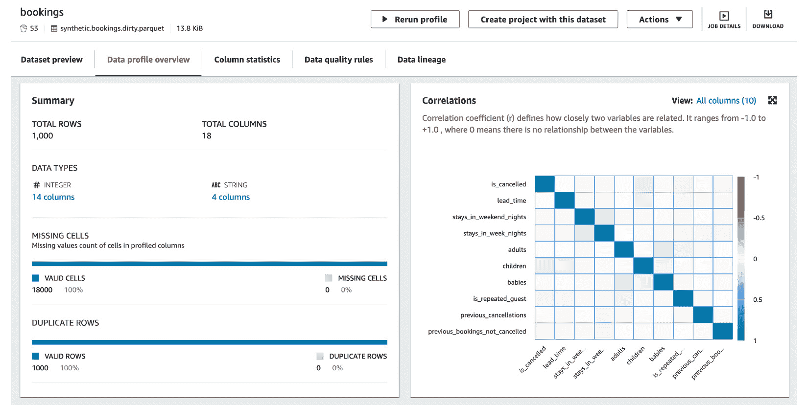

图 5.7 – 数据概览

您应该会看到一组类似于图 5.7 中所示的结果。请随意检查概要作业生成的以下报告：

+   **摘要** – 显示总行数、总列数、缺失单元格和重复行数

+   **相关性** – 显示相关性矩阵（显示每个变量之间的关系）

+   **比较值分布** – 显示跨列的分布比较视图

+   **列摘要** – 显示每列的摘要统计信息

可选地，您可以导航到**列统计**选项卡并查看该选项卡中的报告。

如您所见，我们只需点击几下就能生成一个可用于分析数据集的数据概要。在继续本章下一部分之前，请随意查看由概要作业生成的不同报告和统计数据。

## 创建项目和配置配方

是时候创建并使用 AWS Glue DataBrew 项目了。创建项目涉及处理数据集和配方以执行所需的数据处理和转换工作。由于我们还没有配方，因此在创建和配置项目的同时将创建一个新的配方。在本节中，我们将配置一个执行以下操作的配方：

+   过滤掉包含无效`children`列值的行

+   基于现有列（`booking_changes`）的值创建一个新的列（`has_booking_changes`）

在接下来的步骤中，我们将创建一个项目并使用交互式用户界面配置一个用于清理和转换数据的配方：

1.  在页面右上角，找到并点击**使用此数据集创建项目**按钮。这应该会重定向到**创建项目**页面。

1.  在`bookings-project`作为**项目名称**字段的值。

1.  滚动并找到**权限**下的**角色名称**下拉字段。选择在早期步骤中创建的现有 IAM 角色。

1.  之后点击**创建项目**按钮：

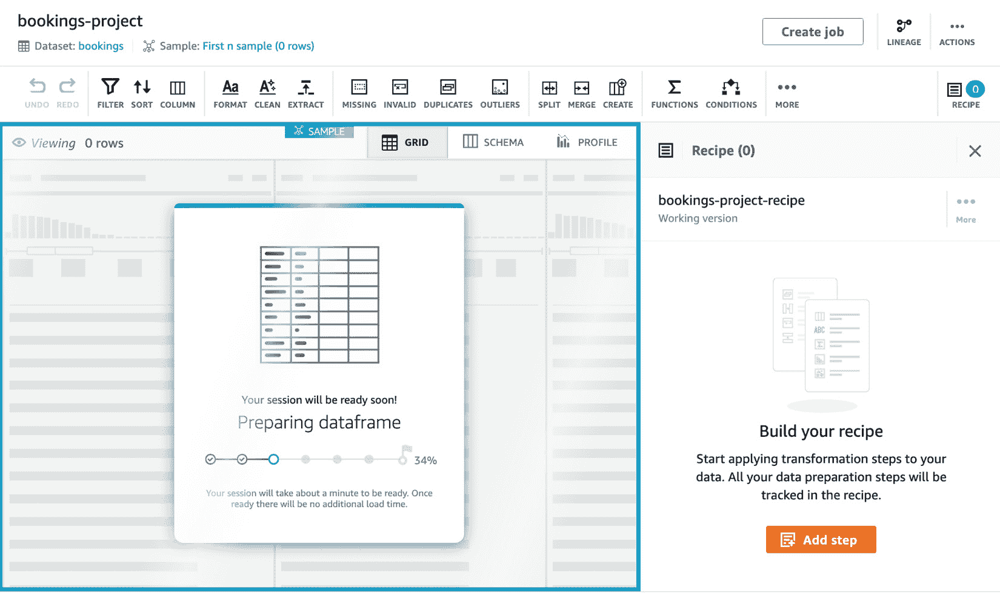

图 5.8 – 等待项目准备就绪

点击**创建项目**按钮后，您应该会被重定向到一个类似于*图 5.8*中所示的页面。创建项目后，我们应该能够使用一个高度交互的工作空间，在那里我们可以测试和应用各种数据转换。

注意

此步骤可能需要 2 到 3 分钟才能完成

1.  一旦项目会话准备就绪，我们将快速检查数据以查找任何错误条目并发现数据中的问题（以便我们可以过滤掉这些条目）。在显示数据网格视图的左侧面板中，找到并滚动（向左或向右）到类似于*图 5.9*中所示的两个**children**列：

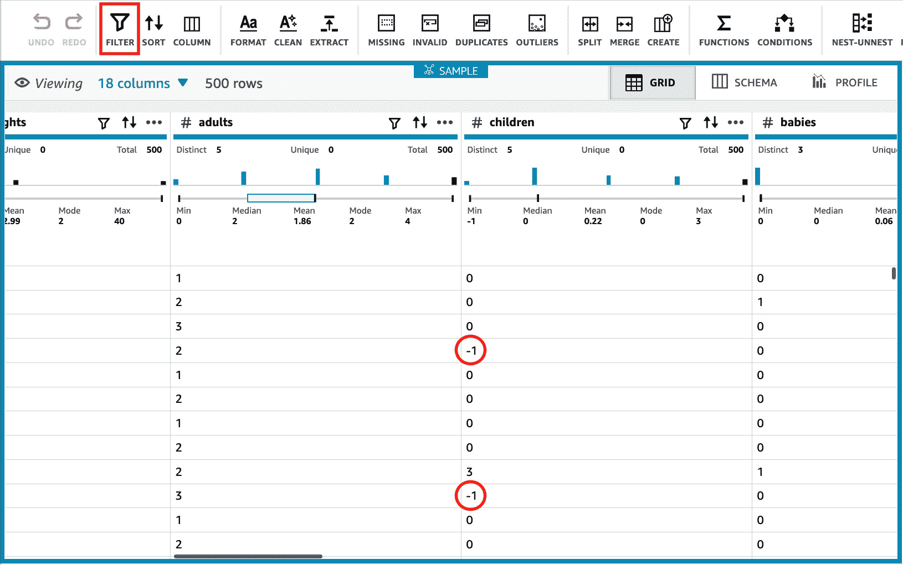

图 5.9 – 过滤掉包含无效单元格值的行

我们应该在`adults`和`babies`之间的`children`列之间看到`children`列，并且在该列下有值为`-1`的单元格。一旦你查看了`children`列下的不同值，点击如图 5.9 所示的高亮**过滤**按钮。

备注

注意，我们在本章使用的 Parquet 文件中故意在`children`列下添加了一定数量的`-1`值。鉴于`children`列的值不可能小于`0`，我们将在下一步中过滤掉这些行。

1.  点击**过滤**按钮后，应该会出现一个下拉菜单。在**条件**下的选项列表中定位并选择**大于等于**。这应该更新页面右侧的面板，并显示**过滤值**操作的配置选项列表。

1.  在具有占位文本**输入一个过滤值**的**0**字段下的选项列表中，从`children`列中选择。

1.  点击**预览更改**。这应该更新左侧面板，并提供数据集的网格视图：

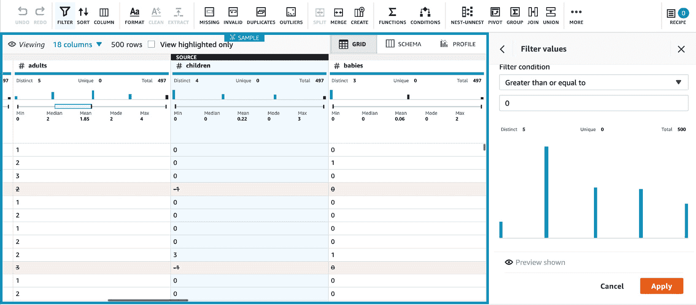

图 5.10 – 预览结果

我们应该看到在`children`列下值为`-1`的行已被过滤掉，类似于*图 5.10*中所示。

1.  然后，点击**应用**按钮。

1.  让我们继续添加一个步骤来创建一个新列（从现有列）。定位并点击如图 5.11 所示的高亮**添加步骤**按钮：

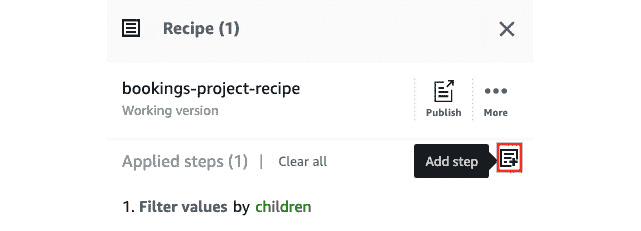

图 5.11 – 添加步骤

**添加步骤**按钮应该位于**清除所有**链接所在的同一行。

1.  在搜索字段中带有`create`的下拉字段中打开。从结果列表中选择**基于条件**选项：

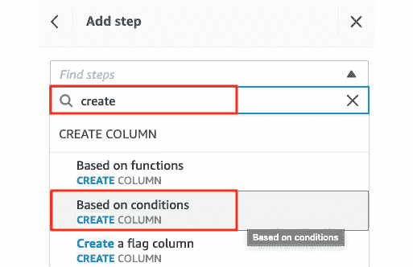

图 5.12 – 定位基于条件选项

如果你正在寻找搜索字段，只需参考*图 5.12*中高亮的框（在顶部）。

1.  在`booking_changes`列中。

1.  `大于`

1.  `0`

1.  `真或假`

1.  `has_booking_changes`

1.  点击`has_booking_changes`：

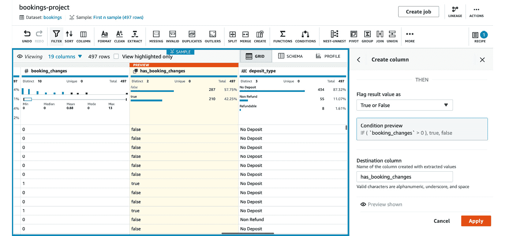

图 5.13 – 预览更改

如*图 5.13*所示，如果`booking_changes`列的值大于`0`，则新列的值为`true`，否则为`false`。

1.  在点击**应用**按钮之前，请先查看预览结果。

1.  到目前为止，我们应该在我们的配方中有了两个应用步骤。点击**发布**，如图 5.14 所示：

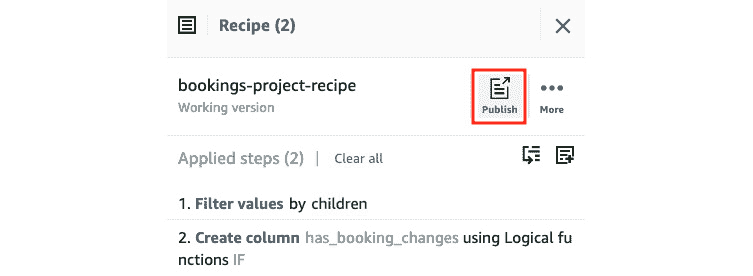

图 5.14 – 定位并点击发布按钮

这应该会打开**发布配方**窗口。

1.  在**发布配方**弹出窗口中，点击**发布**。请注意，在发布当前配方时，我们可以指定可选的版本描述。

现在我们已经发布了一个配方，我们可以继续创建一个将执行配方中配置的不同步骤的配方作业。

注意

在发布配方后，我们仍然需要在更改生效之前运行一个配方作业（这将生成一个应用了数据转换的新文件）。

## 创建和运行配方作业

正如我们在*图 5.15*中可以看到的，配方作业需要配置一个源和一个目标。作业读取存储在源中的数据，执行关联配方中配置的转换步骤，并将处理后的文件存储在目标中。


图 5.15 – 作业需要配置源和目标

重要的是要注意，源数据不会被修改，因为配方作业仅以只读方式连接。配方作业完成所有步骤的处理后，作业结果将存储在配置的输出目标之一或多个中。

在接下来的步骤中，我们将使用上一节中发布的配方创建并运行一个配方作业：

1.  使用左侧边栏导航到**配方**页面。

1.  选择名为`bookings-project-recipe`的行（这将切换复选框并突出显示整个行）。

1.  单击**使用此配方创建作业**按钮。这将带您转到**创建作业**页面。

1.  在`bookings-clean-and-add-column`

1.  `项目`

1.  `bookings-project`。

1.  **作业输出设置**

    +   **S3 位置**：单击**浏览**。找到并选择本章此步骤中使用的相同 S3 存储桶。

1.  **权限**：

    +   **角色名称**：选择在早期步骤中创建的 IAM 角色。

注意

我们不仅限于将作业输出结果存储在 S3 中。我们还可以将输出结果存储在**Amazon Redshift**、**Amazon RDS**表和其他地方。有关更多信息，请随意查看以下链接：[`docs.aws.amazon.com/databrew/latest/dg/supported-data-connection-sources.xhtml`](https://docs.aws.amazon.com/databrew/latest/dg/supported-data-connection-sources.xhtml)。

1.  审查指定的配置，然后单击**创建并运行作业**按钮。如果您意外单击了**创建作业**按钮（位于**创建并运行作业**按钮旁边），在作业创建后，您可以单击**运行作业**按钮。

注意

等待 3 到 5 分钟以完成此步骤。在等待时，请随意拿一杯咖啡或茶！

难道不是很简单吗？创建、配置和运行一个配方作业是直接的。请注意，我们可以通过关联一个计划来自动化配置这个配方作业的运行。有关此主题的更多信息，您可以查看以下链接：[`docs.aws.amazon.com/databrew/latest/dg/jobs.recipe.xhtml`](https://docs.aws.amazon.com/databrew/latest/dg/jobs.recipe.xhtml#jobs.scheduling)。

## 验证结果

现在，让我们继续在 AWS CloudShell 中检查配方作业输出结果，AWS CloudShell 是一个基于浏览器的免费 shell，我们可以使用终端来管理我们的 AWS 资源。在接下来的步骤中，我们将下载配方作业输出结果到 CloudShell 环境中，并检查预期的更改是否反映在下载的文件中：

1.  当作业的 **最后运行状态** 变为 **成功** 后，点击 **输出** 列下的 **1 输出** 链接。这应该会打开 **作业输出位置** 窗口。点击 **目的地** 列下的 S3 链接，在新标签页中打开 S3 存储桶页面。

1.  使用 `bookings-clean-and-add-column` 命令。确保按下 *ENTER* 键以过滤对象列表。导航到 `bookings-clean-and-add-column` 并以 `part00000` 结尾。

1.  选择 CSV 文件（这将切换复选框）然后点击 **复制 S3 URI** 按钮。

1.  通过点击图标，导航到 **AWS CloudShell**，如图 5.16 所示：

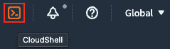

图 5.16 – 导航到 CloudShell

我们可以在 AWS 管理控制台的右上角找到这个按钮。您也可以使用搜索栏导航到 CloudShell 控制台。

1.  当你看到 **欢迎使用 AWS CloudShell** 窗口时，点击 **关闭** 按钮。在继续之前，等待环境运行（大约 1 到 2 分钟）。

1.  在 CloudShell 环境中运行以下命令（在 `<PASTE COPIED S3 URL>` 处粘贴之前步骤中复制到剪贴板的内容）：

    ```py
    TARGET=<PASTE COPIED S3 URL>
    ```

    ```py
    aws s3 cp $TARGET bookings.csv
    ```

这应该将输出 CSV 文件从 S3 下载到 CloudShell 环境中。

1.  使用 `head` 命令检查 `bookings.csv` 文件的前几行：

    ```py
    head bookings.csv
    ```

这应该返回包含 CSV 文件标题的第一行，以及数据集的前几条记录：

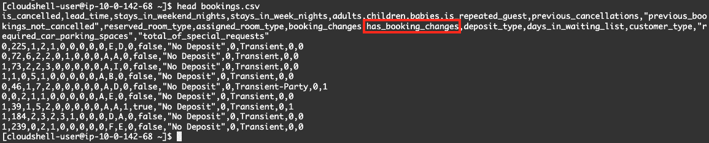

图 5.17 – 验证作业结果

在 *图 5.17* 中，我们可以看到处理后的数据集现在包括包含 `true` 或 `false` 值的 `has_booking_changes` 列。您可以进一步检查 CSV 文件，并验证 `children` 列下没有更多的 `-1` 值。我们将把这个留给你作为练习。

现在，我们已经使用 AWS Glue DataBrew 分析和加工了我们的数据，我们可以继续使用 Amazon SageMaker Data Wrangler 来执行类似的操作集。

重要提示

完成本章中实际解决方案的工作后，不要忘记删除所有 Glue DataBrew 资源（例如，配方作业、配置文件作业、配方、项目和数据集）。

# 使用 Amazon SageMaker Data Wrangler 准备 ML 数据

Amazon SageMaker 拥有大量功能和特性，以帮助数据科学家和 ML 工程师满足不同的 ML 需求。SageMaker 的一个功能是专注于加速数据准备和数据分析，即 SageMaker Data Wrangler：

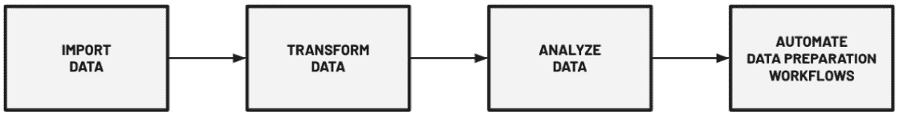

图 5.18 – SageMaker Data Wrangler 中可用的主要功能

在*图 5.18*中，我们可以看到使用 SageMaker Data Wrangler 可以对我们的数据进行哪些操作：

1.  首先，我们可以从各种数据源导入数据，例如 Amazon S3、Amazon Athena 和 Amazon Redshift。

1.  接下来，我们可以创建数据流，并使用各种数据格式化和数据转换选项来转换数据。我们还可以通过内置和自定义选项在几秒钟内分析和可视化数据。

1.  最后，我们可以通过导出数据处理管道中配置的一个或多个转换来自动化数据准备工作流程。

SageMaker Data Wrangler 集成到 SageMaker Studio 中，这使得我们可以使用这项功能来处理我们的数据，并自动化我们的数据处理工作流程，而无需离开开发环境。我们无需从头开始使用各种工具、库和框架（如 pandas 和 PySpark）编写所有代码，只需简单地使用 SageMaker Data Wrangler 来帮助我们使用界面准备自定义数据流，并在几分钟内自动生成可重用的代码！

重要提示

确保注销并*不*使用*第四章*“在 AWS 上无服务器数据管理”中创建的 IAM 用户。您应该使用根账户或具有创建和管理 AWS Glue DataBrew、Amazon S3、AWS CloudShell 和 Amazon SageMaker 资源权限的新 IAM 用户。在运行本书中的示例时，建议使用具有有限权限的 IAM 用户而不是根账户。我们将在*第九章*“安全、治理和合规策略”中详细讨论这一点以及其他安全最佳实践。

## 访问 Data Wrangler

我们需要打开 SageMaker Studio 以访问 SageMaker Data Wrangler。

注意

在继续之前，请确保您已完成了*第一章*“在 AWS 上开始使用 SageMaker 和 SageMaker Studio”部分中的动手练习。如果您正在使用旧版本，您还可以更新 SageMaker Studio 以及 Studio Apps。有关此主题的更多信息，您可以查看以下链接：[`docs.aws.amazon.com/sagemaker/latest/dg/studio-tasks-update-studio.xhtml`](https://docs.aws.amazon.com/sagemaker/latest/dg/studio-tasks-update-studio.xhtml)。请注意，本节中的步骤假设我们正在使用 JupyterLab 3.0。如果您使用的是不同版本，您可能会在布局和用户体验方面遇到一些差异。

在接下来的步骤中，我们将启动 SageMaker Studio 并从**文件**菜单访问 Data Wrangler：

1.  导航到 AWS 管理控制台的搜索栏中的`sagemaker studio`，并从**功能**下的结果列表中选择**SageMaker Studio**。

重要提示

本章假设我们在使用服务管理和创建不同类型的资源时，正在使用`us-west-2`区域。您可以使用不同的区域，但请确保在需要将某些资源转移到所选区域时进行任何必要的调整。

1.  接下来，在侧边栏中点击**SageMaker Domain**下的**工作室**。

1.  点击**启动应用**，如*图 5.19*中所示。从下拉选项列表中选择**工作室**：

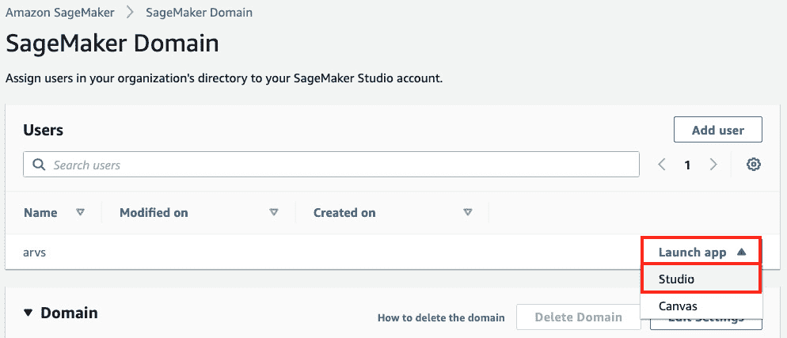

图 5.19 – 打开 SageMaker Studio

这将带您到**SageMaker Studio**。等待几秒钟，直到界面加载完成。

1.  打开正在配置的`ml.m5.4xlarge`实例以运行 Data Wrangler。一旦准备就绪，您将看到**导入数据**页面。

就这样，让我们在下一节中继续导入我们的数据。

重要提示

一旦您完成本章的动手实践，用于运行 Data Wrangler 的`ml.m5.4xlarge`实例需要立即关闭，以避免产生额外费用。点击并定位左侧侧边栏上的圆形图标以显示正在运行的实例、应用、内核会话和终端会话的列表。确保在完成使用 SageMaker Studio 后，在**正在运行的实例**下关闭所有运行实例。

## 导入数据

在使用 Data Wrangler 导入数据时，有多种选项。我们可以从包括 Amazon S3、Amazon Athena、Amazon Redshift、Databricks（JDBC）和 Snowflake 在内的各种来源导入和加载数据。

在接下来的步骤中，我们将专注于导入存储在我们账户中 S3 存储桶上传的 Parquet 文件中的数据：

1.  在**导入数据**页面（位于**导入**选项卡下），点击**Amazon S3**。

1.  在您 AWS 账户中 S3 存储桶上传的`synthetic.bookings.dirty.parquet`文件。

重要提示

如果您跳过了本章的*使用 AWS Glue DataBrew 自动化数据准备和分析*部分，您需要将本章*准备基本先决条件*部分下载的 Parquet 文件上传到新的或现有的 Amazon S3 存储桶。

1.  如果您看到一个类似于*图 5.20*中所示的**预览错误**通知，您可以通过打开**文件类型**下拉菜单并从选项列表中选择**parquet**来移除它。

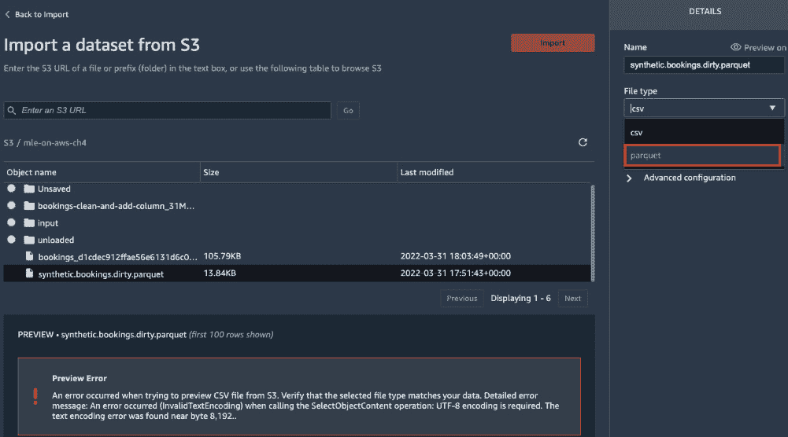

图 5.20 – 设置文件类型为 Parquet

选择**文件类型**下拉菜单中的**parquet**选项后，**预览错误**消息应该会消失。

如果您正在使用 JupyterLab 版本 3.0，**parquet**选项已经预先选中。

1.  如果你使用的是 JupyterLab 版本 1.0，**csv**选项可能被预先选中，而不是**parquet**选项。但不管版本如何，我们应该将**文件类型**下拉值设置为**parquet**。点击页面右上角的**导入**按钮。这将把你重定向回**数据流**页面。

注意，我们不仅限于从 Amazon S3 导入。我们还可以从 Amazon Athena、Amazon Redshift 和其他数据源导入数据。你可以查看[`docs.aws.amazon.com/sagemaker/latest/dg/data-wrangler-import.xhtml`](https://docs.aws.amazon.com/sagemaker/latest/dg/data-wrangler-import.xhtml)获取更多信息。

## 数据转换

在 SageMaker Data Wrangler 中处理和转换我们的数据时，有许多内置选项。在本章中，我们将展示如何使用自定义 PySpark 脚本来转换数据的快速演示。

注意

关于可用的众多数据转换的更多信息，请随时查看以下链接：[`docs.aws.amazon.com/sagemaker/latest/dg/data-wrangler-transform.xhtml`](https://docs.aws.amazon.com/sagemaker/latest/dg/data-wrangler-transform.xhtml)。

在接下来的步骤中，我们将添加并配置一个自定义 PySpark 转换来清理和处理我们的数据：

1.  如果你可以看到**数据类型 · 转换：synthetic.bookings.dirty.parquet**页面，通过点击页面左上角的**< 数据流**按钮导航回**数据流**页面。我们将在查看下一步中数据流当前配置的快速查看后回到这个页面。

1.  在**数据流**页面，点击如图 5.21 所示的高亮**+**按钮。从选项列表中选择**添加转换**：

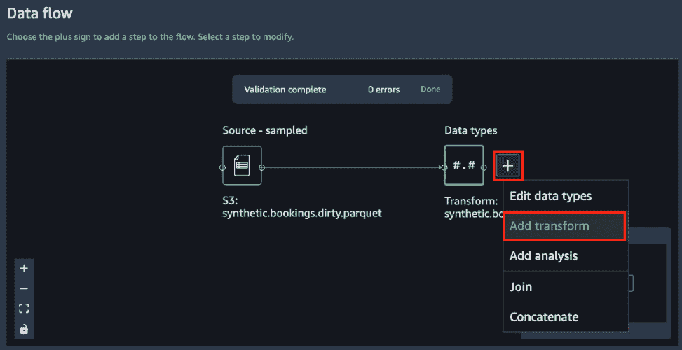

图 5.21 – 添加转换

在本章中，我们只将与一个数据集工作。然而，重要的是要注意，我们可以使用如图 5.21 所示的**连接**选项来处理和合并两个数据集。

1.  在页面左侧的**所有步骤**面板中，点击**添加步骤**按钮。这将显示用于转换数据集的选项列表。

注意

如果你使用的是**JupyterLab 1.0**，你应该看到左侧面板上标记为**TRANSFORMS**而不是**所有步骤**。

1.  从选项列表中选择**自定义转换**。

1.  在**自定义转换**中，将以下代码输入到代码编辑器中：

    ```py
    df = df.filter(df.children >= 0)
    ```

    ```py
    expression = df.booking_changes > 0
    ```

    ```py
    df = df.withColumn('has_booking_changes', expression)
    ```

这段代码块的功能是选择并保留所有`children`列的值等于`0`或更高的行，并创建一个新列`has_booking_changes`，如果`booking_changes`列的值大于`0`，则该列的值为`true`，否则为`false`。

注意

如果你使用的是**JupyterLab 1.0**，你应该看到左侧面板上标记为**CUSTOM PYSPARK**而不是**CUSTOM TRANSFORM**。

1.  点击`has_booking_changes`列，类似于图 5.22 中的操作：

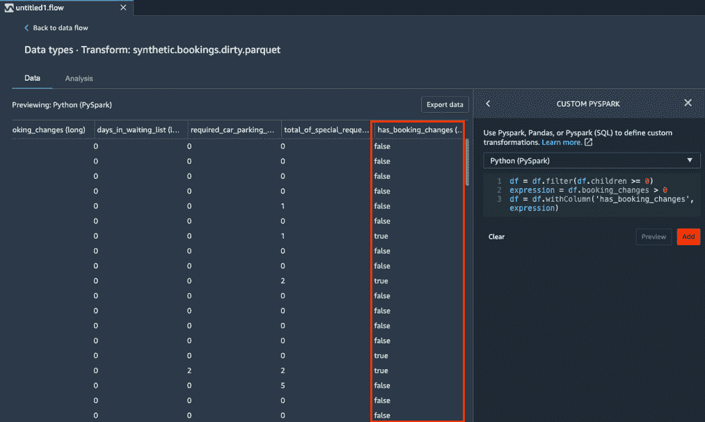

图 5.22 – 预览更改

你应该在**total_of_special_requests**列旁边找到**has_booking_changes**列（这是预览中最左侧的列）。

1.  在完成数据预览的审查后，你可以在点击**添加**按钮之前提供一个可选的**名称**值。

1.  在上一步点击**添加**按钮后，找到并点击页面右上角的**<数据流**链接（或**返回数据流**链接）。

注意

需要注意的是，这些步骤尚未执行，因为我们只是在定义稍后将要运行的步骤。

注意，我们在这里使用 SageMaker Data Wrangler 只是在触及我们能做的事情的表面。以下是一些其他可用的转换示例：

+   平衡数据（例如，随机过采样、随机欠采样和 SMOTE）

+   对分类数据进行编码（例如，独热编码、相似度编码）

+   处理缺失的时间序列数据

+   从时间序列数据中提取特征

对于更完整的转换列表，请随意查看以下链接：[`docs.aws.amazon.com/sagemaker/latest/dg/data-wrangler-transform.xhtml`](https://docs.aws.amazon.com/sagemaker/latest/dg/data-wrangler-transform.xhtml)。

注意

如果你对如何使用各种技术（如随机过采样、随机欠采样和 SMOTE）平衡数据感兴趣，请随意查看以下博客文章：[`aws.amazon.com/blogs/machine-learning/balance-your-data-for-machine-learning-with-amazon-sagemaker-data-wrangler/`](https://aws.amazon.com/blogs/machine-learning/balance-your-data-for-machine-learning-with-amazon-sagemaker-data-wrangler/)。

## 分析数据

分析我们将在后续步骤中用于训练机器学习模型的 数据至关重要。我们需要对可能无意中影响使用此数据训练的机器学习模型的行为和性能的属性有一个良好的了解。分析数据集有多种方法，而 SageMaker Data Wrangler 的好处在于它允许我们从一系列预构建的分析选项和可视化中选择，包括以下列表中的选项：

+   **直方图**——可以用来显示数据的“形状”

+   **散点图**——可以用来显示两个数值变量之间的关系（使用代表数据集中每个数据点的点）

+   **表格摘要**——可以用来显示数据集的摘要统计信息（例如，记录数或每列的最小值和最大值）

+   **特征重要性分数**（使用快速模型）——用于分析每个特征在预测目标变量时的影响

+   **目标泄漏分析**——可以用来检测数据集中与我们要预测的列强相关的列

+   **时间序列数据的异常检测** – 可以用来检测时间序列数据中的异常值

+   **偏差报告** – 可以用来检测数据集中潜在的偏差（通过计算不同的偏差指标）

注意

注意，这并不是一个详尽的列表，当你在这个部分的实践部分工作时，你可能会看到其他选项。

在接下来的步骤中，我们将创建一个分析和生成偏差报告：

1.  点击**+**按钮，从选项列表中选择**添加分析**，类似于*图 5.23*中的操作：

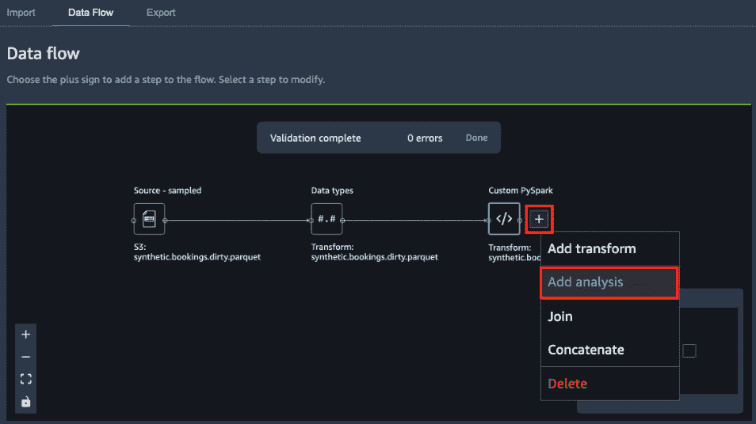

图 5.23 – 添加分析

你应该看到位于页面左侧的**创建分析**面板。

1.  在`偏差报告`中指定以下配置选项

1.  `样本分析`

1.  `is_cancelled`

1.  `1`

1.  `babies`

1.  `阈值`

1.  `1`

1.  滚动到页面底部。定位并点击**检查偏差**按钮（在**保存**按钮旁边）。

1.  向上滚动并定位偏差报告，类似于*图 5.24*中所示：

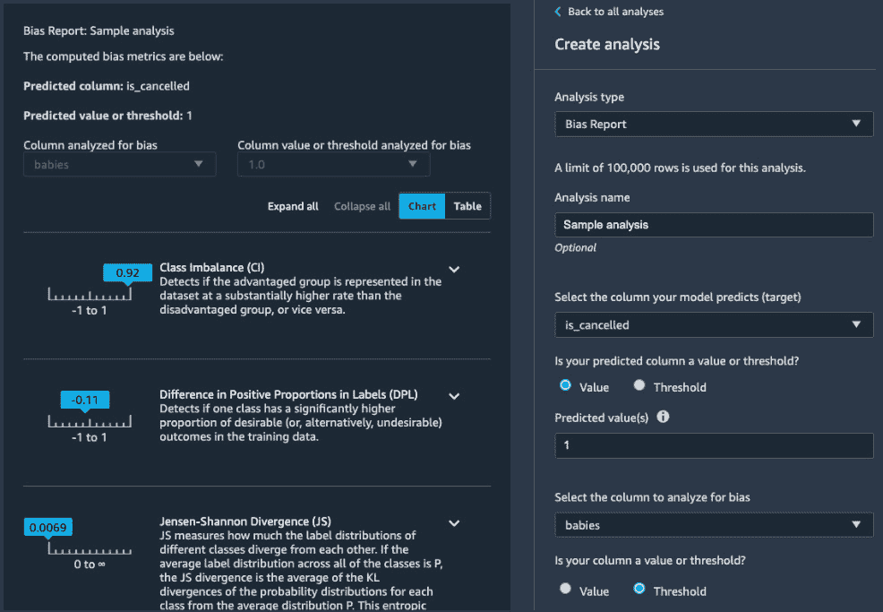

图 5.24 – 偏差报告

在这里，我们可以看到`0.92`。这意味着数据集高度不平衡，优势组（`is_cancelled = 1`）的代表性远高于劣势组（`is_cancelled = 0`）。

注意

我们将在第九章“安全、治理和合规策略”的详细内容中深入了解偏差指标的计算和解释。

1.  滚动并点击**保存**按钮（在**检查偏差**按钮旁边）

1.  定位并点击**<数据流**链接（或**返回数据流**链接）以返回到**数据流**页面。

除了偏差报告外，我们还可以生成数据可视化，如直方图和散点图，以帮助我们分析数据。我们甚至可以使用提供的数据集快速生成一个模型，并生成一个特征重要性报告（显示每个特征在预测目标变量时的作用）。更多信息，请查看以下链接：[`docs.aws.amazon.com/sagemaker/latest/dg/data-wrangler-analyses.xhtml`](https://docs.aws.amazon.com/sagemaker/latest/dg/data-wrangler-analyses.xhtml)。

## 导出数据流

准备就绪后，让我们继续导出在前几节中准备的数据流。在执行导出操作时，有多种选择。这包括将数据导出到 Amazon S3 存储桶。我们还可以选择使用包含相关代码块的 Jupyter 笔记本，将数据流中的一个或多个步骤导出到**SageMaker Pipelines**。同样，我们也有将准备好的特征导出到**SageMaker Feature Store**的选项。还有一个选项可以直接将数据流步骤导出到 Python 代码。

注意

一旦数据流步骤被导出并转换为代码，生成的代码和 Jupyter 笔记本就可以运行以执行数据流中配置的不同步骤。最后，经验丰富的机器学习从业者可能会选择在需要时修改生成的笔记本和代码。

在接下来的步骤中，我们将执行导出操作并生成一个将利用**SageMaker 处理**作业处理数据并将结果保存到 S3 桶中的 Jupyter Notebook：

1.  在第三个框之后点击**+**按钮，选择**Python (PySpark)**（或使用你在早期步骤中指定的自定义名称），如*图 5.25*中所示，然后打开**导出到**下的选项列表：

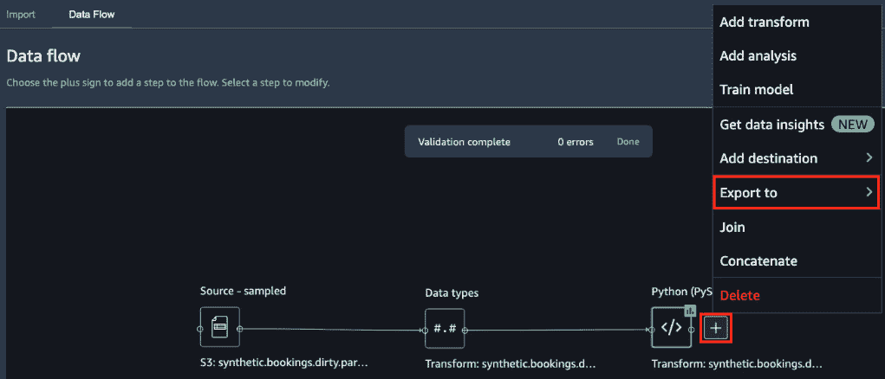

图 5.25 – 导出步骤

这应该会给我们一个包含以下选项的列表：

+   **Amazon S3（通过 Jupyter Notebook）**

+   **SageMaker 流水线（通过 Jupyter Notebook）**

+   **Python 代码**

+   **SageMaker 特征存储（通过 Jupyter Notebook）**

注意

如果你使用的是 JupyterLab 1.0，你首先需要通过点击**数据流**标签旁边的**导出**标签来导航到**导出数据流**页面。之后，你需要点击**自定义 PySpark**下的第三个框，然后点击**导出步骤**按钮（这将打开选项的下拉列表）。

1.  从选项列表中选择**Amazon S3（通过 Jupyter Notebook）**。这应该会生成并打开**使用 SageMaker 处理作业保存到 S3**的 Jupyter Notebook。请注意，在此阶段，配置的数据转换尚未应用，我们需要运行生成的笔记本文件中的单元格以应用转换。

1.  定位并点击第一个可运行的单元格。使用**运行选定的单元格并前进**按钮运行它，如*图 5.26*中所示：

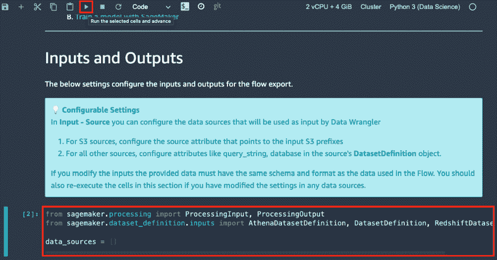

图 5.26 – 运行第一个单元格

如*图 5.26*所示，我们可以在**输入和输出**下找到第一个可运行的单元格。在等待内核启动时，你可能会看到一个“**注意：内核仍在启动中。请在内核启动后再次执行此单元格。**”的消息。

注意

等待内核启动。这一步骤可能需要大约 3 到 5 分钟，因为正在配置机器学习实例以运行 Jupyter Notebook 单元格。一旦你完成本章的动手实践，用于运行 Jupyter Notebook 单元格的机器学习实例需要立即关闭，以避免产生额外费用。点击并定位左侧侧边栏上的圆形图标以显示运行实例、应用程序、内核会话和终端会话的列表。确保在完成使用 SageMaker Studio 后，关闭**正在运行实例**下的所有运行实例。

1.  一旦内核准备好，点击在`run_optional_steps`变量设置为`False`下包含第一个代码块的单元格。

注意

如果你正在 wondering 什么是 SageMaker 处理作业，它是一种利用 AWS 管理基础设施运行脚本的作业。这个脚本被编码成执行用户定义的一系列操作（或脚本的创建者）。你可以查看 [`docs.aws.amazon.com/sagemaker/latest/dg/processing-job.xhtml`](https://docs.aws.amazon.com/sagemaker/latest/dg/processing-job.xhtml) 了解更多关于这个主题的信息。

运行 **Save to S3 with a SageMaker Processing Job** Jupyter 笔记本中所有单元格可能需要大约 10 到 20 分钟。在等待的同时，让我们快速检查笔记本中的不同部分：

+   **输入和输出** – 在这里我们指定流程导出的输入和输出配置

+   **运行处理作业** – 在这里我们配置并运行一个 SageMaker 处理作业

+   **(可选)下一步操作** – 在这里我们可以选择将处理后的数据加载到 pandas 中进行进一步检查，并使用 SageMaker 训练模型

注意

如果你遇到类似 `input_name` 的错误消息，该错误消息与存储在 `data_sources` 列表中的 `ProcessingInput` 对象的值（并且列表中应该只有一个 `ProcessingInput` 对象）。如果你遇到其他意外的错误，请根据需要自由地调试 Python 代码。

1.  一旦在 **(可选)下一步操作** 中抛出了 `SystemExit`，找到并滚动到 **作业状态 & S3 输出位置** 下的单元格，并将 *图 5.27* 中高亮显示的 S3 路径复制到你的本地机器上的文本编辑器（例如，VS Code）中：

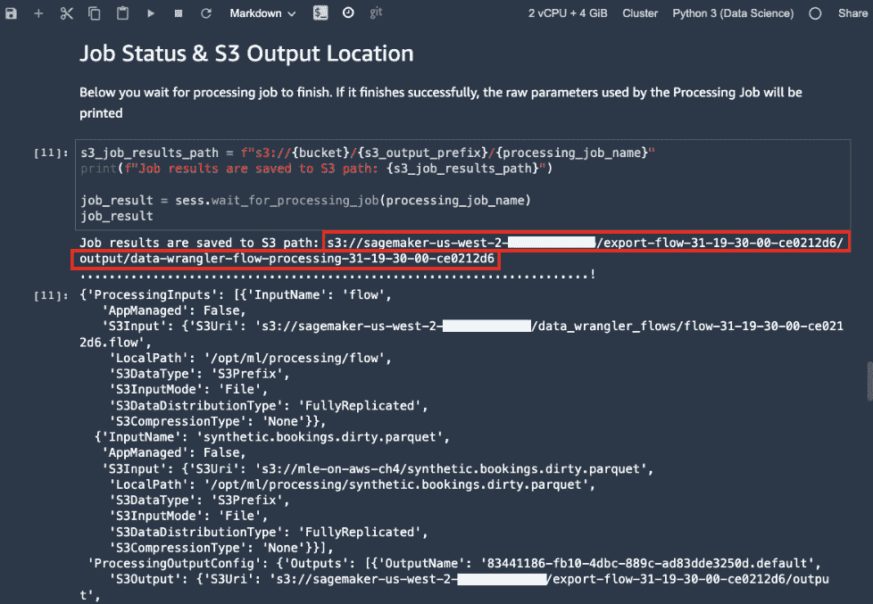

图 5.27 – 复制存储作业结果的 S3 路径

在继续之前，你应该找到 `SystemExit` 之前抛出的 S3 路径。

现在我们已经运行完生成的 Jupyter 笔记本中的单元格，你可能想知道，*最初生成 Jupyter 笔记本的意义是什么*？为什么不直接运行数据流步骤，而无需生成脚本或笔记本？这个答案很简单：这些生成的 Jupyter 笔记本是作为初始模板，可以根据需要的工作要求进行定制。

注意

等等！数据集的处理版本在哪里？在下一节中，我们将快速关闭 SageMaker Studio 自动启动的实例以管理成本。关闭资源后，我们将继续在章节末尾的 *验证结果* 部分下载并检查保存在 S3 中的输出 CSV 文件。

## 关闭资源

需要注意的是，SageMaker Studio 在每次我们使用和访问 SageMaker Data Wrangler 时都会自动启动一个`ml.m5.4xlarge`实例（截至编写时）。此外，当在 Jupyter 笔记本中运行一个或多个单元格时，还会分配另一个 ML 实例。如果我们使用类似于*图 5.28*中的 AWS Deep Learning Container 在 Jupyter 笔记本上创建和运行 ML 实验，那么可能还会分配一个`ml.g4dn.xlarge`实例。这些实例和资源需要手动关闭和删除，因为这些资源即使在非活动期间也不会自动关闭：

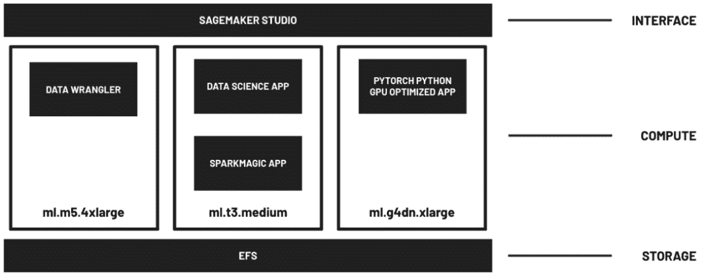

图 5.28 – SageMaker Studio 操作的高级视图

关闭这些资源至关重要，因为我们不希望为这些资源未被使用的时间付费。在接下来的步骤中，我们将定位并关闭 SageMaker Studio 中的运行实例：

1.  点击侧边栏中高亮显示的圆形图标，如*图 5.29*所示：

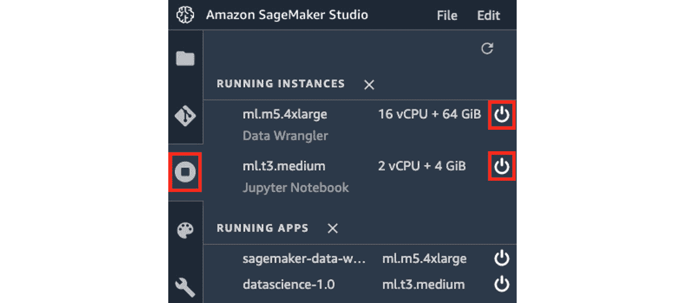

图 5.29 – 关闭运行实例

点击圆形图标将打开并显示 SageMaker Studio 中的运行实例、应用程序和终端。

1.  通过点击每个实例中高亮显示的**关闭**按钮来关闭**运行实例**下的所有运行实例。如*图 5.29*所示。点击**关闭**按钮将打开一个弹出窗口，以验证实例关闭操作。点击**关闭所有**按钮继续。

在继续前进之前，您可能希望安装并使用一个 JupyterLab 扩展，该扩展可以在非活动期间自动关闭某些资源，类似于**SageMaker Studio 自动关闭扩展**。您可以在以下位置找到扩展：[`github.com/aws-samples/sagemaker-studio-auto-shutdown-extension`](https://github.com/aws-samples/sagemaker-studio-auto-shutdown-extension)。

重要提示

即使安装了扩展，仍然建议在使用 SageMaker Studio 后手动检查并关闭资源。请确保定期检查和清理资源。

## 验证结果

到目前为止，数据集的处理版本应该存储在您复制到本地机器文本编辑器中的目标 S3 路径上。在接下来的步骤中，我们将将其下载到 AWS CloudShell 环境中，并检查预期的更改是否反映在下载的文件中：

1.  在 SageMaker Studio 中，打开**文件**菜单，并从选项列表中选择**注销**。这将将您重定向回**SageMaker 域**页面。

1.  通过点击*图 5.30*中高亮显示的图标导航到**CloudShell**：

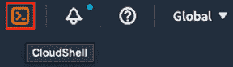

图 5.30 – 导航到 CloudShell

我们可以在 AWS 管理控制台的右上角找到这个按钮。您也可以使用搜索栏导航到 CloudShell 控制台。

1.  一旦终端准备好，请通过运行以下命令将 CloudShell 环境中的所有文件移动到 `/tmp` 目录（在 **$** 之后）：

    ```py
    mv * /tmp 2>/dev/null
    ```

1.  使用 `aws s3 cp` 命令将存储在 S3 中的生成的 CSV 文件复制到 CloudShell 环境中。请确保将 `<PASTE S3 URL>` 替换为您从 **Save to S3 with a SageMaker Processing Job** 笔记本复制到您本地机器上的文本编辑器中的 S3 URL：

    ```py
    S3_PATH=<PASTE S3 URL>
    ```

    ```py
    aws s3 cp $S3_PATH/ . --recursive
    ```

1.  使用以下命令递归列出文件和目录：

    ```py
    ls -R
    ```

您应该能看到存储在 `<UUID>/default` 中的 CSV 文件。

1.  最后，使用 `head` 命令检查 CSV 文件：

    ```py
    head */default/*.csv
    ```

这应该会给我们 CSV 文件的前几行，类似于我们在 *图 5.31* 中看到的那样：

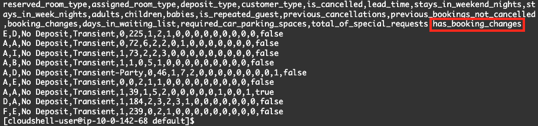

图 5.31 – 验证更改

在这里，我们可以看到数据集有一个新的 `has_booking_changes` 列，包含 `true` 和 `false` 值。您可以进一步检查 CSV 文件，并验证在 `children` 列下没有更多的 `-1` 值。我们将把这个留给你作为练习（即，验证 CSV 文件中的 `children` 列下没有更多的 `-1` 值）。

现在我们已经使用 Amazon SageMaker Data Wrangler 和 AWS Glue DataBrew 处理和分析了一个样本数据集，您可能想知道何时使用其中一个工具而不是另一个。以下是一些在做出决定时的通用建议：

+   如果您计划使用类似于我们在本章中执行的自定义转换使用 PySpark，那么您可能想使用 Amazon SageMaker Data Wrangler。

+   如果源、连接或文件类型格式在 SageMaker Data Wrangler 中不受支持（例如，Microsoft Excel 工作簿格式或 `.xlsx` 文件），那么您可能想使用 AWS Glue Data Brew。

+   如果您想导出数据处理工作流程并自动生成 Jupyter 笔记本，那么您可能想使用 Amazon SageMaker Data Wrangler。

+   如果工具的主要用户编码经验有限，并且更愿意在不阅读、定制或编写任何代码的情况下处理和分析数据，那么可以使用 AWS Glue Data Brew 而不是 Amazon SageMaker Data Wrangler。

当然，这些只是一些您可以使用的指南，但最终决定使用哪个工具将取决于需要完成的工作的上下文，以及做出决定时工具的限制。功能和限制会随时间变化，所以确保在做出决定时尽可能多地审查各个角度。

# 摘要

在使用数据训练机器学习模型之前，数据需要被清理、分析和准备。由于处理这些类型的要求需要时间和精力，因此建议在分析和处理我们的数据时使用无代码或低代码解决方案，例如 AWS Glue DataBrew 和 Amazon SageMaker Data Wrangler。在本章中，我们能够使用这两项服务来分析和处理我们的样本数据集。从样本“脏”数据集开始，我们执行了各种转换和操作，包括（1）对数据进行配置文件分析和分析，（2）过滤掉包含无效数据的行，（3）从现有列创建新列，（4）将结果导出到输出位置，以及（5）验证转换是否已应用于输出文件。

在下一章中，我们将更深入地了解 Amazon SageMaker，并深入探讨在进行机器学习实验时如何使用这项托管服务。

# 进一步阅读

关于本章涵盖的主题的更多信息，您可以自由地查看以下资源：

+   *AWS Glue DataBrew 产品和服务集成* ([`docs.aws.amazon.com/databrew/latest/dg/databrew-integrations.xhtml`](https://docs.aws.amazon.com/databrew/latest/dg/databrew-integrations.xhtml))

+   *AWS Glue DataBrew 中的安全性* ([`docs.aws.amazon.com/databrew/latest/dg/security.xhtml`](https://docs.aws.amazon.com/databrew/latest/dg/security.xhtml))

+   *创建和使用 Data Wrangler 流程* ([`docs.aws.amazon.com/sagemaker/latest/dg/data-wrangler-data-flow.xhtml`](https://docs.aws.amazon.com/sagemaker/latest/dg/data-wrangler-data-flow.xhtml))

+   *Data Wrangler – 转换* ([`docs.aws.amazon.com/sagemaker/latest/dg/data-wrangler-transform.xhtml`](https://docs.aws.amazon.com/sagemaker/latest/dg/data-wrangler-transform.xhtml))

+   *Data Wrangler – 故障排除* ([`docs.aws.amazon.com/sagemaker/latest/dg/data-wrangler-trouble-shooting.xhtml`](https://docs.aws.amazon.com/sagemaker/latest/dg/data-wrangler-trouble-shooting.xhtml))

# 第三部分：使用相关模型训练和部署解决方案深入探讨

在本节中，读者将学习使用 Amazon SageMaker 的不同功能和特性，以及其他 AWS 服务，来了解相关的模型训练和部署解决方案。

本节包括以下章节：

+   *第六章*，*SageMaker 训练和调试解决方案*

+   *第七章*，*SageMaker 部署解决方案*
