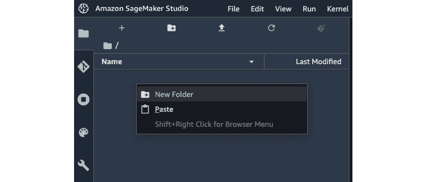
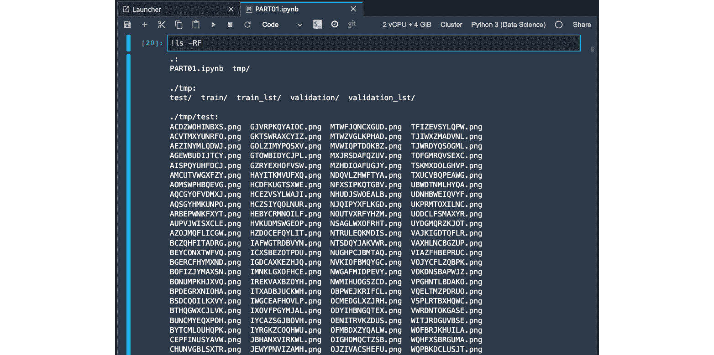
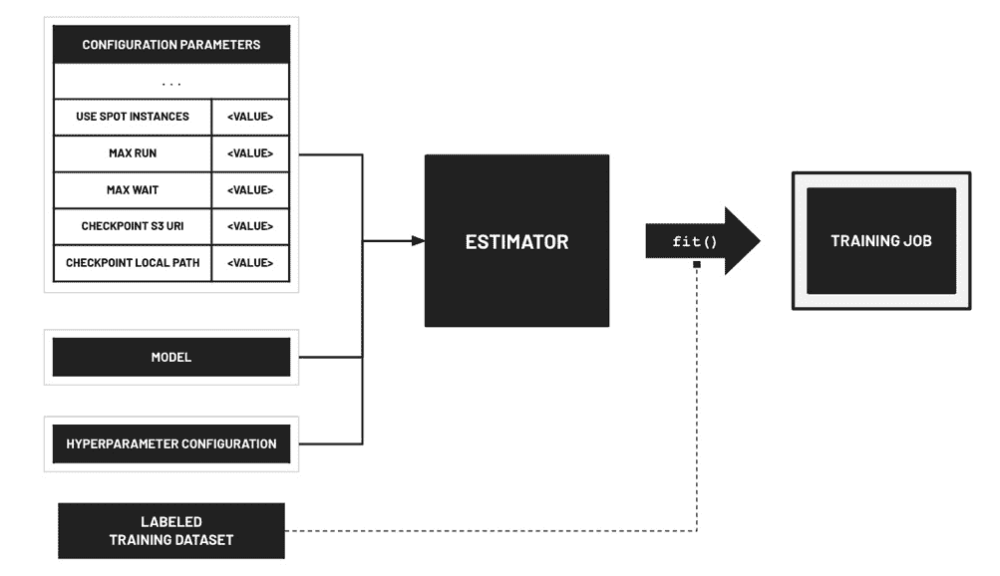

# SageMaker 训练和调试解决方案

在*第二章* *深度学习 AMIs*和*第三章* *深度学习容器*中，我们在 EC2 实例内进行了最初的 ML 训练实验。我们注意到了运行这些 EC2 实例每小时的成本，因为在某些情况下，我们需要使用更昂贵的实例类型（例如每小时大约*7.20 美元*的`p2.8xlarge`实例）来运行我们的 ML 训练作业和工作负载。为了管理和降低使用这些 EC2 实例运行 ML 工作负载的整体成本，我们讨论了几种成本优化策略，包括在训练作业完成后手动关闭这些实例。

在这一点上，您可能想知道是否可以自动化以下流程：

+   *启动将运行 ML 训练作业的 EC2 实例*

+   *在模型训练后将训练好的 ML 模型的模型工件上传到存储位置（例如 S3 存储桶）*

+   *一旦训练作业完成，删除 EC2 实例*

好消息是，这可以通过自动化脚本来实现！一旦这个流程的大部分已经自动化，我们就可以更多地关注准备用于训练我们的 ML 模型的脚本。我们可以编写自己的自动化脚本集；然而，我建议您不要重新发明轮子，因为 AWS 已经在我们使用的**Amazon SageMaker**中为我们自动化了这个流程！

SageMaker 拥有许多功能和特性，可以帮助数据科学家和 ML 从业者轻松地在 AWS 云中执行 ML 实验和部署。在前几章中，我们快速浏览了一些这些功能，包括**SageMaker Canvas**、**SageMaker Autopilot**和**SageMaker Data Wrangler**。在本章中，我们将更深入地探讨其功能和特性，这些功能和特性专注于在 AWS 托管基础设施资源内训练 ML 模型。您可能会惊讶地发现，只需添加几个额外的配置参数，就可以启用某些训练技术和解决方案，例如**网络隔离**、**分布式训练**、**托管 Spot 训练**、**检查点**和**增量训练**。如果您第一次遇到这些概念和技术，请不要担心，我们将在本章中更详细地讨论这些内容。

在本章中，我们将涵盖以下主题：

+   开始使用 SageMaker Python SDK

+   准备基本先决条件

+   使用 SageMaker Python SDK 训练图像分类模型

+   使用调试器洞察仪表板

+   利用托管 Spot 训练和检查点

+   清理工作

在我们开始本章的动手解决方案之前，我们将先简要讨论如何使用**SageMaker Python SDK**来帮助我们利用和操作 SageMaker 服务的不同功能和特性。

# 技术要求

在我们开始之前，我们必须准备好以下内容：

+   一个网络浏览器（最好是 Chrome 或 Firefox）

+   访问本书前几章中使用的 AWS 账户

每一章使用的 Jupyter 笔记本、源代码和其他文件都可在本书的 GitHub 仓库中找到：https://github.com/PacktPublishing/Machine-Learning-Engineering-on-AWS。

重要提示

在本书中运行示例时，建议使用具有有限权限的 IAM 用户而不是根账户。我们将在*第九章*“安全、治理和合规策略”中详细讨论这一点，以及其他安全最佳实践。如果您刚开始使用 AWS，您可以在同时继续使用根账户。

# 使用 SageMaker Python SDK 入门

**SageMaker Python SDK** 是一个库，允许机器学习从业者使用 SageMaker 的不同特性和功能来训练和部署机器学习模型。它提供了几个高级抽象，如 **Estimators**、**Models**、**Predictors**、**Sessions**、**Transformers** 和 **Processors**，所有这些封装并映射到特定的机器学习过程和实体。这些抽象允许数据科学家和机器学习工程师仅用几行代码来管理机器学习实验和部署。同时，基础设施管理已由 SageMaker 处理，所以我们只需要配置这些高级抽象的正确参数集。

注意，也可以使用 **boto3** 库的不同功能和特性来使用 SageMaker。与使用 SageMaker Python SDK 相比，我们使用 boto3 将会处理显著更多的代码行，因为我们必须注意使用库中提供的低级客户端和函数时的细节。建议尽可能使用 SageMaker Python SDK，并且仅在 SageMaker Python SDK 不直接支持的高级场景中使用 boto3 库。

注意

如果您想了解更多关于如何处理更高级用例时同时使用这两个库的信息，请参阅*第八章*“模型监控和管理解决方案”。

以下图表显示，使用 SageMaker Python SDK 训练和部署机器学习模型仅涉及几行代码：


图 6.1 – SageMaker Python SDK

在这里，我们使用 **SageMaker Python SDK** 来完成以下操作：

1.  我们首先初始化一个 `Estimator` 对象，然后使用其 `set_hyperparameters()` 方法来指定所需的超参数值组合。在这里，我们可以通过提供初始化 `Estimator` 对象时的相应配置参数值来指定是否使用内置算法或自定义算法（使用脚本和自定义 Docker 容器镜像）。

1.  接下来，我们调用`fit()`方法，该方法使用在`Estimator`对象配置中定义的所需属性集运行训练作业。这个训练作业将在专用实例中运行，一旦训练作业完成，这些实例将自动终止。

1.  最后，我们使用`deploy()`方法将训练好的模型部署到 SageMaker 为我们自动准备的一个专用实时推理端点。然后，我们使用`predict()`方法在推理端点上执行样本预测。

这只是使用**SageMaker Python SDK**在 AWS 云中训练和部署我们的 ML 模型的一种方法。如果我们已经有一个可用的预训练模型（例如，从模型存储库下载预构建的 ML 模型后），我们可以完全跳过训练步骤，并使用以下代码块立即部署模型：

```py
from sagemaker.model import Model 
model = Model(model_data=model_data, ...)
model.deploy(<insert configuration parameters>)
```

当然，前面的代码块假设模型工件已经上传到 S3 桶中，并且`model_data`变量指向这些模型工件或文件存储的位置。

注意

如果你想要了解更多关于如何在 SageMaker 中直接使用预训练模型进行部署的信息，请查看《Amazon SageMaker CookBook》一书的*第七章*，*SageMaker 部署解决方案*。

如果我们想要利用 SageMaker 的**自动模型调优**功能，并在寻找“最佳模型”时自动使用不同超参数组合运行多个训练作业，那么我们只需要运行几行代码，类似于以下代码块中的内容：

```py
estimator = Estimator(...)
estimator.set_hyperparameters(...)
hyperparameter_ranges = {...}
objective_metric_name = "<insert target metric>"
hyperparameter_tuner = HyperparameterTuner(
    estimator, 
    objective_metric_name, 
    hyperparameter_ranges, 
    max_jobs=20, 
    max_parallel_jobs=3
)
hyperparameter_tuner.fit(...)
```

在这里，SageMaker 为我们做了所有繁重的工作，我们只需要关注运行超参数调优作业所需的配置参数。如果我们自己使用自定义自动化脚本来构建，这可能会花费我们几周（甚至可能是几个月！）的时间。

注意

如果你想要了解更多关于如何使用**SageMaker Python SDK**利用 SageMaker 的自动模型调优功能，请查看《Amazon SageMaker CookBook》一书的*第六章*，*SageMaker 训练和调试解决方案*。

当使用 Amazon SageMaker 训练模型时，有几种选项和功能可用。这包括网络隔离、分布式训练、托管 Spot 训练、检查点、增量训练等等。与之前讨论的自动模型调优功能类似，利用和启用这些功能只需几行额外的代码。如果你想知道这些是什么，请不要担心——随着我们在本章中动手解决实际问题，我们将详细讨论每个这些功能。

现在我们已经更好地理解了**SageMaker Python SDK**如何帮助我们训练和部署云中的 ML 模型，让我们继续创建服务限制请求！

# 准备基本先决条件

在本节中，我们将在进行本章的动手实践解决方案之前，确保以下先决条件已准备就绪：

+   我们有一个服务限制增加请求，用于运行使用 `ml.p2.xlarge` 实例（SageMaker 训练）的 SageMaker 训练作业

+   我们有一个服务限制增加请求，用于运行使用 `ml.p2.xlarge` 实例（SageMaker 管理预留实例训练）的 SageMaker 训练作业

如果您想知道为什么本章使用 `ml.p2.xlarge` 实例，那是因为我们被要求使用 **图像分类算法** 支持的实例类型之一，如下面的截图所示：


图 6.2 – 图像分类算法的 EC2 实例推荐

如我们所见，当运行图像分类算法的训练作业时，我们可以使用 `ml.p2.xlarge`、`ml.p2.8xlarge`、`ml.p2.16xlarge`、`ml.p3.2xlarge`、`ml.p3.8xlarge` 和 `ml.p3.16xlarge`（截至编写时）。

注意

查阅 [`docs.aws.amazon.com/sagemaker/latest/dg/image-classification.xhtml`](https://docs.aws.amazon.com/sagemaker/latest/dg/image-classification.xhtml) 了解更多关于此主题的信息。

## 创建服务限制增加请求

在本章中，我们将使用多个 `ml.p2.xlarge` 实例来训练图像分类模型。在我们能够使用此类实例来训练机器学习模型之前，我们需要通过 `0` 请求增加服务配额（或服务限制）；如果我们使用 `ml.p2.xlarge` 实例运行训练作业，将会遇到 `ResourceLimitExceeded` 错误。

重要提示

本章假设我们在使用服务来管理和创建不同类型的资源时，正在使用 `us-west-2` 区域。您可以使用不同的区域，但请确保在需要将某些资源转移到所选区域的情况下，进行任何必要的调整。

按照以下步骤创建支持案例并请求增加 SageMaker 训练实例数量限制：

1.  在 AWS 管理控制台的搜索栏中导航到 `support`

1.  从 **服务** 下的结果列表中选择 **支持**。

+   定位并点击 **创建案例** 按钮。*   在 **创建案例** 页面上，从选项列表中选择 **服务限制增加**。*   在 `SageMaker 训练作业` 下指定以下配置*   在 `US West (Oregon)` 下*   `SageMaker 训练`*   `ml.p2.xlarge`*   `2`

注意

注意，增加 SageMaker 训练资源类型的服务限制并不会自动增加 SageMaker 管理预留实例训练资源类型的服务限制。

1.  点击 **添加另一个请求**。

1.  在 `US West (Oregon)`

1.  `SageMaker 管理预留实例训练`

1.  `ml.p2.xlarge`

1.  `2`

1.  在 **案例描述** 下，在提供的文本区域中指定以下用例描述：

    ```py
    Good day, 
    ```

    ```py
    I am planning to run a SageMaker training job using 2 x ml.p2.xlarge instances to train an Image Classification model. After this I am planning to use Managed Spot Training to run a similar example and will need 2 x ml.p2.xlarge (spot) instances. Hope these 2 limit increase requests can be processed as soon as possible in the Oregon (us-west-2) region.
    ```

    ```py
    You can find the relevant notebooks here: https://github.com/PacktPublishing/Machine-Learning-Engineering-on-AWS
    ```

确保如果您计划在另一个区域运行您的机器学习实验，将 `Oregon (us-west-2)` 替换为适当的区域。

1.  滚动到 **联系方式** 并从 **联系方式** 下的选项列表中选择 **网页**（或如果可用，选择 **聊天**）。

1.  最后，点击 **提交** 按钮。

注意，增加限制的请求可能需要大约 24 到 48 小时才能获得 **AWS 支持团队** 的批准。在等待期间，您可以浏览本章中解释的内容和概念。这将帮助您在动手解决实际问题之前更好地了解 SageMaker 的功能。您还可以在等待限制增加获得批准的同时跳过本章，并继续阅读 *第七章*，*SageMaker 部署解决方案*。

# 使用 SageMaker Python SDK 训练图像分类模型

如在 *使用 SageMaker Python SDK 入门* 部分中提到的，我们可以在 SageMaker 中执行训练实验时使用内置算法或自定义算法（使用脚本和自定义 Docker 容器镜像）。

数据科学家和机器学习从业者可以使用 AWS 团队准备的内置算法之一或多个快速开始使用 SageMaker 训练和部署模型。有各种各样的内置算法可供选择，并且每个算法都旨在帮助机器学习从业者解决特定的商业和机器学习问题。以下是一些可用的内置算法，以及它们可以解决的问题和用例：

+   **DeepAR 预测**：时间序列预测

+   **主成分分析**：降维

+   **IP 洞察**：IP 异常检测

+   **潜在狄利克雷分配 (LDA**)：主题建模

+   **序列到序列**：文本摘要

+   **语义分割**：计算机视觉

第二种选择涉及使用 SageMaker **脚本模式**，其中我们导入一个自定义训练脚本，该脚本使用深度学习框架（如 **TensorFlow**、**PyTorch** 或 **MXNet**）来训练模型。在这里，自定义训练脚本将在预先构建的容器内运行，这些容器包括 **AWS Deep Learning Containers**，如第 *3 章* 中所述，*深度学习容器*。话虽如此，当我们选择此选项时，我们只需担心准备训练脚本，因为大多数依赖项已经安装在这些脚本将运行的容器环境中。

第三种选择涉及在 SageMaker 中构建和使用自定义容器镜像来训练机器学习模型。此选项为我们提供了最高级别的灵活性，因为我们完全控制自定义训练脚本将运行的环境。

注意

*哪个选项最适合我们？* 如果我们想在不需要准备自定义脚本和自定义容器镜像的情况下继续训练 ML 模型，最佳选项是使用 SageMaker 的内置算法。如果我们试图将自定义脚本移植到 SageMaker，该脚本使用开源 ML 库和框架（如 scikit-learn、PyTorch 和 TensorFlow）来训练模型，那么最佳选项是使用 SageMaker 的脚本模式。如果我们需要更多的灵活性，那么我们可以选择使用我们自己的自定义容器镜像的选项。

现在我们对在 SageMaker 中训练机器学习模型时有哪些选项有了更好的了解，让我们继续讨论本节实践部分我们将要做什么。在本节中，我们将使用内置的`ml.p2.xlarge`实例。为了测试我们训练的模型，我们将在`ml.m5.xlarge`实例内部部署模型并启动一个推理端点。然后，这个推理端点被用来使用几个测试图像进行样本预测。

如以下图所示，在执行训练步骤时，我们可以利用**分布式训练**：


图 6.3 – 训练和部署图像分类模型

分布式训练可以通过使用多个实例而不是单个实例来帮助减少训练时间。由于我们使用的是内置算法，我们只需要配置训练作业以使用两个或更多实例来启用分布式训练。

考虑到这些方面，让我们继续在**SageMaker Studio**中创建一个新的 notebook。我们将使用它来运行训练图像分类模型的代码块。

## 在 SageMaker Studio 中创建一个新的 Notebook

首先，打开 SageMaker Studio 并创建一个名为`CH06`的新目录。然后，在这个目录中创建一个新的**Jupyter notebook**并保存。

注意

在继续之前，请确保您已经完成了*第一章*“在 AWS 上介绍机器学习工程”中“使用 SageMaker 和 SageMaker Studio 入门”部分的动手实践解决方案。

按照以下步骤启动 SageMaker Studio 并创建用于运行本章 Python 脚本的新 notebook：

1.  通过以下步骤导航到 SageMaker Studio：

    1.  在 AWS 管理控制台的搜索栏中输入`sagemaker studio`。

    1.  从**功能**下的结果列表中选择**SageMaker Studio**。

重要提示

本章假设我们在使用服务来管理和创建不同类型的资源时使用的是`us-west-2`区域。您可以使用不同的区域，但请确保如果某些资源需要转移到所选区域，则进行任何必要的调整。

1.  接下来，在侧边栏中点击**SageMaker 域**下的**Studio**。

1.  点击**启动应用**，如以下截图所示。从下拉选项列表中选择**工作室**：


图 6.4 – 打开 SageMaker Studio

这将重定向你到 SageMaker Studio。等待几秒钟，直到界面加载。

1.  右键单击**文件浏览器**侧边栏中的空白区域以打开类似于以下内容的上下文菜单：



图 6.5 – 创建新文件夹

选择`CH06`。

1.  通过在侧边栏中双击相应的文件夹名称，导航到`CH06`目录。

1.  通过点击**文件**菜单并从**新建**子菜单下的选项中选择**笔记本**来创建一个新的笔记本：


图 6.6 – 创建新笔记本

在这里，我们还可以看到其他选项，包括创建新的**控制台**、**数据整理器流程**、**终端**、**文本文件**等。

1.  在 Sagemaker 图像下的`数据科学`（选项）

1.  `Python 3`

1.  `无脚本`

1.  点击**选择**按钮。

注意

等待内核启动。这一步可能需要大约 3 到 5 分钟，因为正在为运行 Jupyter 笔记本单元格配置机器学习实例。

1.  右键单击标签名称，如以下截图所示：


图 6.7 – 重命名笔记本

从上下文菜单中的选项中选择**重命名笔记本…**。

1.  在**新名称**下的`PART01.ipynb`。然后，点击**重命名**按钮。

1.  在笔记本的第一个单元格中输入以下内容：

    ```py
    print('Hello')
    ```

1.  点击**运行所选单元格并前进**按钮，如以下截图所示。或者，您可以按住**SHIFT**键并按**ENTER**键来运行所选单元格并自动创建一个新单元格：


图 6.8 – 运行所选单元格

这应该会输出`Hello`，它应该显示在单元格下。

注意

如果没有显示输出，这意味着要么没有内核正在运行，要么内核仍在启动。一旦内核准备好，您可以再次运行单元格。

现在笔记本已经准备好了，我们将在后续章节的每个代码块中创建一个新的单元格。

## 下载训练、验证和测试数据集

到目前为止，你可能想知道我们将使用什么数据集来训练我们的机器学习模型。为了回答你的问题，我们将使用**MNIST 数据集**，这是一个包含大量手写数字图像的大集合。以下图表中可以看到一个示例：


图 6.9 – MNIST 数据集

在这里，我们可以看到 MNIST 数据集中的每个图像都有一个与`0`到`9`之间的数字相对应的类别。换句话说，总共有 10 个类别，这个数据集中的每个图像恰好属于一个类别。

注意

MNIST 数据集包含数千张手写数字的图片。通常的挑战在于正确识别从 0 到 9 的哪个数字对应于显示在图片中的手写数字。对于我们人类来说，正确分类这些手写数字可能微不足道。然而，对于机器来说并不简单，因为它们必须处理图片的像素数据，并建立数字在图片中的表示模式。为了使机器能够正确分类这些图片，我们将使用深度学习（使用 SageMaker 的图像分类算法）！

为了使我们的工作更简单，我们已预先准备了训练集、验证集和测试集，并将这些存储在一个 ZIP 文件中。按照以下步骤下载此 ZIP 文件并在指定目录中提取文件：

1.  运行以下语句以确保你有空的`tmp`目录准备就绪：

    ```py
    !rm -rf tmp && mkdir -p tmp
    ```

在这里，我们在命令前使用感叹号（`!`），这样我们就可以在 Jupyter 笔记本中运行终端命令。

1.  使用`wget`命令下载`batch1.zip`文件：

    ```py
    !wget -O tmp/batch1.zip https://bit.ly/37zmQeb
    ```

1.  接下来，运行以下代码块以在`tmp`目录内提取`batch1.zip`文件的内容：

    ```py
    %%time
    ```

    ```py
    !cd tmp && unzip batch1.zip && rm batch1.zip
    ```

这应该会生成一组日志，显示从 ZIP 文件中提取的文件：


图 6.10 – 启用输出日志的滚动

右键单击生成的日志消息附近的空白区域。这应该会打开一个类似于前面截图的上下文菜单。从上下文弹出菜单中的选项列表中选择**启用输出滚动**。

1.  使用`ls`命令检查当前目录中的提取文件：

    ```py
    !ls -RF
    ```

我们在使用`ls`命令时设置了两个标志。第一个是`-R`标志，它递归地列出目录树。第二个标志是`-F`标志，它根据文件类型添加特定的字符：目录为`/`，可执行文件为`*`，符号链接为`@`，FIFO 特殊文件为`|`。

运行`ls`命令应该会给我们一组类似于以下内容的日志：



图 6.11 – 列出提取的文件和文件夹

你应该在`tmp`目录内找到五个目录 – `test`、`train`、`train_lst`、`validation`和`validation_lst`：


图 6.12 – 从 batch1.zip 文件中提取的文件和目录

如前图所示，我们应该在`train`目录内找到 10 个目录。这些目录中的每一个都包含几个与存储这些文件的目录名称相对应的*PNG*文件。例如，存储在`0`目录内的 PNG 文件标签为`0`。在`train_lst`目录内是`train.lst`文件，它包含了`train`目录中标签和图像的映射（给定指定的路径和文件名）。我们应在`validation`和`validation_lst`目录内找到类似的目录和文件集。

1.  接下来，让我们安装`IPyPlot`，我们将使用它来检查我们从 ZIP 文件中提取的图像：

    ```py
    !pip3 install ipyplot
    ```

1.  在安装`IPyPlot`后，让我们快速查看我们的标记图像集看起来像什么：

    ```py
    import ipyplot
    ```

    ```py
    import glob
    ```

    ```py
    for i in range(0,10):    
    ```

    ```py
        image_files = glob.glob(f"tmp/train/{i}/*.png")
    ```

    ```py
        print(f'---{i}---')
    ```

    ```py
        ipyplot.plot_images(image_files, 
    ```

    ```py
                            max_images=5, 
    ```

    ```py
                            img_width=128)
    ```

这应该会绘制一系列图像，类似于以下内容：


图 6.13 – 使用 IPyPlot 显示所选数量的图像

在这里，我们可以看到同一组图像之间的差异和变化。例如，零看起来并不相同！

在进入下一节之前，您可以随意调整和更改在调用`plot_images()`函数之前`max_images`参数的值。

现在我们已经有了训练、验证和测试数据集，让我们继续将这些上传到**Amazon S3**存储桶。

## 将数据上传到 S3

注意，在本章中我们将使用两个不同的 S3 存储桶，如下图所示：


图 6.14 – S3 存储桶

如我们所见，第一个 S3 存储桶将包含本节中训练作业的输入和输出文件。同样，第二个 S3 存储桶将包含我们将在本章末尾的*利用托管 Spot 训练和检查点*部分运行的训练作业的输入和输出文件。此外，我们将使用一种称为增量训练的技术，其中我们将使用本节生成的模型作为起点来训练一个更精确的模型。现在，让我们专注于第一个 S3 存储桶，并上传用于训练我们的机器学习模型的数据。

按照以下步骤创建一个 S3 存储桶，然后将`tmp`目录中的所有文件和文件夹上传到新的 S3 存储桶：

1.  指定一个唯一的 S3 存储桶名称和前缀。确保在运行以下代码块之前，将`<INSERT S3 BUCKET NAME HERE>`的值替换为一个唯一的 S3 存储桶名称：

    ```py
    s3_bucket = "<INSERT S3 BUCKET NAME HERE>"
    ```

    ```py
    prefix = "ch06"
    ```

建议不要使用之前章节中创建的任何 S3 存储桶。因此，这里的 S3 存储桶名称应该是一个尚未存在的存储桶的名称。

1.  让我们使用`glob()`函数准备一个包含`tmp/train`目录内所有图像的列表。然后，使用`len()`函数来计算生成的列表中的项目数量：

    ```py
    training_samples = glob.glob(f"tmp/train/*/*.png")
    ```

    ```py
    len(training_samples)
    ```

这应该会给我们一个 `4000` 的值，这是 `tmp/train` 目录中 `.png` 文件的总数。

1.  使用 `aws s3 mb` 命令创建一个新的 Amazon S3 桶。在这里，`{s3_bucket}` 会自动替换为之前用 Python 编写的代码单元格中 `s3_bucket` 的值：

    ```py
    !aws s3 mb s3://{s3_bucket}
    ```

如果 S3 桶创建步骤成功，你应该会看到一个类似于 `make_bucket: <S3 bucket name>` 的成功日志消息。请注意，如果在执行此命令之前桶已存在，则此步骤可能会失败。

1.  接下来，使用 AWS CLI 将 `tmp` 目录的内容上传到目标 S3 路径：

    ```py
    %%time
    ```

    ```py
    !aws s3 cp tmp/.  s3://{s3_bucket}/{prefix}/ --recursive
    ```

`aws s3 cp` 命令的第一个参数是源（`tmp/.`），而第二个参数是目标位置（S3 路径）。在这里，我们使用 `--recursive` 标志递归地复制所有文件从源到目标：


图 6.15 – 从 tmp 目录复制文件和目录到 S3 桶

如前图所示，`aws s3 cp` 命令将复制 SageMaker Studio 笔记本中 `tmp` 目录的所有内容到新的 S3 桶。这包括 `train`、`train_lst`、`validation`、`validation_lst` 和 `test` 目录中的所有文件和目录。

注意

此步骤应花费大约 1 到 2 分钟完成。在等待时，不妨拿一杯咖啡或茶！

一旦上传操作完成，我们就可以开始训练 ML 模型了！

## 使用 SageMaker Python SDK 训练 ML 模型

在上一节中，我们将训练和验证数据集上传到了一个 Amazon S3 桶。这些数据集将在本节中运行训练作业时作为输入使用。当然，在配置和运行 SageMaker 训练作业之前，我们还需要准备一些更多的输入参数：


图 6.16 – 初始化 Estimator 对象时的要求

如前图所示，在初始化和配置 `Estimator` 对象时，我们需要准备一些配置参数值，以及超参数配置值。当调用 `Estimator` 对象的 `fit()` 方法时，SageMaker 使用配置 `Estimator` 对象时使用的参数值来运行训练作业。例如，用于训练 ML 模型的实例类型取决于初始化估计器时 `instance_type` 的参数值。

按照以下步骤使用 **SageMaker Python SDK** 训练图像分类模型：

1.  导入 SageMaker Python SDK 和 **Boto AWS Python SDK**：

    ```py
    import sagemaker
    ```

    ```py
    import boto3
    ```

1.  初始化一些先决条件，例如 `session`、`role` 和 `region_name`：

    ```py
    session = sagemaker.Session()
    ```

    ```py
    role = sagemaker.get_execution_role()
    ```

    ```py
    region_name = boto3.Session().region_name
    ```

1.  使用 `retrieve()` 函数为图像分类算法准备图像 URI。请注意，`retrieve()` 函数返回内置算法的 Amazon ECR URI：

    ```py
    image = sagemaker.image_uris.retrieve(
    ```

    ```py
        "image-classification", 
    ```

    ```py
        region_name, 
    ```

    ```py
        "1"
    ```

    ```py
    )
    ```

    ```py
    image
    ```

这应该给我们一个类似于 `'433757028032.dkr.ecr.us-west-2.amazonaws.com/image-classification:1'` 的值。

1.  定义 `map_path()` 和 `map_input()` 函数：

    ```py
    def map_path(source):
    ```

    ```py
        return 's3://{}/{}/{}'.format(
    ```

    ```py
            s3_bucket, 
    ```

    ```py
            prefix, 
    ```

    ```py
            source
    ```

    ```py
        )
    ```

    ```py
    def map_input(source):
    ```

    ```py
        path = map_path(source)
    ```

    ```py
        return sagemaker.inputs.TrainingInput(
    ```

    ```py
            path, 
    ```

    ```py
            distribution='FullyReplicated', 
    ```

    ```py
            content_type='application/x-image', 
    ```

    ```py
            s3_data_type='S3Prefix'
    ```

    ```py
        )
    ```

1.  通过运行以下代码块来准备 `data_channels` 字典：

    ```py
    data_channels = {}
    ```

    ```py
    channels = ["train", 
    ```

    ```py
                "validation",
    ```

    ```py
                "train_lst",
    ```

    ```py
                "validation_lst"]
    ```

    ```py
    for channel in channels:
    ```

    ```py
        data_channels[channel] = map_input(channel)
    ```

这些数据通道对应于我们上传到 Amazon S3 存储桶中的每个目录（除了 `test` 目录）。

1.  使用我们之前定义的 `map_path()` 函数生成输出路径的 S3 URL：

    ```py
    output_path = map_path("output")
    ```

    ```py
    output_path
    ```

这应该给我们一个类似于 `'s3://<S3 BUCKET NAME>/ch06/output'` 的 S3 路径。

在我们初始化 `Estimator` 对象之前，让我们快速回顾一下到目前为止我们已经做了什么：


图 6.17 – 数据通道和输出路径

在这里，我们可以看到在之前步骤中准备好的数据通道将在运行训练作业时作为输入使用。一旦训练作业完成，输出文件（们）将被存储在 `output_path` 中指定的 S3 位置。

1.  一切准备就绪后，让我们初始化 `Estimator` 对象。在初始化 `Estimator` 对象时，我们需要传递几个参数，例如容器镜像 URI、IAM 角色 ARN 和 SageMaker `session` 对象。我们还指定了在执行训练作业时使用的 ML 实例的数量和类型，以及 `output_path` 和 `enable_network_isolation` 的参数值：

    ```py
    estimator = sagemaker.estimator.Estimator(
    ```

    ```py
        image,
    ```

    ```py
        role, 
    ```

    ```py
        instance_count=2, 
    ```

    ```py
        instance_type='ml.p2.xlarge',
    ```

    ```py
        output_path=output_path,
    ```

    ```py
        sagemaker_session=session,
    ```

    ```py
        enable_network_isolation=True
    ```

    ```py
    )
    ```

注意，初始化 `Estimator` 对象并不会立即运行训练作业。当我们稍后使用 `fit()` 方法运行训练作业时，SageMaker 将启动并配置两个 `ml.p2.xlarge` 实例来运行图像分类算法以训练模型。然后，结果将被上传到 `output_path` 中的 S3 位置。由于我们已将 `enable_network_isolation` 设置为 `True`，我们已配置 SageMaker ML 实例内部的容器，以便在训练作业运行期间没有外部网络访问。这有助于确保设置的安全性，因为此配置防止正在运行的容器下载恶意代码或访问外部服务。

注意

我们应该没问题，因为我们正在使用 AWS 准备的容器镜像。如果我们想使用自定义容器镜像，可以将 `enable_network_isolation` 设置为 `True`，特别是如果我们不期望容器访问外部服务或下载资源。这将有助于保护我们的机器学习环境和资源免受需要网络连接的攻击。有关此主题的更多信息，请参阅*第九章*，*安全、治理和合规策略*。

1.  使用以下代码块初始化超参数配置值：

    ```py
    hyperparameters = {
    ```

    ```py
        'num_training_samples': len(training_samples),
    ```

    ```py
        'num_layers': 18,
    ```

    ```py
        'image_shape': "1,28,28",
    ```

    ```py
        'num_classes': 10,
    ```

    ```py
        'mini_batch_size': 100,
    ```

    ```py
        'epochs': 3,
    ```

    ```py
        'learning_rate': 0.01,
    ```

    ```py
        'top_k': 5,
    ```

    ```py
        'precision_dtype': 'float32'    
    ```

    ```py
    }
    ```

可配置的超参数值取决于所使用的算法。这些只是我们可以使用图像分类算法配置的一些超参数。

1.  使用`set_hyperparameters()`方法使用之前步骤中准备的超参数配置`Estimator`对象：

    ```py
    estimator.set_hyperparameters(**hyperparameters)
    ```

在这里，我们可以看到我们使用`**`通过字典直接传递多个参数给函数或方法。请注意，这与调用`set_hyperparameters()`方法等效，类似于以下代码块中的内容：

```py
estimator.set_hyperparameters(
    num_training_samples=len(training_samples),
    num_layers=18,
    image_shape="1,28,28",
    ...
)
```

注意

可选地，我们可以使用`__dict__`属性检查`Estimator`对象的属性。在继续下一步之前，请在单独的单元中运行`estimator.__dict__`。

1.  使用`fit()`方法开始训练作业：

    ```py
    %%time
    ```

    ```py
    estimator.fit(inputs=data_channels, logs=True)
    ```

一旦训练作业完成，我们应该看到一组类似于以下内容的日志：


图 6.18 – 训练作业完成后生成的日志

1.  当调用`fit()`方法时，在幕后执行了几个操作和步骤。SageMaker 分配了所需的 ML 实例数量后，输入数据和训练容器镜像被下载到每个实例。从下载的容器镜像中运行一个容器，并使用输入数据训练 ML 模型。生成的模型文件存储在`model.tar.gz`文件中。然后，将此`model.tar.gz`文件上传到配置的输出 S3 位置。最后，在训练作业完成后，SageMaker 终止实例：


图 6.19 – 调用 fit()方法后发生的情况

如前图所示，在 ML 实例内部执行的每个相关步骤都会生成日志，这些日志会自动存储在**CloudWatch 日志**中。这包括度量值，以及训练作业运行期间生成的不同类型的日志消息。

重要提示

此步骤可能需要大约 5 到 10 分钟才能完成。如果你遇到**ResourceLimitExceeded**错误，这意味着你在运行训练作业时使用某种类型的 ML 实例时已超出配额。请确保你已经完成了本章“准备基本先决条件”部分中指定的步骤。有关此主题的更多信息，请参阅[`aws.amazon.com/premiumsupport/knowledge-center/resourcelimitexceeded-sagemaker/`](https://aws.amazon.com/premiumsupport/knowledge-center/resourcelimitexceeded-sagemaker/)。

我们可以从存储在 CloudWatch 日志中的日志中获取大量信息。如果你在运行训练作业时遇到错误，你可以检查存储在 CloudWatch 日志中的日志（例如，`/aws/sagemaker/TrainingJob`）以解决问题。

## 使用%store 魔法存储数据

在我们部署和测试模型之前，让我们快速存储一下我们第一个笔记本（例如，`PART01.ipynb`）中使用的某些变量的备份副本：


图 6.20 – `%store` 魔法

我们将使用 IPython 的 `%store` 魔法来完成这项工作，并将这些变量值在其他笔记本中可用。我们将在 *利用托管 Spot 训练和检查点* 部分稍后加载这些变量值，在那里我们将创建一个新的笔记本，名为 `PART02.ipynb`。

按照以下步骤使用 `%store` 魔法保存 `PART01.ipynb` 中使用的某些变量值的副本：

1.  检查 `model_data` 的值：

    ```py
    estimator.model_data
    ```

这应该返回存储训练作业输出文件（`model.tar.gz`）的 S3 路径。

1.  将 `estimator.model_data` 的值复制到一个名为 `model_data` 的新变量中。同样，将最新训练作业的名称复制到一个名为 `job_name` 的变量中：

    ```py
    model_data = estimator.model_data
    ```

    ```py
    job_name = estimator.latest_training_job.name
    ```

1.  使用 `%store` 魔法在内存中存储数据：

    ```py
    %store model_data
    ```

    ```py
    %store job_name
    ```

    ```py
    %store role
    ```

    ```py
    %store region_name
    ```

    ```py
    %store image
    ```

如您所见，`%store` 魔法帮助我们将一个长的 Jupyter notebook 划分为几个更小的笔记本。稍后，在 *利用托管 Spot 训练和检查点* 部分，我们将使用 `%store -r <变量名>` 来加载在此部分中存储的变量值。

## 使用 SageMaker Python SDK 部署 ML 模型

是时候将模型部署到推理端点了。使用 SageMaker Python SDK 部署 ML 模型非常简单。我们只需要调用 `deploy()` 方法；推理端点将在几分钟内自动为我们配置和提供。

按照以下步骤使用 SageMaker Python SDK 部署我们的 ML 模型，然后进行一些测试预测：

1.  使用 `deploy()` 方法将训练好的图像分类模型部署到实时推理端点。模型部署通常需要大约 5 到 10 分钟才能完成：

    ```py
    endpoint = estimator.deploy(
    ```

    ```py
        initial_instance_count = 1,
    ```

    ```py
        instance_type = 'ml.m5.xlarge'
    ```

    ```py
    )
    ```

在这里，我们指定我们正在使用 `ml.m5.xlarge` 实例来托管训练好的 ML 模型。此时，您可能想知道为什么在训练或部署模型时涉及了多种不同的实例类型。首先，您需要知道的是，运行 Jupyter notebook 脚本的 SageMaker Studio 笔记本实例与用于训练或部署模型的实例不同，并且是完全独立的：


图 6.21 – 用于训练和部署模型的不同实例

在这里，我们可以看到用于训练模型的实例与部署期间使用的实例不同。在大多数情况下，用于训练模型的 ML 实例比部署训练好的模型时使用的实例更强大（并且每小时成本更高）。在我们的例子中，我们使用了两个 `ml.p2.xlarge` 实例（*GPU 加速 | 4 个 vCPU | 61 GiB | 每个实例每小时 1.125 美元*）进行训练，并使用单个 `ml.m5.xlarge` 实例（*4 个 vCPU | 16 GiB | 每个实例每小时 0.23 美元*）来托管我们的实时推理端点。

重要提示

仅从这些数字来看，我们可能会错误地假设运行 `ml.p2.xlarge` 训练实例的总成本高于运行用于托管已部署模型的 `ml.m5.xlarge` 实例的总成本。实际上，如果我们不立即删除推理实例，运行 `ml.m5.xlarge` 推理实例的总成本将超过运行 `ml.p2.xlarge` 训练实例的总成本。在训练作业完成后，用于训练的 ML 实例会自动终止。由于我们只为所使用的付费，如果我们运行两个 `ml.p2.xlarge` 训练实例，每个实例运行 6 分钟，我们将支付大约 `$1.125 x 2 x 0.1 = $0.225`。另一方面，如果我们保持 `ml.m5.xlarge` 推理实例运行 24 小时，其成本将约为 `$0.23 x 24 = $5.52`。为了管理成本，确保在非活动期间删除用于实时推理的实例。如果预期接收到的推理端点流量不可预测或间歇性，您可能想检查 **SageMaker Serverless Inference** 选项。更多信息，请参阅 [`aws.amazon.com/about-aws/whats-new/2021/12/amazon-sagemaker-serverless-inference/`](https://aws.amazon.com/about-aws/whats-new/2021/12/amazon-sagemaker-serverless-inference/)。

1.  在我们使用推理端点进行测试预测之前，让我们快速更新端点的 `serializer` 属性，以便接受指定的内容类型：

    ```py
    from sagemaker.serializers import IdentitySerializer
    ```

    ```py
    endpoint.serializer = IdentitySerializer(
    ```

    ```py
        content_type="application/x-image"
    ```

    ```py
    )
    ```

1.  让我们定义一个名为 `get_class_from_results()` 的函数，该函数接受 SageMaker 实时推理端点的原始输出数据，并返回相应的字符串形式的类别（例如，`"ONE"`，`"TWO"`，`"THREE"`）：

    ```py
    import json
    ```

    ```py
    def get_class_from_results(results):
    ```

    ```py
        results_prob_list = json.loads(results)
    ```

    ```py
        best_index = results_prob_list.index(
    ```

    ```py
            max(results_prob_list)
    ```

    ```py
        )
    ```

    ```py
        return {
    ```

    ```py
            0: "ZERO",
    ```

    ```py
            1: "ONE",
    ```

    ```py
            2: "TWO",
    ```

    ```py
            3: "THREE",
    ```

    ```py
            4: "FOUR",
    ```

    ```py
            5: "FIVE",
    ```

    ```py
            6: "SIX",
    ```

    ```py
            7: "SEVEN",
    ```

    ```py
            8: "EIGHT",
    ```

    ```py
            9: "NINE"
    ```

    ```py
        }[best_index]
    ```

1.  让我们定义一个自定义的 `predict()` 函数：

    ```py
    from IPython.display import Image, display
    ```

    ```py
    def predict(filename, endpoint=endpoint):
    ```

    ```py
        byte_array_input = None
    ```

    ```py
        with open(filename, 'rb') as image:
    ```

    ```py
            f = image.read()
    ```

    ```py
            byte_array_input = bytearray(f)
    ```

    ```py
        display(Image(filename))
    ```

    ```py
        results = endpoint.predict(byte_array_input)
    ```

    ```py
        return get_class_from_results(results)
    ```

这个自定义的 `predict()` 函数执行以下操作：

1.  打开一个测试图像，给定一个文件名。

1.  在 Jupyter 笔记本中显示测试图像。

1.  使用端点对象的 `predict()` 方法获取预测的类别值。

1.  在渲染后的图像后立即打印预测的类别值：


图 6.22 – 执行测试预测

注意，在调用 `endpoint.predict()` 方法之后有一个额外的处理步骤。如图所示，自定义的 `predict()` 函数使用 `get_class_from_results()` 函数将推理端点的原始输出数据转换为预测类别的易于理解字符串表示。

1.  现在，让我们使用我们在上一步中定义的自定义 `predict()` 函数：

    ```py
    results = !ls -1 tmp/test
    ```

    ```py
    for filename in results:
    ```

    ```py
        print(predict(f"tmp/test/{filename}"))
    ```

这应该会生成一组类似于以下的结果：


图 6.23 – 执行测试预测

在这里，我们可以看到三张样本图像及其对应的预测类别值。我们的 ML 模型似乎表现得很不错！

1.  最后，让我们使用 `delete_endpoint()` 方法删除推理端点：

    ```py
    endpoint.delete_endpoint()
    ```

*这不是很简单吗？* 本节中我们执行的部署只是 AWS 上进行模型部署的许多可能场景之一。我们将在 *第七章* *SageMaker 部署解决方案* 中探讨其他部署策略和技术。

在下一节中，我们将更详细地探讨如何使用 **Debugger Insights Dashboard** 来检查用于训练我们的图像分类模型的资源利用率。

# 使用 Debugger Insights Dashboard

在处理机器学习需求时，机器学习从业者可能会在提出高性能机器学习模型之前遇到各种问题。就像软件开发和编程一样，构建机器学习模型需要一些试错。开发者通常使用各种调试工具来帮助他们解决软件应用程序编写时的故障和实现错误。同样，机器学习从业者需要一种方法来监控和调试构建机器学习模型时的训练作业。幸运的是，Amazon SageMaker 有一个名为 **SageMaker Debugger** 的功能，允许我们在训练机器学习模型时解决不同的问题和瓶颈：


图 6.24 – SageMaker Debugger 功能

上述图表显示了使用 SageMaker Debugger 监控、调试和解决影响机器学习模型性能的各种问题时可用的功能。这包括跨各种机器学习框架的 **数据捕获** 功能、**Debugger 交互式报告**、**SMDebug 客户端库**、使用 **Debugger 内置规则** 和 **自定义规则** 的自动错误检测，以及 **Debugger Insights Dashboard**。

在本章中，我们将专注于使用 **Debugger Insights Dashboard** 来审查和监控用于训练我们的机器学习模型的实例的硬件系统资源利用率。

重要提示

注意，每次我们使用 Debugger Insights Dashboard 时都会配置一个 `ml.m5.4xlarge` 实例。由于在非活动期间它不会自动关闭，因此需要手动关闭这个 `ml.m5.4xlarge` 实例。我们将在本节结束时确保关闭此实例。

话虽如此，让我们使用 Debugger Insights Dashboard 来监控我们在前几节中使用的实例的硬件系统资源利用率：

1.  通过点击以下截图所示的左侧侧边栏图标，导航到 **SageMaker 资源**：


图 6.25 – 导航到 SageMaker 资源

从第一个下拉菜单中的选项列表中选择 **实验和试验**。双击 **未分配的试验组件**。

1.  在列表中的第一个结果上右键单击。它应该有一个以`image-classification`开头，后跟时间戳的名称。这将打开一个上下文菜单，类似于以下内容。从选项列表中选择**打开调试器以获取洞察**：


图 6.26 – 打开调试器以获取洞察

在这里，我们可以看到一个名为**在试用详情中打开**的另一个选项。如果您选择了此选项，您将看到几个图表，这些图表有助于您分析训练作业的指标和结果。

重要提示

确保在使用调试器洞察仪表板后关闭`ml.m5.4xlarge`实例。

1.  在**概览**选项卡中，向下滚动并找到**资源利用率摘要**报告，如图所示：


图 6.27 – 资源利用率摘要

在这里，我们可以看到硬件系统资源利用率统计信息，例如总 CPU 和 GPU 利用率、总 CPU 和 GPU 内存利用率等。

1.  导航到**节点**选项卡。

1.  向下滚动并找到不同的报告和图表，如图所示：


图 6.28 – 调试器洞察 – 节点

在这里，我们可以看到帮助我们回顾和分析不同利用率指标随时间变化的图表。这包括**CPU 利用率随时间变化**、**网络利用率随时间变化**、**GPU 利用率随时间变化**等报告。

注意

这些报告可以帮助机器学习工程师确定用于训练模型的资源是否“大小合适”。这有助于优化成本并在训练步骤中识别性能瓶颈。

1.  在侧边栏中点击**运行实例和内核**图标，如图中所示：


图 6.29 – 关闭运行实例

点击**运行实例和内核**图标，应在 SageMaker Studio 中打开并显示运行实例、应用程序和终端。

1.  通过点击**关闭**按钮在**运行实例**下关闭`ml.m5.4xlarge`运行实例，如图中所示。点击**关闭**按钮将打开一个弹出窗口，以验证实例关闭操作。点击**全部关闭**按钮继续。

到这一点，我们应该对如何在 Amazon SageMaker 中训练和部署机器学习模型有一个更好的整体理解。请注意，我们只是触及了表面，因为我们还有许多更多功能和能力可供我们使用来管理、分析和调试机器学习实验。

注意

如果您想了解更多关于**SageMaker 调试器**的其他功能，请随时查看《使用 Amazon SageMaker 烹饪机学习》一书的**第五章**，*实用数据处理和分析*。

在下一节中，我们将讨论 SageMaker 在训练机器学习模型时提供的更多功能和特性。

# 利用管理式 Spot 训练和检查点

现在我们已经更好地理解了如何使用 SageMaker Python SDK 来训练和部署机器学习模型，让我们继续使用一些额外的选项，这些选项可以在运行训练作业时显著降低成本。在本节中，我们将利用以下 SageMaker 功能和能力来训练第二个图像分类模型：

+   管理式 Spot 训练

+   检查点

+   增量训练

在 *第二章*，*深度学习 AMI* 中，我们提到可以使用 spot 实例来降低运行训练作业的成本。使用 spot 实例而不是按需实例可以帮助将总体成本降低 70% 到 90%。那么，为什么 spot 实例更便宜呢？使用 spot 实例的缺点是这些实例可能会被中断，这将导致训练作业从起点重新开始。如果我们要在 SageMaker 之外训练模型，我们就必须准备自己的一套自定义自动化脚本，以便利用和管理 spot 实例来训练我们的模型。再次强调，我们不需要准备自定义解决方案，因为 SageMaker 已经通过其 **管理式 Spot 训练** 功能支持自动为我们管理 spot 实例！此外，如果我们配置 SageMaker 训练作业使用 **检查点**，即使在使用 spot 实例时发生中断，我们也能从最后一个保存的检查点恢复训练。

在本节中，我们还将使用一种称为 **增量训练** 的技术，我们将使用在 *使用 SageMaker Python SDK 训练图像分类模型* 部分生成的模型作为起点来训练一个更精确的模型。在这里，我们将使用我们提供的预训练模型而不是从头开始训练新模型。

备注

注意，增量训练只能在使用内置的 **图像分类算法**、**目标检测算法** 和 **语义分割算法** 时使用。

按照以下步骤使用 **SageMaker Python SDK** 运行一个利用检查点、管理式 Spot 训练和增量训练的训练作业：

1.  通过点击 **文件** 菜单并从 **新建** 子菜单下的选项列表中选择 **笔记本** 来创建一个新的笔记本。

1.  在 `数据科学`（在 Sagemaker 图像下找到的选项）

1.  `Python 3`

1.  `无脚本`

1.  点击 **选择** 按钮。

1.  将笔记本重命名为 `PART02.ipynb`。现在我们已经准备好了新的 Jupyter 笔记本，让我们按照以下步骤在这个 Jupyter 笔记本中运行代码块。

1.  指定 S3 存储桶名称和前缀。在运行以下代码块之前，确保将 `<INSERT S3 BUCKET NAME HERE>` 的值替换为一个唯一的 S3 存储桶名称：

    ```py
    s3_bucket = "<INSERT S3 BUCKET NAME HERE>"
    ```

    ```py
    prefix = "ch06"
    ```

注意，这应该与你在 *使用 SageMaker Python SDK 训练图像分类模型* 部分中创建的 S3 存储桶名称不同。在本章中，我们将使用两个不同的 S3 存储桶，类似于以下图中所示：


图 6.30 – 使用两个 S3 存储桶

第一个存储桶应包含在运行第一个训练作业后存储在 `model.tar.gz` 文件中的模型输出文件。在本节稍后，我们将使用此 `model.tar.gz` 文件作为构建新模型时利用增量训练的新训练作业的输入参数。此训练作业的输出将存储在第二个 S3 存储桶内的输出文件夹中。

1.  使用 IPython 的 `%store` 魔法命令从 *使用 SageMaker Python SDK 训练图像分类模型* 部分加载存储变量的值：

    ```py
    %store -r role
    ```

    ```py
    %store -r region_name
    ```

    ```py
    %store -r job_name
    ```

    ```py
    %store -r image
    ```

1.  检查加载的 `job_name` 变量的值：

    ```py
    job_name
    ```

这应该返回一个类似于 `'image-classification-2022-04-11-16-22-24-589'` 的值。

1.  初始化并导入一些训练必备项：

    ```py
    import sagemaker
    ```

    ```py
    from sagemaker.estimator import Estimator
    ```

    ```py
    session = sagemaker.Session()
    ```

1.  接下来，使用 `Estimator.attach()` 方法通过前一个训练作业的名称加载一个 `Estimator` 对象：

    ```py
    previous = Estimator.attach(job_name)
    ```

1.  使用 `logs()` 方法检查我们在上一步中加载的训练作业的日志：

    ```py
    previous.logs()
    ```

注意，这应该生成一组日志，类似于我们在 *使用 SageMaker Python SDK 训练图像分类模型* 部分中运行训练作业时生成的日志。

1.  获取前一个训练作业的 ML 模型 ZIP 文件的存储位置。将此值存储在 `model_data` 变量中：

    ```py
    model_data = previous.model_data
    ```

    ```py
    model_data
    ```

`model_data` 变量应该具有类似于 `'s3://<S3 BUCKET NAME>/ch06/output/image-classification-<DATETIME>/output/model.tar.gz'` 的格式。我们将在初始化和配置新的 `Estimator` 对象时使用此值。

1.  定义 `generate_random_string()` 函数，该函数将用于生成训练作业的唯一基作业名称：

    ```py
    import string 
    ```

    ```py
    import random
    ```

    ```py
    def generate_random_string():
    ```

    ```py
        return ''.join(
    ```

    ```py
            random.sample(
    ```

    ```py
            string.ascii_uppercase,12)
    ```

    ```py
        )
    ```

1.  使用 `generate_random_string()` 生成一个唯一的基作业名称，并将其存储在 `base_job_name` 变量中：

    ```py
    base_job_name = generate_random_string()
    ```

    ```py
    base_job_name
    ```

使用 `generate_random_string()` 函数后，你应该得到一个类似于 `'FTMHLGKYVOAC'` 的 12 位字符字符串。

注意

我们在哪里使用这个值？在后续步骤中，我们将指定初始化新的 `Estimator` 对象时我们选择的基作业名称。如果初始化 `Estimator` 对象时未指定基作业名称，SageMaker 通常使用算法图像名称（例如，`image-classification`）作为默认的基作业名称来运行训练作业。然后，将当前时间戳的字符串表示形式附加到基作业名称上，以生成完整的训练作业名称。

1.  在启用检查点支持时准备不同的配置参数：

    ```py
    checkpoint_folder="checkpoints"
    ```

    ```py
    checkpoint_s3_bucket="s3://{}/{}/{}".format(s3_bucket, base_job_name, checkpoint_folder)
    ```

    ```py
    checkpoint_local_path="/opt/ml/checkpoints"
    ```

1.  运行以下代码块以确保存在一个空的 `tmp2` 目录：

    ```py
    !rm -rf tmp2 && mkdir -p tmp2
    ```

1.  使用 `wget` 命令下载 `batch2.zip`：

    ```py
    %%time
    ```

    ```py
    !wget -O tmp2/batch2.zip https://bit.ly/3KyonQE
    ```

1.  接下来，运行以下代码块以提取`tmp`目录内`batch1.zip`文件的 内容：

    ```py
    %%time
    ```

    ```py
    !cd tmp2 && unzip batch2.zip && rm batch2.zip
    ```

1.  让我们使用`glob()`函数获取包含`tmp2/train`目录内所有图像的列表。之后，我们将使用`len()`函数来计算生成的列表中的项目数量：

    ```py
    import glob
    ```

    ```py
    training_samples = glob.glob(f"tmp2/train/*/*.png")
    ```

    ```py
    len(training_samples)
    ```

这应该会给我们一个值为`7200`的值，这是`tmp2/train`目录内`.png`文件的总数。

1.  使用`aws s3 mb`命令创建一个新的 S3 存储桶：

    ```py
    !aws s3 mb s3://{s3_bucket}
    ```

1.  使用`aws s3 cp`命令将`tmp2`目录的内容复制到 S3 存储桶：

    ```py
    %%time
    ```

    ```py
    !aws s3 cp tmp2/.  s3://{s3_bucket}/{prefix}/ --recursive
    ```

1.  定义`map_path()`和`map_input()`函数：

    ```py
    def map_path(source):
    ```

    ```py
        return 's3://{}/{}/{}'.format(
    ```

    ```py
            s3_bucket, 
    ```

    ```py
            prefix, 
    ```

    ```py
            source
    ```

    ```py
        )
    ```

    ```py
    def map_input(source):
    ```

    ```py
        path = map_path(source)
    ```

    ```py
        return sagemaker.inputs.TrainingInput(
    ```

    ```py
            path, 
    ```

    ```py
            distribution='FullyReplicated', 
    ```

    ```py
            content_type='application/x-image', 
    ```

    ```py
            s3_data_type='S3Prefix'
    ```

    ```py
        )
    ```

1.  通过运行以下代码块来准备`data_channels`字典：

    ```py
    data_channels = {}
    ```

    ```py
    channels = ["train", 
    ```

    ```py
                "validation",
    ```

    ```py
                "train_lst",
    ```

    ```py
                "validation_lst"]
    ```

    ```py
    for channel in channels:
    ```

    ```py
        data_channels[channel] = map_input(channel)
    ```

1.  使用`map_path()`函数设置 S3 输出路径：

    ```py
    output_path = map_path("output")
    ```

1.  初始化`Estimator`对象：

    ```py
    estimator = sagemaker.estimator.Estimator(
    ```

    ```py
        image,
    ```

    ```py
        role, 
    ```

    ```py
        instance_count=2, 
    ```

    ```py
        instance_type='ml.p2.xlarge',
    ```

    ```py
        output_path=output_path,
    ```

    ```py
        sagemaker_session=session,
    ```

    ```py
        enable_network_isolation=True,
    ```

    ```py
        model_uri=model_data,
    ```

    ```py
        use_spot_instances=True,
    ```

    ```py
        max_run=1800,
    ```

    ```py
        max_wait=3600,
    ```

    ```py
        base_job_name=base_job_name,
    ```

    ```py
        checkpoint_s3_uri=checkpoint_s3_bucket,
    ```

    ```py
        checkpoint_local_path=checkpoint_local_path
    ```

    ```py
    )
    ```

此初始化步骤应类似于我们在“使用 SageMaker Python SDK 训练图像分类模型”部分中所做的。除了我们在初始化`Estimator`对象时设置的原始参数值外，我们还设置了一些额外的参数，包括`model_uri`、`use_spot_instances`、`max_run`、`max_wait`、`checkpoint_s3_uri`和`checkpoint_local_path`。



图 6.31 – 使用检查点和托管 Spot Training 初始化 Estimator 对象

如前图所示，启用检查点和托管 Spot Training 非常简单。在运行 SageMaker 训练作业时，这些默认是禁用的，所以我们只需要更新`use_spot_instances`、`max_run`、`max_wait`、`checkpoint_s3_uri`和`checkpoint_local_path`参数的值。

注意

当使用内置算法时，可以使用`RandomCutForest`、`FactorizationMachines`和`PCA`等`Estimator`类代替“通用”的`Estimator`类。使用这些类有其自身的优点，并且许多配置参数在初始化时已经具有很好的默认起始值（这也使得代码更简洁）。在本章中，我们在进行训练实验时将使用“通用”的`Estimator`类，但如果您想了解更多关于 SageMaker Python SDK 中可用的其他类，请随时查看[`sagemaker.readthedocs.io/en/stable/algorithms/index.xhtml`](https://sagemaker.readthedocs.io/en/stable/algorithms/index.xhtml)。

1.  准备超参数配置并将其存储在`hyperparameters`变量中：

    ```py
    hyperparameters = {
    ```

    ```py
        'num_training_samples': len(training_samples),
    ```

    ```py
        'num_layers': 18,
    ```

    ```py
        'image_shape': "1,28,28",
    ```

    ```py
        'num_classes': 10,
    ```

    ```py
        'mini_batch_size': 100,
    ```

    ```py
        'epochs': 3,
    ```

    ```py
        'learning_rate': 0.01,
    ```

    ```py
        'top_k': 5,
    ```

    ```py
        'precision_dtype': 'float32'    
    ```

    ```py
    }
    ```

这应该类似于我们在“使用 SageMaker Python SDK 训练图像分类模型”部分中所做的超参数配置，除了`num_training_samples`的值。

注意

没有任何阻止我们更改一些配置参数的值，例如 `mini_batch_size`、`epochs` 和 `learning_rate`。一旦你熟悉测试不同超参数值的组合，你也可以尝试配置和使用其他超参数，例如 `optimizer`、`num_layers` 和 `momentum`。有关此主题的更多详细信息，请参阅 [`docs.aws.amazon.com/sagemaker/latest/dg/IC-Hyperparameter.xhtml`](https://docs.aws.amazon.com/sagemaker/latest/dg/IC-Hyperparameter.xhtml)。

1.  使用 `set_hyperparameters()` 方法指定训练作业的超参数配置值：

    ```py
    estimator.set_hyperparameters(**hyperparameters)
    ```

1.  使用 `fit()` 方法启动增量训练作业：

    ```py
    %%time
    ```

    ```py
    estimator.fit(inputs=data_channels, logs=True)
    ```

这应该会生成一组类似于以下日志的文件：


图 6.32 – 运行训练作业后的日志部分

在这里，我们可以看到使用托管 Spot Training 所节省的金额——大约 `70%` 的节省！请注意，我们只是在 `Estimator` 对象的配置中做了一些额外的调整。通过这样做，我们能够显著降低运行训练作业的成本。

重要提示

如果你遇到 `fit()` 方法，你可以停止当前的训练作业，大约一小时后再尝试。或者，你可以在另一个区域运行实验。如果你遇到 `ResourceLimitExceeded` 错误，这意味着你在运行训练作业时使用某种类型的 ML spot 训练实例时已超出配额。请确保你已经完成了本章 *准备基本先决条件* 部分中指定的步骤。有关此主题的更多信息，请参阅 [`aws.amazon.com/premiumsupport/knowledge-center/resourcelimitexceeded-sagemaker/`](https://aws.amazon.com/premiumsupport/knowledge-center/resourcelimitexceeded-sagemaker/)。

1.  使用 `model_data` 属性检查训练模型的输出位置：

    ```py
    estimator.model_data
    ```

我们应该得到一个类似于 `'s3://<S3 BUCKET NAME>/ch06/output/<BASE JOB NAME>-<DATE AND TIME>/output/model.tar.gz'` 的值。

注意

如果我们决定在 SageMaker 之外部署模型（例如，在 `estimator.model_data` 指向的位置）。

1.  使用 `aws s3 ls` 命令检查生成的检查点文件：

    ```py
    !aws s3 ls {estimator.checkpoint_s3_uri} --recursive
    ```

这应该会生成一组类似于以下结果：


图 6.33 – 生成的检查点文件

这些保存的检查点文件可以用于从最后一个保存的检查点重新启动和继续训练作业。

注意

如果你想要使用最后一个保存的检查点并继续之前的训练作业，你只需在初始化 `Estimator` 对象时指定相同的 `checkpoint_s3_uri`。这将自动从 S3 下载检查点文件到训练实例，并从那里继续训练作业。

检查点与 SageMaker 的**托管 Spot 训练**功能配合良好，因为我们可以在训练实例或训练作业出现意外中断的情况下轻松恢复模型训练。此外，我们可以使用检查点来分析训练步骤不同阶段的模型（因为我们有多个中间阶段的模型*快照*）。

重要提示

让我们讨论一些在 SageMaker 中训练和调整机器学习模型时可以使用的其他策略。第一个是**早期停止**，它涉及配置一个超参数调整作业，如果目标指标值在指定时间内没有显著改善，则提前停止训练作业。这有助于降低成本（因为训练作业提前结束），以及防止模型过拟合。第二个是**本地模式**，它涉及在运行专门的机器学习实例之前，在 SageMaker 笔记本实例中运行和测试自定义脚本。这有助于加快自定义训练（和部署）脚本的开发和调试，因为使用本地模式时的反馈循环要快得多。第三个是**异构集群训练**，它涉及在几个不同的实例组上运行训练作业。通过在处理机器学习工作时结合使用 GPU 和 CPU 实例，这有助于提高资源扩展和利用率。第四个是**快速文件模式**，通过启用从 Amazon S3（在下载训练数据时）的高性能数据访问，可以显著加快训练作业。除了这个列表之外，还有更多的最佳实践和策略，但这些都足够现在使用了！

现在我们已经完成了本章动手实践解决方案的工作，是时候清理并关闭我们将不再使用的任何资源了。

# 清理工作

按照以下步骤查找并关闭 SageMaker Studio 中任何剩余的运行实例：

1.  点击**Amazon SageMaker Studio**侧边栏中的**运行实例和内核**图标，如以下截图所示：


图 6.34 – 关闭所有剩余的运行实例

点击**运行实例和内核**图标应打开并显示 SageMaker Studio 中的运行实例、应用和终端，如以下截图所示：

1.  在**运行实例**下关闭任何剩余的运行实例，通过点击每个实例的**关闭**按钮，如前一张截图所示。点击**关闭**按钮将打开一个弹出窗口，以验证实例关闭操作。点击**全部关闭**按钮继续。

注意，这个清理操作需要在使用 SageMaker Studio 后执行。SageMaker 不会自动关闭这些资源，即使在非活动期间也是如此。关闭未使用的资源并执行定期的清理操作将有助于降低和管理成本。

到目前为止，我们应该已经能够熟练使用 **SageMaker Python SDK** 在 AWS 云中进行机器学习实验。在这里我们只是触及了表面，因为 SageMaker 还有很多功能和特性，所有这些内容我们将在接下来的几章中进行讨论。

# 摘要

在本章中，我们使用 **SageMaker Python SDK** 训练和部署了机器学习模型。我们首先使用 MNIST 数据集（训练数据集）和 SageMaker 内置的 **图像分类算法**来训练一个图像分类模型。之后，我们通过使用 SageMaker Studio 中可用的 **调试器洞察仪表板**来更详细地查看训练步骤中使用的资源。最后，我们进行了一个第二阶段的训练实验，该实验利用了 SageMaker 中的一些功能和选项，例如 **托管 Spot 训练**、**检查点**和**增量训练**。

在下一章中，我们将更深入地探讨使用 SageMaker 进行模型部署时的不同部署选项和策略。我们将部署一个预训练模型到各种推理端点类型，包括 **实时**、**无服务器**和**异步**推理端点。

# 进一步阅读

如需了解更多关于本章所涉及主题的信息，请查阅以下资源：

+   *亚马逊 SageMaker 调试器* ([`docs.aws.amazon.com/sagemaker/latest/dg/train-debugger.xhtml`](https://docs.aws.amazon.com/sagemaker/latest/dg/train-debugger.xhtml))

+   *在亚马逊 SageMaker 中使用检查点* ([`docs.aws.amazon.com/sagemaker/latest/dg/model-checkpoints.xhtml`](https://docs.aws.amazon.com/sagemaker/latest/dg/model-checkpoints.xhtml))

+   *亚马逊 SageMaker 中的增量训练* ([`docs.aws.amazon.com/sagemaker/latest/dg/incremental-training.xhtml`](https://docs.aws.amazon.com/sagemaker/latest/dg/incremental-training.xhtml))

+   *亚马逊 SageMaker 中的托管 Spot 训练* ([`docs.aws.amazon.com/sagemaker/latest/dg/model-managed-spot-training.xhtml`](https://docs.aws.amazon.com/sagemaker/latest/dg/model-managed-spot-training.xhtml))
