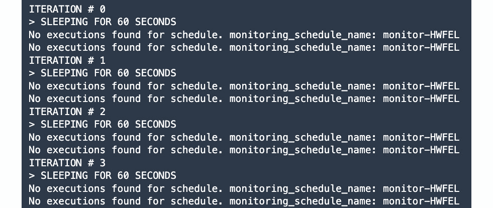

# 第八章：模型监控和管理解决方案

在*第六章*“SageMaker 训练和调试解决方案”和*第七章*“SageMaker 部署解决方案”中，我们专注于使用**SageMaker**训练和部署**机器学习**（**ML**）模型。如果你能够完成那些章节中提供的动手实践解决方案，你应该能够使用其他算法和数据集执行类似类型的实验和部署。这两章是良好的起点，尤其是在开始使用托管服务时。然而，在某个时候，你将不得不使用其其他功能来管理、故障排除和监控生产机器学习环境中的不同类型资源。

使用 SageMaker 的一个明显优势是，数据科学家和机器学习实践者通常执行的大量任务已经作为这项完全托管服务的一部分自动化。这意味着我们通常不需要构建自定义解决方案，尤其是如果 SageMaker 已经具备该功能或特性。这些功能的例子包括**SageMaker 调试器**、**SageMaker 特征存储**、**SageMaker 训练编译器**、**SageMaker 推理推荐器**、**SageMaker Clarify**、**SageMaker 处理**等等！如果我们需要使用这些功能之一或多个，我们只需要使用**boto3**以及**SageMaker Python SDK**，运行几行代码，就可以在几小时（甚至几分钟！）内获得所需的功能和结果。

在本章中，我们将专注于使用 SageMaker 的内置**模型注册表**，我们将使用它来注册和管理训练好的机器学习模型。我们还将快速演示如何将模型从模型注册表部署到机器学习推理端点。除了模型注册表，我们还将使用**SageMaker 模型监控器**，这是另一个内置功能，我们将用它来捕获和分析通过机器学习推理端点的数据。

在本章中，我们将涵盖以下主题：

+   将模型注册到 SageMaker 模型注册表

+   从 SageMaker 模型注册表部署模型

+   启用数据捕获并模拟预测

+   使用 SageMaker 模型监控器进行计划监控

+   分析捕获的数据

+   删除具有监控计划的端点

+   清理

一旦你完成了本章的动手实践解决方案，你将更容易理解、使用和配置 SageMaker 的其他内置功能。考虑到这一点，让我们开始吧！

# 技术先决条件

在我们开始之前，我们必须准备好以下内容：

+   一个网络浏览器（最好是 Chrome 或 Firefox）

+   访问本书第一章中使用的 AWS 账户和**SageMaker Studio**域名

每一章使用的 Jupyter 笔记本、源代码和其他文件都可在本书的 GitHub 仓库中找到：[`github.com/PacktPublishing/Machine-Learning-Engineering-on-AWS`](https://github.com/PacktPublishing/Machine-Learning-Engineering-on-AWS).

重要提示

建议在运行本书中的示例时，使用具有有限权限的 IAM 用户而不是根账户。我们将在*第九章*，*安全、治理和合规策略*中详细讨论这一点，以及其他安全最佳实践。如果你刚开始使用 AWS，你可以暂时使用根账户。

# 将模型注册到 SageMaker 模型注册表

在*第六章*，*SageMaker 训练和调试解决方案*中，我们使用了 `Estimator` 实例的 `deploy()` 方法，在训练模型后立即将我们的 ML 模型部署到推理端点。在进行生产环境中的 ML 实验和部署时，可能需要先分析并评估模型，然后再进行部署步骤。执行分析的个人或团队将审查输入配置参数、训练数据和用于训练模型的算法，以及其他相关的信息。一旦数据科学团队必须与多个模型一起工作，使用**模型注册表**管理和组织所有这些将变得更加容易。

什么是模型注册表？模型注册表只是一个专注于帮助数据科学家和 ML 实践者管理、组织和编目 ML 模型的仓库。在训练步骤之后，数据科学团队可以将训练好的 ML 模型存储在模型注册表中，并标记其状态为*待审查*或*待批准*。这将允许审查团队轻松地找到要审查的模型，以及与这些模型相关的历史信息和信息：


图 8.1 – 使用模型注册表

一旦审查团队完成审查过程并批准模型进行部署，模型的状态现在可以更改为*批准*，类似于前面图中所示。一旦 ML 模型的状态更改为*批准*，它可以通过手动或甚至使用**MLOps 管道**自动部署。除此之外，还可以触发其他自动化操作，如自动化报告和通知。

注意

如需了解更多关于 MLOps 管道的详细信息，请随时查看*第十章*，*在 Amazon EKS 上使用 Kubeflow 的机器学习管道*和*第十一章*，*使用 SageMaker Pipelines 的机器学习管道*。

现在你已经更好地了解了数据科学团队如何使用模型注册表来简化他们的工作，你可能已经在计划从头开始编写一个模型注册表！请稍等——SageMaker 已经为我们提供了一个！在本章接下来的几页中，我们将使用 **boto3** 库和 **SageMaker Python SDK** 来利用 SageMaker 中可用的模型注册表。

## 在 SageMaker Studio 中创建新的笔记本

我们将通过打开 SageMaker Studio 并在新的目录中创建一个新的 Jupyter Notebook 来开始本节的手动实践部分。

注意

在继续之前，请确保你已经完成了 *第一章* 中 *SageMaker 和 SageMaker Studio 入门* 部分的动手实践解决方案。请注意，本章的动手实践部分 **不是** 我们在 *第六章* *SageMaker 训练和调试解决方案* 和 *第七章* *SageMaker 部署解决方案* 中所完成内容的延续。

按照以下步骤启动 SageMaker Studio 并创建一个新的笔记本，该笔记本将用于运行本章中的 Python 脚本：

1.  在 AWS 管理控制台的搜索栏中导航到 `sagemaker studio`，并从 **功能** 下的结果列表中选择 **SageMaker Studio**。

重要提示

本章假设我们在使用服务来管理和创建不同类型的资源时使用的是 `us-west-2` 区域。你可以使用不同的区域，但请确保在需要将某些资源转移到你选择的区域时进行任何必要的调整。

1.  接下来，在侧边栏中点击 **SageMaker 域** 下的 **Studio**。

1.  点击 **启动应用**，如以下截图所示。从下拉选项中选择 **Studio**：


图 8.2 – 打开 SageMaker Studio

这将重定向你到 SageMaker Studio。等待几秒钟，直到界面加载。

1.  在 **文件浏览器** 侧边栏面板的空白区域右键单击以打开一个类似于以下内容的上下文菜单：


图 8.3 – 创建新的文件夹

选择 `CH08`。

1.  通过在侧边栏中双击相应的文件夹名称来导航到 **CH08** 目录。

1.  通过点击 **文件** 菜单并从 **新建** 子菜单下的选项列表中选择 **笔记本** 来创建一个新的笔记本：


图 8.4 – 创建新的笔记本

在前面的截图中，我们可以看到其他选项，包括创建新的 `.ipynb` 笔记本文件，这些文件将用于运行不同的代码块。

1.  在 **SageMaker 图像**（选项）下的 **数据科学**

1.  `Python 3`

1.  `无脚本`

1.  之后点击侧边栏中的 **文件浏览器** 空白区域，打开一个类似于以下内容的上下文菜单：

注意

等待内核启动。这一步可能需要大约 3 到 5 分钟，因为正在配置 ML 实例以运行 Jupyter 笔记本单元格。

1.  右键单击以下截图中突出显示的选项卡名称：


图 8.5 – 重命名笔记本

从上下文菜单中的选项中选择**重命名笔记本…**。

1.  在`01 - Registering Models to the SageMaker Model Registry.ipynb`下的**新名称**中。点击**重命名**按钮。

现在笔记本已经准备好了，我们可以继续将预训练模型注册到 SageMaker 模型注册表中！

## 使用 boto3 库将模型注册到 SageMaker 模型注册表

在本节中，我们将处理存储在`.tar.gz`文件中的两个预训练模型。我们将这些模型以`.tar.gz`文件的形式存储和注册，这些文件是通过使用 SageMaker 的内置算法**K-Nearest Neighbor**和**Linear Learner**执行两个单独的 ML 训练作业生成的。这些模型接受*x*和*y*值作为输入，并返回一个预测的*标签*值作为输出。这些*x*和*y*值代表什么？让我们看看：


图 8.6 – 预测首选疫苗接种点

如前述截图所示，这些*x*和*y*值对应于变换和缩放后的坐标值，这些坐标值表示人口中某些成员的位置，使用地图中的指定点作为参考。在第一次疫苗接种运行期间，这些成员中的几个选择了他们首选的疫苗接种点。这些疫苗接种点被标记为适当的*标签*值 – *0*、*1*和*2*。使用之前的疫苗接种点数据作为我们的训练数据，我们能够生成两个模型，这些模型可以自动预测未接种疫苗的成员的首选疫苗接种点，给定一组坐标值 – 即*x*和*y*。

按照以下步骤下载提到的两个预训练模型的工件，并在我们之前章节中准备的`01 - Registering Models to the SageMaker Model Registry.ipynb`笔记本中的 SageMaker 模型注册表中注册这些模型：

1.  我们将使用`wget`命令开始下载预训练模型工件到`tmp`目录：

    ```py
    %%bash
    ```

    ```py
    mkdir -p tmp
    ```

    ```py
    wget -O tmp/knn.model.tar.gz https://bit.ly/3yZ6qHE
    ```

    ```py
    wget -O tmp/ll.model.tar.gz https://bit.ly/3ahj1fd
    ```

在这里，我们下载了两个`.tar.gz`文件：

+   `knn.model.tar.gz`：此文件包含预训练的**K-Nearest Neighbor**模型的模型工件

+   `ll.model.tar.gz`：此文件包含预训练的**Linear Learner**模型的模型工件

1.  指定一个唯一的 S3 存储桶名称和前缀。确保在运行以下代码块之前，将`<INSERT S3 BUCKET HERE>`的值替换为一个唯一的 S3 存储桶名称：

    ```py
    s3_bucket = "<INSERT S3 BUCKET HERE>"
    ```

    ```py
    prefix = "chapter08"
    ```

确保你指定一个尚不存在的 S3 存储桶的桶名。如果你想重用之前章节中创建的其中一个存储桶，你可以这样做，但请确保使用与**SageMaker Studio**设置和配置相同的区域的 S3 存储桶。

1.  让我们创建一个 S3 存储桶，我们将上传之前下载的`ll.model.tar.gz`和`knn.model.tar.gz`文件：

    ```py
    !aws s3 mb s3://{s3_bucket}
    ```

如果你计划重用之前章节中创建的现有 S3 存储桶，则可以跳过此步骤。

1.  现在我们已经准备好了 S3 存储桶，让我们准备 S3 路径，以便它们指向我们将上传预训练模型工件的位置：

    ```py
    ll_model_data = \
    ```

    ```py
    f's3://{s3_bucket}/{prefix}/models/ll.model.tar.gz'
    ```

    ```py
    knn_model_data = \
    ```

    ```py
    f's3://{s3_bucket}/{prefix}/models/knn.model.tar.gz'
    ```

注意，在此阶段，存储在`ll_model_data`和`knn_model_data`变量中的指定 S3 路径中尚不存在`ll.model.tar.gz`和`knn.model.tar.gz`文件。在这里，我们只是在准备`.tar.gz`文件将要上传的 S3 位置路径（字符串）。

1.  现在，让我们使用`aws s3 cp`命令来复制和上传`.tar.gz`文件到它们对应的 S3 位置：

    ```py
    !aws s3 cp tmp/ll.model.tar.gz {ll_model_data}
    ```

    ```py
    !aws s3 cp tmp/knn.model.tar.gz {knn_model_data}
    ```

这将把`ll.model.tar.gz`和`knn.model.tar.gz`文件从`tmp`目录上传到 S3 存储桶。

1.  预训练模型工件已存放在 S3 中，让我们继续获取用于训练这些模型的 ML 算法的 ECR 容器镜像 URI。我们将使用`retrieve()`函数获取**线性学习器**和**K-最近邻**算法的镜像 URI：

    ```py
    from sagemaker.image_uris import retrieve
    ```

    ```py
    ll_image_uri = retrieve(
    ```

    ```py
        "linear-learner", 
    ```

    ```py
        region="us-west-2", 
    ```

    ```py
        version="1"
    ```

    ```py
    )
    ```

    ```py
    knn_image_uri = retrieve(
    ```

    ```py
        "knn", 
    ```

    ```py
        region="us-west-2", 
    ```

    ```py
        version="1"
    ```

    ```py
    )
    ```

1.  初始化 SageMaker 的`boto3`客户端。我们将使用此客户端调用几个 SageMaker API，这将帮助我们创建模型包和模型包组：

    ```py
    import boto3
    ```

    ```py
    client = boto3.client(service_name="sagemaker")
    ```

1.  接下来，定义`generate_random_string()`函数：

    ```py
    import string 
    ```

    ```py
    import random
    ```

    ```py
    def generate_random_string():
    ```

    ```py
        return ''.join(
    ```

    ```py
            random.sample(
    ```

    ```py
            string.ascii_uppercase,12)
    ```

    ```py
        )
    ```

*这是为了什么？* 我们将在创建新资源（在后续步骤中）时使用`generate_random_string()`函数。这将帮助我们为我们将要创建的每个资源生成一个随机的标识符或标签。

1.  随着`generate_random_string()`函数就绪，让我们生成一个随机的`group_id`值。这将用于生成一个*包组名称*（`package_group_name`）和一个*包组描述*（`package_group_desc`）。然后，我们将使用 boto3 客户端的`create_model_package_group()`方法创建*模型包组*：

    ```py
    group_id = generate_random_string()
    ```

    ```py
    package_group_name = f"group-{group_id}"
    ```

    ```py
    package_group_desc = f"Model package group {group_id}"
    ```

    ```py
    response = client.create_model_package_group(
    ```

    ```py
        ModelPackageGroupName=package_group_name,
    ```

    ```py
        ModelPackageGroupDescription=package_group_desc
    ```

    ```py
    )
    ```

    ```py
    package_group_arn = response['ModelPackageGroupArn']
    ```

    ```py
    package_group_arn
    ```

1.  接下来，让我们定义`prepare_inference_specs()`函数，我们将使用它来配置和设置我们的模型包，在下一步中：

    ```py
    def prepare_inference_specs(image_uri, model_data):
    ```

    ```py
        return {
    ```

    ```py
            "Containers": [
    ```

    ```py
                {
    ```

    ```py
                    "Image": image_uri,
    ```

    ```py
                    "ModelDataUrl": model_data
    ```

    ```py
                }
    ```

    ```py
            ],
    ```

    ```py
            "SupportedContentTypes": [ 
    ```

    ```py
                "text/csv" 
    ```

    ```py
            ],
    ```

    ```py
            "SupportedResponseMIMETypes": [ 
    ```

    ```py
                "application/json" 
    ```

    ```py
            ],
    ```

    ```py
        }
    ```

在这里，我们创建了一个函数，该函数使用*ECR 容器镜像 URI*和*模型工件 S3 路径*作为输入参数，准备并返回必要的嵌套配置结构。

1.  接下来，让我们定义一个名为`create_model_package()`的自定义函数。此函数接受多个输入参数值，如下所示：

    +   模型包组的**Amazon 资源名称**（**ARN**）

    +   *这是为了什么？* 我们将在创建新资源（在后续步骤中）时使用`generate_random_string()`函数。这将帮助我们为我们将要创建的每个资源生成一个随机的标识符或标签。

    +   （可选）SageMaker 的`boto3`客户端：

        ```py
        def create_model_package(
        ```

        ```py
                package_group_arn, 
        ```

        ```py
                inference_specs, 
        ```

        ```py
                client=client):
        ```

        ```py
            input_dict = {
        ```

        ```py
                "ModelPackageGroupName" : package_group_arn,
        ```

        ```py
                "ModelPackageDescription" : "Description",
        ```

        ```py
                "ModelApprovalStatus" : "Approved",
        ```

        ```py
                "InferenceSpecification" : inference_specs
        ```

        ```py
            }
        ```

        ```py
            response = client.create_model_package(
        ```

        ```py
                **input_dict
        ```

        ```py
            )
        ```

        ```py
            return response["ModelPackageArn"]
        ```

在创建模型包时，我们自动将 `ModelApprovalStatus` 的值设置为“已批准”。请注意，我们可以在将其转换为“已批准”之前先将其设置为“待手动批准”。然而，我们将简化一些事情，直接将值设置为“已批准”。

注意

模型的批准状态可以用来标记和识别哪些模型已准备好部署到生产端点。理想情况下，ML 模型在部署之前先进行评估和手动批准。如果模型通过了评估步骤，我们可以将批准状态设置为“已批准”。否则，我们将状态设置为“已拒绝”。

1.  使用 `prepare_inference_specs()` 函数为 **K-Nearest Neighbor** 和 **Linear Learner** 模型包准备必要的推理规范配置：

    ```py
    knn_inference_specs = prepare_inference_specs(
    ```

    ```py
        image_uri=knn_image_uri,
    ```

    ```py
        model_data=knn_model_data
    ```

    ```py
    )
    ```

    ```py
    ll_inference_specs = prepare_inference_specs(
    ```

    ```py
        image_uri=ll_image_uri,
    ```

    ```py
        model_data=ll_model_data
    ```

    ```py
    )
    ```

1.  推理规范配置就绪后，让我们使用 `create_model_package()` 来创建模型包：

    ```py
    knn_package_arn = create_model_package(
    ```

    ```py
        package_group_arn=package_group_arn,
    ```

    ```py
        inference_specs=knn_inference_specs
    ```

    ```py
    )
    ```

    ```py
    ll_package_arn = create_model_package(
    ```

    ```py
        package_group_arn=package_group_arn,
    ```

    ```py
        inference_specs=ll_inference_specs
    ```

    ```py
    )
    ```

1.  最后，让我们使用 IPython 的 `%store` 魔法来存储 `knn_package_arn`、`ll_package_arn`、`s3_bucket` 和 `prefix` 的变量值：

    ```py
    %store knn_package_arn
    ```

    ```py
    %store ll_package_arn
    ```

    ```py
    %store s3_bucket
    ```

    ```py
    %store prefix
    ```

我们将在本章后续部分使用这些存储的变量值。

到目前为止，已经创建了两个模型包，并准备好使用。

注意

您可以使用 `client.list_model_package_groups()` 和 `client.list_model_packages(ModelPackageGroupName='<INSERT GROUP NAME>')` 来检查已注册的模型包组和模型包列表。我们将把这个留给你作为练习！

# 从 SageMaker 模型注册表中部署模型

在 ML 模型已注册到模型注册表之后，有许多可能的后续步骤。在本节中，我们将重点关注手动将第一个注册的 ML 模型（预训练的 **K-Nearest Neighbor** 模型）部署到新的推理端点。在第一个注册的 ML 模型部署后，我们将继续在第一个 ML 模型已部署的相同端点部署第二个注册的模型（预训练的 **Linear Learner** 模型），类似于以下图中所示：


图 8.7 – 从模型注册表中部署模型

在这里，我们可以看到我们可以直接替换运行中的 ML 推理端点内的已部署 ML 模型，而无需创建一个新的单独的推理端点。这意味着我们不需要担心更改我们设置中的“目标基础设施服务器”，因为模型替换操作是在幕后进行的。同时，SageMaker 已经为我们自动化了这个过程，所以我们只需要调用正确的 API 来启动这个过程。

在这里，我们将继续在 *将模型注册到 SageMaker 模型注册表* 部分留下的工作，并将两个注册的模型部署到 ML 推理端点。也就是说，我们将执行以下步骤：

1.  通过点击**文件**菜单并从**新建**子菜单下的选项列表中选择**笔记本**来创建一个新的笔记本。

注意

注意，我们将在与上一节中使用的`01 - Registering Models to the SageMaker Model Registry.ipynb`笔记本文件相邻的`CH08`目录内创建新的笔记本。

1.  在**SageMaker 图像**下的**数据科学**（选项）

1.  `Python 3`

1.  `无脚本`

点击**选择**按钮。

1.  右键单击新笔记本标签页的名称，在**新名称**下选择**SageMaker 图像**下的**数据科学**选项。点击**重命名**按钮。

1.  现在我们已经准备好了新的笔记本，让我们继续通过使用 IPython 的`%store`魔法来加载存储变量`knn_package_arn`和`ll_package_arn`的值：

    ```py
    %store -r knn_package_arn
    ```

    ```py
    %store -r ll_package_arn
    ```

1.  让我们使用以下代码块初始化一个`ModelPackage`实例：

    ```py
    import sagemaker
    ```

    ```py
    from sagemaker import get_execution_role
    ```

    ```py
    from sagemaker import ModelPackage
    ```

    ```py
    from sagemaker.predictor import Predictor
    ```

    ```py
    session = sagemaker.Session()
    ```

    ```py
    role = get_execution_role()
    ```

    ```py
    model = ModelPackage(
    ```

    ```py
        role=role,
    ```

    ```py
        model_package_arn=knn_package_arn,
    ```

    ```py
        sagemaker_session=session
    ```

    ```py
    )
    ```

    ```py
    model.predictor_cls = Predictor
    ```

在这里，我们初始化`ModelPackage`实例时传递了*IAM 执行角色*、*K-Nearest Neighbor 模型包 ARN*和`Session`实例。

1.  现在我们已经初始化了`ModelPackage`实例，我们将调用它的`deploy()`方法将预训练模型部署到实时推理端点：

    ```py
    from sagemaker.serializers import JSONSerializer
    ```

    ```py
    from sagemaker.deserializers import JSONDeserializer
    ```

    ```py
    predictor = model.deploy(
    ```

    ```py
        instance_type='ml.m5.xlarge', 
    ```

    ```py
        initial_instance_count=1,
    ```

    ```py
        serializer=JSONSerializer(),
    ```

    ```py
        deserializer=JSONDeserializer()
    ```

    ```py
    )
    ```

由于我们在上一步中将`predictor_class`属性设置为`Predictor`，因此`deploy()`方法将返回一个`Predictor`实例而不是`None`。

注意

模型部署应大约需要 5 到 10 分钟才能完成。您可以随意拿一杯咖啡或茶！

1.  一旦我们的 ML 推理端点准备就绪，我们将使用`Predictor`实例的`predict()`方法执行一个样本预测来测试我们的设置：

    ```py
    payload = {
    ```

    ```py
        'instances': [
    ```

    ```py
            {
    ```

    ```py
              "features": [ 1.5, 2 ]
    ```

    ```py
            },
    ```

    ```py
        ]
    ```

    ```py
    }
    ```

    ```py
    predictor.predict(data=payload)
    ```

这应该产生一个等于或类似`{'predictions': [{'predicted_label': 2.0}]}`的输出值。

1.  接下来，让我们定义`process_prediction_result()`函数：

    ```py
    def process_prediction_result(raw_result):
    ```

    ```py
        first = raw_result['predictions'][0]
    ```

    ```py
        return first['predicted_label']
    ```

这将从`Predictor`实例的`predict()`方法返回的嵌套结构中提取`label`值。当然，函数中的代码假设我们在调用`predict()`方法时每次只传递一个有效负载。

1.  让我们定义一个自定义的`predict()`函数，该函数接受输入`x`和`y`值，以及可选的`Predictor`实例参数值：

    ```py
    def predict(x, y, predictor=predictor):
    ```

    ```py
        payload = {
    ```

    ```py
            'instances': [
    ```

    ```py
                {
    ```

    ```py
                  "features": [ x, y ]
    ```

    ```py
                },
    ```

    ```py
            ]
    ```

    ```py
        }
    ```

    ```py
        raw_result = predictor.predict(
    ```

    ```py
            data=payload
    ```

    ```py
        )
    ```

    ```py
        return process_prediction_result(raw_result)
    ```

1.  让我们使用一组`x`和`y`的样本值来测试我们的自定义`predict()`函数：

    ```py
    predict(x=3, y=4)
    ```

这应该返回一个预测的`label`值等于或类似`1.0`。*我们如何解释这个结果？*居住在由指定的输入`x`和`y`值表示的位置的客户可能会去标记为`1`（即第二个疫苗接种点）的疫苗接种点。

注意

您可以修改`process_prediction_result()`函数，将结果预测`label`值的类型转换为*整数*而不是*浮点数*。

1.  接下来，让我们定义`test_different_values()`函数：

    ```py
    from time import sleep
    ```

    ```py
    def test_different_values(predictor=predictor):
    ```

    ```py
        for x in range(-3, 3+1):
    ```

    ```py
            for y in range(-3, 3+1):
    ```

    ```py
                label = predict(
    ```

    ```py
                            x=x, 
    ```

    ```py
                            y=y, 
    ```

    ```py
                            predictor=predictor
    ```

    ```py
                        )
    ```

    ```py
                print(f"x={x}, y={y}, label={label}")
    ```

    ```py
                sleep(0.2)
    ```

这里，我们只是多次调用我们的自定义 `predict()` 函数（每次预测请求之间有 200 毫秒的延迟）使用 *x* 和 *y* 的不同值组合。

1.  在进行下一步之前，让我们检查我们的 `test_different_values()` 函数是否按预期工作：

    ```py
    test_different_values()
    ```

这应该会显示给定 *x* 和 *y* 的不同组合的预测 `label` 值。

1.  接下来，让我们定义一个自定义的 `create_model()` 函数，该函数使用 boto3 客户端的 `create_model()` 方法与 SageMaker API 一起工作：

    ```py
    import boto3
    ```

    ```py
    client = boto3.client(service_name="sagemaker")
    ```

    ```py
    def create_model(model_package_arn, 
    ```

    ```py
                     model_name, 
    ```

    ```py
                     role=role, 
    ```

    ```py
                     client=client):
    ```

    ```py
        container_list = [
    ```

    ```py
            {'ModelPackageName': model_package_arn}
    ```

    ```py
        ]
    ```

    ```py
        response = client.create_model(
    ```

    ```py
            ModelName = model_name,
    ```

    ```py
            ExecutionRoleArn = role,
    ```

    ```py
            Containers = container_list
    ```

    ```py
        )
    ```

    ```py
        return response["ModelArn"]
    ```

1.  让我们定义 `generate_random_string()` 函数，我们将使用它来生成一个随机的模型名称。之后，我们将调用之前步骤中定义的自定义 `create_model()` 函数，传递我们 **Linear Learner** 模型的模型包 ARN 以及生成的模型名称：

    ```py
    import string 
    ```

    ```py
    import random
    ```

    ```py
    def generate_random_string():
    ```

    ```py
        return ''.join(
    ```

    ```py
            random.sample(
    ```

    ```py
            string.ascii_uppercase,12)
    ```

    ```py
        )
    ```

    ```py
    model_name = f"ll-{generate_random_string()}"
    ```

    ```py
    model_arn = create_model(
    ```

    ```py
        model_package_arn=ll_package_arn,
    ```

    ```py
        model_name=model_name
    ```

    ```py
    )
    ```

1.  接下来，让我们定义 `create_endpoint_config()` 函数：

    ```py
    def create_endpoint_config(
    ```

    ```py
            model_name, 
    ```

    ```py
            config_name, 
    ```

    ```py
            client=client):
    ```

    ```py
        response = client.create_endpoint_config(
    ```

    ```py
            EndpointConfigName = config_name,
    ```

    ```py
            ProductionVariants=[{
    ```

    ```py
                'InstanceType': "ml.m5.xlarge",
    ```

    ```py
                'InitialInstanceCount': 1,
    ```

    ```py
                'InitialVariantWeight': 1,
    ```

    ```py
                'ModelName': model_name,
    ```

    ```py
                'VariantName': 'AllTraffic'
    ```

    ```py
            }]
    ```

    ```py
        )
    ```

    ```py
        return response["EndpointConfigArn"]
    ```

此函数简单地使用 boto3 客户端的 `create_endpoint_config()` 方法为 SageMaker 准备所需的端点配置。

1.  使用我们在上一步中定义的 `create_endpoint_config()` 函数，让我们创建一个 SageMaker ML 推理端点配置：

    ```py
    config_name = f"config-{generate_random_string()}"
    ```

    ```py
    config_arn = create_endpoint_config(
    ```

    ```py
        model_name=model_name,
    ```

    ```py
        config_name=config_name
    ```

    ```py
    )
    ```

1.  现在，让我们使用 `update_endpoint()` 方法更新端点配置：

    ```py
    response = client.update_endpoint(
    ```

    ```py
        EndpointName=predictor.endpoint_name,
    ```

    ```py
        EndpointConfigName=config_name
    ```

    ```py
    )
    ```

在这里，我们使用了之前步骤中创建的端点配置。

重要提示

*这里会发生什么？* 一旦我们调用 `update_endpoint()` 方法，SageMaker 将在幕后执行所需的步骤来更新端点，并用最新端点配置中指定的模型（**K-Nearest Neighbor**）替换旧的已部署模型（**Linear Learner**）。请注意，这只是我们可以使用 **SageMaker Python SDK** 和 **boto3** 库实现的可能解决方案之一。其他可能的部署解决方案包括 **多模型端点**、**A/B 测试**端点设置、使用 **推理管道模型** 的端点等等！我们不会深入探讨这些其他变体和解决方案，所以请随意查看书中 *Machine Learning with Amazon SageMaker Cookbook* 中找到的部署食谱。

1.  在进行下一组步骤之前，让我们使用以下代码块等待 5 分钟：

    ```py
    print('Wait for update operation to complete')
    ```

    ```py
    sleep(60*5)
    ```

这里，我们使用了 `sleep()` 函数，它接受一个等于我们希望代码等待或休眠的秒数的输入值。

注意

我们使用 `sleep()` 函数等待 5 分钟以确保更新端点操作已经完成（假设它需要大约 5 分钟或更少的时间来完成）。

1.  初始化一个 `Predictor` 对象并将其附加到本节之前准备好的现有 ML 推理端点：

    ```py
    predictor = Predictor(
    ```

    ```py
        endpoint_name=predictor.endpoint_name,
    ```

    ```py
        sagemaker_session=session,
    ```

    ```py
        serializer=JSONSerializer(),
    ```

    ```py
        deserializer=JSONDeserializer()
    ```

    ```py
    )
    ```

1.  让我们通过使用样本有效载荷进行预测来测试我们的设置：

    ```py
    payload = {
    ```

    ```py
        'instances': [
    ```

    ```py
            {
    ```

    ```py
              "features": [ 1.5, 2 ]
    ```

    ```py
            },
    ```

    ```py
        ]
    ```

    ```py
    }
    ```

    ```py
    predictor.predict(data=payload)
    ```

这应该会输出一个类似 `{'predictions': [{'score': [0.04544410854578018, 0.3947080075740814, 0.5598478317260742], 'predicted_label': 2}]}` 结构的输出值。

*我们如何解释这个结果？* 位于指定输入`x`和`y`值所代表的位置的客户（即，*x* = `1.5`和*y* = `2`）有以下概率：

+   `4.5%` 前往第一个疫苗接种点的概率（标签 = 0）

+   `39.5%` 前往第二个疫苗接种点的概率（标签 = 1）

+   `56%` 前往第三个疫苗接种点的概率（标签 = 2）

由于第三个疫苗接种点的概率值最高，模型将`predicted_label`值设置为`2`（假设计数从 0 开始）。

注意

注意，部署的**线性学习器**模型返回了每个类的**概率分数**以及**预测标签**，而我们在本节开头部署的**k 最近邻**模型仅返回了**预测标签**。当我们用来自不同实例家族（可能需要使用不同的推理算法容器镜像）的模型替换已部署的模型时，我们需要小心，因为新模型可能涉及不同的输入和输出结构和值。

1.  与我们在之前对托管我们的**K-最近邻**模型的机器学习推理端点所执行的操作类似，我们将使用不同的*x*和*y*值进行多次样本预测：

    ```py
    test_different_values(predictor=predictor)
    ```

1.  使用`%store`魔法将`endpoint_name`变量的值存储起来：

    ```py
    endpoint_name = predictor.endpoint_name
    ```

    ```py
    %store endpoint_name
    ```

如果你在想为什么我们还没有删除机器学习推理端点……我们将重用此端点，并在下一节中演示如何使用 SageMaker 的模型监控功能和特性！

# 启用数据捕获并模拟预测

机器学习模型部署到推理端点后，其质量需要被监控和检查，以便我们可以在检测到质量问题时或偏差时轻松采取纠正措施。这类似于 Web 应用程序开发，即使质量保证团队已经花费了数天（或数周）测试应用程序的最终版本，仍然可能存在其他问题，这些问题只有在 Web 应用程序运行后才会被发现：


图 8.8 – 捕获机器学习推理端点的请求和响应数据

如前图所示，模型监控从捕获请求和响应数据开始，这些数据通过正在运行的机器学习推理端点。这些收集到的数据在后续步骤中通过一个单独的自动化任务或作业进行处理和分析，该任务或作业可以生成报告并标记问题或异常。如果我们将在自定义构建的 Web 应用程序端点部署我们的机器学习模型，我们可能需要自己构建此数据捕获和模型监控设置。然而，如果我们使用 SageMaker，我们无需从头编写任何代码，因为我们只需利用内置的模型监控功能，只需启用和配置即可。

注意

在我们的“首选疫苗接种点预测”示例中，捕获的数据（理想情况下）包括输入（*x*和*y*值）和输出值（预测的*标签*值）。

按照以下步骤启用运行中的机器学习推理端点的数据捕获，并使用随机生成的有效载荷值模拟推理请求：

1.  通过点击**文件**菜单并从**新**子菜单下的选项列表中选择**笔记本**来创建一个新的笔记本。

注意

注意，我们将在`CH08`目录内创建新的笔记本，该目录位于我们之前章节中使用的`01 - Registering Models to the SageMaker Model Registry.ipynb`和`02 - Deploying Models from the SageMaker Model Registry.ipynb`笔记本文件旁边。

1.  在`数据科学`（在**SageMaker 镜像**下找到的选项）

1.  `Python 3`

1.  `无脚本`

之后点击**选择**按钮。

1.  右键单击新笔记本标签页的名称，在**新名称**下选择**03 - Enabling Data Capture and Simulating Predictions.ipynb**。点击**重命名**按钮。

1.  现在我们已经准备好了新的笔记本，让我们使用 IPython 的`%store`魔法来加载存储变量`s3_bucket`、`prefix`、`ll_package_arn`和`endpoint_name`的值：

    ```py
    %store -r s3_bucket
    ```

    ```py
    %store -r prefix
    ```

    ```py
    %store -r ll_package_arn
    ```

    ```py
    %store -r endpoint_name
    ```

1.  初始化一个`Predictor`对象并将其附加到本章*从 SageMaker 模型注册表中部署模型*部分中准备的机器学习推理端点：

    ```py
    import sagemaker
    ```

    ```py
    from sagemaker import get_execution_role
    ```

    ```py
    from sagemaker.predictor import Predictor
    ```

    ```py
    from sagemaker.serializers import CSVSerializer
    ```

    ```py
    from sagemaker.deserializers import CSVDeserializer
    ```

    ```py
    session = sagemaker.Session()
    ```

    ```py
    role = get_execution_role()
    ```

    ```py
    predictor = Predictor(
    ```

    ```py
        endpoint_name=endpoint_name,
    ```

    ```py
        sagemaker_session=session,
    ```

    ```py
        role=role,
    ```

    ```py
        serializer=CSVSerializer(),
    ```

    ```py
        deserializer=CSVDeserializer()
    ```

    ```py
    )
    ```

1.  接下来，让我们使用以下代码块准备和初始化`DataCaptureConfig`实例：

    ```py
    from sagemaker.model_monitor import DataCaptureConfig
    ```

    ```py
    base = f"s3://{s3_bucket}/{prefix}"
    ```

    ```py
    capture_upload_path = f"{base}/data-capture"
    ```

    ```py
    capture_config_dict = {
    ```

    ```py
        'enable_capture': True,
    ```

    ```py
        'sampling_percentage': 100,
    ```

    ```py
        'destination_s3_uri': capture_upload_path,
    ```

    ```py
        'kms_key_id': None,
    ```

    ```py
        'capture_options': ["REQUEST", "RESPONSE"],
    ```

    ```py
        'csv_content_types': ["text/csv"],
    ```

    ```py
        'json_content_types': ["application/json"]
    ```

    ```py
    }
    ```

    ```py
    data_capture_config = DataCaptureConfig(
    ```

    ```py
        **capture_config_dict
    ```

    ```py
    )
    ```

在这里，我们指定了`sampling_percentage`值为`100`，这意味着将捕获所有数据。我们还通过`capture_options`配置值指定，我们计划捕获通过机器学习推理端点传递的请求和响应数据。

1.  现在我们已经准备好了配置，让我们调用`Predictor`实例的`update_data_capture_config()`方法：

    ```py
    %%time
    ```

    ```py
    predictor.update_data_capture_config(
    ```

    ```py
        data_capture_config=data_capture_config
    ```

    ```py
    )
    ```

注意

这应该需要大约 5 到 15 分钟才能完成。请随意拿一杯咖啡或茶！

1.  使用`%store`魔法存储`capture_upload_path`变量的值：

    ```py
    %store capture_upload_path
    ```

1.  定义`generate_random_payload()`函数：

    ```py
    import random
    ```

    ```py
    def generate_random_payload():
    ```

    ```py
        x = random.randint(-5,5)
    ```

    ```py
        y = random.randint(-5,5)
    ```

    ```py
        return f"{x},{y}"
    ```

1.  定义`perform_good_input()`和`perform_bad_input()`函数：

    ```py
    def perform_good_input(predictor):
    ```

    ```py
        print("> PERFORM REQUEST WITH GOOD INPUT")
    ```

    ```py
        payload = generate_random_payload()
    ```

    ```py
        result = predictor.predict(data=payload)
    ```

    ```py
        print(result)
    ```

    ```py
    def perform_bad_input(predictor):
    ```

    ```py
        print("> PERFORM REQUEST WITH BAD INPUT")
    ```

    ```py
        payload = generate_random_payload() + ".50"
    ```

    ```py
        result = predictor.predict(data=payload)
    ```

    ```py
        print(result)
    ```

重要注意

到目前为止，你可能想知道为什么我们考虑将*y*输入有效载荷的浮点值视为*不良输入*。请注意，这只是为了演示目的，因为我们计划在配置*使用 SageMaker Model Monitor 进行计划监控*部分中的约束时，将*x*和*y*的浮点输入值标记为无效值。

1.  使用`perform_good_input()`函数运行包含“有效值：”的样本推理请求

    ```py
    perform_good_input(predictor)
    ```

1.  使用`perform_bad_input()`函数运行包含“无效值：”的样本推理请求

    ```py
    perform_bad_input(predictor)
    ```

1.  定义`generate_sample_requests()`函数，该函数将在`perform_good_input()`和`perform_bad_input()`函数之间交替调用：

    ```py
    from time import sleep
    ```

    ```py
    def generate_sample_requests(predictor):
    ```

    ```py
        for i in range(0, 2 * 240):
    ```

    ```py
            print(f"ITERATION # {i}")
    ```

    ```py
            perform_good_input(predictor)
    ```

    ```py
            perform_bad_input(predictor)
    ```

    ```py
            print("> SLEEPING FOR 30 SECONDS")
    ```

    ```py
            sleep(30)
    ```

1.  一切准备就绪后，让我们使用 `generate_sample_requests()` 函数连续发送样本请求到我们的机器学习推理端点：

    ```py
    generate_sample_requests(predictor)
    ```

重要提示

注意，本节最后一步将每 30 秒连续发送样本推理请求，并循环 480 次。我们将保持此操作并继续下一节。我们应在完成本章的“使用 SageMaker Model Monitor 的计划监控”部分后，才停止执行 `generate_sample_requests()` 函数。

在这一点上，你可能想知道数据存储在哪里以及这些数据将如何用于分析。在接下来的几节中，我们将回答这些问题，并提供更多关于 SageMaker 中模型监控工作原理的详细信息。

# 使用 SageMaker Model Monitor 进行计划监控

如果你已经在数据科学和机器学习行业工作了一段时间，你可能知道部署后的机器学习模型性能并不保证。生产环境中的部署模型必须实时（或接近实时）监控，以便我们可以在检测到任何**漂移**或与预期值集合的偏差后，替换已部署的模型并修复任何问题：


图 8.9 – 使用 Model Monitor 分析捕获的数据并检测违规情况

在前面的图中，我们可以看到我们可以通过监控（处理）作业来处理和分析捕获的数据。这个作业预计将生成一个自动报告，可用于分析已部署的模型和数据。同时，任何检测到的违规情况都会被标记并作为报告的一部分进行报告。

注意

假设我们已经训练了一个机器学习模型，该模型根据专业人士的*年龄*、*工作年限*、*角色*和*子女数量*预测专业人士的*薪水*。一旦机器学习模型部署到推理端点，各种应用程序就会将请求数据发送到机器学习推理端点以获取预测的薪水值。*如果其中一个应用程序开始发送错误值怎么办？* 例如，输入负载中指定的*子女数量*为负数。鉴于这个字段不可能有负数，监控作业应将此违规情况标记为**数据质量问题**。

在本节中，我们将配置 **SageMaker Model Monitor** 以使用计划每小时的处理作业分析捕获的数据。一旦处理作业的结果准备好，我们将看到监控作业已经标记了由于在上一节中将“不良输入”作为有效负载的一部分发送到机器学习推理端点而引起的违规。Model Monitor 可以配置为检测关于 **数据质量**、**模型质量**、**偏差漂移** 和 **特征归因漂移** 的违规。在本节的动手实践中，我们只会关注检测关于数据质量的违规。然而，检测其他类型的漂移和违规应遵循类似的步骤，这些步骤将在稍后介绍。

按照以下步骤配置 **SageMaker Model Monitor** 以每小时运行一次监控作业并分析通过机器学习推理端点传递的捕获数据：

1.  通过点击 **文件** 菜单并从 **新建** 子菜单下的选项列表中选择 **笔记本** 来创建一个新的笔记本。

注意

注意，我们将在这个章节的上一节中创建的其他笔记本文件旁边的 `CH08` 目录中创建新的笔记本。

1.  在 `数据科学`（在 **SageMaker 图像** 下找到的选项）

1.  `Python 3`

1.  `无脚本`

点击 **选择** 按钮。

1.  右键单击新笔记本标签页的名称，在 **新建名称** 下选择 **04 - 使用 SageMaker Model Monitor 进行计划监控.ipynb**。之后点击 **重命名** 按钮。

1.  现在我们已经准备好了新的笔记本，让我们使用 IPython 的 `%store` 魔法命令来加载存储变量 `s3_bucket`、`prefix`、`ll_package_arn`、`endpoint_name` 和 `ll_package_arn` 的值：

    ```py
    %store -r s3_bucket
    ```

    ```py
    %store -r prefix
    ```

    ```py
    %store -r ll_package_arn
    ```

    ```py
    %store -r endpoint_name
    ```

    ```py
    %store -r ll_package_arn
    ```

1.  初始化一个 `Predictor` 对象并将其附加到我们在 *从 SageMaker Model Registry 部署模型* 部分部署的机器学习推理端点：

    ```py
    import sagemaker
    ```

    ```py
    from sagemaker import get_execution_role
    ```

    ```py
    from sagemaker.predictor import Predictor
    ```

    ```py
    session = sagemaker.Session()
    ```

    ```py
    role = get_execution_role()
    ```

    ```py
    predictor = Predictor(
    ```

    ```py
        endpoint_name=endpoint_name,
    ```

    ```py
        sagemaker_session=session,
    ```

    ```py
        role=role
    ```

    ```py
    )
    ```

1.  使用 `wget` 命令下载 `baseline.csv` 文件：

    ```py
    %%bash
    ```

    ```py
    mkdir -p tmp
    ```

    ```py
    wget -O tmp/baseline.csv https://bit.ly/3td5vjx
    ```

注意

`baseline.csv` 文件是做什么用的？此 CSV 文件将作为后续使用的 **基线数据集**，供 **SageMaker Model Monitor** 作为检查捕获数据漂移和问题的“参考”。

1.  让我们也准备 S3 路径位置，我们将在此处存储基线分析输出文件：

    ```py
    base = f's3://{s3_bucket}/{prefix}'
    ```

    ```py
    baseline_source_uri = f'{base}/baseline.csv'
    ```

    ```py
    baseline_output_uri = f"{base}/baseline-output"
    ```

1.  使用 `aws s3 cp` 命令将 `baseline.csv` 文件从 `tmp` 目录上传到存储在 `baseline_source_uri` 中的 S3 目标位置：

    ```py
    !aws s3 cp tmp/baseline.csv {baseline_source_uri}
    ```

1.  使用以下代码块初始化和配置 `DefaultModelMonitor` 实例：

    ```py
    from sagemaker.model_monitor import DefaultModelMonitor
    ```

    ```py
    monitor_dict = {
    ```

    ```py
        'role': role,
    ```

    ```py
        'instance_count': 1,
    ```

    ```py
        'instance_type': 'ml.m5.large',
    ```

    ```py
        'volume_size_in_gb': 10,
    ```

    ```py
        'max_runtime_in_seconds': 1800,
    ```

    ```py
    }
    ```

    ```py
    default_monitor = DefaultModelMonitor(
    ```

    ```py
        **monitor_dict
    ```

    ```py
    )
    ```

在这里，我们配置了 `ml.m5.large` 实例来处理捕获的数据。

注意

为了监控部署的机器学习模型和通过推理端点传递的数据，`monitor_dict` 对应于 SageMaker Processing 作业的配置，用于监控机器学习模型和数据。

1.  使用以下代码块运行基线作业：

    ```py
    %%time
    ```

    ```py
    from sagemaker.model_monitor import dataset_format
    ```

    ```py
    dataset_format = dataset_format.DatasetFormat.csv(
    ```

    ```py
        header=True
    ```

    ```py
    )
    ```

    ```py
    baseline_dict = {
    ```

    ```py
        'baseline_dataset': baseline_source_uri,
    ```

    ```py
        'dataset_format': dataset_format,
    ```

    ```py
        'output_s3_uri': baseline_output_uri,
    ```

    ```py
        'wait': True
    ```

    ```py
    }
    ```

    ```py
    default_monitor.suggest_baseline(
    ```

    ```py
        **baseline_dict
    ```

    ```py
    )
    ```

在这里，我们使用 `baseline.csv` 文件作为参考，以了解将通过 ML 推理端点传递的数据的预期属性。假设 `baseline.csv` 文件中的一个列只包含正整数。使用这个 CSV 文件作为基线，我们可以配置 **SageMaker Model Monitor** 来标记（对于该列或特征）负数或浮点输入值作为“坏输入。”

注意

当然，检测违规和问题是故事的一半。解决问题将是另一半。

1.  定义一个自定义的 `flatten()` 函数，这将帮助我们检查和查看 DataFrame 中的字典对象：

    ```py
    import pandas as pd
    ```

    ```py
    def flatten(input_dict):
    ```

    ```py
        df = pd.json_normalize(input_dict)
    ```

    ```py
        return df.head()
    ```

1.  让我们检查基线作业生成的统计报告：

    ```py
    baseline_job = default_monitor.latest_baselining_job
    ```

    ```py
    stats = baseline_job.baseline_statistics()
    ```

    ```py
    schema_dict = stats.body_dict["features"]
    ```

    ```py
    flatten(schema_dict)
    ```

这应该会产生一个类似于以下 DataFrame：


图 8.10 – 包含基线统计的 DataFrame

在这里，我们可以看到 `baseline.csv` 文件中每一列的 `inferred_type` 值，以及其他统计值。

1.  接下来，让我们回顾基线作业准备的推荐约束：

    ```py
    constraints = baseline_job.suggested_constraints()
    ```

    ```py
    constraints_dict = constraints.body_dict["features"]
    ```

    ```py
    flatten(constraints_dict)
    ```

这应该会给我们一个类似于以下值的 DataFrame：


图 8.11 – 包含每个特征建议约束的 DataFrame

在这里，我们可以看到基线数据集分析后推荐的约束。

注意

这些（建议的）约束将在后续的 `a` 中使用，基线数据集有一个约束，其中它应该只包含整数值，那么处理作业将标记如果捕获的数据包含记录，其中列 `a` 的值是浮点数。

1.  接下来，我们将修改 `a` 和 `b` 列（包含输入 *x* 和 *y* 值）的约束，并假设这些有效值是整型而不是浮点型或十进制型：

    ```py
    constraints.body_dict['features'][1]['inferred_type'] = 'Integral'
    ```

    ```py
    constraints.body_dict['features'][2]['inferred_type'] = 'Integral'
    ```

    ```py
    constraints.save()
    ```

一旦每小时处理作业分析了捕获的数据，**SageMaker Model Monitor** 将标记包含浮点 *y* 值的有效载荷为“坏输入。”

重要注意

如果我们将建议约束中 `a` 和 `b` 列（分别包含 *x* 和 *y* 值）的 `inferred_type` 值从 `'Integral'` 改为 `'Fractional'` 会发生什么？由于 *启用数据捕获和模拟预测* 部分中 `generate_sample_requests()` 函数生成的有效载荷值涉及整数和浮点值的组合，**SageMaker Model Monitor** 将标记所有输入请求有效载荷为“好输入”，并且它不会报告任何检测到的违规行为。

1.  让我们定义 `generate_label()` 函数，这将帮助我们生成一个随机字符串标签，用于后续步骤中的监控计划名称：

    ```py
    from sagemaker.model_monitor import (
    ```

    ```py
        CronExpressionGenerator
    ```

    ```py
    )
    ```

    ```py
    from string import ascii_uppercase
    ```

    ```py
    import random
    ```

    ```py
    def generate_label():
    ```

    ```py
        chars = random.choices(ascii_uppercase, k=5)
    ```

    ```py
        output = 'monitor-' + ''.join(chars)
    ```

    ```py
        return output
    ```

1.  让我们使用 `baseline_statistics()` 和 `suggested_constraints()` 方法分别加载基线统计和推荐约束：

    ```py
    s3_report_path = f'{base}/report'
    ```

    ```py
    baseline_statistics = default_monitor.baseline_statistics()
    ```

    ```py
    constraints = default_monitor.suggested_constraints()
    ```

1.  在后续步骤中，我们将准备用于配置监控作业每小时运行一次的 **cron 表达式**：

    ```py
    cron_expression = CronExpressionGenerator.hourly()
    ```

注意

有关其他支持的 **cron 表达式**的更多详细信息，请查阅 [`docs.aws.amazon.com/sagemaker/latest/dg/model-monitor-schedule-expression.xhtml`](https://docs.aws.amazon.com/sagemaker/latest/dg/model-monitor-schedule-expression.xhtml)。

1.  准备好先决条件后，让我们使用 `DefaultModelMonitor` 实例的 `create_monitoring_schedule()` 方法创建监控计划：

    ```py
    schedule_dict = {
    ```

    ```py
        'monitor_schedule_name': generate_label(),
    ```

    ```py
        'endpoint_input': predictor.endpoint,
    ```

    ```py
        'output_s3_uri': s3_report_path,
    ```

    ```py
        'statistics': baseline_statistics,
    ```

    ```py
        'constraints': constraints,
    ```

    ```py
        'schedule_cron_expression': cron_expression,
    ```

    ```py
        'enable_cloudwatch_metrics': True
    ```

    ```py
    }
    ```

    ```py
    default_monitor.create_monitoring_schedule(
    ```

    ```py
        **schedule_dict
    ```

    ```py
    )
    ```

运行此代码块后，`schedule` 将运行一个 **SageMaker Processing** 作业（每小时运行一次），处理并监控已捕获的数据。

注意

如果你在使用 `predictor.endpoint` 时遇到弃用警告或问题，你可以用 `predictor.endpoint_name` 来替换它。有关使用 SageMaker Python SDK 2.x 版本时的弃用信息（包括破坏性和非破坏性更改），请查阅 [`sagemaker.readthedocs.io/en/stable/v2.xhtml`](https://docs.aws.amazon.com/sagemaker/latest/dg/model-monitor-schedule-expression.xhtml)。

1.  让我们快速检查监控计划的属性：

    ```py
    flatten(default_monitor.describe_schedule())
    ```

这应该生成一个类似于以下 DataFrame：


图 8.12 – 描述监控计划属性的 DataFrame

在这里，我们可以看到 `MonitoringScheduleStatus` 的值仍然是 `Pending`。

1.  使用 `sleep()` 函数等待 5 分钟后再执行下一个单元格：

    ```py
    from time import sleep
    ```

    ```py
    sleep(300)
    ```

注意

在此，我们等待几分钟，直到监控计划创建完成（假设在 5 分钟内完成）。

1.  使用 `DefaultModelMonitor` 实例的 `latest_monitoring_constraint_violations()` 和 `latest_monitoring_statistics()` 方法测试和加载监控约束违规和统计的初始值集：

    ```py
    dm = default_monitor
    ```

    ```py
    monitoring_violations = \
    ```

    ```py
    dm.latest_monitoring_constraint_violations()
    ```

    ```py
    monitoring_statistics = \
    ```

    ```py
    dm.latest_monitoring_statistics()
    ```

1.  定义 `get_violations()` 和 `load_and_load_violations()` 函数：

    ```py
    %%time
    ```

    ```py
    from time import sleep
    ```

    ```py
    def get_violations():
    ```

    ```py
        return \
    ```

    ```py
        dm.latest_monitoring_constraint_violations()
    ```

    ```py
    def loop_and_load_violations():
    ```

    ```py
        for i in range(0, 2 * 120):
    ```

    ```py
            print(f"ITERATION # {i}")
    ```

    ```py
            print("> SLEEPING FOR 60 SECONDS")
    ```

    ```py
            sleep(60)
    ```

    ```py
            try:
    ```

    ```py
                v = get_violations()
    ```

    ```py
                violations = v
    ```

    ```py
                if violations:
    ```

    ```py
                    return violations
    ```

    ```py
            except:
    ```

    ```py
                pass
    ```

    ```py
        print("> DONE!")
    ```

    ```py
        return None              
    ```

1.  调用我们在上一步中定义的 `load_and_load_violations()` 函数：

    ```py
    loop_and_load_violations()
    ```

这应该生成一组类似于以下日志：



图 8.13 – 运行 loop_and_load_violations() 函数时生成的日志

在这里，我们只是迭代并等待计划中的 Model Monitor 处理作业生成包含检测到的违规行为的分析报告，以及从捕获的数据中计算出的其他统计值。

重要提示

此步骤可能需要一小时或更长时间才能完成。在此步骤完成等待期间，您可以继续本章下一节“分析捕获的数据”的动手实践解决方案。

1.  一旦`loop_and_load_violations()`函数运行完成，你可以使用`DefaultModelMonitor`实例的`latest_monitoring_constraint_violations()`方法来加载和检查检测到的违规。

    ```py
    violations = dm.latest_monitoring_constraint_violations()
    ```

    ```py
    violations.__dict__
    ```

这应该会给我们一个嵌套字典的值，类似于以下代码中的值：

```py
{'body_dict': {'violations': [
  {'feature_name': 'b',
    'constraint_check_type': 'data_type_check',
    'description': 'Data type match requirement is not met. Expected data type: Integral, Expected match: 100.0%. Observed: Only 50.0% of data is Integral.'}]
  },
 'file_s3_uri': 's3://<BUCKET>/chapter08/report/1-2022-05-23-14-39-16-279/monitor-YTADH/2022/05/23/16/constraint_violations.json',
 'kms_key': None,
 'session': None
}
```

在这里，我们可以看到我们对特征`b`（对应于*y*输入值）有多个检测到的违规。为了更好地了解这些检测到的违规，我们可以检查可用的描述——`数据类型匹配要求未满足。预期数据类型：整数，预期匹配：100.0%。观察结果：只有 50.0%的数据是整数`。

1.  使用`DefaultModelMonitor`实例的`latest_monitoring_statistics()`方法加载和检查统计数据。

    ```py
    monitoring_statistics = dm.latest_monitoring_statistics()
    ```

    ```py
    monitoring_statistics.__dict__
    ```

这应该会给我们一个类似于以下结构的嵌套值：

```py
{'body_dict': {'version': 0.0,
  'dataset': {'item_count': 190},
  'features': [{'name': 'label',
    'inferred_type': 'Integral',
    'numerical_statistics': {'common': {'num_present': 190, 'num_missing': 0},
     'mean': 1.2052631578947368,
     'sum': 229.0,
     'std_dev': 0.7362591679068381,
     'min': 0.0,
     'max': 2.0,
      ... (and more) ...
```

*这不是很简单吗？* 想象一下自己从头开始构建这个！这可能需要你几天时间来编码和构建。

到目前为止，你应该对如何配置和使用**SageMaker 模型监控器**来检测模型和数据中的违规和潜在问题有了更好的了解。在我们清理本章创建和使用的资源之前，我们将探讨另一种关于如何分析和处理 S3 桶中由模型监控器捕获和收集的数据的方法。

# 分析捕获的数据

当然，还有其他方法来处理存储在 S3 桶中的捕获数据。除了使用上一节中讨论的内置模型监控功能和特性之外，我们还可以从 S3 桶中下载收集到的机器学习推理端点数据，并在笔记本中直接分析它。

注意

仍然建议利用 SageMaker 内置的模型监控功能和特性。然而，了解这种方法将帮助我们解决在使用和运行 SageMaker 中可用的自动化解决方案时可能遇到的问题。

按照以下步骤使用各种 Python 库在 S3 中处理、清理和分析收集到的机器学习推理数据：

1.  通过点击**文件**菜单并从**新建**子菜单下的选项列表中选择**笔记本**来创建一个新的笔记本。

注意

注意，我们将在本章前几节创建的其他笔记本文件旁边的`CH08`目录内创建新的笔记本。

1.  在**数据科学**（在**SageMaker 镜像**下找到的选项）

1.  `Python 3`

1.  `无脚本`

之后点击**选择**按钮。

1.  右键单击新笔记本标签页的名称，然后在**新名称**下选择**05 - 分析捕获的数据.ipynb**。点击**重命名**按钮。

1.  现在我们已经创建了新的笔记本，让我们使用来自`s3_bucket`和`capture_upload_path`的`%store`魔法。

    ```py
    %store -r s3_bucket
    ```

    ```py
    %store -r capture_upload_path
    ```

注意

等等！`capture_upload_path`是从哪里来的？在*启用数据捕获和模拟预测*部分，我们初始化了`capture_upload_path`并将其值设置为存储捕获数据的 S3 路径（这些数据是**SageMaker Model Monitor**捕获的）。

1.  获取包含推理请求输入和输出数据的每个生成的`jsonl`文件的 S3 路径：

    ```py
    results = !aws s3 ls {capture_upload_path} --recursive
    ```

    ```py
    processed = []
    ```

    ```py
    for result in results:
    ```

    ```py
        partial = result.split()[-1]
    ```

    ```py
        path = f"s3://{s3_bucket}/{partial}"
    ```

    ```py
        processed.append(path)
    ```

    ```py
    processed
    ```

1.  使用`mkdir`命令创建`captured`目录：

    ```py
    !mkdir -p captured
    ```

1.  接下来，使用`aws s3 cp`命令将每个生成的`jsonl`文件复制到我们在上一步创建的`captured`目录中：

    ```py
    for index, path in enumerate(processed):
    ```

    ```py
        print(index, path)
    ```

    ```py
        !aws s3 cp {path} captured/{index}.jsonl
    ```

1.  定义`load_json_file()`函数：

    ```py
    import json
    ```

    ```py
    def load_json_file(path):
    ```

    ```py
        output = []
    ```

    ```py
        with open(path) as f:
    ```

    ```py
            output = [json.loads(line) for line in f]
    ```

    ```py
        return output
    ```

1.  从`captured`目录中下载的每个`jsonl`文件中提取 JSON 值：

    ```py
    all_json = []
    ```

    ```py
    for index, _ in enumerate(processed):
    ```

    ```py
        print(f"INDEX: {index}")
    ```

    ```py
        new_records = load_json_file(
    ```

    ```py
            f"captured/{index}.jsonl"
    ```

    ```py
        )
    ```

    ```py
        all_json = all_json + new_records
    ```

    ```py
    all_json
    ```

1.  使用`pip`安装`flatten-dict`库：

    ```py
    !pip3 install flatten-dict
    ```

正如我们在接下来的步骤中将要看到的，`flatten-dict`包在“扁平化”任何嵌套字典结构方面非常有用。

1.  在`all_json`列表中存储的第一个条目上测试`flatten()`函数（来自`flatten-dict`库）：

    ```py
    from flatten_dict import flatten
    ```

    ```py
    first = flatten(all_json[0], reducer='dot')
    ```

    ```py
    first
    ```

这应该给我们一个类似于以下结构的扁平化结构：

```py
{'captureData.endpointInput.observedContentType': 'text/csv',
 'captureData.endpointInput.mode': 'INPUT',
 'captureData.endpointInput.data': '0,0',
 'captureData.endpointInput.encoding': 'CSV',
 'captureData.endpointOutput.observedContentType': 'text/csv; charset=utf-8',
 'captureData.endpointOutput.mode': 'OUTPUT',
 'captureData.endpointOutput.data': '2\n',
 'captureData.endpointOutput.encoding': 'CSV',
 'eventMetadata.eventId': 'b73b5e15-06ad-48af-b53e-6b8800e98678',
 'eventMetadata.inferenceTime': '2022-05-23T18:43:42Z',
 'eventVersion': '0'}
```

注意

我们将很快使用`flatten()`函数将存储在`all_json`中的嵌套 JSON 值转换为“扁平化”的 JSON 值。然后，这个“扁平化”的 JSON 值列表将被转换为**pandas** **DataFrame**（我们将在后续步骤中处理和分析）。

1.  使用以下代码块将`all_json`列表中存储的每个 JSON 值进行扁平化：

    ```py
    flattened_json = []
    ```

    ```py
    for entry in all_json:
    ```

    ```py
        result = flatten(entry, reducer='dot')
    ```

    ```py
        flattened_json.append(result)
    ```

    ```py
    flattened_json
    ```

1.  接下来，将扁平化结构加载到 pandas DataFrame 中：

    ```py
    import pandas as pd
    ```

    ```py
    df = pd.DataFrame(flattened_json)
    ```

    ```py
    df
    ```

这应该产生一个类似于以下 DataFrame 的 DataFrame：


图 8.14 – 包含收集到的监控数据的 DataFrame

在这里，我们可以看到收集到的端点数据在 DataFrame 内部进行了扁平化。

1.  现在，让我们通过从 DataFrame 列`captureData.endpointInput.data`中提取*x*和*y*值来稍微整理一下，该列包含输入请求数据：

    ```py
    df[['x', 'y']] = df['captureData.endpointInput.data'].str.split(',', 1, expand=True)
    ```

1.  之后，让我们从 DataFrame 列`captureData.endpointOutput.data`中提取`label`值，该列包含输出响应数据。将`label`值存储在一个名为`predicted_label`的新列中：

    ```py
    df['predicted_label'] = df['captureData.endpointOutput.data'].str.strip()
    ```

1.  让我们准备只包含原始`DataFrame`中的三个列（`predicted_label`、`x`和`y`）的`clean_df` DataFrame：

    ```py
    clean_df = df[['predicted_label', 'x', 'y']]
    ```

    ```py
    clean_df.head()
    ```

这应该给我们一个类似于以下 DataFrame 的 DataFrame：


图 8.15 – 包含预测标签、x 和 y 值的 DataFrame

在这里，我们可以看到`y`列的一些值是整数，而一些值是浮点格式。

1.  接下来，让我们使用`astype`方法将存储在`clean_df` DataFrame 中的值进行类型转换：

    ```py
    clean_df = clean_df.astype({
    ```

    ```py
        'predicted_label': 'int',
    ```

    ```py
        'x': 'float',
    ```

    ```py
        'y': 'float',
    ```

    ```py
    })
    ```

    ```py
    clean_df.head()
    ```

这应该给我们一个类似于以下 DataFrame 的 DataFrame：


图 8.16 – x 和 y 的值转换为浮点数

现在，`x`和`y`列下的一切都是浮点格式。

在这一点上，我们可以运行不同类型的分析，例如手动计算不同类型的统计数据，类似于 SageMaker Model Monitor 自动执行的操作。我们还可以使用这种方法来调试 Model Monitor 处理作业在分析收集的数据时遇到的数据编码问题，类似于我们在[`github.com/aws/sagemaker-python-sdk/issues/1896`](https://github.com/aws/sagemaker-python-sdk/issues/1896)中遇到的情况。

# 删除带有监控计划的端点

既然我们已经完成了对 ML 推理端点的使用，让我们将其删除，包括附带的监控器和监控计划。

按照以下步骤列出我们 ML 推理端点的所有附加监控器，并删除任何附加的监控计划，包括端点：

1.  通过点击**文件**菜单并从**新建**子菜单下的选项列表中选择**Notebook**来创建一个新的 Notebook。

注意

注意，我们将在本章前几节创建的其他 Notebook 文件旁边的`CH08`目录内创建新的 Notebook。

1.  在**SageMaker 镜像**下的**数据科学**（选项）

1.  `Python 3`

1.  `无脚本`

之后点击**选择**按钮。

1.  右键单击新 Notebook 标签页的名称，在**新名称**下选择**06 - 删除带有监控计划的端点.ipynb**。点击**重命名**按钮。

1.  现在我们有了新的 Notebook，让我们使用 IPython 的`%store`魔法来加载存储的`endpoint_name`变量的值：

    ```py
    %store -r endpoint_name
    ```

1.  使用以下代码块初始化`Predictor`实例并将其附加到现有的 ML 推理端点：

    ```py
    import sagemaker
    ```

    ```py
    from sagemaker import get_execution_role
    ```

    ```py
    from sagemaker.predictor import Predictor
    ```

    ```py
    session = sagemaker.Session()
    ```

    ```py
    role = get_execution_role()
    ```

    ```py
    predictor = Predictor(
    ```

    ```py
        endpoint_name=endpoint_name,
    ```

    ```py
        sagemaker_session=session,
    ```

    ```py
        role=role
    ```

    ```py
    )
    ```

1.  在删除它们之前，让我们快速列出任何附加的监控器：

    ```py
    monitors = predictor.list_monitors()
    ```

    ```py
    for monitor in monitors:
    ```

    ```py
        print(monitor.__dict__)
    ```

在这里，我们使用了`__dict__`属性来检查监控实例的属性。

1.  让我们使用`delete_monitoring_schedule()`方法删除每个监控器：

    ```py
    for monitor in monitors:
    ```

    ```py
        monitor.delete_monitoring_schedule()
    ```

这应该会产生类似于`删除带有名称的监控计划：monitor-HWFEL`的输出。

1.  最后，让我们使用`delete_endpoint()`方法删除推理端点：

    ```py
    predictor.delete_endpoint()
    ```

确保您还停止了在本章中使用过的 Notebook 中任何运行单元格的执行。

# 清理

既然我们已经完成了本章的动手实践解决方案，是时候清理并关闭我们将不再使用的任何资源了。按照以下步骤查找并关闭 SageMaker Studio 中任何剩余的运行实例：

1.  点击侧边栏中突出显示的**运行实例和内核**图标，如下截图所示：


图 8.17 – 关闭运行实例

点击**运行实例和内核**图标应该会打开并显示 SageMaker Studio 中的运行实例、应用和终端。

1.  通过点击每个实例的**关闭**按钮，在**正在运行的实例**下关闭所有运行实例，如前一张截图所示。点击**关闭**按钮将打开一个弹出窗口，以验证实例关闭操作。点击**全部关闭**按钮继续。

重要提示

确保您关闭**编辑器**面板中打开的笔记本标签页。在某些情况下，当 SageMaker 检测到打开的笔记本标签页时，它会自动打开一个实例。

1.  确保您还检查并删除**SageMaker 资源**下所有正在运行的推理端点（如果有）：


图 8.18 – 检查正在运行的推理端点列表

要检查是否有正在运行的推理端点，请点击前一张截图所示**SageMaker 资源**图标，然后从下拉菜单中选择**端点**。

1.  最后，打开**文件**菜单，并从可用选项中选择**关闭**。这应该确保 SageMaker Studio 内部的所有运行实例都已关闭。

注意，此清理操作需要在使用**SageMaker Studio**后执行。即使在不活跃期间，SageMaker 也不会自动关闭这些资源。

# 摘要

在本章中，我们利用 SageMaker 中可用的模型注册表来注册、组织和管理我们的机器学习模型。在部署存储在注册表中的机器学习模型后，我们使用**SageMaker Model Monitor**来捕获数据并运行分析收集数据的处理作业，并标记任何检测到的问题或偏差。

在下一章中，我们将重点介绍使用各种策略和解决方案来保护机器学习环境和系统。如果您认真设计并构建安全的机器学习系统和环境，那么下一章就是为您准备的！

# 进一步阅读

关于本章所涉及主题的更多信息，请随意查看以下资源：

+   *SageMaker Model Registry – 查看部署历史* ([`docs.aws.amazon.com/sagemaker/latest/dg/model-registry-deploy-history.xhtml`](https://docs.aws.amazon.com/sagemaker/latest/dg/model-registry-deploy-history.xhtml))

+   *SageMaker Model Monitor – 监控模型的数据质量、偏差和可解释性* ([`docs.aws.amazon.com/sagemaker/latest/dg/model-monitor.xhtml`](https://docs.aws.amazon.com/sagemaker/latest/dg/model-monitor.xhtml))

+   *SageMaker Python SDK — Amazon SageMaker Model Monitor* ([`sagemaker.readthedocs.io/en/stable/amazon_sagemaker_model_monitoring.xhtml`](https://sagemaker.readthedocs.io/en/stable/amazon_sagemaker_model_monitoring.xhtml))
