# 10

# 在 Amazon EKS 上使用 Kubeflow 的机器学习管道

在 *第九章* “安全、治理和合规策略” 中，我们讨论了许多概念和解决方案，这些概念和解决方案侧重于我们在处理 **机器学习** (**ML**) 需求时需要关注的其他挑战和问题。你现在可能已经意识到，ML 实践者有很多责任和工作要做，而不仅仅是模型训练和部署！一旦模型部署到生产环境中，我们就必须监控模型，并确保我们能够检测和管理各种问题。此外，ML 工程师可能需要构建 ML 管道来自动化 ML 生命周期中的不同步骤。为了确保我们能够可靠地将 ML 模型部署到生产环境中，以及简化 ML 生命周期，最好我们学习和应用 **机器学习操作** (**MLOps**) 的不同原则。通过 MLOps，我们将利用来自 **软件工程**、**DevOps** 和 **数据工程** 的经过验证的工具和实践来 *生产化* ML 模型。这包括利用各种自动化技术将手动执行的 Jupyter 笔记本转换为自动化的 ML 工作流和管道。

在本章中，我们将使用 **Kubeflow** 在 **Kubernetes** 和 **Amazon Elastic Kubernetes Service** (**EKS**) 上构建和运行一个自动化的 MLOps 管道。如果你想知道这些是什么，请不要担心，我们将在后面详细讨论这些工具、平台和服务！一旦我们更好地理解了它们的工作原理，我们将更深入地探讨构建更复杂管道时推荐的策略和最佳实践，以及确保我们的设置安全并扩展。

话虽如此，在本章中，我们将涵盖以下主题：

+   深入了解 Kubeflow、Kubernetes 和 EKS

+   准备基本先决条件

+   在 Amazon EKS 上设置 Kubeflow

+   运行我们的第一个 Kubeflow 管道

+   使用 Kubeflow Pipelines SDK 构建 ML 工作流

+   清理

+   推荐策略和最佳实践

一旦我们完成本章，我们应该更有信心使用本章中学习到的工具、平台和服务构建复杂的 ML 管道。

# 技术要求

在我们开始之前，以下准备工作非常重要：

+   一个网络浏览器（最好是 Chrome 或 Firefox）

+   访问在 *第一章* “AWS 机器学习工程简介” 中的 *创建您的 Cloud9 环境* 和 *增加 Cloud9 存储空间* 部分准备的 Cloud9 环境

每章使用的 Jupyter 笔记本、源代码和其他文件都存放在这个仓库中：[`github.com/PacktPublishing/Machine-Learning-Engineering-on-AWS`](https://github.com/PacktPublishing/Machine-Learning-Engineering-on-AWS)。

重要提示

建议在运行本书中的示例时，使用具有有限权限的 IAM 用户而不是 root 账户。如果您刚开始使用 AWS，您可以在同时继续使用 root 账户。

# 深入了解 Kubeflow、Kubernetes 和 EKS

在*第三章*“深度学习容器”中，我们了解到容器有助于保证应用程序可以运行的运行环境的一致性。在该章节的动手实践中，我们使用了两个容器——一个用于训练我们的深度学习模型，另一个用于部署模型。在更大的应用程序中，我们很可能会遇到运行各种应用程序、数据库和自动化脚本的多个容器的使用。管理这些容器并不容易，创建自定义脚本来管理运行容器的正常运行时间和扩展是一个我们希望避免的开销。因此，建议您使用一个可以帮助您专注于需要完成的任务的工具。可以帮助我们部署、扩展和管理容器化应用程序的可用工具之一是**Kubernetes**。这是一个开源的容器编排系统，为运行弹性分布式系统提供了一个框架。它自动处理背后的扩展和故障转移工作——这意味着如果您的容器由于某种原因停止工作，Kubernetes 将自动替换它。“酷，不是吗？”当然，这只是可用酷功能之一。除此之外，Kubernetes 还提供了以下功能：

+   自动部署和回滚

+   密钥（凭证）管理

+   管理和分配网络流量到容器

+   存储编排

+   通过根据 CPU 和 RAM 需求相应地调整容器，最大限度地利用服务器（节点）

注意，这个列表并不详尽，使用 Kubernetes 时还有更多功能可用。在使用 Kubernetes 时，我们理解术语、概念和工具至关重要。在*图 10.1*中，我们可以看到一个 Kubernetes 集群的示例：

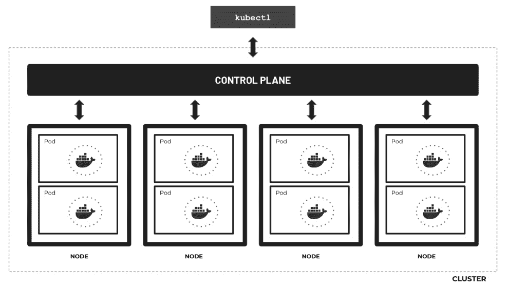

图 10.1 – 一个示例 Kubernetes 集群

让我们快速定义并描述一下*图 10.1*中展示的一些概念：

+   **节点**：这对应于包含运行容器化应用程序的虚拟或物理机器（或 EC2 实例）。

+   **集群**：这是一个由节点（或服务器）组成的组。

+   **Pod**：这是一个或多个应用程序容器的组，代表单个服务单元（在节点内部运行）。

+   **控制平面**：它管理 Kubernetes 集群中的工作节点（服务器）以及 Pod。

+   **kubectl**：这是用于运行管理 Kubernetes 资源的命令行工具。

注意，这是一个简化的列表，因为我们不会深入探讨本章中其他的概念和术语。了解它们应该足以帮助我们完成本章的动手实践解决方案。

在 AWS 上运行 Kubernetes 时，建议您使用像**Amazon EKS**这样的托管服务，它可以帮助我们在幕后管理很多事情——包括控制平面节点（这些节点专注于存储集群数据、确保应用程序可用性以及集群中的其他重要流程和任务）。当使用 Amazon EKS 时，我们不再需要担心控制平面实例的管理，因为 AWS 会自动扩展这些实例，并为我们替换任何不健康的实例。除此之外，Amazon EKS 还帮助工程师在使用 Kubernetes 时无缝地与其他 AWS 服务和资源（例如，**AWS IAM**、**AWS 应用程序负载均衡器**和**Amazon CloudWatch**）一起工作。

注意

使用 Kubernetes 和 Amazon EKS 可以设置节点的自动扩展。这可以通过诸如**Kubernetes 集群自动扩展器**等解决方案进行配置。更多信息，请随时查看[`aws.github.io/aws-eks-best-practices/cluster-autoscaling/`](https://aws.github.io/aws-eks-best-practices/cluster-autoscaling/)。

管理 EKS 集群的主要工具是**eksctl**命令行工具。使用此工具，可以轻松地通过单个命令创建、更新和删除 EKS 集群。一旦集群可用，我们就可以使用其他工具，如**kubectl**命令行工具，在集群内部创建和管理 Kubernetes 资源。

由于 Kubernetes 的强大和潜力，许多其他工具都建立在它之上。其中包括**Kubeflow**——一个流行的开源机器学习平台，专注于帮助数据科学家和机器学习工程师在 Kubernetes 上编排和管理复杂的机器学习工作流程。Kubeflow 汇集了数据科学家和机器学习工程师已经熟悉的机器学习和数据科学工具集。以下是一些包括在内的工具：

+   **JupyterHub** – 这是一个帮助生成和管理多个 Jupyter 笔记本（数据科学家可以在其中运行机器学习实验代码）的枢纽。

+   **Argo Workflows** – 这是一个运行自动化管道的工作流引擎。

+   **Knative Serving** – 这使得快速部署无服务器容器（其中可以运行机器学习模型）成为可能。

+   **Istio** – 这是一个服务网格，提供了一种轻松管理集群中部署的微服务之间的网络配置和通信的方式。

+   **MinIO** – 这是一个原生支持 Kubernetes 的多云对象存储解决方案。

使用 Kubeflow，机器学习从业者可以在不担心基础设施的情况下执行机器学习实验和部署。同时，可以使用 Kubeflow 中提供的各种工具（如**Kubeflow Pipelines**和**Kubeflow Pipelines SDK**）轻松部署和管理自动化的机器学习工作流和管道。当这些管道被正确构建时，它们可以帮助数据科学家和机器学习工程师通过自动化机器学习过程中的不同步骤节省大量时间。同时，这些管道可以启用自动模型重新训练，这将有助于确保部署的模型使用最新的训练数据进行更新。

现在我们对将要使用的工具有了更好的了解，我们将继续准备使用 Kubeflow 在 Amazon EKS 上运行机器学习管道所需的基本先决条件！

# 准备基本先决条件

在本节中，我们将进行以下工作：

+   准备 Cloud9 环境 EC2 实例的 IAM 角色

+   将 IAM 角色附加到 Cloud9 环境的 EC2 实例

+   更新 Cloud9 环境的基本先决条件

让我们逐一工作和准备基本先决条件。

## 准备 Cloud9 环境 EC2 实例的 IAM 角色

为了我们能够从 Cloud9 环境的 EC2 实例内部安全地创建和管理**Amazon EKS**和**AWS CloudFormation**资源，我们需要将 IAM 角色附加到 EC2 实例。在本节中，我们将准备这个 IAM 角色，并配置它所需的权限以创建和管理本章中的其他资源。

注意

在本章的“在 Amazon EKS 上设置 Kubeflow”部分，我们将更详细地讨论**Amazon EKS**和**AWS CloudFormation**。

在下一组步骤中，我们将导航到 IAM 控制台并创建一个 IAM 角色，该角色将在本章后面附加到 Cloud9 环境的 EC2 实例：

1.  按照图 10.2 中所示，在搜索栏中输入`iam`，然后从结果列表中点击**IAM**导航到 IAM 控制台：

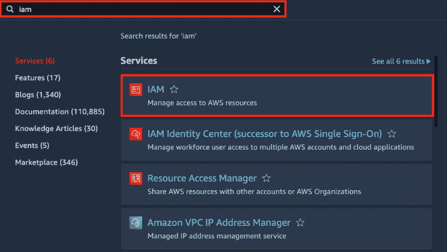

图 10.2 – 导航到 IAM 控制台

在*图 10.2*中，我们展示了导航到 IAM 控制台的一种方法。另一种选择是点击**服务**下拉菜单（如图所示截图未展示）并在**安全、身份和合规**服务组下找到**IAM**服务。

1.  在左侧边栏中找到并点击**角色**（在**访问管理**下）。

1.  在页面右上角找到并点击**创建角色**按钮。

1.  在**选择受信任实体**页面（这是 3 个步骤中的第 1 步），在**受信任实体类型**下选择**AWS 服务**，如图 10.3 所示：

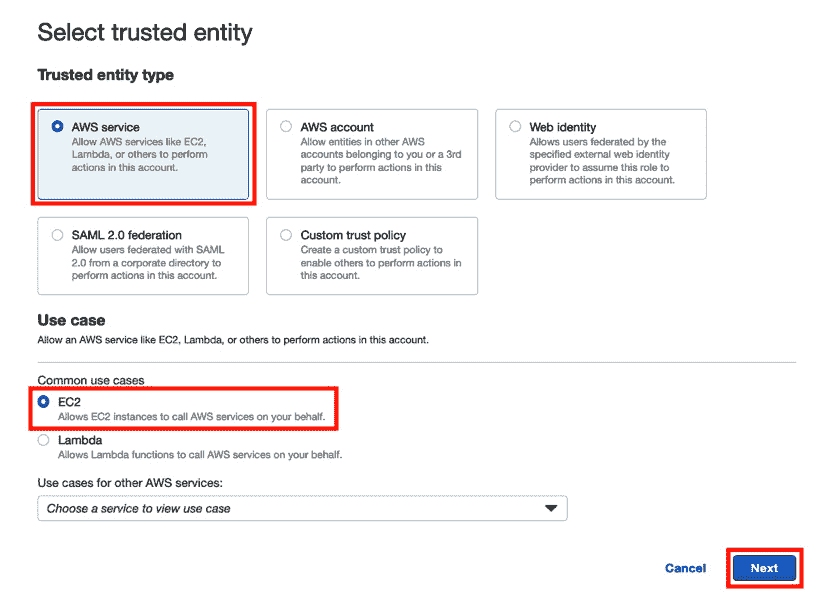

图 10.3 – 选择受信任实体页面

在这里，我们还要确保在**用例 > 常见用例**下选择了**EC2**选项。一旦我们审查了所选选项，我们就可以点击后续的**下一步**按钮。

1.  在管理员过滤器搜索框中输入`管理员`（如图 10.4 所示高亮显示），然后按*Enter*键过滤结果列表。勾选对应于**管理员访问**策略的复选框，滚动到页面底部，然后点击**下一步**按钮：

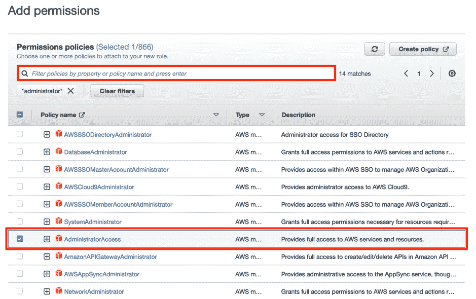

图 10.4 – 添加权限页面

确保你不会不小心从过滤结果列表中选择错误的权限，因为有一些权限具有相似的名字。**管理员访问**策略应该有**描述**值为**提供对 AWS 服务和资源的完全访问**。

重要提示

在本章中，使用`AdministratorAccess`策略将帮助我们避免在设置过程中遇到不同的权限相关问题。当你在工作环境中设置时，你应该使用一个自定义策略，该策略仅添加 EC2 实例运行应用程序所需的权限（而不添加更多）。

1.  在**角色名称**输入框中输入`kubeflow-on-eks`。滚动到页面底部，然后点击**创建角色**按钮。

难道不是很简单吗！到这一点，我们应该有一个可以附加到 AWS 资源（如 EC2 实例）的 IAM 角色。

## 将 IAM 角色附加到 Cloud9 环境的 EC2 实例

现在我们有了准备好的 IAM 角色，我们可以继续将此 IAM 角色附加到 EC2 实例。

重要提示

在本章中，我们将创建和管理我们在`us-west-2`区域中的资源。确保在继续下一步之前，你已经设置了正确的区域。

在接下来的步骤中，我们将使用 AWS 管理控制台将 IAM 角色附加到运行 Cloud9 环境的 EC2 实例：

1.  在搜索栏中输入`cloud9`，然后从结果列表中选择**Cloud9**：

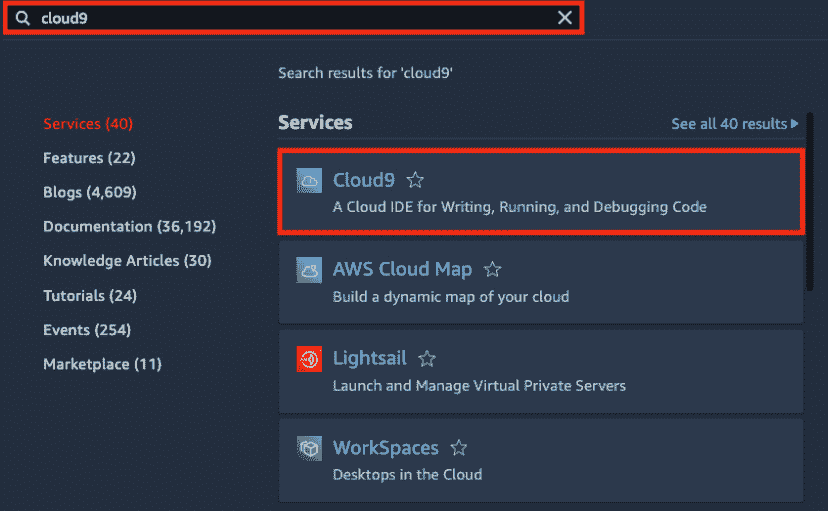


在图 10.5 中，我们展示了导航到 Cloud9 服务页面的方法之一。另一种选择是点击**服务**下拉菜单（在先前的屏幕截图中未显示）并定位到**开发者工具**组中的**Cloud9**服务。

1.  定位并选择我们在*第一章*“AWS 机器学习工程简介”中准备好的 Cloud9 环境：

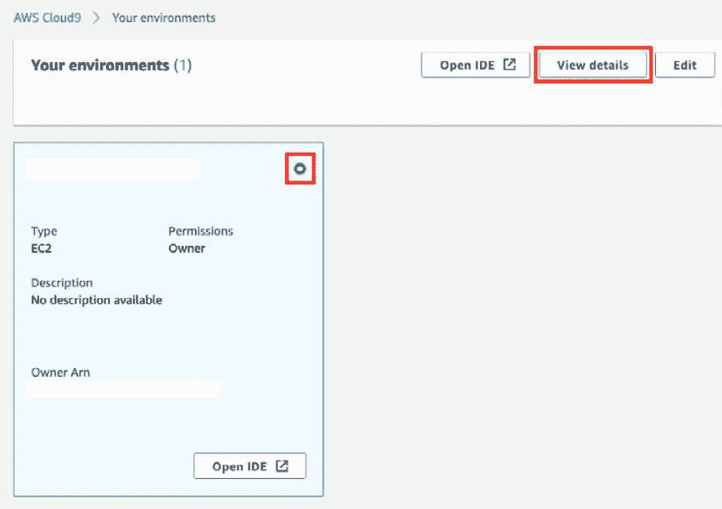

图 10.6 – 定位查看详情按钮

一旦你选择了 Cloud9 环境，点击页面右上角（如图 10.6 所示高亮显示）的**查看详情**按钮。

注意

您也可能决定从头创建一个新的 Cloud9 环境，并增加运行环境的 EC2 实例的卷大小。如果是这样，请确保遵循 *第一章* *AWS 机器学习工程简介* 中 *创建您的 Cloud9 环境* 和 *增加 Cloud9 存储* 部分的逐步说明。

1.  在 **环境详情** 下，找到并点击如图 10.7 所示的高亮部分 **转到实例** 链接：

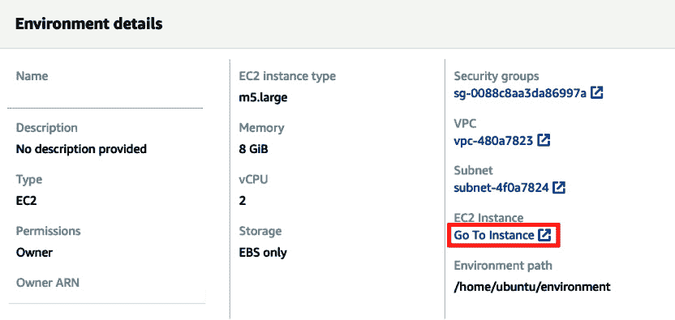

图 10.7 – 定位并点击“转到实例”按钮

这应该会将您重定向到 EC2 控制台，在那里您应该能看到 Cloud9 环境正在运行的特定 EC2 实例。

1.  打开与 EC2 实例（以 `aws-cloud9` 开头）对应的复选框，然后打开如图 10.8 所示的高亮部分 **操作** 下拉菜单：

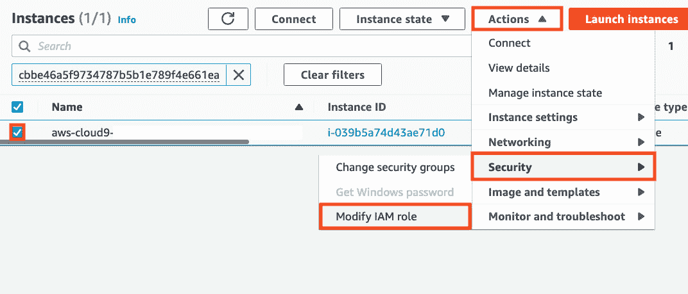

图 10.8 – 修改 EC2 实例的 IAM 角色

1.  接下来，我们在 **安全** 选项下的列表中找到并点击 **修改 IAM 角色** 选项。这应该会将您重定向到一个页面，您可以在其中选择要附加到所选 EC2 实例的特定 IAM 角色。

1.  在 IAM 角色下拉菜单（如图 10.9 所示的高亮部分），找到并选择本章 earlier 创建的 IAM 角色（即 `kubeflow-on-eks` IAM 角色）：

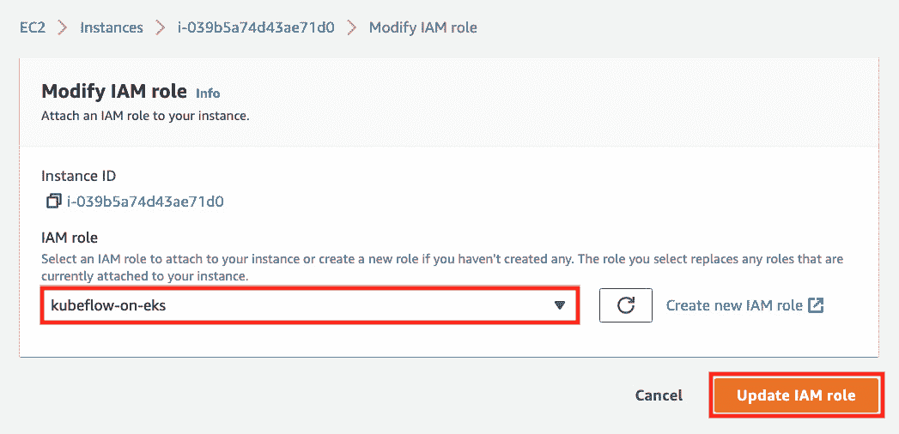

图 10.9 – 指定 kubeflow-on-eks 作为 IAM 角色

一旦我们将 IAM 角色下拉值更新为 `kubeflow-on-eks`，现在您可以点击如图 10.9 所示的高亮部分 **更新 IAM 角色** 按钮。

1.  在搜索栏中输入 `cloud9` 并从结果列表中选择 **Cloud9**，以返回 Cloud9 控制台。

1.  定位并点击与我们的 Cloud9 环境相关的 **打开 IDE** 按钮。这应该会打开一个类似于 *图 10.10* 所示的 Cloud9 环境：

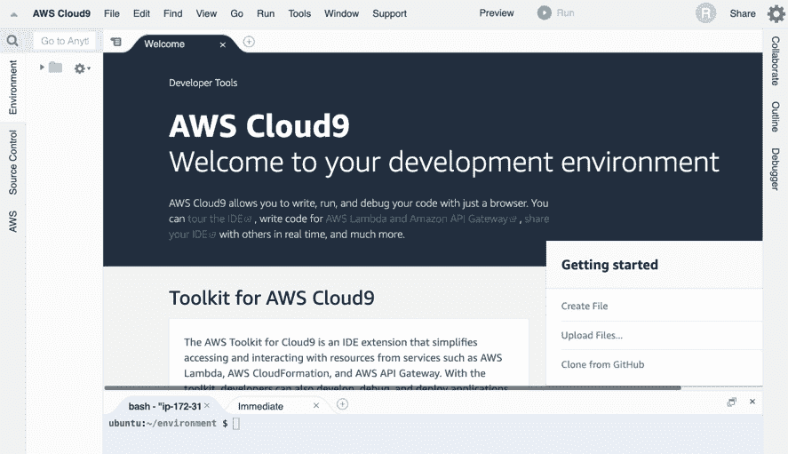

图 10.10 – Cloud9 环境

在这里，我们应该看到一个熟悉的屏幕（因为我们已经在 *第一章* *AWS 机器学习工程简介* 和 *第三章* *深度学习容器* 中使用过）。

在 Cloud9 环境的终端（屏幕下方的 $ 符号之后），运行以下命令以禁用环境内的托管临时凭证：

```py
ENV_ID=$C9_PID
aws cloud9 update-environment --managed-credentials-action DISABLE --environment-id $ENV_ID
```

1.  此外，让我们从 `.aws` 目录中删除凭证文件，以确保没有临时凭证：

    ```py
    rm -vf /home/ubuntu/.aws/credentials
    ```

1.  最后，让我们验证 Cloud9 环境是否正在使用本章准备的 IAM 角色（即 `kubeflow-on-eks` IAM 角色）：

    ```py
    aws sts get-caller-identity --query Arn 
    ```

这应该会得到以下类似的结果：

```py
arn:aws:sts::1234567890:assumed-role/kubeflow-on-eks/i-abcdefgh12345
```

一旦我们验证了我们在 Cloud9 环境中使用的是正确的 IAM 角色，我们就可以继续下一部分。

注意

*这里发生了什么？* IAM 角色（附加到 AWS 资源）在每几个小时就会生成并提供凭证。为了我们能够使用 IAM 角色，我们需要删除 Cloud9 环境中现有的任何凭证集，这样环境就会使用 IAM 角色凭证。有关此主题的更多信息，请随时查看 [`docs.aws.amazon.com/cloud9/latest/user-guide/security-iam.xhtml`](https://docs.aws.amazon.com/cloud9/latest/user-guide/security-iam.xhtml)。

## 更新 Cloud9 环境以包含基本先决条件

在我们能够创建我们的 EKS 集群并在其上设置 Kubeflow 之前，我们需要下载和安装一些先决条件，包括几个命令行工具，例如 **kubectl**、**eksctl** 和 **kustomize**。

注意

我们将在本章的 *在 Amazon EKS 上设置 Kubeflow* 部分讨论这些是如何工作的。

在接下来的步骤中，我们将运行几个脚本，以安装在我们的环境中运行 **Kubernetes** 和 **Kubeflow** 所需的先决条件：

1.  让我们从使用 `wget` 命令（在 Cloud9 环境的终端中）下载包含各种安装脚本的 `prerequisites.zip` 文件开始。之后，我们将使用 `unzip` 命令提取我们刚刚下载的 ZIP 文件的内容：

    ```py
    wget -O prerequisites.zip https://bit.ly/3ByyDGV
    ```

    ```py
    unzip prerequisites.zip
    ```

这应该从 ZIP 文件中提取以下文件：

+   `00_install_kubectl_aws_jq_and_more.sh` – 这是一个运行所有其他脚本（前缀为 `01` 到 `07`）以安装先决条件的脚本。

+   `01_install_kubectl.sh` – 这是一个安装 kubectl 命令行工具的脚本。

+   `02_install_aws_cli_v2.sh` – 这是一个安装 **AWS CLI** v2 的脚本。

+   `03_install_jq_and_more.sh` – 这是一个安装和设置一些先决条件的脚本，例如 *jq* 和 *yq*。

+   `04_check_prerequisites.sh` – 这是一个检查是否已成功安装前几个先决条件的脚本。

+   `05_additional_setup_instructions.sh` – 这是一个设置 Bash 完成的脚本。

+   `06_download_eksctl.sh` – 这是一个安装 **eksctl** 命令行工具的脚本。

+   `07_install_kustomize.sh` – 这是一个安装 **kustomize** 版本 3.2.3 的脚本。

1.  导航到 `ch10_prerequisites` 文件夹并运行 `chmod` 命令以使文件夹内的脚本可执行：

    ```py
    cd ch10_prerequisites
    ```

    ```py
    chmod +x *.sh
    ```

1.  现在，运行以下命令以开始安装和设置过程：

    ```py
    sudo ./00_install_kubectl_aws_jq_and_more.sh
    ```

这应该会从 `01_install_kubectl.sh` 到 `07_install_kustomize.sh` 的顺序运行 `ch10_prerequisites` 文件夹内的其他脚本。

注意

一旦 `00_install_kubectl_aws_jq_and_more.sh` 脚本运行完成，一些先决条件，如 **AWS CLI v2**、**eksctl** 和 **kustomize**，应该已经可用，我们可以使用它们来准备 Kubernetes 集群（如果安装过程中没有错误）。在继续之前，请确保您已检查脚本生成的日志。

1.  验证我们当前拥有的 AWS CLI 版本：

    ```py
    aws --version
    ```

这应该会得到以下类似的结果：

```py
aws-cli/2.7.20 Python/3.9.11 Linux/5.4.0-1081-aws exe/x86_64.ubuntu.18 prompt/off
```

1.  接下来，让我们验证我们将使用的 `kustomize` 版本：

    ```py
    kustomize version
    ```

这应该会得到以下类似的结果：

```py
Version: {Version:kustomize/v3.2.3 GitCommit:f8412aa3d39f32151525aff97a351288f5a7470b BuildDate:2019-10-08T23:30:25Z GoOs:linux GoArch:amd64}
```

1.  让我们验证 `eksctl` 的版本：

    ```py
    eksctl version
    ```

这应该会得到以下类似的结果：

```py
0.109.0
```

1.  运行以下命令，以便安装脚本中的其他更改（如环境变量值）反映在我们的当前 shell 中：

    ```py
    . ~/.bash_completion
    ```

    ```py
    . ~/.bash_profile
    ```

    ```py
    . ~/.bashrc
    ```

注意在每行开头的点（`.`）和波浪号（`~`）之前有一个空格。

1.  运行以下命令块以设置一些环境变量并在使用 AWS CLI 时配置默认区域：

    ```py
    export AWS_REGION="us-west-2"
    ```

    ```py
    echo "export AWS_REGION=${AWS_REGION}" | tee -a ~/.bash_profile
    ```

    ```py
    aws configure set default.region ${AWS_REGION}
    ```

1.  最后，验证默认区域是否已成功设置：

    ```py
    aws configure get default.region
    ```

如果我们在俄勒冈州运行我们的 Cloud9 环境，这将得到 `us-west-2` 的值。

现在所有先决条件都已安装、设置和验证，我们可以继续创建 EKS 集群并在其上设置 Kubeflow！

# 在 Amazon EKS 上设置 Kubeflow

在所有先决条件准备就绪后，我们现在可以继续创建我们的 EKS 集群，然后在上面安装 Kubeflow。在安装和设置过程中，我们将使用以下工具：

+   **eksctl** – 用于创建和管理 Amazon EKS 集群的 CLI 工具

+   **kubectl** – 用于创建、配置和删除 Kubernetes 资源的 CLI 工具

+   **AWS CLI** – 用于创建、配置和删除 AWS 资源的 CLI 工具

+   **kustomize** – 用于管理 Kubernetes 对象配置的 CLI 工具

本节的实际操作部分涉及遵循一系列高级步骤：

1.  准备包含 EKS 配置的 `eks.yaml` 文件（例如节点数量、期望容量和实例类型）

1.  使用 `eks.yaml` 文件运行 `eks create cluster` 命令以创建 Amazon EKS 集群

1.  使用 **kustomize** 和 **kubectl** 在我们的集群内安装 Kubeflow

考虑到这些，我们现在可以继续设置我们的 EKS 集群和 Kubeflow：

1.  在上一节结束的地方继续，让我们在 Cloud9 环境的终端中运行以下命令：

    ```py
    cd ~/environment
    ```

    ```py
    mkdir ch10
    ```

    ```py
    cd ch10
    ```

在这里，我们使用 `mkdir` 命令创建 `ch10` 目录。之后，我们将使用 `cd` 命令进入该目录。

1.  接下来，让我们使用 `touch` 命令创建一个空的 `eks.yaml` 文件：

    ```py
    touch eks.yaml
    ```

1.  在 **文件树** 中，找到名为您的 Cloud9 环境的环境目录。右键单击此目录以打开类似于 *图 10.11* 中所示的下拉菜单：


图 10.11 – 刷新显示的目录和文件

从选项列表中选择 **刷新**，以确保最新的更改已反映在文件树中。

1.  接下来，在文件树中双击 `eks.yaml` 文件（位于 `ch10` 目录中），在 **编辑器** 面板中打开文件。在这个空白文件中，指定以下 YAML 配置：

    ```py
    ---
    ```

    ```py
    apiVersion: eksctl.io/v1alpha5
    ```

    ```py
    kind: ClusterConfig
    ```

    ```py
    metadata:
    ```

    ```py
      name: kubeflow-eks-000
    ```

    ```py
      region: us-west-2
    ```

    ```py
      version: "1.21"
    ```

    ```py
    availabilityZones: ["us-west-2a", "us-west-2b", "us-west-2c", "us-west-2d"]
    ```

    ```py
    managedNodeGroups:
    ```

    ```py
    - name: nodegroup
    ```

    ```py
      desiredCapacity: 5
    ```

    ```py
      instanceType: m5.xlarge
    ```

    ```py
      ssh:
    ```

    ```py
        enableSsm: true
    ```

确保通过按 *Ctrl* + *S* 键（或者，在 Mac 设备上，按 *Cmd* + *S* 键）保存您的更改。此外，您还可以使用 **文件** 菜单中的 **保存** 选项来保存您的更改。

重要提示

在继续之前，我们必须清楚当我们使用此配置文件运行 `eksctl create cluster` 命令时将创建哪些资源。在这里，我们指定我们希望我们的集群（命名为 `kubeflow-eks-000`）拥有五个 (`5`) 个 `m5.xlarge` 实例。一旦你在下一步运行 `eksctl create cluster` 命令，请确保在集群创建后的一小时内或两小时内删除集群以管理成本。一旦你需要删除集群，请随时跳转到本章末尾的 *清理* 部分。

1.  在为我们的集群创建真实资源之前，让我们使用带有 `--dry-run` 选项的 `eksctl create cluster` 命令：

    ```py
    eksctl create cluster -f eks.yaml --dry-run
    ```

这应该有助于我们在创建实际资源集合之前检查配置。

1.  现在，让我们使用 `eksctl create` 命令创建我们的集群：

    ```py
    eksctl create cluster -f eks.yaml
    ```

在这里，我们使用之前步骤中准备的 `eks.yaml` 文件作为运行命令时的配置文件。

重要提示

如果您遇到类似 `eks.yaml` 文件中的 `version` 字符串值错误的消息，并且错误消息中指定了最低支持的版本。一旦您已更新 `eks.yaml` 文件，您可以再次运行 `eksctl create cluster` 命令并检查问题是否已解决。有关此主题的更多信息，请随时查看 [`docs.aws.amazon.com/eks/latest/userguide/kubernetes-versions.xhtml`](https://docs.aws.amazon.com/eks/latest/userguide/kubernetes-versions.xhtml)。

运行 `eksctl create cluster` 命令可能需要 15-30 分钟才能完成。它将使用 **CloudFormation** 堆栈来启动 AWS 资源。如果您想知道 CloudFormation 是什么，它是一种服务，允许您在模板中定义您的基础设施组件及其设置。然后，CloudFormation 读取此模板以提供您基础设施所需资源：

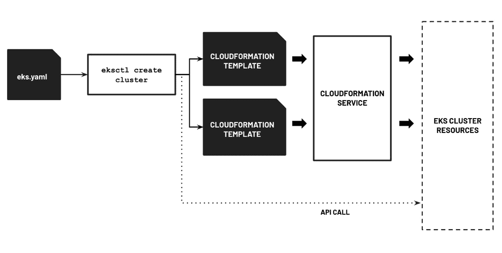

图 10.12 – 使用 eksctl 创建 EKS 资源的过程

在 *图 10.12* 中，我们可以看到 `eksctl` 命令利用 `eks.yaml` 文件来准备 CloudFormation 服务将用于部署资源的模板。

注意

注意，`eksctl`也会在 CloudFormation 之外创建其他资源。这意味着用于准备 EKS 资源的 CloudFormation 模板将**不会**包含使用`eksctl`命令创建的所有资源。话虽如此，当删除本节中创建的资源时，最好使用`eksctl delete cluster`命令。一旦需要删除资源，请确保遵循本章*清理*部分中指定的说明。

1.  让我们快速使用`kubectl get nodes`命令检查我们的设置：

    ```py
    kubectl get nodes -o wide
    ```

这应该会给我们提供五个节点，其**状态**值为**就绪**。

重要提示

如果在部署 EKS 集群时遇到问题，请确保检查[`docs.aws.amazon.com/eks/latest/userguide/troubleshooting.xhtml`](https://docs.aws.amazon.com/eks/latest/userguide/troubleshooting.xhtml)。

1.  在继续之前，让我们确保`CLUSTER_NAME`和`CLUSTER_REGION`已经设置了适当的值：

    ```py
    CLUSTER_NAME=kubeflow-eks-000
    ```

    ```py
    CLUSTER_REGION=us-west-2
    ```

在这里，我们指定一个与`eks.yaml`文件中指定的名称等效的`CLUSTER_NAME`值。请注意，如果您需要实验另一组配置参数，您可以指定不同的集群名称（通过更新`CLUSTER_NAME`和`eks.yaml`文件），并在创建新集群时将`kubeflow-eks-000`替换为`kubeflow-eks-001`（等等）。只需确保在创建新集群之前正确删除任何现有集群。

1.  此外，让我们将一个 IAM OIDC 提供程序与集群关联：

    ```py
    eksctl utils associate-iam-oidc-provider --cluster $CLUSTER_NAME --approve -v4
    ```

那么，IAM OIDC 提供程序是什么？嗯，它是一个 IAM 实体，用于在您的 AWS 账户和外部 OpenID Connect 兼容的身份提供程序之间建立信任。这意味着我们不必创建 IAM 用户，而是可以使用 IAM OIDC 提供程序，并授予这些身份在我们的 AWS 账户中操作资源的权限。

注意

关于这个主题的更多信息，请随时查看[`docs.aws.amazon.com/IAM/latest/UserGuide/id_roles_providers_create_oidc.xhtml`](https://docs.aws.amazon.com/IAM/latest/UserGuide/id_roles_providers_create_oidc.xhtml)。

1.  让我们使用`aws eks update-kubeconfig`命令来配置`kubectl`，以便我们可以连接到 Amazon EKS 集群：

    ```py
    aws eks update-kubeconfig --name $CLUSTER_NAME --region ${AWS_REGION}
    ```

1.  接下来，我们将克隆两个包含所需安装的 Kubernetes 对象规范（manifests）的仓库：

    ```py
    export KUBEFLOW_VERSION=v1.5.1
    ```

    ```py
    export AWS_VERSION=v1.5.1-aws-b1.0.0
    ```

    ```py
    git clone https://github.com/awslabs/kubeflow-manifests.git && cd kubeflow-manifests
    ```

    ```py
    git checkout ${AWS_VERSION}
    ```

    ```py
    git clone --branch ${KUBEFLOW_VERSION} \
    ```

    ```py
    https://github.com/kubeflow/manifests.git upstream
    ```

1.  导航到`deployments/vanilla`目录：

    ```py
    cd deployments/vanilla
    ```

我们应该在这个目录中找到一个`kustomization.yaml`文件。关于这个主题的更多信息，请随时查看[`kubernetes.io/docs/tasks/manage-kubernetes-objects/kustomization/`](https://kubernetes.io/docs/tasks/manage-kubernetes-objects/kustomization/)。

1.  一切准备就绪，让我们运行这条单行命令来安装 Kubeflow 组件和服务：

    ```py
    while ! kustomize build . | kubectl apply -f -; do echo "Retrying"; sleep 30; done
    ```

注意

此步骤大约需要 4-10 分钟才能完成。如果输出日志似乎已经无限循环超过 20-30 分钟，你可能需要尝试在 `eks.yaml` 文件中的 `version` 字符串值中调整不同的值。*我们可以使用哪些值？* 假设当前支持的版本是 `1.20`、`1.21`、`1.22` 和 `1.23`（如 [`docs.aws.amazon.com/eks/latest/userguide/kubernetes-versions.xhtml`](https://docs.aws.amazon.com/eks/latest/userguide/kubernetes-versions.xhtml) 所示）。*我们应该尝试使用版本 1.23 吗？* 如果我们在 `eks.yaml` 文件中使用最新的支持 Kubernetes 版本 `1.23`，可能会遇到安装 Kubeflow 的问题。我们可能需要等待几个月，直到 Kubeflow 的支持赶上（如 [`awslabs.github.io/kubeflow-manifests/docs/about/eks-compatibility/`](https://awslabs.github.io/kubeflow-manifests/docs/about/eks-compatibility/) 所示）。话虽如此，当使用 `eksctl create cluster` 命令时，我们可以在 `eks.yaml` 文件中尝试指定 `1.20`、`1.21` 或 `1.22`（从最低支持的版本 `1.20` 开始）。考虑到这些，下一步是使用 `eksctl delete cluster` 命令删除集群（请参阅 *清理* 部分），更新 `eks.yaml` 文件以包含所需的 Kubernetes 版本，然后重复本节中的 `eksctl create cluster` 命令的步骤。

1.  让我们快速检查创建的资源，使用以下命令：

    ```py
    ns_array=(kubeflow kubeflow-user-example-com kserve cert-manager istio-system auth knative-eventing knative-serving)
    ```

    ```py
    for i in ${ns_array[@]}; do 
    ```

    ```py
      echo "[+] kubectl get pods -n $i"
    ```

    ```py
      kubectl get pods -n $i; 
    ```

    ```py
      echo "---"
    ```

    ```py
    done
    ```

在这里，我们使用 `kubectl get pods` 命令检查集群节点内创建的资源。

1.  现在，我们运行以下命令以便可以通过 Cloud9 环境的 `8080` 端口访问 Kubeflow 仪表板：

    ```py
    kubectl port-forward svc/istio-ingressgateway -n istio-system 8080:80 --address=localhost
    ```

1.  点击页面顶部的 **预览**（位于 *图 10.13* 所示的位置）以打开类似于 *图 10.13* 的下拉菜单选项列表：

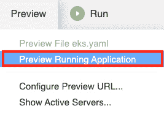

图 10.13 – 预览运行中的应用

从下拉菜单选项列表中，选择 **预览运行中的应用** 以打开屏幕底部终端窗格旁边的小窗口。

注意

我们能够直接从我们的 Cloud9 环境预览应用程序，因为应用程序目前正在使用 HTTP 通过端口 8080 运行。有关此主题的更多信息，请随时查看 [`docs.aws.amazon.com/cloud9/latest/user-guide/app-preview.xhtml`](https://docs.aws.amazon.com/cloud9/latest/user-guide/app-preview.xhtml)。

1.  点击如图 *图 10.14* 所示的按钮，在单独的浏览器标签页中打开预览窗口：

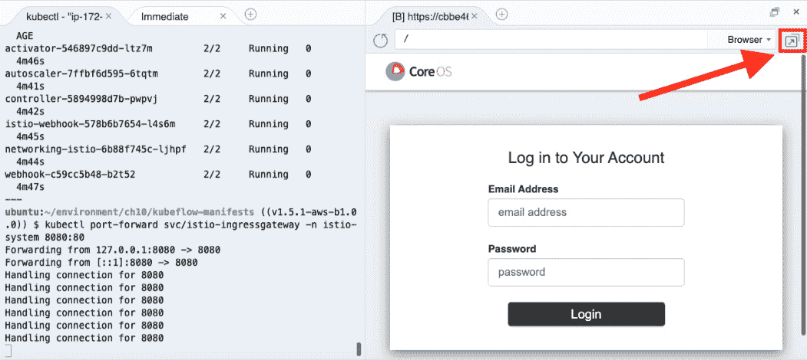

图 10.14 – 在新窗口中预览

确保在第二个浏览器标签页中预览应用程序时，不要关闭运行 Cloud9 环境的浏览器标签页。

1.  在 `user@example.com` 上指定以下凭据

1.  `12341234`

重要提示

不要与他人分享应用程序预览标签的 URL。要更改默认密码，请随意查看以下链接：[`awslabs.github.io/kubeflow-manifests/docs/deployment/connect-kubeflow-dashboard/`](https://awslabs.github.io/kubeflow-manifests/docs/deployment/connect-kubeflow-dashboard/)

这应该会重定向到**Kubeflow 中央仪表板**，类似于*图 10.15*中所示：

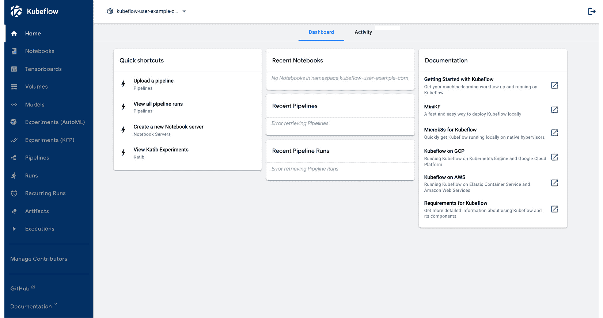

图 10.15 – Kubeflow 中央仪表板

在*图 10.15*中，我们可以看到**Kubeflow 中央仪表板**——一个仪表板界面，它提供了对我们创建和工作的组件和资源的即时访问。请随意使用侧边栏导航到仪表板的各个部分。

最后，所有设置工作都已完成！在下一节中，我们将运行我们的第一个自定义 Kubeflow 管道。在继续之前，请随意拿一杯咖啡或茶。

# 运行我们的第一个 Kubeflow 管道

在本节中，我们将运行一个自定义管道，该管道将下载一个示例表格数据集，并将其用作训练数据来构建我们的**线性回归**模型。管道将执行的步骤和指令已在 YAML 文件中定义。一旦上传了此 YAML 文件，我们就可以运行一个 Kubeflow 管道，该管道将执行以下步骤：

1.  **下载数据集**：在这里，我们将下载并使用一个只有 20 条记录的数据集（包括包含标题的行）。此外，我们将从一个没有缺失或无效值的干净版本开始：

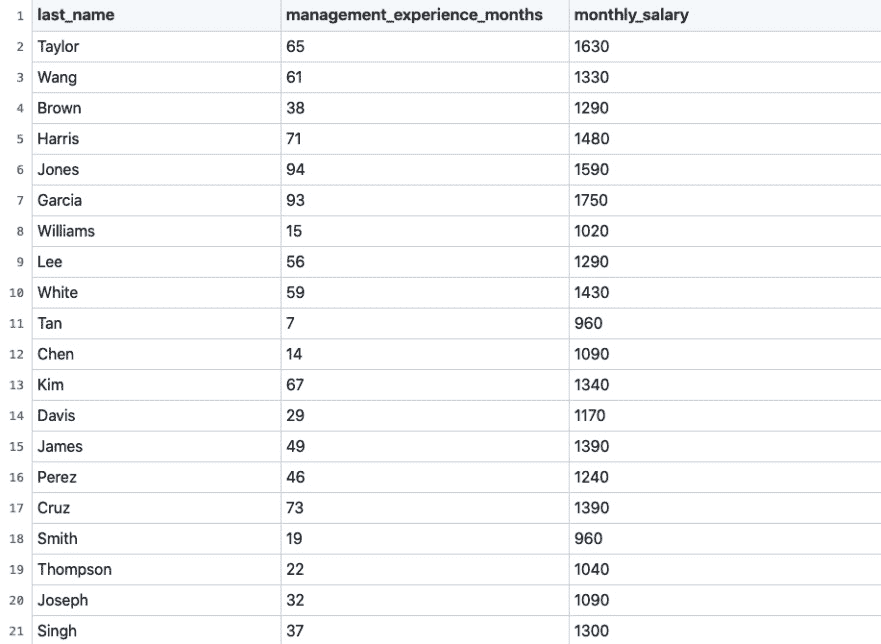

图 10.16 – 一个示例表格数据集

在*图 10.16*中，我们可以看到我们的数据集有三列：

+   `last_name` – 这是指管理者的姓氏。

+   `management_experience_months` – 这是指管理者管理团队成员的总月份数。

+   `monthly_salary` – 这是指管理者每月的当前薪水（以美元计）。

为了简化一些事情，我们将使用只有少量记录的数据集——足以生成一个简单的机器学习模型。此外，我们将从一个没有缺失或无效值的干净版本开始。

1.  `monthly_salary`) 第二列是预测列（`management_experience_months`）。同时，我们将执行**训练-测试分割**，以便我们可以使用 70%的数据集来训练模型，剩余的 30%用于评估。

1.  使用`LinearRegression`算法在训练数据上拟合线性模型。

1.  **评估模型**：一旦完成训练步骤，我们将使用测试集对其进行评估。

1.  `monthly_salary`) 给定一个输入值（`management_experience_months`）。

注意

注意，我们完全控制我们的管道将如何运行。我们可以将管道视为一系列步骤，其中每个步骤可能会生成一个输出，然后被另一个步骤用作输入。

现在我们对我们的流程有了更好的了解，让我们开始运行我们的第一个流程：

1.  让我们从在另一个浏览器标签页中打开以下链接开始：[`raw.githubusercontent.com/PacktPublishing/Machine-Learning-Engineering-on-AWS/main/chapter10/basic_pipeline.yaml`](https://raw.githubusercontent.com/PacktPublishing/Machine-Learning-Engineering-on-AWS/main/chapter10/basic_pipeline.yaml)。

1.  右键单击页面上的任何部分以打开一个类似于*图 10.17*中所示的下拉菜单：

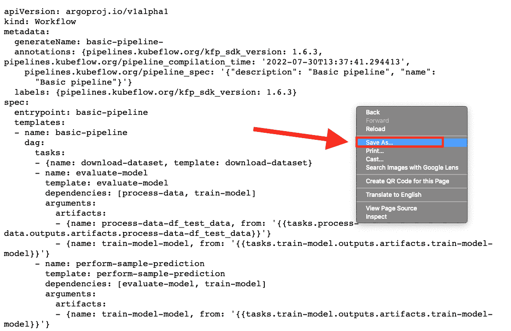

图 10.17 – 下载 YAML 文件

将文件保存为`basic_pipeline.yaml`，并将其下载到您本地机器的`下载`文件夹（或类似位置）。

1.  在浏览器标签页中回到显示**Kubeflow 中央仪表板**，在侧边栏中找到并点击**流程**。

1.  接下来，点击**上传流程**按钮（位于**刷新**按钮旁边）

1.  在您的本地机器上的`basic_pipeline.yaml`文件（使用提供的文件输入字段）下**我的第一个流程**。最后，点击**创建**按钮（如图 10.18 所示）：

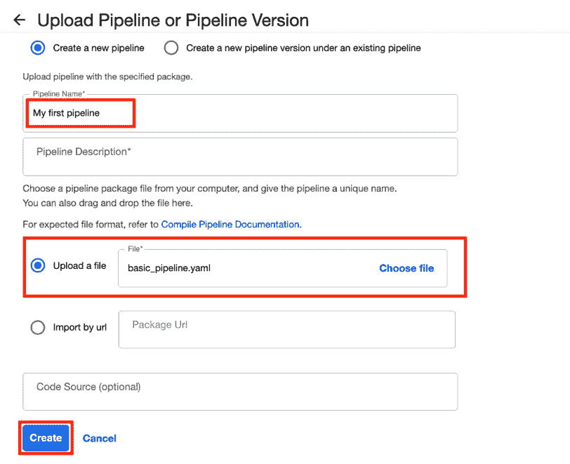

图 10.18 – 上传流程（文件）

点击**创建**按钮应该会创建流程，并带您转到类似于*图 10.19*所示的流程页面：

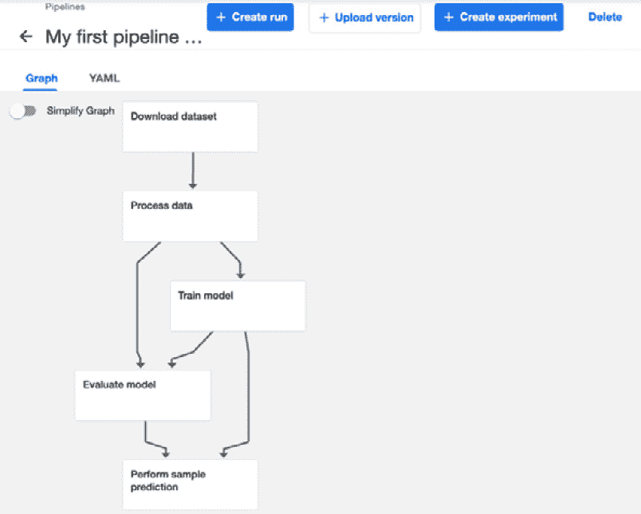

图 10.19 – 第一个流程的图表

到目前为止，我们的流程应该已经准备好了！下一步将是创建一个实验并运行它。

注意

*发生了什么？* 在上传 YAML 文件后，Kubeflow Pipelines 将 YAML 文件转换为可以通过流程运行执行的流程。

1.  接下来，找到并点击页面右上角的**创建实验**按钮。如果您找不到**创建实验**按钮，请随意放大/缩小（并关闭可能出现的任何弹出窗口和覆盖层）。

1.  在**实验名称**下指定`我的第一个实验`。然后点击**下一步**按钮。

1.  在**启动运行**页面，滚动到页面底部，然后点击**启动**按钮。

1.  找到并点击**我的第一个流程**下的**运行**，如图 10.20 所示：

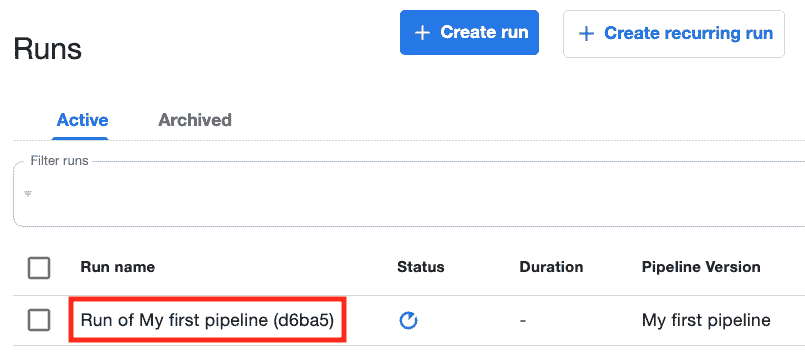

图 10.20 – 导航到流程运行

在这里，我们可以看到我们的流程已经开始运行。在导航到特定的流程运行页面后，你应该会看到一个相对较新或部分完成的流程，类似于*图 10.21*所示：

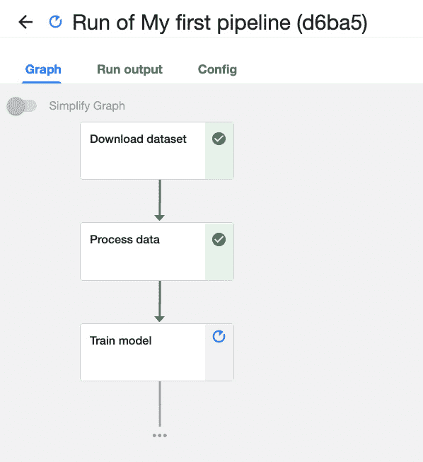

图 10.21 – 等待流程运行完成

这应该需要大约 1-2 分钟来完成。你应该会看到每个已成功完成的步骤上都有一个勾号。

1.  当管道运行时，您可能需要点击任何步骤来检查相应的输入和输出工件、日志和其他详细信息：

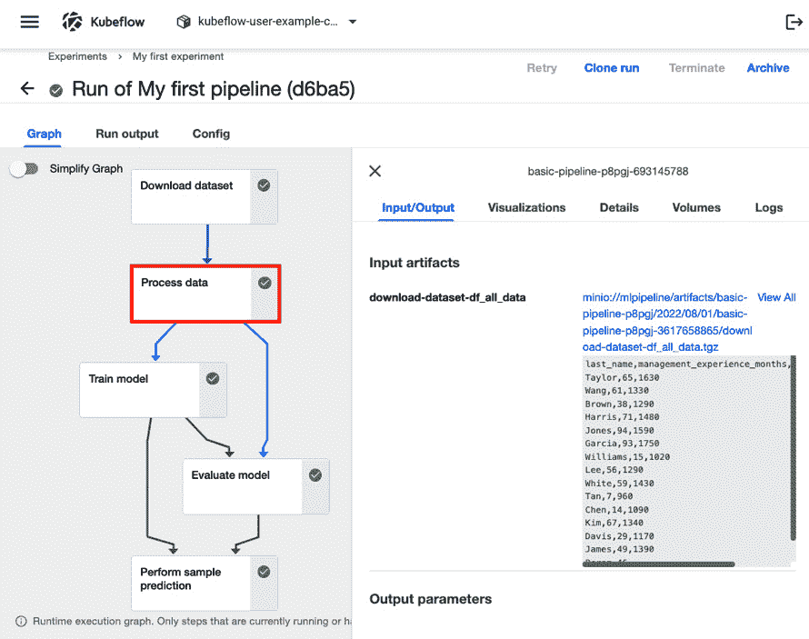

图 10.22 – 检查工件

在**图 10.22**中，我们可以看到在点击对应于**处理数据**步骤的框之后，我们可以查看和调试输入和输出工件。此外，我们还应该通过导航到其他标签（**可视化**、**详细信息**、**卷**和**日志**）来找到关于当前步骤的其他详细信息。

恭喜您运行了您的第一个管道！如果您想知道我们是如何准备这个管道的，我们只是简单地使用了**Kubeflow Pipelines SDK**来定义管道的步骤并生成包含所有指令和配置的 YAML 文件。在下一节中，我们将更深入地探讨在构建定制机器学习管道时使用**Kubeflow Pipelines SDK**。

# 使用 Kubeflow Pipelines SDK 构建机器学习工作流程

在本节中，我们将使用**Kubeflow Pipelines SDK**构建机器学习工作流程。Kubeflow Pipelines SDK 包含了构建包含我们想要运行的定制代码的管道组件所需的所有内容。使用 Kubeflow Pipelines SDK，我们可以定义将映射到管道组件的 Python 函数。

在使用 Kubeflow Pipelines SDK 构建基于 Python 函数的组件时，我们需要遵循以下一些指南：

+   定义好的 Python 函数应该是独立的，并且不应该使用在函数定义外部声明的任何代码和变量。这意味着`import pandas`也应该在函数内部实现。以下是一个快速示例，说明如何实现导入：

    ```py
    def process_data(...):
    ```

    ```py
        import pandas as pd    
    ```

    ```py
        df_all_data = pd.read_csv(df_all_data_path)
    ```

    ```py
        # and so on...
    ```

+   当在组件之间传递大量数据（或具有复杂数据类型的数据）时，必须以文件的形式传递数据。以下是一个快速示例：

    ```py
    def evaluate_model(
    ```

    ```py
        model_path: InputPath(str),
    ```

    ```py
        df_test_data_path: InputPath(str)):
    ```

    ```py
        import pandas as pd
    ```

    ```py
        from joblib import load
    ```

    ```py
        df_test_data = pd.read_csv(df_test_data_path)
    ```

    ```py
        model = load(model_path)
    ```

    ```py
        # and so on...
    ```

+   使用`create_component_from_func()`函数（来自`kfp.components`）将定义的函数转换为管道组件。在调用`create_component_from_func()`函数时，可以在`packages_to_install`参数中指定一个包列表，类似于以下代码块中的内容：

    ```py
    process_data_op = create_component_from_func(
    ```

    ```py
        process_data, 
    ```

    ```py
        packages_to_install=['pandas', 'sklearn']
    ```

    ```py
    )
    ```

在函数执行之前，将安装指定的包。

+   可选地，我们可能准备一个自定义容器镜像，该镜像将被用于 Python 函数运行的 环境。在调用`create_component_from_func()`函数时，可以在`base_image`参数中指定自定义容器镜像。

话虽如此，让我们开始使用**Kubeflow Pipelines SDK**定义和配置我们的机器学习管道：

1.  在**Kubeflow Central Dashboard**的侧边栏中找到并点击**笔记本**。

1.  接下来，点击**新建笔记本**按钮。

1.  将**名称**输入字段的值指定为`first-notebook`。

1.  滚动到页面底部，然后点击**启动**按钮。

注意

等待笔记本变得可用。通常需要 1-2 分钟才能准备好笔记本。

1.  笔记本变得可用后，点击 **CONNECT** 按钮。

1.  在 **Jupyter Lab Launcher** 中，选择 **Python 3** 选项（在 **Notebook** 下），如 *图 10.23* 中所示：

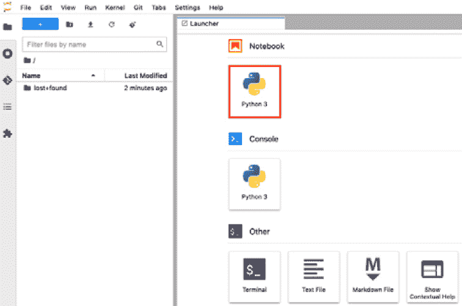

图 10.23 – Jupyter Lab Launcher

这应该创建一个新的 **Jupyter Notebook**（在 Kubernetes Pod 内部的容器中），我们可以在这里运行我们的 Python 代码。

注意

我们将在启动的 Jupyter 笔记本中运行的后续步骤中运行代码块。

1.  让我们从 **Kubeflow Pipelines SDK** 中执行一些导入操作：

    ```py
    import kfp
    ```

    ```py
    from kfp import dsl
    ```

    ```py
    from kfp.components import InputPath, OutputPath
    ```

    ```py
    from kfp.components import create_component_from_func
    ```

1.  在我们管道的第一步中，我们定义了 `download_dataset()` 函数，该函数下载一个虚拟数据集并将其转换为 CSV 文件。这个 CSV 文件通过 `df_all_data_path` `OutputPath` 对象传递到下一步：

    ```py
    def download_dataset(
    ```

    ```py
        df_all_data_path: OutputPath(str)):
    ```

    ```py
        import pandas as pd
    ```

    ```py
        url="https://bit.ly/3POP8CI"
    ```

    ```py
        df_all_data = pd.read_csv(url)
    ```

    ```py
        print(df_all_data)
    ```

    ```py
        df_all_data.to_csv(
    ```

    ```py
            df_all_data_path, 
    ```

    ```py
            header=True, 
    ```

    ```py
            index=False)
    ```

1.  在我们管道的第二步中，我们定义了 `process_data()` 函数，其中我们读取前一步骤的 CSV 数据并应用训练-测试拆分，这将产生一个训练集和一个测试集。然后，这些可以保存为 CSV 文件，并通过 `df_training_data_path` 和 `df_test_data_path` `OutputPath` 对象分别传递到下一步：

    ```py
    def process_data(
    ```

    ```py
        df_all_data_path: InputPath(str), 
    ```

    ```py
        df_training_data_path: OutputPath(str), 
    ```

    ```py
        df_test_data_path: OutputPath(str)):
    ```

    ```py
        import pandas as pd
    ```

    ```py
        from sklearn.model_selection import \
    ```

    ```py
            train_test_split
    ```

    ```py
        df_all_data = pd.read_csv(df_all_data_path)
    ```

    ```py
        print(df_all_data)
    ```

    ```py
        mem = 'management_experience_months'
    ```

    ```py
        ms = 'monthly_salary'
    ```

    ```py
        X = df_all_data[mem].values 
    ```

    ```py
        y = df_all_data[ms].values
    ```

    ```py
        X_train, X_test, y_train, y_test = \
    ```

    ```py
            train_test_split(
    ```

    ```py
                X, y, test_size=0.3, random_state=0
    ```

    ```py
            )
    ```

    ```py
        df_training_data = pd.DataFrame({ 
    ```

    ```py
            'monthly_salary': y_train, 
    ```

    ```py
            'management_experience_months': X_train
    ```

    ```py
        })
    ```

    ```py
        df_training_data.to_csv(
    ```

    ```py
            df_training_data_path, 
    ```

    ```py
            header=True, index=False
    ```

    ```py
        )
    ```

    ```py
        df_test_data = pd.DataFrame({ 
    ```

    ```py
            'monthly_salary': y_test, 
    ```

    ```py
            'management_experience_months': X_test
    ```

    ```py
        })
    ```

    ```py
        df_test_data.to_csv(
    ```

    ```py
            df_test_data_path, 
    ```

    ```py
            header=True, index=False
    ```

    ```py
        )
    ```

1.  在我们管道的第三步中，我们定义了 `train_model()` 函数，其中我们使用前一步骤的训练数据来训练一个样本模型。然后，训练好的模型通过 `model_path` `OutputPath` 对象保存并传递到下一步：

    ```py
    def train_model(
    ```

    ```py
        df_training_data_path: InputPath(str),
    ```

    ```py
        model_path: OutputPath(str)):
    ```

    ```py
        import pandas as pd
    ```

    ```py
        from sklearn.linear_model import LinearRegression
    ```

    ```py
        from joblib import dump
    ```

    ```py
        df_training_data = pd.read_csv(
    ```

    ```py
            df_training_data_path
    ```

    ```py
        )
    ```

    ```py
        print(df_training_data)
    ```

    ```py
        mem = 'management_experience_months'
    ```

    ```py
        X_train = df_training_data[mem].values
    ```

    ```py
        ms = 'monthly_salary'
    ```

    ```py
        y_train = df_training_data[ms].values
    ```

    ```py
        model = LinearRegression().fit(
    ```

    ```py
            X_train.reshape(-1, 1), y_train
    ```

    ```py
        )
    ```

    ```py
        print(model)
    ```

    ```py
        dump(model, model_path)
    ```

1.  在第四步中，我们定义了 `evaluate_model()` 函数，其中我们使用第二步的测试数据来评估从上一步获得的训练模型：

    ```py
    def evaluate_model(
    ```

    ```py
        model_path: InputPath(str),
    ```

    ```py
        df_test_data_path: InputPath(str)):
    ```

    ```py
        import pandas as pd
    ```

    ```py
        from joblib import load
    ```

    ```py
        df_test_data = pd.read_csv(df_test_data_path)
    ```

    ```py
        mem = 'management_experience_months'
    ```

    ```py
        ms = 'monthly_salary'
    ```

    ```py
        X_test = df_test_data[mem].values
    ```

    ```py
        y_test = df_test_data[ms].values
    ```

    ```py
        model = load(model_path)
    ```

    ```py
        print(model.score(X_test.reshape(-1, 1), y_test))
    ```

1.  在我们管道的最终步骤中，我们定义了 `perform_sample_prediction()` 函数，其中我们使用第三步训练的模型来执行样本预测（使用样本输入值）：

    ```py
    def perform_sample_prediction(
    ```

    ```py
        model_path: InputPath(str)):
    ```

    ```py
        from joblib import load
    ```

    ```py
        model = load(model_path)
    ```

    ```py
        print(model.predict([[42]])[0])
    ```

1.  然后，我们使用 `create_component_from_func()` 函数为每个我们准备好的函数创建组件。在这里，我们指定在运行这些函数之前要安装的包：

    ```py
    download_dataset_op = create_component_from_func(
    ```

    ```py
        download_dataset, 
    ```

    ```py
        packages_to_install=['pandas']
    ```

    ```py
    )
    ```

    ```py
    process_data_op = create_component_from_func(
    ```

    ```py
        process_data, 
    ```

    ```py
        packages_to_install=['pandas', 'sklearn']
    ```

    ```py
    )
    ```

    ```py
    train_model_op = create_component_from_func(
    ```

    ```py
        train_model, 
    ```

    ```py
        packages_to_install=[
    ```

    ```py
            'pandas', 'sklearn', 'joblib'
    ```

    ```py
        ]
    ```

    ```py
    )
    ```

    ```py
    evaluate_model_op = create_component_from_func(
    ```

    ```py
        evaluate_model, 
    ```

    ```py
        packages_to_install=[
    ```

    ```py
            'pandas', 'joblib', 'sklearn'
    ```

    ```py
        ]
    ```

    ```py
    )
    ```

    ```py
    perform_sample_prediction_op = \
    ```

    ```py
        create_component_from_func(
    ```

    ```py
            perform_sample_prediction, 
    ```

    ```py
            packages_to_install=['joblib', 'sklearn']
    ```

    ```py
        )
    ```

1.  现在，让我们将所有内容整合在一起，并使用 `basic_pipeline()` 函数定义管道：

    ```py
    @dsl.pipeline(
    ```

    ```py
        name='Basic pipeline',
    ```

    ```py
        description='Basic pipeline'
    ```

    ```py
    )
    ```

    ```py
    def basic_pipeline():
    ```

    ```py
        DOWNLOAD_DATASET = download_dataset_op()
    ```

    ```py
        PROCESS_DATA = process_data_op(
    ```

    ```py
            DOWNLOAD_DATASET.output
    ```

    ```py
        )
    ```

    ```py
        TRAIN_MODEL = train_model_op(
    ```

    ```py
            PROCESS_DATA.outputs['df_training_data']
    ```

    ```py
        )
    ```

    ```py
        EVALUATE_MODEL = evaluate_model_op(
    ```

    ```py
            TRAIN_MODEL.outputs['model'], 
    ```

    ```py
            PROCESS_DATA.outputs['df_test_data']
    ```

    ```py
        )
    ```

    ```py
        PERFORM_SAMPLE_PREDICTION = \
    ```

    ```py
            perform_sample_prediction_op(
    ```

    ```py
                TRAIN_MODEL.outputs['model']
    ```

    ```py
            )
    ```

    ```py
        PERFORM_SAMPLE_PREDICTION.after(EVALUATE_MODEL)
    ```

1.  最后，让我们使用以下代码块生成管道的 YAML 文件：

    ```py
    kfp.compiler.Compiler().compile(
    ```

    ```py
        basic_pipeline, 
    ```

    ```py
        'basic_pipeline.yaml'
    ```

    ```py
    )
    ```

此时，我们应该在文件浏览器中看到一个 YAML 文件。如果没有，请随意使用刷新按钮更新显示的文件列表。

1.  在文件浏览器中，右键单击生成的 `basic_pipeline.yaml` 文件以打开一个类似于 *图 10.24* 中所示的上下文菜单：

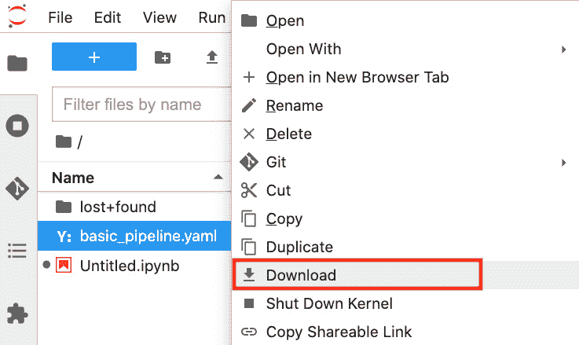

图 10.24 – 下载 basic_pipeline.yaml 文件

在上下文菜单中的选项列表中选择 **Download**（如 *图 10.24* 中所示）。这将下载 YAML 文件到您的本地机器的下载文件夹（或类似位置）。

1.  下载`basic_pipeline.yaml`文件后，导航到我们打开**Kubeflow 中央仪表板**的浏览器标签页。之后，通过点击**仪表板侧边栏中的**“管道”（在**Kubeflow 中央仪表板**）来导航到**管道**页面。

1.  接下来，点击我们在此部分生成的`basic_pipeline.yaml`文件来运行另一个管道。

重要提示

当运行新的管道时，请随意检查并遵循本章*运行我们的第一个 Kubeflow 管道*部分中指定的步骤。我们将把这留给你作为练习！（生成的管道应该是一样的。）

*这比预期的要简单，对吧？*在完成本章的动手实践解决方案后，我们应该为自己鼓掌！能够在 EKS 上正确设置 Kubeflow，并使用 Kubeflow 使自定义 ML 管道工作，这是一个成就。这应该给我们信心，使用我们现在使用的技术堆栈构建更复杂的 ML 管道。

在下一节中，我们将快速清理并删除本章中创建的资源。

# 清理

现在我们已经完成了本章的动手实践解决方案，是时候清理并关闭我们将不再使用的资源了。到目前为止，我们有一个运行着`5`个`m5.xlarge`实例的 EKS 集群。我们需要终止这些资源来管理成本。

注意

*如果我们不关闭这些（一个月），会花费多少钱？*至少（每月），运行 EC2 实例的费用大约为 700.80 美元（*5 个实例 x 0.192 美元 x 每月 730 小时*）加上*73 美元*用于 EKS 集群（*1 个集群 x 每小时 0.10 美元 x 每月 730 小时*），假设我们在俄勒冈地区（`us-west-2`）运行 EKS 集群。请注意，还将有与这些实例附加的 EBS 卷以及其他在本章中使用的资源相关的其他额外费用。

在接下来的步骤中，我们将卸载并删除 Cloud9 环境终端中的资源：

1.  让我们导航回 Cloud9 环境的**终端标签页**，我们在那里最后运行了以下命令（*注意：不要运行以下命令，因为我们只需要导航到运行此命令的标签页*）：

    ```py
    kubectl port-forward svc/istio-ingressgateway -n istio-system 8080:80 --address=localhost
    ```

我们应该在这个终端中找到一些**针对 8080 端口的连接处理日志**。

1.  在终端中按*Ctrl* + *C*（或者，如果您使用的是 Mac 设备，可以按*Cmd* + *C*）来停止此命令。

1.  之后，让我们运行以下命令，该命令使用`kubectl delete`来删除资源：

    ```py
    cd ~/environment/ch10/kubeflow-manifests/
    ```

    ```py
    cd deployments/vanilla/
    ```

    ```py
    kustomize build . | kubectl delete -f -
    ```

1.  让我们通过运行以下命令来删除 EKS 集群：

    ```py
    eksctl delete cluster --region $CLUSTER_REGION --name $CLUSTER_NAME
    ```

在运行命令之前，确保将`CLUSTER_REGION`和`CLUSTER_NAME`变量设置为适当的值。例如，如果您在俄勒冈地区运行 Kubernetes 集群，则`CLUSTER_REGION`应设置为`us-west-2`，而`CLUSTER_NAME`应设置为`kubeflow-eks-000`（这与`eks.yaml`文件中指定的类似）

重要提示

确保通过`eksctl`命令创建的 CloudFormation Stack 已被完全删除。您可以通过导航到 CloudFormation 控制台并检查是否存在状态为**DELETE_FAILED**的堆栈来完成此操作。如果是这种情况，只需重新尝试删除这些堆栈，直到所有资源都成功删除。

1.  最后，断开与运行 Cloud9 环境的 EC2 实例关联的 IAM 角色。我们将把这留给你作为练习！

在进入下一节之前，请确保已审查所有删除操作是否已成功完成。

# 推荐策略和最佳实践

在结束本章之前，我们将简要讨论在 EKS 上使用 Kubeflow 时的一些推荐策略和最佳实践。

让我们从确定我们可以改进我们设计和实现 ML 管道的方式开始。*我们可以对管道的初始版本进行哪些改进？*以下是我们可以实施的一些可能的升级：

+   通过允许我们的管道的第一步接受数据集输入路径作为输入参数（而不是像我们现在这样硬编码）来使管道更具可重用性

+   在使用管道组件时，构建和使用自定义容器镜像而不是使用`packages_to_install`参数

+   将模型工件保存到存储服务（如**Amazon S3**），这将帮助我们确保即使在 Kubernetes 集群被删除的情况下，我们也能保留工件

+   使用`ContainerOp`对象的`set_memory_limit()`和`set_cpu_limit()`方法将资源限制（如 CPU 和内存限制）添加到管道中的特定步骤。

+   利用**SageMaker 组件用于 Kubeflow Pipelines**将一些数据处理和训练工作负载移动到 SageMaker

注意

如果您对在准备**Kubeflow Pipelines 组件**时应用最佳实践感兴趣，请随时查看[`www.kubeflow.org/docs/components/pipelines/sdk/best-practices/`](https://www.kubeflow.org/docs/components/pipelines/sdk/best-practices/)。

接下来，让我们讨论一些我们可以实施的战略和解决方案来升级我们的 EKS 集群和 Kubeflow 设置：

+   在 Amazon EKS 集群上设置**CloudWatch Container Insights**以监控集群性能

+   设置和部署**Kubernetes Dashboard**和/或**Rancher**以管理和控制 Amazon EKS 集群资源

+   设置**Prometheus**和**Grafana**以监控 Kubernetes 集群

+   在访问**Kubeflow 中央仪表板**时更改默认用户密码

+   在部署 Kubeflow 时使用**AWS Cognito**作为身份提供者（用于 Kubeflow 用户认证）

+   使用 Amazon **关系数据库服务**（**RDS**）和 Amazon **简单存储服务**（**S3**）部署 Kubeflow 以存储元数据和管道工件

+   通过**应用程序负载均衡器**暴露和访问 Kubeflow

+   使用**Amazon Elastic File System**（**EFS**）与 Kubeflow 配合进行持久化存储

+   减少附加到运行 Cloud9 环境的 EC2 实例的 IAM 角色的权限（到一个最小权限集）

+   审计和升级每个使用的资源的网络安全配置

+   设置 EKS 集群的自动扩展（例如，使用**集群自动扩展器**）

+   为了管理运行 EKS 集群的长期成本，我们可以利用**成本节省计划**，这涉及到在做出长期承诺（例如，1 年或 3 年的承诺）后降低运行资源的总体成本

我们还可以添加更多内容到这个列表，但这些都足够现在使用了！请确保审查并检查在*第九章*中分享的推荐解决方案和策略，*安全、治理和合规策略*。

# 摘要

在本章中，我们使用**Kubeflow**、**Kubernetes**和**Amazon EKS**设置了我们的容器化机器学习环境。在设置好环境后，我们使用**Kubeflow Pipelines SDK**准备并运行了一个自定义的机器学习管道。完成所有必要的动手工作后，我们清理了我们创建的资源。在结束本章之前，我们讨论了使用本章动手部分所使用的技术栈来确保、扩展和管理机器学习管道的相关最佳实践和策略。

在下一章中，我们将使用**SageMaker Pipelines**——**Amazon SageMaker**专门用于自动化机器学习工作流程的解决方案——构建和设置一个机器学习管道。

# 进一步阅读

关于本章涵盖的主题的更多信息，请随时查看以下资源：

+   *Kubernetes 概念* ([`kubernetes.io/docs/concepts/`](https://kubernetes.io/docs/concepts/))

+   *Amazon EKS 入门* ([`docs.aws.amazon.com/eks/latest/userguide/getting-started.xhtml`](https://docs.aws.amazon.com/eks/latest/userguide/getting-started.xhtml))

+   *eksctl – Amazon EKS 的官方 CLI* ([`eksctl.io/`](https://eksctl.io/))

+   *Amazon EKS 故障排除* ([`docs.aws.amazon.com/eks/latest/userguide/troubleshooting.xhtml`](https://docs.aws.amazon.com/eks/latest/userguide/troubleshooting.xhtml))

+   *Kubeflow on AWS – 部署* ([`awslabs.github.io/kubeflow-manifests/docs/deployment/`](https://awslabs.github.io/kubeflow-manifests/docs/deployment/))

+   *Kubeflow on AWS Security* ([`awslabs.github.io/kubeflow-manifests/docs/about/security/`](https://awslabs.github.io/kubeflow-manifests/docs/about/security/))
