# 第十一章：使用 SageMaker Pipelines 的机器学习流水线

在 *第十章* 中，*使用 Amazon EKS 上的 Kubeflow 的机器学习流水线*，我们使用了 **Kubeflow**、**Kubernetes** 和 **Amazon EKS** 来构建和运行一个端到端的 **机器学习**（**ML**）流水线。在这里，我们能够在运行的 Kubernetes 集群中自动化 ML 过程中的几个步骤。如果你想知道我们是否也可以使用 **SageMaker** 的不同特性和功能来构建 ML 流水线，那么对这个问题的快速回答将是 *YES*！

在本章中，我们将使用 **SageMaker Pipelines** 来构建和运行自动化的机器学习工作流程。此外，我们还将演示如何在流水线执行期间利用 **AWS Lambda** 函数将训练好的模型部署到新的（或现有的）机器学习推理端点。

话虽如此，在本章中，我们将涵盖以下主题：

+   深入了解 SageMaker Pipelines

+   准备基本先决条件

+   使用 SageMaker Pipelines 运行第一个流水线

+   创建用于部署的 Lambda 函数

+   测试我们的机器学习推理端点

+   完成端到端的机器学习流水线

+   清理

+   推荐策略和最佳实践

完成本章的动手实践解决方案后，我们应该具备使用 **Amazon SageMaker** 的不同功能构建更复杂的机器学习流水线和工作流程的技能！

# 技术要求

在我们开始之前，重要的是我们以下准备工作已经就绪：

+   一款网络浏览器（最好是 Chrome 或 Firefox）

+   访问本书前几章中使用的 AWS 账户和 **SageMaker Studio** 域

+   在你的本地机器上安装一个文本编辑器（例如，**VS Code**），我们将用它来存储和复制字符串值，以便在本章的后续使用中

每章使用的 Jupyter 笔记本、源代码和其他文件可在以下存储库中找到：[`github.com/PacktPublishing/Machine-Learning-Engineering-on-AWS`](https://github.com/PacktPublishing/Machine-Learning-Engineering-on-AWS)。

重要提示

建议在运行本书中的示例时，使用具有有限权限的 IAM 用户，而不是根账户。如果你刚开始使用 AWS，你可以暂时使用根账户。

# 深入了解 SageMaker Pipelines

通常，数据科学团队会从手动执行 ML 实验和部署开始。一旦他们需要标准化工作流程并启用 **自动模型重新训练** 以定期刷新已部署的模型，这些团队就会开始考虑使用 ML 流水线来自动化他们工作的一部分。在 *第六章* 中，*SageMaker 训练和调试解决方案*，我们学习了如何使用 **SageMaker Python SDK** 训练一个 ML 模型。通常，使用 SageMaker Python SDK 训练 ML 模型涉及运行几行代码，类似于以下代码块：

```py
estimator = Estimator(...) 
estimator.set_hyperparameters(...)
estimator.fit(...)
```

*如果我们想准备一个自动化的 ML 管道并将其作为步骤之一包含在内，会怎么样？* 您可能会惊讶，我们只需要添加几行代码就可以将其转换为可以包含在管道中的步骤！要将此转换为使用`TrainingStep`对象（类似于以下代码块中的内容）的步骤：

```py
step_train = TrainingStep(
    name="TrainModel",
    estimator=estimator,
    inputs=...
)
```

*哇！这不是很神奇吗？* 这意味着使用**SageMaker Python SDK**手动训练和部署 ML 模型的现有笔记本可以很容易地通过添加几行代码转换为使用 SageMaker 管道！*其他步骤呢？* 我们还有以下类：

+   `ProcessingStep` – 这是为了使用**SageMaker 处理**处理数据。

+   `TuningStep` – 这是为了使用 SageMaker 的**自动模型调优**功能创建超参数调优作业。

+   `ModelStep` – 这是为了创建并将 SageMaker 模型注册到**SageMaker 模型注册表**。

+   `TransformStep` – 这是为了使用 SageMaker 的**批量转换**功能在数据集上运行推理。

+   `ConditionStep` – 这是为了支持执行管道步骤的条件分支。

+   `CallbackStep` – 这是为了在 SageMaker 管道中包含不直接可用或受支持的定制步骤。

+   `LambdaStep` – 这是为了运行**AWS Lambda**函数。

注意

注意，这并不是步骤的完整列表，因为还有其他步骤可以用于更具体的用例。您可以在[`docs.aws.amazon.com/sagemaker/latest/dg/build-and-manage-steps.xhtml`](https://docs.aws.amazon.com/sagemaker/latest/dg/build-and-manage-steps.xhtml)找到**SageMaker 管道步骤**的完整列表。

在*第四章* *AWS 上的无服务器数据管理*中，我们在 Redshift 集群和 Athena 表中存储和查询我们的数据。如果我们需要直接从这些数据源查询数据，我们可以使用`ProcessingStep`对象，该对象稍后将添加到管道中。一旦处理作业完成，它将输出文件存储在 S3 中，然后可以被训练作业或自动模型调优作业拾取和处理。如果我们需要将其转换为步骤，我们可以创建相应的`TrainingStep`对象（如果我们将运行训练作业）或`TuningStep`对象（如果我们将运行自动模型调优作业），然后稍后将其添加到管道中。*训练（或调优）作业完成后会发生什么？* 我们可以选择将生成的模型存储在随后将添加到管道中的`ModelStep`对象中。让我们参考*图 11.1*来帮助我们可视化一旦我们准备好了管道的不同步骤，这一切是如何工作的：

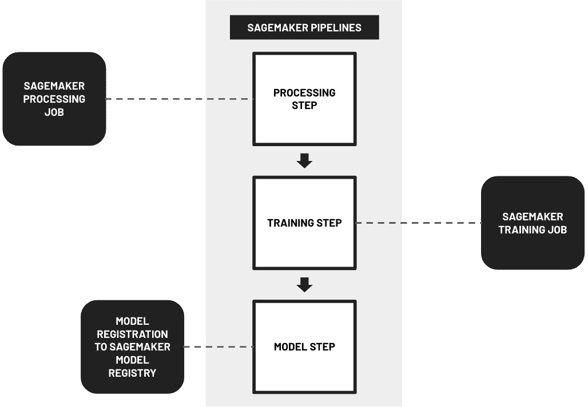

图 11.1 – 使用 SageMaker 管道

在*图 11.1*中，我们可以看到`Pipeline`对象，它映射到 ML 管道定义：

```py
pipeline = Pipeline(
    name=...,
    parameters=...,
    steps=[
        ..., 
        step_train,
        ...
    ],
)
# create (or update) the ML pipeline
pipeline.upsert(...)
```

然后，要运行管道，我们只需要调用 `start()` 方法：

```py
execution = pipeline.start()
```

一旦管道开始，我们就必须等待所有步骤完成执行（一次一个步骤）或如果某个步骤发生错误，则停止管道。要调试和故障排除正在运行的管道，我们可以轻松地导航到 **SageMaker Studio** 的 **SageMaker 资源** 选项卡，并找到相应的管道资源。我们应该看到一个与 *图 11.2* 中类似的管道执行图。

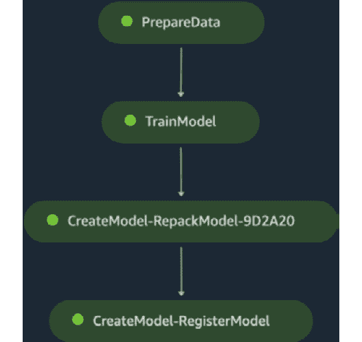

图 11.2 – 管道执行

在这里，我们可以看到管道中的所有步骤都已成功完成，我们训练的模型也已注册到 SageMaker 模型注册表中。如果我们希望再次运行管道（例如，使用不同的输入数据集），我们只需触发另一个管道执行，并传递一个不同的管道参数值，该参数值指向新输入数据集的存储位置。*真酷，不是吗？* 此外，我们还可以通过单击我们想要检查的步骤对应的圆形矩形，深入了解每个步骤中发生的情况（或已发生的情况），然后查看输入参数、输出值、机器学习指标值、用于训练模型的超参数以及步骤执行期间生成的日志。这使我们能够了解管道执行期间发生的情况，并在管道执行过程中遇到错误时进行故障排除。

到目前为止，我们一直在讨论一个相对简单的管道，该管道包含三个或四个步骤，这些步骤是顺序执行的。此外，**SageMaker Pipelines** 允许我们构建更复杂的机器学习管道，这些管道利用类似于我们在 *图 11.3* 中的条件步骤：

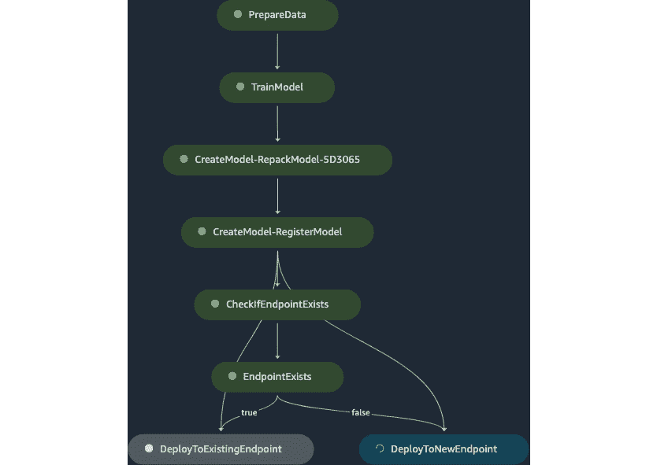

图 11.3 – 带有条件步骤的机器学习管道

在这里，使用 `ConditionStep`，管道检查是否存在机器学习推理端点（给定端点名称），并根据端点的存在与否执行以下步骤之一：

+   *部署模型到新端点* – 使用 `LambdaStep`，它映射到一个 **AWS Lambda** 函数，如果端点尚不存在，则将机器学习模型部署到新的机器学习推理端点

+   *部署模型到现有端点* – 使用 `LambdaStep`，它映射到一个 **AWS Lambda** 函数，如果端点已经存在（**零停机时间部署**），则将机器学习模型部署到现有的机器学习推理端点

*酷吧？* *更酷的是，这正是本章我们将要构建的管道!* 构建机器学习管道可能一开始会让人感到害怕。然而，只要我们迭代地构建和测试管道，并使用正确的工具集，我们就应该能够构建出我们需要的机器学习管道，以自动化手动流程。

既然我们对 **SageMaker Pipelines** 的工作原理有了更好的理解，让我们继续进行本章的动手部分。

注意

在这一点上，你可能想知道为什么我们应该使用 **SageMaker Pipelines** 而不是 **Kubeflow** 和 **Kubernetes**。SageMaker Pipelines 与 Kubeflow 之间的一个主要区别是，在 SageMaker 中用于训练 ML 模型的实例在训练步骤完成后会自动删除。这有助于降低总体成本，因为这些训练实例仅在需要训练模型时才运行。另一方面，Kubeflow 所需的基础设施需要在任何训练步骤开始之前就绪。请注意，这只是其中之一的不同之处，在选择“正确”的工具时还有其他需要考虑的事项。当然，在某些情况下，数据科学团队可能会选择 Kubeflow，因为团队成员已经熟悉 Kubernetes 的使用（或者他们已经在运行生产 Kubernetes 工作负载）。为了帮助您和您的团队正确评估这些工具，我建议首先尝试使用这两种选项构建示例 ML 管道。

# 准备基本先决条件

在本节中，我们将确保以下先决条件已准备就绪：

+   附有 `AWSLambda_FullAccess` AWS 管理权限策略的 SageMaker Studio 域执行角色 – 这将允许 Lambda 函数在本章的 *完成端到端 ML 管道* 部分中无问题地运行。

+   IAM 角色 (`pipeline-lambda-role`) – 这将在本章的 *创建部署 Lambda 函数* 部分中用于运行 Lambda 函数。

+   `processing.py` 文件 – 这将由 **SageMaker 处理** 作业用于处理输入数据并将其分割成训练集、验证集和测试集。

+   `bookings.all.csv` 文件 – 这将作为 ML 管道的输入数据集。

重要提示

在本章中，我们将创建并管理我们在 `us-west-2` 区域的资源。在继续下一步之前，请确保您已设置正确的区域。

准备这些基本先决条件对于确保我们在本章准备和运行 ML 管道时不会遇到意外的阻碍至关重要。话虽如此，让我们继续在下一组步骤中准备这些先决条件：

1.  让我们从在 AWS 管理控制台的搜索栏中导航到 `sagemaker studio` 开始，将鼠标悬停在搜索结果框的 **Amazon SageMaker** 上，然后点击 **Top features** 下的 **SageMaker Studio** 链接。

1.  在 SageMaker Studio **控制面板** 页面上，找到附着在 **域** 框旁边的 **执行角色** 部分（如图 11.4 所示）：

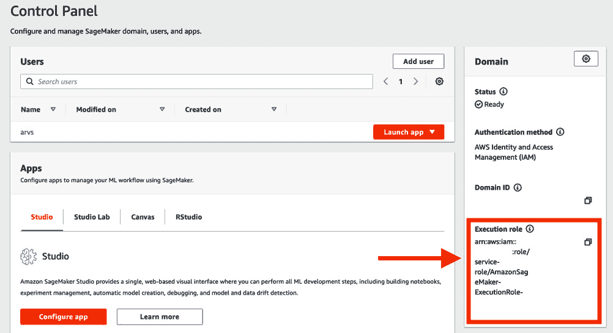

图 11.4 – 复制执行角色名称

定位并复制以下值到您的本地机器上的文本编辑器中：

+   `arn:aws:iam::<ACCOUNT ID>:role/service-role/`。执行角色名称可能遵循类似于图 11.4 中的`AmazonSageMaker-ExecutionRole-<DATETIME>`格式。确保在复制执行角色名称时排除`arn:aws:iam::<ACCOUNT ID>:role/service-role/`。

+   `arn:aws:iam::<ACCOUNT ID>:role/service-role/`。执行角色 ARN 应遵循`arn:aws:iam::<ACCOUNT ID>:role/service-role/AmazonSageMaker-ExecutionRole-<DATETIME>`格式。

注意

我们将在本章的**创建用于部署的 Lambda 函数**部分测试 Lambda 函数时使用执行角色 ARN。

1.  导航到 AWS 管理控制台的搜索栏中的`iam`，将鼠标悬停在**IAM**的搜索结果框上，然后单击**角色**链接下的**顶级功能**。

1.  在**角色**页面，通过在搜索框中输入执行角色名称（该名称已复制到您的本地机器上的文本编辑器中）来搜索并定位执行角色（如图 11.5 所示）：

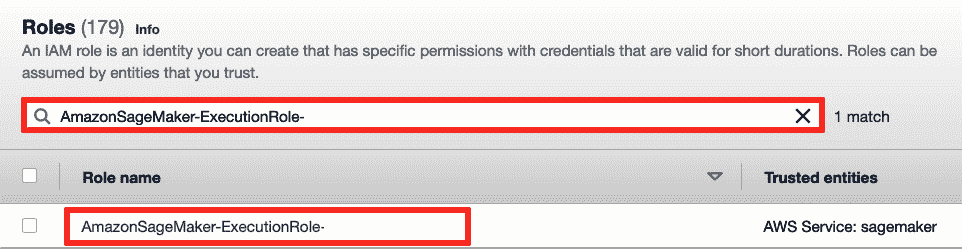

图 11.5 – 导航到特定角色页面

这应该会过滤结果并显示一行类似于图 11.5 中的行。单击**角色名称**列下的链接以导航到可以修改角色权限的页面。

1.  定位到**权限策略**表（在**权限**选项卡内），然后单击**添加权限**以打开一个选项的下拉菜单。从可用选项中选择**附加策略**。这应该会带我们到可以查看**当前权限策略**部分的页面，并在**其他权限策略**下附加额外的策略。

1.  使用搜索栏（在`AWSLambda_FullAccess`策略下）查找`AWSLambda_FullAccess` AWS 托管权限策略。之后，单击**附加策略**按钮。

注意

在单击**附加策略**按钮后，您应该会看到以下成功通知消息：**策略已成功附加到角色**。

1.  现在，让我们创建我们将用于创建 Lambda 函数的 IAM 角色。导航到**角色**页面（使用侧边栏）然后单击**创建角色**按钮。

1.  在**选择受信任实体**页面（*步骤 1*），执行以下步骤：

    +   在**受信任实体类型**下，从可用选项中选择**AWS 服务**。

    +   在**用例**下，从**常用用例**中选择**Lambda**。

    +   之后，单击**下一步**按钮。

1.  在`AmazonSageMakerFullAccess`策略中。

1.  搜索并选择`AWSLambdaExecute`策略。

1.  在切换两个策略的单选按钮后，单击**下一步**按钮。

1.  在**角色名称**下的`pipeline-lambda-role`。

1.  滚动到页面底部，然后单击**创建角色**按钮。

注意

在点击**创建角色**按钮后，您应该会看到以下成功通知消息：**角色 pipeline-lambda-role 已创建**。

1.  导航回 AWS 管理控制台的搜索栏中的`sagemaker studio`，然后点击**顶级功能**下的**SageMaker Studio**链接（在悬停于**Amazon SageMaker**搜索结果框上方时）。

1.  点击**启动应用**，然后从下拉选项中选择**Studio**。

注意

这将带您进入**SageMaker Studio**。等待几秒钟，直到界面加载完成。

1.  现在，让我们继续创建`CH11`文件夹，我们将在这个文件夹中存储本章中与我们的机器学习管道相关的文件。在**文件浏览器**侧边栏的空白区域右键单击以打开一个类似于*图 11.6*所示的下拉菜单：

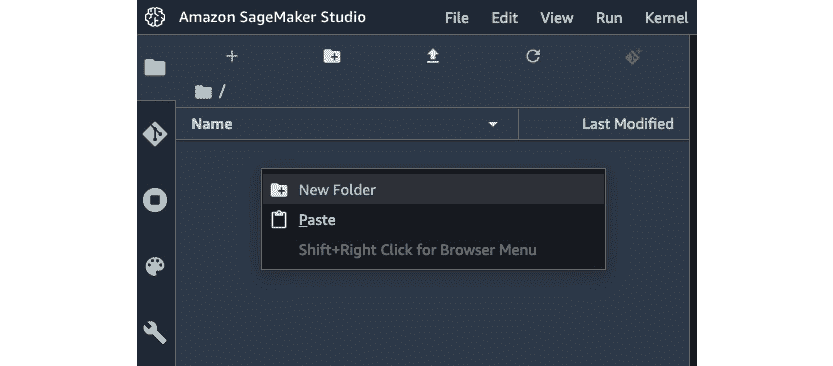

图 11.6 – 创建新文件夹

选择`CH11`。然后，通过在侧边栏中双击相应的文件夹名称来导航到`CH11`目录。

1.  通过在`CH11`目录中点击`.ipynb`文件创建一个新的笔记本，我们可以在其中运行我们的 Python 代码。

1.  在`数据科学`（在 Sagemaker 映像下找到的选项）

1.  `Python 3`

1.  `无脚本`

1.  之后，点击**选择**按钮。

注意

等待内核启动。这一步可能需要 3-5 分钟，在此期间正在配置一个机器学习实例以运行 Jupyter 笔记本单元格。确保在完成本章的所有动手练习后（或如果您不再使用它）停止此实例。有关更多信息，请随时查看本章末尾附近的*清理*部分。

1.  右键单击标签名称，然后选择`Machine Learning Pipelines with SageMaker Pipelines.ipynb`。

1.  在`Machine Learning Pipelines with SageMaker Pipelines.ipynb`笔记本的第一个单元格中，运行以下命令：

    ```py
    !wget -O processing.py https://bit.ly/3QiGDQO
    ```

这应该会下载一个`processing.py`文件，该文件执行以下操作：

+   加载`dataset.all.csv`文件并将数据存储在一个 DataFrame 中。

+   执行**训练-测试分割**，这将把 DataFrame 分割成三个 DataFrame（包含训练集、验证集和测试集）。

+   确保在保存输出 CSV 文件之前已经创建了输出目录。

+   将包含训练集、验证集和测试集的 DataFrames 保存到输出目录中相应的 CSV 文件中。

注意

随意检查下载的`processing.py`文件的内容。此外，您可以在[`github.com/PacktPublishing/Machine-Learning-Engineering-on-AWS/blob/main/chapter11/processing.py`](https://github.com/PacktPublishing/Machine-Learning-Engineering-on-AWS/blob/main/chapter11/processing.py)找到`processing.py`脚本文件的副本。

1.  接下来，让我们使用`mkdir`命令创建一个`tmp`目录，如果它还不存在的话：

    ```py
    !mkdir -p tmp
    ```

1.  之后，使用`wget`命令下载`bookings.all.csv`文件：

    ```py
    !wget -O tmp/bookings.all.csv https://bit.ly/3BUcMK4
    ```

在这里，我们下载了一个更干净版本的合成 `bookings.all.csv` 文件，类似于我们在 *第一章*，*AWS 上的机器学习工程导论* 中使用的版本。然而，这次已经应用了多个数据清洗和转换步骤，以产生更高品质的模型。

1.  指定一个唯一的 S3 桶名称和前缀。在运行以下代码块之前，请确保将 `<INSERT S3 BUCKET NAME HERE>` 的值替换为唯一的 S3 桶名称：

    ```py
    s3_bucket = '<INSERT S3 BUCKET NAME HERE>'
    ```

    ```py
    prefix = 'pipeline'
    ```

您可以使用上一章中创建的 S3 桶之一，并将 `s3_bucket` 的值更新为 S3 桶名称。如果您计划创建并使用新的 S3 桶，请确保将 `s3_bucket` 的值更新为一个尚未存在的桶名称。之后，运行以下命令：

```py
!aws s3 mb s3://{s3_bucket}
```

注意，此命令仅在计划创建新的 S3 桶时才应执行。

注意

将 S3 桶名称复制到您本地机器上的文本编辑器。我们将在本章的 *测试我们的机器学习推理端点* 部分中使用它。

1.  让我们准备上传 CSV 文件的路径：

    ```py
    source_path = f's3://{s3_bucket}/{prefix}' + \
    ```

    ```py
                   '/source/dataset.all.csv'
    ```

1.  最后，让我们使用 `aws s3 cp` 命令将 `bookings.all.csv` 文件上传到 S3 桶：

    ```py
    !aws s3 cp tmp/bookings.all.csv {source_path}
    ```

在这里，CSV 文件在上传到 S3 桶时被重命名为 `dataset.all.csv` 文件（因为我们已经在 `source_path` 变量中指定了这一点）。

准备好先决条件后，我们现在可以开始运行我们的第一个管道了！

# 使用 SageMaker Pipelines 运行我们的第一个管道

在 *第一章*，*AWS 上的机器学习工程导论* 中，我们安装并使用了 **AutoGluon** 在 AWS Cloud9 环境中训练多个机器学习模型（使用 **AutoML**）。此外，我们还使用各种工具和库手动执行了机器学习过程的各个步骤。在本章中，我们将将这些手动执行的步骤转换为自动化管道，这样我们只需要提供输入数据集，机器学习管道就会为我们完成剩余的工作（并将训练好的模型存储在模型注册表中）。

注意

我们将使用内置的 **AutoGluon-Tabular** 算法而不是准备一个定制的 Docker 容器镜像来使用 AutoGluon 训练机器学习模型。有了可用的内置算法，我们只需要担心超参数值和我们将用于配置训练作业的附加配置参数。

话虽如此，本节分为两部分：

+   *定义和准备我们的第一个机器学习管道* – 这是我们将定义并准备一个包含以下步骤的管道的地方：

    +   `PrepareData` – 这利用 **SageMaker Processing** 作业处理输入数据集并将其分割为训练、验证和测试集。

    +   `TrainModel` – 这利用内置的 **AutoGluon-Tabular** 算法来训练一个分类模型。

    +   `RegisterModel` – 这将训练的机器学习模型注册到 **SageMaker 模型注册表**。

+   *运行我们的第一个机器学习流水线* – 这是我们将使用`start()`方法来执行流水线的地方。

考虑到这些，让我们开始准备我们的机器学习流水线。

## 定义和准备我们的第一个机器学习流水线

我们将准备的第一条流水线将是一个相对简单的流水线，包括三个步骤——包括数据准备步骤、模型训练步骤和模型注册步骤。为了帮助我们可视化使用**SageMaker Pipelines**的第一个机器学习流水线将是什么样子，让我们快速查看*图 11.7*：

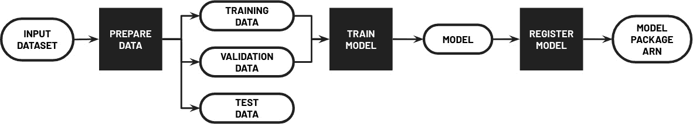

图 11.7 – 使用 SageMaker Pipelines 的我们的第一个机器学习流水线

在这里，我们可以看到我们的流水线接受一个输入数据集，并将该数据集分为训练集、验证集和测试集。然后，使用训练集和验证集来训练一个机器学习模型，该模型随后被注册到**SageMaker 模型注册表**。

现在我们已经对我们的流水线有了很好的了解，让我们在下一个步骤中在`Machine Learning Pipelines with SageMaker Pipelines.ipynb` Jupyter 笔记本中运行以下代码块：

1.  让我们首先从`boto3`和`sagemaker`导入构建块：

    ```py
    import boto3
    ```

    ```py
    import sagemaker
    ```

    ```py
    from sagemaker import get_execution_role
    ```

    ```py
    from sagemaker.sklearn.processing import (
    ```

    ```py
        SKLearnProcessor
    ```

    ```py
    )
    ```

    ```py
    from sagemaker.workflow.steps import (
    ```

    ```py
        ProcessingStep, 
    ```

    ```py
        TrainingStep
    ```

    ```py
    )
    ```

    ```py
    from sagemaker.workflow.step_collections import (
    ```

    ```py
        RegisterModel
    ```

    ```py
    )
    ```

    ```py
    from sagemaker.processing import (
    ```

    ```py
        ProcessingInput, 
    ```

    ```py
        ProcessingOutput
    ```

    ```py
    )
    ```

    ```py
    from sagemaker.workflow.parameters import (
    ```

    ```py
        ParameterString
    ```

    ```py
    )
    ```

    ```py
    from sagemaker.inputs import TrainingInput
    ```

    ```py
    from sagemaker.estimator import Estimator
    ```

    ```py
    from sagemaker.workflow.pipeline import Pipeline
    ```

1.  将 SageMaker 执行角色的 ARN 存储在`role`变量中：

    ```py
    role = get_execution_role()
    ```

注意

`get_execution_role()`函数应返回我们在本章*准备基本先决条件*部分修改的 IAM 角色的 ARN。

1.  此外，让我们准备 SageMaker 的`Session`对象：

    ```py
    session = sagemaker.Session()
    ```

1.  让我们初始化一个`ParameterString`对象，该对象映射到指向存储输入数据集的`Pipeline`参数：

    ```py
    input_data = ParameterString(
    ```

    ```py
        name="RawData",
    ```

    ```py
        default_value=source_path, 
    ```

    ```py
    )
    ```

1.  让我们准备包含映射到**SageMaker Processing**作业输出结果配置的`ProcessingOutput`对象输入源配置的`ProcessingInput`对象：

    ```py
    input_raw = ProcessingInput(
    ```

    ```py
        source=input_data,
    ```

    ```py
        destination='/opt/ml/processing/input/'
    ```

    ```py
    )
    ```

    ```py
    output_split = ProcessingOutput(
    ```

    ```py
        output_name="split",
    ```

    ```py
        source='/opt/ml/processing/output/', 
    ```

    ```py
        destination=f's3://{s3_bucket}/{prefix}/output/'
    ```

    ```py
    )
    ```

1.  让我们初始化`SKLearnProcessor`对象以及相应的`ProcessingStep`对象：

    ```py
    processor = SKLearnProcessor(
    ```

    ```py
        framework_version='0.20.0',
    ```

    ```py
        role=role,
    ```

    ```py
        instance_count=1,
    ```

    ```py
        instance_type='ml.m5.large'
    ```

    ```py
    )
    ```

    ```py
    step_process = ProcessingStep(
    ```

    ```py
        name="PrepareData",  
    ```

    ```py
        processor=processor,
    ```

    ```py
        inputs=[input_raw],
    ```

    ```py
        outputs=[output_split],
    ```

    ```py
        code="processing.py",
    ```

    ```py
    )
    ```

为了帮助我们可视化我们如何配置`ProcessingStep`对象，让我们快速查看*图 11.8*：

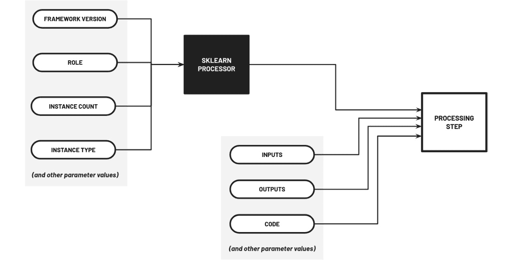

图 11.8 – 配置和准备 ProcessingStep

在这里，我们使用配置的`SKLearnProcessor`对象以及`inputs`、`outputs`和`code`参数的参数值初始化了`ProcessingStep`对象。

1.  接下来，让我们准备`model_path`变量，使其指向模型在 SageMaker 训练作业完成后（在后续步骤中执行机器学习流水线时）上传的位置：

    ```py
    model_path = f"s3://{s3_bucket}/{prefix}/model/"
    ```

1.  此外，让我们准备`model_id`变量以存储我们将使用的机器学习模型的 ID：

    ```py
    model_id = "autogluon-classification-ensemble"
    ```

1.  让我们指定我们正在使用的区域，并将其存储在`region_name`变量中：

    ```py
    region_name = "us-west-2"
    ```

1.  使用`image_uris.retrieve()`获取我们的训练图像的 ECR 容器镜像 URI：

    ```py
    from sagemaker import image_uris
    ```

    ```py
    train_image_uri = image_uris.retrieve(
    ```

    ```py
        region=region_name,
    ```

    ```py
        framework=None,
    ```

    ```py
        model_id=model_id,
    ```

    ```py
        model_version="*",
    ```

    ```py
        image_scope="training",
    ```

    ```py
        instance_type="ml.m5.xlarge",
    ```

    ```py
    )
    ```

如果你想知道 `train_image_uri` 的值，它应该有一个等于（或类似）的字符串值：`'763104351884.dkr.ecr.us-west-2.amazonaws.com/autogluon-training:0.4.0-cpu-py38'`。

1.  使用 `script_uris.retrieve()` 获取与模型关联的脚本 S3 URI（给定 `model_id`、`model_version` 和 `script_scope` 的值）：

    ```py
    from sagemaker import script_uris
    ```

    ```py
    train_source_uri = script_uris.retrieve(
    ```

    ```py
        model_id=model_id, 
    ```

    ```py
        model_version="*", 
    ```

    ```py
        script_scope="training"
    ```

    ```py
    )
    ```

注意，`train_source_uri` 应该有一个等于（或类似）的字符串值：`'s3://jumpstart-cache-prod-us-west-2/source-directory-tarballs/autogluon/transfer_learning/classification/v1.0.1/sourcedir.tar.gz'`。

注意

`sourcedir.tar.gz` 文件里有什么？如果调用 `script_uris.retrieve()` 时使用的 `script_scope` 值是 `"training"`，则 `sourcedir.tar.gz` 文件应包含在训练 ML 模型时使用 `autogluon.tabular.TabularPredictor` 的代码。注意，`sourcedir.tar.gz` 的内容取决于调用 `script_uris.retrieve()` 时指定的参数。

1.  使用 `model_uris.retrieve()` 获取与模型关联的模型工件 S3 URI（给定 `model_id`、`model_version` 和 `model_scope` 的值）：

    ```py
    from sagemaker import model_uris
    ```

    ```py
    train_model_uri = model_uris.retrieve(
    ```

    ```py
        model_id=model_id, 
    ```

    ```py
        model_version="*", 
    ```

    ```py
        model_scope="training"
    ```

    ```py
    )
    ```

注意，`train_model_uri` 应该有一个等于（或类似）的字符串值：`'s3://jumpstart-cache-prod-us-west-2/autogluon-training/train-autogluon-classification-ensemble.tar.gz'`。

1.  当 `train_image_uri`、`train_source_uri`、`train_model_uri` 和 `model_path` 的值准备就绪后，我们现在可以初始化 `Estimator` 对象：

    ```py
    from sagemaker.estimator import Estimator
    ```

    ```py
    estimator = Estimator(
    ```

    ```py
        image_uri=train_image_uri,
    ```

    ```py
        source_dir=train_source_uri,
    ```

    ```py
        model_uri=train_model_uri,
    ```

    ```py
        entry_point="transfer_learning.py",
    ```

    ```py
        instance_count=1,
    ```

    ```py
        instance_type="ml.m5.xlarge",
    ```

    ```py
        max_run=900,
    ```

    ```py
        output_path=model_path,
    ```

    ```py
        session=session,
    ```

    ```py
        role=role
    ```

    ```py
    )
    ```

在这里，`entry_point` 值指向存储在 `sourcedir.tar.gz` 内的 `transfer_learning.py` 脚本文件，其中包含训练模型的相应脚本。

1.  接下来，让我们使用 `retrieve_default()` 函数检索我们 **AutoGluon** 分类模型的默认超参数集：

    ```py
    from sagemaker.hyperparameters import retrieve_default
    ```

    ```py
    hyperparameters = retrieve_default(
    ```

    ```py
        model_id=model_id, 
    ```

    ```py
        model_version="*"
    ```

    ```py
    )
    ```

    ```py
    hyperparameters["verbosity"] = "3"
    ```

    ```py
    estimator.set_hyperparameters(**hyperparameters) 
    ```

1.  在初始化时，使用 `Estimator` 对象作为参数值之一来准备 `TrainingStep` 对象：

    ```py
    s3_data = step_process         \
    ```

    ```py
        .properties                \
    ```

    ```py
        .ProcessingOutputConfig    \
    ```

    ```py
        .Outputs["split"]          \
    ```

    ```py
        .S3Output.S3Uri            \
    ```

    ```py
    step_train = TrainingStep(
    ```

    ```py
        name="TrainModel",
    ```

    ```py
        estimator=estimator,
    ```

    ```py
        inputs={
    ```

    ```py
            "training": TrainingInput(
    ```

    ```py
                s3_data=s3_data,
    ```

    ```py
            )
    ```

    ```py
        },
    ```

    ```py
    )
    ```

在这里，`s3_data` 包含一个指向使用 `s3_data.__dict__` 的 `s3_data` 输出文件路径的 `Properties` 对象，我们应该得到一个类似于以下内容的字典：

```py
{'step_name': 'PrepareData',
 'path':  "ProcessingOutputConfig.Outputs['split']
           .S3Output.S3Uri",
 '_shape_names': ['S3Uri'],
 '__str__': 'S3Uri'} 
```

为了帮助我们可视化我们如何配置 `TrainingStep` 对象，让我们快速查看 *图 11.9*：

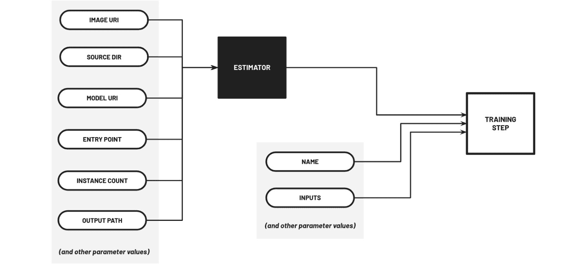

图 11.9 – 配置和准备 TrainingStep 对象

在这里，我们使用配置的 `Estimator` 对象以及 `name` 和 `inputs` 参数的参数值初始化 `TrainingStep` 对象。

1.  现在，让我们使用 `image_uris.retrieve()` 和 `script_uris.retrieve()` 检索部署 AutoGluon 分类模型的容器镜像 URI 和脚本 URI：

    ```py
    deploy_image_uri = image_uris.retrieve(
    ```

    ```py
        region=region_name,
    ```

    ```py
        framework=None,
    ```

    ```py
        image_scope="inference",
    ```

    ```py
        model_id=model_id,
    ```

    ```py
        model_version="*",
    ```

    ```py
        instance_type="ml.m5.xlarge",
    ```

    ```py
    )
    ```

    ```py
    deploy_source_uri = script_uris.retrieve(
    ```

    ```py
        model_id=model_id, 
    ```

    ```py
        model_version="*", 
    ```

    ```py
        script_scope="inference"
    ```

    ```py
    )
    ```

1.  使用 `aws s3 cp` 命令将 `sourcedir.tar.gz` 文件下载到 `tmp` 目录：

    ```py
    !aws s3 cp {deploy_source_uri} tmp/sourcedir.tar.gz
    ```

1.  接下来，将 `tmp` 目录中的 `sourcedir.tar.gz` 文件上传到你的 S3 桶：

    ```py
    updated_source_uri = f's3://{s3_bucket}/{prefix}' + \
    ```

    ```py
                          '/sourcedir/sourcedir.tar.gz'
    ```

    ```py
    !aws s3 cp tmp/sourcedir.tar.gz {updated_source_uri}
    ```

1.  让我们定义 `random_string()` 函数：

    ```py
    import uuid
    ```

    ```py
    def random_string():
    ```

    ```py
        return uuid.uuid4().hex.upper()[0:6]
    ```

此函数应返回一个由 6 个字符组成的随机字母数字字符串。

1.  在 `deploy_image_uri`、`updated_source_uri` 和 `model_data` 的值准备就绪后，我们现在可以初始化 `Model` 对象：

    ```py
    from sagemaker.model import Model
    ```

    ```py
    from sagemaker.workflow.pipeline_context import \
    ```

    ```py
        PipelineSession
    ```

    ```py
    pipeline_session = PipelineSession()
    ```

    ```py
    model_data = step_train    \
    ```

    ```py
        .properties            \
    ```

    ```py
        .ModelArtifacts        \
    ```

    ```py
        .S3ModelArtifacts      \
    ```

    ```py
    model = Model(image_uri=deploy_image_uri, 
    ```

    ```py
                  source_dir=updated_source_uri,
    ```

    ```py
                  model_data=model_data,
    ```

    ```py
                  role=role,
    ```

    ```py
                  entry_point="inference.py",
    ```

    ```py
                  sagemaker_session=pipeline_session,
    ```

    ```py
                  name=random_string())
    ```

在这里，我们使用之前步骤中定义的 `random_string()` 函数作为 `Model` 对象的名称标识符。

1.  接下来，让我们准备使用 `model.register()` 输出初始化的 `ModelStep` 对象：

    ```py
    from sagemaker.workflow.model_step import ModelStep
    ```

    ```py
    model_package_group_name = "AutoGluonModelGroup"
    ```

    ```py
    register_args = model.register(
    ```

    ```py
        content_types=["text/csv"],
    ```

    ```py
        response_types=["application/json"],
    ```

    ```py
        inference_instances=["ml.m5.xlarge"],
    ```

    ```py
        transform_instances=["ml.m5.xlarge"],
    ```

    ```py
        model_package_group_name=model_package_group_name,
    ```

    ```py
        approval_status="Approved",
    ```

    ```py
    )
    ```

    ```py
    step_model_create = ModelStep(
    ```

    ```py
        name="CreateModel",
    ```

    ```py
        step_args=register_args
    ```

    ```py
    )
    ```

1.  现在，让我们使用之前步骤中准备的不同步骤对象初始化 `Pipeline` 对象：

    ```py
    pipeline_name = f"PARTIAL-PIPELINE"
    ```

    ```py
    partial_pipeline = Pipeline(
    ```

    ```py
        name=pipeline_name,
    ```

    ```py
        parameters=[
    ```

    ```py
            input_data
    ```

    ```py
        ],
    ```

    ```py
        steps=[
    ```

    ```py
            step_process, 
    ```

    ```py
            step_train,
    ```

    ```py
            step_model_create,
    ```

    ```py
        ],
    ```

    ```py
    )
    ```

1.  最后，让我们使用 `upsert()` 方法创建我们的 ML 管道：

    ```py
    partial_pipeline.upsert(role_arn=role)
    ```

注意

注意，`upsert()` 方法也可以用来更新现有的 ML 管道。

现在我们初始的管道已经准备好了，我们可以继续运行 ML 管道！

## 运行第一个 ML 管道

一旦初始化并创建了 `Pipeline` 对象，我们就可以立即使用 `start()` 方法运行它，这与以下代码行类似：

```py
execution = partial_pipeline.start()
```

如果我们希望覆盖管道输入的默认参数（例如，使用的输入数据），我们可以在调用 `start()` 方法时指定参数值，类似于以下代码块：

```py
execution = partial_pipeline.start(
    parameters=dict(
        RawData="<INSERT NEW SOURCE PATH>",
    )
)
```

一旦管道执行开始，我们就可以使用 `execution.wait()` 等待管道运行完成。

考虑到这一点，让我们在接下来的步骤中运行我们的 ML 管道：

1.  一切准备就绪后，让我们使用 `start()` 方法运行（部分）ML 管道：

    ```py
    execution = partial_pipeline.start()
    ```

    ```py
    execution.describe()
    ```

1.  让我们使用 `wait()` 方法等待管道完成后再继续：

    ```py
    execution.wait()
    ```

注意

这可能需要大约 10-15 分钟才能完成。在等待时，不妨来一杯咖啡或茶！

1.  运行以下代码块以获取结果模型包 ARN：

    ```py
    steps = execution.list_steps()
    ```

    ```py
    steps[0]['Metadata']['RegisterModel']['Arn']
    ```

这应该会生成一个类似于 `arn:aws:sagemaker:us-west-2:<ACCOUNT ID>:model-package/autogluonmodelgroup/1` 格式的 ARN。将此值复制到您的文本编辑器中。我们将在本章的 *创建用于部署的 Lambda 函数* 部分测试 Lambda 函数时使用此模型包 ARN。

1.  在 SageMaker Studio 左侧边栏底部找到并单击三角形图标（**SageMaker 资源**）（如图 11.10 所示）：

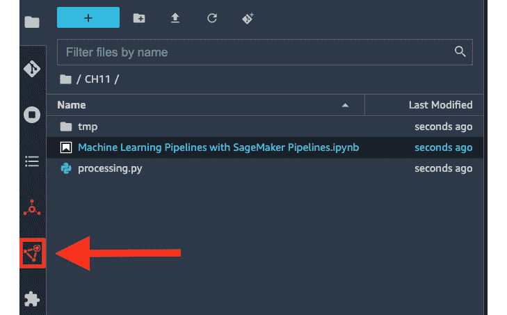

图 11.10 – 打开 SageMaker 资源窗格

这应该会打开 **SageMaker 资源** 窗格，我们可以在此查看和检查各种 SageMaker 资源。

1.  在 **SageMaker 资源** 窗格的下拉菜单中选择 **Pipelines**。

1.  然后，双击映射到我们刚刚创建的 `PARTIAL-PIPELINE` 管道的行。之后，双击映射到调用 `partial_pipeline.start()` 后触发的管道执行的行。

1.  一旦执行完成，你应该会看到一个类似于图 11.11 所示的图表：

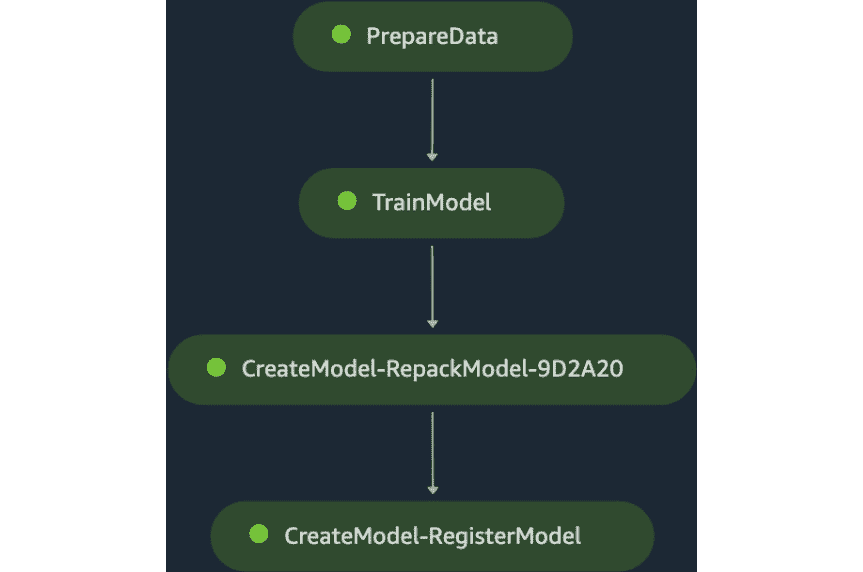

图 11.11 – 完成的管道执行

随意点击圆形矩形以检查每个步骤的以下详细信息：

+   **输入** – 输入文件、参数和配置

+   **输出** – 输出文件和指标（如果有）

+   **日志** – 生成的日志

+   **信息** – 任何额外的信息/元数据

1.  返回到对应于 `Machine Learning Pipelines with SageMaker Pipelines.ipynb` 笔记本的选项卡。

1.  让我们回顾一下使用 `list_steps()` 方法执行的（部分）流程运行步骤：

    ```py
    execution.list_steps()
    ```

这应该返回一个映射到流程执行步骤的字典列表。

我们还没有完成！到目前为止，我们只完成了我们的机器学习流程的一半。请确保不要关闭 SageMaker Studio 中正在运行的应用程序和实例，因为我们将在稍后运行 `Machine Learning Pipelines with SageMaker Pipelines.ipynb` 笔记本中的更多代码块以完成我们的流程。

注意

如果你需要休息一下，你可以关闭正在运行的实例和应用程序（以管理成本），然后在开始本章的“完成端到端机器学习流程”部分之前，在 `Machine Learning Pipelines with SageMaker Pipelines.ipynb` 笔记本中再次运行所有单元格。

# 创建用于部署的 Lambda 函数

我们的第二个（更完整的流程）将需要一些额外的资源来帮助我们部署我们的机器学习模型。在本节中，我们将创建以下 Lambda 函数：

+   `check-if-endpoint-exists` – 这是一个 Lambda 函数，它接受机器学习推理端点的名称作为输入，如果端点已存在，则返回 `True`。

+   `deploy-model-to-new-endpoint` – 这是一个 Lambda 函数，它接受模型包 ARN 作为输入（以及角色和端点名称），并将模型部署到新的推理端点

+   `deploy-model-to-existing-endpoint` – 这是一个 Lambda 函数，它接受模型包 ARN 作为输入（以及角色和端点名称），并将模型部署到现有的推理端点（通过更新 ML 实例内部的已部署模型）

我们将在“完成端到端机器学习流程”部分使用这些函数来部署我们将注册到 SageMaker 模型注册表的机器学习模型（使用 `ModelStep`）。

## 准备 Lambda 函数以将模型部署到新的端点

我们将创建的第一个 **AWS Lambda** 函数将被配置和编程为将模型部署到新的端点。为了帮助我们可视化我们的函数将如何工作，让我们快速查看 *图 11.12*：

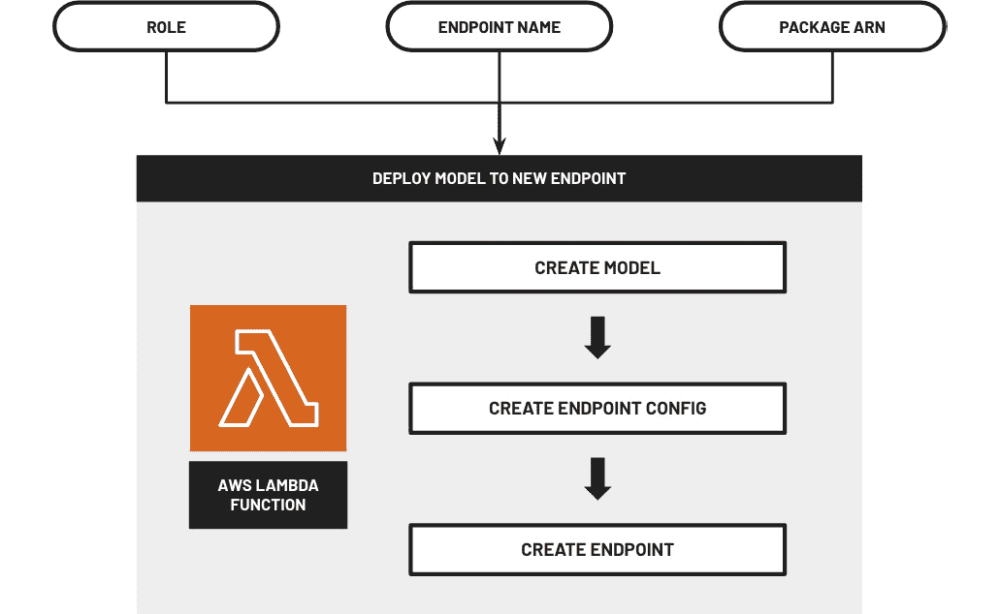

图 11.12 – 将模型部署到新的端点

此函数将接受以下输入参数：IAM 角色、端点名称和模型包 ARN。在接收到这些输入参数后，该函数将创建部署模型（从模型包）到新的 ML 推理端点所需的相应资源集。

在接下来的步骤中，我们将创建一个 Lambda 函数，我们将使用它来部署一个 ML 模型到新的推理端点：

1.  导航到 AWS 管理控制台的搜索栏中的 `lambda`，然后从搜索结果列表中点击 **Lambda** 链接。

注意

在本章中，我们将创建并管理我们在 `us-west-2` 区域的资源。在继续下一步之前，请确保您已设置正确的区域。

1.  定位并点击 `deploy-model-to-new-endpoint`

1.  `Python 3.9`

1.  **权限** > **更改默认执行角色**

1.  `使用现有角色`

1.  `pipeline-lambda-role`

1.  滚动到页面底部，然后点击 **创建函数** 按钮。

注意

在点击 **创建函数** 按钮后，您应该会看到以下成功通知：**成功创建了函数 deploy-model-to-new-endpoint**。您现在可以更改其代码和配置。要使用测试事件调用您的函数，请选择 **测试**。

1.  导航到 `1024` MB

1.  `15` 分钟 `0` 秒

之后，点击 **保存** 按钮。

1.  在另一个浏览器标签页中打开以下链接：[`raw.githubusercontent.com/PacktPublishing/Machine-Learning-Engineering-on-AWS/main/chapter11/utils.py`](https://raw.githubusercontent.com/PacktPublishing/Machine-Learning-Engineering-on-AWS/main/chapter11/utils.py)。使用 *Ctrl* + *A* 和然后 *Ctrl* + *C*（或者，如果您使用的是 Mac，则使用 *CMD* + *A* 和然后 *CMD* + *C*）将页面内容复制到您的剪贴板。

1.  在显示 Lambda 控制台的浏览器选项卡中，导航到 `Untitled1`。

1.  在新标签页（不包含代码）中，粘贴复制到剪贴板的代码。以 **文件名** 字段值打开 `utils.py`，然后点击 **保存**。

1.  导航到可以修改 `lambda_function.py` 内部代码的选项卡。在继续之前，删除当前存储在 `lambda_function.py` 中的模板代码。

注意

输入（或复制）以下步骤中 `lambda_function.py` 内的代码块。您可以在 [`github.com/PacktPublishing/Machine-Learning-Engineering-on-AWS/blob/main/chapter11/deploy-model-to-new-endpoint.py`](https://github.com/PacktPublishing/Machine-Learning-Engineering-on-AWS/blob/main/chapter11/deploy-model-to-new-endpoint.py) 找到 Lambda 函数的代码副本。

1.  在 `lambda_function.py` 文件中，导入我们将需要用于将训练好的 ML 模型部署到新的 ML 推理端点的函数：

    ```py
    import json
    ```

    ```py
    from utils import (
    ```

    ```py
        create_model, 
    ```

    ```py
        create_endpoint_config, 
    ```

    ```py
        create_endpoint, 
    ```

    ```py
        random_string,
    ```

    ```py
        block
    ```

    ```py
    )
    ```

1.  现在，让我们定义 `lambda_handler()` 函数：

    ```py
    def lambda_handler(event, context):
    ```

    ```py
        role = event['role']
    ```

    ```py
        endpoint_name = event['endpoint_name']
    ```

    ```py
        package_arn = event['package_arn']
    ```

    ```py
        model_name = 'model-' + random_string()
    ```

    ```py
        with block('CREATE MODEL'):
    ```

    ```py
            create_model(
    ```

    ```py
                model_name=model_name,
    ```

    ```py
                package_arn=package_arn,
    ```

    ```py
                role=role
    ```

    ```py
            )
    ```

    ```py
        with block('CREATE ENDPOINT CONFIG'):
    ```

    ```py
            endpoint_config_name = create_endpoint_config(
    ```

    ```py
                model_name
    ```

    ```py
            )
    ```

    ```py
        with block('CREATE ENDPOINT'):
    ```

    ```py
            create_endpoint(
    ```

    ```py
                endpoint_name=endpoint_name, 
    ```

    ```py
                endpoint_config_name=endpoint_config_name
    ```

    ```py
            )
    ```

    ```py
        return {
    ```

    ```py
            'statusCode': 200,
    ```

    ```py
            'body': json.dumps(event),
    ```

    ```py
            'model': model_name
    ```

    ```py
        }
    ```

1.  点击 **部署** 按钮。

1.  点击 **测试** 按钮。

1.  在 **事件名称** 下的 `test` 中，然后在 **事件 JSON** 下指定以下 JSON 值：

    ```py
    {
    ```

    ```py
      "role": "<INSERT SAGEMAKER EXECUTION ROLE ARN>",
    ```

    ```py
      "endpoint_name": "AutoGluonEndpoint",
    ```

    ```py
      "package_arn": "<INSERT MODEL PACKAGE ARN>"
    ```

    ```py
    }
    ```

确保替换以下值：

+   `<插入 SageMaker 执行角色 ARN>` – 将此占位符值替换为 `arn:aws:iam::1234567890:role/service-role/AmazonSageMaker-ExecutionRole-20220000T000000`。

+   `<INSERT MODEL PACKAGE ARN>` – 将此占位符值替换为`arn:aws:sagemaker:us-west-2:1234567890:model-package/autogluonmodelgroup/1`。

1.  将此测试事件 JSON 值复制到您本地机器上的文本编辑器中。我们将在测试我们的`deploy-model-to-existing-endpoint` Lambda 函数时再次使用此测试事件 JSON。

1.  之后，点击**保存**按钮。

1.  一切准备就绪后，让我们点击**测试**按钮。这应该会在几分钟后打开一个新标签页，显示执行结果。

注意

此步骤可能需要 5-15 分钟才能完成。您可以随意拿一杯咖啡或茶！

1.  在等待期间，向上滚动并找到**函数概述**面板。将**函数 ARN**值复制到您的文本编辑器中。我们将在本章的*完成端到端 ML 管道*部分稍后使用此**函数 ARN**值。

一旦`deploy-model-to-new-endpoint` Lambda 函数运行完成，我们应该已经在 ML 推理端点中部署了我们的 ML 模型。请注意，我们只是在测试 Lambda 函数，我们将在运行完整的 ML 管道之前，在稍后的步骤中删除由`deploy-model-to-new-endpoint` Lambda 函数启动的 ML 推理端点。

## 准备 Lambda 函数以检查是否存在端点

我们将要创建的第二个**AWS Lambda**函数将配置和编程为检查是否存在端点（给定端点名称）。为了帮助我们可视化我们的函数将如何工作，让我们快速查看*图 11.13*：


图 11.13 – 检查是否存在端点

此功能将接受一个输入参数——ML 推理端点的名称。在接收到输入参数后，该功能将使用`boto3`库列出该区域中所有正在运行的端点，并检查这些端点中是否有名称与输入参数值匹配。

在接下来的步骤中，我们将创建一个 Lambda 函数，我们将使用它来检查是否存在 ML 推理端点：

1.  打开一个新的浏览器标签页，导航到 Lambda 管理控制台的**函数**页面。

1.  定位并点击位于**函数**页面左上角的**创建函数**按钮，然后指定以下配置值：

    +   **从头开始编写**

    +   `check-if-endpoint-exists`

    +   `Python 3.9`

    +   **权限** > **更改默认执行角色**

    +   `使用现有角色`

    +   `pipeline-lambda-role`

1.  滚动到页面底部，然后点击**创建函数**按钮。

注意

将代码块（或复制）输入到 `lambda_function.py` 中的后续步骤中。您可以在以下位置找到 Lambda 函数的代码副本：[`github.com/PacktPublishing/Machine-Learning-Engineering-on-AWS/blob/main/chapter11/check-if-endpoint-exists.py`](https://github.com/PacktPublishing/Machine-Learning-Engineering-on-AWS/blob/main/chapter11/check-if-endpoint-exists.py)。

1.  在 `lambda_function.py` 文件中，导入 `boto3` 并初始化 SageMaker 服务的客户端：

    ```py
    import boto3
    ```

    ```py
    sm_client = boto3.client('sagemaker')
    ```

1.  接下来，让我们定义 `endpoint_exists()` 函数：

    ```py
    def endpoint_exists(endpoint_name):
    ```

    ```py
        response = sm_client.list_endpoints(
    ```

    ```py
            NameContains=endpoint_name
    ```

    ```py
        )
    ```

    ```py
        results = list(
    ```

    ```py
            filter(
    ```

    ```py
                lambda x: \
    ```

    ```py
                x['EndpointName'] == endpoint_name, 
    ```

    ```py
                response['Endpoints']
    ```

    ```py
            )
    ```

    ```py
        )
    ```

    ```py
        return len(results) > 0
    ```

1.  现在，让我们定义 `lambda_handler()` 函数，该函数使用 `endpoint_exists()` 函数来检查是否存在 ML 推理端点（给定端点名称）：

    ```py
    def lambda_handler(event, context):
    ```

    ```py
        endpoint_name = event['endpoint_name']
    ```

    ```py
        return {
    ```

    ```py
            'endpoint_exists': endpoint_exists(
    ```

    ```py
                endpoint_name=endpoint_name
    ```

    ```py
            )
    ```

    ```py
        }
    ```

1.  点击 **部署** 按钮。

1.  点击 **事件名称** 下的 `test`，然后在 **事件 JSON** 下指定以下 JSON 值：

    ```py
    {
    ```

    ```py
      "endpoint_name": "AutoGluonEndpoint"
    ```

    ```py
    }
    ```

1.  之后，点击 **保存** 按钮。

1.  一切准备就绪后，让我们点击 **测试** 按钮。这应该会打开一个新标签页，几秒钟后显示执行结果。测试 Lambda 函数后，我们应该得到以下响应值：

    ```py
    {
    ```

    ```py
      "endpoint_exists": true
    ```

    ```py
    }
    ```

1.  最后，向上滚动并定位到 **函数概述** 面板。将 **函数 ARN** 值复制到您的文本编辑器中。我们将在本章的 *完成端到端 ML 管道* 部分中使用此 **函数 ARN** 值。

现在我们已经完成了 `check-if-endpoint-exists` Lambda 函数的准备和测试，我们可以继续创建最后一个 Lambda 函数 (`deploy-model-to-existing-endpoint`)。

## 准备 Lambda 函数以部署模型到现有端点

我们将要创建的第三个 **AWS Lambda** 函数将被配置和编程，以便将模型部署到现有端点。为了帮助我们可视化函数的工作方式，让我们快速查看 *图 11.14*：

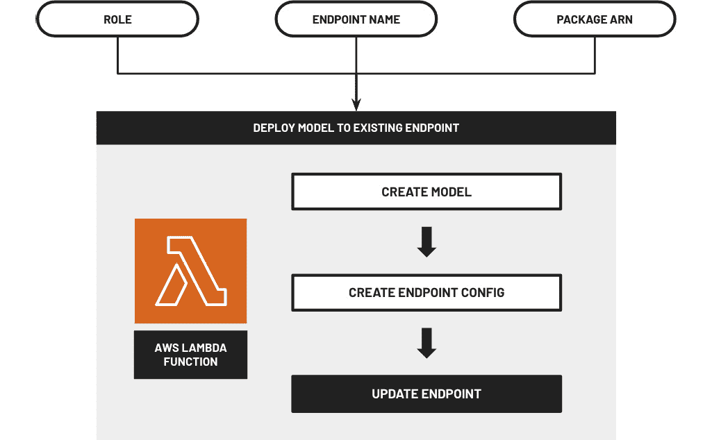

图 11.14 – 将模型部署到现有端点

此函数将接受三个输入参数——一个 IAM 角色、端点名称和模型包 ARN。在接收到这些输入参数后，该函数将执行必要的步骤，将模型包中提供的模型更新到现有 ML 推理端点中部署的模型。

在下一组步骤中，我们将创建一个 Lambda 函数，我们将使用它来部署 ML 模型到现有的推理端点：

1.  打开一个新的浏览器标签页，并导航到 Lambda 管理控制台的 **函数** 页面。

1.  定位并点击位于 **函数** 页面左上角的 **创建函数** 按钮，然后指定以下配置值：

    +   **从头开始作者**

    +   `deploy-model-to-existing-endpoint`

    +   `Python 3.9`

    +   **权限** > **更改默认执行角色**

    +   `使用现有角色`

    +   `pipeline-lambda-role`

1.  滚动到页面底部，然后点击 **创建函数** 按钮。

1.  导航到 `1024` MB

1.  `15` 分钟 `0` 秒

1.  然后，点击 **保存** 按钮。

1.  在另一个浏览器标签页中打开以下链接：[`raw.githubusercontent.com/PacktPublishing/Machine-Learning-Engineering-on-AWS/main/chapter11/utils.py`](https://raw.githubusercontent.com/PacktPublishing/Machine-Learning-Engineering-on-AWS/main/chapter11/utils.py)。使用 *Ctrl* + *A* 然后按 *Ctrl* + *C*（或者，如果您使用的是 Mac，则按 *CMD* + *A* 然后按 *CMD* + *C*）将页面内容复制到您的剪贴板。

1.  在显示 Lambda 控制台的浏览器标签页中，导航到 `Untitled1`。在新标签页（不包含代码）中，粘贴复制到剪贴板中的代码。

1.  将 `utils.py` 作为 **文件名** 字段值打开，然后点击 **保存**。

1.  导航到可以修改 `lambda_function.py` 内代码的选项卡。在继续之前，删除 `lambda_function.py` 中当前存储的样板代码。

注意

在接下来的步骤中，在 `lambda_function.py` 文件内（或复制）代码块。你可以在 [`github.com/PacktPublishing/Machine-Learning-Engineering-on-AWS/blob/main/chapter11/deploy-model-to-existing-endpoint.py`](https://github.com/PacktPublishing/Machine-Learning-Engineering-on-AWS/blob/main/chapter11/deploy-model-to-existing-endpoint.py) 找到 Lambda 函数的代码副本。

1.  在 `lambda_function.py` 文件中，导入我们将需要更新现有端点部署模型的函数：

    ```py
    import json
    ```

    ```py
    from utils import (
    ```

    ```py
        create_model, 
    ```

    ```py
        create_endpoint_config, 
    ```

    ```py
        update_endpoint, 
    ```

    ```py
        random_string,
    ```

    ```py
        block
    ```

    ```py
    )
    ```

1.  现在，让我们使用以下代码块定义 `lambda_handler()` 函数：

    ```py
    def lambda_handler(event, context):
    ```

    ```py
        role = event['role']
    ```

    ```py
        endpoint_name = event['endpoint_name']
    ```

    ```py
        package_arn = event['package_arn']
    ```

    ```py
        model_name = 'model-' + random_string()
    ```

    ```py
        with block('CREATE MODEL'):
    ```

    ```py
            create_model(
    ```

    ```py
                model_name=model_name,
    ```

    ```py
                package_arn=package_arn,
    ```

    ```py
                role=role
    ```

    ```py
            )
    ```

    ```py
        with block('CREATE ENDPOINT CONFIG'):
    ```

    ```py
            endpoint_config_name = create_endpoint_config(
    ```

    ```py
                model_name
    ```

    ```py
            )
    ```

    ```py
        with block('UPDATE ENDPOINT'):
    ```

    ```py
            update_endpoint(
    ```

    ```py
                endpoint_name=endpoint_name, 
    ```

    ```py
                endpoint_config_name=endpoint_config_name
    ```

    ```py
            )
    ```

    ```py
        return {
    ```

    ```py
            'statusCode': 200,
    ```

    ```py
            'body': json.dumps(event),
    ```

    ```py
            'model': model_name
    ```

    ```py
        } 
    ```

1.  点击 **部署** 按钮。

1.  点击 **事件名称** 下的 `test`，然后在 **事件 JSON** 下指定以下 JSON 值：

    ```py
    {
    ```

    ```py
      "role": "<INSERT SAGEMAKER EXECUTION ROLE ARN>",
    ```

    ```py
      "endpoint_name": "AutoGluonEndpoint",
    ```

    ```py
      "package_arn": "<INSERT MODEL PACKAGE ARN>"
    ```

    ```py
    }
    ```

确保替换以下值：

+   `<INSERT SAGEMAKER EXECUTION ROLE ARN>` – 将此占位符值替换为本章 *准备基本先决条件* 部分中复制到您的文本编辑器的 **执行角色 ARN**。

+   `<INSERT MODEL PACKAGE ARN>` – 将此占位符值替换为本章 *使用 SageMaker Pipelines 运行第一个管道* 部分中复制到您的文本编辑器的 **模型包 ARN**。

此外，您还可以使用我们在测试 `deploy-model-to-new-endpoint` Lambda 函数时复制到文本编辑器的相同的测试事件 JSON 值。

1.  然后，点击 **保存** 按钮。

1.  一切准备就绪后，让我们点击 **测试** 按钮。这应该会在几分钟后打开一个新标签页，显示执行结果。

注意

此步骤可能需要 5-15 分钟才能完成。请随意拿一杯咖啡或茶！

1.  在等待的同时，向上滚动并找到 **函数概览** 选项卡。将 **函数 ARN** 值复制到您的文本编辑器中。我们将在本章的 *完成端到端 ML 管道* 部分使用此 **函数 ARN** 值。

在所有 Lambda 函数都准备就绪后，我们现在可以开始测试我们的 ML 推理端点（在完成端到端 ML 管道之前）。

注意

到目前为止，我们应该有 3 个`check-if-endpoint-exists` Lambda 函数、`deploy-model-to-new-endpoint` Lambda 函数和`deploy-model-to-existing-endpoint` Lambda 函数。我们将在本章的“完成端到端机器学习管道”部分中使用这些 ARN 值。

# 测试我们的机器学习推理端点

当然，我们需要检查机器学习推理端点是否工作！在接下来的步骤中，我们将下载并运行一个 Jupyter 笔记本（命名为`Test Endpoint and then Delete.ipynb`），使用测试数据集来测试我们的机器学习推理端点：

1.  首先，在另一个浏览器标签页中打开以下链接：[`bit.ly/3xyVAXz`](https://bit.ly/3xyVAXz)

1.  右键单击页面上的任何部分以打开上下文菜单，然后选择`Test Endpoint then Delete.ipynb`，然后将其下载到您的本地机器上的`下载`文件夹（或类似位置）。

1.  返回到您的`CH11`文件夹，类似于图 11.15 中的内容：

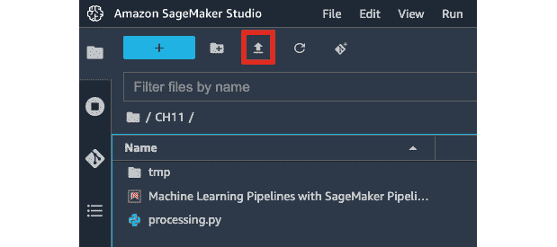

图 11.15 – 上传测试端点和 Delete.ipynb 文件

1.  点击上传按钮（如图 11.15 所示），然后选择我们在早期步骤中下载的`Test Endpoint then Delete.ipynb`文件。

注意

这应该会将您的本地机器上的`Test Endpoint then Delete.ipynb`笔记本文件上传到 SageMaker Studio 环境中的`CH11`文件夹。

1.  双击**文件树**中的`Test Endpoint then Delete.ipynb`文件以在**主工作区**（包含打开的笔记本、文件和终端的标签页）中打开笔记本。

1.  更新第一个单元格，使用在`Machine Learning Pipelines with SageMaker Pipelines.ipynb`笔记本中使用的 S3 桶名称：

    ```py
    s3_bucket = '<INSERT S3 BUCKET HERE>'
    ```

确保将`<在此处插入 S3 桶名称>`替换为我们在本章“准备基本先决条件”部分的文本编辑器中复制的 S3 桶名称。

1.  打开`Test Endpoint then Delete.ipynb`笔记本。

注意

运行 Jupyter 笔记本中的所有单元格大约需要 1-2 分钟。等待时，不妨拿一杯咖啡或茶！

1.  一旦`Test Endpoint then Delete.ipynb`笔记本中的所有单元格都已执行，找到包含以下代码块（以及返回的输出）的单元格：

    ```py
    from sklearn.metrics import accuracy_score
    ```

    ```py
    accuracy_score(actual_list, predicted_list)
    ```

验证模型是否得到了等于或接近`0.88`（或 88%）的准确率。

到目前为止，由于`Test Endpoint then Delete.ipynb` Jupyter 笔记本在计算机器学习模型指标后也运行了`predictor.delete_endpoint()`行，因此机器学习推理端点应该处于已删除状态。

# 完成端到端机器学习管道

在本节中，我们将在本章的*使用 SageMaker Pipelines 运行我们的第一个流水线*部分中准备的（部分）流水线的基础上进行构建。除了用于构建我们的部分流水线的步骤和资源外，我们还将利用我们在*创建用于部署的 Lambda 函数*部分中创建的 Lambda 函数来完成我们的机器学习流水线。

## 定义和准备完整的机器学习流水线

我们将要准备的第二个流水线将比第一个流水线稍长。为了帮助我们可视化使用**SageMaker Pipelines**的第二个机器学习流水线将看起来如何，让我们快速查看*图 11.16*：

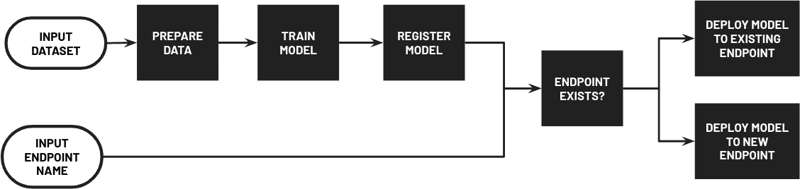

图 11.16 – 使用 SageMaker Pipelines 的第二个机器学习流水线

在这里，我们可以看到我们的流水线接受两个输入参数——输入数据集和端点名称。当流水线运行时，输入数据集首先被分割成训练集、验证集和测试集。然后，训练集和验证集被用来训练一个机器学习模型，该模型随后被注册到**SageMaker 模型注册表**。之后，流水线检查是否存在具有提供的端点名称的机器学习推理端点。如果端点尚不存在，则将模型部署到新的端点。否则，将使用在流水线执行期间训练的模型更新具有提供的端点名称的现有端点的模型。

在接下来的步骤中，我们将使用在`Machine Learning Pipelines with SageMaker Pipelines.ipynb`笔记本中配置的步骤和资源来创建一个新的机器学习流水线：

1.  返回到对应于`Machine Learning Pipelines with SageMaker Pipelines.ipynb`笔记本的标签页。

注意

我们将在`Machine Learning Pipelines with SageMaker Pipelines.ipynb`笔记本中（在现有的单元格集之后）运行后续步骤中的代码块。如果你在*使用 SageMaker Pipelines 运行我们的第一个流水线*部分运行命令后关闭了内核和/或 SageMaker Studio 实例，请确保通过选择**运行所有单元格**从**运行**菜单下的选项列表中再次运行所有单元格（并等待流水线完成运行）。

1.  让我们初始化映射到机器学习推理端点名称（在机器学习流水线运行完成后将创建或更新）的`Pipeline`参数的`ParameterString`对象：

    ```py
    input_endpoint_name = ParameterString(
    ```

    ```py
        name="EndpointName",
    ```

    ```py
        default_value=f'AutoGluonEndpoint', 
    ```

    ```py
    )
    ```

1.  接下来，让我们导入我们将需要以完成端到端机器学习流水线的类：

    ```py
    from sagemaker.workflow.lambda_step import (
    ```

    ```py
        LambdaStep, 
    ```

    ```py
        LambdaOutput, 
    ```

    ```py
        LambdaOutputTypeEnum
    ```

    ```py
    )
    ```

    ```py
    from sagemaker.lambda_helper import (
    ```

    ```py
        Lambda
    ```

    ```py
    )
    ```

    ```py
    from sagemaker.workflow.conditions import (
    ```

    ```py
        ConditionEquals
    ```

    ```py
    )
    ```

    ```py
    from sagemaker.workflow.condition_step import (
    ```

    ```py
        ConditionStep, 
    ```

    ```py
        JsonGet
    ```

    ```py
    )
    ```

1.  准备将映射到`LambdaStep`对象输出的`LambdaOutput`对象：

    ```py
    output_endpoint_exists = LambdaOutput(
    ```

    ```py
        output_name="endpoint_exists", 
    ```

    ```py
        output_type=LambdaOutputTypeEnum.Boolean
    ```

    ```py
    )
    ```

1.  初始化映射到检查指定机器学习推理端点是否已存在的 Lambda 函数的`LambdaStep`对象（给定端点名称）：

    ```py
    package_arn = step_model_create \
    ```

    ```py
        .properties.ModelPackageArn
    ```

    ```py
    endpoint_exists_lambda = LambdaStep(
    ```

    ```py
        name="CheckIfEndpointExists",
    ```

    ```py
        lambda_func=Lambda(
    ```

    ```py
            function_arn="<INSERT FUNCTION ARN>"
    ```

    ```py
        ),
    ```

    ```py
        inputs={
    ```

    ```py
            "endpoint_name": input_endpoint_name,
    ```

    ```py
            "package_arn": package_arn
    ```

    ```py
        },
    ```

    ```py
        outputs=[output_endpoint_exists]
    ```

    ```py
    )
    ```

确保将`<INSERT FUNCTION ARN>`替换为我们复制到文本编辑器的`check-if-endpoint-exists` Lambda 函数的 ARN。其格式应类似于`arn:aws:lambda:us-west-2:<ACCOUNT ID>:function:check-if-endpoint-exists`。

1.  接下来，初始化`LambdaStep`对象，它映射到将训练好的 ML 模型部署到现有 ML 推理端点的 Lambda 函数：

    ```py
    step_lambda_deploy_to_existing_endpoint = LambdaStep(
    ```

    ```py
        name="DeployToExistingEndpoint",
    ```

    ```py
        lambda_func=Lambda(
    ```

    ```py
            function_arn="<INSERT FUNCTION ARN>"
    ```

    ```py
        ),
    ```

    ```py
        inputs={
    ```

    ```py
            "role": role,
    ```

    ```py
            "endpoint_name": input_endpoint_name,
    ```

    ```py
            "package_arn": package_arn
    ```

    ```py
        },
    ```

    ```py
        outputs=[]
    ```

    ```py
    )
    ```

确保将`<INSERT FUNCTION ARN>`替换为我们复制到文本编辑器的`deploy-model-to-existing-endpoint` Lambda 函数的 ARN。其格式应类似于`arn:aws:lambda:us-west-2:<ACCOUNT ID>:function:` `deploy-model-to-existing-endpoint`。

1.  之后，初始化映射到将训练好的 ML 模型部署到新 ML 推理端点的 Lambda 函数的`LambdaStep`对象：

    ```py
    step_lambda_deploy_to_new_endpoint = LambdaStep(
    ```

    ```py
        name="DeployToNewEndpoint",
    ```

    ```py
        lambda_func=Lambda(
    ```

    ```py
            function_arn="<INSERT FUNCTION ARN>"
    ```

    ```py
        ),
    ```

    ```py
        inputs={
    ```

    ```py
            "role": role,
    ```

    ```py
            "endpoint_name": input_endpoint_name,
    ```

    ```py
            "package_arn": package_arn
    ```

    ```py
        },
    ```

    ```py
        outputs=[]
    ```

    ```py
    )
    ```

确保将`<INSERT FUNCTION ARN>`替换为我们复制到文本编辑器的`deploy-model-to-new-endpoint` Lambda 函数的 ARN。其格式应类似于`arn:aws:lambda:us-west-2:<ACCOUNT ID>:function: deploy-model-to-new-endpoint`。

1.  在准备好三个`LambdaStep`对象后，让我们准备`ConditionStep`对象，该对象检查端点是否已经存在（使用`endpoint_exists_lambda` `LambdaStep`对象的输出）：

    ```py
    left = endpoint_exists_lambda \
    ```

    ```py
        .properties               \
    ```

    ```py
        .Outputs['endpoint_exists']
    ```

    ```py
    cond_equals = ConditionEquals(
    ```

    ```py
        left=left,
    ```

    ```py
        right=True
    ```

    ```py
    )
    ```

    ```py
    if_steps = [step_lambda_deploy_to_existing_endpoint]
    ```

    ```py
    else_steps = [step_lambda_deploy_to_new_endpoint]
    ```

    ```py
    step_endpoint_exists_condition = ConditionStep(
    ```

    ```py
        name="EndpointExists",
    ```

    ```py
        conditions=[cond_equals],
    ```

    ```py
        if_steps=if_steps,
    ```

    ```py
        else_steps=else_steps
    ```

    ```py
    )
    ```

此步骤告诉 ML 管道执行以下操作：

+   如果端点尚不存在，请将模型部署到新端点。

+   如果端点已经存在，请将模型部署到现有端点。

为了帮助我们可视化如何配置`ConditionStep`对象，让我们快速查看*图 11.17*：

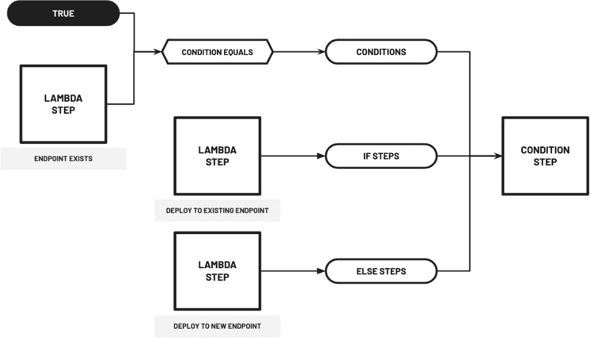

图 11.17 – 配置和准备 ConditionStep 对象

在这里，我们可以看到`ConditionStep`对象是用几个参数初始化的——`conditions`、`if_steps`和`else_steps`（除了端点的`name`）。如果`EndpointExists` `LambdaStep`返回`True`，则执行`DeployToExistingEndpoint` `LambdaStep`。否则，将执行`DeployToNewEndpoint` `LambdaStep`。

1.  在所有步骤都准备好后，让我们使用我们准备的不同步骤对象初始化一个新的`Pipeline`对象：

    ```py
    pipeline_name = f"COMPLETE-PIPELINE"
    ```

    ```py
    complete_pipeline = Pipeline(
    ```

    ```py
        name=pipeline_name,
    ```

    ```py
        parameters=[
    ```

    ```py
            input_data,
    ```

    ```py
            input_endpoint_name
    ```

    ```py
        ],
    ```

    ```py
        steps=[
    ```

    ```py
            step_process, 
    ```

    ```py
            step_train,
    ```

    ```py
            step_model_create,
    ```

    ```py
            endpoint_exists_lambda, 
    ```

    ```py
            step_endpoint_exists_condition
    ```

    ```py
        ],
    ```

    ```py
    )
    ```

    ```py
    complete_pipeline.upsert(role_arn=role)
    ```

注意，这个管道与我们在本章*使用 SageMaker Pipelines 运行我们的第一个管道*部分准备的（部分）管道不同且独立。一旦我们在下一节运行它，我们应该看到这个管道有更多额外的步骤。

## 运行完整的 ML 管道

一切准备就绪后，我们现在可以运行我们的端到端 ML 管道。与我们在本章*使用 SageMaker Pipelines 运行我们的第一个管道*部分执行的（部分）管道相比，我们的（完整）管道允许我们指定 ML 推理端点的可选名称（*注意：不要运行以下代码块*）：

```py
execution = complete_pipeline.start(
    parameters=dict(
        EndpointName="<INSERT NEW ENDPOINT NAME>",
    )
)
```

如果未指定端点名称，则在流程执行期间使用默认端点名称值（即 `AutoGluonEndpoint`）。

在接下来的步骤中，我们将运行我们的流程，等待它将训练好的 ML 模型部署到新的推理端点，然后使用测试数据集测试部署的模型：

1.  在运行 `Machine Learning Pipelines with SageMaker Pipelines.ipynb` 笔记本中的最后一块代码后，继续进行，让我们使用以下代码块运行端到端 ML 流程：

    ```py
    execution = complete_pipeline.start()
    ```

    ```py
    execution.describe()
    ```

1.  接下来，让我们使用 `wait()` 方法等待整个流程完成：

    ```py
    execution.wait()
    ```

注意

流程执行应大约需要 15-30 分钟才能完成。在等待时，不妨拿一杯咖啡或茶！

1.  在等待期间，找到并点击 SageMaker Studio 左侧边栏底部的三角形图标（**SageMaker 资源**）。这应该会打开 **SageMaker 资源**面板，在那里我们可以查看和检查各种 SageMaker 资源。

1.  从 **SageMaker 资源**面板下拉菜单中的选项列表中选择 **Pipelines**。

1.  然后，双击映射到我们刚刚创建的 `COMPLETE-PIPELINE` 流程的行。之后，双击映射到我们触发的流程执行的行。你应该会看到一个类似于 *图 11.18* 中所示的图形：

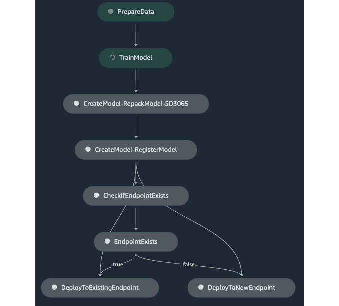

图 11.18 – ML 流程目前正在运行 TrainModel 步骤

在这里，我们可以看到与本章 *运行我们的第一个 SageMaker Pipelines 流程* 部分的 *PARTIAL-PIPELINE* 流程相比，`COMPLETE-PIPELINE` 流程有更多的步骤。

1.  几分钟后，图形应该会有更多完成的步骤，类似于我们在 *图 11.19* 中看到的：

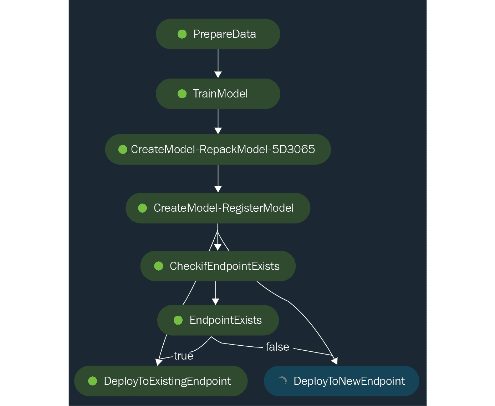

图 11.19 – ML 流程继续执行 DeployToNewEndpoint 步骤

在这里，我们可以看到，由于 ML 端点尚未存在（因为我们之前在运行 `Test Endpoint then Delete.ipynb` 笔记本时删除了它），ML 流程继续执行 **DeployToNewEndpoint** 步骤。请注意，对于后续运行，如果 ML 端点已经存在，则应运行 **DeployToExistingEndpoint** 步骤。

重要提示

确保执行角色（如果遇到在运行 Lambda 函数时出现的以下错误：**ClientError: 用户：<ARN> 没有权限在资源：<arn> 上执行：lambda:InvokeFunction，因为没有基于身份的策略允许 lambda:InvokeFunction 操作**，则附加到 `AWSLambda_FullAccess` 权限策略）正确设置。如有需要，请查阅本章的 *准备基本先决条件* 部分，以获取如何更新执行角色权限的逐步说明。

1.  等待流水线执行完成。一旦流水线运行完成，我们的 AutoGluon 模型应该部署在一个机器学习推理端点（命名为`AutoGluonEndpoint`）内部。

1.  返回到对应于`Test Endpoint then Delete.ipynb`笔记本的标签页。打开`Test Endpoint then Delete.ipynb`笔记本。请注意，在笔记本中运行所有单元格后，也会删除现有的机器学习推理端点（命名为`AutoGluonEndpoint`）。

备注

运行 Jupyter 笔记本中的所有单元格可能需要 1-2 分钟。在等待时，不妨拿一杯咖啡或茶！

1.  一旦`Test Endpoint then Delete.ipynb`笔记本中的所有单元格都已执行，找到包含以下代码块（以及返回的输出）的单元格：

    ```py
    from sklearn.metrics import accuracy_score
    ```

    ```py
    accuracy_score(actual_list, predicted_list)
    ```

确认我们的模型获得了等于或接近`0.88`（或 88%）的准确率分数。请注意，这应该与我们本章*测试我们的机器学习推理端点*部分中获得的分数相似。

*我们可以用这个流水线做什么？* 通过为每次流水线运行指定不同的端点名称，我们能够训练和部署模型到多个端点。这应该有助于我们处理需要为不同环境（例如`生产`和`预发布`环境）管理专门的机器学习推理端点的情况。例如，我们可以同时运行两个机器学习推理端点——`AutoGluonEndpoint-production`和`AutoGluonEndpoint-staging`。如果我们希望从新的数据集中生成一个新的模型，我们可以触发流水线运行并指定`预发布`环境的端点名称而不是`生产`环境。这将帮助我们测试和验证在`预发布`环境中部署的新模型的质量，并确保`生产`环境始终保持稳定状态。一旦我们需要更新`生产`环境，我们只需简单地触发另一个流水线运行，并在训练和部署新模型时指定与`生产`环境关联的端点名称。

备注

有几种方式来管理这类部署，这是机器学习工程师和数据科学家可用的选项之一。

大概就是这样！恭喜你能够完成一个相对更复杂的机器学习流水线！我们在这个章节中完成了很多工作，我们应该准备好设计和构建我们自己的定制流水线。

# 清理

现在我们已经完成了本章动手实践的解决方案，是时候清理并关闭我们将不再使用的资源了。在接下来的步骤中，我们将定位并关闭**SageMaker Studio**中任何剩余的运行实例：

1.  确保检查并删除 **SageMaker 资源** 下的所有运行推理端点（如果有）。要检查是否有运行中的推理端点，请单击 **SageMaker 资源** 图标，然后从下拉菜单中选择 **端点**。

1.  打开 **文件** 菜单，从可用选项中选择 **关闭**。这应该会关闭 SageMaker Studio 内的所有运行实例。

需要注意的是，这个清理操作需要在使用 **SageMaker Studio** 后执行。即使在不活跃期间，SageMaker 也不会自动关闭这些资源。在进入下一节之前，请确保已检查所有删除操作是否成功。

注意

随意清理并删除 AWS 账户中的其他所有资源（例如，我们创建的 Cloud9 环境、VPC 和 Lambda 函数）。

# 推荐的策略和最佳实践

在我们结束本章（以及本书）之前，让我们快速讨论一些使用 SageMaker Pipelines 准备自动化 ML 工作流程时推荐的策略和最佳实践。*我们可以在管道的初始版本中做出哪些改进？*以下是一些我们可以实施的可能的升级，以使我们的设置更具可扩展性、更安全，并且能够更好地处理不同类型的 ML 和 ML 工程需求：

+   在创建时配置和设置 ML 推理端点的 **自动扩展**（自动缩放），以动态调整用于处理传入流量（ML 推理请求）的资源数量。

+   允许 ML 模型也部署在 **无服务器** 和 **异步** 端点（根据额外的管道输入参数的值）上，以帮助为各种用例提供额外的模型部署选项。

+   在管道中添加一个额外的步骤（或多个步骤），该步骤会自动使用测试集评估训练好的 ML 模型，如果目标指标值低于指定的阈值分数，则拒绝部署该模型。

+   在管道中添加一个额外的步骤，使用 **SageMaker Clarify** 检查偏差和漂移。

+   通过 **Amazon EventBridge**（例如，在 Amazon S3 存储桶中上传文件）发生事件时触发管道执行。

+   缓存特定的管道步骤以加快重复的管道执行。

+   利用 **重试策略**在管道执行期间发生异常和错误时自动重试特定的管道步骤。

+   使用 **SageMaker Pipelines** 与 **SageMaker Projects** 一起构建完整的 ML 工作流程，这可能涉及 CI/CD 功能（使用 AWS 服务，如 **AWS CodeCommit** 和 **AWS CodePipeline**）。

+   更新本章中使用的 IAM 角色权限集，以更严格的权限集来提高设置的安全性。

+   为了管理运行 SageMaker 资源的长期成本，我们可以利用**机器学习节省计划**，这涉及在做出长期承诺（例如，1 年或 3 年的承诺）后降低运行资源的总体成本

我们还可以添加更多内容到这个列表中，但这些都足够现在使用了！确保你审查并检查了在*第九章*“安全、治理和合规策略”中分享的推荐解决方案和策略。

# 摘要

在本章中，我们使用**SageMaker 管道**构建端到端的自动化机器学习管道。我们首先准备了一个相对简单的管道，包括三个步骤——包括数据准备步骤、模型训练步骤和模型注册步骤。在准备和定义管道之后，我们继续触发管道执行，在管道执行完成后将新训练的模型注册到**SageMaker 模型注册表**。

然后，我们准备了三个 AWS Lambda 函数，这些函数将被用于第二个机器学习管道的模型部署步骤。在准备 Lambda 函数之后，我们通过添加一些额外的步骤来部署模型到新的或现有的机器学习推理端点，从而完成了端到端的机器学习管道。最后，我们讨论了使用本章中使用的技术堆栈来确保、扩展和管理机器学习管道的相关最佳实践和策略。

你终于完成了这本书的最后一章！恭喜你完成了包括本书中讨论的动手示例和解决方案在内的所有章节。从开始到结束，这是一段令人惊叹的旅程，如果你能与他人分享这段旅程，那就太好了。

# 进一步阅读

在这一点上，你可能想通过查看前几章“进一步阅读”部分列出的参考文献来深入了解相关子主题。除了这些，你还可以查看以下资源：

+   *Amazon SageMaker 模型构建管道 – 管道步骤* ([`docs.aws.amazon.com/sagemaker/latest/dg/build-and-manage-steps.xhtml`](https://docs.aws.amazon.com/sagemaker/latest/dg/build-and-manage-steps.xhtml))

+   *Boto3 – SageMaker 客户端* ([`boto3.amazonaws.com/v1/documentation/api/latest/reference/services/sagemaker.xhtml`](https://boto3.amazonaws.com/v1/documentation/api/latest/reference/services/sagemaker.xhtml))

+   *Amazon SageMaker – AutoGluon-Tabular 算法* ([`docs.aws.amazon.com/sagemaker/latest/dg/autogluon-tabular.xhtml`](https://docs.aws.amazon.com/sagemaker/latest/dg/autogluon-tabular.xhtml))

+   *使用 SageMaker Projects 自动化 MLOps* ([`docs.aws.amazon.com/sagemaker/latest/dg/sagemaker-projects.xhtml`](https://docs.aws.amazon.com/sagemaker/latest/dg/sagemaker-projects.xhtml))

+   *机器学习节省计划* ([`aws.amazon.com/savingsplans/ml-pricing/`](https://aws.amazon.com/savingsplans/ml-pricing/))

+   *SageMaker – Amazon EventBridge Integration* ([`docs.aws.amazon.com/sagemaker/latest/dg/pipeline-eventbridge.xhtml`](https://docs.aws.amazon.com/sagemaker/latest/dg/pipeline-eventbridge.xhtml))
