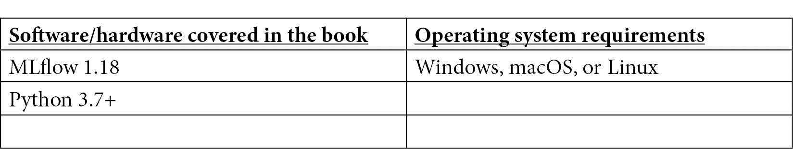

# 前言

基于机器学习的产品实施可能是一项费力的任务。普遍需要减少机器学习开发生命周期不同步骤之间的摩擦，以及参与过程中的数据科学家和工程师团队之间的摩擦。

机器学习从业者，如数据科学家和机器学习工程师，使用不同的系统、标准和工具。虽然数据科学家大部分时间在 Jupyter Notebook 等工具中开发模型，但在生产运行时，模型是在一个对规模和可靠性要求更高的软件应用环境中部署的。

在本书中，您将了解 MLflow 以及有助于您机器学习生命周期的机器学习工程实践，包括数据获取、准备、训练和部署。本书的内容基于开放接口设计，将与任何语言或平台兼容。在可扩展性和可重复性方面，您也将从中受益。

在本书结束时，您将能够轻松地使用 MLflow 设置模型开发环境，构建您的机器学习问题，并使用标准化框架来设置您自己的机器学习系统。如果您正在实施您的第一个生产级机器学习项目，本书也将特别有用。

# 本书面向对象

本书面向软件、机器学习以及数据科学专业人士或爱好者，他们希望探索生产中机器学习系统的工程方面。机器学习从业者将能够通过这本实用的 MLflow 指南将他们的知识付诸实践。本书采用动手实践的方法来实施相关方法，让您能够迅速上手 MLflow。本书的基本要求是具备 Python 编程经验以及了解 Bash 终端和命令。

# 本书涵盖内容

*第一章*，*介绍 MLflow*，将概述 MLflow 的不同功能，指导您安装和探索平台的核心功能。阅读本章后，您将能够在本地上安装和操作您的 MLflow 环境。

*第二章*，*您的机器学习项目*，将介绍本书的重点。本书的方法是通过一个实际业务案例，即股票市场预测，来探索 MLflow 的所有不同功能。将使用问题框架框架让您深入了解书中使用的示例。本书的其余部分将创建一个示例管道供使用。

*第三章*, *您的数据科学工作台*，帮助您了解如何使用 MLflow 创建本地环境，以便您可以在本地使用 MLflow 提供的一切不同功能来开发机器学习项目。

*第四章*, *MLflow 中的实验管理*，您将通过创建不同的模型并在 MLflow 中比较不同运行的指标来获得股票预测的实际经验。您将得到指导，了解如何部署跟踪服务器，以便许多机器学习从业者可以共享指标并改进模型。

*第五章*, *使用 MLflow 管理模型*，探讨了 MLflow 中模型创建的不同功能。将涵盖内置模型，如 PyTorch 和 TensorFlow 模型，以及 MLflow 中不可用的自定义模型。将介绍模型生命周期，以及 MLflow 的模型注册功能。

*第六章*, *介绍 ML 系统架构*，讨论了正确架构机器学习系统的必要性以及 MLflow 如何融入端到端机器学习系统的画面中。

*第七章*, *数据和特征管理*，介绍了数据和特征管理。将阐明特征生成的重要性，以及如何使用特征流通过 MLflow 记录模型结果。

*第八章*, *使用 MLflow 训练模型*，将描述并开发针对当前问题的完整训练管道基础设施，并使用 MLflow 特定的功能。

*第九章*, *使用 MLflow 进行部署和推理*，将使用 MLflow 的 API 和批量功能暴露我们的机器学习系统的端到端部署基础设施，包括推理组件。还将描述 MLflow 的云启用功能。

*第十章*, *扩展您的机器学习工作流程*，涵盖了与高性能/大数据库的集成，这些库允许 MLflow 系统扩展以处理大量数据。

*第十一章*, *性能监控*，探讨了机器学习操作的重要领域以及如何使用最佳实践和操作模式确保书中开发的生成系统平稳运行。

*第十二章*, *MLFlow 的高级主题*，展示了包含完整 MLflow 管道的高级案例研究。这些案例研究使用了与本书其他部分所讨论的不同类型的模型，以确保对 MLflow 的特征覆盖范围广泛。

# 为了充分利用本书

理想情况下，在开始阅读本书之前，您应该对 Python 编程语言有很好的掌握，并且已经创建了基本的机器学习模型。一门机器学习入门课程将有助于将本书中讨论的概念置于上下文中。



如果您正在使用本书的数字版，我们建议您亲自输入代码或从本书的 GitHub 仓库（下一节中有一个链接）获取代码。这样做将帮助您避免与代码复制和粘贴相关的任何潜在错误。

# 下载示例代码文件

您可以从 GitHub 下载本书的示例代码文件[`github.com/PacktPublishing/Machine-Learning-Engineering-with-MLflow`](https://github.com/PacktPublishing/Machine-Learning-Engineering-with-MLflow)。如果代码有更新，它将在 GitHub 仓库中更新。

我们还有其他来自我们丰富的图书和视频目录的代码包可供选择，请访问[`github.com/PacktPublishing/`](https://github.com/PacktPublishing/)。查看它们！

# 下载彩色图像

我们还提供了一份包含本书中使用的截图和图表彩色图像的 PDF 文件。您可以从这里下载：[`static.packt-cdn.com/downloads/9781800560796_ColorImages.pdf`](https://static.packt-cdn.com/downloads/9781800560796_ColorImages.pdf)

# 使用的约定

本书使用了多种文本约定。

文本中的代码：表示文本中的代码单词、数据库表名、文件夹名、文件名、文件扩展名、路径名、虚拟 URL、用户输入和 Twitter 昵称。以下是一个示例：“`model.pkl`文件包含模型的序列化版本”

代码块按以下方式设置：

```py
import mlflow
from sklearn.linear_model import LogisticRegression
mlflow.sklearn.autolog()
with mlflow.start_run():
    clf = LogisticRegression()
    clf.fit(X_train, y_train)
```

任何命令行输入或输出都按以下方式编写：

```py
docker build -t stockpred -f dockerfile
```

**粗体：** 表示新术语、重要单词或您在屏幕上看到的单词。例如，菜单或对话框中的单词以粗体显示。以下是一个示例：“**MLflow**是一个开源平台，用于**机器学习（ML）**生命周期”

小贴士或重要提示

看起来像这样。

# 联系我们

读者的反馈总是受欢迎的。

**一般反馈：** 如果您对本书的任何方面有疑问，请通过 customercare@packtpub.com 给我们发邮件，并在邮件主题中提及书名。

**勘误表：** 尽管我们已经尽最大努力确保内容的准确性，但错误仍然可能发生。如果您在这本书中发现了错误，如果您能向我们报告，我们将不胜感激。请访问[www.packtpub.com/support/errata](http://www.packtpub.com/support/errata)并填写表格。

**盗版：** 如果您在互联网上以任何形式发现我们作品的非法副本，如果您能向我们提供位置地址或网站名称，我们将不胜感激。请通过版权@packt.com 与我们联系，并提供材料的链接。

**如果您有兴趣成为作者：** 如果您在某个领域有专业知识，并且您有兴趣撰写或为书籍做出贡献，请访问[authors.packtpub.com](http://authors.packtpub.com)。

# 分享您的想法

一旦您阅读了《使用 MLflow 的机器学习工程》，我们非常期待听到您的想法！扫描下面的二维码直接进入此书的亚马逊评论页面并分享您的反馈。


[`packt.link/r/1-800-56079-6`](https://packt.link/r/1-800-56079-6)

您的评论对我们和科技社区都非常重要，它将帮助我们确保我们提供的是高质量的内容。
