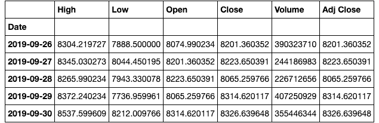
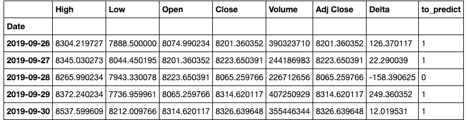
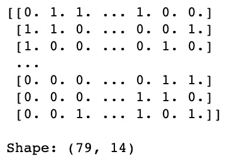
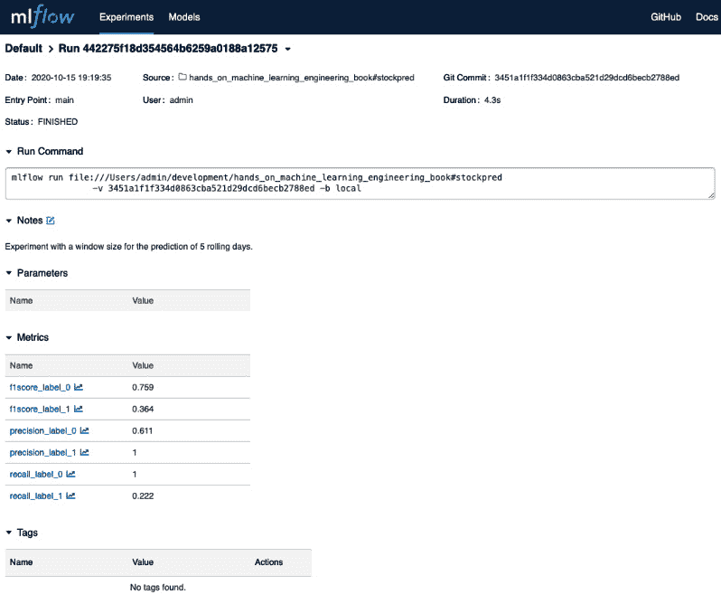
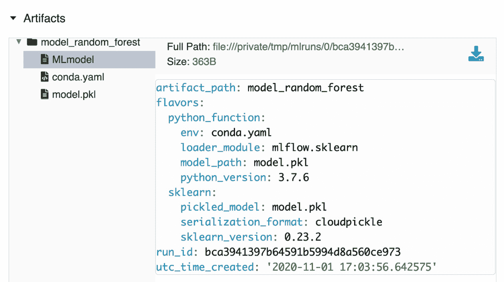
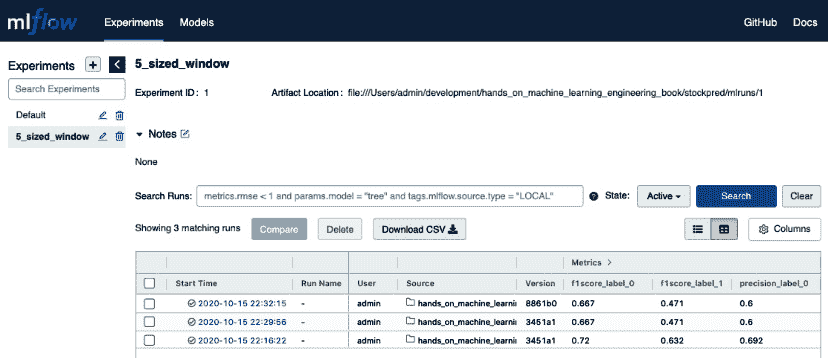
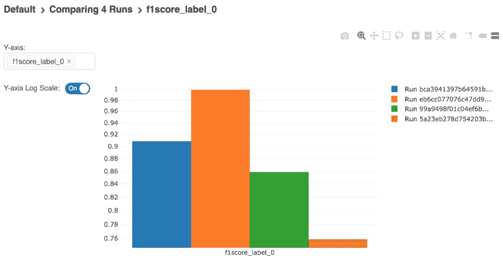
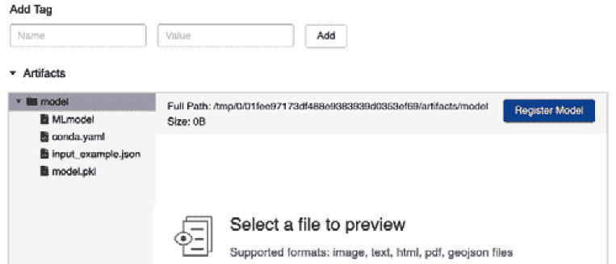
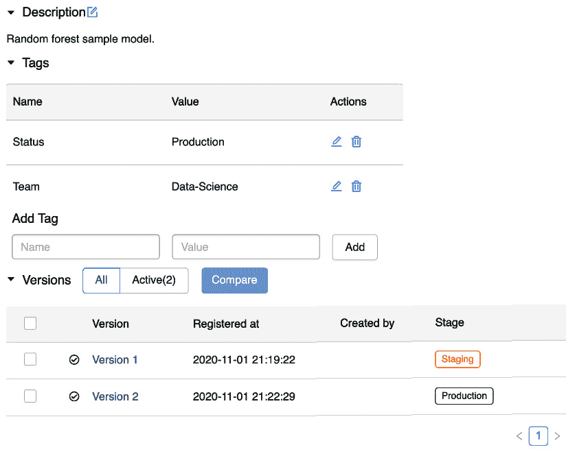

# *第一章*：介绍 MLflow

**MLflow**是一个专注于**机器学习**（**ML**）生命周期、**可重复性**、**训练**和**部署**的开源平台。它基于开放的接口设计，能够与任何语言或平台协同工作，拥有 Python 和 Java 客户端，并通过 REST API 提供访问。可扩展性也是 ML 开发者可以利用的 MLflow 的一个重要优势。

在本书的这一章中，我们将通过示例和示例代码来查看 MLflow 的工作原理。这将建立使用该概念来构建端到端 ML 项目的必要基础。

具体来说，我们将在本章中查看以下部分：

+   什么是 MLflow？

+   开始使用 MLflow

+   探索 MLflow 模块

# 技术要求

对于本章，你需要以下先决条件：

+   在您的机器上安装了最新版本的 Docker。如果您没有最新版本，请按照以下 URL 的说明操作：[`docs.docker.com/get-docker/`](https://docs.docker.com/get-docker/)。

+   访问 bash 终端（Linux 或 Windows）。

+   访问浏览器。

+   已安装 Python 3.5+。

+   已安装 PIP。

# 什么是 MLflow？

基于 ML 的产品实施可能是一项费力的任务。普遍需要减少 ML 开发生命周期不同步骤之间的摩擦，以及参与过程的数据科学家和工程师团队之间的摩擦。

机器学习从业者，如数据科学家和机器学习工程师，使用不同的系统、标准和工具进行操作。虽然数据科学家大部分时间在 Jupyter Notebooks 等工具中开发模型，但在生产环境中运行时，模型是在一个对规模和可靠性要求更高的软件应用环境中部署的。

在 ML 项目中，一个常见的情况是工程团队重新实现模型，创建一个定制的系统来提供特定的模型。对于遵循定制方法的模型开发团队，以下是一些常见的挑战：

+   由于需要创建定制的软件基础设施来开发和提供模型，导致超出预算的 ML 项目

+   在重新实现数据科学家产生的模型时出现的翻译错误

+   在提供预测时遇到的可扩展性问题

+   由于缺乏标准环境，数据科学家在重现训练过程中出现的摩擦

利用机器学习的公司往往创建自己的（通常是极其费力的）内部系统，以确保机器学习开发过程的顺畅和结构化。广泛记录的机器学习平台包括来自 Uber 和 Facebook 的 Michelangelo 和 FBLearner 等系统。

在机器学习（ML）日益普及的背景下，MLflow 最初在 Databricks 创建，并作为一个平台开源，旨在帮助实现机器学习系统的实施。

MLflow 允许一个日常实践者在单一平台上管理机器学习生命周期，从模型开发的迭代到在兼容现代软件系统要求的可靠和可扩展环境中部署。 

# 开始使用 MLflow

接下来，我们将在您的机器上安装 MLflow 并为其在本章中使用做准备。安装 MLflow 时，您有两个选择。第一个选择是通过书中提供的基于 Docker 容器的配方在存储库中：[`github.com/PacktPublishing/Machine-Learning-Engineering-with-Mlflow.git`](https://github.com/PacktPublishing/Machine-Learning-Engineering-with-Mlflow.git)。

要安装它，请按照以下说明操作：

1.  使用以下命令安装软件：

    ```py
    $ git clone https://github.com/PacktPublishing/Machine-Learning-Engineering-with-Mlflow.git
    $ cd Machine-Learning-Engineering-with-Mlflow
    $ cd Chapter01
    ```

1.  在这个阶段，Docker 镜像非常简单：它仅包含 MLflow 和 sklearn，这是本书这一章节中要使用的主要工具。为了说明目的，您可以查看 `Dockerfile` 的内容：

    ```py
    FROM jupyter/scipy-notebook
    RUN pip install mlflow
    RUN pip install sklearn
    ```

1.  要构建镜像，您现在应该运行以下命令：

    ```py
    docker build -t chapter_1_homlflow
    ```

1.  在构建镜像后，您可以运行 `./run.sh` 命令：

    ```py
    ./run.sh
    ```

    重要提示

    确保您的机器上安装了最新版本的 Docker 非常重要。

1.  打开您的浏览器，访问 [`localhost:888`](http://localhost:888)，您应该能够导航到 `Chapter01` 文件夹。

在接下来的部分，我们将使用之前步骤中创建的 Jupyter 环境使用 MLflow 开发我们的第一个模型。

## 使用 MLflow 开发您的第一个模型

从简单性的角度来看，在本节中，我们将使用 sklearn 内置的样本数据集，这是我们最初用来探索 MLflow 功能的机器学习库。对于本节，我们将选择著名的 `Iris` 数据集，使用 MLflow 训练一个多类分类器。

Iris 数据集（sklearn 内置数据集之一，可通过 [`scikit-learn.org/stable/datasets/toy_dataset.html`](https://scikit-learn.org/stable/datasets/toy_dataset.html) 获取）包含以下作为特征的元素：花瓣长度、花瓣宽度、花萼长度和花萼宽度。目标变量是鸢尾花的类别：Iris Setosa、Iris Versicolor 或 Iris Virginica：

1.  加载样本数据集：

    ```py
    from sklearn import datasets
    from sklearn.model_selection import train_test_split
    dataset = datasets.load_iris()
    X_train, X_test, y_train, y_test = train_test_split(dataset.data, dataset.target, test_size=0.4)
    ```

1.  接下来，让我们训练您的模型。

    使用 scikit-learn 等框架训练简单的机器学习模型涉及实例化一个估算器，如 `LogisticRegression`，并调用 `fit` 命令在 scikit-learn 内置的 `Iris` 数据集上执行训练：

    ```py
    from sklearn.linear_model import LogisticRegression
    clf = LogisticRegression()
    clf.fit(X_train, y_train)
    ```

    上述代码行只是 ML **工程** 流程的一小部分。正如将要展示的，为了将前面的训练代码投入生产并确保其可用性和可靠性，需要创建大量的代码。MLflow 的一个主要目标就是帮助设置 ML 系统和项目的过程。在接下来的章节中，我们将展示如何使用 MLflow 使您的解决方案更加健壮和可靠。

1.  然后，我们将添加 MLflow。

    通过几行额外的代码，你应该能够开始你的第一个 MLflow 交互。在以下代码列表中，我们首先导入 `mlflow` 模块，然后是 scikit-learn 中的 `LogisticRegression` 类。你可以使用附带的 Jupyter 笔记本来运行下一部分：

    ```py
    import mlflow
    from sklearn.linear_model import LogisticRegression
    mlflow.sklearn.autolog()
    with mlflow.start_run():
        clf = LogisticRegression()
        clf.fit(X_train, y_train)
    ```

    `mlflow.sklearn.autolog()` 指令允许您在本地目录中自动记录实验。它捕获了使用的底层机器学习库产生的指标。**MLflow Tracking** 是负责处理指标和日志的模块。默认情况下，MLflow 运行的元数据存储在本地文件系统中。

1.  如果你在一个附带的笔记本的根文档上运行以下摘录，你应该现在在你的主目录中有以下文件，这是运行以下命令的结果：

    ```py
    $ ls -l 
    total 24
    -rw-r--r-- 1 jovyan users 12970 Oct 14 16:30 chapther_01_introducing_ml_flow.ipynb
    -rw-r--r-- 1 jovyan users    53 Sep 30 20:41 Dockerfile
    drwxr-xr-x 4 jovyan users   128 Oct 14 16:32 mlruns
    -rwxr-xr-x 1 jovyan users    97 Oct 14 13:20 run.sh
    ```

    `mlruns` 文件夹与你的笔记本文件夹同时生成，包含当前上下文中由你的代码执行的所有实验。

    `mlruns` 文件夹将包含一个带有顺序编号的文件夹来标识你的实验。文件夹的结构如下所示：

    ```py
    ├── 46dc6db17fb5471a9a23d45407da680f
    │   ├── artifacts
    │   │   └── model
    │   │       ├── MLmodel
    │   │       ├── conda.yaml
    │   │       ├── input_example.json
    │   │       └── model.pkl
    │   ├── meta.yaml
    │   ├── metrics
    │   │   └── training_score
    │   ├── params
    │   │   ├── C
    │   │   …..
    │   └── tags
    │       ├── mlflow.source.type
    │       └── mlflow.user
    └── meta.yaml
    ```

    因此，我们几乎不需要付出太多努力，就有很多可追溯性可用，并且有一个很好的基础来改进。

你的实验在先前的样本中被识别为 `UUID`，由 `46dc6db17fb5471a9a23d45407da680f`。在目录的根目录下，有一个名为 `meta.yaml` 的 `yaml` 文件，其中包含以下内容：

```py
artifact_uri: file:///home/jovyan/mlruns/0/518d3162be7347298abe4c88567ca3e7/artifacts
end_time: 1602693152677
entry_point_name: ''
experiment_id: '0'
lifecycle_stage: active
name: ''
run_id: 518d3162be7347298abe4c88567ca3e7
run_uuid: 518d3162be7347298abe4c88567ca3e7
source_name: ''
source_type: 4
source_version: ''
start_time: 1602693152313
status: 3
tags: []
user_id: jovyan
```

这是你实验的基本元数据，包括开始时间、结束时间、运行识别（`run_id` 和 `run_uuid`）、生命周期阶段的假设以及执行实验的用户。设置基本上基于默认运行，但提供了关于你实验的有价值和可读的信息：

```py
├── 46dc6db17fb5471a9a23d45407da680f
│   ├── artifacts
│   │   └── model
│   │       ├── MLmodel
│   │  ^   ├── conda.yaml
│   │       ├── input_example.json
│   │       └── model.pkl
```

`model.pkl` 文件包含模型的序列化版本。对于 scikit-learn 模型，有一个模型的 Python 代码的二进制版本。在自动记录时，利用了底层机器库的指标。默认的打包策略基于一个 `conda.yaml` 文件，其中包含正确的依赖关系，以便能够序列化模型。

`MLmodel` 文件是从 MLflow 项目中关于如何运行当前模型进行推理的主要定义。

`metrics` 文件夹包含训练过程的这次特定运行的训练分数值，可以用来与后续模型改进进行基准测试。

在文件夹列表的第一项中，`params` 文件夹包含了逻辑回归模型的默认参数，不同的默认可能性被透明地列出并自动存储。

# 探索 MLflow 模块

MLflow 模块是软件组件，它们提供了辅助不同机器生命周期阶段的核心理念。MLflow 功能通过模块提供，这些模块是可扩展的组件，它们在平台上组织相关的功能。

以下是在 MLflow 中内置的模块：

+   **MLflow 跟踪**：提供了一种机制和用户界面来处理由 ML 执行（训练和推理）生成的指标和工件

+   **MLflow 项目**：一种用于标准化 ML 项目的包格式

+   **MLflow 模型**：一种机制，可以部署到不同类型的本地和云环境

+   **MLflow 模型注册表**：一个模块，用于管理 MLflow 中的模型及其生命周期，包括状态

为了探索不同的模块，我们将使用以下命令在您的本地环境中安装 MLflow：

```py
pip install mlflow
```

重要提示

确保在您的本地机器上正确安装了技术要求，以便您能够跟随操作。您也可以使用具有所需权限的`pip`命令。

## 探索 MLflow 项目

MLflow 项目代表 ML 项目的组织基本单位。MLflow 项目支持三种不同的环境：Conda 环境、Docker 和本地系统。

重要提示

可以在官方文档中查看 MLProject 文件上可用的不同参数的模型详细信息，该文档可在[`www.mlflow.org/docs/latest/projects.html#running-projects`](https://www.mlflow.org/docs/latest/projects.html#running-projects)找到。

以下是一个`conda`环境`MLproject`文件的示例：

```py
name: condapred
conda_env:
  image: conda.yaml
entry_points:
  main:
    command: "python mljob.py"
```

在`conda`选项中，假设存在一个包含所需依赖项的`conda.yaml`文件。当 MLflow 被要求运行项目时，它将使用指定的依赖项启动环境。

基于系统的环境将如下所示；实际上相当简单：

```py
name: syspred
entry_points:
  main:
    command: "python mljob.py"
```

上述系统变体将基本上依赖于本地环境依赖项，假设底层操作系统包含所有依赖项。这种方法特别容易与底层操作系统发生库冲突；在已经存在适合项目的操作系统环境的情况下，这可能是有价值的。

以下是基于 Docker 环境的`MLproject`文件：

```py
name: syspred
docker_env:
  image: stockpred-docker
entry_points:
  main:
    command: "python mljob.py"
```

一旦您有了环境，定义您的项目外观的主要文件是`MLProject`文件。此文件由 MLflow 用于了解它应该如何运行您的项目。

### 在 MLflow 中开发您的第一个端到端管道

我们将在本节中使用 MLflow 和本地安装的 Docker 原型化一个简单的股票预测项目，并将记录解决方案的不同文件和阶段。您将使用本地系统上安装的 MLflow 和 Docker 来开发它。

重要提示

在本节中，我们假设 MLflow 和 Docker 已在本地安装，因为本节中的步骤将在您的本地环境中执行。

在本示例项目中，任务是创建一个基本的 MLflow 项目，并生成一个可工作的基线 ML 模型，根据一定数量的市场信号预测股市是上涨还是下跌。

在本节中，我们将使用 Yahoo Finance 提供的 BTC-USD 对 3 个月期间的报价数据集。我们将训练一个模型来预测在给定的一天内报价是否会上涨。将通过 MLflow 提供一个 REST API 进行预测。

我们将逐步说明创建一个 MLflow 项目，用于在股票数据上训练分类器，使用 Yahoo API 通过包的 pandas 数据读取器检索金融信息：

1.  添加你的 `MLProject` 文件：

    ```py
    name: stockpred
    docker_env:
      image: stockpred-docker
    entry_points:
      main:
        command: "python train.py"
    ```

    前面的 `MLProject` 文件指定依赖项将使用特定的镜像名称在 Docker 中管理。MLflow 将尝试使用您系统上安装的 Docker 版本来拉取镜像。如果找不到，它将尝试从 Docker Hub 获取。对于本章的目标，MLflow 在您的本地机器上运行是完全可行的。

    我们添加到项目中的第二个配置是主入口点命令。要执行的命令将在 Docker 环境中调用我们的项目代码的 `train.py` Python 文件。

1.  将 Docker 文件添加到项目中。

    此外，您还可以指定您镜像的 Docker 注册表 URL。运行 Docker 的优势是您的项目不受 Python 语言的限制，正如我们将在本书的高级部分中看到的那样。MLflow API 在 Rest 接口以及官方客户端（Python、Java 和 R）中可用：

    ```py
    FROM continuumio/miniconda:4.5.4
    RUN pip install mlflow==1.11.0 \
        && pip install numpy==1.14.3 \
        && pip install scipy \
        && pip install pandas==0.22.0 \
        && pip install scikit-learn==0.20.4 \
        && pip install cloudpickle \
        && pip install pandas_datareader>=0.8.0
    ```

    前面的 Docker 镜像文件基于开源软件包 Miniconda，这是一个免费的、包含数据科学所需的最小包集的最小安装程序，它允许我们控制环境中所需包的详细信息。

    我们将指定 MLflow（我们的 ML 平台）的版本、`numpy` 和 `scipy` 用于数值计算。`Cloudpickle` 允许我们轻松序列化对象。我们将使用 `pandas` 来管理数据框，并使用 `pandas_datareader` 来允许我们轻松从公共来源检索数据。

1.  导入项目所需的所有包。

    在下面的列表中，我们明确导入了在执行训练脚本期间将使用的所有库：读取数据的库，以及与所选初始 ML 模型相关的不同 `sklearn` 模块：

    ```py
    import numpy as np
    import datetime
    import pandas_datareader.data as web
    from sklearn.model_selection import train_test_split
    from sklearn.ensemble import RandomForestClassifier
    from sklearn.metrics import classification_report
    from sklearn.metrics import precision_score
    from sklearn.metrics import recall_score
    from sklearn.metrics import f1_score
    import mlflow.sklearn
    ```

    我们明确选择了 `RandomForestClassifier` 作为股票市场运动检测问题的模型，因为它是一个非常灵活且广泛接受的分类问题基线模型。

1.  获取您的训练数据。

    代码中获取 Yahoo Finance 股票数据集的部分故意很小，因此我们选择一个 3 个月的特定间隔来训练我们的分类器。

    `acquire_training_data` 方法返回一个包含相关数据集的 `pandas` 数据框：

    ```py
    def acquire_training_data():
        start = datetime.datetime(2019, 7, 1)
        end = datetime.datetime(2019, 9, 30)
        df = web.DataReader("BTC-USD", 'yahoo', start, end)
        return df
    ```

    获取数据的格式是交易所 API 中金融证券的经典格式。对于期间每一天，我们检索以下数据：股票的最高价、最低价、开盘价和收盘价，以及成交量。最后一列代表调整后的收盘价，即除息和拆股后的价值：

    

    图 1.1 – 获取数据的摘录

    *图 1.2* 说明了我们希望通过当前数据准备过程实现的目标变量：

    

    图 1.2 – 获取数据中带有预测列的摘录

1.  使数据可由 scikit-learn 使用。

    在先前的步骤中获取的数据显然不能直接由`RandomForestAlgorithm`使用，因为它依赖于分类特征。为了便于执行此操作，我们将使用滚动窗口技术将原始数据转换为特征向量。

    基本上，每一天的特征向量成为当前窗口日和前一个窗口日之间的差值。在这种情况下，我们使用前一天的股市走势（股票上涨为 1，否则为 0）：

    ```py
    def digitize(n):
        if n > 0:
            return 1
        return 0
    def rolling_window(a, window):
        """
            Takes np.array 'a' and size 'window' as parameters
            Outputs an np.array with all the ordered sequences of values of 'a' of size 'window'
            e.g. Input: ( np.array([1, 2, 3, 4, 5, 6]), 4 )
                 Output:
                         array([[1, 2, 3, 4],
                               [2, 3, 4, 5],
                               [3, 4, 5, 6]])
        """
        shape = a.shape[:-1] + (a.shape[-1] - window + 1, window)
        strides = a.strides + (a.strides[-1],)
        return np.lib.stride_tricks.as_strided(a, shape=shape, strides=strides)
    def prepare_training_data(data):
        data['Delta'] = data['Close'] - data['Open']
        data['to_predict'] = data['Delta'].apply(lambda d: digitize(d))
        return data
    ```

    以下示例说明了使用前一天的二值化涨跌产生的数据框输出：

    

    图 1.3 – 二值化市场涨跌的特征向量

1.  在 MLflow 中训练和存储您的模型。

    以下代码列表的这一部分调用了先前声明的数据准备方法并执行了预测过程。

    主要执行还明确地将当前执行中在 MLflow 环境中训练的 ML 模型记录下来。

    ```py
    if __name__ == "__main__":
        with mlflow.start_run():
        training_data = acquire_training_data()
        prepared_training_data_df = prepare_training_data(training_data)
        btc_mat = prepared_training_data_df.as_matrix()
        WINDOW_SIZE = 14
        X = rolling_window(btc_mat[:, 7], WINDOW_SIZE)[:-1, :]
        Y = prepared_training_data_df['to_predict'].as_matrix()[WINDOW_SIZE:]
        X_train, X_test, y_train, y_test = train_test_split(X, Y, test_size=0.25, random_state=4284, stratify=Y)
        clf = RandomForestClassifier(bootstrap=True, criterion='gini', min_samples_split=2, min_weight_fraction_leaf=0.0, n_estimators=50, random_state=4284, verbose=0)
        clf.fit(X_train, y_train)
        predicted = clf.predict(X_test)
        mlflow.sklearn.log_model(clf, "model_random_forest")
        mlflow.log_metric("precision_label_0", precision_score(y_test, predicted, pos_label=0))
        mlflow.log_metric("recall_label_0", recall_score(y_test, predicted, pos_label=0))
        mlflow.log_metric("f1score_label_0", f1_score(y_test, predicted, pos_label=0))
        mlflow.log_metric("precision_label_1", precision_score(y_test, predicted, pos_label=1))
        mlflow.log_metric("recall_label_1", recall_score(y_test, predicted, pos_label=1))
        mlflow.log_metric("f1score_label_1", f1_score(y_test, predicted, pos_label=1))
    ```

    `mlflow.sklearn.log_model(clf, "model_random_forest")` 方法负责在训练后持久化模型。与先前的示例相比，我们明确要求 MLflow 记录我们认为相关的模型和指标。这种对记录项的灵活性允许一个程序将多个模型记录到 MLflow 中。

    最后，根据先前创建的文件，您的项目布局应如下所示：

    ```py
    ├── Dockerfile
    ├── MLproject
    ├── README.md
    └── train.py
    ```

1.  构建您项目的 Docker 镜像。

    为了构建您的 Docker 镜像，您应该运行以下命令：

    ```py
    stockpred tag. This image will be usable in MLflow in the subsequent steps as the model is now logged into your local registry. Following execution of this command, you should expect a successful Docker build:

    ```

    ---> 268cb080fed2

    成功构建 268cb080fed2

    成功标记 stockpred:latest

    ```py

    ```

1.  运行您的项目。

    为了运行您的项目，您现在可以运行 MLflow 项目：

    ```py
    mlflow run .
    ```

    您的输出应类似于此处提供的摘录：

    ```py
    MLFLOW_EXPERIMENT_ID=0 stockpred:3451a1f python train.py' in run with ID '442275f18d354564b6259a0188a12575' ===
                  precision    recall  f1-score   support
               0       0.61      1.00      0.76        11
               1       1.00      0.22      0.36         9
        accuracy                           0.65        20
       macro avg       0.81      0.61      0.56        20
    weighted avg       0.79      0.65      0.58        20
    2020/10/15 19:19:39 INFO mlflow.projects: === Run (ID '442275f18d354564b6259a0188a12575') succeeded ===
    ```

    这包含了对您的模型的打印输出、实验 ID 以及当前运行期间捕获的指标。

在这个阶段，您有一个使用 MLflow 的简单、可复制的股票预测管道的基线，您可以在此基础上进行改进并轻松与他人分享。

### 重新运行实验

MLflow 的另一个极其有用的功能是能够以与最初运行时相同的参数重新运行特定的实验。

例如，您应该能够通过指定项目的 GitHub URL 来运行您之前的项目：

```py
mlflow run https://github.com/PacktPublishing/Machine-Learning-Engineering-with-MLflow/tree/master/Chapter01/stockpred
```

基本上，上一个命令执行的操作是 MLflow 将仓库克隆到临时目录，并按照 MLProject 上的配方执行它。

实验的 ID（或名称）允许您使用原始参数运行项目，从而实现项目的完全可重复性。

MLflow 项目功能允许您的项目在高级云环境中运行，如 Kubernetes 和 Databricks。无缝扩展您的机器学习作业是像 MLflow 这样的平台的主要卖点之一。

如您从当前章节所见，**MLflow 项目模块**允许执行一个可重复的机器学习作业，该作业被视为一个自包含的项目。

## 探索 MLflow 跟踪

**MLflow 跟踪**组件负责可观察性。此模块的主要功能是记录 MLflow 执行的指标、工件和参数。它提供可视化和工件管理功能。

在生产环境中，它被用作一个用 Python 实现的集中式跟踪服务器，可以由组织中的一组机器学习从业者共享。这使得组织内部可以共享机器学习模型的改进。

在*图 1.4*中，您可以看到一个记录了您模型所有运行的界面，并允许您记录您实验的可观察量（指标、文件、模型和工件）。对于每次运行，您都可以查看和比较您模块的不同指标和参数。

它解决了模型开发者比较不同参数和设置下模型不同迭代时的常见痛点。

以下截图展示了我们上一个模型最后一次运行的指标：



图 1.4 – MLFlow 界面/UI 的示例

MLflow 允许检查与每个模型及其相关元数据相关的任意工件，允许比较不同运行的指标。您可以看到 RUN ID 和生成特定实验运行的代码的 Git 哈希：



Figure 1.5 – 检查记录的模型工件

在您的`stockpred`当前目录中，您可以运行以下命令以访问您运行的结果：

```py
mlflow ui
```

在本地运行 MLflow UI 将使其在以下 URL 下可用：[`127.0.0.1:5000/`](http://127.0.0.1:5000/)。

在以下截图所示的特定情况下，我们有一个命名实验，其中调整了前一个示例中窗口大小的参数。在 F1 分数方面，可以清楚地看到算法性能的差异：



图 1.6 – MLflow 运行的列表

MLFlow 跟踪的另一个非常有用的功能是能够在不同作业运行之间进行比较：



图 1.7 – 任务运行 F1 指标的对比

此前的可视化允许从业者决定在生产中使用哪种模型，或者是否进一步迭代。

## 探索 MLflow 模型

**MLflow 模型**是处理 MLflow 中支持的不同模型风味以及将部署到不同执行环境的中介的核心组件。

我们现在将深入探讨 MLflow 最新版本中支持的不同模型。

如*MLflow 入门*部分所示，MLflow 模型在模型以内部格式持久化时具有特定的序列化方法。例如，`stockpred`项目上实现的模型的序列化文件夹看起来如下：

```py
├── MLmodel
├── conda.yaml
└── model.pkl
```

内部，MLflow sklearn 模型在运行时使用`conda`文件及其依赖项持久化，并使用源代码记录的 pickle 模型：

```py
artifact_path: model_random_forest
flavors:
  python_function:
    env: conda.yaml
    loader_module: mlflow.sklearn
    model_path: model.pkl
    python_version: 3.7.6
  sklearn:
    pickled_model: model.pkl
    serialization_format: cloudpickle
    sklearn_version: 0.23.2
run_id: 22c91480dc2641b88131c50209073113
utc_time_created: '2020-10-15 20:16:26.619071'
~
```

默认情况下，MLflow 支持以两种风味提供模型服务，即作为`python_function`或`sklearn`格式。这些风味基本上是用于工具或环境的模型格式。

使用前面的一个很好的例子是能够通过执行以下命令来提供服务而无需任何额外代码：

```py
mlflow models serve -m ./mlruns/0/b9ee36e80a934cef9cac3a0513db515c/artifacts/model_random_forest/
```

您可以访问一个非常简单的 Web 服务器，可以运行您的模型。您可以通过运行以下命令来执行模型预测接口：

```py
curl http://127.0.0.1:5000/invocations -H 'Content-Type: application/json' -d '{"data":[[1,1,1,1,0,1,1,1,0,1,1,1,0,0]]}' [1]%
```

对我们模型 API 调用的响应是`1`；根据我们的预测变量定义，这意味着在下次读取时，股票将上涨。

最后几个步骤概述了 MLflow 作为端到端模型开发工具的强大之处，包括为 ML 服务原型设计基于 REST 的 API。

MLflow 模型组件允许创建具有与内置模型相同优势的自定义 Python 模块，只要遵循预测接口即可。

在接下来的章节中，我们将探讨一些值得注意的模型类型，包括以下内容：

+   XGBoost 模型格式

+   R 函数

+   H2O 模型

+   Keras

+   PyTorch

+   Sklearn

+   Spark MLib

+   TensorFlow

+   Fastai

支持最普遍的 ML 模型类型，结合其内置的本地和云部署能力，是 MLflow 模型的最强功能之一。我们将在与部署相关的章节中更详细地探讨这一点。

## 探索 MLflow 模型注册

MLflow 中的模型注册组件为 ML 开发者提供了模型生命周期管理的抽象。它是一个集中存储库，允许组织或功能中的模型可以协作地共享、创建和归档。

可以使用 MLflow 的不同 API 和 UI 来管理模型。*图 1.7* 展示了跟踪服务器中的 Artifacts UI，可用于注册模型：



图 1.8 – 将模型注册为工件

在注册模型后，您可以使用相关元数据注释已注册的模型，并管理其生命周期。一个例子是将模型放在预生产环境中的测试阶段，并通过将模型发送到生产来管理生命周期：



图 1.9 – 管理不同的模型版本和阶段

本书将进一步探讨模型注册模块，详细介绍了如何设置集中式服务器以及管理机器学习模型的生命周期，从构思到逐步淘汰模型的过程。

# 摘要

在本章中，我们介绍了 MLflow，并探讨了采用机器学习平台以减少机器学习开发中从模型开发到生产的时间的动机。通过本章获得的知识和经验，您可以开始改进并使您的机器学习开发工作流程可重复和可追踪。

我们深入探讨了平台中的每个重要模块：项目、模型、跟踪器和模型注册。特别强调了实际示例，以说明每个核心功能，让您能够以动手的方式接触平台。MLflow 提供了多种开箱即用的功能，这些功能将最小化代码和配置，以减少机器学习开发生命周期的摩擦。MLflow 提供了开箱即用的指标管理、模型管理和可重复性。

我们将在本章节的入门知识基础上，扩展我们在构建实际机器学习平台方面的技能和知识。

在本章中，我们简要介绍了股票市场预测的用例，该用例将在本书的其余部分中使用。在下一章中，我们将专注于严格定义股票市场预测的机器学习问题。

# 进一步阅读

为了增强您的知识，您可以查阅以下链接中提供的文档：

+   MLflow 的参考信息可在以下链接找到：[`www.mlflow.org/docs/latest/`](https://www.mlflow.org/docs/latest/)

+   机器学习平台复习笔记：[`medium.com/nlauchande/review-notes-of-ml-platforms-uber-michelangelo-e133eb6031da`](https://medium.com/nlauchande/review-notes-of-ml-platforms-uber-michelangelo-e133eb6031da)

+   MLflow 技术论文：[`www-cs.stanford.edu/people/matei/papers/2018/ieee_mlflow.pdf`](https://www-cs.stanford.edu/people/matei/papers/2018/ieee_mlflow.pdf)
