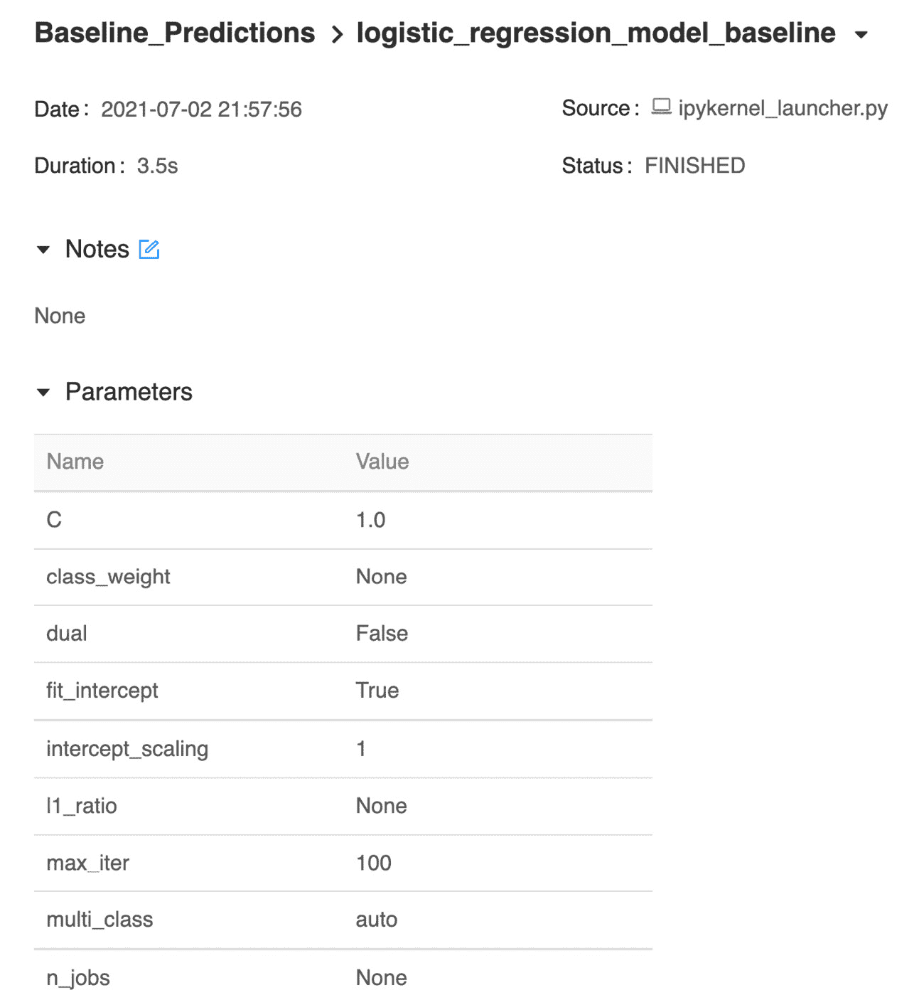
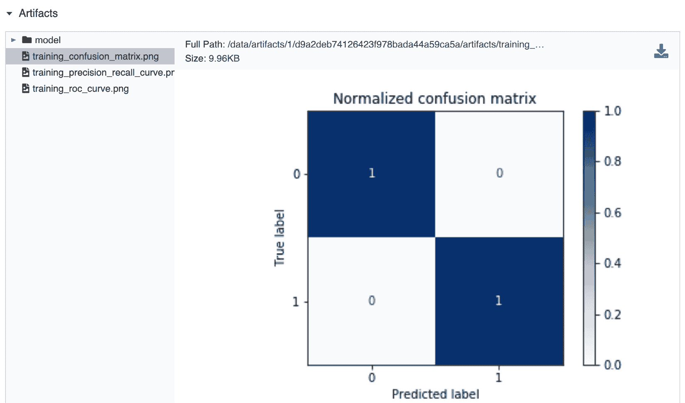
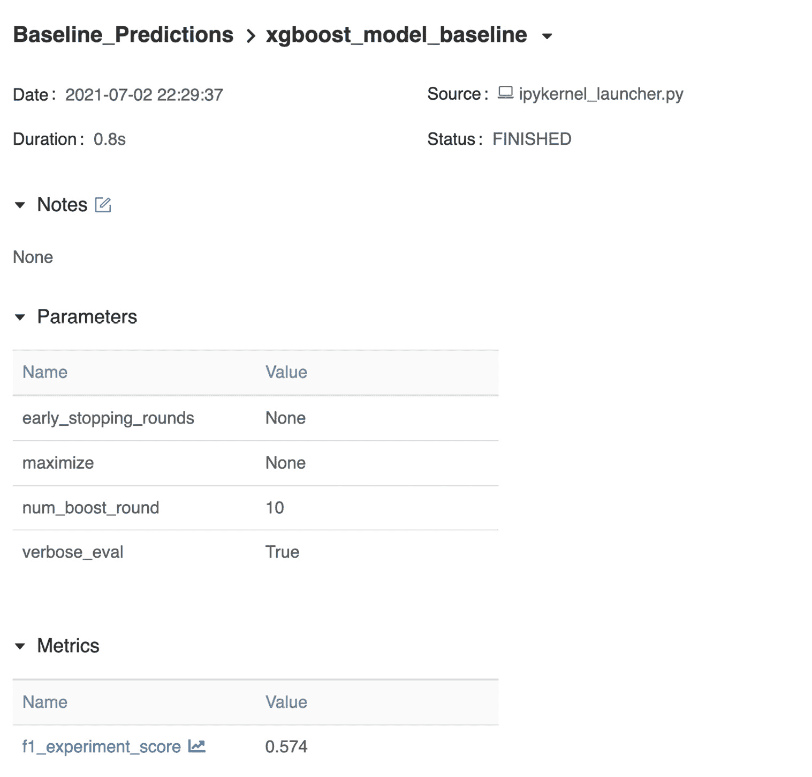
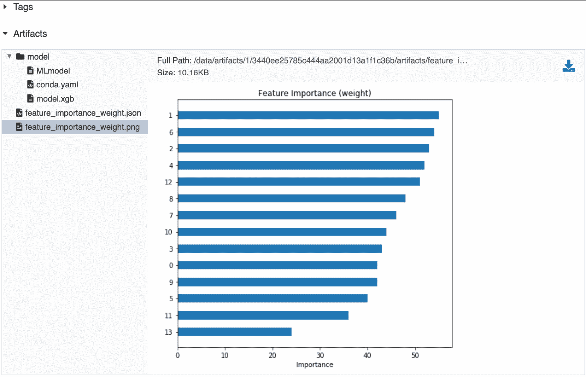
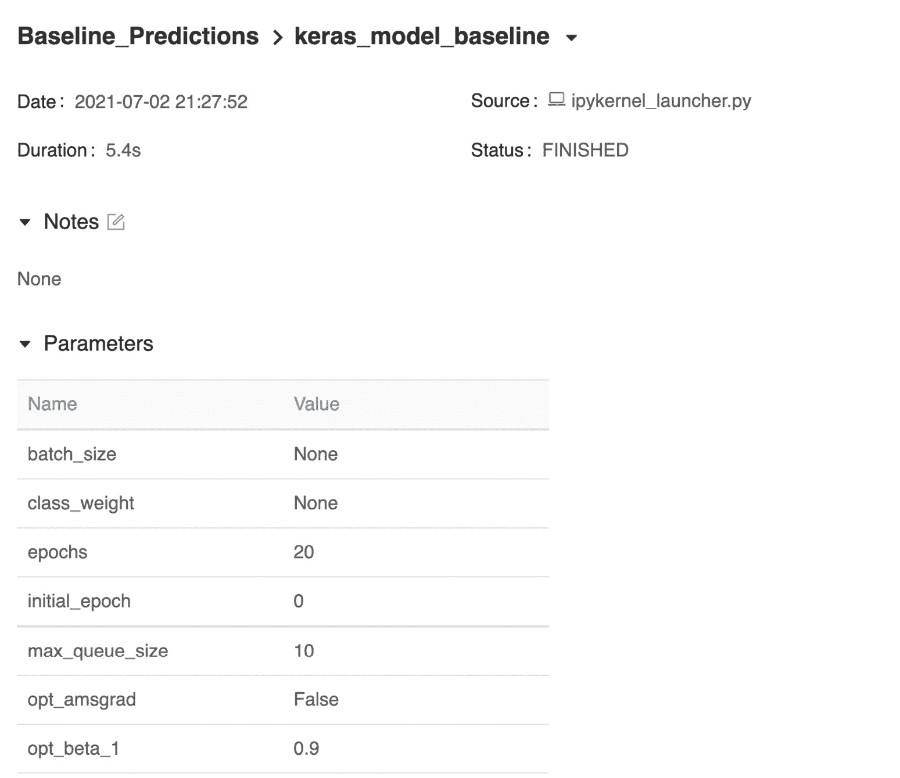
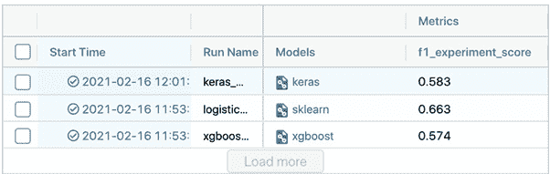
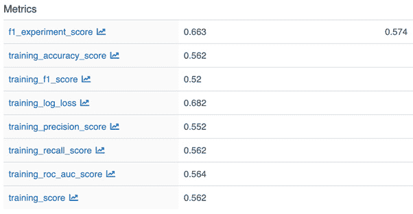
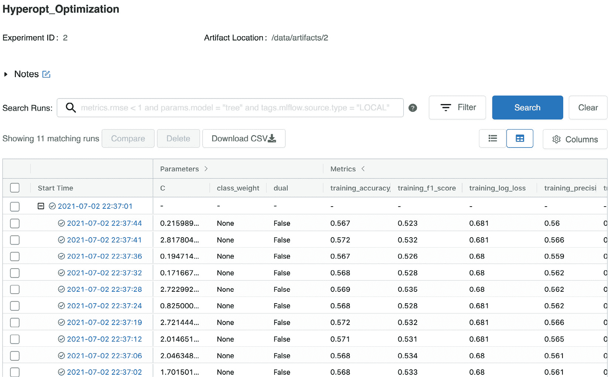
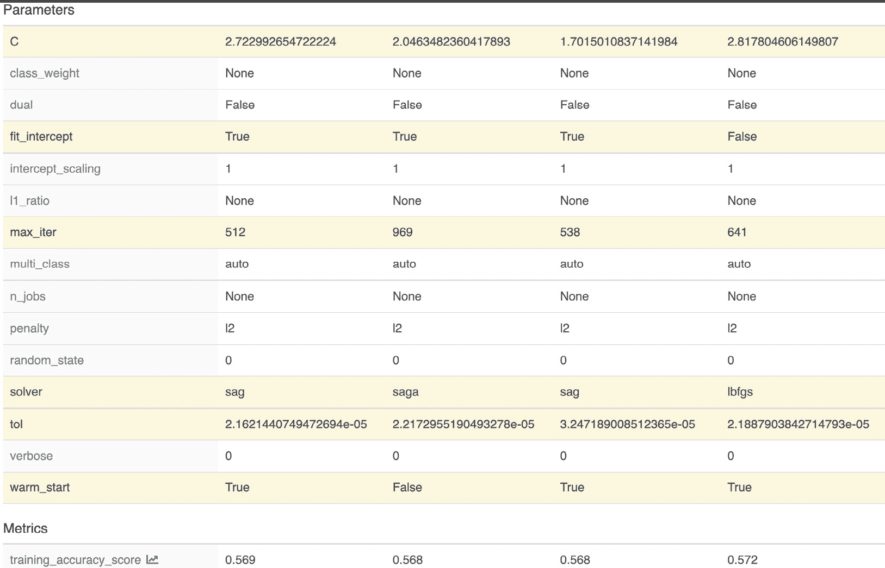
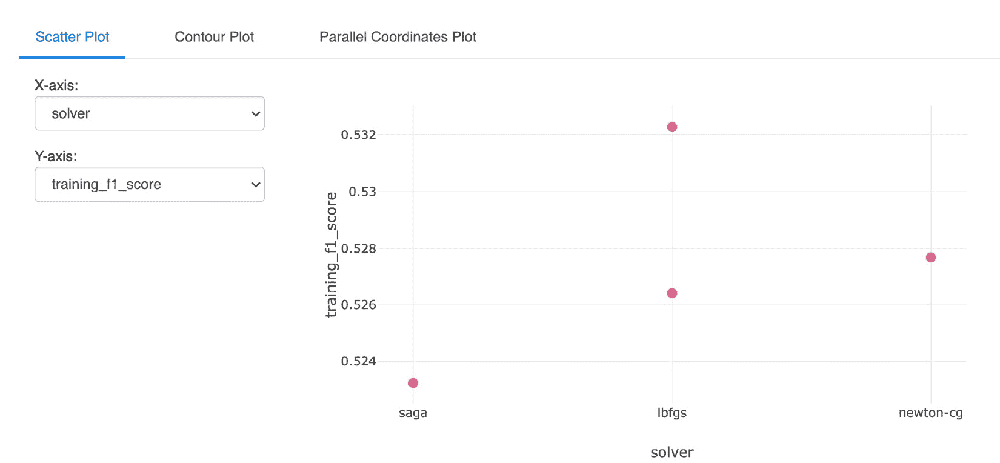

# *第四章*：MLflow 中的实验管理

在本章中，我们将通过创建不同的模型并比较 MLflow 中不同运行的指标来为您提供股票预测的实际经验。您将指导如何使用 MLflow 实验方法，以便不同的机器学习从业者可以共享指标并改进同一模型。

在本章中，我们将具体探讨以下主题：

+   开始使用实验模块

+   定义实验

+   添加实验

+   比较不同的模型

+   使用超参数优化调整您的模型

在这个阶段，我们目前有一个基于朴素启发式的基线管道。在本章中，我们将通过 MLflow 添加我们的技能集，以便能够对多个模型进行实验，并调整一个特定模型。

我们将深入研究*第二章*中介绍的“您的机器学习项目”中的**Psystock**公司案例，这是一个股票交易机器学习平台。在本章中，我们将向我们的平台添加比较多个模型和运行基准实验的功能，以便能够为特定的股票和股票代码创建预测器。

在数据科学函数中，一种常见的方法是为特定模型开发一个模型，涉及以下三个步骤：创建不同模型类型的基线模型，确定表现最佳的模型，并使用最佳模型进行预测。

# 技术要求

对于本章，您需要以下先决条件：

+   在您的机器上安装了最新版本的 Docker。如果您还没有安装，请按照[`docs.docker.com/get-docker/`](https://docs.docker.com/get-docker/)中的说明进行操作。

+   安装了最新版本的 Docker Compose。请按照[`docs.docker.com/compose/install/`](https://docs.docker.com/compose/install/)中的说明进行操作。

+   在命令行中访问 Git，并按照[`git-scm.com/book/en/v2/Getting-Started-Installing-Git`](https://git-scm.com/book/en/v2/Getting-Started-Installing-Git)中的说明安装。

+   访问 bash 终端（Linux 或 Windows）。

+   访问浏览器。

+   安装了 Python 3.5+。

+   您本地安装的最新机器学习版本，并在*第三章*，“您的数据科学工作台”中描述。

# 开始使用实验模块

要开始使用技术模块，您需要开始使用以下文件夹中为本章准备的环境：[`github.com/PacktPublishing/Machine-Learning-Engineering-with-MLflow/tree/master/Chapter04`](https://github.com/PacktPublishing/Machine-Learning-Engineering-with-MLflow/tree/master/Chapter04)

在这个阶段，您应该能够执行 `make` 命令来构建工作台，以便跟随本章的内容。接下来，您需要输入以下命令以移动到正确的目录：

```py
$ cd Chapter04/gradflow/
```

要启动环境，您需要运行以下命令：

```py
$ make
```

开始管理 **MLflow** 中的实验的入口是 *图 4.1* 中所示的实验界面：

2

1

![图片 4.1 – MLflow 中的实验界面

![图片 B16783_04_01.jpg]

图 4.1 – MLflow 中的实验界面

在左侧面板（1）中，您可以管理和创建实验，在右侧（2）中，您可以查询特定实验的详细信息。

要创建一个新实验，您需要在左侧面板上点击 **+** 按钮，并添加您实验的详细信息，如图 *图 4.2* 所示：

![图片 4.2 – 创建新实验

![图片 B16783_04_02.jpg]

图 4.2 – 创建新实验

在简要介绍了跟踪服务器和实验管理功能之后，我们现在将使用工作台上的功能来应对本章的挑战。

# 定义实验

使用机器学习问题框架方法，我们现在将定义本章中股票价格预测问题的主要组件：

![图片 B16783_04_Table_(1).jpg]![表 4.1 – 机器学习问题框架回顾

![图片 B16783_04_Table_(2).jpg]

表 4.1 – 机器学习问题框架回顾

机器学习中的 **F-score** 指标是二元分类器的准确度度量，提供了在误分类（假阳性或假阴性）之间的良好平衡和权衡。更多详细信息可以在维基百科页面找到：[`en.wikipedia.org/wiki/F-score`](https://en.wikipedia.org/wiki/F-score)。

## 探索数据集

根据我们的机器学习问题框架，我们将使用 2020 年 1 月至 12 月的市场观察数据作为输入数据，这些数据由 Yahoo 数据 API 提供。

以下代码片段，使用了我们工作台中的 `pandas_datareader` 模块，使我们能够轻松检索我们想要的数据。完整的笔记本可以在[`github.com/PacktPublishing/Machine-Learning-Engineering-with-MLflow/blob/master/Chapter04/gradflow/notebooks/retrieve_training_data.ipynb`](https://github.com/PacktPublishing/Machine-Learning-Engineering-with-MLflow/blob/master/Chapter04/gradflow/notebooks/retrieve_training_data.ipynb)找到：

```py
import pandas as pd
import numpy as np
import datetime
import pandas_datareader.data as web
from pandas import Series, DataFrame
start = datetime.datetime(2014, 1, 1)
end = datetime.datetime(2020, 12, 31)
btc_df = web.DataReader("BTC-USD", 'yahoo', start, end)
```

对于这个特定问题，我们将从 2014 年检索数据，直到 2020 年底，如图 *图 4.3* 中提供的表格所示。该表格提供了交易部分 BTC 股票的高、低、开盘价和收盘价的价值信息。这些数据将用于本章中模型的训练：

![图片 B16783_04_03.jpg]

图 4.3 – 列出从源（Yahoo Finance）检索的数据

可以通过绘制其中一个变量来轻松绘制这些数据，以说明数据的连续性：

```py
btc_df['Open'].plot()
```

为了更详细地说明数据的性质，我们可以绘制数据的摘录：

![图 4.4 – 从源（雅虎财经）检索到的 BTC Open 变量的绘图]

![img/B16783_04_04.jpg]

图 4.4 – 从源（雅虎财经）检索到的 BTC Open 变量的绘图

在本节中明确定义我们将要实验的内容后，我们将添加新的模型，以便我们能够运行实验并在它们之间进行比较。

所需范围的数据方便地保存在 `Chapter04/gradflow/notebooks/training_data.csv` 文件中，时间范围从 2014 年到 2020 年（含），因此可以在建模阶段轻松检索。

# 添加实验

因此，在本节中，我们将使用 **MLflow** 的实验模块来跟踪不同模型的运行，并将它们发布到我们的工作台数据库中，以便可以并排比较性能结果。

实验实际上可以由不同的模型开发者进行，只要他们都指向共享的 MLflow 基础设施。

为了创建我们的第一个模型，我们将选择一组模型家族，并在每个案例上评估我们的问题。从更广泛的角度来看，分类的主要家族可以是基于树的模型、线性模型和神经网络。通过查看在每个案例上表现更好的指标，我们然后可以将调整引导到最佳模型，并将其用作我们的初始生产模型。

我们在本节中的选择包括以下内容：

+   **逻辑分类器**：线性模型家族的一部分，并且是常用的基线。

+   **Xgboost**：这属于树提升算法家族，其中许多弱树分类器被组装成一个更强的模型。

+   **Keras**：这类模型属于神经网络家族，通常用于数据量很大且特征之间关系非线性的情况。

设置新模型的步骤相当常见，每个模型都会有重叠和重复的代码。接下来，我们将从基于逻辑回归的分类器开始。

## 设置基于逻辑分类器的步骤

在本子节中，我们将使用 `scikit-learn` 实现逻辑回归分类器，并使用我们的输入数据训练模型。

该模型的完整笔记本可在本书的存储库中找到，并可用于在 `Chapter04/gradflow/notebooks/mlflow_run_logistic_regression.ipynb` 文件中跟随：

1.  `SKLearn` 模型、`LogisticRegression` 和 `f1_score` 指标功能，这将使我们能够计算性能：

    ```py
    import pandas
    import numpy as np
    import mlflow
    import tensorflow
    from tensorflow import keras
    import mlflow.keras
    from sklearn.metrics import f1_score,confusion_matrix
    from sklearn.model_selection import train_test_split
    ```

1.  `training_data.csv` 文件：

    ```py
    pandas_df = pandas.read_csv("training_data.csv")
    X=pandas_df.iloc[:,:-1]
    Y=pandas_df.iloc[:,-1]
    X_train, X_test, y_train, y_test = \
    train_test_split(X, Y, test_size=0.33, 
                     random_state=4284, stratify=Y)
    ```

    使用 `train_test_split` 函数将数据分为训练集和测试集，其中三分之一的用于测试，其余用于训练。

1.  `mlflow.set_experiment` 方法。这将创建一个实验（如果不存在）或将当前运行与一个实验关联。我们使用 `mlflow.sklearn.autolog()` 启用 MLflow 的自动功能来捕获实验的指标：

    ```py
    mlflow.set_experiment("Baseline_Predictions")
    mlflow.sklearn.autolog()
    ```

1.  `with`。`mlflow.start_run` 函数用于处理将运行与特定的 `run_name` 注册，以便它可以被识别，并包含 `fit` 模型，以及用于计算 `f1_score` 实验性能指标的评估代码：

    ```py
    with mlflow.start_run(run_name='logistic_regression_model_baseline') as run:
        model = LogisticRegression()
        model.fit(X_train, y_train)
        preds = model.predict(X_test)
        y_pred = np.where(preds>0.5,1,0)
        f1 = f1_score(y_test, y_pred)
        mlflow.log_metric(key="f1_experiment_score", 
                          value=f1)
    ```

    此外，我们需要使用 `mlflow.log_metric` 函数记录我们特定的指标 `f1_experiment_score`。添加我们特定方法的主要原因是为每个模型，**MLflow** 中的自动记录功能使用每个底层框架默认的指标，通常这些指标并不匹配。

执行所有与模型开发相关的步骤后，我们现在可以导航到我们的运行并可视化实验的日志。在 *图 4.5* 中，你可以看到与逻辑回归、持续时间以及你在运行中使用的所有参数相关的特定参数：



图 4.5 – 逻辑回归模型细节

对于 `SKLearn` 模型，**MLflow** 自动记录混淆矩阵和精确率和召回率曲线，这对于检测模型在训练数据上的表现非常有用。例如，*图 4.6* 报告将存储在运行的艺术品中：



图 4.6 – 混淆矩阵指标

MLflow 为 Sklearn 提供了内置的指标，这为训练过程中产生的模型提供了更好的可见性，而无需开发者编写额外的代码。

### 设置基于 XGBoost 的分类器的步骤

我们现在将使用 `XGBoost` 库实现基于梯度树的算法。

该模型的完整笔记本可在本书的存储库中找到，并可用于在 `Chapter04/gradflow/notebooks/mlflow_run_xgboost.ipynb` 文件中跟随：

**导入依赖项**：XGBoost 库与指标函数一起导入：

```py
import pandas
import mlflow
import xgboost as xgb
from sklearn.metrics import f1_score
from sklearn.model_selection import train_test_split
```

1.  `training_data.csv` 文件。

1.  `Baseline_Predictions`，我们需要给 MLflow 指示通过 `mlflow.xgboost.autolog` 自动记录模型：

    ```py
    mlflow.set_experiment("Baseline_Predictions")
    mlflow.xgboost.autolog()
    ```

1.  `f1_score`:

    ```py
    with mlflow.start_run(
      run_name='xgboost_model_baseline') as run:
        model=xgb.train(dtrain=dtrain,params={})
        preds = model.predict(dtest)
        y_bin = [1\. if y_cont > threshold else 0\. for y_cont in preds]
        f1= f1_score(y_test,y_bin)
        mlflow.log_metric(key="f1_experiment_score", 
                          value=f1)
    ```

执行所有与模型开发相关的步骤后，我们现在可以导航到我们的运行并可视化实验的日志。在 *图 4.7* 中，你可以看到与 `xgboost_model_baseline`、持续时间以及你在运行中使用的所有参数相关的特定参数：



图 4.7 – MLflow 中的 XGBoost 分类器细节

对于 XGBoost 模型，**MLflow** 自动记录特征信息和重要性。我们可以在 *图 4.8* 中看到模型存储在工作台 *艺术品* 部分的特征排名：



图 4.8 – XGBoost 在 MLflow 上的特征重要性

*图 4.8* 中的特征重要性图允许开发者从数据中了解模型的内部结构。在这种情况下，似乎输入向量的第 14 天的第 2 天和第 7 天是前两个有意义的特征。接下来，我们将实现一个基于深度学习的模型。

### 基于深度学习的分类器设置步骤

在本节中，我们将实现一个神经网络算法来解决我们的分类问题。

该模型的完整笔记本位于本书的仓库中，可以在 Chapter04/gradflow/notebooks/mlflow_run_keras.ipynb 文件中找到以进行跟随：

1.  `tensorflow`，因为我们将其用作 `keras` 的后端：

    ```py
    import pandas
    import numpy as np
    import mlflow
    import tensorflow
    from tensorflow import keras
    import mlflow.keras
    from sklearn.metrics import f1_score,confusion_matrix
    from sklearn.model_selection import train_test_split
    ```

1.  **获取数据**：请参考 *设置基于 XGBoost 的分类器步骤* 部分的第 2 步。

1.  `Baseline_Predictions`，我们需要给 MLflow 指令，通过 `mlflow.tensorflow.autolog` 自动记录模型：

    ```py
     mlflow.set_experiment("Baseline_Predictions")
     mlflow.tensorflow.autolog()
    ```

    `Sklearn` 或 XGBoost 分类器，因此我们需要定义网络的层和架构。在这种情况下，需要按照 Tensorflow 的要求编译 `Sequential` 架构和模型：

    ```py
    model = keras.Sequential([
      keras.layers.Dense(
        units=36,
        activation='relu',
        input_shape=(X_train.shape[-1],)
      ),
      keras.layers.BatchNormalization(),
      keras.layers.Dense(units=1, activation='sigmoid'),
    ])
    model.compile(
      optimizer=keras.optimizers.Adam(lr=0.001),
      loss="binary_crossentropy",
      metrics="Accuracy"
    )
    ```

1.  `run_name`、拟合模型以及计算 `f1_score` 指标：

    ```py
    with mlflow.start_run(
      run_name='keras_model_baseline') as run:
        model.fit(
            X_train,
            y_train,
            epochs=20,
            validation_split=0.05,
            shuffle=True,
            verbose=0
        )
        preds = model.predict(X_test)
        y_pred = np.where(preds>0.5,1,0)
        f1 = f1_score(y_test, y_pred)
        mlflow.log_metric(key="f1_experiment_score", 
                          value=f1)
    ```

    对于 `keras` 模型，**MLflow** 会自动记录大量的神经网络相关数据，包括优化器、epoch 和批大小，以及其他在 *图 4.9* 中可以看到的相关信息：



图 4.9 – Keras 分类器模型细节

此外，**TensorFlow** 日志可以连接到 TensorBoard。这是一个 TensorFlow 内置工具，用于提供机器学习工作流程的可视化和指标。创建了接口，以便模型开发者可以利用本地的 TensorFlow 仪器和专业的可视化工具。

在我们的平台上设置好分类器后，在下一节中，我们将准备好比较使用 MLflow 开发的不同分类器的性能。

# 比较不同模型

我们在本节中为每个覆盖的模型运行了实验，并验证了所有不同的工件。只需查看我们的基线实验表，并选择共同的定制指标 `f1_experiment_score`，我们就可以看到表现最好的模型是基于逻辑回归的模型，F 分数为 0.66：



图 4.10 – 从目标指标的角度比较不同模型性能

指标也可以并排比较，如图 *图 4.11* 所示。在左侧，我们有 `SKlearn` 模型，在右侧是 XGBoost 模型，带有自定义的 `f1_experiment_score` 指标。我们可以看到，两者提供的指标是不同的，因此当我们有不同模型时，自定义指标的原因：



图 4.11 – Sklearn 模型的指标

比较指标后，很明显最佳模型是逻辑回归。为了改进模型，在下一节中，我们将使用最先进的技术来优化其参数，并使用 MLflow 实验功能来实现这一点。

# 使用超参数优化调整模型

机器学习模型有许多参数，允许开发者提高性能并控制他们所使用的模型，提供更好的数据拟合和生产用例的杠杆。超参数优化是系统地、自动地识别机器学习模型最佳参数的过程，对于此类系统的成功部署至关重要。

在上一节中，我们确定了针对我们问题的最佳模型族（换句话说，`LogisticRegression`），因此现在我们需要使用 MLflow 来确定我们模型的正确参数。您可以在项目仓库中的以下笔记本中跟随操作，位于 Chapter04/gradflow/notebooks/hyperopt_optimization_logistic_regression_mlflow.ipynb：

1.  `hyperopt` 库，其中包含多个算法帮助我们进行模型调优：

    ```py
    from hyperopt import tpe
    from hyperopt import STATUS_OK
    from hyperopt import Trials
    from hyperopt import hp
    from hyperopt import fmin
    from sklearn.linear_model import LogisticRegression
    from sklearn.model_selection import cross_val_score
    from sklearn.model_selection import train_test_split
    ```

1.  我们模型中的 `f1_score` 指标。在 `hyperopt` 中，优化是通过最小化来实现的，但在这个案例中，我们希望得到最大的 `f1_score` 指标。因此，我们定义损失（最小化的函数）的方式是 `f1_score` 指标的倒数，即 `loss = 1-fscore`，这样这个函数的最小化将代表最佳的 `f1_score` 指标。对于模型参数的每一次运行，我们将它包裹在 `mlflow.start_run(nested=True)` 中，这样每次优化迭代都会作为主任务的子运行被记录，从而在比较运行间的指标时提供多项优势：

    ```py
    N_FOLDS = 3
    MAX_EVALS = 10
    def objective(params, n_folds = N_FOLDS):
        # Perform n_fold cross validation with 
        #hyperparameters
        # Use early stopping and evaluate based on ROC AUC
        mlflow.sklearn.autolog()
        with mlflow.start_run(nested=True):
            clf = LogisticRegression(**params,
                                     random_state=0,
                                     verbose =0)
            scores = cross_val_score(clf, X_train, 
                                     y_train, cv=5, 
                                     scoring='f1_macro')
            # Extract the best score
            best_score = max(scores)
            # Loss must be minimized
            loss = 1 - best_score
            # Dictionary with information for evaluation
            return {'loss': loss, 'params': params, 
                    'status': STATUS_OK}
    ```

1.  `best` 变量。核心功能是最小化，由 `fmin(fn = objective, space = space, algo = tpe.suggest, max_evals = MAX_EVALS, trials = bayes_trials)` 表示，其中我们提供了之前定义的参数空间和目标函数：

    ```py
    # Algorithm
    tpe_algorithm = tpe.suggest
    # Trials object to track progress
    bayes_trials = Trials()
    mlflow.set_experiment("Bayesian_param_tuning")
    with mlflow.start_run():
        best = fmin(fn = objective, space = space, 
                    algo = tpe.suggest, 
                    max_evals = MAX_EVALS, 
                    trials = bayes_trials)
    ```

1.  运行实验几分钟之后，我们现在可以回顾 `Hyperopt_Optimization` 实验中的实验：

    图 4.12 – 列出超参数调优的所有嵌套运行

1.  通过点击 `training_f1_score` 和求解器：

    图 4.13 – 列出超参数调优的所有嵌套运行

1.  我们可以轻松地在同一界面中比较不同的求解器和对我们性能指标的影响，从而进一步了解我们的建模阶段：



图 4.14 – 列出超参数调优的所有嵌套运行

我们通过优化当前问题的最有效模型的参数来结束本节。在本书的下一章中，我们将使用最佳模型提供的信息，深入探讨**MLflow**中模型管理的生命周期。

# 摘要

在本章中，我们介绍了 MLflow 的实验组件。我们了解了 MLflow 中的日志指标和工件。我们详细说明了在 MLflow 中跟踪实验的步骤。

在最后几节中，我们探讨了使用本章学到的概念进行超参数优化的用例。

在下一章中，我们将专注于使用本章开发的模型，利用 MLflow 来管理模型。

# 进一步阅读

为了进一步巩固你的知识，你可以查阅以下链接中的文档：

+   [`www.mlflow.org/docs/latest/tracking.html`](https://www.mlflow.org/docs/latest/tracking.html)

+   [`en.wikipedia.org/wiki/Hyperparameter_optimization`](https://en.wikipedia.org/wiki/Hyperparameter_optimization)
