# *第五章*：使用 MLflow 管理模型

在本章中，您将了解 MLflow 中模型管理的不同功能。您将了解 MLflow 中的模型生命周期，我们将解释如何将其与您的常规开发工作流程集成以及如何创建 MLflow 中不可用的自定义模型。模型生命周期将与 MLflow 的模型注册表功能一起介绍。

具体来说，在本章中，我们将查看以下部分：

+   理解 MLflow 中的模型

+   探索 MLflow 中的模型风味

+   管理模型和签名模式

+   使用模型注册表管理生命周期

从工作台的角度来看，我们希望使用 MLflow 来管理我们的模型并实施一个清晰的模型生命周期。通过将管理模型功能添加到我们的基准测试中，利用 MLflow 将提高我们机器学习工程解决方案的质量和运营。

# 技术要求

对于本章，您需要以下内容：

+   在您的机器上安装了最新版本的 Docker。如果您还没有安装，请按照[`docs.docker.com/get-docker/`](https://docs.docker.com/get-docker/)中的说明进行操作。

+   最新版本的 `docker-compose` 已安装。请按照 https://docs.docker.com/compose/install/ 中的说明进行操作。

+   在命令行中访问 Git 并按照[`git-scm.com/book/en/v2/Getting-Started-Installing-Git`](https://git-scm.com/book/en/v2/Getting-Started-Installing-Git)中描述的方式进行安装。

+   访问 Bash 终端（Linux 或 Windows）。

+   访问浏览器。

+   安装了 Python 3.5+。

+   本地安装了您机器学习工作台的最新版本，如*第三章*中所述，*您的数据科学工作台*。

# 理解 MLflow 中的模型

在 MLflow 平台上，您有两个主要组件可用于管理模型：

+   **模型**：此模块管理平台上的格式、库和标准执行模块。它支持最常用的多种机器学习模型：sklearn、XGBoost、TensorFlow、H20、fastai 等。它具有管理模型输出和输入模式的功能，并便于部署。

+   **模型注册表**：此模块处理模型生命周期，从注册和标记模型元数据以便相关系统检索。它支持不同状态的模型，例如，实时开发、测试和生产。

MLflow 模型在本质上是一种模型打包格式。MLflow 模型打包的主要目标是使模型类型与其执行环境解耦。MLflow 模型的类比有点像模型的 **Dockerfile**，其中您描述模型的元数据，并且上游的部署工具能够根据规范与模型交互。

如图 5.1 中的图所示，在一侧您有您的模型库，例如 TensorFlow 或 sklearn。在 MLflow 的核心，您有 MLflow 模型格式，它能够以多种风味（模型格式）提供，以满足本地和云上不同类型的推理工具：

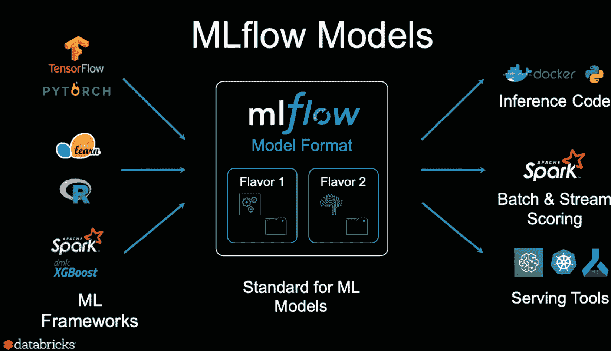

图 5.1 – MLflow 模型图

*图 5.1*是从 URL [`www.infoq.com/presentations/mlflow-databricks/#`](https://www.infoq.com/presentations/mlflow-databricks/#) 提取的。

MLflow 模型定义的核心部分是 MLflow 模型文件，如图中下一个屏幕截图所示：

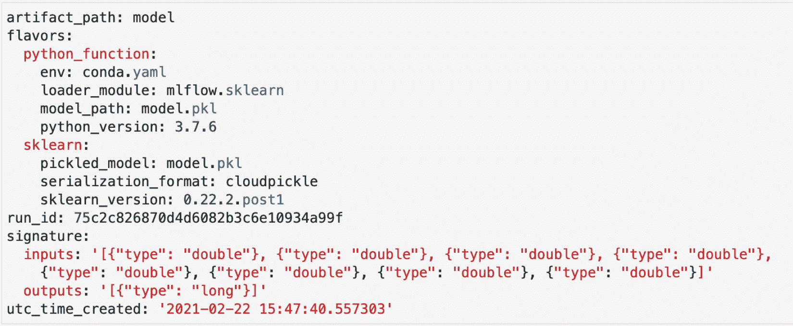

图 5.2 – MLmodel 文件的示例

一个 MLmodel 示例可以在图 5.2 中看到，并提供以下信息：

+   **运行 ID**：这是对项目模型运行的引用，该运行允许创建模型。

+   **创建时间**：模型创建的时间戳。

+   MLflow 提供的`pyfunc`模型。

+   **签名**：这是 MLmodel 中定义模型签名并允许您以某种方式类型化模型推理过程的组件。它允许验证需要与模型签名匹配的输入数据。

`pyfunc`。此函数在支持 Python 的任何环境中都受支持，为模型的部署者提供了在 MLflow 中记录模型后如何最佳运行模型的灵活性：

1.  在项目的 GitHub 仓库中，请转到`Gradflow`文件夹，并按照以下命令启动本章的环境：

    ```py
    make 
    ```

1.  您可以运行包括图 5.3 中显示的模型单元格在内的所有单元格：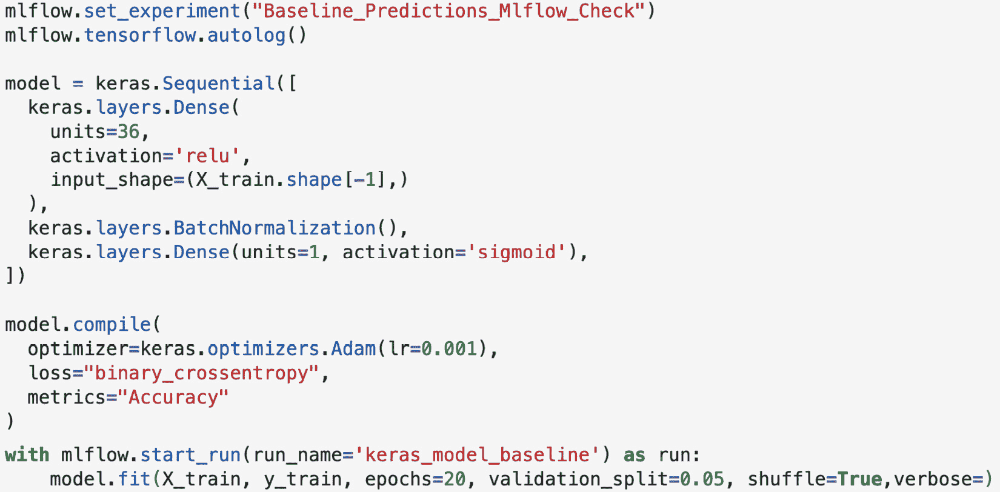

    图 5.3 – MLmodel 文件的示例

    图 5.3 中的模型应该与*第四章*中使用的模型非常相似，即 MLflow 中的实验管理。使用`mlflow.start_run`，您可以在 MLflow 中开始记录模型，并利用平台固有的功能来捕获正在开发的模型的相关细节。

1.  您现在可以探索 MLflow 中的`MLmodel`文件！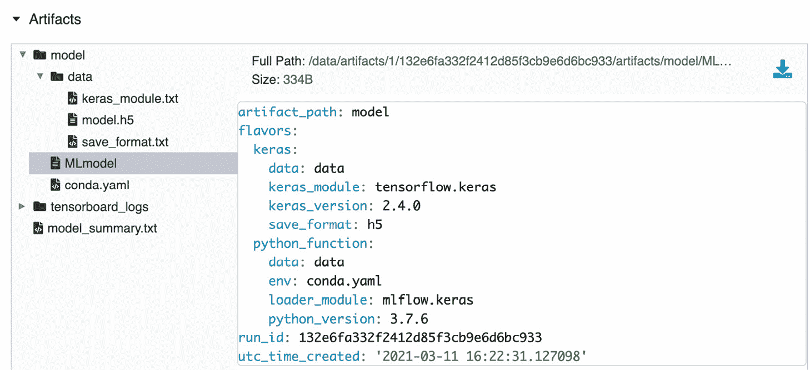

    图 5.4 – MLmodel 文件的示例

1.  在 MLflow 中探索`conda`文件！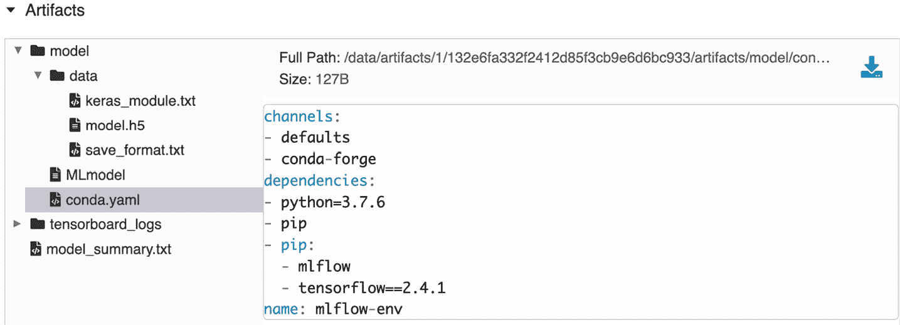

    图 5.5 – MLmodel 文件的示例

1.  将模型以`MLflow Pyfunc`格式加载进行预测：

    ```py
    import mlflow
    logged_model = ‘/data/artifacts/1/132e6fa332f2412d85f3cb9e6d6bc933/artifacts/model’
    # Load model as a PyFuncModel.
    loaded_model = mlflow.pyfunc.load_model(logged_model)
    # Predict on a Pandas DataFrame.
    import pandas as pd
    loaded_model.predict(pd.DataFrame(X_test))
    ```

    或者，模型可以以原生 H5 Keras 格式加载，并加载到完全不同的应用程序中，如图 5.4 所示，使用`/data/model/model.h5`文件。

在本节介绍了 MLflow 中的模型概念之后，我们将进一步深入探讨 MLflow 中不同类型的模型。

# 探索 MLflow 中的模型风味

MLflow 中的模型风味基本上是 MLflow 支持的不同库的不同模型。此功能允许 MLflow 使用每个特定模型的本地库处理模型类型，并支持一些模型的本地功能。以下列表展示了代表模型的选取，以描述和说明 MLflow 中可用的支持：

+   `mlflow.tensorflow`: TensorFlow 是迄今为止最常用的库之一，特别适合深度学习。MLflow 通过以 TensorBoard 格式保存日志，与模型格式和监控能力进行原生集成。MLflow 支持 TensorFlow 模型的自动记录。

+   `mlflow.h2o`: H2O 是一个面向模型自动化的完整机器学习平台，与 MLflow 有一些重叠的功能。MLflow 提供了在 H2O 原生格式中加载（`load_model`）和记录模型（`log_model`）的能力，允许工具之间的互操作性。不幸的是，截至当前 MLflow 版本，你无法在`h2o`模型上使用自动记录：

    ```py
    mlflow.h2o.load_model(...)
    mlflow.h2o.log_model(...)
    ```

+   `mlflow.spark`: MLflow 通过两个主要接口与 Apache Spark 库进行原生集成：Spark MLlib 用于机器学习，以及 MLeap 平台（https://combust.github.io/mleap-docs/）。Mleap 更像是一个部署平台，而 MLlib 则更像是一个你可以添加到项目中的库。

MLflow 支持非常全面的口味/格式列表，它们的用法和支持可以在这里阅读：[`www.mlflow.org/docs/latest/python_api/index.html.`](https://www.mlflow.org/docs/latest/python_api/index.html)

)

## 自定义模型

我们可以深入探讨下一段代码和自定义的`RandomPredictor`模型。只要提供一个具有`fit`和`predict`方法接口的类，你就可以拥有自己的自定义 MLflow 模型：

```py
class RandomPredictor(mlflow.pyfunc.PythonModel):
  def __init__(self):
    pass
  def fit(self):
    pass
  def predict(self, context, model_input):
    return model_input.apply(
        lambda column: random.randint(0,1))
```

在前面的`class`中，我们基本上使用随机概率，它可以作为一个样本模型，用于确保你的模型比随机模型更好。

在本节中，我们介绍了不同类型的模型风味和自定义模式的创建。接下来，我们将探讨 MLflow 的一些模式和签名特征。

# 管理模型签名和模式

MLflow 的一个重要特性是提供模型输入和输出模式的抽象，以及在预测和训练期间验证模型数据的能力。

如果你的输入在预测期间不匹配模型的模式和签名，MLflow 会抛出一个错误：

1.  接下来，我们将查看一个简单的数字分类模型（数据集的详细信息可在以下链接找到：[`archive.ics.uci.edu/ml/datasets/Optical+Recognition+of+Handwritten+Digits`](https://archive.ics.uci.edu/ml/datasets/Optical+Recognition+of+Handwritten+Digits)）的代码示例。以下代码将图像展平为 pandas DataFrame，并将模型拟合到数据集：

    ```py
    from sklearn import datasets, svm, metrics
    from sklearn.model_selection import train_test_split
    import mlflow
    digits = datasets.load_digits()
    n_samples = len(digits.images)
    data = digits.images.reshape((n_samples, -1))
    clf = svm.SVC(gamma=0.001)
    X_train, X_test, y_train, y_test = train_test_split(
        data, digits.target, test_size=0.5, shuffle=False)
    mlflow.sklearn.autolog()
    with mlflow.start_run():
        clf.fit(X_train, y_train)
    ```

1.  我们将查看之前的代码列表，您可以在新的笔记本中运行它，并通过 MLflow UI 深入调查 *图 5.6* 中生成的 MLmodel：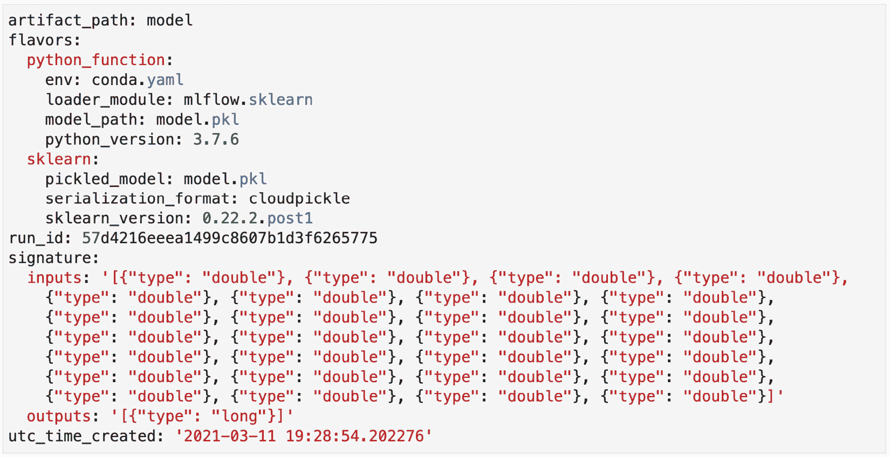

    图 5.6 – MLmodel 文件示例

1.  MLmodel 文件包含输入和输出文件的 JSON 签名。对于一些自动记录的变体，我们可能无法自动推断签名，因此您可以在记录模型时提供签名：

    ```py
    # flatten the images
    from mlflow.models.signature import infer_signature
    with mlflow.start_run(run_name=’untuned_random_forest’):
        …
        signature = infer_signature(X_train, 
            wrappedModel.predict(None, X_train))
        mlflow.pyfunc.log_model(“random_forest_model”, 
                                python_model=wrappedModel, 
                                signature=signature)
    ```

在之前的代码块中，模型的签名由 `infer_signature` 方法提供。当模型通过 `log_model` 记录时，签名被提供。签名与模型一起记录的一个重要优点是它们可以作为模型的文档和元数据。第三方系统可以消费元数据并通过验证数据或为模型生成文档与模型交互。

在本节中，我们介绍了 MLflow 模型的模式化和签名功能。现在我们将继续探讨这个空间中的另一个关键模块，即模型注册表。

# 介绍模型注册表

**MLflow 模型注册表**是 MLflow 中的一个模块，它包含一个用于存储模型的集中存储库，一个允许在注册表中管理模型生命周期的 API。

对于机器学习模型开发者来说，一个典型的流程是获取训练数据；清理、处理和训练模型；然后将其交给负责部署模型的人员或系统。在非常小的环境中，如果您有一个人负责这个功能，这相当简单。当团队中模型的种类和数量开始扩展时，挑战和摩擦开始出现。以下是一些机器学习开发者提出的关于存储和检索模型的常见摩擦点：

+   在大型团队中的协作

+   生产中淘汰过时的模型

+   模型的来源

+   模型缺乏文档

+   识别模型的正确版本

+   如何将模型与部署工具集成

**MLflow 模型注册表**背后的主要思想是在组织中提供一个中央存储模型的地方，所有相关模型都存储在此，并且可以被人类和系统访问。一个很好的类比就是具有相关元数据和模型集中状态管理的模型 Git 仓库。

在 MLflow UI（可在您的本地环境中使用）中，您应单击 **实验** 标签右侧带有 **模型** 标签的选项卡，如箭头所示：

1.  通过此模块，您能够列出所有已注册的模型，按名称搜索或按名称创建。对于每个模型，您可以看到最新版本的标签以及处于预发布或生产中的特定版本！[](img/image0072.jpg)

    图 5.7 – 模型注册表 UI

1.  可以通过点击 **创建模型** 按钮创建一个新模型，并为特定模型指定一个相关名称，如图 *5.8* 所示：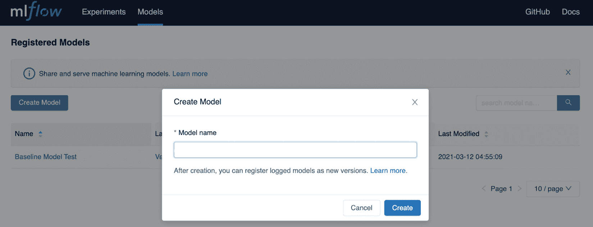

    图 *5.8* – 模型注册库 UI – 创建模型

1.  你也可以通过进入 **实验** 模型并选择你的一个模型来在 MLflow 中创建模型，然后，具体决定注册该模型。你将必须将你的运行与现有模型关联或创建一个新模型名称，以关联此特定类型的模型：

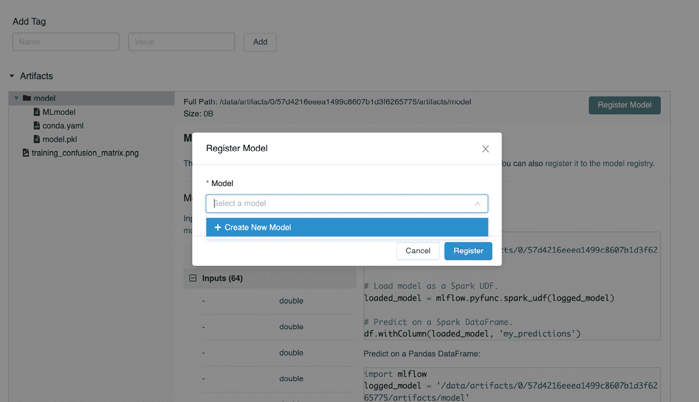

图 *5.9* – 模型跟踪 UI – 创建新模型

当你添加一个新模型时，MLflow 会自动增加版本号，并将此版本标记为最新版本，组织中的每个人都可以查询给定问题的模型的最新版本。

## 将你的最佳模型添加到模型注册库

在 MLflow 的 UI 中可以执行的所有操作也可以通过 MLflow API 实现。

我们可以快速回到我们的股票市场预测用例，并将我们的第一个基线模型添加到模型注册库，并运行本章仓库中可用的 `hyperopt_optimization_logistic_regression_mlflow.ipynb` 笔记本，并根据图 *5.10* 所示的 F1 分数指标按降序排序运行：

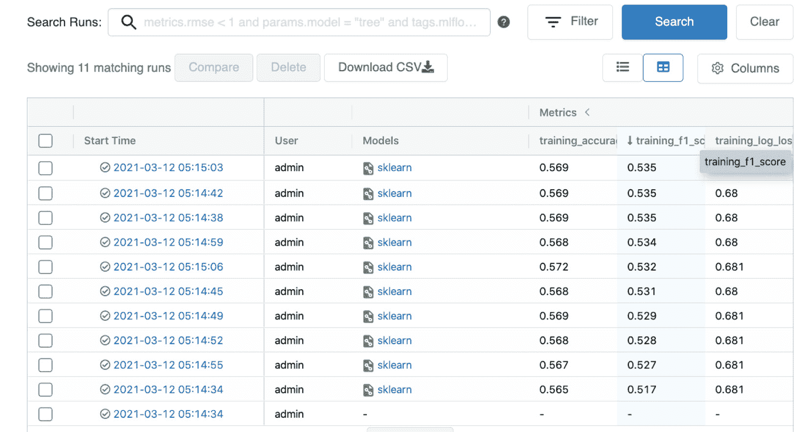

图 *5.10* – 选择最佳模型

从那里，你应该能够注册名为 `BTC StockPrediction` 的最佳模型，如图 *5.11* 所示：

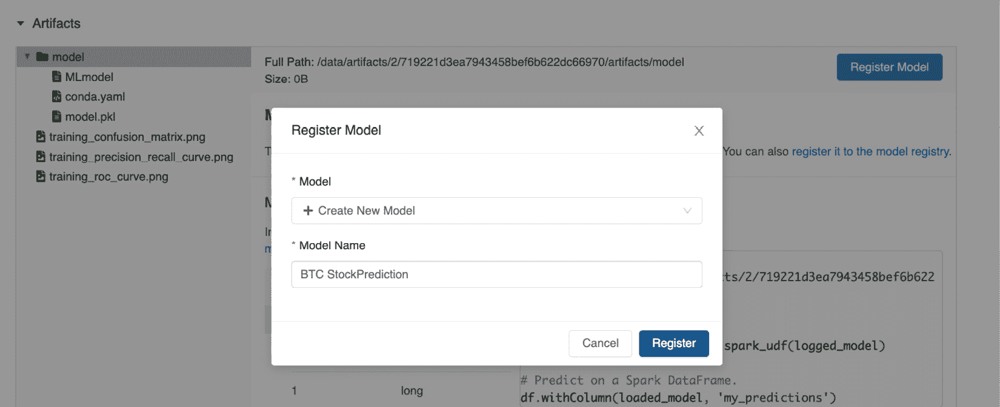

图 *5.11* – 命名你的模型

通过返回模型模块，你将注意到，如图 *5.12* 所示，你的新创建的模型位于 **版本 1** 下：

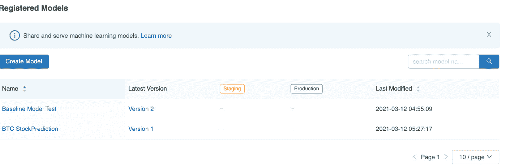

图 *5.12* – 已注册模型

在介绍了模型注册库的功能后，在下一节中，我们将描述一个模型开发生命周期，以帮助组织你的模型管理。

# 管理模型开发生命周期

在一个由多个模型开发者组成的团队中工作，管理模型生命周期非常重要。在同一个项目中尝试不同模型是相当常见的，让审阅者决定最终进入生产的模型非常重要：

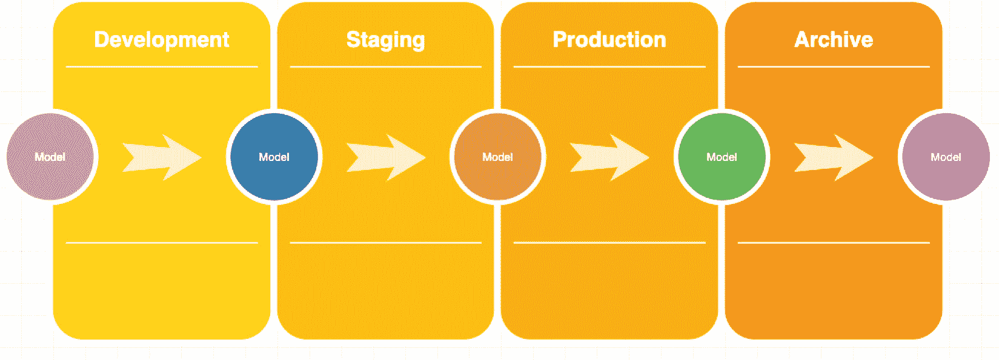

图 *5.13* – 模型开发生命周期的示例

如果使用与图 *5.13* 所示类似的生命周期，模型在其生命周期中可以经历以下阶段：

+   **开发**：模型开发者仍在探索和尝试不同的方法，仍在尝试找到解决他们的机器学习问题的合理解决方案。

+   **预发布**：模型可以与生产类型流量自动测试的状态。

+   **生产**：当模型准备好处理现实生活中的生产流量时。

+   **存档**：当模型不再服务于其最初开发时的业务目的时，它将被存档，其元数据将存储以供将来参考或合规性使用。

例如，如*图 5.14*所示，审稿人或主管可以将模型从**开发**状态移动到**预发布**状态，以便在测试环境中进一步部署，如果经审稿人批准，模型可以过渡到生产状态：

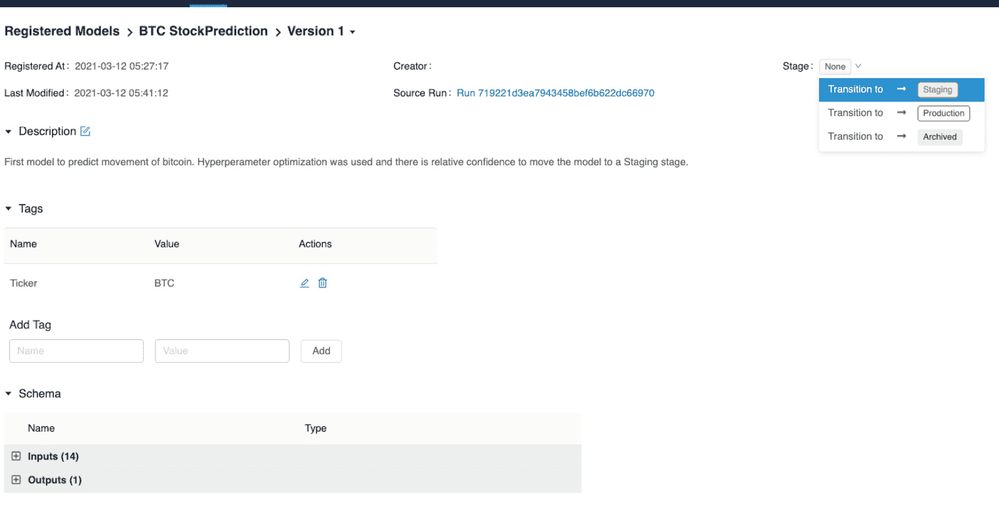

图 5.14 – 模型开发生命周期的示例

在从 MLflow 中的状态转换时，你有选择将处于现有状态的模型发送到下一个状态：

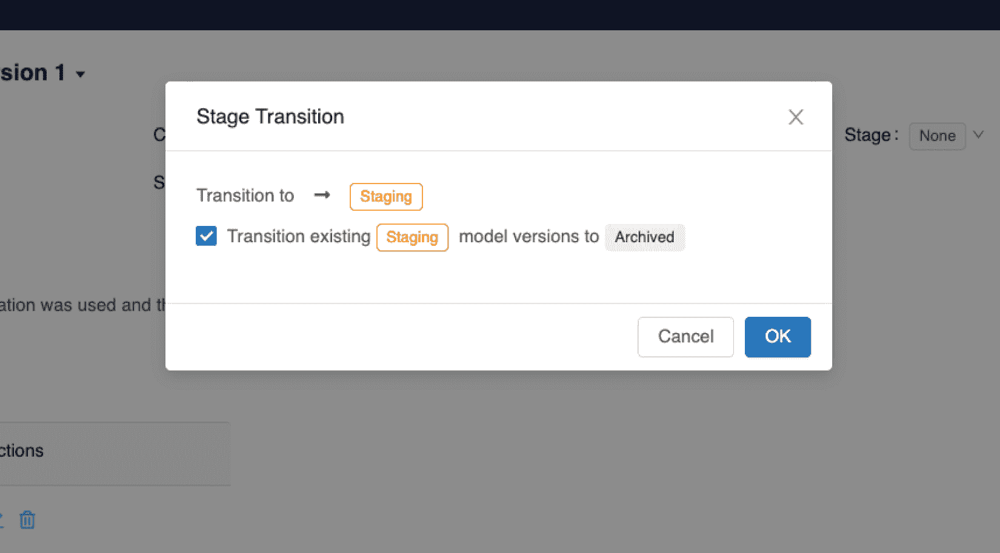

图 5.15 – MLflow 中的阶段转换

在成熟环境中，从**预发布**阶段到**生产**阶段的转换旨在自动进行，正如我们将在本书的后续章节中展示的那样。

通过本节，我们完成了与 MLflow 中模型相关特性的描述。

# 摘要

在本章中，我们首先介绍了 MLflow 中的模型模块及其对不同算法的支持，从基于树的到线性的再到神经网络的。我们了解了模型日志和指标的支持以及自定义指标的创作。

在前两节中，我们介绍了模型注册模型及其如何使用它来实现模型生命周期来管理我们的模型。

在本书的下一章和章节中，我们将专注于将到目前为止学到的概念应用于现实系统，并将为生产环境设计一个机器学习系统。

# 进一步阅读

为了巩固你的知识并深入了解本章中介绍的概念，你应该查看以下链接：

+   [`www.mlflow.org/docs/latest/models.html`](https://www.mlflow.org/docs/latest/models.html)

+   [`www.mlflow.org/docs/latest/model-registry.html`](https://www.mlflow.org/docs/latest/model-registry.html)

+   [`www.slideshare.net/Hadoop_Summit/introducing-mlflow-an-open-source-platform-for-the-machine-learning-lifecycle-for-onprem-or-in-the-cloud`](https://www.slideshare.net/Hadoop_Summit/introducing-mlflow-an-open-source-platform-for-the-machine-learning-lifecycle-for-onprem-or-in-the-cloud)
