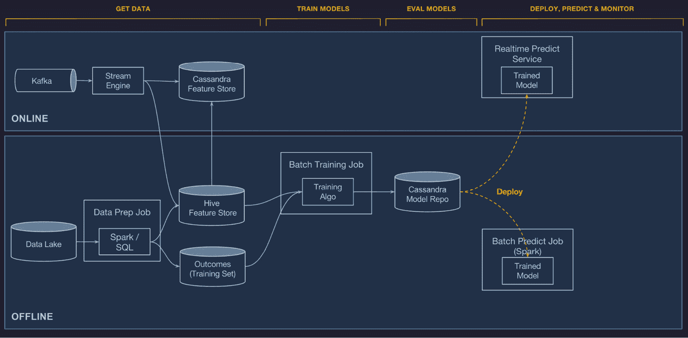

# *第六章*：介绍机器学习系统架构

在本章中，你将了解在更广泛的软件工程（SWE）背景下机器学习（ML）系统架构的一般原则，以及以可靠方式在生产中部署模型时常见的常见问题。你还将有机会跟随我们构建我们的机器学习系统。我们将简要探讨如何使用 MLflow 以及其他相关工具构建可靠和可扩展的机器学习平台。

具体来说，在本章中，我们将探讨以下部分：

+   理解机器学习系统和项目中的挑战

+   调查最先进的机器学习平台

+   构建 PsyStock 机器学习平台

你将遵循一个理解问题、研究行业领先公司提供的不同解决方案，然后开发你自己的相关架构的过程。这种三步法可以转移到你想要开发的任何未来的机器学习系统中。

# 技术要求

对于本章，你需要满足以下先决条件：

+   在你的机器上安装了最新版本的 Docker。如果你还没有安装，请按照[`docs.docker.com/get-docker/`](https://docs.docker.com/get-docker/)中的说明操作。

+   已安装`docker-compose`的最新版本。请按照[`docs.docker.com/compose/install/`](https://docs.docker.com/compose/install/)中的说明操作。

+   在命令行中访问 Git，并按照[`git-scm.com/book/en/v2/Getting-Started-Installing-Git`](https://git-scm.com/book/en/v2/Getting-Started-Installing-Git)中的说明进行安装。

+   访问 Bash 终端（Linux 或 Windows）。

+   访问浏览器。

+   已安装 Python 3.5+。

+   如*第三章*中所述，在本地安装了与你的机器学习平台最新版本兼容的版本，*你的数据科学工作台*。

# 理解机器学习系统和项目中的挑战

利用机器学习实现产品可能是一项费力的任务，因为需要在书中介绍一些关于机器学习系统架构最佳实践的新概念。

到目前为止，在这本书中，我们已经展示了 MLflow 如何使日常模型开发者拥有一个平台来管理从模型开发迭代到在模型注册表中存储模型整个机器学习生命周期。

总结来说，到目前为止，我们已经为模型开发者创建了一个平台，让他们可以构建模型并在中央仓库中发布模型。这是开始挖掘创建的模型商业价值理想阶段。在机器学习系统中，要从模型开发跃迁到生产中的模型，需要转变思维方式和采取不同的方法。在解锁价值和构建模型之后，利用阶段开始，这时拥有机器学习系统架构可以为你的模型部署和运营定下基调。

机器学习系统是传统软件开发（SWE）领域的专业化分支，因此我们可以也应该利用 SWE 领域的知识体系来构建我们的系统。与我们相关联的 SWE 概念如下：

+   **关注点分离**：一个完整的系统应该被分割成不同的组件。系统的每个组件都应该是独立的，并且专注于做好一件事。例如，一个训练组件应该专注于训练，而不是同时进行评分。

+   **自主性**：系统的每个组件都应该作为一个独立的自主单元存在，并且可以独立部署。例如，您的 API 系统的部署应该独立于训练系统的部署。

+   **弹性**：关注点分离和模块化的一个后果是我们必须确保如果更广泛系统的一个组件出现故障，这不会影响独立组件。如果一个机器平台的批量评分机制出现故障，它不应该影响实时系统。

+   **可扩展性**：我们应该能够独立并根据其工作负载独立扩展系统的不同组件。

+   **可测试性**：这代表系统被测试的能力以及其功能与一组代表性输入进行验证的能力。在机器学习系统中，由于模型的非确定性，这一点尤其困难。

+   **持续部署/交付**：这代表在几乎没有任何摩擦的情况下，在代码、配置、模型或数据发生变化时部署系统的能力，在机器学习的情况下，以便有新版本的系统。

+   **可组合性**：我们应该能够将系统的组件在未来项目中重复使用，以提高投资回报率。因此，机器学习工程师需要确保正在开发的代码和组件易于重复使用和/或与其他系统互操作。

+   **可维护性**：这是系统被修改、修复和改进以适应不断变化的环境需求的容易程度。

在这个阶段，我们可以简要介绍并细化我们的用例，即股票预测，以在 PsyStock 公司开发我们的机器学习平台。

基于迄今为止在原型设计模型以**预测比特币价格**方面所做的工作，公司的业务发展部门决定将其第一个产品作为**加密货币预测 API**来启动，因为它们正在成为企业界的一种流行技术。一个团队被组建起来，决定调查挑战和最先进的平台，然后构建公司的自有平台。

一个机器学习项目通常涉及公司中的许多部门。以 PsyStock 为例，一个典型的机器学习项目团队包括以下利益相关者：

+   **数据科学团队**：负责构建和发展模型，目标是实现最高准确率，预测加密货币价格和市场走势。

+   **机器学习/数据工程团队**：负责工程组件，包括数据采集、准备、训练和部署，并关注系统在生产中正确部署并按规格运行。

+   **基础设施团队**：负责提供计算和基础设施资源。期望系统不会给团队带来运营负担。

+   **产品团队**：提供与公司网络平台和整体软件的集成，推动功能创建，确保快速推理速度。

+   **业务发展/市场营销团队**：打包和营销产品，并监控产品的业务表现。

在下一节中，我们将了解机器学习系统和项目的一般挑战。

机器学习（ML）是技术的一个重要应用，旨在帮助组织利用数据释放价值。在商业世界中应用机器学习时，尚未定义标准实践，许多组织都难以将基于机器学习的产品投入生产。

在现实世界中，将模型投入生产的简单方法可能包括以下步骤：

1.  数据科学家在笔记本环境中创建模型，并在 R 语言中实现代码。

1.  数据科学家与工程团队分享笔记本，表示他们已准备好将他们的模型投入生产。

1.  工程团队使用他们能理解的语言重新实现了训练过程，在这种情况下，是 Python 语言。

1.  经过长时间的试错过程，直到数据科学团队和工程团队达成一致，认为定制化训练系统产生的模型与原始模型产生等效的输出。

1.  创建并开发了一个新的系统来评分系统，工程团队注意到高延迟。由于当前状态无法重新开发，模型被发送回重新开发。

上一段描述的情况比你想象的更常见。这在 D. Sculley 等人于 2015 年发表的论文《机器学习系统中隐藏的技术债务》中有详细描述。谷歌的一个团队识别了以下与天真地实施机器学习平台相关的风险因素和技术债务：

+   **边界侵蚀**：由于机器学习系统的本质是混合不同逻辑域的信号，因此在 SWE 中尽可能保持业务域的清晰逻辑具有挑战性。另一个自然问题是将模型输出作为第三个模型*A*的输入的诱惑，这可能会在模型*B*中产生意外的效果。

+   **昂贵的依赖数据**：新鲜、准确和可靠的数据是机器学习系统最重要的组成部分。例如，在加密货币案例中，为了能够预测，可能会结合使用外部 API 和社会网络情绪信号。在某个时刻，其中一个数据信号可能不可用，使得其中一个组件不可用。现实世界中的数据分布可能会改变，导致模型在现实世界中的推理变得不相关。

+   **反馈循环**：在某些情况下，模型会影响用于训练的数据选择。信用评分就是一个很好的例子。决定谁将获得模型下一次重新训练的信用的人将选择受模型影响的人群中的训练数据。在开发模型时，分析模型对地面数据的影响是很重要的。

+   **系统级反模式**：机器学习系统因其包含不同包和缺乏适当抽象的粘合代码而臭名昭著。在某些情况下，由于在笔记本中编写代码的迭代性质，可能会使用多种语言来实现库。

+   **配置管理**：通常在机器学习系统中被忽视，但特定结果产生的配置信息对于模型的后分析和部署至关重要。不使用既定的配置管理实践可能会在机器学习管道中引入错误。

+   **监控和测试**：集成测试和单元测试是 SWE 项目中的常见模式，但由于机器学习项目的随机性质，它们更难实施。

解决机器学习系统挑战的一个重要实践是在模型训练期间以及系统运行时，对过程的临界部分、代码进行广泛的测试，如图 6.1 所示：

图 6.1 – 从 https://research.google/pubs/pub46555/提取的机器学习系统测试

*图 6.1* 所展示的是通过标准软件实践测试系统的不同部分，并添加专门的数据预测监控来应对技术债务的一种方法。重要的新增加是数据测试和模型测试，因此测试传入数据和训练数据，同时能够监控这些测试并决定系统是否通过相关标准是至关重要的。

作为平台，MLflow 解决了本节中提到的机器学习系统的一些问题。MLflow 专注于机器学习技术债务的特定维度，是创建机器学习平台的一个很好的支柱组件。

在下一节中，我们将探讨一些最先进的鲁棒机器学习工程系统的例子，以指导我们的开发。

# 调查最先进的机器学习平台

从高层次来看，一个成熟的机器学习系统具有*图 6.2*中概述的组件。这些组件理想上是独立的，并负责系统的特定功能：

图 6.2 – 机器学习平台组件

遵循 SWE 模块化的先例，这些通用组件使我们能够比较不同的机器学习平台，并指定我们对 PsyStock 每个组件的要求。我们选择用作架构比较参考的组件如下：

+   **数据和特征管理**：数据和特征管理组件负责数据采集、特征生成、存储以及向上游模块提供服务。

+   **训练基础设施**：处理模型训练过程、调度、消耗特征以及生成最终模型的组件。

+   **部署和推理**：该单元的职责是模型的部署推理和批处理评分。它是系统的外部面孔，对外部系统是可访问的。

+   **性能和监控**：一个处理可观察性、不同系统发布的指标以及生产中的监控系统的组件。

+   **模型管理**：管理模型工件版本和模型的生命周期。

+   **工作流管理**：负责编排批处理工作流和处理管道的组件。

在描述了机器学习平台的不同组件之后，我们将查看一些示例，从 Uber 的 Michelangelo 开始。

## 了解 Michelangelo

Uber 是首批广泛记录其认识到机器学习平台对于释放数据价值至关重要的公司之一。

Uber 构建平台内部动机如下：

+   由于将本地模型转换为生产所需的大量资源，机器学习的影响有限。

+   不可靠的机器学习和数据管道。

+   工程团队必须为现有系统创建定制的服务容器和系统。

+   无法扩展机器学习项目。

以下*图 6.3*（来自[`eng.uber.com/michelangelo-machine-learning-platform`](https://eng.uber.com/michelangelo-machine-learning-platform)）展示了 Michelangelo 的不同组件。一个显著组件是 Uber 基础设施中的数据组件，它将实时数据基础设施与流系统（如 Kafka）解耦，以从外部获取数据，这些数据流向训练过程，然后到实时和离线模式下的评分。独特的特征包括批处理世界和实时世界的分离，以及为 API 和批处理系统提供通用预测服务：

图.6.3 – Michelangelo 架构

我们选择用作架构比较参考的组件如下：

+   **数据和特征管理**：它包含一个集中式数据存储，其中包含为服务模型和训练模型所需的所有特征。特征数据存储可以实时和批量访问。对于批量场景，他们使用名为 Hive 的数据库系统，对于实时，他们使用 Cassandra。

+   **训练基础设施**：使用名为**Horovod**（[`github.com/horovod/horovod`](https://github.com/horovod/horovod)）的工具提供的分布式训练基础设施，具有专门和定制的组件以及增强的报告功能。它为每种类型的模型（深度学习、模型、特征重要性等）提供自定义指标。训练作业的输出是使用 Cassandra 数据库作为后端的模型存储库。

+   **部署和推理**：通过标准的 SWE 实践（CI/CD、基于指标监控的回滚等）部署的系统，通常作为工件在 Uber 数据中心提供。一个预测服务接收请求，并根据头部信息预先加载正确的模型，并使用内部 DSL 在特征存储的服务层查询进一步的数据增强，从而提供预测向量。

+   **性能和监控**：它利用公司通用的集中式日志系统。对于监控预测，会生成预测和现实世界值的相关指标，并将差异记录下来。通过这种方式，可以分析和监控模型的错误。

+   **模型管理**：模型作为工件编译并存储在 Cassandra 数据存储中。

+   **工作流管理**：提供用于连接管道的 API。它包含一个管理平面，其中包含一个 UI，允许管理模型和部署。工作流管理是 API 驱动的，可以从外部使用 Python 或 Java 进行管理。

对于像 Uber 这样的公司来说，建立自己的系统的一个明显优势是灵活性和满足他们非常具体用例的能力。

## 了解 Kubeflow

Kubeflow 在某种程度上是一个针对**Kubernetes**环境的开源平台，用于机器学习生命周期。它基本上是一个工具生态系统，这些工具协同工作以提供机器学习平台的主要组件。Kubeflow 最初是在谷歌开发的，目前是一个非常活跃的开源项目。

**Kubernetes**是领先的开放源代码计算环境之一，它允许在容器化工作负载中灵活分配计算和存储资源。它最初是在谷歌创建的。为了理解 Kubeflow，需要基本了解 Kubernetes。以下官方文档链接包含了理解基础所需的前提条件：[`kubernetes.io/docs/concepts/overview/`](https://kubernetes.io/docs/concepts/overview/)。

如 *图 6.4* 所示，它使用 Kubernetes 的基础，提供了一套机器学习工作流的应用程序，其中可以聚合与 Kubeflow 标准兼容的不同工具，以提供一套连贯的服务：

图 6.4 – 来自 https://www.kubeflow.org/docs/started/kubeflow-overview/

我们选择用作架构比较参考的组件如下：

+   **数据和特征管理**：Kubeflow 提供与 Spark 等大数据工具的集成。用于数据和特征管理的一个生态系统组件称为 Feast，是一个开源的机器学习特征。

+   **训练基础设施**：Kubeflow 为常见的模型如 TensorFlow、PyTorch 和定制模型提供特定的 Kubeflow 运算符。训练作业基本上是特定的 Kubernetes 作业。

+   **部署和推理**：Kubeflow 提供与 TensorFlow Serving、Seldon Core 和 KFServing 等第三方工具的多个集成，具有不同的权衡和成熟度水平。

+   **性能和监控**：Prometheus 是一种在 Kubernetes 环境中使用的通用监控工具，可以在此环境中利用。

+   **模型管理**：不是专门用于管理模型的工具，但可以添加如 MLflow 这样的工具来覆盖模型管理生命周期。

+   **工作流管理**：通过一个名为 Kubeflow Pipelines 的特定工具进行工作流管理，该工具建立在 Kubernetes 上的通用管道工具 Argo Workflows 之上。它允许通过代码构建多步骤管道。

在查看参考架构后，我们现在将花时间构建自己的架构，凭借行业中最先进的知识。

# 架构 PsyStock 机器学习平台

我们可以根据对最佳实践和示例参考架构的研究提炼出的原则，为我们的机器学习平台定义一组期望的原则。我们希望在平台中保持的主要原则如下：

+   **利用** **开放系统和标准**：使用如 MLflow 提供的开放系统允许长期性和灵活性，以利用开源社区的进步和力量，以较低的成本扩展公司的机器学习平台。

+   **优先考虑** **可扩展的解决方案**：公司需要为未来增长激增做好准备；尽管这是第一个版本，但根据需求和视角进行激增的能力需要到位。

+   **集成** **可靠的数据生命周期**：数据是机器学习平台的重心，应该以可靠和可追踪的方式在规模上进行管理。

+   **遵循** **软件开发最佳实践**：例如，关注点分离、可测试性、CI/CD、可观察性和模块化。

+   **维护** **供应商和云独立性**：PsyStock 作为一个初创公司，在一个非常动态的环境中运营，在不同的地理区域，可以访问不同的云，在某些情况下，还需要遵守不将数据从给定地理区域移动的要求。因此，保持云无关性并能够在不同的环境中拥有工作负载是一个竞争优势。

这些原则将使我们能够在公司内部构建一个开放且成本低的系统架构，并允许在不同的系统上运行，无论是在本地、云中还是本地。

我们之前已经定义了预测用例的业务需求，即加密货币运动的检测和价值预测。为了利用这一点和其他用例，创建一个机器学习平台对公司来说至关重要。

现在，凭借对最先进系统的研究和描述的知识，我们将接下来定义激发我们机器学习平台特性的方法。

## 描述机器学习平台的功能

制定特性规范对于保持开发工作专注于一小套能够为平台用户解锁价值的特性至关重要。在本节中，我们将激发能够实现机器学习平台最佳价值的特性。

在我们的系统中，我们希望能够具备以下功能：

+   **特性：安排训练作业**：数据科学家需要能够使用配置或等效代码为他们的模型安排训练作业。

+   **特性：无缝部署从数据科学工作台开发的不同模型**：公司在第三章“你的数据科学工作台”中已经开发了一个数据科学工作台。我们希望能够利用之前所做的所有工作，以便在平台上开发的模型可以部署到生产环境中。

+   **特性：允许在出现新数据的情况下重新校准模型**：当特定位置出现新数据时，需要自动生成一个新模型并将其存储在平台系统和人类可访问的模型注册表中。

+   **特性：提交和配置批量评分作业**：平台应允许相关用户在出现新数据的情况下配置和安排批量作业。

+   **特性：基于高效推理 API 的以下 API 评分**：给定一个模型，平台应该具有使用模型模式创建匹配 API 的功能。

在讨论了机器学习系统的理想特性之后，我们将在下一节中开始从高层次构建系统。

## 高层次系统架构

我们现在将专注于定义我们架构的构建块以及不同组件之间的不同数据流。

根据上一节中指定的特性和原则，我们的机器学习平台和解决方案应包含以下组件，如*图 6.5*中的架构图所述。

图 6.5 – ML 平台架构图

此图对技术选择具有特定的不确定性，因为这将在即将到来的章节中完成，届时将全面探索每个组件的工程。

1.  **数据和特征管理**：这是通过**特征/数据层**执行的，该层从工作台接收特征注册，并允许从工作台注册数据集。数据层为训练环境提供数据。

1.  **训练基础设施**：训练基础设施组件允许根据数据科学工作台的请求安排作业的训练。

1.  **部署和推理**：部署环境消耗模型以执行批量或实时操作，由数据层中的数据或通过生产系统发出的请求触发。

1.  **性能和监控**：这是通过监控和指标的中心组件来实现的，所有围绕该组件的系统都会将指标发布到其中。

1.  **模型管理**：由**模型注册表**组件封装，其中包含存储和相关生命周期项目。输入主要来自训练作业和数据科学工作台。

1.  **工作流管理**：这是一个允许协调不同系统的组件。例如，它允许安排作业和依赖关系管理，强制执行执行顺序。例如，推理批处理作业只能在训练作业之后执行。这可以通过操作系统使用 Cron 系统或通过更复杂的流程工具（如 Airflow）来实现。

我们接下来将简要介绍我们将如何使用**MLflow**实现本节概述的想法。

## MLflow 和其他生态系统工具

MLflow 是由开源社区创建的一个工具，旨在解决开放系统中 ML 系统的一个空白，专注于可重复性、模型管理和部署。MLflow 绝对不是一个完整的工具；它需要其他组件，当其优势得到利用时，它是 ML 解决方案的一个核心部分。

近年来，在 Kubernetes 世界中出现了如**Kubeflow**之类的系统，旨在帮助管理 ML 系统的基础设施方面，并作为实际的部署环境。

**Minio**是 Kubeflow 附带的一个存储系统，它将用作元数据和数据集的无差别存储机制，并为云和本地环境上的存储提供抽象。

在确定了关于 ML 平台行业的最佳实践、概述了我们的需求，并在本节中设计了我们的 ML 平台架构后，我们将用本书的接下来的四章来构建我们平台的所有组件。

# 摘要

在本章中，我们介绍了构建机器学习系统所涉及的概念，映射了利益相关者，确定了常见问题和最佳实践，并概述了初始架构。我们在数据层和建模与推理层上确定了机器学习系统架构的关键构建块。强调了组件之间的互连，并概述了功能规格。

我们还讨论了如何在您的机器学习平台上利用 MLflow 以及其他参考工具可以补充的不足之处。

在本书的下一章节和部分中，我们将专注于将到目前为止学到的概念应用于实际系统，并通过实现 PsyStock 机器学习平台的架构来实践。我们将为每个组件设立一个章节，从规格说明开始，直到包含实际示例的组件实现。

# 进一步阅读

为了进一步扩展您的知识，您可以查阅以下链接中的文档：

+   [`www.mlflow.org/docs/latest/models.html`](https://www.mlflow.org/docs/latest/models.html)

+   技术债务的高度关注 – [`papers.nips.cc/paper/2015/file/86df7dcfd896fcaf2674f757a2463eba-Paper.pdf`](https://papers.nips.cc/paper/2015/file/86df7dcfd896fcaf2674f757a2463eba-Paper.pdf)

+   **CS 329S**: 机器学习系统设计，*奇普·黄* – [`cs329s.stanford.edu`](https://cs329s.stanford.edu)，2021
