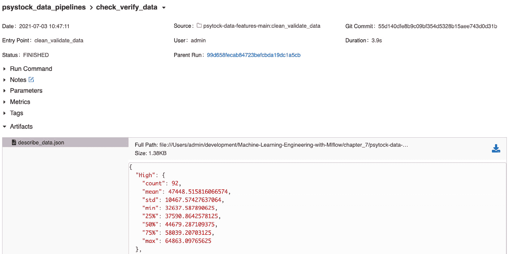

# 第七章：数据和特征管理

在本章中，我们将向正在构建的机器学习平台添加一个特征管理数据层。我们将利用 MLflow Projects 模块的功能来结构化我们的数据管道。

具体来说，在本章中，我们将查看以下部分：

+   结构化您的数据管道项目

+   获取股票数据

+   检查数据质量

+   管理特征

在本章中，我们将获取相关数据以提供用于训练的数据集。我们的主要资源将是雅虎财经数据集 BTC。除了这些数据，我们还将获取以下额外数据集。

利用在*第六章*中介绍的*引入 ML 系统架构*的生产化架构，如图 7.1 所示，特征和数据组件负责从源获取数据，并使数据以平台不同组件可消费的格式可用：

![图 7.1 – 带数据层引用的高级架构]

![img/image0013.jpg]

图 7.1 – 带数据层引用的高级架构

让我们深入本章，看看我们将如何结构化和填充数据层，以包含用于训练模型和生成特征的相关数据。

# 技术要求

对于本章，您需要以下先决条件：

+   在您的机器上安装了最新版本的 Docker。如果您还没有安装，请按照[`docs.docker.com/get-docker/`](https://docs.docker.com/get-docker/)中的说明操作。

+   已安装最新版本的 docker-compose。请按照[`docs.docker.com/compose/install/`](https://docs.docker.com/compose/install/)中的说明操作。

+   在命令行上访问 Git，并按照[`git-scm.com/book/en/v2/Getting-Started-Installing-Git`](https://git-scm.com/book/en/v2/Getting-Started-Installing-Git)中的说明进行安装。

+   访问 Bash 终端（Linux 或 Windows）。

+   访问浏览器。

+   Python 3.5+ 已安装。

+   如*第三章*中所述，您本地安装了机器学习的最新版本，*您的数据科学工作台*。

在下一节中，我们将描述我们的数据管道结构、数据源以及我们将执行的不同步骤来实现我们的实际示例，利用 MLflow 项目功能来打包项目。

注意

直接从代码片段复制粘贴可能会导致您的编辑器出现问题。请参阅本章在 https://github.com/PacktPublishing/Machine-Learning-Engineering-with-MLflow/tree/master/Chapter07 上的 GitHub 仓库。

# 结构化您的数据管道项目

从高层次来看，我们的数据管道将每周运行一次，收集前 7 天的数据，并以机器学习作业可运行的方式存储。我们将我们的数据文件夹结构化为三种类型的数据：

+   **原始数据**：通过从 Yahoo Finance API 获取过去 90 天的数据生成的数据集。我们将以 CSV 格式存储数据——与从 API 收到的格式相同。我们将在 MLflow 中记录运行并提取收集到的行数。

+   **阶段数据**：在原始数据上，我们将运行质量检查、模式验证，并确认数据可用于生产。有关数据质量的信息将记录在 MLflow 跟踪中。

+   **训练数据**：训练数据是数据管道的最终产品。它必须在被认为是干净且适合执行模型的数据上执行。数据包含已处理成可以直接用于训练过程的功能数据。

这种文件夹结构最初将在文件系统中实现，并在部署期间转换为相关环境（例如：AWS S3、Kubernetes PersistentVolume 等）。

为了执行我们的数据管道项目，我们将使用 **MLflow 项目** 模块以与执行环境无关的格式打包数据管道。我们将使用 Docker 格式打包 **MLflow 项目**。Docker 格式为我们提供了不同的选项，根据可用的基础设施，我们可以将项目部署在云端或本地：


图 7.2 – 具有数据层引用的高级架构

我们的工作流程将执行以下步骤，如图 *图 7.2* 所示：

1.  `data/raw/data.csv 文件夹`.

1.  `data/staged/data.csv 文件`.

1.  `data/training/data.csv 位置`.

通过这三个不同的阶段，我们确保了训练数据生成过程的可重复性、可见性和过程不同步骤的清晰分离。

我们将首先将我们的 MLflow 项目组织成步骤，并为管道的每个组件创建占位符：

1.  在您的本地机器上创建一个名为 `psytock-data-features` 的新文件夹。

1.  添加 `MLProject 文件`：

    ```py
    name: pystock_data_features
    conda:
      file: conda.yaml
    entry_points:
      data_acquisition:
        command: "python data_acquisition.py"
      clean_validate_data:
        command: "python clean_validate_data.py "
      feature_set_generation:
        command: "python feature_set_generation.py"
      main:
        command: "python main.py"
    ```

1.  添加以下 `conda.yaml` 文件：

    ```py
        name: pystock-data-features
    channels:
      - defaults
    dependencies:
      - python=3.8
      - numpy
      - scipy
      - pandas
      - cloudpickle
      - pip:
        - git+git://github.com/mlflow/mlflow
        - pandas_datareader
        - great-expectations==0.13.15

    ```

1.  您现在可以向文件夹中添加一个示例 `main.py` 文件，以确保项目的基本结构正在工作：

    ```py
    import mlflow
    import click
    def _run(entrypoint, parameters={}, source_version=None, use_cache=True):
        #existing_run = _already_ran(entrypoint, parameters, source_version)
        #if use_cache and existing_run:
        #    print("Found existing run for entrypoint=%s and parameters=%s" % (entrypoint, parameters))
         #   return existing_run
        print("Launching new run for entrypoint=%s and parameters=%s" % (entrypoint, parameters))
        submitted_run = mlflow.run(".", entrypoint, parameters=parameters)
        return submitted_run
    @click.command()
    def workflow():
        with mlflow.start_run(run_name ="pystock-data-pipeline") as active_run:
            mlflow.set_tag("mlflow.runName", "pystock-data-pipeline")
            _run("load_raw_data")
            _run("clean_validate_data")
            _run("feature_set_generation")

    if __name__=="__main__":
        workflow()
    ```

1.  通过运行以下命令测试基本结构：

    ```py
    mlflow run .
    ```

    此命令将根据您的 `conda.yaml` 文件创建的环境构建您的项目，并运行您刚刚创建的基本项目。它应该会出错，因为我们需要添加缺失的文件。*文件未找到* 错误将如下所示：

    ```py
    python: can't open file 'check_verify_data.py': [Errno 2] No such file or directory
    ```

在这个阶段，我们有了将在本章中构建的数据管道 MLflow 项目的基石。我们将在下一节中填写获取数据的 Python 脚本。

# 获取股票数据

我们获取数据的脚本将基于`pandas-datareader Python 包`。它提供了一个简单的抽象，我们可以利用它来在管道中利用远程金融 API。这个抽象非常简单。给定一个数据源，例如 Yahoo Finance，您提供股票代码/对和日期范围，数据将以 DataFrame 的形式提供。

我们现在将创建`load_raw_data.py`文件，该文件将负责加载数据并将其保存到`raw`文件夹中。您可以在以下存储库中查看文件的详细内容：https://github.com/PacktPublishing/Machine-Learning-Engineering-with-MLflow/blob/master/Chapter07/psystock-data-features-main/load_raw_data.py。执行以下步骤以实现该文件：

1.  我们将首先导入相关包：

    ```py
    import mlflow
    from datetime import date
    from dateutil.relativedelta import relativedelta
    import pprint
    import pandas
    import pandas_datareader.data as web
    ```

1.  接下来，您应该添加一个函数来检索数据：

    ```py
    if __name__ == "__main__":

        with mlflow.start_run(run_name="load_raw_data") as 
    run:
            mlflow.set_tag("mlflow.runName", "load_raw_data")
            end = date.today()
            start = end + relativedelta(months=-3)

            df = web.DataReader("BTC-USD", 'yahoo', start, end)
            df.to_csv("./data/raw/data.csv") 

    ```

现在我们已经获取了数据，我们需要应用下一节中将要讨论的最佳实践——检查获取的数据质量的方法。

# 检查数据质量

将数据质量检查作为您机器学习系统的一部分，对于确保模型训练和推理的完整性和正确性至关重要。应借鉴并使用软件测试和质量原则于机器学习平台的数据层。

从数据质量的角度来看，在数据集中有几个关键的维度可以用来评估和配置我们的数据，即：

+   **模式合规性**：确保数据来自预期的类型；确保数值不包含其他类型的数据

+   **有效数据**：从数据角度评估数据是否从业务角度有效

+   **缺失数据**：评估是否所有运行分析和算法所需的数据都可用

对于数据验证，我们将使用*Great Expectations* Python 包（可在[`github.com/great-expectations/great_expectations`](https://github.com/great-expectations/great_expectations)找到）。它允许使用许多数据兼容的包（如 pandas、Spark 和云环境）对数据进行断言。它提供了一个 JSON DSL，我们可以用它来声明我们希望数据遵守的规则。

对于我们的当前项目，我们希望以下规则/约束是可验证的：

+   日期值应该是有效的日期，且不能缺失。

+   检查数值和长值是否正确类型。

+   数据集中的所有列都存在。

现在我们将创建`check_verify_data.py`文件，该文件将负责加载数据并将其保存到`staging`文件夹中，所有数据都有效且准备好用于机器学习训练。您可以在以下存储库中查看文件的详细内容：https://github.com/PacktPublishing/Machine-Learning-Engineering-with-MLflow/blob/master/Chapter07/psystock-data-features-main/check_verify_data.py。

1.  为了使前面的规则能够被我们的系统依赖，我们需要导入以下依赖项：

    ```py
    import mlflow
    from datetime import date
    from dateutil.relativedelta import relativedelta
    import pprint
    import pandas_datareader
    import pandas
    from pandas_profiling import ProfileReport
    import great_expectations as ge
    from great_expectations.profile.basic_dataset_profiler import BasicDatasetProfiler
    ```

1.  接下来，我们将实现脚本：

    ```py
    if __name__ == "__main__":
        with mlflow.start_run(run_name="check_verify_data") as run:
            mlflow.set_tag("mlflow.runName", "check_verify_data")
            df = pandas.read_csv("./data/raw/data.csv")
            describe_to_dict=df.describe().to_dict()
            mlflow.log_dict(describe_to_dict,"describe_data.json")
            pd_df_ge = ge.from_pandas(df)
            assert pd_df_ge.expect_column_values_to_match_
    strftime_format("Date", "%Y-%m-%d").success == True
            assert pd_df_ge.expect_column_values_to_be_of_
    type("High", "float").success == True
            assert pd_df_ge.expect_column_values_to_be_of_type("Low", "float").success == True
            assert pd_df_ge.expect_column_values_to_be_of_type("Open", "float").success == True
            assert pd_df_ge.expect_column_values_to_be_of_type("Close", "float").success == True
            assert pd_df_ge.expect_column_values_to_be_of_type("Volume", "long").success == True
            assert pd_df_ge.expect_column_values_to_be_of_type("Adj Close", "float").success == True
    ```

1.  现在我们可以进行一些清理工作：

    ```py
            #we can do some basic cleaning by dropping the null values
            df.dropna(inplace=True)
            #if data_passes_quality_can_go_to_features:
            df.to_csv("data/staging/data.csv")
    ```

在验证了数据的质量和暂存用于后，现在可以以高度的信心用于特征生成。

# 生成特征集和训练数据

我们将重构在本地环境中先前开发的代码，以生成用于训练的特征，并将我们的 MLflow 项目中的数据管道添加到我们的 MLflow 项目中。

我们现在将创建`feature_set_generation.py`文件，该文件将负责生成我们的特征并将它们保存在`training`文件夹中，所有数据都是有效的，并且准备好用于机器学习训练。你可以在仓库 https://github.com/PacktPublishing/Machine-Learning-Engineering-with-MLflow/blob/master/Chapter07/psystock-data-features-main/feature_set_generation.py 中查看文件内容：

1.  我们需要导入以下依赖项：

    ```py
    import mlflow
    from datetime import date
    from dateutil.relativedelta import relativedelta
    import pprint
    import pandas as pd
    import pandas_datareader
    import pandas_datareader.data as web
    import numpy as np
    ```

1.  在深入研究代码的主要组件之前，我们现在将实现一个关键函数，通过基本上将每个*n*个前一天的差异转换为特征，我们将使用这个特征来预测下一天，这与我们在本书的前几章中用于我们的运行用例的方法非常相似：

    ```py
    def rolling_window(a, window):
        """
            Takes np.array 'a' and size 'window' as parameters
            Outputs an np.array with all the ordered sequences of values of 'a' of size 'window'
            e.g. Input: ( np.array([1, 2, 3, 4, 5, 6]), 4 )
                 Output: 
                         array([[1, 2, 3, 4],
                               [2, 3, 4, 5],
                               [3, 4, 5, 6]])
        """
        shape = a.shape[:-1] + (a.shape[-1] - window + 1, window)
        strides = a.strides + (a.strides[-1],)
        return np.lib.stride_tricks.as_strided(a, shape=shape, strides=strides)
    ```

1.  接下来，我们将继续读取被认为是清洁且准备好由上游流程使用的暂存文件：

    ```py
        with mlflow.start_run() as run:
            mlflow.set_tag("mlflow.runName", "feature_set_
    generation")
            btc_df = pd.read_csv("data/staging/data.csv")
            btc_df['delta_pct'] = (btc_df['Close'] - btc_df['Open'])/btc_df['Open']
            btc_df['going_up'] = btc_df['delta_pct'].apply(lambda d: 1 if d>0.00001 else 0).to_numpy()
            element=btc_df['going_up'].to_numpy()
            WINDOW_SIZE=15
            training_data = rolling_window(element, WINDOW_SIZE)
            pd.DataFrame(training_data).to_csv("data/training/data.csv", index=False)
    ```

我们生成特征集和特征。我们现在能够从数据采集到特征生成运行整个端到端管道。

## 运行你的端到端管道

在本节中，我们将运行完整的示例，你可以从以下地址获取该示例，地址为书的 GitHub 仓库中的/Chapter07/psytock-data-features-main 文件夹。*图 7.3*展示了你可以在 GitHub 中检查的项目完整文件夹结构，并与你的本地版本进行比较：


图 7.3 – 文件夹结构

要运行端到端管道，你应该在包含代码的目录中执行以下命令：

```py
mlflow run . --experiment-name=psystock_data_pipelines
```

它将基本执行端到端管道，你可以在 MLflow UI 中直接检查它，按顺序运行管道的每个步骤：

```py
mlflow ui
```

你可以在 MLflow 中运行和探索跟踪信息，网址为[`localhost:5000`](http://localhost:5000)。

在*图 7.4*中，你可以看到管道阶段的主项目和子项目的不同运行，以嵌套工作流程格式呈现，你可以浏览以检查细节：


图 7.4 – 带数据层引用的高级架构

在*图 7.5*中，你可以看到数据管道的`load_raw_data`阶段的引用，并检查它何时开始和停止以及使用的参数：


图 7.5 – 包含数据层引用的高级架构

在*图 7.6*中，您可以看到数据管道中`check_verify_data`阶段的引用，我们记录了数据集的一些基本统计信息：



图 7.6 – 包含数据层引用的高级架构

如果检测到任何数据质量问题，工作流将失败，并明确指出哪个部分失败了，如*图 7.7*所示：


图 7.7 – 检查错误

通过本节，我们已完成了使用 MLflow 中的`MLProjects`模块实现的数据管道中数据管理和特征生成过程的描述。我们现在将探讨如何管理特征存储中的数据。

# 使用特征存储

特征存储是在您的数据之上的一层软件层，通过为推理系统提供一个接口来检索可用于推理或训练的特征集，从而抽象化所有数据的生成和管理过程。

在本节中，我们将通过使用 Feast（一个特征存储），一个用于管理和为生产中的模型提供机器学习特征的操作性数据系统，来阐述特征存储的概念：


图 7.8 – Feast 架构（来自 https://docs.feast.dev/）

为了了解 Feast 是如何工作的以及它如何适合您的数据层组件（代码可在 https://github.com/PacktPublishing/Machine-Learning-Engineering-with-MLflow/tree/master/Chapter07/psystock_feature_store 找到，执行以下步骤：

1.  安装`feast`：

    ```py
    pip install feast==0.10
    ```

1.  初始化特征存储库：

    ```py
    feast init
    ```

1.  通过替换自动生成的`yaml`文件来创建您的特征定义：

    ```py
    project: psystock_feature_store
    registry: data/registry.db
    provider: local
    online_store:
        path: data/online_store.db
    ```

1.  我们现在将导入特征定义的依赖项：

    ```py
    from google.protobuf.duration_pb2 import Duration
    from feast import Entity, Feature, FeatureView, ValueType
    from feast.data_source import FileSource
    ```

1.  我们现在可以加载特征文件：

    ```py
    token_features = FileSource(
        path="/data/features.csv",
        event_timestamp_column="create_date",
        created_timestamp_column="event_date",
    )
    token= Entity(name="token", value_type=ValueType.STRING, description="token id",)
    ```

1.  我们现在可以添加一个特征视图：

    ```py
    hourly_view_features_token = FeatureView(
        name="token_hourly_features",
        entities=["token"],
        ttl=Duration(seconds=3600 * 1),
        features=[
            Feature(name="prev_10days", dtype=ValueType.INT64),
            Feature(name="prev_11days", dtype=ValueType.INT64),
            Feature(name="prev_12days", dtype=ValueType.INT64),
            Feature(name="prev_13days", dtype=ValueType.INT64)
        ],
        online=True,
        input=token_features,
        tags={},
    )
    ```

1.  要部署带有迄今为止添加的配置的特征存储，我们需要运行以下命令：

    ```py
    feast apply
    ```

    在这个阶段，特征存储已部署到您的环境中（在本例中为本地），并且特征存储可供您的 MLflow 作业使用。

1.  现在所有特征都已存储在特征存储中，我们可以进行特征检索：

    ```py
    import pandas as pd
    from datetime import datetime
    from feast import FeatureStore
    # entity_df generally comes from upstream systems
    event_data_point = pd.DataFrame.from_dict({
        "token": ["btc","btc"],
        "event_date": [
            datetime(2021, 4, 12, 10, 59, 42),
            datetime(2021, 4, 12, 8,  12, 10),
        ]
    })
    store = FeatureStore(repo_path=".")
    feature_loading_df = store.get_historical_features(
        entity_df=entity_df, 
        feature_refs = [
            'token_hourly_features:prev_3days',
            'token_hourly_features:prev_4days',
            'token_hourly_features:prev_5days'        
        ],
    ).to_df()
    ```

您现在可以将您的特征存储库集成到您的 MLflow 工作负载中。

通过本节，我们已完成了使用 MLflow 中的`MLProjects 模块`实现的数据管道中数据管理和特征生成过程的描述。我们现在准备好在后续章节中处理生产环境部署。

# 摘要

在本章中，我们介绍了 MLflow 及其与参考架构中特征管理数据层的集成。我们利用 MLflow 项目模块的功能来构建我们的数据管道。

介绍了数据与特征管理的重要层级，并明确了特征生成的需求，同时阐述了数据质量、验证和数据准备的概念。

我们将数据管道生产的各个阶段应用于我们的项目。然后我们正式化了数据获取和质量检查。在最后一节，我们介绍了特征存储的概念以及如何创建和使用它。

在本书的下一章节和后续部分，我们将专注于将数据管道和特征应用于生产环境中数据管道的训练和部署过程。

# 进一步阅读

为了进一步扩展您的知识，您可以参考以下链接中的文档：

[`github.com/mlflow/mlflow/blob/master/examples/multistep_workflow/MLproject`](https://github.com/mlflow/mlflow/blob/master/examples/multistep_workflow/MLproject)
