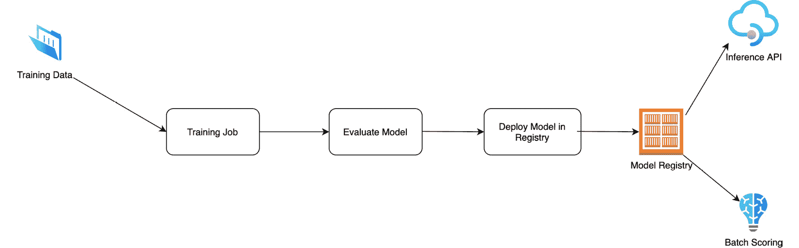
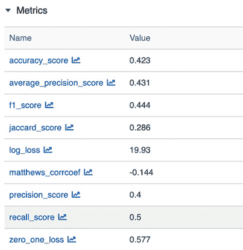
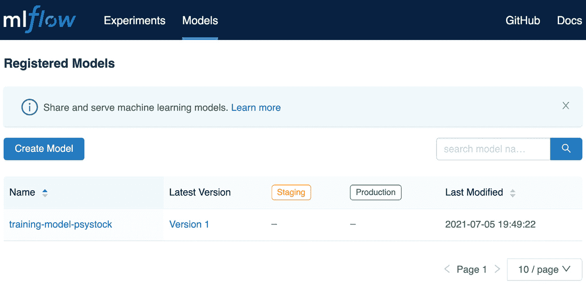

# *第八章*：使用 MLflow 训练模型

在本章中，您将学习如何使用 MLflow 创建生产就绪的训练作业。在更广泛的范围内，我们将关注如何将我们在早期章节中查看的笔记本环境中的训练作业转换为标准格式和蓝图以创建训练作业。

在本章中，我们将具体查看以下部分：

+   使用 MLflow 创建您的训练项目。

+   实现训练作业。

+   评估模型

+   在模型注册表中部署模型。

+   为您的训练作业创建 Docker 镜像。

是时候向 pyStock **机器学习**（**ML**）平台训练基础设施添加内容，将*第三章*中开发的工坊中创建的**概念验证**模型转移到生产环境。

在本章中，您将开发一个定期运行或由数据集到达触发的训练项目。训练项目的主要输出是一个新模型，作为输出生成并在模型注册表中注册，具有不同的详细信息。

这里是训练工作流程的概述：



图 8.1 – 训练工作流程

*图 8.1*从高层次描述了一般过程，即训练数据集到达并启动训练作业。训练作业生成一个模型，最终在模型注册表中评估和部署。上游系统现在能够使用新部署的模型部署推理**应用程序编程接口**（**API**）或批量作业。

# 技术要求

对于本章，您需要以下先决条件：

+   在您的机器上安装了最新的 Docker 版本。如果您还没有安装，请按照[`docs.docker.com/get-docker/`](https://docs.docker.com/get-docker/)中的说明操作。

+   已安装最新的 Docker Compose 版本——请按照[`docs.docker.com/compose/install/`](https://docs.docker.com/compose/install/)中的说明操作。

+   在命令行中访问 Git，并按照[`git-scm.com/book/en/v2/Getting-Started-Installing-Git`](https://git-scm.com/book/en/v2/Getting-Started-Installing-Git)中的说明进行安装。

+   访问 Bash 终端（Linux 或 Windows）。

+   访问浏览器的权限。

+   安装了 Python 3.5+。

+   如*第四章*中所述，您已在本地上安装了最新的 ML 库，*MLflow 中的实验管理*。

# 使用 MLflow 创建您的训练项目。

您从数据科学家那里收到一份基于**XGBoost**模型准备从**概念验证**阶段过渡到生产阶段的规范。

我们可以回顾数据科学家最初注册模型的原版 Jupyter 笔记本，这是开始创建 ML 工程管道的起点。在笔记本中进行初步原型设计和训练后，他们就可以准备将模型投入生产了。

一些公司直接将笔记本自身投入生产，这当然是一种可能性，但以下原因使其变得不可能：

+   版本控制笔记本很困难。

+   单元测试代码很困难。

+   对于长时间运行的测试来说，它不可靠。

通过这三个不同的阶段，我们确保了训练数据生成过程的可重复性，以及过程不同步骤的可见性和清晰的分离。

我们将首先将我们的 MLflow 项目组织成步骤，并为管道的每个组件创建占位符，如下所示：

1.  在您的本地机器上创建一个新的文件夹，并将其命名为`pystock-training`。添加`MLProject`文件，如下所示：

    ```py
    name: pystock_training
    conda_env: conda.yaml
    entry_points:
      main:
        data_file: path
        command: "python main.py"
      train_model:
        command: "python train_model.py"
      evaluate_model:
        command: "python evaluate_model.py "
      register_model:
        command: "python register_model.py"
    ```

1.  添加以下`conda.yaml`文件：

    ```py
    name: pystock-training
    channels:
      - defaults
    dependencies:
      - python=3.8
      - numpy
      - scipy
      - pandas
      - cloudpickle
      - pip:
        - git+git://github.com/mlflow/mlflow
        - sklearn
        - pandas_datareader
        - great-expectations==0.13.15
        - pandas-profiling
        - xgboost
    ```

1.  您现在可以向文件夹中添加一个示例`main.py`文件，以确保项目的基本结构正常工作，如下所示：

    ```py
    import mlflow
    import click
    import os
    def _run(entrypoint, parameters={}, source_version=None, use_cache=True):
        print("Launching new run for entrypoint=%s and parameters=%s" % (entrypoint, parameters))
        submitted_run = mlflow.run(".", entrypoint, parameters=parameters)
        return mlflow.tracking.MlflowClient().get_run(submitted_run.run_id)
    @click.command()
    def workflow():
        with mlflow.start_run(run_name ="pystock-training") as active_run:
            mlflow.set_tag("mlflow.runName", "pystock-training")
            _run("train_model")
            _run("evaluate_model")        
            _run("register_model")

    if __name__=="__main__":
        workflow()
    ```

1.  通过运行以下命令测试基本结构：

    ```py
    mlflow run.
    ```

    此命令将根据您的`conda.yaml`文件创建的环境构建您的项目，并运行您刚刚创建的基本项目。它应该出错，因为我们需要添加缺失的文件。

在这个阶段，我们已经有了本章将要构建的数据管道 MLflow 项目的基本块。接下来，您将填写用于训练数据的 Python 文件。

# 实现训练作业

我们将使用上一章生成的训练数据。这里的假设是独立的工作在特定文件夹中填充数据管道。在本书的 GitHub 仓库中，您可以在 https://github.com/PacktPublishing/Machine-Learning-Engineering-with-MLflow/blob/master/Chapter08/psystock-training/data/training/data.csv 查看数据。

现在我们将创建一个`train_model.py`文件，该文件将负责加载数据以拟合并生成模型。测试预测将被生成并持久化在环境中，以便工作流程的其他步骤可以使用这些数据来评估模型。

本节生成的文件可在以下链接找到：

[`github.com/PacktPublishing/Machine-Learning-Engineering-with-MLflow/blob/master/Chapter08/psystock-training/train_model.py`](https://github.com/PacktPublishing/Machine-Learning-Engineering-with-MLflow/blob/master/chapter_8/psytock-training/train_model.py)

1.  我们将首先导入相关的包。在这种情况下，我们需要`pandas`来处理数据，`xgboost`来运行训练算法，显然还需要`mlflow`来跟踪和记录数据运行。以下是您需要执行的代码：

    ```py
    import pandas as pd
    import mlflow
    import xgboost as xgb
    import mlflow.xgboost
    from sklearn.model_selection import train_test_split
    ```

1.  接下来，您应该添加一个函数来执行数据的分割，该函数依赖于`sklearn`中的`train_test_split`。我们选择的分割比例是测试数据和训练数据分别为 33/67%。我们指定`random_state`参数以确保过程可重复，如下所示：

    ```py
    def train_test_split_pandas(pandas_df,t_size=0.33,r_state=42):
        X=pandas_df.iloc[:,:-1]
        Y=pandas_df.iloc[:,-1]
        X_train, X_test, y_train, y_test = train_test_split(X, Y, test_size=t_size, random_state=r_state)
        return X_train, X_test, y_train, y_test
    ```

1.  此函数返回训练和测试数据集以及每个数据集的目标。我们依赖于`xgboost`矩阵`xgb.Dmatrix`数据格式来有效地加载训练和测试数据，并馈送给`xgboost.train`方法。代码如下所示：

    ```py
    if __name__ == "__main__":
        THRESHOLD = 0.5
        mlflow.xgboost.autolog()
        with mlflow.start_run(run_name="train_model") as run:
            mlflow.set_tag("mlflow.runName", "train_model")
            pandas_df=pd.read_csv("data/training/data.csv")
            pandas_df.reset_index(inplace=True)
            X_train, X_test, y_train, y_test = train_test_split_pandas(pandas_df)
            train_data = xgb.DMatrix(X_train, label=y_train)
            test_data =  xgb.DMatrix(X_test)
            model = xgb.train(dtrain=train_data,params={})        
    ```

1.  我们也利用这个时刻使用`model.predict`方法生成测试预测。一些数据转换被执行以将股票上涨或下跌的概率离散化，并将其转换为`0`（不会上涨）或`1`（上涨），如下所示：

    ```py
            y_probas=model.predict(test_data) 
            y_preds = [1 if  y_proba > THRESHOLD else 0\. for y_proba in y_probas]
    ```

1.  作为最后一步，我们将持久化测试预测到`result`变量中。我们删除索引，以便在运行`result.to_csv`命令时，保存的`pandas` DataFrame 不包含索引，如下所示：

    ```py
            test_prediction_results = pd.DataFrame(data={'y_pred':y_preds,'y_test':y_test})
            result = test_prediction_results.reset_index(drop=True)

            result.to_csv("data/predictions/test_predictions.csv")    
    ```

1.  您可以通过运行以下命令查看您的 MLflow **用户界面**（**UI**）以查看记录的指标：

    ```py
     mlflow ui
    ```

您应该能够查看您的 MLflow UI，如下面的截图所示，您可以在其中看到持久化的模型和刚刚训练的模型的不同模型信息：

![Figure 8.2 – 训练模型

![img/image0025.jpg]

图 8.2 – 训练模型

在这个阶段，我们已经将我们的模型保存并持久化到我们的 MLflow 安装的工件中。接下来，我们将添加一个新的步骤到我们的工作流程中，以生成刚刚生成的模型的指标。

# 评估模型

我们现在将收集模型的评估指标，以添加到模型的元数据中。

我们将处理`evaluate_model.py`文件。您可以通过在一个空文件中工作或访问 https://github.com/PacktPublishing/Machine-Learning-Engineering-with-MLflow/blob/master/Chapter08/psystock-training/evaluate_model.py 来跟随操作。按照以下步骤进行：

1.  导入相关的包—`pandas`和`mlflow`—分别用于读取和运行步骤。我们将依赖于导入`sklearn`中可用的模型评估指标，用于分类算法，如下所示：

    ```py
    import pandas as pd
    import mlflow
    from sklearn.model_selection import train_test_split
    from sklearn.metrics import  \
        classification_report, \
        confusion_matrix, \
        accuracy_score, \
        auc, \
        average_precision_score, \
        balanced_accuracy_score, \
        f1_score, \
        fbeta_score, \
        hamming_loss, \
        jaccard_score, \
        log_loss, \
        matthews_corrcoef, \
        precision_score, \
        recall_score, \
        zero_one_loss
    ```

    在这个阶段，我们已经导入了我们需要的所有函数，以便在下一节中提取所需的指标。

1.  接下来，您应该添加一个`classification_metrics`函数来根据`df`参数生成指标。假设 DataFrame 有两个列：`y_pred`，这是训练模型预测的目标，以及`y_test`，这是训练数据文件中存在的目标。以下是您需要的代码：

    ```py
    def classification_metrics(df:None):
        metrics={}
        metrics["accuracy_score"]=accuracy_score(df["y_pred"], df["y_test"]  )
        metrics["average_precision_score"]=average_precision_score( df["y_pred"], df["y_test"]  )
        metrics["f1_score"]=f1_score( df["y_pred"], df["y_test"]  )
        metrics["jaccard_score"]=jaccard_score( df["y_pred"], df["y_test"]  )
        metrics["log_loss"]=log_loss( df["y_pred"], df["y_test"]  )
        metrics["matthews_corrcoef"]=matthews_corrcoef( df["y_pred"], df["y_test"]  )
        metrics["precision_score"]=precision_score( df["y_pred"], df["y_test"]  )
        metrics["recall_score"]=recall_score( df["y_pred"], df["y_test"] )
        metrics["zero_one_loss"]=zero_one_loss( df["y_pred"], df["y_test"]  )
        return metrics
    ```

    前面的函数基于预测值和测试预测值生成一个`metrics`字典。

1.  在创建了这个生成指标的函数之后，我们需要使用`start_run`，基本上是读取预测测试文件并运行指标。我们将所有指标通过`mlflow.log_metrics`方法以日志字典的形式同时记录。代码在下面的代码片段中展示：

    ```py
    if __name__ == "__main__":
        with mlflow.start_run(run_name="evaluate_model") as run:
            mlflow.set_tag("mlflow.runName", "evaluate_model")
            df=pd.read_csv("data/predictions/test_predictions.csv")
            metrics = classification_metrics(df)
            mlflow.log_metrics(metrics)    
    ```

1.  我们可以再次查看 MLflow UI，在那里我们可以看到刚刚持久化的不同指标。您可以在以下位置查看输出：



图 8.3 – 持久化的训练模型指标

在这个阶段，我们对训练作业进行了模型评估，为模型实现者/部署者提供了指标和信息。现在我们将继续到训练过程的最后一步，即在 MLflow 模型注册表中注册模型，以便它可以部署到生产环境中。

# 在模型注册表中部署模型

接下来，您应该将`register_model.py`函数添加到模型注册表中以注册模型。

这就像执行`mlflow.register_model`方法，传入模型的**统一资源标识符**（**URI**）和模型名称。基本上，如果模型不存在，将会创建一个模型。如果它已经在注册表中，将添加一个新的版本，使得部署工具可以查看模型并追踪训练作业和指标。它还允许做出决定，是否将模型推广到生产环境中。所需的代码在下面的代码片段中展示：

```py
import mlflow
if __name__ == "__main__":

    with mlflow.start_run(run_name="register_model") as run:
        mlflow.set_tag("mlflow.runName", "register_model")
        model_uri = "runs:/{}/sklearn-model".format(run.info.run_id)
        result = mlflow.register_model(model_uri, "training-model-psystock")

```

在以下屏幕截图中，展示了已注册的模型，我们可以根据我们的工作流程更改状态并进入预发布或生产状态：



图 8.4 – 已注册模型

在注册了我们的模型之后，我们现在将转向准备一个用于公共云环境或 Kubernetes 集群的训练作业 Docker 镜像。

# 为您的训练作业创建 Docker 镜像

在许多情况下，Docker 镜像是模型开发者向生产中的更专业系统基础设施团队交付的最关键的成果之一。项目包含在以下存储库的文件夹中：https://github.com/PacktPublishing/Machine-Learning-Engineering-with-MLflow/tree/master/Chapter08/psystock-training-docker。在以下步骤中，我们将生成一个可部署的 Docker 镜像：

1.  您需要在项目的根目录下设置一个 Docker 文件，如下面的代码片段所示：

    ```py
    FROM continuumio/miniconda3:4.9.2
    RUN apt-get update && apt-get install build-essential -y
    RUN pip install \
        mlflow==1.18.0 \
        pymysql==1.0.2 \
        boto3
    COPY ./training_project /src
    WORKDIR /src
    ```

1.  我们将首先通过运行以下命令来构建和训练镜像：

    ```py
    docker build -t psystock_docker_training_image .
    ```

1.  您可以运行您的镜像，指定您的跟踪服务器`$TRACKING_SERVER_URI`值以到达[`host.docker.internal:5000`](http://host.docker.internal:5000)，如下面的代码片段所示：

    ```py
    docker run -e MLflow_TRACKING_SERVER=$TRACKING_SERVER_URI psystock_docker_training_image
    ```

在这个阶段，我们已经完成了完整训练工作流程的所有步骤。在下一章中，我们将继续在生产环境中部署平台的各个组件，利用迄今为止创建的所有 MLflow 项目。

# 摘要

在本章中，我们介绍了使用 MLflow 创建生产训练过程的概念和不同功能。

我们首先设置了 MLflow 训练项目的基本模块，并在本章中依次进行了训练模型、评估训练好的模型和注册训练好的模型。我们还深入探讨了为您的训练任务创建一个现成的图像。

这是我们架构的一个重要组成部分，它将使我们能够为我们的生产 ML 系统构建一个端到端的生产系统。在下一章中，我们将部署不同的组件，并说明模型的部署过程。

# 进一步阅读

为了进一步扩展您的知识，您可以参考以下链接的官方文档：

[`www.mlflow.org/docs/latest/projects.html`](https://www.mlflow.org/docs/latest/projects.html)
