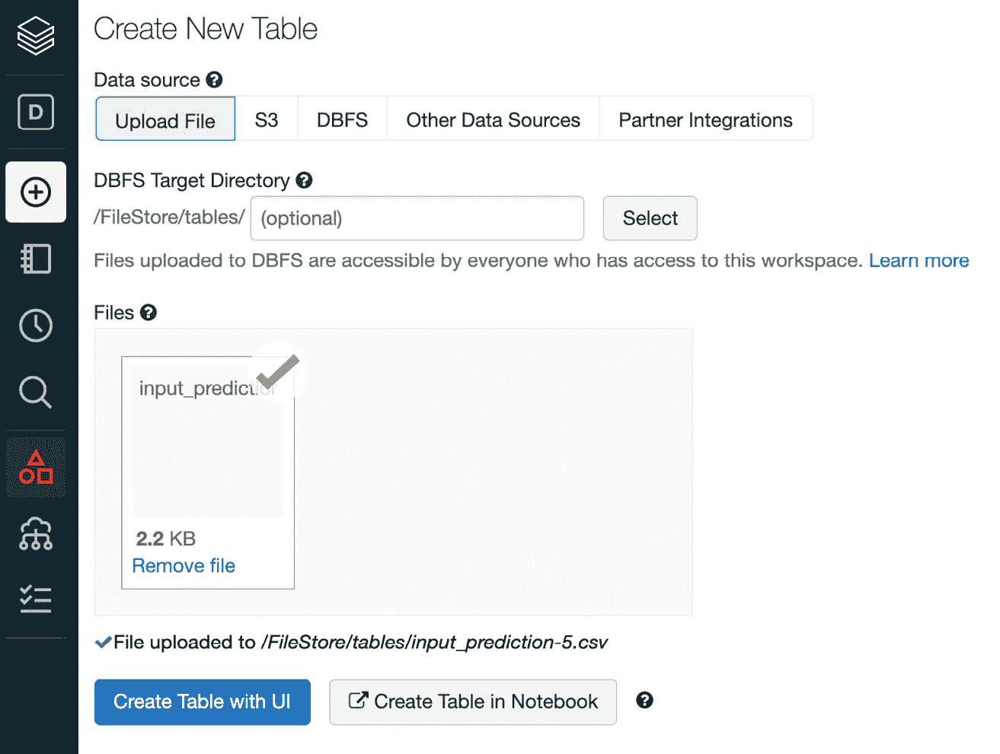
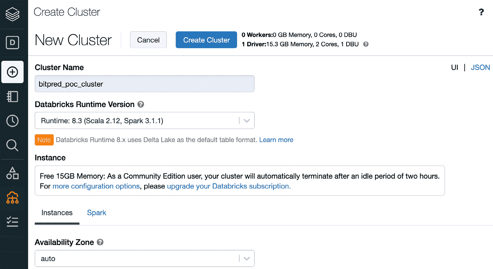
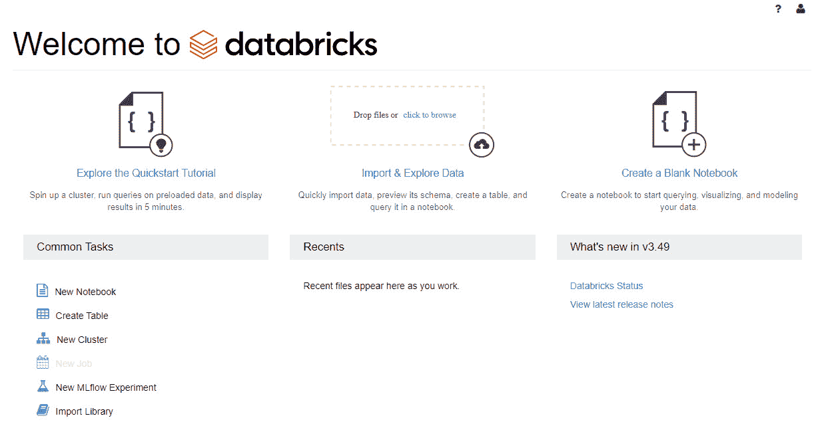
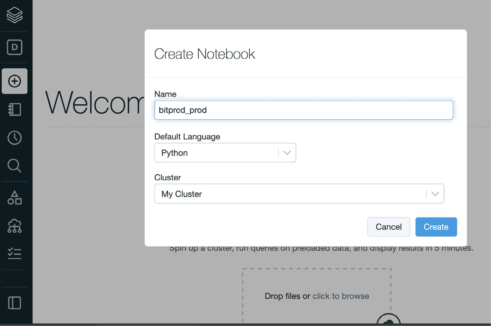
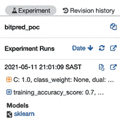
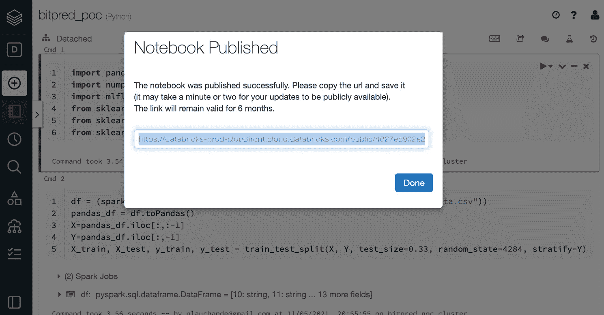

# *第十章*：扩展您的机器学习工作流程

在本章中，您将了解各种技术和模式，以在不同的可扩展性维度上扩展您的 **机器学习**（**ML**）工作流程。我们将探讨使用 Databricks 管理环境来扩展您的 MLflow 开发能力，在您有更大的数据集的情况下添加 Apache Spark。我们将探索 NVIDIA RAPIDS 和 **图形处理单元**（**GPU**）支持，以及 Ray 分布式框架来加速您的 ML 工作负载。本章的格式是一个小的 **概念验证**，包含一个定义良好的规范数据集，以展示一种技术和工具链。

特别是，在本章中，我们将查看以下部分：

+   在 Databricks 社区版环境中开发模型

+   将 MLflow 与 Apache Spark 集成

+   将 MLflow 与 NVIDIA RAPIDS (GPU) 集成

+   将 MLflow 与 Ray 平台集成

本章将需要研究每个框架的适当设置，基于每个案例的标准官方文档。

# 技术要求

对于本章，您需要以下先决条件：

+   在您的机器上安装的最新版本的 Docker。如果您尚未安装，请按照[`docs.docker.com/get-docker/`](https://docs.docker.com/get-docker/)中的说明进行操作。

+   安装了最新版本的 Docker Compose—请按照[`docs.docker.com/compose/install/`](https://docs.docker.com/compose/install/)中的说明进行操作。

+   命令行中访问 Git，并按照[`git-scm.com/book/en/v2/Getting-Started-Installing-Git`](https://git-scm.com/book/en/v2/Getting-Started-Installing-Git)中的说明进行安装。

+   访问 Bash 终端（Linux 或 Windows）。

+   访问浏览器。

+   安装了 Python 3.5+。

+   如*第三章*中所述，本地安装的您机器学习库的最新版本，*您的数据科学工作台*。

+   配置为运行 MLflow 模型的 **Amazon Web Services**（**AWS**）账户。

# 在 Databricks 社区版环境中开发模型

在许多小型团队和公司的场景中，启动一个集中的 ML 环境可能是一个成本高昂、资源密集的前期投资。一个能够快速扩展并使团队快速掌握技能的团队对于解锁组织内 ML 的价值至关重要。在这些情况下，使用托管服务非常相关，以开始原型设计和开始了解以较低成本使用 ML 的可行性。

一个非常流行的托管 ML 和数据平台是 Databricks 平台，由开发 MLflow 的同一家公司开发。在本节中，我们将使用针对学生和个人使用的 Databricks 社区版版本和许可证。

为了探索 Databricks 平台以开发和共享模型，您需要执行以下步骤：

1.  在[`community.cloud.databricks.com/`](https://community.cloud.databricks.com/)上注册 Databricks 社区版，并创建一个账户。

1.  使用您刚刚创建的凭据登录您的账户。

1.  将训练数据上传到 Databricks。您可以从上传位于`Chapter10/databricks_notebooks/training_data.csv`文件夹中的训练数据开始。在以下屏幕截图中，您可以看到左侧的**数据**标签页，并且应该看到您的文件已上传到平台：

    Figure 10.1 – Uploading training data to Databricks

1.  将训练数据上传到 Databricks。您可以从上传位于`Chapter10/databricks_notebooks/input_prediction.csv`文件夹中的训练数据开始。

1.  创建一个用于您工作负载的集群。您可以为您的负载拥有集群，限制为 15 **GB**（**GB**）的**随机存取内存**（**RAM**），并且使用期限为定义的时间段。

    您可以在以下屏幕截图中查看集群创建过程的概述：

    

    Figure 10.2 – Creating a cluster in Databricks Community Edition

1.  通过点击页面右上角的**创建空白笔记本**按钮，在您的着陆工作空间页面上创建一个新的笔记本，如图所示：

    Figure 10.3 – Creating a new notebook in Databricks Community Edition

1.  我们现在已准备好在这个托管环境中启动一个笔记本以执行基本的训练作业。您可以从点击**创建笔记本**开始，如图所示：

    Figure 10.4 – Creating your new notebook

1.  将训练数据上传到 Databricks。您可以从上传位于`Chapter10/databricks_notebooks/input_prediction.csv`文件夹中的训练数据开始。

1.  导入所需的库。我们将适配一个用于分类我们正在运行的`btc-usd`标的价格的业务案例的`LogicRegression`模型，如下所示：

    ```py
    import pandas
    import numpy as np
    import mlflow
    from sklearn.linear_model import LogisticRegression
    from sklearn.metrics import f1_score, confusion_matrix
    from sklearn.model_selection import train_test_split
    ```

1.  由于平台中使用了 Databricks 文件系统，为了读取数据，更方便的是在 Spark 中读取数据，然后将 DataFrame 转换为`pandas`。我们通常将数据分为训练集和测试集。以下是您需要的代码：

    ```py
    df = (spark.read.option("header","true").csv("/FileStore/tables/training_data.csv"))
    pandas_df = df.toPandas()
    X=pandas_df.iloc[:,:-1]
    Y=pandas_df.iloc[:,-1]
    X_train, X_test, y_train, y_test = train_test_split(X, Y, test_size=0.33, random_state=4284, stratify=Y)
    ```

1.  我们的下一步将是快速训练我们的分类器，如下所示：

    ```py
    mlflow.sklearn.autolog()
    model = LogisticRegression()
    with mlflow.start_run(run_name='logistic_regression_model_baseline') as run:
        model.fit(X_train, y_train)
        preds = model.predict(X_test)
    ```

1.  在页面右上角，您可以点击**实验**按钮查看关于您运行的更多详细信息，并且可以进一步点击查看您的模型实验，如图所示，以下屏幕截图所示：

    Figure 10.5 – Experiment button

1.  一个有趣的功能是可以扩展并加速你与他人协作的能力，即能够发布公开可访问的模型笔记本，供与你分享链接的每个人使用，如下面的截图所示：



图 10.6 – 发布笔记本

您还可以将笔记本导出为 `dbc` 文件，以便您可以在 Databricks 环境中快速启动它，您还可以在存储库中共享它，如章节文件夹中所示，在 `/databricks-notebooks/bitpred_poc.dbc`。

在处理了使用 Databricks 环境扩展运行、开发和分发模型的方法之后，我们将接下来探讨将 Apache Spark 流集成到我们的推理工作流程中，以处理我们有访问权的大型数据集的场景。

# 集成 MLflow 与 Apache Spark

Apache Spark 是一个非常可扩展且流行的大数据框架，它允许在大规模上进行数据处理。有关更多详细信息和支持文档，请访问 [`spark.apache.org/`](https://spark.apache.org/)。作为一个大数据工具，它可以用来加速您的机器学习推理的部分，因为它可以在训练或推理级别进行设置。

在这个特定案例中，我们将说明如何实现它，以便使用上一节在 Databricks 环境中开发的模型来扩展批量推理作业到更大的数据量。

为了探索 Spark 与 MLflow 的集成，我们将执行以下步骤：

1.  在 Python 中创建一个名为 `inference_job_spark` 的新笔记本，并将其链接到刚刚创建 `bitpred_poc.ipynb` 笔记本的运行集群。

1.  将您的数据上传到环境中的文件/上传数据链接的 `dbfs` 上。

1.  在笔记本的一个单元中执行以下脚本，将 `logged_model` 和 `df` 文件名更改为您环境中的文件名：

    ```py
    import mlflow
    logged_model = 'runs:/6815b44128e14df2b356c9db23b7f936/model'
    df = spark.read.format("csv").load("dbfs:/FileStore/shared_uploads/ input.csv")
    # Load model as a Spark UDF.
    loaded_model = mlflow.pyfunc.spark_udf(spark, model_uri=logged_model)
    # Predict on a Spark DataFrame.
    df.withColumn('predictions', loaded_model()).collect()
    ```

这个示例摘录可以在 Databricks 或您自己的 Spark 集群上运行，并可以扩展到大型数据集，利用 Spark 的分布式计算能力。

从使用 Apache Spark 扩展推理开始，我们现在将探讨在 MLflow 的支持下使用 GPU 来扩展超参数优化作业。

# 集成 MLflow 与 NVIDIA RAPIDS（GPU）

训练和调整机器学习模型是一个漫长且计算成本高昂的操作，并且是能够从并行处理中受益最大的操作之一。在本节中，我们将探讨将您的 MLflow 训练作业（包括超参数优化）与 NVIDIA RAPIDS 框架集成。 

要集成 NVIDIA RAPIDS 库，请按照以下步骤操作：

1.  根据您的环境，以以下方式安装 RAPIDS：

    a. [`rapids.ai/start.html`](https://rapids.ai/start.html) 包含有关部署选项的详细信息。

    b. [`developer.nvidia.com/blog/run-rapids-on-google-colab/`](https://developer.nvidia.com/blog/run-rapids-on-google-colab/) 详细说明了如何在 **Google Colaboratory**（**Google Colab**）上运行 RAPIDS。

1.  在你的环境中安装 MLflow。

1.  按照以下方式导入所需的库：

    ```py
    import argparse
    from functools import partial
    import mlflow
    import mlflow.sklearn
    from cuml.metrics.accuracy import accuracy_score
    from cuml.preprocessing.model_selection import train_test_split
    from cuml.ensemble import RandomForestClassifier
    from hyperopt import fmin, tpe, hp, Trials, STATUS_OK
    ```

1.  实现 `load_data` 函数，这是一个辅助函数，用于将数据加载到将被 `cudf` DataFrame（一个用于加载、连接、聚合和过滤的 DataFrame 库，无需了解 **计算统一设备架构**（**CUDA**）编程的细节）使用。以下是所需的代码：

    ```py
    def load_data(fpath):
        import cudf
        df = cudf.read_parquet(fpath)
        X = df.drop(["ArrDelayBinary"], axis=1)
        y = df["ArrDelayBinary"].astype("int32")
        return train_test_split(X, y, test_size=0.2)Start the ray server 
    ray.init()
    client = serve.start()
    ```

1.  按照以下方式定义训练循环：

    ```py
    def _train(params, fpath):
        max_depth, max_features, n_estimators = params
        max_depth, max_features, n_estimators = (int(max_
    depth), float(max_features), int(n_estimators))
        X_train, X_test, y_train, y_test = load_data(fpath)
        mod = RandomForestClassifier(
            max_depth=max_depth, max_features=max_features, n_estimators=n_estimators
        )
        mod.fit(X_train, y_train)
        preds = mod.predict(X_test)
        acc = accuracy_score(y_test, preds)
        mlparams = {
            "max_depth": str(max_depth),
            "max_features": str(max_features),
            "n_estimators": str(n_estimators),
        }
        mlflow.log_params(mlparams)
        mlflow.log_metric("accuracy", acc)
        mlflow.sklearn.log_model(mod, "saved_models")
        return {"loss": acc, "status": STATUS_OK}
    ```

1.  调用内部训练循环，如下所示：

    ```py
    def train(params, fpath, hyperopt=False):

        with mlflow.start_run(nested=True):
            return _train(params, fpath, hyperopt)
    ```

1.  如果你在 Docker 中部署了版本，通过读取参数设置你的主要流程。以下代码片段展示了如何执行此操作：

    ```py
    if __name__ == "__main__":
        parser = argparse.ArgumentParser()
        parser.add_argument("--algo", default="tpe", 
    choices=["tpe"], type=str)
        parser.add_argument("--conda-env", required=True, type=str)
        parser.add_argument("--fpath", required=True, type=str)
        args = parser.parse_args()
    ```

1.  按照以下方式定义你的试验和要优化的参数：

    ```py
        search_space = [
            hp.uniform("max_depth", 5, 20),
            hp.uniform("max_features", 0.1, 1.0),
            hp.uniform("n_estimators", 150, 1000),
        ]
        trials = Trials()
        algorithm = tpe.suggest if args.algo == "tpe" else None
        fn = partial(train, fpath=args.fpath, hyperopt=True)
        experid = 0
    ```

1.  按照以下方式运行你的主要循环：

    ```py
        artifact_path = "Airline-Demo"
        artifact_uri = None
        with mlflow.start_run(run_name="RAPIDS-Hyperopt"):
            argmin = fmin(fn=fn, space=search_space, algo=algorithm, max_evals=2, trials=trials)
            print("===========")
            fn = partial(train, fpath=args.fpath, hyperopt=False)
            final_model = fn(tuple(argmin.values()))
            mlflow.sklearn.log_model(
                final_model,
                artifact_path=artifact_path,
                registered_model_name="rapids_mlflow_cli",
                conda_env="envs/conda.yaml",
            )
    ```

在处理了使用高度可扩展的计算环境在 Ray 平台上提供模型之后，我们现在将考虑一个不同的问题，我们将探讨从本地机器在集中式云位置跟踪多个运行的选择。

# 将 MLflow 与 Ray 平台集成

Ray 框架（[`docs.ray.io/en/master/`](https://docs.ray.io/en/master/））是一个分布式平台，它允许你快速扩展部署基础设施。

使用 Ray，你可以在运行需要以与模型服务相同方式扩展的 ML 平台时添加任意逻辑。它基本上是一个网络框架。

我们预先加载了模型和内容，并将它们放入以下存储库文件夹中：https://github.com/PacktPublishing/Machine-Learning-Engineering-with-MLflow/tree/master/Chapter10/mlflow-ray-serve-integration。

为了将你的模型服务执行到 Ray 中，执行以下步骤：

1.  通过运行以下命令安装 Ray 包：

    ```py
    pip install -U ray
    ```

1.  在你的环境中安装 MLflow。

1.  按照以下方式导入所需的库：

    ```py
    import ray
    from ray import serve
    import mlflow.pyfunc
    ```

1.  实现模型后端，这基本上意味着将模型服务函数包装到你的 Ray 服务环境中。以下是所需的代码：

    ```py
    class MLflowBackend:
        def __init__(self, model_uri):
            self.model = mlflow.pyfunc.load_model(model_
    uri=model_uri)
        async def __call__(self, request):
            return self.model.predict(request.data)
    ```

1.  按照以下方式启动 Ray 服务器：

    ```py
    ray.init()
    client = serve.start()
    ```

1.  按照以下方式加载模型并创建后端：

    ```py
    model_uri = "./tmp/0/31fc9974587243d181fdbebfd4d2b6ad/artifacts/model"
    client.create_backend("mlflow_backend", MLflowBackend, model_uri)
    ```

1.  通过运行以下命令测试服务平台：

    ```py
    ray start --head # Start local Ray cluster.
    serve start # Start Serve on the local Ray cluster.
    ```

在处理了使用高度可扩展的计算环境在 Ray 平台上提供模型之后，我们将在下一章中查看性能和监控组件。

# 摘要

在本章中，我们专注于使用 Databricks 环境扩展你运行、开发和分发模型的能力。我们还探讨了将 Apache Spark 流集成到我们的批量推理工作流程中，以处理我们有访问大型数据集的场景。

我们使用 NVIDIA RAPIDS 框架和 Ray 分布式框架，以可扩展性的方式总结了两种扩展超参数优化和 **应用程序编程接口**（**API**）服务的方法。

在下一章和本书的后续部分，我们将专注于 ML 模型的可观察性和性能监控。

# 进一步阅读

为了进一步扩展您的知识，您可以查阅以下链接中的文档：

+   [`www.mlflow.org/docs/latest/python_api/mlflow.sagemaker.html`](https://www.mlflow.org/docs/latest/python_api/mlflow.sagemaker.html)

+   [`aws.amazon.com/blogs/machine-learning/managing-your-machine-learning-lifecycle-with-mlflow-and-amazon-sagemaker/`](https://aws.amazon.com/blogs/machine-learning/managing-your-machine-learning-lifecycle-with-mlflow-and-amazon-sagemaker/)

+   [`docs.databricks.com/applications/mlflow/index.html`](https://docs.databricks.com/applications/mlflow/index.html)
