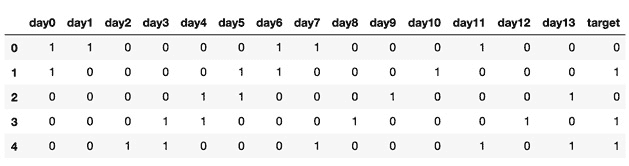
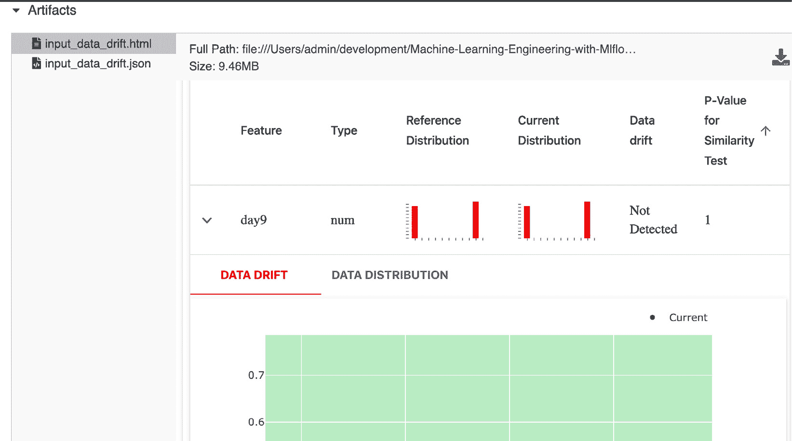
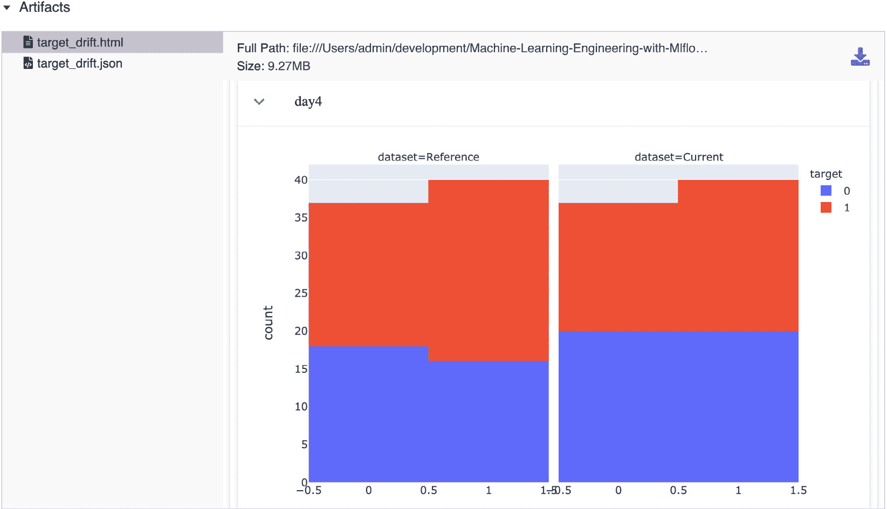
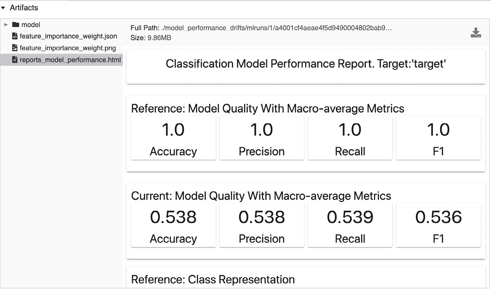
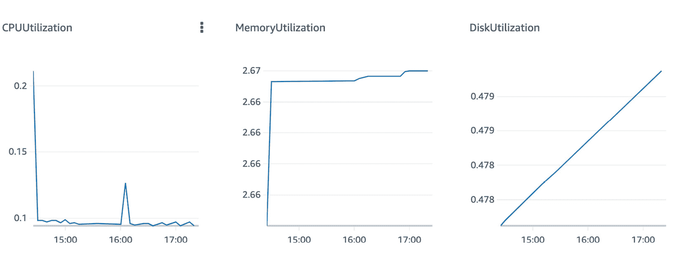
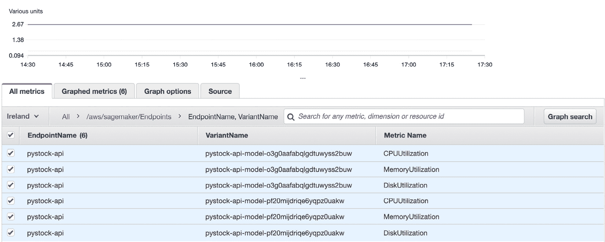
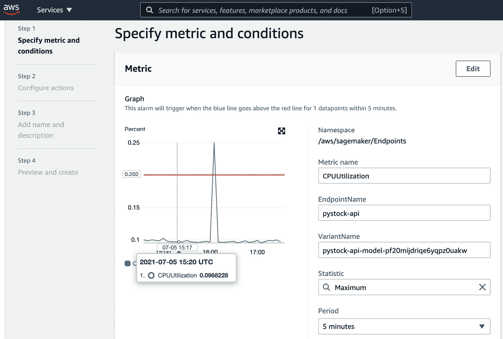

# 第十一章：性能监控

在本章中，你将了解机器学习（ML）操作的重要和相关性领域，以及如何使用该领域的最佳实践和已知的操作模式来确保到目前为止在此书中开发的系统在生产中的平稳运行。我们将了解机器学习中的操作概念，并查看用于监控机器学习系统中数据质量的指标。

具体来说，我们将在本章中查看以下部分：

+   机器学习模型性能监控概述

+   监控数据漂移和模型性能

+   监控目标漂移

+   基础设施监控和警报

我们将介绍一些用于监控机器学习系统性能和可靠性的实用参考工具。

# 技术要求

对于本章，你需要以下先决条件：

+   在您的机器上安装了最新版本的 Docker。如果您还没有安装，请按照[`docs.docker.com/get-docker/`](https://docs.docker.com/get-docker/)上的说明操作。

+   安装了最新版本的`docker-compose`。为此，请按照[`docs.docker.com/compose/install/`](https://docs.docker.com/compose/install/)上的说明操作。

+   在命令行中访问 Git，可以按照[`git-scm.com/book/en/v2/Getting-Started-Installing-Git`](https://git-scm.com/book/en/v2/Getting-Started-Installing-Git)中的说明进行安装。

+   访问 Bash 终端（Linux 或 Windows）。

+   访问浏览器。

+   Python 3.8+已安装。

+   按照*第三章**，*您的数据科学工作台*中描述的，在本地安装了您机器学习的最新版本。

+   配置了 AWS 账户以运行 MLflow 模型。

# 机器学习模型性能监控概述

监控是可靠机器学习系统的基石，能够持续释放数据的价值并提供改进的关键反馈。

在机器学习模型的监控方面，有多个利益相关者，我们应该从涉及的不同利益相关者那里获取监控要求。以下是一个典型的利益相关者集的一个例子：

+   **数据科学家**：他们在监控方面的重点是评估可能对性能产生负面影响的模型性能和数据漂移。

+   **软件工程师**：这些利益相关者希望确保他们有衡量指标，以评估他们的产品是否能够可靠且正确地访问为模型提供服务的 API。

+   **数据工程师**：他们希望确保数据管道是可靠的，并且能够可靠地推送数据，以适当的速度，并且符合正确的模式。

+   **业务/产品利益相关者**：这些利益相关者对其客户群整体解决方案的核心影响感兴趣。例如，在一个交易平台中，他们可能最关心整体解决方案为公司带来的盈利与风险比率。如果市场在一天内非常波动或处于非典型情况，可能会向算法中添加断路器。

在机器学习行业中，最广泛使用的监控维度如下：

+   **数据漂移**：这对应于用于模型训练或推理的输入数据发生的重大变化。这可能表明现实世界中模型假设的变化，这将需要重新训练、重新开发模型，甚至如果不再适用，则存档。这可以通过监控用于训练模型的数据与用于评分或推理的数据随时间变化的分布来轻松检测。

+   **目标漂移**：随着输入数据中方案的变化，我们在一段时间内经常看到模型输出分布的相同变化。常见的周期是几个月、几周或几天，可能表明环境发生了重大变化，这将需要模型重新开发和调整。

+   **性能漂移**：这涉及到查看性能指标，如分类问题的准确度或均方根误差，是否随着时间的推移逐渐恶化。这是模型存在问题的迹象，需要模型开发人员或维护人员进行调查和采取行动。

+   **平台和基础设施指标**：此类指标与建模无直接关系，而是与包围模型的系统基础设施有关。它意味着异常的 CPU、内存、网络或磁盘使用，这肯定会影响模型向业务提供价值的能力。

+   **业务指标**：非常关键的业务指标，如模型的盈利能力，在某些情况下应添加到模型运营中，以确保负责模型的团队能够监控模型实现其业务假设的能力。

在下一节中，我们将探讨使用一个可以与**MLflow**集成的工具来监控数据漂移并检查模型的性能。

# 监控数据漂移和模型性能

在本节中，我们将通过一个示例，您可以在**GitHub**仓库（https://github.com/PacktPublishing/Machine-Learning-Engineering-with-MLflow/tree/master/Chapter11/model_performance_drifts）中找到的笔记本中的代码进行演示。我们将通过计算不同类型的漂移并探索其与 MLflow 的集成来运行整个过程。

监控模型性能领域的一个新兴开源工具被称为 `pandas`、JSON 和 CSV。它允许我们监控机器学习模型中的多个漂移及其性能。Evidently 的 GitHub 仓库可在 [`github.com/evidentlyai/evidently/`](https://github.com/evidentlyai/evidently/) 找到。

在本节中，我们将探索 Evidently 与 MLflow 的组合，以便在下一节中监控数据漂移和模型性能。

## 监控数据漂移

在本小节中，我们将在我们的环境中设置 **Evidently** 并了解如何将其集成。请按照 GitHub 仓库中的这些步骤操作（更多详细信息请参阅 *技术要求* 部分）：

1.  安装 `evidently`：

    ```py
    pip install evidently==0.1.17.dev0
    ```

1.  导入相关库：

    ```py
    import pandas as pd
    import numpy as np
    from sklearn import datasets
    from sklearn.model_selection import train_test_split
    from evidently.dashboard import Dashboard
    from evidently.tabs import DataDriftTab, NumTargetDriftTab,CatTargetDriftTab
    ```

1.  获取一个参考数据集，基本上是一个训练数据集。我们将向 `pandas` DataFrame 添加一组特征，以便 `evidently` 能够在漂移报告中使用特征名称：

    ```py
    reference_data = \
    pd.read_csv("training_data.csv", header=None,
                names=[ "day{}".format(i) for i in \
                        range(0,14) ]+["target"] )
    ```

    以下 *图 11.1* 代表我们将用作参考数据集的训练数据的数据结构：

    

    图 11.1 – 要使用的数据集样本

1.  在此步骤中，我们加载 `to_score_input_data.csv` 文件。这是要评分的文件。我们在此练习中的目的是计算参考训练集中的数据与要评分的数据之间的分布差异：

    ```py
    latest_input_data = \
    pd.read_csv("to_score_input_data.csv", header=None,
                 names=[ "day{}".format(i) for i in \
                         range(0,14) ] )
    ```

1.  执行数据漂移报告生成并记录到 MLflow 运行中。基本上，以下代码片段所发生的是生成一个包含参考数据和最新输入数据的 Evidently 仪表板。计算漂移报告并将其加载到 MLflow 运行中，以便在后续步骤中采取行动和审查：

    ```py
    EXPERIMENT_NAME="./reports_data_drift"
    mlflow.set_experiment(EXPERIMENT_NAME)
    with mlflow.start_run():
        drift_dashboard = Dashboard(tabs=[DataDriftTab])
        drift_dashboard.calculate(reference_data,
                                  latest_input_data)
        drift_dashboard.save(EXPERIMENT_NAME+"/input_data_drift.html")
        drift_dashboard._save_to_json(EXPERIMENT_NAME+"/input_data_drift.json")
        mlflow.log_artifacts(EXPERIMENT_NAME)
    ```

1.  您现在可以运行前几行中的笔记本代码（在 `monitoring_data_drift_performance.ipynb` 文件中），并在 MLflow 运行的“工件”组件中探索您的数据漂移报告。*图 11.2* 显示，该工具在 14 个特征中没有检测到任何漂移，并相应地展示了分布：



图 11.2 – 要使用的数据集样本

与数据漂移类似，我们现在将在下一小节中查看目标漂移，以揭示模型中可能的其他问题。

## 监控目标漂移

我们现在将比较评分输出与参考训练输出，以寻找可能的目标漂移：

1.  获取最近评分的数据集：

    ```py
    production_scored_data = \
    pd.read_csv("scored_data.csv", header=None,
                names=[ "day{}".format(i) for i in \
                        range(0,14) ]+["target"] )
    bcancer_data_and_target_drift = \
    Dashboard(reference_data, production_scored_data,
              tabs=[ CatTargetDriftTab])
    bcancer_data_and_target_drift.save('reports/target_drift.html')
    ```

1.  执行数据漂移报告生成并将结果记录在 MLflow 中：

    ```py
    EXPERIMENT_NAME="./reports_target_drift"
    mlflow.set_experiment(EXPERIMENT_NAME)
    with mlflow.start_run():
        model_target_drift = \
        Dashboard(reference_data, production_scored_data,
                  tabs=[CatTargetDriftTab])
        model_target_drift.save(EXPERIMENT_NAME+"/target_drift.html")
        drift_dashboard._save_to_json(EXPERIMENT_NAME+"/target_drift.json")
        mlflow.log_artifacts(EXPERIMENT_NAME)
    ```

1.  探索您的目标漂移报告。如*图 11.3*所示，在此次运行中未发现对目标漂移有统计学意义的数值。在检测漂移时，Evidently 使用数据来自不同分布的概率（由**p 值**表示）进行统计测试（更多详情请见[`en.wikipedia.org/wiki/P-value`](https://en.wikipedia.org/wiki/P-value)）。它比较了参考数据和当前数据的结果！[](img/image0037.jpg)

    

1.  如*图 11.4*所示，您可以进一步深入到特定特征的目标漂移；在这种情况下，预测股票价格的特定前**8 天**：


图 11.4 – 我们目标的数据漂移

在学习了如何检测输入数据中的漂移之后，我们现在将探讨如何使用 Evidently 来监控模型中的漂移。

## 监控模型漂移

监控模型漂移对于确保您的模型仍然以最佳性能水平运行至关重要。通过这次分析，您可以决定是否重新训练您的模型，甚至从头开始开发一个新模型。

我们现在将监控模型漂移。为此，您需要执行以下步骤：

1.  导入相关库：

    ```py
    import xgboost as xgb
    import mlflow
    from evidently.tabs import ClassificationPerformanceTab
    ```

1.  获取参考数据集：

    ```py
    X=reference_data.iloc[:,:-1]
    Y=reference_data.iloc[:,-1]
    reference, production, y_train, y_test = \
    train_test_split(X, Y, test_size=0.33,
                     random_state=4284, stratify=Y)
    reference_train = xgb.DMatrix(reference,label=y_train)
    dproduction= xgb.DMatrix(production)
    dreference=xgb.DMatrix(reference)
    ```

1.  训练您的模型：

    ```py
    mlflow.xgboost.autolog()
    EXPERIMENT_NAME="reports_model_performance"
    mlflow.set_experiment(EXPERIMENT_NAME)
    with mlflow.start_run() as run:
        model=xgb.train(dtrain=reference_train,params={})
    ```

1.  创建参考预测和训练预测：

    ```py
        train_proba_predict = model.predict(dreference)
        test_proba_predict = model.predict(dproduction)
        test_predictions = [1\. if y_cont > threshold else 0\. for y_cont in test_proba_predict]
        train_predictions = [1\. if y_cont > threshold else 0\. for y_cont in train_proba_predict]
        reference['target'] = y_train
        reference['prediction'] = train_predictions
        production['target'] = y_test
        production['prediction'] = test_predictions
    ```

1.  生成并附加性能报告到您的执行中：

    ```py
        classification_performance = Dashboard( 
                      tabs=[ClassificationPerformanceTab])
        classification_performance.calculate(reference,
                                             production)
        classification_performance.save('.reports/'+EXPERIMENT_NAME+'.html')
        mlflow.log_artifact('.reports/'+EXPERIMENT_NAME+'.html')
    ```

1.  探索您的 MLflow 性能指标报告。通过查看生成的报告，您可以检查**参考**指标，包括**准确率**、**精确度**、**召回率**和**F1 指标**，这些是基于训练数据的参考指标，其最大值为**1**。当我们测试测试数据集的子集时，下面一行当前状态肯定已经退化。这可以帮助您判断是否在当前的**F1**值下，模型仍然在生产中运行是有意义的：




在深入了解数据漂移、目标漂移和模型性能监控的细节，以及如何将这些功能与 MLflow 集成之后，我们现在将探讨监控基础设施的基本原则，包括监控和警报。

# 基础设施监控和警报

从基础设施的角度来看，ML 系统监控的主要维度与传统软件系统没有区别。

为了说明这个问题，我们将利用 **AWS CloudWatch** 和 **SageMaker** 中可用的监控和警报工具来展示设置监控和警报基础设施的示例。这个相同的机制可以使用 Grafana/Prometheus 等工具在本地和云部署中设置。这些监控工具实现类似的目标，并提供类似的功能，因此您应该根据您的环境和云提供商选择最合适的工具。

**AWS CloudWatch** 提供了一种监控和可观察性解决方案。它允许您监控您的应用程序，响应系统级性能变化，优化资源使用，并获得操作健康性的单一视图。

在更高层次上，我们可以将基础设施监控和警报组件分为以下三个部分：

+   **资源指标**：这指的是系统部署的硬件基础设施的指标。在这种情况下，主要的指标包括以下内容：

    a. **CPU 利用率**：这基本上是处理器利用率的百分比单位。这是一个通用的指标，应该被监控。

    b. **内存利用率**：您的计算系统当前使用的内存百分比。

    c. **网络数据传输**：网络数据传输是指特定计算节点进出流量的大小。它通常以 Mb/s 为单位。异常可能意味着您需要向系统中添加更多节点或增加容量。

    d. **磁盘 I/O**：这是通过磁盘的读写吞吐量来衡量的；它可能表明系统处于压力之下，需要扩展或调查其性能：




图 11.6 – SageMaker 基础设施指标示例

+   **系统指标**：基础设施监控和警报组件的第二支柱是指系统基础设施的指标，系统部署在其中。在这种情况下，主要的指标包括以下内容：

    a. **请求吞吐量**：每秒处理的预测数量

    b. **错误率**：每个预测的错误数量

    c. **请求延迟**：服务预测的端到端时间

    d. **验证指标**：请求输入数据的错误指标

    一个生产系统，如 SageMaker，会将系统指标推送到 AWS CloudWatch 以提供实时系统指标监控。AWS CloudWatch 拥有一套完整的特性集，用于管理、存储和监控指标和仪表板：



图 11.7 – 在 AWS CloudWatch 中指定警报

+   **警报**：对于警报，我们使用上一节计算出的任何指标，并设置一个我们认为可接受的阈值。AWS CloudWatch 界面允许您轻松设置默认服务指标和自定义指标的警报。负责可靠性的团队将通过 CloudWatch 发送消息到公司聊天/Slack、电子邮件地址或手机来接收警报，以便团队处理或减轻事件：



图 11.8 – 在 AWS CloudWatch 中指定一个警报

您可以使用相同的监控工具记录和监控与您的 ML 系统相关联的所有其他指标。例如，为 ML 模型的周利润设置警报是一个应该与系统核心系统指标一起部署的业务指标。

在本书的最后一章，我们将探讨 MLflow 的高级概念，作为对 AWS CloudWatch 作为实现生产中 ML 系统指标监控和警报工具的概述。

# 摘要

在本章中，我们介绍了数据漂移和目标漂移的概念，并探讨了 ML 系统中性能监控的不同方法。

我们首先介绍了性能和监控领域的重要概念，不同类型的漂移和需要监控的业务指标，以及使用 AWS CloudWatch 作为实时系统中实现监控和警报的工具。

性能和监控是我们架构的重要组成部分，它将使我们能够完成我们 ML 系统架构的重要一层。现在让我们深入了解 MLflow 的高级主题。

# 进一步阅读

为了进一步扩展您的知识，您可以查阅以下链接中的文档：

+   [`www.mlflow.org/docs/latest/projects.html`](https://www.mlflow.org/docs/latest/projects.html)

+   [`evidentlyai.com/`](https://evidentlyai.com/)

+   [`aws.amazon.com/cloudwatch/`](https://aws.amazon.com/cloudwatch/)
