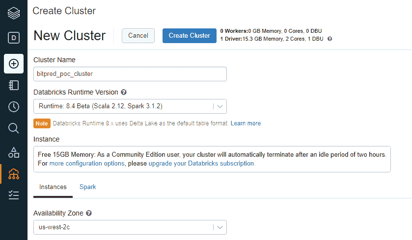
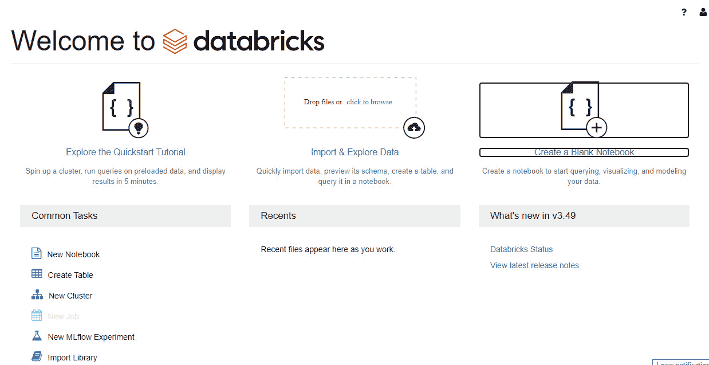
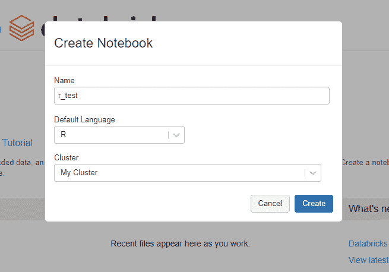

# *第十二章*：MLflow 的高级主题

在本章中，我们将涵盖高级主题，以解决常见的情境和用例，通过使用本书其他部分未公开的不同类型的模型，利用你的 MLflow 知识，确保广泛的功能覆盖和接触各种主题。

具体来说，在本章中，我们将查看以下部分：

+   使用 AutoML 探索 MLflow 用例

+   将 MLflow 与其他语言集成

+   理解 MLflow 插件

我们将以模式格式（即问题背景和解决方案方法）简要描述每个案例的问题和解决方案。

本章的不同部分不呈现连续性，因为它们解决不同的问题。

# 技术要求

对于本章，您需要以下先决条件：

+   在您的机器上安装 Docker 的最新版本。如果您还没有安装，请按照[`docs.docker.com/get-docker/`](https://docs.docker.com/get-docker/)中的说明进行操作。

+   请安装 Docker Compose 的最新版本——请按照[`docs.docker.com/compose/install/`](https://docs.docker.com/compose/install/)中的说明进行操作。

+   在命令行中访问 Git，并按照[`git-scm.com/book/en/v2/Getting-Started-Installing-Git`](https://git-scm.com/book/en/v2/Getting-Started-Installing-Git)中描述的方式进行安装。

+   访问 Bash 终端（Linux 或 Windows）。

+   访问浏览器。

+   安装 Python 3.5+。

+   按照第 *4 章* 中描述的，在本地安装你 ML 库的最新版本，*MLflow 中的实验管理*。

# 使用 AutoML 探索 MLflow 用例

执行 ML 项目需要多个领域的广泛知识，并且在很多情况下，需要深入的技术专业知识。一种缓解采用并加速项目**上市时间**（**TTM**）的突发技术是使用**自动化机器学习**（**AutoML**），其中模型开发者的某些活动被自动化。它基本上包括通过以下两种方式在 ML 中自动化步骤：

+   **特征选择**：使用优化技术（例如，贝叶斯技术）选择最佳特征作为模型的输入

+   **建模**：通过使用超参数优化技术测试多个算法，自动识别要使用的模型集

我们将探索将 MLflow 与一个名为 PyCaret 的 ML 库（[`pycaret.org/`](https://pycaret.org/)）集成，该库允许我们利用其 AutoML 技术并在 MLflow 中记录过程，以便您可以自动获得您问题的最佳性能。

我们将接下来查看本书中 pyStock 的用例，并基于我们的训练数据自动建模。

## AutoML pyStock 分类用例

对于本节，我们将解决一个你可以跟随的解决方案（https://github.com/PacktPublishing/Machine-Learning-Engineering-with-MLflow/tree/master/Chapter12/automl_pycaret）与笔记本和我们的项目数据集。我们将按照以下步骤执行，以实现我们的用例的 AutoML：

1.  让我们从安装 PyCaret 的完整版本开始，如下所示：

    ```py
    pip install pycaret==2.3.1
    ```

1.  首先，我们应该导入必要的库，如下所示：

    ```py
    import pandas
    import pycaret
    ```

1.  然后，我们读取所有训练数据，如下所示：

    ```py
    data=pandas.read_csv("training_data.csv",header='infer')
    ```

1.  接下来，我们设置项目数据和加载输入数据，如下所示：

    ```py
    from pycaret.classification import *
    s = setup(data, target = 'target',  log_experiment = True, experiment_name = 'psystock')
    ```

    这里是输出：

    ![图 12.1 – 自动特征推断

    ![img/image0018.jpg]

    图 12.1 – 自动特征推断

1.  然后，我们执行`compare_models()`，如下所示：

    ```py
    best = compare_models()
    ```

    这里是输出：

    ![图 12.2 – 不同类型的模型

    ![img/image0029.jpg]

    图 12.2 – 不同类型的模型

1.  通过以下命令选择您最好的模型：

    ```py
    best = compare_models()
    ```

1.  运行 MLflow 来检查所有模型（在以下**统一资源定位符**（**URL**）：http://127.0.0.1:5000/#/experiments/1），然后你应该会看到一个像这样的屏幕：

![img/image0038.jpg]

图 12.3 – 已记录在 MLflow 中的模型

我们将探讨在没有目标的情况下实现 AutoML 的场景。我们需要使用异常检测，这是一种无监督的机器学习技术。

## 自动机器学习 – 欺诈异常检测

对于本节，我们将解决一个你可以跟随的解决方案（https://github.com/PacktPublishing/Machine-Learning-Engineering-with-MLflow/tree/master/Chapter12/automl_pycaret_fraud）与笔记本和我们的项目数据集。我们将按照以下步骤执行，以实现我们的用例的 AutoML：

1.  首先，我们应该导入库，如下所示：

    ```py
    import pandas
    import pycaret
    ```

1.  然后，我们读取所有训练数据，如下所示：

    ```py
    data=pandas.read_csv("credit_card.csv",header='infer')
    ```

    这里是输出：

    ![图 12.4 – MLflow 中自动可用的模型

    ![img/image0049.jpg]

    图 12.4 – MLflow 中自动可用的模型

1.  接下来，我们设置项目数据和加载输入数据，如下所示：

    ```py
    from pycaret.anomaly import *
    s = setup(df,  log_experiment = True, experiment_name = 'psystock_anomaly'))
    ```

1.  然后，我们执行`compare_models()`，如下所示：

    ```py
    models()
    ```

    这里是输出：

    ![图 12.5 – 不同类型的模型

    ![img/image0057.jpg]

    图 12.5 – 不同类型的模型

1.  然后，执行你选择的异常检测模型，如下所示：

    ```py
    iforest = create_model('iforest', fraction = 0.1)
    iforest_results = assign_model(iforest)
    iforest_results.head()
    ```

1.  接下来，运行 MLflow 来检查所有模型（在以下网址：http://127.0.0.1:5000/#/experiments/1），你应该会看到一个像这样的屏幕：

![图 12.6 – MLflow 中自动可用的模型

![img/image0066.jpg]

图 12.6 – MLflow 中自动可用的模型

在这个阶段，你应该能够利用你在整本书中学到的知识来使用本书中识别的生产模型。接下来，我们将探讨如何将 MLflow 与其他语言集成——在这种情况下，是 Java。

# 将 MLflow 与其他语言集成

MLflow 主要是在机器学习领域的 Python 生态系统中根植的工具。在其核心，MLflow 组件提供了一个 **表示状态传输**（**REST**）接口。只要创建了 **应用程序编程接口**（**API**）包装器，底层代码就可以从任何支持 REST 的语言中访问。REST 接口在 [`www.mlflow.org/docs/latest/rest-api.html`](https://www.mlflow.org/docs/latest/rest-api.html) 中有广泛的文档；与其他语言的集成大部分是提供访问 API 的简洁、特定语言的库层。

## MLflow Java 示例

在机器学习领域，多个团队在多种语言的环境中工作。在大型分布式系统中，最重要的平台之一是 **Java 虚拟机**（**JVM**）。能够实现可以与基于 Java 的系统交互的系统对于 MLflow 与更广泛的 **信息技术**（**IT**）基础设施的顺利集成至关重要。

我们将展示如何在 Java 中使用 MLflow 的示例（你可以在以下链接获取代码：https://github.com/PacktPublishing/Machine-Learning-Engineering-with-MLflow/tree/master/Chapter12/psystock-java-example）。为了在 Java 中使用 MLflow，你必须执行以下步骤：

1.  按照指示安装 Java 和 Java 构建工具 `Maven`，链接为 [`maven.apache.org/install.html`](https://maven.apache.org/install.html)。

1.  创建一个包含 MLflow 客户端依赖项的 `pom.xml` 文件，如下所示：

    ```py
    <project>
    …
      <dependencies>
        <dependency>
          <groupId>org.mlflow</groupId>
          <artifactId>mlflow-client</artifactId>
          <version>1.17.0</version>..
      </dependency>
    …
    </project>
    ```

1.  实现你的主类，如下所示：

    ```py
    package ai.psystock.jclient;
    import org.mlflow.tracking.MlflowClient;
    import org.mlflow.tracking.MlflowContext;
    import java.io.File;
    import java.io.PrintWriter;
    public class Main {
        public static void main(String[] args) {
            MlflowClient mlflowClient=new MlflowClient();
            String runId="test";
            RunStatus = RunStatus.FINISHED;

            MlflowContext = new MlflowContext();
            MlflowClient client = mlflowContext.getClient();

            client.logParam("test","alpha", "0.5");
            client.logMetric("test","rmse", 0.786);
            client.setTag("test","origin","HelloWorldFluent Java Example");
             mlflowClient.setTerminated(runId, runStatus, System.currentTimeMillis());
        }
    }
    ```

1.  使用以下方式使用 Maven 构建你的项目：

    ```py
    mvn clean package
    ```

1.  执行以下代码以运行你的 Java 项目：

    ```py
    java -jar ./target/java-maven-command-line-1.0-SNAPSHOT.jar
    ```

在这个阶段，MLflow 本地集成到 Python 生态系统中。它提供了与其他生态系统类似的链接，就像我们在本章中用 JVM 语言演示的那样。接下来，我们将探索 R 语言的示例。

## MLflow R 示例

我们将展示如何在 Databricks 环境中使用 MLflow 的示例（你可以在以下链接获取代码：[`github.com/PacktPublishing/Machine-Learning-Engineering-with-MLflow/tree/master/Chapter12/mlflow-example-r`](https://github.com/PacktPublishing/Machine-Learning-Engineering-with-MLflow/tree/master/Chapter12/mlflow-example-r)）。你可以从 Databricks 社区版环境中导入笔记本，并从那里探索代码。

在本节中，我们将在 R 语言的标准数据集上运行随机森林分类器，该数据集作为 R 包 `Pima.tf` 提供（[`rdrr.io/cran/MASS/man/Pima.tr.html`](https://rdrr.io/cran/MASS/man/Pima.tr.html)）。这是一个简单的数据集，包含一组生物医学特征，用于检测特定患者是否患有糖尿病。

为了创建你的 R 示例代码的笔记本，你需要执行以下步骤：

1.  在 [`community.cloud.databricks.com/`](https://community.cloud.databricks.com/) 上注册 Databricks 社区版，并创建一个账户。

1.  使用您刚刚创建的凭证登录您的账户。

1.  创建一个用于您工作负载的集群。您可以为您的负载拥有集群，每个集群的随机存取内存（RAM）限制为 15 **GB**（**GB**），并且使用期限为定义的时间段。

    您可以在以下屏幕截图中查看集群创建过程的概述：

    

    图 12.7 – 在 Databricks 社区版中创建集群

1.  在您的 Databricks 平台的登录工作空间页面上，通过点击页面右上角的**创建空白笔记本**按钮来创建一个新的笔记本，如图所示：

    图 12.8 – 在 Databricks 社区版中创建新的笔记本

1.  我们现在已准备好在这个托管环境中启动一个笔记本来执行基本的训练作业。您可以通过点击工作空间中的**新建笔记本**来开始。您需要将默认语言设置为**R**，并将笔记本附加到上一章中创建的集群。

    您可以在以下屏幕截图中查看笔记本创建过程的概述：

    

    图 12.9 – 添加您的新的 R 笔记本详情

1.  您可以从导入 MLflow 依赖项开始您的笔记本，使用`install.packages`并实例化库，如下所示：

    ```py
    install.packages("mlflow")
    library(mlflow)
    install_mlflow()
    ```

1.  我们现在将使用所需的数据安装额外的包，以便能够执行我们的示例。在这个特定的例子中，我们将使用`carrier`包来简化远程函数的操作并记录有关它们的信息。我们还将包括`MASS`包，其中包含我们将在此示例中使用的数据集。`el071`包和`randomforest`将用于统计函数和运行预测分类器。以下是您需要的代码：

    ```py
    install.packages("carrier")
    install.packages("e1071")

    library(MASS)
    library(caret)
    library(e1071)
    library(randomForest)
    library(SparkR)
    library(carrier)
    ```

1.  接下来，我们将通过以下代码行`with(mlflow_start_run(), {)`开始一个代码块来启动实验：这将基本上允许我们通过`mlflow_log_param`函数开始记录模型参数。在以下情况下，我们将在 MLflow 中记录算法每次分割的树的数量（`ntree`）和随机采样的特征数量（`mtry`）。代码如下所示：

    ```py
    with(mlflow_start_run(), {

      # Set the model parameters
      ntree <- 100
      mtry <- 3
        # Log the model parameters used for this run
      mlflow_log_param("ntree", ntree)
      mlflow_log_param("mtry", mtry)
    ```

1.  在接下来的两行中，我们通过指定`Pima.tr`训练数据集并添加算法参数来实例化`随机森林`算法。然后我们使用`Pima.te`测试数据进行预测。代码如下所示：

    ```py
      rf <- randomForest(type ~ ., data=Pima.tr, ntree=ntree, mtry=mtry)

      pred <- predict(rf, newdata=Pima.te[,1:7])
    ```

1.  我们现在可以专注于通过`caret`包中可用的`confusionMatrix`方法计算模型性能周围的指标——在这种情况下，特异性和敏感性——如下所示：

    ```py
    # Define metrics to evaluate the model
      cm <- confusionMatrix(pred, reference = Pima.te[,8])
      sensitivity <- cm[["byClass"]]["Sensitivity"]
      specificity <- cm[["byClass"]]["Specificity"]

      # Log the value of the metrics 
      mlflow_log_metric("sensitivity", sensitivity)
      mlflow_log_metric("specificity", specificity)
    ```

1.  我们现在可以专注于上传基于先前度量的混淆矩阵图。在 R 中，记录模型的方法是 `mlflow_log_artifact`。以下是你需要使用的代码：

    ```py
      # Log the value of the metrics 
        # Create and plot confusion matrix
      png(filename="confusion_matrix_plot.png")
      barplot(as.matrix(cm), main="Results",
             xlab="Observed", ylim=c(0,200), col=c("green","blue"),
             legend=rownames(cm), beside=TRUE)
      dev.off()

      # Save the plot and log it as an artifact
      mlflow_log_artifact("confusion_matrix_plot.png")
    ```

1.  最后，我们可以使用 `carrier` 包上可用的 `crate` 方法将模型函数序列化并记录到 MLflow 中，以便可以从另一个 R 笔记本中重用。我们最终使用 `mlflow_log_model` 记录模型，并在最后一行代码后关闭括号，如下面的代码片段所示：

    ```py
      predictor <- crate(function(x) predict(rf,.x))
      mlflow_log_model(predictor, "model")     
    })
    ```

1.  现在，你可以自由地探索你环境中的 **实验** 选项卡，你应该能够访问你的模型日志并探索运行的指标和细节，如下面的屏幕截图所示：

![图 12.10 – MLflow 中自动可用的模型

![img/Image0102.jpg]

图 12.10 – MLflow 中自动可用的模型

在本节中，我们探讨了 Java 和 R 的示例，这两种语言在机器学习生态系统中对工程师和数据科学家都极为相关。现在，我们将深入了解通过插件扩展 MLflow 功能。

# 理解 MLflow 插件

作为一名机器学习工程师，在你的项目中，你可能会多次达到框架的限制。MLflow 通过其插件功能提供扩展系统。插件架构允许软件系统的可扩展性和适应性。

MLflow 允许创建以下类型的插件：

+   **跟踪存储插件**：此类插件控制并调整你用于在特定类型的数据存储中记录实验度量值的存储。

+   `log_artifact` 和 `download_artifacts`。

+   `git_tags` 和 `repo_uri`，以及你系统环境中的其他相关元素。

+   **模型注册存储**：此功能允许你自定义模型存储的位置；例如，如果你只能通过 **安全文件传输协议**（**SFTP**）系统存储生产基础设施中的模型，你可以使用此功能。在需要适应有限服务集和你的模型注册存储的监管环境中，此功能可能具有优势。

+   **MLflow 项目部署**：此类插件控制并调整你的部署方式。在部署环境不支持 MLflow 的情况下，你可以使用此功能来专门化你的部署方式。

+   **请求头提供者**：使你能够控制并向 MLflow 发出的 REST 请求添加额外值。一个例子是，如果所有 **超文本传输协议**（**HTTP**）请求都需要一个与你的网络中集成公司 **单点登录**（**SSO**）的安全令牌相关的头键。

+   **项目后端**：这为在不同的执行环境中运行 MLflow 提供了可扩展性。例如，Kubernetes 和 Sagemaker 都是后端，因此 MLflow 和模型将部署的环境之间的集成需要为每种情况编写特定的代码。

要创建一个插件，您必须创建一个 Python 包，该包覆盖 MLflow 中的特定模块。我们将根据官方文档逐步开发一个示例 MLflow 插件。您可以按照以下仓库 URL 跟随：https://github.com/PacktPublishing/Machine-Learning-Engineering-with-MLflow/tree/master/Chapter12/mlflow-psystock-plugin。要完成这个过程，请按照以下步骤进行：

1.  在 `setup.py` 文件中定义您的插件。`install_requires=["mlflow"]` 这行代码将 MLflow 与您的包捆绑在一起，足以安装您的新插件包，并且它将创建一个更改后的 MLflow 实例。代码如下所示：

    ```py
    setup(
        name="mflow-psystock-deployment-plugin",
        # Require MLflow as a dependency of the plugin, so that plugin users can simply install
        # the plugin and then immediately use it with MLflow
        install_requires=["mlflow"],
        entry_points={
            "mlflow.deployments": " psystock target= psystock. deployment_plugin"
        }
    )
    ```

1.  在名为 `mlflow-psystock-deployment/_init_.py` 的文件夹中创建一个空的包命名空间文件，以表示包的创建。

1.  下一步涉及通过我们想要在插件中覆盖以覆盖 MLflow 默认行为的方法来覆盖文件的创建。

    在我们的特定情况下，我们将查看覆盖 MLflow 中的 `BaseDeploymentClient` 类，这基本上意味着我们需要实现所有方法。我们将实现一系列虚拟方法来展示这个过程，从 `create_deployment` 和 `update_deployment` 方法开始，如下所示：

    ```py
    import os
    from mlflow.deployments import BaseDeploymentClient
    p_deployment_name = "pystock"
    class PluginDeploymentClient(BaseDeploymentClient):
        def create_deployment(self, name, model_uri, flavor=None, config=None):
            if config and config.get("raiseError") == "True":
                raise RuntimeError("Error requested")
            return {"name": f_deployment_name, "flavor": flavor}
        def delete_deployment(self, name):
            return None
        def update_deployment(self, name, model_uri=None, flavor=None, config=None):
            return {"flavor": flavor}
    ```

1.  我们接着实现了 `list_deployments` 和 `get_deployments` 方法，如下所示：

    ```py
        def list_deployments(self):
            if os.environ.get("raiseError") == "True":
                raise RuntimeError("Error requested")
            return [f_deployment_name]
        def get_deployment(self, name):
            return {"key1": "val1", "key2": "val2"}
        def predict(self, deployment_name, df):
            return "1"
    def run_local(name, model_uri, flavor=None, config=None):
        print(
            "Deployed locally at the key {} using the model from {}. ".format(name, model_uri)
            + "It's flavor is {} and config is {}".format(flavor, config)
        )
    ```

    `run_local(name, model_uri, flavor=None, config=None)` 方法是当实例化此插件时将被执行的主要方法。

1.  您现在可以通过运行以下命令在 **MLflow** 上安装您的插件：

    ```py
    pip install-e .
    ```

我们通过本节关于通过新功能扩展 MLflow 的内容来结束本书，这允许您作为机器学习工程师在合理的时候扩展 MLflow。

# 摘要

在本章中，我们讨论了一些用例，并提供了示例 MLflow 管道。我们探讨了在两种不同场景下实现 AutoML，当我们没有目标时，我们需要使用异常检测作为无监督机器学习技术。我们讨论了非 Python 基础平台的使用，并以如何通过插件扩展 MLflow 作为结论。

在这个阶段，我们已经使用 MLflow 在机器学习工程领域解决了广泛和深入的话题。您的下一步肯定是进一步探索，并在您的项目中利用本书中学到的技术。

# 进一步阅读

为了进一步扩展您的知识，您可以查阅以下链接中的文档：

+   [`pycaret.org/about`](https://pycaret.org/about)

+   [`www.mlflow.org/docs/latest/plugins.html`](https://www.mlflow.org/docs/latest/plugins.html)
