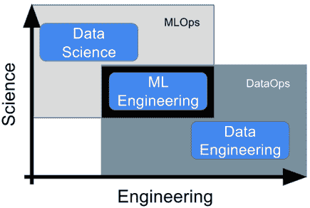
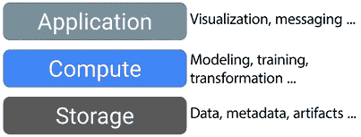
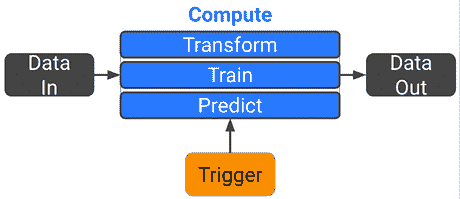
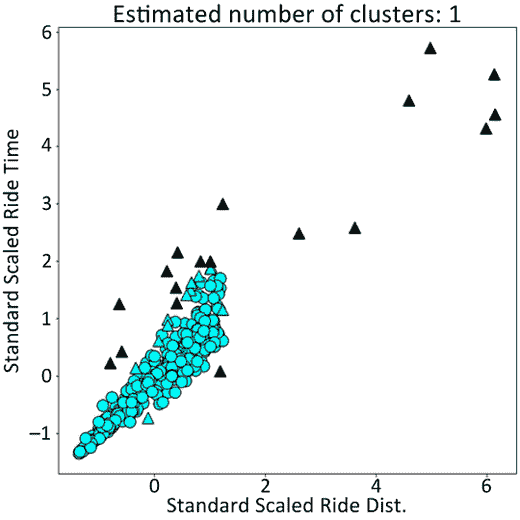
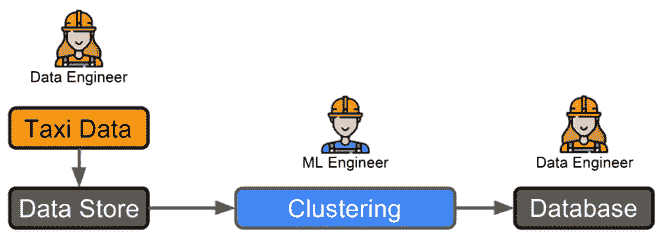
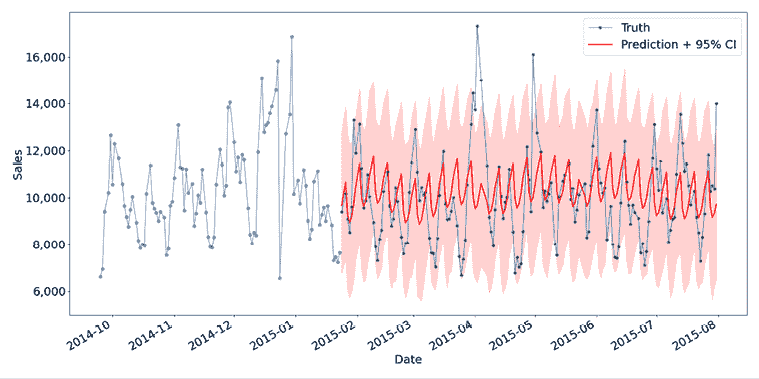
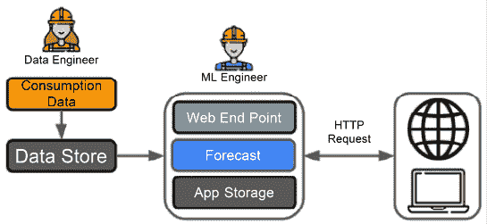
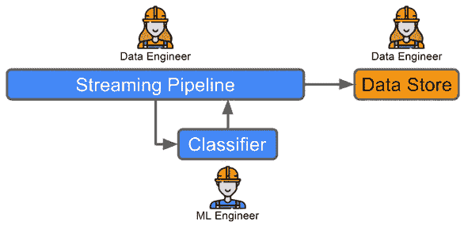

# 1

# 机器学习工程导论

欢迎来到《Python 机器学习工程》的第二版，这是一本旨在向您介绍制作**机器学习**（**ML**）系统生产就绪的激动人心的世界的书籍。

自本书第一版发布以来，ML 的世界已经发生了显著的变化。现在有更多更强大的建模技术可用，更复杂的技术堆栈，以及一大堆新的框架和范式来保持更新。为了帮助从噪音中提取信号，本书的第二版比第一版更深入地涵盖了更广泛的主题，同时仍然关注您构建 ML 工程专业知识所需的关键工具和技术。本版将涵盖相同的核心主题，例如如何管理您的 ML 项目，如何创建您自己的高质量 Python ML 包，以及如何构建和部署可重用的训练和监控管道，同时增加对更现代工具的讨论。它还将更深入地展示和分析不同的部署架构，并讨论更多使用 AWS 和云无关工具扩展应用程序的方法。所有这些都将使用各种最受欢迎和最新的开源包和框架来完成，从经典如**Scikit-Learn**和**Apache Spark**到**Kubeflow**、**Ray**和**ZenML**。令人兴奋的是，本版还设有全新的章节，完全致力于**Transformer**和**大型语言模型**（**LLM**）如 ChatGPT 和 GPT-4，包括使用 Hugging Face 和 OpenAI API 进行微调和构建使用这些非凡新模型的管道的示例。与第一版一样，重点是为您提供进入 ML 工程各个组成部分的坚实基础。目标是到本书结束时，您将能够自信地使用这些最新的工具和概念在 Python 中构建、扩展和部署生产级的 ML 系统。

即使您不运行技术示例，或者尝试在其他编程语言或使用不同工具中应用主要观点，您也能从这本书中获得很多。正如之前提到的，目标是创建一个坚实的概念基础，您可以在此基础上构建。在介绍关键原则时，目标是让您在阅读完这本书后，在应对自己选择的工具集的 ML 工程挑战时更有信心。

在本章的第一部分，您将了解与机器学习工程相关的不同类型的数据角色以及它们为什么很重要，如何利用这些知识来构建和参与适当的团队，在现实世界中构建工作 ML 产品时需要记住的一些关键点，如何开始隔离适合工程 ML 解决方案的问题，以及如何为各种典型的商业问题创建您自己的高级 ML 系统设计。

我们将在以下章节中涵盖这些主题：

+   定义数据学科的分类

+   组建您的团队

+   真实世界中的机器学习工程

+   机器学习解决方案看起来是什么样子？

+   高级机器学习系统设计

现在我们已经解释了在本章中我们要追求的内容，让我们开始吧！

# 技术要求

在整本书中，所有代码示例都将假设使用 Python 3.10.8，除非另有说明。本版中的示例已在配备 M2 苹果硅芯片的 2022 Macbook Pro 上运行，并安装了 Rosetta 2 以允许与基于 Intel 的应用程序和包向后兼容。大多数示例也已在运行 Ubuntu 22.04 LTS 的 Linux 机器上测试过。每章所需的 Python 包存储在书籍 Git 仓库中相应章节文件夹的`.yml`文件中的`conda`环境中。我们将在本书的后面部分详细讨论包和环境管理。但在此期间，假设您有一个 GitHub 账户并且已经配置了环境以从 GitHub 远程仓库中拉取和推送，要开始，您可以从命令行克隆本书的仓库：

```py
git clone https://github.com/PacktPublishing/Machine-Learning-Engineering-with-Python-Second-Edition.git 
```

假设您已经安装了 Anaconda 或 Miniconda，然后您可以导航到本书 Git 仓库中的*Chapter01*文件夹并运行：

```py
conda env create –f mlewp-chapter01.yml 
```

这将设置您可以使用它来运行本章中给出的示例的环境。对于每个章节，可以遵循类似的程序，但每个部分也会指出针对这些示例的特定安装要求。

现在我们已经完成了一些设置，我们将开始探索机器学习工程的世界以及它如何适应现代数据生态系统。让我们开始探索机器学习工程的世界吧！

注意：在运行本节中给出的`conda`命令之前，您可能需要手动安装特定的库。一些版本的 Facebook Prophet 库需要可以构建在运行苹果硅的 Macbook 上的 PyStan 版本。如果您遇到此问题，那么您应该尝试手动安装`httpstan`包。首先，访问[`github.com/stan-dev/httpstan/tags`](https://github.com/stan-dev/httpstan/tags)并选择要安装的包版本。下载该版本的`tar.gz`或`.zip`文件并解压。然后您可以导航到解压后的文件夹并运行以下命令：

```py
make
python3 -m pip install poetry
python3 -m poetry build
python3 -m pip install dist/*.whl 
```

在后续示例中调用`model.fit()`时，您可能会遇到以下错误：

```py
dyld[29330]: Library not loaded: '@rpath/libtbb.dylib' 
```

如果是这样，您将需要运行以下命令，用 Conda 环境中 Prophet 安装的正确路径替换：

```py
cd /opt/homebrew/Caskroom/miniforge/base/envs/mlewp-chapter01/lib/python3.10/site-packages/prophet/stan_model/
install_name_tool -add_rpath @executable_path/cmdstan-2.26.1/stan/lib/stan_math/lib/tbb prophet_model.bin 
```

哦，在苹果硅上做机器学习的乐趣！

# 定义数据学科的分类

近年来数据的爆炸式增长及其潜在应用导致了众多职位和职责的激增。曾经关于数据科学家与统计学家之间区别的争论现在变得极其复杂。然而，我认为这并不一定那么复杂。从数据中获得价值所需进行的活动在各个业务领域都是相当一致的，因此，合理地预期执行这些步骤所需的技能和角色也将相对一致。在本章中，我们将探讨一些我认为在任何数据项目中始终需要的核心数据学科。正如你可以猜到的，鉴于本书的名称，我将特别热衷于探讨*机器学习工程*的概念以及它是如何融入其中的。

现在让我们来看看在现代数据环境中使用数据的一些相关角色。

## 数据科学家

在《哈佛商业评论》宣布成为数据科学家是*21 世纪最性感的工作*（[`hbr.org/2012/10/data-scientist-the-sexiest-job-of-the-21st-century`](https://hbr.org/2012/10/data-scientist-the-sexiest-job-of-the-21st-century)）之后，这个职位成为最受欢迎、但也最被炒作的职位之一。其受欢迎程度仍然很高，但将高级分析和机器学习投入生产所面临的挑战意味着数据驱动型组织内部工程角色的转变越来越多。传统的数据科学家角色可以根据业务领域、组织或仅仅是个人偏好涵盖整个范围的任务、技能和责任。然而，无论这个角色如何定义，一些关键的关注领域始终应该是数据科学家工作档案的一部分：

+   **分析**：数据科学家应该能够在进行数据分析之前，整理、处理、操作和整合数据集。*分析*是一个广泛的概念，但很明显，最终的结果是你对数据集的了解，这是你在开始之前所没有的，无论这个数据集是基本还是复杂。

+   **建模**：让每个人都兴奋（可能包括亲爱的读者）的是，在数据中建模现象的想法。数据科学家通常必须能够将统计、数学和机器学习技术应用于数据，以解释其中包含的过程或关系，并执行某种预测。

+   **与客户或用户合作**：数据科学家的角色通常包含更多面向商业的元素，以便前两个点的结果可以支持组织内的决策。这可能通过在 PowerPoint 演示文稿或 Jupyter 笔记本中展示分析结果，或者甚至通过发送包含关键结果摘要的电子邮件来完成。这涉及到沟通和商业洞察力，这在经典的技术角色中是超越的。

## 机器学习工程师

在创建机器学习概念验证和构建健壮软件之间的差距，我经常在演讲中提到的“鸿沟”，导致了现在我认为技术领域最重要的角色之一的出现。机器学习工程师满足了将数据科学建模和探索的世界转化为软件产品和系统工程世界的迫切需求。由于这并非易事，机器学习工程师的需求日益增加，现在已成为数据驱动型软件价值链的关键部分。如果你不能将事物投入生产，你就不会产生价值，如果你不产生价值，那么我们都知道那不是一件好事！

通过考虑一个经典的语音助手，你可以很好地阐述这种角色的需求。在这种情况下，数据科学家通常会专注于将业务需求转化为一个可工作的*语音到文本*模型，可能是一个非常复杂的神经网络，并证明它可以在原则上执行所需的语音转录任务。然后，机器学习工程就是如何将这个语音到文本模型构建成一个可以在生产中使用的软件、服务或工具。在这里，这可能意味着构建一些软件来训练、重新训练、部署和跟踪模型的性能，随着转录数据的积累或用户偏好的理解。这也可能涉及到了解如何与其他系统接口并提供模型结果的适当格式。例如，模型的结果可能需要打包成一个 JSON 对象，并通过 REST API 调用发送到在线超市，以完成订单。

数据科学家和机器学习工程师有很多重叠的技能集和能力，但有不同的关注领域和优势（稍后详述），因此他们通常会是同一个项目团队的一部分，并且可能会有任一职位，但根据他们在项目中的表现，可以清楚地知道他们扮演的角色。

与数据科学家类似，我们可以定义机器学习工程师的关键关注领域：

+   **翻译**：将各种格式的模型和研究代码转化为更流畅、更健壮的代码片段。

    这可以通过面向对象编程、函数式编程、混合编程或其他方式来完成，但基本上它有助于将数据科学家的*概念验证*工作转化为在生产环境中更值得信赖的东西。

+   **架构**：任何软件组件的部署都不会在真空中进行，总会涉及大量的集成部分。这一点在机器学习解决方案中同样适用。机器学习工程师必须理解适当的工具和流程是如何相互关联的，以便使用数据科学家构建的模型能够完成其工作，并在规模上实现。

+   **生产化**：机器学习工程师专注于交付解决方案，因此应该彻底理解客户的需求，以及能够理解这对项目开发意味着什么。机器学习工程师的最终目标不仅仅是提供一个好的模型（尽管这也是其中的一部分），也不是提供一个基本上能工作的东西。他们的工作是确保在现实世界的环境中，数据科学方面的辛勤工作能够产生最大的潜在价值。

## 机器学习运维工程师

机器学习工程将是本书的重点，但现在正在出现一个重要的角色，其目的是使机器学习工程师能够以更高的质量、更快的速度和更大的规模开展工作。这些是**机器学习运维工程师**（**MLOps**）。这个角色主要是关于构建工具和能力，以使机器学习工程师和数据科学家能够完成任务。这个角色更侧重于构建其他角色使用的工具、平台和自动化，因此它们之间有很好的联系。这并不是说 MLOps 工程师不会在特定的项目或构建中使用；只是他们的主要增值不是来自这里，而是来自在特定项目或构建中启用的能力。如果我们回顾一下在*机器学习工程师*部分描述的语音到文本解决方案的例子，我们就能感受到这一点。当机器学习工程师会担心构建一个在生产环境中无缝工作的解决方案时，MLOps 工程师会努力构建机器学习工程师使用的平台或工具集。机器学习工程师会构建管道，但 MLOps 工程师可能会构建管道模板；机器学习工程师可能会使用**持续集成/持续部署**（**CI/CD**）实践（关于这一点稍后会有更多介绍），但 MLOps 工程师将启用这种能力并定义最佳实践，以便顺利使用 CI/CD。最后，当机器学习工程师思考“我如何使用适当的工具和技术稳健地解决这个具体问题？”时，MLOps 工程师会问“我如何确保机器学习工程师和数据科学家能够一般性地解决他们需要解决的问题，以及我如何不断更新和改进这个设置？”

正如我们对数据科学家和机器学习工程师所做的那样，让我们定义 MLOps 工程师的一些关键关注领域：

+   **自动化**：通过使用 CI/CD 和**基础设施即代码**（**IAC**）等技术提高数据科学和机器学习工程工作流程的自动化水平。预包装软件可以部署，以通过这些能力以及更多功能（如自动化脚本或标准化模板）实现更平滑的解决方案部署。

+   **平台工程**：致力于将一系列有用的服务整合在一起，以构建不同数据驱动团队使用的机器学习平台。这可以包括开发跨编排工具、计算和更多数据驱动服务的集成，直到它们成为机器学习工程师和数据科学家可以使用的整体。

+   **启用关键 MLOps 功能**：MLOps 包括一系列实践和技术，使团队中的其他工程师能够生产化机器学习模型。模型管理和模型监控等能力应由 MLOps 工程师以可跨多个项目规模使用的方式启用。

应注意，本书中涵盖的一些主题可以由 MLOps 工程师执行，并且自然存在一些重叠。这不应让我们过于担忧，因为 MLOps 基于相当通用的实践和能力集，可以被多个角色所包含（参见*图 1.1*）。

## 数据工程师

数据工程师是那些负责以高保真度、适当的延迟，以及尽可能减少其他团队成员努力的情况下，将前述章节中所有基于 A 到 B 的商品获取到的人。没有数据，你无法创建任何类型的软件产品，更不用说机器学习产品了。

数据工程师的关键关注领域如下：

+   **质量**：如果数据混乱、字段缺失或 ID 出错，从 A 到 B 的数据传输就毫无意义。数据工程师关心避免这种情况，并使用各种技术和工具，通常是为了确保离开源系统的数据是你数据存储层中到达的数据。

+   **稳定性**：与质量方面的前一点类似，如果数据从 A 到 B，但只有在非雨天且是每周三的第二天才到达，那么这有什么意义呢？

    数据工程师投入大量时间和精力，并运用他们丰富的技能来确保数据管道健壮、可靠，并能够在承诺的时间内交付。

+   **访问**：最后，从 A 到 B 获取数据的目标是使其被应用程序、分析和机器学习模型使用，因此 B 的性质很重要。数据工程师将手头有多种技术来展示数据，并且应该与数据消费者（包括我们的数据科学家和机器学习工程师等）合作，在这些解决方案中定义和创建适当的数据模型：



图 1.1：一个显示数据科学、机器学习工程和数据工程之间关系的图表。

如前所述，这本书主要关注机器学习工程师的工作以及你可以学习一些对这个角色有用的技能，但重要的是要记住，你不会在真空中工作。始终牢记其他角色的特征（以及在你项目团队中可能存在的许多其他未涵盖的角色），这样你才能最有效地共同工作。毕竟，数据科学是一项团队运动！

现在你已经了解了现代数据团队中的关键角色以及他们如何覆盖构建成功机器学习产品所需的活动范围，让我们看看你如何将它们组合起来以高效有效地工作。

# 作为有效团队的一员工作

在现代软件组织中，有许多不同的方法来组织团队并使他们有效地一起工作。我们将在第二章“机器学习开发过程”中介绍一些相关的项目管理方法，但在此期间，本节将讨论一些如果你参与组建团队或只是作为团队的一部分工作，你应该考虑的重要观点，这将帮助你成为一个有效的团队成员或领导者。

首先，始终牢记*没有人能做所有的事情*。你可以在那里找到一些非常有才华的人，但永远不要认为一个人能做你需要的一切，达到你所要求的水平。这不仅不切实际，而且是不良的做法，会负面影响你产品的质量。即使你在资源严重受限的情况下，关键也是让你的团队成员保持激光般的专注以取得成功。

其次，*混合是最好的选择*。我们都知道多样性对于组织和团队的一般好处，当然，这也应该适用于你的机器学习团队。在一个项目中，你需要数学、代码、工程、项目管理、沟通以及各种其他技能来取得成功。所以，根据前面的观点，确保你在团队中至少在一定程度上涵盖这些技能。

第三，*以动态的方式将你的团队结构与项目联系起来*。如果你参与的项目主要是关于将数据放在正确的位置，而实际的机器学习模型非常简单，那么将你的团队特征集中在工程和数据建模方面。如果项目需要详细了解模型，并且它相当复杂，那么重新定位你的团队以确保这一点得到覆盖。这既合理又能够释放那些本可以未充分利用的团队成员去从事其他项目。

例如，假设你被分配了一个任务，即构建一个系统，用于在数据进入你那光鲜亮丽的新数据湖时对客户数据进行分类，并且已经决定通过流式应用程序在数据摄入点进行这一操作。分类已经为另一个项目构建好了。很明显，这个解决方案将大量涉及数据工程师和机器学习工程师的技能，但不会太多涉及数据科学家，因为这部分工作已经在另一个项目中完成了。

在下一节中，我们将探讨在将你的团队部署到现实世界的商业问题时需要考虑的一些重要点。

# 现实世界的机器学习工程

我们中的大多数人在机器学习、分析和相关学科工作，这些工作是在具有各种不同结构和动机的组织中进行的。这些可能是盈利性公司、非盈利组织、慈善机构，或者是政府或大学等公共部门组织。在几乎所有这些情况下，我们都不是在真空中工作，也没有无限的预算或资源。因此，考虑在*现实世界*中做这类工作的一些重要方面是很重要的。

首先，你工作的最终目标是创造**价值**。这可以通过各种方式计算和定义，但本质上你的工作必须以某种方式改善公司或其客户，从而证明所投入的投资是合理的。这就是为什么大多数公司不会高兴地看到你花一年的时间去玩新工具，然后什么具体成果都没有，或者整天只阅读最新的论文。是的，这些事情是任何技术工作的一部分，它们肯定可以非常有趣，但你必须战略性地考虑如何分配你的时间，并且始终意识到你的价值主张。

其次，要成为现实世界中的成功机器学习工程师，你不仅需要理解技术，还必须理解*业务*。你必须了解公司日常是如何运作的，你必须了解公司的不同部分是如何相互配合的，你必须了解公司的人和他们的角色。最重要的是，你必须理解*客户*，包括业务和你的工作。如果你不知道你为谁构建的人的动机、痛苦和需求，那么你怎么能期望构建正确的东西呢？

最后，这可能有些争议，但你在现实世界中成为一名成功的机器学习工程师最重要的技能是这本书不会教给你的，那就是有效沟通的能力。你将不得不与团队一起工作，与经理、更广泛的社区和商业界，当然还有上述提到的客户一起工作。如果你能这样做，并且你了解技术和技巧（其中许多在本书中讨论过），那么还有什么能阻止你呢？

但在现实世界中，你可以用 ML 解决哪些类型的问题呢？好吧，让我们从一个可能具有争议性的声明开始：*很多时候，ML 并不是答案*。鉴于这本书的标题，这可能会显得有些奇怪，但了解何时不应用 ML 与了解何时应用 ML 同样重要。这将节省你大量的昂贵开发和资源时间。

当你想更快、更精确地完成半常规任务，或者在其他解决方案无法达到的更大规模上完成任务时，ML 是理想的。

在下表中给出了几个典型的例子，并讨论了机器学习（ML）是否是解决该问题的合适工具：

| **需求** | **ML 是否合适？** | **详情** |
| --- | --- | --- |
| 能源定价信号的异常检测。 | 合适 | 你可能需要在大量可能随时间信号变化的点上执行此操作。 |
| 在 ERP 系统中提高数据质量。 | 不合适 | 这听起来更像是一个流程问题。你可以尝试应用 ML，但通常最好是使数据录入过程更加自动化或使流程更加稳健。 |
| 预测仓库物品消耗。 | 合适 | ML 将能够比人类更准确地完成这项工作，因此这是一个很好的应用领域。 |
| 为商业审查总结数据。 | 可能 | 这可能需要大规模执行，但这不是一个 ML 问题——简单的数据查询就可以完成。 |

表 1.1：ML 的潜在应用案例。

如此简单的例子表（希望）开始清楚地表明，ML 确实是答案的情况通常是那些可以很好地被构建为数学或统计问题的情况。毕竟，这就是 ML 的本质——一系列基于数学的算法，可以根据数据迭代一些内部参数。在现代世界中，随着深度学习或强化学习等领域的发展，我们之前认为很难为标准 ML 算法适当表述的问题现在可以解决。

在现实世界中需要警惕的另一个趋势（与*让我们用 ML 做一切*的趋势相伴随）是人们对 ML 会抢走他们的工作以及不应信任 ML 的担忧。这是可以理解的：普华永道（PwC）2018 年的一份报告建议，到 2030 年代，30%的英国工作将受到自动化的影响（[机器人真的会偷走我们的工作吗？](https://www.pwc.co.uk/economic-services/assets/international-impact-of-automation-feb-2018.pdf)）。在与同事和客户合作时，你必须努力阐明你正在构建的是为了补充和增强他们的能力，而不是取代他们。

让我们通过回顾一个重要观点来结束本节：你为一家公司工作的事实，当然意味着游戏的目标是创造与投资相称的价值。换句话说，你需要展示良好的**投资回报率**（**ROI**）。这对你实际上意味着几件事：

+   你必须了解不同的设计需要不同水平的投资。如果你可以通过在一个月内用 GPU 全天候训练一百万张图片来解决你的问题，或者你知道你可以在几小时内使用一些基本的聚类和一些标准硬件上的少量统计来解决相同的问题，你应该选择哪一个？

+   你必须清楚你将产生的*价值*。这意味着你需要与专家合作，并尝试将你的算法结果转化为实际美元价值。这比听起来要困难得多，所以你需要花时间去正确完成它。而且，永远不要过度承诺。*你应该总是承诺少一些，交付多一些*。

采用并不保证。即使是在公司内部为同事构建产品，你也必须明白，你的解决方案每次在使用后都会被测试。如果你构建的是质量低劣的解决方案，那么人们就不会使用它们，你所做的一切的价值主张也将开始消失。

现在你已经了解了使用机器学习解决商业问题时的一些重要要点，让我们来探讨这些解决方案可能是什么样子。

# 机器学习解决方案是什么样的？

当你想到机器学习工程时，你可能会默认想象在语音助手和视觉识别应用程序上工作（我在前面的页面上也陷入了这种陷阱——你注意到了吗？）。然而，机器学习的力量在于，只要有数据和合适的问题，它就能帮助并成为解决方案的关键部分。

一些例子可能有助于使这一点更清晰。当你输入一条短信，你的手机建议下一个单词时，它很可能是在使用底下的自然语言模型。当你滚动任何社交媒体信息流或观看流媒体服务时，推荐算法正在加倍工作。如果你开车旅行，一个应用程序预测你何时可能到达目的地，那么将会有某种回归在工作。你的贷款申请通常会导致你的特征和申请细节通过一个分类器。这些应用不是新闻中大声宣扬的（也许除了它们出问题时），但它们都是精心设计的机器学习工程的例子。

在这本书中，我们将要处理的例子将更像是这些——在产品和业务中每天都会遇到的典型机器学习场景。这些是如果你能自信地构建它们，将使你成为任何组织的宝贵资产。

我们应该从考虑任何机器学习解决方案应包含的广泛元素开始，如下面的图所示：



图 1.2：任何机器学习解决方案的一般组件或层及其负责的内容。

您的**存储层**构成了数据工程过程的终点和机器学习过程的起点。它包括您的训练数据、运行模型的结果、您的工件和重要的元数据。我们还可以将这一层视为包括您存储的代码。

**计算层**是发生“魔法”的地方，也是本书大部分关注的焦点。这是训练、测试、预测和转换（主要是）发生的地方。本书的宗旨是使这一层尽可能工程化，并与其他层进行接口。

你可以将这一层分解为以下工作流程中所示的部分：



图 1.3：计算层的关键元素。

重要提示

详细内容将在本书的后续部分讨论，但这一点强调了这样一个事实：在基本层面上，任何机器学习解决方案的计算过程实际上只是关于接收一些数据并输出一些数据。

**应用层**是您与其他系统共享机器学习解决方案结果的地方。这可能包括从应用程序数据库插入到 API 端点、消息队列或可视化工具等。这是您的客户最终使用结果的地方，因此您必须设计系统以提供干净、易于理解的输出，我们将在稍后讨论这一点。

简而言之，就是这样。我们将在稍后详细讨论所有这些层和点，但现在，只需记住这些广泛的概念，你就会开始理解所有详细的技术部件是如何结合在一起的。

## 为什么选择 Python？

在深入探讨更详细的主题之前，讨论为什么选择 Python 作为本书的编程语言是很重要的。以下所有涉及高级主题的内容，如架构和系统设计，都可以应用于使用任何或多种语言的解决方案，但 Python 在这里被单独提出，有以下几个原因。

Python 通常被称为数据的“通用语言”。它是一种非编译的、非强类型的、多范式的编程语言，具有清晰简单的语法。其工具生态系统也非常广泛，尤其是在分析和机器学习领域。

如 scikit-learn、numpy、scipy 以及许多其他软件包构成了全球大量技术和科学发展的基础。几乎每个用于数据世界的重大新软件库都有一个 Python API。根据写作时的**TIOBE 指数**（[`www.tiobe.com/tiobe-index/`](https://www.tiobe.com/tiobe-index/)），Python 是世界上最受欢迎的编程语言（2023 年 8 月）。

因此，能够使用 Python 构建你的系统意味着你将能够利用这个生态系统中的所有优秀的机器学习和数据科学工具，同时确保你构建的应用程序可以与其他软件良好地协同工作。

# 高级机器学习系统设计

当你深入到构建解决方案的细节时，工具、技术和方法的选择如此之多，以至于很容易感到不知所措。然而，正如前几节所暗示的，很多这种复杂性可以通过一些**信封背面**的架构和设计来抽象化，从而理解更大的图景。一旦你知道你将尝试解决的问题，这总是一个有用的练习，而且我建议你在做出任何关于实施的详细选择之前就做这件事。

为了让你了解这在实践中是如何工作的，以下是一些经过详细分析的例子，其中一支团队必须为一些典型的商业问题创建一个高级机器学习系统设计。这些问题与我之前遇到的问题相似，也可能会与你自己在工作中遇到的问题相似。

## 示例 1：批量异常检测服务

你为一家技术娴熟的出租车公司工作，该公司拥有数千辆汽车。该组织希望开始使行程时间更加一致，并了解更长的旅程，以便改善客户体验，从而提高客户保留率和回头客。你的机器学习团队被雇佣来创建一个异常检测服务，以寻找具有不寻常的行程时间或行程长度行为的行程。你们开始工作，数据科学家发现，如果你使用行程距离和时间特征对行程集进行聚类，你可以清楚地识别出值得运营团队调查的异常值。数据科学家在获得批准将此开发成一项服务之前，向 CTO 和其他利益相关者展示了研究结果，该服务将在公司内部分析工具的主要表中提供一个新字段，作为异常标志。

在这个例子中，我们将模拟一些数据，以展示出租车公司的数据科学家如何进行。在本书的存储库中，该存储库可以在[`github.com/PacktPublishing/Machine-Learning-Engineering-with-Python-Second-Edition`](https://github.com/PacktPublishing/Machine-Learning-Engineering-with-Python-Second-Edition)找到，如果你导航到*Chapter01*文件夹，你会看到一个名为`clustering_example.py`的脚本。如果你已经通过`mlewp-chapter01.yml`环境文件激活了提供的`conda`环境，那么你可以使用以下命令运行此脚本：

```py
python3 clustering_example.py 
```

运行成功后，你应该会看到创建了三个文件：`taxi-rides.csv`、`taxi-labels.json`和`taxi-rides.png`。`taxi-rides.png`中的图像应该类似于图 1.4 中所示。

我们将逐步说明这个脚本是如何构建的：

1.  首先，让我们定义一个函数，该函数将根据`numpy`中给出的随机分布模拟一些行程距离，并返回一个包含结果的`numpy`数组。重复行的原因是为了在数据中创建一些基本行为和异常，并且你可以清楚地与我们在下一步将为每辆出租车集合生成的速度进行比较：

    ```py
    import numpy as np
    from numpy.random import MT19937
    from numpy.random import RandomState, SeedSequence
    rs = RandomState(MT19937(SeedSequence(123456789)))

    # Define simulate ride data function
    def simulate_ride_distances():
        ride_dists = np.concatenate(
            (
                10 * np.random.random(size=370),
                30 * np.random.random(size=10), # long distances
                10 * np.random.random(size=10), # same distance
                10 * np.random.random(size=10) # same distance
            )
        )
        return ride_dists 
    ```

1.  我们现在可以对速度做完全相同的事情，并且再次将出租车分成`370`、`10`、`10`和`10`的集合，这样我们就可以创建一些具有“典型”行为的数据和一些异常集合，同时允许与`distances`函数的值进行清晰的匹配：

    ```py
    def simulate_ride_speeds():
        ride_speeds = np.concatenate(
            (
                np.random.normal(loc=30, scale=5, size=370),
                np.random.normal(loc=30, scale=5, size=10),
                np.random.normal(loc=50, scale=10, size=10),
                np.random.normal(loc=15, scale=4, size=10) 
            )
        )
        return ride_speeds 
    ```

1.  我们现在可以在一个函数内部使用这两个辅助函数，该函数将调用它们并将它们组合起来，以创建包含行程 ID、速度、距离和时间的模拟数据集。结果以`pandas` DataFrame 的形式返回，用于建模：

    ```py
    def simulate_ride_data():
        # Simulate some ride data …
        ride_dists = simulate_ride_distances()
        ride_speeds = simulate_ride_speeds()
        ride_times = ride_dists/ride_speeds
        # Assemble into Data Frame
        df = pd.DataFrame(
            {
              'ride_dist': ride_dists,
              'ride_time': ride_times,
              'ride_speed': ride_speeds
            }
        )
        ride_ids = datetime.datetime.now().strftime("%Y%m%d") +\
                   df.index.astype(str)
        df['ride_id'] = ride_ids
        return df 
    ```

1.  现在，我们来到了数据科学家在其项目中产生的核心内容，这是一个简单的函数，它封装了一些`sklearn`代码，以返回一个包含聚类运行元数据和结果的字典。

    我们在这里包括相关的导入，以便于使用：

    ```py
    from sklearn.preprocessing import StandardScaler
    from sklearn.cluster import DBSCAN
    from sklearn import metrics 

    def cluster_and_label(data, create_and_show_plot=True):
        data = StandardScaler().fit_transform(data)
        db = DBSCAN(eps=0.3, min_samples=10).fit(data)
        # Find labels from the clustering
        core_samples_mask = np.zeros_like(db.labels_,dtype=bool)
        core_samples_mask[db.core_sample_indices_] = True
        labels = db.labels_
        # Number of clusters in labels, ignoring noise if present.
        n_clusters_ = len(set(labels)) -
                             (1 if -1 in labels else 0)
        n_noise_ = list(labels).count(-1)
        run_metadata = {
            'nClusters': n_clusters_,
            'nNoise': n_noise_,
            'silhouetteCoefficient':
             metrics.silhouette_score(data, labels),
            'labels': labels,
        }
        if create_and_show_plot:
            plot_cluster_results(data, labels, core_samples_mask,
                                 n_clusters_)
        else:
            pass
        return run_metadata 
    ```

    注意，*步骤 4*中的函数利用了以下所示的绘图实用函数：

    ```py
    import matplotlib.pyplot as plt

    def plot_cluster_results(data, labels, core_samples_mask,
                             n_clusters_):
        fig = plt.figure(figsize=(10, 10))
        # Black removed and is used for noise instead.
        unique_labels = set(labels)
        colors = [plt.cm.cool(each) for each in np.linspace(0, 1,
                  len(unique_labels))]
        for k, col in zip(unique_labels, colors):
            if k == -1:
                # Black used for noise.
                col = [0, 0, 0, 1]
            class_member_mask = (labels == k)
            xy = data[class_member_mask & core_samples_mask]
            plt.plot(xy[:, 0], xy[:, 1], 'o',
                     markerfacecolor=tuple(col),
                     markeredgecolor='k', markersize=14)
            xy = data[class_member_mask & ~core_samples_mask]
            plt.plot(xy[:, 0], xy[:, 1], '^',
                     markerfacecolor=tuple(col),
                     markeredgecolor='k', markersize=14)
        plt.xlabel('Standard Scaled Ride Dist.')
        plt.ylabel('Standard Scaled Ride Time')
        plt.title('Estimated number of clusters: %d' % n_clusters_)
        plt.savefig('taxi-rides.png') 
    ```

    最后，所有这些内容都在程序的入口点汇总，如下所示：

    ```py
    import logging
    logging.basicConfig()
    logging.getLogger().setLevel(logging.INFO)

    if __name__ == "__main__":
        import os
        # If data present, read it in
        file_path = 'taxi-rides.csv'
        if os.path.exists(file_path):
            df = pd.read_csv(file_path)
        else:
            logging.info('Simulating ride data')
            df = simulate_ride_data()
            df.to_csv(file_path, index=False)
        X = df[['ride_dist', 'ride_time']]

        logging.info('Clustering and labelling')
        results = cluster_and_label(X, create_and_show_plot=True)
        df['label'] = results['labels']

        logging.info('Outputting to json ...')
        df.to_json('taxi-labels.json', orient='records') 
    ```

此脚本运行后，会创建一个数据集，显示每个模拟的出租车行程及其聚类标签在`taxi-labels.json`中，以及模拟数据集在`taxi-rides.csv`中，以及显示聚类结果的`taxi-rides.png`，如图 1.4 所示。



图 1.4：对一些出租车行程数据进行聚类分析的结果示例集。

现在你已经有一个基本模型可以工作，你必须开始考虑如何将其纳入一个工程化的解决方案——你该如何做？

嗯，由于这里的解决方案将支持另一个团队进行更长时间的调查，因此不需要一个非常低延迟的解决方案。利益相关者同意，聚类的见解可以在每天结束时提供。与团队的数据科学部分合作，ML 工程师（由你领导）了解到，如果每天运行聚类，这将提供足够的数据来生成适当的聚类，但更频繁的运行可能会由于数据量较小而导致结果较差。因此，达成一致意见，采用每日批量处理流程。

下一个问题是如何安排这个运行？嗯，你需要一个编排层，这是一个工具或工具集，它将使你能够安排和管理预定义的工作。像 Apache Airflow 这样的工具可以做到这一点。

接下来你该做什么呢？嗯，你知道运行频率是每天一次，但数据量仍然非常高，因此利用分布式计算模式是有意义的。两个选项立刻浮现在脑海中，并且团队中存在这些技能，Apache Spark 和 Ray。为了尽可能减少对底层基础设施的耦合并最小化对代码重构的需求，你决定使用 Ray。你知道数据的最终消费者是一个 SQL 数据库中的表，因此你需要与数据库团队合作设计一个适当的结果交接方案。由于安全和可靠性方面的考虑，直接写入生产数据库不是一个好主意。因此，你同意使用云中的另一个数据库作为数据的中间暂存区域，主数据库可以在其每日构建中查询这些数据。

在这里可能看起来我们并没有进行任何技术性的工作，但实际上，你已经为你的项目完成了高级的系统设计。这本书的剩余部分将告诉你如何填补以下图表中的空白！



图 1.5：示例 1 工作流程。

现在让我们继续下一个例子！

## 示例 2：预测 API

在这个例子中，你为一家大型零售连锁企业的物流部门工作。为了最大化货物流通，公司希望帮助区域物流规划师在特别繁忙的时期提前做好准备，避免产品售罄。在与业务中的利益相关者和领域专家讨论后，一致认为规划师能够通过一个托管在网页上的仪表板动态请求和探索特定仓库项目的预测，这是最优的。这允许规划师在下单前了解可能的需求轮廓。

数据科学家再次表现出色，发现任何单个商店层面的数据都具有非常可预测的行为。他们决定使用 Facebook Prophet 库进行建模，以帮助加快训练多个不同模型的过程。在下面的示例中，我们将展示他们如何做到这一点，但我们不会花费时间优化模型以创建最佳的预测性能，因为这只是为了说明目的。

这个示例将使用 Kaggle API 来检索一系列不同零售店销售的示例数据集。在书库下的*Chapter01/forecasting*目录中有一个名为`forecasting_example.py`的脚本。如果您已经正确配置了 Python 环境，您可以在命令行使用以下命令运行此示例：

```py
python3 forecasting_example.py 
```

脚本首先下载数据集，对其进行转换，然后使用它来训练一个 Prophet 预测模型，在测试集上进行预测并保存绘图。如前所述，这只是为了说明目的，因此不会创建验证集或执行比 Prophet 库提供的默认参数更复杂的超参数调整。

为了帮助您了解这个示例是如何组合起来的，我们现在将分解脚本的不同组件。为了简洁起见，这里排除了纯粹用于绘图或记录的功能：

1.  如果我们查看脚本的主要部分，我们可以看到第一步都是关于读取数据集，如果它已经在正确的目录中，或者下载并读取它：

    ```py
    import pandas as pd

    if __name__ == "__main__":
        import os
        file_path = train.csv
        if os.path.exists(file_path):
            df = pd.read_csv(file_path)
        else:
            download_kaggle_dataset()
            df = pd.read_csv(file_path) 
    ```

1.  执行下载的函数使用了 Kaggle API，如下所示；您可以通过参考 Kaggle API 文档来确保正确设置（这需要一个 Kaggle 账户）：

    ```py
    import kaggle

    def download_kaggle_dataset( kaggle_dataset: str ="pratyushakar/
                                 rossmann-store-sales" ) -> None:
        api = kaggle.api
        kaggle.api.dataset_download_files(kaggle_dataset, path="./",
                                          unzip=True, quiet=False) 
    ```

1.  接下来，脚本调用了一个名为`prep_store_data`的函数来转换数据集。这个函数使用两个默认值调用，一个用于商店 ID，另一个指定我们只想看到商店开门时的数据。该函数的定义如下：

    ```py
    def prep_store_data(df: pd.DataFrame, 
                        store_id: int = 4, 
                        store_open: int = 1) -> pd.DataFrame:
        df['Date'] = pd.to_datetime(df['Date'])
        df.rename(columns= {'Date':'ds','Sales':'y'}, inplace=True)
        df_store = df[
            (df['Store'] == store_id) & 
            (df['Open'] == store_open)
            ].reset_index(drop=True)
        return df_store.sort_values('ds', ascending=True) 
    ```

1.  预测模型 Prophet 随后在数据的第一个 80%上训练，并对剩余的 20%数据进行预测。为了指导模型的优化，向模型提供了季节性参数：

    ```py
    seasonality = {
        'yearly': True,
        'weekly': True,
        'daily': False
    }
    predicted, df_train, df_test, train_index = train_predict(
        df = df,
        train_fraction = 0.8,
        seasonality=seasonality
    ) 
    ```

    `train_predict`方法的定义如下，您可以看到它封装了一些进一步的数据准备和 Prophet 包的主要调用：

    ```py
    def train_predict(df: pd.DataFrame, train_fraction: float, 
                      seasonality: dict) -> tuple[
                          pd.DataFrame,pd.DataFrame,pd.DataFrame, int]:
        train_index = int(train_fraction*df.shape[0])
        df_train = df.copy().iloc[0:train_index]
        df_test = df.copy().iloc[train_index:]
        model=Prophet(
            yearly_seasonality=seasonality['yearly'],
            weekly_seasonality=seasonality['weekly'],
            daily_seasonality=seasonality['daily'],
            interval_width = 0.95
        )
        model.fit(df_train)
        predicted = model.predict(df_test)
        return predicted, df_train, df_test, train_index 
    ```

1.  然后，最后，调用了一个实用绘图函数，当运行时将创建如*图 1.6*所示的输出。这显示了测试数据集预测的放大视图。由于上述讨论的简洁性，这里没有给出该函数的详细信息：

    ```py
    plot_forecast(df_train, df_test, predicted) 
    ```



图 1.6：预测商店销售。

这里有一个问题，那就是为每个商店实施上述预测模型，如果连锁店收集到足够的数据，很快就会导致数百甚至数千个模型。另一个问题是，公司使用的资源规划系统尚未覆盖所有商店，因此一些规划者希望检索与他们自己的商店相似的其他商店的预测。大家一致认为，如果用户喜欢探索他们认为与自己的数据相似的地区概况，那么他们仍然可以做出最佳决策。

考虑到这一点和客户对动态、即兴请求的要求，你很快就会排除完整的批量处理。这不会涵盖核心系统之外的地区的用例，也不会允许通过网站动态检索最新的预测，这将允许你部署在未来不同时间范围内进行预测的模型。这也意味着你可以节省计算资源，因为你不需要每天管理数千个预测的存储和更新，你的资源可以专注于模型训练。

因此，你决定，实际上，一个可以按需返回用户所需预测的端点的托管在网站上的 API 是最有意义的。为了提供高效的响应，你必须考虑典型用户会话中会发生什么。通过与仪表板的潜在用户进行工作坊，你很快就会意识到，尽管请求是动态的，但大多数规划者将专注于任何一次会话中特定感兴趣的项目。他们也不会查看很多地区。然后你决定，有一个缓存策略是有意义的，其中你将某些你认为可能常见的请求取出来，并在应用程序中缓存以供重用。

这意味着在用户做出第一次选择后，结果可以更快地返回，从而提供更好的用户体验。这导致了一个粗略的系统草图，如图 *1.7* 所示：



图 1.7：示例 2 工作流程。

接下来，让我们看看最后的例子。

## 示例 3：分类流程

在这个最后的例子中，你为一家基于网络的公司工作，该公司希望根据用户的用法模式对用户进行分类，作为不同类型广告的目标，以便更有效地定位营销支出。例如，如果用户使用网站的频率较低，我们可能想通过更激进的折扣来吸引他们。业务的关键要求之一是最终结果成为其他应用程序使用的数据存储中的数据的一部分。

根据这些要求，您的团队确定运行分类模型的管道是满足所有条件的简单解决方案。数据工程师将精力集中在构建数据摄取和数据存储基础设施上，而机器学习工程师则致力于封装数据科学团队在历史数据上训练的分类模型。数据科学家确定的基础算法在`sklearn`中实现，我们将在下面通过将其应用于与这个用例类似的市场数据集来处理它：

这个假设的例子与许多经典数据集相吻合，包括来自 UCI ML 存储库的银行营销数据集：[`archive.ics.uci.edu/ml/datasets/Bank+Marketing#`](https://archive.ics.uci.edu/ml/datasets/Bank+Marketing#)。与之前的例子一样，有一个可以从命令行运行的脚本，这次在*Chapter01/classifying*文件夹中，名为`classify_example.py`：

```py
python3 classify_example.py 
```

运行此脚本将读取下载的银行数据，重新平衡训练数据集，然后在随机网格搜索中对随机森林分类器执行超参数优化运行。与之前类似，我们将展示这些部分是如何工作的，以展示数据科学团队可能如何处理这个问题：

1.  脚本的主要部分包含所有相关步骤，这些步骤被巧妙地封装成我们将在接下来的几个步骤中剖析的方法：

    ```py
    if __name__ == "__main__":
        X_train, X_test, y_train, y_test = ingest_and_prep_data()
        X_balanced, y_balanced = rebalance_classes(X_train, y_train)
        rf_random = get_randomised_rf_cv(
                      random_grid=get_hyperparam_grid()
                      )
        rf_random.fit(X_balanced, y_balanced) 
    ```

1.  下面的`ingest_and_prep_data`函数，它假定`bank.csv`数据存储在当前文件夹中名为`bank_data`的目录中。它将数据读入一个`pandas` DataFrame，然后在数据上执行训练集-测试集分割，并对训练特征进行独热编码，最后返回所有训练和测试特征及目标。与其他示例一样，本书将解释这些概念和工具，尤其是在*第三章*，*从模型到模型工厂*中：

    ```py
    def ingest_and_prep_data(
            bank_dataset: str = 'bank_data/bank.csv'
            ) -> tuple[pd.DataFrame, pd.DataFrame, pd.DataFrame,
                       pd.DataFrame]:
        df = pd.read_csv('bank_data/bank.csv', delimiter=';',
                          decimal=',')

        feature_cols = ['job', 'marital', 'education', 'contact',
                        'housing', 'loan', 'default', 'day']
        X = df[feature_cols].copy()
        y = df['y'].apply(lambda x: 1 if x == 'yes' else 0).copy()
        X_train, X_test, y_train, y_test = train_test_split(X, y, test_
                                              size=0.2, random_state=42)
        enc = OneHotEncoder(handle_unknown='ignore')
        X_train = enc.fit_transform(X_train)
        return X_train, X_test, y_train, y_test 
    ```

1.  由于数据不平衡，我们需要使用过采样技术重新平衡训练数据。在这个例子中，我们将使用来自`imblearn`包的**合成少数过采样技术**（**SMOTE**）：

    ```py
    def rebalance_classes(X: pd.DataFrame, y: pd.DataFrame
                          ) -> tuple[pd.DataFrame, pd.DataFrame]:
        sm = SMOTE()
        X_balanced, y_balanced = sm.fit_resample(X, y)
        return X_balanced, y_balanced 
    ```

1.  现在我们将进入脚本的主体 ML 组件。我们将执行超参数搜索（关于这一点，将在*第三章*，*从模型到模型工厂*中详细介绍），因此我们必须定义一个搜索网格：

    ```py
    def get_hyperparam_grid() -> dict:
        n_estimators = [int(x) for x in np.linspace(start=200,
                        stop=2000, num=10)]
        max_features = ['auto', 'sqrt']
        max_depth = [int(x) for x in np.linspace(10, 110, num=11)]
        max_depth.append(None)
        min_samples_split = [2, 5, 10]
        min_samples_leaf = [1, 2, 4]
        bootstrap = [True, False]  # Create the random grid
        random_grid = {
            'n_estimators': n_estimators,
            'max_features': max_features,
            'max_depth': max_depth,
            'min_samples_split': min_samples_split,
            'min_samples_leaf': min_samples_leaf,
            'bootstrap': bootstrap
        }
        return random_grid 
    ```

1.  最后，这个超参数网格将被用于定义一个`RandomisedSearchCV`对象，它允许我们在超参数值上优化估计量（在这里，是一个`RandomForestClassifier`）：

    ```py
    def get_randomised_rf_cv(random_grid: dict) -> sklearn.model_
                                   selection._search.RandomizedSearchCV:
        rf = RandomForestClassifier()
        rf_random = RandomizedSearchCV(
            estimator=rf,
            param_distributions=random_grid,
            n_iter=100,
            cv=3,
            verbose=2,
            random_state=42,
            n_jobs=-1,
            scoring='f1'
        )
        return rf_random 
    ```

上面的例子突出了创建典型分类模型的基本组件，但作为工程师，我们必须问自己，“接下来是什么？”很明显，我们必须实际运行已经生成的模型进行预测，因此我们需要将其持久化并稍后读取。这与本章讨论的其他用例类似。在这里更具挑战性的是，工程师可能实际上会考虑不在批量或请求-响应场景中运行，而是在流式场景中运行。这意味着我们必须考虑新的技术，如**Apache Kafka**，它允许你发布和订阅“主题”，在这些“主题”中可以共享称为“事件”的数据包。不仅如此，我们还需要就如何使用机器学习模型以这种方式与数据交互做出决策，提出关于适当模型托管机制的疑问。还有关于你希望多频繁地重新训练你的算法以确保分类器不过时的微妙之处。在考虑延迟或监控模型在这种非常不同的环境中的性能问题之前，这些都是需要考虑的。正如你所看到的，这意味着机器学习工程师在这里的工作相当复杂。*图 1.8*将这些复杂性归纳为一个非常高级的图表，它将帮助你开始考虑如果你是这个项目的工程师，你需要构建的系统交互类型。

在这本书中，我们不会过多地详细讨论流式处理，但我们将详细讨论所有其他关键组件，这些组件将帮助你将这个示例构建成一个真正的解决方案。有关流式机器学习应用的更多详细信息，请参阅 Joose Korstanje 所著的《Python 流式数据处理机器学习》，Packt 出版社，2022 年。



图 1.8：示例 3 工作流程。

我们现在已经探讨了三种高级机器学习系统设计，并讨论了我们工作流程选择背后的理由。我们还详细探讨了数据科学家在建模过程中通常会产生的代码类型，但这些代码将作为未来机器学习工程工作的输入。因此，本节应该让我们对在典型项目中我们的工程工作从哪里开始以及我们旨在解决哪些类型的问题有了认识。就这样，你已经开始了成为机器学习工程师的道路！

# 摘要

在本章中，我们介绍了机器学习工程的概念以及它如何适应基于数据的现代团队构建有价值的解决方案。讨论了机器学习工程的重点如何与数据科学和数据工程的优点相辅相成，以及这些学科的重叠之处。还提出了一些关于如何利用这些信息为你的项目组建适当资源的团队的评论。

随后讨论了在现代现实世界中构建机器学习产品的挑战，并提供了帮助你克服这些挑战的指导。特别是，强调了合理评估价值和有效与利益相关者沟通的观念。

本章随后通过讨论典型机器学习解决方案的外观以及它们应该如何设计（在高级别）来应对一些常见用例，为后续章节即将介绍的技术内容做了简要介绍。

在我们深入本书的其余部分之前，这些主题很重要，因为它们将帮助你理解为什么机器学习工程是一门如此关键的学科，以及它是如何与以数据为中心的团队和组织的复杂生态系统联系起来的。这也有助于让你了解机器学习工程所涵盖的复杂挑战，同时为你提供一些概念工具，以开始对这些挑战进行推理。我的希望是，这不仅激励你参与本版其余部分的材料，而且还能让你走上探索和自学之路，这对于成为一名成功的机器学习工程师是必需的。

下一章将重点介绍如何设置和实施你的开发流程来构建你想要的机器学习解决方案，并提供一些见解，说明这与标准软件开发流程有何不同。然后，将讨论一些你可以使用的工具，以开始管理你的项目任务和工件，而不会造成重大头痛。这将为你准备在后续章节中构建你的机器学习解决方案关键元素的技术细节。

# 加入我们的 Discord 社区

加入我们社区的 Discord 空间，与作者和其他读者进行讨论：

[`packt.link/mle`](https://packt.link/mle)


