# 2

# 机器学习开发过程

在本章中，我们将定义如何将任何成功的**机器学习**（**ML**）软件工程项目的工作进行划分。基本上，我们将回答您如何*实际上组织一个成功的 ML 项目*的问题。我们不仅将讨论流程和工作流程，还将为流程的每个阶段设置所需的工具，并通过真实的 ML 代码示例突出一些重要的最佳实践。

在这一版中，我们将更详细地介绍一个重要的数据科学和机器学习项目管理方法：**跨行业标准数据挖掘流程**（**CRISP-DM**）。这包括讨论这种方法与传统敏捷和瀑布方法的比较，并提供一些将此方法应用于您的机器学习项目的技巧和窍门。还有更多详细的示例，帮助您使用 GitHub Actions 开始**持续集成/持续部署**（**CI/CD**），包括如何运行专注于机器学习的流程，如自动模型验证。关于在**交互式开发环境**（**IDE**）中启动的建议也已经变得更加工具无关，以便使用任何合适的 IDE。与之前一样，本章将重点介绍我提出的“四步”方法，该方法涵盖了您的机器学习项目的*发现、玩耍、开发、部署*工作流程。这个项目工作流程将与在数据科学领域非常流行的 CRISP-DM 方法进行比较。我们还将讨论适当的发展工具及其配置和集成，以确保项目成功。我们还将涵盖版本控制策略及其基本实施，以及为您的机器学习项目设置 CI/CD。然后，我们将介绍一些潜在的执行环境，作为您的机器学习解决方案的目标目的地。到本章结束时，您将为您的 Python 机器学习工程项目成功做好准备。这是我们将在后续章节中构建一切的基础。

如往常一样，我们将通过总结本章的主要观点并强调在阅读本书其余部分时这些观点的意义来结束本章。

最后，值得注意的是，尽管我们在这里将讨论框架定为 ML 挑战，但本章中您将学到的许多内容也可以应用于其他 Python 软件工程项目。我的希望是，在详细构建这些基础概念的投资将能够让您在所有工作中反复利用。

我们将在以下章节和子章节中探讨所有这些内容：

+   设置我们的工具

+   从概念到解决方案的四个步骤：

    +   发现

    +   玩耍

    +   开发

    +   部署

有许多令人兴奋的内容需要消化和很多知识需要学习——让我们开始吧！

# 技术要求

如同 *第一章*，*机器学习工程简介* 中所述，如果您想运行这里提供的示例，您可以使用本书 GitHub 仓库 `Chapter02` 文件夹中提供的环境 YAML 文件创建一个 Conda 环境：

```py
conda env create –f mlewp-chapter02.yml 
```

此外，本章中的许多示例将需要使用以下软件和包。这些也将为你在本书其他部分的示例提供良好的基础：

+   Anaconda

+   PyCharm Community Edition，VS Code 或其他兼容 Python 的 IDE

+   Git

您还需要以下内容：

+   一个 Atlassian Jira 账户。我们将在本章后面进一步讨论这个问题，但您可以在[`www.atlassian.com/software/jira/free`](https://www.atlassian.com/software/jira/free)免费注册一个账户。

+   一个 AWS 账户。这将在本章中讨论，但您可以在[`aws.amazon.com/`](https://aws.amazon.com/)注册一个账户。注册 AWS 需要添加付款详情，但本书中我们将只使用免费层解决方案。

本章中的技术步骤都在运行 Ubuntu 22.04 LTS 的 Linux 机器上进行了测试，该机器有一个具有管理员权限的用户配置文件，以及一个按照 *第一章*，*机器学习工程简介* 中描述的设置运行的 Macbook Pro M2。如果您在运行不同系统上的步骤时，如果步骤没有按预期工作，您可能需要查阅该特定工具的文档。即使如此，大多数步骤对于大多数系统来说都将相同或非常相似。您还可以在本书的 GitHub 仓库[`github.com/PacktPublishing/Machine-Learning-Engineering-with-Python-Second-Edition/tree/main/Chapter02`](https://github.com/PacktPublishing/Machine-Learning-Engineering-with-Python-Second-Edition/tree/main/Chapter02)中查看本章的所有代码。该仓库还将包含进一步的资源，以帮助您将代码示例运行起来。

# 设置我们的工具

为了准备本章以及本书其余部分的工作，设置一些工具将会很有帮助。从高层次来看，我们需要以下工具：

+   用于编码的地方

+   用于跟踪我们的代码更改的内容

+   用于帮助我们管理任务的内容

+   用于配置基础设施和部署我们的解决方案的地方

让我们逐一看看如何处理这些问题：

+   **编写代码的地方**：首先，尽管数据科学家选择编码的武器当然是 Jupyter Notebook，但一旦您开始向 ML 工程转型，拥有一个 IDE 将变得非常重要。IDE 基本上是一个包含一系列内置工具和功能的应用程序，可以帮助您开发出最好的软件。**PyCharm**是 Python 开发者的一个优秀例子，它提供了许多对 ML 工程师有用的插件、附加组件和集成。您可以从 JetBrains 下载社区版，网址为[`www.jetbrains.com/pycharm/`](https://www.jetbrains.com/pycharm/)。另一个流行的开发工具是轻量但强大的源代码编辑器 VS Code。一旦您成功安装了 PyCharm，您可以从**欢迎使用 PyCharm**窗口创建一个新项目或打开一个现有项目，如图*图 2.1*所示：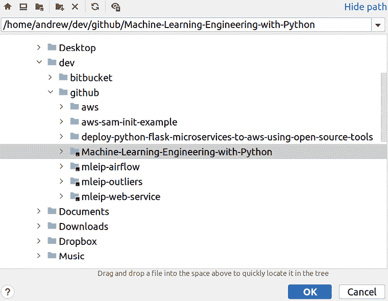

    图 2.1：打开或创建您的 PyCharm 项目。

+   **跟踪代码变更的内容**：接下来在列表中是代码版本控制系统。在这本书中，我们将使用**GitHub**，但基于相同底层开源**Git**技术的解决方案有很多，所有这些解决方案都是免费提供的。后面的章节将讨论如何将这些工具作为您开发工作流程的一部分，但首先，如果您还没有设置版本控制系统，您可以导航到[github.com](http://github.com)并创建一个免费账户。按照网站上的说明创建您的第一个仓库，您将看到一个类似于*图 2.2*的屏幕。为了使您的生活更轻松，您应该选择**添加 README 文件**和**添加.gitignore**（然后选择**Python**）。README 文件为您提供了一个初始的 Markdown 文件，以便您开始使用，并描述您的项目。`.gitignore`文件告诉您的 Git 分布忽略某些类型的文件，这些文件通常对版本控制不重要。您可以选择将仓库设置为公开或私有，以及您希望使用的许可证。这本书的仓库使用**MIT 许可证**：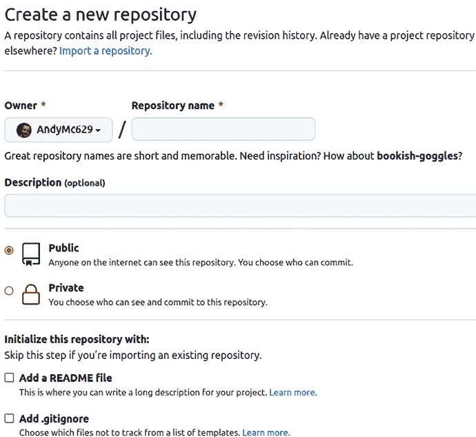

    图 2.2：设置您的 GitHub 仓库。

    一旦您设置了 IDE 和版本控制系统，您需要通过使用 PyCharm 提供的 Git 插件使它们相互通信。这就像导航到**VCS** | **启用版本控制集成**并选择**Git**一样简单。您可以通过导航到**文件** | **设置** | **版本** **控制**来编辑版本控制设置；请参阅*图 2.3*：

    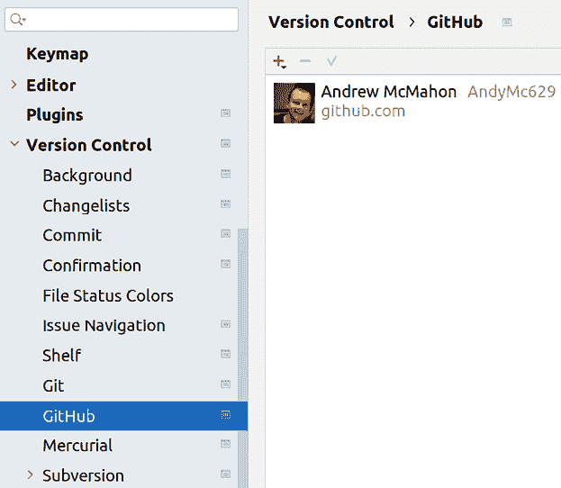

    图 2.3：使用 PyCharm 配置版本控制。

+   **一些帮助我们管理任务的东西**：您现在可以编写 Python 代码并跟踪您的代码更改，但您准备好与其他团队成员一起管理或参与一个复杂的项目了吗？为此，拥有一个可以跟踪任务、问题、错误、用户故事和其他文档和工作项的解决方案通常很有用。如果这个解决方案与其他您将使用的工具有良好的集成点，那就更好了。在这本书中，我们将使用**Jira**作为这个示例。如果您导航到[`www.atlassian.com/software/jira`](https://www.atlassian.com/software/jira)，您可以创建一个免费的云 Jira 账户，然后在该解决方案中遵循交互式教程来设置您的第一个看板并创建一些任务。*图 2.4*显示了本书项目（称为**Python 机器学习工程**，**MEIP**）的任务板：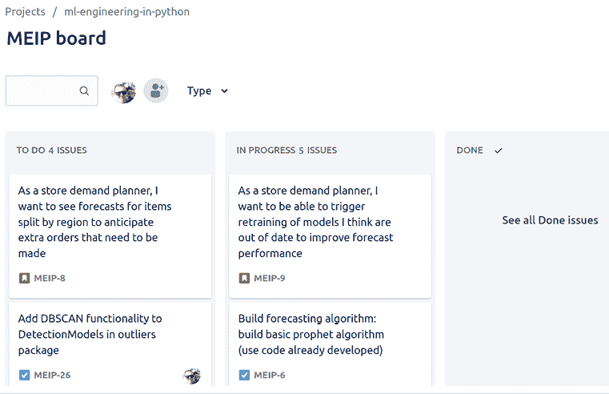

    图 2.4：本书在 Jira 中的任务板。

+   **一个用于部署基础设施和部署我们的解决方案的地方**：您刚刚安装和设置的一切都是工具，这些工具将真正帮助您将工作流程和软件开发实践提升到下一个层次。最后一部分是拥有部署最终解决方案所需的工具、技术和基础设施。为应用程序管理计算基础设施（过去和现在通常仍然是）提供专门的团队，但随着公共云的出现，这种能力对于从事软件各个角色的员工来说已经实现了真正的民主化。特别是，现代机器学习工程非常依赖于云计算技术的成功实施，通常是通过主要的公共云提供商，如**亚马逊网络服务**（**AWS**）、**微软 Azure**或**谷歌云平台**（**GCP**）。本书将利用 AWS 生态系统中的工具，但您在这里找到的所有工具和技术在其他云中都有等效项。

云带来的能力民主化的一面是，拥有其解决方案部署权的团队必须掌握新的技能和理解。我坚信“*你建它，你拥有它，你运行它*”的原则，但这意味着作为一个机器学习工程师，您将不得不熟悉大量潜在的新工具和原则，以及*拥有*您部署的解决方案的性能。*权力越大，责任越大*，诸如此类。在*第五章*，*部署模式和工具*中，我们将详细探讨这个话题。

让我们来谈谈如何设置它。

## 设置 AWS 账户

如前所述，您不必使用 AWS，但我们将在这本书的整个过程中使用它。一旦在这里设置好，您就可以用它来做我们将会做的所有事情：

1.  让我们使这更加具体。每个阶段的主要焦点和输出可以总结如下，如图 2.1 表所示：

1.  一旦您创建了账户，您就可以导航到 AWS 管理控制台，在那里您可以查看所有可用的服务（见*图 2.5*）：

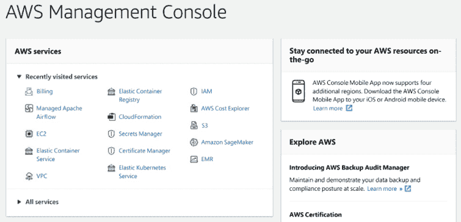

图 2.5：AWS 管理控制台。

在我们的 AWS 账户准备就绪后，让我们看看涵盖整个过程的四个步骤。

# | **阶段** | **输出** |

所有机器学习项目在某种程度上都是独特的：组织、数据、人员、使用的工具和技术在任何两个项目中都不会完全相同。这是好事，因为它标志着进步，以及使这个领域如此有趣的自然多样性。

话虽如此，无论细节如何，从广义上讲，所有成功的机器学习项目实际上有很多共同之处。它们需要将业务问题转化为技术问题，进行大量的研究和理解，概念验证，分析，迭代，工作整合，最终产品的构建，以及将其部署到适当的环境。这就是机器学习工程的精髓！

进一步发展这一点，您可以将这些活动开始归类为粗略的类别或阶段，每个阶段的成果都是后续阶段必要的输入。这如图 2.6 所示：

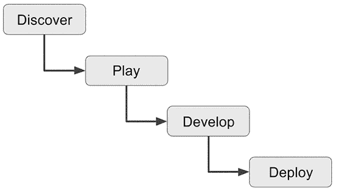

图 2.6：任何机器学习项目在机器学习开发过程中所经历的各个阶段。

每个工作类别都有其独特的风味，但综合起来，它们构成了任何良好机器学习项目的骨架。接下来的几节将详细阐述每个类别的细节，并开始展示如何使用它们来构建您的机器学习工程解决方案。正如我们稍后将要讨论的，您也不必像这样分四步完成整个项目；您实际上可以为特定功能或整体项目的一部分逐个完成这些步骤。这将在*选择软件开发方法*部分中介绍。

要设置 AWS 账户，请导航到[aws.amazon.com](http://aws.amazon.com)并选择**创建账户**。您需要添加一些付款详情，但本书中提到的所有内容都可以通过 AWS 的*免费层*进行探索，在那里您不会因消费低于一定阈值而产生费用。

| 四步从概念到解决方案 |
| --- |
| 阶段 | 输出 |
| 阶段 | 详细理解数据。工作原理的概念验证。对解决问题所采用的模型/算法/逻辑达成一致。在现实资源场景中实现解决方案的证据。实现良好投资回报率的证据。 |
| 开发 | 开发一个可以在适当和可用的基础设施上托管的工作解决方案。详尽的测试结果和性能指标（针对算法和软件）。达成一致的再培训和模型部署策略。单元测试、集成测试和回归测试。解决方案打包和管道。 |
| 部署 | 一个工作且经过测试的部署流程。配备适当的安全性和性能特性的基础设施。模式再培训和管理工作流程。端到端的工作解决方案！ |

表 2.1：机器学习开发过程不同阶段的输出。

重要提示

你可能会认为机器学习工程师只需要真正考虑后两个阶段，*开发*和*部署*，而早期阶段由数据科学家或甚至业务分析师负责。我们确实会在整本书中主要关注这些阶段，并且这种劳动分工可以非常有效。然而，如果你打算构建一个机器学习解决方案，理解所有之前的动机和开发步骤至关重要——你不了解你想要去哪里，难道会建造一种新的火箭吗？

## 与 CRISP-DM 的比较

我们将在本章的其余部分概述的项目步骤的高级分类与一个重要的方法论 CRISP-DM 有许多相似之处，也有一些不同。这个方法论于 1999 年发布，自那时起，它已成为理解如何构建任何数据项目的一种方式。在 CRISP-DM 中，有六个不同的活动阶段，涵盖了与上一节中描述的四个步骤类似的内容：

1.  **业务理解**：这全部关于了解业务问题和领域。在四步模型中，这成为*发现*阶段的一部分。

1.  **数据理解**：将业务领域的知识扩展到包括数据的状态、其位置以及它与问题的相关性。这也包括在*发现*阶段。

1.  **数据准备**：开始获取数据并将其转换为下游使用。这通常需要迭代。在*玩耍*阶段进行捕捉。

1.  **建模**：对准备好的数据进行处理，并在其上开发分析；这现在可能包括不同复杂程度的机器学习。这是一个在四步方法论中的*玩耍*和*开发*阶段都会发生的活动。

1.  **评估**：这一阶段关注的是确认解决方案是否满足业务需求，并对之前的工作进行全面的审查。这有助于确认是否有什么被忽略或可以改进的地方。这非常是*开发*和*部署*阶段的一部分；在我们本章将描述的方法论中，这些任务在整个项目中都得到了很好的整合。

1.  **部署**：在 CRISP-DM 中，这最初是专注于部署简单的分析解决方案，如仪表板或计划中的 ETL 管道，这些管道将运行已决定的分析模型。

    在模型机器学习工程的世界里，这一阶段可以代表这本书中提到的任何内容！CRISP-DM 建议在规划和审查部署方面有子阶段。

如您从列表中看到的，CRISP-DM 中的许多步骤涵盖了与我提出的四个步骤中概述的类似主题。CRISP-DM 在数据科学社区中非常受欢迎，因此其优点肯定得到了全世界大量数据专业人士的认可。鉴于这一点，您可能会想，“为什么还要开发其他的东西呢？”让我说服您为什么这是一个好主意。

CRISP-DM 方法论只是将任何数据项目的重要活动分组以提供结构的一种方式。您可能从上面我给出的阶段简要描述中看到，如果您进行进一步的研究，CRISP-DM 在用于现代机器学习工程项目的使用中可能存在一些潜在的缺点：

+   CRISP-DM 中概述的过程相对僵化且相当线性。这可以为提供结构带来好处，但可能会阻碍项目中的快速进展。

+   该方法非常重视文档。大多数步骤都详细说明了编写某种类型的报告、审查或总结。在项目中编写和维护良好的文档至关重要，但过度编写文档也可能存在风险。

+   CRISP-DM 是在“大数据”和大规模机器学习出现之前的世界中编写的。对我来说，不清楚其细节是否仍然适用于这样一个不同的世界，在那里经典的提取-转换-加载模式只是众多模式之一。

+   CRISP-DM 无疑源自数据世界，并在最后阶段试图向可部署解决方案的概念迈进。这是值得赞扬的，但在我看来，这还不够。机器学习工程是一个不同的学科，因为它与经典软件工程的距离远比接近。这本书将反复论证这一点。因此，拥有一个将部署和开发的概念与软件和现代机器学习技术完全一致的方法非常重要。

**四步法**试图缓解这些挑战，并以不断参考软件工程和机器学习技能和技术的方式进行。这并不意味着你永远不应该在你的项目中使用 CRISP-DM；它可能正是完美的选择！就像这本书中介绍的大多数概念一样，重要的是要拥有许多工具在你的工具箱中，以便你可以选择最适合当前工作的那个。

因此，现在让我们详细地过一遍这四个步骤。

## 发现

在开始构建任何解决方案之前，了解你试图解决的问题至关重要。这项活动在商业分析中通常被称为**发现**，如果你的机器学习项目要取得成功，这是至关重要的。

在发现阶段需要做的关键事情如下：

+   *与客户沟通！然后再与他们沟通*：如果你要设计和构建正确的系统，你必须详细了解最终用户的需求。

+   *记录一切*：你将根据你满足要求的好坏来评判，所以请确保你的讨论中的所有关键点都得到了团队成员和客户或其适当代表的记录和批准。

+   *定义重要的指标*：在项目开始时，很容易被冲昏头脑，感觉自己可以用即将构建的神奇新工具解决任何问题。尽可能强烈地抵制这种倾向，因为它很容易在以后造成严重的头痛。相反，将你的对话引导到定义一个或非常少的指标，这些指标定义了成功将是什么样子。

+   *开始找出数据在哪里！*：如果你能开始确定你需要访问哪些系统来获取所需的数据，这将节省你以后的时间，并有助于你在项目脱轨之前发现任何重大问题。

### 使用用户故事

一旦你与客户（几次）交谈过，你就可以开始定义一些**用户故事**。用户故事是对用户或客户想要看到的内容以及该功能或工作单元的验收标准的简洁且格式一致的表述。例如，我们可能想根据*第一章*，*机器学习工程简介*中的出租车行程示例定义一个用户故事：“作为我们内部网络服务的用户，我希望看到异常的出租车行程，并能够进一步调查。”

让我们开始吧！

1.  要在 Jira 中添加此内容，请选择**创建**按钮。

1.  然后，选择**故事**。

1.  然后，根据需要填写细节。

你现在已经将一个用户故事添加到你的工作管理工具中！这让你可以做诸如创建新任务并将它们链接到这个用户故事或更新其状态等事情：

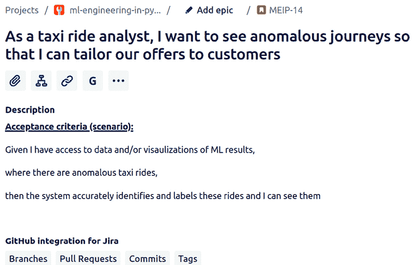

图 2.7：Jira 中的一个示例用户故事。

你使用的数据源尤其重要，需要理解。正如你所知，“垃圾进，垃圾出”，或者更糟，“没有数据，就没有进展”！你必须回答的数据的特定问题主要集中在**访问**、**技术**、**质量**和**相关性**上。

对于访问和技术，你试图预先了解数据工程师开始他们的工作流程需要做多少工作，以及这会耽误整个项目多少时间。因此，正确地完成这一点至关重要。

一个很好的例子是，如果你很快发现你需要的绝大部分数据都存在于没有真正现代 API 和没有非财务团队成员访问请求机制的遗留内部财务系统中。如果其主要后端是本地部署的，你需要将锁定在云端的财务数据迁移过来，但这会让你的业务感到紧张，那么你知道在编写第一行代码之前还有很多工作要做。如果数据已经存在于你的团队可以访问的企业数据湖中，那么你显然处于更好的位置。如果价值主张足够强大，任何挑战都是可以克服的，但尽早找出这些情况将为你节省时间、精力和金钱。

在启动之前，相关性可能更难找到，但你可以开始形成一些想法。例如，如果你想执行我们在*第一章*，*机器学习工程导论*中讨论的库存预测，你是否需要拉取客户账户信息？如果你想创建*高端*或*非高端*客户的分类器，作为营销目标，这也如*第一章*，*机器学习工程导论*中提到的，你是否需要社交媒体数据？关于相关性的问题通常不会像这些例子那样明确，但一个重要的事情要记住的是，如果你真的错过了什么重要的东西，你总是可以回过头来。你试图尽早捕捉到最重要的设计决策，所以常识和大量的利益相关者和领域专家参与将大有裨益。

在项目前进之前，你可以尝试通过向当前的数据用户或消费者或参与其输入过程的人员提出一些问题来预测数据质量。但要获得更定量的理解，你通常只需要让你的数据科学家以动手的方式与数据一起工作。

在下一节中，我们将探讨如何在最具研究密集性的阶段，即*Play*阶段，开发概念验证机器学习解决方案。

## Play

在项目的**play**阶段，你的目标是确定即使在概念验证级别解决任务是否可行。为此，你可能会在创建满足你需求的机器学习模型之前，采用我们在上一章中提到的常规数据科学技术，如探索性数据分析和解释性建模。

在这个流程的这一部分，你不必过分关注实现的细节，而是要探索可能性领域，并深入理解数据和问题，这超出了初步发现工作。由于这里的目的是不创建*生产就绪*的代码或构建可重用的工具，因此你不必担心你编写的代码是否质量最高，或者是否使用了复杂的模式。例如，看到以下示例（实际上是从本书的 repo 中摘取的）的代码并不罕见：

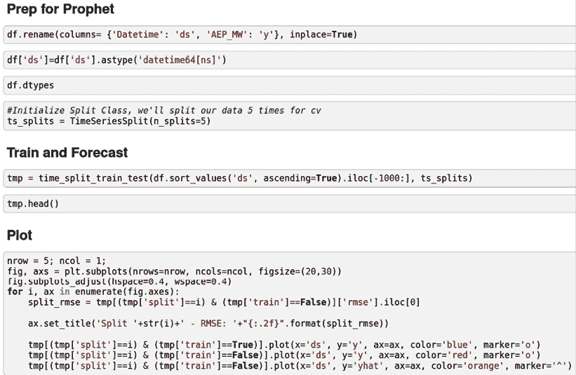

图 2.8：在游戏阶段将创建的一些示例原型代码。

只需快速浏览这些截图，就能告诉你一些事情：

+   代码位于 Jupyter 笔记本中，由用户在网页浏览器中交互式运行。

+   代码偶尔会调用方法来简单地检查或探索数据元素（例如，`df.head()`和`df.dtypes`）。

+   对于绘图（而且它并不直观！）有专门的代码。

+   有一个名为`tmp`的变量，描述性不强。

所有这些在这个更探索性的阶段都是绝对可以接受的，但本书的一个目标就是帮助你理解将此类代码转化为适合你生产机器学习管道所需的要素。下一节将开始引导我们走上这条道路。

## 开发

正如我们之前已经提到几次，本书的一个目标就是让你思考这样一个事实：你正在构建的软件产品恰好包含了机器学习。这意味着对于我们这些来自更数学和算法背景的人来说，学习曲线可能会很陡峭。这可能会让人感到害怕，但不要绝望！好消息是，我们可以重用几十年来软件工程社区锤炼的许多最佳实践和技术。太阳之下无新事。

本节探讨了在机器学习工程项目的开发阶段可以采用的一些方法、流程和考虑因素。

### 选择软件开发方法

我们作为机器学习工程师，可以而且应该毫无顾忌地复制全球项目中使用的软件开发方法。这些方法中的一类，通常被称为**瀑布模型**，涵盖了适合构建复杂事物的项目工作流程（想想建筑或汽车）。在瀑布模型中，有明确且顺序性的工作阶段，每个阶段都有在进入下一阶段之前所需的明确输出。例如，典型的瀑布项目可能包含涵盖需求收集、分析、设计、开发、测试和部署等阶段（听起来熟悉吗？）。关键在于，在瀑布风格的项目中，当你处于**需求收集**阶段时，你应该**只**专注于收集需求，当处于测试阶段时，你应该**只**专注于测试，依此类推。在介绍另一套方法之后，我们将在接下来的几段中讨论这种方法在机器学习中的优缺点。

另一套方法，称为**敏捷**，是在 2001 年**敏捷宣言**（[`agilemanifesto.org/`](https://agilemanifesto.org/)）发布之后出现的。敏捷开发的核心理念是灵活性、迭代、增量更新、快速失败和适应变化的需求。如果你来自研究或科学背景，这种基于结果和新发现灵活性和适应性的概念可能听起来很熟悉。

如果你具有这种科学或学术背景，可能不太熟悉的是，你仍然可以在一个以交付结果为中心的相对严格的框架内接受这些概念。敏捷软件开发方法的核心是寻找实验和交付之间的平衡。这通常通过引入**仪式**（如**Scrum**和**Sprint**回顾）和**角色**（如**Scrum Master**和**产品负责人**）来实现。

此外，在敏捷开发中，有两种非常流行的变体：**Scrum**和**Kanban**。Scrum 项目围绕称为**Sprint**的短期工作单元展开，其理念是在这个短暂的时间内从构思到部署对产品的添加。在 Kanban 中，主要理念是实现从有序的待办事项到进行中工作，再到完成工作的稳定**流程**。

所有这些方法（以及更多）都有其优点和缺点。你不必对其中任何一种方法产生依赖；你可以在它们之间随意切换。例如，在一个机器学习项目中，进行一些*部署后*的工作可能是有意义的，这些工作专注于维护现有的服务（有时被称为*常规业务*活动），例如进一步改进模型或软件优化在看板框架中。在 Sprint 中明确结果的主要交付可能是有意义的。但你可以随意切换，看看哪种最适合你的用例、你的团队和你的组织。

但将这类工作流程应用于机器学习项目有什么不同？在这个机器学习的世界中，我们需要考虑哪些以前没有考虑过的问题？好吧，一些关键点如下：

+   *你不知道你不知道的*：在你看到数据之前，你无法知道你是否能够解决问题。传统的软件工程不像机器学习工程那样严重依赖于将通过系统的数据。原则上我们可以知道如何解决问题，但如果适当的数据数量不足或质量差，那么在实践中我们无法解决问题。

+   *你的系统是活生生的*：如果你构建了一个经典的网站，拥有其后端数据库、闪亮的用户界面、惊人的负载均衡和其他功能，那么实际上，如果资源存在，它可以永远运行。网站及其运行方式在时间上不会发生根本性的变化。点击仍然会被转换成操作，页面导航仍然以相同的方式进行。现在，考虑在其中加入一些基于典型用户档案的机器学习生成的广告内容。什么是*典型用户档案*，它会随时间变化吗？随着流量和用户的增加，我们以前从未见过的行为是否变成了*新常态*？你的系统一直在学习，这导致了*模型漂移*和*分布偏移*的问题，以及更复杂的更新和回滚场景。

+   *没有什么是确定的*：在构建使用基于规则的逻辑的系统时，你知道每次会得到什么。*如果 X，那么 Y*的意思就是如此，始终如此。对于机器学习模型，当你提问时，往往很难知道答案是什么，这正是这些算法之所以强大的原因。

但这也意味着你可能会有不可预测的行为，无论是由于之前讨论的原因，还是因为算法学习到了人类观察者不明显的数据信息，或者，因为机器学习算法可以基于概率和统计概念，结果会附带一些不确定性或*模糊性*。一个经典的例子是当你应用逻辑回归并收到数据点属于某一类别的概率时。这是一个概率值，你不能确定地说它是这种情况；只是有多大的可能性！这在你的机器学习系统的输出将被用户或其他系统用于做出决策时尤其重要。

考虑到这些问题，在下一节中，我们将尝试了解哪些开发方法论可以帮助我们在构建机器学习解决方案时。在*表 2.2*中，我们可以看到这些敏捷方法论在不同阶段和类型的机器学习（ML）工程项目中的优缺点：

| **方法论** | **优点** | **缺点** |
| --- | --- | --- |
| 敏捷 | 预期具有灵活性，更快的开发到部署周期。 | 如果管理不善，容易发生范围漂移。看板或冲刺可能不适合某些项目。 |
| 水晶球模型 | 清晰的部署路径，明确任务的阶段和所有权。 | 缺乏灵活性，更高的管理开销。 |

表 2.2：敏捷与水晶球模型在机器学习（ML）开发中的应用。

让我们继续下一节！

### 包管理（conda 和 pip）

如果我告诉你编写一个不使用任何库或包，仅使用纯 Python 进行数据科学或机器学习（ML）的程序，你可能觉得在合理的时间内完成这项任务非常困难，而且极其无聊！这是好事。在 Python 中开发软件的一个真正强大的特性是，你可以相对容易地利用一个广泛的工具和功能生态系统。另一方面，这也意味着管理代码库的依赖可能会变得非常复杂且难以复制。这就是包和环境管理器如`pip`和`conda`发挥作用的地方。

`pip`是 Python 的标准包管理器，也是 Python 包权威机构推荐使用的。

它从`PyPI`，即`Python 包索引`中检索和安装 Python 包。`pip`使用非常简单，通常在教程和书籍中建议作为安装包的方式。

`conda`是 Anaconda 和 Miniconda Python 发行版附带的一个**包和环境**管理器。`conda`的一个关键优势是，尽管它来自 Python 生态系统，并且在那里具有出色的功能，但它实际上是一个更通用的包管理器。因此，如果你的项目需要 Python 之外的依赖（例如 NumPy 和 SciPy 库是很好的例子），尽管`pip`可以安装这些依赖，但它无法跟踪所有非 Python 依赖，也无法管理它们的版本。使用`conda`，这个问题就解决了。

您也可以在 `conda` 环境中使用 `pip`，因此您可以同时获得两者的最佳之处，或者使用您项目所需的任何工具。我通常使用的典型工作流程是使用 `conda` 管理我创建的环境，然后使用它来安装任何可能需要非 Python 依赖项的包，这些依赖项可能没有在 `pip` 中得到很好的处理，然后我可以在创建的 `conda` 环境中使用 `pip` 大部分时间。鉴于这一点，在本书中，您可能会看到 `pip` 或 `conda` 安装命令交替使用。这是完全可以接受的。

要开始使用 Conda，如果您还没有，您可以从 Anaconda 网站下载 **个人** 分发安装程序（[`www.anaconda.com/products/individual`](https://www.anaconda.com/products/individual)）。Anaconda 已经预装了一些 Python 包，但如果您想从一个完全空的环境开始，您可以从同一网站下载 Miniconda（它们具有完全相同的功能；只是您从不同的基础开始）。

Anaconda 文档对于您熟悉适当的命令非常有帮助，但这里简要介绍一下其中的一些关键命令。

首先，如果我们想创建一个名为 `mleng` 的 `conda` 环境并安装 Python 3.8 版本，我们只需在我们的终端中执行以下命令：

```py
conda env --name mleng python=3.10 
```

然后，我们可以通过运行以下命令来激活 `conda` 环境：

```py
source activate mleng 
```

这意味着任何新的 `conda` 或 `pip` 命令都将在此环境中安装包，而不是系统范围内。

我们经常希望与他人共享我们环境的详细信息，以便他们可以在同一项目中工作，因此将所有包配置导出到 `.yml` 文件中可能很有用：

```py
conda export env > environment.yml 
```

本书 GitHub 仓库中包含一个名为 `mleng-environment.yml` 的文件，您可以使用此文件创建 `mleng` 环境的实例。以下命令使用此文件创建具有此配置的环境：

```py
conda env create --file environment.yml 
```

从环境文件创建 `conda` 环境的模式是设置书中每一章示例运行环境的一个好方法。因此，每一章的 *技术要求* 部分将指向书中仓库中包含的正确环境 YAML 文件名称。

这些命令与您经典的 `conda` 或 `pip install` 命令结合使用，将为您的项目设置得相当好！

```py
conda install <package-name> 
```

或者

```py
pip install <package-name> 
```

我认为拥有多种执行某事的方法总是好的，而且通常这是良好的工程实践。因此，既然我们已经介绍了经典的 Python 环境、`conda` 和 `pip` 包管理器，我们将介绍另一个包管理器。这是一个我喜欢其易用性和多功能性的工具。我认为它为 `conda` 和 `pip` 提供了很好的功能扩展，并且可以很好地补充它们。这个工具叫做 Poetry，我们现在就转向它。

### Poetry

Poetry 是另一种近年来变得非常流行的包管理器。它允许您以类似于我们在 Conda 部分讨论的环境 YAML 文件的方式，将项目的依赖项和包信息管理到一个单独的配置文件中。Poetry 的优势在于其远超其他工具的复杂依赖项管理能力，并确保“确定性”构建，这意味着您不必担心包在后台更新而破坏您的解决方案。它是通过使用“锁定文件”作为核心功能以及深入的依赖项检查来实现的。这意味着在 Poetry 中，可重复性通常更容易实现。重要的是要指出，Poetry 专注于特定的 Python 包管理，而 Conda 也可以安装和管理其他包，例如 C++ 库。可以这样理解 Poetry：它就像是 `pip` Python 安装包的升级版，但同时也具备一些环境管理功能。接下来的步骤将解释如何设置和使用 Poetry 以进行非常基本的用例。

我们将在本书的一些后续示例中继续这一内容。首先，按照以下步骤操作：

1.  首先，像往常一样，我们将安装 Poetry：

    ```py
    pip install poetry 
    ```

1.  安装 Poetry 后，您可以使用 `poetry new` 命令创建一个新的项目，后面跟上是您项目的名称：

    ```py
    poetry new mleng-with-python 
    ```

1.  这将创建一个名为 `mleng-with-python` 的新目录，其中包含 Python 项目的必要文件和目录。要管理您项目的依赖项，您可以将它们添加到项目根目录下的 `pyproject.toml` 文件中。此文件包含您项目的所有配置信息，包括其依赖项和包元数据。

    例如，如果您正在构建一个机器学习项目并想使用 `scikit-learn` 库，您会在 `pyproject.toml` 文件中添加以下内容：

    ```py
    [tool.poetry.dependencies]
    scikit-learn = "*" 
    ```

1.  然后，您可以通过运行以下命令安装您项目的依赖项。这将安装 `scikit-learn` 库以及您在 `pyproject.toml` 文件中指定的任何其他依赖项：

    ```py
    poetry install 
    ```

1.  要在您的项目中使用依赖项，您只需像这样在 Python 代码中导入它即可：

    ```py
    from sklearn import datasets
    from sklearn.model_selection import train_test_split
    from sklearn.linear_model import LogisticRegression 
    ```

如您所见，开始使用 Poetry 非常简单。我们将在本书中多次使用 Poetry，以便为您提供与我们将开发的 Conda 知识相补充的示例。*第四章*，*打包*，将详细讨论这一点，并展示如何充分利用 Poetry。

### 代码版本控制

如果你将要为真实系统编写代码，你几乎肯定将会作为团队的一部分来做。如果你能够有一个清晰的变更、编辑和更新审计记录，那么你会更容易看到解决方案是如何发展的。最后，你将想要干净且安全地将你正在构建的稳定版本与可以部署的版本以及更短暂的开发版本分开。幸运的是，所有这些都可以由源代码版本控制系统来处理，其中最受欢迎的是**Git**。

我们不会在这里深入探讨 Git 底层是如何工作的（关于这个话题有整本书的讨论！）但我们将会关注理解使用 Git 的关键实践要素：

1.  你在章节的早期已经有一个 GitHub 账户了，所以首先要做的是创建一个以 Python 为语言的仓库，并初始化`README.md`和`.gitignore`文件。接下来要做的是通过在 Bash、Git Bash 或其他终端中运行以下命令来获取这个仓库的本地副本：

    ```py
    git clone <repo-name> 
    ```

1.  现在你已经完成了这个步骤，进入`README.md`文件并进行一些编辑（任何内容都可以）。然后，运行以下命令来告诉 Git 监控这个文件，并使用简短的消息保存你的更改：

    ```py
    git add README.md
    git commit -m "I've made a nice change …" 
    ```

    这现在意味着你的本地 Git 实例已经存储了你所做的更改，并准备好与远程仓库共享这些更改。

1.  你可以通过以下步骤将这些更改合并到`main`分支：

    ```py
    git push origin main 
    ```

    如果你现在回到 GitHub 网站，你会看到你的远程仓库中发生了更改，你添加的评论也伴随着这个更改。

1.  你的团队成员可以通过运行以下命令来获取更新的更改：

    ```py
    git pull origin main 
    ```

这些步骤是 Git 的绝对基础，你可以在网上学到更多。不过，我们现在要做的是以与机器学习工程相关的方式设置我们的仓库和工作流程。

### Git 策略

在一个项目中，使用版本控制系统的策略通常可以成为区分数据科学和机器学习工程方面的重要因素。在探索性和基本建模阶段（*发现*和*玩耍*）定义严格的 Git 策略可能有些过度，但如果你想要为部署构建某些内容（而且你正在阅读这本书，所以这很可能是你的目标），那么这基本上是非常重要的。

很好，但我们所说的 Git 策略是什么意思呢？

好吧，让我们假设我们试图在没有共享版本组织和代码组织方向的情况下开发我们的解决方案。

机器学习工程师*A*想要开始将一些数据科学代码构建到 Spark ML 管道中（关于这一点稍后会有更多介绍），因此从`main`分支创建了一个名为`pipeline1spark`的分支：

```py
git checkout -b pipeline1spark 
```

他们然后开始在这个分支上工作，并在一个名为`pipeline.py`的新文件中编写了一些优秀的代码：

```py
# Configure an ML pipeline, which consists of three stages: tokenizer, hashingTF, and lr.
tokenizer = Tokenizer(inputCol="text", outputCol="words")
hashingTF = HashingTF(inputCol=tokenizer.getOutputCol(),
                      outputCol="features")
lr = LogisticRegression(maxIter=10, regParam=0.001)
pipeline = Pipeline(stages=[tokenizer, hashingTF, lr]) 
```

太好了，他们已经将一些之前的 `sklearn` 代码翻译成了 Spark，这被认为更适合用例。然后他们继续在这个分支上工作，因为它包含了他们所有的添加，他们认为最好在一个地方完成所有工作。当他们想要将分支推送到远程仓库时，他们运行以下命令：

```py
git push origin pipeline1spark 
```

机器学习工程师 *B* 加入进来，他们想使用机器学习工程师 *A* 的管道代码，并在其周围构建一些额外的步骤。他们知道工程师 *A* 的代码有一个包含这项工作的分支，所以他们足够了解 Git，可以创建一个包含 *A* 代码的另一个分支，*B* 称之为 `pipeline`：

```py
git pull origin pipeline1spark
git checkout pipeline1spark
git checkout -b pipeline 
```

他们接着添加了一些代码来从变量中读取模型的参数：

```py
lr = LogisticRegression(maxIter=model_config["maxIter"], 
                        regParam=model_config["regParam"]) 
```

很酷，工程师 *B* 做了一个更新，开始抽象掉一些参数。然后他们把新的分支推送到远程仓库：

```py
git push origin pipeline 
```

最后，机器学习工程师 *C* 加入到团队中，并想开始编写代码。打开 Git 并查看分支，他们看到有三个：

```py
main
pipeline1spark
pipeline 
```

那么，哪个应该被视为最新的？如果他们想进行新的编辑，他们应该从哪里分支？这并不清楚，但更危险的是，如果他们被要求将部署代码推送到执行环境，他们可能会认为 `main` 包含了所有相关更改。在一个已经进行了很长时间且非常繁忙的项目中，他们甚至可能会从 `main` 分支中分支出来，并复制一些 *B* 和 *C* 的工作！在一个小项目中，你会浪费时间进行这种无谓的追逐；在一个大项目中有许多不同的工作线，你几乎不可能保持良好的工作流程：

```py
# Branch pipeline1spark - Commit 1 (Engineer A)
lr = LogisticRegression(maxIter=10, regParam=0.001)
pipeline = Pipeline(stages=[tokenizer, hashingTF, lr])
# Branch pipeline - Commit 2 (Engineer B)
lr = LogisticRegression(maxIter=model_config["maxIter"], 
                        regParam=model_config["regParam"])
pipeline = Pipeline(stages=[tokenizer, hashingTF, lr]) 
```

如果这两个提交同时推送到 `main` 分支，那么我们就会得到所谓的**合并冲突**，在这种情况下，工程师将不得不选择保留哪段代码，是当前的还是新的示例。如果工程师 *A* 首先将其更改推送到 `main`，这看起来可能如下所示：

```py
<<<<<<< HEAD
lr = LogisticRegression(maxIter=10, regParam=0.001)
pipeline = Pipeline(stages=[tokenizer, hashingTF, lr])
=======
lr = LogisticRegression(maxIter=model_config["maxIter"], 
                        regParam=model_config["regParam"])
pipeline = Pipeline(stages=[tokenizer, hashingTF, lr])
>>>>>>> pipeline 
```

代码中的分隔符表明存在合并冲突，并且取决于开发者选择保留哪两个代码版本。

重要提示

尽管在这个简单的情况下，我们可能可以信任工程师选择**更好的**代码，但允许这种情况频繁发生对你的项目来说是一个巨大的风险。这不仅会浪费大量宝贵的发展时间，还可能意味着你最终得到的代码质量更差！

避免混淆和额外工作的方法是制定一个非常清晰的策略，用于实施版本控制系统，例如我们现在将要探讨的策略。

#### Gitflow 工作流程

之前示例的最大问题是，我们假设的所有工程师实际上都在不同地方工作着同一块代码。为了阻止这种情况发生，你必须创建一个团队都可以遵循的过程——换句话说，一个版本控制策略或工作流程。

这些策略中最受欢迎之一是**Gitflow 工作流程**。它基于拥有专门用于功能的分支的基本想法，并将其扩展到包含发布和热修复的概念，这对于具有持续部署元素的项目尤其相关。

主要思想是我们有几种类型的分支，每种分支都有明确和具体的存在原因：

+   **主分支**包含您的官方发布版本，应只包含代码的稳定版本。

+   **开发分支**是大多数仓库中从其分支和合并到的主要点；它包含代码库的持续开发，并在`main`之前作为预发布区域。

+   **功能分支**不应直接合并到`main`分支；所有内容都应该从`dev`分支开始，然后合并回`dev`。

+   **发布分支**从`dev`创建，在合并到`main`和`dev`并删除之前启动构建或发布过程。

+   **热修复分支**用于从已部署或生产软件中移除错误。您可以在合并到`main`和`dev`之前从`main`分支创建此分支。

所有这些都可以用图 2.9 进行图解总结，该图显示了不同分支在 Gitflow 工作流程中如何贡献于代码库的演变：

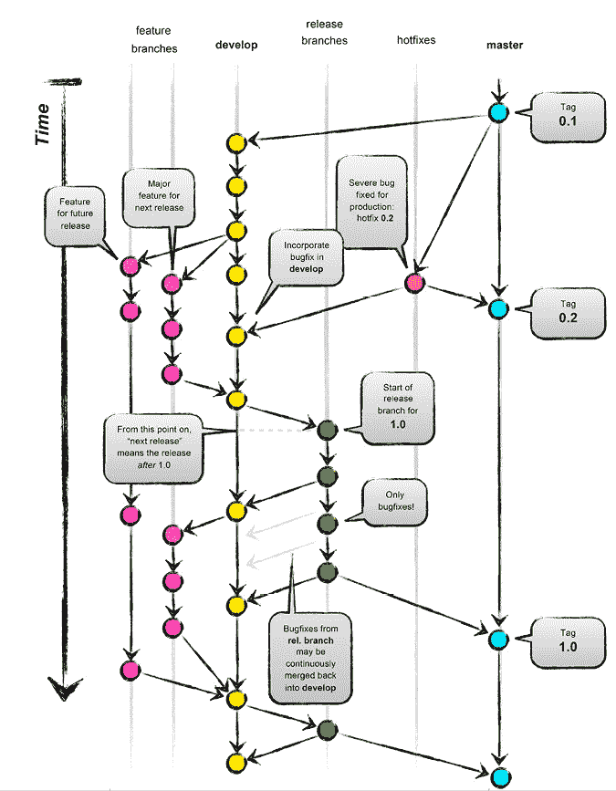

图 2.9：Gitflow 工作流程。

此图来自[`lucamezzalira.com/2014/03/10/git-flow-vs-github-flow/`](https://lucamezzalira.com/2014/03/10/git-flow-vs-github-flow/)。更多详情可以在[`www.atlassian.com/git/tutorials/comparing-workflows/gitflow-workflow`](https://www.atlassian.com/git/tutorials/comparing-workflows/gitflow-workflow)找到。

如果您的机器学习项目可以遵循这种策略（如果您想进行适应性调整，则不需要对此过于严格），您可能会看到生产率、代码质量和甚至文档的显著提高：

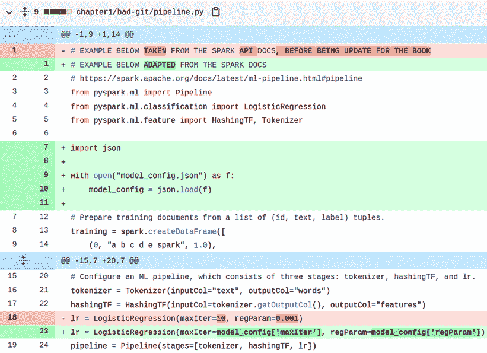图 2.10：GitHub 上拉取请求的示例代码更改。

我们尚未讨论的一个重要方面是代码审查的概念。这些审查通过所谓的**拉取请求**触发，您通过拉取请求表明您合并到另一个分支的意图，并允许其他团队成员在执行之前审查您的代码。这是将代码审查引入工作流程的自然方式。您可以在想要合并更改并更新到 dev 或 main 分支时进行此操作。建议的更改然后可以呈现给整个团队，他们可以在合并完成之前通过进一步的提交进行辩论和迭代。

这强制进行代码审查以提高质量，同时创建审计跟踪和更新保障。*图 2.10*展示了在 GitHub 拉取请求期间如何使代码更改可见以供辩论的示例。

现在我们已经讨论了一些将版本控制应用于您的代码的最佳实践，让我们探索如何在机器学习项目中实现模型的版本控制。

### 模型版本控制

在任何机器学习工程项目中，您不仅要清晰地跟踪代码更改，还要跟踪模型的变化。您希望跟踪的不仅仅是建模方法的变化，还包括当新的或不同的数据输入到您选择的算法中时的性能变化。跟踪这些变化并提供机器模型版本控制的最佳工具之一是**MLflow**，这是一个由 Linux 基金会监管的开源平台，由**Databricks**提供。

要安装 MLflow，请在您选择的 Python 环境中运行以下命令：

```py
pip install mlflow 
```

MLflow 的主要目标是提供一个平台，通过该平台您可以记录模型实验、工件和性能指标。它是通过 Python `mlflow`库提供的非常简单的 API 实现的，通过一系列中央开发社区插件与选定的存储解决方案接口。它还提供了通过**图形用户界面**（**GUI**）查询、分析和导入/导出数据的功能，其外观类似于*图 2.11*：

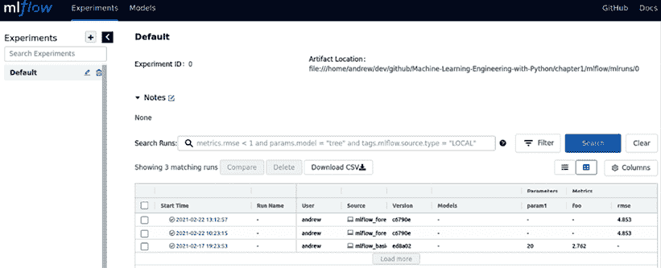

图 2.11：MLflow 跟踪服务器 UI 和一些预测运行。

图书馆的使用极其简单。以下示例中，我们将从*第一章*，*机器学习工程导论*中的销售预测示例开始，并添加一些基本的 MLflow 功能以跟踪性能指标和保存训练好的 Prophet 模型：

1.  首先，我们进行相关的导入，包括 MLflow 的`pyfunc`模块，它作为可以编写为 Python 函数的模型的保存和加载的通用接口。这有助于与 MLflow 原生不支持（如`fbprophet`库）的库和工具一起工作：

    ```py
    import pandas as pd
    from fbprophet import Prophet
    from fbprophet.diagnostics import cross_validation
    from fbprophet.diagnostics import performance_metrics
    import mlflow
    import mlflow.pyfunc 
    ```

1.  为了与`fbprophet`的预测模型实现更无缝的集成，我们定义了一个小的包装类，它继承自`mlflow.pyfunc.PythonModel`对象：

    ```py
    class FbProphetWrapper(mlflow.pyfunc.PythonModel):
        def __init__(self, model):
            self.model = model
            super().__init__()
        def load_context(self, context):
            from fbprophet import Prophet
            return
        def predict(self, context, model_input):
            future = self.model.make_future_dataframe(
                periods=model_input["periods"][0])
            return self.model.predict(future) 
    ```

    现在我们将训练和预测的功能封装到一个名为`train_predict()`的单个辅助函数中，以便简化多次运行。我们不会在这里定义这个函数的所有细节，但让我们浏览一下其中包含的 MLflow 功能的主要部分。

1.  首先，我们需要让 MLflow 知道我们现在开始一个希望跟踪的训练运行：

    ```py
    with mlflow.start_run():
        # Experiment code and mlflow logging goes in here 
    ```

1.  在这个循环内部，我们定义并训练模型，使用代码中其他地方定义的参数：

    ```py
    # create Prophet model
    model = Prophet(
        yearly_seasonality=seasonality_params['yearly'],
        weekly_seasonality=seasonality_params['weekly'],
        daily_seasonality=seasonality_params['daily']
    )
    # train and predict
    model.fit(df_train) 
    ```

1.  然后，我们进行交叉验证来计算我们想要记录的一些指标：

    ```py
    # Evaluate Metrics
    df_cv = cross_validation(model, initial="730 days", 
                             period="180 days", horizon="365 days")
    df_p = performance_metrics(df_cv) 
    ```

1.  我们可以将这些指标记录下来，例如，这里的**均方根误差**（**RMSE**），到我们的 MLflow 服务器：

    ```py
    # Log parameter, metrics, and model to MLflow
    mlflow.log_metric("rmse", df_p.loc[0, "rmse"]) 
    ```

1.  最后，我们可以使用我们的模型包装类来记录模型并打印一些关于运行的信息：

    ```py
    mlflow.pyfunc.log_model("model", python_model=FbProphetWrapper(model))
    print(
        "Logged model with URI: runs:/{run_id}/model".format(
            run_id=mlflow.active_run().info.run_id
        )
    ) 
    ```

1.  只需添加几行额外的代码，我们就已经开始对我们的模型进行版本控制并跟踪不同运行状态的统计数据了！

将你构建的机器学习模型保存到 MLflow（以及一般情况）有许多不同的方法，这在跟踪模型版本时尤其重要。以下是一些主要选项：

+   **pickle**：`pickle` 是一个用于对象序列化的 Python 库，通常用于导出在 `scikit-learn` 或更广泛的 `scipy` 生态系统中的管道。尽管它非常容易使用且通常非常快，但在将你的模型导出为 `pickle` 文件时必须小心，因为以下原因：

    +   **版本控制**：当你 pickle 一个对象时，你必须使用与其他程序中相同的 `pickle` 版本来反序列化它，出于稳定性的原因。这增加了管理你的项目的复杂性。

    +   **安全性**：`pickle` 的文档明确指出它是不安全的，并且很容易构造恶意的 pickle，这些 pickle 在反序列化时会执行危险的代码。这是一个非常重要的考虑因素，尤其是在你向生产环境迈进时。

    通常，只要你知道你使用的 `pickle` 文件的历史来源并且来源是可信的，它们就可以安全使用，并且是一种简单快速地分享你的模型的方法！

+   **joblib**：`joblib` 是一个功能强大但轻量级的 Python 通用管道库。它围绕缓存、并行化和压缩等许多非常有用的功能，使其成为保存和读取你的机器学习管道的非常通用的工具。它对于存储大型 `NumPy` 数组也非常快，因此对于数据存储很有用。我们将在后面的章节中更多地使用 `joblib`。重要的是要注意，`joblib` 与 `pickle` 一样存在相同的安全问题，因此了解你的 `joblib` 文件的历史来源至关重要。

+   **JSON**：如果 `pickle` 和 `joblib` 不适用，你可以将你的模型及其参数序列化为 JSON 格式。这很好，因为 JSON 是一种标准化的文本序列化格式，在许多解决方案和平台上广泛使用。但是，使用 JSON 序列化你的模型有一个缺点，那就是你通常必须手动定义包含你想要存储的相关参数的 JSON 结构。因此，这可能会产生大量的额外工作。Python 中的一些机器学习库都有自己的导出为 JSON 的功能，例如深度学习包 Keras，但它们都可以产生相当不同的格式。

+   **MLeap**：MLeap 是基于**Java 虚拟机**（**JVM**）的序列化格式和执行引擎。它与 Scala、PySpark 和 Scikit-Learn 有集成，但您通常会在示例和教程中看到它用于保存 Spark 管道，特别是对于使用 Spark ML 构建的模型。这种关注意味着它不是最灵活的格式，但如果您在**Spark 生态系统**中工作，它非常有用。

+   **ONNX**：**开放神经网络交换**（**ONNX**）格式旨在实现完全跨平台，并允许主要机器学习框架和生态系统之间交换模型。ONNX 的主要缺点是（正如您可以从其名称中猜到的）它主要针对基于神经网络的模型，除了其`scikit-learn` API 之外。如果您正在构建神经网络，这仍然是一个极好的选择。

在**第三章**，**从模型到模型工厂**中，我们将使用这些格式中的一些将我们的模型导出到 MLflow，但它们都与 MLflow 兼容，因此您应该在使用它们作为您机器学习工程工作流程的一部分时感到舒适。

本章的最后一节将介绍一些重要的概念，用于规划您希望如何部署您的解决方案，为书中稍后更详细的讨论做铺垫。

## 部署

机器学习开发过程的最后阶段才是真正重要的：您如何将您构建的令人惊叹的解决方案带入现实世界并解决您最初的问题？答案有多个部分，其中一些将在本书稍后更详细地探讨，但将在本节中概述。如果我们想要成功部署我们的解决方案，首先，我们需要了解我们的部署选项：有什么基础设施可供选择，并且适合这项任务？然后，我们需要将解决方案从我们的开发环境转移到这个生产基础设施上，以便在适当的编排和控制下，它能够执行我们需要的任务，并在需要的地方展示结果。这就是**DevOps**和**MLOps**概念发挥作用的地方。

让我们详细阐述这两个核心概念，为后续章节奠定基础，并探讨如何开始部署我们的工作。

### 了解您的部署选项

在**第五章**，**部署模式和工具**中，我们将详细介绍您需要将您的机器学习工程项目从**开发**阶段过渡到**部署**阶段，但为了提前预告并为您提供即将到来的内容的预览，让我们探索我们可用的不同部署选项：

+   **本地部署**：我们拥有的第一个选择是完全忽略公有云，并在我们拥有的基础设施上内部部署我们的解决方案。这个选项对于许多拥有大量遗留软件和强烈数据位置和数据处理监管约束的大型机构来说尤其受欢迎和必要。本地部署的基本步骤与云上部署相同，但通常需要来自其他具有特定专业知识的团队的大量参与。例如，如果你在云上，你通常不需要花很多时间配置网络或实现负载均衡器，而本地解决方案将需要这些。

    本地部署的大优势是安全性和安心感，即你的数据不会穿越公司的防火墙。缺点是它需要更大的前期硬件投资，而且你必须付出大量努力才能有效地配置和管理该硬件。在这本书中，我们不会详细讨论本地部署，但我们将在软件开发、打包、环境管理、培训和预测系统等方面使用的所有概念仍然适用。

+   **基础设施即服务**（**IaaS**）：如果你打算使用云，你可用于部署的最低抽象级别之一是 IaaS 解决方案。这些通常基于虚拟化的概念，即可以根据用户的意愿启动具有各种规格的服务器。这些解决方案通常将维护和操作的需求抽象化，作为服务的一部分。最重要的是，它们允许你的基础设施在需要时具有极端的可扩展性。下周需要运行 100 多台服务器？没问题，只需扩展你的 IaaS 请求，它就会出现。尽管 IaaS 解决方案比完全管理的本地基础设施迈出了很大一步，但仍有几件事情你需要考虑和配置。云计算中的平衡始终在于你希望事情有多容易，以及你希望有多少控制权。与某些其他解决方案相比，IaaS 最大化了控制权，但最小化了（相对的）易用性。在**AWS**中，**简单存储服务**（**S3**）和**弹性计算云**（**EC2**）是 IaaS 提供的良好例子。

+   **平台即服务**（**PaaS**）：PaaS 解决方案在抽象层面上是下一个级别，通常提供许多功能，而无需了解底层具体发生什么。这意味着你可以专注于平台准备支持的开发任务，而无需担心任何底层基础设施。一个很好的例子是**AWS Lambda**函数，这是一种无服务器函数，几乎可以无限制地扩展。

你需要做的只是将你想要在函数内部执行的主要代码块输入进去。另一个很好的例子是**Databricks**，它提供了在**Spark 集群**基础设施之上的非常直观的用户界面，几乎无缝地提供、配置和扩展这些集群。

了解这些不同选项及其功能可以帮助你设计你的机器学习解决方案，并确保你将团队的技术努力集中在最需要和最有价值的地方。例如，如果你的机器学习工程师正在配置路由器，那么你肯定在某些地方犯了错误。

但一旦你选择了要使用的组件并配置了基础设施，你该如何将这些组件集成在一起并管理你的部署和更新周期呢？这正是我们现在要探讨的。

### 理解 DevOps 和 MLOps

现代软件开发中的一个非常有力的观点是，你的团队应该能够根据需要持续更新代码库，同时测试、集成、构建、打包和部署解决方案应该尽可能地自动化。这意味着这些流程可以几乎持续不断地进行，而不需要分配大块预先计划的时间来更新周期。这就是**CI/CD**背后的主要思想。CI/CD 是**DevOps**及其以机器学习为重点的表亲**MLOps**的核心部分，它们都旨在将软件开发和部署后的运营结合起来。本书中我们将开发的一些概念和解决方案将构建得自然地适合 MLOps 框架。

CI 部分主要关注稳定地将持续变更集成到代码库中，同时确保功能保持稳定。CD 部分则是将解决方案的稳定版本推送到适当的基础设施。

*图 2.12*展示了这一过程的高级视图：

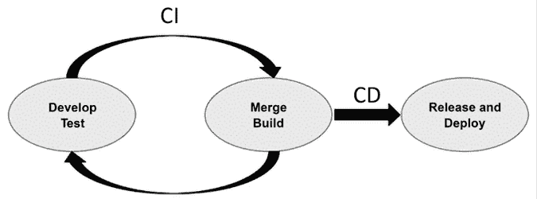

图 2.12：CI/CD 流程的高级视图。

为了使 CI/CD 成为现实，你需要整合帮助自动化你传统上在开发和部署过程中手动执行的任务的工具。例如，如果你可以在代码合并时自动运行测试，或者将你的代码工件/模型推送到适当的环境，那么你就已经走上了 CI/CD 的道路。

我们可以进一步分解，并考虑解决方案的 DevOps 或 MLOps 生命周期中落入的不同类型任务。开发任务通常涵盖从电脑上的空白屏幕到可工作的软件的所有活动。这意味着在 DevOps 或 MLOps 项目中，你大部分时间都花在开发上。这包括从编写代码到正确格式化并测试它的一切。

*表 2.3* 将这些典型任务分开，并提供了一些关于它们如何相互依赖以及您可以在 Python 栈中使用的典型工具的详细信息。

| **生命周期阶段** | **活动** | **详细信息** | **工具** |
| --- | --- | --- | --- |
| 开发 | 测试 | 单元测试：针对测试代码最小功能部分的测试。 | pytest 或 unittest |
| 集成测试：确保代码内部和其他解决方案之间的接口正常工作。 | Selenium |
| 接受测试：业务导向的测试。 | Behave |
| UI 测试：确保任何前端按预期运行。 |  |
| 代码风格检查 | 报告小的风格错误和错误。 | flake8 或 bandit |
| 格式化 | 自动执行格式良好的代码。 | black 或 sort |
| 构建 | 将解决方案整合的最后阶段。 | Docker, twine 或 pip |

表 2.3：任何 DevOps 或 MLOps 项目中执行的开发活动的详细信息。

接下来，我们可以考虑 MLOps 中的机器学习活动，本书将非常关注这些内容。这包括一个经典的 Python 软件工程师通常不需要担心，但对于我们这样的机器学习工程师来说至关重要的所有任务。这包括开发自动训练机器学习模型的能力，运行模型应生成的预测或推理，并在代码管道中将它们整合在一起。它还包括模型版本的管理和部署，这极大地补充了使用像 Git 这样的工具对应用程序代码进行版本控制的想法。最后，机器学习工程师还必须考虑他们必须为解决方案的操作模式构建特定的监控能力，这在传统的 DevOps 工作流程中并未涵盖。对于机器学习解决方案，您可能需要考虑监控诸如精确度、召回率、f1 分数、人口稳定性、熵和数据漂移等因素，以了解您的解决方案中的模型组件是否在可容忍的范围内运行。这与经典的软件工程非常不同，因为它需要了解机器学习模型的工作原理，它们可能出错的方式，以及对数据质量重要性的真正认识。这就是为什么机器学习工程是一个如此令人兴奋的地方！请参阅 *表 2.4* 了解这些类型活动的更多详细信息。

| **生命周期阶段** | **活动** | **详细信息** | **工具** |
| --- | --- | --- | --- |
| 机器学习 | 训练 | 训练模型。 | 任何机器学习包。 |
| 预测 | 运行预测或推理步骤。 | 任何机器学习包。 |
| 构建 | 创建模型嵌入的管道和应用逻辑。 | sklearn 管道、Spark ML 管道、ZenML。 |
| 部署 | 标记和发布您模型和管道的适当版本。 | MLflow 或 Comet.ml. |
| 监控 | 跟踪解决方案性能并在必要时发出警报。 | Seldon, Neptune.ai, Evidently.ai 或 Arthur.ai. |

表 2.4：MLOps 项目中执行的以机器学习为中心活动的详细信息。

最后，在 DevOps 或 MLOps 中，有 Operations 部分，这指的是运维。这全部关于解决方案的实际运行方式，如果出现问题，它将如何通知你，以及它是否能够成功恢复。自然地，运维将涵盖与解决方案的最终打包、构建和发布相关的活动。它还必须涵盖另一种类型的监控，这与 ML 模型的性能监控不同。这种监控更多地关注基础设施利用率、稳定性和可扩展性，关注解决方案的延迟，以及更广泛解决方案的一般运行。在 DevOps 和 MLOps 生命周期中，这部分在工具方面相当成熟，因此有很多选项可供选择。以下是在 *表 2.5* 中提供的一些启动信息。

| **生命周期阶段** | **活动** | **详情** | **工具** |
| --- | --- | --- | --- |
| Ops | 发布 | 将你构建的软件存储在某个中央位置以供重用。 | Twine、pip、GitHub 或 BitBucket。 |
| 部署 | 将你构建的软件推送到适当的目标位置和环境。 | Docker、GitHub Actions、Jenkins、TravisCI 或 CircleCI。 |
| 监控 | 跟踪底层基础设施和一般软件性能的性能和利用率，在必要时发出警报。 | DataDog、Dynatrace 或 Prometheus。 |

表 2.5：在 DevOps 或 MLOps 项目中使解决方案可操作所执行的活动详情。

现在我们已经阐明了 MLOps 生命周期中所需的核心概念，在下一节中，我们将讨论如何实施 CI/CD 实践，以便我们可以在我们的 ML 工程项目中将其变为现实。我们还将扩展这一内容，涵盖对您的 ML 模型和管道性能的自动测试，以及对您的 ML 模型的自动重新训练。

### 使用 GitHub Actions 构建我们的第一个 CI/CD 示例

我们将在本书中使用 GitHub Actions 作为我们的 CI/CD 工具，但还有其他一些工具可以完成同样的工作。GitHub Actions 对任何拥有 GitHub 账户的人来说都是可用的，它有一套非常有用的文档，[`docs.github.com/en/actions`](https://docs.github.com/en/actions)，并且非常容易开始使用，正如我们现在将展示的那样。

当使用 GitHub Actions 时，你必须创建一个 `.yml` 文件，告诉 GitHub 何时执行所需操作，当然，执行什么操作。这个 `.yml` 文件应该放在你的仓库根目录下的 `.github/workflows` 文件夹中。如果它还不存在，你必须创建它。我们将在一个名为 `feature/actions` 的新分支中这样做。通过运行以下命令创建这个分支：

```py
git checkout –b feature/actions 
```

然后，创建一个名为`github-actions-basic.yml`的`.yml`文件。在以下步骤中，我们将构建这个`.yml`文件示例，用于 Python 项目，其中我们将自动安装依赖项，运行一个**代码检查器**（用于检查错误、语法错误和其他问题）的解决方案，然后运行一些单元测试。此示例来自 GitHub Starter Workflows 存储库（[`github.com/actions/starter-workflows/blob/main/ci/python-package-conda.yml`](https://github.com/actions/starter-workflows/blob/main/ci/python-package-conda.yml)）。打开`github-actions-basic.yml`文件，然后执行以下操作：

1.  首先，您定义 GitHub Actions 工作流程的名称以及什么 Git 事件将触发它：

    ```py
    name: Python package
    on: [push] 
    ```

1.  您然后列出您想要作为工作流程一部分执行的工作，以及它们的配置。例如，这里有一个名为`build`的工作，我们希望在最新的 Ubuntu 发行版上运行它，并尝试使用几个不同的 Python 版本进行构建：

    ```py
    jobs:
      build:
        runs-on: ubuntu-latest
        strategy:
          matrix:
            python-version: [3.9, 3.10] 
    ```

1.  您然后定义作为工作一部分执行的步骤。每个步骤由一个连字符分隔，并作为单独的命令执行。重要的是要注意，`uses`关键字获取标准的 GitHub Actions；例如，在第一步中，工作流程使用`checkout`动作的**v2**版本，第二步设置在工作流程中要运行的 Python 版本：

    ```py
    steps:
    - uses: actions/checkout@v3
    - name: Set up Python ${{ matrix.python-version }}
    uses: actions/setup-python@v4
    with:
      python-version: ${{ matrix.python-version }} 
    ```

1.  下一步使用`pip`和`requirements.txt`文件（但当然您也可以使用`conda`）安装解决方案的相关依赖项：

    ```py
    - name: Install dependencies
    run: |
      python -m pip install --upgrade pip
      pip install flake8 pytest
      if [ -f requirements.txt ]; then pip install -r requirements.txt; fi
    - name: Lint with flake8 
    ```

1.  然后，我们运行一些代码检查：

    ```py
    - name: Lint with flake8
    run: |
      # stop the build if there are Python syntax errors or undefined 
      names
      flake8 . --count --select=E9,F63,F7,F82 --show-source --statistics
      # exit-zero treats all errors as warnings. The GitHub editor is 
      127 chars wide
      flake8 . --count --exit-zero --max-complexity=10 --max-line-
      length=127 --statistics 
    ```

1.  最后，我们使用我们最喜欢的 Python 测试库运行我们的测试。对于这一步，我们不想运行整个仓库，因为它相当复杂，所以在这个例子中，我们使用`working-directory`关键字只在该目录中运行`pytest`。

    由于它包含在`test_basic.py`中的简单测试函数，这将自动通过：

    ```py
    - name: Test with pytest
    run: pytest
    working-directory: Chapter02 
    ```

我们现在已经构建了 GitHub Actions 工作流程；下一步是展示其运行。这由 GitHub 自动处理，您只需将更改后的`.yml`文件推送到远程仓库即可。因此，添加编辑后的`.yml`文件，提交它，然后推送它：

```py
git add .github/workflows/github-actions-basic.yml
git commit –m "Basic CI run with dummy test"
git push origin feature/actions 
```

在终端中运行这些命令后，您可以导航到 GitHub UI，然后在顶部菜单栏中点击**操作**。您将看到所有操作运行的视图，如图 2.13 所示。

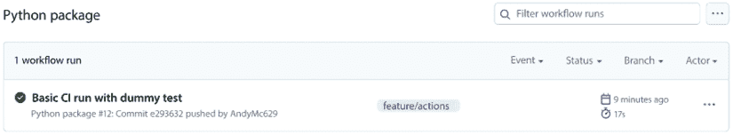

图 2.13：从 GitHub UI 查看的 GitHub Actions 运行。

如果您点击运行，您将看到**操作**运行中所有工作的详细信息，如图 2.14 所示。

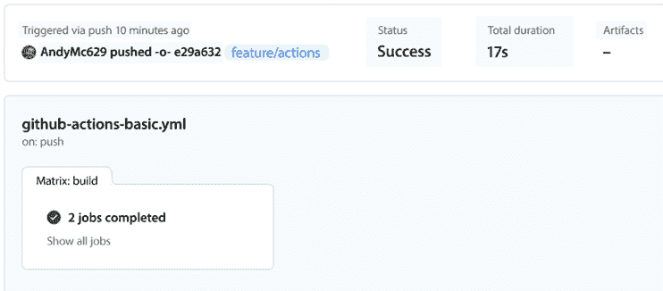

图 2.14：GitHub Actions 运行细节，从 GitHub UI 查看。

最后，您可以进入每个工作，查看执行的步骤，如图 2.15 所示。点击这些步骤也会显示每个步骤的输出。这对于分析运行中的任何失败非常有用。

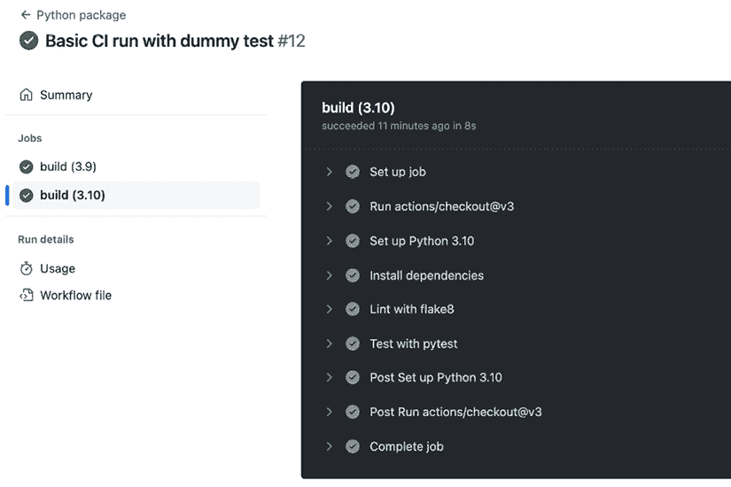

图 2.15：GitHub Actions 运行步骤，如图所示在 GitHub UI 上。

我们到目前为止所展示的是一个 CI 的例子。为了将其扩展到覆盖 CD，我们需要包括将生成的解决方案推送到目标主机目的地的步骤。例如，构建一个 Python 包并将其发布到 `pip`，或者创建一个流水线并将其推送到另一个系统以便被拾取并运行。这个后者的例子将在 *第五章*，*部署模式和工具* 中进行介绍。简而言之，这就是你开始构建你的 CI/CD 流水线的方式。正如之前提到的，在本书的后面，我们将构建针对我们机器学习解决方案的特定工作流程。

现在我们将探讨如何将 CI/CD 概念提升到机器学习工程的下一个层次，并为我们的模型性能构建一些测试，这些测试可以作为持续过程的一部分被触发。

### 持续模型性能测试

作为机器学习工程师，我们不仅关心我们编写的代码的核心功能行为；我们还要关心我们构建的模型。这很容易被忘记，因为传统的软件项目不需要考虑这个组件。

我现在要向您展示的过程将展示如何从一些基础参考数据开始，逐步构建不同类型的测试，以增强你对模型在部署时能够按预期运行的信心。

我们已经介绍了如何使用 Pytest 和 GitHub Actions 进行自动测试，好消息是我们可以将这个概念扩展到包括一些模型性能指标的测试。为此，你需要准备以下几件事情：

1.  在操作或测试中，你需要检索用于执行模型验证的参考数据。这可以通过从远程数据存储（如对象存储或数据库）中拉取来完成，只要提供适当的凭证。我建议将这些存储在 Github 的秘密中。在这里，我们将使用 `sklearn` 库生成的一个数据集作为简单的例子。

1.  你还需要从某个位置检索你想要测试的模型或模型。这可能是一个完整的模型注册表或其他存储机制。与 *第 1 点* 中提到的访问和秘密管理相同的要点同样适用。在这里，我们将从 `Hugging Face Hub`（关于 Hugging Face 的更多内容请见 *第三章*）中拉取一个模型，但这同样可能是一个 MLflow Tracking 实例或其他工具。

1.  你需要定义你想要运行的测试，并且对你能够实现预期结果有信心。你不想编写过于敏感的测试，以免因无关原因触发失败的构建，同时你也想尝试定义一些有助于捕捉你想要标记的失败类型的测试。

对于 *第 1 点*，这里我们从 `sklearn` 库中抓取一些数据，并通过 `pytest fixture` 使其可用于测试：

```py
@pytest.fixture
def test_dataset() -> Union[np.array, np.array]:
    # Load the dataset
    X, y = load_wine(return_X_y=True)
    # create an array of True for 2 and False otherwise
    y = y == 2
    # Train and test split
    X_train, X_test, y_train, y_test = train_test_split(X, y, 
                                                        random_state=42)
    return X_test, y_test 
```

对于**第 2 点**，我将使用`Hugging Face Hub`包来检索存储的模型。如上所述的要点中提到，您需要根据您访问的模型存储机制进行适配。在这种情况下，仓库是公开的，因此无需存储任何机密信息；如果您确实需要这样做，请使用 GitHub Secrets 存储。

```py
@pytest.fixture
def model() -> sklearn.ensemble._forest.RandomForestClassifier:
    REPO_ID = "electricweegie/mlewp-sklearn-wine"
    FILENAME = "rfc.joblib"
    model = joblib.load(hf_hub_download(REPO_ID, FILENAME))
    return model 
```

现在，我们只需要编写测试。让我们从一个确认模型预测产生正确对象类型的简单测试开始：

```py
def test_model_inference_types(model, test_dataset):
    assert isinstance(model.predict(test_dataset[0]), np.ndarray)
    assert isinstance(test_dataset[0], np.ndarray)
    assert isinstance(test_dataset[1], np.ndarray) 
```

然后，我们可以编写一个测试来断言测试数据集上模型性能满足某些特定条件：

```py
def test_model_performance(model, test_dataset):
    metrics = classification_report(y_true=test_dataset[1], 
                                    y_pred=model.predict(test_dataset[0]),
                                    output_dict=True)
    assert metrics['False']['f1-score'] > 0.95
    assert metrics['False']['precision'] > 0.9
    assert metrics['True']['f1-score'] > 0.8
    assert metrics['True']['precision'] > 0.8 
```

之前的测试可以被视为一种类似数据驱动的单元测试，并确保如果您在模型中做了更改（例如，您可能在管道中更改了一些特征工程步骤或更改了一个超参数），您不会违反期望的性能标准。一旦这些测试成功添加到仓库中，在下次推送时，GitHub 动作将被触发，您将看到模型性能测试运行成功。

这意味着我们正在将连续模型验证作为 CI/CD 过程的一部分进行执行！

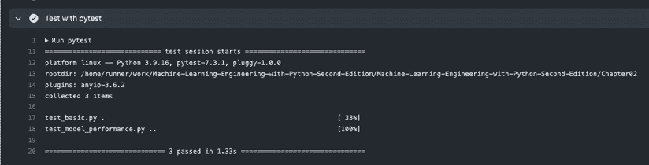

图 2.16：使用 GitHub Actions 作为 CI/CD 过程的一部分成功执行模型验证测试。

更复杂的测试可以在此基础上构建，并且您可以调整环境和包以适应您的需求。

### 持续模型训练

在机器学习工程中，“持续”概念的一个重要扩展是执行持续训练。上一节展示了如何通过推送代码来触发一些测试目的的 ML 过程；现在，我们将讨论如何扩展这一过程，以便在您想要根据代码更改触发模型重新训练的情况下。在本书的后面部分，我们将学习到很多关于基于各种不同触发器（如数据或模型漂移）对 ML 模型进行训练和重新训练的知识，例如在第三章“从模型到模型工厂”中，以及如何在第五章“部署模式和工具”中一般性地部署 ML 模型。鉴于这一点，我们在此不会详细讨论部署到不同目标的具体细节，而是向您展示如何将连续训练步骤构建到您的 CI/CD 管道中。

实际上，这比你可能想象的要简单。如您现在可能已经注意到的，CI/CD 实际上就是关于自动化一系列步骤，这些步骤在开发过程中的特定事件发生时被触发。这些步骤中的每一个都可以非常简单或更复杂，但本质上，我们只是在触发事件激活时按照指定顺序执行的其他程序。

在这个案例中，由于我们关注的是持续训练，我们应该问自己，在代码开发过程中，我们希望在何时重新训练？记住，我们正在忽略最明显的重新训练案例，即按计划或模型性能或数据质量漂移时进行重新训练，这些内容将在后面的章节中涉及。如果我们现在只考虑代码的变化，那么自然的答案是只有在代码有实质性变化时才进行训练。

例如，如果每次我们将代码提交到版本控制时都会触发一个触发器，这很可能会导致大量的计算周期被用于微小的收益，因为机器学习模型在每个情况下可能不会有很大的不同。我们可以改为仅当拉取请求合并到主分支时才触发重新训练。在一个项目中，这是一个标志着新软件功能或功能已被添加并已纳入解决方案核心的事件。

作为提醒，当在 GitHub Actions 中构建 CI/CD 时，你会在 Git 仓库的`.github`文件夹中创建或编辑`YAML`文件。如果我们想在拉取请求上触发训练过程，那么我们可以添加类似以下内容：

```py
name: Continous Training Example
on: [pull_request] 
```

然后我们需要定义将适当的训练脚本推送到目标系统并运行它的步骤。首先，这很可能会需要获取一些访问令牌。假设这是针对 AWS，并且你已经将相应的 AWS 凭证作为 GitHub Secrets 加载；更多详细信息，请参阅*第五章*，*部署模式和工具*。然后我们就能在`deploy-trainer`工作的第一步中检索到这些令牌：

```py
jobs:
  deploy-trainer 
    runs-on: [ubuntu-latest]
    steps:
    - name: Checkout       uses: actions/checkout@v3
    - name: Configure AWS Credentials
      uses: aws-actions/configure-aws-credentials@v2
      with:
        aws-access-key-id: ${{ secrets.AWS_ACCESS_KEY_ID }}
        aws-secret-access-key: ${{ secrets.AWS_SECRET_ACCESS_KEY }}
        aws-region: us-east-2
        role-to-assume: ${{ secrets.AWS_ROLE_TO_ASSUME }}
        role-external-id: ${{ secrets.AWS_ROLE_EXTERNAL_ID }}
        role-duration-seconds: 1200
        role-session-name: TrainingSession 
```

你可能还想将你的仓库文件复制到目标**S3**目的地；也许它们包含主训练脚本运行所需的模块。然后你可以做类似这样的事情：

```py
 - name: Copy files to target destination
    run: aws s3 sync . s3://<S3-BUCKET-NAME> 
```

最后，你可能需要运行某种使用这些文件进行训练的过程。有如此多的方法可以做到这一点，我在这个例子中省略了具体细节。关于部署机器学习过程的各种方法将在*第五章*，*部署模式和工具*中介绍：

```py
 - name: Run training job
       run: |
        # Your bespoke run commands go in here using the tools of your choice! 
```

有了这些，你就拥有了运行持续机器学习模型训练所需的所有关键部件，以补充其他关于持续模型性能测试的部分。这就是如何将 DevOps 的 CI/CD 概念带入 MLOps 的世界！

# 摘要

本章主要讲述了为未来工作打下坚实基础的内容。我们讨论了所有机器学习工程项目中常见的开发步骤，我们称之为“*发现、探索、开发、部署*”，并将这种思维方式与传统方法如 CRISP-DM 进行了对比。特别是，我们概述了每个步骤的目标及其期望的输出。

接着，我们进行了关于工具的高级讨论，并介绍了主要设置步骤。我们设置了开发代码的工具，跟踪代码的更改，管理我们的机器学习工程项目，最后部署我们的解决方案。

在本章的其余部分，我们详细介绍了我们之前概述的四个步骤的细节，特别关注了*开发*和*部署*阶段。我们的讨论涵盖了从瀑布式和敏捷开发方法论的优缺点到环境管理，再到软件开发最佳实践的各个方面。我们探讨了如何打包您的机器学习解决方案，以及可供您使用的部署基础设施，并概述了设置您的 DevOps 和 MLOps 工作流程的基本知识。我们通过详细讨论如何将测试应用于我们的机器学习代码来结束本章，包括如何将此测试自动化作为 CI/CD 管道的一部分。然后，我们将这些概念扩展到持续模型性能测试和持续模型训练。

在下一章中，我们将关注如何使用我们在此处讨论的许多技术来构建执行模型自动训练和再训练的软件。

# 加入我们的 Discord 社区

加入我们社区的 Discord 空间，与作者和其他读者进行讨论：

[`packt.link/mle`](https://packt.link/mle)


