# 3

# 从模型到模型工厂

本章全部关于机器学习工程中最重要的概念之一：您如何将训练和微调模型的困难任务自动化、可重复和可扩展到生产系统？

我们将在理论和实践层面回顾训练不同机器学习模型的主要思想，然后提供重新训练的动机，即机器学习模型不会永远表现良好的观点。这个概念也被称为**漂移**。在此之后，我们将介绍特征工程背后的主要概念，这是任何机器学习任务的关键部分。接下来，我们将深入探讨机器学习是如何工作的，以及它本质上是一系列优化问题。我们将探讨在着手解决这些优化问题时，您可以使用各种工具在各个抽象级别上这样做。特别是，我们将讨论您如何提供您想要训练的模型的直接定义，我称之为*手动操作*，或者您如何执行超参数调整或**自动化机器学习**（**AutoML**）。我们将在查看使用不同库和工具的示例之后，探讨如何将它们实现以供后续在训练工作流程中使用。然后，我们将基于我们在*第二章*（机器学习开发过程）中进行的初步工作，通过向您展示如何与不同的 MLflow API 接口来管理模型并在 MLflow 模型注册表中更新它们的状态，来构建 MLflow。

我们将本章的结尾放在讨论允许您将所有机器学习模型训练步骤链接成单个单元（称为**管道**）的实用工具上，这些单元可以帮助作为我们之前讨论的所有步骤的更紧凑表示。总结部分将回顾关键信息，并概述我们在这里所做的工作将在*第四章*（打包）、*第五章*（部署模式和工具）中进一步构建。

本质上，本章将告诉您在您的解决方案中需要将哪些内容组合在一起，而后续章节将告诉您如何将这些内容稳健地组合在一起。我们将在以下章节中介绍这一点：

+   定义模型工厂

+   学习关于学习

+   为机器学习构建特征

+   设计您的训练系统

+   需要重新训练

+   持久化您的模型

+   使用管道构建模型工厂

# 技术要求

如前几章所述，本章所需的软件包包含在`Chapter03`文件夹中的`.yml`文件中，因此要为本章创建 conda 环境，只需运行以下命令：

```py
conda env create –f mlewp-chapter03.yml 
```

这将安装包括 MLflow、AutoKeras、Hyperopt Optuna、auto-sklearn、Alibi Detect 和 Evidently 在内的软件包。

注意，如果你在配备苹果硅的 Macbook 上运行这些示例，直接使用`pip`或`conda`安装 TensorFlow 和`auto-sklearn`可能不会成功。相反，你需要安装以下包来与 TensorFlow 一起工作：

```py
pip install tensorflow-macos 
```

然后

```py
pip install tensorflow-metal 
```

要安装`auto-sklearn`，你需要运行

```py
brew install swig 
```

或者使用你使用的任何 Mac 包管理器安装`swig`，然后你可以运行

```py
pip install auto-sklearn 
```

# 定义模型工厂

如果我们想要开发从临时、手动和不一致的执行转向可以自动化、稳健和可扩展的机器学习系统的解决方案，那么我们必须解决如何创建和培育表演明星：模型本身的问题。

在本节中，我们将讨论必须组合在一起的关键组件，以实现这一愿景，并提供一些示例，说明这些组件在代码中可能的样子。这些示例不是实现这些概念的唯一方式，但它们将使我们能够开始构建我们的机器学习解决方案，以实现我们想要在*现实世界*中部署所需的复杂程度。

我们在这里讨论的主要组件如下：

+   **训练系统**：一个用于以自动化方式在我们拥有的数据上稳健地训练我们模型的系统。这包括我们为在数据上训练我们的机器学习模型而开发的全部代码。

+   **模型存储库**：一个用于持久化成功训练的模型的地方，以及一个与将运行预测的组件共享生产就绪模型的地方。

+   **漂移检测器**：一个用于检测模型性能变化的系统，以触发训练运行。

这些组件及其与部署的预测系统的交互，构成了模型工厂的概念。以下图示展示了这一点：

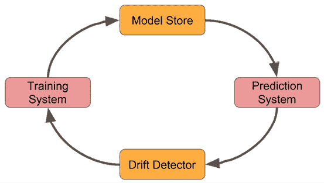

图 3.1：模型工厂的组件。

在本章的剩余部分，我们将详细探讨我们之前提到的三个组件。**预测系统**将是后续章节的重点，特别是*第五章*，*部署模式和工具*。

首先，让我们探讨训练机器学习模型意味着什么，以及我们如何构建系统来完成这项工作。

# 学习如何学习

在本质上，机器学习算法都包含一个关键特性：某种形式的优化。这些算法能够“学习”（意味着它们在接触到更多观察时，会迭代地改善它们在适当指标上的性能），这使得它们如此强大和令人兴奋。当我们说“训练”时，我们指的就是这个过程。

在本节中，我们将介绍支撑训练的关键概念，我们可以在代码中选择的选项，以及这些选项对我们训练系统潜在性能和能力的影响。

## 定义目标

我们刚刚提到训练是一个优化过程，但我们到底在优化什么？让我们考虑监督学习。在训练过程中，我们提供我们希望预测给定特征的标签或值，以便算法可以学习特征与目标之间的关系。为了在训练过程中优化算法的内部参数，它需要知道其当前参数集会有多大的“错误”。优化就是通过更新参数，使这种“错误”的度量越来越小。这正是损失函数概念所捕捉的。

损失函数有多种形式，如果你需要，你甚至可以使用很多包来定义自己的损失函数，但有一些标准损失函数是值得了解的。其中一些名称在此处提到。

对于回归问题，你可以使用以下方法：

+   均方误差/L2 损失

+   均方误差/L1 损失

对于二元分类问题，你可以使用以下方法：

+   对数损失/逻辑损失/交叉熵损失

+   拉链损失

对于多类分类问题，你可以使用以下方法：

+   多类熵损失

+   Kullback-Leibler 散度损失

在无监督学习中，损失函数的概念仍然适用，但现在目标是输入数据的正确分布。在定义你的损失函数之后，你需要对其进行优化。这就是我们将在下一节中探讨的内容。

## 剪切损失

到目前为止，我们知道训练完全是关于优化的，我们也知道要优化什么，但我们还没有介绍如何优化。

通常，有很多选项可以选择。在本节中，我们将探讨一些主要的方法。

以下是一些**恒定学习率**的方法：

+   **梯度下降**：此算法通过计算我们的损失函数相对于参数的导数，然后使用这个导数来构建一个更新，使我们在减少损失的方向上移动。

+   **批量梯度下降**：我们用来在参数空间中移动的梯度是通过取所有找到的梯度的平均值得到的。它是通过查看我们的训练集中的每个数据点，并检查数据集不是太大，损失函数相对平滑且凸来做到这一点的。这几乎可以达到全局最小值。

+   **随机梯度下降**：在每次迭代中，使用一个随机选择的数据点来计算梯度。这有助于更快地达到损失函数的全局最小值，但它在每次优化步骤后对损失值的突然波动更敏感。

+   **小批量梯度下降**：这是批量和随机两种情况的混合。在这种情况下，对于参数的每次更新，都会使用多个大于 1 但小于整个数据集的点来更新梯度。这意味着批量大小的现在是一个需要调整的参数。批量大时，我们更接近批梯度下降，这提供了更好的梯度估计，但速度较慢。批量小时，我们更接近随机梯度下降，这速度更快，但不够稳健。小批量允许我们决定在这两者之间想要处于哪个位置。可以根据各种标准选择批大小。这些可能涉及一系列的内存考虑。并行处理的大批量批次将消耗更多内存，同时为小批量提供更好的泛化性能。有关更多详细信息，请参阅 Ian Goodfellow、Yoshua Bengio 和 Aaron Courville 所著的《深度学习》一书的第八章，网址为[`www.deeplearningbook.org/`](https://www.deeplearningbook.org/)。

然后，还有**自适应学习率方法**。以下是一些最常见的：

+   **AdaGrad**：学习率参数根据优化过程中的学习更新属性动态更新。

+   **AdaDelta**：这是`AdaGrad`的一个扩展，它不使用所有之前的梯度更新。相反，它使用一个滚动窗口来跟踪更新。

+   **RMSprop**：它通过维护所有梯度步骤平方的移动平均值来工作。然后，它将最新的梯度除以这个值的平方根。

+   **亚当**：这是一个旨在结合`AdaGrad`和`RMSprop`优点的算法。

对于我们这些机器学习工程师来说，所有这些优化方法的限制和能力都很重要，因为我们希望确保我们的训练系统使用正确的工具来完成工作，并且对当前问题是最优的。仅仅意识到有多个内部优化选项也会帮助你集中精力并提高性能。

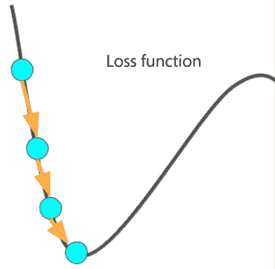

图 3.2：训练作为损失函数优化的简单表示。

现在，让我们讨论如何通过特征工程的过程准备模型工厂完成其工作所需的原始材料，即数据。

## 准备数据

数据可以以各种类型和质量出现。它可以来自关系型数据库的表格数据，也可以是从爬取的网站中获取的非结构化文本，或者是 REST API 的格式化响应，还可以是图像、音频文件，或者任何你能想到的其他形式。

如果你想要在这组数据上运行机器学习算法，你必须做的第一件事是让它对这些算法来说是可读的。这个过程被称为*特征工程*，接下来的几节将讨论这一点，以为你提供主要原则的基础。关于特征工程有许多优秀的资源可以深入探讨，所以我们在这里只会触及一些主要概念。更多信息，你可以查阅索莱达·加利亚（Soledad Galli）所著的《特征工程食谱》（Feature Engineering Cookbook），Packt 出版社，2022 年版。

# 为机器学习构建特征

在我们将任何数据输入到机器学习模型之前，它必须被转换成我们模型能够*理解*的状态。我们还需要确保我们只对那些我们认为有助于提高模型性能的数据进行转换，因为这很容易导致特征数量激增，并成为*维度诅咒*的受害者。这指的是一系列相关观察，在高维问题中，数据在特征空间中变得越来越稀疏，因此要实现统计显著性可能需要指数级更多的数据。在本节中，我们不会涵盖特征工程的理论基础。相反，我们将关注作为机器学习工程师，我们如何帮助自动化生产中的某些步骤。为此，我们将快速回顾主要类型的特征准备和特征工程步骤，以便我们可以在本章后面的部分添加必要的组件。

## 构建类别特征

分类别特征是指形成一组非数值的、不同的对象集合，例如星期几或发色。它们可以在你的数据中以多种方式分布。

为了让机器学习算法能够*消化*类别特征，我们需要将特征转换成某种数值形式，同时确保数值表示*不会产生偏差或不适当地影响我们的值*。一个例子是，如果我们有一个包含超市中不同产品销售的特征：

```py
data = [['Bleach'], ['Cereal'], ['Toilet Roll']] 
```

在这里，我们可以使用`sklearn`的`OrdinalEncoder`将每个类别映射到一个正整数：

```py
from sklearn import preprocessing
ordinal_enc = preprocessing.OrdinalEncoder()
ordinal_enc.fit(data)
# Print returns [[0.]
#    [1.]
#    [2.]]
print(ordinal_enc.transform(data)) 
```

这就是所谓的**序数编码**。我们已经将这些特征映射到数字上，所以这里有一个大勾，但这种表示合适吗？好吧，如果你稍微思考一下，其实并不合适。这些数字似乎暗示谷物对漂白剂就像卫生纸对谷物一样，而卫生纸和漂白剂的平均值是谷物。这些陈述没有意义（我也不想在早餐时吃漂白剂和卫生纸），所以这表明我们应该尝试不同的方法。然而，在需要保持分类特征中顺序概念的情况下，这种表示是合适的。一个很好的例子是，如果我们有一个调查，参与者被要求对陈述“早餐是一天中最重要的一餐”发表意见。如果参与者被告知从列表中选择一个选项，如“强烈不同意”，“不同意”，“既不同意也不反对”，“同意”，“强烈同意”，然后我们将这些数据序数编码以映射到数字列表*1*，*2*，*3*，*4*和*5*，那么我们可以更直观地回答诸如“平均反应是更同意还是不同意？”和“对这个陈述的意见有多普遍？”等问题。序数编码在这里会有帮助，但正如我们之前提到的，在这种情况下并不一定正确。

我们可以做的事情是考虑这个特性中的项目列表，然后提供一个二进制数来表示原始列表中的值是否存在。所以，在这里，我们将决定使用`sklearn`的`OneHotEncoder`：

```py
onehot_enc = preprocessing.OneHotEncoder()
onehot_enc.fit(data)
# Print returns [[1\. 0\. 0.]
#    [0\. 1\. 0.]
#    [0\. 0\. 1.]]
print(onehot_enc.transform(data).toarray()) 
```

这种表示被称为**独热编码**。这种方法编码有几个优点，包括以下内容：

+   没有强制排序的值。

+   所有特征向量都有单位范数（关于这一点稍后讨论）。

+   每个独特的特征都与其他特征正交，所以表示中没有隐含的奇怪平均值或距离陈述。

这种方法的一个缺点是，如果你的分类列表包含大量实例，那么你的特征向量的大小将很容易膨胀，我们不得不在算法级别上存储和处理极其稀疏的向量和矩阵。这很容易导致几个实现中的问题，也是可怕的维度诅咒的另一种表现。

在下一节中，将讨论数值特征。

## 工程数值特征

准备数值特征稍微容易一些，因为我们已经有了数字，但仍有几个步骤需要我们完成以准备许多算法。对于大多数机器学习算法，特征必须在相似的尺度上；例如，它们必须在-1 和 1 或 0 和 1 之间具有幅度。这有一个相对明显的原因，即某些算法会自动将高达百万美元的房价特征和房屋面积的另一个特征赋予更大的权重。这也意味着我们失去了关于特定值在其分布中位置的有用概念。例如，一些算法会从将特征缩放到中值美元价值和中值面积价值都表示为 0.5 而不是 500,000 和 350 中受益。或者，我们可能希望所有分布都具有相同的含义，如果它们是正态分布的，这将允许我们的算法专注于分布的形状而不是它们的位置。

那么，我们该怎么办呢？嗯，就像往常一样，我们不是从零开始，我们可以应用一些标准技术。这里列出了其中一些非常常见的，但它们的数量太多，无法全部包括：

+   **标准化**：这是一种数值特征的转换，假设在缩放方差为 1 和平均值为 0 之前，值的分布是正态的或高斯分布。如果你的数据确实是正态的或高斯分布，那么这是一个很好的技术。标准化的数学公式非常简单，所以我在这里提供了它，其中 *z* 代表变换后的值，*x* 是原始值，而  和  分别是平均值和标准差：

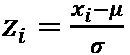

+   **最小-最大归一化**：在这种情况下，我们希望缩放数值特征，使它们始终在 0 和 1 之间，无论它们遵循的分布类型如何。

这在直观上很容易做到，因为你只需要从任何给定值中减去分布的最小值，然后除以数据的范围（最大值减去最小值）。你可以将这一步视为确保所有值都大于或等于 0。第二步是确保它们的最大尺寸为 1。这可以用一个简单的公式来表示，其中变换后的数字 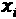 是原始数字，而  代表该特征的整个分布：

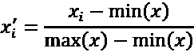

+   **特征向量归一化**：在这里，您需要将数据集中的每个样本缩放，使它们的范数等于 1。如果您使用的是距离或特征之间的余弦相似度是重要组成部分的算法，这可能会非常重要，例如在聚类中。它也常与**TF-IDF** **统计**等其他特征工程方法结合使用，在文本分类中。在这种情况下，假设您的整个特征是数值的，您只需计算特征向量的适当范数，然后将每个分量除以该值。例如，如果我们使用特征向量的欧几里得或 L2 范数，，那么我们将通过以下公式转换每个分量，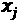：

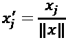

为了突出这些简单步骤对模型性能的改进，我们将从`sklearn`葡萄酒数据集的一个简单示例中进行分析。在这里，我们将对未标准化的数据进行 Ridge 分类器的训练，然后对已标准化的数据进行训练。完成这些后，我们将比较结果：

1.  首先，我们必须导入相关库并设置我们的训练和测试数据：

    ```py
    from sklearn.model_selection import train_test_split
    from sklearn.preprocessing import StandardScaler
    from sklearn.linear_model import RidgeClassifier
    from sklearn import metrics
    from sklearn.datasets import load_wine
    from sklearn.pipeline import make_pipeline
    X, y = load_wine(return_X_y=True) 
    ```

1.  然后，我们必须进行典型的 70/30 训练/测试分割：

    ```py
    X_train, X_test, y_train, y_test =\
    train_test_split(X, y, test_size=0.30, random_state=42) 
    ```

1.  接下来，我们必须在不进行特征标准化的情况下训练一个模型，并在测试集上进行预测：

    ```py
    no_scale_clf = make_pipeline(RidgeClassifier(tol=1e-2,
                                                 solver="sag"))
    no_scale_clf.fit(X_train, y_train)
    y_pred_no_scale = no_scale_clf.predict(X_test) 
    ```

1.  最后，我们必须做同样的事情，但添加一个标准化步骤：

    ```py
    std_scale_clf = make_pipeline(StandardScaler(), RidgeClassifier(tol=1e-2, solver="sag"))
    std_scale_clf.fit(X_train, y_train)
    y_pred_std_scale = std_scale_clf.predict(X_test) 
    ```

1.  现在，如果我们打印一些性能指标，我们会看到没有缩放的情况下，预测的准确率为`0.76`，而其他指标，如`precision`、`recall`和`f1-score`的加权平均值分别为`0.83`、`0.76`和`0.68`：

    ```py
    print('\nAccuracy [no scaling]')
    print('{:.2%}\n'.format(metrics.accuracy_score(y_test, y_pred_no_
           scale)))
    print('\nClassification Report [no scaling]')
    print(metrics.classification_report(y_test, y_pred_no_scale)) 
    ```

1.  这会产生以下输出：

    ```py
    Accuracy [no scaling]75.93%
    Classification Report [no scaling]
                  precision    recall  f1-score   support
               0       0.90      1.00      0.95        19
               1       0.66      1.00      0.79        21
               2       1.00      0.07      0.13        14
        accuracy                           0.76        54
       macro avg       0.85      0.69      0.63        54
    weighted avg       0.83      0.76      0.68        54 
    ```

1.  在数据标准化的情况下，所有指标都非常好，准确率以及`precision`、`recall`和`f1-score`的加权平均值都达到了`0.98`：

    ```py
    print('\nAccuracy [scaling]')
    print('{:.2%}\n'.format(metrics.accuracy_score(y_test, y_pred_std_scale)))
    print('\nClassification Report [scaling]')
    print(metrics.classification_report(y_test, y_pred_std_scale)) 
    ```

1.  这会产生以下输出：

    ```py
    Accuracy [scaling]
    98.15%
    Classification Report [scaling]
                  precision    recall  f1-score   support
               0       0.95      1.00      0.97        19
               1       1.00      0.95      0.98        21
               2       1.00      1.00      1.00        14
        accuracy                           0.98        54
       macro avg       0.98      0.98      0.98        54
    weighted avg       0.98      0.98      0.98        54 
    ```

在这里，我们只需在机器学习训练过程中添加一个简单的步骤，就能看到性能的显著提升。

现在，让我们看看训练是如何设计和在其核心工作的。这将帮助我们为我们的算法和训练方法做出明智的选择。

# 设计您的训练系统

从最高层次来看，机器学习模型经历一个生命周期，有两个阶段：**训练**阶段和**输出**阶段。在训练阶段，模型被喂给数据以从数据集中学习。在预测阶段，模型（包括其优化的参数）按顺序被喂给新数据，并返回所需的输出。

这两个阶段在计算和处理需求上非常不同。在训练阶段，我们必须让模型接触到尽可能多的数据以获得最佳性能，同时确保将数据集的子集保留用于测试和验证。模型训练本质上是一个优化问题，需要几个增量步骤才能得到解决方案。

因此，这需要大量的计算资源，在数据相对较大（或计算资源相对较低）的情况下，可能需要很长时间。即使您有一个小数据集和大量的计算资源，训练仍然不是一个低延迟的过程。此外，它通常是以批量方式运行的，并且数据集的小幅增加对模型性能的影响不大（也有例外）。另一方面，预测是一个更直接的过程，可以将其视为在代码中运行任何计算或函数：输入进入，进行计算，然后输出结果。这（通常）不需要大量的计算资源，并且具有低延迟。

综合来看，这意味着首先，从逻辑和代码的角度来看，将这两个步骤（训练和预测）分开是有意义的。其次，这意味着我们必须考虑这两个阶段的不同执行需求，并将这些需求纳入我们的解决方案设计中。最后，我们需要对训练方案做出选择，包括是否批量安排训练、使用增量学习，或者根据模型性能标准触发训练。这些都是您训练系统中的关键部分。

## 训练系统设计选项

在我们创建训练系统的任何详细设计之前，一些一般性问题总是适用的：

+   是否有适合该问题的基础设施可用？

+   数据在哪里，我们将如何将其输入到算法中？

+   我是如何测试模型性能的？

在基础设施方面，这可能会非常依赖于您用于训练的模型和数据。如果您打算在具有三个特征的数据上训练线性回归，并且您的数据集只包含 10,000 个表格记录，那么您可能无需过多考虑就能在笔记本电脑级别的硬件上运行。这不是很多数据，并且您的模型没有很多自由参数。如果您要在更大的数据集上训练，例如包含 1 亿个表格记录的数据集，那么您可能可以从 Spark 集群之类的并行化中受益。然而，如果您要在 1,000 张图像上训练一个 100 层的深度卷积神经网络，那么您可能需要使用 GPU。有很多选择，但关键是选择适合这项工作的正确工具。

关于如何将数据输入到算法中的问题，这可能并不简单。我们是否将对远程托管数据库运行 SQL 查询？如果是这样，我们将如何连接到它？运行查询的机器是否有足够的 RAM 来存储数据？

如果不是这样，我们需要考虑使用一种可以逐步学习的算法吗？对于经典的算法性能测试，我们需要使用机器学习领域的知名技巧，并在我们的数据上执行训练/测试/验证拆分。我们还需要决定我们可能想要采用的交叉验证策略。然后，我们需要选择我们偏好的模型性能指标并适当地计算它。然而，作为机器学习工程师，我们也会对*其他*性能指标感兴趣，例如训练时间、内存的有效使用、延迟，以及（我敢说）成本。我们还需要了解我们如何衡量并优化这些指标。

只要我们在进行过程中牢记这些事情，我们就会处于有利的位置。现在，让我们转向设计。

正如我们在本节引言中提到的，我们需要考虑两个基本方面：训练和输出过程。我们可以以两种方式将这些结合起来作为我们的解决方案。我们将在下一节中讨论这一点。

## 训练-运行

*选项 1*是在同一过程中执行训练和预测，训练可以在批量或增量模式下进行。这在下图中以示意图的形式展示。这种模式被称为*训练-运行*：

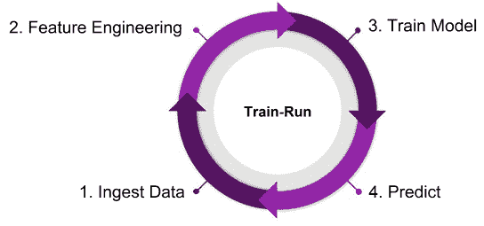

图 3.3：训练-运行过程。

这种模式是两种模式中较简单的一种，但也是对现实世界问题最不理想的一种，因为它并不体现我们之前提到的*关注点分离*原则。这并不意味着它是一个无效的模式，它确实有易于实现的优点。在这里，我们在做出预测之前运行整个训练过程，中间没有真正的*中断*。根据我们之前的讨论，如果我们必须以非常低延迟的方式提供预测，我们可以自动排除这种方法；例如，通过事件驱动或流式解决方案（稍后会有更多介绍）。

虽然这种方法*可能*完全有效（我在实践中见过几次），但这可能是在以下情况下：你应用的算法实际上非常轻量级，你需要继续使用非常最新的数据，或者你运行的大批量过程相对不频繁。

虽然这是一个简单的方法，并不适用于所有情况，但它确实具有明显的优势：

+   由于你训练的频率与预测的频率相同，你正在尽一切可能防止现代性能退化，这意味着你正在对抗*漂移*（参见本章后面的部分）。

+   你显著降低了你解决方案的复杂性。虽然你紧密耦合了两个组件，这通常应该避免，但训练和预测阶段可能非常简单，以至于如果你只是将它们放在一起，你会节省大量的开发时间。这是一个非同小可的观点，因为*开发时间是有成本的*。

现在，让我们看看另一种情况。

## 训练-持久

*选项 2*是训练以批处理方式运行，而预测以认为合适的任何模式运行，预测解决方案从存储中读取已训练的模型。我们将这种设计模式称为*train-persist*。这将在以下图中展示：

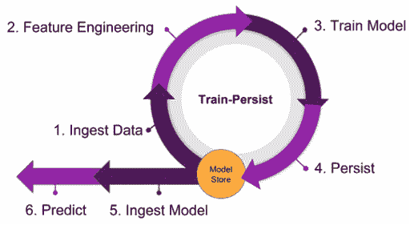

图 3.4：train-persist 过程。

如果我们要训练我们的模型并持久化模型，以便它可以在以后由预测过程拾取，那么我们需要确保以下几点：

+   我们有哪些模型存储选项？

+   是否有明确的机制来访问我们的模型存储（写入和读取）？

+   我们应该多久训练一次，多久预测一次？

在我们的情况下，我们将通过使用在第二章“机器学习开发过程”中介绍但将在后续部分重新讨论的 MLflow 来解决前两个问题。还有许多其他解决方案可用。关键点是，无论你使用什么作为模型存储和训练与预测过程之间的*交接*点，都应该以稳健和可访问的方式使用。

第三个点更复杂。你可以在一开始就决定你想按计划进行训练，并坚持下去。或者你可以更复杂，开发出在训练发生之前必须满足的触发标准。再次强调，这是你需要与你的团队一起做出的选择。在本章的后面部分，我们将讨论安排你的训练运行的机制。

在下一节中，我们将探讨如果你想要根据你的模型性能随时间可能退化的情况来触发你的训练运行，你需要做什么。

# 需要重新训练

你不会期望在完成教育后，就再也不读论文或书籍，也不再与任何人交谈，这意味着你将无法对世界正在发生的事情做出明智的决策。因此，你不应该期望一个机器学习模型一旦训练就永远表现良好。

这个想法直观易懂，但它代表了机器学习模型中一个被称为**漂移**的正式问题。漂移是一个涵盖你模型性能随时间下降的多种原因的术语。它可以分为两大类：

+   **概念漂移**：当你的数据特征与试图预测的结果之间的基本关系发生变化时，就会发生这种情况。有时，这也被称为*协变量漂移*。一个例子是在训练时，你只有一部分数据似乎显示出特征和结果之间的线性关系。如果结果是，在部署后收集了大量更多数据后，这种关系是非线性的，那么就发生了概念漂移。对此的缓解措施是使用更能代表正确关系的正确数据重新训练。

+   **数据漂移**：这种情况发生在你用作特征的变量的统计属性发生变化时。例如，你可能在你的某个模型中使用*年龄*作为特征，但在训练时间，你只有 16 至 24 岁年龄段的数据。

如果模型被部署，并且你的系统开始摄入更广泛年龄层的数据，那么你就遇到了数据漂移。

事实上，漂移是作为机器学习工程师生活的一部分，因此我们将花费大量时间来了解如何检测和减轻它。但为什么它会发生？正如你所预期的那样，漂移有多种原因需要考虑。让我们考虑一些例子。比如说，你用于采样训练数据的机制在某些方面不合适；也许你为特定的地理区域或人口统计进行了子采样，但你希望模型在更普遍的情况下应用。

在我们操作的问题域中可能存在季节性影响，正如在销售预测或天气预测中可以预期的那样。异常情况可能由“黑天鹅”或罕见事件引起，如地缘政治事件甚至新冠疫情大流行。数据收集过程可能在某个时候引入错误，例如，如果上游系统存在错误或过程本身没有遵循或已改变。最后一个例子在需要手动输入数据的流程中可能特别普遍。如果销售人员要被信任正确标记**客户资源管理**（**CRM**）系统中销售的当前状态，那么训练或经验较少的销售人员可能不会准确或及时地标记数据。尽管在软件开发领域的许多方面取得了进步，但这种数据收集过程仍然非常普遍，因此你必须在自己的机器学习系统开发中防范这一点。可以通过尝试强制执行数据收集的更多自动化或为输入数据的人提供指南（例如下拉菜单）来略微减轻这种情况，但几乎可以肯定，大量的数据仍然以这种方式收集，并且在未来一段时间内也将如此。

现在应该很清楚，漂移是您系统需要考虑的重要方面，但实际上处理它是一个多步骤的过程。我们首先需要检测漂移。在部署的模型中检测漂移是 MLOps 的关键部分，作为机器学习工程师，您应该将其放在首位。然后我们需要诊断漂移的来源；这通常涉及负责监控的人员进行某种形式的离线调查。我们将提到的工具和技术将帮助您定义工作流程，从而开始自动化这个过程，以便在检测到问题时处理任何可重复的任务。最后，我们需要实施一些措施来补救漂移的影响：这通常涉及使用更新或修正的数据集重新训练模型，但可能需要重新开发或重写模型的关键组件。一般来说，如果您能够构建您的训练系统，以便根据对模型中漂移的了解有意识地触发重新训练，那么您将节省大量的计算资源，因为只有在需要时才进行训练。

下一节将讨论我们可以检测模型中漂移的一些方法。这将帮助我们开始构建解决方案中的智能重新训练策略。

## 检测数据漂移

到目前为止，我们已经定义了漂移，并且我们知道如果我们想构建复杂的训练系统，检测它将非常重要。下一个合乎逻辑的问题是，*我们该如何做呢？*

我们在上一节中给出的漂移定义非常定性；随着我们探索有助于我们检测漂移的计算和概念，我们可以开始使这些陈述更加量化。

在本节中，我们将大量依赖 Seldon 的`alibi-detect` Python 包，在撰写本文时，该包在**Anaconda.org**上不可用，但在 PyPI 上有。要获取此包，请使用以下命令：

```py
pip install alibi
pip install alibi-detect 
```

使用`alibi-detect`包非常简单。在下面的示例中，我们将使用来自`sklearn`的`wine`数据集，该数据集将在本章的其他地方使用。在这个第一个例子中，我们将数据分割为 50/50，并将其中一个集合称为*参考*集，另一个称为*测试*集。然后我们将使用 Kolmogorov-Smirnov 测试来证明这两个数据集之间没有出现数据漂移，正如预期的那样，然后人为地添加一些漂移以显示它已被成功检测：

1.  首先，我们必须从`alibi-detect`包中导入`TabularDrift`检测器，以及用于加载数据和分割数据的相关包：

    ```py
    from sklearn.datasets import load_wine
    from sklearn.model_selection import train_test_split
    import alibi
    from alibi_detect.cd import TabularDrift 
    ```

1.  接下来，我们必须获取并分割数据：

    ```py
    wine_data = load_wine()
    feature_names = wine_data.feature_names
    X, y = wine_data.data, wine_data.target
    X_ref, X_test, y_ref, y_test = train_test_split(X, y, test_size=0.50,
                                                   random_state=42) 
    ```

1.  接下来，我们必须使用参考数据和提供的`p-value`来初始化我们的漂移检测器，以便在统计显著性测试中使用。如果您希望使您的漂移检测器在数据分布中出现较小差异时触发，您必须选择一个更大的`p_val`：

    ```py
    cd = TabularDrift(X_ref=X_ref, p_val=.05 ) 
    ```

1.  现在我们可以检查测试数据集相对于参考数据集是否存在漂移：

    ```py
    preds = cd.predict(X_test)
    labels = ['No', 'Yes']
    print('Drift: {}'.format(labels[preds['data']['is_drift']])) 
    ```

1.  这返回了 `'Drift: No'`。

1.  因此，正如预期的那样，我们没有检测到漂移（有关更多信息，请参阅以下 *重要提示*）。

1.  尽管在这种情况下没有发生漂移，我们可以轻松地模拟一个场景，其中用于测量化学性质的化学装置经历了校准错误，所有值都被记录为比真实值高 10%。在这种情况下，如果我们再次在相同的参考数据集上运行漂移检测，我们将得到以下输出：

    ```py
    X_test_cal_error = 1.1*X_test
    preds = cd.predict(X_test_cal_error)
    labels = ['No', 'Yes']
    print('Drift: {}'.format(labels[preds['data']['is_drift']])) 
    ```

1.  这返回了 `'Drift: Yes'`，表明漂移已被成功检测到。

重要提示

这个例子非常人为化，但有助于说明这一点。在一个标准的像这样的数据集中，随机抽取的 50%的数据和剩下的 50%的数据之间不会有数据漂移。这就是为什么我们必须人为地 *移动* 一些点来表明检测器确实起作用。在现实世界场景中，数据漂移可能由于测量所用的传感器更新；到消费者行为的改变；一直到数据库软件或模式的改变而自然发生。因此，要保持警惕，因为许多漂移情况不会像这个例子中那样容易被发现！

这个例子展示了如何用几行简单的 Python 代码检测数据集中的变化，这意味着如果我们不重新训练以考虑数据的新的属性，我们的机器学习模型可能会开始性能下降。我们还可以使用类似的技术来跟踪我们的模型性能指标，例如准确度或均方误差，是否也在漂移。在这种情况下，我们必须确保我们定期在新测试或验证数据集上计算性能。

第一个漂移检测例子非常简单，展示了如何检测一次性数据漂移的基本情况，特别是特征漂移。现在我们将展示检测 **标签漂移** 的例子，这基本上是相同的，但现在我们只是使用标签作为参考和比较数据集。我们将忽略前几个步骤，因为它们是相同的，并从我们有参考和测试数据集可用的点开始。

1.  就像在特征漂移的例子中一样，我们可以配置表格漂移检测器，但现在我们将使用初始标签作为我们的基线数据集：

    ```py
    cd = TabularDrift(X_ref=y_ref, p_val=.05 ) 
    ```

1.  我们现在可以检查测试标签相对于参考数据集的漂移：

    ```py
    preds = cd.predict(y_test)
    labels = ['No', 'Yes']
    print('Drift: {}'.format(labels[preds['data']['is_drift']])) 
    ```

1.  这返回了 `'Drift: No'`。

1.  因此，正如预期的那样，我们没有检测到漂移。请注意，这种方法也可以用作一个好的合理性检查，以确保训练和测试数据标签遵循相似的分布，并且我们的测试数据抽样具有代表性。

1.  就像上一个例子一样，我们可以模拟数据中的一些漂移，然后检查这确实被检测到了：

    ```py
    y_test_cal_error = 1.1*y_test
    preds = cd.predict(y_test_cal_error)
    labels = ['No', 'Yes']
    print('Drift: {}'.format(labels[preds['data']['is_drift']])) 
    ```

我们现在将转向一个更加复杂的场景，即检测概念漂移。

## 检测概念漂移

概念漂移在本节中进行了描述，并强调这种类型的漂移实际上完全是关于我们模型中变量之间关系的变化。这意味着按照定义，这种类型的案例更有可能很复杂，并且可能很难诊断。

你可以捕捉到概念漂移的最常见方式是通过监控你的模型随时间的变化性能。例如，如果我们再次处理`wine`分类问题，我们可以查看告诉我们模型分类性能的指标，随着时间的推移绘制这些指标，然后围绕我们可能在这些值中看到的趋势和异常构建逻辑。

我们已经使用过的`alibi_detect`包包含了一些用于在线漂移检测的有用方法，这些方法可以用来在概念漂移发生时及其影响模型性能时找到它。在这里，“在线”指的是漂移检测发生在单个数据点的层面上，因此即使在生产中数据完全按顺序到来时，这也可能发生。其中一些方法假设 PyTorch 或 TensorFlow 作为后端可用，因为这些方法使用**未训练的自动编码器**（**UAEs**）作为开箱即用的预处理方法。

作为例子，让我们通过创建和使用这些在线检测器之一，即在线最大均值差异方法，来走一遍。以下示例假设除了参考数据集`X_ref`外，我们还定义了预期的运行时间`ert`和窗口大小`window_size`变量。预期的运行时间是一个变量，表示检测器在引发假阳性检测之前应该运行的平均数据点数。这里的想法是，你希望预期的运行时间更大，但随着它的增大，检测器对实际漂移的敏感性会降低，因此必须找到平衡点。`window_size`是用于计算适当的漂移测试统计量的滑动数据窗口的大小。较小的`window_size`意味着你正在调整检测器以在短时间内找到数据或性能的急剧变化，而较长的窗口大小则意味着你正在调整以在更长的时间内寻找更微妙的变化。

1.  首先，我们导入该方法：

    ```py
    from alibi_detect.cd import MMDDriftOnline 
    ```

1.  我们随后使用前一段中讨论的一些变量设置初始化漂移检测器。我们还包含了我们想要应用的自举模拟次数，以便该方法计算检测漂移的一些阈值。

    根据你为使用的深度学习库设置的硬件配置和数据的大小，这可能会花费一些时间。

    ```py
    ert = 50
    window_size = 10
    cd = MMDDriftOnline(X_ref, ert, window_size, backend='pytorch',
                        n_bootstraps=2500) 
    ```

1.  然后，我们可以通过从**Wine**数据集取测试数据，并一次输入一个特征向量，来模拟生产环境中的漂移检测。如果给定数据的特征向量由`x`给出，我们就可以调用漂移检测器的`predict`方法，并从返回的元数据中检索`'is_drift'`值，如下所示：

    ```py
    cd.predict(x)['data'] ['is_drift'] 
    ```

1.  对测试数据的所有行执行步骤 2，并在检测到漂移的地方绘制一个垂直的橙色条，得到的图表如图 3.5 所示。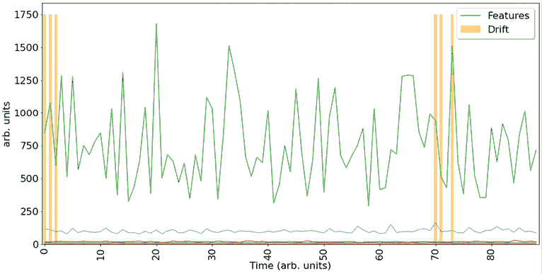

    图 3.5：用于运行一些模拟漂移检测的测试集特征，来自我们使用的**Wine**数据集。

在这个例子中，我们可以从模拟数据的图表中看到，数据精度随时间发生了变化。如果我们想自动化检测这种行为，那么我们不仅需要简单地绘制这些数据，还需要开始以系统化的方式分析它，并将其纳入我们正在生产的模型监控过程中。

注意：**Wine**数据集的测试数据仅用于漂移示例。在生产中，这种漂移检测将在从未见过的新数据上运行，但原理是相同的。

现在你已经知道漂移正在发生，我们将继续讨论你如何开始决定在你的漂移检测器上设置哪些限制，然后介绍一些帮助你诊断漂移类型和来源的过程和技术。

## 设置限制

我们在本节中描述的许多关于漂移的技术与统计学和机器学习中的标准技术非常一致。你可以几乎“直接使用”这些技术来诊断一系列不同类型的问题，但我们还没有讨论如何将这些技术整合成一个连贯的漂移检测机制。在着手做这件事之前，考虑设置数据和模型可接受行为边界是非常重要的，这样你知道何时你的系统应该发出警报或采取某些行动。我们将称之为“设置漂移检测系统的限制”。

那么，你从哪里开始呢？这时事情变得稍微不那么技术性，而且肯定更多地围绕在商业环境中操作，但让我们先概述一些关键点。首先，了解哪些内容重要需要发出警报是很重要的。对你可以想到的所有指标中的偏差发出警报听起来可能是个好主意，但它可能仅仅创建了一个非常嘈杂的系统，难以找到真正值得关注的问题。因此，我们必须谨慎选择我们想要跟踪和监控的内容。接下来，我们需要了解检测问题的及时性要求。这与软件中的**服务级别协议**（**SLAs**）概念密切相关，它记录了系统所要求的和预期的性能。如果你的业务正在对用于危险条件下的设备运行实时异常检测和预测性维护模型，那么发出警报和采取行动的及时性要求可能相当高。然而，如果你的机器学习系统每周只进行一次财务预测，那么及时性限制可能就没有那么严格。最后，你需要设定限制。这意味着你需要仔细思考你正在跟踪的指标，并思考“什么构成了这里的坏？”或者“我们想被通知什么？”可能的情况是，作为项目发现阶段的一部分，你知道业务对回归模型感到满意，只要它提供合适的置信区间，其预测的准确性可以有很大的变化。

在另一种场景中，你正在构建的分类模型可能必须具有只在相对较窄的范围内波动的召回率；否则，它将危及下游流程的有效性。

## 漂移的诊断

虽然我们在另一个部分讨论了模型漂移可能存在各种原因，但归根结底，我们必须记住，机器学习模型只对特征进行操作以创建预测。这意味着，如果我们想诊断漂移的源头，我们不需要再往其他地方看，只需关注我们的特征即可。

那么，我们应该从哪里开始呢？首先，我们应该考虑的是，任何特征都有可能发生漂移，但并非所有特征在模型方面都同等重要。这意味着在优先考虑哪些特征需要补救措施之前，我们需要了解特征的重要性。

特征重要性可以通过模型相关或模型无关的方式计算。模型相关的方法特指基于树的模型，如决策树或随机森林。在这些情况下，特征重要性通常可以从模型中提取出来进行检查，具体取决于用于开发模型的包。例如，如果我们使用 Scikit-Learn 训练一个随机森林分类器，我们可以使用以下语法提取其特征重要性。在这个例子中，我们检索随机森林模型的默认特征重要性，这些重要性是通过**平均不纯度减少**（**MDI**）计算的，也称为“Gini 重要性”，并将它们放入一个有序的 pandas 序列以供后续分析：

```py
import pandas as pd
feature_names = rf[:-1].get_feature_names_out()
mdi_importances = pd.Series(rf[-1].feature_importances_,
                            index=feature_names).sort_values(ascending=True) 
```

尽管这非常简单，但由于几个原因，有时它可能会给出错误的结果。这里的特征重要性是通过一个不纯度度量计算的，这类度量可能会对高基数（例如数值）特征表现出偏差，并且仅基于训练集数据计算，这意味着它们不考虑模型对未见过的测试数据的泛化能力。在使用此类重要性度量时，这一点始终应牢记在心。

另一个标准的特征重要性度量，它是模型无关的，并缓解了 MDI 或 Gini 重要性的一些问题，是排列重要性。

这是通过选择我们感兴趣的特定特征，对其进行洗牌（即，通过某种重新组织方法移动特征矩阵中的值，向上、向下或通过其他方法），然后重新计算模型精度或误差来实现的。精度或误差的变化然后可以用作衡量该特征重要性的指标，因为重要性特征越少，模型性能在洗牌后变化应该越小。以下是一个使用 Scikit-Learn 的此方法的示例，再次使用我们在上一个示例中使用的相同模型：

```py
from sklearn.inspection import permutation_importance
result = permutation_importance(
    rf, X_test, y_test, n_repeats=10, random_state=42, n_jobs=2
    )
sorted_importances_idx = result.importances_mean.argsort()
importances = pd.DataFrame(
    result.importances[sorted_importances_idx].T,
    columns=X.columns[sorted_importances_idx]) 
```

最后，还有一种非常流行的确定特征重要性的方法是计算特征**SHAP**（**SHapley Additive exPlanation**）值。这种方法借鉴了博弈论的思想，考虑了特征如何组合来影响预测。SHAP 值是通过在包含或排除考虑特征的所有特征排列上训练模型来计算的，然后计算该特征的预测值的边际贡献。这与排列重要性不同，因为我们不再只是排列特征值；我们现在实际上正在运行一系列不同的潜在特征集，包括或排除该特征。

您可以通过安装`shap`包来开始在您的模型上计算 SHAP 值：

```py
pip install shap 
```

然后我们可以执行以下语法，使用前面示例中的相同随机森林模型来定义一个*SHAP 解释器*对象并计算测试数据集中特征的 SHAP 值。我们假设这里的`X_test`是一个以特征名称为列名的 pandas DataFrame：

```py
explainer = shap.Explainer(rf, predict, X_test)
shap_values = explainer(X_test) 
```

注意，由于运行所有排列，计算 SHAP 值可能需要一些时间。`shap_values`本身不是特征重要性，但包含了为所有不同的特征组合实验中每个特征计算的 SHAP 值。为了确定特征重要性，你应该取每个特征的`shap_values`绝对值的平均值。如果你使用以下命令，这会为你完成并绘制结果：

```py
shap.plots.bar(shap_values) 
```

我们现在已经介绍了三种不同的方法来计算模型的特征重要性，其中两种完全与模型无关。特征重要性对于帮助你快速找到漂移的根源非常有帮助。如果你看到你模型的性能正在漂移或超过你设定的阈值，你可以使用特征重要性来集中你的诊断努力在最重要的特征上，并忽略不那么关键的特征的漂移。

现在我们已经介绍了一种有用的方法来帮助深入挖掘漂移，我们将讨论如何在发现似乎引起最大麻烦的特征或特征后如何着手解决它。

## 治疗漂移

我们可以采取几种方法来对抗漂移，以保持我们系统的性能：

+   **移除特征并重新训练**：如果某些特征正在漂移或表现出某种退化，我们可以尝试移除它们并重新训练模型。这可能会变得耗时，因为我们的数据科学家可能需要重新运行一些分析和测试，以确保这种方法从建模的角度仍然有意义。我们还得考虑我们移除的特征的重要性。

+   **使用更多数据重新训练**：如果我们看到概念漂移，我们可能只是注意到模型相对于数据的分布以及这些分布之间的关系已经过时。可能重新训练模型并包含更多最近的数据可以提高性能。还有选择在最近数据的一些选定部分上重新训练模型的选择。如果你能够诊断出数据中的某些重大事件或转变，例如 Covid-19 封锁的引入，这种方法可能特别有用。然而，这种方法可能难以自动化，因此有时也可以选择引入时间窗口方法，即训练一些预先选定数量的数据，直到现在的时间。

+   **回滚模型**：我们可以用之前的版本或甚至是一个基线模型来替换当前模型。如果你的基线模型更简单但性能方面也更可预测，例如应用了一些简单的业务逻辑，那么这可以是一个非常不错的做法。能够回滚到模型的先前版本需要你有在模型注册库周围建立一套良好的自动化流程。这非常类似于通用软件工程中的回滚，是构建健壮系统的一个关键组件。

+   **重写或调试解决方案**：可能存在这样的情况，我们处理的数据漂移非常严重，以至于现有的模型无法应对上述任何一种方法。重写模型的想法可能看起来有些激进，但这可能比你想象的更常见。例如，最初你可能部署了一个经过良好调优的 LightGBM 模型，该模型每天对一组五个特征进行二元分类。运行解决方案数月后，可能在你多次检测到模型性能漂移后，你决定最好进行一次调查，看看是否有更好的方法。在这种情况下，这尤其有帮助，因为现在你对将在生产中看到的数据有了更多的了解。你可能会发现，实际上，随机森林分类器在相同的生产数据场景上的平均性能并不如 LightGBM 模型，但它更稳定，表现更一致，并且更少触发漂移警报。你可能会决定，实际上，将这个不同的模型部署到同一个系统中对业务更有利，因为它将减少处理漂移警报的操作开销，并且这将是一个业务可以更加信任的模型。重要的是要注意，如果你需要编写一个新的管道或模型，在团队进行这项工作期间回滚到先前的模型通常是很重要的。

+   **修复数据源**：有时，最具挑战性的问题实际上与底层模型无关，而更多与数据收集方式的变化以及如何将数据传递到你的系统下游有关。在许多业务场景中，由于新流程的引入、系统的更新，甚至由于负责输入某些源数据的个人人员的变动，数据的收集、数据的转换或数据的特征可能会发生变化。作者自己的一个很好的例子是，当涉及到**客户资源管理**（CRM）系统时，销售团队输入的数据质量可能取决于许多因素，因此合理地预期数据质量、一致性和及时性可能会出现缓慢或突然的变化。

在这种情况下，正确的答案可能实际上不是一个工程问题，而是一个流程问题，与适当的团队和利益相关者合作，确保数据质量得到维护，并遵循标准流程。这将有利于客户和业务，但仍可能难以推销。

现在，我们可以开始构建解决方案，这些解决方案将自动触发我们的 ML 模型重新训练，如图*图 3.6*所示：

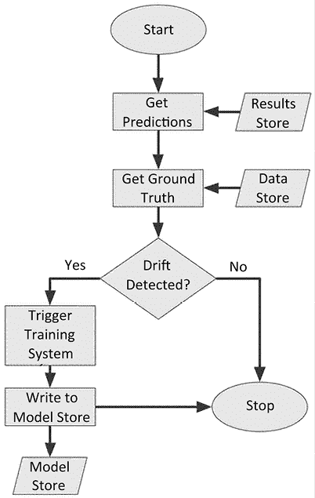

图 3.6：漂移检测和训练系统过程的示例。

## 其他监控工具

本章中的示例主要使用了 alibi-detect 包，但我们现在正处于开源**MLOps**工具的黄金时代。有几种不同的包和解决方案可供选择，你可以开始使用它们来构建监控解决方案，而无需花费一分钱。

在本节中，我们将快速介绍这些工具，并展示它们语法的一些基本要点，以便如果你想要开发监控管道，那么你可以立即开始，并知道在哪里最好使用这些不同的工具。

首先，我们将介绍**Evidently AI**([`www.evidentlyai.com/`](https://www.evidentlyai.com/))，这是一个非常易于使用的 Python 包，它允许用户不仅监控他们的模型，还可以通过几行语法创建可定制的仪表板。以下是文档中入门指南的改编。

1.  首先，安装 Evidently：

    ```py
    pip install evidently 
    ```

1.  导入`Report`功能。`Report`是一个对象，它收集多个指标的计算结果，以便进行可视化或以 JSON 对象的形式输出。我们将在稍后展示这种后者的行为：

    ```py
    from evidently.report import Report 
    ```

1.  接下来，导入一个称为度量预设的东西，在这种情况下是针对数据漂移的。我们可以将其视为一个模板化的报告对象，我们可以在以后对其进行自定义：

    ```py
    from evidently.metric_preset import DataDriftPreset 
    ```

1.  接下来，假设你已经有了数据，然后你可以运行数据漂移报告。假设你手头有之前示例中的**Wine**数据集。如果我们使用`scikit-learn`的`train_test_split()`方法将葡萄酒数据分成 50/50，我们将有两个数据集，我们再次使用它们来模拟参考数据集`X_ref`和当前数据集`X_curr`：

    ```py
    data_drift_report = Report(metrics=[
    DataDriftPreset(), 
        ])
    report.run(
        reference_data=X_ref,
       current_data=X_ref
    ) 
    ```

1.  Evidently 随后提供了一些非常棒的功能，用于在报告中可视化结果。你可以使用几种不同的方法导出或查看这些结果。你可以将报告导出为 JSON 或 HTML 对象，以便消费或审查下游或其他应用程序。*图 3.7*和*图 3.8*显示了使用以下命令创建这些输出时的结果片段：

    ```py
    data_drift_report.save_json('data_drift_report.json')
    data_drift_report.save_html('data_drift_report.xhtml') 
    ```

    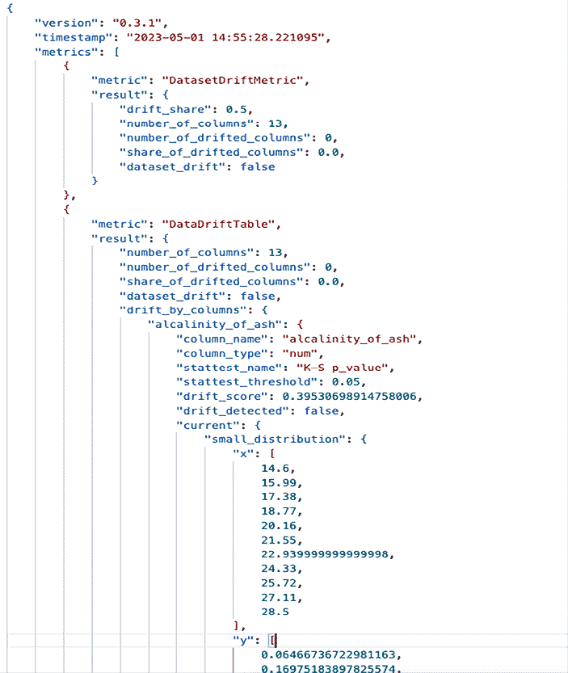

    图 3.7：Evidently 报告的 50/50 分割葡萄酒特征集的 JSON 输出。

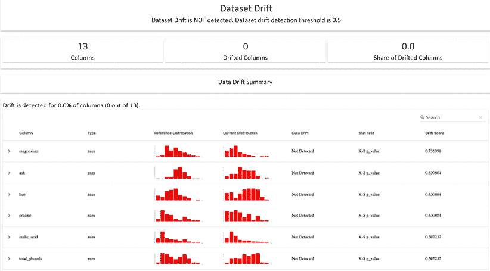

图 3.8：Evidently 生成的 50/50 分割葡萄酒特征集的漂移报告的 HTML 版本。

渲染的 HTML 报告的一个优点是你可以动态地深入到一些有用的信息中。例如，*图 3.9* 显示，如果你点击进入任何特征，你会得到一个随时间变化的数据漂移图，而*图 3.10* 显示你也可以以同样的方式得到特征的分布图。

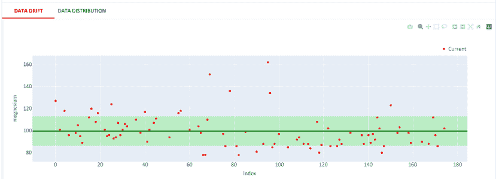

图 3.9：当你钻入 Evidently 报告中的葡萄酒特征时自动生成数据漂移图。

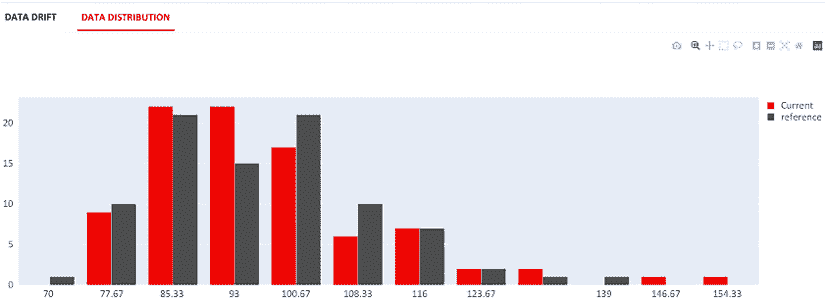

图 3.10：当你钻入 Evidently 报告中的葡萄酒特征集时自动生成的直方图，显示了特征的分布。

这只是触及了你可以用 Evidently 做到的事情的皮毛。有很多功能可以用来生成你自己的模型测试套件，监控功能，以及像我们看到的这样优雅地可视化所有内容。

现在我们已经探讨了模型和数据漂移的概念以及如何检测它们，我们可以继续讨论如何将我们在本章中讨论的许多概念自动化。

接下来的几节将深入探讨训练过程的不同方面，特别是如何使用各种工具自动化这个过程。

## 自动化训练

训练过程是模型工厂的一个组成部分，也是机器学习工程和传统软件工程之间主要区别之一。接下来的几节将详细讨论我们如何开始使用一些优秀的开源工具来简化、优化，在某些情况下，完全自动化这个过程的一些元素。

## 自动化层次结构

机器学习现在是软件开发的一个常见部分，也是商业和学术活动的一个主要部分，其中一个主要原因是工具的多样性。所有包含复杂算法有效和优化实现的包和库都允许人们在这些基础上构建，而不是每次遇到问题都要重新实现基础知识。

这是软件开发中**抽象**理念的一个强大表达，其中较低级别的单元可以在较高级别的实现中被利用和参与。

这个想法甚至可以进一步扩展到整个训练过程本身。在实施的最底层（但在底层算法的意义上仍然是一个非常高的层次），我们可以提供关于我们希望训练过程如何进行的详细信息。我们可以在代码中手动定义用于训练运行的精确超参数集（参见下一节关于*优化超参数*）。我称之为**手动操作**。然后我们可以再提高一个抽象层次，为我们的超参数提供范围和界限，供设计用于高效采样和测试我们模型性能的工具使用；例如，*自动超参数调整*。最后，在过去几年中，有一个更高层次的抽象引发了大量的媒体关注，即我们优化运行哪个算法。这被称为**自动机器学习**或**AutoML**。

围绕 AutoML 可能会有很多炒作，有些人宣称最终所有机器学习开发职位都将实现自动化。在我看来，这并不现实，因为选择你的模型和超参数只是巨大复杂工程挑战的一个方面（因此这是一本书而不是传单！）。然而，AutoML 是一个非常强大的工具，当你开始下一个机器学习项目时，应该将其添加到你的能力工具箱中。

我们可以将所有这些内容简洁地总结为*自动化层次结构*；基本上，作为机器学习工程师的你，在训练过程中希望有多少控制权？我曾经听到有人用汽车齿轮控制来描述这一点（感谢：*Databricks at Spark AI 2019*）。手动操作相当于驾驶手动挡汽车，完全控制齿轮：需要考虑的事情更多，但如果你知道自己在做什么，它可以非常高效。再高一个层次，你有自动挡汽车：需要担心的事情更少，这样你可以更多地专注于到达目的地、交通和其他挑战。这对很多人来说是一个不错的选择，但仍需要你具备足够的知识、技能和理解。最后，我们有自动驾驶汽车：放松，放松，甚至不用担心如何到达目的地。你可以专注于到达那里后你要做什么。

这种*自动化层次结构*在以下图中展示：

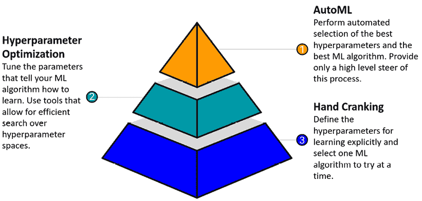

图 3.11：机器学习模型优化自动化的层次结构，其中 AutoML 是最自动化的可能性。

总结来说，这就是不同层次的训练抽象是如何相互关联的。

在接下来的几节中，我们将讨论如何开始构建超参数优化和 AutoML 的实现。我们不会涵盖“手动操作”，因为这很容易理解。

## 优化超参数

当你将某种数学函数拟合到数据上时，一些值在拟合或训练过程中被调整：这些被称为**参数**。对于机器学习，我们有一个更高级别的抽象，我们必须定义告诉我们所采用的算法*如何更新参数*的值。这些值被称为**超参数**，它们的选择是训练机器学习算法的重要*暗黑艺术*之一。

以下表格列出了一些用于常见机器学习算法的超参数，以展示它们可能采取的不同形式。这些列表并不全面，但旨在强调超参数优化并非一项简单的练习：

| **算法** | **超参数** | **这控制什么** |
| --- | --- | --- |
| 决策树和随机森林 |

+   树的深度。

+   最小/最大叶子节点。

|

+   你的树有多少层。

+   每个级别可以发生的分支数量。

|

| 支持向量机 |
| --- |

+   C

+   Gamma

|

+   误分类的惩罚。

+   训练点对**径向基函数**（**RBF**）核的影响半径。

|

| 神经网络（众多架构） |
| --- |

+   学习率。

+   隐藏层数量。

+   激活函数。

+   许多更多。

|

+   更新步长大小。

+   你的网络有多深。

+   你神经元的触发条件。

|

| 逻辑回归 |
| --- |

+   求解器

+   正则化类型。

+   正则化预因子。

|

+   如何最小化损失。

+   如何防止过拟合/使问题表现良好。

+   正则化类型的强度。

|

表 3.1：一些超参数及其对某些监督算法的控制。

更多的示例可以在以下表格中看到：

| **算法** | **超参数** | **这控制什么** |
| --- | --- | --- |
| K 最近邻 |

+   K

+   距离度量。

|

+   聚类的数量。

+   如何定义点之间的距离。

|

| DBSCAN |
| --- |

+   Epsilon

+   最小样本数。

+   距离度量。

|

+   考虑邻居的最大距离。

+   需要多少邻居才能被认为是核心。

+   如何定义点之间的距离。

|

表 3.2：一些超参数及其对某些无监督算法的控制。

所有这些超参数都有它们自己可以取的特定值集。这个超参数值的范围对于你想要应用于你的机器学习解决方案的不同潜在算法意味着有无数种定义一个*工作*模型（意味着一个不会破坏你使用的实现）的方法，但你是如何找到*最优*模型的呢？

这就是超参数搜索的用武之地。其概念是，对于有限数量的超参数值组合，我们希望找到一组能给出最佳模型性能的值。这是另一个类似于最初训练的优化问题！

在接下来的章节中，我们将讨论两个非常流行的超参数优化库，并展示如何在几行 Python 代码中实现它们。

重要提示

理解这些超参数库中使用的算法非常重要，因为你可能希望从每个库中使用几个不同的实现来比较不同的方法和评估性能。如果你没有查看它们在底层是如何工作的，你可能会轻易地进行不公平的比较——或者更糟糕的是，你可能会在不知情的情况下比较几乎相同的东西！如果你对这些解决方案的工作原理有一些深入了解，你也将能够更好地判断它们何时有益，何时过度。目标是掌握一些这些算法和方法，因为这将帮助你设计更全面的训练系统，其中算法调整方法相互补充。

### Hyperopt

**Hyperopt**是一个开源的 Python 包，自称是*用于复杂搜索空间的串行和并行优化，这些搜索空间可能包括实值、离散和条件维度*。更多信息请查看以下链接：[`github.com/Hyperopt/Hyperopt`](https://github.com/Hyperopt/Hyperopt)。在撰写本文时，版本 0.2.5 包含了三个算法，用于在用户提供的搜索空间中执行优化：

+   **随机搜索**：该算法本质上是在你提供的参数值范围内选择随机数并尝试它们。然后根据你选择的性能目标函数评估哪些数字组合提供了最佳性能。

+   **帕累托树估计器**（**TPE**）：这是一种贝叶斯优化方法，它对目标函数阈值以下和以上的超参数分布进行建模（大致为*好*和*坏*的评分者），然后旨在从*好*的超参数分布中抽取更多值。

+   **自适应 TPE**：这是 TPE 的一个修改版本，它允许对搜索进行一些优化，以及创建一个机器学习模型来帮助指导优化过程。

Hyperopt 的存储库和文档包含了一些很好的详细示例。我们在这里不会详细介绍这些示例。相反，我们将学习如何使用它来构建一个简单的分类模型，例如我们在*第一章*，*机器学习工程导论*中定义的模型。让我们开始吧：

1.  在 Hyperopt 中，我们必须定义我们想要优化的超参数。例如，对于一个典型的逻辑回归问题，我们可以定义超参数空间，包括我们是否希望每次都重用从先前模型运行中学习到的参数（`warm_start`），我们是否希望模型在决策函数中包含偏差（`fit_intercept`），用于决定何时停止优化的容差设置（`tol`），正则化参数（`C`），我们想要尝试的`solver`，以及任何训练运行中的最大迭代次数`max_iter`：

    ```py
    from Hyperopt import hp

    space = {
        'warm_start' : hp.choice('warm_start', [True, False]),
        'fit_intercept' : hp.choice('fit_intercept', [True, False]),
        'tol' : hp.uniform('tol', 0.00001, 0.0001),
        'C' : hp.uniform('C', 0.05, 2.5),
        'solver' : hp.choice('solver', ['newton-cg', 'lbfgs',
                                        'liblinear']),
        'max_iter' : hp.choice('max_iter', range(10,500))
        } 
    ```

1.  然后，我们必须定义一个要优化的目标函数。在我们的分类算法的情况下，我们可以简单地定义我们想要最小化的`loss`函数为 1 减去`f1-score`。请注意，如果您使用`fmin`功能，Hyperopt 允许您的目标函数通过您的返回语句提供运行统计信息和元数据。如果您这样做，唯一的要求是您必须返回一个标记为`loss`的值和一个有效的状态值从`Hyperopt.STATUS_STRING`列表中（默认为`ok`，如果计算中存在您想要标记为失败的问题则为`fail`）：

    ```py
    def objective(params, n_folds, X, y):
        # Perform n_fold cross validation with hyperparameters
        clf = LogisticRegression(**params, random_state=42)
        scores = cross_val_score(clf, X, y, cv=n_folds, scoring=
                                 'f1_macro')
        # Extract the best score
        max_score = max(scores)
        # Loss must be minimized
        loss = 1 - max_score
        # Dictionary with information for evaluation
        return {'loss': loss, 'params': params, 'status': STATUS_OK} 
    ```

1.  现在，我们必须使用 `fmin` 方法与 **TPE** 算法进行优化：

    ```py
    # Trials object to track progress
    trials = Trials()
    # Optimize
    best = fmin(
        fn=partial(objective, n_folds=n_folds, X=X_train, y=y_train),
        space=space,
        algo=tpe.suggest,
        max_evals=16,
        trials=trials
        ) 
    ```

1.  `best` 的内容是一个包含您在定义的搜索空间中所有最佳超参数的字典。因此，在这种情况下，我们有以下内容：

    ```py
    {'C': 0.26895003542493234,
    'fit_intercept': 1,
    'max_iter': 452,
    'solver': 2,
    'tol': 1.863336145787027e-05,
    'warm_start': 1} 
    ```

然后，您可以使用这些超参数来定义您的模型，以便在数据上进行训练。

### Optuna

**Optuna** 是一个基于一些核心设计原则（如其 **define-by-run** API 和模块化架构）的软件包。在这里，“define-by-run”指的是，当使用 Optuna 时，用户不需要定义要测试的完整参数集，这是 **define-and-run**。相反，他们可以提供一些初始值，并要求 Optuna 建议要运行的实验集。这为用户节省了时间，并减少了代码的复杂度（对我来说是两个大优点！）。

Optuna 包含四种基本搜索算法：**网格搜索**、**随机搜索**、**TPE**和**协方差矩阵自适应进化策略**（**CMA-ES**）算法。我们之前已经介绍了前三种，但 CMA-ES 是混合中的一项重要补充。正如其名称所暗示的，它基于进化算法，并从多元高斯分布中抽取超参数样本。然后，它使用给定目标函数评估分数的排名来动态更新高斯分布的参数（协方差矩阵是其中之一）以帮助快速且稳健地在搜索空间中找到最优解。

然而，使 Optuna 的优化过程与 Hyperopt 不同的关键因素在于其应用了**剪枝**或**自动早期停止**。在优化过程中，如果 Optuna 检测到一组超参数的试验不会导致更好的整体训练算法，它将终止该试验。该软件包的开发者建议，通过减少不必要的计算，这可以在超参数优化过程中带来整体效率的提升。

这里，我们正在查看之前查看过的相同示例，但现在我们使用 Optuna 而不是 Hyperopt：

1.  首先，当使用 Optuna 时，我们可以使用一个称为 `Study` 的对象来工作，它为我们提供了一个方便的方法将搜索空间折叠到我们的 `objective` 函数中：

    ```py
    def objective(trial, n_folds, X, y):
        """Objective function for tuning logistic regression hyperparameters"""
        params = {
            'warm_start': 
            trial.suggest_categorical('warm_start', [True, False]),
            'fit_intercept': 
            trial.suggest_categorical('fit_intercept', [True, False]),
            'tol': trial.suggest_uniform('tol', 0.00001, 0.0001),
            'C': trial.suggest_uniform('C', 0.05, 2.5),
            'solver': trial.suggest_categorical('solver', ['newton-cg',
                                                'lbfgs', 'liblinear']),
            'max_iter': trial.suggest_categorical('max_iter', 
                                                   range(10, 500))
        }
        # Perform n_fold cross validation with hyperparameters
        clf = LogisticRegression(**params, random_state=42)
        scores = cross_val_score(clf, X, y, cv=n_folds, 
                                 scoring='f1_macro')
        # Extract the best score
        max_score = max(scores)
        # Loss must be minimized
        loss = 1 - max_score
        # Dictionary with information for evaluation
        return loss 
    ```

1.  现在，我们必须以与 Hyperopt 示例中相同的方式设置数据：

    ```py
    n_folds = 5
    X, y = datasets.make_classification(n_samples=100000, n_features=20,n_informative=2, n_redundant=2)
    train_samples = 100  # Samples used for training the models
    X_train = X[:train_samples]
    X_test = X[train_samples:]
    y_train = y[:train_samples]
    y_test = y[train_samples:] 
    ```

1.  现在，我们可以定义我们之前提到的`Study`对象，并告诉它我们希望如何优化`objective`函数返回的值，包括在`study`中运行多少次试验的指导。在这里，我们将再次使用 TPE 采样算法：

    ```py
    from optuna.samplers import TPESampler
    study = optuna.create_study(direction='minimize', sampler=TPESampler())
    study.optimize(partial(objective, n_folds=n_folds, X=X_train, y=y_
                           train), n_trials=16) 
    ```

1.  现在，我们可以通过`study.best_trial.params`变量访问最佳参数，它为我们提供了以下最佳情况下的值：

    ```py
    {'warm_start': False,
    'fit_intercept': False,
    'tol': 9.866562116436095e-05,
    'C': 0.08907657649508408,
    'solver': 'newton-cg',
    'max_iter': 108} 
    ```

如你所见，Optuna 也非常简单易用且功能强大。现在，让我们来看看自动化层次结构的最后一级：AutoML。

重要注意事项

你会注意到这些值与 Hyperopt 返回的值不同。这是因为我们每种情况下只运行了 16 次试验，所以我们并没有有效地对空间进行子采样。如果你连续几次运行 Hyperopt 或 Optuna 样本，你可能会得到相当不同的结果，原因相同。这里给出的例子只是为了展示语法，但如果你有兴趣，你可以将迭代次数设置得非常高（或者创建更小的空间进行采样），两种方法的结果应该大致收敛。

## AutoML

我们层次结构的最后一级是我们作为工程师对训练过程直接控制最少的一级，但也是我们可能以极少的努力获得良好答案的地方！

为了搜索你问题的许多超参数和算法，所需的开发时间可能很大，即使你编写了看起来合理的搜索参数和循环。

因此，在过去的几年里，已经部署了多种语言的多种**AutoML**库和工具。围绕这些技术的炒作意味着它们获得了大量的关注，这导致一些数据科学家质疑他们的工作何时会被自动化。正如我们在本章前面提到的，在我看来，宣布数据科学的死亡是极其过早的，并且从组织和业务绩效的角度来看也是危险的。这些工具被赋予了如此伪神话的地位，以至于许多公司可能会相信，仅仅使用它们几次就能解决他们所有的数据科学和机器学习问题。

他们是错的，但也是对的。

这些工具和技术**确实**非常强大，并且**可以**帮助改善某些事情，但它们并不是一个神奇的**即插即用**的万能药。让我们来探讨这些工具，并开始思考如何将它们融入我们的机器学习工程工作流程和解决方案中。

### auto-sklearn

我们最喜欢的库之一，古老的 Scikit-Learn，注定会成为构建流行 AutoML 库的第一个目标之一。auto-sklearn 的一个非常强大的特性是，它的 API 被设计得非常灵活，使得优化模型和超参数的主要对象可以无缝地替换到你的代码中。

如同往常，一个例子将更清楚地展示这一点。在下面的例子中，我们将假设`Wine`数据集（本章的宠儿）已经被检索并按照其他示例（如*检测漂移*部分中的示例）分割成训练样本和测试样本：

1.  首先，由于这是一个分类问题，我们需要从`auto-sklearn`中获取的主要东西是`autosklearn.classification`对象：

    ```py
    import numpy as np
    import sklearn.datasets
    import sklearn.metrics
    import autosklearn.classification 
    ```

1.  我们必须首先定义我们的`auto-sklearn`对象。这提供了几个参数，帮助我们定义模型和超参数调整过程将如何进行。在这个例子中，我们将为整体优化提供一个秒数上限，并为任何单个对 ML 模型的调用提供一个秒数上限：

    ```py
    automl = autosklearn.classification.AutoSklearnClassifier(
        time_left_for_this_task=60,
        per_run_time_limit=30
        ) 
    ```

1.  然后，就像我们拟合一个正常的`sklearn`分类器一样，我们可以拟合`auto-sklearn`对象。正如我们之前提到的，`auto-sklearn` API 已经被设计得看起来很熟悉：

    ```py
    automl.fit(X_train, y_train, dataset_name='wine') 
    ```

1.  现在我们已经拟合了对象，我们可以开始分析对象在优化运行期间所取得的成果。

1.  首先，我们可以看到尝试了哪些模型，哪些被保留在对象中作为最终集成的一部分：

    ```py
    print(automl.show_models()) 
    ```

1.  我们可以获取运行的主要统计数据：

    ```py
    print(automl.sprint_statistics()) 
    ```

1.  然后，我们可以预测一些文本特征，正如预期的那样：

    ```py
    predictions = automl.predict(X_test) 
    ```

1.  最后，我们可以使用我们最喜欢的指标计算器来检查我们的表现——在这种情况下，是`sklearn metrics`模块：

    ```py
    sklearn.metrics.accuracy_score(y_test, predictions) 
    ```

1.  如您所见，开始使用这个强大的库非常简单，尤其是如果您已经熟悉`sklearn`。

接下来，让我们讨论如何将这个概念扩展到神经网络，由于它们的潜在模型架构不同，神经网络有一个额外的复杂层。

### AutoKeras

AutoML 在神经网络领域取得了巨大成功的一个特定领域是因为，对于神经网络来说，“什么是最优模型？”这个问题非常复杂。对于我们的典型分类器，我们通常可以想到一个相对较短、有限的算法列表来尝试。对于神经网络，我们没有这样一个有限的列表。相反，我们有一个本质上无限的神经网络*架构*集合；例如，将神经元组织成层以及它们之间的连接。寻找最优神经网络架构是一个问题，其中强大的优化可以使作为 ML 工程师或数据科学家的您的生活变得容易得多。

在这个例子中，我们将探索一个基于非常流行的神经网络 API 库（名为 Keras）构建的 AutoML 解决方案。难以置信，这个包的名字是——您猜对了——AutoKeras！

对于这个例子，我们再次假设`Wine`数据集已经被加载，这样我们就可以专注于实现细节。让我们开始吧：

1.  首先，我们必须导入`autokeras`库：

    ```py
    import autokeras as ak 
    ```

1.  现在，是时候享受乐趣了，对于`autokeras`来说，这一点尤其简单！由于我们的数据是有结构的（表格形式，具有定义的架构），我们可以使用`StructuredDataClassifier`对象，它封装了自动神经网络架构和超参数搜索的底层机制：

    ```py
    clf = ak.StructuredDataClassifier(max_trials=5) 
    ```

1.  然后，我们只需拟合这个分类器对象，注意到它与`sklearn` API 的相似性。记住，我们假设训练数据和测试数据存在于`pandas DataFrames`中，就像本章其他示例中那样：

    ```py
    clf.fit(x=X_train, y=y_train) 
    ```

1.  AutoKeras 中的训练对象包含一个方便的评估方法。让我们使用这个方法来看看我们的解决方案有多准确：

    ```py
    accuracy=clf.evaluate(x=X_train, y=y_train) 
    ```

1.  有了这些，我们已经成功地在几行 Python 代码中执行了神经网络架构和超参数搜索。一如既往，阅读解决方案文档以获取有关您可以提供给不同方法的参数的更多信息。

现在我们已经介绍了如何创建性能良好的模型，在下一节中，我们将学习如何持久化这些模型，以便它们可以在其他程序中使用。

# 持久化你的模型

在上一章中，我们介绍了使用 MLflow 的一些模型版本控制的基本知识。特别是，我们讨论了如何使用 MLflow 跟踪 API 记录您的 ML 实验的指标。现在，我们将在此基础上构建，并考虑我们的训练系统应该与模型控制系统的一般触点。

首先，让我们回顾一下我们希望通过训练系统要完成的事情。我们希望尽可能自动化数据科学家在寻找第一个工作模型时所做的许多工作，这样我们就可以持续更新并创建新的模型版本，这些版本在未来仍然可以解决问题。我们还希望有一个简单的机制，允许将训练过程的结果与将在生产中执行预测的解决方案部分共享。我们可以将我们的模型版本控制系统视为连接我们在第二章“机器学习开发过程”中讨论的 ML 开发过程不同阶段的桥梁。特别是，我们可以看到跟踪实验结果的能力使我们能够在“Play”阶段保持结果，并在“Develop”阶段在此基础上进行构建。我们还可以在“Develop”阶段相同的地点跟踪更多的实验、测试运行和超参数优化结果。然后，我们可以开始标记性能良好的模型为部署的良好候选者，从而弥合“Develop”和“Deploy”开发阶段之间的差距。

如果我们现在专注于 MLflow（尽管还有许多其他解决方案可以满足模型版本控制系统所需的需求），那么 MLflow 的跟踪和模型注册功能很好地填补了这些桥梁角色。这在下图中以示意图的形式表示：

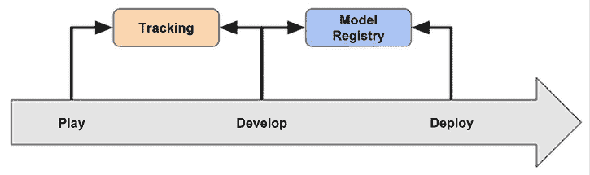

图 3.12：MLflow 跟踪和模型注册表功能如何帮助我们通过 ML 开发过程的不同阶段。

在*第二章*，*机器学习开发过程*中，我们只探讨了 MLflow 跟踪 API 的基本功能，用于存储实验模型运行元数据。现在，我们将简要介绍如何以非常有序的方式存储生产就绪模型，以便您可以开始执行模型部署。这是模型可以通过准备阶段进行推进的过程，如果您愿意，您可以在生产中交换模型。这是任何提供模型并作为部署解决方案一部分运行的训练系统的极其重要的部分，这正是本书的主题！

如前所述，我们在 MLflow 中需要的功能称为**模型注册表**，它使您能够管理模型在整个开发周期中的部署。在这里，我们将通过示例了解如何将记录的模型推送到注册表，如何更新注册表中的信息，例如模型版本号，然后如何将模型推进不同的生命周期阶段。我们将通过学习如何在其他程序中从注册表中检索给定的模型来结束本节，如果我们想要在分开的训练和预测服务之间共享模型，这是一个关键点。

在我们深入研究与模型注册表交互的 Python 代码之前，我们有一个重要的设置要执行。注册表仅在数据库用于存储模型元数据和参数时才有效。这与仅使用文件后端存储的基本跟踪 API 不同。这意味着在将模型推送到模型注册表之前，我们必须启动一个具有数据库后端的 MLflow 服务器。您可以通过在终端中执行以下命令使用本地运行的**SQLite**数据库来完成此操作。

您必须在阅读本节其余部分的代码片段之前运行此命令（此命令存储在本书的 GitHub 仓库中的简短 Bash 脚本中，位于[`github.com/PacktPublishing/Machine-Learning-Engineering-with-Python/blob/main/Chapter03/mlflow-advanced/start-mlflow-server.sh`](https://github.com/PacktPublishing/Machine-Learning-Engineering-with-Python/blob/main/Chapter03/mlflow-advanced/start-mlflow-server.sh)）：

```py
mlflow server \
    --backend-store-uri sqlite:///mlflow.db \
    --default-artifact-root ./artifacts \
    --host 0.0.0.0 
```

现在，后端数据库已启动并运行，我们可以将其作为模型工作流程的一部分使用。让我们开始吧：

1.  让我们从记录本章早期训练的某个模型的指标和参数开始：

    ```py
    with mlflow.start_run(run_name="YOUR_RUN_NAME") as run:
        params = {'tol': 1e-2, 'solver': 'sag'}
        std_scale_clf = make_pipeline(StandardScaler(),
                                      RidgeClassifier(**params))
        std_scale_clf.fit(X_train, y_train)
        y_pred_std_scale = std_scale_clf.predict(X_test)
        mlflow.log_metrics({
                 "accuracy":
                  metrics.accuracy_score(y_test, y_pred_std_scale),
                 "precision":
                  metrics.precision_score(y_test, y_pred_std_scale, 
                                          average="macro"),
                 "f1": 
                  metrics.f1_score(y_test, y_pred_std_scale,
                                   average="macro"),
                 "recall":
                  metrics.recall_score(y_test, y_pred_std_scale, 
                                       average="macro"),
        })
    mlflow.log_params(params) 
    ```

1.  在相同的代码块中，我们现在可以将模型记录到模型注册表中，并为模型提供一个名称以便稍后引用：

    ```py
     mlflow.sklearn.log_model(
                sk_model=std_scale_clf,
                artifact_path="sklearn-model",
                registered_model_name="sk-learn-std-scale-clf"
            ) 
    ```

1.  现在，让我们假设我们正在运行一个预测服务，并且我们想要检索模型并使用它进行预测。在这里，我们必须编写以下代码：

    ```py
    model_name = "sk-learn-std-scale-clf"
    model_version = 1
    model = mlflow.pyfunc.load_model(
        model_uri=f"models:/{model_name}/{model_version}"
        )
    model.predict(X_test) 
    ```

1.  默认情况下，在模型注册表中新注册的模型被分配 `'Staging'` 阶段值。因此，如果我们想根据阶段而不是模型版本来检索模型，我们可以执行以下代码：

    ```py
    stage = 'Staging'
    model = mlflow.pyfunc.load_model(
        model_uri=f"models:/{model_name}/{stage}"
        ) 
    ```

1.  基于本章的所有讨论，我们的训练系统必须能够生成一个我们愿意部署到生产的模型。以下代码片段将模型提升到不同的阶段，称为 `"Production"`：

    ```py
    client = MlflowClient()
    client.transition_model_version_stage(
        name="sk-learn-std-scale-clf",
        version=1,
        stage="Production"
        ) 
    ```

1.  这些是与模型注册表交互的最重要方式，我们已经涵盖了如何在训练（和预测）系统中注册、更新、提升和检索您的模型的基础知识。

现在，我们将学习如何将我们的主要训练步骤链接成单个单元，称为 **管道**。我们将介绍一些在单个脚本中执行此操作的标准方法，这将使我们能够构建我们的第一个训练管道。在 *第五章，部署模式和工具* 中，我们将介绍构建更通用的软件管道的工具，这些工具适用于您的 ML 解决方案（其中您的训练管道可能是一个组件）。

# 使用管道构建模型工厂

软件管道的概念足够直观。如果你在代码中将一系列步骤链接在一起，使得下一个步骤消耗或使用前一个步骤或步骤的输出，那么你就有一个管道。

在本节中，当我们提到管道时，我们将特别处理包含适合 ML 的处理或计算的步骤。例如，以下图表显示了这一概念可能如何应用于第一章，ML 工程简介中提到的营销分类器的一些步骤：

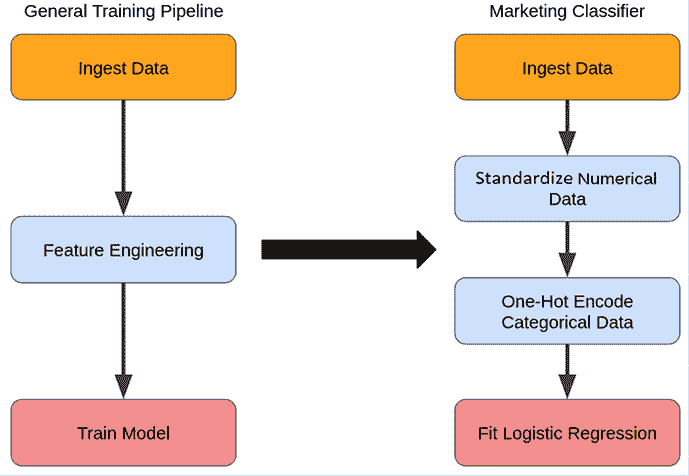

图 3.13：任何训练管道的主要阶段以及这与第一章，ML 工程简介中特定案例的映射。

让我们讨论一些构建代码中 ML 管道的标准工具。

## Scikit-learn 管道

我们的老朋友 **Scikit-Learn** 随带了一些不错的管道功能。API 非常易于使用，正如您所期望的 **Scikit-Learn** 一样，但有一些概念我们在继续之前应该理解：

+   **管道对象**：这是将汇集我们所需所有步骤的对象，特别是`sklearn`要求实例化的管道对象由转换器和估计器的序列组成，所有中间对象都具有`.fit()`和`.transform()`方法，最后一步是一个至少具有`.fit()`方法的估计器。我们将在下两点中解释这些术语。这种条件的原因是，`pipeline`对象将继承序列中最后一个项目的方法，因此我们必须确保最后一个对象中存在`.fit()`。

+   **估计器**：估计器类是`scikit-learn`中的基本对象，任何可以在数据上拟合并预测数据的包中的内容，因此`.fit()`和`.predict()`方法是估计器类的子类。

+   **转换器**：在**Scikit-Learn**中，转换器是任何具有`.transform()`或`.fit_transform()`方法的估计器，正如你可以猜到的，它们主要专注于将数据集从一种形式转换为另一种形式，而不是执行预测。

使用`pipeline`对象确实有助于简化你的代码，因为你不必编写多个不同的拟合、转换和预测步骤作为它们自己的函数调用，并管理数据流，你只需将它们全部组合在一个对象中，该对象为你管理这些操作并使用相同的简单 API。

Scikit-Learn 不断添加新的转换器和功能，这意味着可以构建越来越有用的管道。例如，在撰写本文时，Scikit-Learn 版本大于 0.20 也包含`ColumnTransformer`对象，它允许你构建对特定列执行不同操作的管道。这正是我们之前讨论的逻辑回归营销模型示例所希望做的，我们希望标准化数值并`one-hot`编码分类变量。让我们开始吧：

1.  要创建此管道，你需要导入`ColumnTransformer`和`Pipeline`对象：

    ```py
    from sklearn.compose import ColumnTransformer
    from sklearn.pipeline import Pipeline 
    ```

1.  为了展示如何在管道组成的转换器内部链式调用步骤，我们将在稍后添加一些插补。为此，我们需要导入`SimpleImputer`对象：

    ```py
    from sklearn.impute import SimpleImputer 
    ```

1.  现在，我们必须定义包含插补和缩放两个步骤的数值转换器子管道，我们还必须定义将应用到此数值列的名称，以便我们可以在以后使用它们：

    ```py
    numeric_features = ['age', 'balance']
    numeric_transformer = Pipeline(steps=[
        ('imputer', SimpleImputer(strategy='median')),
        ('scaler', StandardScaler())]) 
    ```

1.  接下来，我们必须对分类变量执行类似的步骤，但在这里，我们只需要定义一个`one-hot`编码器的转换步骤：

    ```py
    categorical_features = ['job', 'marital', 'education', 'contact',
                            'housing', 'loan', 'default','day']
    categorical_transformer = OneHotEncoder(handle_unknown='ignore') 
    ```

1.  我们必须使用`ColumnTransformer`对象将这些预处理步骤汇集到一个单一的对象中，称为`preprocessor`，这将把我们的`transformers`应用到 DataFrame 的适当列上：

    ```py
    preprocessor = ColumnTransformer(
        transformers=[
            ('num', numeric_transformer, numeric_features),
            ('cat', categorical_transformer, categorical_features)]) 
    ```

1.  最后，我们想在前面步骤的末尾添加 ML 模型步骤并最终完成管道。我们将称之为`clf_pipeline`：

    ```py
    clf_pipeline = Pipeline(steps=[('preprocessor', preprocessor),
                       ('classifier', LogisticRegression())]) 
    ```

1.  这是我们的第一个 ML 训练管道。`scikit-learn` API 的美丽之处在于，`clf_pipeline`对象现在可以像库中的标准算法一样被调用。所以，这意味着我们可以编写以下内容：

    ```py
    clf_pipeline.fit(X_train, y_train) 
    ```

这将依次运行管道中所有步骤的`fit`方法。

之前的例子相对简单，但如果你需要更复杂的管道，有几种方法可以使这种管道更复杂。其中最简单且最可扩展的是 Scikit-Learn 创建自定义转换器对象的能力，这些对象继承自基类。你可以通过从`BaseEstimator`和`TransformerMixIn`类继承并定义自己的转换逻辑来实现这一点。作为一个简单的例子，让我们构建一个转换器，它接受指定的列并添加一个浮点数。这只是一个简单的示意图，向你展示如何实现；我无法想象在大多数情况下，将单个浮点数添加到你的列中会有多大帮助！

```py
from sklearn.base import BaseEstimator, TransformerMixin

class AddToColumsTransformer(BaseEstimator, TransformerMixin):
    def __init__(self, addition = 0.0, columns=None):
        self.addition = addition
        self.columns = columns

    def fit(self, X, y=None):
        return self

    def transform(self, X, y=None):
        transform_columns = list(X.columns)
        if self.columns:
            transform_columns = self.columns
        X[transform_columns] = X[transform_columns] + self.addition
        return X 
```

你可以将这个转换器添加到你的`pipeline`中：

```py
pipeline = Pipeline(
    steps=[
        ("add_float", AddToColumnsTransformer(0.5, columns=["col1","col2", 
                                                            "col3"]))
    ]
) 
```

这个添加数字的例子实际上并不是使用基于类的转换器定义的最佳用例，因为这个操作是无状态的。由于没有训练或对输入值进行复杂操作的需求，需要类保留和更新其状态，所以我们实际上只是封装了一个函数。添加自定义步骤的第二种方式利用了这一点，并使用`FunctionTransformer`类来封装你提供的任何函数：

```py
from sklearn.pipeline import Pipeline
from sklearn.preprocessing import FunctionTransformer

def add_number(X, columns=None, number=None):
    if columns == None and number == None:
        return X
    X[columns] = X[columns] + number
pipeline = Pipeline(
    steps=[
        (
            "add_float",
            FunctionTransformer(
                add_number, kw_args={"columns": ["col1", "col2", "col3"],
                                     "number": 0.5}),
        )
    ]
) 
```

通过构建这些示例，你可以开始创建可以执行任何你想要的特征工程任务的复杂管道。

为了结束本节，我们可以清楚地看到，将执行特征工程和训练模型的步骤抽象成一个单一对象的能力非常强大，这意味着你可以在各个地方重用这个对象，并使用它构建更复杂的流程，而无需不断重写实现的细节。抽象是一件好事！

现在我们将转向另一种编写管道的方法，使用 Spark ML。

## Spark ML 管道

在本书中，我们一直在使用的一个工具集，在我们讨论扩展我们的解决方案时将特别重要：Apache Spark 及其 ML 生态系统。我们将看到，使用 Spark ML 构建类似的管道需要略微不同的语法，但关键概念与 Scikit-Learn 的情况非常相似。

关于 PySpark 管道有一些重要的事项需要提及。首先，与 Spark 所使用的 Scala 语言中的良好编程实践一致，对象被视为**不可变**的，因此转换不会在原地发生。相反，会创建新的对象。这意味着任何转换的输出都将在你的原始 DataFrame（或者确实是在新的 DataFrame 中）中需要创建新的列。

其次，Spark ML 估计器（即 ML 算法）都需要将特征组装成一个单列中的类似元组的对象。这与 Scikit-Learn 形成对比，在 Scikit-Learn 中，你可以将所有特征保留在其数据对象的列中。这意味着你需要习惯使用**组装器**，这些是用于将不同的特征列拉在一起的实用工具，尤其是在你处理必须以不同方式转换才能被算法使用的混合分类和数值特征时。

第三，Spark 有许多使用**延迟评估**的函数，这意味着它们只有在被特定操作触发时才会执行。这意味着你可以构建整个 ML 管道，而不必转换任何数据。延迟评估的原因是 Spark 中的计算步骤存储在一个**有向无环图**（**DAG**）中，这样在执行计算步骤之前，执行计划可以被优化，这使得 Spark 非常高效。

最后——这是一个小点——使用*骆驼命名法*而不是常见的*蛇形命名法*来编写 PySpark 变量是常见的，后者通常用于 Python 变量（例如，**variableName**与`variable_name`）。这样做是为了使代码与继承自 Spark 底层**Scala**代码的此约定的 PySpark 函数保持一致。

Spark ML 管道 API 以类似于 Scikit-Learn 管道 API 的方式利用 Transformer 和 Estimator 的概念，但也有一些重要的区别。第一个区别是 Spark ML 中的 Transformer 实现`.transform()`方法，但不实现`.fit_transform()`方法。其次，Spark ML 中的 Transformer 和 Estimator 对象是无状态的，因此一旦训练完成，它们就不会改变，并且只包含模型元数据。它们不存储有关原始输入数据的任何信息。一个相似之处在于，在 Spark ML 中，管道也被视为 Estimator。

我们现在将构建一个基本示例，以展示如何使用 Spark ML API 构建训练管道。

让我们看看：

1.  首先，我们必须使用以下语法对前一个示例中的分类特征进行独热编码：

    ```py
    from pyspark.ml import Pipeline, PipelineModel
    categoricalColumns = ["job", "marital", "education", "contact",
                          "housing", "loan", "default", "day"]

    for categoricalCol in categoricalColumns:
        stringIndexer = StringIndexer(inputCol=categoricalCol,
                                      outputCol=categoricalCol +
                                      "Index").setHandleInvalid("keep")
        encoder = OneHotEncoder(
                  inputCols=[stringIndexer.getOutputCol()],
                  outputCols=[categoricalCol + "classVec"]
                  )
        stages += [stringIndexer, encoder] 
    ```

1.  对于数值列，我们必须进行插补：

    ```py
    numericalColumns = ["age", "balance"]
    numericalColumnsImputed = [x + "_imputed" for x in numericalColumns]
    imputer = Imputer(inputCols=numericalColumns, outputCols=numericalColumnsImputed)
    stages += [imputer] 
    ```

1.  然后，我们必须执行标准化。在这里，我们需要在应用`StandardScaler`时稍微聪明一点，因为它一次只能应用于一列。因此，在将我们的数值特征填充到单个特征向量中之后，我们需要为每个数值特征创建一个缩放器：

    ```py
    from pyspark.ml.feature import StandardScaler

    numericalAssembler = VectorAssembler(
        inputCols=numericalColumnsImputed, 
        outputCol='numerical_cols_imputed')
    stages += [numericalAssembler]
    scaler = StandardScaler(inputCol='numerical_cols_imputed',
                            outputCol="numerical_cols_imputed_scaled")
    stages += [scaler] 
    ```

1.  然后，我们必须将数值和分类转换的特征组合成一个特征列：

    ```py
    assemblerInputs = [c + "classVec" for c in categoricalColumns] +\ ["numerical_cols_imputed_scaled"]
    assembler = VectorAssembler(inputCols=assemblerInputs,
                                outputCol="features")
    stages += [assembler] 
    ```

1.  最后，我们可以定义我们的模型步骤，将其添加到`pipeline`中，然后进行训练和转换：

    ```py
    lr = LogisticRegression(labelCol="label", featuresCol="features",
                            maxIter=10)
    stages += [lr]
    (trainingData, testData) = data.randomSplit([0.7, 0.3], seed=100)
    clfPipeline = Pipeline().setStages(stages).fit(trainingData)
    clfPipeline.transform(testData) 
    ```

你可以将模型管道持久化，就像持久化任何`Spark`对象一样，例如，通过使用：

```py
clfPipeline.save(path) 
```

其中`path`是你目标位置的路劲。然后，你可以通过使用以下方式将这个管道读入内存：

```py
from pyspark.ml import Pipeline
clfPipeline = Pipeline().load(path) 
```

以下是我们在 PySpark 中使用**Spark ML**构建训练管道的方法。这个示例展示了足够的内容，让你开始使用 API 并构建你自己的、更复杂的管道。

现在，我们将以本章所涵盖内容的简要总结来结束本章。

# 摘要

在本章中，我们学习了如何构建我们想要在生产中运行的 ML 模型的训练和部署解决方案的重要主题。我们将这个解决方案的组件分解为处理模型训练、模型持久化、模型服务和触发模型重新训练的各个部分。我将之称为“模型工厂”。

我们深入探讨了某些重要概念的技术细节，深入研究了训练 ML 模型真正意味着什么，我们将之定义为学习 ML 模型是如何学习的。然后，我们花了一些时间讨论特征工程的关键概念，即在这个过程中你如何将数据转换成 ML 模型可以理解的形式。随后是关于如何考虑你的训练系统可以运行的不同模式的章节，我将之称为“训练-持久”和“训练-运行”。

我们随后讨论了如何使用各种技术在你的模型及其消耗的数据上执行漂移检测。这包括了一些使用 Alibi Detect 和 Evidently 包执行漂移检测的示例，以及如何计算特征重要性的讨论。

然后，我们介绍了训练过程可以在不同抽象级别自动化的概念，并在解释如何使用 MLflow 模型注册表程序化地管理你的模型阶段之后，最后部分涵盖了如何在 Scikit-Learn 和 Spark ML 包中定义训练管道。

在下一章中，我们将找出如何以 Pythonic 的方式打包一些这些概念，以便它们可以在其他项目中无缝部署和重用。

# 加入我们的社区 Discord

加入我们的社区 Discord 空间，与作者和其他读者进行讨论：

[`packt.link/mle`](https://packt.link/mle)


