# 4

# 打包汇总

在前面的章节中，我们介绍了很多你将需要使用以成功构建工作**机器学习**（**ML**）产品的工具和技术。我们也介绍了很多示例代码片段，帮助我们理解如何实现这些工具和技术。到目前为止，这一切都是关于**什么**我们需要编程，但这一章将专注于**如何**编程。特别是，我们将介绍并使用许多在更广泛的 Python 软件开发社区中普遍存在的技术、方法和标准，并将它们应用于 ML 用例。对话将围绕开发**用户定义的库和包**的概念展开，这些是你可以用来部署你的 ML 解决方案或开发新解决方案的可重用代码片段。重要的是要注意，我们在这里讨论的每一件事都可以应用于你 ML 项目开发生命周期中的所有 Python 开发活动。如果你在笔记本中做一些探索性数据分析，或者为项目的研究部分编写一些建模脚本，你的工作将从我们即将介绍的概念中受益匪浅。

在本章中，我们将回顾一些 Python 编程的基本要点，然后讨论编码标准和编写高质量 Python 代码的一些提示。我们还将简要介绍 Python 中的**面向对象**编程和**函数式**编程之间的区别，以及这些在其他你可能希望在其解决方案中使用的工具中的优势和协同作用。我们将讨论编写自己的 ML 包的一些良好用例，并探讨打包选项。接下来，我们将讨论代码中的测试、日志记录和错误处理，这些是构建既可信赖又能诊断当它不工作时的重要概念。然后，我们将深入探讨我们包的逻辑流程。最后，我们将探索如何确保我们不重新发明轮子，并使用其他地方已经存在的功能。

在本章中，我们将涵盖以下主题：

+   编写好的 Python

+   选择风格

+   打包你的代码

+   构建你的包

+   测试、日志记录和错误处理

+   不要重新发明轮子

重要提示

在 Python 中，包和库之间没有明确定义的区别。普遍的看法似乎是，**库**通常指的是你希望在其他项目中重用的任何代码集合，而**包**则指的是 Python 模块的集合（本章将涉及）。在这里，我们通常会互换使用这两个词，理解当我们说库时，我们通常指的是一组干净地组织在一起并至少包含一个包的代码。这意味着我们不会将包含你以后重用的一些代码的单个脚本视为我们的目的中的库。

谁不想编写更健壮、干净、易于阅读、可测试和性能良好的代码，这些代码可以被我们的同事、机器学习社区甚至我们的客户使用？让我们开始吧！

# 技术要求

与其他章节一样，运行本章示例所需的依赖项可以通过导航到书籍仓库中的`第四章`文件夹并创建一个新的 Conda 环境来安装：

```py
conda env create –f mlewp-chapter04.yml 
```

应该注意，本章主要关注 Python 的打包基础知识，因此要求比通常要轻一些！

# 编写好的 Python 代码

正如本书中讨论的那样，Python 是一种极其流行且非常灵活的编程语言。世界上一些最广泛使用的软件产品和一些最广泛使用的 ML 工程解决方案都使用 Python 作为核心语言。

在这个范围和规模下，很明显，如果我们想要编写同样出色的 ML 驱动软件，我们应该再次遵循这些解决方案已经采纳的最佳实践和标准。在接下来的章节中，我们将探讨实际中打包意味着什么，并开始真正提升我们的 ML 代码在质量和一致性方面的水平。

## 回顾基础知识

在我们深入研究更高级的概念之前，让我们确保我们都在同一页面上，并回顾一下 Python 世界的一些基本术语。如果你对 Python 的基础知识非常有信心，那么你可以跳过这一节，继续阅读本章的其余部分。然而，如果你是 Python 的新手或者有一段时间没有复习这些基础知识，那么回顾这些基础知识将确保你将正确的思维过程应用于正确的事物，并在编写代码时感到自信。

在 Python 中，我们有以下对象：

+   **变量**：存储一种或多钟类型数据的对象。在 Python 中，可以通过**赋值**创建变量，而不必指定类型，例如：

    ```py
    numerical_variable = 10
    string_variable = 'string goes here' 
    ```

+   **函数**：一个自包含的代码单元，对变量（或另一个对象）执行逻辑步骤。在 Python 中，函数通过`def`关键字定义，可以返回任何 Python 对象。函数在 Python 中是**一等公民**，这意味着你可以使用它们的对象名称（并重新引用它们），并且函数可以传递和返回函数。例如，如果我们创建一个从 pandas DataFrame 计算一些简单统计数据的函数，我们可以这样做。首先，定义它：

    ```py
    def calculate_statistics(df):
        return df.describe() 
    ```

    然后使用原始名称和一个名为`X_train`的 DataFrame 运行它：

    ```py
    calculate_statistics(X_train) 
    ```

    然后，你可以使用新的名称重新分配函数并相应地调用它：

    ```py
    new_statistics_calculator = calculate_statistics
    new_statistics_calculator(X_train) 
    ```

    然后，你可以将函数传递给更多的函数。例如，如果你将函数传递给一个新函数，该函数接受结果并返回一个 JSON 对象，那么你可以调用它！

    ```py
    def make_func_result_json(func ,df):
        return func(df).to_json
    make_func_result_json(calculate_statistics, X_train) 
    ```

    这可以帮助快速将一些简单的代码片段构建成相对复杂的结构。

+   **模块**：这是一个包含函数、变量和其他对象定义和声明的文件，其内容可以被导入到其他 Python 代码中。例如，如果我们把之前示例中定义的函数放入一个名为`module.py`的文件中，我们就可以在另一个 Python 程序（或 Python 解释器）中输入以下内容，以便使用其中包含的功能：

    ```py
    import module
    module.calculate_statistics(df)
    module.make_func_result_json(module.calcualate_statistics, df) 
    ```

+   **类**：我们将在*面向对象编程*部分详细讨论类，但在此，只需知道这些是面向对象编程的基本单元，并且是包含逻辑上相关功能的好方法。

+   **包**：这是一个通过它们的目录结构相互关联的模块集合，并且构建得使得包中的模块可以通过`dot`语法访问。例如，如果我们有一个名为`feature`的包，它包含帮助我们进行特征工程的模块，它可以组织如下：

    ```py
    feature/
    |-- numerical/
        |-- analyze.py
        |-- aggregate.py
        |-- transform.py
    |-- categorical/
       |-- analyze.py
       |-- aggregate.py
       |-- transform.py 
    ```

    然后，如果我们想使用`numerical`或`categorical`子模块中包含的功能，我们会使用如下所示的`dot`语法：

    ```py
    import feature.categorical.analyze
    import feature.numerical.transform 
    ```

现在让我们继续讨论一些通用的 Python 小技巧。

## 小技巧

现在我们来讨论一些使用 Python 时常常被忽视的小技巧，即使是对这种语言相当熟悉的人也不例外。以下的概念可以帮助你编写更紧凑和高效的代码，所以最好手头上有这些技巧。请注意，这个列表绝对不是详尽的：

+   **生成器**：这些是帮助我们创建某种迭代语法的便利函数。它们让我们免于编写大量的模板代码，内存效率高，并且具有非常实用的特性，例如能够暂停执行并自动保存内部状态。然后你可以在程序中的稍后位置继续迭代。在 Python 中，每当定义一个使用`yield`语句的函数时，就会创建生成器。例如，在这里我们可以定义一个生成器，它将根据名为`condition`的谓词过滤给定的值列表：

    ```py
    def filter_data(data, condition):
        for x in data:
            if condition(x):
                yield x 
    ```

    在实际操作中，我们可以将这个技巧应用到从零到九十九的整数列表`data_vals`上，并过滤掉低于某个阈值的值：

    ```py
    for x in filter_data(data_vals, lambda x: x > 50):
        print(x) 
    ```

    这将返回从五十到九十九的整数。

    定义生成器表达式的另一种方式是使用圆括号中的迭代语句。例如，在这里我们可以定义一个生成器，它将遍历从零到九的平方：

    ```py
    gen1 = (x**2 for x in range(10))
    for i in gen1:
        print(i) 
    ```

    注意，你只能执行你的生成器一次；之后，它们就是空的。这是因为它们只为迭代的每一步存储所需的内存，所以一旦完成，就不会存储任何内容！

    生成器是创建内存高效的数据操作步骤的强大方式，可以用于在 Apache Beam 等框架中定义自定义管道。这里我们不会涉及这个话题，但它绝对值得一看。例如，可以查看[`medium.com/analytics-vidhya/building-a-data-pipeline-with-python-generators-a80a4d19019e`](https://medium.com/analytics-vidhya/building-a-data-pipeline-with-python-generators-a80a4d19019e)上的文章。

+   **列表推导式**：这是一种语法，允许我们以极其紧凑的方式从任何可迭代的对象（例如`dict`、`list`、`tuple`和`str`）中构建一个列表。这可以让你避免编写冗长、笨拙的循环，并有助于创建更优雅的代码。列表推导式在内存中创建整个列表，因此它们不如生成器高效。所以请明智地使用它们，并且只在必要时创建小列表。你通过在方括号中编写迭代逻辑来执行列表推导式，而不是生成器的圆括号。例如，我们可以创建第一个生成器示例中使用的数据：

    ```py
    data_vals = [x for x in range(100)] 
    ```

+   **容器和集合**：Python 有一组有用的内置类型，被称为**容器**，包括`dict`、`set`、`list`和`tuple`。Python 初学者从第一次接触这门语言开始就学习如何使用这些类型，但我们常常会忘记它们的增强版本：**集合**。这些集合在标准容器的基础上提供了额外的行为，这可能很有用。图 4.1 所示的表格总结了在*python.org*上 Python 3 文档中提到的某些有用的集合。[`docs.python.org/3/library/collections.xhtml`](https://docs.python.org/3/library/collections.xhtml)

    当你处理数据操作时，这些工具非常有用，可以节省几行代码：

    | **容器** | **描述** |
    | --- | --- |
    | deque | 这是一个双端队列，允许你以可扩展的方式向对象的任一端添加和删除元素。如果你想在大型数据列表的开头或结尾添加元素，或者想要在数据中搜索 X 的最后出现位置，这将非常有用。 |
    | Counter | 计数器接受如 dict 或 list 之类的可迭代对象，并返回每个元素的计数。它们对于快速总结这些对象的内容非常有用。 |
    | OrderedDict | 标准的 dict 对象不保持顺序，因此 OrderedDict 引入了这一功能。如果你需要以创建时的顺序遍历你创建的字典以进行新的处理，这将非常有用。 |

    表 4.1：Python 3 中集合模块中的一些有用类型。

+   `***args**` 和 `****kwargs**`：当我们想在 Python 中调用一个函数时，我们通常会向它提供参数。在这本书中我们已经看到了很多这样的例子。但是，如果您定义了一个希望应用于可变数量参数的函数，会发生什么呢？这就是 `***args**` 和 `****kwargs**` 模式发挥作用的地方。例如，想象一下我们想要初始化一个名为 `Address` 的类，该类使用从在线表单收集的信息创建一个包含地址的单个字符串。

    我们可能无法提前知道用户用于地址的每个文本框将包含多少元素。然后我们可以使用 `***args**` 模式（您不必将其称为 **args**，所以在这里我们将其称为 `address`）。以下是该类的代码：

    ```py
    class Address(object):
        def __init__(self, *address):
            if not address:
                self.address = None
                print('No address given')
            else:
              self.address = ' '.join(str(x) for x in address) 
    ```

    然后，您的代码在这两种情况下都将工作得非常好，尽管构造函数的参数数量是可变的：

    ```py
    address1 = Address('62', 'Lochview', 'Crescent')
    address2 = Address('The Palm', '1283', 'Royston', 'Road') 
    ```

    然后 `address1.address` 将由 `'62 Lochview Crescent'` 和 `address2.address` 将由 `'The Palm 1283 Royston Road'` 给出。

    `**kwargs**` 将这一想法扩展到允许一个可变数量的关键字参数。这在您有函数可能需要定义可变数量的参数，但需要将这些参数与名称关联时特别有用。例如，我们可能想要定义一个包含机器学习模型超参数值的类，其数量和名称将根据算法而变化。因此，我们可以做如下操作：

    ```py
    class ModelHyperparameters(object):
        def __init__(self, **hyperparams):
            if not hyperparams:
                self.hyperparams = None
            else:
                self.hyperparams = hyperparams 
    ```

    然后，代码将允许我们定义如下实例：

    ```py
    hyp1 = ModelHyperparameters(eps=3, distance='euclidean')
    hyp2 = ModelHyperparameters(n_clusters=4, max_iter=100) 
    ```

    然后 `hyp1.hyperparams` 将由 `{'eps': 3, 'distance': 'euclidean'}` 和 `hyp2.hyperparams` 由 `{'n_clusters': 4, 'max_iter': 100}` 给出。

    对于深入了解 Python 的工作原理，还有许多其他概念需要理解。目前，这些提示将足够我们构建本章的内容。

现在我们将考虑如何定义和组织这些元素，以便使您的代码可读且一致。

## 遵循标准

当您提到像“遵循标准”这样的东西时，在大多数情况下，您可能会原谅对方发出一声叹息和巨大的眼神翻白。标准听起来无聊且乏味，但它们实际上是确保您的工作保持一致和高质量的一个极其重要的部分。

在 Python 中，编码风格的**事实标准**是 **Python Enhancement Proposal 8**（**PEP-8**），由 Python 的创造者 Guido Van Rossum、Barry Warsaw 和 Nick Coghlan 撰写（[`www.python.org/dev/peps/pep-0008/`](https://www.python.org/dev/peps/pep-0008/)）。它本质上是一系列指南、技巧、窍门和建议，旨在使代码保持一致和可读。遵循 PEP-8 风格指南在您的 Python 项目中的好处如下：

+   **更高的一致性**：这将帮助你编写在部署后不太可能出错的代码，因为跟踪程序的流程和识别错误和缺陷要容易得多。一致性还有助于简化代码的扩展和接口设计。

+   **提高可读性**：这将带来效率，因为你的同事甚至解决方案的用户可以理解正在做什么以及如何更有效地使用它。

那么，PEP-8 风格指南中包含什么内容？你应该如何考虑将其应用到你的机器学习项目中？关于全部细节，我建议你阅读之前提供的 PEP-8 文档。但在接下来的几段中，我们将深入探讨一些细节，这些细节将使你在付出最少努力的情况下，对代码的改进最大。

首先，让我们来谈谈**命名规范**。当你编写一段代码时，你需要创建几个变量、文件以及其他对象，比如类，所有这些都需要一个名字。确保这些名字可读且一致是使你的代码达到非常高标准的第一步。

PEP-8 的一些关键要点如下：

+   **变量和函数名**：建议这些由全部小写单词组成，用下划线分隔。它们还应帮助我们理解它们的作用。例如，如果你正在构建一个回归模型，并且想在函数中放置一些特征工程步骤以简化代码其他部分的复用和可读性，你可以将其命名为`Makemydata()`：

    ```py
    def Makemydata():
        # steps go here …
        return result 
    ```

    将你的函数命名为`Makemydata()`不是一个好主意，而将其命名为`transform_features`则更好：

    ```py
    def transform_features()
        # steps go here …
        return result 
    ```

    这个函数名符合 PEP-8 规范。

+   **模块和包**：建议这些都应该有简短的小写名字。一些你熟悉的例子，比如`pandas`、`numpy`和`scipy`。**Scikit-learn**可能看起来像是违反了这条规则，但实际上并没有，因为包名是`sklearn`。风格指南提到，模块可以有下划线以提高可读性，但包不应该。如果我们有一个名为`transform_helpers`的模块在包中，这是可以接受的，但一个整个名为`marketing_outlier_detection`的包就会很糟糕！

+   **类**：类应该有像`OutlierDetector`、`Transformer`或`PipelineGenerator`这样的名字，这些名字清楚地说明了它们的作用，并且遵循大驼峰式或帕斯卡式（两者意思相同）的风格。

这些是你应该了解的一些最常见的命名规范。PEP-8 文档还涵盖了许多关于空白和行格式化的良好观点，我们在这里不会深入讨论。我们将以对作者从 PEP-8 的*编程建议*中喜欢的建议的讨论来结束本节。这些通常被忽视，如果忘记，可能会使代码既难以阅读又可能出错，所以请注意！

在所有关于风格的讨论中，一个值得记住的好点是，在 PEP-8 文档的顶部，它指出“愚蠢的一致性是小智者的恶魔”，并且在某些情况下有很好的理由忽略这些风格建议。再次提醒，请阅读完整的 PEP-8 文档，但如果你遵循这些要点，那么一般来说，你会写出干净且易于阅读的代码。

接下来，我们将介绍一些规则在当我们使用 Apache Spark 的 Python API 时并不适用。

## 编写好的 PySpark

在本节中，我们关注 Python 在数据科学和机器学习领域中的一个非常重要的特定版本。PySpark 代码已经在本书的多个示例中使用，因为它是分发你的数据工作负载（包括你的机器学习模型）的首选工具。在第六章“扩展”中，我们将学习更多关于 PySpark 的知识，但在这里我们只是简要地提到一些关于编码风格的观点。

如第三章中关于*Spark ML 管道*的章节“从模型到模型工厂”所述，由于 Spark 是用 Scala 编写的，PySpark（即 Spark 的 Python API）的语法已经继承了许多底层语言的语法风格。这意味着在实践中，你使用的许多方法都将使用驼峰式命名，这意味着使用驼峰式定义变量而不是标准的 Python PEP-8 命名约定（单词由下划线分隔）也是合理的。这种行为是我们应该鼓励的，因为它有助于阅读我们代码的人清楚地看到哪些部分是 PySpark 代码，哪些是（更）纯 Python 代码。为了强调这一点，当我们之前从`pyspark.ml`包中使用`StringIndexer`对象时，我们使用了`StringIndexer`而不是更符合 Python 习惯的`string_indexer`：

```py
from pyspark.ml.feature import StringIndexer
stringIndexer = StringIndexer(inputCol=categoricalCol,
                              outputCol=categoricalCol) 
```

关于 PySpark 代码的另一个重要点是，由于 Spark 是用函数式范式编写的，因此你的代码也遵循这种风格也是合情合理的。我们将在下一节中更深入地了解这意味着什么。

# 选择风格

本节将总结两种编码风格或范式，它们利用了 Python 不同的组织原则和能力。你编写代码是面向对象还是函数式风格可能只是审美选择。

然而，这种选择也可以提供其他好处，例如与问题的逻辑元素更一致的代码、更容易理解的代码，甚至更高效的代码。

在接下来的章节中，我们将概述每个范式的核心原则，并允许你根据自己的用例自行选择。

## 面向对象编程

**面向对象编程**（**OOP**）是一种编程风格，其中代码是围绕，你猜对了，抽象对象及其相关属性和数据组织的，而不是围绕解决方案的逻辑流程。OOP 的主题本身就值得一本（或几本！）书，所以我们将关注与我们机器学习工程之旅相关的关键点。

首先，在 OOP 中，你必须定义你的`对象`。这通过 Python 中的核心 OOP 原则——类来实现，类是程序中结构的定义，它将相关的数据和逻辑元素组合在一起。类是定义 OOP 中对象的模板。例如，考虑一个非常简单的类，它将一些用于在数据集上计算数值异常值的方法组合在一起。例如，如果我们考虑在*第三章*中探讨的管道，我们可能希望有一种使它在生产环境中应用得更简单的方法。因此，我们可能希望将 Scikit-Learn 等工具提供的一些功能封装到我们自己的类中，该类可以具有针对我们问题的特定步骤。在最简单的情况下，如果我们想要一个类来封装我们数据的标准化和应用通用的异常检测模型，它可能看起来像这样：

```py
class OutlierDetector(object):
    def __init__(self, model=None):
        if model is not None:
            self.model = model
        self.pipeline = make_pipeline(StandardScaler(), self.model)
    def detect(self, data):
        return self.pipeline.fit(data).predict(data) 
```

所有这些示例所做的只是允许用户跳过编写一些可能需要编写的步骤，以便完成工作。代码并没有消失；它只是被放置在一个方便的对象中，具有清晰的逻辑定义。在这种情况下，显示的流水线非常简单，但我们可以想象将其扩展到非常复杂且包含针对我们特定用例的逻辑。

因此，如果我们已经定义了一个异常检测模型（或如*第三章*中讨论的，从模型存储库中检索它，例如 MLflow），然后我们可以将其输入到这个类中，并仅用一行代码运行相当复杂的流水线，无论类中包含的复杂性如何：

```py
model = IsolationForest(contamination=outliers_fraction,
                        random_state=42)
detector = OutlierDetector(model=model)
result = detector.detect(data) 
```

如您从示例中看到的，这种实现模式似乎很熟悉，而且应该是这样的！**Scikit-learn**中有很多 OOP，每次您创建一个模型时，您都在使用这种范式。创建模型的行为是实例化一个类对象，您在数据上调用`fit`或`predict`的过程是调用类方法的例子。因此，前面的代码可能看起来不陌生，这是因为它不应该陌生！我们已经在使用 Scikit-Learn 进行机器学习时使用了 OOP。

尽管我们刚才已经说过，使用对象和理解如何构建它们显然是两个不同的挑战。因此，让我们通过构建自己的类的核心概念来探讨。这将为我们后来构建与我们自己的机器学习解决方案相关的更多类打下基础。

```py
 is defined with the class keyword and that the PEP-8 convention is to use upper CamelCase for the class name. It is also good practice to make your class names clear definitions of *things that do stuff*. For example, OutlierDetector, ModelWrapper, and DataTransformer are good class names, but Outliers and Calculation are not. You will also notice that we have something in brackets after the name of the class. This tells the class which objects to inherit functionality from. In the preceding example, we can see that this class inherits from something called object. This is actually the built-in base class in Python from which *all other objects inherit*. Therefore, since the class we defined does not inherit from anything more complex than object, you can think of this as essentially saying *the class we are about to build will have all of the functionality it needs defined within it; we do not need to use more complex functionality already defined in other objects for this class*. The syntax showing the inheritance from object is actually superfluous as you can just omit the brackets and write OutlierDetector, but it can be good practice to make the inheritance explicit.
```

接下来，你可以看到我们想要组合的功能是在类内部定义的。存在于类内部的功能被称为方法。你可以看到`OutlierDetector`只有一个名为`detect`的方法，但你并不限制你的类可以有多少个方法。

方法包含了你的类与数据和其他对象交互的能力，因此它们的定义是构建类时大部分工作的所在。

你可能认为我们遗漏了一个方法，即名为`__init__()`的方法。实际上，这并不是一个方法（或者你可以将其视为一个非常特殊的方法），它被称为*构造函数*。构造函数做它所说的——构建！它的任务是执行所有相关的设置任务（其中一些在后台发生，例如内存分配），当类作为对象初始化时。当示例定义`detector`时，构造函数被调用。正如你所见，你可以传递变量，然后这些变量可以在类内部使用。Python 中的类可以不定义显式的构造函数，但后台会创建一个。关于构造函数的最后一个观点是，它们不允许返回除`None`之外的内容，因此通常不写`return`语句。

你也可能在示例中看到，类内部有变量，还有一个有些神秘的`self`关键字。这允许类内部的方法和操作引用类的特定实例。所以，如果你定义了两个或一百个`OutlierDetector`对象的实例，它们内部属性可能有不同的值，但仍然具有相同的功能。

我们将在稍后为你的机器学习解决方案创建一些更复杂的面向对象风格，但就目前而言，让我们讨论我们可能想要使用的另一种编程范式——函数式编程。

## 函数式编程

**函数式编程**基于，你猜对了，函数的概念。在其核心，这种编程范式是尝试编写只接受数据并输出数据的代码片段，这样做而不创建任何可以改变的内部状态。函数式编程的一个目标是要编写没有由于状态管理不当而产生的意外副作用的代码。它还有确保你可以通过查看你编写的函数的`return`语句完全理解程序中的数据流的优点。

它使用了程序中的数据不允许就地更改的想法。这个概念被称为**不可变性**。如果你的数据（或任何对象）是不可变的，这意味着没有内部状态可以修改，如果你想对数据进行操作，实际上你必须创建新的数据。例如，在*面向对象编程*部分，我们再次回顾了标准化数据的概念。在函数式程序中，标准化数据不能覆盖未标准化数据；你需要将新数据存储在某个地方，例如，在相同的数据结构中的新列中。

一些编程语言的设计是以函数式原则为核心的，例如 F# 和 Haskell，但 Python 是一种通用语言，可以很好地容纳这两种范式。

你可能已经在其他 Python 代码中见过一些其他函数式编程的概念。例如，如果你曾经使用过 lambda 函数，那么这可以是一个函数式编程代码片段的强大方面，因为这是你定义*匿名函数*（那些没有指定名称的函数）的方式。所以，你可能见过类似这样的代码：

```py
df['data_squared'] = df['data'].apply(lambda x: x**2) 
```

在前面的代码块中，`df` 是一个 pandas DataFrame，而 `data` 只是一个数字列。这是帮助使 Python 中的函数式编程更简单的工具之一。其他此类工具包括内置函数 `map()`、`reduce()` 和 `filter()`。

例如，想象一下，我们有一些类似*回顾基础知识*部分中讨论的地址数据，其中我们讨论了**args**和****kwargs**的概念：

```py
data = [
    ['The', 'Business', 'Centre', '15', 'Stevenson', 'Lane'],
    ['6', 'Mossvale', 'Road'],
    ['Studio', '7', 'Tottenham', 'Court', 'Road']
    ] 
```

现在，我们可能想要编写一些代码，返回一个与该数据形状相同的列表的列表，但每个条目现在包含每个字符串中的字符数。这可能是我们机器学习管道中数据准备步骤的一个阶段。如果我们想要编写一些代码来实现这个功能，我们可以定义一个函数，它接受一个列表并返回一个新的列表，其中包含条目的字符串长度，如下所示：

```py
def len_strings_in_list(data_list):
    return list(map(lambda x: len(x), data_list)) 
```

这体现了函数式编程，因为数据是不可变的（没有内部状态的变化）并且函数是纯的（它只使用函数作用域内的数据）。然后我们可以使用函数式编程的另一个概念，即高阶函数，其中你将函数作为其他函数的参数。例如，我们可能想要定义一个函数，它可以应用任何基于列表的函数，但应用于列表的列表：

```py
def list_of_list_func_results(list_func, list_of_lists):
    return list(map(lambda x: list_func(x), list_of_lists)) 
```

注意，这是完全通用的；只要 `list_func()` 可以应用于一个列表，它就可以应用于列表的列表。因此，我们可以通过调用以下内容来获取我们想要的原结果：

```py
list_of_list_func_results(len_strings_in_list, data) 
```

这返回了期望的结果：

```py
[[3, 8, 6, 2, 9, 4], [1, 8, 4], [6, 1, 9, 5, 4]] 
```

Spark，这本书中已经多次使用过的工具，是用 Scala 语言编写的，Scala 也是一种通用语言，可以容纳面向对象和函数式编程。Spark 主要采用函数式风格；如果遵守诸如不可变性等原则，那么其分布计算的目标更容易得到满足。这意味着当我们通过这本书输入 PySpark 代码时，我们已经在不知不觉中学习了一些函数式编程实践（你注意到了吗？）。

事实上，在*第三章*，*从模型到模型工厂*中，我们构建的示例 PySpark 管道中的代码是这样的：

```py
data = data.withColumn('label', f.when((f.col("y") == "yes"),
                        1).otherwise(0)) 
```

这是函数式的，因为我们创建的`data`对象实际上是一个添加了新列的新 DataFrame——我们无法简单地就地添加列。还有代码构成了我们从 Spark ML 库中构建的管道的一部分：

```py
scaler = StandardScaler(inputCol='numerical_cols_imputed',
                        outputCol="numerical_cols_imputed_scaled") 
```

这是在定义如何对一个 DataFrame 中的多个列进行缩放转换。注意您如何定义输入列和输出列，并且*它们不能相同*。这就是不可变性的体现——您必须创建新的数据而不是就地转换。

希望这能让您对 Python 中的函数式编程有所体会。这并不是本书中我们将主要使用的范式，但我们将用它来编写一些代码片段，特别是记住，当我们使用 PySpark 时，我们通常是在隐式地使用函数式编程。

我们现在将讨论如何打包您所编写的代码。

# 打包您的代码

在某些方面，Python 席卷全球是有趣的。它是动态类型和非编译的，因此与 Java 或 C++相比，它的工作方式可能相当不同。当我们思考如何打包我们的 Python 解决方案时，这一点尤其突出。对于编译型语言，主要目标是生成一个可以在所选环境中运行的编译工件——例如 Java 的`jar`文件。Python 要求您运行的环境具有适当的 Python 解释器和安装所需库和包的能力。也没有创建单个编译工件，因此您通常需要以原样部署整个代码库。

尽管如此，Python 确实已经席卷全球，尤其是在机器学习领域。作为考虑将模型投入生产的机器学习工程师，如果我们不了解如何打包和共享 Python 代码，以便帮助他人避免重复、信任解决方案并能够轻松将其集成到其他项目中，那将是我们的失职。

在接下来的章节中，我们首先将讨论我们所说的用户定义库以及以这种方式打包代码的一些优点。然后我们将定义您可以这样做的主要方式，以便您可以在生产中运行您的机器学习代码。

## 为什么需要打包？

在我们详细讨论 Python 中包或库的确切定义之前，我们可以通过使用一个工作定义来阐述其优势，即*一个可以在不了解其实施细节的情况下运行的 Python 代码集合*。

你已经从这个定义中了解了这样做第一个原因的本质：**抽象**。

将你的代码汇集到一个库或包中，以便其他开发人员和数据科学家可以在你的团队、组织或更广泛的社区中重用，这允许这些用户群体更快地解决问题。由于工作细节被抽象化，使用你代码的任何人都可以专注于实现你解决方案的功能，而不是试图理解并剖析每一行。这将导致项目开发和部署时间的减少，并鼓励首先使用你的代码！

第二个优势是，通过将所需的功能整合到库或包中，你将所有实现细节集中在一个地方，因此*改进可以扩展*。我们这里的意思是，如果 40 个项目正在使用你的库，并且有人发现了一个小错误，你只需要修复一次，然后在这些 40 个实现中重新部署或更新包。

这比向相关团队解释问题并得到 40 个不同的实施端修复要可扩展得多。这种整合还意味着，一旦你彻底测试了所有组件，你就可以更有信心地假设这个解决方案将在那 40 个不同的项目中平稳运行，而不必了解任何底层的细节。

*图 4.1*有助于展示包如何有助于实现代码的*一次编写，多次使用*哲学，这对于你想要构建可以以可扩展方式解决多个问题的 ML 解决方案来说至关重要：

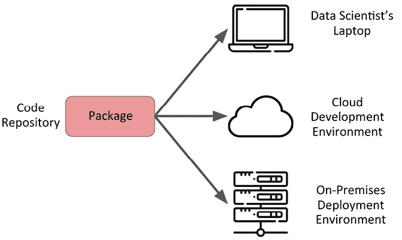

图 4.1：为你的 ML 解决方案开发包允许你一次编写代码，但在不同的环境中多次使用。

下一个部分将基于这些关于打包的主要思想来讨论特定的用例，在这些用例中，打包我们的代码可以是有益的。

## 选择打包用例

首先，并不是所有的解决方案都应该成为库。如果你有一个极其简单的用例，你可能只需要一个简单的脚本来按计划运行你的 ML 解决方案的核心。在这种情况下，你仍然可以编写一个精心设计的系统和高性能的代码，但这不是库。同样，如果你的问题最好通过一个 Web 应用来解决，那么尽管会有很多组件，但这不会自然成为一个库。

你可能想将你的解决方案编写成库或包的一些良好理由如下：

+   你的代码解决的问题是一个常见问题，可能在多个项目或环境中出现。

+   你想要抽象出实现细节，以便执行和开发可以解耦，这样其他人使用你的代码就会更容易。

+   为了最小化你需要更改代码以实现错误修复的地方和次数。

+   为了使测试更加简单。

+   为了简化你的**持续集成/持续部署**（**CI/CD**）流程。

我们现在将深入探讨我们可能如何设计我们的包。

## 设计你的包

你的代码库布局远不止是风格上的考虑。它将决定你的代码在项目的每个实例中是如何被使用的——没有压力！

这意味着你需要仔细思考你想要如何布局你的代码，以及这如何影响使用模式。你需要确保所有主要组件都在代码库中有存在感，并且容易找到。

让我们通过一个基于我们在前几节中解决的异常值检测案例的示例来解决这个问题。

首先，我们需要决定我们想要创建什么样的解决方案。我们是在构建一个将运行 Web 应用程序或具有许多功能的独立可执行文件，还是在为其他人构建一个用于他们机器学习项目的库？实际上，我们可以选择做更多的事情！对于这个案例，让我们构建一个可以导入到其他项目中使用的包，也可以以独立执行模式运行。

为了为我们的包开发设定上下文，想象一下我们被要求开始构建一个解决方案，该解决方案可以运行一系列选定的无监督异常值检测模型。数据科学家发现，对于当前的问题，`Isolation` `Forest`模型性能最佳，但它们必须在每次运行时重新训练，并且包的用户应该能够通过配置文件编辑模型的配置。到目前为止，只研究了`sklearn`模型，但包的商业用户希望如果需要，这个功能可以扩展到其他建模工具。这个项目的技术要求意味着我们不能使用 MLflow。

别担心；在后面的章节中，当我们构建更多示例时，我们会放宽这个限制，以展示它们是如何相互关联的：

1.  我们将要构建的包全部关于异常值，所以让我们称它为`outliers`（我知道，有创意，对吧？）。为了清楚地展示所有内容是如何相互关联的，我们将从名为`outlier_package`的文件夹开始构建`outliers`包：

    ```py
    outlier_package/
    ├── outliers/ 
    ```

1.  我们的设计将基于我们希望解决方案拥有的功能；在这种情况下，我们想要一个可以检测异常值的工具，所以让我们创建一个名为`detectors`的子包：

    ```py
    outlier_package/
    ├── outliers/
               ├── detectors 
    ```

1.  在这里，我们将放置一些代码，这些代码将（稍后详细介绍）围绕外部库的一些基本模型进行包装。我们还将想要一些获取我们用于分析的数据的代码，因此我们也将为这个添加一个子包：

    ```py
    outlier_package/
    ├── outliers/
               ├── detectors
               ├── data 
    ```

1.  我们已经可以看到我们的包正在成形。最后，我们希望有一个地方来存储配置信息，以及一个地方来存储可能在整个包中使用的辅助函数，所以让我们也为这些添加一个目录和子包：

    ```py
    outlier_package/
    ├── outliers/
               ├── detectors
               ├── data
               ├── configs
               ├── utils 
    ```

    现在，这种布局并不是神圣不可侵犯的，或者以任何方式被规定。我们可以以我们想要的方式创建布局，并做我们认为合理的事情。

    然而，在做这件事的时候，始终记住**不要重复自己**（**DRY**）、**保持简单，傻瓜**（**KISS**）以及 Python 的箴言“最好只有一种做某事的方式”是很重要的。如果你坚持这些原则，你将不会有问题。有关这些原则的更多信息，请参阅[`code.tutsplus.com/tutorials/3-key-software-principles-you-must-understand--net-25161`](https://code.tutsplus.com/tutorials/3-key-software-principles-you-must-understand--net-25161)和[`www.python.org/dev/peps/pep-0020/`](https://www.python.org/dev/peps/pep-0020/)。

    那么，这些子包中实际上有什么呢？当然，是底层代码！

1.  在这种情况下，我们希望有一个接口，它可以在我们的检测实现和创建管道以及调用它们的语法之间提供接口，因此我们将构建一个简单的类并将其保存在`pipelines.py`中。`pipelines.py`文件包含以下代码：

    ```py
    from sklearn.preprocessing import StandardScaler
    from sklearn.pipeline import make_pipeline

    class OutlierDetector(object):
        def __init__(self, model=None):
            if model is not None:
                self.model = model
            self.pipeline = make_pipeline(StandardScaler(), self.model)
        def detect(self, data):
            return self.pipeline.fit(data).predict(data) 
    ```

1.  然后，我们还需要一些定义我们想要交互的模型的东西。在这种情况下，我们将创建使用配置文件中存储的信息来决定实例化几个选定模型之一的代码。我们将所有这些功能放入一个名为`DetectionModels`的类中。为了简洁，我们在此实例中省略了类中每个函数的详细信息：

    ```py
    import json
    from sklearn.ensemble import IsolationForest

    class DetectionModels(object):
        def __init__(self, model_config_path=None):
    ....
        def create_model(self, model_name=None, params=None):
    ....
        def get_models(self):
    .... 
    ```

1.  初始化方法在这里进行了扩展。请注意，我们编写了这段代码，以便能够在`config`文件中定义一系列模型：

    ```py
    class DetectionModels(object):
        def __init__(self, model_config_path=None):
            if model_config_path is not None:
                with open(model_config_path) as w:
                    self.model_def = json.load(w) 
    ```

1.  然后，`create_model`方法可以根据参数和模型名称信息实例化模型。我们还构建了这个功能，以便如果我们想的话，实际上可以从不同的库中拉取模型的配置信息；我们只需在这个`create_model`函数中添加适当的实现逻辑，检查是否定义了`sklearn`或另一个模型，并在每种情况下运行适当的语法。我们还需要确保在`OutlierDetector`中生成的管道在每个情况下都是合适的：

    ```py
     def create_model(self, model_name=None, params=None):
            if model_name is None and params is None:
                return None
            if model_name == 'IsolationForest' and params is not None:
                return IsolationForest(**params) 
    ```

1.  最后，我们通过`get_models`方法将前面提到的方法整合在一起，该方法返回一个包含在适当配置文件中定义的所有模型的列表，这些模型通过`create_model`方法实例化为`sklearn`对象：

    ```py
     def get_models(self):
            models = []
            for model_definition in self.model_def:
                defined_model = self.create_model(
                    model_name=model_definition['model'],
                    params=model_definition['params']
                )
                models.append(defined_model)
            return models 
    ```

    您可能正在想*为什么不直接读取适当的模型并应用它，无论它是什么？*这可能是一个可行的解决方案，但我们在这里所做的是意味着只有经过项目团队批准的模型类型和算法才能进入生产，同时允许使用异构模型实现。

1.  为了看到这一切在实际中是如何工作的，让我们在包的最高级别定义一个名为`__main__.py`的脚本，它可以作为建模运行执行的主要入口点：

    ```py
    from utils.data import create_data
    from detectors.detection_models import DetectionModels
    import detectors.pipelines
    from definitions import MODEL_CONFIG_PATH

    if __name__ == "__main__":
        data = create_data()
        models = DetectionModels(MODEL_CONFIG_PATH).get_models()
        for model in models:
            detector = detectors.pipelines.OutlierDetector(model=model)
            result = detector.detect(data)
            print(result) 
    ```

1.  这里提到的`model_config.json`文件由以下代码提供：

    ```py
    [
      {
        "model": "IsolationForest",
        "params": {
          "contamination": 0.15,
          "random_state": 42
        }
      }
    ] 
    ```

1.  `definitions.py`文件是一个包含我们想要在包中全局访问的相关路径和其他变量的文件，而不会污染命名空间：

    ```py
    import os

    ROOT_DIR = os.path.dirname(__file__)
    MODEL_CONFIG_PATH = os.path.join(ROOT_DIR, "configs/model_config.
                                     json") 
    ```

    我们可以看到，我们实际上并没有对结果做任何事情；我们只是打印它们以显示生成了输出。但在现实中，您要么将这些结果推送到其他地方，要么对它们进行统计分析。

    您可以通过在终端中输入以下内容来运行此脚本：

    ```py
    python __main__.py 
    ```

    或者，您也可以输入以下内容：

    ```py
    python -m outliers 
    ```

    这就是您如何将功能打包到类、模块和包中的方法。给出的示例相对有限，但它确实让我们意识到不同的部分是如何组合在一起并执行的。

重要提示

这里给出的示例是为了展示您如何通过使用本章讨论的一些技术将代码连接起来。这并不一定是将所有这些部分组合起来的唯一方法，但它确实很好地说明了如何创建自己的包。所以，请记住，如果您看到改进此实现或将其适应您自己的目的的方法，那么真是太棒了！

在下一节中，我们将探讨如何构建此代码的发行版，以及如何允许我们和用户将`outliers`包安装为正常的 Python 包，这样我们就可以在其他项目中使用了。

# 构建您的包

在我们的示例中，我们可以使用`setuptools`库将我们的解决方案打包起来。为了做到这一点，您必须创建一个名为`setup.py`的文件，该文件包含您解决方案的重要元数据，包括它所需的相关包的位置。以下代码块展示了如何为一个简单的包装本章提到的某些异常检测功能的包进行此操作：

```py
from setuptools import setup

setup(name='outliers',
      version='0.1',
      description='A simple package to wrap some outlier detection
                   functionality',
      author='Andrew McMahon',
      license='MIT',
      packages=['outliers'],
      zip_safe=False) 
```

我们可以看到`setuptools`允许您提供元数据，例如包的名称、版本号和软件许可。一旦您在项目的根目录中有了这个文件，您就可以做几件事情：

1.  首先，您可以将包本地安装为可执行文件。这意味着您可以在想要运行的代码中像导入其他 Python 库一样导入您的库：

    ```py
    pip install . 
    ```

1.  你可以创建一个源分布的包，这样所有的代码都可以高效地打包在一起。例如，如果你在你的项目根目录运行以下命令，就会在名为`dist`的文件夹中创建一个`gzipped tarball`：

    ```py
    python setup.py sdist 
    ```

1.  你可以创建一个打包的分布，这是一个可以被用户立即解包并使用的对象，而无需像源分布那样运行`setup.py`脚本。最合适的打包分布是众所周知的 Python `wheel`。在你的项目根目录中运行以下命令将创建`wheel`并将其放入`dist`文件夹：

    ```py
    python setup.py bdist_wheel 
    ```

1.  如果你打算使用 pip 分发你的代码，那么打包一个`source`分布和一个`wheel`，并让用户决定要做什么是有意义的。所以，你可以构建这两个，然后使用一个名为`twine`的包将这两个分布上传到 PyPI。如果你想这样做，那么你需要注册一个 PyPI 账户，网址为[`pypi.org/account/register/`](https://pypi.org/account/register/)。只需在你的项目根目录中一起运行前两个命令，并使用`twine upload`命令：

    ```py
    python setup.py sdist bdist_wheel
    twine upload dist/* 
    ```

关于打包的更多信息，你可以阅读由**Python 打包权威机构**（**PyPA**）提供的资料和教程，网址为[`www.pypa.io/en/latest/`](https://www.pypa.io/en/latest/)。

下一节简要介绍了我们可以如何使用 Makefile 自动化围绕构建和测试我们的包的一些步骤。

## 使用 Makefile 管理你的环境

如果我们在 UNIX 系统上并且安装了`make`实用程序，那么我们可以进一步自动化我们想要在不同场景下运行的解决方案的许多步骤。例如，在以下代码块中，我们有一个 Makefile，允许我们运行我们模块的主入口点，运行我们的测试套件，或使用`run`、`test`和`clean`目标清理任何工件：

```py
MODULE := outliers
run:
    @python -m $(MODULE)
test:
    @pytest
.PHONY: clean test
clean:
    rm -rf .pytest_cache .coverage .pytest_cache coverage.xml 
```

这是一个非常简单的 Makefile，但我们可以通过分层添加更多命令使其变得尽可能复杂。如果我们想`运行`一组特定的命令，我们只需调用`make`，然后是目标名称：

```py
make test
make run 
```

这是一种强大的方法，可以抽象出你通常必须手动输入的许多终端命令。它还充当了解决方案其他用户的文档！

我们刚才通过的这个例子相当简单；现在让我们使事情更加复杂。实际上，我们可以使用 Makefile 来管理我们的环境，并帮助简化我们的开发过程，这样就不需要大量的认知努力来跟踪我们环境的状态。

以下示例借鉴了 Kjell Wooding 或 GitHub 上的*hackalog*的大量优秀工作，具体是他的仓库[`github.com/hackalog/make_better_defaults`](https://github.com/hackalog/make_better_defaults)。

这个仓库是他 2021 年 PyData 全球会议上的演讲的基础，该演讲的标题为“Makefiles：使你的 Conda 环境更易于管理的绝妙技巧”。

首先，包含一个 `Makefile.help` 文件允许在使用 `make` 命令时提供可定制的帮助提示。如果我们假设我们仍然在主项目目录中，并在终端运行 `make`，你将看到 *图 4.2* 中的输出。

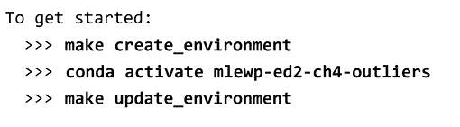

图 4.2：从 Makefile 示例中提供的帮助信息。

这个帮助信息是通过在主 Makefile 中使用 `PROJECT_NAME` 变量进行定制的，该变量已被设置为 `mlewp-ed2-ch4-outliers`。实际上，Makefile 的顶部为这个项目设置了几个变量：

```py
MODULE := outliers
PROJECT_NAME := mlewp-ed2-ch4-outliers
PYTHON_INTERPRETER := python3
ARCH := $(shell $(PYTHON_INTERPRETER) -c "import platform;
print(platform.platform())")
VIRTUALENV := conda
CONDA_EXE ?= ~/anaconda3/bin/conda
EASYDATA_LOCKFILE := environment.$(ARCH).lock.yml 
```

`MODULE` 变量仍然是指之前提到的包名。`PYTHON_INTERPRETER`、`CONDA_EXE` 和 `VIRTUALENV` 应该是自我解释的。`ARCH` 会从本地系统获取架构信息。`EASYDATA_LOCKFILE` 指的是在我们工作时创建的一个文件，它帮助我们跟踪项目中所有依赖项的完整列表。

你可以看到帮助信息清楚地指出了 Makefile 的不同目标，因此让我们逐一探索这些目标。首先，为了标准化为项目创建新的 Conda 环境（如果需要的话），有一些步骤可以合并在一起：

```py
$(EASYDATA_LOCKFILE): environment.yml
ifeq (conda, $(VIRTUALENV))
    $(CONDA_EXE) env update -n $(PROJECT_NAME) -f $<
    $(CONDA_EXE) env export -n $(PROJECT_NAME) -f $@
    # pip install -e .  # uncomment for conda <= 4.3
else
    $(error Unsupported Environment `$(VIRTUALENV)`. Use conda)
endif
.PHONY: create_environment
# Set up virtual (conda) environment for this project
create_environment: $(EASYDATA_LOCKFILE)
ifeq (conda,$(VIRTUALENV))
    @rm -f $(EASYDATA_LOCKFILE)
    @echo
    @echo "New conda env created. Activate with:"
    @echo ">>> conda activate $(PROJECT_NAME)"
    @echo ">>> make update_environment"
        ifneq ("X$(wildcard .post-create-environment.txt)","X")
            @cat .post-create-environment.txt
        endif
else
    $(error Unsupported Environment `$(VIRTUALENV)`. Use conda)
endif 
```

逐步走过这个步骤，这段代码表明如果 `conda` 是虚拟环境，那么就继续创建或更新一个带有项目名称的 Conda 环境，然后将环境导出到 `environment.yml` 文件中；然后在此之后，将环境配置导出到锁文件中。它之所以这样工作，是因为 `$<` 指的是第一个前提条件（在这种情况下，是 `environment.yml` 文件），而 `$@` 指的是目标名称（在这种情况下，是 `EASYDATA_LOCKFILE` 变量）。触发此操作后，第二个块会检查 `conda` 是否是虚拟环境管理器，然后在删除锁文件之前，在终端为用户提供一些指导。注意，这里的 `@` 指的是终端命令。

Makefile 中下一个重要的部分是处理在需要时为你更新环境的部分，这在项目的“开发”阶段通常会是这种情况：

```py
.PHONY: update_environment
## Install or update Python Dependencies in the virtual (conda) environment
update_environment: environment_enabled $(EASYDATA_LOCKFILE)
    ifneq ("X$(wildcard .post-update-environment.txt)","X")
        @cat .post-update-environment.txt
    endif 
```

这个块确保如果你在终端运行以下命令：

```py
make update_environment 
```

然后，你将创建一个新的 `lockfile.yml` 文件，其中包含环境的最新版本的所有详细信息。还有一个 `delete_environment` 目标，它将清除锁文件并删除 Conda 环境，以及一些其他不需要在此处关心的辅助目标，但你可以在书籍仓库中探索它们。

将所有这些放在一起，使用基于 Makefile 的这种方法的工作流程将是：

1.  为项目创建一个初始的`environment.yml`文件。这可能非常简单；例如，对于我们在本章中构建的`outliers`包，我开始于一个看起来像这样的`environment.yml`文件：

    ```py
    name: mlewp-ed2-ch4-outliers
    channels:
      - conda-forge
    dependencies:
      - python=3.10.8
      - scikit-learn
      - pandas
      - numpy
      - pytest
      - pytest-cov
      - pip 
    ```

1.  使用以下命令创建环境：

    ```py
    make create_environment 
    ```

1.  更新环境，这将创建第一个锁文件：

    ```py
    make update_environment 
    ```

1.  在你开发解决方案的过程中，如果你需要一个新的包，请进入`environment.yml`文件，在运行`make update_environment`之前添加你需要的依赖项。这里的理念是，通过在`environment.yml`文件中强制要求这些包，而不是手动安装它们，你可以创建一个更可重复和更健壮的工作流程。

    你将无法忘记你安装了什么和没有安装什么！例如，如果我想向这个环境添加`bandit`包，我会使用我的文本编辑器或 IDE 进入`environment.yml`文件，并简单地在`conda`或`pip`依赖项中添加这个依赖项：

    ```py
    name: mlewp-ed2-ch4-outliers
    channels:
      - conda-forge
    dependencies:
      - python=3.10.8
      - scikit-learn
      - pandas
      - numpy
      - pytest
      - pytest-cov
      - bandit
      - pip 
    ```

就这样！这就是你如何使用 Makefiles 以更可重复的方式管理你的 Conda 环境。如上所述，如果你想重新开始，你可以通过运行以下命令来删除环境：

```py
make delete_environment 
```

这就涵盖了管理你的 Python 开发环境的方法。现在我们将讨论目前最流行的 Python 依赖项管理和打包工具之一，**Poetry**。

## 用 Poetry 来诗意地表达

Python 包管理是关于这种语言的一些事情，肯定不会让人在屋顶上大声赞扬。甚至包括我最热情的支持者（包括我自己）在内的最热情的支持者都广泛承认，Python 的包管理，坦白说，有点混乱。我们使用`setup.py`和制作轮子所经历的例子是一些最被接受的方式，正如提到的，由 PyPA 推荐。但它们仍然不是你期望从这个语言中得到的简单或最直观的方法，尽管它通常将这些作为关键设计原则。

幸运的是，在过去的几年里，已经有一些重大发展，其中之一我们将在此详细讨论。这是创建 Python 打包和依赖项管理工具 Poetry。Poetry 的好处包括其易用性和极大地简化了解决方案的打包和依赖项管理。最明显的是，它通过只要求一个配置文件，即`pyproject.toml`文件，而不是可能包括`setup.py`、`setup.cfg`、`MANIFEST.in`或`Pipfile`配置文件的潜在设置来实现这一点。还有一个很大的优势，即依赖项文件被锁定，因此不会自动更新，这意味着管理员（你）必须明确指出依赖项的变化。这有助于使项目更稳定。

所以，这听起来很棒，但我们如何开始呢？嗯，毫不奇怪，我们首先使用`pip`安装这个工具：

```py
pip install poetry 
```

然后，如果你想启动一个新的利用 Poetry 的项目，你将进入你希望你的包所在的适当目录，并运行以下命令：

```py
poetry new my-ml-package 
```

这将创建一个类似以下的子目录结构：

```py
├── README.md
├── my_ml_package
│   └── __init__.py
├── poetry.lock
├── pyproject.toml
└── tests
    └── __init__.py 
```

`tests` 文件夹将是我们放置单元测试的地方，正如本章的 *测试* 部分所述。`pyproject.toml` 是目录中最重要的文件。它指定了与项目相关的所有主要元数据，并组织成包含生产环境和开发及测试的包依赖的块。

当我运行前面的命令时生成的文件是 *图 4.3* 中显示的：

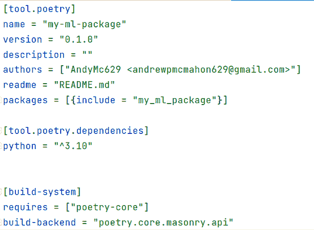

图 4.3：当我们创建新项目时，Poetry 创建的 pyproject.toml 文件。

在第一种情况下，这在一个 `[tool.poetry]` 块下给出，它涵盖了关于包的高级信息。然后是 `[tool.poetry.dependencies]`，目前它只包含 Python 3.10 版本，没有其他内容，因为我还没有用它安装其他任何东西。`[build-system]` 部分包含构建时依赖的详细信息，这里只列出了 `poetry-core`。

如果我们想添加一个新的依赖项，例如 `pytest`，我们可以运行类似以下命令：

```py
poetry add pytest 
```

这将在终端输出类似于 *图 4.4* 中显示的内容。

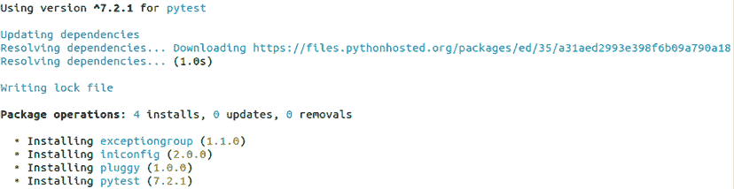

图 4.4：向 Poetry 管理的项目添加新包的输出。

这也将更新 `pyproject.toml` 文件，添加新的依赖项，如图 4.5 所示。

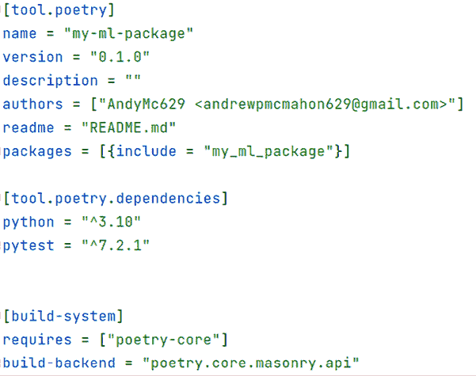

图 4.5：添加新依赖项后的更新 pyproject.toml 文件。

现在，`[tool.poetry.dependencies]` 部分是你应该定义所有需要在运行时安装到你的包中的包的地方，因此你并不想在这个部分添加大量的测试包。

相反，Poetry 允许你通过指定一个 `[tool.poetry.group.dev.dependencies]` 块来定义一个列出你的开发依赖项的块，就像 *图 4.6* 中显示的那样。

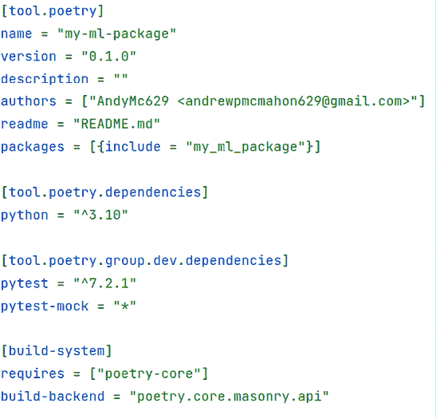

图 4.6：包含一组开发依赖项的 pyproject.toml 文件。

当你安装 Poetry 时，它会为你创建一个自己的虚拟环境，以便从你的系统其他部分创建适当的隔离。如果你在 Linux 系统上，你可以通过运行以下命令来激活此环境：

```py
source /path/to/venv/bin/activate 
```

或者你也可以运行：

```py
poetry shell 
```

如果你已经通过 Conda、`venv` 或其他工具运行了一个 Python 虚拟环境，那么 Poetry 实际上是知道这一点的，并在其中工作。这非常有帮助，因为你可以使用 Poetry 来管理这个虚拟环境，而不是从头开始。在这种情况下，你可能会在终端中得到一些类似于 *图 4.7* 中显示的输出。

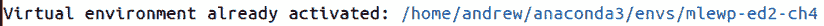

图 4.7：如果你已经在 Python 虚拟环境中工作，poetry 命令的输出。

要关闭此环境但不是你正在运行的 shell，你可以使用以下命令：

```py
deactivate 
```

如果你想关闭环境和 shell（请注意，这可能会关闭你的终端），你可以输入以下命令：

```py
exit 
```

要安装你在`pyproject.toml`文件中添加的依赖项，你可以运行：

```py
poetry install 
```

这将根据你的`pyproject.toml`文件中列出的所有依赖项进行下载和安装，从`pip`获取最新版本，或者它会获取并安装这些包的版本，正如`.lock`文件中所列。这是为了确保即使有多个人在环境中工作并运行`poetry install`命令，环境也能保持稳定，包版本一致。这正是本章前面关于 Makefile 部分使用`.lock`文件的原因。例如，当为`my-ml-package`项目运行`install`命令时，输出显示在*图 4.8*中。

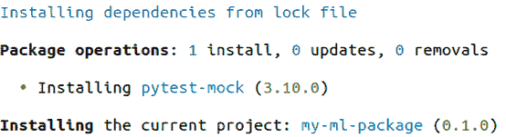

图 4.8：Poetry 从.lock 文件中安装包以保持环境稳定性。

所有的前述命令都是关于环境的基本管理，但当我们想要对这个环境做些什么时怎么办呢？好吧，如果你有一个名为`main.py`的脚本，你可以通过以下命令使用 Poetry 配置的环境来运行它：

```py
poetry run python main.py 
```

在`my-ml-package`中我们没有类似的东西。相反，由于我们正在构建一个库，我们可以通过运行以下命令来打包和部署包：

```py
poetry build 
```

这将显示*图 4.9*中所示的输出。

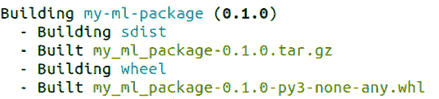

图 4.9：Poetry 构建我们的简单包时的输出。

如果你想要发布到 PyPI，这只有在你有正确配置的凭据并注册为用户时才有效，你可以直接运行`poetry publish`命令。如果你想要发布到其他私有仓库，你可以运行：

```py
poetry publish –r private-repository-location 
```

在所有这些之后，你可能已经看到了 Poetry 在包开发方面如何使事情变得更加清晰。我们已经能够管理稳定开发和生产（如可以由多个开发者工作而不用担心损坏的 Python 环境），构建和发布我们的包，以及运行我们想要的任何脚本和进程——所有这些只需几个命令即可完成！

接下来，让我们讨论一些我们可以采取的步骤，以确保我们的包是健壮的，并且可以在出现问题时优雅地工作或失败，并且可诊断。

# 测试、日志记录、安全性和错误处理

构建执行 ML 任务的代码可能看起来像是最终目标，但它只是拼图中的一块。我们还希望对此代码能够正常工作有信心，如果它不能，我们能够修复它。这就是测试、日志记录和错误处理概念发挥作用的地方，接下来的几节将对此进行高层次概述。

## 测试

将你的机器学习工程代码与典型的研究脚本区分开来的最重要的特性之一是存在稳健的测试。对于你设计的任何部署系统来说，它必须能够被信任不会总是失败，而且你可以在开发过程中捕捉到问题。

幸运的是，由于 Python 是一种通用编程语言，它充满了用于对软件进行测试的工具。在本章中，我们将使用**pytest**，这是 Python 代码中最受欢迎、功能强大且易于使用的测试工具集之一。pytest 特别适用于初学者，因为它专注于构建作为独立 Python 函数的测试，这些函数非常易于阅读，而其他包有时会导致创建笨拙的测试类和复杂的`assert`语句。让我们通过一个例子来深入了解。

首先，让我们从这个章节的其余部分中定义的`outliers`包的一些代码片段开始编写测试。我们可以定义一个简单的测试来确保我们的数据辅助函数实际上创建了一些可以用于建模的数值数据。要在 pytest 中运行这种测试，我们首先在测试目录的某个位置创建一个名为`test_`或`_test`的文件——pytest 将自动找到具有这种命名的文件。例如，我们可能编写一个名为`test_create_data.py`的测试脚本，其中包含我们需要测试的所有在解决方案中创建数据的函数的逻辑。让我们用一个例子来明确这一点：

1.  从包中导入我们将需要的相关模块以及我们需要的其他测试相关内容。在这里，我们导入`pytest`，因为我们将在后续步骤中使用它的一些功能，但通常情况下，你不需要导入这个模块：

    ```py
    import numpy
    import pytest
    import outliers.utils.data 
    ```

1.  然后，由于我们想要测试创建数据的函数，最好只生成一次数据，然后以各种方式测试其属性。为此，我们使用 pytest 的`fixture`装饰器，它允许我们定义一个可以被多个测试读取的对象。在这里，我们使用它，这样我们就可以使用`dummy_data`来应用我们的测试，`dummy_data`只是`create_data`函数的输出：

    ```py
    @pytest.fixture()
    def dummy_data():
        data = outliers.utils.data.create_data()
        return data 
    ```

1.  最后，我们实际上可以编写测试了。这里有两个示例，用于测试由函数创建的数据集是否是`numpy`数组，以及它是否有超过`100`行的数据：

    ```py
    def test_data_is_numpy(dummy_data):
        assert isinstance(dummy_data, numpy.ndarray)
    def test_data_is_large(dummy_data):
        assert len(dummy_data)>100 
    ```

    我们可以编写尽可能多的这些测试和尽可能多的这些类型的测试模块。这使我们能够在我们整个包中创建高程度的**测试覆盖率**。

1.  然后，你可以在项目的顶层终端中输入以下命令来运行包中的所有测试：

    ```py
    $ pytest 
    ```

1.  然后，你将看到一条类似的消息，告诉我们哪些测试已运行，哪些已通过和失败：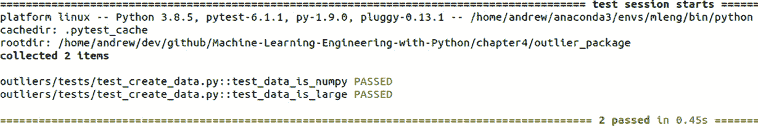

    图 4.10：pytest 中成功单元测试的输出。

    之前的例子展示了如何编写和执行一些基本的数据工具测试。现在，我们可以通过测试包中的一些更复杂的功能来扩展这一点——即模型创建过程。

1.  与之前的案例类似，我们在 `tests/test_detectors.py` 中创建一个脚本来保存我们的测试。由于我们正在测试更复杂的功能，我们将在脚本中导入包的更多部分：

    ```py
    import pytest
    from outliers.detectors.detection_models import DetectionModels
    from outliers.detectors.pipelines import OutlierDetector
    from outliers.definitions import MODEL_CONFIG_PATH
    import outliers.utils.data
    import numpy as np 
    ```

1.  我们将会有与 *步骤 2* 中创建的虚拟数据相同的设置，但现在我们也有一个用于在测试中创建一些示例模型的设置：

    ```py
    @pytest.fixture()
    def example_models():
        models = DetectionModels(MODEL_CONFIG_PATH)
        return models 
    ```

1.  我们最终的设置为我们创建了一个示例检测实例，基于之前的模型设置：

    ```py
    @pytest.fixture()
    def example_detector(example_models):
        model = example_models.get_models()[0]
        detector = OutlierDetector(model=model)
        return detector 
    ```

1.  现在我们已经准备好测试一些模型创建功能。首先，我们可以测试我们创建的模型不是空的 `对象`：

    ```py
    def test_model_creation(example_models):
        assert example_models is not None 
    ```

1.  然后，我们可以测试是否可以使用在 *步骤 6* 中创建的 `DetectionModels` 实例成功检索模型：

    ```py
    def test_model_get_models(example_models):
        example_models.get_models() is not None 
    ```

1.  最后，我们可以测试应用模型找到的结果是否通过一些简单的测试。这表明我们包的主要部分在端到端应用程序中正在正常工作：

    ```py
    def test_model_evaluation(dummy_data, example_detector):
        result = example_detector.detect(dummy_data)
        assert len(result[result == -1]) == 39 #number of anomalies to detect
        assert len(result) == len(dummy_data) #same numbers of results
        assert np.unique(result)[0] == -1
        assert np.unique(result)[1] == 1 
    ```

1.  如同 *步骤 4* 中所述，我们可以从命令行运行完整的测试套件。我们添加了一个详细程度标志来返回更多信息并显示通过的单个测试。这有助于确认我们的数据工具和模型测试正在被触发：

    ```py
    pytest –-verbose 
    ```

1.  输出结果展示在下面的屏幕截图上：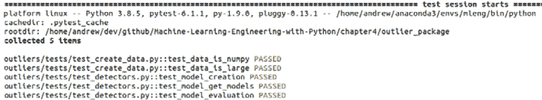

    图 4.11：数据和模型功能成功测试的输出。

这些测试的运行可以通过在我们的存储库中包含 `githooks` 或通过使用其他工具（如项目中使用的 `Makefile`）来自动化。

现在，我们将继续考虑如何记录代码运行时的信息，这有助于调试和一般监控你的解决方案。

## 保护你的解决方案

作为任何类型的软件工程师，我们应始终非常清楚，使用人们使用的产品的喜悦背后有一个反面。这个反面是，确保解决方案对用户安全且安全是你的工作。用本叔叔的话说，“*能力越大，责任越大*。”

现在，网络安全是一个独立的巨大学科，所以我们在这里无法做到公正。以下章节将简单地介绍一些有用的工具，并解释如何使用它们的基本原理，以使你的解决方案更加安全和可靠。

首先，我们需要了解我们可以创建安全解决方案的不同方式：

+   测试应用程序和代码本身是否存在内部错误。

+   筛选软件包和扫描其他用于安全漏洞的代码。

+   测试数据泄露和数据暴露。

+   开发稳健的监控技术，特别是针对上述要点，而不是特别关注您机器学习模型的监控，这在本书的其他地方已经讨论过。

在第一种情况下，这主要指的是像我们的单元测试方法这样的东西，我们已经在其他地方讨论过，但简而言之，这指的是测试您编写的代码的功能，以确保它按预期工作。在模型监控的部分提到，对机器学习模型的预期性能进行标准测试可能很困难，因此需要特定的技术。

在这里，我们更关注通用应用代码和包装主要模型的解决方案。

在筛选包和代码的情况下，这是一个非常相关且幸运的是易于实施的挑战。读者可能还记得，在 2022 年，全球出现了一波活动，组织机构和软件工程师试图应对在基于 Java 的 Log4j 库中发现的一个错误的发现。错误和安全漏洞总会发生，并不总是被检测到，但这个要点是关于在您的解决方案中自动扫描您使用的代码和包以主动找到这些漏洞，从而为您的代码用户节省大量麻烦（以及更糟糕的事情）。

数据泄露现在是一个极其重要的话题。欧盟的**通用数据保护条例**（**GDPR**）对客户数据的管理和保养给予了极大的重视。由于机器学习系统本质上是以数据驱动的应用，这意味着围绕隐私、使用、存储以及许多其他点在设计实现中考虑变得极为重要。重要的是要注意，我们在这里讨论的内容远远超出了“垃圾输入，垃圾输出”的数据质量问题，实际上是在讨论您如何安全地持有和传输使您的机器学习系统工作的数据。

## 分析您的代码中的安全问题

正如您在这本书的整个过程中所注意到的，Python 开源社区几乎涵盖了您能想到的所有挑战，在安全方面也不例外。要执行您自己代码的静态分析并检查在开发过程中可能引入的漏洞，您可以使用开源的 Bandit 包，[`bandit.readthedocs.io/en/latest/`](https://bandit.readthedocs.io/en/latest/)。这是一个专注于在源代码中查找安全问题的 linter，它运行起来非常简单。

首先，像往常一样，我们需要安装 Bandit。现在我们可以使用在早期关于*构建您的包*部分学到的 Makefile 魔法来完成这项工作，因此我们将 Bandit 包添加到`environment.yml`文件中的`pip`依赖项中，并运行命令：

```py
make update_environment 
```

然后，要在您的源代码上运行 Bandit，您只需运行：

```py
bandit -r outliers 
```

正如我们在 *第二章*，*机器学习开发过程* 中提到的，自动化任何你希望反复运行的开发步骤总是很有用的。我们可以通过在 Git 目录中的 `.pre-commit-config.yaml` 中添加以下内容来实现 Bandit：

```py
repos:
- repo: https://github.com/PyCQA/bandit
  rev: '' # Update me!
  hooks:
  - id: bandit 
```

这意味着在每次提交后，我们将运行 `bandit` 命令，正如前两个步骤中概述的那样。

在 *图 4.12* 中，运行 Bandit 在一些示例代码上的输出以一系列类似以下的内容给出。

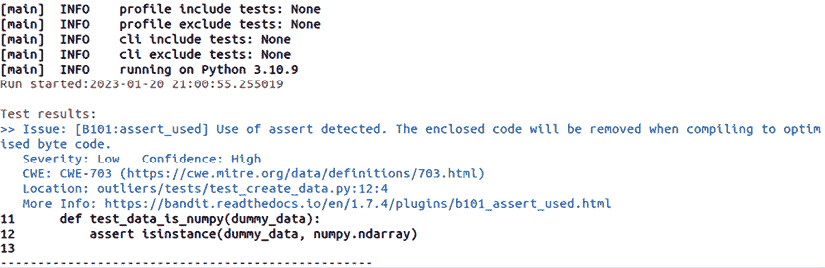

图 *4.12*：Bandit 在一段典型代码上的输出。

输出末尾会跟一个小型的总结报告，如图 *4.13* 所示。

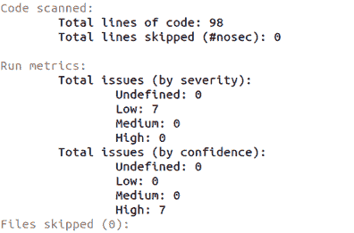

图 *4.13*：Bandit 工具在其输出末尾提供了一个高级总结，用于诊断你的代码库状态。

Bandit 有许多其他功能，但这也展示了如何轻松地开始并开始分析你的 Python 代码库中的潜在问题。

## 分析依赖项以查找安全问题

正如我们概述的，我们不仅想要扫描我们编写的代码中的安全漏洞；同样重要的是，我们尝试找到我们在解决方案中使用的任何包中的问题。这可以通过使用类似 Python 的 `safety` 工具来实现，[`pypi.org/project/safety/`](https://pypi.org/project/safety/)。Safety 使用一个包含已知 Python 安全问题的标准化数据库，然后比较你在解决方案中找到的任何包与这个数据库。请注意，正如 safety 文档所指出：

> 默认情况下，它使用仅限非商业用途的开放 Python 漏洞数据库 Safety DB。
> 
> 对于所有商业项目，Safety 必须升级到使用 PyUp API 的键选项。

下面是一个使用 Bandit 在与示例相同的源代码树上使用此工具的示例：

1.  如果你还没有安装 safety，请安装它：

    ```py
    pip install safety 
    ```

1.  在运行之前，你需要切换到你的源代码树顶层文件夹：

    ```py
    safety check 
    ```

当我在包含我们一直在构建的 `outlier_package` 文件夹上运行此程序时，我得到了如图 *4.14* 所示的终端输出：

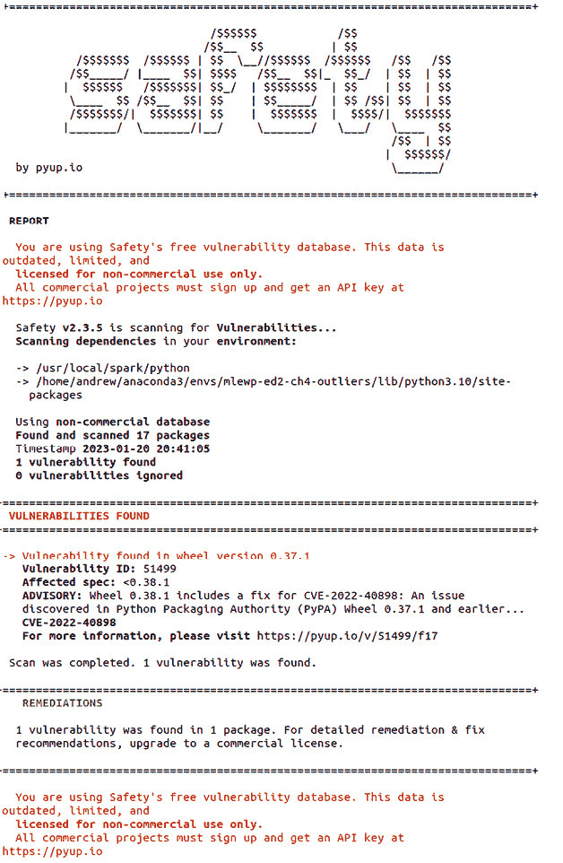

图 *4.14*：safety 在 outliers 包上的输出。

如 *图 4.15* 所示，我们被警告当前版本不能用于扫描商业软件，并且如果需要这样做，你应该获取一个 API 密钥。对于本项目来说，这是可以的。工具已经发现了一个与 `wheel` 包版本相关的漏洞。在检查项目中的 `environment.yml` 文件后，我们发现我们可以将其更新到建议的 0.38.1 版本。这如图 *4.15* 所示。

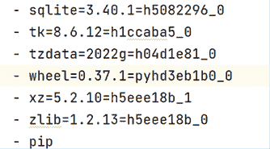

图 *4.15*：更新 environment.yml 文件以避免安全工具产生的错误。

注意，在这个`environment.yml`文件中使用的 Conda 通道没有包含版本 0.38.1 或更高版本的`wheel`包，因此它被添加到了`pip`依赖项中，如*图 4.16*所示。

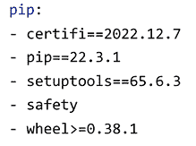

图 4.16：更新 outliers 包中`environment.yml`文件的 pip 依赖项。

执行此操作并重新运行命令后：

```py
safety check 
```

解决方案在*图 4.17*所示的报告中得到了良好的健康报告。

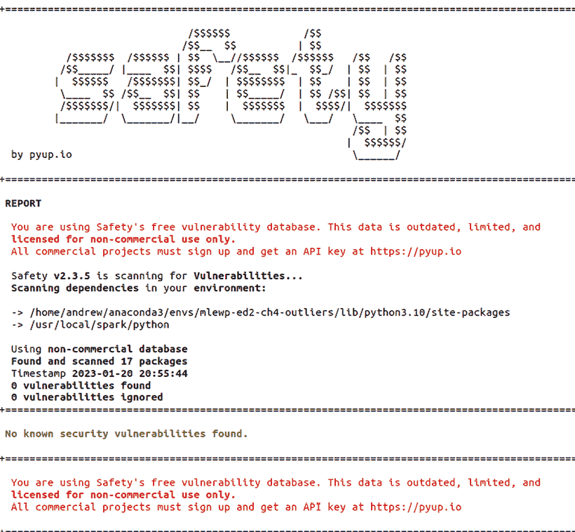

图 4.17：更新已识别的包后，安全工具返回零安全漏洞。

虽然为了获得完整的功能集确实需要商业许可证，但它仍然可以非常有助于在您的依赖项中检测问题。

## 日志记录

接下来，确保在代码运行时报告不同操作的状态，以及发生的任何错误，这一点非常重要。这有助于使代码更易于维护，并在出现问题时帮助您进行调试。为此，您可以使用 Python 的`logging`库。

您可以通过以下逻辑在代码中实例化日志记录器：

```py
import logging
logging.basicConfig(filename='outliers.log',
                    level=logging.DEBUG,
                    format='%(asctime)s | %(name)s | %(levelname)s |
                            %(message)s') 
```

这段代码定义了我们的日志消息格式，并指定了级别为`DEBUG`或更高的日志消息将发送到`outliers.log`文件。然后我们可以使用`logging`库提供的非常易于使用的语法来记录与我们的代码运行状态相关的输出和信息：

```py
logging.debug('Message to help debug ...')
logging.info('General info about a process that is running ...')
logging.warning('Warn, but no need to error ...')
With the settings shown in the first logging snippet, this will result in the following logging messages being written to outliers.log:
2021-08-02 19:58:53,501 | root | DEBUG | Message to help debug ...
2021-08-02 19:58:53,501 | root | INFO | General info about a process that is running ...
2021-08-02 19:58:53,501 | root | WARNING | Warn, but no need to error ... 
```

我们迄今为止所展示的确实是日志记录的基础，并且到目前为止它假设尽管事情可能并不完美，但没有发生错误。这显然并不总是情况！那么，如果我们想将异常或错误记录到我们的日志文件中怎么办呢？

好吧，这通常是通过使用`logging.error`语法来完成的，但我们必须考虑一个重要的点，那就是仅仅记录我们抛出了错误的事实通常是不够的；我们还想记录错误的详细信息。所以，正如在*错误处理*部分所讨论的，我们知道我们可以在某些代码上执行`try` `except`子句，然后抛出一个异常。在这种情况下，我们想要将那个异常的详细信息记录到我们的日志目标中。为此，我们需要知道`logging.error`方法（以及`logging.debug`方法）有一些重要的关键字参数我们可以使用。有关关键字参数的更多信息，请参阅本章中关于*技巧和窍门*的部分。根据日志记录文档，[`docs.python.org/3/library/logging.xhtml#logging.debug`](https://docs.python.org/3/library/logging.xhtml#logging.debug)，关键字参数`exc_info`和`stack_info`被指定为布尔值，而`extra`是一个字典。关键字参数`exc_info = True`指定了我们希望在日志调用中返回异常信息，`stack_info = True`将返回更详细的异常堆栈跟踪信息（包括日志调用），而`extra`可以设置为一个包含开发者定义的额外信息的字典。

在这种情况下，额外的信息随后以记录的初始部分提供，作为事件标识符的一部分。这是一种为您的日志调用提供一些定制信息的好方法。

作为例子，让我们考虑一个定制的特征转换函数，在这种情况下，它实际上不会做任何有用的事情，只是像这样返回原始 DataFrame：

```py
def feature_transform(df: pd.DataFrame) -> pd.DataFrame:
    """Transform a dataframe by not doing anything. Just for demo.
    :param df: a dataframe.
    :return: df.mean(), the same dataframe with the averages of eachcolumn.
    """
    return df.mean() 
```

如果我们想在函数失败时引发异常并记录有关错误的详细信息，我们可以写如下内容：

```py
try:
    df_transformed = feature_transform(df)
    logging.info("df successfully transformed")
except Exception as err:
    logging.error("Unexpected error", exc_info=True) 
```

如果我们在以下简单的虚拟 pandas DataFrame 上运行此代码，代码将无问题执行：

```py
df = pd.DataFrame(data={'col1': [1,2,3,4], 'col2': [5,6,7,8]}) 
```

如果我们这次做同样的事情，但这次我们在没有 pandas DataFrame `mean()` 语法的东西上运行代码，比如一个列表：

```py
list_of_nums = [1,2,3,4,5,6,7,8]
try:
    df_transformed = feature_transform(list_of_nums)
    logging.info("df successfully transformed")
except Exception as err:
    logging.error("Unexpected error", exc_info=True) 
 for the screenshot, shown in *Figure 4.18*.
```

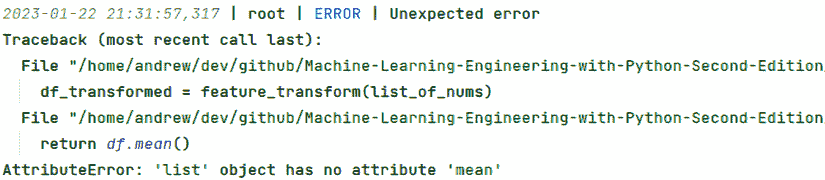

图 4.18：当我们使用 exc_info = True 标志时对日志文件的输出。

## 错误处理

在本节中需要涵盖的最后一点是错误处理。重要的是要记住，当你是一名机器学习工程师时，你的目标是构建能够工作的产品和服务，但这一部分的重要部分是认识到事情并不总是按预期工作！因此，重要的是你构建的模式允许在运行时（不可避免的）错误升级。在 Python 中，这通常是通过 *异常* 的概念来实现的。你可以通过你使用的核心 Python 函数和方法引发异常。例如，想象一下你没有定义变量 `x` 就运行了以下代码：

```py
y = 10*x 
```

以下异常将被引发：

```py
NamError: name 'x' is not defined 
```

对于我们作为工程师来说，重要的是我们应该构建我们可以自信地控制错误流的解决方案。我们可能不希望代码在发生错误时崩溃，或者我们可能希望确保在特定的预期边缘情况下发生非常具体的消息和日志记录。为此，最简单的技术是通过 `try except` 块，如下面的代码块所示：

```py
try:
    do_something()
except:
    do_something_else() 
```

在这种情况下，如果 `do_something()` 运行时遇到错误，则执行 `do_something_else()`。

我们现在将结束对如何在构建解决方案时提高效率的评论。

Python 中的错误处理通常围绕“异常”的概念构建，这些异常只是中断程序预期功能的事件。

Python 中异常的完整列表包含大约 50 种不同类型。以下是从 Python 文档中摘录的部分，省略号突出显示了我没有展示的完整细节：

```py
BaseException
+-- SystemExit
 +-- KeyboardInterrupt
 +-- GeneratorExit
 +-- Exception
      +-- StopIteration
      +-- StopAsyncIteration
      +-- ArithmeticError
      |    +-- FloatingPointError
      |    +-- OverflowError
      |    +-- ZeroDivisionError
      +-- AssertionError
      +-- AttributeError
      +-- BufferError
      +-- EOFError
…
      +-- Warning
           +-- DeprecationWarning
           +-- PendingDeprecationWarning
           +-- RuntimeWarning
           +-- SyntaxWarning
           +-- UserWarning
… 
```

你可以从异常列表中看到，这些是按层次结构组织的。这意味着在较低级别引发异常只是较高级别异常的一个更具体的实例，因此你实际上可以在层次结构的较高级别引发它，而一切仍然可以正确工作。作为一个快速示例，我们可以从 `ArithmeticError` 子层次结构中看到，在层次结构的较低级别有三个异常：

```py
 +-- ArithmeticError
      |    +-- FloatingPointError
      |    +-- OverflowError
      |    +-- ZeroDivisionError 
```

这意味着如果我们为可能除以零的代码抛出异常，我们可以合法地使用 `ZeroDivisionError` 或 `ArithmeticError`：

```py
n = 4.0
try:
    result = n/0.0
except ZeroDivisionError:
    print("Division by zero not allowed!")
n = 4.0
try:
    result = n/0.0	
except ArithmeticError:
    print("Division by zero not allowed!") 
```

通常，当你捕获异常时，你可以选择几种不同的处理方式。首先，你可以处理异常并继续程序流程。你应该在清楚什么将导致错误并且可以在代码逻辑中处理它时这样做。其次，你可以再次抛出异常。你可能出于几个原因想要这样做：

1.  你想在记录错误的同时允许异常向上传播到调用栈。这对于调试目的可能很有用，因为它允许你记录错误消息和其他有关异常的详细信息，同时仍然允许调用代码以适当的方式处理异常。一个例子可能看起来像这样：

    ```py
    import logging

    def process_data(data):
        try:
            # Do some processing on the data
            result = process(data)
        except Exception as e:
            # Log the exception
            logging.exception("Exception occurred while processing
                               data")
            # Re-raise the exception
            raise
        return result 
    ```

    在这个例子中，`process_data` 函数尝试处理一些数据并返回结果。如果在处理数据时发生异常，异常将使用 `logging.exception` 函数记录，该函数记录异常以及堆栈跟踪。然后使用 `raise` 语句重新抛出异常，这允许调用代码以适当的方式处理异常。

1.  你想为异常添加额外的上下文。例如，你可能想添加有关异常发生时应用程序状态的详细信息，或者有关导致异常被抛出的输入的详细信息。改编前面的例子，我们可能会有如下内容：

    ```py
    def process_data(data):
        try:
            # Do some processing on the data
            result = process(data)
        except Exception as e:
            # Add additional context to the exception message
            message = f"Exception occurred while processing data:
                        {data}"
            # Create a new exception with the modified message
            raise Exception(message) from e
        return result 
    ```

    在这个例子中，如果在处理数据时发生异常，异常信息会被修改以包含正在处理的数据。然后使用修改后的消息和原始异常作为原因（使用 `from e` 语法）抛出一个新的异常。

1.  你想在代码的更高层次处理异常，但仍然允许较低层次的代码在更高层次不合适处理异常时进行处理。这稍微复杂一些，所以我们将逐步通过另一个改编的例子。首先，这次，当我们抛出异常时，我们调用一个以特定方式处理异常的函数，称为 `handle_exception`：

    ```py
    def process_data(data):
        try:
            # Do some processing on the data
            result = process(data)
        except Exception as e:
            # Handle the exception
            handle_exception(e)
            # Re-raise the exception
            raise
        return result 
    ```

    `handle_exception` 函数的代码可能看起来像下面这样，其中我们需要确定是否要在当前抽象级别处理异常，还是将其传递到调用栈的上层，使用另一个名为 `should_handle` 的函数：

    ```py
    def handle_exception(e):
        # Log the exception
        logging.exception("Exception occurred")
        # Check if the exception should be handled at this level
        if should_handle(e):
            # Handle the exception
            ...
        else:
            # Allow the exception to propagate up the call stack
            raise 
    ```

    `should_handle` 函数将是定义我们特定逻辑的地方，以决定是否在当前级别处理异常，还是使用 raise 语法将异常升级到调用栈。例如，如果我们想在这个级别处理 `ArithmeticError`，而其他情况下我们想将异常升级到调用栈，逻辑将看起来像这样：

    ```py
    def should_handle(e):
        # Check the type of the exception
        if isinstance(e, ArithmeticError):
            # Handle the exception
            return True
        else:
            # Allow the exception to propagate
            return False 
    ```

1.  最后，您可能需要抛出不同的异常，可能是因为您需要将几个不同的异常组合在一起并在更高层次的抽象中处理它们。再次，根据前面的示例进行调整，这可能意味着您编写了一些看起来像这样的代码：

    ```py
    def process_data(data):
        try:
            # Do some processing on the data
            result = process(data)
        except ValueError as e:
            # Raise a different exception with the same message
            raise MyCustomException(str(e))
        except MyCustomException as e:
            # Raise a different exception with a modified message
            message = f"Exception occurred while processing data:
                        {data}"
            raise MyCustomException(message)
        return result 
    ```

    在这个例子中，如果在处理数据时发生`ValueError`异常，它将被捕获，并抛出一个带有相同消息的新`MyCustomException`。如果发生`MyCustomException`异常，它将被捕获，并抛出一个带有修改后的消息的新`MyCustomException`，该消息包括正在处理的数据。这允许你在更高层次的抽象中一起处理不同类型的异常，通过抛出一个单一的自定义异常类型，可以以一致的方式进行处理。

我们可以使用的一种第三种程序流程是，我们可以在原始异常内部抛出一个新的异常。这可能很有帮助，因为我们可以提供更多关于已发生错误类型的详细信息，并且我们可以提供更多上下文信息，这将有助于我们调试后续的问题。为了使这一点更清晰，让我们定义一个示例函数来代替我们在前面的示例中使用的函数：

```py
def process(data_to_be_processed):
    '''Dummy example that returns original data plus 1'''
    return data_to_be_processed + 1 
```

我们将在与上面列表中的第一个示例相同的函数中调用此代码，但现在我们将添加一个新的语法来从原始异常中抛出异常：

```py
def process_data(data): 
    try: 
        # Do some processing on the data 
        result = process(data) 
    except Exception as e: 
        # Log the exception 
        logging.exception("Exception occurred while processing data") 
        # Raise a new exception from the overall exception
        new_exception = ValueError("Error processing data") 
        raise new_exception from e
    return result 
```

从原始异常中抛出现在确保我们记录了这是一个与输入数据相关的特定`ValueError`，并且它允许我们记录一个更高层次的日志消息，这可以在堆栈跟踪中提供额外的上下文。例如，如果您使用上述函数并运行此函数调用：

```py
process_data('3') 
```

我们得到了预期的错误，因为我们提供了一个字符串，然后尝试将其与一个整数相加。以下是从我运行此代码时得到的堆栈跟踪的一个片段：

```py
ERROR:root:Exception occurred while processing data
  File "exception_handling_examples.py", line 5, in process
    return data_to_be_processed + 1
TypeError: can only concatenate str (not "int") to str 
```

上述异常是以下异常的直接原因：

```py
Traceback (most recent call last):
  File "<stdin>", line 1, in <module>
  File "exception_handling_examples.py", line 18, in process_data
    raise new_exception from e
ValueError: Error processing data 
```

您可以看到我们从原始异常中抛出的异常如何指出错误发生在`process_data`函数的哪个位置，并且它还提供了这个问题与数据处理相关联的信息。这两条信息都有助于提供上下文，并有助于我们调试。更技术性的原始异常，即关于操作数类型的`TypeError`，仍然很有用，但可能难以消化和完全调试。

这只是触及了日志记录可能性的表面，但这将允许您开始。

现在，我们继续讨论在我们的代码中需要做什么来处理出错的情况！

# 不是重新发明轮子

你可能已经通过本章（或者我希望你已经！）注意到，你需要的许多功能对于你的机器学习和 Python 项目来说已经构建好了。作为一名机器学习工程师，你可以学到的一个重要事情是，你不需要从头开始构建一切。你可以通过多种方式确保你不这样做，其中最明显的方式是在自己的解决方案中使用其他包，然后构建一个增强现有功能的功能。例如，你不需要构建基本的回归建模能力，因为它们存在于各种包中，但你可能需要添加一种新的回归器或使用你开发的一些特定领域知识或技巧。在这种情况下，你可以在现有解决方案之上编写自己的代码是有道理的。你还可以使用 Python 的各种概念，例如包装类或装饰器。关键信息是，尽管在构建你的机器学习解决方案时你需要做很多工作，但重要的是你不需要觉得需要从头开始构建一切。专注于你可以创造增值的地方，并在此基础上构建，效率要高得多！

# 摘要

本章主要介绍了当你为你的机器学习解决方案编写自己的 Python 包时的最佳实践。我们在介绍一些提示和技巧以及需要记住的良好技术之前，回顾了一些 Python 编程的基本概念。我们讨论了 Python 和 PySpark 中编码标准的重要性。然后，我们比较了面向对象和函数式编程范式来编写代码。我们继续讨论如何将你编写的优质代码打包成可以在多个平台和用例中分发的产品。为此，我们探讨了你可以使用以实现这一目标的不同工具、设计和设置，包括使用 Makefiles 和 Poetry。我们继续总结了一些关于代码的维护提示，包括如何测试、记录和监控你的解决方案。这还包括了一些异常处理的详细示例以及如何在你的程序和包中开发更复杂的控制流。我们最后简要地提出了一个关于不重复造轮子的*哲学*观点。

在下一章中，我们将深入探讨部署的世界。这将是关于你如何将你编写的脚本、包、库和应用程序运行在适当的基础设施和工具上。

# 加入我们的 Discord 社区

加入我们的社区 Discord 空间，与作者和其他读者进行讨论：

[`packt.link/mle`](https://packt.link/mle)


