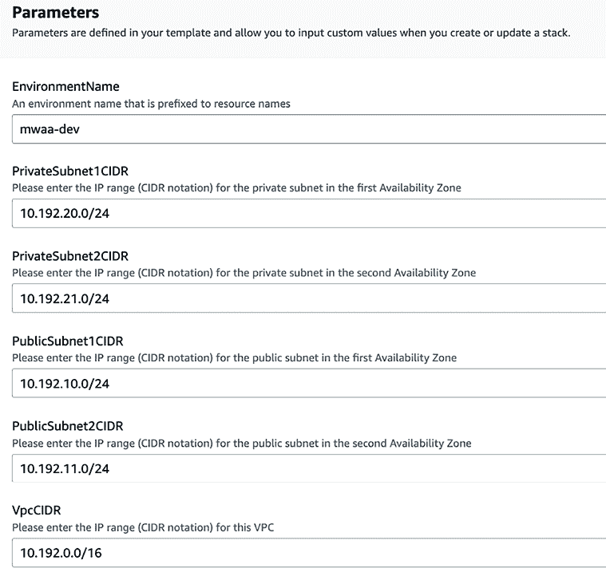

# 5

# 部署模式和工具

在本章中，我们将深入探讨围绕部署您的**机器学习**（**ML**）解决方案的一些重要概念。我们将开始闭合机器学习开发生命周期的闭环，并为将您的解决方案推向世界打下基础。

将软件部署的过程，即从您可以向少数利益相关者展示的演示版本到最终影响客户或同事的服务，是一项非常令人兴奋但往往具有挑战性的练习。这也一直是任何机器学习项目中最困难的部分之一，而且做对它最终可能是在创造价值或仅仅炒作之间产生差异的关键。

我们将探讨一些主要概念，这些概念将帮助您的机器学习（ML）工程团队能够跨越从有趣的证明概念到可以在可扩展基础设施上以自动化方式运行的解决方案之间的鸿沟。这要求我们首先讨论如何设计和架构您的机器学习（ML）系统，尤其是如果您想开发可以无缝扩展和扩展的解决方案。然后我们将讨论容器化的概念以及它如何允许您的应用程序代码从它正在构建或运行的特定基础设施中抽象出来，从而在许多不同情况下实现可移植性。然后我们将继续到一个具体的例子，使用这些想法在 AWS 上部署机器学习（ML）微服务。本章的其余部分将回到如何构建有效且健壮的管道以用于您的端到端机器学习（ML）解决方案的问题，这在*第四章*，*打包*中已介绍。我们将介绍并探索**Apache Airflow**，用于构建和编排任何通用的 Python 过程，包括您的数据准备和机器学习（ML）管道。然后我们将以类似的方式深入研究**ZenML**和**Kubeflow**，这两个开源的高级机器学习（ML）管道工具现在在工业界得到了广泛的应用。这些工具的集合意味着您应该在本章结束时非常有信心，可以使用各种软件部署和编排相当复杂的机器学习（ML）解决方案。

这一切都将分为以下几部分：

+   系统架构

+   探索一些标准的机器学习（ML）模式

+   容器化

+   在**亚马逊网络服务**（**AWS**）上托管您的微服务

+   使用 Airflow 构建通用管道

+   构建高级机器学习（ML）管道

下一节将开始讨论如何考虑部署来架构和设计我们的机器学习（ML）系统。让我们开始吧！

# 技术要求

与其他章节一样，您可以通过使用提供的 Conda 环境`yml`文件或从书库中的*Chapter05*目录下的`requirements.txt`文件来设置您的 Python 开发环境，以便能够运行本章中的示例。

```py
conda env create –f mlewp-chapter05.yml 
```

您还需要安装一些非 Python 工具才能从头到尾跟随示例。请参阅每个工具的相关文档：

+   AWS CLI v2

+   Postman

+   Docker

# 系统架构

无论你如何努力构建你的软件，始终有一个设计在心中是非常重要的。本节将强调我们在设计机器学习系统时必须牢记的关键考虑因素。

考虑这样一个场景，你被雇佣来组织建造房屋。我们不会简单地出去雇佣一支建筑队，购买所有材料，雇佣所有设备，然后告诉每个人开始建造。我们也不会在没有先与他们交谈的情况下就假设我们确切地知道雇佣我们的客户想要什么。

相反，我们可能会试图详细了解客户的需求，然后尝试设计符合他们要求的解决方案。我们可能会与他们以及了解整体设计细节的适当专家一起迭代这个计划几次。尽管我们可能不感兴趣建造房屋（或者也许你感兴趣，但本书中不会有任何房屋的例子！），但我们仍然可以将其与软件进行类比。在建造任何东西之前，我们应该创建一个有效且清晰的设计。这个设计为解决方案提供了方向，并帮助构建团队确切地知道他们将工作的组件。这意味着我们将有信心，我们所建造的东西将解决最终用户的问题。

简而言之，这就是软件架构的全部内容。

如果我们对我们的机器学习解决方案做了上述类似的事情，以下一些事情可能会发生。我们可能会得到一个非常混乱的代码库，我们团队中的某些机器学习工程师可能会构建已经被其他工程师的工作所覆盖的元素和功能。我们也可能会构建在项目后期基本无法工作的东西；例如，如果我们选择了一个具有特定环境要求，而我们无法满足这些要求的工具。我们也可能难以预测需要提前配置的基础设施，导致项目内部混乱地争夺正确的资源。我们也可能低估所需的工作量，错过截止日期。所有这些都是我们希望避免的结果，如果我们遵循良好的设计，这些结果是可以避免的。

为了有效，软件的架构应该至少为构建解决方案的团队提供以下东西：

+   它应该定义解决整个问题的所需功能组件。

+   它应该定义这些功能组件如何交互，通常是通过交换某种形式的数据。

+   它应该展示解决方案如何在未来扩展，以包括客户可能需要的进一步功能。

+   它应该提供关于应选择哪些工具来实现架构中概述的每个组件的指导。

+   它应该规定解决方案的过程流程以及数据流程。

这就是一件好的架构应该做的事情，但实际上这意味着什么呢？

对于如何构建架构并没有严格的定义。关键点在于它作为一个设计，建筑可以在此基础上进行。例如，这可能是一个带有框、线和一些文本的漂亮图表，或者可能是一份多页文档。它可能使用形式化的建模语言，如**统一建模语言**（**UML**），也可能不使用。这通常取决于你所在的企业环境以及对你编写架构的人提出的要求。关键是它检查了上述要点，并为工程师提供了关于要构建什么以及如何将这些部分组合在一起的明确指导。

架构本身是一个广泛而迷人的主题，所以我们不会在这里深入探讨其细节，但我们将现在关注在 ML 工程背景下的架构含义。

## 建筑原则

架构领域非常广泛，但无论你往哪里看，就像任何成熟的学科一样，总有始终如一的原则被提出。好消息是，其中一些原则实际上与我们讨论第四章“打包”时遇到的原则相同。在本节中，我们将讨论这些原则以及它们如何用于架构 ML 系统。

**关注点分离**已经在本书中提到，是确保应用程序内部软件组件不必要复杂以及解决方案可扩展且易于接口的一种好方法。这个原则对整个系统都适用，因此是一个值得记住的良好架构原则。在实践中，这通常表现为应用程序内部有不同职责的“层”的概念。例如，让我们看看图 5.1 所示的架构。这展示了如何使用工具创建自动化部署和编排过程，它来自 AWS 解决方案库，[`aws.amazon.com/solutions/implementations/mlops-workload-orchestrator/`](https://aws.amazon.com/solutions/implementations/mlops-workload-orchestrator/)。我们可以看到，架构中有对应于资源分配、管道部署和管道服务的“区域”。这些块表明解决方案中有具有特定功能的独立部分，而这些不同部分之间的交互由接口处理。


图 5.1：AWS 解决方案库中的 ML 工作负载编排器架构。

**最小惊讶原则**是一个经验法则，它本质上捕捉了这样一个事实：当你领域中的任何合理有知识的人，比如开发者、测试员或数据科学家，第一次遇到你的架构时，其中不应该有任何不寻常或令人惊讶的东西。这可能并不总是可能的，但这是一个值得记住的好原则，因为它迫使你考虑那些可能与你架构一起工作的人已经知道什么，以及你如何利用这一点来做出良好的设计并使其得到遵循。再次以*图 5.1*为例，架构很好地体现了这一原则，因为设计有清晰的逻辑构建块，用于提供、提升和运行机器学习管道。在架构的较低层面，我们可以看到数据始终来自 S3 存储桶，Lambda 与 API 网关进行交互，等等。这意味着机器学习工程师、数据科学家和云平台工程师在实施时都会很好地理解和利用这个架构。

**最小努力原则**比前一个原则更微妙，因为它捕捉了这样一个想法：开发者作为人类，会遵循阻力最小的路径，除非必要，否则不会创造更多的工作。我解读这个原则为强调花时间深思熟虑地考虑你的架构并小心构建它的重要性，因为它在开发后可能会被工程师长时间使用！

到目前为止，我们只讨论了高级架构原则。现在我们将探讨一些设计原则，虽然它们在系统设计层面仍然可以使用，但在你的代码层面使用时也非常强大。

**SOLID 原则**（**单一职责**、**开放/封闭**、**里氏替换**、**接口隔离**、**依赖倒置**）是一组通常应用于代码库的原则，但也可以很好地扩展到系统设计和架构。一旦我们将这些原则应用到架构层面，它们可以这样解释：

+   **单一职责**：这与关注点分离的概念非常相似，也许可以说是相同的。具体来说，这表明如果一个模块在任何时候只有一个改变的理由，或者只有一个任务要做，那么这会使它更加健壮且更容易维护。如果你在架构图中有一个盒子需要做十件事，那么你就违反了这个原则，这意味着每当这些流程或接口中的任何一个需要改变时，你都必须进入那个盒子四处摸索，可能会产生更多问题或极大地增加停机时间。

+   **开放/封闭原则**：这指的是以组件“对扩展开放但对修改封闭”的方式进行架构设计是一个非常不错的想法。这在整个设计层面也是适用的。如果你设计你的系统，使得新的功能可以添加而不需要回过头去重新布线核心部分，那么你很可能会构建出能够经受时间考验的东西。在机器学习领域的一个很好的例子是，如果我们尝试构建我们的系统，以便我们想要添加新的处理管道时，我们可以直接这样做，而不必回到代码的某个晦涩部分进行严重修改。

+   **里氏替换原则**：当 SOLID 原则被编写时，它们最初是指 Java 等语言中的面向对象编程。这个原则当时指出，对象应该能够被它们的子类型替换，同时仍然保持应用程序的行为。在系统层面，这现在基本上表示，如果两个组件应该具有相同的接口并与其他组件进行交互，你可以互相替换它们。

+   **接口隔离原则**：我理解这个原则为“不要让组件之间有多个交流方式。”所以，在你的应用程序中，尽量确保不同解决方案部分之间的交接方式非常狭窄。另一种表述方式是，尽可能使你的接口针对客户端是好的想法。

+   **依赖倒置原则**：这与里氏替换原则非常相似，但更为通用。这里的想法是，模块或你解决方案的部分之间的通信应该由抽象来处理，而不是由具体的、特定的实现来处理。一个很好的例子是，与其直接从另一个进程调用机器学习微服务，你不如将必要的作业数据放入队列中，例如 AWS 简单队列服务，然后微服务从队列中提取工作。这确保了客户端和提供服务的微服务不需要了解彼此的接口细节，同时也确保下游应用程序可以通过读取队列来扩展更多的服务。这也就体现了开放/封闭原则，并且可以在*图 5.1*的架构中通过 Lambda 函数调用 AWS CloudFormation 来看到这一点。

我个人的一个最喜欢的概念是**边界上下文**，我们必须努力确保数据模型或其他重要的数据或元数据与特定的概念模型保持一致，而不是“自由放任”。这一点特别适用于领域驱动设计，并且非常适合大型、复杂的解决方案。一个很好的例子是，如果你有一个大型组织，拥有多个业务单元，并且他们希望运行在存储在数据库中的业务数据上的非常相似的服务。最好是有几个数据库来托管信息，每个业务单元一个，而不是在多个应用程序之间共享数据层。更具体地说，你的数据模型不应该包含特定于销售和营销职能、工程职能和人力资源职能等信息。相反，每个职能都应该有自己的数据库和自己的模型，如果需要，应该有明确的合同来连接它们之间的任何信息。我相信这个想法仍然可以应用于后面章节中讨论的数据湖。在这种情况下，边界上下文可以应用于湖中的特定文件夹，或者它们实际上可以指整个湖的上下文，每个都被隔离在不同的领域。这正是所谓的数据网格背后的理念。

我们刚刚提到了一些最常用的机器学习模式，现在让我们更详细地探讨这个概念，因为我们正在寻找应用我们一直在讨论的原则。

# 探索一些标准的机器学习模式

在这本书中，我们已经多次提到，我们不应该试图*重新发明轮子*，而应该重用、重复和回收更广泛的软件和机器学习社区中行之有效的方法。这同样适用于你的部署架构。

当我们讨论可以用于具有相似特性的各种不同用例的架构时，我们通常将这些称为*模式*。使用标准（或者至少是众所周知的）模式确实可以帮助你加快项目的价值实现时间，并帮助你以稳健和可扩展的方式构建机器学习解决方案。

基于此，在接下来的几节中，我们将总结一些在过去几年中在机器学习领域越来越成功的最重要的架构模式。

## 在数据湖中游泳

对于任何试图使用机器学习（ML）的人来说，最重要的资产当然是我们可以分析和训练模型的数据。大数据时代意味着数据的规模和格式多样性成为了一个日益增长的挑战。如果你是一个大型组织（或者甚至不是那么大），将所有你希望用于 ML 应用的数据存储在结构化关系数据库中是不可行的。仅仅是为了存储这种格式中的数据而建模的复杂性就非常高。那么，你能做什么呢？

好吧，这个问题最初是通过引入**数据仓库**来解决的，它允许你将所有关系型数据存储整合到一个解决方案中，并创建一个单一的访问点。这在一定程度上有助于缓解数据量的问题，因为即使总量很大，每个数据库也能存储相对较小的数据量。这些仓库在设计时考虑了多个数据源的集成。然而，它们仍然相对受限，因为它们通常将计算和存储的基础设施捆绑在一起。这意味着它们很难进行扩展，并且可能成为昂贵的投资，导致供应商锁定。最重要的是，对于机器学习来说，数据仓库无法存储原始的、半结构化或非结构化数据（例如，图像）。如果使用仓库作为主要数据存储，这会自动排除许多好的机器学习用例。现在，有了像**Apache Spark**这样的工具，我们在整本书中已经广泛使用，如果我们有可用的集群，我们实际上可以分析和建模任何大小或结构的数据。那么问题就变成了，我们应该如何存储它？

**数据湖**是允许你在任何可操作的规模下存储任何类型数据的技术。有各种各样的数据湖解决方案提供商，包括主要的公共云提供商，如**Microsoft Azure**、**Google Cloud Platform**（**GCP**）和 AWS。由于我们之前已经接触过 AWS，让我们专注于它。

AWS 中的主要存储解决方案被称为**简单存储服务**，或**S3**。像所有核心数据湖技术一样，你可以有效地将其中的任何内容加载进去，因为它基于**对象存储**的概念。这意味着你加载的每个数据实例都被视为一个具有唯一标识符和相关元数据的独立对象。

它允许你的 S3 存储桶同时包含照片、JSON 文件、`.txt`文件、Parquet 文件以及其他多种数据格式。

如果你在一个没有数据湖的组织工作，这并不意味着你无法进行机器学习，但确实可能会使这个过程变得更加困难，因为有了数据湖，你总是知道如何存储你为解决问题所需的数据，无论其格式如何。

## 微服务

你的机器学习项目的代码库最初会很小——最初只有几行。但随着你的团队在构建所需解决方案上投入越来越多的努力，这会迅速增长。如果你的解决方案需要具备几种不同的能力并执行一些相当不同的操作，而你又把所有这些都放在同一个代码库中，你的解决方案可能会变得极其复杂。实际上，这种所有组件都紧密耦合且不可分离的软件被称为**单体**，因为它类似于可以独立于其他应用程序存在的单个大块。这种方法可能适合你的用例，但随着解决方案复杂性的持续增加，通常需要一个更具弹性和可扩展的设计模式。

微服务架构是指你的解决方案的功能组件被干净地分离，可能完全在不同的代码库中或运行在不同的基础设施上。例如，如果我们正在构建一个面向用户的 Web 应用程序，允许用户浏览、选择和购买产品，我们可能希望快速连续部署各种机器学习能力。我们可能希望根据他们刚刚查看的内容推荐新产品，我们可能希望检索他们最近订购的项目何时到达的预测，我们可能还希望突出一些我们认为他们将从中获得好处的折扣（基于我们对他们历史账户行为的分析）。这对于一个单体应用程序来说可能是一个非常高的要求，甚至可能是不可能的。然而，这恰好是像*图 5.2*中那样的微服务架构所自然适应的：


图 5.2：一些机器学习微服务的示例。

微服务架构的实现可以使用一些工具来完成，其中一些我们将在*在 AWS 上托管自己的微服务*部分中介绍。主要思想是始终将你的解决方案的元素分离成它们自己的服务，这些服务不是紧密耦合在一起的。

微服务架构特别擅长让我们的开发团队能够实现以下目标：

+   独立调试、修补或部署单个服务，而不是整个系统。

+   避免单点故障。

+   提高可维护性。

+   允许不同的服务由不同的团队拥有，并有更清晰的责任。

+   加速复杂产品的开发。

就像每个架构模式或设计风格一样，它当然不是万能的银弹，但当我们设计下一个解决方案时，记住微服务架构会大有裨益。

接下来，我们将讨论基于事件的设计。

## 基于事件的设计

您并不总是想以预定批次的方式运行。正如我们之前所看到的，即使是上一个部分，*微服务*，并不是所有用例都与在预定时间表上从模型运行大型批次预测、存储结果然后稍后检索它们相匹配。如果所需的训练运行数据量不存在怎么办？如果没有新的数据用于运行预测怎么办？如果其他系统可以在数据点最早可用时而不是每天特定时间基于单个数据点进行预测，它们能利用预测怎么办？

在事件驱动的架构中，单个操作产生结果，然后触发系统中其他单个操作，如此类推。这意味着过程可以在尽可能早的时候发生，而不是更早。这也允许有更动态或随机的数据流，如果其他系统不是在预定批次上运行，这可能是有益的。

事件驱动模式可以与其他模式混合，例如微服务或批量处理。这些好处仍然存在，实际上，事件驱动组件允许更复杂的解决方案编排和管理。

有两种基于事件的模式：

+   **发布/订阅**：在这种情况下，事件数据被发布到消息代理或事件总线，以便由其他应用程序消费。在发布/订阅模式的一个变体中，使用的代理或总线根据某些适当的分类组织，并指定为**主题**。执行此操作的示例工具是**Apache Kafka**。

+   **事件流**：流用例是我们希望在非常接近实时的情况下处理连续数据流的情况。我们可以将其视为在数据*通过*系统时处理数据。这意味着数据不是在数据库中静态持久化，而是在创建或接收时由流解决方案处理。用于事件流应用的示例工具是**Apache Storm**。

*图 5.3* 展示了一个应用于**物联网**和移动设备的事件驱动架构示例，这些设备的数据被传递到分类和异常检测算法中：


图 5.3：一个基本的事件驱动高级设计，其中数据流通过代理被不同的服务访问。

下一个部分将涉及设计，其中我们做的是一次处理一个数据点，而不是同时处理大量数据或批次。

## 批量处理

工作批次可能听起来不是最复杂的概念，但在机器学习的世界中，它是最常见的模式之一。

如果您用于预测的数据以固定的时间间隔以批次形式到来，那么安排您的预测运行以类似的节奏可能是高效的。如果不需要创建低延迟解决方案，这种模式也可能很有用。

由于几个原因，这个概念也可以运行得相当高效：

+   在预定批次中运行意味着我们知道何时需要计算资源，因此我们可以相应地计划。例如，我们可能能够关闭我们的集群大部分时间，或者将它们用于其他活动。

+   批次允许在运行时使用更多的数据点，因此如果你希望的话，可以在批次级别运行异常检测或聚类等操作。

+   您的数据批次的大小通常可以选择以优化某些标准。例如，使用大型批次并在其上运行并行化的逻辑和算法可能更有效。

在批次中运行 ML 算法的软件解决方案通常看起来与经典的**提取**、**转换**、**加载**（**ETL**）系统非常相似。这些系统是从源或多个源提取数据，然后在路由到目标系统之前进行处理，然后上传。在 ML 解决方案的情况下，处理不是标准的数据转换，如连接和筛选，而是应用特征工程和 ML 算法管道。这就是为什么在这本书中，我们将这些设计称为**提取、转换、机器学习**（**ETML**）模式。ETML 将在第九章*构建提取、转换、机器学习用例*中进一步讨论。

我们现在将讨论一项关键技术，这对于使现代架构适用于广泛的平台至关重要——容器。

# 容器化

如果你开发软件并将其部署到某个地方，这是 ML 工程师的核心目标，那么你必须非常了解你的代码的环境要求，以及不同的环境可能会如何影响你的解决方案的运行能力。这对于 Python 尤其重要，Python 没有将程序作为独立可执行文件导出的核心功能（尽管有选项可以这样做）。这意味着 Python 代码需要 Python 解释器来运行，并且需要存在于一个通用的 Python 环境中，其中已安装相关的库和支持包。

避免从这个角度来看头痛的一个好方法是问自己：*为什么我不能把所有需要的东西都放入一个相对隔离主机环境的东西中，然后我可以将其发送并作为一个独立的应用程序或程序运行？* 这个问题的答案是你可以，而且你通过**容器化**来实现这一点。这是一个过程，其中应用程序及其依赖项可以打包在一个独立的单元中，该单元可以在任何计算平台上有效地运行。

最受欢迎的容器技术是**Docker**，它是开源的，非常易于使用。让我们通过使用它来容器化一个简单的**Flask**网络应用程序来了解它，这个应用程序可以作为类似在*示例 2*：*第一章，机器学习工程简介*中的*预测 API*部分的预测模型的接口。 

接下来的几节将使用一个类似的简单 Flask 应用程序，它有一个提供预测的端点。作为一个完整 ML 模型的代理，我们首先将与一个简单的骨架应用程序一起工作，该应用程序在请求预测时简单地返回一个随机数字的短列表。应用程序的详细代码可以在本书的 GitHub 仓库中找到，地址为[`github.com/PacktPublishing/Machine-Learning-Engineering-with-Python-Second-Edition/tree/main/Chapter05/microservices/mlewp2-web-service`](https://github.com/PacktPublishing/Machine-Learning-Engineering-with-Python-Second-Edition/tree/main/Chapter05/microservices/mlewp2-web-service)。

网络应用程序创建了一个基本的应用程序，你可以提供存储 ID 并预测系统的开始日期，然后它会返回虚拟预测。要获取这个，你需要点击`/forecast`端点。

一个例子在*图 5.4*中展示：


图 5.4：查询我们的骨骼 ML 微服务的结果。

现在，我们将继续讨论如何容器化这个应用程序。首先，你需要通过使用[`docs.docker.com/engine/install/`](https://docs.docker.com/engine/install/)上的文档在你的平台上安装 Docker：

1.  一旦你安装了 Docker，你需要告诉它如何构建容器镜像，这通过在你的项目中创建一个`Dockerfile`来完成。`Dockerfile`以文本形式指定所有构建步骤，以便构建镜像的过程自动化且易于配置。现在，我们将通过构建一个简单的示例`Dockerfile`来演示，这个示例将在下一节中继续，即*在 AWS 上托管自己的微服务*。首先，我们需要指定我们工作的基本镜像。通常使用官方 Docker 镜像作为基础是有意义的，所以我们在这里将使用`python:3.10-slim`环境来保持事情简洁。这个基本镜像将在所有跟随`FROM`关键字的命令中使用，这表示我们正在进入构建阶段。我们实际上可以用`FROM … as`语法命名这个阶段，以便以后使用，将其命名为`builder`：

    ```py
    FROM python:3.10-slim as builder 
    ```

1.  然后，我们将从当前目录复制所有需要的文件到构建阶段的`src`目录，并使用我们的`requirements.txt`文件安装所有需求（如果你想在未指定任何需求的情况下运行此步骤，你可以只使用一个空的`requirements.txt`文件）：

    ```py
    COPY . /src
    RUN pip install --user --no-cache-dir -r requirements.txt 
    ```

1.  下一个阶段涉及类似的步骤，但被别名为单词`app`，因为我们现在正在创建我们的应用程序。注意这里对步骤*1*和*2*中的`builder`阶段的引用：

    ```py
    FROM python:3.10-slim as app
    COPY --from=builder /root/.local /root/.local
    COPY --from=builder /src . 
    ```

1.  我们可以像在 bash 环境中一样定义或添加环境变量：

    ```py
    ENV PATH=/root/.local:$PATH 
    ```

1.  由于在这个例子中我们将运行一个简单的 Flask Web 应用程序，我们需要告诉系统要公开哪个端口：

    ```py
    EXPOSE 5000 
    ```

1.  我们可以在 Docker 构建过程中使用 `CMD` 关键字来执行命令。在这里，我们使用它来运行 `app.py`，这是 Flask 应用程序的主入口点，并且将启动我们稍后通过 REST API 调用来获取 ML 结果的服务：

    ```py
    CMD ["python3", "app.py"] 
    ```

1.  然后，我们可以使用 `docker build` 命令来构建镜像。在这里，我们创建一个名为 `basic-ml-microservice` 的镜像，并使用 `latest` 标签对其进行标记：

    ```py
    docker build -t basic-ml-microservice:latest 
    ```

1.  要检查构建是否成功，请在终端中运行以下命令：

    ```py
    docker images --format "table {{.ID}}\t{{.CreatedAt}}\t{{.Repository}}" 
    ```

    您应该会在 *图 5.5* 中看到类似的输出：

    

    图 5.5：`docker images` 命令的输出。

1.  最后，您可以在终端中使用以下命令运行您的 Docker 镜像：

    ```py
    docker run --rm -it -p 8080:5000 basic-ml-microservice:latest 
    ```

现在您已经容器化了一些基本的应用程序并且可以运行您的 Docker 镜像，我们需要回答如何使用它来构建一个托管在适当平台上的 ML 解决方案的问题。下一节将介绍我们如何在 AWS 上做到这一点。

# 在 AWS 上托管自己的微服务

一个将您的 ML 模型公开的经典方式是通过在服务器上托管一个轻量级的 Web 服务。这可以是一个非常灵活的部署模式。

您可以在任何可以访问互联网（大致上）的服务器上运行 Web 服务，并且如果设计得当，通常很容易向您的 Web 服务添加更多功能，并通过新的端点公开。

在 Python 中，最常用的两个 Web 框架一直是 **Django** 和 **Flask**。在本节中，我们将重点关注 Flask，因为它比 Django 更简单，并且已经广泛地讨论了其在 Web 上的 ML 部署，因此您将能够找到大量材料来构建您在这里学到的内容。

在 AWS 上，您可以托管 Flask Web 解决方案的最简单方法之一是将它作为一个容器化应用程序在适当平台上运行。我们将在本节中介绍如何做到这一点的基础知识，但我们将不会花费时间在维护良好 Web 安全性的详细方面。这可能需要一本完整的书来充分讨论，并且在其他地方有很好的、更专注的资源。

我们将假设您已经从 *第二章*，*机器学习开发过程* 中设置了您的 AWS 账户。如果没有，请返回并复习您需要做什么。

我们将需要 AWS **命令行界面**（**CLI**）。您可以在 AWS CLI 文档页面 [`docs.aws.amazon.com/cli/index.xhtml`](https://docs.aws.amazon.com/cli/index.xhtml) 上找到安装和配置 AWS CLI 的适当命令，以及大量其他有用的信息。

具体来说，请按照本教程中的步骤配置您的 Amazon CLI：[`docs.aws.amazon.com/cli/latest/userguide/cli-configure-quickstart.xhtml`](https://docs.aws.amazon.com/cli/latest/userguide/cli-configure-quickstart.xhtml)。

文档指定了如何为各种不同的计算机架构安装 CLI，所以按照你的平台进行操作，然后你就可以准备好享受本书中使用的 AWS 示例了！

在以下示例中，我们将使用 Amazon **弹性容器注册库**（**ECR**）和**弹性容器服务**（**ECS**）来托管一个基本的容器化 Web 应用程序。在*第八章*，*构建示例 ML 微服务*中，我们将更详细地讨论如何构建和扩展 ML 微服务，并使用基于 Kubernetes 的低级别实现。这两种方法相辅相成，将帮助你扩展 ML 工程工具箱。

在 ECS 上部署我们的服务需要几个不同的组件，我们将在接下来的几节中介绍：

+   我们在 ECR 仓库内部托管的容器

+   在 ECS 上创建的集群和服务

+   通过**弹性计算云**（**EC2**）服务创建的应用程序负载均衡器

首先，让我们解决将容器推送到 ECR 的问题。

## 推送到 ECR

让我们看看以下步骤：

1.  我们在*容器化*部分的项目目录中定义了以下 Dockerfile：

    ```py
    FROM python:3.10-slim as builder
    COPY . /src
    RUN pip install --user --no-cache-dir -r requirements.txt
    FROM python:3.10-slim as app
    COPY --from=builder /root/.local /root/.local
    COPY --from=builder /src .
    ENV PATH=/root/.local:$PATH
    EXPOSE 5000
    CMD ["python3", "app.py"] 
    ```

1.  然后，我们可以使用 AWS `CLI`创建一个 ECR 仓库来托管我们的容器。我们将把这个仓库命名为`basic-ml-microservice`，并将区域设置为`eu-west-1`，但这个应该根据你的账户最合适的区域来更改。下面的命令将返回一些关于你的 ECR 仓库的元数据；保留这些信息以供后续步骤使用：

    ```py
    aws ecr create-repository 
        --repository-name basic-ml-microservice
        --image-scanning-configuration scanOnPush=true 
        --region eu-west-1 
    ```

1.  然后，我们可以在终端中使用以下命令登录到容器注册库。注意，仓库 URI 将在运行步骤*2*后提供的元数据中。你也可以通过运行`aws ecr describe-repositories --region eu-west-1`来检索这个信息：

    ```py
    aws ecr get-login-password --region eu-west-1 | docker login --username AWS --password-stdin <ECR_REPOSITORY_URI> 
    ```

1.  然后，如果我们导航到包含`Dockerfile`（`app`）的目录，我们可以运行以下命令来构建容器：

    ```py
    docker build --tag basic-ml-microservice:local 
    ```

1.  下一步为镜像打标签：

    ```py
    docker tag basic-ml-microservice:local <ECR_REPOSITORY_URI> 
    ```

1.  然后，我们可以使用以下命令将我们刚刚构建的 Docker 镜像部署到容器注册库：

    ```py
    docker push <YOUR_AWS_ID>.dkr.ecr.eu-west-1.amazonaws.com/basic-ml-microservice:latest 
    ```

如果成功，这个最后的命令将把本地构建的 Docker 镜像推送到你的远程托管 ECR 仓库。你可以通过导航到 AWS 管理控制台，进入 ECR 服务，并选择 basic-ml-microservice 仓库来确认这一点。你应该会看到类似于*图 5.6*中所示的内容。


图 5.6：本地构建的 Docker 镜像成功推送到 ECR 仓库。

我们刚刚走过的步骤在一般情况下是非常强大的，因为你现在能够构建跨平台的 Docker 镜像，并在你的 AWS 账户下的中央仓库中共享它们。你也可以通过 DockerHub 共享 Docker 容器和镜像，[`hub.docker.com/`](https://hub.docker.com/)，但如果你想在你的组织内部做这件事，这会给你更多的控制权。

现在我们已经构建了托管 Flask 应用的容器，接下来我们将考虑将其部署到可伸缩的基础设施上。为了做到这一点，在下一节中，我们将在 ECS 上设置我们的集群。

## 在 ECS 中托管

现在，让我们开始设置！截至 2023 年中旬，AWS 最近推出了一款全新的 ECS 控制台，它允许比之前更平滑的设置。因此，如果您阅读的是这本书的第一版，您会发现这是一个更加流畅的体验：

1.  首先，导航到 AWS 管理控制台中的**ECS**，然后点击**创建集群**。您将看到一个表单，要求您提供有关网络、基础设施、监控以及我们即将创建的资源上的任何标签的详细信息。这应该看起来像*图 5.7*。

    图 5.7：在弹性容器服务中创建集群。

1.  首先，我们可以将集群命名为 `mlewp2-ecs-cluster`，或者您想要的任何名称！然后当您展开**网络**部分时，您应该会看到许多**VPC**和子网细节都是基于您的 AWS 账户设置自动填充的默认值。如果您需要设置这些，表单会指向相关的文档。请参见*图 5.8*以获取示例。

    图 5.8：我们集群在 AWS ECS 中的网络配置。

1.  **基础设施**部分包含三个选项，其中使用**AWS Fargate**是预选的默认选项。我们不需要了解 Fargate 的工作细节，但可以说这为跨多台服务器管理容器工作负载提供了一个非常高级的抽象层。Fargate 的引入意味着您不需要担心为运行容器工作负载的虚拟机集群的配置和运行细节。根据 AWS 文档，Fargate 服务非常适合动态工作突增或具有低运营开销的大规模工作负载。如果您知道您将要运行需要价格优化的大型作业，那么您可以查看提供的其他基础设施选项，例如**EC2 实例**。在这个示例中我们不需要这些。*图 5.9*显示了**基础设施**部分以供参考。

    图 5.9：在 ECS 服务中配置基础设施选项。

1.  **监控**和**标签**部分相对容易理解，允许您开启**容器洞察**并为即将创建的 ECS 资源提供自己的字符串标签。现在我们先保持这些默认设置，然后点击页面底部的**创建**按钮。然后您应该会看到集群在几分钟内成功创建，如图 5.10 所示。

    图 5.10：ECS 集群成功创建。

之前的步骤都是关于设置 ECS 集群，这是我们的容器化应用程序可以运行的基础设施。要实际告诉 ECS 如何运行解决方案，我们需要定义**任务**，这些任务简单来说就是希望在集群上执行的过程。在 ECS 中有一个相关的概念叫做**服务**，它指的是管理你的任务的过程，例如，确保集群上始终运行一定数量的任务。如果你对解决方案有特定的正常运行时间要求，例如，如果它需要全天候可用，那么这很有用。我们可以通过首先在 AWS 管理控制台中导航到集群审查页面，然后在左侧选择**任务定义**来在集群中创建任务定义。然后我们将点击**创建新任务定义**。按照以下步骤创建此任务定义。

1.  我们必须命名任务定义家族，这仅仅是任务定义的版本集合。为了简单起见，让我们将其命名为 `basic-ml-microservice-tasks`。然后我们需要提供一些容器细节，例如我们想要使用的镜像的 URI。这是我们之前推送到 ECR 仓库的镜像的 URI，格式类似于 `<YOUR_AWS_ID>.dkr.ecr.eu-west-1.amazonaws.com/basic-ml-microservice:latest`。你可以给容器起一个新的名字。在这里，我将其命名为**mlmicro**。最后，你需要提供适当的端口映射，以便容器及其包含的应用程序能够被外部流量访问。我已经映射了`端口 5000`，你可能记得这是我们在原始 Dockerfile 中使用 TCP 协议暴露的端口。所有这些都在*图 5.11*中显示。你现在可以保留此第一部分的其余可选设置为默认值，然后点击**下一步**进入下一页设置。

    图 5.11：定义用于 ECS 任务定义的容器镜像。

1.  控制台中的下一页会要求你提供关于你将在其上运行解决方案的环境和基础设施的信息。根据我们为 ECS 集群使用的设置，我们将使用 Fargate 作为基础设施选项，在**Linux x86_64**环境中运行。在这种情况下，我们运行的任务非常小（我们只是为了演示目的返回一些数字），因此我们可以保留默认的**1 vCPU**和**3 GB**内存选项。如果你需要，也可以添加容器级别的内存和 CPU 要求，但现在我们可以留空。这特别有用，如果你有一个计算密集型的服务，或者它包含一个预先加载了一些大型模型或配置数据的应用程序。你可以在*图 5.12*中看到这一点。

    图 5.12：配置用于我们的 ML 微服务 AWS ECS 任务定义的应用程序环境。

1.  接下来，需要配置 IAM 角色。我们不会从我们的应用程序中调用其他 AWS 服务，因此在此阶段，我们不需要 IAM 任务角色，但如果您稍后需要此功能，例如，如果您希望调用其他数据或 ML 服务，您可以创建一个。执行任务我们需要一个执行角色，默认情况下为您创建，所以让我们使用它。IAM 配置部分在*图 5.13*中显示。

    图 5.13：为 AWS ECS 任务定义定义的 IAM 角色。

1.  本节剩余部分包含存储、监控和标记的可选部分。存储子部分指的是用于解压缩和托管您的 Docker 容器的临时存储。再次提醒，对于更大的容器，您可能需要考虑将此大小从默认的 21 GiB 增加。监控可以使用**Amazon CloudWatch**启用，这在您需要将基础设施监控作为解决方案的一部分时很有用，但在此处我们将不涉及此内容，而是更多地关注核心部署。目前请保持这些部分不变，并在页面底部点击**下一步**。

1.  我们几乎完成了。现在，我们将审查并创建任务定义。如果您在审查后对选择满意，那么创建任务定义，您将被带到类似于*图 5.14*所示的摘要页面。

    图 5.14：成功创建的 ML 微服务任务定义。

现在，设置我们的 ECS 托管解决方案的最后一步是创建一个服务。我们将现在说明如何进行此操作：

1.  首先，导航到之前步骤中创建的任务定义，并选择**部署**按钮。这将提供一个下拉菜单，您可以选择**创建服务**。*图 5.15*显示了此操作的外观，因为它可能很容易错过。

    图 5.15：选择创建服务选项，用于之前步骤中创建的任务定义。

1.  然后，您将被带到另一个页面，我们需要填写我们希望创建的服务详情。对于**现有集群**，选择之前定义的 ECS 集群，在这个例子中被称为**mlewp2-ecs-cluster**。对于**计算配置**，我们将仅使用**启动类型**选项，这意味着我们可以仅允许 Fargate 管理基础设施需求。如果您想将多个基础设施选项混合在一起，则可以使用**容量提供者策略**选项。请注意，这更高级，所以我鼓励您在需要使用此路径时，在 AWS 文档中了解更多关于您选项的信息。为了参考，我的选择在*图 5.16*中显示。

    图 5.16：在我们要运行 ECS 服务的环境中选择的 AWS ECS 选项。此服务将启用我们之前定义的任务定义，因此我们的应用程序可以持续运行。

1.  接下来是部署配置，它指的是服务在副本数量和解决方案故障时采取的操作方面如何运行。我已经简单地定义服务名称为**basic-ml-microservice-service**，并使用了**Replica**服务类型，该类型指定了应在集群中维护多少个任务。现在我们可以将其保留为**1**，因为我们只有一个任务在我们的任务定义中。这如图 5.17 所示。

    图 5.17：配置 AWS ECS 服务名称和类型。

1.  **部署选项**和**部署故障检测**子部分将自动填充一些默认值。滚动部署类型指的是当有最新版本可用时，用最新版本替换容器。故障检测选项确保遇到错误的部署无法继续进行，并且可以回滚到之前的版本。在此阶段，我们不需要启用**CloudWatch 警报**，因为我们尚未配置 CloudWatch，但可以在项目的未来迭代中添加。参见*图 5.18*以供参考.

    图 5.18：即将部署的 AWS ECS 服务的部署和故障检测选项。

1.  如其他示例所示，有一个**网络**部分，应该预先填充适合您账户的 VPC 和子网信息。与之前一样，您可以根据需要将这些信息切换为特定的 VPC 和子网。*图 5.19*显示了参考示例。

    图 5.19：为我们定义的托管 ML 微服务的 AWS ECS 服务的网络部分。

1.  剩余部分是可选的，包含用于负载均衡、自动扩展和标记的配置元素。尽管对于如此简单的应用程序我们可能不需要它，但我们将使用此部分创建一个应用程序负载均衡器，这是可用的选项之一。应用程序负载均衡器路由 HTTP 和 HTTPS 请求，并支持诸如基于路径的路由和动态主机端口映射等有用功能，这允许单个服务中的多个任务在同一个容器上运行。我们可以将负载均衡器命名为`basic-ml-microservice-lb`，并配置此负载均衡器的**监听器**以监听`端口 80`并使用 HTTP 协议，如图 5.20 所示。此监听器检查给定端口的连接请求，并使用指定的协议，以便请求可以被负载均衡器路由到下游系统。

    图 5.20：定义 AWS ECS 服务的负载均衡器名称和监听器详细信息。

1.  最后，我们必须为负载均衡器指定一个目标组，正如其名称所暗示的，这基本上是您服务中任务的目标端点集合。AWS ECS 确保在您服务的整个生命周期中，随着任务定义的更新，此更新也会进行。*图 5.21*显示了目标组的配置，它仅指定了用于健康检查的 HTTP 协议和主页路径。

    图 5.21：应用程序负载均衡器的目标组定义。

1.  在填写这些详细信息后，点击**创建**按钮。然后，您的服务将被部署。如果一切顺利，您应该能够在 AWS ECS 控制台页面的集群详细信息中看到该服务。您可以导航到该服务并找到负载均衡器。这将有一个**域名系统**（**DNS**）地址，这将作为发送请求的目标 URL 的根。*图 5.22*显示了带有 DNS 的此页面的外观。复制或保存此 DNS 值。

    图 5.22：我们服务的已部署负载均衡器，DNS 名称位于右下角。

1.  最后，为了测试服务，我们可以在 Postman 中运行与本地测试相同的请求，但现在更新 URL 以包含负载均衡器 DNS 名称和我们指定的负载均衡器将接收的端口。对我们来说，这是端口 80。这在与应用程序响应的*图 5.23*中显示。

    图 5.23：我们的简单预测服务从托管应用程序 AWS ECS 返回有效结果。

就这样！我们已经成功使用 Flask、Docker、AWS 弹性容器注册库、AWS 弹性容器服务和应用程序负载均衡器构建并部署了一个简化的预测服务。所有这些组件都可以适应部署您未来的 ML 微服务。

本章的前半部分主要介绍了适用于系统和代码级别的架构和设计原则，以及向您展示如何在一种非常常见的 ML 系统部署模式中实现这些原则，即 ML 微服务。现在我们已经完成了这个，我们将继续讨论一些工具和技术，它们允许我们以管道的形式构建、部署和托管复杂的 ML 工作流程，这是我们之前在书中简要介绍过的概念。本章后半部分我们将涵盖的工具和概念对于任何现代 ML 工程师来说都是至关重要的，因为它们正在成为许多已部署 ML 系统的骨架。

下一节将首先通过探讨如何使用 Airflow 创建和编排灵活、通用、生产就绪的管道来开始这次讨论，然后我们将转向一些专门针对高级 ML 管道编排的工具。

# 使用 Airflow 构建通用管道

在 *第四章*，*打包* 中，我们讨论了将我们的 ML 代码作为管道编写的优势。我们讨论了如何使用`sklearn`和 **Spark ML** 等工具实现一些基本的 ML 管道。我们当时关注的管道是非常好的简化代码和将多个过程作为单个对象内可用的方法，以简化应用程序。然而，我们当时讨论的每一件事都非常专注于单个 Python 文件，并且不一定是我们能够在使用该包的限制之外灵活扩展的东西。例如，使用我们讨论的技术，创建每个步骤都使用不同包的管道或者它们是完全不同的程序将会非常困难。它们也不允许我们在数据流或应用程序逻辑中构建太多的复杂性，就像如果其中一个步骤失败，管道就会失败，事情就这样结束了。

我们即将讨论的工具将这些概念提升到下一个层次。它们允许您管理您的 ML 解决方案的工作流程，以便您可以组织、协调和编排具有适当复杂性的元素以完成任务。

## Airflow

**Apache Airflow** 是一个工作流管理工具，最初由 **Airbnb** 在 2010 年代开发，自那时起就是开源的。它为数据科学家、数据工程师和 ML 工程师提供了通过 Python 脚本编程创建复杂管道的能力。Airflow 的任务管理基于定义和执行一个 **有向无环图** (**DAG**)，其中节点是要运行的任务。DAGs 也被用于 **TensorFlow** 和 **Spark**，所以您可能之前已经听说过。

Airflow 包含各种默认操作符，允许您定义可以调用和使用多个组件作为任务的 DAG，而不必关心任务的具体细节。它还提供了调度您的管道的功能。例如，让我们构建一个 Apache Airflow 管道，该管道将获取数据，执行一些特征工程，训练一个模型，然后持久化模型。我们不会涵盖每个命令的详细实现，只是简单地展示您的 ML 过程如何在 Airflow DAG 中组合在一起。在 *第九章*，*构建一个提取、转换、机器学习用例* 中，我们将构建一个详细的端到端示例，讨论这些低级细节。这个第一个示例更关注于理解如何编写、部署和管理您在云中的 DAGs 的高级方法：

1.  首先，在一个名为`classification_pipeline_dag.py`的文件中，我们可以导入相关的 Airflow 包和我们需要的任何实用包：

    ```py
    import datetime
    from datetime import timedelta
    from airflow import DAG
    from airflow.operators.python import PythonOperator
    from airflow.utils.dates import days_ago 
    ```

1.  接下来，Airflow 允许您定义默认参数，这些参数可以被所有以下任务引用，并且可以选择在相同级别进行覆盖：

    ```py
    default_args = {
        'owner': 'Andrew McMahon',
        'depends_on_past': False,
        'start_date': days_ago(31),
        'email': ['example@example.com'],
        'email_on_failure': False,
        'email_on_retry': False,
        'retries': 1,
        'retry_delay': timedelta(minutes=2)
    } 
    ```

1.  我们接下来需要实例化我们的 DAG 并提供相关的元数据，包括我们的调度间隔：

    ```py
    with DAG(
        dag_id="classification_pipeline",
        start_date=datetime.datetime(2021, 10, 1),
        schedule_interval="@daily",
        catchup=False,
    ) as dag: 
    ```

1.  然后，所需的所有操作就是定义您在`DAG`定义中的任务。首先，我们定义一个初始任务来获取我们的数据集。此段代码假设有一个名为`get_data`的 Python 可执行文件，例如一个函数或类方法，我们可以将其传递给任务。这可以从我们想要的任何子模块或包中导入。请注意，*步骤 3*-*5*假设我们处于 DAG 实例化的代码块中，所以我们假设另一个缩进，这里我们没有显示以节省空间：

    ```py
     get_data_task = PythonOperator(
            task_id="get_data",
            python_callable=get_data
        ) 
    ```

1.  然后，我们执行一个任务，该任务使用这些数据并执行我们的模型训练步骤。例如，这个任务可以封装我们在*第三章*，“从模型到模型工厂”中讨论的管道类型之一；例如，Spark ML 管道、**Scikit-Learn**管道或我们查看的任何其他 ML 训练管道。再次强调，我们假设有一个名为`train_model`的 Python 可执行文件，可以在这一步中使用：

    ```py
     train_model_task = PythonOperator(
            task_id="train_model",
            python_callable=train_model
        ) 
    ```

1.  此过程的最后一步是用于将训练好的模型持久化到我们的存储层的一个占位符。这意味着其他服务或管道可以使用此模型进行预测：

    ```py
     persist_model_task = PythonOperator(
            task_id="persist_model",
            python_callable=persist_model
        ) 
    ```

1.  最后，我们使用`>>`运算符定义在 DAG 中定义的任务节点的运行顺序。上述任务可以按任何顺序定义，但以下语法规定了它们的运行顺序：

    ```py
    get_data_task >> train_model_task >> persist_model_task 
    ```

在接下来的几节中，我们将简要介绍如何在 AWS 上使用**Apache Airflow 托管工作流**（**MWAA**）服务设置 Airflow 管道。下一节将展示如何使用**CI/CD**原则持续开发和更新您的 Airflow 解决方案。这将汇集我们在本书前几章中进行的设置和工作。

### AWS 上的 Airflow

AWS 提供了一个名为**Apache Airflow 托管工作流**（**MWAA**）的云托管服务，允许您轻松且稳健地部署和托管您的 Airflow 管道。在这里，我们将简要介绍如何做到这一点。

完成以下步骤：

1.  在 MWAA 登录页面上选择**创建环境**。您可以在 AWS 管理控制台中搜索 MWAA 找到它。

1.  随后，您将看到一个屏幕，要求您提供新 Airflow 环境的详细信息。*图 5.24*显示了网站引导您完成的高级步骤：

    图 5.24：设置 MWAA 环境和相关管理的 Airflow 运行的高级步骤。

    **环境详细信息**，如图*图 5.25*所示，是我们指定环境名称的地方。在这里，我们将其命名为**mlewp2-airflow-dev-env**：

    

    图 5.25：命名您的 MWAA 环境。

1.  为了 MWAA 能够运行，它需要能够访问定义 DAG 以及任何相关需求或插件文件的代码。系统随后会要求我们提供一个 AWS S3 桶，这些代码和配置就存储在这个桶中。在这个例子中，我们创建了一个名为`mlewp2-ch5-airflow-example`的桶，将包含这些代码。*图 5.26* 展示了创建该桶的过程！[](img/B19525_05_26.png)

    图 5.26：成功创建我们的 AWS S3 桶以存储我们的 Airflow 代码和支持配置元素。

    *图 5.27* 展示了如果我们也需要指定桶、文件夹、插件或需求文件时，如何将 MWAA 指向正确的桶、文件夹和插件或需求文件：

    

    图 5.27：在 MWAA 实例的配置中引用我们之前创建的桶。

1.  接下来，我们必须定义 Airflow 托管实例将使用的网络配置，这与本章中其他 AWS 示例类似。如果您对网络不熟悉，可能会有些困惑，因此阅读有关子网、IP 地址和 VPC 的主题可能会有所帮助。在网络上，创建新的 MWAA VPC 是入门的最简单方法，但您的组织将有网络专家可以帮助您根据您的具体情况使用适当的设置。我们将采用这条最简单的路线，点击**创建 MWAA VPC**，这将打开一个新窗口，我们可以根据 AWS 提供的标准堆栈定义快速启动一个新的 VPC 和网络设置。您将被要求输入堆栈名称。我将其命名为`MLEWP-2-MWAA-VPC`。网络信息将被填充为类似于*图 5.28* 中所示的内容：

    图 5.28：创建新 VPC 的示例堆栈模板。

1.  然后，我们将被带到一页，需要我们提供更多关于网络细节的信息。在这个例子中，我们可以选择**公共网络（无需额外设置）**，因为我们不会太关心创建一个组织对齐的安全模型。对于组织内部的部署，请与您的安全团队合作，了解您需要实施哪些额外的安全措施。我们还可以选择**创建新的安全组**。这如图 5.29 所示。

    图 5.29：完成 MWAA 设置的最终网络配置。

1.  接下来，我们必须定义我们想要启动的**环境类**。目前有三个选项。在这里，我们将使用最小的，但你可以选择最适合你需求的选项（始终询问账单支付者的许可！）。*图 5.30*显示我们可以选择**mw1.small**环境类，最小到最大工作器数量为 1-10。MWAA 允许你在实例化后更改环境类，所以从成本角度来看，通常最好从小规模开始，根据需要扩展。你还会被问到你想要为环境设置多少调度器。现在让我们将其保留为默认值，**2**，但你可以增加到 5。

    图 5.30：选择环境类和工作器大小。

1.  现在，如果你需要的话，我们可以确认一些可选的配置参数（或者像这里一样留空），并确认我们愿意让 AWS 创建并使用一个新的执行角色。我们也可以直接使用默认的监控设置。*图 5.31*展示了这样一个例子（而且不用担心，安全组在你阅读这个页面的时候可能已经被删除很久了！）：

    图 5.31：AWS 用于 MWAA 环境的执行角色的创建。

1.  下一页将在你创建 MWAA 环境之前提供一个最终总结。一旦你这样做，你将能够在 MWAA 服务中看到你新创建的环境，就像*图 5.32*所示。这个过程可能需要一些时间，在这个例子中大约需要 30 分钟：

    图 5.32：我们新创建的 MWAA 环境。

现在你已经拥有了这个 MWAA 环境，并且已经将你的 DAG 提交到了它指向的 S3 桶中，你可以打开 Airflow UI 来查看由你的 DAG 定义的预定任务。你现在已经部署了一个基本的运行服务，我们可以在后续工作中在此基础上进行构建。

现在我们将想要在 Airflow UI 中查看 DAGs，以便我们可以编排和监控作业。为此，你可能需要配置你的账户对 MWAA UI 的访问权限，使用 AWS 文档页面上的详细信息。作为一个简要总结，你需要前往 AWS 的 IAM 服务。你需要以 root 用户登录，然后创建一个新的策略标题，**AmazonMWAAWebServerAccess**。给这个策略以下 JSON 体：

```py
{
    "Version": "2012-10-17",
    "Statement": [
        {
            "Effect": "Allow",
            "Action": "airflow:CreateWebLoginToken",
            "Resource": [
                "arn:aws:airflow:{your-region}:YOUR_ACCOUNT_ID:role/{your-                 environment-name}/{airflow-role}"
            ]
        }
    ]
} 
```

对于这个定义，Airflow 角色指的是 Airflow 文档中定义的五个角色之一：**管理员**、**操作员**、**查看者**、**用户**或**公共**，具体请参阅 [`airflow.apache.org/docs/apache-airflow/stable/security/access-control.xhtml`](https://airflow.apache.org/docs/apache-airflow/stable/security/access-control.xhtml)。我在这个例子中使用了管理员角色。如果您将此策略添加到您的账户权限中，您应该能够通过在 MWAA 服务中点击 **打开 Airflow UI** 按钮来访问 Airflow UI。然后，您将被引导到 Airflow UI，如图 *图 5.33* 所示。


图 5.33：通过 AWS MWAA 服务访问的 Airflow UI。此视图显示了我们在示例中早先编写的分类 DAG。

Airflow UI 允许您触发 DAG 运行，管理您已安排的工作，以及监控和调试您的管道。例如，在运行成功后，您可以看到运行的摘要信息，如图 *图 5.34* 所示，并且可以使用不同的视图来了解每个管道步骤所花费的时间，并在出现错误时诊断问题所在。


图 5.34：Airflow UI 中我们简单分类 DAG 的示例运行摘要。

在这个例子中，我们构建和运行的管道显然非常简单，只使用了核心 Python 功能。如果您想利用其他 AWS 服务，例如通过提交 Spark 作业到 EMR 集群，那么您将需要配置额外的访问策略，就像我们上面为 UI 访问所做的那样。这将在 MWAA 文档中介绍。

重要提示

一旦创建了此 MWAA 环境，您就不能暂停它，因为它每小时运行的成本很小（对于上述环境配置，大约为每小时 0.5 美元）。目前 MWAA 不包含暂停和恢复环境的特性，因此当需要时，您必须删除环境并重新实例化一个具有相同配置的新环境。这可以使用 **Terraform** 或 **AWS CloudFormation** 等工具自动化，这里我们不会涉及。所以，提醒一句——**千万不要意外地让您的环境持续运行**。例如，绝对不要像可能或可能没有做过的那样，让它连续运行一周。

### 回顾 Airflow 的 CI/CD

我们在 *第二章*，*机器学习开发过程* 中介绍了 CI/CD 的基础知识，并讨论了如何通过使用 **GitHub Actions** 来实现这一点。现在，我们将更进一步，开始设置部署代码到云的 CI/CD 管道。

首先，我们将从一个重要的例子开始，在这个例子中，我们将把一些代码推送到 AWS S3 桶。这可以通过在您的 GitHub 仓库的 `.github/workflows` 目录下创建一个名为 `aws-s3-deploy.yml` 的 `.yml` 文件来完成。这将是我们将围绕其构建 CI/CD 管道的核心。

在我们的案例中，`.yml` 文件将上传 Airflow DAG，并包含以下内容：

1.  我们使用 `name` 的语法命名该过程，并表达我们希望在主分支的推送或主分支的拉取请求时触发部署过程：

    ```py
    name: Upload DAGS to S3
    on:
      push:
        branches: [ main ]
      pull_request:
        branches: [ main ] 
    ```

1.  我们随后定义了在部署过程中希望发生的作业。在这种情况下，我们希望将我们的 DAG 文件上传到我们已创建的 S3 桶，并希望使用我们在 GitHub 密钥存储中配置的适当 AWS 凭据：

    ```py
    jobs:
      deploy:
        name: Upload DAGS to Amazon S3
        runs-on: ubuntu-latest
        steps:
          - name: Checkout
            uses: actions/checkout@v2
          - name: Configure AWS credentials from account
            uses: aws-actions/configure-aws-credentials@v1
            with:
              aws-access-key-id: ${{ secrets.AWS_ACCESS_KEY_ID }}
              aws-secret-access-key: ${{ secrets.AWS_SECRET_ACCESS_KEY }}
              aws-region: us-east-1 
    ```

    然后，作为工作的一部分，我们运行步骤，将相关文件复制到我们指定的 AWS S3 桶。在这种情况下，我们还指定了如何使用 AWS CLI 进行复制的一些细节。具体来说，我们希望将所有 Python 文件复制到存储库的 `dags` 文件夹：

    ```py
     - name: Copy files to bucket with the AWS CLI
            run: |
              aws s3 cp ./dags s3://github-actions-ci-cd-tests
              --recursive--include "*.py" 
    ```

1.  一旦我们执行了带有更新代码的 `git push` 命令，这将执行操作并将 `dag` Python 代码推送到指定的 S3 桶。在 GitHub UI 中，您将能够看到一个成功的运行示例，类似于 *图 5.35*：

    图 5.35：通过 GitHub Actions 和 AWS CLI 运行的成功的 CI/CD 流程。

此过程允许您成功地将新的更新推送到您的 Airflow 服务到 AWS，以便由您的 MWAA 实例运行。这是真正的 CI/CD，并允许您在不中断服务的情况下持续更新您提供的服务。

# 构建高级机器学习（ML）管道

我们在本章中已经讨论了 **SciKit-learn** 和 **Spark ML** 如何提供创建 ML 管道的机制。您可以将这些视为基本的方法来做到这一点，并开始入门。现在有一系列的工具可供使用，包括开源和商业的，它们将这一概念提升到了新的水平。

为了让大家了解，三大主要公共云提供商在这个领域都有您可能想要了解并尝试的工具。**Amazon SageMaker** 是这个领域的巨头之一，它包含了一个庞大的工具和功能生态系统，可以帮助您将 ML 模型投入生产。这本书本可以完全关于 Amazon SageMaker，但由于那已经在其他地方完成，在 *Learn Amazon SageMaker* [`tinyurl.com/mr48rsxp`](https://tinyurl.com/mr48rsxp) 中，我们将细节留给读者去发现。您需要知道的关键是，这是 AWS 的托管服务，用于构建 ML 管道，以及监控、模型注册和其他一系列功能，让您能够在整个 ML 生命周期中开发和推广您的模型。**Google Vertex AI** 是 Google 云平台的 ML 管道、开发和部署工具。它将大量的功能集成在一个 UI 和 API 中，就像 Sagemaker 一样，但在可训练的模型类型上似乎灵活性较低。**Azure ML** 是微软云提供商的解决方案。

这些都是可以免费尝试的企业级解决方案，但当你需要扩展时，你应该准备好准备好你的信用卡。上述解决方案也自然地与特定的云提供商相关联，因此可能会产生“供应商锁定”，这会使得后续切换变得困难。幸运的是，有一些解决方案可以帮助解决这个问题，并允许机器学习工程师使用更简单的设置进行工作，然后在以后迁移到更复杂的基础设施和环境。我们将首先讨论的这些解决方案之一是**ZenML**。

## 寻找你的 ZenML

**ZenML**是一个完全开源的框架，它帮助你以完全抽象底层基础设施的方式编写机器学习管道。这意味着你的本地开发环境和最终的生产环境可以非常不同，并且可以通过配置更改来改变，而不需要改变管道的核心。这是一个非常强大的想法，也是 ZenML 的关键优势之一。

为了从 ZenML 中获得最佳效果，你需要了解一些核心概念：

+   **管道**: 如同本章其余部分的讨论所预期的那样，这些是机器学习工作流程中步骤的定义。管道由按指定顺序连接的“步骤”组成。

+   **堆栈**: 指定管道要运行的环境和基础设施的配置。

+   **编排器**: 在堆栈定义中，有两个关键组件，第一个是一个编排器。其任务是协调在基础设施上执行的管道步骤。这可能是由发行版提供的默认编排器，也可能是类似 Airflow 或 Kubeflow 编排器。Airflow 在本章的“使用 Airflow 构建通用管道”部分有所描述，而 Kubeflow 则在“跟随 Kubeflow”部分进行介绍。

+   **工件存储**: 这是负责数据和元数据存储的堆栈组件。ZenML 自带一系列兼容的工件存储，具体包括 AWS S3、Azure Blob Storage 和 Google Cloud Storage。这里的假设是工件存储实际上只是一个存储层，其上没有太多复杂的功能。

到目前为止，一切都很直接。让我们开始设置 ZenML。你可以使用以下命令安装它：

```py
pip install zenml 
```

我们还希望使用 ZenML 附带的 React 仪表板，但为了在本地运行它，你还需要安装一个不同的存储库：

```py
pip install zenml[server] 
```

ZenML 还提供了一系列你可以利用的现有模板，你可以使用以下命令安装：

```py
pip install zenml[templates] 
```

然后，我们可以通过运行以下命令开始使用模板：

```py
zenml init —-template 
```

这将启动一个基于终端的向导，帮助你生成 ZenML 模板。参见*图 5.36*。


图 5.36：ZenML 模板向导。

按*Enter*键；然后你将回答一系列问题以帮助配置模板。其中一些在*图 5.37*中显示出了它们的答案。


*图 5.37*：为 ZenML 模板定义提供响应。

随着我们被问到我们希望记录和显示在 CLI 中的信息的细节，以及选择数据集和模型类型，接下来的问题系列开始变得非常有趣。在这里，我们将使用`Wine`数据集，再次使用`RandomForestClassifier`，如*图 5.38*所示。


*图 5.38*：为 ZenML 模板实例化选择模型。

ZenML 将开始为你初始化模板。你可以看到这个过程生成了许多新文件来使用，如*图 5.39*所示。


*图 5.39*：使用 ZenML 模板生成向导后生成的文件和文件夹结构。

让我们开始探索 ZenML 解决方案的一些元素。首先，让我们看看`pipelines/model_training.py`。这是一个简短的脚本，旨在为你提供一个起点。省略文件中的注释，我们有以下代码存在：

```py
from zenml.pipelines import pipeline

@pipeline()
def model_training_pipeline(
    data_loader,
    data_processor,
    data_splitter,
    model_trainer,
    model_evaluator,
):
    dataset = data_loader()
    processed_dataset = data_processor(dataset=dataset)
    train_set, test_set = data_splitter(dataset=processed_dataset)
    model = model_trainer(train_set=train_set)
    model_evaluator(
        model=model,
        train_set=train_set,
        test_set=test_set,
    ) 
```

我们已经开始欣赏 ZenML 中可用的某些功能以及它是如何工作的。首先，我们看到使用`@pipeline`装饰器表示随后的函数将包含主要的管道逻辑。我们还可以看到管道实际上是用纯 Python 语法编写的；你只需要装饰器来使其“Zen”。这是 ZenML 的一个非常强大的功能，因为它为你提供了按自己的意愿工作的灵活性，同时仍然可以利用我们很快将看到的用于部署目标的下游抽象。管道内的步骤只是当模板初始化时创建的虚拟函数调用，以帮助你了解你应该开发什么。

现在，我们将查看管道步骤，这些步骤已在`steps/data_loaders.py`和`steps/model_trainers.py`文件中定义。在我们对这些模块的讨论中，我们不会讨论使用的辅助类和实用函数；这些留给读者去探索。相反，我们将专注于展示最重要的 ZenML 功能的片段。在我们这样做之前，让我们简要讨论一些重要的 ZenML 模块，这些模块在模块顶部导入：

```py
from zenml.enums import StrEnum
from zenml.logger import get_logger
from zenml.steps import (
   BaseParameters,
   Output,
   step,
) 
```

第一个导入从 ZenML 的`enums`模块中引入了`StrEnum`。这是一个 Python 枚举的集合，已被定义为帮助构建 ZenML 工作流程的特定元素。

重要提示

回想一下，Python 枚举（或`enum`）是一组具有唯一值的成员集合，可以通过迭代返回它们的定义顺序。你可以把它们看作介于类和字典之间。首先，在`data_loaders.py`模块中，我们可以看到第一步包装了从`scikit-learn`拉取不同数据集的简单逻辑，这取决于提供的参数。这是一个非常基础的例子，但可以更新以包含更复杂的行为，如调用数据库或从云托管对象存储中拉取。方法看起来如下：

```py
@step
def data_loader(
    params: DataLoaderStepParameters,
    ) -> pd.DataFrame:
    # Load the dataset indicated in the step parameters and format it as a
    # pandas DataFrame
    if params.dataset == SklearnDataset.wine:
        dataset = load_wine(as_frame=True).frame
    elif params.dataset == SklearnDataset.iris:
        dataset = load_iris(as_frame=True).frame
    elif params.dataset == SklearnDataset.breast_cancer:
        dataset = load_breast_cancer(as_frame=True).frame
    elif params.dataset == SklearnDataset.diabetes:
        dataset = load_diabetes(as_frame=True).frame
    logger.info(f"Loaded dataset {params.dataset.value}:
                                 %s", dataset.info())
    logger.info(dataset.head())
    return dataset 
```

注意，这个函数的输出是一个 pandas DataFrame，在 ZenML 的语言中这是一个工件。接下来的重要步骤是数据处理。模板中给出的示例看起来如下：

```py
@step
def data_processor(
    params: DataProcessorStepParameters,
    dataset: pd.DataFrame,
    ) -> pd.DataFrame:
    if params.drop_na:
        # Drop rows with missing values
        dataset = dataset.dropna()
    if params.drop_columns:
        # Drop columns
        dataset = dataset.drop(columns=params.drop_columns)
    if params.normalize:
        # Normalize the data
        target = dataset.pop("target")
        dataset = (dataset - dataset.mean()) / dataset.std()
        dataset["target"] = target
    return dataset 
```

我们可以看到，在这里，处理相对标准，将在数据集中删除`NULL`值，移除我们在`DataProcessingStepParameters`类中标记的列（此处未展示），并使用标准缩放应用一些归一化——给出的步骤实际上等同于应用`sklearn.preprocessing.StandardScaler`方法。

数据加载器模块中的最后一个方法执行数据的训练/测试分割，使用的是我们在本书中已经看到的方法：

```py
@step
def data_splitter(
    params: DataSplitterStepParameters,
    dataset: pd.DataFrame,
    ) -> Output(train_set=pd.DataFrame, test_set=pd.DataFrame,):
    # Split the dataset into training and dev subsets
    train_set, test_set = train_test_split(
        dataset,
        test_size=params.test_size,
        shuffle=params.shuffle,
        stratify=dataset["target"] if params.stratify else None,
        random_state=params.random_state,
    )
    return train_set, test_set 
```

现在，回到`steps`文件夹，我们可以看到还有一个名为`model_trainers.py`的模块。在这个文件夹的顶部有一些我们在继续之前应该理解的重要导入：

```py
from zenml.enums import StrEnum
from zenml.logger import get_logger
from zenml.steps import (
    BaseParameters,
    Output,
    step,
)
from artifacts import ModelMetadata
from materializers import ModelMetadataMaterializer
logger = get_logger(__name__) 
```

尤其是我们可以看到 ZenML 提供了对 Python 日志库的包装，并且这里使用了两个模块，分别称为`artifacts`和`materializers`。这些在模板仓库中定义，展示了如何创建自定义代码来与工件存储库一起工作。具体来说，在`artifacts/model_metadata.py`模块中，有一个类允许你以你选择的格式存储模型元数据，以便稍后进行序列化和反序列化。再次强调，为了简洁，省略了所有文档字符串和大多数导入：

```py
from typing import Any, Dict
from sklearn.base import ClassifierMixin

class ModelMetadata:
    def __init__(self) -> None:
        self.metadata: Dict[str, Any] = {}
    def collect_metadata(
        self,
        model: ClassifierMixin,
        train_accuracy: float,
        test_accuracy: float,
        ) -> None:
        self.metadata = dict(
          model_type = model.__class__.__name__,
          train_accuracy = train_accuracy,
          test_accuracy = test_accuracy,
        )

    def print_report(self) -> None:
        """Print a user-friendly report from the model metadata."""
        print(f"""
        Model type: {self.metadata.get('model_type')}
        Accuracy on train set: {self.metadata.get('train_accuracy')}
        Accuracy on test set: {self.metadata.get('test_accuracy')}
        """) 
```

在 ZenML 中，materializers 是包含工件序列化和反序列化逻辑的对象。它们定义了你的管道如何与工件存储库交互。在定义 materializers 时，你可以创建自定义代码，但必须从`BaseMaterializer`类继承，以确保 ZenML 知道如何在步骤之间以及管道的开始和结束时持久化和读取数据。这在下面的`materializers/model_metadata.py`中的重要代码中展示：

```py
from zenml.materializers.base_materializer import BaseMaterializer

class ModelMetadataMaterializer(BaseMaterializer):
    # This needs to point to the artifact data type(s) associated with the
    # materializer
    ASSOCIATED_TYPES = (ModelMetadata,)
    ASSOCIATED_ARTIFACT_TYPE = ArtifactType.DATA

    def save(self, model_metadata: ModelMetadata) -> None:
        super().save(model_metadata)
        # Dump the model metadata directly into the artifact store as a
        YAML file
        with fileio.open(os.path.join(self.uri, 'model_metadata.yaml'),
                         'w') as f:
            f.write(yaml.dump(model_metadata.metadata))
    def load(self, data_type: Type[ModelMetadata]) -> ModelMetadata:
        super().load(data_type)
        with fileio.open(os.path.join(self.uri, 'data.txt'), 'r') as f:
            model_metadata = ModelMetadata()
            model_metadata.metadata = yaml.safe_load(f.read())
        return model_metadata 
Chapter 4, *Packaging Up*.
```

现在我们已经讨论了 ZenML 模板的所有关键部分，我们想要运行管道。这是通过仓库最高级别的`runner/run.py`执行的。然后你可以使用以下命令运行管道：

```py
python run.py 
```

在管道成功运行后（你将在终端中看到一系列输出），你可以运行以下命令来启动一个本地托管的 ZenML 仪表板：

```py
zenml up 
```

现在，如果你导航到作为输出返回的 URL，通常像`http://127.0.0.1:8237/login`这样的 URL，你会看到一个像*图 5.40*中显示的主屏幕。


图 5.40：ZenML UI 登录页面。

在提供 URL 的输出中还有一个默认用户名和密码，方便地**默认**和空白。填写这些信息，你将看到*图 5.41*中显示的主页。


图 5.41：ZenML UI 首页。

如果你点击左侧的**管道**部分，然后点击你第一次运行创建的管道，你将能够看到自那时起它运行的所有时间。这个视图在*图 5.42*中显示。


图 5.42：ZenML UI 中的管道视图。

你还可以通过点击来获取每个运行的详细信息。这会给你提供诸如在运行时作为 DAG 的管道图形表示等信息。见*图 5.43*。


图 5.43：ZenML UI 中显示的 ZenML 管道示例 DAG。

如果你在这任何视图上点击管道名称，你还可以检索执行时的配置，以 YAML 格式，你可以下载并在后续管道运行中使用：


图 5.44：ZenML UI 中显示的 ZenML 管道运行示例 YAML 配置。

这只是 ZenML 可能实现功能的一小部分，但希望你已经看到了它如何是一种非常灵活的方式来定义和执行你的 ML 管道。当你利用其跨不同堆栈和不同工件存储部署相同管道的能力时，它变得更加强大。

在下一节中，我们将讨论另一个关注创建跨平台兼容性和标准化 ML 管道的管道工具，**Kubeflow**。

## 按照 Kubeflow 进行

**Kubeflow**是一个开源解决方案，旨在提供构建端到端 ML 系统的便携式方法。这个工具特别关注为开发者提供快速创建数据预处理、ML 模型训练、预测和监控管道的能力，这些管道是平台无关的。它通过利用 Kubernetes 来实现所有这些，允许你在最终部署的环境之外的不同环境中开发你的解决方案。Kubeflow 对特定的编程和 ML 框架不敏感，因此你可以利用开源社区中的所有你喜欢的工具，但仍然以你信任的方式将它们组合在一起。

Kubeflow 文档提供了关于该工具背后的架构和设计原则的大量详细信息，请参阅 [`www.kubeflow.org/docs/`](https://www.kubeflow.org/docs/)。我们将专注于理解最显著的观点，并通过一些实际示例开始。这将使您能够将此与其他我们在本章中讨论的工具进行比较，并让您在未来项目中做出自己的决定。

Kubeflow 是一个由多个模块化组件组成的平台，每个组件在机器学习开发生命周期中都扮演着角色。具体来说，有：

+   Jupyter Notebook 网页应用和控制器，用于数据探索分析和初步建模。

+   像 PyTorch、TFJob 和 XGBoost 操作员等训练操作员，用于构建各种模型。

+   使用 Katib 进行超参数调整和神经网络架构搜索功能。

+   数据转换的 Spark 操作员，包括 AWS EMR 集群的选项。

+   用于与您的 Kubernetes 集群交互以及管理您的 Kubeflow 工作负载的仪表板。

+   Kubeflow Pipelines：它自己的平台，用于构建、运行和管理端到端机器学习工作流程。这包括用于具有多个步骤的工作流程的编排引擎以及用于与您的管道一起工作的 SDK。您可以将 Kubeflow Pipelines 作为独立平台进行安装。

将 Kubeflow 安装并运行起来的步骤可能相当复杂，因此最好查看官方文档，并运行适合您平台和需求的相关步骤。我们将按照以下步骤进行：

1.  安装 Kind，这是一个便于轻松构建和运行本地 Kubernetes 集群的工具。在 Linux 上，这是通过以下方式完成的：

    ```py
    curl -Lo ./kind https://kind.sigs.k8s.io/dl/{KIND_VERSION}/kind-linux-amd64 && \
    chmod +x ./kind && \
    mv ./kind /{YOUR_KIND_DIRECTORY}/kind 
    ```

    在 MacOS 上，这是通过以下方式完成的：

    ```py
    brew install kind 
    ```

1.  安装 Kubernetes 命令行工具 `kubectl`，它允许您与您的集群进行交互。在 Linux 上，这是通过以下方式完成的：

    ```py
    sudo apt-get install kubectl 
    ```

    或者，在 MacOS 上：

    ```py
    brew install kubernetes-cli 
    ```

1.  要检查是否成功，您可以在终端中运行以下命令：

    ```py
    kubectl version --client --output=yaml 
    ```

1.  您应该会收到类似以下的输出：

    ```py
    clientVersion:
      buildDate: "2023-01-18T15:51:24Z"
      compiler: gc
      gitCommit: 8f94681cd294aa8cfd3407b8191f6c70214973a4
      gitTreeState: clean
      gitVersion: v1.26.1
      goVersion: go1.19.5
      major: "1"
      minor: "26"
      platform: darwin/arm64
    kustomizeVersion: v4.5.7 
    ```

1.  使用 Kind 创建您的本地集群。默认情况下，集群的名称将是 `kind`，但您可以通过标志提供自己的名称：

    ```py
    kind create cluster –name=mlewp 
    ```

1.  您将看到类似以下的输出：

    ```py
    Creating cluster "mlewp" ...
      Ensuring node image (kindest/node:v1.25.3)  
      Preparing nodes 
      Writing configuration 
      Starting control-plane 
      Installing CNI 
      Installing StorageClass 
    Set kubectl context to "kind-mlewp"
    You can now use your cluster with:
    kubectl cluster-info --context kind-mlewp
    Thanks for using kind!  
    ```

1.  然后，您需要将 Kubeflow 管道部署到集群中。为此的命令已被包含在本书 GitHub 仓库中名为 `deploy_kubeflow_pipelines.zsh` 的脚本中，并包含以下代码（`PIPELINE_VERSION` 数字可以根据需要更新以匹配您的安装）：

    ```py
    export PIPELINE_VERSION=1.8.5
    kubectl apply -k "github.com/kubeflow/pipelines/manifests/kustomize/cluster-scoped-resources?ref=$PIPELINE_VERSION"
    kubectl wait --for condition=established --timeout=60s crd/applications.app.k8s.io
    kubectl apply -k "github.com/kubeflow/pipelines/manifests/kustomize/env/dev?ref=$PIPELINE_VERSION" 
    ```

运行这些命令后，您可以通过端口转发并在 `http://localhost:8080/` 打开 Kubeflow Pipelines UI 来验证安装是否成功：

```py
kubectl port-forward -n kubeflow svc/ml-pipeline-ui 8080:80 
```

这应该会为您提供类似 *图 5.45* 中所示的登录页面。


图 5.45：Kubeflow UI 登录页面。

现在你已经使用之前的命令启动了端口转发，你将使用这个命令通过以下 Python 代码允许 Kubeflow Pipelines SDK 通过集群进行通信（注意，你必须在安装了 Kubeflow Pipelines SDK 之后才能这样做，这将在下一步介绍）：

```py
import kfp

client = kfp.Client(host="http://localhost:8080") 
```

要安装 Kubeflow Pipelines SDK，请运行：

```py
pip install kfp –upgrade 
```

为了检查一切是否正常，你可以运行以下命令：

```py
pip list | grep kfp 
```

这将给出类似于以下输出的结果：

```py
kfp                      1.8.19
kfp-pipeline-spec        0.1.16
kfp-server-api           1.8.5 
```

就这样！我们现在准备好开始构建一些 Kubeflow 管道了。让我们从一个基本示例开始。

现在我们可以开始使用 SDK 构建一些基本的管道，然后我们可以将它们部署到我们的集群中。假设接下来几步我们在一个名为`pipeline_basic.py`的文件中工作：

1.  首先，我们导入所谓的 KFP **领域特定语言**（**DSL**），这是一个包含用于定义 KFP 步骤的各种实用工具的 Python 包集。我们还导入用于与集群交互的客户端包。我们还将导入我们稍后将要使用的几个 DSL 子模块。在这里需要注意的一个重要点是，我们将利用的一些功能实际上包含在 Kubeflow pipelines SDK 的`V2`中，因此我们需要导入一些这些特定模块：

    ```py
    from kfp import Client
    import kfp.dsl
    from kfp.v2 import dsl
    from kfp.v2.dsl import Dataset
    from kfp.v2.dsl import Input
    from kfp.v2.dsl import Model
    from kfp.v2.dsl import Output 
    ```

1.  下一步是定义管道中的步骤。这些被称为“组件”，是带有`dsl`装饰器的函数。在这个第一步中，我们检索 Iris 数据集并将其写入 CSV。在第一行，我们将使用`dsl`装饰器，并定义将运行该步骤的容器中需要安装的包：

    ```py
    @dsl.component(packages_to_install=['pandas==1.3.5'])
    def create_dataset(iris_dataset: Output[Dataset]):
        import pandas as pd
        csv_url = "https://archive.ics.uci.edu/ml/machine-learning-
                   databases/iris/iris.data"
        col_names = ["Sepal_Length", "Sepal_Width", "Petal_Length",
                     "Petal_Width", "Labels"]
        df = pd.read_csv(csv_url)
        df.columns = col_names
        with open(iris_dataset.path, 'w') as f: 
            df.to_csv(f) 
    ```

1.  现在我们已经检索到了数据集，并回忆起我们在*第三章*中学到的知识，*从模型到模型工厂*，我们想要对数据进行特征工程。因此，我们将在另一个组件中规范化数据。大部分代码应该是自解释的，但请注意，我们不得不在`packages_to_install`关键字参数中添加`scikit-learn`依赖项，并且我们再次不得不将组件的结果写入 CSV 文件：

    ```py
    @dsl.component(packages_to_install=['pandas==1.3.5', 'scikit-learn==1.0.2'])
    def normalize_dataset(
        input_iris_dataset: Input[Dataset],
        normalized_iris_dataset: Output[Dataset],
        standard_scaler: bool,
        min_max_scaler: bool,
    ):
        if standard_scaler is min_max_scaler:
            raise ValueError(
                'Exactly one of standard_scaler or min_max_scaler must
                 be True.')
        import pandas as pd
        from sklearn.preprocessing import MinMaxScaler
        from sklearn.preprocessing import StandardScaler
        with open(input_iris_dataset.path) as f:
            df = pd.read_csv(f)
        labels = df.pop('Labels')
        if standard_scaler:
            scaler = StandardScaler()
        if min_max_scaler:
            scaler = MinMaxScaler()
        df = pd.DataFrame(scaler.fit_transform(df))
        df['Labels'] = labels
        with open(normalized_iris_dataset.path, 'w') as f:
            df.to_csv(f) 
    ```

1.  我们现在将在数据上训练一个 K 最近邻分类器。在这个组件中，我们不会输出数据集，而是输出训练好的模型工件，一个`.pkl`文件：

    ```py
    @dsl.component(packages_to_install=['pandas==1.3.5', 'scikit-
                   learn==1.0.2'])
    def train_model(
        normalized_iris_dataset: Input[Dataset],
        model: Output[Model],
        n_neighbors: int,
    ):
        import pickle
        import pandas as pd
        from sklearn.model_selection import train_test_split
        from sklearn.neighbors import KNeighborsClassifier
        with open(normalized_iris_dataset.path) as f:
            df = pd.read_csv(f)
        y = df.pop('Labels')
        X = df
        X_train, X_test, y_train, y_test = train_test_split(X, y,
                                           random_state=0)
        clf = KNeighborsClassifier(n_neighbors=n_neighbors)
        clf.fit(X_train, y_train)
        with open(model.path, 'wb') as f:
            pickle.dump(clf, f) 
    ```

1.  我们现在有了我们想要做的所有组件，所以现在我们可以最终将它们组合成一个 Kubeflow 管道。为此，我们使用`@dsl.pipeline`装饰器，并将管道的名称作为该装饰器的参数：

    ```py
    @dsl.pipeline(name='iris-training-pipeline')
    def my_pipeline(
        standard_scaler: bool,
        min_max_scaler: bool,
        neighbors: List[int],
    ):
        create_dataset_task = create_dataset()
        normalize_dataset_task = normalize_dataset(
            input_iris_dataset=create_dataset_task
            .outputs['iris_dataset'],
            standard_scaler=True,
            min_max_scaler=False)
        with dsl.ParallelFor(neighbors) as n_neighbors:
            train_model(
                normalized_iris_dataset=normalize_dataset_task
                .outputs['normalized_iris_dataset'],
                n_neighbors=n_neighbors) 
    ```

1.  最后的阶段是将管道提交运行。这是通过实例化一个 Kubeflow Pipelines 客户端类并输入适当的参数来完成的。《KFP_UI_URL》是 Kubeflow Pipelines 实例的主机 URL - 在这种情况下，是我们之前通过端口转发得到的那个。还重要的是要注意，由于我们正在使用`V2` Kubeflow Pipelines API 的几个功能，我们应该为模式参数传递`kfp.dsl.PipelineExecutionMode.V2_COMPATIBLE`标志：

    ```py
    endpoint = '<KFP_UI_URL>'
    kfp_client = Client(host=endpoint)
    run = kfp_client.create_run_from_pipeline_func(my_pipeline,
        mode=kfp.dsl.PipelineExecutionMode.V2_COMPATIBLE,
        arguments={
            'min_max_scaler': True,
            'standard_scaler': False,
            'neighbors': [3, 6, 9]
        },
    )
    url = f'{endpoint}/#/runs/details/{run.run_id}'
    print(url) 
    ```

1.  要构建和部署此管道并运行它，你可以执行以下操作：

    ```py
    python basic_pipeline.py 
    ```

在运行最后一步后，你将看到运行的 URL 打印到终端，看起来可能像这样：

```py
http://localhost:8080/#/runs/details/<UID> 
```

如果你导航到该链接，并且管道已成功运行，你应该在 Kubeflow 仪表板中看到一个视图，显示管道的步骤，还有一个侧边栏允许你浏览关于你的管道及其运行的元数据系列。上述代码运行的一个示例显示在*图 5.46*中。


图 5.46：Kubeflow UI 显示了主文中定义的训练管道的成功运行。

就这样，你现在已经构建并运行了你的第一个 Kubeflow 管道！

重要提示

你还可以将 Kubeflow 管道编译成序列化的 YAML，然后可以被 Kubeflow 后端读取。你可以通过运行以下类似命令来完成此操作，其中`pipeline`是之前示例中使用的相同管道对象：

```py
`cmplr = compiler.Compiler()`
`cmplr.compile(my_pipeline, package_path='my_pipeline.yaml')` 
```

做这件事的一个原因是运行管道变得非常简单。你只需将其上传到 Kubeflow 管道 UI，或者你可以通过编程方式将 YAML 发送到集群。

如同在*寻找你的 ZenML*部分所述，我们只是刚刚开始探索这个工具的表面，最初的重点是在本地环境中了解基础知识。Kubeflow 基于 Kubernetes 的优点在于平台无关性是其核心所在，因此这些管道可以在支持容器的任何地方有效运行。

重要提示

尽管我已将 ZenML 和 Kubeflow 作为两个不同的管道工具进行介绍，但实际上它们可以被视为互补的，以至于 ZenML 通过使用 ZenML Kubeflow 编排器提供了部署 Kubeflow 管道的能力。这意味着你可以利用 ZenML 提供的更高级别的抽象，同时仍然获得 Kubeflow 作为部署目标的扩展性和健壮性。我们在此不详细讨论，但 ZenML 文档提供了一个优秀的指南：[`docs.zenml.io/stacks-and-components/component-guide/orchestrators/kubeflow`](https://docs.zenml.io/stacks-and-components/component-guide/orchestrators/kubeflow)。

下一节将简要介绍一些不同的部署策略，当你旨在将所有这些工具和技术应用于实际解决方案时，你应该了解这些策略。

# 选择你的部署策略

在本章中，我们讨论了许多将机器学习解决方案投入生产的详细技术。然而，缺失的部分是我们没有定义如何处理现有基础设施，以及如何将你的解决方案引入真实流量和请求。这正是由你的部署策略所定义的，选择一个合适的策略是成为一名机器学习工程师的重要部分。

大多数部署策略，就像本书中的许多概念一样，是从**软件工程**和**DevOps**领域继承而来的。以下列出两个最重要的策略，并附带一些讨论，说明在机器学习（ML）环境中它们何时特别有用。

**蓝绿部署**是一种部署方式，其中新版本的软件与现有的解决方案并行运行，直到满足某些预定义的标准。在此之后，您将所有传入的流量/请求切换到新系统，然后退役旧系统，或者将其保留作为潜在的回滚解决方案。这种方法最初是由两位开发者 Daniel North 和 Jez Humble 开发的，他们在 2005 年正在为一个电子商务网站工作。

该名称的起源描述在这个 GitHub Gist 中，[`gitlab.com/-/snippets/1846041`](https://gitlab.com/-/snippets/1846041)，但基本上可以归结为这样一个事实：他们能想到的任何其他命名约定都隐含着候选解决方案或环境中的一个“更好”或“更差”于另一个，例如“A 和 B”或“绿色和红色”。这种策略已经成为了经典。

在机器学习工程环境中，这在您希望在完全部署之前收集模型和解决方案性能数据一段时间的情况下特别有用。它还帮助利益相关者提供证据，证明机器学习解决方案将在“野外”按预期表现。它还与批量作业配合得很好，因为您实际上是在同一时间运行另一个批量作业。如果作业很大或复杂，或者您的生产环境维护成本高昂，这可能对您有一些成本影响，需要您考虑。

下一个策略被称为**金丝雀部署**，其设置与蓝/绿方法类似，但涉及在两个解决方案之间更渐进地切换流量。这里的想法是，新系统部署后，最初接收一定比例的流量，比如 5%或 10%，在稳定性和性能得到确认后，然后添加下一增量流量。总量始终保持在 100%，因此随着新系统获得更多流量，旧系统接收的流量就会减少。这个名称起源于古老的煤矿技术，即使用金丝雀作为测试矿井大气中毒性的测试。释放金丝雀，如果它们存活，那么一切正常。幸运的是，在这个部署技术的使用过程中，没有伤害到任何鸟类。当你能够将需要评分的数据分割开来，同时仍然获得进入下一阶段所需的信息时，这种策略非常有意义。例如，一个被网站后端调用的 ML 微服务非常适合，因为你可以在负载均衡器上逐渐更改路由到新服务。对于大型批量作业来说，这可能不太合理，因为没有自然的方法将数据分割成不同的增量，而网络流量则肯定有。

*第八章*，*构建示例 ML 微服务*，将向你展示如何在使用 Kubernetes 构建自定义 ML 端点时使用这些策略。

无论你使用什么部署策略，始终要记住关键是要在成本效益、解决方案的运行时间和输出的信任度之间取得平衡。如果你能完成所有这些，那么你就已经部署了一个成功的组合。

# 摘要

在本章中，我们讨论了部署你的机器学习解决方案时的一些重要概念。特别是，我们关注了架构的概念以及部署到云中时可能使用的工具。我们涵盖了现代机器学习工程中使用的最重要的模式，以及如何使用容器和 AWS 弹性容器注册表和弹性容器服务以及如何使用 Apache Airflow 的托管工作流来实施这些模式。我们还探讨了如何将 MWAA 示例与 GitHub Actions 连接起来，以便代码的更改可以直接触发运行服务的更新，为未来的 CI/CD 流程提供了一个模板。

然后，我们继续讨论更高级的管道工具，以在*第四章*，*打包*的基础上进行讨论。这侧重于如何使用 Apache Airflow 构建和编排你的通用管道，以运行你的数据工程、机器学习和 MLOps 管道。然后，我们转向 ZenML 和 Kubeflow 的详细介绍，这两个工具是开发和大规模部署机器学习和 MLOps 管道的强大工具。

在下一章中，我们将探讨其他扩大我们解决方案的方法，以便我们能够处理大量数据和高速计算。

# 加入我们的 Discord 社区

加入我们的社区 Discord 空间，与作者和其他读者进行讨论：

[`packt.link/mle`](https://packt.link/mle)


