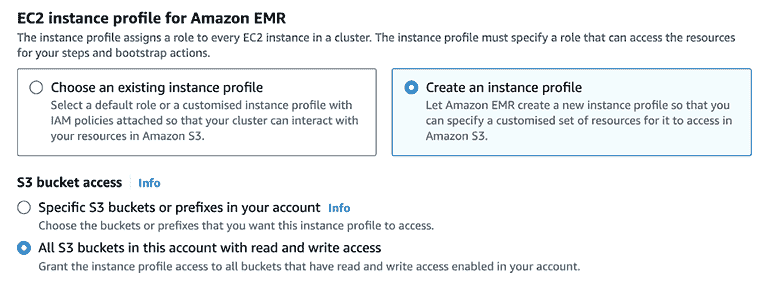

# 6

# 扩展

上一章全部关于开始讨论我们如何使用不同的部署模式将我们的解决方案推向世界，以及我们可以使用的某些工具。本章将在此基础上进行讨论，讨论我们可以使用的概念和工具，以扩展我们的解决方案以应对大量数据或流量。

在您的笔记本电脑上运行一些简单的**机器学习**（**ML**）模型，在几千个数据点上是一个很好的练习，尤其是在您执行我们在任何机器学习开发项目开始时概述的发现和概念验证步骤时。然而，如果我们必须以相对较高的频率运行数百万个数据点，或者如果我们必须同时训练数千个类似规模的模型，这种方法就不合适了。这需要不同的方法、心态和工具集。

在以下页面中，我们将介绍目前使用最广泛的两个用于分布式数据计算的框架的详细信息：**Apache Spark**和**Ray**。特别是，我们将讨论这些框架在底层的一些关键点，以便在开发过程中，我们可以就如何使用它们做出一些好的决策。然后，我们将讨论如何使用这些框架在您的机器学习工作流程中，并提供一些具体的示例，这些示例专门旨在帮助您在处理大量数据时。接下来，将提供一个关于创建允许您扩展推理端点的无服务器应用的简要介绍。最后，我们将介绍如何使用 Kubernetes 扩展容器化的机器学习应用，这补充了我们在*第五章*，*部署模式和工具*中完成的工作，并在*第八章*，*构建示例 ML 微服务*中详细展开。

这将帮助您在我们之前在这本书中已经查看的一些实际示例的基础上进行构建，当时我们使用 Spark 来解决我们的机器学习问题，并增加一些更具体的理论理解和更详细的实际示例。在本章之后，您应该对如何使用一些最好的框架和技术来扩展您的机器学习解决方案以适应更大的数据集感到自信。

在本章中，我们将在以下部分中涵盖所有这些内容：

+   使用 Spark 进行扩展

+   启动无服务器基础设施

+   使用 Kubernetes 进行大规模容器化

+   使用 Ray 进行扩展

+   设计大规模系统

# 技术要求

与其他章节一样，您可以通过使用提供的 Conda 环境`yml`文件或从书库中的`requirements.txt`文件来设置您的 Python 开发环境，以便能够运行本章中的示例，在*第六章*下：

```py
conda env create –f mlewp-chapter06.yml 
```

本章的示例还需要安装一些非 Python 工具，以便从头到尾遵循示例；请参阅每个工具的相关文档：

+   AWS CLI v2

+   Docker

+   Postman

+   Ray

+   Apache Spark（版本 3.0.0 或更高）

# 使用 Spark 进行扩展

**Apache Spark**，或简称 Spark，起源于 2012 年加州大学伯克利分校一些杰出研究人员的工作，自那时起，它彻底改变了我们处理大数据集问题的方法。

Spark 是一个集群计算框架，这意味着它基于几个计算机以允许计算任务共享的方式相互连接的原则。这使我们能够有效地协调这些任务。每次我们讨论运行 Spark 作业时，我们总是谈论我们在其上运行的*集群*。

这是一组执行任务的计算机，即工作节点，以及托管组织工作负载的计算机，被称为头节点。

Spark 是用 Scala 编写的，这是一种具有强烈函数式风格的编程语言，并编译成**Java 虚拟机**（**JVMs**）。由于这是一本关于 Python 机器学习工程的书籍，我们不会过多讨论 Spark 底层的 Scala 组件，除非它们有助于我们在工作中使用它。Spark 有几个流行的 API，允许程序员用多种语言（包括 Python）与之一起开发。这导致了我们在本书中使用的 PySpark 语法。

那么，这一切是如何组合在一起的？

首先，使 Apache Spark 如此受欢迎的一个原因是它拥有大量可用的连接器、组件和 API。例如，四个主要组件与*Spark Core*接口：

+   **Spark SQL**、**DataFrames**和**Datasets**：这个组件允许你创建非常可扩展的程序，用于处理结构化数据。通过 Spark 的主要**结构化 API**（Python、Java、Scala 或 R）编写符合 SQL 规范的查询并创建利用底层 Spark 引擎的数据表，可以非常容易地访问 Spark 的主要功能集。

+   **Spark Structured Streaming**：这个组件允许工程师处理由例如 Apache Kafka 提供的流数据。设计极其简单，允许开发者像处理一个不断增长的 Spark 结构化表一样简单地处理流数据，具有与标准表相同的查询和处理功能。这为创建可扩展的流解决方案提供了低门槛。

+   **GraphX**：这是一个库，允许你实现图并行处理并将标准算法应用于基于图的数据（例如，如 PageRank 或三角形计数）。Databricks 的**GraphFrames**项目通过允许我们在 Spark 中使用基于 DataFrame 的 API 来分析图数据，使得这一功能更加易于使用。

+   **Spark ML**：最后但同样重要的是，我们有最适合我们作为机器学习工程师的组件：Spark 的原生机器学习库。这个库包含了我们在本书中已经看到过的许多算法和特征工程能力。能够在库中使用 **DataFrame** API 使得它极其易于使用，同时仍然为我们提供了创建非常强大代码的途径。

通过在 Spark 集群上使用 Spark ML 与在单个线程上运行另一个机器学习库相比，你可以为你的机器学习训练获得巨大的速度提升。我们还可以应用其他技巧到我们最喜欢的机器学习实现中，然后使用 Spark 来扩展它们；我们稍后会探讨这一点。

Spark 的架构基于驱动程序/执行器架构。驱动程序是作为 Spark 应用程序的主要入口点的程序，也是创建 **SparkContext** 对象的地方。**SparkContext** 将任务发送到执行器（它们在自己的 JVM 上运行），并以适合给定管理器和解决方案运行模式的方式与集群管理器进行通信。驱动程序的主要任务之一是将我们编写的代码转换为 **有向无环图**（**DAG**）中的逻辑步骤集合（与我们在第五章 *部署模式和工具* 中使用的 Apache Airflow 的概念相同），然后将该 DAG 转换为需要在可用的计算资源上执行的任务集合。

在接下来的页面中，我们将假设我们正在使用 **Hadoop YARN** 资源管理器运行 Spark，这是最受欢迎的选项之一，也是 **AWS Elastic MapReduce**（**EMR**）解决方案的默认选项（关于这一点稍后还会详细介绍）。在以 *集群模式* 运行 YARN 时，驱动程序程序在 YARN 集群上的一个容器中运行，这使得客户端可以通过驱动程序提交作业或请求，然后退出（而不是要求客户端保持与集群管理器的连接，这在所谓的 *客户端模式* 下可能会发生，这里我们不会讨论）。

集群管理器负责在集群上可用的资源上启动执行器。

Spark 的架构允许我们作为机器学习工程师，无论我们是在笔记本电脑上本地工作还是在拥有数千个节点的集群上工作，都可以使用相同的 API 和语法来构建解决方案。驱动程序、资源管理器和执行器之间的连接是实现这种魔法的关键。

## Spark 技巧和技巧

在本小节中，我们将介绍一些简单但有效的技巧，以使用 Spark 编写高性能的解决方案。我们将重点关注数据操作和准备的关键语法，这些通常是任何机器学习管道中的第一步。让我们开始吧：

1.  首先，我们将介绍编写良好的 Spark SQL 的基础知识。任何 Spark 程序的入口点是 `SparkSession` 对象，我们需要在我们的应用程序中导入其实例。

    它通常使用`spark`变量实例化：

    ```py
    from pyspark.sql import SparkSession

    spark = SparkSession\
        .builder\
        .appName("Spark SQL Example")\
        .config("spark.some.config.option", "some-value")\
        .getOrCreate() 
    ```

1.  然后，你可以使用`spark`对象和`sql`方法运行 Spark SQL 命令，针对你的可用数据：

    ```py
    spark.sql('''select * from data_table''') 
    ```

    根据数据存在的地方，有各种方法可以在 Spark 程序内部提供所需的数据。以下示例取自我们在*第三章*，“从模型到模型工厂”中经过的一些代码，展示了如何从`csv`文件中将数据拉入 DataFrame：

    ```py
    data = spark.read.format("csv")\
        .option("sep", ";")\
        .option("inferSchema", "true")\
        .option("header", "true").load(
        "data/bank/bank.csv") 
    ```

1.  现在，我们可以使用以下语法创建此数据的临时视图：

    ```py
    data.createOrReplaceTempView('data_view') 
    ```

1.  然后，我们可以使用之前提到的方法查询此数据，以查看记录或创建新的 DataFrames：

    ```py
    new_data = spark.sql('''select …''') 
    ```

当编写 Spark SQL 时，一些标准做法有助于提高代码的效率：

+   尽量不要将左边的大的表格与右边的小的表格连接，因为这效率低下。通常，尽量使用于连接的数据集尽可能瘦，例如，尽可能少地使用未使用的列或行进行连接。

+   避免查询语法扫描非常大的数据集；例如，`select max(date_time_value)`。

在这个情况下，尝试定义逻辑，在找到最小或最大值之前更积极地过滤数据，并且通常允许解决方案扫描更小的数据集。

在使用 Spark 时，以下是一些其他的好做法：

+   **避免数据倾斜**：尽可能了解你的数据将如何在执行器之间分割。如果你的数据是在日期列上分区的，如果每天的数据量相当，这可能是一个不错的选择，但如果某些天有大部分数据而其他天很少，这可能是一个坏选择。可能需要使用更合适的列（或使用`repartition`命令生成的 Spark 生成的 ID）重新分区。

+   **避免数据洗牌**：这是指数据在不同分区之间重新分配。例如，我们可能有一个按日级别分区的数据集，然后我们要求 Spark 对所有时间的数据集的一个列求和。这将导致所有每日分区被访问，并将结果写入一个新的分区。为此，必须发生磁盘写入和网络传输，这通常会导致你的 Spark 作业的性能瓶颈。

+   **避免在大数据集中执行操作**：例如，当你运行`collect()`命令时，你将把所有数据都带回驱动节点。如果这是一个大数据集，这可能会非常糟糕，但可能需要将计算结果转换为其他东西。请注意，`toPandas()`命令，它将你的 Spark `DataFrame`转换为 pandas `DataFrame`，也会收集驱动器内存中的所有数据。

+   **当适用时使用 UDF**：作为 Apache Spark 的 ML 工程师，你武器库中的另一个优秀工具是**用户定义函数**（**UDF**）。UDF 允许你封装更复杂和定制的逻辑，并以各种方式大规模应用。这个方面的重要之处在于，如果你编写了一个标准的 PySpark（或 Scala）UDF，那么你可以在 Spark SQL 语法内部应用这个 UDF，这允许你高效地重用你的代码，甚至简化 ML 模型的适用。缺点是这些代码有时可能不是最有效的，但如果它有助于使你的解决方案更简单、更易于维护，那么它可能是一个正确的选择。

作为具体示例，让我们构建一个 UDF，它将查看我们在第三章“从模型到模型工厂”中处理过的银行数据，创建一个名为‘`month_as_int`’的新列，该列将当前月份的字符串表示形式转换为整数以便后续处理。我们不会关注训练/测试分割或这可能被用于什么；相反，我们将突出如何将一些逻辑应用于 PySpark UDF。

让我们开始吧：

1.  首先，我们必须读取数据。注意这里给出的相对路径与本书 GitHub 仓库中的`spark_example_udfs.py`脚本一致，该脚本位于[`github.com/PacktPublishing/Machine-Learning-Engineering-with-Python-Second-Edition/blob/main/Chapter06/mlewp2-spark/spark_example_udfs.py`](https://github.com/PacktPublishing/Machine-Learning-Engineering-with-Python-Second-Edition/blob/main/Chapter06/mlewp2-spark/spark_example_udfs.py)：

    ```py
    from pyspark.sql import SparkSession
    from pyspark import SparkContext
    from pyspark.sql import functions as f

    sc = SparkContext("local", "Ch6BasicExampleApp")
    # Get spark session
    spark = SparkSession.builder.getOrCreate()
    # Get the data and place it in a spark dataframe
    data = spark.read.format("csv").option("sep", ";").option("inferSchema", "true").option("header", "true").load(
            "data/bank/bank.csv") 
    ```

    如果我们使用`data.show()`命令显示当前数据，我们会看到类似以下内容：

    

    图 6.1：银行数据集中初始 DataFrame 的数据样本。

1.  现在，我们可以使用`data.printSchema()`命令双重检查这个 DataFrame 的模式。这确认了`month`目前是以字符串形式存储的，如下所示：

    ```py
    |-- age: integer (nullable = true)
    |-- job: string (nullable = true)
    |-- marital: string (nullable = true)
    |-- education: string (nullable = true)
    |-- default: string (nullable = true)
    |-- balance: integer (nullable = true)
    |-- housing: string (nullable = true)
    |-- loan: string (nullable = true)
    |-- contact: string (nullable = true)
    |-- day: integer (nullable = true)
    |-- month: string (nullable = true)
    |-- duration: integer (nullable = true)
    |-- campaign: integer (nullable = true)
    |-- pdays: integer (nullable = true)
    |-- previous: integer (nullable = true)
    |-- poutcome: string (nullable = true)
    |-- y: string (nullable = true) 
    ```

1.  现在，我们可以定义我们的 UDF，它将使用 Python 的`datetime`库将月份的字符串表示形式转换为整数：

    ```py
    import datetime

    def month_as_int(month):
        month_number = datetime.datetime.strptime(month, "%b").month
        return month_number 
    ```

1.  如果我们想在 Spark SQL 内部应用我们的函数，那么我们必须将函数注册为 UDF。`register()`函数的参数是函数的注册名称、我们刚刚编写的 Python 函数的名称以及返回类型。默认情况下，返回类型是`StringType()`，但我们在这里明确指定了它：

    ```py
    from pyspark.sql.types import StringType

    spark.udf.register("monthAsInt", month_as_int, StringType()) 
    ```

1.  最后，既然我们已经注册了函数，我们就可以将其应用于我们的数据。首先，我们将创建银行数据集的一个临时视图，然后运行一个 Spark SQL 查询，该查询引用我们的用户定义函数（UDF）：

    ```py
    data.createOrReplaceTempView('bank_data_view')
    spark.sql('''
    select *, monthAsInt(month) as month_as_int from bank_data_view
    ''').show() 
    ```

    使用`show()`命令运行前面的语法显示我们已经成功计算了新列。结果`DataFrame`的最后几列如下所示：

    

    图 6.2：通过应用我们的 UDF 成功计算了新列。

1.  或者，我们可以使用以下语法创建我们的 UDF，并将结果应用于 Spark `DataFrame`。如前所述，使用 UDF 有时可以让你非常简单地封装相对复杂的语法。这里的语法相当简单，但我仍然会向你展示。这给我们带来了与前面截图相同的结果：

    ```py
    from pyspark.sql.functions import udf

    month_as_int_udf = udf(month_as_int, StringType())
    df = spark.table("bank_data_view")
    df.withColumn('month_as_int', month_as_int_udf("month")).show() 
    ```

1.  最后，PySpark 还提供了一个很好的装饰器语法来创建我们的 UDF，这意味着如果你确实在构建一些更复杂的功能，你只需将这个装饰器放在被装饰的 Python 函数中即可。下面的代码块也给出了与前面截图相同的结果：

    ```py
    @udf("string")
    def month_as_int_udf(month):
        month_number = datetime.datetime.strptime(month, "%b").month
        return month_number
    df.withColumn('month_as_int', month_as_int_udf("month")).show() 
    ```

这显示了如何在 UDF 中应用一些简单的逻辑，但为了使用这种方法在规模上部署模型，我们必须在函数内部放置 ML 逻辑并以相同的方式应用它。如果我们想使用我们习惯于从数据科学世界使用的标准工具，如 Pandas 和**Scikit-learn**，这可能会变得有点棘手。幸运的是，我们还有另一个可以使用的选项，它有一些优点。我们现在就来讨论这个。

当我们在 Python 中工作时，目前考虑的 UDF 存在一个小问题，那就是在 JVM 和 Python 之间转换数据可能需要一段时间。一种解决方法是使用所谓的**pandas UDFs**，它底层使用 Apache Arrow 库来确保我们的 UDF 执行时数据读取快速。这给我们带来了 UDF 的灵活性，而没有任何减速。

pandas UDFs 也非常强大，因为它们与 pandas **Series** 和 **DataFrame** 对象的语法一起工作。这意味着许多习惯于使用 pandas 在本地构建模型的科学家可以轻松地将他们的代码扩展到使用 Spark。

例如，让我们回顾一下如何将一个简单的分类器应用于我们在这本书中之前使用过的 wine 数据集。请注意，该模型并未针对这些数据进行优化；我们只是展示了一个应用预训练分类器的示例：

1.  首先，让我们在 wine 数据集上创建一个简单的**支持向量机**（**SVM**）分类器。我们在这里没有进行正确的训练/测试分割、特征工程或其他最佳实践，因为我们只是想向你展示如何应用任何`sklearn`模型：

    ```py
    import sklearn.svm
    import sklearn.datasets

    clf = sklearn.svm.SVC()
    X, y = sklearn.datasets.load_wine(return_X_y=True) clf.fit(X, y) 
    ```

1.  然后，我们可以将特征数据带入 Spark DataFrame，以展示如何在后续阶段应用 pandas UDF：

    ```py
    df = spark.createDataFrame(X.tolist()) 
    ```

1.  pandas UDFs 非常容易定义。我们只需在函数中编写我们的逻辑，然后添加`@pandas_udf`装饰器，在那里我们还需要为函数提供输出类型。在最简单的情况下，我们可以将使用训练模型进行预测的（通常是串行或仅本地并行化）过程封装起来：

    ```py
    import pandas as pd
    from pyspark.sql.types import IntegerType
    from pyspark.sql.functions import pandas_udf

    @pandas_udf(returnType=IntegerType())
    def predict_pd_udf(*cols):
        X = pd.concat(cols, axis=1)
        return pd.Series(clf.predict(X)) 
    ```

1.  最后，我们可以通过传递我们函数所需的适当输入来将此应用于包含数据的 Spark `DataFrame`。在这种情况下，我们将传递特征列的名称，共有 13 个：

    ```py
    col_names = ['_{}'.format(x) for x in range(1, 14)]
    df_pred = df.select('*', predict_pd_udf(*col_names).alias('class')) 
    ```

现在，如果您查看这个结果，您将看到`df_pred` DataFrame 的前几行如下所示：


图 6.3：应用简单的 pandas UDF 的结果。

这样，我们就完成了对 Spark 和 pandas UDF 在 Spark 中的快速浏览，这使我们能够以明显并行的方式应用诸如数据转换或我们的机器学习模型之类的串行 Python 逻辑。

在下一节中，我们将专注于如何在云端设置 Spark-based 计算。

## 云端 Spark

如前所述，应该很清楚，编写和部署基于 PySpark 的机器学习解决方案可以在您的笔记本电脑上完成，但为了在工作规模上看到好处，您必须拥有适当规模的计算集群。提供此类基础设施可能是一个漫长而痛苦的过程，但正如本书中已经讨论的那样，主要公共云提供商提供了大量的基础设施选项。

对于 Spark，AWS 有一个特别好的解决方案，称为**AWS Elastic MapReduce**（**EMR**），这是一个托管的大数据平台，允许您轻松配置大数据生态系统中的几种不同类型的集群。在这本书中，我们将专注于基于 Spark 的解决方案，因此我们将专注于创建和使用带有 Spark 工具的集群。

在下一节中，我们将通过一个具体的例子来展示如何在 EMR 上启动一个 Spark 集群，然后将其部署一个简单的基于 Spark ML 的应用程序。

因此，让我们在**AWS EMR**上探索 Spark 在云端的应用！

### AWS EMR 示例

为了理解 EMR 是如何工作的，我们将继续遵循本书的实践方法，并深入一个例子。我们将首先学习如何创建一个全新的集群，然后再讨论如何编写和部署我们的第一个 PySpark ML 解决方案到集群中。让我们开始吧：

1.  首先，导航到 AWS 上的**EMR**页面，找到**创建集群**按钮。然后，您将被带到允许您输入集群配置数据的页面。第一个部分是您指定集群名称和要安装在其上的应用程序的地方。我将把这个集群命名为`mlewp2-cluster`，使用写作时的最新 EMR 版本 6.11.0，并选择**Spark**应用程序包。

1.  在这个第一部分，所有其他配置都可以保持默认设置。这如图 6.4 所示：

    图 6.4：使用一些默认配置创建我们的 EMR 集群。

1.  接下来是集群中使用的计算配置。您在这里也可以再次使用默认设置，但了解正在发生的事情很重要。首先，是选择使用“实例组”还是“实例舰队”，这指的是根据您提供的某些约束条件部署的计算扩展策略。实例组更简单，定义了您为每种节点类型想要运行的特定服务器，关于这一点我们稍后再详细说明，并且您可以在集群生命周期内需要更多服务器时选择“按需”或“竞价实例”。实例舰队允许采用更多复杂的获取策略，并为每种节点类型混合不同的服务器实例类型。有关更多信息，请阅读 AWS 文档，以确保您对不同的选项有清晰的了解，[`docs.aws.amazon.com/emr/index.xhtml`](https://docs.aws.amazon.com/emr/index.xhtml)；我们将通过使用具有默认设置的实例组来继续操作。现在，让我们转到节点。EMR 集群中有不同的节点；主节点、核心节点和任务节点。主节点将运行我们的 YARN 资源管理器，并跟踪作业状态和实例组健康。核心节点运行一些守护程序和 Spark 执行器。最后，任务节点执行实际的分布式计算。现在，让我们按照为实例组选项提供的默认设置进行操作，如图 6.5 中的**主节点**所示。

    图 6.5：我们的 EMR 集群的计算配置。我们选择了更简单的“实例组”选项进行配置，并采用了服务器类型的默认设置。

1.  接下来，我们将定义我们在*步骤 2*中提到的用于实例组和实例舰队计算选项的显式集群缩放行为。再次提醒，现在请选择默认设置，但您可以在这里尝试调整集群的大小，无论是通过增加节点数量，还是定义在负载增加时动态增加集群大小的自动缩放行为。*图 6.6*展示了它应该看起来是什么样子。

    图 6.6：集群配置和缩放策略选择。在这里，我们选择了特定的小集群大小的默认设置，但您可以增加这些值以获得更大的集群，或者使用自动缩放选项来提供最小和最大大小限制。

1.  现在，有一个**网络**部分，如果你已经为书中的其他示例创建了一些**虚拟专用网络**（**VPC**）和子网，这将更容易；参见*第五章*，*部署模式和工具*以及 AWS 文档以获取更多信息。只需记住，VPCs 主要是关于将你正在配置的基础设施与其他 AWS 账户中的服务以及更广泛的互联网隔离开来，因此熟悉它们及其应用绝对是件好事。

1.  为了完整性，*图 6.7*显示了我在这个示例中使用的设置。

    图 6.7：网络配置需要使用 VPC；如果没有选择，它将自动为集群创建一个子网。

1.  我们只需要输入几个更多部分来定义我们的集群。下一个强制性的部分是关于集群终止策略。我总是建议在可能的情况下为基础设施设置自动拆解策略，因为这有助于管理成本。整个行业都有很多关于团队留下未使用的服务器运行并产生巨额账单的故事！*图 6.8*显示，我们正在使用这样的自动集群终止策略，其中集群将在 1 小时未被使用后终止。

    图 6.8：定义一个类似于这样的集群终止策略被认为是最佳实践，并且可以帮助避免不必要的成本。

1.  完成所需的最后一个部分是定义适当的**身份和访问管理**（**IAM**）角色，它定义了哪些账户可以访问我们正在创建的资源。如果你已经有了一些你愿意作为 EMR 服务角色重用的 IAM 角色，那么你可以这样做；然而，对于这个示例，让我们为这个集群创建一个新的服务角色。*图 6.9*显示，选择创建新角色的选项会预先填充 VPC、子网和安全组，其值与通过此过程已选择的值相匹配。你可以添加更多内容。*图 6.10*显示，我们还可以选择创建一个“实例配置文件”，这只是一个在启动时应用于 EC2 集群中所有服务器实例的服务角色的名称。

    图 6.9：创建 AWS EMR 服务角色。

    

    图 6.10：为在此 EMR 集群中使用的 EC2 服务器创建实例配置文件。实例配置文件只是分配给所有集群 EC2 实例在启动时的服务角色的名称。

1.  讨论的部分都是创建您的集群所必需的章节，但也有一些可选章节，我想简要提及以指导您进一步探索。这里有指定**步骤**的选项，您可以在其中定义要按顺序运行的 shell 脚本、JAR 应用程序或 Spark 应用程序。这意味着您可以在基础设施部署后提交作业之前，启动集群并准备好应用程序以按您希望的顺序处理数据。还有一个关于**引导操作**的章节，它允许您定义在安装任何应用程序或处理 EMR 集群上的任何数据之前应运行的定制安装或配置步骤。集群日志位置、标签和一些基本软件考虑因素也适用于配置。最后要提到的重要一点是安全配置。*图 6.11*显示了选项。尽管我们将不指定任何 EC2 密钥对或安全配置来部署此集群，但如果您想在生产中运行此集群，了解您组织的网络安全要求和规范至关重要。请咨询您的安全或网络团队以确保一切符合预期和要求。目前，我们可以将其留空，然后继续创建集群。

    图 6.11：此处显示的集群安全配置是可选的，但如果您打算在生产中运行集群，应仔细考虑。

1.  现在我们已经选择了所有必需的选项，点击**创建集群**按钮以启动。创建成功后，您应该会看到一个类似于*图 6.12*所示的审查页面。就这样；现在您已经在云中创建了自己的 Spark 集群了！！

    图 6.12：成功启动后显示的 EMR 集群创建审查页面。

在启动我们的 EMR 集群后，我们希望能够向其提交工作。在这里，我们将调整我们在*第三章*，*从模型到模型工厂*中生产的示例 Spark ML 管道，以分析银行数据集，并将其作为步骤提交到我们新创建的集群。我们将这样做为一个独立的单个 PySpark 脚本，作为我们应用程序的唯一步骤，但很容易在此基础上构建更复杂的应用程序：

1.  首先，我们将从*第三章*，*从模型到模型工厂*中提取代码，并根据我们围绕良好实践的讨论进行一些精心的重构。我们可以更有效地模块化代码，使其包含一个提供所有建模步骤的功能（为了简洁，并非所有步骤都在此处重现）。我们还包括了一个最终步骤，将建模结果写入`parquet`文件：

    ```py
    def model_bank_data(spark, input_path, output_path):
        data = spark.read.format("csv")\
            .option("sep", ";")\
            .option("inferSchema", "true")\
            .option("header", "true")\
            .load(input_path)
        data = data.withColumn('label', f.when((f.col("y") == "yes"),
                                                1).otherwise(0))
        # ...
        data.write.format('parquet')\
            .mode('overwrite')\
            .save(output_path) 
    ```

1.  在此基础上，我们将所有主要样板代码封装到一个名为`main`的函数中，该函数可以在程序的`if __name__=="__main__":`入口点被调用：

    ```py
    def main():
        parser = argparse.ArgumentParser()
        parser.add_argument(
            '--input_path', help='S3 bucket path for the input data.
            Assume to be csv for this case.'
        )
        parser.add_argument(
            '--output_path', help='S3 bucket path for the output data.
            Assume to be parquet for this case'
        )
        args = parser.parse_args()
        # Create spark context
        sc = SparkContext("local", "pipelines")
        # Get spark session
        spark = SparkSession\
            .builder\
            .appName('MLEWP Bank Data Classifier EMR Example')\
            .getOrCreate()
        model_bank_data(
            spark,
            input_path=args.input_path,,
            output_path=args.output_path
        ) 
    ```

1.  我们将前面的函数放入一个名为`spark_example_emr.py`的脚本中，稍后我们将将其提交到我们的 EMR 集群：

    ```py
    import argparse
    from pyspark.sql import SparkSession
    from pyspark import SparkContext
    from pyspark.sql import functions as f
    from pyspark.mllib.evaluation import BinaryClassificationMetrics, MulticlassMetrics
    from pyspark.ml.feature import StandardScaler, OneHotEncoder, StringIndexer, Imputer, VectorAssembler
    from pyspark.ml import Pipeline, PipelineModel
    from pyspark.ml.classification import LogisticRegression

    def model_bank_data(spark, input_path, output_path):
        ...
    def main():
        ...
    if __name__ == "__main__":
        main() 
    ```

1.  现在，为了将此脚本提交到我们刚刚创建的 EMR 集群，我们需要找到集群 ID，我们可以从 AWS UI 或通过运行以下命令来获取：

    ```py
    aws emr list-clusters --cluster-states WAITING 
    ```

1.  然后，我们需要将`spark_example_emr.py`脚本发送到 S3，以便集群读取。我们可以创建一个名为`s3://mlewp-ch6-emr-examples`的 S3 存储桶来存储这个和其他工件，无论是使用 CLI 还是 AWS 控制台（参见*第五章*，*部署模式和工具*）。一旦复制完成，我们就为最后一步做好了准备。

1.  现在，我们必须使用以下命令提交脚本，用我们刚刚创建的集群 ID 替换`<CLUSTER_ID>`。请注意，如果你的集群由于我们设置的自动终止策略而终止，你无法重新启动它，但你可以克隆它。几分钟后，步骤应该已经完成，输出应该已经写入同一 S3 存储桶中的`results.parquet`文件：

    ```py
    aws emr add-steps\
    --region eu-west-1 \
    --cluster-id <CLUSTER_ID> \
    --steps Type=Spark,Name="Spark Application Step",ActionOnFailure=CONTINUE,\
    Args=[--files,s3://mlewp-ch6-emr-examples/spark_example_emr.py,\
    --input_path,s3://mlewp-ch6-emr-examples/bank.csv,\
    --output_path,s3://mleip-emr-ml-simple/results.parquet] 
    ```

    就这样——这就是我们如何在云上使用**AWS EMR**开始开发 PySpark ML 管道的方法！

你会发现，通过导航到适当的 S3 存储桶并确认`results.parquet`文件已成功创建，这个先前的过程已经成功；参见*图 6.13*。


图 6.13：提交 EMR 脚本后成功创建 results.parquet 文件。

在下一节中，我们将探讨使用所谓的无服务器工具来扩展我们解决方案的另一种方法。

# 启动无服务器基础设施

无论何时我们进行机器学习或软件工程，都必须在计算机上运行必要的任务和计算，通常伴随着适当的网络、安全和其它协议及软件，这些我们通常称之为构成我们的*基础设施*。我们基础设施的一个大组成部分是我们用来运行实际计算的服务器。这可能会显得有些奇怪，所以让我们先从*无服务器*基础设施（这怎么可能存在呢？）开始谈。本节将解释这个概念，并展示如何使用它来扩展你的机器学习解决方案。

**无服务器**作为一个术语有点误导，因为它并不意味着没有物理服务器在运行你的程序。然而，它确实意味着你正在运行的程序不应被视为静态托管在一台机器上，而应被视为在底层硬件之上的另一层上的短暂实例。

无服务器工具对你的机器学习解决方案的好处包括（但不限于）以下内容：

+   **无服务器**：不要低估通过将基础设施管理外包给云服务提供商所能节省的时间和精力。

+   **简化扩展**：通常，通过使用明确定义的最大实例等，很容易定义您无服务器组件的扩展行为。

+   **低门槛**：这些组件通常设置和运行起来非常简单，让您和您的团队成员能够专注于编写高质量的代码、逻辑和模型。

+   **自然集成点**：无服务器工具通常非常适合在与其他工具和组件之间进行交接。它们的易于设置意味着您可以在极短的时间内启动简单的作业，这些作业可以传递数据或触发其他服务。

+   **简化服务**：一些无服务器工具非常适合为您的机器学习模型提供服务层。之前提到的可扩展性和低门槛意味着您可以快速创建一个非常可扩展的服务，该服务可以根据请求或由其他事件触发提供预测。

无服务器功能中最好和最广泛使用的例子之一是 **AWS Lambda**，它允许我们通过简单的网页界面或通过我们常用的开发工具用各种语言编写程序，然后让它们在完全独立于任何已设置的基础设施的情况下运行。

Lambda 是一个惊人的低门槛解决方案，可以快速将一些代码部署并扩展。然而，它主要针对创建可以通过 HTTP 请求触发的简单 API。如果您旨在构建事件或请求驱动的系统，使用 Lambda 部署您的机器学习模型特别有用。

要看到这个功能在实际中的运用，让我们构建一个基本的系统，该系统接受带有 JSON 体的 HTTP 请求作为输入图像数据，并使用预构建的 Scikit-Learn 模型返回包含数据分类的类似消息。这个教程基于 AWS 的示例，请参阅[`aws.amazon.com/blogs/compute/deploying-machine-learning-models-with-serverless-templates/`](https://aws.amazon.com/blogs/compute/deploying-machine-learning-models-with-serverless-templates/)。

对于这个，我们可以通过利用作为 AWS **无服务器应用程序模型**（**SAM**）框架的一部分已经构建和维护的模板来节省大量时间（[`aws.amazon.com/about-aws/whats-new/2021/06/aws-sam-launches-machine-learning-inference-templates-for-aws-lambda/`](https://aws.amazon.com/about-aws/whats-new/2021/06/aws-sam-launches-machine-learning-inference-templates-for-aws-lambda/)）。

要在您的相关平台上安装 AWS SAM CLI，请遵循[`docs.aws.amazon.com/serverless-application-model/latest/developerguide/serverless-sam-cli-install.xhtml`](https://docs.aws.amazon.com/serverless-application-model/latest/developerguide/serverless-sam-cli-install.xhtml)中的说明。

现在，让我们执行以下步骤来设置一个模板无服务器部署，用于托管和提供用于对手写数字图像进行分类的机器学习模型：

1.  首先，我们必须运行 `sam init` 命令并选择 AWS 的 `Quick Start Templates` 选项：

    ```py
    Which template source would you like to use?
            1 - AWS Quick Start Templates
            2 - Custom Template Location
    Choice: 1 
    ```

1.  然后，你将获得选择使用`AWS Quick Start`应用程序模板的机会；选择选项 15，`Machine Learning`：

    ```py
    Choose an AWS Quick Start application template
        1 - Hello World Example
        2 - Data processing
        3 - Hello World Example with Powertools for AWS Lambda
        4 - Multi-step workflow
        5 - Scheduled task
        6 - Standalone function
        7 - Serverless API
        8 - Infrastructure event management
        9 - Lambda Response Streaming
        10 - Serverless Connector Hello World Example
        11 - Multi-step workflow with Connectors
        12 - Full Stack
        13 - Lambda EFS example
        14 - DynamoDB Example
        15 - Machine Learning
    Template: 
    ```

1.  接下来是你要使用的 Python 运行时的选项；与本书的其他部分一致，我们将使用 Python 3.10 运行时：

    ```py
    Which runtime would you like to use?
        1 - python3.9
        2 - python3.8
        3 - python3.10
    Runtime: 
    ```

1.  在撰写本文时，SAM CLI 将根据这些选择自动选择一些选项，首先是包类型，然后是依赖管理器。然后，你将被要求确认你想要使用的 ML 起始模板。对于这个示例，选择`XGBoost Machine Learning API`：

    ```py
    Based on your selections, the only Package type available is Image.
    We will proceed to selecting the Package type as Image.
    Based on your selections, the only dependency manager available is pip.
    We will proceed copying the template using pip.
    Select your starter template
        1 - PyTorch Machine Learning Inference API
        2 - Scikit-learn Machine Learning Inference API
        3 - Tensorflow Machine Learning Inference API
        4 - XGBoost Machine Learning Inference API
    Template: 4 
    ```

1.  SAM CLI 随后会友好地询问一些配置请求跟踪和监控的选项；你可以根据自己的喜好选择是或否。在这个示例中，我选择了否。

    ```py
    Would you like to enable X-Ray tracing on the function(s) in your application? [y/N]: N
    Would you like to enable monitoring using CloudWatch Application Insights?
    For more info, please view: https://docs.aws.amazon.com/AmazonCloudWatch/latest/monitoring/cloudwatch-application-insights.xhtml [y/N]: N
    Project name [sam-app]: mlewp-sam-ml-api
    Cloning from https://github.com/aws/aws-sam-cli-app-templates (process may take a moment) 
    ```

1.  最后，你的命令行将提供一些有关安装和下一步操作的有用信息：

    ```py
     -----------------------
        Generating application:
        -----------------------
        Name: mlewp-sam-ml-api
        Base Image: amazon/python3.10-base
        Architectures: x86_64
        Dependency Manager: pip
        Output Directory: .
        Configuration file: mlewp-sam-ml-api/samconfig.toml
        Next steps can be found in the README file at mlewp-sam-ml-api/README.md
    Commands you can use next
    =========================
    [*] Create pipeline: cd mlewp-sam-ml-api && sam pipeline init --bootstrap
    [*] Validate SAM template: cd mlewp-sam-ml-api && sam validate
    [*] Test Function in the Cloud: cd mlewp-sam-ml-api && sam sync --stack-name {stack-name} --watch 
    ```

注意，前面的步骤创建了一个基于 XGBoost 的系统模板，用于对手写数字进行分类。对于其他应用程序和项目用例，你需要根据需要调整模板的源代码。如果你想部署这个示例，请按照以下步骤操作：

1.  首先，我们必须构建模板中提供的应用程序容器。首先，导航到你的项目的顶级目录，你应该能看到目录结构应该是这样的。我使用了`tree`命令在命令行中提供一个干净的目录结构概览：

    ```py
    cd mlewp-sam-ml-api
    ls
    tree
    ├── README.md
    ├── __init__.py
    ├── app
    │   ├── Dockerfile
    │   ├── __init__.py
    │   ├── app.py
    │   ├── model
    │   └── requirements.txt
    ├── events
    │   └── event.json
    ├── samconfig.toml
    └── template.yaml
    3 directories, 10 files 
    ```

1.  现在我们处于顶级目录，我们可以运行`build`命令。这要求你的机器在后台运行 Docker：

    ```py
    sam build 
    ```

1.  在成功构建后，你应该在你的终端收到类似以下的成功消息：

    ```py
    Build Succeeded
    Built Artifacts  : .aws-sam/build
    Built Template   : .aws-sam/build/template.yaml
    Commands you can use next
    =========================
    [*] Validate SAM template: sam validate
    [*] Invoke Function: sam local invoke
    [*] Test Function in the Cloud: sam sync --stack-name {{stack-name}} --watch
    [*] Deploy: sam deploy --guided 
    ```

1.  现在，我们可以在本地测试该服务，以确保一切都能与存储库中提供的模拟数据良好地工作。这使用了一个编码基本图像的 JSON 文件，并运行服务的推理步骤。如果一切顺利，你将看到类似以下输出的服务：

    ```py
    sam local invoke  --event events/event.json
    Invoking Container created from inferencefunction:python3.10-v1
    Building image.................
    Using local image: inferencefunction:rapid-x86_64.
    START RequestId: de4a2fe1-be86-40b7-a59d-151aac19c1f0 Version: $LATEST
    END RequestId: de4a2fe1-be86-40b7-a59d-151aac19c1f0
    REPORT RequestId: de4a2fe1-be86-40b7-a59d-151aac19c1f0    Init Duration: 1.30 ms    Duration: 1662.13 ms    Billed Duration: 1663 ms    Memory Size: 5000 MB    Max Memory Used: 5000 MB
    {"statusCode": 200, "body": "{\"predicted_label\": 3}"}% 
    ```

1.  在实际项目中，你需要在部署到云之前，编辑解决方案的`app.py`和其他所需文件。我们将使用 SAM CLI 来完成这项工作，理解如果你想要自动化这个过程，你可以使用本书中讨论的 CI/CD 流程和工具，特别是在*第四章*，*打包*部分。要部署，你可以通过运行`deploy`命令来使用 CLI 的引导部署向导，这将返回以下输出：

    ```py
    sam deploy --guided
    Configuring SAM deploy
    ======================
        Looking for config file [samconfig.toml] :  Found
        Reading default arguments  :  Success
        Setting default arguments for 'sam deploy'
        =========================================
        Stack Name [mlewp-sam-ml-api]: 
    ```

1.  然后，我们必须为提供的每个元素配置应用程序。在大多数情况下，我选择了默认设置，但你也可以参考 AWS 文档，并根据你的项目做出最相关的选择：

    ```py
    Configuring SAM deploy
    ======================
        Looking for config file [samconfig.toml] :  Found
        Reading default arguments  :  Success
        Setting default arguments for 'sam deploy'
        =========================================
        Stack Name [mlewp-sam-ml-api]:
        AWS Region [eu-west-2]:
        #Shows you resources changes to be deployed and require a 'Y' to initiate deploy
        Confirm changes before deploy [Y/n]: y
        #SAM needs permission to be able to create roles to connect to the resources in your template
        Allow SAM CLI IAM role creation [Y/n]: y
        #Preserves the state of previously provisioned resources when an operation fails
        Disable rollback [y/N]: y
        InferenceFunction has no authentication. Is this okay? [y/N]: y
        Save arguments to configuration file [Y/n]: y
        SAM configuration file [samconfig.toml]:
        SAM configuration environment [default]: 
    ```

1.  上一个步骤将在终端生成大量数据；你可以监控这些数据以查看是否有任何错误或问题。如果部署成功，那么你应该会看到一些关于应用程序的最终元数据，如下所示：

    ```py
    CloudFormation outputs from deployed stack
    ---------------------------------------------------------------------------------------------------------------------
    Outputs
    ---------------------------------------------------------------------------------------------------------------------
    Key                 InferenceApi
    Description         API Gateway endpoint URL for Prod stage for Inference function
    Value               https://8qg87m9380.execute-api.eu-west-2.
    amazonaws.com/Prod/classify_digit/
    Key                 InferenceFunctionIamRole
    Description         Implicit IAM Role created for Inference function
    Value               arn:aws:iam::508972911348:role/mlewp-sam-ml-api-InferenceFunctionRole-1UE509ZXC1274
    Key                 InferenceFunction
    Description         Inference Lambda Function ARN
    Value               arn:aws:lambda:eu-west-2:508972911348:function:mlewp-sam-ml-api-InferenceFunction-ueFS1y2mu6Gz
    --------------------------------------------------------------------------------------------------------------------- 
    ```

1.  为了快速测试确认云托管解决方案是否正常工作，我们可以使用 Postman 等工具来调用我们闪亮的新 ML API。只需将*步骤 8*输出屏幕中的`InferenceApi` URL 复制为请求的目的地，选择**POST**作为请求类型，然后选择**二进制**作为主体类型。注意，如果你需要获取推理 URL，你还可以在终端中运行`sam list endpoints --output json`命令。然后，你可以选择一个手写数字的图像，或者任何其他图像，发送到 API。你可以在 Postman 中通过选择**二进制**主体选项并附加图像文件，或者复制图像的编码字符串。在*图 6.14*中，我使用了`events/event.json`文件中`body`键值对的编码字符串，这是我们用来本地测试函数的：

    图 6.14：使用 Postman 调用我们的无服务器 ML 端点。这使用了一个编码的示例图像作为请求的主体，该请求与 SAM XGBoost ML API 模板一起提供。

1.  你也可以使用以下`curl`命令以更程序化的方式测试这个服务——只需将图像的编码二进制字符串替换为适当的值，或者实际上编辑命令以指向数据二进制文件，如果你愿意，就可以开始了：

    ```py
    curl --location --request POST 'https://8qg87m9380.execute-api.eu-west-2.amazonaws.com/Prod/classify_digit/' \
    --header 'Content-Type: raw/json' \
    --data '<ENCODED_IMAGE_STRING>' 
    ```

    在这个步骤和*步骤 9*中，Lambda 函数的响应主体如下：

    ```py
    {
        "predicted_label": 3
    } 
    ```

    就这样——我们已经在 AWS 上构建和部署了一个简单的无服务器 ML 推理服务！

在下一节中，我们将简要介绍本章中将要讨论的最终扩展解决方案，即使用 Kubernetes（K8s）和 Kubeflow 来水平扩展容器化应用程序。

# 使用 Kubernetes 进行大规模容器化

我们已经介绍了如何使用容器来构建和部署我们的 ML 解决方案。下一步是了解如何编排和管理多个容器以大规模部署和运行应用程序。这就是开源工具**Kubernetes**（**K8s**）发挥作用的地方。

K8s 是一个非常强大的工具，它提供了各种不同的功能，帮助我们创建和管理非常可扩展的容器化应用程序，包括但不限于以下内容：

+   **负载均衡**：K8s 将为你管理路由到你的容器的入站流量，以确保负载均匀分配。

+   **水平扩展**：K8s 提供了简单的接口，让你可以控制任何时刻拥有的容器实例数量，如果需要，可以大规模扩展。

+   **自我修复**：有内置的管理来替换或重新安排未通过健康检查的组件。

+   **自动回滚**：K8s 存储了你的系统历史，以便在出现问题时可以回滚到先前的有效版本。

所有这些功能都有助于确保你的部署解决方案是健壮的，并且能够在所有情况下按要求执行。

K8s 的设计是通过使用微服务架构，并使用控制平面与节点（服务器）交互，每个节点都托管运行应用程序组件的 pods（一个或多个容器）来确保上述功能从底层开始嵌入。

K8s 提供的关键功能是，通过创建基础解决方案的副本来根据负载扩展应用程序。如果你正在构建具有 API 端点的服务，这些端点在不同时间可能会面临需求激增，这将非常有用。了解你可以这样做的一些方法，请参阅[`kubernetes.io/docs/concepts/workloads/controllers/deployment/#scaling-a-deployment`](https://kubernetes.io/docs/concepts/workloads/controllers/deployment/#scaling-a-deployment)：


图 6.15：K8s 架构。

但关于机器学习（ML）呢？在这种情况下，我们可以看看 K8s 生态系统中的新成员：**Kubeflow**，我们在第五章“部署模式和工具”中学习了如何使用它。

Kubeflow 将自己定位为**K8s 的 ML 工具包**([`www.kubeflow.org/`](https://www.kubeflow.org/))，因此作为机器学习工程师，了解这个快速发展的解决方案是有意义的。这是一个非常激动人心的工具，也是一个活跃的开发领域。

对于 K8s 的水平扩展概念通常仍然适用，但 Kubeflow 提供了一些标准化的工具，可以将你构建的流水线转换为标准的 K8s 资源，然后可以按照之前描述的方式管理和分配资源。这有助于减少模板代码，并让我们作为机器学习工程师专注于构建我们的建模逻辑，而不是设置基础设施。我们在第五章构建示例流水线时利用了这一点。

我们将在第八章“构建示例 ML 微服务”中更详细地探讨 Kubernetes，我们将使用它来扩展我们自己的封装 ML 模型在 REST API 中。这将很好地补充本章中关于可以用于扩展的高级抽象的工作，特别是在“启动无服务器基础设施”部分。我们在这里只会简要提及 K8s 和 Kubeflow，以确保你了解这些工具以供探索。有关 K8s 和 Kubeflow 的更多详细信息，请参阅文档。我还推荐另一本 Packt 出版的书籍，名为*Aly Saleh*和*Murat Karslioglu*的《Kubernetes in Production Best Practices》。

现在，我们将继续讨论另一个非常强大的用于扩展计算密集型 Python 工作负载的工具包，它现在在机器学习工程社区中变得极为流行，并被 Uber、Amazon 等组织以及 OpenAI 用于训练其大型语言**生成预训练变换器**（**GPT**）模型，我们将在第七章*深度学习、生成式 AI 和 LLMOps*中详细讨论。让我们来认识**Ray**。

# 使用 Ray 进行扩展

**Ray** 是一个专为帮助机器学习工程师满足大规模数据和大规模可扩展机器学习系统需求而设计的 Python 原生分布式计算框架。Ray 有一个使可扩展计算对每个机器学习开发者都可用，并且以抽象出与底层基础设施的所有交互的方式来运行在任何地方的理念。Ray 的独特特性之一是它有一个分布式调度器，而不是像 Spark 那样在中央进程中运行的调度器或 DAG 创建机制。从其核心来看，Ray 从一开始就考虑了计算密集型任务，如机器学习模型训练，这与以数据密集型为目标的 Apache Spark 略有不同。因此，你可以这样简单地思考：如果你需要多次处理大量数据，那么选择 Spark；如果你需要多次处理同一份数据，那么 Ray 可能更合适。这只是一个经验法则，不应严格遵循，但希望它能给你一个有用的指导原则。例如，如果你需要在大型批量处理中转换数百万行数据，那么使用 Spark 是有意义的，但如果你想在同一数据上训练机器学习模型，包括超参数调整，那么 Ray 可能更有意义。

这两个工具可以非常有效地一起使用，Spark 在将特征集转换后，将其输入到用于机器学习训练的 Ray 工作负载中。这特别由**Ray AI Runtime**（**AIR**）负责，它提供了一系列不同的库来帮助扩展机器学习解决方案的不同部分。这些包括：

+   **Ray Data**: 专注于提供数据预处理和转换原语。

+   **Ray Train**: 促进大型模型训练。

+   **Ray Tune**: 帮助进行可扩展的超参数训练。

+   **Ray RLib**: 支持强化学习模型开发的方法。

+   **Ray Batch Predictor**: 用于批量推理。

+   **Ray Serving**: 用于实时推理。

AIR 框架提供了一个统一的 API，通过它可以与所有这些功能进行交互，并且很好地集成了你将习惯使用的以及我们在本书中利用的大量标准机器学习生态系统。


图 6.16：来自 Anyscale 的 Jules Damji 的演示中的 Ray AI 运行时，来自：https://microsites.databricks.com/sites/default/files/2022-07/Scaling%20AI%20Workloads%20with%20the%20Ray%20Ecosystem.pdf。经许可复制。


图 6.17：包括 Raylet 调度器的 Ray 架构。来自 Jules Damji 的演示：https://microsites.databricks.com/sites/default/files/2022-07/Scaling%20AI%20Workloads%20with%20the%20Ray%20Ecosystem.pdf。经许可复制。

Ray 核心 API 有一系列不同的对象，当你在使用 Ray 时可以利用这些对象来分发你的解决方案。首先是任务，这是系统要执行的工作的异步项。为了定义一个任务，你可以使用一个 Python 函数，例如：

```py
def add(int: x, int: y) -> int:
    return x+y 
```

然后添加`@remote`装饰器，然后使用`.remote()`语法来将此任务提交到集群。这不是一个阻塞函数，所以它将只返回一个 ID，Ray 将使用该 ID 在后续的计算步骤中引用任务（[`www.youtube.com/live/XME90SGL6Vs?feature=share&t=832`](https://www.youtube.com/live/XME90SGL6Vs?feature=share&t=832)）：

```py
import ray

@remote
def add(int: x, int: y) -> int:
    return x+y
add.remote() 
```

同样，Ray API 可以将相同的概念扩展到类中；在这种情况下，这些被称为`Actors`：

```py
import ray

@ray.remote
class Counter(object):
    def __init__(self):
        self.value = 0
    def increment(self):
        self.value += 1
        return self.value
    def get_counter(self):
        return self.value
# Create an actor from this class.
counter = Counter.remote() 
```

最后，Ray 还有一个分布式不可变对象存储。这是一种智能的方法，可以在集群的所有节点之间共享一个数据存储，而不需要移动大量数据并消耗带宽。你可以使用以下语法向对象存储写入：

```py
import ray

numerical_array = np.arange(1,10e7)
obj_numerical_array = ray.put(numerical_array)
new_numerical_array = 0.5*ray.get(obj_numerical_array) 
```

重要提示

在这个语境中，一个 Actor 是一个服务或具有状态的工作者，这是一个在其他分布式框架（如 Akka）中使用的概念，它运行在 JVM 上，并且有 Java 和 Scala 的绑定。

## Ray 用于机器学习的入门

要开始，你可以通过运行以下命令安装带有 AI 运行时的 Ray，以及一些超参数优化包、中央仪表板和 Ray 增强的 XGBoost 实现：

```py
pip install "ray[air, tune, dashboard]" 
pip install xgboost
pip install xgboost_ray 
```

重要提示

这里提醒一下，当你在这本书中看到`pip install`时，你还可以使用在第四章“打包”中概述的 Poetry。因此，在这种情况下，在运行`poetry new` `project_name:`之后，你会得到以下命令：

```py
poetry add "ray[air, tune, dashboard]"
poetry add xgboost
poetry add pytorch 
```

让我们从查看 Ray Train 开始，它提供了一系列`Trainer`对象的 API，有助于简化分布式训练。在撰写本文时，Ray 2.3.0 支持跨各种不同框架的培训师，包括：

+   **深度学习**：Horovod、Tensorflow 和 PyTorch。

+   **基于树的**：LightGBM 和 XGBoost。

+   **其他**：Scikit-learn、HuggingFace 和 Ray 的强化学习库 RLlib。


图 6.18：如 Ray 文档中所示（https://docs.ray.io/en/latest/train/train.xhtml）的 Ray 训练器。

我们首先将查看一个基于树的 XGBoost 学习器示例。打开一个脚本并开始向其中添加内容；在仓库中，这个脚本被称为`getting_started_with_ray.py`。以下内容基于 Ray 文档中给出的一个入门示例。首先，我们可以使用 Ray 下载标准数据集之一；如果我们想的话，我们也可以使用`sklearn.datasets`或其他来源，就像我们在本书的其他地方所做的那样：

```py
import ray

dataset = ray.data.read_csv("s3://anonymous@air-example-data/breast_
                             cancer.csv")
train_dataset, valid_dataset = dataset.train_test_split(test_size=0.3)
test_dataset = valid_dataset.drop_columns(cols=["target"]) 
```

注意，在这里我们使用`ray.data.read_csv()`方法，该方法返回一个`PyArrow`数据集。Ray API 有从其他数据格式读取的方法，例如 JSON 或 Parquet，以及从数据库如 MongoDB 或您自己的自定义数据源读取。

接下来，我们将定义一个预处理步骤，该步骤将标准化我们想要使用的特征；有关特征工程的信息，您可以查看*第三章*，*从模型到模型工厂*：

```py
from ray.data.preprocessors import StandardScaler

preprocessor = StandardScaler(columns=["mean radius", "mean texture"]) 
```

然后是定义 XGBoost 模型的`Trainer`对象的有趣部分。这有几个不同的参数和输入，我们将在稍后定义：

```py
from ray.air.config import ScalingConfig
from ray.train.xgboost import XGBoostTrainer

trainer = XGBoostTrainer(
    scaling_config=ScalingConfig(...),
    label_column="target",
    num_boost_round=20,
    params={...},
    datasets={"train": train_dataset, "valid": valid_dataset},
    preprocessor=preprocessor,
)
result = trainer.fit() 
```

如果您在 Jupyter 笔记本或 Python 脚本中运行此代码，您将看到类似于*图 6.19*所示的输出。


图 6.19：使用 Ray 并行训练 XGBoost 模型的输出。

`result`对象包含大量有用的信息；它的一个属性称为`metrics`，您可以打印出来以揭示运行结束状态的相关细节。执行`print(result.metrics)`，您将看到如下内容：

```py
{'train-logloss': 0.01849572773292735, 
'train-error': 0.0, 'valid-logloss': 0.089797893552767,
'valid-error': 0.04117647058823529, 
'time_this_iter_s': 0.019704103469848633, 
'should_checkpoint': True, 
'done': True, 
'timesteps_total': None, 
'episodes_total': None, 
'training_iteration': 21, 
'trial_id': '6ecab_00000', 
'experiment_id': '2df66fa1a6b14717bed8b31470d386d4', 
'date': '2023-03-14_20-33-17', 
'timestamp': 1678825997, 
'time_total_s': 6.222438812255859, 
'pid': 1713, 
'hostname': 'Andrews-MacBook-Pro.local', 
'node_ip': '127.0.0.1', 
'config': {}, 
'time_since_restore': 6.222438812255859,
'timesteps_since_restore': 0, 
'iterations_since_restore': 21, 
'warmup_time': 0.003551006317138672, 'experiment_tag': '0'} 
```

在`XGBoostTrainer`的实例化中，我们定义了一些在先前的示例中省略的重要缩放信息；如下所示：

```py
scaling_config=ScalingConfig(
    num_workers=2,
    use_gpu=False,
    _max_cpu_fraction_per_node=0.9,
) 
```

`num_workers`参数告诉 Ray 启动多少个 actor，默认情况下每个 actor 分配一个 CPU。由于我们在这里没有使用 GPU 加速，所以将`use_gpu`标志设置为 false。最后，通过将`_max_cpu_fraction_per_node`参数设置为`0.9`，我们在每个 CPU 上留下了一些备用容量，这些容量可以用于其他操作。

在上一个示例中，我们还提供了一些 XGBoost 特定的参数：

```py
params={
    "objective": "binary:logistic",
    "eval_metric": ["logloss", "error"],
} 
```

如果您想为 XGBoost 训练使用 GPU 加速，您可以在`params`字典中添加一个键值对`tree_method`: `gpu_hist`。


图 6.20：几个实验展示了在作者的笔记本电脑（一台 8 核心的 Macbook Pro）上，改变每个 worker 可用的 worker 数量和 CPU 数量如何导致 XGBoost 训练时间不同。

现在，我们将简要讨论如何在除本地机器以外的环境中使用 Ray 扩展计算。

### 为 Ray 扩展计算能力

我们迄今为止看到的示例使用的是本地 Ray 集群，该集群在第一次调用 Ray API 时自动设置。这个本地集群抓取您机器上所有可用的 CPU 并使其可用于执行工作。显然，这只能让您走这么远。下一个阶段是与可以扩展到更多可用工作者的集群一起工作，以获得更多的加速。如果您想这样做，您有几个选择：

+   **在云上**：Ray 提供了部署到 Google Cloud Platform 和 AWS 资源的能力，Azure 部署由社区维护的解决方案处理。有关在 AWS 上部署和运行 Ray 的更多信息，您可以查看其在线文档。

+   **使用 Kubernetes**：我们在 *第五章*，*部署模式和工具* 中已经遇到了 Kubeflow，它用于构建支持 Kubernetes 的 ML 管道。在本章的“在规模上容器化 Kubernetes”部分中，我们也讨论了 Kubernetes。如前所述，Kubernetes 是一个容器编排工具包，旨在基于容器创建可大规模扩展的解决方案。如果您想在 Kubernetes 上使用 Ray，可以使用 **KubeRay** 项目，[`ray-project.github.io/kuberay/`](https://ray-project.github.io/kuberay/)。

在云或 Kubernetes 上设置 Ray 主要涉及定义集群配置及其扩展行为。一旦完成这些操作，Ray 的美妙之处在于扩展您的解决方案就像编辑我们在上一个示例中使用的 `ScalingConfig` 对象一样简单，并且您可以保持所有其他代码不变。例如，如果您有一个 20 节点的 CPU 集群，您可以简单地将其定义更改为以下内容，并像以前一样运行：

```py
scaling_config=ScalingConfig(
    num_workers=20,
    use_gpu=False,
    _max_cpu_fraction_per_node=0.9,
) 
```

### 使用 Ray 扩展您的服务层

我们已经讨论了您可以使用 Ray 来使用分布式 ML 训练作业的方法，但现在让我们看看您如何使用 Ray 来帮助您扩展应用程序层。如前所述，Ray AIR 提供了一些在 **Ray Serve** 下的良好功能。

Ray Serve 是一个框架无关的库，它帮助您轻松地根据您的模型定义 ML 端点。就像我们与之交互的 Ray API 的其余部分一样，它被构建为提供易于互操作性和访问扩展，而无需大量的开发开销。

基于前几节提供的示例，让我们假设我们已经训练了一个模型，并将其存储在我们的适当注册表中，例如 MLflow，并且我们已经检索了这个模型并将其保存在内存中。

在 Ray Serve 中，我们通过使用 `@ray.serve.deployments` 装饰器来创建**部署**。这些部署包含我们希望用于处理传入 API 请求的逻辑，包括通过我们构建的任何机器学习模型。例如，让我们构建一个简单的包装类，它使用与上一个示例中我们使用的类似的 XGBoost 模型，根据通过请求对象传入的一些预处理特征数据来进行预测。首先，Ray 文档鼓励使用 Starlette 请求库：

```py
from starlette.requests import Request
import ray
from ray import serve 
```

接下来，我们可以定义一个简单的类，并使用 `serve` 装饰器来定义服务。我将假设从 MLflow 或任何其他模型存储位置提取的逻辑被封装在以下代码块中的实用函数 `get_model` 中：

```py
@serve.deployment
class Classifier:
    def __init__(self):
        self.model = get_model()
    async def __call__(self, http_request: Request) -> str:
        request_payload = await http_request.json()
        input_vector = [
            request_payload["mean_radius"],
            request_payload["mean_texture"]
        ]
        classification = self.model.predict([input_vector])[0]
        return {"result": classification} 
```

然后，您可以将此部署到现有的 Ray 集群中。

这就结束了我们对 Ray 的介绍。我们现在将结束于对*设计大规模系统*的最终讨论，然后是对我们所学到的一切的总结。

# 设计大规模系统

为了在*第五章*，“部署模式和工具”以及本章中提出的思想的基础上进行扩展，我们现在应该考虑一些方法，这些方法可以让我们在机器学习工程项目中最大限度地发挥我们讨论过的扩展能力。

扩展的整体思想应该从提供分析或推理吞吐量的增加或可以处理的数据的最终大小增加的角度来考虑。在大多数情况下，您可以开发的分析或解决方案的类型没有真正的区别。这意味着成功应用扩展工具和技术更多地取决于选择将从中受益的正确流程，即使包括使用这些工具带来的任何开销。这就是我们现在在本节中要讨论的，以便您在做出自己的扩展决策时有一些指导原则。

如本书中多处所述，您为机器学习项目开发的管道通常需要包含以下任务的一些阶段：

+   数据摄取/预处理

+   特征工程（如果与上述不同）

+   模型训练

+   模型推理

+   应用层

并行化或分布式处理可以在许多步骤中提供帮助，但通常以不同的方式。对于摄取/预处理，如果你在一个大型的预定批量设置中操作，那么以分布式方式扩展到更大的数据集将带来巨大的好处。在这种情况下，使用 Apache Spark 是有意义的。对于特征工程，同样，主要瓶颈在于我们执行转换时一次性处理大量数据，因此 Spark 对于这一点也是有用的。我们在*第三章*，“从模型到模型工厂”中详细讨论的训练机器学习模型的计算密集型步骤，非常适合用于这种密集计算的框架，无论数据大小如何。这就是 Ray 在前面章节中发挥作用的地方。Ray 意味着你也可以整洁地并行化你的超参数调整，如果你也需要这样做的话。请注意，你可以在 Spark 中运行这些步骤，但 Ray 的低任务开销和其分布式状态管理意味着它特别适合分割这些计算密集型任务。另一方面，Spark 具有集中的状态和调度管理。最后，当涉及到推理和应用层，即我们产生和展示机器学习模型结果的地方，我们需要考虑特定用例的需求。例如，如果你想将你的模型作为 REST API 端点提供服务，我们在上一节中展示了 Ray 的分布式模型和 API 如何帮助非常容易地实现这一点，但在 Spark 中这样做是没有意义的。然而，如果模型结果需要以大量批次的形式生成，那么 Spark 或 Ray 可能是合适的。此外，正如在特征工程和摄取步骤中提到的，如果最终结果也需要在大批量中进行转换，例如转换成特定的数据模型，如星型模式，那么由于这个任务的数据规模要求，在 Spark 中执行这种转换可能是合理的。

让我们通过考虑一个来自行业的潜在示例来使这个问题更加具体。许多具有零售元素的机构将分析交易和客户数据，以确定客户是否可能流失。让我们探讨一些我们可以做出的决策，以设计和开发这个解决方案，特别关注使用我们在本章中介绍的工具和技术进行扩展的问题。

首先，我们有数据摄取。对于这种情况，我们将假设客户数据，包括与不同应用程序和系统的交互，在业务日结束时处理，数量达到数百万条记录。这些数据包含数值和分类值，并且需要经过处理才能输入到下游机器学习算法中。如果数据按日期分区，或者数据的一些其他特征，那么这非常自然地适用于 Spark 的使用，因为你可以将其读入 Spark DataFrame，并使用分区来并行化数据处理步骤。

接下来，我们讨论特征工程。如果在第一步中使用 Spark DataFrame，那么我们可以使用本章前面讨论的基础 PySpark 语法来应用我们的转换逻辑。例如，如果我们想应用来自 Scikit-Learn 或其他机器学习库的一些特征转换，我们可以将这些转换封装在 UDFs 中，并在所需的规模上应用。然后，我们可以使用 PySpark API 将数据导出为我们选择的数据格式。对于客户流失模型，这可能意味着对分类变量的编码和对数值变量的缩放，这与在 *第三章*，*从模型到模型工厂* 中探讨的技术一致。

转向模型的训练，我们现在正从数据密集型任务转向计算密集型任务。这意味着自然地开始使用 Ray 进行模型训练，因为你可以轻松设置并行任务来训练具有不同超参数设置的模型，并分配训练步骤。使用 Ray 进行深度学习或基于树的模型训练有特定的好处，因为这些算法易于并行化。所以，如果我们使用 Spark ML 中可用的模型之一进行分类，这可以在几行代码内完成，但如果我们使用其他东西，我们可能需要开始封装 UDFs。Ray 对库的依赖性更少，但再次，真正的好处来自于我们使用 PyTorch 或 TensorFlow 中的神经网络，或者使用 XGBoost 或 LightGBM，因为这些更自然地并行化。

最后，我们来看模型推理步骤。在批量设置中，关于这里建议的框架，谁是赢家并不那么明确。使用 UDFs 或 PySpark 核心 API，你可以轻松地使用 Apache Spark 和你的 Spark 集群创建一个相当可扩展的批量预测阶段。这主要是因为在大批量上的预测实际上只是另一种大规模数据转换，而 Spark 在这方面表现卓越。然而，如果你希望将你的模型作为一个可以跨集群扩展的端点提供服务，那么正如*使用 Ray 扩展你的服务层*部分所示，Ray 提供了非常易于使用的功能。Spark 没有创建这种端点的功能，并且启动 Spark 作业所需的调度和任务开销意味着，对于像这种作为请求传入的小数据包，运行 Spark 可能并不值得。

对于客户流失的例子，这可能意味着如果我们想在整个客户基础上进行流失分类，Spark 提供了一个很好的方式来处理所有这些数据，并利用像底层数据分区这样的概念。你仍然可以在 Ray 中这样做，但较低级别的 API 可能意味着这需要更多的工作。请注意，我们可以使用许多其他机制来创建这个服务层，如*第五章*、*部署模式和工具*以及本章中关于*启动无服务器基础设施*的部分所述。*第八章*、*构建示例 ML 微服务*也将详细说明如何使用 Kubernetes 扩展 ML 端点的部署。

最后，我将最后一个阶段称为*应用层*，以涵盖解决方案中输出系统与下游系统之间的任何“最后一公里”集成。在这种情况下，Spark 实际上并没有扮演什么角色，因为它实际上可以被视为一个大规模数据转换引擎。另一方面，Ray 则更侧重于通用的 Python 加速哲学，所以如果你的应用程序后端有任务可以从并行化中受益，比如数据检索、一般计算、模拟或其他一些过程，那么你仍然可以在某种程度上使用 Ray，尽管可能还有其他可用的工具。因此，在客户流失的例子中，Ray 可以用于在服务结果之前对单个客户进行分析，并在**Ray Serve**端点并行执行此操作。

通过这个高级示例，我们的目的是突出你在机器学习工程项目中可以做出关于如何有效扩展的选择的点。我常说，通常没有“正确答案”，但往往有很多“错误答案”。我的意思是，通常有几种构建良好解决方案的方法都是同样有效的，并且可能利用不同的工具。重要的是要避免最大的陷阱和死胡同。希望这个例子能给你一些关于如何将这种思考应用到扩展你的机器学习解决方案的启示。

重要提示

尽管我在这里提出了很多关于 Spark 与 Ray 的问题，并提到了 Kubernetes 作为更基础的扩展基础设施选项，但现在有了通过使用**RayDP**结合 Spark 和 Ray 的能力。这个工具包现在允许你在 Ray 集群上运行 Spark 作业，这样你就可以继续使用 Ray 作为你的基础扩展层，同时利用 Spark 的 API 和功能，这些功能是 Spark 擅长的。RayDP 于 2021 年推出，目前正在积极开发中，因此这绝对是一个值得关注的功能。更多信息，请参阅项目仓库：[`github.com/oap-project/raydp`](https://github.com/oap-project/raydp)。

这就结束了我们对如何开始将我们讨论的一些扩展技术应用到我们的机器学习用例中的探讨。

现在我们将本章的内容以简要总结结束，总结我们在过去几页中涵盖的内容。

# 摘要

在本章中，我们探讨了如何将我们在过去几章中构建的机器学习解决方案进行扩展，以适应更大的数据量或更高的预测请求数量。为此，我们主要关注了**Apache Spark**，因为它是分布式计算中最受欢迎的通用引擎。在讨论 Apache Spark 的过程中，我们回顾了在此书中之前使用的一些编码模式和语法。通过这样做，我们更深入地理解了在 PySpark 开发中如何以及为什么进行某些操作。我们详细讨论了**UDFs（用户定义函数）**的概念，以及如何使用这些函数创建可大规模扩展的机器学习工作流程。

之后，我们探讨了如何在云上使用 Spark，特别是通过 AWS 提供的**EMR**服务。然后，我们查看了一些其他可以扩展我们解决方案的方法；即，通过无服务器架构和容器化的水平扩展。在前一种情况下，我们介绍了如何使用**AWS Lambda**构建一个用于服务机器学习模型的服务。这使用了 AWS SAM 框架提供的标准模板。我们提供了如何使用 K8s 和 Kubeflow 水平扩展机器学习管道的高级视图，以及使用这些工具的一些其他好处。随后，我们介绍了一个关于 Ray 并行计算框架的部分，展示了如何使用其相对简单的 API 在异构集群上扩展计算，以加速你的机器学习工作流程。Ray 现在是 Python 最重要的可扩展计算工具包之一，并被用于训练地球上的一些最大的模型，包括 OpenAI 的 GPT-4 模型。

在下一章中，我们将通过讨论你可以构建的最大机器学习模型来扩展这里的规模概念：深度学习模型，包括**大型语言模型**（**LLM**s）。我们将在下一章中讨论的所有内容，都只能通过考虑我们在这里介绍的技术来开发和有效利用。在*第八章*，*构建一个示例机器学习微服务*中，我们也将重新审视扩展你的机器学习解决方案的问题，我们将重点关注使用 Kubernetes 水平扩展机器学习微服务。这很好地补充了我们在这里通过展示如何扩展更多实时工作负载来扩展大型批量工作负载的工作。此外，在*第九章*，*构建一个提取、转换、机器学习用例*中，我们在这里讨论的许多扩展讨论都是先决条件；因此，我们在这里介绍的所有内容都将为你从本书的其余部分中获得最大收益奠定良好的基础。因此，带着所有这些新知识，让我们去探索已知最大模型的领域。

# 加入我们的 Discord 社区

加入我们的社区 Discord 空间，与作者和其他读者进行讨论：

[`packt.link/mle`](https://packt.link/mle)


