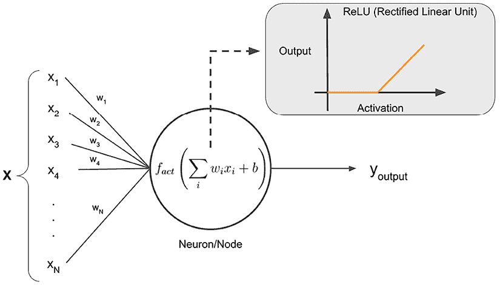
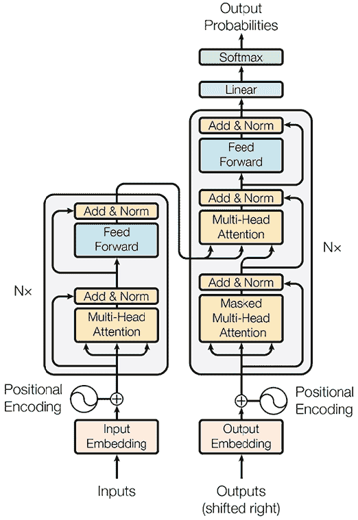
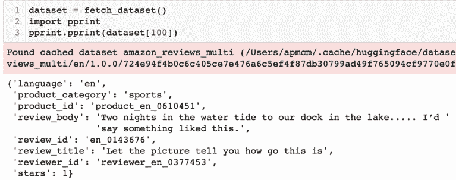
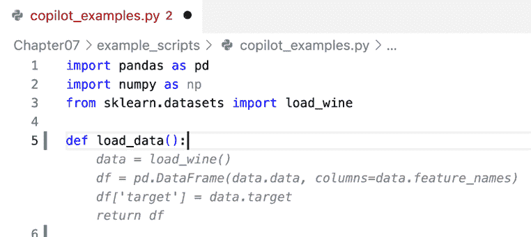
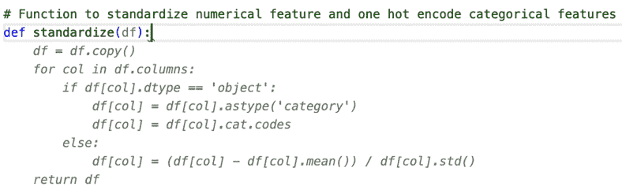

# 7

# 深度学习、生成式 AI 和 LLMOps

世界正在快速变化。截至 2023 年中期，**机器学习**（**ML**）和**人工智能**（**AI**）以一种甚至几个月前看起来不可能的方式进入了公众意识。随着 2022 年底 ChatGPT 的推出，以及来自世界各地实验室和组织的全新工具的涌现，数亿人现在每天都在使用 ML 解决方案来创造、分析和开发。除此之外，创新似乎正在加速，每天都有新的记录打破模型或新工具的宣布。ChatGPT 只是使用现在所知的**生成式人工智能**（**生成 AI 或 GenAI**）的解决方案的一个例子。虽然 ChatGPT、Bing AI 和 Google Bard 是文本生成 AI 工具的例子，但在图像空间中还有 DALL-E 和 Midjourney，现在还有一系列结合这些和其他类型数据的跨模态模型。鉴于正在演变的生态系统和全球领先 AI 实验室正在开发的模型，很容易感到不知所措。但不必担心，因为这一章完全是关于回答“这对作为新兴 ML 工程师的我意味着什么？”这个问题。

在本章中，我们将采取与本书其他章节相同的策略，专注于核心概念，并构建您可以在未来的项目中使用多年的坚实基础。我们将从自 2010 年代以来一直是许多 ML 前沿发展核心的基本算法方法开始，对**深度学习**进行回顾。然后，我们将讨论您如何构建和托管自己的深度学习模型，然后过渡到 GenAI，在那里我们将探讨一般格局，然后深入探讨 ChatGPT 和其他强大文本模型背后的方法，**大型语言模型**（**LLMs**）。

然后，我们将顺利过渡到探索如何将机器学习工程和 MLOps 应用于 LLMs，包括讨论这带来的新挑战。这是一个如此新的领域，我们将在本章中讨论的大部分内容将反映我在写作时的观点和理解。作为一个机器学习社区，我们目前正在开始定义这些模型的最佳实践意味着什么，所以我们将在这接下来的几页中共同为这个勇敢的新世界做出贡献。我希望你们享受这次旅程！

我们将在以下章节中涵盖所有这些内容：

+   深入学习深度学习

+   使用 LLMs 进行大规模开发

+   使用 LLMOps 构建未来

# 深入学习深度学习

在这本书中，我们迄今为止一直使用相对“经典”的机器学习模型，这些模型依赖于各种不同的数学和统计方法来从数据中学习。这些算法在一般情况下并不是基于任何学习生物学理论，其核心动机是找到不同的方法来显式优化损失函数。读者可能已经了解的一个稍微不同的方法，我们在第三章“从模型到模型工厂”中关于*学习学习*的部分简要介绍过，那就是**人工神经网络**（**ANNs**）所采用的方法，它起源于 20 世纪 50 年代，并基于大脑中神经元活动的理想化模型。人工神经网络的核心概念是通过连接相对简单的计算单元，称为神经元或节点（基于生物神经元建模），我们可以构建能够有效模拟任何数学函数的系统（下方的信息框中提供了更多细节）。在这个案例中，神经元是系统的一个小组成部分，它将根据输入以及使用某些预先确定的数学公式对输入进行转换来返回输出。它们本质上是非线性的，当它们组合在一起时，可以非常快速地开始模拟相当复杂的数据。人工神经元可以被认为是按层排列的，其中一层的神经元与下一层的神经元相连。在具有不多神经元和不多层的较小神经网络层面，我们在这本书中讨论的许多关于重新训练和漂移检测的技术仍然适用，无需修改。当我们达到具有许多层和神经元的所谓**深度神经网络**（**DNNs**）时，我们必须考虑一些额外的概念，这些概念我们将在本节中介绍。

神经网络能够表示各种各样函数的能力，在所谓的**万能逼近定理**中有着理论基础。这些是严格的数学结果，证明了多层神经网络可以逼近数学函数类，达到任意精度的近似。这些结果并没有说明哪些具体的神经网络会做到这一点，但它们告诉我们，只要有足够的隐藏神经元或节点，我们就可以确信，只要有足够的数据，我们应当能够表示我们的目标函数。这些定理中一些最重要的结果是在 20 世纪 80 年代末通过像*Hornik, K., Stinchcombe, M. and White, H. (1989) “Multilayer feedforward networks are universal approximators”, Neural Networks, 2(5), pp. 359–366*和*Cybenko, G. (1989) “Approximation by superpositions of a sigmoidal function”, Mathematics of Control, Signals, and Systems, 2(4), pp. 303–314*这样的论文中确立的。

在过去几年中，深度神经网络（DNNs）风靡全球。从计算机视觉到自然语言处理，从 StableDiffusion 到 ChatGPT，现在有无数令人惊叹的例子表明 DNNs 正在做以前被认为是人类专属的事情。深度学习模型的深入数学细节在其他许多文献中都有涉及，例如 Goodfellow、Bengio、Courville 的经典著作《深度学习》，由麻省理工学院出版社于 2016 年出版，我们在这里无法充分展示。尽管详细的理论超出了本章的范围，但我将尝试提供一个概述，包括你需要了解的主要概念和技术，以便你能够具备良好的工作知识，并能够开始在你的机器学习工程项目中使用这些模型。

正如所述，人工神经网络基于从生物学中借鉴的思想，就像在生物大脑中一样，ANN 由许多单个**神经元**组成。神经元可以被视为在 ANN 中提供计算单元。神经元通过接收多个输入并将它们按照特定的配方组合起来以产生单个输出来工作，这个输出可以随后作为另一个神经元的输入或作为整体模型输出的部分。在生物环境中，神经元的输入沿着**树突**流动，输出则沿着**轴突**传导。

但输入是如何转换为输出的呢？我们需要将几个概念结合起来才能理解这个过程。

+   **权重**：网络中每个神经元之间的连接都分配了一个数值，这个数值可以被视为连接的“强度”。在神经网络训练过程中，权重是用于最小化损失的一组值之一。这与*第三章*中提供的模型训练解释相一致，即*从模型到模型工厂*。

+   **偏差**：网络中的每个神经元都给定了一个额外的参数，该参数作为激活（以下定义）的偏移量。这个数值在训练过程中也会更新，它为神经网络提供了更多的**自由度**来拟合数据。你可以将偏差视为改变神经元“放电”（或产生特定输出）的水平，因此作为变量值意味着神经元有更多的适应性。

+   **输入**：这些可以被视为在考虑权重或偏差之前馈送到神经元的原始数据点。如果神经元是根据数据提供特征，则输入是特征值；如果神经元是接收来自其他神经元的输出，那么这些就是那种情况下的值。

+   **激活**：ANN 中的神经元接收多个输入；激活是输入的线性组合，乘以适当的权重加上偏差项。这把多块传入数据转换成一个单一的数值，然后可以用来确定神经元的输出应该是什么。

+   **激活函数**：激活只是一个数字，但激活函数是我们决定这个数字对神经元意味着什么的方式。目前深度学习中非常流行的激活函数有很多，但重要的特征是，当这个函数作用于激活值时，它产生一个数字，这是神经元或节点的输出。

这些概念在*图 7.1*中以图表形式呈现。深度学习模型没有严格的定义，但就我们的目的而言，一旦一个人工神经网络（ANN）由三个或更多层组成，我们就可以认为它是深层的。这意味着我们必须定义这些层的一些重要特征，我们现在就来做这件事：

+   **输入层**：这是第一个神经元层，其输入是原始数据或从数据中创建的预处理特征。

+   **隐藏层**：这些是输入层和输出层之间的层，可以认为是在这里执行数据的主要非线性变换。这通常是因为有很多隐藏层和神经元！隐藏层中神经元的组织和连接是*神经网络架构*的关键部分。

+   **输出层**：输出层负责将神经网络中执行过的变换的结果转换为可以适当解释的结果。例如，如果我们使用神经网络来分类图像，我们需要最终层输出指定类别的 1 或 0，或者我们可以让它输出不同类别的概率序列。

这些概念是有用的背景知识，但我们在 Python 中如何开始使用它们呢？世界上两个最受欢迎的深度学习框架是 Tensorflow，由谷歌大脑在 2015 年发布，以及 PyTorch，由 Meta AI 在 2016 年发布。在本章中，我们将专注于使用 PyTorch 的示例，但许多概念在经过一些修改后同样适用于 TensorFlow。



图 7.1：人工神经网络（ANN）中“神经元”的示意图以及它如何接收输入数据 x 并将其转换为输出 y。

## 开始使用 PyTorch

首先，如果你还没有安装 PyTorch，你可以通过遵循[`pytorch.org/get-started/locally/`](https://pytorch.org/get-started/locally/)上的 PyTorch 文档来安装，用于在 Macbook 上本地安装，或者使用：

```py
pip3 install torch 
```

在使用 PyTorch 时，有一些重要的概念和特性是值得记住的：

+   `torch.Tensor`：张量是可以通过多维数组表示的数学对象，并且是任何现代深度学习框架的核心组件。我们输入网络的数据应该被转换为张量，例如：

    ```py
    inputs = torch.tensor(X_train, dtype=torch.float32)
    labels = torch.tensor(y_train, dtype=torch.long) 
    ```

+   `torch.nn`: 这是定义我们的神经网络模型所使用的主要模块。例如，我们可以使用它来定义一个包含三个隐藏层的基本分类神经网络，每个隐藏层都有一个**修正线性单元**（**ReLU**）激活函数。当使用这种方法在 PyTorch 中定义模型时，你还应该编写一个名为`forward`的方法，该方法定义了在训练过程中数据如何通过网络。以下代码展示了如何在继承自`torch.nn.Module`对象的类中构建一个基本神经网络。这个网络有四个线性层，每个层都有 ReLU 激活函数，以及一个简单的正向传递函数：

    ```py
    import torch
    import torch.nn as nn

    class NeuralNetwork(nn.Module):
        def __init__(self):
            super(NeuralNetwork, self).__init__()
            self.sequential = nn.Sequential(
                nn.Linear(13, 64),
                nn.ReLU(),
                nn.Linear(64, 32),
                nn.ReLU(),
                nn.Linear(32, 16),
                nn.ReLU(),
                nn.Linear(16, 3)
            )
        def forward(self, x):
            x = self.sequential(x)
            return x 
    ```

+   **损失函数**: 在`torch.nn`模块中，有一系列损失函数可用于训练网络。一个流行的选择是交叉熵损失，但在文档中还有更多可供选择：

    ```py
    criterion = nn.CrossEntropyLoss() 
    ```

+   `torch.optim.Optimizer`: 这是 PyTorch 中所有优化器的基类。这允许实现*第三章*，“从模型到模型工厂”中讨论的大多数优化器。

    在 PyTorch 中定义优化器时，在大多数情况下，你需要传入实例化模型的参数以及特定优化器的相关参数。例如，如果我们定义一个学习率为`0.001`的 Adam 优化器，这就像这样简单：

    ```py
    import torch.optim as optim
    model = NeuralNetwork()
    optimizer = torch.optim.Adam(
            model.parameters(),
            lr=0.001
    ) 
    ```

+   `torch.autograd`: 回想一下，训练一个机器学习模型实际上是一个利用线性代数、微积分和一些统计学的优化过程。PyTorch 通过使用*自动微分*来执行模型优化，这是一种将函数的偏导数求解问题转化为一系列易于计算的原语应用的方法，尽管如此，它仍然能够以良好的精度计算微分。这不同于*有限差分法或符号微分法*。你可以通过使用损失函数并调用`backward`方法来隐式地调用它，该方法使用 autograd 来计算每个 epoch 中权重更新的梯度；然后通过调用`optimizer.step()`在优化器中使用这些梯度。在训练过程中，重置任何输入张量是很重要的，因为在 PyTorch 中张量是可变的（操作会改变其数据），同样，使用`optimizer.zero_grad()`重置优化器中计算的任何梯度也很重要。基于此，一个包含五百个 epoch 的示例训练运行如下：

    ```py
    for epoch in range(500):
        running_loss = 0.0
        optimizer.zero_grad()

        inputs = torch.tensor(X_train, dtype=torch.float32)
        labels = torch.tensor(y_train, dtype=torch.long)

        outputs = net(inputs)
        loss = criterion(outputs, labels)
        loss.backward()
        optimizer.step() 
    ```

+   `torch.save`和`torch.load`: 你可能可以从它们的名字中猜出这些方法的作用！但仍然重要的是要展示如何保存和加载你的 PyTorch 模型。在训练深度学习模型时，在训练过程中定期保存模型也很重要，因为这通常需要很长时间。这被称为“检查点”，意味着如果在训练运行中出现任何问题，你可以从上次停止的地方继续。为了保存 PyTorch 检查点，我们可以在训练循环中添加如下语法：

    ```py
    model_path = "path/to/model/my_model.pt"
    torch.save({
                'epoch': epoch,
                'model_state_dict': model.state_dict(),
                'optimizer_state_dict': optimizer.state_dict(),
                'loss': loss,
                }, model_path) 
    ```

+   要加载模型，你需要初始化你的神经网络类和优化器对象的另一个实例，然后从`checkpoint`对象中读取它们的状态：

    ```py
    model = NeuralNetwork()
    optimizer = torch.optim.Adam(model.parameters(), lr=0.001)
    checkpoint = torch.load(model_path)
    model.load_state_dict(checkpoint['model_state_dict'])
    optimizer.load_state_dict(checkpoint['optimizer_state_dict'])
    epoch = checkpoint['epoch']
    loss = checkpoint['loss'] 
    ```

+   `model.eval()`和`model.train()`: 一旦你加载了 PyTorch 的检查点，你需要将模型设置为执行任务所需的适当模式，否则可能会出现下游问题。例如，如果你想进行测试和验证，或者你想使用你的模型对新数据进行推理，那么在使用模型之前，你需要调用`model.eval()`。这将冻结任何包含的批归一化或 dropout 层，因为它们在训练期间计算统计数据和执行更新，而这些更新在测试期间你不希望是活跃的。同样，`model.train()`确保这些层在训练运行期间可以继续按预期执行更新。

    应该注意的是，有一种比`model.eval()`更极端的设置，你可以使用以下语法完全关闭你上下文中的任何 autograd 功能：

    ```py
    with torch.inference_mode(): 
    ```

    这可以在推理时提供额外的性能，但应该只在确定你不需要任何梯度或张量更新跟踪或执行时使用。

+   **评估**：如果你想测试上面示例中我们刚刚训练的模型，你可以使用类似以下语法计算准确率，但本书中讨论的任何模型验证方法都适用！

    ```py
    inputs = torch.tensor(X_test, dtype=torch.float32)
    labels = torch.tensor(y_test, dtype=torch.long)
    outputs = net(inputs)
    _, predicted = torch.max(outputs.data, 1)
    correct = (predicted == labels).sum().item()
    total = labels.size(0)
    accuracy = correct / total
    print('Accuracy on the test set: %.2f %%' % (100 * accuracy)) 
    ```

有了这些，你现在可以构建、训练、保存、加载和评估你的第一个 PyTorch 模型。我们将现在讨论如何通过考虑将深度学习模型投入生产的挑战来进一步扩展。

## 规模化和将深度学习投入生产

现在我们将转向如何在生产系统中运行深度学习模型。为此，我们需要考虑一些特定的点，这些点将 DNN 与其他经典机器学习算法区分开来：

+   **它们是数据饥渴的**：与其他机器学习算法相比，DNN 通常需要相对大量的数据，这是因为它们正在执行极其复杂的多元优化，每个神经元的参数增加了自由度。这意味着为了从头开始训练 DNN，你必须提前做一些工作，确保你有足够的数据，并且数据种类适合充分训练模型。数据需求通常还意味着你需要能够将大量数据存储在内存中，因此这通常需要提前考虑。

+   **训练更加复杂**：这一点与上面提到的内容相关，但有所不同。我们正在解决的非常复杂的非线性优化问题意味着在训练过程中，模型往往有多种方式“迷失方向”并达到次优局部最小值。正如我们在上一节中描述的*checkpointing*示例，在深度学习社区中这些技术非常普遍，因为你经常需要在损失没有朝着正确的方向移动或停滞不前时停止训练，回滚，并尝试不同的方法。

+   **你面临一个新的选择，即模型架构**：深度神经网络（DNNs）也与经典机器学习算法有很大不同，因为你现在不仅需要担心几个超参数，还需要决定你的神经网络架构或形状。这通常是一项非同小可的练习，可能需要深入了解神经网络。即使你使用的是标准的架构，如 Transformer 架构（见图 7.2），你也应该对所有组件的功能有一个稳固的理解，以便有效地诊断和解决任何问题。正如在第三章“关于学习的知识”部分讨论的自动架构搜索等技术可以帮助加快架构设计，但坚实的知识基础仍然很重要。

+   **可解释性固有的更难**：过去几年中，针对深度神经网络（DNNs）的一个批评是，其结果可能非常难以解释。这是可以预料的，因为重点确实在于 DNN 将任何问题的许多具体细节抽象化成一个更抽象的方法。这在许多情况下可能没问题，但现在已导致几个高调案例，DNNs 表现出不希望的行为，如种族或性别偏见，这可能导致更难解释和补救。在高度监管的行业，如医疗保健或金融，你的组织可能负有法律义务能够证明为什么做出了特定的决定。如果你使用 DNN 来帮助做出这个决定，这通常会相当具有挑战性。



图 7.2：Transformer 架构如图所示，最初在谷歌大脑发表的论文“Attention is all you need”中提出，https://arxiv.org/abs/1706.03762。

考虑到所有这些，我们在使用深度学习模型为我们的机器学习系统时应该考虑哪些主要事项呢？嗯，你可以做的第一件事是使用现有的预训练模型，而不是自己训练。这显然带来了一些风险，即确保模型及其提供的数据对你的应用来说是足够高质量的，所以总是要谨慎行事，并做好你的尽职调查。

然而，在许多情况下，这种方法绝对是可行的，因为我们可能正在使用一个以相当公开的方式经过测试的模型，并且它可能在我们希望使用的任务上已知表现良好。此外，我们可能有一个用例，我们愿意接受导入和使用这个预存模型的运营风险，前提是我们自己的测试。让我们假设我们现在处于这样一个例子中，我们想要构建一个基本的管道来总结一个虚构组织客户和员工之间的文本对话。我们可以使用现成的转换器模型，如*图 7.2*所示，来自 Hugging Face 的 `transformers` 库。

要开始使用，你只需要知道你想要从 Hugging Face 模型服务器下载的模型名称；在这种情况下，我们将使用 Pegasus 文本摘要模型。Hugging Face 提供了一个“`pipeline`" API，用于包装模型并使其易于使用：

```py
from transformers import pipeline
summarizer = pipeline("summarization", model= "google/pegasus-xsum") 
```

执行我们的第一个深度学习模型推理就像只是将一些输入传递给这个管道一样简单。因此，对于上面描述的虚构人机交互，我们只需传递一些示例文本，看看它返回什么。让我们这样做，以总结一个虚构的客户和聊天机器人之间的对话，其中客户正在尝试获取他们已下订单的更多信息。对话如下所示：

```py
text = "Customer: Hi, I am looking for some help regarding my recent purchase of a bouquet of flowers. ChatBot: Sure, how can I help you today? Customer: I purchased a bouquet the other day, but it has not arrived. ChatBot: What is the order ID? Customer: 0123456\. ChatBot: Please wait while I fetch the details of your order... It doesn't seem like there was an order placed as you described; are you sure of the details you have provided?" 
```

然后，我们将把这个对话输入到摘要器 `pipeline` 对象中，并打印结果：

```py
summary = summarizer(text)
print(summary) 
```

```py
[{'summary_text': 'This is a live chat conversation between a customer and a ChatBot.'}] 
```

结果显示，该模型实际上已经很好地总结了这种交互的本质，突出了在深度学习革命之前可能非常困难或甚至不可能开始做的事情现在变得多么容易。

我们刚刚看到了一个使用预训练的转换器模型来执行某些特定任务的例子，在这种情况下是文本摘要，而无需根据新数据更新模型。在下一节中，我们将探讨当你想要根据你自己的数据更新模型时应该做什么。

## 微调和迁移学习

在上一节中，我们展示了如果能够找到适合您任务的现有深度学习模型，开始构建解决方案是多么容易。然而，一个值得我们自问的好问题是：“如果这些模型并不完全适合我的具体问题，我能做什么？”这就是**微调**和**迁移学习**概念发挥作用的地方。微调是指我们取一个现有的深度学习模型，然后在一些新数据上继续训练该模型。这意味着我们不是从头开始，因此可以更快地达到一个优化的网络。迁移学习是指我们冻结神经网络的大部分状态，并使用新数据重新训练最后几层，以便执行一些稍微不同的任务，或者以更适合我们问题的方法执行相同的任务。在这两种情况下，这通常意味着我们可以保留原始模型中的许多强大功能，例如其特征表示，但开始为我们的特定用例进行调整。

为了使这个例子更加具体，我们现在将演示一个迁移学习在实际中的应用示例。微调可以遵循类似的过程，但并不涉及我们将要实施的神经网络调整。在这个例子中，我们将使用 Hugging Face 的`datasets`和`evaluate`包，这将展示我们如何使用基础**双向编码器表示从 Transformer**（**BERT**）模型，然后使用迁移学习来创建一个分类器，该分类器将估计在多语言亚马逊评论语料库（[`registry.opendata.aws/amazon-reviews-ml/`](https://registry.opendata.aws/amazon-reviews-ml/)）中用英语撰写的评论的星级评分。

*图 7.3*展示了该数据集的一个示例评分：



图 7.3：这展示了来自多语言亚马逊评论语料库的一个示例评论和星级评分。

尽管我们在以下示例中使用了 BERT 模型，但还有许多变体可以与相同的示例一起工作，例如 DistilBERT 或 AlBERT，这些是更小的模型，旨在更快地训练并保留原始 BERT 模型的大部分性能。您可以尝试所有这些，甚至可能会发现这些模型由于尺寸减小而下载速度更快！

为了开始我们的迁移学习示例：

1.  首先，我们可以使用`datasets`包来检索数据集。我们将使用 Hugging Face 数据集提供的“配置”和“拆分”概念，这些概念指定了数据的具体子集以及您是否想要数据的训练、测试或验证拆分。对于这个案例，我们想要英语评论，并且最初将使用数据的训练拆分。*图 7.3*展示了数据集的一个示例记录。数据检索的语法如下：

    ```py
    import datasets
    from datasets import load_dataset

    def fetch_dataset(dataset_name: str="amazon_reviews_multi",
                      configuration: str="en", split: str="train"
                      ) -> datasets.arrow_dataset.Dataset:
        '''
        Fetch dataset from HuggingFace datasets server.
        '''
        dataset = load_dataset(dataset_name, configuration, split=split)
        return dataset 
    ```

1.  下一步是标记化数据集。为此，我们将使用与我们将使用的 BERT 模型配对的 `AutoTokenizer`。在我们引入那个特定的分词器之前，让我们编写一个函数，该函数将使用所选的分词器来转换数据集。我们还将定义将数据集转换为适合在后续 PyTorch 过程中使用的形式的逻辑。我还添加了一个选项来对测试数据进行下采样：

    ```py
    import typing
    from transformers import AutoTokenizer

    def tokenize_dataset(tokenizer: AutoTokenizer, 
                         dataset: datasets.arrow_dataset.Dataset,
                         sample=True) -> datasets.arrow_dataset.Dataset:
        '''
        Tokenize the HuggingFace dataset object and format for use in
        later Pytorch logic.
        '''
        tokenized_dataset = dataset.map(
            lambda x: tokenizer(x["review_body"], padding="max_length",
                                truncation=True),
            batched=True
        )
        # Torch needs the target column to be named "labels"
        tokenized_dataset = tokenized_dataset.rename_column("stars",
                                                             "labels")

        # We can format the dataset for Torch using this method.
        tokenized_dataset.set_format(
            type="torch", columns=["input_ids", "token_type_ids",
                                    "attention_mask", "labels"]
        )
        # Let's downsample to speed things up for testing
        if sample==True:
            tokenized_dataset_small = tokenized_dataset.\
                                      shuffle(seed=42).select(range(10))
            return tokenized_dataset_small
        else:
            return tokenized_dataset 
    ```

1.  接下来，我们需要创建 PyTorch `dataloader` 以将数据输入到模型中：

    ```py
    from torch.utils.data import DataLoader

    def create_dataloader(
        tokenized_dataset: datasets.arrow_dataset.Dataset,
        batch_size: int = 16,
        shuffle: bool = True
        ):
        dataloader = DataLoader(tokenized_dataset,
                                shuffle=shuffle,
                                batch_size=batch_size)
        return dataloader 
    ```

1.  在我们定义训练模型的逻辑之前，编写一个用于定义学习调度器和训练运行优化器的辅助函数将很有用。然后我们可以在我们的训练函数中调用它，我们将在下一步定义。在这个例子中，我们将使用 AdamW 优化器：

    ```py
    from torch.optim import AdamW
    from transformers import get_scheduler

    def configure_scheduler_optimizer(
        model: typing.Any,
        dataloader: typing.Any,
        learning_rate: float,
        num_training_steps: int) -> tuple[typing.Any, typing.Any]:
        '''
        Return a learning scheduler for use in training using the AdamW
        optimizer
        '''
        optimizer = AdamW(model.parameters(), lr=learning_rate)
        lr_scheduler = get_scheduler(
            name="linear", 
            optimizer=optimizer, 
            num_warmup_steps=0, 
            num_training_steps=num_training_steps
        )
        return lr_scheduler, optimizer 
    ```

1.  现在，我们可以定义我们想要使用迁移学习训练的模型。Hugging Face 的 `transformers` 库提供了一个非常有用的包装器，可以帮助您根据核心 BERT 模型更改神经网络的分类头。我们实例化这个模型并传入类别数，这隐式地更新了神经网络架构，以便在运行预测时为每个类别提供 logits。在运行推理时，我们将取这些 logits 中的最大值对应的类别作为推断类别。首先，让我们在函数中定义训练模型的逻辑：

    ```py
    import torch
    from tqdm.auto import tqdm

    def transfer_learn(
        model: typing.Any, 
        dataloader: typing.Any,
        learning_rate: float = 5e-5,
        num_epochs: int = 3,
        progress_bar: bool = True )-> typing.Any:
        device = torch.device("cuda") if torch.cuda.is_available() else\
                 torch.device("cpu")
        model.to(device)

        num_training_steps = num_epochs * len(dataloader)
        lr_scheduler, optimizer = configure_scheduler_optimizer(
            model = model, 
            dataloader = dataloader,
            learning_rate = learning_rate,
            num_training_steps = num_training_steps
        )

        if progress_bar:
            progress_bar = tqdm(range(num_training_steps))
        else:
            pass
        model.train()
        for epoch in range(num_epochs):
            for batch in dataloader:
                batch = {k: v.to(device) for k, v in batch.items()}
                outputs = model(**batch)
                loss = outputs.loss
                loss.backward()
                optimizer.step()
                lr_scheduler.step()
                optimizer.zero_grad()
                if progress_bar:
                    progress_bar.update(1)
                else:
                    pass
        return model 
    ```

1.  最后，我们可以调用所有这些方法来获取分词器，引入数据集，转换它，定义模型，配置学习调度器和优化器，并最终执行迁移学习以创建最终模型：

    ```py
    tokenizer = AutoTokenizer.from_pretrained("bert-base-cased")
    tokenized_dataset = tokenize_dataset(tokenizer=tokenizer,
                                         dataset=dataset, sample=True)
    dataloader = create_dataloader(tokenized_dataset=tokenized_dataset)
    model = AutoModelForSequenceClassification.from_pretrained(
                "bert-base-cased", num_labels=6) # 0-5 stars
    transfer_learned_model = transfer_learn(
        model = model,
        dataloader=dataloader
    ) 
    ```

1.  然后，我们可以使用 Hugging Face 的 `evaluate` 包或任何我们喜欢的方法来评估模型在数据测试分割上的性能。注意，在下面的示例中，我们调用 `model.eval()` 以使模型处于评估模式，正如之前讨论的那样：

    ```py
    import evaluate

    device = torch.device("cuda") if torch.cuda.is_available() else\
        torch.device("cpu")
    metric = evaluate.load("accuracy")
    model.eval()
    eval_dataset = fetch_dataset(split="test")
    tokenized_eval_dataset = tokenize_dataset(
        tokenizer=tokenizer,dataset=eval_dataset, sample=True)
    eval_dataloader = create_dataloader(
        tokenized_dataset=tokenized_eval_dataset)
    for batch in eval_dataloader:
        batch = {k: v.to(device) for k, v in batch.items()}
        with torch.no_grad():
            outputs = model(**batch)
        logits = outputs.logits
        predictions = torch.argmax(logits, dim=-1)
        metric.add_batch(predictions=predictions,
                          references=batch["labels"])
    metric.compute() 
    ```

    这将返回一个包含计算出的指标值的字典，如下所示：

    ```py
    {'accuracy': 0.8} 
    ```

这就是您如何使用 PyTorch 和 Hugging Face 的 `transformers` 库来执行迁移学习。

Hugging Face 的 `transformers` 库现在还提供了一个非常强大的 Trainer API，以帮助您以更抽象的方式执行微调。如果我们从之前的示例中取相同的分词器和模型，要使用 Trainer API，我们只需做以下操作：

1.  当使用 Trainer API 时，您需要定义一个 `TrainingArguments` 对象，它可以包括超参数和一些其他标志。我们只需接受所有默认值，但提供一个输出检查点的路径：

    ```py
    from transformers import TrainingArguments 
    training_args = TrainingArguments(output_dir="trainer_checkpoints") 
    ```

1.  然后，我们可以使用之前示例中使用的相同 `evaluate` 包来定义一个计算任何指定指标的功能，我们将将其传递给主 `trainer` 对象：

    ```py
    import numpy as np
    import evaluate

    metric = evaluate.load("accuracy")
    def compute_metrics(eval_pred):
        logits, labels = eval_pred
        predictions = np.argmax(logits, axis=-1)
        return metric.compute(predictions=predictions,
                               references=labels) 
    ```

1.  然后您定义一个包含所有相关输入对象的 `trainer` 对象：

    ```py
    trainer = Trainer(
        model=model,
        args=training_args,
        train_dataset=train_dataset,
        eval_dataset=eval_dataset,
        compute_metrics=compute_metrics,
    ) 
    ```

1.  您可以通过调用这些指定的配置和对象来训练模型

    ```py
    trainer.train(). 
    ```

这就是您在 Hugging Face 上对现有模型进行自己训练的方法。

还值得注意的是，Trainer API 提供了一种非常不错的方式来使用**Optuna**这样的工具，我们在**第三章**，**从模型到模型工厂**中遇到过，以执行超参数优化。您可以通过指定 Optuna 试验搜索空间来完成此操作：

```py
def optuna_hp_space(trial):
    return {
        "learning_rate": trial.suggest_float("learning_rate", 1e-6, 1e-4,
                                              log=True)
    } 
```

然后定义一个函数，用于在超参数搜索的每个状态下初始化神经网络：

```py
def model_init():
    model = AutoModelForSequenceClassification.from_pretrained(
                "bert-base-cased", num_labels=6)
    return model 
```

然后，您只需将此传递给`Trainer`对象：

```py
trainer = Trainer(
    model=None,
    args=training_args,
    train_dataset=train_dataset,
    eval_dataset=eval_dataset,
    compute_metrics=compute_metrics,
    tokenizer=tokenizer,
    model_init=model_init,
) 
```

最后，您可以运行超参数搜索并检索最佳运行：

```py
best_run = trainer.hyperparameter_search(
    n_trials=20, 
    direction="maximize", 
    hp_space=optuna_hp_space
) 
```

这样，我们就完成了使用 Hugging Face 工具进行 PyTorch 深度学习模型的迁移学习和微调的示例。需要注意的是，微调和迁移学习仍然是训练过程，因此仍然可以应用于第三章中概述的模型工厂方法。例如，当我们说“训练”时，在**第三章**中概述的“train-run”过程中，这可能现在指的是预训练深度学习模型的微调或迁移学习。

如我们之前已经广泛讨论过的，深度学习模型可以是非常强大的工具，用于解决各种问题。近年来，许多团体和组织积极探索的一个趋势是，随着这些模型变得越来越大，可能实现什么。在下一节中，我们将开始通过探索深度学习模型变得极其大时会发生什么来回答这个问题。是时候进入大型语言模型（LLMs）的世界了。

# 与大型语言模型（LLMs）一起生活

在撰写本文时，GPT-4 仅在前几个月的 2023 年 3 月由 OpenAI 发布。这个模型可能是迄今为止开发的最大机器学习模型，据报道有 1000 亿个参数，尽管 OpenAI 尚未确认确切数字。从那时起，微软和谷歌已经宣布在其产品套件中使用类似的大型模型提供高级聊天功能，并发布了一系列开源软件包和工具包。所有这些解决方案都利用了迄今为止开发的一些最大的神经网络模型，即 LLMs。LLMs 是被称为**基础模型**的更广泛模型类别的一部分，不仅涵盖文本应用，还包括视频和音频。作者将这些模型大致分类为对于大多数组织来说太大，无法从头开始训练。这意味着组织将要么作为第三方服务消费这些模型，要么托管并微调现有模型。以安全可靠的方式解决这一集成挑战是现代机器学习工程的主要挑战之一。没有时间可以浪费，因为新的模型和功能似乎每天都在发布；所以让我们行动起来吧！

## 理解大型语言模型（LLMs）

基于大型语言模型（LLM）的系统的主要焦点是针对各种基于文本的输入创建类似人类的响应。LLM 基于我们已经接触过的转换器架构。这使得这些模型能够并行处理输入，与其它深度学习模型相比，在相同数据量的训练上显著减少了所需的时间。

对于任何转换器来说，LLM 的架构由一系列编码器和解码器组成，这些编码器和解码器利用了自注意力和前馈神经网络。

从高层次来看，你可以将编码器视为负责处理输入，将其转换成适当的数值表示，然后将这个表示输入到解码器中，从解码器中生成输出。转换器的魔力来自于**自注意力**的使用，这是一种捕捉句子中词语之间上下文关系的机制。这导致了表示这种上下文关系的**注意力向量**，当这些向量的多个被计算时，就称为**多头注意力**。编码器和解码器都使用自注意力机制来捕捉输入和输出序列的上下文依赖关系。

在 LLM 中使用的基于转换器的最流行的模型之一是 BERT 模型。BERT 是由谷歌开发的，是一个预训练模型，可以针对各种自然语言任务进行微调。

另一个流行的架构是**生成预训练转换器**（**GPT**），由 OpenAI 创建。OpenAI 在 2022 年 11 月发布的 ChatGPT 系统，显然在引起世界轰动时使用了第三代 GPT 模型。截至 2023 年 3 月写作时，这些模型已经发展到第四代，并且非常强大。尽管 GPT-4 仍然相对较新，但它已经引发了关于 AI 未来的激烈辩论，以及我们是否已经达到了**人工通用智能**（**AGI**）。作者并不认为我们已经达到，但无论如何，这是一个多么激动人心的领域啊！

使得 LLM 在每个新的商业环境或组织中重新训练变得不可行的是，它们是在庞大的数据集上训练的。2020 年发布的 GPT-3 在近 5000 亿次文本标记上进行了训练。在这个例子中，一个标记是用于 LLM 训练和推理过程中单词的小片段，大约有 4 个英文字符左右。这可是大量的文本！因此，训练这些模型的成本相应地也很高，甚至推理也可能非常昂贵。这意味着，那些唯一关注不生产这些模型的组织可能无法看到规模经济和投资这些模型所需的回报。在考虑需要专业技能、优化基础设施以及获取所有这些数据的能力之前，这种情况就已经存在了。这与几年前公共云的出现有很多相似之处，当时组织不再需要投资大量的本地基础设施或专业知识，而是开始按“使用即付费”的方式支付费用。现在，这种情况正在最复杂的机器学习模型中发生。这并不是说较小的、更专业化的模型已被排除在外。事实上，我认为这将是组织利用他们独特的数据集来驱动竞争优势和构建更好产品的一种方式。最成功的团队将是那些能够以稳健的方式将这种方法与最大模型的方法相结合的团队。

尽管规模不是唯一重要的组成部分。ChatGPT 和 GPT-4 不仅在大量数据上进行了训练，而且还使用了一种称为**人类反馈强化学习**（**RLHF**）的技术进行了微调。在这个过程中，模型会接收到一个提示，例如一个对话式问题，然后生成一系列可能的回答。这些回答随后会被展示给人类评估者，他们会对回答的质量提供反馈，通常是通过排名，这些反馈随后用于训练一个**奖励模型**。然后，该模型会通过**近端策略优化**（**PPO**）等技术来微调底层语言模型。所有这些细节都远远超出了本书的范围，但希望您已经对这种并非普通数据科学，任何团队都无法迅速扩展的方法有了直观的认识。既然如此，我们就必须学习如何将这些工具视为更类似于“黑盒”的东西，并将它们作为第三方解决方案来使用。我们将在下一节中介绍这一点。

## 通过 API 消费 LLM

如前几节所述，我们作为想要与 LLMs 和一般基础模型交互的 ML 工程师的思维方式的重大变化是，我们不能再假设我们有权访问模型工件、训练数据或测试数据。相反，我们必须将模型视为一个第三方服务，我们应该调用它以进行消费。幸运的是，有许多工具和技术可以实现这一点。

下一个示例将展示如何使用流行的**LangChain**包构建利用 LLMs 的管道。这个名字来源于这样一个事实：为了利用 LLMs 的力量，我们通常需要通过调用其他系统和信息来源与它们进行许多交互。LangChain 还提供了一系列在处理 NLP 和基于文本的应用时非常有用的功能。例如，有文本拆分、处理向量数据库、文档加载和检索以及会话状态持久化的工具。这使得它即使在不是专门与 LLMs 工作的项目中也是一个值得检查的包。

首先，我们通过一个基本示例来调用 OpenAI API：

1.  安装`langchain`和`openai`Python 绑定：

    ```py
    pip install langchain
    pip install openai 
    ```

1.  我们假设用户已经设置了 OpenAI 账户并有权访问 API 密钥。你可以将其设置为环境变量或使用像 GitHub 提供的那样一个秘密管理器进行存储。我们将假设密钥可以通过环境变量访问：

    ```py
    import os
    openai_key = os.getenv('OPENAI_API_KEY') 
    ```

1.  现在，在我们的 Python 脚本或模块中，我们可以定义我们将通过`langchain`包装器访问的 OpenAI API 调用的模型。这里我们将使用`gpt-3.5-turbo`模型，这是 GPT-3.5 聊天模型中最先进的：

    ```py
    from langchain.chat_models import ChatOpenAI
    gpt = ChatOpenAI(model_name='''gpt-3.5-turbo''') 
    ```

1.  LangChain 随后通过提示模板促进使用 LLMs 构建管道，这些模板允许您标准化我们将如何提示和解析模型的响应：

    ```py
    template = '''Question: {question}
                  Answer: '''
    prompt = PromptTemplate(
      template=template,
      input_variables=['question']
    ) 
    ```

1.  然后，我们可以创建我们的第一个“链”，这是在`langchain`中拉取相关步骤的机制。这个第一个链是一个简单的链，它接受一个提示模板和输入，创建一个适当的提示发送给 LLM API，然后返回一个格式适当的响应：

    ```py
    # user question
    question = "Where does Andrew McMahon, author of 'Machine Learning
                Engineering with Python', work?"
    # create prompt template > LLM chain
    llm_chain = LLMChain(
      prompt=prompt,
      llm=gpt
    ) 
    ```

1.  你可以运行这个问题并将结果打印到终端作为测试：

    ```py
    print(llm_chain.run(question)) 
    ```

    这返回：

    ```py
    As an AI language model, I do not have access to real-time information. However, Andrew McMahon is a freelance data scientist and software engineer based in Bristol, United Kingdom. 
    ```

由于我是一名受雇于大型银行并驻扎在英国格拉斯哥的 ML 工程师，你可以看到即使是功能最复杂的 LLMs 也会出错。这是我们所说的“幻觉”的一个例子，其中 LLM 给出了一个错误但看似合理的答案。我们将在关于构建未来与*LLMOps*的章节中回到 LLMs 出错的话题。这仍然是一个通过程序化方式以标准化方式与 LLMs 交互的基本机制的例子。

LangChain 还提供了使用链中的`generate`方法将多个提示组合在一起的能力：

```py
questions = [
  {'question': '''Where does Andrew McMahon, author of 'Machine Learning Engineering with Python', work?'''},
  {'question': 'What is MLOps?'},
  {'question': 'What is ML engineering?'},
  {'question': 'What's your favorite flavor of ice cream?'}
]
print(llm_chain.generate(questions)) 
```

这一系列问题的回答相当冗长，但以下是返回对象的第一部分：

```py
generations=[[ChatGeneration(text='As an AI modeler and a data scientist, Andrew McMahon works at Cisco Meraki, a subsidiary of networking giant Cisco, in San Francisco Bay Area, USA.', generation_info=None, message=AIMessage(content='As an AI modeler and a data scientist, Andrew McMahon works at Cisco Meraki, a subsidiary of networking giant Cisco, in San Francisco Bay Area, USA.', additional_kwargs={}))], …] 
```

再次，并不完全正确。不过你大概明白了！通过一些提示工程和更好的对话设计，这可以很容易地变得更好。我将让你自己尝试并享受其中的乐趣。

这份关于 LangChain 和 LLMs 的快速介绍只是触及了表面，但希望这能给你足够的信息，将调用这些模型的代码整合到你的机器学习工作流程中。

让我们继续讨论 LLMs 成为机器学习工程工具包重要组成部分的另一种方式，正如我们探索使用人工智能助手进行软件开发时。

## 使用 LLMs 进行编码

LLMs 不仅对创建和分析自然语言有用；它们还可以应用于编程语言。这就是 OpenAI Codex 系列模型的目的，这些模型在数百万个代码仓库上进行了训练，目的是在提示时能够生成看起来合理且性能良好的代码。自从 GitHub Copilot，一个编码人工智能助手推出以来，AI 助手帮助编码的概念已经进入主流。许多人认为这些解决方案在执行自己的工作时提供了巨大的生产力提升和更愉快的体验。GitHub 发布了一些自己的研究，表明在询问的 2,000 名开发者中，有 60-75%的人表示在开发软件时感到的挫败感减少，满意度提高。在 95 名开发者的一个小群体中，其中 50 名是对照组，他们使用给定规范在 JavaScript 中开发 HTTP 服务器时也显示了速度提升。我相信在我们宣布 AI 编码助手显然使我们所有人更快乐、更高效之前，应该在这个主题上做更多的工作，但 GitHub 的调查和测试结果确实表明它们是值得尝试的有用工具。这些结果发布在[`github.blog/2022-09-07-research-quantifying-github-copilots-impact-on-developer-productivity-and-happiness/`](https://github.blog/2022-09-07-research-quantifying-github-copilots-impact-on-developer-productivity-and-happiness/)。关于这一点，斯坦福大学的研究人员在一篇有趣的 arXiv 预印本论文中，`arXiv:2211.03622` **[cs.CR]**，似乎表明使用基于 OpenAI `codex-davinci-002`模型的 AI 编码助手的开发者更有可能在其代码中引入安全漏洞，并且即使存在这些问题，模型的使用者也会对自己的工作更有信心！应该注意的是，他们使用的模型在 OpenAI 现在提供的 LLM 家族中相对较旧，因此还需要更多的研究。这确实提出了一个有趣的可能性，即 AI 编码助手可能提供速度提升，但也可能引入更多的错误。时间将证明一切。随着强大开源竞争者的引入，这一领域也开始变得热门。其中一个值得指出的是 StarCoder，它是通过 Hugging Face 和 ServiceNow 的合作开发的[`huggingface.co/blog/starcoder`](https://huggingface.co/blog/starcoder)。有一点是肯定的，这些助手不会消失，并且随着时间的推移只会变得更好。在本节中，我们将开始探索以各种形式与这些 AI 助手一起工作的可能性。学习与 AI 合作很可能是未来机器学习工程工作流程的一个关键部分，所以让我们开始学习吧！

首先，作为一个机器学习工程师，我什么时候会想使用 AI 编码助手呢？社区和 GitHub 的研究共识似乎表明，这些助手有助于在已建立的语言（如 Python）上开发样板代码。它们似乎并不适合当你想做一些特别创新或不同的事情时；然而，我们也会探讨这一点。

那么，你实际上是如何与 AI 合作来帮助你编写代码的呢？在撰写本文时，似乎有两种主要方法（但考虑到创新的步伐，你可能会很快通过脑机接口与 AI 合作；谁知道呢？），每种方法都有其自身的优缺点：

+   **直接编辑器或 IDE 集成**：在 Copilot 支持的代码编辑器和 IDE 中，包括撰写本文时我们在这本书中使用的 PyCharm 和 VS Code 环境，你可以启用 Copilot 在你输入代码时提供自动补全建议。你还可以在代码的注释中提供 LLM 模型的提示信息。这种集成方式只要开发者使用这些环境，就可能会一直存在，但我预见未来会有大量的 AI 助手服务。

+   **聊天界面**：如果你不使用 Copilot 而是使用其他 LLM，例如 OpenAI 的 GPT-4，那么你可能需要在一个聊天界面中工作，并在你的编码环境和聊天之间复制粘贴相关信息。这可能看起来有点笨拙，但确实更加灵活，这意味着你可以轻松地在你选择的模型之间切换，甚至组合多个模型。如果你有相关的访问权限和 API 来调用，你实际上可以构建自己的代码来将这些模型输入你的代码中，但到了那个阶段，你只是在重新开发一个像 Copilot 这样的工具！

我们将通过一个示例来展示这两种方法，并突出它们如何可能在你未来的机器学习工程项目中帮助你。

如果你导航到 GitHub Copilot 网页，你可以为个人订阅支付月费并享受免费试用。一旦你完成了这个步骤，你就可以遵循这里为你选择的代码编辑器的设置说明：[`docs.github.com/en/copilot/getting-started-with-github-copilot`](https://docs.github.com/en/copilot/getting-started-with-github-copilot)。

一旦你设置了这个环境，就像我为 VS Code 所做的那样，你就可以立即开始使用 Copilot。例如，我打开了一个新的 Python 文件并开始输入一些典型的导入语句。当我开始编写我的第一个函数时，Copilot 就提出了一个建议，来完成整个函数，如图 7.4 所示。



图 7.4：GitHub Copilot 在 VS Code 中建议的自动补全。

如上所述，这并不是向 Copilot 提供输入的唯一方式；您还可以使用注释来向模型提供更多信息。在*图 7.5*中，我们可以看到在首行注释中提供一些评论有助于定义我们希望在函数中包含的逻辑。



图 7.5：通过提供首行注释，您可以帮助 Copilot 为您代码建议所需的逻辑。

在使用 Copilot 时，以下是一些有助于发挥其最佳效果的事项，值得您牢记：

+   **非常模块化**：您能将代码做得越模块化，效果越好。我们之前已经讨论过这有利于维护和快速开发，但在这里它也有助于 Codex 模型创建更合适的自动补全建议。如果您的函数将要变得很长，很复杂，那么 Copilot 的建议可能就不会很好。

+   **编写清晰的注释**：这当然是一种良好的实践，但它确实有助于 Copilot 理解您需要的代码。在文件顶部编写较长的注释，描述您希望解决方案执行的操作，然后在函数之前编写较短但非常精确的注释可能会有所帮助。*图 7.5*中的示例显示了一个注释，它指定了我想让函数执行特征准备的方式，但如果注释只是说“*标准化特征*”，那么建议可能就不会那么完整。

+   **编写接口和函数签名**：正如*图 7.5*所示，如果您在代码块开始时提供函数签名和类型或类定义的第一行（如果是类的话），这有助于启动模型以完成代码块的其余部分。

希望这足以让您开始与 AI 合作构建解决方案的旅程。我认为随着这些工具变得更加普遍，将会有很多机会使用它们来加速您的工作流程。

现在我们已经知道了如何使用 LLMs 构建一些管道，并且知道了如何开始利用它们来辅助我们的开发，我们可以转向我认为这个领域最重要的一个话题。我也认为这是最具未解之谜的话题，因此它是一个非常激动人心的探索方向。这一切都与利用 LLMs 的操作影响有关，现在被称为**LLMOps**。

# 用 LLMOps 构建未来

近期对大型语言模型（LLMs）的兴趣日益增长，很多人表达了将这类模型集成到各种软件系统中的愿望。对于我们这些机器学习工程师来说，这应该立即引发我们思考，“这将对我们的操作意味着什么？”正如本书中多次讨论的那样，将操作与机器学习系统的开发相结合被称为 MLOps。然而，与 LLMs 一起工作可能会带来一些有趣的挑战，因此出现了一个新术语，LLMOps，以给 MLOps 的子领域带来一些良好的市场营销。

这真的有什么不同吗？我认为它并没有**那么**不同，但应该被视为 MLOps 的一个子领域，它有自己的额外挑战。我在这个领域看到的一些主要挑战包括：

+   **即使是微调，也需要更大的基础设施**：正如之前讨论的那样，这些模型对于典型的组织或团队来说太大，无法考虑自己训练，因此团队将不得不利用第三方模型，无论是开源的还是专有的，并对它们进行微调。微调如此规模的模型仍然会非常昂贵，因此构建非常高效的数据摄取、准备和训练管道将更加重要。

+   **模型管理有所不同**：当你自己训练模型时，正如我们在第三章“从模型到模型工厂”中多次展示的那样，有效的机器学习工程需要我们为模型的版本控制和存储提供实验和训练过程的历史记录的元数据定义良好的实践。在一个模型更常由外部托管的世界里，这会稍微困难一些，因为我们无法访问训练数据、核心模型工件，甚至可能连详细的模型架构都无法访问。版本控制元数据可能默认为模型的公开可用元数据，例如`gpt-4-v1.3`和类似名称。这并不是很多信息，因此你可能会考虑想出方法来丰富这些元数据，可能包括你自己的示例运行和测试结果，以便了解该模型在特定场景下的行为。这也就与下一个点相关联。

+   **回滚变得更加困难**：如果你的模型由第三方托管，你无法控制该服务的路线图。这意味着，如果模型版本 5 存在问题，你想回滚到版本 4，你可能没有这个选项。这与我们在本书中详细讨论过的模型性能漂移是不同类型的“漂移”，但它将变得越来越重要。这意味着你应该准备自己的模型，可能功能或规模远不及这些模型，作为最后的手段，在出现问题时切换到默认选项。

+   **模型性能是一个更大的挑战**：正如前一点提到的，随着基础模型作为外部托管服务提供，你不再像以前那样有那么多控制权。这意味着如果你检测到你所消费的模型有任何问题，无论是漂移还是其他错误，你所能做的非常有限，你将需要考虑我们刚才讨论的默认回滚。

+   **应用自己的安全措施将是关键**：LLM 会幻想，它们会出错，它们可能会重复训练数据，甚至可能无意中冒犯与之互动的人。所有这些都意味着随着这些模型被更多组织采用，将会有越来越多的需求来开发为利用这些模型构建的系统应用定制安全措施的方法。例如，如果某个 LLM 被用来驱动下一代聊天机器人，你可以设想在 LLM 服务和聊天界面之间，可以有一个系统层来检查突然的情感变化和应该被隐藏的重要关键词或数据。这一层可以利用更简单的机器学习模型和多种其他技术。在其最复杂的形式下，它可能试图确保聊天机器人不会导致违反组织建立的道德或其他规范。如果你的组织将气候危机作为一个重点关注的领域，你可能希望实时筛选对话中的信息，以避免与该领域关键科学发现相悖，例如。

由于基础模型的时代才刚刚开始，很可能会出现越来越多的复杂挑战，让我们作为机器学习工程师在接下来的很长时间里都忙碌不已。对我来说，这是我们作为一个社区面临的最激动人心的挑战之一，那就是如何以仍然允许软件每天对用户安全、高效和稳健运行的方式，利用机器学习社区开发出的最复杂和最前沿的能力。你准备好接受这个挑战了吗？

让我们更详细地探讨一些这些话题，首先从 LLM 验证开始讨论。

## 验证 LLM

生成式 AI 模型的验证本质上与其它 ML 模型的验证不同，看起来也更复杂。主要原因在于，当你正在**生成**内容时，你通常会在结果中创建非常复杂的数据，这些数据以前从未存在过！如果 LLM 在请求帮助总结和分析某些文档时返回一段生成的文本，你如何判断这个答案是否“好”？如果你要求 LLM 将一些数据重新格式化为表格，你如何构建一个合适的指标来捕捉它是否正确地完成了这项任务？在生成环境中，“模型性能”和“漂移”究竟意味着什么，我该如何计算它们？其他问题可能更依赖于具体的应用场景，例如，如果你正在构建一个信息检索或检索增强生成（见*Retrieval-Augmented Generation for Knowledge-Intensive NLP Tasks*，[`arxiv.org/pdf/2005.11401.pdf`](https://arxiv.org/pdf/2005.11401.pdf)）解决方案，你如何评估 LLM 生成的文本的真实性？

在如何筛选 LLM 生成的输出以避免可能对运行该模型的组织造成伤害或声誉损害的偏见或有害输出方面，也有一些重要的考虑因素。LLM 验证的世界非常复杂！

我们能做些什么呢？幸运的是，这一切并非在真空中发生，已经有几个基准工具和数据集发布，可以帮助我们在旅途中。由于事物还处于初级阶段，因此这些工具的实例并不多，但我们将讨论关键点，以便您了解这一领域，并跟上事物的发展。以下是 LLM 的一些高知名度评估框架和数据集：

+   **OpenAI Evals**：这是一个框架，OpenAI 允许通过众包开发针对 LLM 生成的文本补全的测试。evals 的核心概念是“补全函数协议”，这是一种标准化与 LLM 交互时返回的字符串测试的机制。该框架可在 GitHub 上找到，[`github.com/openai/evals`](https://github.com/openai/evals)。

+   **全面评估语言模型**（**HELM**）：这个由斯坦福大学发起的项目将自己定位为 LLM 性能的“活基准”。它提供了各种数据集、模型和指标，并展示了这些不同组合的性能。这是一个非常强大的资源，您可以用它来基于自己的测试场景，或者直接使用这些信息来了解使用任何特定 LLM 的潜在风险和收益。HELM 基准可在[`crfm.stanford.edu/helm/latest/`](https://crfm.stanford.edu/helm/latest/)找到。

+   **Guardrails AI**：这是一个 Python 包，允许你以类似于`pydantic`的方式对 LLM 的输出进行验证，这是一个非常强大的想法！你还可以用它来为 LLM 构建控制流程，以应对诸如对提示的响应不符合你设定的标准等问题；在这种情况下，你可以使用 Guardrails AI 重新提示 LLM，希望得到不同的响应。要使用 Guardrails AI，你需要指定一个**可靠的 AI 标记语言**（**RAIL**）文件，该文件以 XML 类似的文件定义了提示格式和预期的行为。Guardrails AI 可在 GitHub 上找到：[`shreyar.github.io/guardrails/`](https://shreyar.github.io/guardrails/)。

每时每刻都有更多这样的框架被创建，但随着越来越多的组织希望将基于 LLM 的系统从有趣的证明概念转变为生产解决方案，熟悉核心概念和现有数据集将变得越来越重要。在本章的最后部分，我们将简要讨论我在构建 LLM 应用时围绕“提示”管理所看到的一些具体挑战。

## PromptOps

当与需要文本输入的生成式 AI 工作时，我们输入的数据通常被称为“提示”（prompts），以捕捉与这些模型互动的对话起源以及输入需要响应的概念，就像人的提示一样。为了简单起见，我们将任何我们提供给 LLM 的输入数据都称为提示，无论这是通过用户界面还是通过 API 调用，也不论我们提供给 LLM 的内容性质如何。

提示通常与我们通常喂给 ML 模型的数据大不相同。它们可以是自由形式的，长度各异，并且在大多数情况下，表达了我们希望模型如何行动的意图。在其他 ML 建模问题中，我们当然可以输入非结构化文本数据，但这个意图部分是缺失的。这导致我们作为与这些模型一起工作的 ML 工程师需要考虑一些重要因素。

首先，提示的塑造很重要。术语**提示工程**最近在数据社区中变得流行，它指的是在设计和这些提示的内容和格式时往往需要大量的思考。当我们用这些模型设计我们的 ML 系统时，我们需要牢记这一点。我们应该问自己像“我能为我的应用程序或用例标准化提示格式吗？”“我能在用户或输入系统提供的之上提供适当的额外格式或内容，以获得更好的结果吗？”等问题。我将坚持使用这个术语来称呼提示工程。

其次，提示并非典型的机器学习输入，跟踪和管理它们是一个新的、有趣的挑战。这个挑战由于同一个提示可能对不同模型或同一模型的不同版本产生非常不同的输出而变得更加复杂。我们应该仔细考虑跟踪我们提示的谱系以及它们产生的输出。我将这个挑战称为**提示管理**。

最后，我们面临的一个挑战并非必然与提示相关，但如果允许系统用户输入自己的提示，例如在聊天界面中，它就变得更为相关。在这种情况下，我们需要对进入和离开模型的数据应用某种筛选和混淆规则，以确保模型不会被以某种方式“越狱”，从而规避任何安全措施。我们还想防范可能旨在从这些系统中提取训练数据，从而获取我们不希望共享的个人身份信息或其他关键信息的对抗性攻击。

当你们开始和全世界一起探索这个充满挑战的新世界 LLMOps 时，牢记这些与提示相关的挑战将非常重要。现在，我们将以一个简要总结来结束本章，总结我们已经讨论的内容。

# 摘要

在本章中，我们专注于深度学习。特别是，我们讨论了深度学习背后的关键理论概念，然后转向讨论如何构建和训练自己的神经网络。我们通过使用现成的模型进行推理的示例，然后通过微调和迁移学习将它们适应到特定的用例。所有展示的示例都是基于大量使用 PyTorch 深度学习框架和 Hugging Face API。

我们接着讨论了当前的热门话题：迄今为止构建的最大模型——大型语言模型（LLMs），以及它们对机器学习工程的意义。我们在展示如何使用流行的 LangChain 包和 OpenAI API 在管道中与它们交互之前，简要探讨了它们重要的设计原则和行为。我们还探讨了使用 LLMs 来提高软件开发生产力的潜力，以及这对作为机器学习工程师的你们意味着什么。

我们以对 LLMOps 这一新主题的探讨结束本章，LLMOps 是关于将本书中讨论的机器学习工程和 MLOps 原则应用于 LLMs。这涵盖了 LLMOps 的核心组件，以及一些可以用来验证你的 LLMs 的新功能、框架和数据集。我们最后提供了一些关于管理你的 LLM 提示的指导，以及如何将我们在*第三章*，“从模型到模型工厂”中讨论的实验跟踪概念应用到这种情况。

下一章将开始书的最后一部分，并将涵盖一个详细的端到端示例，我们将使用 Kubernetes 构建一个 ML 微服务。这将使我们能够应用我们在书中学到的许多技能。

# 加入我们的 Discord 社区

加入我们的 Discord 空间，与作者和其他读者进行讨论：

[`packt.link/mle`](https://packt.link/mle)


