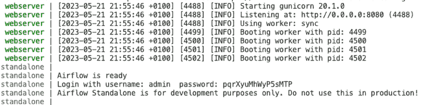
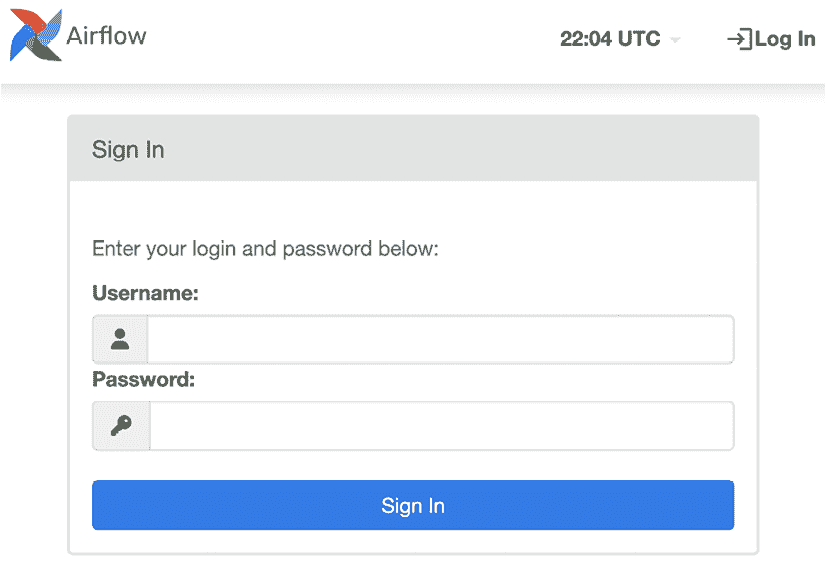
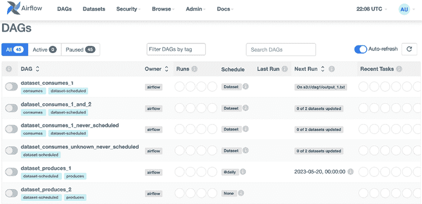
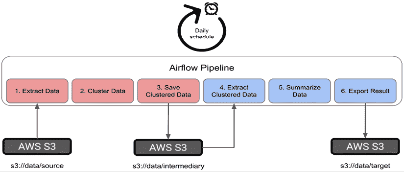
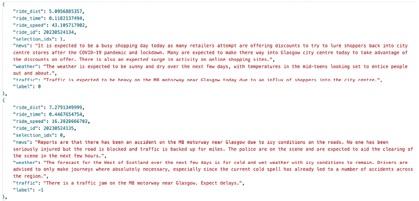
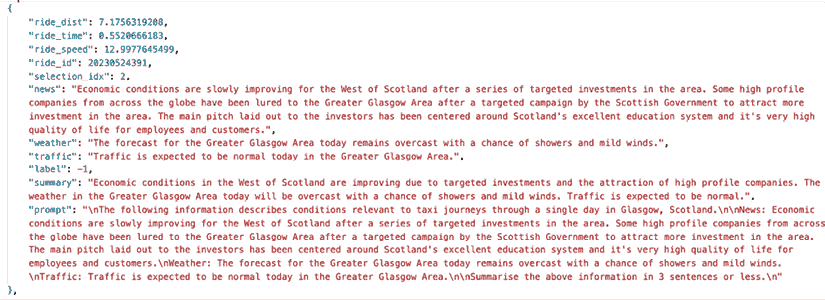
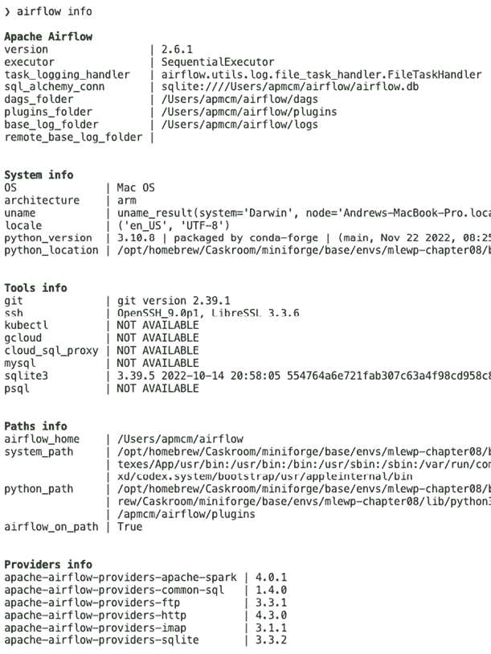
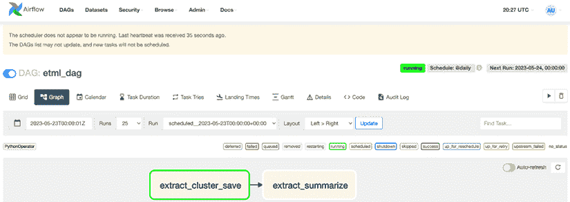
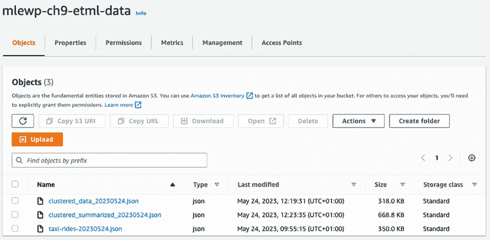

# 9

# 构建提取、转换、机器学习用例

与*第八章*，*构建一个示例 ML 微服务*类似，本章的目标将是尝试将我们在本书中学习到的许多工具和技术结晶化，并将它们应用于一个实际场景。这将是基于*第一章*，*机器学习工程导论*中引入的另一个用例，在那里我们想象了定期对出租车行程数据进行聚类的需求。为了探索本书中介绍的其他一些概念，我们还将假设对于每次出租车行程，还有一系列来自各种来源的文本数据，例如交通新闻网站和出租车司机与基地之间的通话记录，这些数据与核心行程信息合并。然后我们将这些数据传递给**大型语言模型**（**LLM**）进行总结。总结的结果可以随后保存在目标数据位置，与基本的行程日期一起提供对任何下游调查或分析出租车行程的重要背景信息。我们还将基于我们之前对 Apache Airflow 的知识，将其用作我们管道的编排工具，通过讨论一些更高级的概念来使你的 Airflow 作业更加健壮、可维护和可扩展。我们将探索这个场景，以便概述在现实世界中构建解决方案时我们会做出的关键决策，以及讨论如何通过利用其他章节中介绍的内容来实现它。

本用例将使我们能够探索可能是全球范围内在**机器学习**（**ML**）解决方案中最常用的模式——批量推理过程。由于检索、转换并在数据上执行机器学习的特性，我将这种模式称为**提取、转换、机器学习**（**ETML**）。

我们将在以下几节中逐步分析这个示例：

+   理解批量处理问题

+   设计 ETML 解决方案

+   选择工具

+   执行构建

所有这些主题都将帮助我们理解在构建成功的 ETML 解决方案时，我们需要做出的特定决策和步骤。

在下一节中，我们将回顾在*第一章*，*机器学习工程导论*中引入的总体问题，并探讨如何根据我们在本书中迄今为止所学到的所有内容，将业务需求映射到技术解决方案需求。

# 技术要求

如同其他章节一样，为了运行本章中的代码示例，你可以执行以下操作：

```py
conda env create –f mlewp-chapter09.yml 
```

这将包括 Airflow、PySpark 和一些支持包的安装。对于 Airflow 示例，我们可以在本地工作，并假设如果你想要部署到云端，可以遵循*第五章*，*部署模式和工具*中给出的细节。如果你已经运行了上述`conda`命令，那么你已经在本地安装了 Airflow、PySpark 和 Airflow PySpark 连接器包，因此你可以在终端中使用以下命令以独立方式运行 Airflow：

```py
airflow standalone 
```

这将实例化一个本地数据库和所有相关的 Airflow 组件。终端会有很多输出，但在第一次输出的最后阶段，你应该能够找到有关正在运行的本地服务器的详细信息，包括生成的用户 ID 和密码。请参见*图 9.1*的示例。



图 9.1：在独立模式下运行 Airflow 时创建的本地登录详情示例。正如消息所说，不要在生产环境中使用此模式！

如果你导航到提供的 URL（在截图的第二行中你可以看到应用正在`Listening at http://0.0.0.0:8080`），你会看到一个像*图 9.2*中显示的页面，在那里你可以使用本地用户名和密码登录（见*图 9.3*）。当你登录到 Airflow 的独立版本时，你会看到许多 DAGs 和作业的示例，你可以基于这些示例构建自己的工作负载。



图 9.2：在本地机器上运行的独立 Airflow 实例的登录页面。



图 9.3：登录到独立 Airflow 实例后的着陆页面。页面已填充了一系列示例 DAGs。

现在我们已经完成了一些初步设置，让我们在构建解决方案之前，讨论我们将尝试解决的问题的细节。

# 理解批量处理问题

在*第一章*，*机器学习工程导论*中，我们看到了一家出租车公司每天结束时分析异常行程的场景。客户有以下要求：

+   应根据行程距离和时间对行程进行聚类，并识别异常值/离群值。

+   速度（距离/时间）不应使用，因为分析师希望了解长途行程或持续时间较长的行程。

+   分析应按日计划进行。

+   推理所需的数据应从公司的数据湖中获取。

+   结果应可供其他公司系统消费。

根据本章引言中的描述，我们现在可以添加一些额外的要求：

+   系统的结果应包含有关行程分类以及相关文本数据的摘要。

+   只有异常行程需要总结文本数据。

正如我们在第二章“机器学习开发过程”和第八章“构建示例 ML 微服务”中所做的那样，我们现在可以根据这些需求构建一些用户故事，如下所示：

+   **用户故事 1**：作为一名运营分析师或数据科学家，我希望在考虑每趟行程的分钟数和英里数时，能够得到异常行程的清晰标签，以便我可以对异常行程的量进行进一步的分析和建模。判断异常的标准应由适当的机器学习算法确定，该算法根据同一天的其它行程定义异常。

+   **用户故事 2**：作为一名运营分析师或数据科学家，我希望得到相关文本数据的摘要，以便我可以对一些行程异常的原因进行进一步的分析和建模。

+   **用户故事 3**：作为一名内部应用程序开发者，我希望所有输出数据都发送到一个中央位置，最好是云上，这样我就可以轻松地使用这些数据构建仪表板和其他应用程序。

+   **用户故事 4**：作为一名运营分析师或数据科学家，我希望能每天早上 9:00 之前收到一份报告。这份报告应清楚地显示哪些行程是异常的或根据所选机器学习算法定义的“正常”的。这将使我能够更新我的分析并向物流经理提供更新。

用户故事 1 应由我们的通用聚类方法处理，尤其是因为我们正在使用**基于密度的空间聚类应用噪声**（**DBSCAN**）算法，该算法为异常值提供标签*-1*。

用户故事 2 可以通过利用我们在第七章“深度学习、生成式 AI 和 LLMOps”中讨论的 LLM 功能来满足。我们可以将作为输入批次一部分提供的文本数据发送到具有适当格式提示的 GPT 模型；提示格式化可以使用 LangChain 或纯 Python 逻辑完成。

用户故事 3 意味着我们必须将结果推送到云上的某个位置，然后可以被数据工程管道或 Web 应用程序管道获取。为了尽可能灵活，我们将结果推送到一个指定的**亚马逊网络服务**（**AWS**）**简单存储服务**（**S3**）桶。我们最初将以**JavaScript 对象表示法**（**JSON**）格式导出数据，这在几个章节中已经提到，因为这是一种常用于应用开发且大多数数据工程工具都能读取的格式。

最终的用户故事 4 为我们提供了对系统所需调度指导。在这种情况下，需求意味着我们应该运行一个每日批量作业。

让我们将这些想法按照一些机器学习解决方案的技术要求进行表格化，如表 9.1 所示。

| **用户故事** | **详细信息** | **技术要求** |
| --- | --- | --- |
| 1 | 作为一名运营分析师或数据科学家，我希望得到具有异常长骑行时间或距离的骑行清晰的标签，以便我可以对异常骑行量进行进一步的分析和建模。 |

+   算法类型 = 异常检测/聚类/离群值检测。

+   特征 = 骑行时间和距离。

|

| 2 | 作为一名运营分析师或数据科学家，我希望得到相关文本数据的摘要，以便我可以对一些骑行异常的原因进行进一步的分析和建模。 |
| --- | --- |

+   算法类型 = 文本摘要。

+   可能的模型 = 类似 BERT 的转换器，以及类似 GPT 模型的 LLMs。

+   输入需求 = 格式化提示。

|

| 3 | 作为内部应用程序开发者，我希望所有输出数据都发送到一个中央位置，最好是云中，这样我就可以轻松地使用这些数据构建仪表板和其他应用程序。 | 系统输出目的地 = AWS 上的 S3。 |
| --- | --- | --- |
| 4 | 作为一名运营分析师或数据科学家，我希望在每天早上看到前一天骑行的输出数据，以便我可以更新我的分析并向物流经理提供更新。 | 批次频率 = 每天。 |

表 9.1：将用户故事转换为技术需求。

将一些用户故事转换为潜在的技术需求的过程是机器学习工程师的一项非常重要的技能，它确实可以帮助加快潜在解决方案的设计和实施。在本章的其余部分，我们将使用*表 9.1*中的信息，但为了帮助您练习这项技能，您能想到一些其他可能的用户故事以及这些故事可能转换成的技术需求吗？以下是一些启发性的思考：

+   公司的数据科学家可能想要尝试构建模型，根据骑行的时间和其他特征（包括文本数据中提到的任何交通问题）来预测客户满意度。他们可能多久需要一次这样的数据？他们需要哪些数据？他们具体会如何使用这些数据？

+   公司移动应用的开发者可能希望根据交通和天气条件为用户提供预期的骑行时间预测。他们如何做到这一点？数据可以批量提供，还是应该是一个事件驱动的解决方案？

+   高级管理层可能希望看到公司跨多个变量的表现报告，以便做出决策。他们可能希望看到哪些类型的数据？哪些机器学习模型能提供更多见解？数据需要多久准备一次，结果可以展示在哪些解决方案中？

现在我们已经完成了一些了解系统需要做什么以及它可能如何做的初步工作，我们现在可以开始将这些内容整合到一些初步的设计中。

# 设计 ETML 解决方案

需求明确指出我们需要一个解决方案，该解决方案接收一些数据，并使用机器学习推理对其进行增强，然后将数据输出到目标位置。我们提出的任何设计都必须封装这些步骤。这是任何 ETML 解决方案的描述，这也是机器学习世界中应用最广泛的模式之一。在我看来，它将在未来一段时间内保持重要，因为它特别适合机器学习应用，其中：

+   **延迟不是关键**：如果您可以按计划运行，并且没有高吞吐量或低延迟响应时间的要求，那么作为 ETML 批量运行是完全可接受的。

+   **您需要批量处理数据以进行算法原因**：这里我们将使用的聚类方法是一个很好的例子。在在线环境中执行聚类的确有方法，其中模型会随着新数据的到来而不断更新，但如果你将所有相关数据一起放在相关批次中，某些方法会更简单。类似的论点也适用于深度学习模型，这些模型需要在大批量的数据上并行处理 GPU 以实现最大效率。

+   **您没有事件或流机制可用**：许多组织可能仍然在批量模式下运行，仅仅是因为他们必须这样做！转移到适当平台以采用不同模式可能需要投资，而这可能并不总是可行的。

+   **这更简单**：与前面的观点相关，为您的团队设置基于事件或流系统可能需要一些学习，而批量处理相对直观且易于开始。

现在，让我们开始讨论设计。我们的设计必须涵盖的关键要素已在*表 9.1*中阐述。然后我们可以开始构建一个设计图，涵盖最重要的方面，包括开始确定用于哪些流程的技术。*图 9.4*显示了一个简化的设计图，开始这样做，并展示了我们如何使用 Airflow 管道从 S3 存储桶中提取数据，将我们的聚类数据存储在 S3 作为中间数据存储步骤，然后再使用 LLM 摘要文本数据，并将最终结果导出到我们的最终目标 S3 位置。



图 9.4：ETML 聚类和摘要系统的整体设计。整体流程的步骤 1-3 是聚类步骤，4-6 是摘要步骤。

在下一节中，我们将探讨一些潜在的工具体现在我们学习了前几章的内容后可以用来解决这个问题。

# 选择工具

对于这个例子，以及几乎每次我们遇到 ETML 问题时，我们的主要考虑因素归结为几个简单的事情，即选择我们需要构建的接口、我们需要用于在所需规模上执行转换和建模的工具，以及我们如何编排所有这些部件。接下来的几节将依次介绍这些内容。

## 接口和存储

当我们执行 ETML 的提取和加载部分时，我们需要考虑如何与存储我们数据的系统进行接口。重要的是，无论我们从哪个数据库或数据技术中提取，我们都应使用适当的工具以所需的规模和速度进行提取。在这个例子中，我们可以使用 AWS 上的 S3 进行我们的存储；我们的接口可以由 AWS `boto3` 库和 AWS CLI 来处理。请注意，我们还可以选择其他一些方法，其中一些在 *表 9.2* 中列出，并附有它们的优缺点。

| **潜在工具** | **优点** | **缺点** |
| --- | --- | --- |
| AWS CLI、S3 和 `boto3` |

+   相对简单易用，并有广泛的文档。

+   连接到广泛的 AWS 工具和服务。

|

+   非云无关。

+   不适用于其他环境或技术。

|

| SQL 数据库和 JDBC/ODBC 连接器 |
| --- |

+   相对工具无关。

+   跨平台和云。

+   优化存储和查询是可能的。

|

+   需要数据建模和数据库管理。

+   不适用于非结构化数据。

|

| 通过他们的 API 提供的供应商云数据仓库 |
| --- |

+   通常有良好的文档和示例可供参考。

+   有良好的优化。

+   现代平台与其他广泛使用的平台有良好的连接性。

+   可在多个云中提供托管服务。

|

+   需要数据建模和数据库管理。

+   有时可以支持非结构化数据，但实现起来并不总是容易。

+   可能很昂贵。

|

表 9.2：ETML 解决方案的数据存储和接口选项，以及一些潜在的优缺点。

基于这些选项，使用 AWS CLI、S3 和 `boto3` 包似乎将是提供最大灵活性的最简单机制。在下一节中，我们将考虑围绕我们建模方法可扩展性必须做出的决策。当处理可能极其庞大的数据批次时，这一点非常重要。

## 模型扩展

在 *第六章*，*扩展规模* 中，我们讨论了一些扩展我们的分析和 ML 工作负载的机制。我们应该问自己是否这些或甚至其他方法适用于当前的使用案例，并相应地使用它们。这也同样适用：如果我们正在查看相对较小的数据量，就没有必要配置大量基础设施，可能也不需要花费时间创建非常优化的处理。每个案例都应根据自己的优点和背景进行审查。

我们在 *表 9.3* 中列出了一些解决方案聚类部分的选项及其优缺点。

| **潜在工具** | **优点** | **缺点** |
| --- | --- | --- |
| Spark ML | 可以扩展到非常大的数据集。 | 需要集群管理。对于较小的数据集或处理需求可能有较大的开销。算法集相对有限。 |
| 使用 pandas **用户定义函数**（**UDF**）的 Spark | 可以扩展到非常大的数据集。可以使用任何基于 Python 的算法。 | 对于某些问题，可能不适用于并行化。 |
| Scikit-learn | 许多数据科学家都很熟悉。可以在许多不同类型的基础设施上运行。训练和服务的开销很小。 | 并非本质上可扩展。 |
| Ray AIR 或 Ray Serve | 相对容易使用的 API。与许多机器学习库的良好集成。 |

+   需要使用新型集群（Ray 集群）进行集群管理。

+   对机器学习工程师来说，需要掌握新的技能集。

|

表 9.3：ETML 解决方案建模部分的选项，包括其优缺点，特别关注可扩展性和易用性。

考虑到这些选项，并且假设数据量对于这个例子来说并不大，我们可以舒适地坚持使用 Scikit-learn 建模方法，因为这提供了最大的灵活性，并且可能最容易为团队中的数据科学家所使用。需要注意的是，如果需要更多可扩展的行为，Scikit-learn 代码转换为在 Spark 中使用 pandas UDF 可以在稍后日期完成，工作量不会太大。

然而，如上所述，聚类只是 ETML 解决方案中“机器学习”的一部分，另一部分是文本摘要部分。一些潜在选项及其优缺点在 *表 9.4* 中展示。

| **潜在工具** | **优点** | **缺点** |
| --- | --- | --- |
| OpenAI 的 GPT-X 模型（或另一个供应商） |

+   简单易用 – 我们已经在 *第七章*，*深度学习、生成式 AI 和 LLMOps* 中遇到过。

+   可能是可用的最高性能的模型。

|

+   可能会变得昂贵。

+   对模型的控制不如开源 LLM 强。

+   数据和模型的可视性不足。

|

| 开源 LLM |
| --- |

+   数据和模型的可追溯性更透明。

+   更稳定（你控制着模型）。

|

+   需要大量基础设施。

+   如果需要优化，则需要非常专业的技能。

+   需要更多的运营管理（LLMOps）。

|

| 任何其他非 LLM 的深度学习模型，例如，BERT 变体 |
| --- |

+   比一些开源的 LLM 更容易设置。

+   广泛研究和记录。

+   更容易重新训练和微调（较小的模型）。

+   可用 Vanilla MLOps。

+   可能不需要提示工程。

|

+   比 API 调用有更多的运营开销（但比托管 LLM 少）。

+   性能较低。

|

表 9.4：EMTL 解决方案文本摘要组件的工具选项。

现在我们已经探讨了关于可扩展机器学习模型我们需要做出的工具决策，我们将转向 ETML 解决方案中的另一个重要主题——我们如何管理批量处理的调度。

## ETML 管道调度

ETML 对应的批量处理类型通常与日常批量处理很好地结合，但鉴于前面提到的其他两点，我们可能需要小心安排我们的作业时间——例如，我们的管道中的一个步骤可能需要连接到一个没有读副本（仅用于读取的数据库副本）的生产数据库。如果是这种情况，那么如果我们周一早上 9 点开始对该数据库进行大量查询，我们可能会对使用该数据库的任何解决方案的用户造成重大性能问题。同样，如果我们整夜运行并希望将数据加载到正在经历其他批量上传过程的系统中，我们可能会造成资源争用，从而减慢处理速度。这里没有**一刀切**的答案；重要的是要考虑你的选项。我们在以下表格中查看了一些我们在本书中遇到的工具在处理此类问题的调度和作业管理方面的优缺点：

| **潜在工具** | **优点** | **缺点** |
| --- | --- | --- |
| Apache Airflow |

+   良好的调度管理。

+   相对易于使用的 API。

+   良好的文档。

+   提供云托管服务，例如 AWS 的**Apache Airflow 托管工作流**（**MWAA**）。

+   在 ML、数据工程和其他工作负载中具有灵活性。

|

+   测试管道可能需要花费时间。

+   如 MWAA 之类的云服务可能成本较高。

+   Airflow 相对通用（可能也是一个优点），并且没有太多针对 ML 工作负载的特定功能。

|

| ZenML |
| --- |

+   相对易于使用的 API。

+   良好的文档。

+   为 ML 工程师设计。

+   多个有用的 MLOps 集成。

+   提供云选项。

|

+   测试管道可能需要花费时间。

+   相比 Airflow，学习曲线稍微陡峭一些。

|

| Kubeflow |
| --- |

+   相对易于使用的 API。

+   良好的文档。

+   如果需要，可以显著简化 Kubernetes 的使用。

|

+   需要 AWS 变体才能在 AWS 上使用。

+   相比其他工具，学习曲线稍微陡峭一些。

+   由于底层使用 Kubernetes，有时可能更难调试。

|

表 9.5：使用 Apache Airflow 管理我们的调度的优缺点。

根据我们在*表 9.3*、*9.4*和*9.5*中的内容，所有考虑的选项都有很强的优点，而不是太多缺点。这意味着有许多可能的技术组合可以帮助我们解决问题。我们问题的要求规定，我们需要处理相对较小的数据集，每天需要批量处理，首先使用某种聚类或异常检测算法，然后再使用 LLM 进行进一步分析。我们可以看到，选择`scikit-learn`作为建模包，通过 API 调用的 OpenAI 的 GPT 模型，以及 Apache Airflow 进行编排，可以满足需求。再次强调，这并不是我们唯一可能选择的组合。你可能觉得有趣，可以尝试本章后面我们讨论的例子，并尝试一些其他工具。知道多种完成某事的方法是 ML 工程师的关键技能，这可以帮助你适应许多不同的情况。

下一节将讨论，根据这些信息，我们如何进行解决方案的执行。

# 执行构建

在本例中，构建过程的执行将非常依赖于我们如何将*第一章*，*机器学习工程导论*中展示的**概念验证**代码拆分成可以被其他调度工具（如 Apache Airflow）调用的组件。

这将展示我们如何应用我们在整本书中学到的某些 ML 工程技能。在接下来的几节中，我们将专注于如何构建一个利用一系列不同 ML 能力的 Airflow 管道，仅用几行代码就创建一个相对复杂的解决方案。

## 使用高级 Airflow 功能构建 ETML 管道

我们已经在*第五章*，*部署模式和工具*中详细讨论了 Airflow，但那时我们更多地覆盖了如何在云上部署你的 DAGs 的细节。在这里，我们将专注于在 DAGs 中构建更高级的功能和控制流程。我们在这里本地工作，基于这样的理解：当你想要部署时，你可以使用*第五章*中概述的过程。

首先，我们将探讨一些良好的 DAG 设计实践。其中许多是我们在整本书中讨论的一些良好软件工程实践的直接应用；为了对这些进行良好回顾，你可以回到*第四章*，*打包*。在这里，我们将强调这些如何应用于 Airflow：

+   **将关注点分离应用于你的任务**：如第四章所述，关注点分离主要是确保特定的代码块或软件执行特定的功能，且重叠最小。这也可以用“原子性”来表述，即用具体的、专注的功能“原子”来构建你的解决方案。在 Airflow DAGs 的层面，我们可以通过确保我们的 DAGs 由每个案例都有一个明确任务的作业来体现这一原则。因此，在这个例子中，我们清楚地有“提取”、“转换”、“机器学习”和“加载”阶段，对于每个阶段都有特定的任务是合理的。根据这些任务的复杂性，它们甚至可能进一步拆分。这也帮助我们创建良好的控制流程和错误处理，因为对于更小、更原子化的代码块来说，预测、测试和管理故障模式要容易得多。我们将在本节中的代码示例中看到这一点。

+   **使用重试**：你可以向 Airflow 步骤传递几个参数，这些参数有助于控制任务在不同情况下的操作。这个概念的一个重要方面是“重试”，它告诉任务在出现失败时再次尝试该过程。这是一种在系统中内置一些弹性的好方法，因为一个过程中的暂时性失败可能有各种原因，例如，如果它包括通过 HTTP 的 REST API 调用，那么网络连接可能会下降。你还可以在重试之间引入延迟，甚至指数退避，即重试之间的时间延迟逐渐增加。如果你遇到有速率限制的 API，这可能很有帮助，例如，指数退避意味着系统被允许再次访问端点。

+   **在你的 DAGs 中强制执行幂等性**：幂等性是指代码在多次运行相同输入时返回相同结果的质量。很容易假设大多数程序都是这样工作的，但这绝对不是事实。在这本书中，我们已经广泛使用了包含内部状态的 Python 对象，例如`scikit-learn`中的机器学习模型或 PyTorch 中的神经网络。这意味着不能想当然地认为幂等性是解决方案的一个特性。幂等性非常有用，尤其是在 ETML 管道中，因为它意味着如果你需要执行重试，你知道这不会导致意外的副作用。你可以在 DAG 的层面通过强制执行组成 DAG 的任务的幂等性来强制执行幂等性。对于 EMTL 应用程序来说，挑战在于我们显然有机器学习模型，正如我刚才提到的，这可能会对这一概念构成挑战！因此，需要一些思考来确保重试和管道的机器学习步骤可以很好地协同工作。

+   **利用 Airflow 操作符和提供者包生态系统**：Airflow 附带了一系列操作符，可以执行各种任务，还有几个包旨在帮助与其他工具集成，称为*提供者包*。这里的建议是**使用它们**。这涉及到*第四章*，*打包*中讨论的“不要重复造轮子”的观点，并确保你可以专注于构建适合你的工作负载和系统的适当逻辑，而不是创建样板式的集成。例如，我们可以使用 Spark 提供者包。我们可以通过以下方式安装它：

    ```py
    pip install apache-airflow
    pip install pyspark
    pip install apache-airflow-providers-apache-spark 
    ```

    然后，在 DAG 中，我们可以提交一个 Spark 应用程序，例如一个名为`spark-script.py`的脚本中包含的应用程序，以以下方式运行：

    ```py
    from datetime import datetime
    from airflow.models import DAG
    from airflow.providers.apache.spark.operators.spark_jdbc import SparkJDBCOperator
    from airflow.providers.apache.spark.operators.spark_sql import SparkSqlOperator
    from airflow.providers.apache.spark.operators.spark_submit import SparkSubmitOperator

    DAG_ID = "spark_example"
    with DAG(
        dag_id=DAG_ID,
        schedule=None,
        start_date=datetime(2023, 5, 1),
        catchup=False,
        tags=["example"],
    ) as dag:
        submit_job = SparkSubmitOperator(
            application=\
               "${SPARK_HOME}/examples/src/main/python/spark-script.py",
               task_id="submit_job"
        ) 
    ```

+   **使用** `with DAG() as dag`：在上面的例子中，你会看到我们使用了这种模式。这种上下文管理器模式是你可以定义 DAG 的三个主要方法之一，其他两种是使用 DAG 构造函数并将它传递给管道中的所有任务，或者使用装饰器将函数转换为 DAG。使用上下文管理器的意思是，就像在 Python 中任何使用它的场合一样，任何在上下文中定义的资源都会被正确清理，即使代码块因为异常而存在。使用构造函数的机制要求将`dag=dag_name`传递到管道中你定义的每个任务中，这相当繁琐。使用装饰器对于基本的 DAG 来说相当干净，但如果构建更复杂的 DAG，它可能会变得难以阅读和维护。

+   **记住要测试（!）**：在阅读完这本书的其余部分并成为自信的机器学习工程师之后，我可以听到你在页面上大喊，“关于测试呢？！”，你是对的，应该大喊。我们的代码只有在我们能对其运行的测试中才是好的。幸运的是，Airflow 提供了一些开箱即用的功能，使得可以在本地测试和调试你的 DAG。对于在 IDE 或编辑器中进行调试，如果你的 DAG 名为`dag`，就像上面的例子一样，你只需要将以下片段添加到你的 DAG 定义文件中，就可以在选择的调试器中运行 DAG，在本地序列化的 Python 进程中。这不会运行调度器；它只是在单个进程中运行 DAG 步骤，这意味着它会快速失败，并给开发者提供快速反馈：

    ```py
    if __name__ == "__main__":
        dag.test() 
    ```

    我们也可以像在*第四章*，*打包*，以及书中的其他地方所做的那样使用`pytest`。

既然我们已经讨论了一些我们可以使用的重要概念，我们将开始详细构建 Airflow DAG，并且我们将尝试以展示如何将一些弹性构建到解决方案中的方式来完成这项工作。

首先，重要的是要注意，对于这个例子，我们实际上将执行 ETML 流程两次：一次用于聚类组件，一次用于文本摘要。这样做意味着我们可以在步骤之间使用 *中间存储*，在这种情况下，再次使用 AWS S3，以便在系统中引入一些弹性。这是因为如果第二步失败，并不意味着第一步的处理丢失。我们将以相对直接的方式展示这个例子，但就像本书中始终强调的那样，请记住，这些概念可以扩展和适应您选择的工具和流程，只要基本原理保持稳固。

让我们开始构建这个 DAG！这是一个相对简短的 DAG，只包含两个任务；我们将首先展示 DAG，然后详细说明：

```py
from __future__ import annotations
import datetime
import pendulum
from airflow import DAG
from airflow.operators.python import PythonOperator
from utils.summarize import LLMSummarizer
from utils.cluster import Clusterer
import logging

logging.basicConfig(level=logging.INFO)

# Bucket name could be read in as an environment variable.
bucket_name = "etml-data"
date = datetime.datetime.now().strftime("%Y%m%d")
file_name = f"taxi-rides-{date}.json"

with DAG(
    dag_id="etml_dag",
    start_date=pendulum.datetime(2021, 10, 1),
    schedule_interval="@daily",
    catchup=False,
) as dag:
    logging.info("DAG started ...")
    logging.info("Extracting and clustering data ...")
    extract_cluster_load_task = PythonOperator(
        task_id="extract_cluster_save",
        python_callable=Clusterer(bucket_name, file_name).\
                                  cluster_and_label,
        op_kwargs={"features": ["ride_dist", "ride_time"]}
    )

    logging.info("Extracting and summarizing data ...")
    extract_summarize_load_task = PythonOperator(
        task_id="extract_summarize",
        python_callable=LLMSummarizer(bucket_name, file_name).summarize
    )

    extract_cluster_load_task >> extract_summarize_load_task 
 sequentially after one another using the >> operator. Each task performs the following pieces of work:
```

+   `extract_cluster_load_task`: 此任务将从适当的 S3 存储桶中提取输入数据，并使用 DBSCAN 进行一些聚类，然后将原始数据与模型输出连接到中间存储位置。为了简单起见，我们将使用相同的存储桶作为中间存储，但这可以是任何您有连接性的位置或解决方案。

+   `extract_summarize_load_task`: 同样，这里的第一个步骤是使用 boto3 库从 S3 中提取数据。接下来的步骤是将数据取出，然后调用适当的 LLM 对数据中选定的文本字段进行摘要，特别是那些包含关于批次运行当天当地新闻、天气和交通报告的信息的字段。

在阅读 DAG 后，您可能会注意到 DAG 定义之所以如此简短，是因为我们将大部分逻辑抽象到了辅助模块中，这符合保持简单、分离关注点和应用模块化的原则。请参阅 *第四章*，*打包*，以深入了解这些和其他重要概念。

我们在 DAG 中使用的第一个组件是 `utils.cluster` 下的 `Clusterer` 类的功能。此类的完整定义如下。为了简洁起见，我省略了标准导入：

```py
import boto3
from sklearn.preprocessing import StandardScaler
from sklearn.cluster import DBSCAN
from utils.extractor import Extractor

model_params = {
    'eps': 0.3,
    'min_samples': 10,
}

class Clusterer:
    def __init__(
        self, bucket_name: str, 
        file_name: str, 
        model_params: dict = model_params
    ) -> None:
        self.model_params = model_params
        self.bucket_name = bucket_name
        self.file_name = file_name

    def cluster_and_label(self, features: list) -> None:
        extractor = Extractor(self.bucket_name, self.file_name)
        df = extractor.extract_data()
        df_features = df[features]
        df_features = StandardScaler().fit_transform(df_features)
        db = DBSCAN(**self.model_params).fit(df_features)
        # Find labels from the clustering
        core_samples_mask = np.zeros_like(db.labels_, dtype=bool)
        core_samples_mask[db.core_sample_indices_] = True
        labels = db.labels_
        # Add labels to the dataset and return.
        df['label'] = labels

        date = datetime.datetime.now().strftime("%Y%m%d")
        boto3.client('s3').put_object(
            Body=df.to_json(orient='records'), 
            Bucket=self.bucket_name, 
            Key=f"clustered_data_{date}.json"
        ) 
```

注意，类的构造函数包含对默认 `model_params` 集合的引用。这些可以从配置文件中读取。我已在此处包含它们以供参考。类内的实际聚类和标记方法相对简单；它只是标准化传入的特征，应用 DBSCAN 聚类算法，然后导出最初提取的数据集，现在包括聚类标签。一个需要注意的重要点是，用于聚类的特征以列表的形式提供，这样就可以在未来扩展，或者如果可用更丰富的聚类数据，只需通过更改提供给 DAG 中第一个任务的 `PythonOperator` 对象的 `op_kwargs` 参数即可。

在第一个任务成功运行后，该任务使用 `Clusterer` 类，会生成一个 JSON 文件，其中包含源记录及其聚类标签。在 *图 9.5* 中给出了生成的文件中的两个随机示例。



图 9.5：ETML 流程中聚类步骤后生成的两个示例记录。

您可能已经注意到，在这个示例的顶部，还导入了另一个实用工具类，即来自 `utils.extractor` 模块的 `Extractor` 类。这只是一个围绕一些 `boto3` 功能的包装器，定义如下：

```py
import pandas as pd
import boto3

class Extractor:
    def __init__(self, bucket_name: str, file_name: str) -> None:
        self.bucket_name = bucket_name
        self.file_name = file_name

    def extract_data(self) -> pd.DataFrame:
        s3 = boto3.client('s3')
        obj = s3.get_object(Bucket=self.bucket_name, Key=self.file_name)
        df = pd.read_json(obj['Body'])
        return df 
```

现在，让我们继续定义 DAG 中使用的另一个类，即来自 `utils.summarize` 模块的 `LLMSummarizer` 类：

```py
openai.api_key = os.environ['OPENAI_API_KEY']

class LLMSummarizer:
    def __init__(self, bucket_name: str, file_name: str) -> None:
        self.bucket_name = bucket_name
        self.file_name = file_name

    def summarize(self) -> None:
        extractor = Extractor(self.bucket_name, self.file_name)
        df = extractor.extract_data()
        df['summary'] = ''

        df['prompt'] = df.apply(
                    lambda x:self.format_prompt(
                        x['news'],
                        x['weather'],
                        x['traffic']
                    ),
                    axis=1
        )
        df.loc[df['label']==-1, 'summary'] = df.loc[df['label']==-1,
               'prompt'].apply(lambda x: self.generate_summary(x))
        date = datetime.datetime.now().strftime("%Y%m%d")
        boto3.client('s3').put_object(
            Body=df.to_json(orient='records'), 
            Bucket=self.bucket_name, 
            Key=f"clustered_summarized_{date}.json"
        )

    def format_prompt(self, news: str, weather: str, traffic: str) -> str:
        prompt = dedent(f'''
            The following information describes conditions relevant to
            taxi journeys through a single day in Glasgow, Scotland.
            News: {news}
            Weather: {weather}
            Traffic: {traffic}
            Summarise the above information in 3 sentences or less.
            ''')
        return prompt

    def generate_summary(self, prompt: str) -> str:
        # Try chatgpt api and fall back if not working
        try:
            response = openai.ChatCompletion.create(
                model = "gpt-3.5-turbo",
                temperature = 0.3,
                messages = [{"role": "user", "content": prompt}]
            )
            return response.choices[0].message['content']
        except:
            response = openai.Completion.create(
                model="text-davinci-003",
                prompt = prompt
            )
            return response['choices'][0]['text'] 
```

您可以看到，这个类遵循与 `Clusterer` 类相似的设计模式，但现在我们利用的方法是提示我们选择的 OpenAI LLM，使用我们硬编码的标准模板。同样，这个提示模板可以提取出来，与解决方案一起打包到一个配置文件中，但在这里展示是为了可见性。提示要求 LLM 概括提供的有关当地新闻、天气和交通报告的相关上下文信息，以便我们有一个简洁的摘要，可用于下游分析或用于用户界面。最后，需要注意的是，生成摘要的方法，它封装了对 OpenAI API 的调用，有一个 `try except` 子句，如果第一个模型调用遇到任何问题，将允许回退到不同的模型。截至 2023 年 5 月，OpenAI API 在延迟和速率限制方面仍然显示出一些脆弱性，因此这样的步骤允许您构建更健壮的工作流程。

在运行 DAG 时应用 `LLMSummarizer` 类的一个示例输出在 *图 9.6* 中给出。



图 9.6：LLMSummarizer 的一个示例输出；您可以看到它接收新闻、天气和交通信息，并生成一个简洁的摘要，可以帮助任何下游消费者理解整体交通状况的含义。

在这段代码中，一个潜在的优化区域是围绕所使用的提示模板，因为有可能进行一些很好的提示工程，以尝试使 LLM 的输出更加一致。您还可以使用我们在 *第七章* 中遇到的工具 LangChain，进行更复杂的模型提示。我将这留作读者的一项有趣练习。

现在我们已经定义了我们 DAG 及其使用的所有逻辑，我们实际上将如何配置它以运行，即使在独立模式下？当我们将在 *第四章* 中部署 DAG 到 **MWAA**，AWS 托管和管理的 Airflow 解决方案时，您可能还记得，我们必须将我们的 DAG 发送到一个指定的存储桶，然后由系统读取。

对于您自己的托管或本地 Airflow 实例，同样适用；这次我们需要将 DAG 发送到 `$AIRFLOW_HOME` 文件夹中的 `dags` 文件夹。如果您没有明确为您的 Airflow 安装配置此文件夹，您将使用默认设置，通常位于您 `home` 目录下的名为 `airflow` 的文件夹中。要找到这个以及其他许多有用的信息，您可以执行以下命令，该命令将产生如 *图 9.7* 所示的输出：

```py
airflow info 
```



图 9.7：airflow info 命令的输出。

一旦您找到了 `$AIRFLOW_HOME` 文件夹的位置，如果还没有名为 `dags` 的文件夹，请创建一个。对于简单、自包含且不使用子模块的 DAG，您要做的只是将 DAG 复制到这个文件夹中，就像我们在 *第五章* 中的例子中将 DAG 发送到 S3 一样。由于我们在本例中使用了多个子模块，我们可以选择使用在 *第四章* 中开发的打包技术将它们作为包安装，并确保它们在 Airflow 环境中可用，或者我们可以简单地将子模块发送到同一个 `dags` 文件夹。为了简化，我们将这样做，但请查阅官方 Airflow 文档以获取有关此方面的详细信息。

一旦我们复制了代码，如果我们访问 Airflow UI，我们应该能够看到我们的 DAG，就像在 *图 9.8* 中所示。只要 Airflow 服务器正在运行，DAG 将按照提供的计划运行。您也可以在 UI 中手动触发运行以进行测试。



图 9.8：Airflow UI 中的 ETML DAG。

运行 DAG 将导致在 S3 存储桶中创建中间和最终输出 JSON 文件，如图 *图 9.9* 所示。



图 9.9：DAG 成功运行创建中间和最终 JSON 文件。

有了这些，我们现在已经构建了一个 ETML 管道，它接收一些出租车行程数据，根据行程距离和时间进行聚类，然后使用 LLM 对一些上下文信息进行文本摘要。

# 摘要

本章介绍了如何将本书中学到的许多技术应用到实际应用场景中，特别是从第二章《机器学习开发过程》、第三章《从模型到模型工厂》、第四章《打包》和第五章《部署模式和工具》中学习的技术。这个问题涉及将出租车行程进行聚类以寻找异常行程，然后对一些上下文文本数据进行自然语言处理（NLP），以尝试自动解释这些异常。这个问题是通过 ETML 模式解决的，我提出这个模式是为了合理化典型的批量机器学习工程解决方案。这一点已经详细解释。还涉及了一个潜在解决方案的设计，以及讨论了任何机器学习工程团队都必须经历的某些工具选择。最后，深入研究了使该解决方案达到生产就绪所需的一些关键工作。特别是，我们展示了如何使用良好的面向对象编程技术来封装跨越 Scikit-learn 包、AWS `boto3`库和 OpenAI API 的机器学习功能，以使用 LLMs 创建一些复杂的功能。我们还详细探讨了如何使用 Airflow 的更复杂功能来编排这些功能，使其具有弹性。

有了这些，你已经不仅完成了这一章节，还完成了《Python 机器学习工程》的第二版，所以恭喜你！在这本书中，我们涵盖了与机器学习工程相关的广泛主题，从如何组建团队以及可能的发展流程，一直到打包、扩展、调度、部署、测试、日志记录以及其中的一系列其他内容。我们探讨了 AWS 和管理的云服务，深入研究了开源技术，这些技术赋予你编排、管道化和扩展的能力，我们还探索了令人兴奋的新领域：大型语言模型（LLMs）、生成式 AI 和 LLMOps。

在这个快速变化、不断发展和令人兴奋的机器学习工程和 MLOps 世界中，有如此多的主题需要探讨，以至于一本书根本无法对整个领域做出公正的评价。然而，这一版试图通过提供一些我认为对培养下一代机器学习工程人才重要领域的更多广度和深度来改进第一版。我希望你在阅读这本书后不仅感到装备齐全，而且像我每天出去构建未来一样兴奋。如果你在这个领域工作，或者你正在进入这个领域，那么你正在经历的是我认为历史上一个真正独特的时间。随着机器学习系统需要不断变得更加强大、普遍和高效，我相信对机器学习工程技能的需求只会增长。我希望这本书已经为你提供了利用这一点的工具，并且你享受这段旅程的程度和我一样！

# 加入我们的 Discord 社区

加入我们社区的 Discord 空间，与作者和其他读者进行讨论：

[`packt.link/mle`](https://packt.link/mle)


